# ドキュメントデータベース — MongoDB・Firestoreに学ぶ柔軟なデータモデリング

## 1. ドキュメントモデルの特徴

### 1.1 リレーショナルモデルの限界と NoSQL の台頭

リレーショナルデータベース（RDBMS）は1970年代の E.F. Codd の論文以来、データ管理の標準として君臨してきた。正規化された表形式のデータは、整合性制約とトランザクションによって高い信頼性を実現する。しかし、2000年代後半のWeb 2.0時代に入り、以下の課題が顕在化した。

- **スキーマの硬直性**: テーブル定義の変更（`ALTER TABLE`）は大規模テーブルではロックを伴い、数時間のダウンタイムを引き起こすことがある
- **オブジェクト-リレーショナルインピーダンスミスマッチ**: アプリケーション側のオブジェクト構造と正規化されたテーブル群の間で、煩雑なマッピングが必要になる
- **水平スケーリングの困難さ**: JOIN操作を前提とする設計は、複数ノードにまたがるデータ分散と相性が悪い
- **半構造化データへの対応**: JSON/XMLなど、スキーマが固定されないデータをRDBMSで扱うには追加の工夫が必要になる

こうした背景から、用途に応じた特化型のデータストアが求められるようになり、NoSQL（Not Only SQL）ムーブメントが生まれた。その中でもっとも広く採用されているカテゴリの一つが**ドキュメントデータベース**である。

### 1.2 ドキュメントモデルとは

ドキュメントデータベースでは、データの基本単位は**ドキュメント**である。ドキュメントは JSON（またはその拡張形式）に類似した階層的なデータ構造であり、フィールド名と値のペアで構成される。

```json
{
  "_id": "user_001",
  "name": "田中太郎",
  "email": "tanaka@example.com",
  "address": {
    "prefecture": "東京都",
    "city": "渋谷区",
    "zip": "150-0001"
  },
  "orders": [
    {
      "order_id": "ord_101",
      "items": ["商品A", "商品B"],
      "total": 5800,
      "date": "2026-02-15"
    },
    {
      "order_id": "ord_102",
      "items": ["商品C"],
      "total": 3200,
      "date": "2026-03-01"
    }
  ],
  "tags": ["premium", "active"]
}
```

このドキュメントをRDBMSで表現するには `users`、`addresses`、`orders`、`order_items`、`user_tags` といった複数のテーブルが必要になる。ドキュメントモデルでは、これらが1つのドキュメントに自然に収まる。

### 1.3 ドキュメントモデルの主要な特性

| 特性 | 説明 |
|---|---|
| **スキーマレス（スキーマフレキシブル）** | 同一コレクション内のドキュメントが異なるフィールドを持てる |
| **階層構造のネスト** | オブジェクトや配列を自由にネストできる |
| **自己完結性** | 関連データを1ドキュメントに埋め込めるため、JOINが不要になる |
| **JSONネイティブ** | Webアプリケーションとのデータ交換がシームレス |
| **水平スケーリング** | ドキュメント単位でのシャーディングが自然に行える |

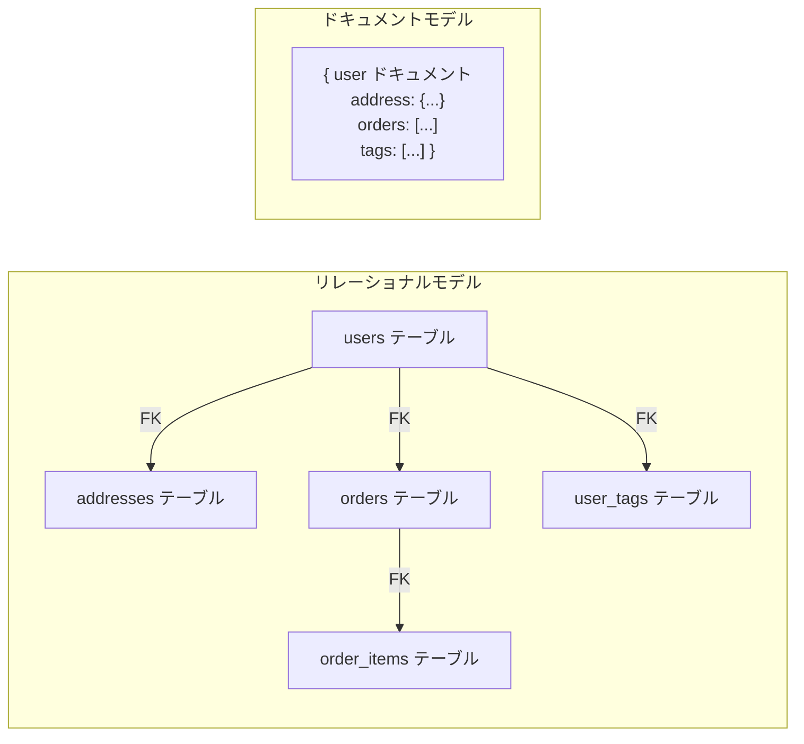

### 1.4 ドキュメントモデルのトレードオフ

ドキュメントモデルは万能ではない。以下のトレードオフを理解しておく必要がある。

- **データの重複**: 正規化しないことで、同じデータが複数のドキュメントに重複して格納される場合がある。更新時に一貫性を保つ責任がアプリケーション側に移る
- **結合操作の制限**: データベースレベルでのJOINが制限される（MongoDBでは `$lookup` があるが、RDBMSのJOINほど効率的ではない）
- **ドキュメントサイズの制限**: MongoDBでは1ドキュメントあたり16MBという制限がある
- **トランザクションの複雑さ**: マルチドキュメントトランザクションはサポートされるが、RDBMSほど成熟していない

## 2. MongoDBのアーキテクチャ

### 2.1 MongoDBの概要と歴史

MongoDBは2009年に10gen社（現MongoDB, Inc.）によってリリースされたドキュメントデータベースである。名前の由来は "humongous"（巨大な）の略であり、大規模データの取り扱いを設計目標としている。C++で実装されており、現在もっとも広く使われているドキュメントデータベースの一つである。

### 2.2 データの論理構造

MongoDBのデータは以下の階層で整理される。

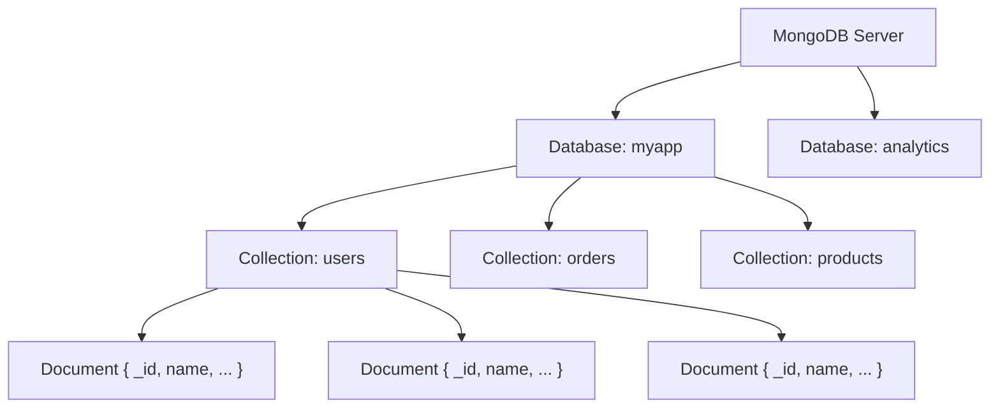

| RDBMS の概念 | MongoDB の対応概念 |
|---|---|
| Database | Database |
| Table | Collection |
| Row | Document |
| Column | Field |
| Primary Key | `_id` フィールド |
| JOIN | `$lookup`（制限付き） |
| Index | Index |

すべてのドキュメントには `_id` フィールドが必須であり、指定しない場合はMongoDBが自動的に `ObjectId` を生成する。`ObjectId` は12バイトの値で、以下の構造を持つ。

```
|  4 bytes  |  5 bytes   |  3 bytes  |
| timestamp | random     | counter   |
```

- **タイムスタンプ**（4バイト）: ドキュメント作成時のUnixタイムスタンプ（秒単位）
- **ランダム値**（5バイト）: プロセスごとに一度生成されるランダム値
- **カウンター**（3バイト）: ランダムな初期値から始まるインクリメンタルなカウンター

この設計により、`ObjectId` はグローバルに一意であり、おおよその作成時刻順にソートできるという特性を持つ。

### 2.3 ストレージエンジン: WiredTiger

MongoDB 3.2以降、デフォルトのストレージエンジンは**WiredTiger**である。WiredTigerはもともとは独立したプロジェクトであったが、2014年にMongoDB社に買収された。

WiredTigerの主な特徴は以下の通りである。

- **B-Treeベースのストレージ**: データとインデックスの両方にB-Treeを使用する
- **ドキュメントレベルの並行制御**: ロックの粒度がドキュメント単位であり、高い並行性を実現する
- **圧縮**: snappyまたはzlibによるブロック圧縮、およびプレフィックス圧縮をサポートする
- **Write-Ahead Logging（WAL）**: ジャーナリングにより障害復旧を保証する
- **MVCC**: Multi-Version Concurrency Controlにより、読み取りと書き込みが互いをブロックしない

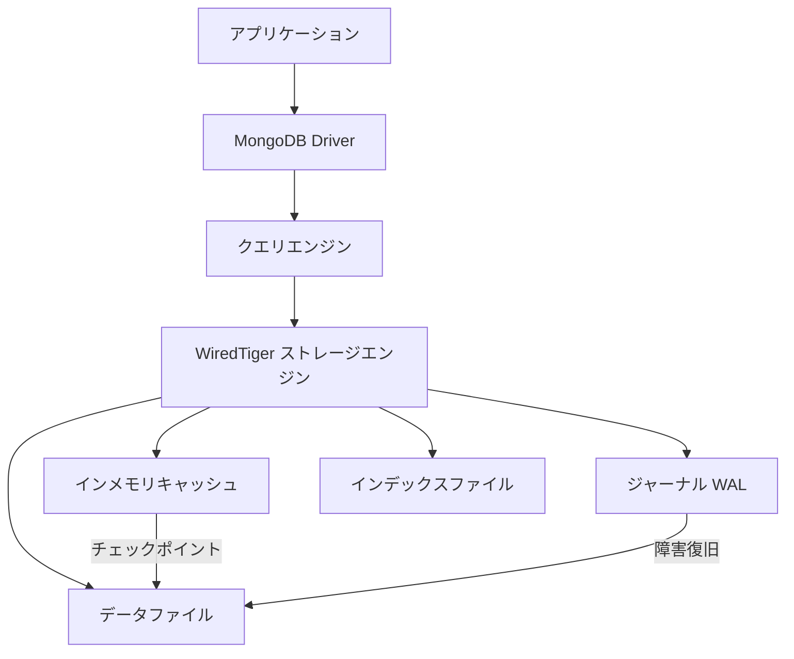

WiredTigerは内部キャッシュ（デフォルトで利用可能メモリの50%または256MBの大きい方）を持ち、頻繁にアクセスされるデータをメモリ上に保持する。定期的なチェックポイント（デフォルト60秒間隔）でメモリ上の変更をディスクに永続化する。チェックポイント間の変更はジャーナルに記録されるため、障害発生時にはジャーナルからリプレイして復旧できる。

### 2.4 レプリカセット

MongoDBは**レプリカセット**と呼ばれる仕組みで高可用性を実現する。レプリカセットは、同一データのコピーを保持する複数のMongoDBインスタンスのグループである。

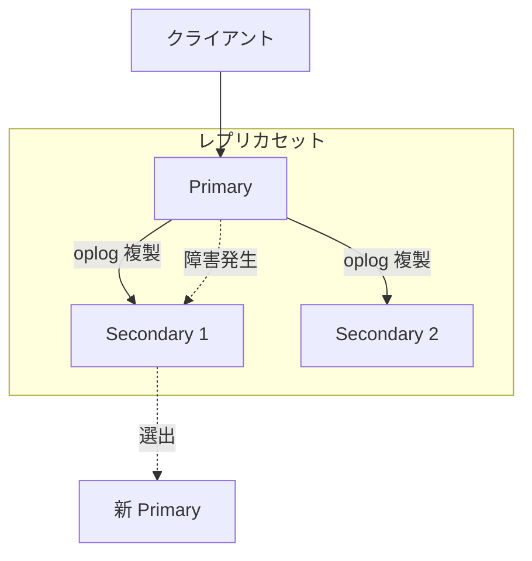

- **Primary**: すべての書き込み操作を受け付ける唯一のノード
- **Secondary**: Primaryの**oplog**（operation log）を非同期にレプリケーションして、データのコピーを保持する
- **自動フェイルオーバー**: Primaryが応答しなくなった場合、Secondaryノード間の投票により新しいPrimaryが選出される。フェイルオーバーは通常10〜30秒で完了する

書き込みの確認レベルは**Write Concern**で制御する。

| Write Concern | 意味 |
|---|---|
| `w: 0` | 書き込みの確認を待たない（Fire-and-forget） |
| `w: 1` | Primaryへの書き込み完了を確認 |
| `w: "majority"` | レプリカセットの過半数への書き込み完了を確認 |
| `j: true` | ジャーナルへの書き込み完了を確認 |

同様に、読み取りの一貫性は**Read Concern**で制御する。

| Read Concern | 意味 |
|---|---|
| `local` | ノードのローカルデータを返す（ロールバックされる可能性あり） |
| `majority` | 過半数のノードに確認されたデータのみ返す |
| `linearizable` | 線形化可能な読み取りを保証（最も強い一貫性） |

## 3. BSONフォーマット

### 3.1 BSONとは

**BSON**（Binary JSON）は、MongoDBが内部的にドキュメントをエンコードするために使用するバイナリ形式である。JSONを拡張したものであり、以下の設計目標を持つ。

- **軽量性**: エンコード・デコードのオーバーヘッドを最小限に抑える
- **走査性**: ドキュメント全体をパースせずに、特定のフィールドに素早くアクセスできる
- **型の拡張**: JSONでは表現できない型（日付、バイナリ、正規表現、Decimalなど）をサポートする

### 3.2 BSONのバイナリ構造

BSONドキュメントのバイナリレイアウトは以下の通りである。

```
+----------------+------------------------+------------------------+-----+----+
| document_size  | element_1              | element_2              | ... | \0 |
| (4 bytes, LE)  | type + name + value    | type + name + value    |     |    |
+----------------+------------------------+------------------------+-----+----+
```

各エレメントは以下で構成される。

```
+------+------------------+-------+
| type | field_name + \0  | value |
| 1B   | C string         | 可変  |
+------+------------------+-------+
```

`document_size` フィールドが先頭にあるため、ドキュメントの境界をパースなしに特定できる。また、各要素に型情報が付与されているため、値のサイズを事前に知ることができ、不要なフィールドをスキップしながら目的のフィールドまで高速に到達できる。

### 3.3 BSONの型システム

BSONはJSONの型に加え、データベースで必要な多くの型をサポートする。

| 型名 | 型コード | 説明 |
|---|---|---|
| Double | 0x01 | 64ビット浮動小数点数 |
| String | 0x02 | UTF-8文字列 |
| Embedded Document | 0x03 | ネストされたドキュメント |
| Array | 0x04 | 配列（内部的にはキーが "0", "1", ... のドキュメント） |
| Binary | 0x05 | バイナリデータ |
| ObjectId | 0x07 | 12バイトの一意識別子 |
| Boolean | 0x08 | true / false |
| Date | 0x09 | ミリ秒精度のUnixタイムスタンプ（64ビット） |
| Null | 0x0A | null値 |
| Regular Expression | 0x0B | 正規表現 |
| 32-bit Integer | 0x10 | 32ビット整数 |
| Timestamp | 0x11 | MongoDB内部用タイムスタンプ |
| 64-bit Integer | 0x12 | 64ビット整数 |
| Decimal128 | 0x13 | 128ビット十進浮動小数点数 |

### 3.4 JSONとBSONの比較

```json
// JSON representation
{"name": "田中", "age": 30}
```

上記のJSONをBSONにエンコードすると、以下のようなバイナリ列になる（概念的な表現）。

```
\x27\x00\x00\x00              // document size: 39 bytes
\x02                           // type: string
name\x00                       // field name
\x07\x00\x00\x00              // string length: 7 bytes
\xe7\x94\xb0\xe4\xb8\xad\x00  // "田中" in UTF-8 + null terminator
\x10                           // type: int32
age\x00                        // field name
\x1e\x00\x00\x00              // value: 30
\x00                           // document terminator
```

| 観点 | JSON | BSON |
|---|---|---|
| フォーマット | テキスト | バイナリ |
| パース速度 | 遅い（文字列の解釈が必要） | 速い（型情報が付与済み） |
| サイズ | 一般にコンパクト | 型情報のオーバーヘッドあり |
| 型の豊富さ | 文字列・数値・真偽値・null・配列・オブジェクト | 左記 + Date・Binary・ObjectId・Decimal128等 |
| 走査性 | 全体のパースが必要 | 部分的な走査が可能 |
| 人間可読性 | 高い | 低い |

BSONはJSONより**サイズが大きくなる場合がある**が、これはトレードオフとして許容されている。データベースの内部形式として重要なのはパース速度と走査性であり、これらの点でBSONはJSONを大きく上回る。

## 4. インデックス設計

### 4.1 インデックスの重要性

ドキュメントデータベースにおいても、インデックスはクエリ性能を左右する最も重要な要素である。インデックスがなければ、MongoDBはクエリのたびにコレクション全体を走査（**コレクションスキャン**）する必要がある。

MongoDBのインデックスはB-Tree構造で実装されており、RDBMSのインデックスと同様の原理で動作する。

### 4.2 インデックスの種類

MongoDBは多様なインデックス型をサポートする。

#### シングルフィールドインデックス

もっとも基本的なインデックスで、単一のフィールドに対して作成する。

```javascript
// Create a single field index
db.users.createIndex({ email: 1 })  // 1 = ascending, -1 = descending
```

#### 複合インデックス（Compound Index）

複数のフィールドを組み合わせたインデックスである。フィールドの順序が重要であり、**ESR（Equality, Sort, Range）ルール**に従って設計するのが望ましい。

```javascript
// Compound index: status (equality), created_at (sort), age (range)
db.users.createIndex({ status: 1, created_at: -1, age: 1 })
```

ESRルールとは、複合インデックスのフィールドを以下の順序で配置する経験則である。

1. **Equality**（等価条件）: `{ status: "active" }` のような完全一致条件のフィールドを先頭に
2. **Sort**（ソート条件）: `sort({ created_at: -1 })` のようなソートに使うフィールドを次に
3. **Range**（範囲条件）: `{ age: { $gte: 20, $lte: 40 } }` のような範囲条件のフィールドを最後に

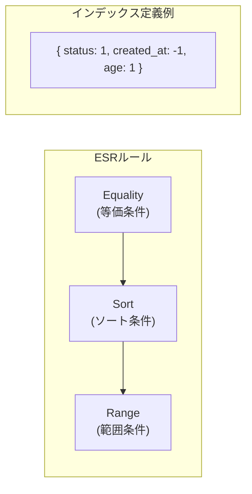

#### マルチキーインデックス

配列フィールドに対するインデックスである。配列の各要素に対してインデックスエントリが作成される。

```javascript
// Index on array field
db.products.createIndex({ tags: 1 })

// This query can use the multikey index
db.products.find({ tags: "electronics" })
```

#### テキストインデックス

全文検索のためのインデックスである。ステミング（語幹抽出）やストップワードの除去を行い、テキスト検索を可能にする。

```javascript
// Text index
db.articles.createIndex({ title: "text", body: "text" })

// Full-text search query
db.articles.find({ $text: { $search: "ドキュメント データベース" } })
```

#### 地理空間インデックス

位置情報データに対するインデックスで、`2dsphere`（球面座標）と `2d`（平面座標）の2種類がある。

```javascript
// 2dsphere index for GeoJSON data
db.places.createIndex({ location: "2dsphere" })

// Find places within 1km radius
db.places.find({
  location: {
    $near: {
      $geometry: { type: "Point", coordinates: [139.7, 35.68] },
      $maxDistance: 1000  // meters
    }
  }
})
```

#### ワイルドカードインデックス

スキーマが動的で、どのフィールドに対してクエリが発行されるか事前に分からない場合に有用なインデックスである。

```javascript
// Wildcard index on all fields under "attributes"
db.products.createIndex({ "attributes.$**": 1 })
```

### 4.3 `explain()` によるクエリ解析

クエリの実行計画を確認するには `explain()` メソッドを使用する。これはRDBMSの `EXPLAIN` に相当する。

```javascript
// Analyze query execution plan
db.users.find({ status: "active", age: { $gte: 25 } })
  .sort({ created_at: -1 })
  .explain("executionStats")
```

主要な確認ポイントは以下の通りである。

- **`stage`**: `COLLSCAN`（コレクションスキャン）は改善が必要。`IXSCAN`（インデックススキャン）が理想
- **`nReturned`** と **`totalDocsExamined`** の比率: 返却されたドキュメント数に対して走査されたドキュメント数が大幅に多い場合、インデックスの改善が必要
- **`executionTimeMillis`**: 実行時間のミリ秒

## 5. アグリゲーションパイプライン

### 5.1 パイプラインの概念

MongoDBの**アグリゲーションパイプライン**は、ドキュメントの変換・集計を行うための強力なフレームワークである。Unix のパイプ（`|`）と同様に、複数のステージを直列に接続し、各ステージがドキュメントストリームを受け取り、変換して次のステージに渡す。


### 5.2 主要なパイプラインステージ

| ステージ | 説明 |
|---|---|
| `$match` | 条件に合致するドキュメントをフィルタリング |
| `$group` | 指定キーでグルーピングし、集約演算を適用 |
| `$project` | フィールドの選択・変換・追加 |
| `$sort` | ソート |
| `$limit` / `$skip` | 結果の制限・スキップ |
| `$unwind` | 配列フィールドを展開（1要素ごとに1ドキュメント化） |
| `$lookup` | 他のコレクションとのLeft Outer Join |
| `$addFields` | 既存ドキュメントに新しいフィールドを追加 |
| `$facet` | 同一入力に対して複数のパイプラインを並列実行 |
| `$bucket` | 値の範囲でバケット化 |
| `$merge` / `$out` | 結果を別のコレクションに書き出す |

### 5.3 実践的なアグリゲーション例

ECサイトの注文データを集約する例を示す。

```javascript
// Monthly sales aggregation with product category breakdown
db.orders.aggregate([
  // Stage 1: Filter completed orders in 2026
  { $match: {
    status: "completed",
    ordered_at: {
      $gte: ISODate("2026-01-01"),
      $lt: ISODate("2027-01-01")
    }
  }},

  // Stage 2: Flatten order items array
  { $unwind: "$items" },

  // Stage 3: Join with products collection for category info
  { $lookup: {
    from: "products",
    localField: "items.product_id",
    foreignField: "_id",
    as: "product_info"
  }},

  // Stage 4: Flatten joined array
  { $unwind: "$product_info" },

  // Stage 5: Group by month and category
  { $group: {
    _id: {
      month: { $dateToString: { format: "%Y-%m", date: "$ordered_at" } },
      category: "$product_info.category"
    },
    total_revenue: { $sum: { $multiply: ["$items.price", "$items.quantity"] } },
    order_count: { $sum: 1 },
    avg_unit_price: { $avg: "$items.price" }
  }},

  // Stage 6: Sort by month and revenue
  { $sort: { "_id.month": 1, total_revenue: -1 } },

  // Stage 7: Reshape output
  { $project: {
    _id: 0,
    month: "$_id.month",
    category: "$_id.category",
    total_revenue: { $round: ["$total_revenue", 0] },
    order_count: 1,
    avg_unit_price: { $round: ["$avg_unit_price", 0] }
  }}
])
```

### 5.4 パイプラインの最適化

アグリゲーションパイプラインの性能を最大化するためのポイントを整理する。

1. **`$match` を先頭に配置**: フィルタリングを最初に行うことで、後続ステージの処理対象ドキュメント数を減らす。`$match` がインデックスを利用できるのはパイプラインの先頭にある場合のみ
2. **`$project` / `$addFields` で必要なフィールドだけを残す**: 不要なフィールドを早期に除去することで、メモリ使用量を削減する
3. **`$sort` + `$limit` の連携**: MongoDBは `$sort` の直後に `$limit` がある場合、ソート中にメモリ内で上位N件のみを保持する最適化を行う
4. **100MBメモリ制限に注意**: アグリゲーションの各ステージは100MBのメモリ制限がある。超過する場合は `allowDiskUse: true` を指定するが、ディスクへのスピルは性能低下を引き起こす

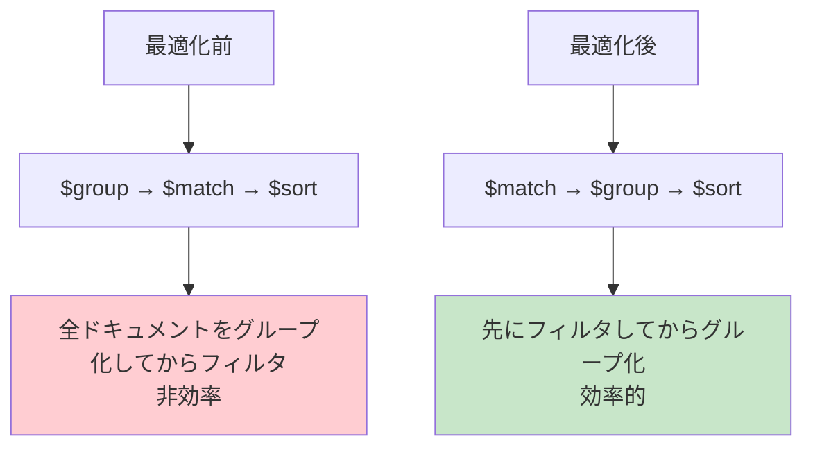

## 6. シャーディング

### 6.1 シャーディングの必要性

単一のMongoDBサーバーでは、ストレージ容量・メモリ量・CPU処理能力に物理的な限界がある。データ量やリクエスト数が増大した場合、**シャーディング**（水平分割）によって複数のサーバーにデータを分散させる。

### 6.2 シャーディングアーキテクチャ

MongoDBのシャーディングクラスタは3種類のコンポーネントで構成される。

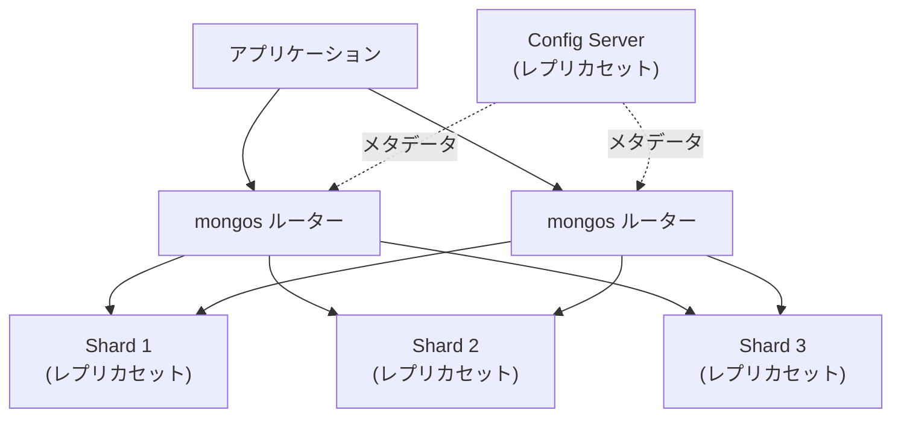

- **mongos（ルーター）**: クライアントからのリクエストを受け付け、適切なシャードにルーティングする。ステートレスであり、複数台を配置できる
- **Shard**: 実際にデータを保持するMongoDBインスタンス。各シャードはレプリカセットとして構成される
- **Config Server**: シャーディングのメタデータ（どのチャンクがどのシャードに存在するか）を保持するレプリカセット

### 6.3 シャードキーの選択

シャーディングにおいて最も重要な設計判断が**シャードキー**の選択である。シャードキーの選択によって、データの分散度やクエリ性能が大きく変わる。

理想的なシャードキーの条件は以下の通りである。

| 条件 | 説明 |
|---|---|
| **高いカーディナリティ** | ユニークな値が多い（例: `_id`, `user_id`） |
| **均一な分布** | 特定のシャードにデータが偏らない |
| **クエリパターンとの整合性** | 頻出クエリのフィルタ条件に含まれる |
| **単調増加を避ける** | タイムスタンプなどを単独で使うと最新のシャードに書き込みが集中する |

::: warning シャードキー選択の失敗例
`{ created_at: 1 }` をシャードキーにすると、最新のデータは常に最後のチャンクに書き込まれる（ホットスポット問題）。この場合、`{ user_id: 1, created_at: 1 }` のような複合シャードキーが有効である。
:::

### 6.4 チャンクとバランシング

MongoDBはデータを**チャンク**と呼ばれる連続したシャードキー範囲の単位で管理する。デフォルトのチャンクサイズは128MBである。

**バランサー**プロセスが各シャードのチャンク数を監視し、偏りが生じた場合にチャンクを自動的に他のシャードに移動（マイグレーション）する。

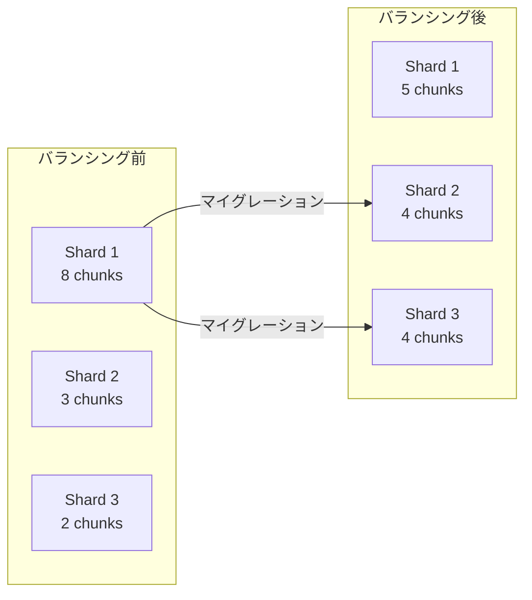

### 6.5 ターゲットクエリとスキャッタークエリ

シャーディング環境でのクエリには2種類がある。

- **ターゲットクエリ**: シャードキーがクエリ条件に含まれている場合、mongosは対象のシャードのみにリクエストを送る。最も効率的
- **スキャッタークエリ（ブロードキャスト）**: シャードキーがクエリ条件に含まれていない場合、全シャードにリクエストを送り、結果をマージする。シャード数が増えるほど性能が低下する

これが、シャードキーをクエリパターンに合わせて選択すべき理由である。

## 7. Firestoreのリアルタイム同期

### 7.1 Firestoreの概要

**Cloud Firestore**はGoogleが提供するフルマネージドのドキュメントデータベースであり、Firebase プラットフォームの一部として提供されている。もともと Firebase Realtime Database の後継として2017年にリリースされ、以下の特徴を持つ。

- **リアルタイム同期**: データの変更を接続中の全クライアントに即座にプッシュする
- **オフラインサポート**: クライアントSDKがローカルキャッシュを保持し、オフライン時も読み書きが可能
- **サーバーレス**: インフラの管理が不要で、使用量に応じた従量課金
- **強い整合性**: マルチリージョン構成でもすべての読み取りが強い整合性を持つ（2021年以降）
- **セキュリティルール**: 宣言的なルール言語でクライアントからのアクセスを制御する

### 7.2 データモデル

Firestoreのデータモデルは、MongoDBとは異なる独特の構造を持つ。

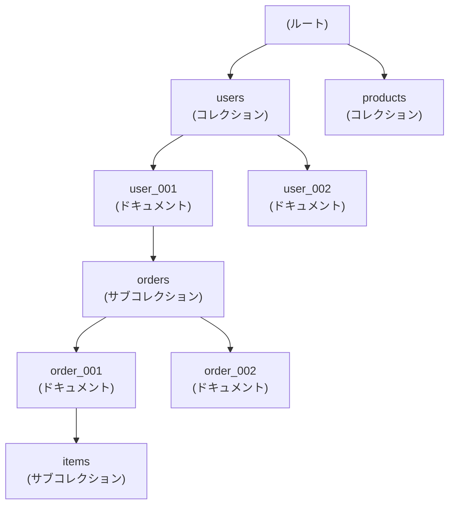

- **コレクション**: ドキュメントのコンテナ。コレクションはドキュメントのみを含む
- **ドキュメント**: フィールドと値のマップ。1MBのサイズ制限がある
- **サブコレクション**: ドキュメントの下にさらにコレクションをネストできる。これにより階層的なデータ構造を表現する

MongoDBと異なり、Firestoreではドキュメントの中に配列やマップをネストすることもできるが、サブコレクションとして分離するのが推奨パターンである。サブコレクションはドキュメントサイズの制限に影響を与えず、個別にクエリやインデックスを適用できるためである。

### 7.3 リアルタイムリスナー

Firestoreの最大の差別化要素は**リアルタイムリスナー**機能である。クライアントがドキュメントやコレクションにリスナーを設定すると、データが変更されるたびにコールバックが発火する。

```javascript
// Real-time listener on a collection
const unsubscribe = db.collection("messages")
  .where("room_id", "==", "room_123")
  .orderBy("created_at", "desc")
  .limit(50)
  .onSnapshot((snapshot) => {
    snapshot.docChanges().forEach((change) => {
      if (change.type === "added") {
        // New message arrived
        renderMessage(change.doc.data());
      }
      if (change.type === "modified") {
        // Message was edited
        updateMessage(change.doc.id, change.doc.data());
      }
      if (change.type === "removed") {
        // Message was deleted
        removeMessage(change.doc.id);
      }
    });
  });

// Stop listening when done
unsubscribe();
```

リアルタイムリスナーの内部動作は以下の通りである。

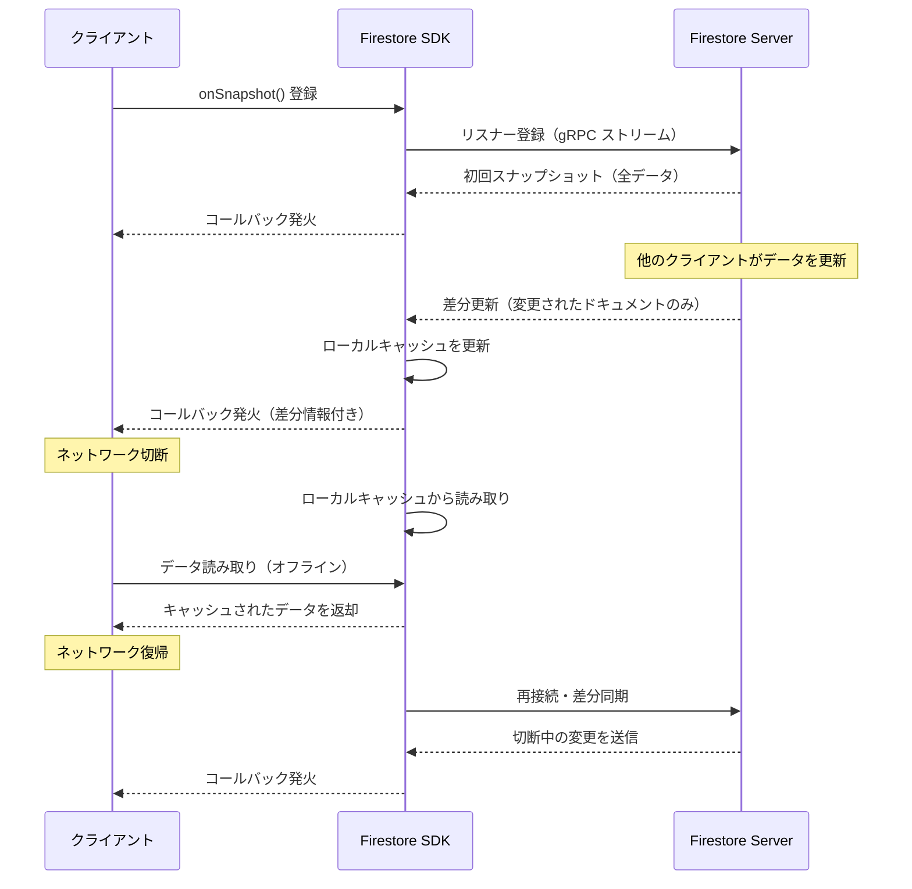

### 7.4 オフライン対応

FirestoreのクライアントSDK（Web、iOS、Android）はローカルにデータのキャッシュを保持する。オフライン時の動作は以下の通りである。

- **読み取り**: ローカルキャッシュからデータを返す。`fromCache` メタデータにより、キャッシュからの読み取りかサーバーからの読み取りかを判別できる
- **書き込み**: ローカルキャッシュに書き込みを記録し、オンラインに復帰した時点でサーバーに同期する。書き込みは**楽観的に**ローカルに即座に反映されるため、ユーザーは遅延を感じない
- **競合解決**: 複数のクライアントが同じドキュメントを同時に変更した場合、最後の書き込みが勝つ（Last Writer Wins）。より精密な制御が必要な場合はトランザクションを使用する

### 7.5 セキュリティルール

Firestoreは**セキュリティルール**により、クライアントから直接データベースにアクセスする際のアクセス制御を実現する。サーバーサイドのAPIレイヤーを介さずに、データベースレベルでルールを定義できる点が特徴的である。

```javascript
// Firestore security rules example
rules_version = '2';
service cloud.firestore {
  match /databases/{database}/documents {

    // Users can only read/write their own profile
    match /users/{userId} {
      allow read, write: if request.auth != null && request.auth.uid == userId;
    }

    // Messages: authenticated users can read, only author can write
    match /rooms/{roomId}/messages/{messageId} {
      allow read: if request.auth != null;
      allow create: if request.auth != null
                    && request.resource.data.author_id == request.auth.uid
                    && request.resource.data.text.size() <= 1000;
      allow update, delete: if request.auth != null
                            && resource.data.author_id == request.auth.uid;
    }
  }
}
```

### 7.6 MongoDBとFirestoreの比較

| 観点 | MongoDB | Firestore |
|---|---|---|
| デプロイ | セルフホスト / Atlas（マネージド） | フルマネージド（GCP） |
| クエリ言語 | MQL（MongoDB Query Language） | SDK API / REST |
| リアルタイム同期 | Change Streams（サーバーサイド） | ネイティブサポート（クライアントSDK） |
| オフライン対応 | なし（Realmで対応） | SDKに組み込み |
| スケーリング | 手動シャーディング | 自動スケーリング |
| アグリゲーション | 強力なパイプライン | 限定的（クライアント側で処理が必要） |
| ドキュメントサイズ上限 | 16MB | 1MB |
| トランザクション | マルチドキュメント対応 | マルチドキュメント対応 |
| 料金モデル | インスタンス課金 / Atlas は使用量ベース | 読み取り/書き込み回数ベース |
| 主な用途 | 汎用バックエンド | モバイル/Webアプリ |

## 8. RDBMSとの使い分け

### 8.1 選択基準

データベースの選択は、技術的な優劣ではなく、**要件との適合性**で判断すべきである。以下のフローチャートは、一般的な選択基準を示す。

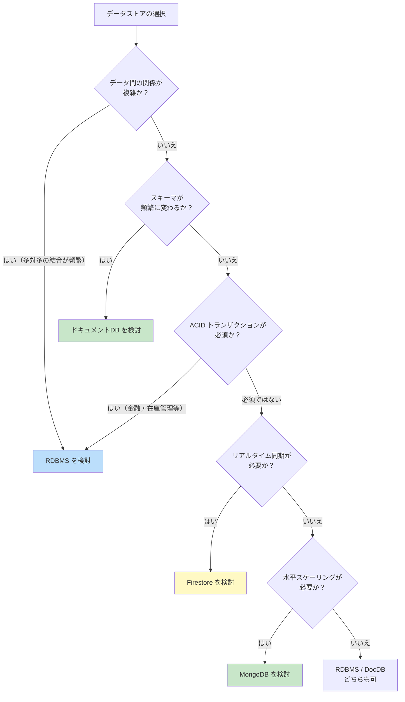

### 8.2 RDBMSが適するケース

- **複雑な結合**: 多数のテーブル間のJOINが頻繁に必要
- **厳密なACIDトランザクション**: 金融システム、在庫管理など、データ整合性が最優先
- **レポーティング・分析**: 複雑な集計クエリ、ウィンドウ関数、CTEなどが必要
- **既存エコシステムとの統合**: BI ツール、ETLパイプラインとの連携
- **スキーマの安定性**: データ構造が明確に定義されており、変更頻度が低い

### 8.3 ドキュメントデータベースが適するケース

- **柔軟なスキーマ**: プロダクトの属性がカテゴリごとに異なる商品カタログ、ユーザープロフィール
- **コンテンツ管理**: CMS、ブログ、記事管理システム
- **リアルタイムアプリ**: チャット、コラボレーションツール（特にFirestore）
- **IoTデータ**: デバイスごとに異なるセンサーデータ
- **プロトタイピング**: 開発初期にスキーマが確定していない段階
- **イベントログ**: 構造が変化しうるイベントデータの蓄積

### 8.4 ハイブリッドアプローチ

実際のシステムでは、RDBMSとドキュメントデータベースを併用する**ポリグロットパーシステンス**が一般的になっている。

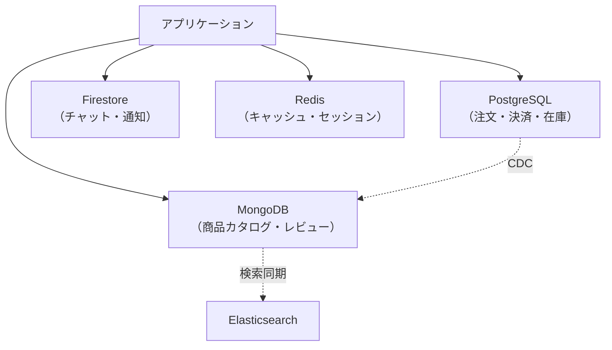

ポリグロットパーシステンスでは、各データストアの強みを活かしつつ、データの一貫性は**Change Data Capture（CDC）**やイベント駆動アーキテクチャで担保する。ただし、運用の複雑性が増すため、チームのスキルセットと運用体制を考慮した上で判断する必要がある。

## 9. スキーマ設計のベストプラクティス

### 9.1 「データの使い方」から設計する

RDBMSのスキーマ設計では、まずデータの構造（エンティティと関係）を分析し、正規化する。ドキュメントデータベースのスキーマ設計では、**アプリケーションがデータをどのように読み書きするか**から出発する。

> "Data that is accessed together should be stored together."
> （一緒にアクセスされるデータは一緒に格納すべきである）

これがドキュメントデータベースにおけるスキーマ設計の根本原則である。

### 9.2 埋め込み vs 参照

ドキュメントデータベースのスキーマ設計における最大の判断は、関連データを**埋め込む（embed）**か**参照する（reference）**かである。

#### 埋め込み（Embedding）

関連データを親ドキュメントのサブドキュメントまたは配列として格納する。

```json
// Embedded approach: order with items
{
  "_id": "order_001",
  "customer_id": "user_001",
  "items": [
    { "product_id": "prod_A", "name": "商品A", "price": 2800, "quantity": 2 },
    { "product_id": "prod_B", "name": "商品B", "price": 1200, "quantity": 1 }
  ],
  "total": 6800,
  "status": "shipped"
}
```

**埋め込みが適するケース:**

- 1対1 または 1対少数 の関係
- 親と子が常に一緒に読み取られる
- 子のデータが親の外から単独で参照されない
- 子の数が無制限に増加しない

#### 参照（Referencing）

関連データを別のドキュメント/コレクションに格納し、IDで参照する。

```json
// Reference approach: order document
{
  "_id": "order_001",
  "customer_id": "user_001",
  "item_ids": ["item_001", "item_002"],
  "total": 6800,
  "status": "shipped"
}

// Separate item documents
{
  "_id": "item_001",
  "order_id": "order_001",
  "product_id": "prod_A",
  "price": 2800,
  "quantity": 2
}
```

**参照が適するケース:**

- 1対多（大量）または 多対多 の関係
- 子のデータが複数の親から共有される
- 子の数が際限なく増加する可能性がある
- 子のデータが単独で頻繁にクエリされる

### 9.3 主要なスキーマパターン

MongoDBの公式ドキュメントでは、以下のようなスキーマ設計パターンが推奨されている。

#### Attribute Pattern

属性の種類がドキュメントごとに異なる場合に使用する。例えば、商品カテゴリごとに異なるスペック情報を持つ商品カタログに適用できる。

```json
// Without Attribute Pattern: hard to index and query
{
  "_id": "laptop_001",
  "brand": "ThinkPad",
  "cpu": "Core i7",
  "ram_gb": 16,
  "storage_gb": 512,
  "screen_size": 14.0
}

// With Attribute Pattern: uniform structure for flexible attributes
{
  "_id": "laptop_001",
  "brand": "ThinkPad",
  "specs": [
    { "key": "cpu", "value": "Core i7" },
    { "key": "ram_gb", "value": 16 },
    { "key": "storage_gb", "value": 512 },
    { "key": "screen_size", "value": 14.0 }
  ]
}
```

`specs` 配列に対してマルチキーインデックス `{ "specs.key": 1, "specs.value": 1 }` を作成すれば、任意の属性でのクエリが効率的になる。

#### Bucket Pattern

時系列データや大量のイベントデータを、時間範囲やカウントでバケット化して1ドキュメントにまとめるパターンである。

```json
// Instead of one document per sensor reading:
{
  "_id": "sensor_001_2026030500",
  "sensor_id": "sensor_001",
  "date": "2026-03-05",
  "hour": 0,
  "readings": [
    { "minute": 0, "temperature": 22.5, "humidity": 45 },
    { "minute": 1, "temperature": 22.6, "humidity": 44 },
    { "minute": 2, "temperature": 22.4, "humidity": 46 }
    // ... up to 60 readings per document
  ],
  "count": 60,
  "sum_temperature": 1350.0,
  "avg_temperature": 22.5
}
```

このパターンにより、ドキュメント数が劇的に削減され、インデックスサイズの縮小と集計クエリの高速化が実現する。

#### Computed Pattern

頻繁に計算される値を事前に算出して格納するパターンである。読み取りが多く書き込みが少ない場合に有効である。

```json
{
  "_id": "product_001",
  "name": "商品A",
  "reviews": [
    { "user_id": "u1", "rating": 5, "text": "素晴らしい" },
    { "user_id": "u2", "rating": 4, "text": "良い" }
  ],
  // Pre-computed values (updated on each review write)
  "review_count": 2,
  "average_rating": 4.5,
  "rating_distribution": { "5": 1, "4": 1, "3": 0, "2": 0, "1": 0 }
}
```

#### Outlier Pattern

大多数のドキュメントは埋め込みで問題ないが、少数の例外的なドキュメントだけが要素数の上限を超える場合に使用する。

```json
// Normal document (99% of cases)
{
  "_id": "book_001",
  "title": "一般的な書籍",
  "reviews": [
    { "user_id": "u1", "rating": 4 },
    { "user_id": "u2", "rating": 5 }
  ],
  "has_overflow": false
}

// Outlier document (1% of cases - bestseller with thousands of reviews)
{
  "_id": "book_popular",
  "title": "超人気書籍",
  "reviews": [/* first 100 reviews */],
  "has_overflow": true,
  "overflow_collection": "book_reviews_overflow"
}
```

### 9.4 アンチパターン

#### 過度なネスト

```json
// Bad: deeply nested structure
{
  "company": {
    "departments": [
      {
        "teams": [
          {
            "members": [
              {
                "tasks": [
                  {
                    "subtasks": [/* ... */]
                  }
                ]
              }
            ]
          }
        ]
      }
    ]
  }
}
```

深いネストはクエリの複雑化、更新の困難さ、ドキュメントサイズの肥大化を引き起こす。一般に、ネストの深さは2〜3階層に抑えるべきである。

#### 無制限な配列の成長

```json
// Bad: unbounded array growth
{
  "_id": "popular_post",
  "title": "人気記事",
  "comments": [/* could grow to millions of elements */]
}
```

配列が無制限に成長すると、ドキュメントサイズの上限（16MB）に到達するリスクがあるだけでなく、配列の更新時に全体の再書き込みが発生するため性能が低下する。この場合は参照パターンに切り替えるべきである。

#### 過度な正規化

RDBMSの設計思想をそのままドキュメントデータベースに持ち込み、すべてのエンティティを別のコレクションに分離するのは避けるべきである。1対1や1対少数の関係は埋め込みが自然であり、不必要な参照はクエリの回数を増加させる。

### 9.5 設計プロセスのまとめ

ドキュメントデータベースのスキーマ設計は、以下のプロセスで進める。

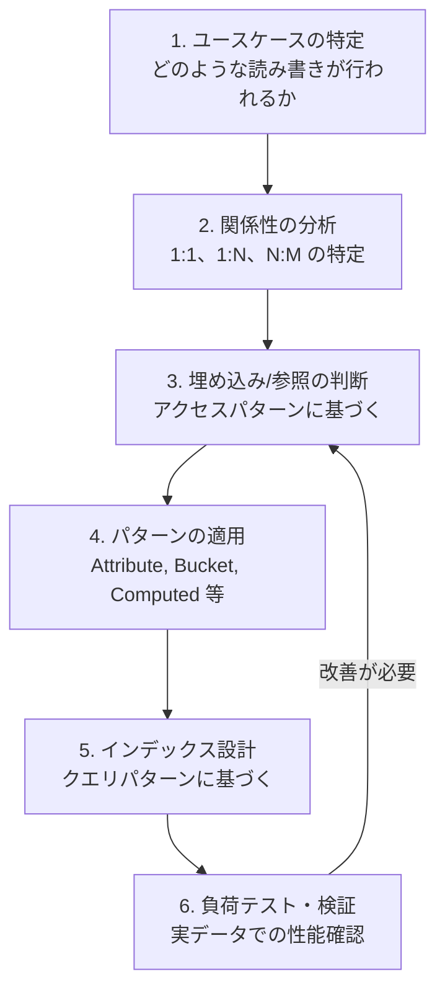

## 10. まとめ

ドキュメントデータベースは、柔軟なスキーマ、階層的なデータモデル、水平スケーリングの容易さを武器に、現代のアプリケーション開発において重要な選択肢となっている。

MongoDBは汎用的なドキュメントデータベースとして、強力なクエリ言語、アグリゲーションパイプライン、シャーディングによるスケーラビリティを提供する。一方、Firestoreはリアルタイム同期、オフライン対応、サーバーレスアーキテクチャにより、モバイル・Webアプリケーションのバックエンドとして優れた開発者体験を提供する。

ただし、ドキュメントデータベースは万能ではない。複雑なリレーションシップ、厳密なトランザクション要件、高度な分析クエリが必要な場合にはRDBMSが依然として最適な選択肢である。重要なのは、各データストアの特性を正確に理解し、アプリケーションの要件に応じて適切に使い分けることである。

スキーマ設計においては、「データがどのようにアクセスされるか」を出発点とし、埋め込みと参照のバランスを取りながら、確立されたパターン（Attribute、Bucket、Computed、Outlier）を活用することで、性能と保守性を両立するデータモデルを構築できる。

最終的に、データベースの選択とスキーマ設計は**エンジニアリング上のトレードオフ**であり、唯一の正解は存在しない。要件の理解、プロトタイピング、実データでの検証を通じて、最適な設計に到達するプロセスこそが重要である。
