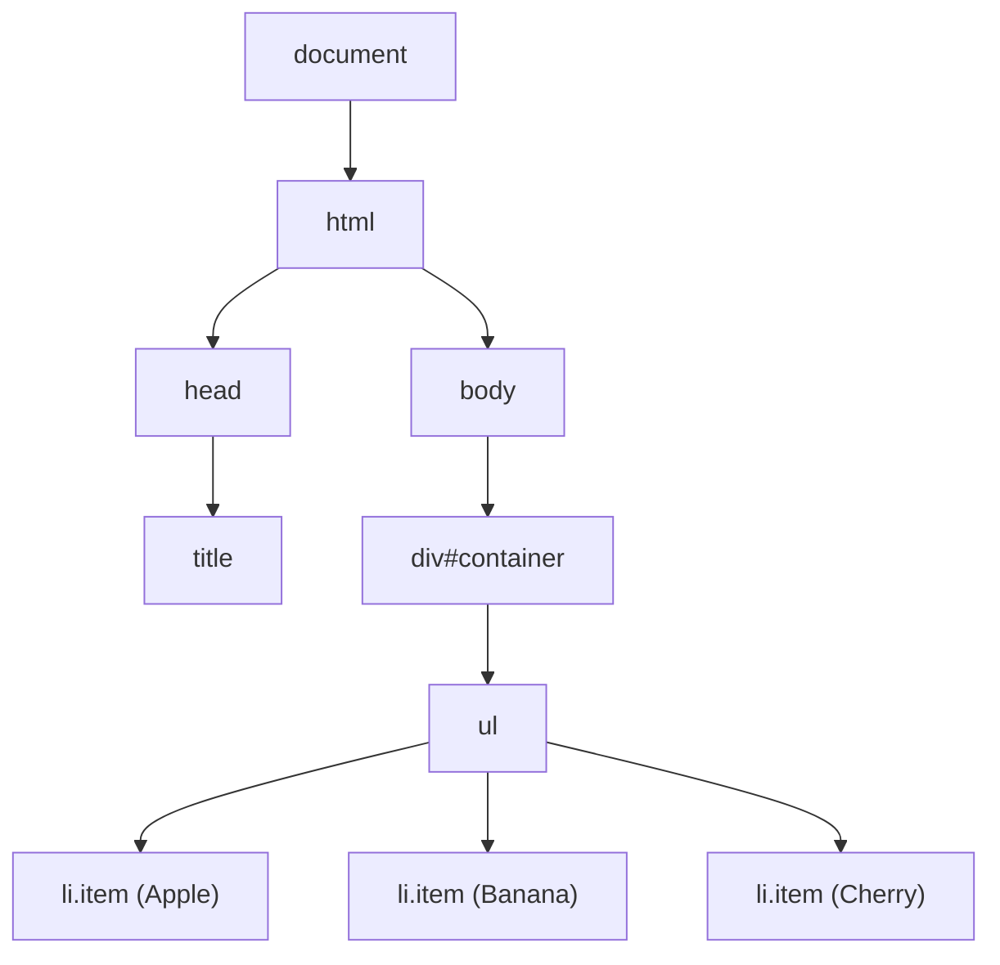
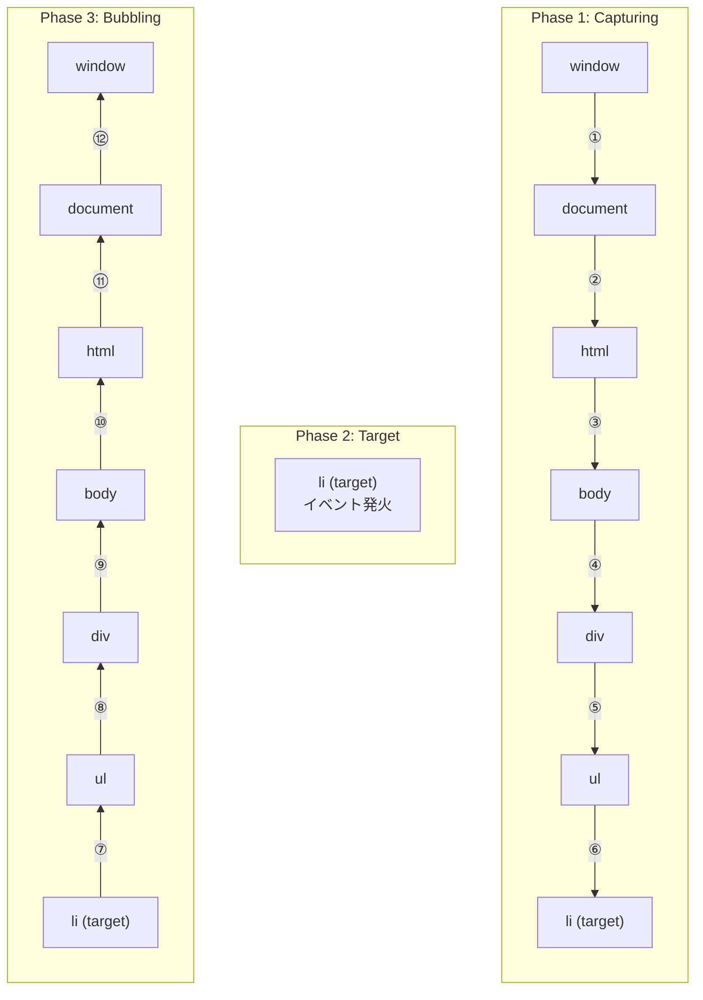
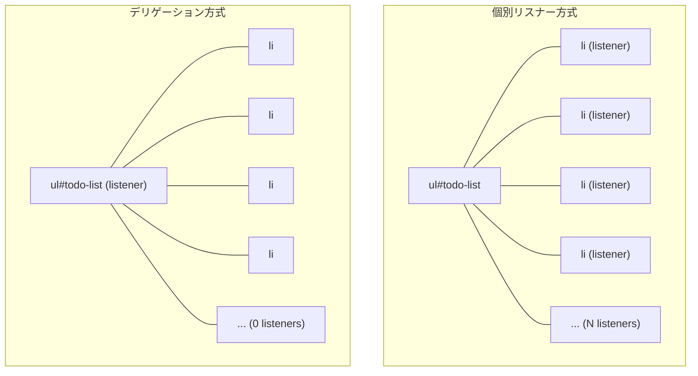
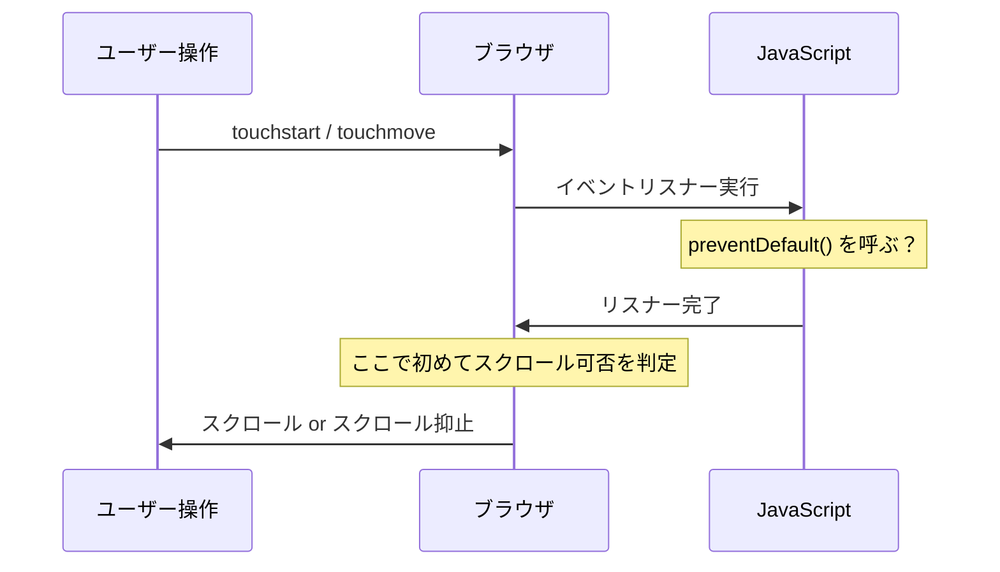
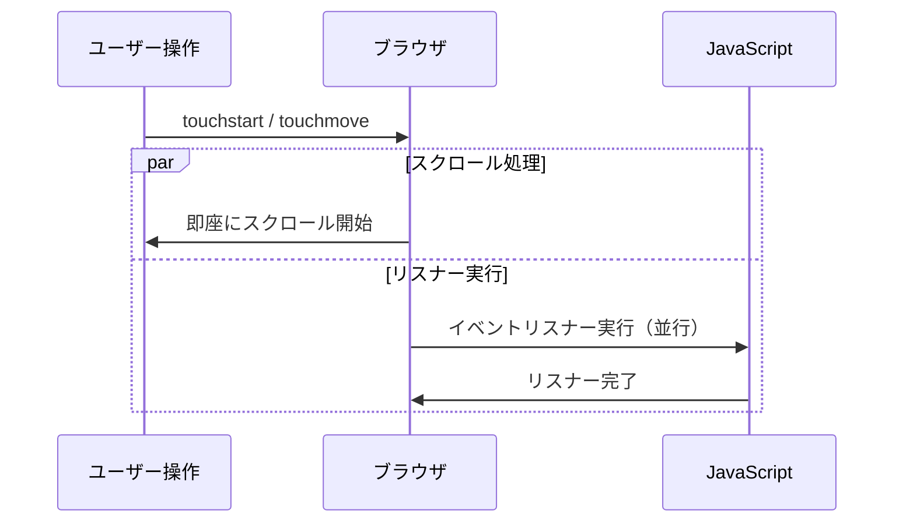
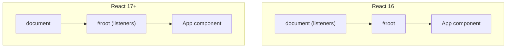

# DOMイベントモデル — バブリング, キャプチャ, デリゲーション

## 1. DOMとは何か

### 1.1 文書をプログラムから操作するための抽象

DOM（Document Object Model）は、HTML や XML 文書をツリー構造のオブジェクトとして表現し、プログラムからその構造・内容・スタイルを動的に読み書きするための API 仕様である。W3C（World Wide Web Consortium）と WHATWG（Web Hypertext Application Technology Working Group）によって標準化され、すべてのモダンブラウザが実装している。

ブラウザが HTML ドキュメントを受信すると、パーサーがバイト列をトークンに分解し、トークンからノードを生成し、ノードを親子関係に従って組み立てることで DOM ツリーを構築する。このツリーの各ノードは JavaScript オブジェクトであり、`document.getElementById()` や `document.querySelector()` といったメソッドで取得・操作できる。

```
HTML文字列
  ↓ パース
DOMツリー（メモリ上のオブジェクトツリー）
  ↓ レンダリングエンジン
レンダーツリー → レイアウト → ペイント → 画面表示
```

### 1.2 DOMツリーの構造

以下のような HTML を考える。

```html
<!DOCTYPE html>
<html>
  <head><title>Example</title></head>
  <body>
    <div id="container">
      <ul>
        <li class="item">Apple</li>
        <li class="item">Banana</li>
        <li class="item">Cherry</li>
      </ul>
    </div>
  </body>
</html>
```

このドキュメントは次のようなツリー構造として表現される。



DOM のすべてのノードは `Node` インターフェースを実装しており、`parentNode`、`childNodes`、`firstChild`、`nextSibling` といったプロパティを通じてツリーを走査できる。要素ノード（`Element`）、テキストノード（`Text`）、コメントノード（`Comment`）など、ノードにはいくつかの種別がある。イベントモデルを理解するうえで重要なのは、この**親子関係のツリー構造**がイベントの伝播経路を決定するという点である。

### 1.3 なぜイベントモデルが必要なのか

GUI アプリケーションでは、ユーザーの操作（クリック、キー入力、スクロールなど）をプログラムが検知し、適切な処理を実行する必要がある。この「操作の検知」と「処理の実行」を結びつける仕組みがイベントモデルである。

初期の Web ではインラインイベントハンドラ（`onclick="doSomething()"`）が主流だったが、これは HTML と JavaScript の密結合を招き、保守性を著しく損なう。また、同一要素の同一イベントに対して複数のハンドラを登録できないという制約もあった。DOM Level 2 Events 仕様（2000年）で導入された `addEventListener` メソッドと、イベントの「伝播」モデルが、これらの問題を根本的に解決した。

## 2. イベントの伝播モデル

### 2.1 三つのフェーズ

DOM イベントが発生すると、そのイベントは**三つのフェーズ**を経て伝播する。これは DOM Level 2 Events 仕様で定義され、現在の Living Standard にも引き継がれている極めて重要な概念である。



1. **キャプチャリングフェーズ（Capturing Phase）**: イベントは `window` オブジェクトから出発し、DOM ツリーを下降してターゲット要素の親ノードまで到達する。各祖先ノードに登録されたキャプチャリングリスナーが順に呼び出される。
2. **ターゲットフェーズ（Target Phase）**: イベントがターゲット要素に到達する。ターゲット要素に登録されたリスナーが呼び出される（キャプチャリング・バブリングの区別なく、登録順に実行される）。
3. **バブリングフェーズ（Bubbling Phase）**: イベントがターゲット要素から DOM ツリーを上昇し、`window` オブジェクトまで戻る。各祖先ノードに登録されたバブリングリスナーが順に呼び出される。

この三つのフェーズは、一つのイベントの発生に対して**必ずこの順番で**実行される。キャプチャリングとバブリングは対称的な関係にあり、イベントはツリーを「下って上る」一巡の旅をする。

### 2.2 キャプチャリング（Capturing）

キャプチャリングフェーズでは、イベントがツリーの最上位（`window`）からターゲットに向かって降下する。歴史的には、Netscape Navigator がこのモデルを採用していた。

キャプチャリングリスナーを登録するには、`addEventListener` の第三引数を `true` に設定するか、オプションオブジェクトで `capture: true` を指定する。

```javascript
// Registering a capturing listener
document.getElementById("container").addEventListener(
  "click",
  function (event) {
    console.log("Capturing phase: container");
  },
  true // capture: true
);
```

キャプチャリングフェーズは、イベントがターゲットに到達する**前に**介入できるという特性を持つ。これにより、親要素がイベントを「先取り」して処理したり、条件によってイベントの伝播を中断したりできる。

実務でキャプチャリングフェーズを意識的に利用する場面は限られるが、以下のようなケースで有効である。

- フォーカス管理: `focus` / `blur` イベントはバブリングしないため、祖先要素でこれらを検知するにはキャプチャリングフェーズを使うか、バブリングする `focusin` / `focusout` を使う
- グローバルなイベントインターセプター: すべてのクリックイベントをアナリティクス用に捕捉する場合
- イベントの早期キャンセル: 特定の条件下でイベントがターゲットに到達すること自体を防ぐ場合

### 2.3 バブリング（Bubbling）

バブリングフェーズでは、イベントがターゲットから `window` に向かって上昇する。歴史的には、Internet Explorer がこのモデルを採用していた。W3C は両方のモデルを統合し、一つのイベントがキャプチャリングとバブリングの両方を経ることを仕様化した。

バブリングリスナーはデフォルトの動作であり、`addEventListener` の第三引数を省略するか `false` にすると登録される。

```javascript
// Registering a bubbling listener (default)
document.getElementById("container").addEventListener("click", function (event) {
  console.log("Bubbling phase: container");
});
```

**すべてのイベントがバブリングするわけではない**ことに注意が必要である。以下のイベントはバブリングしない。

| イベント | バブリングの有無 | バブリングする代替 |
|---------|:---:|---------|
| `focus` | しない | `focusin` |
| `blur` | しない | `focusout` |
| `load` | しない | なし |
| `unload` | しない | なし |
| `scroll` | しない（※） | なし |
| `mouseenter` | しない | `mouseover` |
| `mouseleave` | しない | `mouseout` |
| `resize` | しない | なし |

> [!NOTE]
> `scroll` イベントは仕様上バブリングしないが、`document` 上の `scroll` イベントは `window` にバブリングするという特殊な挙動がある。要素レベルの `scroll` はバブリングしない。

### 2.4 伝播の制御

イベントの伝播は、`Event` オブジェクトのメソッドを通じて制御できる。

#### `stopPropagation()`

`stopPropagation()` は、イベントのそれ以上の伝播を停止する。キャプチャリングフェーズで呼び出せばターゲットとバブリングフェーズが実行されず、バブリングフェーズで呼び出せば以降の祖先要素への伝播が停止する。

```javascript
element.addEventListener("click", function (event) {
  event.stopPropagation();
  // This element handles the event, no further propagation
  console.log("Event handled here, propagation stopped");
});
```

ただし、**同一要素に登録された他のリスナーは引き続き実行される**。

#### `stopImmediatePropagation()`

`stopImmediatePropagation()` は、伝播を停止するだけでなく、同一要素に登録された残りのリスナーの実行も中止する。

```javascript
element.addEventListener("click", function (event) {
  event.stopImmediatePropagation();
  console.log("This handler runs");
});

element.addEventListener("click", function (event) {
  // This handler will NOT run
  console.log("This handler is skipped");
});
```

#### `preventDefault()`

`preventDefault()` はイベントの伝播には影響しない。代わりに、ブラウザのデフォルト動作（リンクのページ遷移、フォームの送信、チェックボックスのトグルなど）を抑止する。

```javascript
document.querySelector("a").addEventListener("click", function (event) {
  event.preventDefault();
  // Link navigation is prevented, but the event still bubbles
  console.log("Link click handled without navigation");
});
```

`stopPropagation()` と `preventDefault()` は独立した概念であり、それぞれが異なる目的を持つ。両者を混同すると意図しない挙動を招く。

| メソッド | 伝播の停止 | デフォルト動作の抑止 |
|---------|:---:|:---:|
| `stopPropagation()` | する | しない |
| `stopImmediatePropagation()` | する（同一要素の残りも含む） | しない |
| `preventDefault()` | しない | する |

### 2.5 イベントの伝播を実際に観察する

以下のコードで、三つのフェーズにおけるリスナーの実行順序を確認できる。

```html
<div id="outer">
  <div id="inner">
    <button id="btn">Click me</button>
  </div>
</div>

<script>
  const elements = ["outer", "inner", "btn"];

  elements.forEach((id) => {
    const el = document.getElementById(id);

    // Capturing phase listener
    el.addEventListener(
      "click",
      () => console.log(`Capturing: ${id}`),
      true
    );

    // Bubbling phase listener
    el.addEventListener(
      "click",
      () => console.log(`Bubbling: ${id}`)
    );
  });
</script>
```

ボタンをクリックすると、コンソールには以下の順序で出力される。

```
Capturing: outer
Capturing: inner
Capturing: btn
Bubbling: btn
Bubbling: inner
Bubbling: outer
```

> [!TIP]
> ターゲットフェーズ（ここでは `btn`）では、キャプチャリングとバブリングの区別はなく、**リスナーが登録された順番**に実行される。上記の例では `Capturing: btn` が先に出力されるが、これはキャプチャリングリスナーを先に登録したためである。登録順を逆にすると出力も逆になる。

## 3. addEventListener のオプション

### 3.1 基本的なシグネチャ

`addEventListener` メソッドは以下のシグネチャを持つ。

```typescript
target.addEventListener(
  type: string,
  listener: EventListener | EventListenerObject,
  options?: boolean | AddEventListenerOptions
);
```

第三引数は、歴史的な理由から `boolean` とオプションオブジェクトの両方を受け付ける。`boolean` を指定した場合は `capture` オプションとして扱われる。

### 3.2 AddEventListenerOptions

オプションオブジェクトでは以下のプロパティを指定できる。

```typescript
interface AddEventListenerOptions {
  capture?: boolean;  // Use capturing phase (default: false)
  once?: boolean;     // Auto-remove after first invocation (default: false)
  passive?: boolean;  // Never call preventDefault() (default: varies)
  signal?: AbortSignal; // Remove listener when signal is aborted
}
```

#### `capture`

前述の通り、キャプチャリングフェーズでリスナーを実行するかどうかを指定する。

#### `once`

`once: true` を指定すると、リスナーは一度実行された後に自動的に削除される。これは「初回のみ実行する」パターンを簡潔に表現できる。

```javascript
// Traditional approach
function handleOnce(event) {
  console.log("Executed once");
  element.removeEventListener("click", handleOnce);
}
element.addEventListener("click", handleOnce);

// Modern approach with once option
element.addEventListener(
  "click",
  () => console.log("Executed once"),
  { once: true }
);
```

#### `passive`

`passive: true` を指定すると、リスナー内で `preventDefault()` を呼び出さないことをブラウザに宣言する。これによりブラウザはデフォルト動作の抑止を待たずにスクロール等の処理を先行実行でき、パフォーマンスが向上する。詳細は後述のパッシブイベントリスナーの節で解説する。

#### `signal`

`AbortSignal` を指定すると、その `AbortController` が `abort()` された時点でリスナーが自動的に削除される。複数のリスナーを一括で解除する場合に有用である。

```javascript
const controller = new AbortController();

element.addEventListener("click", handleClick, { signal: controller.signal });
element.addEventListener("mouseover", handleHover, { signal: controller.signal });
element.addEventListener("keydown", handleKey, { signal: controller.signal });

// Remove all three listeners at once
controller.abort();
```

このパターンは、コンポーネントのライフサイクルに合わせたリスナーの管理において特に価値がある。コンポーネントの破棄時に `abort()` を呼ぶだけで、すべての関連リスナーがクリーンアップされる。

### 3.3 removeEventListener

リスナーを削除するには `removeEventListener` を使用する。削除には、登録時と**同一の関数参照**と**同一の `capture` フラグ**が必要である。

```javascript
function handleClick(event) {
  console.log("Clicked");
}

// Register
element.addEventListener("click", handleClick, true);

// Remove — must match the function reference AND capture flag
element.removeEventListener("click", handleClick, true);
```

匿名関数やアロー関数で登録したリスナーは、関数参照を保持していない限り `removeEventListener` で削除できない。これが前述の `once` オプションや `signal` オプションが導入された動機の一つである。

## 4. イベントデリゲーション

### 4.1 問題：大量の要素へのリスナー登録

以下のような TODO リストを考える。

```html
<ul id="todo-list">
  <li>Buy groceries</li>
  <li>Read a book</li>
  <li>Write code</li>
  <!-- ... hundreds more items -->
</ul>
```

各 `<li>` 要素にクリックハンドラを個別に登録するアプローチには、いくつかの問題がある。

1. **メモリ消費**: 要素ごとにリスナーオブジェクトが生成され、数百・数千の要素がある場合にメモリ使用量が増大する
2. **動的要素への対応**: JavaScript で後から追加された `<li>` にはリスナーが登録されない。新しい要素を追加するたびにリスナーを手動で登録する必要がある
3. **初期化コスト**: DOMContentLoaded 時にすべての要素をクエリし、ループでリスナーを登録する処理は、要素数に比例して時間がかかる

```javascript
// Naive approach: individual listeners (problematic)
document.querySelectorAll("#todo-list li").forEach((li) => {
  li.addEventListener("click", function () {
    this.classList.toggle("completed");
  });
});

// Problem: dynamically added items won't have the listener
const newItem = document.createElement("li");
newItem.textContent = "New task";
document.getElementById("todo-list").appendChild(newItem);
// newItem has no click listener!
```

### 4.2 解決：イベントデリゲーション

イベントデリゲーション（Event Delegation）は、バブリングの仕組みを利用して、**共通の祖先要素にリスナーを一つだけ登録する**設計パターンである。子要素で発生したイベントはバブリングによって祖先要素に到達するため、祖先要素のリスナーが子要素のイベントを「代理（delegate）」で処理できる。

```javascript
// Event delegation: single listener on the parent
document.getElementById("todo-list").addEventListener("click", function (event) {
  // Check if the clicked element is an <li>
  if (event.target.tagName === "LI") {
    event.target.classList.toggle("completed");
  }
});
```

この方法により、前述の三つの問題がすべて解決される。

1. **メモリ効率**: リスナーは一つだけ
2. **動的要素への対応**: 後から追加された `<li>` のクリックも自動的に処理される
3. **初期化コスト**: リスナーの登録は一度だけ



### 4.3 event.target と event.currentTarget

イベントデリゲーションを正しく実装するためには、`event.target` と `event.currentTarget` の違いを理解する必要がある。

- **`event.target`**: イベントが実際に発生した要素（クリックされた要素、キー入力を受けた要素など）
- **`event.currentTarget`**: 現在実行中のリスナーが登録されている要素

```javascript
document.getElementById("todo-list").addEventListener("click", function (event) {
  console.log("target:", event.target);         // The <li> that was clicked
  console.log("currentTarget:", event.currentTarget); // The <ul> element
  console.log("this:", this);                   // Same as currentTarget (non-arrow function)
});
```

> [!WARNING]
> アロー関数を使用した場合、`this` は `currentTarget` ではなく、外側のスコープの `this` を参照する。リスナー内で `this` を使用する場合はこの違いに注意が必要である。

### 4.4 closest() を使った堅牢なデリゲーション

`event.target` による単純な判定は、要素がネストしている場合に問題が生じる。

```html
<ul id="todo-list">
  <li>
    <span class="text">Buy groceries</span>
    <button class="delete">Delete</button>
  </li>
</ul>
```

この場合、`<span>` や `<button>` がクリックされると `event.target` はそれらの子要素になり、`event.target.tagName === "LI"` の判定が false になる。

`Element.closest()` メソッドを使うと、この問題を堅牢に解決できる。`closest()` は、自身を含む祖先要素の中で指定された CSS セレクタに最初にマッチする要素を返す。

```javascript
document.getElementById("todo-list").addEventListener("click", function (event) {
  // Find the closest <li> ancestor (including the target itself)
  const li = event.target.closest("li");
  if (!li) return;

  // Ensure the matched <li> is within our list (not some outer <li>)
  if (!this.contains(li)) return;

  // Handle delete button
  if (event.target.closest(".delete")) {
    li.remove();
    return;
  }

  // Toggle completion
  li.classList.toggle("completed");
});
```

`this.contains(li)` のチェックは、デリゲーション元のリスト外にある `<li>` 要素を誤って処理しないための防御的な記述である。

### 4.5 デリゲーションの限界

イベントデリゲーションは強力なパターンだが、万能ではない。

1. **バブリングしないイベント**: `focus`、`blur`、`load`、`scroll` などはバブリングしないため、デリゲーションに使用できない（ただし `focusin` / `focusout` はバブリングするので代替として使える）
2. **`stopPropagation()` の干渉**: 子要素のリスナーが `stopPropagation()` を呼ぶと、イベントが親に到達しなくなる
3. **セレクタの複雑性**: ネストが深い場合、`closest()` の判定ロジックが複雑になる
4. **パフォーマンスの逆転**: イベントが高頻度に発生する場合（`mousemove` など）、デリゲーション元でのフィルタリング処理が却ってオーバーヘッドになることがある

## 5. カスタムイベント

### 5.1 CustomEvent の概要

DOM イベントモデルは、ブラウザが自動的に発火する標準イベント（`click`、`keydown`、`submit` など）だけでなく、開発者が独自のイベントを定義して発火させる仕組みも提供している。これが `CustomEvent` である。

```javascript
// Creating a custom event
const event = new CustomEvent("todo:completed", {
  detail: {
    taskId: 42,
    taskName: "Write documentation",
    completedAt: new Date(),
  },
  bubbles: true,     // Enable bubbling
  cancelable: true,  // Allow preventDefault()
  composed: false,   // Do not cross Shadow DOM boundaries
});

// Dispatching the event
element.dispatchEvent(event);
```

### 5.2 CustomEvent のオプション

`CustomEvent` コンストラクタの第二引数には以下のオプションを指定できる。

| オプション | 型 | デフォルト | 説明 |
|-----------|-----|----------|------|
| `detail` | `any` | `null` | イベントに付随するカスタムデータ |
| `bubbles` | `boolean` | `false` | バブリングするかどうか |
| `cancelable` | `boolean` | `false` | `preventDefault()` で取り消し可能かどうか |
| `composed` | `boolean` | `false` | Shadow DOM の境界を越えて伝播するかどうか |

> [!WARNING]
> `CustomEvent` はデフォルトで `bubbles: false` であるため、デリゲーションパターンで使用する場合は明示的に `bubbles: true` を設定する必要がある。

### 5.3 カスタムイベントの活用パターン

カスタムイベントは、コンポーネント間の疎結合な通信を実現するのに有用である。

```javascript
// Component A: dispatches a custom event
class CartButton extends HTMLElement {
  connectedCallback() {
    this.addEventListener("click", () => {
      this.dispatchEvent(
        new CustomEvent("cart:item-added", {
          detail: { productId: this.dataset.productId },
          bubbles: true,
        })
      );
    });
  }
}

// Component B: listens for the custom event at a higher level
document.getElementById("app").addEventListener("cart:item-added", (event) => {
  const { productId } = event.detail;
  updateCartCount(productId);
  showNotification("Item added to cart");
});
```

このパターンでは、`CartButton` は `updateCartCount` や `showNotification` の存在を知らない。イベントを発火するだけで、どの祖先要素がどのように処理するかは関知しない。これは Pub/Sub パターンの DOM ネイティブな実装と言える。

### 5.4 イベント名の命名規則

カスタムイベント名には一般的に以下の規則が推奨される。

- **ネームスペースの使用**: `cart:item-added` のように、コロンやハイフンで区切ったネームスペースを付けることで、標準イベントや他のライブラリとの名前衝突を防ぐ
- **ケバブケース**: DOM イベントの慣例に従い、ケバブケース（`my-custom-event`）を使用する
- **動詞の過去形**: イベントは「何かが起きた」ことを通知するため、`item-added`、`form-submitted` のように過去形を使う

## 6. パッシブイベントリスナー

### 6.1 スクロールパフォーマンスの課題

モバイル Web において、スクロールのなめらかさは UX の根幹を成す。しかし、`touchstart` や `touchmove` イベントのリスナーが `preventDefault()` を呼び出す可能性がある限り、ブラウザはリスナーの実行完了を待ってからスクロール処理を開始しなければならない。



リスナーの処理に時間がかかると、スクロールが「カクつく」（ジャンク）現象が発生する。特に `touchmove` は高頻度（60fps 以上）で発生するため、わずかな遅延でもユーザー体験を著しく損なう。

### 6.2 パッシブリスナーの仕組み

`passive: true` を指定すると、リスナー内で `preventDefault()` を呼び出さないことをブラウザに保証する。これにより、ブラウザはリスナーの実行完了を待たずにスクロール処理を並行実行できる。

```javascript
// Passive listener: browser can scroll immediately
element.addEventListener(
  "touchstart",
  function (event) {
    // event.preventDefault(); // This would be ignored and a console warning shown
    console.log("Touch started at:", event.touches[0].clientX);
  },
  { passive: true }
);
```



### 6.3 デフォルトのパッシブ化

Chrome 56（2017年）以降、`window`、`document`、`document.body` における `touchstart` と `touchmove` イベントリスナーは**デフォルトで `passive: true`** として扱われるようになった。さらに、`wheel` イベントについてもドキュメントレベルのリスナーはデフォルトでパッシブ化されている。

この変更は、既存のコードとの互換性の問題を引き起こす可能性がある。スクロールを抑止する必要がある場合（例：カスタムのドラッグ＆ドロップ、ピンチズーム制御）は、明示的に `passive: false` を指定する必要がある。

```javascript
// When you need to prevent scrolling (e.g., custom drag)
element.addEventListener(
  "touchmove",
  function (event) {
    event.preventDefault(); // Prevent scrolling
    handleDrag(event);
  },
  { passive: false } // Explicitly opt out of passive
);
```

### 6.4 パッシブリスナーの判定フローチャート

```
touchstart / touchmove / wheel のリスナーを登録する
  │
  ├─ preventDefault() を呼ぶ必要がある？
  │    │
  │    ├─ はい → { passive: false } を明示的に指定
  │    │
  │    └─ いいえ → { passive: true } を指定（ベストプラクティス）
  │
  └─ その他のイベント（click, keydown 等）
       │
       └─ passive の指定は通常不要
```

## 7. イベントと仮想 DOM

### 7.1 React のイベントシステム

React は、ブラウザネイティブの DOM イベントシステムの上に独自のイベントシステム（SyntheticEvent）を構築している。React のイベント処理を理解するには、DOM イベントモデルの知識が前提となる。

React 17 以降のイベントシステムは以下の特徴を持つ。

1. **ルートへのデリゲーション**: React はすべてのイベントリスナーをルートコンテナ（`createRoot` に渡した要素）に集約する。これはイベントデリゲーションパターンそのものである
2. **SyntheticEvent**: ブラウザ間の差異を吸収するラッパーオブジェクト。ネイティブイベントへのアクセスは `event.nativeEvent` で可能
3. **バブリングフェーズのみ**: JSX の `onClick` などはバブリングフェーズで実行される。キャプチャリングフェーズで処理するには `onClickCapture` を使用する

```jsx
function App() {
  return (
    <div
      onClick={() => console.log("Bubbling: div")}
      onClickCapture={() => console.log("Capturing: div")}
    >
      <button onClick={() => console.log("Bubbling: button")}>
        Click me
      </button>
    </div>
  );
}

// Output when button is clicked:
// Capturing: div
// Bubbling: button
// Bubbling: div
```

#### React 16 と 17 のイベント委譲先の違い



React 16 では `document` にリスナーを委譲していたが、React 17 でルートコンテナに変更された。これにより、複数の React アプリケーションが同一ページに共存する場合や、React 以外の JavaScript とのイベント干渉が軽減された。

### 7.2 Vue のイベントシステム

Vue は React ほどイベントシステムを抽象化していない。テンプレート内のイベントバインディング（`@click`、`v-on:click`）は、各要素に直接 `addEventListener` で登録される。

Vue の特徴的な機能として、テンプレート内でイベント修飾子を宣言的に指定できる。

```html
<!-- Equivalent to event.stopPropagation() -->
<button @click.stop="handleClick">Click</button>

<!-- Equivalent to event.preventDefault() -->
<form @submit.prevent="handleSubmit">...</form>

<!-- Capturing phase -->
<div @click.capture="handleCapture">...</div>

<!-- Execute only once -->
<button @click.once="handleOnce">Click once</button>

<!-- Passive listener -->
<div @scroll.passive="handleScroll">...</div>

<!-- Only fire if event.target is the element itself -->
<div @click.self="handleSelf">...</div>
```

これらの修飾子はチェーン可能であり、`@click.stop.prevent` のように複数を組み合わせられる。

### 7.3 仮想 DOM と実 DOM のイベントの相互作用

仮想 DOM を使用するフレームワークでも、最終的にはネイティブの DOM イベントシステムが動作している。フレームワークのイベントシステムとネイティブの `addEventListener` を混在させる場合、以下の点に注意が必要である。

1. **実行順序**: React の SyntheticEvent はネイティブイベントの後に処理される（バブリングフェーズでルートコンテナに到達してから React のディスパッチが行われるため）
2. **`stopPropagation()` の範囲**: React の `event.stopPropagation()` は SyntheticEvent の伝播のみを停止し、ネイティブイベントの伝播には影響しない。ネイティブイベントの伝播を停止するには `event.nativeEvent.stopPropagation()` を使用する
3. **Ref 経由のネイティブリスナー**: `useEffect` 内で `ref.current.addEventListener` を使用する場合、クリーンアップ関数で確実に `removeEventListener` を行う必要がある

```javascript
// React: mixing native and synthetic events
function Modal({ onClose }) {
  const modalRef = useRef(null);

  useEffect(() => {
    function handleClickOutside(event) {
      if (modalRef.current && !modalRef.current.contains(event.target)) {
        onClose();
      }
    }
    // Native event listener on document
    document.addEventListener("mousedown", handleClickOutside);
    return () => document.removeEventListener("mousedown", handleClickOutside);
  }, [onClose]);

  return <div ref={modalRef}>Modal content</div>;
}
```

## 8. パフォーマンス最適化

### 8.1 高頻度イベントの制御

`scroll`、`resize`、`mousemove`、`input` などのイベントは極めて高頻度に発火する。これらのイベントハンドラで重い処理（DOM 操作、レイアウト再計算、API 呼び出しなど）を行うと、メインスレッドがブロックされてフレームドロップが発生する。

#### スロットリング（Throttling）

スロットリングは、指定した間隔で最大一回だけ関数を実行する手法である。「一定時間に一度」の制約を課す。

```javascript
function throttle(fn, interval) {
  let lastTime = 0;
  return function (...args) {
    const now = Date.now();
    if (now - lastTime >= interval) {
      lastTime = now;
      fn.apply(this, args);
    }
  };
}

// Execute at most once every 100ms
window.addEventListener("scroll", throttle(handleScroll, 100));
```

スロットリングはスクロール位置に応じた UI 更新（無限スクロール、ヘッダーの表示/非表示など）に適している。

#### デバウンシング（Debouncing）

デバウンシングは、イベントの発火が止まってから指定時間後に一度だけ関数を実行する手法である。連続する入力の「最後」だけを処理する。

```javascript
function debounce(fn, delay) {
  let timer = null;
  return function (...args) {
    clearTimeout(timer);
    timer = setTimeout(() => fn.apply(this, args), delay);
  };
}

// Execute 300ms after the last input event
searchInput.addEventListener("input", debounce(handleSearch, 300));
```

デバウンシングは検索サジェスト、フォームバリデーション、ウィンドウリサイズ後のレイアウト再計算などに適している。

```mermaid
gantt
    title スロットリングとデバウンシングの比較
    dateFormat X
    axisFormat %L

    section イベント発火
    event1 :milestone, e1, 0, 0
    event2 :milestone, e2, 50, 0
    event3 :milestone, e3, 120, 0
    event4 :milestone, e4, 180, 0
    event5 :milestone, e5, 300, 0
    event6 :milestone, e6, 350, 0

    section スロットリング（200ms）
    exec1 :crit, t1, 0, 10
    exec2 :crit, t2, 200, 10
    exec3 :crit, t3, 400, 10

    section デバウンシング（200ms）
    exec_d :crit, d1, 550, 10
```



### 8.2 requestAnimationFrame によるイベント処理

スクロールやリサイズなどのイベントハンドラで視覚的な更新を行う場合、`requestAnimationFrame`（rAF）を使ってブラウザの描画サイクルに同期させるのが理想的である。

```javascript
let ticking = false;

window.addEventListener("scroll", function () {
  if (!ticking) {
    requestAnimationFrame(function () {
      updateUI(window.scrollY);
      ticking = false;
    });
    ticking = true;
  }
});
```

このパターンでは、スクロールイベントがどれだけ高頻度に発火しても、実際の UI 更新はブラウザの描画フレーム（通常 16.67ms = 60fps）ごとに最大一回に制限される。

### 8.3 イベントリスナーのメモリリーク

イベントリスナーの解除忘れは、メモリリークの代表的な原因の一つである。特に SPA（Single Page Application）では、ページ遷移時にコンポーネントが破棄されても、`document` や `window` に登録されたリスナーが残留することがある。

```javascript
// Memory leak example in a SPA
class InfiniteScroll {
  constructor(container) {
    this.container = container;
    this.handleScroll = this.handleScroll.bind(this);
    // Listener registered on window
    window.addEventListener("scroll", this.handleScroll);
  }

  handleScroll() {
    // Load more items when near bottom
    if (this.isNearBottom()) {
      this.loadMore();
    }
  }

  // CRITICAL: must be called when the component is destroyed
  destroy() {
    window.removeEventListener("scroll", this.handleScroll);
  }
}
```

`AbortController` を使用すると、リスナーのライフサイクル管理がより宣言的になる。

```javascript
class InfiniteScroll {
  constructor(container) {
    this.container = container;
    this.controller = new AbortController();

    window.addEventListener("scroll", () => this.handleScroll(), {
      signal: this.controller.signal,
    });

    window.addEventListener("resize", () => this.handleResize(), {
      signal: this.controller.signal,
    });
  }

  destroy() {
    // All listeners removed at once
    this.controller.abort();
  }
}
```

### 8.4 Intersection Observer による scroll イベントの代替

従来、要素の可視性検知（遅延読み込み、無限スクロール、アナリティクスのビューポート判定など）には `scroll` イベントを使用していた。しかし `scroll` イベントハンドラ内での `getBoundingClientRect()` 呼び出しは強制レイアウト（Layout Thrashing）を引き起こす。

Intersection Observer API は、これらのユースケースをブラウザに委譲することでパフォーマンスを劇的に改善する。

```javascript
// Lazy loading images with Intersection Observer
const observer = new IntersectionObserver(
  (entries) => {
    entries.forEach((entry) => {
      if (entry.isIntersecting) {
        const img = entry.target;
        img.src = img.dataset.src;
        observer.unobserve(img);
      }
    });
  },
  {
    rootMargin: "200px", // Start loading 200px before entering viewport
  }
);

document.querySelectorAll("img[data-src]").forEach((img) => {
  observer.observe(img);
});
```

Intersection Observer はメインスレッドとは別のスレッドで交差判定を行うため、`scroll` イベント + `getBoundingClientRect()` の組み合わせと比較して、メインスレッドへの負荷が大幅に軽減される。

## 9. 実践的なパターン

### 9.1 モーダルダイアログの外側クリック検知

モーダルダイアログの外側をクリックしたときにダイアログを閉じるパターンは、イベントの伝播を活用した典型的な実装である。

```javascript
function setupModal(modalElement, closeCallback) {
  // Close when clicking the backdrop (outside the modal content)
  modalElement.addEventListener("click", function (event) {
    // If the click target is the backdrop itself (not modal content)
    if (event.target === modalElement) {
      closeCallback();
    }
  });

  // Close on Escape key
  function handleKeydown(event) {
    if (event.key === "Escape") {
      closeCallback();
    }
  }

  document.addEventListener("keydown", handleKeydown);

  // Return cleanup function
  return function cleanup() {
    document.removeEventListener("keydown", handleKeydown);
  };
}
```

### 9.2 ドラッグ＆ドロップの実装

ドラッグ＆ドロップは、複数のイベント（`mousedown`、`mousemove`、`mouseup`）を組み合わせた典型的なパターンである。`mousemove` と `mouseup` のリスナーを `document` に登録することで、ドラッグ中にカーソルが要素の外に出ても追跡を継続できる。

```javascript
function makeDraggable(element) {
  let isDragging = false;
  let startX, startY, initialLeft, initialTop;

  element.addEventListener("mousedown", function (event) {
    isDragging = true;
    startX = event.clientX;
    startY = event.clientY;
    initialLeft = element.offsetLeft;
    initialTop = element.offsetTop;
    element.style.cursor = "grabbing";

    // Prevent text selection during drag
    event.preventDefault();
  });

  // Listen on document to track mouse even outside the element
  document.addEventListener("mousemove", function (event) {
    if (!isDragging) return;

    const dx = event.clientX - startX;
    const dy = event.clientY - startY;

    element.style.left = initialLeft + dx + "px";
    element.style.top = initialTop + dy + "px";
  });

  document.addEventListener("mouseup", function () {
    if (!isDragging) return;
    isDragging = false;
    element.style.cursor = "grab";
  });
}
```

> [!TIP]
> モダンなブラウザでは、`PointerEvent`（`pointerdown`、`pointermove`、`pointerup`）の使用が推奨される。マウス、タッチ、ペン入力を統一的に扱える。`element.setPointerCapture(event.pointerId)` を使用すると、`document` にリスナーを登録せずにポインターの追跡を要素に閉じ込められる。

### 9.3 キーボードショートカットの管理

複雑なアプリケーションでは、キーボードショートカットの管理が必要になる。イベントデリゲーションと組み合わせたパターンを紹介する。

```javascript
class KeyboardShortcutManager {
  constructor() {
    this.shortcuts = new Map();
    this.handleKeydown = this.handleKeydown.bind(this);
    document.addEventListener("keydown", this.handleKeydown);
  }

  register(shortcut, callback, options = {}) {
    const key = this.normalizeShortcut(shortcut);
    this.shortcuts.set(key, { callback, ...options });
    return () => this.shortcuts.delete(key);
  }

  normalizeShortcut(shortcut) {
    return shortcut
      .toLowerCase()
      .split("+")
      .sort()
      .join("+");
  }

  handleKeydown(event) {
    // Skip if the user is typing in an input
    if (this.isInputElement(event.target)) return;

    const parts = [];
    if (event.ctrlKey || event.metaKey) parts.push("ctrl");
    if (event.shiftKey) parts.push("shift");
    if (event.altKey) parts.push("alt");
    parts.push(event.key.toLowerCase());

    const key = parts.sort().join("+");
    const shortcut = this.shortcuts.get(key);

    if (shortcut) {
      event.preventDefault();
      shortcut.callback(event);
    }
  }

  isInputElement(element) {
    const tagName = element.tagName.toLowerCase();
    return (
      tagName === "input" ||
      tagName === "textarea" ||
      tagName === "select" ||
      element.isContentEditable
    );
  }

  destroy() {
    document.removeEventListener("keydown", this.handleKeydown);
    this.shortcuts.clear();
  }
}

// Usage
const shortcuts = new KeyboardShortcutManager();
const unregister = shortcuts.register("ctrl+s", (event) => {
  saveDocument();
});
```

### 9.4 フォームバリデーションとイベント

フォームバリデーションは、複数のイベントタイプを組み合わせて実装するのが一般的である。

```javascript
class FormValidator {
  constructor(formElement) {
    this.form = formElement;
    this.errors = new Map();
    this.controller = new AbortController();
    const signal = this.controller.signal;

    // Validate on submit
    this.form.addEventListener(
      "submit",
      (event) => {
        if (!this.validateAll()) {
          event.preventDefault();
          this.showErrors();
        }
      },
      { signal }
    );

    // Real-time validation on input (debounced)
    this.form.addEventListener(
      "input",
      debounce((event) => {
        if (event.target.matches("input, textarea, select")) {
          this.validateField(event.target);
          this.showFieldError(event.target);
        }
      }, 300),
      { signal }
    );

    // Validate on blur (immediate feedback)
    this.form.addEventListener(
      "focusout",
      (event) => {
        if (event.target.matches("input, textarea, select")) {
          this.validateField(event.target);
          this.showFieldError(event.target);
        }
      },
      { signal }
    );
  }

  validateField(field) {
    const value = field.value.trim();
    const name = field.name;

    // Clear previous error
    this.errors.delete(name);

    if (field.required && !value) {
      this.errors.set(name, "This field is required");
      return false;
    }

    if (field.type === "email" && value && !this.isValidEmail(value)) {
      this.errors.set(name, "Invalid email address");
      return false;
    }

    if (field.minLength > 0 && value.length < field.minLength) {
      this.errors.set(name, `Minimum ${field.minLength} characters required`);
      return false;
    }

    return true;
  }

  isValidEmail(email) {
    return /^[^\s@]+@[^\s@]+\.[^\s@]+$/.test(email);
  }

  validateAll() {
    let isValid = true;
    this.form.querySelectorAll("input, textarea, select").forEach((field) => {
      if (!this.validateField(field)) {
        isValid = false;
      }
    });
    return isValid;
  }

  showFieldError(field) {
    const errorElement = field.parentElement.querySelector(".error-message");
    const error = this.errors.get(field.name);
    if (errorElement) {
      errorElement.textContent = error || "";
      field.classList.toggle("invalid", !!error);
    }
  }

  showErrors() {
    this.form.querySelectorAll("input, textarea, select").forEach((field) => {
      this.showFieldError(field);
    });

    // Focus the first invalid field
    const firstInvalid = this.form.querySelector(".invalid");
    if (firstInvalid) {
      firstInvalid.focus();
    }
  }

  destroy() {
    this.controller.abort();
  }
}
```

ここでは `focusout` イベント（`blur` のバブリング版）を使用している点に注目されたい。`blur` はバブリングしないため、フォーム要素へのデリゲーションには `focusout` を使う必要がある。同様に、`focus` の代わりに `focusin` を使う。

### 9.5 Shadow DOM とイベント

Web Components の Shadow DOM は、イベントの伝播に関して特別な挙動を示す。

Shadow DOM の内部で発生したイベントは、Shadow DOM の境界（shadow boundary）を越える際に**リターゲティング**される。つまり、Shadow DOM の外側から見ると、`event.target` は Shadow Host 要素を指し、Shadow DOM 内部の実際のターゲット要素は隠蔽される。

```javascript
class MyComponent extends HTMLElement {
  constructor() {
    super();
    const shadow = this.attachShadow({ mode: "open" });
    shadow.innerHTML = `
      <style>button { color: blue; }</style>
      <button id="inner-btn">Click me</button>
    `;

    shadow.querySelector("#inner-btn").addEventListener("click", (event) => {
      console.log("Inside shadow: target =", event.target.id); // "inner-btn"
    });
  }
}

customElements.define("my-component", MyComponent);

// Outside the shadow DOM
document.querySelector("my-component").addEventListener("click", (event) => {
  // event.target is retargeted to the shadow host
  console.log("Outside shadow: target =", event.target); // <my-component>
  // The inner button is NOT visible here
});
```

`CustomEvent` で `composed: true` を設定すると、イベントが Shadow DOM の境界を越えて伝播する。標準の `click`、`keydown` などのイベントはデフォルトで `composed: true` であるが、`CustomEvent` はデフォルトで `composed: false` である。

```javascript
// Custom event that crosses shadow boundaries
this.dispatchEvent(
  new CustomEvent("my-event", {
    bubbles: true,
    composed: true, // Cross shadow DOM boundaries
    detail: { value: 42 },
  })
);
```

`event.composedPath()` メソッドを使うと、Shadow DOM の境界を含むイベントの完全な伝播経路を取得できる。

```javascript
element.addEventListener("click", (event) => {
  const path = event.composedPath();
  // Returns: [inner-btn, shadow-root, my-component, body, html, document, window]
  console.log(path);
});
```

## 10. まとめ

DOM イベントモデルは、Web フロントエンド開発の根幹を成す仕組みである。本記事で解説した主要な概念を整理する。

**イベント伝播の三つのフェーズ**は、キャプチャリング（下降）、ターゲット、バブリング（上昇）の順に実行される。この伝播モデルの理解は、イベントデリゲーションの実装やフレームワークのイベントシステムの理解に不可欠である。

**イベントデリゲーション**は、バブリングを活用して祖先要素に一つのリスナーを登録するパターンであり、メモリ効率の向上、動的要素への自動対応、初期化コストの削減を実現する。`event.target.closest()` を使うことで堅牢な実装が可能である。

**パッシブイベントリスナー**は、スクロール関連イベントのパフォーマンスを劇的に改善する仕組みであり、`passive: true` をデフォルトとして採用すべきである。

**React や Vue などのフレームワーク**は、DOM イベントモデルの上に独自の抽象層を構築しているが、その基盤はネイティブの DOM イベントである。フレームワークの挙動を正しく理解し、ネイティブイベントとの相互作用を安全に管理するためにも、DOM イベントモデルの深い理解は不可欠である。

**パフォーマンス最適化**では、スロットリング、デバウンシング、`requestAnimationFrame`、Intersection Observer などの手法を状況に応じて使い分けることが重要である。また、`AbortController` を活用したリスナーのライフサイクル管理は、メモリリークを防ぐ現代的なベストプラクティスである。

DOM イベントモデルは 2000 年の DOM Level 2 Events から四半世紀を経ても Web の基盤であり続けている。仕様は Living Standard として進化を続けており、`AbortSignal` によるリスナー管理や、Intersection Observer / Resize Observer といった Observer パターンへの発展など、エコシステムは今も拡張されている。フロントエンド開発者にとって、DOM イベントモデルは「知っていると便利」ではなく「知らないと正しいコードが書けない」基礎知識である。
