# DPDK と XDP — 高性能パケット処理

## 1. カーネルネットワークスタックの限界

### 1.1 従来のパケット処理パス

Linux カーネルのネットワークスタックは、汎用性と安全性を重視した設計になっている。アプリケーションがパケットを送受信するとき、データは複数のレイヤーを経由する。

```
┌─────────────────────────────────────┐
│         アプリケーション              │
│         (ユーザー空間)                │
├─────────────────────────────────────┤
│      ソケットインターフェース           │  ← システムコール境界
├─────────────────────────────────────┤
│      TCP / UDP 処理                  │
├─────────────────────────────────────┤
│      IP 処理（ルーティング等）          │
├─────────────────────────────────────┤
│      Netfilter (iptables/nftables)   │  ← ファイアウォール処理
├─────────────────────────────────────┤
│      トラフィック制御 (tc)             │
├─────────────────────────────────────┤
│      NIC ドライバ                     │
├─────────────────────────────────────┤
│      ハードウェア（NIC）               │
└─────────────────────────────────────┘
```

NIC がパケットを受信すると、ハードウェア割り込みが発生し、カーネルのソフトウェア割り込み（softirq）ハンドラが起動する。パケットは `sk_buff`（ソケットバッファ）構造体にコピーされ、Netfilter のフック、ルーティングテーブルの参照、TCP/UDP のプロトコル処理を経て、最終的にアプリケーションのバッファに `recv()` や `read()` でコピーされる。

### 1.2 なぜ遅いのか

このアーキテクチャが10Gbps以上の回線速度に対応できなくなる理由は、いくつかの構造的なオーバーヘッドに起因する。

**割り込みのオーバーヘッド**: 10GbE の場合、最小フレームサイズ（64バイト）で毎秒約1,480万パケットが到着しうる。パケットごとにハードウェア割り込みを発生させると、コンテキストスイッチだけでCPU時間を使い果たす。NAPI（New API）による割り込みとポーリングのハイブリッド方式が導入されたが、根本的な解決には至っていない。

**`sk_buff` のメモリアロケーション**: 各パケットに対して `sk_buff` 構造体（約240バイト）をアロケートし、初期化する必要がある。高スループット環境では、このメモリアロケーション自体がボトルネックになる。

**カーネル-ユーザー空間のコピー**: データがカーネル空間からユーザー空間にコピーされるとき、CPU サイクルだけでなく、キャッシュの汚染も発生する。

**ロックの競合**: マルチコア環境では、ネットワークスタック内部のデータ構造に対するロック競合が性能を劣化させる。

**プロトコルスタックの深さ**: Netfilter のルール評価、conntrack（接続追跡）テーブルの検索、ルーティングテーブルの最長一致検索など、パケットが通過するレイヤーの数そのものが遅延を生む。

### 1.3 数値で見る限界

以下は、一般的な Linux カーネルスタック（チューニングなし）における1パケットあたりの処理コストの概算である。

| 処理 | 概算コスト |
|------|-----------|
| ハードウェア割り込み + softirq | 約 1,000 ns |
| `sk_buff` アロケーション | 約 200 ns |
| Netfilter ルール評価 | 約 500 ns（ルール数に依存） |
| TCP/IP プロトコル処理 | 約 1,500 ns |
| カーネル→ユーザー空間コピー | 約 300 ns |
| **合計** | **約 3,500 ns** |

1パケットあたり3,500ナノ秒かかるとすると、1秒間に処理できるパケット数は約28万パケットにすぎない。10GbE の最小パケットレート（約1,480万pps）に対して、約2桁足りない計算になる。もちろん、バッチ処理やGRO（Generic Receive Offload）などの最適化で実際にはもう少し高いスループットが出るが、それでも数百万pps程度が限界である。

この「カーネルネットワークスタックの限界」を打ち破るために生まれたのが、DPDK と XDP という2つのアプローチだ。

## 2. DPDK の概要とアーキテクチャ

### 2.1 DPDK とは何か

**DPDK（Data Plane Development Kit）**は、Intel が2010年に開発を開始し、2013年にオープンソース化したユーザー空間パケット処理フレームワークである。現在は Linux Foundation のプロジェクトとして、Intel だけでなく多数のベンダーが開発に参加している。

DPDK の基本的な発想は極めてシンプルだ。**カーネルのネットワークスタックをバイパスし、NIC を直接ユーザー空間から制御する**ことで、前述のオーバーヘッドをすべて排除する。

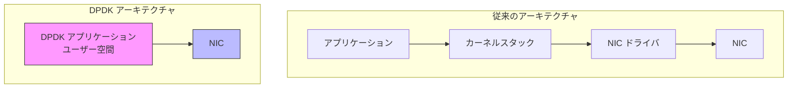

DPDK アプリケーションは、カーネルを経由せずに NIC のレジスタを直接操作し、DMA（Direct Memory Access）を使ってパケットの送受信を行う。これにより、カーネルネットワークスタックのすべてのオーバーヘッドが排除される。

### 2.2 コアコンポーネント

DPDK は以下の主要コンポーネントで構成される。

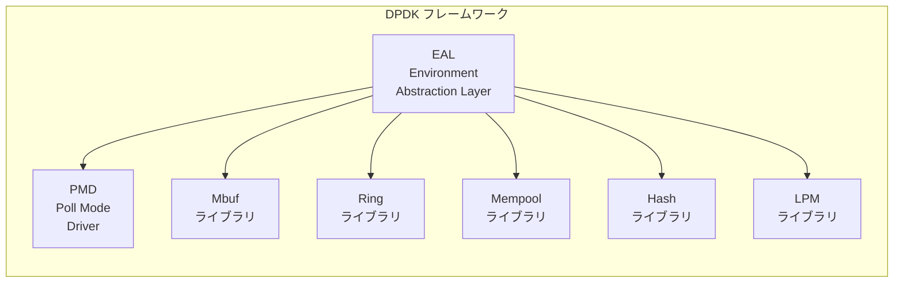

**EAL（Environment Abstraction Layer）**: DPDK の初期化を担当する抽象化レイヤー。Hugepage のマッピング、CPU コアの割り当て、PCI デバイスの検出とバインドなど、プラットフォーム固有の処理を隠蔽する。

**PMD（Poll Mode Driver）**: 割り込みを使わずにポーリングでパケットを受信するドライバ。後述するが、DPDK の性能の根幹をなすコンポーネントである。

**Mbuf ライブラリ**: パケットデータを格納するためのバッファ管理。カーネルの `sk_buff` に相当するが、はるかに軽量な設計になっている。

**Ring ライブラリ**: ロックフリーのリングバッファ実装。プロデューサー-コンシューマー間のパケット受け渡しに使用される。

**Mempool ライブラリ**: 固定サイズのオブジェクトプール。Mbuf のアロケーションに使用され、`malloc()` のような汎用アロケータのオーバーヘッドを回避する。

**Hash / LPM ライブラリ**: フローテーブルの検索やIPアドレスの最長一致検索など、パケット処理で頻出するデータ構造の高速実装。

### 2.3 UIO と VFIO

DPDK がユーザー空間から NIC を直接制御するためには、カーネルの NIC ドライバをアンバインドし、代わりに**UIO（Userspace I/O）**または**VFIO（Virtual Function I/O）**フレームワークを使ってデバイスをユーザー空間に公開する必要がある。

```
# NIC をカーネルドライバからアンバインド
$ dpdk-devbind.py --bind=vfio-pci 0000:03:00.0
```

**UIO**: カーネル側に最小限のドライバ（`igb_uio`）を置き、PCI のBAR（Base Address Register）領域をユーザー空間にmmap する。シンプルだがIOMMU をサポートしない。

**VFIO**: IOMMU を活用して、デバイスのDMA をハードウェアレベルで隔離する。セキュリティ面で UIO より優れており、現在は VFIO が推奨されている。

::: warning
NIC を DPDK にバインドすると、その NIC はカーネルのネットワークスタックからは見えなくなる。つまり、`ip` コマンドや `ifconfig` では表示されず、SSH 接続に使っている NIC を誤って DPDK にバインドすると接続が切れる。本番環境では管理用ポートと DPDK 用ポートを分離することが必須である。
:::

## 3. Poll Mode Driver（PMD）

### 3.1 割り込み駆動 vs ポーリング

従来の NIC ドライバは**割り込み駆動**で動作する。パケットが到着すると NIC がハードウェア割り込みを発生させ、CPU は現在の処理を中断して割り込みハンドラを実行する。

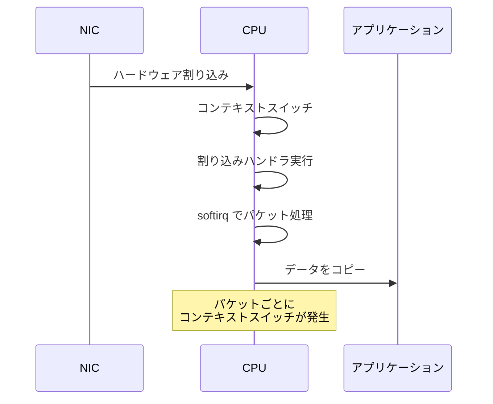

低トラフィック時にはこの方式で問題ないが、高トラフィック時には割り込みの発生頻度が高すぎて、CPU が割り込み処理だけで飽和する（**割り込みストーム**）。

DPDK の PMD は**ポーリング**方式を採用する。CPU コアを1つ占有し、無限ループで NIC のリングバッファを監視し続ける。

```c
// DPDK PMD typical polling loop
while (1) {
    // Poll NIC receive queue - returns immediately with 0 or more packets
    uint16_t nb_rx = rte_eth_rx_burst(port_id, queue_id, pkts, BURST_SIZE);

    if (nb_rx == 0)
        continue;  // No packets, poll again immediately

    // Process received packets
    for (uint16_t i = 0; i < nb_rx; i++) {
        process_packet(pkts[i]);
    }

    // Transmit processed packets
    uint16_t nb_tx = rte_eth_tx_burst(port_id, queue_id, pkts, nb_rx);

    // Free unsent packets
    for (uint16_t i = nb_tx; i < nb_rx; i++) {
        rte_pktmbuf_free(pkts[i]);
    }
}
```

### 3.2 ポーリングのトレードオフ

ポーリング方式の最大のメリットは、割り込みのオーバーヘッドが完全に排除されることだ。コンテキストスイッチが発生せず、パケット処理のレイテンシが極めて安定する（ジッターが小さい）。

しかし重大なトレードオフがある。**CPU コアを100%消費し続ける**。パケットが1つも到着しなくても、ポーリングループは回り続ける。このため：

- CPU コアがDPDK専用に占有され、他の用途に使えない
- 電力消費が増大する（省電力モードに移行できない）
- 仮想化環境では、ゲストOSが不必要にCPUリソースを消費する問題がある

これらのトレードオフから、DPDK は「常に高トラフィックが期待される環境」で真価を発揮する。トラフィックが間欠的な環境では、後述する XDP の方が適している場合がある。

### 3.3 マルチキューとRSS

現代の NIC は複数の受信キュー（Rx Queue）と送信キュー（Tx Queue）を持つ。**RSS（Receive Side Scaling）**により、NIC のハードウェアがパケットのヘッダ（送信元/宛先IPアドレス、ポート番号など）をハッシュして、複数のキューに振り分ける。

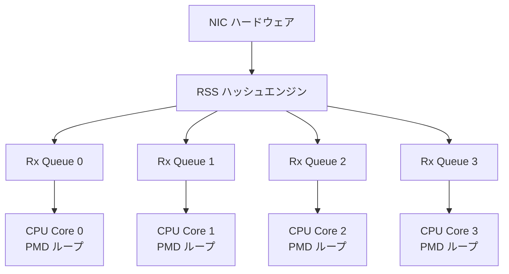

DPDK では、各 CPU コアが1つ以上のキューを担当する PMD ループを実行する。同一フローのパケットは同じキューに振り分けられるため、フロー単位ではロックなしで処理できる。これにより、CPU コア数に比例した**線形スケーリング**が実現する。

## 4. Hugepage と NUMA の最適化

### 4.1 なぜ Hugepage が必要か

DPDK が Hugepage を必須とする理由は、**TLB（Translation Lookaside Buffer）ミス**の削減にある。

通常のLinuxでは、ページサイズは4KBである。10GbE の最小パケットレート（約1,480万pps）でパケットを処理する場合、パケットバッファだけでも膨大な数のページが必要になる。TLB はページテーブルのキャッシュであり、エントリ数には上限がある（一般的なCPUで512〜4,096エントリ程度）。

| ページサイズ | 1GB のメモリに必要なページ数 | TLB カバレッジ（2,048エントリの場合） |
|------------|--------------------------|--------------------------------------|
| 4KB | 262,144 | 8MB |
| 2MB | 512 | 4GB |
| 1GB | 1 | 2TB |

4KB ページの場合、TLB がカバーできるメモリ範囲はわずか8MBである。DPDK のパケットバッファプールは通常数百MB〜数GBに達するため、頻繁に TLB ミスが発生し、ページテーブルウォーク（メモリへの追加アクセス）による遅延が生じる。

2MB や 1GB の Hugepage を使うことで、同じ TLB エントリ数ではるかに広いメモリ範囲をカバーでき、TLB ミスが劇的に減少する。

```bash
# Hugepage の設定例
# 1GB Hugepage を 4 ページ確保（カーネルブートパラメータ）
# default_hugepagesz=1G hugepagesz=1G hugepages=4

# 2MB Hugepage を確保（実行時）
echo 1024 > /sys/kernel/mm/hugepages/hugepages-2048kB/nr_hugepages

# Hugepage のマウント
mkdir -p /dev/hugepages
mount -t hugetlbfs nodev /dev/hugepages
```

### 4.2 NUMA アーキテクチャへの対応

**NUMA（Non-Uniform Memory Access）**アーキテクチャでは、各 CPU ソケットが自身に近いメモリ（ローカルメモリ）と、他のソケットに接続されたメモリ（リモートメモリ）を持つ。リモートメモリへのアクセスは、ローカルメモリと比較して1.5〜3倍程度の遅延が発生する。

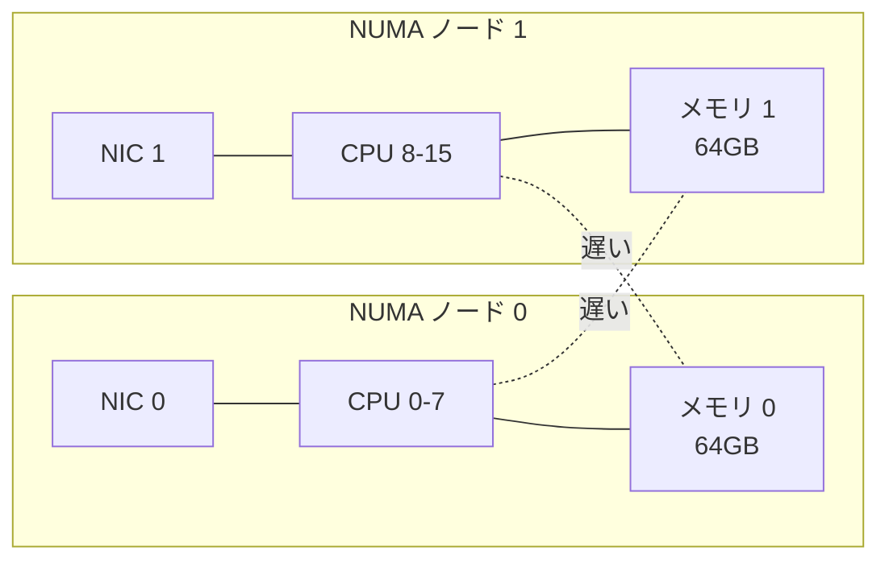

DPDK では NUMA を意識したメモリアロケーションが重要である。

- パケットバッファプール（Mempool）は、そのプールを使用する CPU コアと同じ NUMA ノードのメモリに確保する
- NIC のキューを担当する PMD ループは、NIC が接続された NUMA ノードの CPU コアで実行する
- クロスNUMA のメモリアクセスが発生すると、パケット処理性能が大幅に低下する

```c
// Create mempool on specific NUMA node
struct rte_mempool *mbuf_pool = rte_pktmbuf_pool_create(
    "MBUF_POOL",
    NUM_MBUFS,
    MBUF_CACHE_SIZE,
    0,
    RTE_MBUF_DEFAULT_BUF_SIZE,
    rte_eth_dev_socket_id(port_id)  // Allocate on the same NUMA node as the NIC
);
```

### 4.3 キャッシュライン最適化

DPDK のデータ構造は、CPU のキャッシュライン（通常64バイト）を意識して設計されている。

**`rte_mbuf` 構造体**: パケットメタデータの頻繁にアクセスされるフィールドは最初の1キャッシュラインに収まるよう配置されている。これにより、パケット処理の大部分が1回のキャッシュラインフェッチで完了する。

**Ring バッファ**: プロデューサーとコンシューマーのインデックスは異なるキャッシュラインに配置される。これにより、マルチコア環境での**フォルスシェアリング**（異なるコアが同じキャッシュラインを変更し合い、キャッシュの無効化が連鎖する現象）を防止する。

**プリフェッチ**: DPDK は次に処理するパケットのデータを事前にキャッシュにロードする**ソフトウェアプリフェッチ**を多用する。

```c
// Prefetch the next packet while processing the current one
for (int i = 0; i < nb_rx; i++) {
    // Prefetch next packet's metadata
    if (i + 1 < nb_rx)
        rte_prefetch0(rte_pktmbuf_mtod(pkts[i + 1], void *));

    // Process current packet
    process_packet(pkts[i]);
}
```

## 5. XDP（eXpress Data Path）の概要

### 5.1 XDP とは何か

**XDP（eXpress Data Path）**は、Linux カーネル 4.8（2016年）で導入されたパケット処理フレームワークである。DPDK とは異なり、XDP は**カーネル内**で動作するが、従来のネットワークスタックの**最も早い段階**でパケットを処理する。

XDP の核心的なアイデアは、NIC ドライバがパケットを `sk_buff` に変換する**前に**、BPF（Berkeley Packet Filter）プログラムを実行してパケットの処理を決定することである。

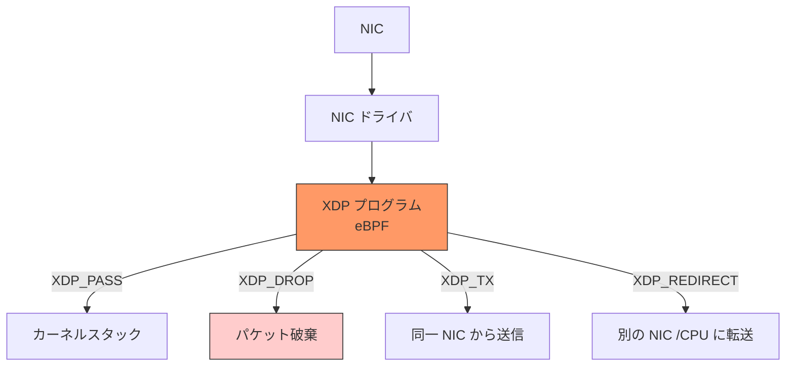

XDP プログラムはパケットに対して以下の4つのアクション（verdict）のいずれかを返す。

| アクション | 動作 |
|-----------|------|
| `XDP_PASS` | パケットを通常のカーネルスタックに渡す |
| `XDP_DROP` | パケットを即座に破棄する（`sk_buff` 変換前なので極めて高速） |
| `XDP_TX` | パケットを受信した NIC から送り返す |
| `XDP_REDIRECT` | パケットを別の NIC、別の CPU、またはユーザー空間の AF_XDP ソケットに転送する |

### 5.2 XDP の動作モード

XDP には3つの動作モードがある。

**ネイティブモード（Native XDP）**: NIC ドライバが直接 XDP をサポートする。パケットが DMA でメモリに転送された直後、`sk_buff` が作成される前に XDP プログラムが実行される。最も高速だが、NIC ドライバ側の対応が必要。

**オフロードモード（Offloaded XDP）**: XDP プログラムが NIC のハードウェア（SmartNIC）にオフロードされる。CPU を一切使わずにパケット処理が完了する。Netronome などの一部の SmartNIC がサポートしている。

**汎用モード（Generic XDP / SKB mode）**: NIC ドライバの XDP 対応が不要で、`sk_buff` が作成された後に XDP プログラムが実行される。すべての NIC で動作するが、性能面のメリットは限定的。テストやデバッグ用途が主。

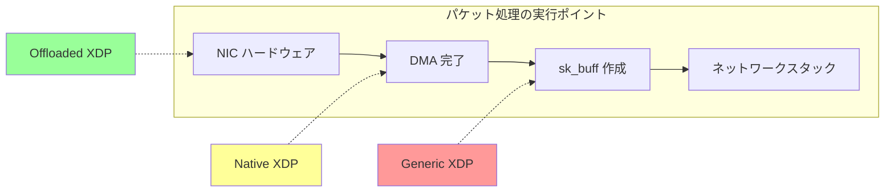

### 5.3 XDP プログラムの例

XDP プログラムは C 言語で記述し、`clang` で eBPF バイトコードにコンパイルする。以下は、特定の IP アドレスからのパケットをドロップする単純な XDP ファイアウォールの例である。

```c
#include <linux/bpf.h>
#include <linux/if_ether.h>
#include <linux/ip.h>
#include <bpf/bpf_helpers.h>

// Map to store blocked IP addresses
struct {
    __uint(type, BPF_MAP_TYPE_HASH);
    __uint(max_entries, 10000);
    __type(key, __u32);    // IPv4 address
    __type(value, __u64);  // packet counter
} blocked_ips SEC(".maps");

SEC("xdp")
int xdp_firewall(struct xdp_md *ctx) {
    void *data = (void *)(long)ctx->data;
    void *data_end = (void *)(long)ctx->data_end;

    // Parse Ethernet header
    struct ethhdr *eth = data;
    if ((void *)(eth + 1) > data_end)
        return XDP_PASS;

    // Only process IPv4 packets
    if (eth->h_proto != __constant_htons(ETH_P_IP))
        return XDP_PASS;

    // Parse IP header
    struct iphdr *ip = (void *)(eth + 1);
    if ((void *)(ip + 1) > data_end)
        return XDP_PASS;

    // Check if source IP is in the blocked list
    __u32 src_ip = ip->saddr;
    __u64 *counter = bpf_map_lookup_elem(&blocked_ips, &src_ip);
    if (counter) {
        // Increment drop counter and drop the packet
        __sync_fetch_and_add(counter, 1);
        return XDP_DROP;
    }

    return XDP_PASS;
}

char _license[] SEC("license") = "GPL";
```

このプログラムをコンパイルしてアタッチするには以下のようにする。

```bash
# Compile XDP program to eBPF bytecode
clang -O2 -target bpf -c xdp_firewall.c -o xdp_firewall.o

# Attach to network interface (native mode)
ip link set dev eth0 xdp obj xdp_firewall.o sec xdp

# Detach
ip link set dev eth0 xdp off
```

## 6. eBPF との関係

### 6.1 eBPF の概要

XDP を理解するには、その基盤となる **eBPF（extended Berkeley Packet Filter）**について理解する必要がある。

BPF は元々1992年にSteven McCanne と Van Jacobson によって論文「The BSD Packet Filter: A New Architecture for User-level Packet Capture」で提案されたパケットフィルタリング機構である。`tcpdump` がパケットをキャプチャする際にカーネル内で使用する、単純なバイトコード仮想マシンだった。

2014年、Alexei Starovoitov が Linux カーネルに **eBPF** を導入した。これは従来の BPF（cBPF と呼ばれるようになった）を大幅に拡張したもので、以下の特徴を持つ。

- **64ビットレジスタ**: 10個の汎用レジスタ（cBPF は32ビット、2個）
- **JIT コンパイル**: 各アーキテクチャ向けにネイティブコードにコンパイルされる
- **マップ**: カーネルとユーザー空間の間、または複数の BPF プログラム間でデータを共有するデータ構造
- **ヘルパー関数**: カーネルの機能（タイムスタンプ取得、乱数生成、パケット書き換えなど）を呼び出すためのAPI
- **安全性の保証**: ベリファイアが無限ループ、不正なメモリアクセス、未初期化変数の使用などを検出し、安全でないプログラムのロードを拒否する

### 6.2 eBPF ベリファイア

XDP プログラムはカーネル内で実行されるため、安全性の保証が極めて重要である。eBPF ベリファイアは以下の検証を行う。

**DAG（有向非巡回グラフ）検証**: プログラムが無限ループを含まないことを保証する。すべてのパスが有限ステップで終了しなければならない。

**境界検査**: パケットデータにアクセスする際、データの境界を超えないことを静的に検証する。前述の XDP プログラム例で `(void *)(eth + 1) > data_end` のチェックが必要だったのは、このベリファイアを通過するためである。

**型安全性**: レジスタの型（ポインタ、スカラー値など）を追跡し、不正な操作を検出する。

**命令数制限**: プログラムの複雑さに上限がある（Linux 5.2以降、100万命令まで）。

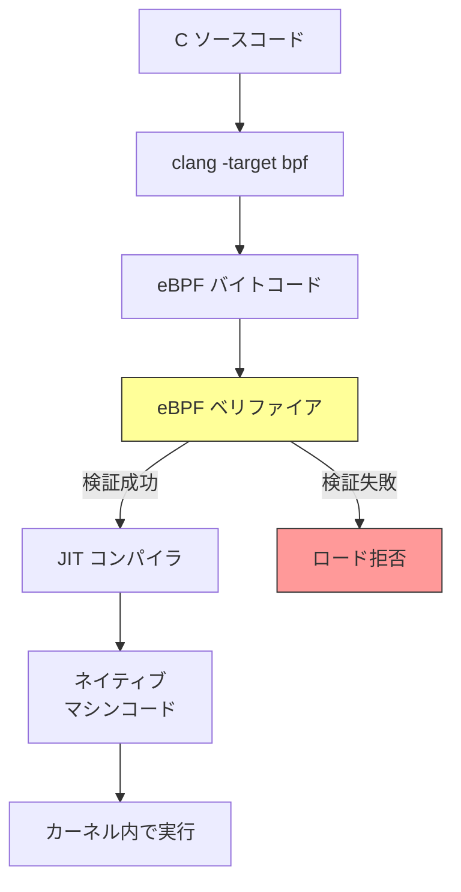

### 6.3 BPF マップ

XDP プログラムとユーザー空間のアプリケーション間のデータ共有には **BPF マップ** が使用される。マップはカーネル内のキーバリューストアであり、以下のような種類がある。

| マップ型 | 用途 |
|---------|------|
| `BPF_MAP_TYPE_HASH` | 汎用ハッシュテーブル（フロー追跡、ACL等） |
| `BPF_MAP_TYPE_ARRAY` | 固定サイズの配列（統計カウンタ等） |
| `BPF_MAP_TYPE_LRU_HASH` | LRU 付きハッシュ（接続テーブル等） |
| `BPF_MAP_TYPE_PERCPU_HASH` | CPU ごとのハッシュ（ロック不要のカウンタ） |
| `BPF_MAP_TYPE_LPM_TRIE` | 最長一致検索（IPルーティング等） |
| `BPF_MAP_TYPE_DEVMAP` | XDP_REDIRECT 先のデバイスマッピング |
| `BPF_MAP_TYPE_CPUMAP` | XDP_REDIRECT 先の CPU マッピング |
| `BPF_MAP_TYPE_XSKMAP` | AF_XDP ソケットへのマッピング |

ユーザー空間からマップを操作することで、XDP プログラムの動作を動的に変更できる。たとえばファイアウォールルールの追加や削除、統計情報の取得などが、XDP プログラム自体を再ロードすることなく可能である。

## 7. DPDK と XDP の比較

### 7.1 アーキテクチャの根本的な違い

DPDK と XDP は「カーネルネットワークスタックの限界を超える」という同じ目標を持つが、そのアプローチは根本的に異なる。

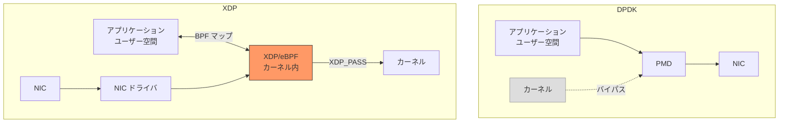

**DPDK はカーネルをバイパスする**: NIC を完全にユーザー空間に移管し、カーネルのネットワークスタックを一切経由しない。

**XDP はカーネルを拡張する**: カーネルのネットワークスタック内で、最も早い段階にフックポイントを設け、そこに eBPF プログラムを挿入する。

### 7.2 詳細比較

| 観点 | DPDK | XDP |
|------|------|-----|
| **実行空間** | ユーザー空間 | カーネル空間（eBPF） |
| **カーネルとの関係** | カーネルをバイパス | カーネルの一部として動作 |
| **最大性能** | 非常に高い（100Mpps超）| 高い（24Mpps程度/コア） |
| **CPU 消費** | ポーリングで100%消費 | 必要なときだけ処理 |
| **カーネルスタック併用** | 不可（NIC がカーネルから見えない） | 可能（XDP_PASS で通常スタックへ） |
| **プログラミング言語** | C/C++（制限なし） | C（eBPF 制約あり） |
| **安全性** | 低い（バグがプロセスをクラッシュ） | 高い（ベリファイアが保証） |
| **導入の容易さ** | 難しい（NIC バインド変更、Hugepage設定等） | 比較的容易（`ip link set` でアタッチ） |
| **NIC サポート** | DPDK 用 PMD が必要 | ドライバの XDP 対応が必要 |
| **デバッグ** | 通常のデバッガが使用可能 | 限定的（`bpf_trace_printk` 等） |
| **ライセンス** | BSD（プロプライエタリ利用可） | GPL（カーネルの一部） |

### 7.3 性能特性の違い

DPDK は絶対的な最大スループットでは XDP を上回る。これは以下の理由による。

1. **カーネル呼び出しが一切ない**: システムコール、割り込み、コンテキストスイッチが完全に排除される
2. **メモリ管理の完全な制御**: Hugepage上の事前確保されたバッファプールを使い、ランタイムのメモリアロケーションが不要
3. **プログラムの自由度**: eBPF の制約（ループ制限、命令数制限、スタックサイズ制限）がない

一方、XDP は以下の点で優位性を持つ。

1. **CPU効率**: トラフィックがないときは CPU を消費しない
2. **カーネルスタックとの共存**: XDP_PASS で通常のプロトコルスタック処理にフォールバックできる
3. **運用の安全性**: eBPF ベリファイアにより、プログラムのバグがカーネルクラッシュを引き起こさない
4. **動的な更新**: 稼働中に XDP プログラムを差し替え可能（アトミックな入れ替え）

### 7.4 AF_XDP — 両者の長所を取り込む

**AF_XDP** は Linux 4.18 で導入されたソケットタイプで、XDP と連携してユーザー空間での高速パケット処理を可能にする。XDP プログラムが `XDP_REDIRECT` でパケットを AF_XDP ソケットに転送し、ユーザー空間のアプリケーションがそのパケットを処理する。

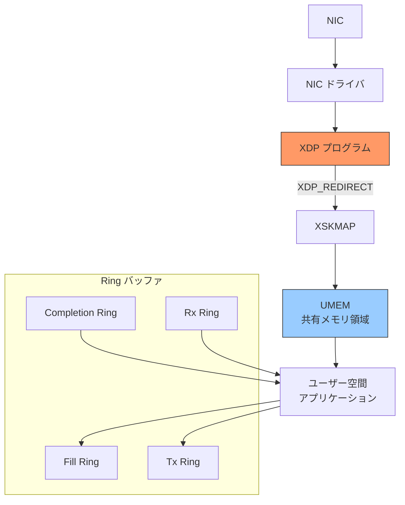

AF_XDP はカーネルとユーザー空間の間でメモリのコピーを行わず、共有メモリ領域（UMEM）を介してゼロコピーでパケットを受け渡す。性能面では DPDK に近いスループットが得られつつ、カーネルのネットワークスタックとの共存も可能という、両者の長所を取り込んだアプローチである。

## 8. ユースケース

### 8.1 DDoS 防御

XDP の最も代表的なユースケースが **DDoS 防御** である。DDoS 攻撃のパケットをカーネルスタックに到達させる前に `XDP_DROP` で破棄することで、攻撃トラフィックによるサーバーへの影響を最小化する。

Facebook（現 Meta）は2018年に、自社データセンターの全フロントエンドサーバーで XDP ベースの DDoS 防御システムを導入したことを発表した。従来の iptables ベースのフィルタリングと比較して、約10倍のパケット処理性能を達成した。

Cloudflare も XDP を DDoS 防御の主要コンポーネントとして使用している。彼らのブログによれば、XDP により1台のサーバーで数百万ppsの攻撃パケットを処理できるようになった。

```c
// Simplified XDP DDoS mitigation example
SEC("xdp")
int xdp_ddos(struct xdp_md *ctx) {
    void *data = (void *)(long)ctx->data;
    void *data_end = (void *)(long)ctx->data_end;

    struct ethhdr *eth = data;
    if ((void *)(eth + 1) > data_end)
        return XDP_PASS;

    if (eth->h_proto != __constant_htons(ETH_P_IP))
        return XDP_PASS;

    struct iphdr *ip = (void *)(eth + 1);
    if ((void *)(ip + 1) > data_end)
        return XDP_PASS;

    // Rate limiting per source IP using per-CPU map
    __u32 src = ip->saddr;
    struct rate_info *info = bpf_map_lookup_elem(&rate_map, &src);
    if (info) {
        __u64 now = bpf_ktime_get_ns();
        if (now - info->last_seen < RATE_WINDOW_NS &&
            info->count > MAX_PACKETS_PER_WINDOW) {
            return XDP_DROP;  // Rate exceeded, drop
        }
    }

    return XDP_PASS;
}
```

### 8.2 ソフトウェアロードバランサ

DPDK は高性能ソフトウェアロードバランサの構築に広く使用されている。

**Facebook の Katran**: XDP ベースのL4ロードバランサ。XDP_TX を使ってパケットを書き換え、バックエンドサーバーに転送する。DSR（Direct Server Return）方式を採用し、戻りトラフィックはロードバランサを経由しない。

**Google の Maglev**: DPDK を活用したL4ロードバランサ。コンシステントハッシングにより、接続のアフィニティを維持しつつ、バックエンドの追加・削除に対応する。

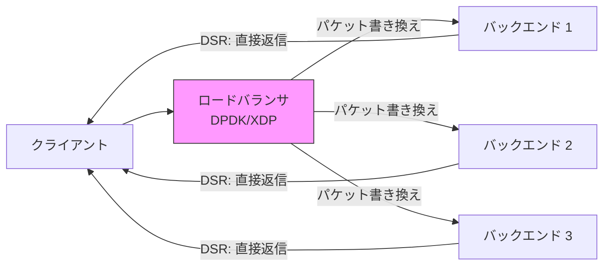

### 8.3 仮想スイッチ / vRouter

**OVS-DPDK（Open vSwitch with DPDK）**: 仮想化環境におけるソフトウェアスイッチ。DPDK のバックエンドを使うことで、カーネルの OVS と比較して大幅な性能向上を実現する。OpenStack や Kubernetes のネットワーキングで使用される。

**FD.io VPP（Vector Packet Processing）**: Cisco が開発した DPDK ベースの高性能パケット処理エンジン。ベクトル処理（複数のパケットをまとめて同じ処理ノードに通す）により、命令キャッシュの効率を最大化する。

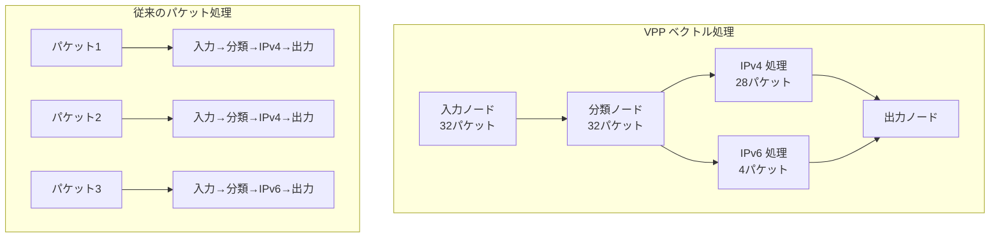

ベクトル処理では、同じ処理関数を複数のパケットに対して連続して適用する。これにより命令キャッシュの局所性が向上し、パイプラインの効率が改善される。

### 8.4 ネットワーク機能仮想化（NFV）

通信キャリアは、従来専用ハードウェア（ファイアウォール、IDS/IPS、DPIなど）で実装していたネットワーク機能を、DPDK を使ってソフトウェアで実装する **NFV（Network Functions Virtualization）** に移行しつつある。これにより、汎用サーバー上でキャリアグレードのパケット処理性能を実現できる。

### 8.5 テレメトリとモニタリング

XDP は高速なパケットサンプリングやフローモニタリングにも使用される。全パケットに対して軽量な統計処理を XDP で行い、詳細な解析が必要なパケットだけを `XDP_PASS` でカーネルスタックに渡す、という階層的なアプローチが取れる。

## 9. 実装の注意点

### 9.1 DPDK 導入の注意点

**NIC の専有**: DPDK にバインドした NIC はカーネルから見えなくなる。管理用ネットワークと DPDK 用ネットワークは物理的に分離すべきである。

**CPU コアの専有**: PMD ループは CPU コアを100%消費する。`isolcpus` カーネルパラメータで DPDK 用コアを OS のスケジューラから隔離し、割り込みが入らないようにする。

```bash
# Kernel boot parameters for DPDK
isolcpus=2-7 nohz_full=2-7 rcu_nocbs=2-7
```

**Hugepage の事前確保**: Hugepage はシステム起動時に確保するのが確実。ランタイムでの確保はメモリの断片化により失敗する場合がある。

**アプリケーションの複雑さ**: TCP/IP スタックがないため、自前で実装するか、DPDK のライブラリ（`librte_ip_frag` 等）を使う必要がある。ARP、ICMP、TCP などの処理をすべて自前で書くのは膨大な作業になる。

::: tip
DPDK ベースのユーザー空間 TCP スタックとして、**mTCP**（KAIST）や **Seastar**（ScyllaDB で使用）、**F-Stack**（FreeBSD のスタックを DPDK 上にポーティング）などがある。フルスクラッチで TCP スタックを書くよりも、これらの既存実装の活用を検討すべきである。
:::

### 9.2 XDP 導入の注意点

**eBPF の制約**: XDP プログラムには eBPF 由来の制約がある。

- ループは有限回で終了することを静的に証明できなければならない（Linux 5.3 以降、bounded loop がサポートされた）
- スタックサイズは512バイトに制限される
- 呼び出せる関数はBPFヘルパー関数とBPF-to-BPF関数のみ
- 動的メモリアロケーション不可

**NIC ドライバの対応**: ネイティブモードの XDP はドライバの対応が必要。主要な NIC ドライバ（`i40e`、`ixgbe`、`mlx5`、`bnxt` など）は対応しているが、すべてのドライバが対応しているわけではない。

**MTU の制限**: XDP はマルチバッファ対応が後から追加された（Linux 5.18）ため、それ以前のカーネルでは MTU がページサイズ以内に制限される場合がある。ジャンボフレームを使用する場合は注意が必要。

**デバッグの困難さ**: カーネル内で実行されるため、通常のデバッガ（gdb等）は使えない。`bpf_trace_printk()` によるトレース出力や `bpftool` によるマップの検査が主なデバッグ手段となる。

```bash
# View loaded XDP programs
bpftool prog list

# Inspect BPF map contents
bpftool map dump id <map_id>

# View XDP statistics
bpftool net show

# Read trace output
cat /sys/kernel/debug/tracing/trace_pipe
```

### 9.3 共通の注意点

**テスト環境の構築**: 本番の NIC がなくても、テスト環境を構築する方法がある。

- DPDK: `net_pcap` PMD（pcap ファイルからパケットを読む仮想 PMD）
- XDP: veth ペア + Generic XDP でテスト可能

**パケット生成ツール**: 性能テストには専用のパケット生成ツールが必要。

- **TRex**: DPDK ベースのトラフィックジェネレータ。ステートフル・ステートレスの両モードをサポート
- **pktgen-dpdk**: DPDK 付属のシンプルなパケット生成ツール
- **XDP のテスト**: `xdp_test_run` BPF コマンドでプログラムの単体テストが可能

### 9.4 セキュリティの考慮事項

**DPDK のセキュリティリスク**: DPDK アプリケーションは root 権限（または `CAP_SYS_RAWIO` 等のケーパビリティ）で動作し、NIC のハードウェアレジスタに直接アクセスする。DPDK アプリケーションのバグは、パケットの漏洩、DMA による任意のメモリアクセス、NIC の誤設定など、深刻なセキュリティ問題を引き起こす可能性がある。VFIO と IOMMU を使用することで、DMA のアクセス範囲をハードウェアレベルで制限できるが、完全ではない。

**XDP のセキュリティ**: eBPF ベリファイアにより、XDP プログラムが不正なメモリアクセスやカーネルクラッシュを引き起こさないことが保証される。ただし、XDP プログラムのロードには `CAP_BPF`（Linux 5.8以降）または `CAP_SYS_ADMIN` ケーパビリティが必要であり、悪意のある XDP プログラムは正当なトラフィックを破棄するなどのサービス妨害が可能である。

## 10. 今後の展望

### 10.1 ハードウェアの進化

**SmartNIC / DPU（Data Processing Unit）**: NVIDIA（Mellanox）の BlueField、Intel の IPU（Infrastructure Processing Unit）、AMD/Pensando の DSC など、NIC にプログラマブルなプロセッサを搭載した SmartNIC が普及しつつある。XDP のオフロードや、DPDK の処理の一部を SmartNIC に移すことで、ホストの CPU をアプリケーション処理に集中させられる。

**CXL（Compute Express Link）**: CXL によるメモリプーリングは、NUMA の制約を緩和し、パケットバッファの配置に新たな選択肢をもたらす可能性がある。

### 10.2 ソフトウェアの進化

**AF_XDP の成熟**: AF_XDP は DPDK の代替として注目されている。DPDK 自体も AF_XDP バックエンドの PMD（`net_af_xdp`）を提供しており、DPDK アプリケーションを AF_XDP 上で動作させることが可能になっている。これにより、DPDK のプログラミングモデルを維持しつつ、カーネルのネットワークスタックとの共存が実現する。

**eBPF の進化**: eBPF は XDP 以外にも、TC（Traffic Control）、cgroup、ソケットフィルタなど多くのフックポイントで使用されている。eBPF の機能拡張（kfunc、BPF arena、BPF token など）により、XDP プログラムの表現力も増し続けている。

**P4 との統合**: P4（Programming Protocol-independent Packet Processors）は、パケット処理パイプラインを記述するための宣言的言語である。P4 で記述したロジックを eBPF/XDP にコンパイルする取り組みが進んでおり、ハードウェアスイッチとソフトウェアスイッチの統一的なプログラミングモデルが模索されている。

### 10.3 選択の指針

最後に、DPDK と XDP の選択指針を整理する。

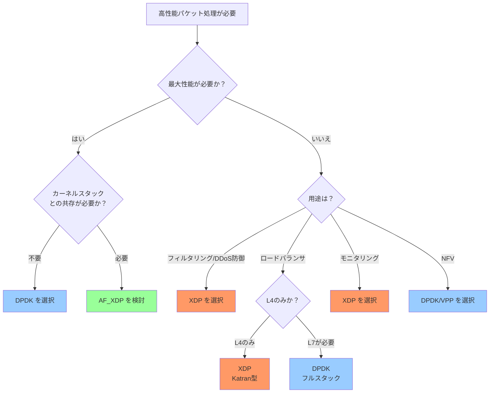

DPDK と XDP は対立する技術ではなく、**相補的**な技術である。DDoS 防御やシンプルなパケットフィルタリングには XDP が適しており、フルステートフルなパケット処理や最大限のスループットが必要な場合は DPDK が適している。そして AF_XDP は両者の中間に位置し、カーネルとの共存と高性能を両立させる選択肢として成熟しつつある。

重要なのは、これらの技術を導入する前に、本当にカーネルのネットワークスタックが限界に達しているかを確認することだ。多くの場合、カーネルのチューニング（RSS の設定、GRO/GSO の有効化、eBPF によるフィルタリングの最適化、`SO_REUSEPORT` の使用など）だけで十分な性能が得られる。DPDK や XDP は強力な武器だが、それに見合った複雑さも伴う。問題の性質と規模に応じて、適切な技術を選択することが肝要である。
