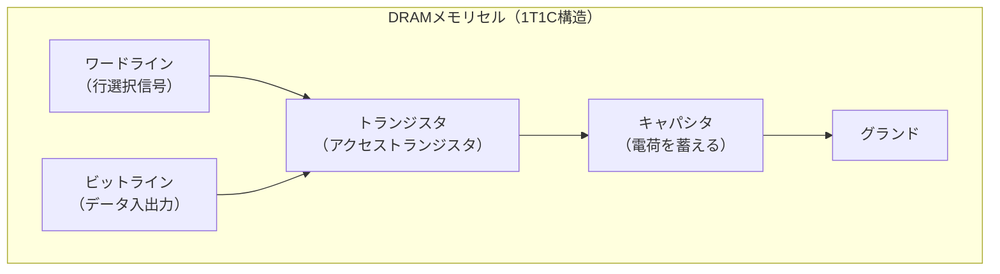
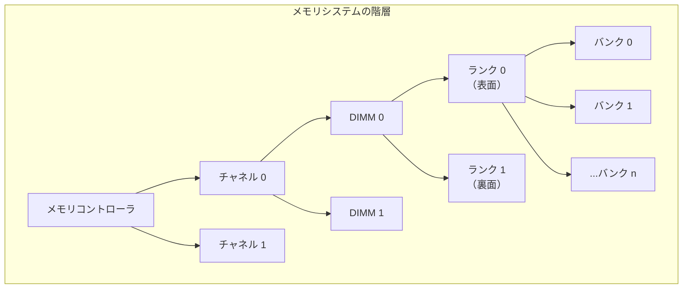
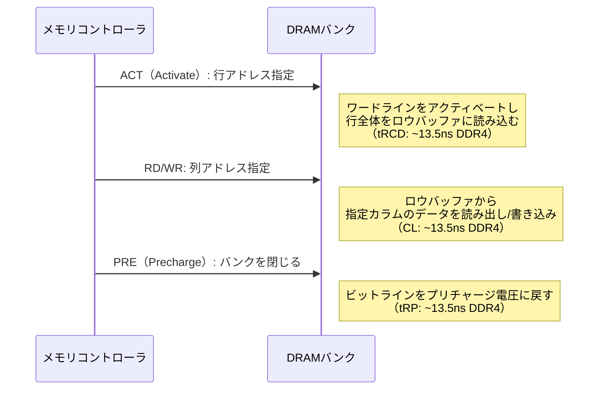
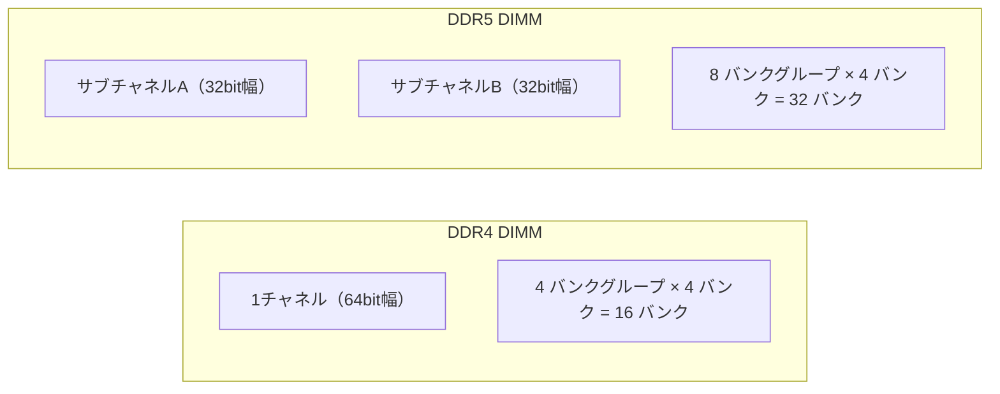
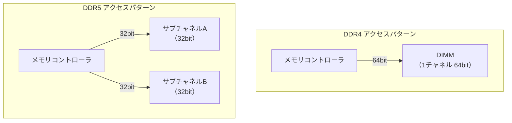
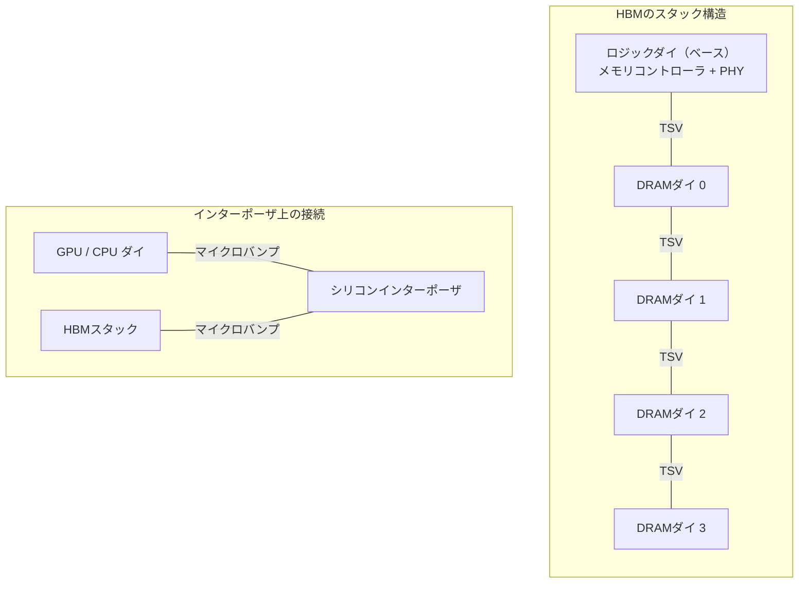
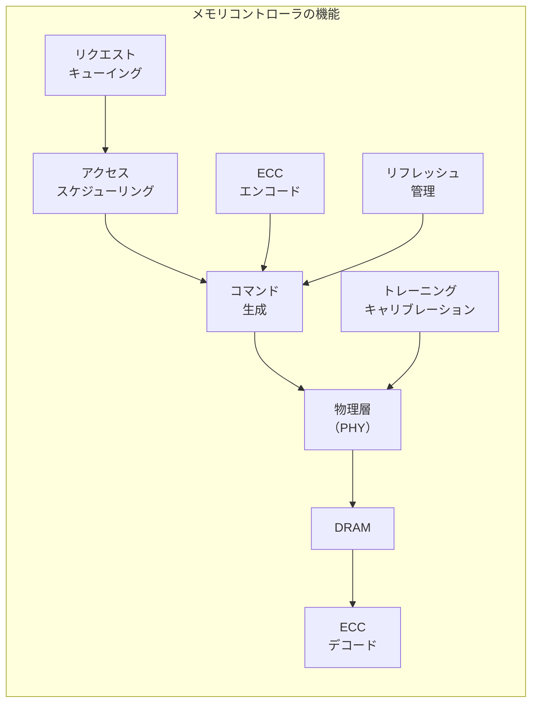
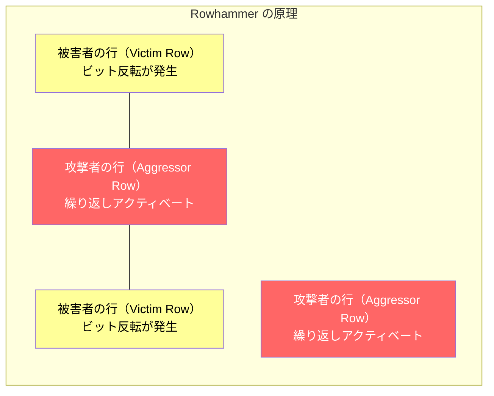
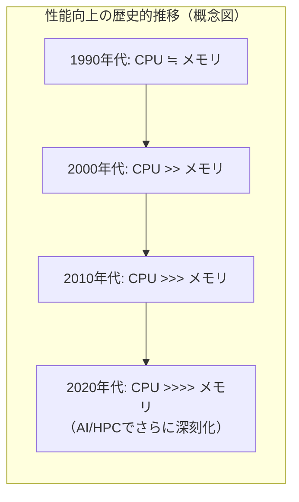
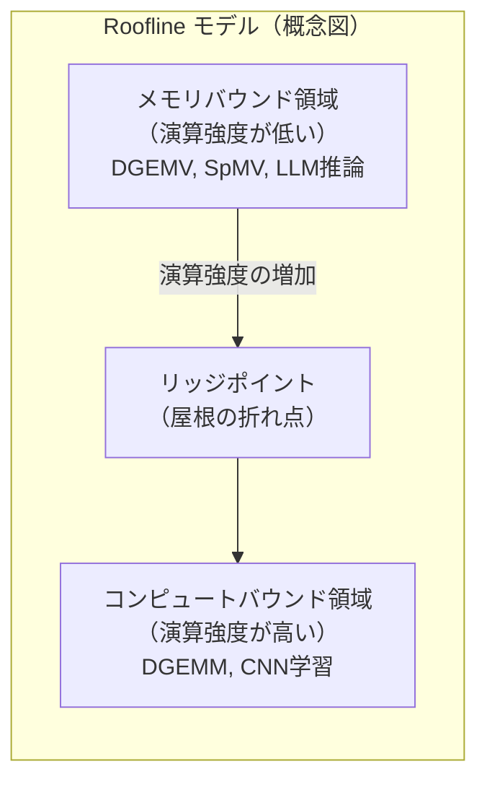

# DRAMとメモリ技術 — DDR4/DDR5からHBMまで

## 1. DRAMの基本動作原理

### 1.1 なぜDRAMが必要なのか

コンピュータが動作するためには、CPUが処理するデータやプログラムを一時的に格納するメインメモリが必要である。このメインメモリに求められる性質は、大容量・低コスト・ランダムアクセス可能の3つである。

SRAM（Static RAM）はトランジスタ6個でフリップフロップ回路を構成し、電力が供給されている限りデータを保持し続ける。高速だがセルあたりの面積が大きく、ビットあたりのコストが高い。そのためSRAMはCPUキャッシュのような小容量・高速用途に限定される。

一方、**DRAM（Dynamic RAM）** はトランジスタ1個とキャパシタ（コンデンサ）1個という極めてシンプルな構成で1ビットを記憶する。セルあたりの面積が小さいため高密度に集積でき、ビットあたりのコストがSRAMの数十分の一に抑えられる。この圧倒的なコスト優位性こそが、DRAMがメインメモリの標準技術であり続ける根本的な理由である。

| 特性 | SRAM | DRAM |
|---|---|---|
| セル構成 | 6トランジスタ | 1トランジスタ + 1キャパシタ |
| リフレッシュ | 不要 | 必要（約64ms周期） |
| アクセス速度 | ~1ns | ~50-100ns |
| 集積密度 | 低い | 高い |
| ビットあたりコスト | 高い | 低い |
| 主な用途 | CPUキャッシュ | メインメモリ |

### 1.2 1T1C セルの動作原理

DRAMの記憶セルは**1T1C（1 Transistor, 1 Capacitor）** 構造と呼ばれる。トランジスタはスイッチとして機能し、キャパシタに蓄えられた電荷の有無が0と1を表す。



データの書き込みと読み出しの流れは以下の通りである。

**書き込み動作**

1. ワードライン（行選択線）をHIGHにしてトランジスタをONにする
2. ビットライン（列選択線）にHIGH（論理1）またはLOW（論理0）の電圧を印加する
3. キャパシタに電荷が蓄えられる（1）、または放電される（0）
4. ワードラインをLOWにしてトランジスタをOFFにし、電荷を閉じ込める

**読み出し動作**

1. ビットラインをプリチャージ電圧（VDD/2）に初期化する
2. ワードラインをHIGHにしてトランジスタをONにする
3. キャパシタの電荷がビットラインに流出し、ビットラインの電圧がわずかに変動する
4. **センスアンプ**がこの微小な電圧変動を検出・増幅して0/1を判定する
5. 読み出しによりキャパシタの電荷は破壊されるため、センスアンプが判定した値を書き戻す

ここで極めて重要な点は、DRAMの読み出しが**破壊読み出し（destructive read）** であることだ。キャパシタの電荷をビットラインに流出させることで読み出すため、読み出し後にはキャパシタの電荷が失われる。そのため、毎回の読み出し後にデータを再書き込み（リストア）する必要がある。

### 1.3 センスアンプの役割

現代のDRAMでは、キャパシタの容量は約20〜30フェムトファラド（fF）程度であり、ビットラインの寄生容量に比べてはるかに小さい。そのため、キャパシタからビットラインに電荷が流出しても、ビットラインの電圧変化は数十〜百数十ミリボルト程度にしかならない。

**センスアンプ（sense amplifier）** は、この微小な電圧差を検出し、フルスイングのデジタル信号（VDDまたはGND）に増幅する回路である。センスアンプは正帰還を利用した差動増幅器として設計されており、ビットラインのプリチャージ電圧からの偏差の方向を検出して、それを確定的な0または1に変換する。

センスアンプの感度と速度は、DRAM全体の性能と信頼性に直結する。プロセスの微細化に伴いキャパシタの容量が減少すると、センスアンプに求められる感度はさらに高くなり、ノイズマージンの確保が技術的な課題となる。

## 2. リフレッシュ — DRAMの宿命

### 2.1 電荷のリーク

DRAMのキャパシタは理想的なデバイスではない。トランジスタのリーク電流や接合リーク電流により、蓄えられた電荷は時間とともに徐々に減少する。電荷が一定の閾値を下回ると、センスアンプが正しい値を読み出せなくなり、データが失われる。

この電荷のリーク速度は温度に強く依存する。温度が上昇するとリーク電流は指数関数的に増加し、データの保持時間（リテンション時間）は短くなる。JEDEC（半導体技術の標準化団体）の仕様では、DRAM内の全セルが正常にデータを保持できる最悪条件として、85℃で64msのリテンション時間を保証することが求められる。

### 2.2 リフレッシュ動作

データの消失を防ぐために、DRAMでは定期的にすべてのセルを読み出し、データを再書き込みする**リフレッシュ（refresh）** 操作が必要である。これがDRAMの名前の由来となっている "Dynamic" の意味するところだ。電力が供給されている限りデータを保持し続けるSRAMの "Static" とは対照的である。

リフレッシュの基本的な仕組みは以下の通りである。

1. リフレッシュ対象の行（ロウ）のワードラインをアクティベートする
2. その行に接続されたすべてのセルの電荷がビットラインに流出する
3. センスアンプがすべてのビットの値を判定する
4. 判定した値をキャパシタに書き戻す（リストア）
5. ワードラインをディアクティベートする

つまりリフレッシュは、通常の読み出し動作に含まれるリストアフェーズと本質的に同じ動作である。ただしリフレッシュの場合、データを外部に出力する必要がないため、ビットラインの電圧をセンスアンプで増幅してキャパシタに書き戻すだけで完了する。

### 2.3 リフレッシュのスケジューリング

JEDEC規格では、DDR4/DDR5ともに、標準温度範囲（0〜85℃）において全行を**64ms以内**にリフレッシュすることが要求される。高温環境（85〜95℃）では、リテンション時間が短くなるため、リフレッシュ間隔を半分の32msに短縮する必要がある。

リフレッシュコマンドには主に2つのモードがある。

- **オートリフレッシュ（Auto Refresh, REF）**: メモリコントローラが一定間隔でREFコマンドを発行する。DRAM内部のリフレッシュカウンタが次にリフレッシュすべき行を自動的に決定する。DDR4では8192行を64msでリフレッシュするため、約7.8μs（=64ms/8192）ごとにREFコマンドが必要となる。
- **セルフリフレッシュ（Self Refresh）**: システムがアイドル状態やスリープ状態のとき、DRAMが自律的にリフレッシュを実行する。メモリコントローラの介入なしに動作するため、省電力モードで使用される。

### 2.4 リフレッシュのオーバーヘッド

リフレッシュ中の行はアクセスできないため、リフレッシュはDRAMの実効帯域幅を低下させる。リフレッシュに費やされる時間の割合（リフレッシュオーバーヘッド）は、DRAMの容量が増加するほど大きくなる。

DDR4の8Gbダイでは、リフレッシュオーバーヘッドは約5〜10%程度と見積もられている。DDR5ではダイ容量がさらに増加しているが、後述するように、ダイ内部を2つの独立したサブチャネルに分割し、それぞれが個別にリフレッシュを管理する設計により、オーバーヘッドの増大を抑制している。

将来のDRAM世代で容量がさらに増大すると、リフレッシュオーバーヘッドは深刻な問題となる可能性がある。これに対処するため、**FGR（Fine Granularity Refresh）** や行単位のリフレッシュスケジューリングといった技術が研究されている。

## 3. メモリの階層構造 — チャネル・ランク・バンク

### 3.1 メモリシステムの物理的階層

DRAMベースのメモリシステムは、複数の階層レベルで組織化されている。この階層構造を理解することは、メモリ帯域幅やレイテンシの特性を把握する上で不可欠である。



各階層レベルの役割を以下に説明する。

### 3.2 チャネル（Channel）

**チャネル**は、メモリコントローラとDIMMを接続する独立したデータバスである。各チャネルは独自のコマンドバス、アドレスバス、データバスを持ち、他のチャネルと完全に独立して動作する。

DDR4ではチャネルあたり64ビット幅のデータバスを持つ。DDR5ではチャネルあたりのデータバス幅は32ビットに変更されたが、1つのDIMMが2つの独立したサブチャネルを持つため、実質的には2つの32ビットチャネルとして動作する。

複数チャネルを使用することで、メモリ帯域幅を線形にスケールさせることができる。現代のデスクトップ向けCPUは2チャネル（デュアルチャネル）、サーバ向けCPUは4〜8チャネルが一般的である。

### 3.3 DIMM（Dual Inline Memory Module）

**DIMM**は、複数のDRAMチップを搭載したメモリモジュール（基板）である。"Dual Inline" の名称は、基板の表裏で異なるピン配列を持つことに由来する。各チャネルには1つ以上のDIMMを装着できる。

DIMMの種類には以下がある。

- **UDIMM（Unbuffered DIMM）**: バッファなし。デスクトップ・ノートPC向け。低レイテンシだが搭載枚数に制限がある
- **RDIMM（Registered DIMM）**: レジスタバッファ付き。サーバ向け。アドレス/コマンド信号をバッファリングすることで、1チャネルあたりのDIMM搭載数を増やせる
- **LRDIMM（Load-Reduced DIMM）**: データバスもバッファリング。大容量構成向け。信号品質を改善し、さらに多くのランクを搭載できる
- **SO-DIMM**: 小型フォームファクタ。ノートPC・組み込み向け

### 3.4 ランク（Rank）

**ランク**は、1回のメモリアクセスで同時に応答するDRAMチップの集合である。DDR4の場合、1ランクは64ビットのデータを供給するために、8つの×8（8ビット幅）チップ、または4つの×16（16ビット幅）チップで構成される。ECCメモリの場合、追加の8ビットのECC用チップが加わり、72ビット幅（64ビット + 8ビットECC）となる。

DIMMの表裏にチップが実装されている場合、通常は表面が1つのランク、裏面がもう1つのランクとなる（2ランク構成）。複数のランクは同一のデータバスを時分割で共有するため、ランク数を増やしても帯域幅は向上しないが、並列性の向上によりバンクの総数が増え、アクセスの隠蔽（バンクインターリーブ）が効率的に行える。

### 3.5 バンク（Bank）

**バンク**は、各DRAMチップ内部の独立した記憶ブロックである。各バンクは独自のセンスアンプとロウバッファを持ち、他のバンクと独立して動作できる。DDR4では1チップあたり16バンク（4バンクグループ × 4バンク）、DDR5では32バンク（8バンクグループ × 4バンク）を持つ。

バンクの内部構造は2次元のメモリセルアレイであり、行（ロウ）と列（カラム）で構成される。メモリアクセスは以下の3つのフェーズで行われる。



この3フェーズの動作が、DRAMアクセスのレイテンシを規定する。主要なタイミングパラメータは以下の通りである。

- **tRCD（RAS to CAS Delay）**: ACTコマンド発行からRD/WRコマンド発行までの最小待ち時間。行をロウバッファに読み込む時間
- **CL（CAS Latency）**: RDコマンド発行からデータがバス上に現れるまでの待ち時間
- **tRP（RAS Precharge）**: PREコマンド発行から次のACTコマンドが発行可能になるまでの待ち時間
- **tRAS（Active to Precharge）**: ACTコマンド発行からPREコマンドが発行可能になるまでの最小時間

### 3.6 バンクグループ

DDR4で導入された**バンクグループ（Bank Group）** は、バンクをグループ化する追加の階層レベルである。同一バンクグループ内のバンク間の連続アクセスにはより長い待ち時間（tCCD_L）が必要だが、異なるバンクグループ間の連続アクセスはより短い待ち時間（tCCD_S）で実行できる。

この設計により、異なるバンクグループへのアクセスをインターリーブすることで、実効的なデータ転送レートを向上させることができる。DDR5ではバンクグループ数が8に増加し、この効果がさらに強化されている。

### 3.7 ロウバッファのヒットとミス

バンク内のメモリアクセスにおいて、性能に大きな影響を与えるのが**ロウバッファ**の状態である。

- **ロウバッファヒット**: アクセスしたい行がすでにロウバッファに読み込まれている場合、ACTコマンドは不要で、CASコマンドのみで即座にデータにアクセスできる。レイテンシはCLのみ。
- **ロウバッファミス**: アクセスしたい行がロウバッファにない（バンクが閉じている）場合、ACT→CASの2ステップが必要。レイテンシはtRCD + CL。
- **ロウバッファコンフリクト**: 異なる行がロウバッファに読み込まれている場合、まず現在の行をPREで閉じてから、新しい行をACTで開く必要がある。レイテンシはtRP + tRCD + CL。これが最もペナルティが大きい。

メモリコントローラのアクセススケジューリングアルゴリズムは、ロウバッファヒット率を最大化するように設計される。代表的なポリシーとして、同じ行へのアクセスを優先する**FR-FCFS（First-Ready, First-Come, First-Served）** がある。

## 4. DDR4 — 成熟した主力メモリ技術

### 4.1 DDR4の技術的特徴

DDR4（Double Data Rate 4th generation）は、2014年に策定されたDRAM規格であり、長年にわたりPCおよびサーバのメインメモリの主流を担ってきた。DDR4の主要な技術的特徴を以下にまとめる。

**動作電圧**: DDR4は1.2Vで動作する。DDR3の1.5V（DDR3Lで1.35V）から低電圧化されており、消費電力の低減と高クロック動作の両立に寄与している。

**データレート**: DDR4の標準データレートは1600〜3200MT/s（Mega Transfers per second）である。クロック周波数はその半分（800〜1600MHz）であり、クロックの立ち上がりと立ち下がりの両エッジでデータを転送するDDR方式により、クロック周波数の2倍の転送レートを実現する。

**プリフェッチ幅**: DDR4のプリフェッチ幅は8nビット（8n prefetch）である。つまり、DRAMの内部クロック1サイクルで8ビット分のデータをプリフェッチし、外部I/Oで8回に分けてシリアルに転送する。これにより、内部コアの動作周波数を外部転送レートの1/8に抑えることができる。

**バンク構成**: DDR4は4バンクグループ × 4バンク＝16バンクの構成を取る。バンクグループの導入により、異なるバンクグループへの連続アクセスのタイミング制約が緩和され、帯域幅の向上が実現されている。

### 4.2 DDR4のタイミングパラメータ

DDR4-3200（CL22）の代表的なタイミングパラメータを示す。

| パラメータ | クロック数 | 時間（ns） |
|---|---|---|
| CL（CAS Latency） | 22 | 13.75 |
| tRCD | 22 | 13.75 |
| tRP | 22 | 13.75 |
| tRAS | 52 | 32.50 |
| tRC（tRAS + tRP） | 74 | 46.25 |

注目すべきは、DDR世代が進みデータレートが向上しても、**ナノ秒単位のアクセスレイテンシはほとんど改善されていない**という点である。DDR3-1600のCLは約13.75ns、DDR4-3200のCLも約13.75nsである。クロック数としてのCLは増加しているが、実時間でのレイテンシはほぼ横ばいである。これは、DRAMの高速化がレイテンシの改善ではなく、帯域幅の向上（スループットの改善）によって達成されていることを意味する。

### 4.3 DDR4の帯域幅

DDR4チャネルの理論最大帯域幅は以下の式で計算できる。

$$
\text{帯域幅} = \text{データレート} \times \text{バス幅} = 3200 \text{ MT/s} \times 8 \text{ バイト} = 25.6 \text{ GB/s}
$$

デュアルチャネル構成では51.2 GB/s、サーバ向けの6チャネル構成では153.6 GB/sの理論最大帯域幅が得られる。

## 5. DDR5 — 次世代メインメモリ

### 5.1 DDR5の主要な革新点

DDR5は2020年にJEDECにより策定され、DDR4から多くの点で大幅な改良が施されている。



**動作電圧の低減**: DDR5は1.1Vで動作する。DDR4の1.2Vからさらに0.1V低下させることで、消費電力密度を低減し、高速動作時の発熱を抑制する。

**データレートの大幅向上**: DDR5の初期規格は4800MT/sからスタートし、DDR5-8800まで拡張されている。DDR4-3200の最大1.5〜2.75倍のデータレートを実現する。

**プリフェッチ幅の拡大**: DDR5のプリフェッチ幅は16nビット（16n prefetch）に倍増された。これにより内部コア周波数を抑えつつ、外部転送レートを向上させることが可能になった。

### 5.2 サブチャネルアーキテクチャ

DDR5最大の構造的革新は、**サブチャネルアーキテクチャ**の導入である。DDR4では1つのDIMMが1つの64ビットチャネルとして動作するのに対し、DDR5では1つのDIMMが2つの独立した32ビットサブチャネルに分割される。



この設計変更の利点は以下の通りである。

1. **バースト長の最適化**: DDR4のバースト長は8（8×64bit = 64バイト = キャッシュライン1本分）であった。DDR5ではバースト長が16に拡大されたが、サブチャネルが32ビット幅であるため、1回のバーストで転送されるデータ量は16×32bit = 64バイトとなり、キャッシュラインサイズとの整合性が保たれる。
2. **独立したコマンドキュー**: 各サブチャネルが独立したコマンドキューを持つため、2つの独立したメモリリクエストを並列に処理できる。これにより、特に小さなランダムアクセスが多いワークロードでの実効帯域幅が向上する。
3. **リフレッシュの独立化**: 各サブチャネルが個別にリフレッシュを実行できるため、一方のサブチャネルがリフレッシュ中でも、もう一方はアクセス可能である。

### 5.3 オンダイECC

DDR5では、**オンダイECC（on-die ECC）** がDRAMチップ内部に標準搭載された。これは、プロセスの微細化に伴いセルの信頼性が低下していることへの対策である。

オンダイECCは、DRAMチップ内部で128ビットのデータに対して8ビットの冗長ビットを付加し、SECDED（Single Error Correction, Double Error Detection）符号を適用する。これにより、チップ内部での単一ビットエラーは自動的に訂正される。

重要な点として、オンダイECCはシステムレベルのECC（RDIMMなどで使用される）とは別のメカニズムである。オンダイECCはDRAMチップ内部で完結し、外部からは透過的に動作する。システムレベルのECCは、メモリコントローラが管理し、チップ間・ランク間のエラーも検出・訂正できる。

### 5.4 電圧レギュレータの統合（PMIC）

DDR4では、マザーボード上の電圧レギュレータ（VRM）がDIMMに電力を供給していた。DDR5では、**PMIC（Power Management Integrated Circuit）** がDIMM上に搭載され、電圧レギュレーションをDIMM自身が行う。

この設計変更により、以下の利点が得られる。

- マザーボードからDIMMへの電力供給が12V単一系統に簡素化される
- DIMM上で最適な電圧レギュレーションが行えるため、電力効率が向上する
- 信号品質の改善により、高データレート動作が容易になる

### 5.5 DDR4 vs DDR5 比較表

| 特性 | DDR4 | DDR5 |
|---|---|---|
| 動作電圧 | 1.2V | 1.1V |
| データレート | 1600-3200 MT/s | 4800-8800 MT/s |
| プリフェッチ幅 | 8n | 16n |
| バースト長 | 8 | 16 |
| チャネル構成 | 1×64bit | 2×32bit（サブチャネル） |
| バンク数 | 16（4BG×4） | 32（8BG×4） |
| オンダイECC | なし | 標準搭載 |
| 電源管理 | マザーボード側VRM | DIMM上PMIC |
| DIMMあたり最大容量 | 64GB（一般的） | 256GB以上 |

## 6. HBM（High Bandwidth Memory）

### 6.1 HBMが解決する問題

従来のDDR型メモリは、CPU/GPUダイとメモリチップがPCB（プリント基板）上の配線で接続される。この接続方式では、配線の本数（バス幅）が物理的なピン数やPCBの配線密度によって制約される。データレートをいくら向上させても、バス幅がボトルネックとなって帯域幅のスケーリングに限界が生じる。

**HBM（High Bandwidth Memory）** は、この帯域幅のボトルネックを根本的に解消するために開発されたメモリ技術である。HBMの核心的なアイデアは2つある。

1. **3Dスタッキング**: 複数のDRAMダイを垂直に積層し、TSV（Through-Silicon Via、シリコン貫通ビア）で相互接続する
2. **インターポーザ接続**: メモリスタックをシリコンインターポーザ上でGPU/CPUダイと超短距離で接続する



### 6.2 HBMの世代と進化

HBMは複数世代にわたって進化してきた。

| 世代 | 策定年 | スタック段数 | 容量/スタック | 帯域幅/スタック | バス幅 |
|---|---|---|---|---|---|
| HBM | 2013 | 4段 | 1-4GB | 128 GB/s | 1024bit |
| HBM2 | 2016 | 4-8段 | 4-8GB | 256 GB/s | 1024bit |
| HBM2E | 2018 | 8段 | 8-16GB | 307-461 GB/s | 1024bit |
| HBM3 | 2022 | 8-12段 | 16-24GB | 614-819 GB/s | 1024bit |
| HBM3E | 2023 | 8-12段 | 24-36GB | 960-1229 GB/s | 1024bit |

HBMの帯域幅が桁違いに大きい理由は、1024ビット（128バイト）という極めて広いバス幅にある。DDR5の1チャネルが32ビット幅であることと比較すると、HBM1つのスタックはDDR5の32チャネル分に相当するバス幅を持つ。この超広幅バスを実現できるのは、TSVとインターポーザによる超高密度接続技術のおかげである。

### 6.3 TSV（Through-Silicon Via）技術

**TSV**は、シリコンウェハを垂直方向に貫通する微細な導電性の穴であり、積層されたダイ間の電気的接続を提供する。TSVの直径は通常5〜10μm程度であり、PCB上のビア（数百μm）と比較して桁違いに小さい。

TSVの利点は以下の通りである。

- **超短距離接続**: ダイ間の接続距離が数十μmに短縮され、信号伝搬遅延と消費電力が大幅に低減される
- **超高密度接続**: 1つのHBMスタックで数千本のTSVを実装でき、1024ビット幅のバスを実現できる
- **低消費電力**: 配線長が短いため、pJ/bit（ビットあたりのエネルギー）がDDR型メモリの数分の一になる

### 6.4 HBMの用途とエコシステム

HBMは、その高い帯域幅が不可欠なワークロードで採用されている。

**GPU/アクセラレータ**: HBMの最大の市場はGPU、特にAI/HPC向けのハイエンドGPUである。NVIDIA H100はHBM3を搭載し、最大3.35 TB/sのメモリ帯域幅を実現する。H200ではHBM3Eに移行し、4.8 TB/sに達する。大規模言語モデル（LLM）の推論や学習では、モデルパラメータのメモリからの読み出しが性能のボトルネックとなるため、HBMの超高帯域幅が不可欠である。

**HPC**: 科学技術計算、流体シミュレーション、気象予報などの分野で使用されるスーパーコンピュータの多くがHBM搭載アクセラレータを利用している。

**ネットワーク機器**: 高性能なネットワークスイッチやルータでも、パケットバッファ用にHBMが採用されるケースが増えている。

ただし、HBMにはコストが高い、容量がDDR型メモリと比較して限定的、放熱が課題になるといったデメリットもある。そのため、GPU/CPUには通常HBMとDDRの両方が搭載され、用途に応じて使い分けられる。

## 7. メモリコントローラ

### 7.1 メモリコントローラの役割

**メモリコントローラ**は、CPUとDRAMの間に位置し、メモリアクセスの管理を一手に担うハードウェアコンポーネントである。現代のCPUでは、メモリコントローラはCPUダイ上に統合されている（**IMC: Integrated Memory Controller**）。

メモリコントローラの主要な責務は以下の通りである。



### 7.2 アクセススケジューリング

メモリコントローラの最も重要な機能の一つが、**アクセススケジューリング**である。CPUから発行されるメモリリクエストは、必ずしも発行順に処理する必要はない。DRAMのタイミング制約とバンク構造を考慮して、リクエストの実行順序を最適化することで、実効帯域幅とレイテンシを大幅に改善できる。

代表的なスケジューリングポリシーを以下に示す。

- **FCFS（First-Come, First-Served）**: リクエストを到着順に処理する。最も単純だが、ロウバッファヒット率が低い
- **FR-FCFS（First-Ready, First-Come, First-Served）**: ロウバッファヒットが見込めるリクエストを優先する。同じ行への連続アクセスをまとめることで、ACTとPREのオーバーヘッドを削減する。広く採用されている
- **PAR-BS（Parallelism-Aware Batch Scheduling）**: リクエストをバッチに分割し、バッチ内のバンクレベル並列性を最大化する。マルチコア環境での公平性も考慮する

### 7.3 アドレスマッピング

メモリコントローラは、CPUが生成する物理アドレスを、DRAM固有のアドレス空間（チャネル、ランク、バンクグループ、バンク、行、列）にマッピングする。このマッピング方式は、メモリアクセスパターンに応じた性能に大きな影響を与える。

一般的な方針として、連続するアドレスが異なるバンクやチャネルに分散されるようにマッピングする（**アドレスインターリーブ**）。これにより、シーケンシャルなアクセスパターンで複数のバンク/チャネルを並列に利用でき、帯域幅を最大化できる。

```
物理アドレスのビット分解例（DDR4, デュアルチャネル）:

| 行アドレス | ランク | バンクグループ | バンク | チャネル | 列アドレス | バイトオフセット |
| [31:17]   | [16]  | [15:14]       | [13:12]| [11]    | [10:4]     | [3:0]          |
```

このマッピングでは、連続する64バイト（キャッシュライン）のアクセスが交互に異なるチャネルに分散される。さらに、数キロバイト単位のアクセスが異なるバンクグループ・バンクに分散される。

### 7.4 メモリトレーニング

DDR4/DDR5の高速信号伝送では、メモリコントローラとDRAMチップ間の配線遅延、インピーダンス不整合、クロストークなどの要因により、信号品質が劣化する。メモリコントローラは起動時に**メモリトレーニング**を実行し、各信号線の最適なタイミングとドライバ強度を決定する。

主なトレーニング項目は以下の通りである。

- **Write Leveling**: 各バイトレーンのDQS（Data Strobe）とCLKの位相関係を調整する
- **Read/Write Training**: DQS（ストローブ）とDQ（データ）の最適なサンプリングタイミングを決定する
- **Vref Training**: 受信側の基準電圧（Vref）を最適化する（DDR4/DDR5ではDQ Vrefがプログラマブル）

DDR5では、DQ（データ）バスのトレーニングに加えて、CA（Command/Address）バスのトレーニングも必要となった。これは、DDR5がCA信号もデータ信号と同等の速度で駆動するためである。

## 8. ECC（Error-Correcting Code）メモリ

### 8.1 メモリエラーの現実

DRAMは完全に信頼性の高いデバイスではない。メモリエラーは実運用環境において無視できない頻度で発生する。Googleが2009年に発表した大規模調査（"DRAM Errors in the Wild: A Large-Scale Field Study"）によると、DRAMのエラー率は年間で約8%のDIMMが少なくとも1回のエラーを経験するという結果が報告されている。

メモリエラーの原因は大きく2つに分類される。

**ハードエラー（永続的故障）**: 製造上の欠陥、経年劣化、物理的な損傷などによるもの。特定のセルが恒常的に誤った値を返す。

**ソフトエラー（一過性障害）**: 宇宙線（高エネルギー粒子）の衝突や、半導体材料に含まれる放射性同位体（アルファ粒子）の崩壊により、セルの電荷状態が一時的に反転する。プロセスの微細化に伴い、1セルあたりの蓄積電荷量が減少するため、ソフトエラーに対する感受性は高まる傾向にある。

### 8.2 ECCの原理

**ECC（Error-Correcting Code）** メモリは、データにパリティ情報（冗長ビット）を付加することで、メモリエラーを検出・訂正する。サーバ環境ではECCメモリの使用が事実上の標準である。

最も広く使用されるECCスキームは**SECDED（Single Error Correction, Double Error Detection）** であり、72ビット幅（64ビットデータ + 8ビットECC）のハミング符号を使用する。

**ECCの動作フロー**

1. **書き込み時**: メモリコントローラが64ビットのデータから8ビットのECCシンドロームを計算し、合計72ビットをDRAMに書き込む
2. **読み出し時**: 72ビットをDRAMから読み出し、ECCシンドロームを再計算する。シンドロームが全ゼロであればエラーなし、非ゼロであれば以下のように処理する
   - **1ビットエラー**: シンドロームのパターンからエラー位置を特定し、自動的に訂正する（CE: Correctable Error）
   - **2ビットエラー**: エラーの存在を検出できるが訂正はできない（UE: Uncorrectable Error）。OSにMCE（Machine Check Exception）として通知される

### 8.3 Chipkill / SDDC

サーバ環境では、SECDEDよりも強力なECCスキームが使用される場合がある。

**Chipkill**（AMD/IBMの名称。Intelでは**SDDC: Single Device Data Correction**と呼ぶ）は、DRAMチップ1個が完全に故障した場合でもデータを復旧できるECCスキームである。×4チップ構成のRDIMMで一般的に使用され、リード・ソロモン符号などの高度な符号化技術を用いて、4ビット連続エラー（1チップ分）の訂正と、8ビット連続エラーの検出を実現する。

### 8.4 オンダイECC vs システムECC

DDR5で導入されたオンダイECCと、メモリコントローラが管理するシステムECCの関係を整理する。

| 特性 | オンダイECC（DDR5） | システムECC（RDIMM等） |
|---|---|---|
| 実装位置 | DRAMチップ内部 | メモリコントローラ |
| 保護範囲 | チップ内部のビットエラー | チップ間・ランク間のエラー |
| 訂正能力 | 128bit中1bit訂正 | 64bit中1bit訂正（SECDED） |
| 外部からの可視性 | 不可視（透過的） | OS/ファームウェアに通知 |
| 帯域幅への影響 | 内部で処理（外部に影響なし） | ECCチップ分の帯域を消費 |

両者は相互に補完的であり、DDR5のECC付きRDIMMでは、オンダイECCとシステムECCが二重に動作して信頼性を高めている。

## 9. Rowhammer脆弱性

### 9.1 Rowhammerとは何か

**Rowhammer**は、2014年にCarnegie Mellon大学のYoongu Kimらによって公表されたDRAMの物理的脆弱性である。特定のDRAM行を高頻度で繰り返しアクティベート（ハンマリング）すると、物理的に隣接する行のセルでビット反転が発生するという現象である。



この現象のメカニズムは、隣接するワードラインの繰り返しアクティベートによって発生する電気的な干渉である。ワードラインが繰り返しHIGH/LOWに遷移する際、隣接するセルのキャパシタから電荷がリーク（またはキャパシタに電荷が注入）され、蓄積された電荷量が閾値を超えるとビット反転が発生する。

### 9.2 Rowhammerの進化

初期のRowhammer攻撃は**ダブルサイド攻撃（Double-Sided Rowhammer）** と呼ばれ、被害者行の両側のAggressor行を交互にハンマリングするものであった。その後、攻撃手法は継続的に進化している。

- **シングルサイド攻撃**: 片側のAggressor行のみでビット反転を誘発する
- **TRRespass（2020年）**: DRAMメーカーが実装したTRR（Target Row Refresh）防御を回避する攻撃手法
- **Half-Double（2021年）**: Googleが発見した、2行離れた行にまでビット反転を引き起こせる攻撃
- **Blacksmith（2021年）**: 非一様なハンマリングパターンを用いてTRR防御を体系的に突破する手法

プロセスの微細化に伴いセル間の物理的距離が縮小するため、Rowhammerに対する感受性は世代ごとに悪化する傾向にある。DDR4世代のDRAMでは、数十万回のアクティベートでビット反転が発生していたが、最新のDDR4/DDR5世代では数千回程度でビット反転が発生する例も報告されている。

### 9.3 セキュリティ上の影響

Rowhammerは単なるハードウェアの不具合ではなく、深刻なセキュリティ脆弱性として認識されている。攻撃者がRowhammerを悪用してビット反転を意図的に引き起こすことで、以下のような攻撃が実証されている。

- **権限昇格**: ページテーブルエントリのビットを反転させて、カーネルメモリへのアクセス権を取得する
- **仮想マシン脱出**: クラウド環境において、ゲストVMからホストVMやハイパーバイザのメモリを改ざんする
- **暗号鍵の改ざん**: RSA鍵やその他の暗号鍵のビットを反転させて暗号化を無効化する
- **ブラウザ経由の攻撃**: JavaScriptからRowhammerを実行し、ブラウザのサンドボックスを脱出する

### 9.4 防御策

Rowhammerに対する防御策は、ハードウェアとソフトウェアの両面から研究・実装されている。

**ハードウェア的対策**

- **TRR（Target Row Refresh）**: DRAMチップ内部で、頻繁にアクティベートされる行を検出し、その隣接行を追加リフレッシュする。DDR4の多くの製品に実装されているが、前述のTRRespassやBlacksmithにより突破されている
- **PRAC（Per-Row Activation Counting）**: DDR5で導入された防御メカニズム。各行のアクティベーション回数を追跡し、閾値を超えた場合に隣接行をリフレッシュするアラートをメモリコントローラに発行する
- **RFM（Refresh Management）**: DDR5でJEDECが標準化した機能。メモリコントローラがDRAMに対してRFMコマンドを発行し、Rowhammer防御のための追加リフレッシュを実行させる

**ソフトウェア的対策**

- **CLFLUSH制限**: キャッシュフラッシュ命令の使用を制限し、DRAMへの直接アクセス頻度を低下させる
- **メモリ割り当ての分離**: セキュリティクリティカルなデータ（ページテーブルなど）を物理メモリ上で孤立させ、Aggressor行と隣接しないよう配置する
- **リフレッシュレートの向上**: リフレッシュ間隔を短縮してビット反転のリスクを低減する（ただし、帯域幅オーバーヘッドが増加する）

## 10. メモリ帯域幅のボトルネック — メモリウォールと対策

### 10.1 メモリウォール問題の本質

前述のCPUキャッシュの記事でも触れたメモリウォール問題は、DRAMの技術的特性に深く根ざしている。CPUの演算性能は年率50〜60%で向上してきたのに対し、DRAMの帯域幅の向上は年率20〜25%程度、レイテンシの改善は年率わずか5〜10%にとどまる。

$$
\text{メモリウォールの深刻さ} = \frac{\text{CPU性能向上率}}{\text{メモリ帯域幅向上率}} \approx 2\text{〜}3\times \text{（10年で10〜20倍の乖離）}
$$



この問題が特に深刻化しているのが、AI/機械学習ワークロードである。大規模言語モデル（LLM）の推論では、モデルパラメータの読み込みがメモリ帯域幅によって律速される。例えば、70Bパラメータのモデル（FP16で約140GB）を推論する場合、トークン1つを生成するたびにモデル全体をメモリから読み出す必要がある。この場合、メモリ帯域幅が直接的にトークン生成速度を決定する。

### 10.2 帯域幅のボトルネックが発生する階層

メモリシステムにおいて、帯域幅のボトルネックは複数の階層で発生しうる。

1. **DRAM内部（コア速度）**: DRAMセルアレイの内部動作速度は、プロセス微細化だけでは大幅に改善しにくい。プリフェッチ幅の拡大（DDR4の8nからDDR5の16n）によって外部転送レートとの差を埋めているが、内部帯域幅自体はあまり変わっていない
2. **DRAM-コントローラ間（バス速度）**: 信号伝送速度の物理的限界。DDR5-8800ではNyquist周波数が4.4GHzに達し、信号品質の確保が極めて困難になる
3. **コントローラ-CPU間**: IMC（統合メモリコントローラ）ではこの問題は軽微だが、ディスクリートメモリコントローラの場合はインターフェース帯域が制約となる
4. **チャネル数の制限**: CPUのピン数やPCBの配線密度により、サポートできるチャネル数に物理的な上限がある

### 10.3 帯域幅向上のアプローチ

メモリ帯域幅のボトルネックに対して、複数のアプローチが採用・研究されている。

**データレートの向上**: DDR規格の世代ごとにデータレートを引き上げる。DDR4-3200からDDR5-8800への移行で約2.75倍。ただし、信号品質の確保が難しくなるため、この方向でのスケーリングには限界がある。

**チャネル数の増加**: CPU/SoCがサポートするメモリチャネル数を増やす。Intelの第4世代Xeon Scalable（Sapphire Rapids）は8チャネルのDDR5をサポートし、DDR5-4800×8チャネル = 307.2 GB/sの理論帯域幅を提供する。

**HBMの採用**: 前述の通り、HBMは超広幅バスとTSVにより桁違いの帯域幅を実現する。GPU/AIアクセラレータだけでなく、IntelのXeon Max（Sapphire Rapids HBM）のようにCPU製品でもHBMが採用され始めている。

**CXL（Compute Express Link）メモリ拡張**: CXLプロトコルを使用して、PCIe接続経由でメモリ容量を拡張する。帯域幅は直接接続のDDRには及ばないが、メモリ容量のスケーリングに有効であり、大規模メモリプール構成を実現できる。

**PIM/PNM（Processing-In/Near-Memory）**: データをメモリからCPUに移動する代わりに、メモリの近くで計算を行うアーキテクチャ。Samsung HBM-PIMはHBMスタック内にSIMDプロセッサを統合し、特定の演算をメモリ側で実行する。データ移動のコストを根本的に削減するアプローチである。

### 10.4 メモリ帯域幅の実測と分析

メモリ帯域幅の問題を実際に観測するツールとして、以下が広く使用されている。

```c
// STREAM benchmark - memory bandwidth measurement
// https://www.cs.virginia.edu/stream/
#include <stdio.h>
#include <stdlib.h>

#define N 20000000
static double a[N], b[N], c[N];

int main() {
    double scalar = 3.0;

    // Copy: c[i] = a[i]
    for (int i = 0; i < N; i++)
        c[i] = a[i];

    // Scale: b[i] = scalar * c[i]
    for (int i = 0; i < N; i++)
        b[i] = scalar * c[i];

    // Add: c[i] = a[i] + b[i]
    for (int i = 0; i < N; i++)
        c[i] = a[i] + b[i];

    // Triad: a[i] = b[i] + scalar * c[i]
    for (int i = 0; i < N; i++)
        a[i] = b[i] + scalar * c[i];

    return 0;
}
```

STREAM Triadは最も実用的なメモリ帯域幅の指標とされ、理論最大帯域幅の60〜80%程度が実測値として得られるのが一般的である。理論値と実測値の乖離は、リフレッシュオーバーヘッド、バンクコンフリクト、メモリコントローラのスケジューリング効率、チャネル間のロードバランスなどに起因する。

### 10.5 Roofline モデルとメモリ帯域幅

アプリケーションの性能がメモリ帯域幅に律速されているかどうかを分析するために、**Rooflineモデル**が広く使用される。

Rooflineモデルでは、アプリケーションの**演算強度（Operational Intensity）**（＝バイトあたりの浮動小数点演算数, FLOP/Byte）と、計算機の性能上限を2つの要素——ピーク演算性能（FLOP/s）とメモリ帯域幅（Byte/s）——で表現する。

$$
\text{達成可能性能} = \min(\text{ピーク演算性能},\; \text{メモリ帯域幅} \times \text{演算強度})
$$

演算強度が低いアプリケーション（メモリバウンド）は、メモリ帯域幅の屋根（roof）に沿った斜めの線上に位置する。演算強度が十分に高いアプリケーション（コンピュートバウンド）は、ピーク演算性能の水平な屋根に位置する。



多くのHPCアプリケーションやAIワークロードはメモリバウンドに分類され、メモリ帯域幅の向上が直接的な性能改善に繋がる。これが、HBMをはじめとする高帯域幅メモリ技術の需要を牽引する根本的な理由である。

## 11. 将来展望

### 11.1 DDRの今後

DDR5の後継としてDDR6の策定がJEDECで進行中である。DDR6は2025〜2026年頃の策定完了を目指しており、データレートは12800〜17600MT/s、さらなるサブチャネル分割（4サブチャネル構成の可能性）、PAM4（Pulse Amplitude Modulation 4-level）シグナリングの採用などが検討されている。PAM4は1回のシグナルで2ビットの情報を伝送できるため、信号周波数を抑えつつデータレートを倍増させることが可能である。

### 11.2 HBMの発展

HBM4は2024年末〜2025年にかけての策定・量産開始が見込まれている。HBM4では、ロジックダイとDRAMダイの積層にハイブリッドボンディング技術を採用し、TSV密度をさらに向上させることが計画されている。また、バス幅を2048ビットに拡大する案も検討されており、スタックあたり2TB/sを超える帯域幅の実現を目指している。

### 11.3 新興メモリ技術

DRAM以外のメモリ技術として、以下が研究・開発されている。

- **MRAM（Magnetoresistive RAM）**: 磁気トンネル接合を利用する不揮発性メモリ。リフレッシュ不要、高耐久、高速。組み込み用途で実用化が進んでいる
- **ReRAM/RRAM（Resistive RAM）**: 金属酸化物の抵抗変化を利用する不揮発性メモリ。高集積密度のポテンシャルを持つ
- **PCM（Phase-Change Memory）**: 相変化材料の結晶/アモルファス状態の違いを利用する不揮発性メモリ。Intel Optane（3D XPoint）として製品化されたが、2022年に事業終了

これらの新興技術は、DRAMの完全な代替ではなく、DRAMとストレージの間を埋める新しいメモリ階層（SCM: Storage Class Memory）としての役割が期待されていた。しかし、DRAMの大容量化とコスト低下が順調に進んだこと、および新興技術の性能・コスト面での課題が解消されなかったことから、現時点ではDRAMの優位性は揺るがない。

### 11.4 CXLによるメモリの革新

**CXL（Compute Express Link）** は、PCIe物理層上でキャッシュコヒーレントなメモリセマンティクスを提供するインターコネクト規格である。CXL 2.0/3.0では**メモリプーリング**が可能となり、複数のホストが共有メモリプールにアクセスできるようになる。

これにより、メモリの利用効率が向上し（あるホストが使い切れないメモリを他のホストが利用できる）、メモリ容量のスケーリングがDIMMスロット数に制約されなくなる。データセンターにおけるメモリの運用方法を根本的に変える可能性を秘めた技術である。

## まとめ

DRAMは1T1Cという極めてシンプルなセル構造でありながら、高密度・低コストのメインメモリを実現する技術の結晶である。リフレッシュという宿命を背負いながらも、チャネル・ランク・バンクの階層構造、DDR世代の進化、HBMによる帯域幅の飛躍的向上を通じて、CPUの性能向上に追従し続けてきた。

しかし、メモリウォール問題は依然として解消されておらず、AI/HPC時代においてはむしろ深刻化している。DDR6、HBM4、CXLメモリプーリング、PIM/PNMといった次世代技術が、このボトルネックにどう挑むのか。メモリ技術の進化は、コンピュータアーキテクチャ全体の発展を左右する最も重要なテーマの一つである。
