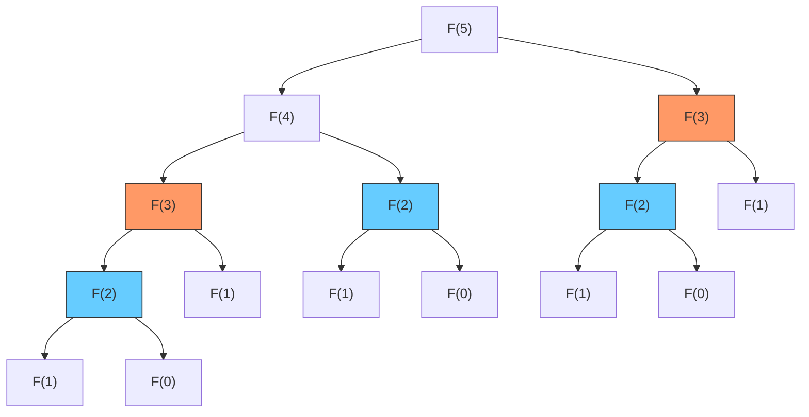
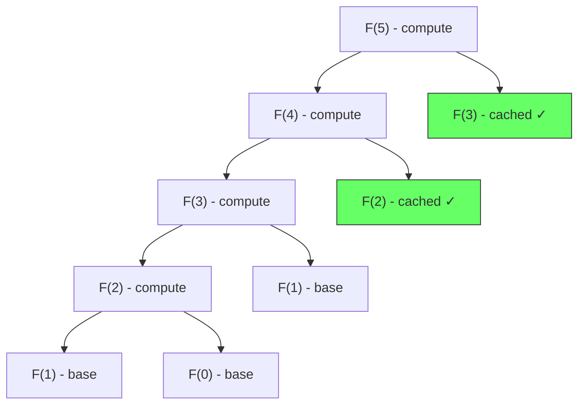

# 動的計画法 — 最適部分構造と重複部分問題の活用

## 1. 背景と動機：組合せ爆発への対処

計算機科学において、最適化問題は至るところに現れる。最短経路を見つける、利益を最大化する、コストを最小化する――これらの問題に対して、あらゆる可能性を列挙して最適解を見つける「総当たり（brute force）」は、理論的には常に正しい答えを返す。しかし、問題のサイズが大きくなると、可能な組合せの数は指数的に爆発し、実用的な時間内には解けなくなる。

例えば、$n$ 個の品物から部分集合を選ぶ問題（ナップサック問題）では、可能な選び方は $2^n$ 通りである。$n = 40$ であれば約 $10^{12}$（1兆）通り、$n = 100$ であれば $10^{30}$ を超える。仮に1秒間に $10^9$ 通りの組合せを評価できるとしても、$n = 100$ の問題を解くには宇宙の年齢をはるかに超える時間が必要になる。

この**組合せ爆発**（combinatorial explosion）は、計算機科学における根本的な壁である。そしてこの壁を突破するための最も強力かつ汎用的な手法の一つが、**動的計画法**（Dynamic Programming, DP）である。

### 1.1 動的計画法の起源

動的計画法は1950年代に**Richard Bellman**によって考案された。Bellmanは RAND Corporation において、多段階の意思決定過程（multistage decision process）を数学的に定式化する研究を行っていた。彼は、複雑な最適化問題を、より小さな部分問題の列に分解し、それらを逐次的に解くことで全体の最適解を構成する方法論を体系化した。

「Dynamic Programming」という名前について、Bellman自身が著書の中で興味深い裏話を語っている。当時、彼が所属していた RAND Corporation の資金提供者であった国防長官のCharles Wilsonは「研究」（research）という言葉を嫌っていた。Bellmanは自分の研究を防衛するために、意図的に曖昧だが印象的な名前を選んだ。「Dynamic」は時間的に変化する多段階プロセスを連想させ、「Programming」は最適化における計画立案（planning）を意味しており、数学的にもプロセスの本質を捉えた名称であった。

### 1.2 動的計画法の本質的な着想

動的計画法の核心は、次の直観的な洞察にある。

> **問題を小さな部分問題に分解し、各部分問題の解を記録・再利用することで、同じ計算の繰り返しを避ける。**

これは一見すると単純な発想だが、適用できる問題においては計算量を劇的に削減する。指数時間の総当たりが多項式時間の手続きに変わることも珍しくない。動的計画法が有効に機能するための条件は、次の2つの性質に集約される。

## 2. 動的計画法の2つの本質的性質

動的計画法が適用可能な問題は、以下の2つの性質を同時に満たしている。

### 2.1 最適部分構造（Optimal Substructure）

**最適部分構造**とは、問題全体の最適解が、その部分問題の最適解から構成できるという性質である。形式的に述べると、問題 $P$ の最適解が、部分問題 $P_1, P_2, \ldots, P_k$ の最適解を組み合わせることで得られるとき、$P$ は最適部分構造を持つという。

例として、最短経路問題を考える。頂点 $A$ から頂点 $C$ への最短経路が頂点 $B$ を経由するならば、その経路上の $A \to B$ の部分と $B \to C$ の部分もそれぞれ最短経路でなければならない。もし $A \to B$ の部分にもっと短い経路が存在するならば、それに置き換えることで $A \to C$ の経路全体をさらに短くできるため、元の経路が最短であるという仮定に矛盾するからである。

```
最適部分構造の直観:

  A ──→ B ──→ C      A→C の最短経路が B を経由するとき、
  ├──────┤             A→B の部分も最短経路
         ├──────┤      B→C の部分も最短経路
```

最適部分構造を持たない問題の例として、**最長単純パス問題**（重み無しグラフにおいて、頂点を繰り返さずに通る最長経路を見つける問題）がある。$A \to C$ の最長単純パスが $B$ を経由するとき、$A \to B$ の部分が最長単純パスであるとは限らない。なぜなら、$A \to B$ のより長いパスを選ぶと、$B \to C$ のパスで使える頂点が減り、全体としては短くなる可能性があるからである。部分問題間で使用するリソース（頂点）が競合するため、部分問題を独立に最適化できない。

### 2.2 重複部分問題（Overlapping Subproblems）

**重複部分問題**とは、問題を再帰的に分解したときに、同じ部分問題が繰り返し出現するという性質である。

この性質を最も端的に示す例がフィボナッチ数列の計算である。$F(n) = F(n-1) + F(n-2)$ という再帰式において、$F(5)$ を求めるための再帰呼び出しを展開すると、以下のような木構造になる。



$F(3)$ は2回、$F(2)$ は3回、$F(1)$ は5回も計算されている。$n$ が大きくなると、この重複はさらに爆発的に増加し、素朴な再帰の計算量は $O(2^n)$ に達する。動的計画法は、一度計算した部分問題の結果を保存し、同じ部分問題に再度遭遇したときに保存済みの結果を返すことで、この無駄を排除する。

### 2.3 2つの性質の関係

最適部分構造は「部分問題の最適解から全体の最適解を構成できる」ことを保証し、重複部分問題は「同じ部分問題の結果を再利用することで計算量を削減できる」ことを示す。この2つが揃って初めて、動的計画法は威力を発揮する。

| 性質の組み合わせ | 結果 | 例 |
|---|---|---|
| 最適部分構造あり + 重複部分問題あり | **動的計画法が有効** | ナップサック問題、最短経路 |
| 最適部分構造あり + 重複部分問題なし | 分割統治法が適する | マージソート、クイックソート |
| 最適部分構造なし | DPは直接適用できない | 最長単純パス問題 |

分割統治法（Divide and Conquer）との違いは重要である。マージソートのように部分問題が互いに独立で重複しない場合、計算結果を保存・再利用する必要がない。動的計画法が分割統治法と区別されるのは、まさにこの「重複する部分問題をどう扱うか」という点においてである。

## 3. トップダウン（Memoization）とボトムアップ（Tabulation）

動的計画法の実装には、大きく分けて2つのアプローチがある。

### 3.1 トップダウン：Memoization

**Memoization**（メモ化）は、再帰的な解法を基本としつつ、一度計算した結果をキャッシュに保存するアプローチである。問題の大きな側から出発し、必要な部分問題だけを計算する「怠惰な」（lazy）方式ともいえる。

フィボナッチ数列を例にとると、素朴な再帰は以下のようになる。

```python
def fib_naive(n):
    """Naive recursive Fibonacci - O(2^n)"""
    if n <= 1:
        return n
    return fib_naive(n - 1) + fib_naive(n - 2)
```

これに Memoization を適用すると、計算量が $O(n)$ に改善される。

```python
def fib_memo(n, memo=None):
    """Top-down DP with memoization - O(n)"""
    if memo is None:
        memo = {}
    if n <= 1:
        return n
    if n in memo:
        return memo[n]
    memo[n] = fib_memo(n - 1, memo) + fib_memo(n - 2, memo)
    return memo[n]
```

Memoization を適用した場合の再帰木を視覚化すると、重複する呼び出しがキャッシュによって即座に解決されることがわかる。



### 3.2 ボトムアップ：Tabulation

**Tabulation**（表作成法）は、問題の小さな側から順に解を構築していくアプローチである。部分問題を適切な順序で列挙し、テーブル（配列）に解を埋めていく「積極的な」（eager）方式である。

```python
def fib_tab(n):
    """Bottom-up DP with tabulation - O(n)"""
    if n <= 1:
        return n
    dp = [0] * (n + 1)
    dp[0] = 0
    dp[1] = 1
    for i in range(2, n + 1):
        dp[i] = dp[i - 1] + dp[i - 2]
    return dp[n]
```

### 3.3 両アプローチの比較

| 特性 | Memoization（トップダウン） | Tabulation（ボトムアップ） |
|---|---|---|
| 実装の起点 | 再帰関数 + キャッシュ | ループ + テーブル |
| 計算順序 | 必要な部分問題のみ（lazy） | すべての部分問題を順に（eager） |
| 部分問題の計算 | 到達可能なもののみ | テーブル全体を埋める |
| スタックオーバーフロー | 再帰深度が深い場合にリスクあり | なし（反復ループのため） |
| 空間最適化 | 困難（キャッシュを全て保持） | 容易（不要な行を捨てられる） |
| コードの直観性 | 再帰的定義に近い | ループで構築するため慣れが必要 |

実用上の選択指針として、以下が挙げられる。

- **部分問題の探索空間が疎な場合**（全部分問題のうち一部しか必要にならない場合）は Memoization が有利。不要な部分問題を計算しないためである。
- **空間最適化が必要な場合**や、**再帰深度が非常に深くなる場合**は Tabulation が有利。ローリング配列による次元削減が容易であり、スタックオーバーフローのリスクもない。
- **状態遷移の順序が明確でない場合**は Memoization の方が実装しやすい。ボトムアップでは、テーブルを埋める正しい順序を自分で決定する必要がある。

## 4. 古典的な問題の詳細な解説

ここからは、動的計画法の理解を深めるために、代表的な問題を詳細に解説する。各問題について、なぜ動的計画法が有効なのか、状態と遷移をどう設計するのかに焦点を当てる。

### 4.1 フィボナッチ数列（導入例）

フィボナッチ数列は既に導入例として取り上げたが、ここで計算量の改善を整理する。

| 手法 | 時間計算量 | 空間計算量 |
|---|---|---|
| 素朴な再帰 | $O(2^n)$ | $O(n)$（スタック深度） |
| Memoization | $O(n)$ | $O(n)$（キャッシュ + スタック） |
| Tabulation | $O(n)$ | $O(n)$（テーブル） |
| 空間最適化 | $O(n)$ | $O(1)$ |

空間最適化版では、$F(i)$ の計算に必要なのは $F(i-1)$ と $F(i-2)$ だけであるという事実を利用して、テーブル全体を保持する代わりに2つの変数だけで済ませる。

```python
def fib_optimized(n):
    """Space-optimized DP - O(n) time, O(1) space"""
    if n <= 1:
        return n
    prev2, prev1 = 0, 1
    for _ in range(2, n + 1):
        curr = prev1 + prev2
        prev2 = prev1
        prev1 = curr
    return prev1
```

フィボナッチ数列は動的計画法の教科書的な例であるが、実際のアルゴリズム設計では以下の問題群がより実践的である。

### 4.2 ナップサック問題

ナップサック問題（Knapsack Problem）は、動的計画法の威力を最も端的に示す古典的な組合せ最適化問題である。

#### 4.2.1 0-1ナップサック問題

**問題定義**: $n$ 個の品物があり、$i$ 番目の品物の重さは $w_i$、価値は $v_i$ である。容量 $W$ のナップサックに品物を入れるとき、総重量が $W$ を超えないように品物を選び、総価値を最大化せよ。各品物は最大1個しか選べない。

**状態の定義**: $\text{dp}[i][j]$ = 最初の $i$ 個の品物から選び、容量 $j$ のナップサックを使った場合の最大価値。

**遷移式**: $i$ 番目の品物を入れるか入れないかの2択で考える。

$$
\text{dp}[i][j] = \begin{cases}
\text{dp}[i-1][j] & \text{if } w_i > j \text{ （入らない）} \\
\max(\text{dp}[i-1][j],\ \text{dp}[i-1][j - w_i] + v_i) & \text{otherwise}
\end{cases}
$$

**初期条件**: $\text{dp}[0][j] = 0$ （品物が0個なら価値は0）

**なぜDPが有効か**: 総当たりでは $2^n$ 通りの組合せを評価する必要があるが、DPでは状態数が $n \times W$ に制限される。$n = 100, W = 1000$ の場合、総当たりの $2^{100} \approx 10^{30}$ に対し、DPでは $100 \times 1000 = 100{,}000$ 個の状態を埋めるだけで済む。

```python
def knapsack_01(weights, values, capacity):
    """0-1 Knapsack Problem - O(n * W) time, O(n * W) space"""
    n = len(weights)
    dp = [[0] * (capacity + 1) for _ in range(n + 1)]

    for i in range(1, n + 1):
        for j in range(capacity + 1):
            # Don't take item i
            dp[i][j] = dp[i - 1][j]
            # Take item i if it fits
            if weights[i - 1] <= j:
                dp[i][j] = max(dp[i][j],
                               dp[i - 1][j - weights[i - 1]] + values[i - 1])

    return dp[n][capacity]
```

テーブルの埋まり方を具体例で確認する。品物: {(重さ2, 価値3), (重さ3, 価値4), (重さ4, 価値5), (重さ5, 価値6)}、容量 $W = 8$ の場合を表で示す。

| | j=0 | j=1 | j=2 | j=3 | j=4 | j=5 | j=6 | j=7 | j=8 |
|---|---|---|---|---|---|---|---|---|---|
| i=0 | 0 | 0 | 0 | 0 | 0 | 0 | 0 | 0 | 0 |
| i=1 (w=2,v=3) | 0 | 0 | 3 | 3 | 3 | 3 | 3 | 3 | 3 |
| i=2 (w=3,v=4) | 0 | 0 | 3 | 4 | 4 | 7 | 7 | 7 | 7 |
| i=3 (w=4,v=5) | 0 | 0 | 3 | 4 | 5 | 7 | 8 | 9 | 9 |
| i=4 (w=5,v=6) | 0 | 0 | 3 | 4 | 5 | 7 | 8 | 9 | 9 |

最適解は $\text{dp}[4][8] = 9$ であり、品物1 (v=3) と品物3 (v=5) を選ぶか、品物2 (v=4) と品物3 (v=5) を選ぶことに対応する。

#### 4.2.2 無制限ナップサック問題（Unbounded Knapsack）

各品物を何個でも選べるバリエーションである。遷移式が変わる点に注目する。

$$
\text{dp}[j] = \max_{i: w_i \le j}(\text{dp}[j],\ \text{dp}[j - w_i] + v_i)
$$

0-1ナップサックでは $\text{dp}[i-1][j - w_i]$ と前の行を参照していたが、無制限ナップサックでは $\text{dp}[j - w_i]$ と同じ行（同じ品物を再度選べる状態）を参照する。この違いが、品物の再利用可否を決定する。

```python
def knapsack_unbounded(weights, values, capacity):
    """Unbounded Knapsack - O(n * W) time, O(W) space"""
    dp = [0] * (capacity + 1)

    for j in range(1, capacity + 1):
        for i in range(len(weights)):
            if weights[i] <= j:
                dp[j] = max(dp[j], dp[j - weights[i]] + values[i])

    return dp[capacity]
```

### 4.3 最長共通部分列（LCS: Longest Common Subsequence）

**問題定義**: 2つの文字列 $X = x_1 x_2 \cdots x_m$ と $Y = y_1 y_2 \cdots y_n$ が与えられたとき、両方の部分列となる最長の文字列を求めよ。部分列は連続している必要はないが、元の文字列における出現順序は保たなければならない。

**応用**: LCSはテキストの差分検出（diff）、バージョン管理システム、DNA配列の比較など、広範な応用を持つ。

**状態の定義**: $\text{dp}[i][j]$ = $X$ の最初の $i$ 文字と $Y$ の最初の $j$ 文字のLCSの長さ。

**遷移式**:

$$
\text{dp}[i][j] = \begin{cases}
\text{dp}[i-1][j-1] + 1 & \text{if } x_i = y_j \\
\max(\text{dp}[i-1][j],\ \text{dp}[i][j-1]) & \text{otherwise}
\end{cases}
$$

直観的な理解: 2つの文字列の末尾の文字が一致すれば、それをLCSに加えてそれぞれ1文字縮める。一致しなければ、どちらかの末尾を捨てた方が良い方を選ぶ。

**初期条件**: $\text{dp}[0][j] = 0$, $\text{dp}[i][0] = 0$

```python
def lcs(x, y):
    """Longest Common Subsequence - O(m * n) time"""
    m, n = len(x), len(y)
    dp = [[0] * (n + 1) for _ in range(m + 1)]

    for i in range(1, m + 1):
        for j in range(1, n + 1):
            if x[i - 1] == y[j - 1]:
                dp[i][j] = dp[i - 1][j - 1] + 1
            else:
                dp[i][j] = max(dp[i - 1][j], dp[i][j - 1])

    return dp[m][n]
```

具体例として $X = \text{"ABCBDAB"}$, $Y = \text{"BDCAB"}$ を考える。

| | "" | B | D | C | A | B |
|---|---|---|---|---|---|---|
| "" | 0 | 0 | 0 | 0 | 0 | 0 |
| A | 0 | 0 | 0 | 0 | 1 | 1 |
| B | 0 | 1 | 1 | 1 | 1 | 2 |
| C | 0 | 1 | 1 | 2 | 2 | 2 |
| B | 0 | 1 | 1 | 2 | 2 | 3 |
| D | 0 | 1 | 2 | 2 | 2 | 3 |
| A | 0 | 1 | 2 | 2 | 3 | 3 |
| B | 0 | 1 | 2 | 2 | 3 | 4 |

LCSの長さは4であり、"BCAB" が一つの最長共通部分列である。

LCSを復元するには、テーブルを右下から逆方向にたどればよい。$x_i = y_j$ ならばその文字をLCSに加えて対角に進み、そうでなければ $\text{dp}[i-1][j]$ と $\text{dp}[i][j-1]$ の大きい方へ進む。

### 4.4 編集距離（Levenshtein Distance）

**問題定義**: 2つの文字列 $X$ と $Y$ が与えられたとき、$X$ を $Y$ に変換するために必要な最小の編集操作回数を求めよ。許される操作は、1文字の**挿入**、**削除**、**置換**の3種類である。

**応用**: スペルチェッカー、DNA配列アラインメント、自然言語処理における類似度計算、ファジーマッチングなど。

**状態の定義**: $\text{dp}[i][j]$ = $X$ の最初の $i$ 文字を $Y$ の最初の $j$ 文字に変換するための最小編集回数。

**遷移式**:

$$
\text{dp}[i][j] = \begin{cases}
\text{dp}[i-1][j-1] & \text{if } x_i = y_j \text{ （操作不要）} \\
1 + \min\begin{cases}
\text{dp}[i-1][j] & \text{（削除）} \\
\text{dp}[i][j-1] & \text{（挿入）} \\
\text{dp}[i-1][j-1] & \text{（置換）}
\end{cases} & \text{otherwise}
\end{cases}
$$

**初期条件**: $\text{dp}[i][0] = i$（$i$ 回の削除）、$\text{dp}[0][j] = j$（$j$ 回の挿入）

各操作の意味を理解することが重要である。

- **削除**（$\text{dp}[i-1][j] + 1$）: $X$ の $i$ 文字目を削除して、残りの $i-1$ 文字を $Y$ の $j$ 文字に変換する。
- **挿入**（$\text{dp}[i][j-1] + 1$）: $X$ の $i$ 文字を $Y$ の最初の $j-1$ 文字に変換してから、$y_j$ を挿入する。
- **置換**（$\text{dp}[i-1][j-1] + 1$）: $X$ の $i$ 文字目を $y_j$ に置換して、残りを変換する。

```python
def edit_distance(x, y):
    """Levenshtein Distance - O(m * n) time"""
    m, n = len(x), len(y)
    dp = [[0] * (n + 1) for _ in range(m + 1)]

    # Base cases
    for i in range(m + 1):
        dp[i][0] = i
    for j in range(n + 1):
        dp[0][j] = j

    for i in range(1, m + 1):
        for j in range(1, n + 1):
            if x[i - 1] == y[j - 1]:
                dp[i][j] = dp[i - 1][j - 1]
            else:
                dp[i][j] = 1 + min(
                    dp[i - 1][j],      # deletion
                    dp[i][j - 1],      # insertion
                    dp[i - 1][j - 1],  # substitution
                )

    return dp[m][n]
```

具体例: $X = \text{"kitten"}$, $Y = \text{"sitting"}$

| | "" | s | i | t | t | i | n | g |
|---|---|---|---|---|---|---|---|---|
| "" | 0 | 1 | 2 | 3 | 4 | 5 | 6 | 7 |
| k | 1 | 1 | 2 | 3 | 4 | 5 | 6 | 7 |
| i | 2 | 2 | 1 | 2 | 3 | 4 | 5 | 6 |
| t | 3 | 3 | 2 | 1 | 2 | 3 | 4 | 5 |
| t | 4 | 4 | 3 | 2 | 1 | 2 | 3 | 4 |
| e | 5 | 5 | 4 | 3 | 2 | 2 | 3 | 4 |
| n | 6 | 6 | 5 | 4 | 3 | 3 | 2 | 3 |

編集距離は3であり、以下の操作に対応する: k→s（置換）、e→i（置換）、末尾にg挿入。

### 4.5 行列連鎖積問題（Matrix Chain Multiplication）

**問題定義**: $n$ 個の行列 $A_1, A_2, \ldots, A_n$ の積を計算する。行列の乗算は結合法則を満たすため、計算順序（括弧の付け方）によって必要なスカラー乗算の回数が大きく変わる。スカラー乗算の回数を最小化する括弧の付け方を求めよ。

**具体例で理解する問題の意味**: 行列 $A_1$ が $10 \times 30$、$A_2$ が $30 \times 5$、$A_3$ が $5 \times 60$ のとき、

- $(A_1 A_2) A_3$: $10 \times 30 \times 5 + 10 \times 5 \times 60 = 1500 + 3000 = 4500$ 回
- $A_1 (A_2 A_3)$: $30 \times 5 \times 60 + 10 \times 30 \times 60 = 9000 + 18000 = 27000$ 回

同じ結果を得るにもかかわらず、計算量に6倍もの差がある。

**括弧の付け方の数**: $n$ 個の行列に対する括弧の付け方はカタラン数 $C_{n-1}$ で与えられ、指数的に増加する。

$$
C_n = \frac{1}{n+1}\binom{2n}{n} = \Omega\left(\frac{4^n}{n^{3/2}}\right)
$$

$n = 20$ のとき約 $1.77 \times 10^9$ 通りあり、総当たりは非現実的である。

**状態の定義**: $\text{dp}[i][j]$ = $A_i$ から $A_j$ までの積を計算するための最小乗算回数。

**遷移式**: $A_i \cdots A_j$ を $k$ の位置で2つに分割する。$p_i$ は $A_i$ の行数、$p_{i+1}$ は $A_i$ の列数（= $A_{i+1}$ の行数）とする。

$$
\text{dp}[i][j] = \min_{i \le k < j} \left( \text{dp}[i][k] + \text{dp}[k+1][j] + p_{i-1} \cdot p_k \cdot p_j \right)
$$

**初期条件**: $\text{dp}[i][i] = 0$（1つの行列は乗算不要）

```python
def matrix_chain(dims):
    """
    Matrix Chain Multiplication - O(n^3) time, O(n^2) space
    dims: list of dimensions, e.g., [10, 30, 5, 60] for 3 matrices
    """
    n = len(dims) - 1  # number of matrices
    dp = [[0] * n for _ in range(n)]

    # l: chain length
    for l in range(2, n + 1):
        for i in range(n - l + 1):
            j = i + l - 1
            dp[i][j] = float('inf')
            for k in range(i, j):
                cost = (dp[i][k] + dp[k + 1][j]
                        + dims[i] * dims[k + 1] * dims[j + 1])
                dp[i][j] = min(dp[i][j], cost)

    return dp[0][n - 1]
```

この問題の重要な特徴は、**区間DP**（interval DP）と呼ばれるパターンである。状態が区間 $[i, j]$ で定義され、より短い区間の解から長い区間の解を構成する。チェーンの長さが短い方から順に計算することで、必要な部分問題がすべて先に解かれていることが保証される。

## 5. 状態と遷移の設計方法論

動的計画法を使いこなすための最も重要なスキルは、**状態の設計**と**遷移の定式化**である。これは多くの場合、創造的な行為であり、機械的に導出することは難しいが、有用な指針は存在する。

### 5.1 状態設計の原則

状態設計とは、「何を覚えておけば部分問題を一意に特定できるか」を決めることである。

**原則1: 十分性** -- 状態は、今後の最適な意思決定に必要な情報をすべて含まなければならない。不足した情報があると、正しい遷移を導けない。

**原則2: 最小性** -- 状態に不必要な情報を含めると、状態空間が無駄に膨張し、計算量と空間計算量が悪化する。必要最小限の情報だけを状態に含めるべきである。

**原則3: 非循環性** -- 状態間の依存関係が DAG（有向非巡回グラフ）を形成しなければならない。循環する依存関係があると、テーブルを埋める正しい順序が存在せず、DPが適用できない。

### 5.2 よくある状態設計パターン

動的計画法の問題で頻出する状態設計のパターンを整理する。

#### パターン1: 接頭辞型（Prefix DP）

状態: 入力列の最初の $i$ 要素に関する部分問題。

例: フィボナッチ数列、ナップサック問題、最長増加部分列（LIS）

$$
\text{dp}[i] = f(\text{dp}[0], \text{dp}[1], \ldots, \text{dp}[i-1])
$$

#### パターン2: 二次元接頭辞型（2D Prefix DP）

状態: 2つの入力列の接頭辞 $X[1..i]$ と $Y[1..j]$ に関する部分問題。

例: LCS、編集距離

$$
\text{dp}[i][j] = f(\text{dp}[i-1][j-1], \text{dp}[i-1][j], \text{dp}[i][j-1])
$$

#### パターン3: 区間型（Interval DP）

状態: 入力列の区間 $[i, j]$ に関する部分問題。

例: 行列連鎖積、最適二分探索木、回文に関する問題

$$
\text{dp}[i][j] = \min_{i \le k < j} f(\text{dp}[i][k], \text{dp}[k+1][j])
$$

#### パターン4: 部分集合型（Bitmask DP）

状態: 要素の集合をビットマスクで表現する。$n$ 個の要素があるとき、各部分集合を $n$ ビットの整数で表す。

例: 巡回セールスマン問題（TSP）、ハミルトン路問題

$$
\text{dp}[S][i] = \text{集合 } S \text{ の要素を訪問し、最後に } i \text{ にいるときの最適値}
$$

状態数は $O(2^n \times n)$ であり、$n$ が20程度までなら現実的に計算可能である。

#### パターン5: 木上のDP（Tree DP）

状態: 木の各頂点 $v$ をルートとする部分木に関する部分問題。

例: 木の最大独立集合、木の直径、木の重心分解

$$
\text{dp}[v] = f(\text{dp}[\text{child}_1], \text{dp}[\text{child}_2], \ldots)
$$

### 5.3 遷移の設計

遷移の設計とは、「ある状態の最適解を、どの部分問題の解から、どう組み合わせて導くか」を定式化することである。

遷移を考えるための実用的なアプローチとして、**最後の1手で場合分けする**という方法がある。最終的な状態に至る直前の操作（最後に選んだ品物、最後に行った編集操作、最後に分割した位置など）で場合分けし、それぞれの場合について部分問題がどう定義されるかを考える。

例えば、編集距離の遷移は以下のように「最後の操作」で場合分けして導出できる。

1. 最後の操作が**何もしない**場合: $x_i = y_j$ であり、残りの問題は $\text{dp}[i-1][j-1]$
2. 最後の操作が**削除**の場合: $x_i$ を削除するコスト1 + 残りの問題 $\text{dp}[i-1][j]$
3. 最後の操作が**挿入**の場合: $y_j$ を挿入するコスト1 + 残りの問題 $\text{dp}[i][j-1]$
4. 最後の操作が**置換**の場合: $x_i$ を $y_j$ に置換するコスト1 + 残りの問題 $\text{dp}[i-1][j-1]$

## 6. 空間最適化テクニック

動的計画法のテーブルは、問題によっては非常に大きくなり得る。例えば、$n = 10{,}000$ の2次元DPでは $10^8$ のセルが必要になり、メモリを圧迫する。しかし多くの場合、テーブル全体を保持する必要はない。

### 6.1 ローリング配列（Rolling Array / Space Reduction）

多くの2次元DPでは、$\text{dp}[i][j]$ の計算に必要なのは前の行 $\text{dp}[i-1][\cdot]$ だけである（あるいは現在の行 $\text{dp}[i][\cdot]$ の既に計算済みの部分）。この場合、テーブル全体の代わりに2行分の配列だけを交互に使うことで、空間計算量を $O(n \times m)$ から $O(m)$ に削減できる。

0-1ナップサック問題を例にとる。

```python
def knapsack_01_optimized(weights, values, capacity):
    """0-1 Knapsack with rolling array - O(n * W) time, O(W) space"""
    n = len(weights)
    dp = [0] * (capacity + 1)

    for i in range(n):
        # Iterate in reverse to avoid using updated values
        for j in range(capacity, weights[i] - 1, -1):
            dp[j] = max(dp[j], dp[j - weights[i]] + values[i])

    return dp[capacity]
```

::: warning ループ方向に注意
0-1ナップサックの空間最適化版では、内側ループを**逆順**（大きい容量から小さい容量へ）に回す必要がある。順方向に回すと、同じ品物を複数回選ぶことになり、無制限ナップサック問題の解になってしまう。これは、$\text{dp}[j - w_i]$ が同じ行の既に更新された値を参照するか、更新前の値を参照するかの違いに対応する。
:::

### 6.2 次元削減

場合によっては、状態の定義自体を工夫することで次元を減らせる。

例えば、LCSの空間最適化では、2行のローリング配列を使って $O(\min(m, n))$ の空間に削減できる（短い方の文字列を列に対応させる）。

```python
def lcs_optimized(x, y):
    """LCS with O(min(m, n)) space"""
    # Ensure y is the shorter string
    if len(x) < len(y):
        x, y = y, x
    m, n = len(x), len(y)

    prev = [0] * (n + 1)
    curr = [0] * (n + 1)

    for i in range(1, m + 1):
        for j in range(1, n + 1):
            if x[i - 1] == y[j - 1]:
                curr[j] = prev[j - 1] + 1
            else:
                curr[j] = max(prev[j], curr[j - 1])
        prev, curr = curr, [0] * (n + 1)

    return prev[n]
```

### 6.3 空間最適化の注意点

空間最適化には重要なトレードオフがある。テーブルの一部しか保持しないため、**最適解の復元（バックトラック）が困難になる**ことが多い。最適値だけが必要な場合は空間最適化が有効だが、最適解の具体的な構成（ナップサックに入れた品物のリスト、LCSの文字列そのもの）も必要な場合は、テーブル全体を保持するか、Hirschbergのアルゴリズムのような特殊な手法を用いる必要がある。

## 7. DPの計算量解析

動的計画法の計算量は、一般的に以下の公式で見積もれる。

$$
\text{総計算量} = \text{状態数} \times \text{各状態の遷移にかかる時間}
$$

### 7.1 代表的な問題の計算量

| 問題 | 状態数 | 遷移コスト | 時間計算量 | 空間計算量 |
|---|---|---|---|---|
| フィボナッチ数列 | $O(n)$ | $O(1)$ | $O(n)$ | $O(1)$* |
| 0-1ナップサック | $O(nW)$ | $O(1)$ | $O(nW)$ | $O(W)$* |
| LCS | $O(mn)$ | $O(1)$ | $O(mn)$ | $O(\min(m,n))$* |
| 編集距離 | $O(mn)$ | $O(1)$ | $O(mn)$ | $O(\min(m,n))$* |
| 行列連鎖積 | $O(n^2)$ | $O(n)$ | $O(n^3)$ | $O(n^2)$ |
| TSP (ビットマスク) | $O(2^n \cdot n)$ | $O(n)$ | $O(2^n \cdot n^2)$ | $O(2^n \cdot n)$ |

*は空間最適化後の値。

### 7.2 擬似多項式時間

ナップサック問題の計算量 $O(nW)$ について、重要な注意がある。$W$ は入力値（ナップサックの容量）であり、入力の**サイズ**（ビット数）ではない。$W$ をビット数で表すと $\log W$ ビットとなるため、入力サイズに対しては指数的な計算量になる。このような計算量を**擬似多項式時間**（pseudo-polynomial time）という。

実際、ナップサック問題はNP困難であることが知られている。$O(nW)$ の動的計画法は $W$ が小さい場合に実用的だが、$W$ が指数的に大きい場合には依然として非効率である。この意味で、動的計画法は万能ではなく、問題の性質（特にパラメータの大きさ）に依存して実用性が変わる。

### 7.3 DPの高速化テクニック

標準的なDPの計算量をさらに改善するテクニックも研究されている。

- **Knuth's optimization**: 特定の条件を満たす区間DPを $O(n^3)$ から $O(n^2)$ に高速化
- **Divide and Conquer optimization**: 遷移の最適な分割点が単調に増加する場合に $O(n^2)$ を $O(n \log n)$ に
- **Convex Hull Trick（CHT）**: 遷移が線形関数の最大/最小値で表される場合に、遷移コストを $O(1)$ に償却

これらの高速化は競技プログラミングや数値最適化の分野で特に重要である。

## 8. 応用例

動的計画法は理論的な問題にとどまらず、実世界の多くの領域で不可欠なツールとして使われている。

### 8.1 DNA配列アラインメント

バイオインフォマティクスにおいて、2つのDNA配列（あるいはタンパク質配列）の類似度を計測するために、**配列アラインメント**（sequence alignment）が行われる。これは本質的に編集距離の一般化であり、各操作（一致、不一致、ギャップの挿入）にスコアを割り当てて最適なアラインメントを求める。

代表的なアルゴリズムとして以下がある。

- **Needleman-Wunsch アルゴリズム**: 大域的アラインメント（配列全体を対象）。編集距離のDPと本質的に同じ構造を持つ。$O(mn)$ の時間計算量。
- **Smith-Waterman アルゴリズム**: 局所的アラインメント（最も類似した部分領域を見つける）。テーブルの値が負にならないようにゼロでクリップする点が異なる。

```python
def smith_waterman(seq1, seq2, match=2, mismatch=-1, gap=-1):
    """Local sequence alignment using Smith-Waterman algorithm"""
    m, n = len(seq1), len(seq2)
    dp = [[0] * (n + 1) for _ in range(m + 1)]
    max_score = 0

    for i in range(1, m + 1):
        for j in range(1, n + 1):
            score = match if seq1[i - 1] == seq2[j - 1] else mismatch
            dp[i][j] = max(
                0,                          # restart alignment
                dp[i - 1][j - 1] + score,   # match/mismatch
                dp[i - 1][j] + gap,         # gap in seq2
                dp[i][j - 1] + gap,         # gap in seq1
            )
            max_score = max(max_score, dp[i][j])

    return max_score
```

BLAST（Basic Local Alignment Search Tool）は、Smith-Waterman アルゴリズムのヒューリスティックな高速化であり、生物学研究で最も広く使われているツールの一つである。

### 8.2 コンパイラ最適化

コンパイラにおける**最適命令選択**（optimal instruction selection）は、抽象構文木（AST）の各部分木に対して、ターゲットアーキテクチャの命令セットから最もコストの低い命令列を選択する問題である。これは木上のDPとして定式化できる。

また、**レジスタ割り当て**（register allocation）の一部や、**ループ最適化**（ループタイリング、ループ展開の最適化）にもDPが使われることがある。

### 8.3 経路探索

**Viterbi アルゴリズム**は、隠れマルコフモデル（HMM）において最も確率の高い状態遷移列を求めるアルゴリズムであり、動的計画法の直接的な応用である。

**状態の定義**: $\text{dp}[t][s]$ = 時刻 $t$ に状態 $s$ にいる確率の最大値

**遷移式**:

$$
\text{dp}[t][s] = \max_{s'} \left( \text{dp}[t-1][s'] \cdot a_{s' \to s} \cdot b_s(o_t) \right)
$$

ここで $a_{s' \to s}$ は状態遷移確率、$b_s(o_t)$ は状態 $s$ における出力 $o_t$ の生成確率である。

Viterbi アルゴリズムは、音声認識、自然言語処理の品詞タグ付け、通信路での誤り訂正符号の復号など、幅広い応用を持つ。

### 8.4 自然言語処理

**CYKアルゴリズム**（Cocke-Younger-Kasami algorithm）は、文脈自由文法に基づく構文解析を動的計画法で行うアルゴリズムであり、区間DPの典型的な応用例である。入力文の部分文字列がどの非終端記号から導出可能かをボトムアップに計算する。

### 8.5 経済学・金融

最適な投資戦略、オプション価格の計算（二項モデル）、在庫管理（Economic Order Quantity の拡張）など、多段階の意思決定問題が動的計画法で解かれる。Bellmanが元々研究していた**最適制御理論**は、連続時間の動的計画法ともいえるものであり、**Hamilton-Jacobi-Bellman 方程式**（HJB方程式）として定式化される。

### 8.6 グラフアルゴリズムにおけるDP

多くの有名なグラフアルゴリズムは、実質的に動的計画法である。

- **Bellman-Ford アルゴリズム**: 単一始点最短経路問題を辺の緩和（relaxation）によって解く。$\text{dp}[k][v]$ = 最大 $k$ 辺を使った始点から $v$ への最短距離。
- **Floyd-Warshall アルゴリズム**: 全頂点対間最短経路問題。$\text{dp}[k][i][j]$ = 中継頂点として $\{1, 2, \ldots, k\}$ のみを使った場合の $i$ から $j$ への最短距離。時間計算量 $O(V^3)$。

```python
def floyd_warshall(dist):
    """All-pairs shortest path - O(V^3)"""
    n = len(dist)
    # dp[i][j] = shortest distance from i to j
    dp = [row[:] for row in dist]

    for k in range(n):
        for i in range(n):
            for j in range(n):
                if dp[i][k] + dp[k][j] < dp[i][j]:
                    dp[i][j] = dp[i][k] + dp[k][j]

    return dp
```

## 9. 動的計画法の限界と他手法との比較

動的計画法は強力な手法であるが、万能ではない。その限界と、関連する手法との違いを理解することは重要である。

### 9.1 DPの限界

**状態空間の爆発**: 状態数が指数的に増加する問題では、DPでも実用的な時間内には解けない。例えば、巡回セールスマン問題のビットマスクDPは $O(2^n \cdot n^2)$ であり、$n = 25$ 程度が限界である。

**最適部分構造を持たない問題**: 前述の最長単純パス問題のように、部分問題間にリソースの競合がある場合、DPは直接適用できない。

**連続的な状態空間**: 状態が連続値をとる場合、テーブルを離散化する必要があり、精度と計算量のトレードオフが生じる。

**次元の呪い**（Curse of Dimensionality）: 状態を定義するパラメータが増えると、状態空間が指数的に膨張する。Bellman自身がこの問題を「次元の呪い」と名付けた。例えば、$d$ 個のパラメータがそれぞれ $N$ 通りの値をとると、状態数は $N^d$ になる。

### 9.2 貪欲法（Greedy Algorithm）との比較

貪欲法は、各段階で局所的に最適な選択を行い、それらを組み合わせて全体の解を構成する手法である。

| 特性 | 動的計画法 | 貪欲法 |
|---|---|---|
| 最適性保証 | 最適部分構造があれば最適解を保証 | 貪欲選択性質が必要（より強い条件） |
| 計算量 | 状態数 $\times$ 遷移コスト | 通常はDPより効率的 |
| 適用条件 | 最適部分構造 + 重複部分問題 | 最適部分構造 + 貪欲選択性質 |
| 過去の結果 | すべて保存して参照 | 保存不要（一方向の決定） |
| 典型例 | ナップサック問題 | 活動選択問題、Huffman符号化 |

貪欲法が適用できる問題は、DPでも解けるが、貪欲法の方が効率的になることが多い。逆に、DPが必要な問題に貪欲法を適用すると、最適解を得られない場合がある。

**例: 0-1ナップサック問題**: 単位重量あたりの価値が高い順に品物を選ぶ貪欲法は、最適解を保証しない。{(重さ: 10, 価値: 60), (重さ: 20, 価値: 100), (重さ: 30, 価値: 120)}、容量50のとき、貪欲法は品物1と品物2を選んで価値160を得るが、最適解は品物2と品物3を選んで価値220を得ることである。

一方、**分数ナップサック問題**（品物を分割して一部だけ選べる場合）は、同じ貪欲法で最適解が得られる。これは分数ナップサック問題が貪欲選択性質を持つためである。

### 9.3 分割統治法（Divide and Conquer）との比較

| 特性 | 動的計画法 | 分割統治法 |
|---|---|---|
| 部分問題の重複 | あり（結果を再利用） | なし（独立した部分問題） |
| 計算方向 | ボトムアップ or トップダウン+メモ化 | トップダウン |
| 部分問題の保存 | テーブルに保存 | 不要 |
| 典型例 | LCS、ナップサック | マージソート、クイックソート |

分割統治法とDPの境界は明確でない場合もある。例えば、マージソートの部分問題は独立だが、DPと同様にボトムアップに解を構築する。また、Memoization を使ったDPは形式上は分割統治法の延長ともいえる。両者の本質的な違いは、**同じ部分問題が繰り返し現れるかどうか**にある。

### 9.4 他の最適化手法

DPが適用困難な大規模問題に対しては、以下のような手法が使われる。

- **近似アルゴリズム**: 最適解の一定割合内に収まる解を多項式時間で求める。例えば、ナップサック問題には完全多項式時間近似スキーム（FPTAS）が存在する。
- **メタヒューリスティクス**: 遺伝的アルゴリズム、焼きなまし法（Simulated Annealing）、タブーサーチなど。最適解の保証はないが、大規模問題に対して実用的な解を得られることが多い。
- **整数線形計画法（ILP）**: 問題を線形制約と整数変数で定式化し、分枝限定法（Branch and Bound）などで解く。汎用的だが、最悪の場合は指数時間を要する。
- **強化学習**: Bellmanの動的計画法を、状態空間が巨大すぎてテーブルに記録できない場合に、関数近似（ニューラルネットワークなど）を用いて近似的に解くアプローチ。Deep Q-Network（DQN）はこの考え方の代表例であり、Bellman方程式の近似的な解法といえる。

## 10. まとめ

動的計画法は、コンピュータサイエンスにおける最も重要なアルゴリズム設計手法の一つである。その本質は、**最適部分構造**と**重複部分問題**という2つの性質を持つ問題に対して、部分問題の解を記録・再利用することで、指数的な計算量を多項式的に削減するという点にある。

本記事で見てきたように、DPの適用範囲は極めて広い。ナップサック問題のような組合せ最適化から、LCSや編集距離のような文字列処理、DNA配列アラインメントのようなバイオインフォマティクス、Viterbi アルゴリズムのような確率モデル、Floyd-Warshall のようなグラフアルゴリズムまで、DPは計算機科学のあらゆる分野に浸透している。

DPを使いこなすための鍵は、**状態の設計**と**遷移の定式化**にある。「何を覚えておけばよいか」「最後の1手で何をするか」という問いを出発点として、問題の構造を捉える力を養うことが重要である。

動的計画法は万能ではなく、状態空間の爆発（次元の呪い）や、最適部分構造を持たない問題に対しては無力である。しかし、その適用範囲内においては、最適解を保証しつつ効率的に計算できるという、他の手法にはない強みを持っている。Bellmanが1950年代に体系化したこの手法は、70年以上を経た今日でも、理論と実践の両面で計算機科学の中核的な道具であり続けている。
