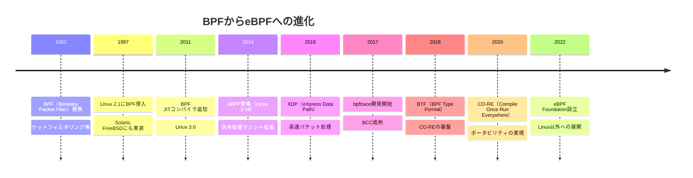
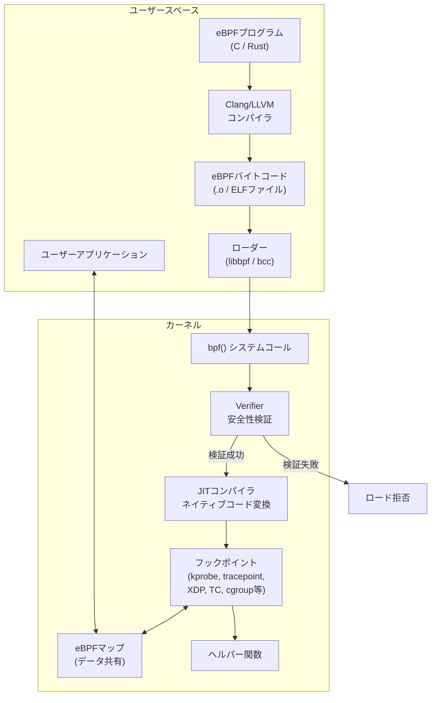
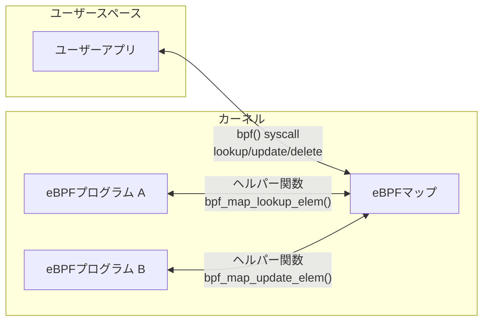
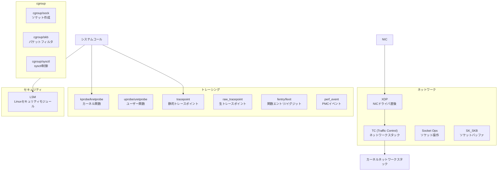
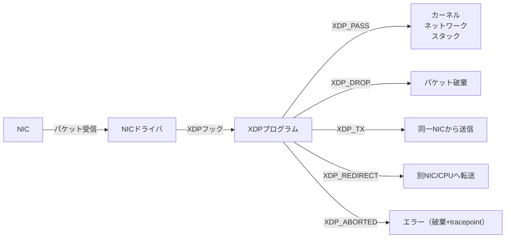
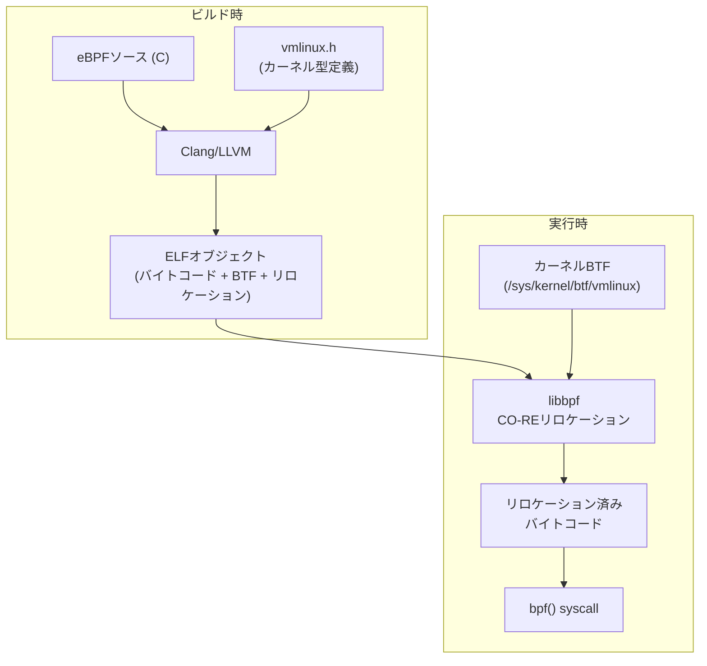
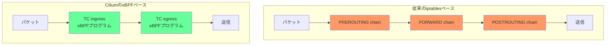

# eBPF — カーネルを再コンパイルせずに拡張するプログラマブル基盤

## 1. 背景と動機

### 1.1 カーネル拡張の困難さ

オペレーティングシステムのカーネルは、プロセス管理、メモリ管理、ファイルシステム、ネットワークスタックなど、システムのあらゆる側面を制御する特権的なソフトウェアである。しかし、カーネルに新たな機能を追加したり、既存の振る舞いを変更したりするのは、従来きわめて困難であった。

カーネルモジュール（Loadable Kernel Module: LKM）を用いれば、カーネルを再コンパイルせずに機能を追加できる。しかしカーネルモジュールにはいくつかの深刻な問題がある。

- **安全性の欠如**: カーネルモジュールはカーネルと同じ特権レベルで動作するため、バグがあればシステム全体がクラッシュ（カーネルパニック）する
- **安定したABIの不在**: Linuxカーネルは安定したカーネル内部APIを保証しておらず、カーネルバージョンが変わるとモジュールの再コンパイルが必要になる
- **開発サイクルの遅さ**: カーネル本体への機能追加はメインラインへのマージに数ヶ月から数年を要する
- **セキュリティリスク**: カーネルモジュールのロードは本質的にroot権限でのコード実行であり、攻撃対象面が広い

これらの問題により、カーネルレベルでの高度なネットワーク処理、セキュリティポリシーの適用、パフォーマンス分析といったタスクは、常にカーネル開発者しか手を出せない領域とされてきた。

### 1.2 BPFの誕生 — パケットフィルタリングの革新

eBPFの歴史は、1992年にSteven McCanne と Van Jacobson が発表した論文「The BSD Packet Filter: A New Architecture for User-level Packet Capture」にまで遡る。この論文で提案された**BPF（Berkeley Packet Filter）**は、ネットワークパケットをユーザースペースにコピーする前にカーネル内でフィルタリングするための仮想マシンである。

BPFが解決した問題は明確だった。`tcpdump` のようなパケットキャプチャツールは、すべてのパケットをカーネルからユーザースペースにコピーし、ユーザースペースでフィルタリングしていた。ネットワークトラフィックが多い環境では、不要なパケットのコピーコストが深刻なオーバーヘッドとなっていた。

```
┌──────────────────────────────────────────────────────────┐
│                    BPF以前の方式                           │
├──────────────────────────────────────────────────────────┤
│                                                          │
│  NIC → カーネル → [全パケットコピー] → ユーザースペース     │
│                                         ↓                │
│                                   フィルタリング           │
│                                         ↓                │
│                                   大量のパケット破棄       │
│                                                          │
│  問題: 不要なパケットのコピーがCPUとメモリを浪費            │
├──────────────────────────────────────────────────────────┤
│                    BPF導入後の方式                         │
├──────────────────────────────────────────────────────────┤
│                                                          │
│  NIC → カーネル → [BPFフィルタ] → 必要なパケットのみコピー  │
│                        ↓                                 │
│                  不要パケット破棄                          │
│                 （カーネル内で完結）                        │
│                                                          │
│  効果: コピーオーバーヘッドを大幅に削減                     │
└──────────────────────────────────────────────────────────┘
```

BPFの仮想マシンは、32ビットのレジスタ2つ（アキュムレータとインデックスレジスタ）、固定長の命令セット、パケットデータへの読み取りアクセスという最小限の構成を持ち、カーネル内で安全に実行できるよう設計されていた。フィルタ式（例: `tcp port 80`）はBPFバイトコードにコンパイルされ、`setsockopt()` システムコールを通じてカーネルにロードされた。

### 1.3 クラシックBPFからeBPFへ

2014年、Alexei Starovoitov はLinuxカーネル3.18に、BPFを大幅に拡張した**eBPF（extended BPF）**を導入した。eBPFはパケットフィルタリングという元々の用途をはるかに超え、**カーネル内で安全にプログラムを実行するための汎用的な仮想マシン**へと進化した。

クラシックBPF（cBPF）とeBPFの主な違いを以下にまとめる。

| 特性 | cBPF | eBPF |
|---|---|---|
| レジスタ数 | 2（A, X） | 11（R0-R10） |
| レジスタ幅 | 32ビット | 64ビット |
| 命令セット | 約30命令 | 約100命令以上 |
| 用途 | パケットフィルタリング専用 | 汎用（ネットワーク、トレーシング、セキュリティ等） |
| マップ | なし | ハッシュマップ、配列等のデータ構造 |
| ヘルパー関数 | なし | カーネル機能を呼び出す関数群 |
| スタックサイズ | なし | 512バイト |
| テイルコール | なし | 他のeBPFプログラムの呼び出し |
| JITコンパイル | 一部アーキテクチャ | ほぼ全アーキテクチャ |

eBPFの登場により、カーネルの振る舞いをユーザースペースからプログラマブルに変更できるようになった。カーネルモジュールのリスクを負うことなく、カーネルに近い性能で、ネットワーキング、オブザーバビリティ、セキュリティといった多様な領域にわたる機能を実現できる。



## 2. eBPFの仕組み

### 2.1 全体アーキテクチャ

eBPFプログラムがカーネル内で実行されるまでの流れは、一見すると複雑に見えるが、本質的には「ユーザーが書いたプログラムをカーネルが安全性を検証した上でカーネル内の特定のフックポイントにアタッチする」というシンプルな構造である。



この流れを段階ごとに説明する。

1. **コンパイル**: eBPFプログラムは制限付きのC言語（またはRust）で記述され、Clang/LLVMによってeBPFバイトコード（ELFオブジェクトファイル）にコンパイルされる
2. **ロード**: ローダーライブラリ（libbpf等）が `bpf()` システムコールを通じてバイトコードをカーネルに渡す
3. **検証**: カーネル内のVerifierが、プログラムの安全性を静的に検証する（後述）
4. **JITコンパイル**: 検証を通過したバイトコードは、JITコンパイラによってネイティブ機械語に変換される
5. **アタッチ**: コンパイルされたプログラムが、カーネル内の特定のフックポイントにアタッチされる
6. **実行**: フックポイントに関連するイベント（パケット受信、システムコール呼び出し等）が発生すると、eBPFプログラムが実行される

### 2.2 eBPF仮想マシン

eBPFの仮想マシンは、RISC風の命令セットアーキテクチャ（ISA）を持つ。以下がその主要な特性である。

- **レジスタ**: 64ビット汎用レジスタ11本（R0〜R10）
  - R0: 関数戻り値、プログラム終了コード
  - R1〜R5: 関数引数
  - R6〜R9: callee-saved レジスタ
  - R10: スタックフレームポインタ（読み取り専用）
- **命令**: 64ビット固定長命令（一部128ビット）
- **スタック**: 512バイト
- **命令数上限**: 100万命令（Linux 5.2以降。それ以前は4096命令）

命令のエンコーディングは以下の構造を持つ。

```
┌─────────┬─────┬─────┬────────┬──────────────────┐
│ opcode  │ dst │ src │ offset │    immediate      │
│ (8bit)  │(4bit)│(4bit)│(16bit)│     (32bit)       │
└─────────┴─────┴─────┴────────┴──────────────────┘
         合計: 64ビット（8バイト）
```

命令のカテゴリには、算術演算（ADD, SUB, MUL, DIV）、ビット演算（AND, OR, XOR, SHIFT）、メモリロード/ストア、分岐命令（条件付きジャンプ、無条件ジャンプ）、関数呼び出し（CALL）がある。このISAは現代のプロセッサアーキテクチャ（特にx86-64やARM64）に効率的にマッピングできるよう設計されている。

### 2.3 Verifier — 安全性の門番

eBPFの設計において最も重要で革新的な要素が**Verifier**（検証器）である。Verifierは、eBPFプログラムがカーネルにロードされる際に静的解析を行い、プログラムが安全に実行できることを保証する。カーネルモジュールと異なり、eBPFプログラムは検証済みであることが保証されるため、カーネルをクラッシュさせるリスクが劇的に低減する。

Verifierが検証する主な項目は以下の通りである。

**1. プログラムの終了保証**

eBPFプログラムは必ず有限時間で終了しなければならない。Verifierは**後方へのジャンプ（バックエッジ）**を原則として禁止し、無限ループが存在しないことを確認する。ただし、Linux 5.3以降では**有界ループ（bounded loop）**が許可されている。ループのイテレーション数が静的に上限を持つことをVerifierが検証できれば、ループは許可される。

**2. メモリアクセスの安全性**

すべてのメモリアクセスは境界内であることが検証される。Verifierは各レジスタの**型情報**を追跡し、ポインタが有効な範囲を指していることを保証する。具体的には以下のようなチェックが行われる。

- スタックアクセスがR10（フレームポインタ）からのオフセットとして妥当か
- マップ値へのポインタが、マップの値サイズ内を指しているか
- パケットデータへのアクセスが、パケットの開始位置（`data`）と終了位置（`data_end`）の範囲内か
- NULLポインタの参照が行われていないか

**3. 型の追跡**

Verifierはすべてのレジスタについて、その中身が「スカラー値」「マップポインタ」「スタックポインタ」「パケットデータポインタ」「コンテキストポインタ」のいずれであるかを追跡する。型の不正な使用（例: スカラー値をポインタとしてデリファレンスする）は拒否される。

**4. ヘルパー関数呼び出しの検証**

eBPFプログラムが呼び出せるヘルパー関数は、プログラムタイプごとに制限されている。Verifierは、呼び出されるヘルパー関数がそのプログラムタイプで許可されているか、引数の型が正しいかを検証する。

```c
// Example: Verifier ensures bounds checking before packet access
int handle_packet(struct xdp_md *ctx) {
    void *data = (void *)(long)ctx->data;
    void *data_end = (void *)(long)ctx->data_end;
    struct ethhdr *eth = data;

    // Verifier requires this bounds check before accessing eth fields
    if (data + sizeof(*eth) > data_end)
        return XDP_DROP;

    // Now safe to access eth->h_proto
    if (eth->h_proto == htons(ETH_P_IP)) {
        // ...
    }

    return XDP_PASS;
}
```

Verifierの内部実装は、プログラムの制御フローグラフ（CFG）を構築し、すべての実行パスをシミュレーションする。各命令の実行後にレジスタの状態（型、値の範囲）を更新し、不正な操作が行われないことを確認する。パスの数が爆発的に増加する可能性があるため、**枝刈り（pruning）**の仕組みにより、既に検証済みのレジスタ状態と同等の状態に到達した場合は、そのパスの探索を省略する。

### 2.4 JITコンパイラ

Verifierを通過したeBPFバイトコードは、**JIT（Just-In-Time）コンパイラ**によってネイティブ機械語に変換される。JITコンパイルにより、eBPFプログラムはインタプリタ実行と比較して大幅に高速化される。

JITコンパイラは、x86-64、ARM64、RISC-V、s390x、PowerPC、MIPS、LoongArchなど、Linuxがサポートする主要なアーキテクチャすべてに実装されている。eBPFの命令セットがRISC風に設計されている理由の一つは、各アーキテクチャへのJITマッピングを容易にするためである。

JITコンパイルは `/proc/sys/net/core/bpf_jit_enable` で制御でき、以下の設定値がある。

- `0`: JIT無効（インタプリタ実行）
- `1`: JIT有効
- `2`: JIT有効 + デバッグ出力

セキュリティの観点から、JITコンパイルされたコードは**JIT spraying攻撃**を防ぐため、以下の対策が施されている。

- **定数ブラインディング**: 即値をランダムなXOR演算で難読化する
- **ランダムなコード配置**: コードの配置アドレスをランダム化する
- **実行後のメモリ保護**: W^X（Write XOR Execute）ポリシーの適用

### 2.5 eBPFマップ — カーネルとユーザースペースを結ぶデータ構造

eBPFマップは、eBPFプログラム間、またはeBPFプログラムとユーザースペースアプリケーション間でデータを共有するためのキーバリュー型データ構造である。マップはカーネルメモリに配置され、`bpf()` システムコールを通じて作成・操作される。



Linuxカーネルは多様なマップタイプを提供しており、用途に応じて最適なものを選択できる。

| マップタイプ | 説明 | 主な用途 |
|---|---|---|
| `BPF_MAP_TYPE_HASH` | ハッシュテーブル | 汎用的なキーバリュー格納 |
| `BPF_MAP_TYPE_ARRAY` | 固定サイズ配列 | インデックスベースの高速アクセス |
| `BPF_MAP_TYPE_PERCPU_HASH` | CPU毎のハッシュテーブル | ロック不要の高速カウンタ |
| `BPF_MAP_TYPE_PERCPU_ARRAY` | CPU毎の配列 | CPU毎の統計情報 |
| `BPF_MAP_TYPE_LRU_HASH` | LRU付きハッシュテーブル | コネクション追跡テーブル |
| `BPF_MAP_TYPE_PROG_ARRAY` | プログラム配列 | テイルコール用のプログラムディスパッチ |
| `BPF_MAP_TYPE_PERF_EVENT_ARRAY` | Perfイベント配列 | イベントデータのユーザースペースへの送信 |
| `BPF_MAP_TYPE_RINGBUF` | リングバッファ | 高効率なイベントストリーミング |
| `BPF_MAP_TYPE_LPM_TRIE` | Longest Prefix Match Trie | IPアドレスのプレフィックスマッチ |
| `BPF_MAP_TYPE_STACK_TRACE` | スタックトレース格納 | プロファイリング |
| `BPF_MAP_TYPE_SOCKHASH` | ソケットハッシュ | ソケットリダイレクト |
| `BPF_MAP_TYPE_CGROUP_STORAGE` | cgroup毎ストレージ | cgroup毎の状態管理 |

特に重要なマップタイプについて補足する。

**PERCPU系マップ**: 各CPUコアに独立したデータ領域を持つマップである。複数のCPUで同時にeBPFプログラムが実行される場合でも、ロック競合を完全に排除できる。カウンタやヒストグラムの集計に最適であり、ユーザースペースから読み出す際にCPU毎の値を合算する。

**BPF_MAP_TYPE_RINGBUF**: Linux 5.8で導入されたリングバッファマップは、`PERF_EVENT_ARRAY` の後継として設計された。従来の `PERF_EVENT_ARRAY` はCPU毎にバッファが分かれていたため、メモリ効率が悪く、イベントの順序保証も困難であった。`RINGBUF` は全CPUで単一のリングバッファを共有し、メモリ効率と順序保証を両立する。

**BPF_MAP_TYPE_PROG_ARRAY**: テイルコール（tail call）のためのプログラム配列である。eBPFプログラムは命令数に上限があるが、テイルコールを使えば別のeBPFプログラムに制御を移すことで、この制限を実質的に回避できる。テイルコールはスタックを消費しない（現在のスタックフレームを再利用する）ため、最大33回までチェインできる。

### 2.6 ヘルパー関数

eBPFプログラムはカーネル内で動作するが、直接カーネル関数を呼び出すことはできない。代わりに、カーネルが提供する**ヘルパー関数（helper functions）**を通じてカーネルの機能にアクセスする。ヘルパー関数は安定したAPIとして定義されており、カーネルバージョン間で互換性が維持される。

主要なヘルパー関数の例を以下に示す。

```c
// Map operations
void *bpf_map_lookup_elem(struct bpf_map *map, const void *key);
long bpf_map_update_elem(struct bpf_map *map, const void *key, const void *value, u64 flags);
long bpf_map_delete_elem(struct bpf_map *map, const void *key);

// Time
u64 bpf_ktime_get_ns(void);

// Debug output
long bpf_trace_printk(const char *fmt, u32 fmt_size, ...);

// Packet manipulation (for XDP/TC programs)
long bpf_xdp_adjust_head(struct xdp_md *xdp_md, int delta);
long bpf_skb_store_bytes(struct __sk_buff *skb, u32 offset, const void *from, u32 len, u64 flags);

// Process information
u64 bpf_get_current_pid_tgid(void);
u64 bpf_get_current_uid_gid(void);
long bpf_get_current_comm(void *buf, u32 size_of_buf);

// Stack trace
long bpf_get_stackid(void *ctx, struct bpf_map *map, u64 flags);

// Ring buffer output
long bpf_ringbuf_output(void *ringbuf, void *data, u64 size, u64 flags);

// Perf event output
long bpf_perf_event_output(void *ctx, struct bpf_map *map, u64 flags, void *data, u64 size);
```

Linux 5.13以降では、eBPFプログラムからカーネル関数を直接呼び出す**kfunc**の仕組みも導入された。kfuncはヘルパー関数よりも柔軟だが、安定したAPIとしては保証されておらず、カーネルバージョン間で変更される可能性がある。

## 3. bpf()システムコール

eBPFに関するすべての操作は、単一の `bpf()` システムコールを通じて行われる。

```c
#include <linux/bpf.h>

int bpf(int cmd, union bpf_attr *attr, unsigned int size);
```

第1引数の `cmd` がオペレーションの種類を指定し、第2引数の `attr` がコマンドに応じたパラメータを含む共用体である。主要なコマンドを以下に示す。

| コマンド | 説明 |
|---|---|
| `BPF_PROG_LOAD` | eBPFプログラムをカーネルにロードし、Verifierで検証する |
| `BPF_MAP_CREATE` | eBPFマップを作成する |
| `BPF_MAP_LOOKUP_ELEM` | マップからキーに対応する値を取得する |
| `BPF_MAP_UPDATE_ELEM` | マップにキーバリューを挿入/更新する |
| `BPF_MAP_DELETE_ELEM` | マップからキーを削除する |
| `BPF_MAP_GET_NEXT_KEY` | マップ内の次のキーを取得する（イテレーション用） |
| `BPF_PROG_ATTACH` | プログラムをフックポイントにアタッチする |
| `BPF_PROG_DETACH` | プログラムをフックポイントからデタッチする |
| `BPF_OBJ_PIN` | マップやプログラムをBPFファイルシステムに固定する |
| `BPF_OBJ_GET` | BPFファイルシステムから固定されたオブジェクトを取得する |
| `BPF_BTF_LOAD` | BTF（BPF Type Format）情報をロードする |
| `BPF_LINK_CREATE` | BPFリンクを作成する（プログラムのライフサイクル管理） |

`BPF_PROG_LOAD` コマンドで使用する `bpf_attr` 構造体の主要フィールドは以下の通りである。

```c
// Simplified view of bpf_attr for BPF_PROG_LOAD
struct {
    __u32 prog_type;       // Program type (e.g., BPF_PROG_TYPE_XDP)
    __u32 insn_cnt;        // Number of instructions
    __aligned_u64 insns;   // Pointer to eBPF instructions
    __aligned_u64 license; // License string (e.g., "GPL")
    __u32 log_level;       // Verifier log verbosity
    __u32 log_size;        // Size of verifier log buffer
    __aligned_u64 log_buf; // Pointer to verifier log buffer
    __u32 kern_version;    // Kernel version (for kprobe programs)
    __u32 expected_attach_type; // Expected attach type
};
```

eBPFのオブジェクト（プログラム、マップ）はカーネル内にファイルディスクリプタとして管理される。通常、ファイルディスクリプタはプロセスのライフサイクルに紐づくため、作成したプロセスが終了するとeBPFオブジェクトも破棄される。しかし、BPFファイルシステム（通常 `/sys/fs/bpf/` にマウントされる）に `BPF_OBJ_PIN` で固定（pin）すると、プロセス終了後もオブジェクトを永続化できる。

## 4. プログラムタイプとフックポイント

eBPFプログラムには多数の**プログラムタイプ**が定義されており、各タイプがカーネル内の特定のフックポイントに対応する。プログラムタイプによって、利用可能なコンテキスト情報、ヘルパー関数、戻り値の意味が異なる。



### 4.1 kprobe / kretprobe

**kprobe**は、カーネル内のほぼ任意の関数のエントリーポイントにeBPFプログラムをアタッチする仕組みである。**kretprobe**は関数のリターン時にアタッチされる。kprobeを使えば、カーネルの内部動作を詳細にトレースできる。

```c
// Example: Trace tcp_connect() calls
SEC("kprobe/tcp_connect")
int BPF_KPROBE(trace_tcp_connect, struct sock *sk) {
    u32 pid = bpf_get_current_pid_tgid() >> 32;
    u16 dport = BPF_CORE_READ(sk, __sk_common.skc_dport);

    bpf_printk("PID %d connecting to port %d\n", pid, ntohs(dport));
    return 0;
}
```

kprobeの重要な注意点として、アタッチ対象のカーネル関数名は**安定したAPIではない**。カーネルバージョンが変わると関数名が変更されたり、関数自体が削除されたりする可能性がある。本番環境での利用には、後述するBTF/CO-REを活用したポータブルなアプローチが推奨される。

### 4.2 tracepoint

**tracepoint**は、カーネル開発者が明示的にコードに埋め込んだ静的なトレースポイントである。kprobeと異なり、tracepointは**安定したインターフェース**として維持されるため、カーネルバージョン間での互換性が高い。

利用可能なtracepointは `/sys/kernel/debug/tracing/events/` で確認できる。

```c
// Example: Trace process creation via sched:sched_process_exec tracepoint
SEC("tracepoint/sched/sched_process_exec")
int trace_exec(struct trace_event_raw_sched_process_exec *ctx) {
    u32 pid = bpf_get_current_pid_tgid() >> 32;
    char comm[TASK_COMM_LEN];
    bpf_get_current_comm(&comm, sizeof(comm));

    bpf_printk("exec: pid=%d comm=%s\n", pid, comm);
    return 0;
}
```

### 4.3 fentry / fexit

Linux 5.5で導入された**fentry/fexit**は、kprobe/kretprobeの後継として設計されたプログラムタイプである。BTF（BPF Type Format）を活用することで、カーネル関数の引数に直接的かつ型安全にアクセスできる。kprobeではプラットフォーム依存のレジスタアクセスが必要だったが、fentryでは引数が自然なC関数の引数として渡される。

fentry/fexitはkprobe/kretprobeよりもオーバーヘッドが低い。kprobeはブレークポイント命令の挿入（`int3` on x86）に基づくが、fentry/fexitはカーネルの**ftrace**フレームワークを活用し、関数プロローグの`nop`命令をコール命令に書き換えるだけでよい。

### 4.4 XDP（eXpress Data Path）

**XDP**は、eBPFの中で最も高い性能を誇るネットワークフックポイントである。NIC（ネットワークインターフェースカード）のドライバがパケットを受信した**直後**、カーネルのネットワークスタック（`sk_buff` の割り当て等）に到達する**前**にeBPFプログラムが実行される。



XDPプログラムの戻り値がパケットの運命を決定する。

- **XDP_PASS**: パケットを通常通りカーネルネットワークスタックに渡す
- **XDP_DROP**: パケットを即座に破棄する。`sk_buff` の割り当て前に破棄するため、DDoS攻撃への防御として極めて高速
- **XDP_TX**: パケットを受信したのと同じNICから送り返す
- **XDP_REDIRECT**: パケットを別のNIC、別のCPU、またはAF_XDPソケットにリダイレクトする
- **XDP_ABORTED**: エラーを示す。パケットは破棄され、`xdp:xdp_exception` tracepointが発火する

XDPの動作モードには3種類ある。

1. **Native XDP（ドライバモード）**: NICドライバがXDPを直接サポートする最高性能モード。ドライバのNAPI受信パスに組み込まれる
2. **Generic XDP**: XDPをサポートしないNICでも動作する互換モード。`sk_buff` が割り当てられた後に実行されるため、性能上の利点は限定的
3. **Offloaded XDP**: eBPFプログラムをNICのハードウェア自体（SmartNIC）にオフロードするモード。Netronome社のNFPシリーズなどが対応

```c
// Example: Simple XDP firewall — drop packets from specific IP
SEC("xdp")
int xdp_firewall(struct xdp_md *ctx) {
    void *data = (void *)(long)ctx->data;
    void *data_end = (void *)(long)ctx->data_end;

    // Parse Ethernet header
    struct ethhdr *eth = data;
    if (data + sizeof(*eth) > data_end)
        return XDP_PASS;

    if (eth->h_proto != htons(ETH_P_IP))
        return XDP_PASS;

    // Parse IP header
    struct iphdr *ip = data + sizeof(*eth);
    if ((void *)(ip + 1) > data_end)
        return XDP_PASS;

    // Block specific source IP (192.168.1.100 = 0x6401A8C0 in network byte order)
    if (ip->saddr == htonl(0xC0A80164))
        return XDP_DROP;

    return XDP_PASS;
}
```

### 4.5 TC（Traffic Control）

**TC（Traffic Control）**フックは、カーネルのネットワークスタック内のトラフィック制御レイヤーにアタッチされる。XDPがIngress（受信）専用であるのに対し、TCプログラムは**Ingress（受信）とEgress（送信）の両方**に対応する。

TCプログラムはXDPよりもネットワークスタックの深い位置で動作するため、`sk_buff` 構造体にアクセスでき、より豊富なメタデータ（L3/L4ヘッダの解析済み情報、ルーティング情報など）を利用できる。その代償として、XDPほどの性能は得られない。

TCプログラムの戻り値は以下の通りである。

- **TC_ACT_OK**: パケットを通過させる
- **TC_ACT_SHOT**: パケットを破棄する
- **TC_ACT_REDIRECT**: パケットをリダイレクトする
- **TC_ACT_PIPE**: 次のフィルタに渡す

### 4.6 cgroup系プログラムタイプ

**cgroup**（control group）にアタッチするeBPFプログラムは、cgroup内のプロセスに対してネットワークやシステムコールのポリシーを適用できる。Kubernetesのようなコンテナオーケストレーション環境では、Pod単位でのネットワークポリシーやリソース制御に活用される。

主要なcgroup系プログラムタイプを以下に示す。

- **BPF_PROG_TYPE_CGROUP_SKB**: cgroup内のプロセスの送受信パケットをフィルタリングする
- **BPF_PROG_TYPE_CGROUP_SOCK**: ソケットの作成やバインドを制御する
- **BPF_PROG_TYPE_CGROUP_SOCK_ADDR**: `connect()`、`bind()`、`sendto()` の宛先アドレスを変更する（透過プロキシの実装に使用）
- **BPF_PROG_TYPE_CGROUP_SYSCTL**: cgroup内からのsysctlパラメータへのアクセスを制御する

### 4.7 LSM（Linux Security Modules）

Linux 5.7で導入された**BPF_PROG_TYPE_LSM**は、Linux Security Modules（LSM）のフックポイントにeBPFプログラムをアタッチする。これにより、SELinuxやAppArmorのようなセキュリティモジュールと同等のセキュリティポリシーを、eBPFプログラムとして動的に実装できる。

LSM BPFプログラムは、ファイルアクセス、プロセス操作、ネットワーク操作などに対するセキュリティチェックを実装できる。戻り値が0であれば操作を許可し、負のエラーコード（例: `-EPERM`）を返せば操作を拒否する。

## 5. ユーザースペースとのやり取り

### 5.1 マップを介したデータ交換

最も基本的なデータ交換手段は、前述のeBPFマップである。ユーザースペースのアプリケーションは `bpf()` システムコールの `BPF_MAP_LOOKUP_ELEM`、`BPF_MAP_UPDATE_ELEM`、`BPF_MAP_DELETE_ELEM` コマンドを使ってマップにアクセスする。

典型的な使用パターンとして、eBPFプログラムがカーネル内でイベントをカウントし、ユーザースペースアプリケーションが定期的にカウンタを読み出すというものがある。

```c
// Kernel-side eBPF program: count packets per protocol
struct {
    __uint(type, BPF_MAP_TYPE_HASH);
    __uint(max_entries, 256);
    __type(key, u8);    // protocol number
    __type(value, u64); // packet count
} pkt_count SEC(".maps");

SEC("xdp")
int count_packets(struct xdp_md *ctx) {
    void *data = (void *)(long)ctx->data;
    void *data_end = (void *)(long)ctx->data_end;

    struct ethhdr *eth = data;
    if (data + sizeof(*eth) > data_end)
        return XDP_PASS;

    if (eth->h_proto != htons(ETH_P_IP))
        return XDP_PASS;

    struct iphdr *ip = data + sizeof(*eth);
    if ((void *)(ip + 1) > data_end)
        return XDP_PASS;

    u8 proto = ip->protocol;
    u64 *count = bpf_map_lookup_elem(&pkt_count, &proto);
    if (count) {
        __sync_fetch_and_add(count, 1);
    } else {
        u64 init = 1;
        bpf_map_update_elem(&pkt_count, &proto, &init, BPF_ANY);
    }

    return XDP_PASS;
}
```

### 5.2 リングバッファによるイベントストリーミング

リアルタイムのイベント通知には、**BPF_MAP_TYPE_RINGBUF**が最適である。eBPFプログラムがイベントデータをリングバッファに書き込み、ユーザースペースのアプリケーションが `epoll` ベースのAPIで効率的にイベントを受信する。

```c
// Kernel-side: send events via ring buffer
struct event {
    u32 pid;
    u32 uid;
    char comm[TASK_COMM_LEN];
    char filename[256];
};

struct {
    __uint(type, BPF_MAP_TYPE_RINGBUF);
    __uint(max_entries, 256 * 1024); // 256 KB
} events SEC(".maps");

SEC("tracepoint/syscalls/sys_enter_openat")
int trace_openat(struct trace_event_raw_sys_enter *ctx) {
    struct event *e;

    e = bpf_ringbuf_reserve(&events, sizeof(*e), 0);
    if (!e)
        return 0;

    e->pid = bpf_get_current_pid_tgid() >> 32;
    e->uid = bpf_get_current_uid_gid() & 0xFFFFFFFF;
    bpf_get_current_comm(&e->comm, sizeof(e->comm));
    bpf_probe_read_user_str(&e->filename, sizeof(e->filename),
                            (const char *)ctx->args[1]);

    bpf_ringbuf_submit(e, 0);
    return 0;
}
```

リングバッファの利点は以下の通りである。

- **メモリ効率**: 全CPUで共有する単一バッファのため、PERCPU系マップと比較してメモリ使用量が少ない
- **順序保証**: イベントが発生順に格納される
- **バックプレッシャー**: バッファが満杯の場合、`bpf_ringbuf_reserve()` がNULLを返すことで、プログラムが適切にイベントをドロップできる
- **効率的な通知**: `epoll` ベースのウェイクアップにより、ビジーウェイトが不要

### 5.3 BPFファイルシステム

BPFファイルシステム（bpffs）は、eBPFオブジェクトにファイルパスを割り当てて永続化する仕組みである。通常 `/sys/fs/bpf/` にマウントされ、`BPF_OBJ_PIN` でマップやプログラムを固定できる。

これにより、あるプロセスが作成したeBPFマップを、別のプロセスが `BPF_OBJ_GET` で取得して共有するといった使い方が可能になる。Ciliumのようなプロジェクトでは、bpffsを活用してeBPFプログラムのライフサイクルを管理している。

## 6. 開発ツールとエコシステム

### 6.1 BCC（BPF Compiler Collection）

**BCC**は、eBPFプログラムの開発を容易にするために設計されたツールキットである。Pythonフロントエンドを提供し、eBPFプログラム（C言語）の埋め込み、コンパイル、ロード、データ取得を一つのスクリプトで行える。

BCCの特徴的なアプローチは、実行時にeBPFプログラムをコンパイルすることである。BCCはClang/LLVMをライブラリとして組み込んでおり、実行中のカーネルのヘッダーファイルを参照してバイトコードを生成する。これにより、カーネルバージョンごとの構造体レイアウトの違いを吸収できる。

```python
# BCC example: trace open() system calls
from bcc import BPF

prog = """
#include <uapi/linux/ptrace.h>
#include <linux/sched.h>

BPF_HASH(counts, u32, u64);

int trace_open(struct pt_regs *ctx) {
    u32 pid = bpf_get_current_pid_tgid() >> 32;
    u64 *val, zero = 0;
    val = counts.lookup_or_try_init(&pid, &zero);
    if (val) {
        (*val)++;
    }
    return 0;
}
"""

b = BPF(text=prog)
b.attach_kprobe(event="do_sys_openat2", fn_name="trace_open")

while True:
    for k, v in b["counts"].items():
        print(f"PID {k.value}: {v.value} open() calls")
    b["counts"].clear()
    time.sleep(1)
```

BCCには100以上のすぐに使えるツールが同梱されており、`execsnoop`（プロセス実行の追跡）、`opensnoop`（ファイルオープンの追跡）、`tcpconnect`（TCP接続の追跡）、`biolatency`（ブロックI/Oレイテンシのヒストグラム）などがある。

ただし、BCCには以下の制約がある。

- 実行時にClang/LLVMが必要であり、依存関係が大きい
- コンパイルのたびにCPU時間とメモリを消費する
- カーネルヘッダーパッケージのインストールが必要

### 6.2 bpftrace

**bpftrace**は、eBPFベースの高水準トレーシング言語である。AWKやDTraceに着想を得た簡潔な構文で、カーネルおよびユーザースペースのトレーシングを記述できる。

```
# Count system calls by process name
bpftrace -e 'tracepoint:raw_syscalls:sys_enter { @[comm] = count(); }'

# Histogram of read() return values (bytes read)
bpftrace -e 'tracepoint:syscalls:sys_exit_read /args->ret > 0/ {
    @bytes = hist(args->ret);
}'

# Trace TCP retransmissions with stack trace
bpftrace -e 'kprobe:tcp_retransmit_skb {
    @[kstack] = count();
}'

# Measure file system latency
bpftrace -e '
kprobe:vfs_read { @start[tid] = nsecs; }
kretprobe:vfs_read /@start[tid]/ {
    @usecs = hist((nsecs - @start[tid]) / 1000);
    delete(@start[tid]);
}'
```

bpftraceは対話的な調査やアドホックなデバッグに最適であり、本番環境での常時稼働するeBPFプログラムの開発にはlibbpfが適している。

### 6.3 libbpf と CO-RE

**libbpf**は、eBPFプログラムのロード、管理、データ取得を行うためのC言語ライブラリである。libbpfはLinuxカーネルソースツリー内で開発されており、eBPFの「公式」ユーザースペースライブラリとして位置づけられている。

libbpfの最も重要な機能が**CO-RE（Compile Once – Run Everywhere）**の実現である。CO-REは、eBPFプログラムを一度コンパイルすれば、異なるカーネルバージョン上でも再コンパイルなしに動作させることを可能にする技術である。

CO-REが解決する問題は、カーネルのデータ構造（`struct task_struct` や `struct sk_buff` など）のレイアウトがカーネルバージョンや設定オプションによって異なるという点である。例えば、`struct task_struct` のメンバ `pid` のオフセットは、カーネルの `.config` によって変わりうる。

CO-REの仕組みは以下の3つの要素から成る。



**1. BTF（BPF Type Format）**

BTFは、カーネルのデータ構造の型情報をコンパクトに表現するフォーマットである。Linux 5.2以降、カーネルはビルド時にBTF情報を生成し、`/sys/kernel/btf/vmlinux` として公開する。BTFには構造体のメンバ名、型、オフセットといった情報が含まれる。

**2. Clangのリロケーション記録**

Clangは、eBPFプログラム内のカーネル構造体へのアクセス（例: `task->pid`）をコンパイルする際、固定のオフセットではなく**リロケーションレコード**をELFオブジェクトに埋め込む。「`struct task_struct` のメンバ `pid` にアクセスする」という意図がメタデータとして記録される。

**3. libbpfのリロケーション処理**

libbpfはeBPFプログラムのロード時に、実行中のカーネルのBTF情報を参照し、リロケーションレコードに基づいてバイトコード内のオフセット値を正しい値に書き換える。

CO-REを活用したlibbpfベースのプログラムは以下のような構造を持つ。

```c
// minimal.bpf.c — kernel-side eBPF program
#include "vmlinux.h"
#include <bpf/bpf_helpers.h>
#include <bpf/bpf_core_read.h>

struct event {
    u32 pid;
    u32 ppid;
    char comm[TASK_COMM_LEN];
};

struct {
    __uint(type, BPF_MAP_TYPE_RINGBUF);
    __uint(max_entries, 256 * 1024);
} events SEC(".maps");

SEC("tp/sched/sched_process_exec")
int handle_exec(struct trace_event_raw_sched_process_exec *ctx) {
    struct task_struct *task = (void *)bpf_get_current_task();
    struct event *e;

    e = bpf_ringbuf_reserve(&events, sizeof(*e), 0);
    if (!e) return 0;

    e->pid = BPF_CORE_READ(task, pid);
    e->ppid = BPF_CORE_READ(task, real_parent, pid);
    bpf_get_current_comm(&e->comm, sizeof(e->comm));

    bpf_ringbuf_submit(e, 0);
    return 0;
}

char LICENSE[] SEC("license") = "GPL";
```

`BPF_CORE_READ` マクロがCO-REの中核であり、カーネル構造体のフィールドアクセスをCO-RE対応のリロケーション付きコードに変換する。`BPF_CORE_READ(task, real_parent, pid)` は、`task->real_parent->pid` という複数段のポインタ追跡を安全に行う。

### 6.4 Go言語のeBPFライブラリ

Go言語のエコシステムでは、**cilium/ebpf**ライブラリが事実上の標準となっている。このライブラリはCGOに依存せず、純粋なGoでeBPFプログラムのロード・管理を行える。libbpfと同様にCO-REをサポートし、`bpf2go` ツールによってeBPFプログラムのC言語ソースからGoのバインディングコードを自動生成できる。

### 6.5 Rust言語のeBPFライブラリ

Rustエコシステムでは、**Aya**が主要なeBPFライブラリである。Ayaはlibbpfに依存せず、Rustでゼロからの実装を行っている。eBPFプログラムのカーネルサイドもRustで記述でき、`aya-bpf` crateが `#[no_std]` 環境で動作するeBPFプログラムのフレームワークを提供する。

## 7. ネットワーキングでの応用

### 7.1 XDPによる高速パケット処理

XDPは、DDoS緩和、ロードバランシング、パケットフィルタリングなどの高速ネットワーク処理に革命をもたらした。従来のカーネルネットワークスタックを経由するパケット処理と比較して、XDPは数倍から数十倍の性能を発揮する。

XDPが高速な理由は以下の通りである。

- **sk_buff の回避**: カーネルのネットワークスタックでは、パケットごとに `sk_buff` 構造体（約240バイト）をヒープから割り当てる。XDPはこの割り当てを完全にスキップし、ドライバのリングバッファ上のパケットデータに直接アクセスする
- **ロックフリー**: XDPプログラムはRXキューごとに実行され、CPUごとに独立して動作するため、ロック競合がない
- **ゼロコピー**: AF_XDPソケットを使用すれば、パケットデータをコピーせずにユーザースペースに渡すことも可能

Cloudflareは、XDPを用いた自社のDDoS緩和システム「Gatebot」を運用しており、毎秒数千万パケットの攻撃トラフィックをXDPで破棄している。Facebookも、カタランタ（Katran）と呼ばれるXDPベースのL4ロードバランサーをオープンソースとして公開しており、毎秒数千万パケットの処理能力を実現している。

### 7.2 Cilium — eBPFベースのクラウドネイティブネットワーキング

**Cilium**は、eBPFを全面的に活用したKubernetes向けCNI（Container Network Interface）プラグインである。従来のCNIプラグイン（Calico、Flannel等）がiptablesに依存していたのに対し、CiliumはeBPFによってカーネル内で直接パケット処理を行う。



Ciliumが解決する問題と提供する機能は以下の通りである。

- **iptablesのスケーラビリティ問題の解消**: iptablesはルール数に対してO(n)の性能特性を持つ。Kubernetesクラスタ内のServiceやNetworkPolicyが増えるとルール数は爆発的に増加し、パケット処理のレイテンシが悪化する。Ciliumはハッシュマップベースのルックアップを使用するため、O(1)で処理できる
- **L3/L4/L7のネットワークポリシー**: IPアドレス、ポート番号に加え、HTTPメソッドやパスに基づくL7ポリシーも適用できる
- **透過的な暗号化**: IPsecやWireGuardによるPod間通信の暗号化
- **サービスメッシュの統合**: サイドカープロキシなしでのL7負荷分散やmTLSの実現

Ciliumは2024年にCNCF（Cloud Native Computing Foundation）のGraduatedプロジェクトとなり、クラウドネイティブネットワーキングの標準的なソリューションとしての地位を確立した。

## 8. オブザーバビリティでの応用

### 8.1 なぜeBPFがオブザーバビリティに革命的なのか

従来のオブザーバビリティツールには以下のような制約があった。

- **アプリケーション計装の必要性**: メトリクスやトレースを収集するには、アプリケーションコードにライブラリを組み込む必要があった（Prometheus client、OpenTelemetry SDK等）
- **カーネルレベルの可視性の欠如**: アプリケーションレベルのツールでは、カーネルのスケジューリング、I/O、ネットワークスタック内部の動作を直接観測できなかった
- **性能オーバーヘッド**: strace、perf、SystemTapなどのカーネルトレーシングツールは、本番環境で使用するにはオーバーヘッドが大きすぎる場合があった

eBPFは、これらの課題をすべて解決する。

- **コード変更不要**: 既存のアプリケーションやカーネルを変更せずにトレーシングが可能
- **低オーバーヘッド**: JITコンパイルされたeBPFプログラムはネイティブコードとして実行され、必要なイベントのみを効率的に収集する
- **カーネル深部への到達**: kprobe/fentryにより、カーネルの任意の関数をトレースできる
- **プログラマブルなフィルタリング**: カーネル内でデータを集約・フィルタリングし、ユーザースペースへのデータ転送量を最小化する

### 8.2 主要なeBPFオブザーバビリティツール

**Pixie（現Pixie by New Relic）**: Kubernetes環境向けの自動計装オブザーバビリティプラットフォームである。uprobeを使ってHTTP、gRPC、MySQL、PostgreSQL、Kafkaなどのプロトコルを自動的にトレースし、アプリケーションコードの変更なしにリクエストレベルのメトリクスとトレースを提供する。

**Tetragon（by Cilium/Isovalent）**: eBPFベースのセキュリティオブザーバビリティおよびランタイムエンフォースメントツールである。プロセスのライフサイクル、ファイルアクセス、ネットワーク接続などをリアルタイムで監視し、セキュリティポリシーの適用を行う。

**Parca**: eBPFを用いた継続的プロファイリングツールである。本番環境で常時CPU/メモリプロファイルを収集し、コードのホットスポットや性能劣化を検出する。

**Pyroscope**: 同様に継続的プロファイリングを行うオープンソースツールで、eBPFによる低オーバーヘッドなプロファイリングをサポートする。

### 8.3 Brendan Greggの貢献

Netflix のシニアパフォーマンスエンジニアである**Brendan Gregg**は、eBPFを活用したシステムパフォーマンス分析の先駆者であり、BCCツール群の多くを開発した。彼の著書『BPF Performance Tools』はeBPFによるオブザーバビリティのバイブルとして広く読まれている。

Greggが提唱する**USE Method**（Utilization, Saturation, Errors）と組み合わせることで、eBPFはシステムのあらゆるリソースについて、利用率、飽和度、エラー率を定量的に測定できる。例えば以下のようなツールが典型的なユースケースに対応する。

- **execsnoop**: プロセスの生成を追跡する（短命プロセスの検出）
- **biolatency**: ブロックデバイスI/Oのレイテンシ分布をヒストグラムで表示する
- **tcplife**: TCP接続のライフタイム、送受信バイト数を記録する
- **runqlat**: CPUの実行キューで待機した時間の分布を表示する（スケジューリングレイテンシの分析）
- **cachestat**: ページキャッシュのヒット/ミス率をリアルタイムで表示する
- **funccount**: カーネル関数の呼び出し回数をカウントする
- **profile**: CPUのスタックサンプリングによるプロファイリングを行う

## 9. セキュリティでの応用

### 9.1 ランタイムセキュリティ

eBPFは、システムのランタイムセキュリティにおいて重要な役割を果たしている。従来のセキュリティツールは、主にauditdログの解析やファイルシステム整合性チェックなど、事後的な検出に依存していた。eBPFを使えば、セキュリティイベントをリアルタイムで検出し、さらにはポリシーに基づいて不正な操作をブロックすることも可能である。

**Falco（by Sysdig）**: Kubernetes環境向けのランタイムセキュリティツールである。当初はカーネルモジュールに基づいていたが、現在ではeBPFドライバを使用するモードがデフォルトとなっている。システムコールを監視し、以下のような不正な振る舞いを検出する。

- コンテナ内でのシェル起動
- 想定外のネットワーク接続
- 機密ファイル（`/etc/shadow` 等）の読み取り
- 特権エスカレーションの試み

**Tetragon**: 前述の通り、Ciliumプロジェクトの一部として開発されたランタイムセキュリティツールである。Falcoが検出のみを行うのに対し、Tetragonはkprobeやトレースポイントを通じて不正な操作を**ブロック**する機能も持つ。

### 9.2 LSM BPFによるセキュリティポリシー

Linux 5.7で導入されたLSM BPFにより、SELinuxやAppArmorに代わる柔軟なセキュリティポリシーをeBPFプログラムとして実装できるようになった。LSM BPFの利点は以下の通りである。

- **動的なポリシー適用**: カーネルの再起動なしにセキュリティポリシーを変更できる
- **プログラマブルなロジック**: 固定的なルールベースではなく、eBPFの表現力でコンテキストに応じた判断が可能
- **eBPFマップとの連携**: マップを通じてユーザースペースからポリシーを動的に更新できる

### 9.3 ネットワークセキュリティ

eBPFはネットワークセキュリティにも広く活用されている。

- **DDoS防御**: XDPにより、攻撃パケットをカーネルネットワークスタックに到達する前に破棄する。従来のiptablesベースの防御と比較して桁違いの処理性能を発揮する
- **パケットフィルタリング**: Cloudflareは、XDPを用いてエッジサーバーのパケットフィルタリングを行い、正当なトラフィックのみをアプリケーションに渡している
- **透過的な暗号化**: CiliumはeBPFを使ってPod間通信をWireGuardで透過的に暗号化する

## 10. 制約と限界

eBPFは強力な技術であるが、設計上のトレードオフに由来するいくつかの制約と限界がある。

### 10.1 プログラミングモデルの制約

**スタックサイズの制限**: eBPFプログラムのスタックは512バイトに制限されている。大きなローカル変数やネストの深い関数呼び出しは困難であり、マップのPERCPU配列やリングバッファを作業用バッファとして使う工夫が必要になる。

**ループの制約**: 有界ループはLinux 5.3以降で許可されたが、Verifierがループ回数の上限を静的に推論できる必要がある。複雑なループ構造はVerifierに拒否される場合がある。

**動的メモリ割り当ての不在**: eBPFプログラム内で `malloc()` 相当の動的メモリ割り当てはできない。すべてのメモリはスタック上かマップ内に事前確保する必要がある。

**ヘルパー関数への依存**: カーネル関数を直接呼び出せないため（kfuncは例外だが不安定API）、eBPFプログラムが利用できる機能はヘルパー関数として公開されたものに限られる。

### 10.2 Verifierの複雑さ

Verifierはすべての実行パスを検証するため、プログラムが複雑になるとVerifierの処理時間が爆発的に増加する場合がある。特に、多数の条件分岐やポインタ操作を含むプログラムでは、Verifierが命令数の上限（100万命令のVerifier処理ステップ）に達して検証に失敗することがある。

Verifierのエラーメッセージは初心者にとって難解であり、Verifierの内部動作を理解していないと問題の原因を特定しにくい。eBPFプログラミングにおいて最大のハードルは、しばしばVerifierを通すことだと言われる。

### 10.3 権限の要件

eBPFプログラムのロードには、原則として `CAP_BPF` ケーパビリティ（Linux 5.8以降）が必要である。それ以前のカーネルでは `CAP_SYS_ADMIN` が必要であった。ただし、`BPF_PROG_TYPE_SOCKET_FILTER` のような一部のプログラムタイプは、非特権ユーザーでもロードできる。

セキュリティの観点から、非特権eBPFは多くのディストリビューションでデフォルト無効になっている（`kernel.unprivileged_bpf_disabled = 1`）。Spectre攻撃のサイドチャネルとしてeBPFが利用される可能性が指摘されたためである。

### 10.4 ポータビリティの課題

CO-REの登場によりポータビリティは大幅に改善されたが、以下の課題は残っている。

- **BTFの可用性**: CO-REにはカーネルのBTF情報が必要であるが、古いカーネルやBTF未対応のカーネルでは利用できない。この問題を緩和するために、**BTFHub**プロジェクトが主要なLinuxディストリビューションの過去バージョンに対するBTFデータを提供している
- **カーネルバージョンによる機能差**: eBPFの機能はカーネルバージョンごとに段階的に追加されてきたため、古いカーネルでは利用できない機能がある
- **Linux依存**: eBPFはLinuxカーネルの機能であり、他のOS（Windows, macOS, FreeBSD）での対応は限定的である。MicrosoftはWindows向けのeBPF実装（eBPF for Windows）を開発中であるが、Linuxとの互換性は完全ではない

### 10.5 デバッグの難しさ

eBPFプログラムのデバッグは、通常のアプリケーション開発と比較して困難である。GDBのようなインタラクティブなデバッガは使用できず、主にVerifierのログ出力と `bpf_printk()` によるトレース出力に頼ることになる。`bpf_printk()` は `/sys/kernel/debug/tracing/trace_pipe` に出力するが、本番環境での使用には適さない。

## 11. eBPFの今後と展望

### 11.1 eBPF Foundation

2021年、Linux Foundation傘下に**eBPF Foundation**が設立された。Google、Isovalent、Meta、Microsoft、Netflixなどが参加し、eBPF技術の標準化、エコシステムの発展、Linux以外のプラットフォームへの展開を推進している。

### 11.2 Linuxカーネルにおける進化

eBPFは現在も活発に開発が続いており、以下のような進化が進んでいる。

- **BPF Arena**: eBPFプログラムとユーザースペースの間で共有できるメモリアリーナ。従来のマップベースのデータ共有よりも柔軟なデータ構造を共有メモリ上に構築できる
- **BPFの型安全性向上**: BTFを活用した型安全なヘルパー関数やkfuncの拡充
- **eBPF for HID**: Human Interface Device（HID）サブシステムへのeBPFプログラムのアタッチ。マウスやキーボードの入力イベントをeBPFで処理・変換できる
- **sched_ext**: eBPFでプロセススケジューラのポリシーを記述できるフレームワーク。従来はカーネル本体を変更しなければならなかったスケジューリングアルゴリズムを、eBPFプログラムとしてユーザースペースから動的にロードできる

### 11.3 Linux以外への展開

eBPFの概念はLinux以外のプラットフォームにも広がりつつある。

- **eBPF for Windows**: MicrosoftがWindows上でeBPFプログラムを実行するフレームワークを開発している。既存のeBPFプログラムの一部をWindows上でも動作させることを目指している
- **eBPF on FreeBSD/macOS**: FreeBSDではeBPFのサポートが進められており、macOSでも同様の議論がある
- **Wasm + eBPF**: WebAssembly（Wasm）とeBPFを組み合わせ、eBPFプログラムのポータビリティをさらに向上させる試みもある

## 12. まとめ

eBPFは、カーネルのソースコードを変更せずにカーネルの振る舞いをプログラマブルに拡張する技術として、現代のLinuxシステムにおける中核的な基盤技術の一つとなった。

その本質は、**安全性を担保する仕組み（Verifier）を備えた、カーネル内仮想マシン**という設計にある。Verifierによる静的検証があるからこそ、カーネルモジュールのような危険を冒さずにカーネル拡張が可能になった。JITコンパイルによるネイティブに近い性能、マップによるカーネル・ユーザースペース間のデータ共有、多様なフックポイントによるカーネル全体へのアクセス、そしてCO-REによるポータビリティの実現 ── これらの要素が組み合わさることで、eBPFはネットワーキング、オブザーバビリティ、セキュリティといった幅広い領域で革新をもたらしている。

CiliumによるKubernetesネットワーキングの刷新、XDPによる毎秒数千万パケットの高速処理、bpftraceやBCCによるカーネルの深部にまで到達するシステム分析 ── eBPFの応用範囲は今なお拡大を続けている。sched_extによるスケジューラの動的変更や、Linux以外のプラットフォームへの展開など、eBPFが切り拓く可能性はまだ始まったばかりである。
