# エッジコンピューティング（CloudFront Functions, Cloudflare Workers）— CDNの先にある計算の世界

## 1. 歴史的背景 — CDNからエッジコンピューティングへ

### 1.1 CDNの誕生と限界

1990年代後半、Webの急速な普及に伴い、オリジンサーバーへのトラフィック集中が深刻な問題となった。1998年にAkamaiが創業し、世界中にキャッシュサーバーを分散配置することで、静的コンテンツ（画像、CSS、JavaScriptファイルなど）をユーザーの近くから配信するContent Delivery Network（CDN）という概念が確立された。

CDNの基本的な仕組みは単純である。ユーザーからのリクエストをDNSベースのルーティングやAnyCastで最寄りのPoP（Point of Presence）に振り分け、キャッシュされたコンテンツがあればそれを返し、なければオリジンサーバーに問い合わせる。この仕組みにより、レイテンシの大幅な低減と、オリジンサーバーの負荷軽減が実現された。

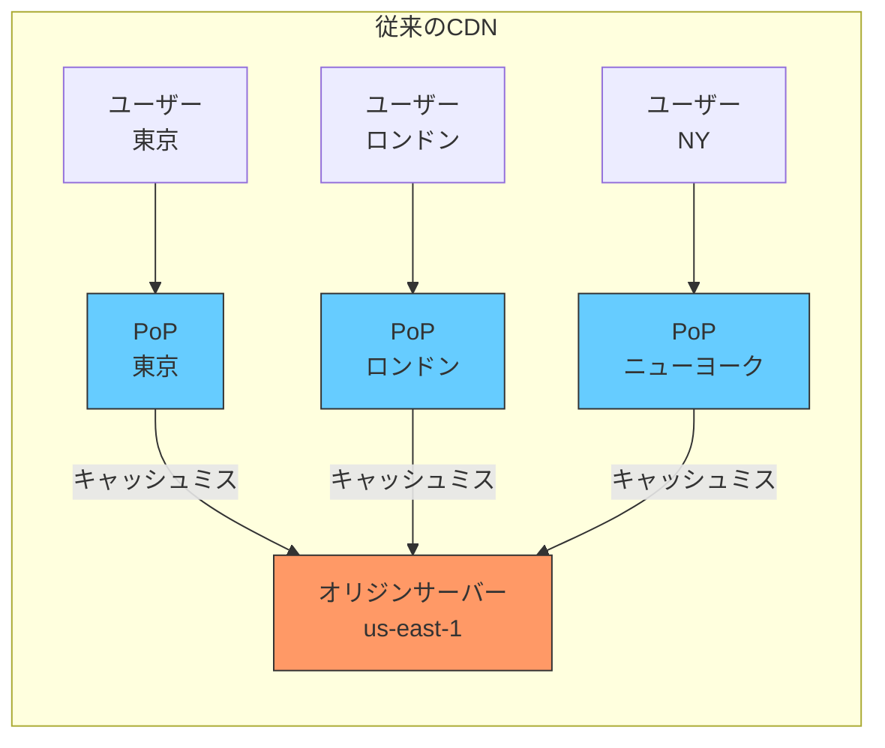

しかし、従来のCDNには根本的な限界があった。CDNが処理できるのは「キャッシュ可能な静的コンテンツ」に限られ、動的なロジック——認証チェック、パーソナライゼーション、A/Bテスト——は依然としてオリジンサーバーが担う必要があった。ユーザーが東京にいてオリジンサーバーが米国東部にある場合、静的コンテンツは東京のPoPから数ミリ秒で配信されるが、動的コンテンツの取得には太平洋を往復する200ミリ秒以上のレイテンシが避けられなかった。

### 1.2 レイテンシ低減への飽くなき追求

Webアプリケーションの高度化に伴い、「すべてのレスポンスをユーザーの近くで生成できないか」という要求が強まった。特に以下のようなユースケースが、この要求を加速させた。

- **リアルタイム性を求めるアプリケーション**: ライブストリーミング、オンラインゲーム、金融取引
- **グローバルに分散したユーザーベース**: ローカライゼーション、地域ベースのコンテンツ制御
- **パフォーマンスがビジネスに直結するEC/メディア**: Googleの調査によれば、ページ読み込みが100ミリ秒遅延するごとにコンバージョン率が低下する

この背景から、CDNのPoP上でアプリケーションロジックを実行するという発想——すなわち「エッジコンピューティング」——が生まれた。

### 1.3 サーバーレスとの融合

エッジコンピューティングの実現を技術的に可能にしたのは、サーバーレスコンピューティングのパラダイムである。2014年にAWS Lambdaが登場し、「関数単位でコードをデプロイし、イベント駆動で実行する」というモデルが確立された。このモデルをCDNエッジに適用すれば、開発者はサーバーのプロビジョニングを意識することなく、世界中のPoPでコードを実行できる。

2017年にAWSがLambda@Edgeを発表し、2018年にCloudflare Workersが一般公開された。2021年にはAWSがCloudFront Functionsを追加し、さらに軽量なエッジ実行環境を提供した。エッジコンピューティングは、CDNの「コンテンツ配信」とサーバーレスの「イベント駆動実行」を融合させた新しいコンピューティングモデルとして急速に普及していった。

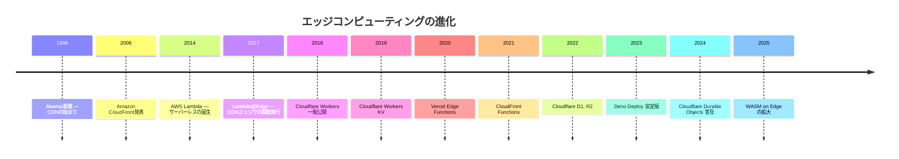

## 2. アーキテクチャ — 各プラットフォームの設計思想

### 2.1 エッジランタイムの二つの潮流

エッジで計算を実行するためのランタイムアーキテクチャは、大きく二つの潮流に分けられる。

| 項目 | V8 Isolates | コンテナ / microVM |
|---|---|---|
| 代表的なサービス | Cloudflare Workers, CloudFront Functions | Lambda@Edge |
| 起動時間 | 0〜5ミリ秒 | 数十〜数百ミリ秒 |
| 分離単位 | V8 Isolate | コンテナ / microVM |
| 対応言語 | JavaScript / TypeScript（+ WASM） | Node.js, Python |
| メモリ上限 | 数MB〜128MB | 128MB〜10GB |
| CPU時間制限 | 数ミリ秒〜30秒 | 5秒〜30秒 |
| セキュリティ分離 | プロセス内分離 | OS レベル分離 |

::: tip V8 Isolatesとは
V8 IsolatesはGoogle ChromeのJavaScriptエンジンであるV8が提供する分離実行環境である。一つのプロセス内に複数のIsolateを生成でき、それぞれが独立したヒープとコンテキストを持つ。コンテナやVMのような重いOS資源を必要とせず、マイクロ秒オーダーで新しいIsolateを起動できる点が最大の特長である。Cloudflare Workersはこの仕組みを全面的に採用している。
:::

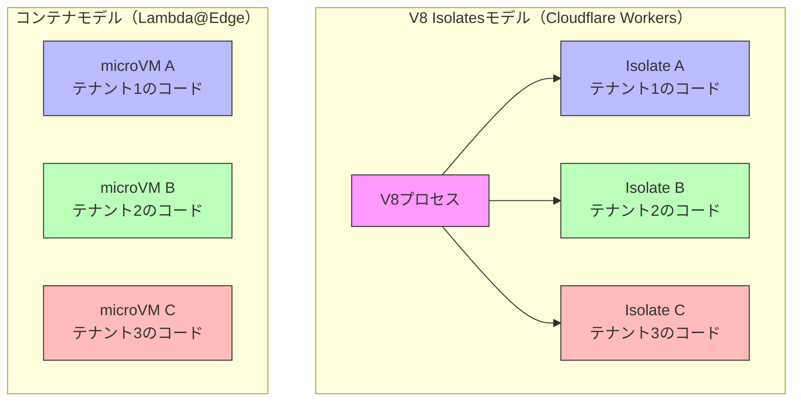

V8 Isolatesモデルの最大の利点は**コールドスタートがほぼゼロ**であることだ。新しいIsolateの起動はメモリ領域の確保とV8コンテキストの初期化だけで完了するため、数ミリ秒で済む。一方、コンテナモデルでは、コンテナイメージの展開、ランタイムの初期化、アプリケーションコードのロードが必要で、コールドスタートに数百ミリ秒から数秒かかることがある。

ただし、V8 Isolatesモデルにはトレードオフがある。同一プロセス内で複数のテナントのコードが実行されるため、セキュリティ分離のレベルはコンテナモデルに比べて低い。また、対応言語がJavaScript/TypeScript（およびWASMにコンパイル可能な言語）に限定される。

### 2.2 CloudFront Functions vs Lambda@Edge

AWSのエッジコンピューティングは二層構成になっている。軽量な処理にはCloudFront Functionsを、重い処理にはLambda@Edgeを使い分ける設計だ。

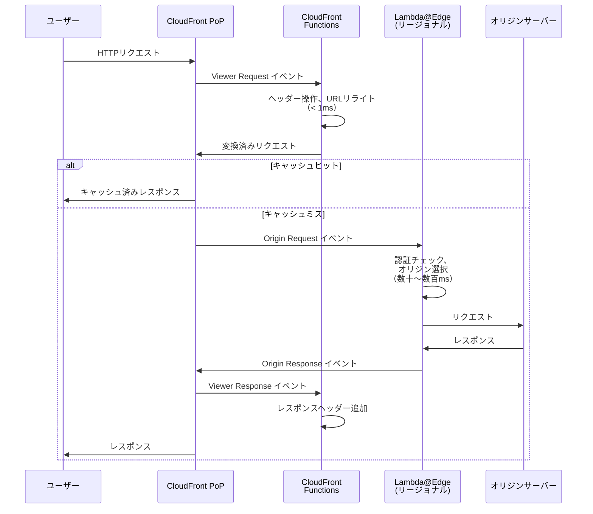

#### CloudFront Functions

CloudFront FunctionsはJavaScriptの軽量ランタイムで、CloudFrontのすべてのPoP（400以上のロケーション）で実行される。実行タイミングはViewer Request/Viewer Responseの2つで、リクエストがキャッシュレイヤーに到達する前後に処理を挟む形になる。

主な制約は以下の通りである。

- **実行時間**: 最大1ミリ秒
- **メモリ**: 2MB
- **パッケージサイズ**: 10KB
- **ネットワークアクセス**: 不可（外部APIを呼ぶことはできない）
- **言語**: JavaScript（ECMAScript 5.1ベース、一部ES6機能対応）

> [!WARNING]
> CloudFront FunctionsはネットワークI/Oを一切実行できない。外部のデータベースやAPI、KVストアへのアクセスが必要な場合はLambda@Edgeを使う必要がある。この制約を理解せずに採用すると、設計段階で行き詰まることになる。

CloudFront Functionsが適しているのは以下のようなステートレスで軽量な処理である。

- URLリライトとリダイレクト
- HTTPヘッダーの追加・変更・削除
- Cache-Keyの正規化
- 簡単なアクセス制御（IPアドレスやUser-Agentによる振り分け）

#### Lambda@Edge

Lambda@EdgeはAWS Lambdaの関数をCloudFrontのリージョナルエッジキャッシュ（13リージョン）で実行するサービスである。CloudFront Functionsと異なり、Viewer Request/Response に加えて Origin Request/Response の4つのイベントに対応する。

主な制約は以下の通りである。

- **実行時間**: Viewer系で最大5秒、Origin系で最大30秒
- **メモリ**: 最大128MB（Viewer系）/ 最大10GB（Origin系）
- **パッケージサイズ**: 1MB（Viewer系）/ 50MB（Origin系）
- **ネットワークアクセス**: 可能
- **言語**: Node.js, Python

Lambda@Edgeは、CloudFront Functionsでは不可能なより複雑な処理を担当する。

- 認証トークンの検証（JWTの検証など）
- オリジンの動的選択
- レスポンスの動的生成
- 外部APIやデータベースとの通信

::: details CloudFront Functions と Lambda@Edge の使い分け判断フロー
1. **ネットワークアクセスが必要か?** → Yes: Lambda@Edge
2. **実行時間が1ミリ秒を超えるか?** → Yes: Lambda@Edge
3. **パッケージサイズが10KBを超えるか?** → Yes: Lambda@Edge
4. **Origin Request/Responseのタイミングで処理が必要か?** → Yes: Lambda@Edge
5. **上記すべてNoなら** → CloudFront Functions
:::

### 2.3 Cloudflare Workers エコシステム

Cloudflare WorkersはCloudflareが提供するエッジコンピューティングプラットフォームで、2018年の一般公開以来急速に成長している。最大の特徴は、V8 Isolatesを全面採用することで**コールドスタートを事実上ゼロにした**点と、エッジ上にストレージやデータベースまで展開するという包括的なエコシステムを構築している点にある。

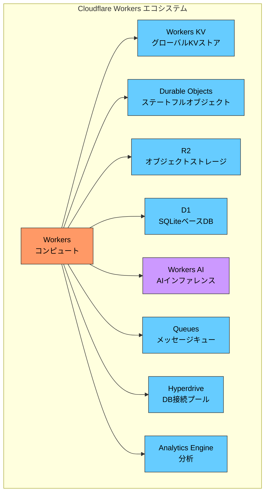

#### Workers KV

Workers KVは、エッジに分散されたキーバリューストアである。結果整合性モデルを採用しており、書き込みがグローバルに伝播するまでに最大60秒程度かかるが、読み取りはエッジから直接行われるため極めて低レイテンシである。

- **読み取り**: エッジから直接、ミリ秒オーダー
- **書き込み**: 中央に書き込み後、グローバルに非同期伝播
- **整合性**: 結果整合性（Eventual Consistency）
- **値サイズ上限**: 25MB
- **用途**: 設定値、フィーチャーフラグ、A/Bテスト設定、静的アセットの配信

> [!NOTE]
> Workers KVは「読み取り頻度が高く、書き込み頻度が低い」ワークロードに最適化されている。頻繁に更新されるデータ（リアルタイムカウンターなど）には向いていない。そのようなケースではDurable Objectsを検討すべきである。

#### Durable Objects

Durable Objectsは、エッジコンピューティングの世界に**強い整合性を持つステートフルなコンピュート**を導入したCloudflare独自のプリミティブである。各Durable Objectは世界中のいずれか一つのデータセンターに「住む」（特定の場所に固定される）という設計で、同一オブジェクトへのアクセスは必ずそのデータセンターにルーティングされる。

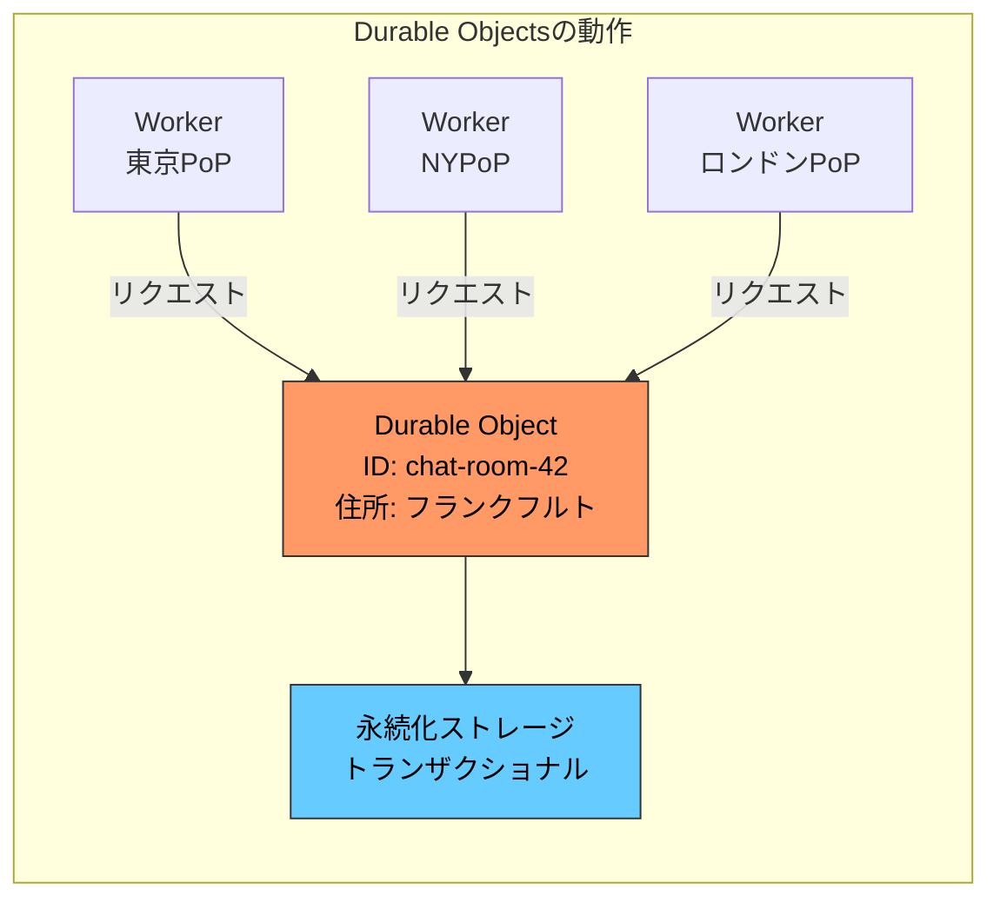

この設計は一見「エッジ」の思想に反するように見えるが、分散システムにおける整合性の問題を解決するエレガントなアプローチである。チャットルーム、共同編集、ゲームのセッション管理など、複数のクライアントが同一の状態を共有する必要があるユースケースでは、データの「調整者」（coordinator）が一箇所にいることが合理的な設計判断となる。

Durable Objectsの主な特徴は以下の通りである。

- **シングルスレッド保証**: 同一オブジェクトへのリクエストは直列化される
- **トランザクショナルストレージ**: KVペアを持ち、トランザクションで読み書きできる
- **WebSocket対応**: 長寿命のWebSocket接続をハンドリングできる
- **自動配置**: オブジェクトはアクセスパターンに基づいて最適なロケーションに配置される

#### R2

R2はCloudflareが提供するS3互換のオブジェクトストレージである。S3 APIとの互換性を持ちながら、**エグレス料金が無料**という破格のコスト構造が最大の特徴である。Workers から直接アクセスでき、大容量のファイルやメディアの保存に適している。

#### D1

D1はCloudflareが提供するエッジネイティブのリレーショナルデータベースで、SQLiteをベースとしている。各エッジロケーションにリードレプリカが配置され、読み取りはローカルから高速に実行される。書き込みはプライマリに転送される。

### 2.4 Deno Deploy

Deno DeployはDeno（Node.jsの創始者であるRyan Dahlが開発した新しいJavaScript/TypeScriptランタイム）をエッジで実行するプラットフォームである。Denoのセキュリティモデル（デフォルトでファイルシステム・ネットワークアクセスを拒否する）をそのまま引き継ぎ、Web標準API（Fetch API, Web Streams, Web Cryptoなど）に準拠した開発体験を提供する。

Deno Deployの特徴的な設計は以下の通りである。

- **Web標準準拠**: ブラウザと同じAPIがサーバーサイドで使える
- **TypeScriptネイティブ**: トランスパイルなしでTypeScriptを直接実行
- **Deno KV**: 強い整合性を提供するグローバル分散KVストア（FoundationDBベース）
- **GitHubとの統合**: リポジトリへのプッシュで自動デプロイ

### 2.5 Vercel Edge Functions

Vercel Edge FunctionsはNext.jsのフレームワークと深く統合されたエッジランタイムである。内部的にはCloudflare Workersと同様のV8 Isolatesベースの実行環境を使用しているが、Next.jsのMiddlewareやEdge API Routesとして透過的に利用できる点が特徴である。

```typescript
// Next.js Middleware (runs on the edge)
import { NextRequest, NextResponse } from 'next/server';

export function middleware(request: NextRequest) {
  const country = request.geo?.country || 'US';

  // Rewrite to country-specific page
  if (country === 'JP') {
    return NextResponse.rewrite(new URL('/jp' + request.nextUrl.pathname, request.url));
  }

  return NextResponse.next();
}

export const config = {
  matcher: ['/((?!api|_next/static|favicon.ico).*)'],
};
```

### 2.6 各プラットフォーム比較

| 特性 | CloudFront Functions | Lambda@Edge | Cloudflare Workers | Deno Deploy | Vercel Edge Functions |
|---|---|---|---|---|---|
| ランタイム | JavaScript (ES5.1+) | Node.js / Python | V8 Isolates | V8 (Deno) | V8 Isolates |
| PoP数 | 400+ | 13リージョン | 300+ | 35+ | Cloudflare連携 |
| コールドスタート | ほぼゼロ | 数百ms〜数秒 | ほぼゼロ | ほぼゼロ | ほぼゼロ |
| 最大実行時間 | 1ms | 5s / 30s | 30s (有料) | 50ms (無料) | 25s |
| ネットワークI/O | 不可 | 可能 | 可能 | 可能 | 可能 |
| ストレージ連携 | なし | DynamoDB等 | KV, DO, R2, D1 | Deno KV | Vercel KV等 |
| 料金モデル | リクエスト課金 | リクエスト+時間 | リクエスト課金 | リクエスト課金 | リクエスト課金 |

## 3. 実装手法 — エッジで何ができるのか

### 3.1 リクエスト/レスポンス変換

エッジコンピューティングの最も基本的なユースケースは、HTTPリクエストとレスポンスの変換である。オリジンサーバーに到達する前にリクエストを加工し、オリジンからのレスポンスをユーザーに返す前に加工する。

#### URLリライトとリダイレクト

```javascript
// CloudFront Functions example: URL rewrite
function handler(event) {
  var request = event.request;
  var uri = request.uri;

  // Add index.html for directory requests
  if (uri.endsWith('/')) {
    request.uri += 'index.html';
  }
  // Add .html extension if missing
  else if (!uri.includes('.')) {
    request.uri += '/index.html';
  }

  return request;
}
```

#### セキュリティヘッダーの付与

```javascript
// Cloudflare Workers example: add security headers
export default {
  async fetch(request, env) {
    const response = await fetch(request);

    // Clone response to modify headers
    const newResponse = new Response(response.body, response);

    newResponse.headers.set('X-Content-Type-Options', 'nosniff');
    newResponse.headers.set('X-Frame-Options', 'DENY');
    newResponse.headers.set(
      'Strict-Transport-Security',
      'max-age=31536000; includeSubDomains'
    );
    newResponse.headers.set('Referrer-Policy', 'strict-origin-when-cross-origin');
    newResponse.headers.set(
      'Content-Security-Policy',
      "default-src 'self'; script-src 'self'"
    );

    return newResponse;
  },
};
```

#### 地域ベースのルーティング

```javascript
// Cloudflare Workers: geo-based routing
export default {
  async fetch(request) {
    const country = request.cf?.country || 'US';
    const url = new URL(request.url);

    // Route to region-specific origin
    const origins = {
      JP: 'https://api-ap.example.com',
      KR: 'https://api-ap.example.com',
      DE: 'https://api-eu.example.com',
      FR: 'https://api-eu.example.com',
      GB: 'https://api-eu.example.com',
    };

    const origin = origins[country] || 'https://api-us.example.com';
    const newUrl = new URL(url.pathname + url.search, origin);

    return fetch(newUrl, {
      method: request.method,
      headers: request.headers,
      body: request.body,
    });
  },
};
```

### 3.2 A/Bテスト

エッジでのA/Bテストは、オリジンサーバーに負担をかけず、かつユーザーに一貫した体験を提供できるため、広く採用されているパターンである。基本的な考え方は、Cookieを使ってユーザーをバケットに振り分け、エッジでリクエストを書き換えることでバリアントを出し分けるというものだ。

```javascript
// Cloudflare Workers: A/B testing
export default {
  async fetch(request) {
    const url = new URL(request.url);

    // Only apply A/B test to specific paths
    if (!url.pathname.startsWith('/landing')) {
      return fetch(request);
    }

    // Check for existing bucket assignment
    const cookie = request.headers.get('Cookie') || '';
    const match = cookie.match(/ab-bucket=(control|variant)/);
    let bucket = match ? match[1] : null;

    // Assign new bucket if none exists
    if (!bucket) {
      bucket = Math.random() < 0.5 ? 'control' : 'variant';
    }

    // Rewrite URL based on bucket
    if (bucket === 'variant') {
      url.pathname = url.pathname.replace('/landing', '/landing-v2');
    }

    const response = await fetch(url.toString(), {
      method: request.method,
      headers: request.headers,
    });

    // Set bucket cookie if new assignment
    if (!match) {
      const newResponse = new Response(response.body, response);
      newResponse.headers.append(
        'Set-Cookie',
        `ab-bucket=${bucket}; Path=/; Max-Age=86400; SameSite=Lax`
      );
      return newResponse;
    }

    return response;
  },
};
```

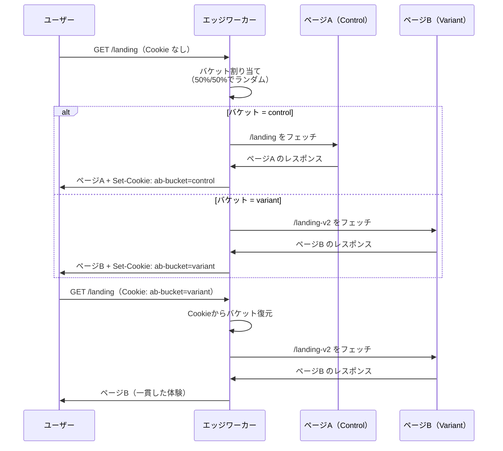

::: tip A/Bテストにおけるキャッシュの考慮
エッジA/Bテストとキャッシュを組み合わせる場合、バケットごとにキャッシュキーを分ける必要がある。そうしないと、controlグループのユーザーがキャッシュしたレスポンスがvariantグループのユーザーに配信されてしまう。CloudFrontであればCache Policyで特定のCookieをキャッシュキーに含め、Cloudflareであれば `cacheKey` オプションで制御する。
:::

### 3.3 認証チェック

エッジでの認証チェックは、不正なリクエストをオリジンサーバーに到達させないためのゲートキーパーとして機能する。JWTの検証はCPU処理のみで完結するため、エッジでの実行に適している。

```javascript
// Cloudflare Workers: JWT verification at the edge
import { jwtVerify } from 'jose';

export default {
  async fetch(request, env) {
    // Skip auth for public paths
    const url = new URL(request.url);
    const publicPaths = ['/login', '/public', '/health'];
    if (publicPaths.some((p) => url.pathname.startsWith(p))) {
      return fetch(request);
    }

    // Extract token from Authorization header
    const authHeader = request.headers.get('Authorization');
    if (!authHeader || !authHeader.startsWith('Bearer ')) {
      return new Response('Unauthorized', { status: 401 });
    }
    const token = authHeader.slice(7);

    try {
      // Verify JWT using the public key stored in environment
      const secret = new TextEncoder().encode(env.JWT_SECRET);
      const { payload } = await jwtVerify(token, secret, {
        algorithms: ['HS256'],
      });

      // Add user info as headers for the origin
      const newRequest = new Request(request);
      newRequest.headers.set('X-User-Id', payload.sub);
      newRequest.headers.set('X-User-Role', payload.role);

      return fetch(newRequest);
    } catch (err) {
      return new Response('Invalid token', { status: 403 });
    }
  },
};
```

> [!CAUTION]
> エッジでの認証チェックはセキュリティの「前線」としては有効だが、オリジンサーバー側でもバリデーションを行うのが望ましい。エッジの設定ミスや一時的な障害により認証チェックがバイパスされる可能性がゼロではないため、Defense in Depth（多層防御）の原則に従うべきである。

### 3.4 パーソナライゼーション

エッジコンピューティングの真価が発揮されるのは、ユーザーの属性に基づいたコンテンツの動的なカスタマイズ——パーソナライゼーション——である。従来、パーソナライゼーションはキャッシュの天敵であった。ユーザーごとにコンテンツが異なれば、キャッシュヒット率は限りなくゼロに近づく。エッジコンピューティングは、この問題に対する新しいアプローチを提供する。

**HTML Rewriting**（HTML書き換え）という手法が代表的である。オリジンからキャッシュ可能なベースHTMLを取得し、エッジでユーザー固有の部分だけを書き換えるアプローチだ。Cloudflare WorkersのHTMLRewriter APIはこの目的のために設計されている。

```javascript
// Cloudflare Workers: edge personalization with HTMLRewriter
export default {
  async fetch(request, env) {
    // Fetch the base (cacheable) page from origin
    const response = await fetch(request);

    // Get user preferences from KV
    const userId = request.headers.get('X-User-Id');
    let prefs = null;
    if (userId) {
      const data = await env.USER_PREFS.get(userId, { type: 'json' });
      prefs = data;
    }

    // Rewrite HTML at the edge
    return new HTMLRewriter()
      .on('#greeting', {
        element(element) {
          if (prefs?.name) {
            element.setInnerContent(`Welcome back, ${prefs.name}!`);
          }
        },
      })
      .on('#recommendations', {
        element(element) {
          if (prefs?.category) {
            element.setAttribute('data-category', prefs.category);
          }
        },
      })
      .on('.locale-price', {
        element(element) {
          const country = request.cf?.country;
          if (country === 'JP') {
            element.setAttribute('data-currency', 'JPY');
          }
        },
      })
      .transform(response);
  },
};
```

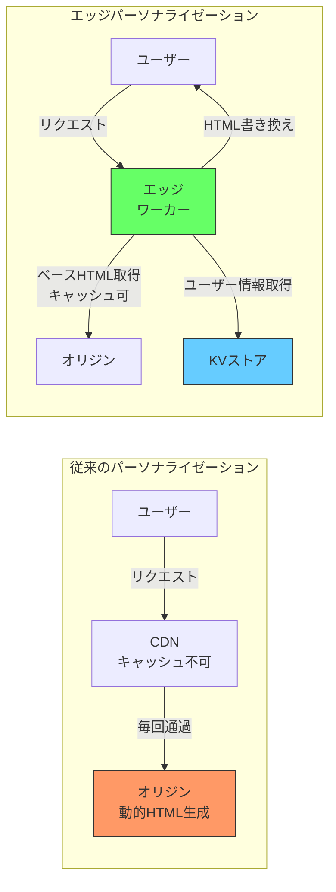

この手法の利点は、ベースHTMLをキャッシュしつつパーソナライゼーションも実現できる点にある。完全に動的なページ生成に比べてオリジンへの負荷は劇的に軽減される。

### 3.5 エッジでのSSR（Server-Side Rendering）

近年、フロントエンドフレームワークのSSR（Server-Side Rendering）をエッジで実行するという手法が急速に広まっている。Next.js、Nuxt、SvelteKit、Astroなどのフレームワークがエッジランタイムへのデプロイをサポートしており、HTMLの初期レンダリングをユーザーの最寄りのPoPで実行できる。

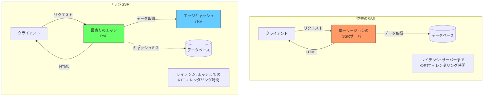

エッジSSRの実現には、フレームワーク側がWeb標準API（Fetch, Request, Response, Web Streams）に準拠していることが前提となる。Node.js固有のAPI（`fs`, `net`, `crypto` モジュールなど）に依存するコードはエッジでは動作しない。この制約は「Edge Runtime互換」と呼ばれ、フレームワークやライブラリの選定時に考慮すべき重要な要素である。

::: warning エッジSSRの落とし穴
エッジSSRはレイテンシの低減に効果的だが、データソースへのアクセスがボトルネックになり得る。エッジからオリジンのデータベースへの問い合わせが発生すると、エッジの地理的な利点が相殺されてしまう。エッジSSRの効果を最大化するには、データもエッジに近い場所（Workers KV, Deno KV, Turso, D1など）に配置するか、適切なキャッシュ戦略を組み合わせる必要がある。
:::

```javascript
// SvelteKit on Cloudflare Workers: edge SSR example
// src/routes/+page.server.js
export async function load({ platform, request }) {
  const country = request.cf?.country || 'US';

  // Fetch data from edge KV
  const config = await platform.env.SITE_CONFIG.get(country, { type: 'json' });

  // Fetch product data from D1 (edge database)
  const { results } = await platform.env.DB.prepare(
    'SELECT * FROM products WHERE region = ? ORDER BY popularity DESC LIMIT 10'
  )
    .bind(country)
    .all();

  return {
    products: results,
    config,
  };
}
```

## 4. 運用の実際 — 制約、デバッグ、コスト

### 4.1 実行制限

エッジランタイムは意図的に厳しいリソース制限が設けられている。これは、数百のPoPで数百万のテナントのコードを安全かつ公平に実行するために不可欠な設計判断である。

| 制限項目 | CloudFront Functions | Lambda@Edge | Cloudflare Workers (有料) |
|---|---|---|---|
| CPU時間 | 1ms | 5s / 30s | 30s |
| メモリ | 2MB | 128MB / 10GB | 128MB |
| パッケージサイズ | 10KB | 1MB / 50MB | 10MB（圧縮後） |
| 環境変数 | なし | あり | あり（Secrets） |
| 同時実行 | 制限なし | 1000/リージョン | 制限なし |
| Subrequest | 不可 | 制限なし | 50 / リクエスト (無料: 6) |

> [!WARNING]
> エッジの実行制限は本番運用で予期せぬ問題を引き起こすことがある。特にCPU時間の制限は、暗号処理、JSON/XMLの大量パース、画像処理など、CPUバウンドな処理で問題になりやすい。開発・テスト環境では制限内に収まっていても、本番の大きなペイロードで制限を超える場合がある。必ず本番に近いデータサイズで負荷テストを行うべきである。

### 4.2 デバッグの難しさ

エッジコンピューティングの開発者が直面する最大の課題の一つはデバッグである。コードが世界中の数百のPoPに分散して実行されるため、ローカルでの再現が困難な問題が発生しうる。

**主なデバッグ上の課題**:

1. **地域依存の問題**: 特定のPoPでのみ発生するエラー、地域固有のネットワーク条件
2. **コールドスタートの再現**: Lambda@Edgeのコールドスタートはローカル開発では再現できない
3. **制限の壁**: 開発時には気づかないリソース制限の超過
4. **分散ログの収集**: 数百のPoPに散らばるログの集約と分析

各プラットフォームが提供するデバッグツールは以下の通りである。

- **Cloudflare Workers**: `wrangler dev` によるローカル開発、`wrangler tail` によるリアルタイムログストリーミング、Miniflareによるローカルシミュレーション
- **CloudFront Functions**: テストコンソールでのイベントシミュレーション（ただし、限定的）
- **Lambda@Edge**: CloudWatch Logsへの出力（ただし、ログは実行されたリージョンのCloudWatchに分散する）

::: danger Lambda@Edgeのログ分散問題
Lambda@Edgeのログは、関数が実行されたリージョンのCloudWatch Logsに出力される。つまり、13リージョンのCloudWatch Logsを個別に確認しなければ全体像が把握できない。これは運用上の大きな負担となる。解決策としては、CloudWatch Logs のサブスクリプションフィルターで全リージョンのログをKinesis Data Firehose経由で一箇所に集約するか、サードパーティのログ集約サービスを利用する方法がある。
:::

```mermaid
graph TB
    subgraph "Lambda@Edge ログの分散問題"
        LE1[Lambda@Edge<br/>us-east-1] --> CW1[CloudWatch<br/>us-east-1]
        LE2[Lambda@Edge<br/>eu-west-1] --> CW2[CloudWatch<br/>eu-west-1]
        LE3[Lambda@Edge<br/>ap-northeast-1] --> CW3[CloudWatch<br/>ap-northeast-1]
        LE4[Lambda@Edge<br/>...他10リージョン] --> CW4[CloudWatch<br/>...各リージョン]

        CW1 --> AGG[ログ集約サービス<br/>Datadog / Splunk等]
        CW2 --> AGG
        CW3 --> AGG
        CW4 --> AGG
    end

    style AGG fill:#6f6,stroke:#333
```

### 4.3 キャッシュ戦略との組み合わせ

エッジコンピューティングとCDNキャッシュは補完関係にある。静的に生成可能なコンテンツはキャッシュに任せ、動的な処理が必要な部分だけをエッジコンピューティングで処理するのが効率的な設計である。

#### Stale-While-Revalidate パターン

キャッシュの鮮度とレスポンス速度を両立させる手法として、Stale-While-Revalidate（SWR）パターンがエッジで広く活用されている。

```javascript
// Cloudflare Workers: stale-while-revalidate pattern
export default {
  async fetch(request, env, ctx) {
    const cache = caches.default;
    const cacheKey = new Request(request.url, request);

    // Try cache first
    let response = await cache.match(cacheKey);

    if (response) {
      const age = parseInt(response.headers.get('Age') || '0');
      const maxStale = 300; // 5 minutes stale tolerance

      if (age > maxStale) {
        // Stale: serve stale and revalidate in background
        ctx.waitUntil(revalidate(request, cache, cacheKey));
      }

      return response;
    }

    // Cache miss: fetch from origin
    return revalidate(request, cache, cacheKey);
  },
};

async function revalidate(request, cache, cacheKey) {
  const response = await fetch(request);

  // Cache the fresh response
  const cachedResponse = new Response(response.body, response);
  cachedResponse.headers.set('Cache-Control', 'public, max-age=60, s-maxage=300');

  // Store in cache asynchronously
  await cache.put(cacheKey, cachedResponse.clone());

  return cachedResponse;
}
```

#### キャッシュのパージ戦略

エッジでキャッシュを活用する場合、コンテンツ更新時のキャッシュパージ（無効化）戦略も重要になる。

| パージ手法 | 説明 | 適用場面 |
|---|---|---|
| TTLベース | キャッシュの有効期限切れを待つ | 頻繁に更新されないコンテンツ |
| URLベースパージ | 特定のURLのキャッシュを明示的に削除 | 個別のページ更新 |
| タグベースパージ | サロゲートキー（Cache-Tag）で関連キャッシュを一括削除 | CMSのコンテンツ更新 |
| 全パージ | すべてのキャッシュを削除 | 大規模な構造変更（最終手段） |

### 4.4 コスト構造の違い

エッジコンピューティングの料金体系はプラットフォームによって大きく異なる。コスト最適化を行うためには、各プラットフォームの課金モデルを正確に理解する必要がある。

```mermaid
graph TB
    subgraph "課金の構成要素"
        REQ[リクエスト数課金<br/>全プラットフォーム共通]
        CPU[CPU時間課金<br/>Cloudflare Workers<br/>Lambda@Edge]
        BW[帯域幅課金<br/>CloudFront<br/>Lambda@Edge]
        ST[ストレージ課金<br/>KV, R2, D1等]
    end

    style REQ fill:#f96,stroke:#333,color:#000
    style CPU fill:#6cf,stroke:#333,color:#000
    style BW fill:#ffc,stroke:#333,color:#000
    style ST fill:#cfc,stroke:#333,color:#000
```

**Cloudflare Workers（2025年時点の概算）**:
- 無料プラン: 10万リクエスト/日
- 有料プラン（Workers Paid）: $5/月 + 1,000万リクエストあたり$0.30
- CPU時間超過: 追加CPU時間あたりの従量課金
- Workers KV: 読み取り1,000万回あたり$0.50、書き込み100万回あたり$5.00

**CloudFront Functions（2025年時点の概算）**:
- 100万リクエストあたり$0.10
- コンピュート利用料: 100万秒あたり$0.000000625

**Lambda@Edge（2025年時点の概算）**:
- 100万リクエストあたり$0.60
- 128MBメモリで1ミリ秒あたり$0.00000000625
- CloudFrontのデータ転送料金が別途発生

::: tip コスト最適化のポイント
エッジコンピューティングのコストを最適化するための基本方針は以下の通りである。
1. **処理の振り分け**: 軽量な処理はCloudFront Functions（最安）に、重い処理のみLambda@EdgeやWorkersに
2. **キャッシュの最大活用**: エッジ計算を実行する前にキャッシュで応答できないか検討する
3. **Subrequestの最小化**: Cloudflare Workersでは外部リクエスト数に課金上の影響があるため、不要なAPI呼び出しを削減する
4. **バンドルサイズの最小化**: Tree Shakingやコード分割で不要なコードを排除する
:::

## 5. 将来展望 — エッジコンピューティングの次のフロンティア

### 5.1 WebAssembly on Edge

WebAssembly（WASM）のエッジ実行は、エッジコンピューティングの可能性を大幅に拡張する技術である。現在のエッジランタイムはJavaScript/TypeScriptが中心だが、WASMを活用することで、Rust、Go、C/C++、Pythonなどの言語で書かれたコードをエッジで実行できるようになる。

Cloudflare WorkersはすでにWASMモジュールのデプロイをサポートしており、画像処理（Photon）、暗号処理、データ圧縮などのCPUバウンドな処理をRustやC++で記述してエッジにデプロイする事例が増えている。

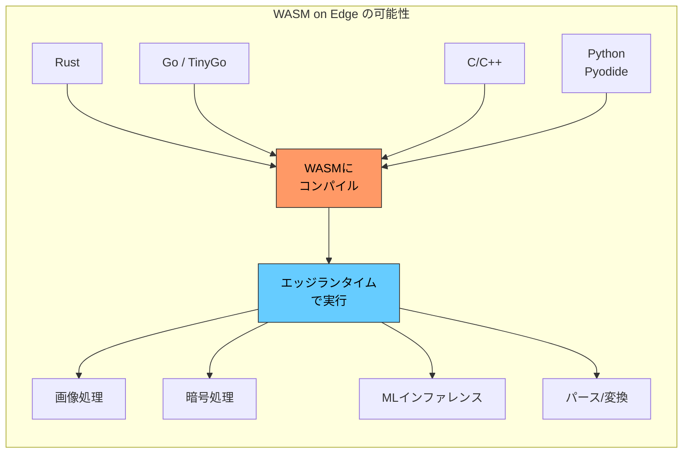

WASI（WebAssembly System Interface）の標準化が進むことで、WASMモジュールのポータビリティがさらに向上し、「Write once, run on any edge」というビジョンが現実のものになりつつある。Fermyon Spin、Wasmtime、WasmEdgeなどのWASMランタイムがエッジ向けに最適化されており、コンテナに代わる軽量な実行単位としてのWASMの利用が加速している。

> [!NOTE]
> WASMのエッジ実行における現在の課題は、デバッグツールの未成熟さと、エコシステムの断片化である。WASMのソースマップやスタックトレースは改善途上であり、本番環境での問題調査はJavaScriptに比べて困難である。

### 5.2 エッジデータベースの台頭

エッジコンピューティングの効果を最大限発揮するには、データもエッジに近い場所になければならない。この認識から、エッジネイティブなデータベースが急速に台頭している。

#### Turso（libSQL）

TursoはSQLiteをフォークしたlibSQLをベースとするエッジデータベースである。SQLiteのシンプルさと信頼性を継承しつつ、エッジへのリードレプリカの分散配置をサポートする。プライマリインスタンスに対して書き込みが行われ、リードレプリカがグローバルに配置されることで、読み取りはミリ秒オーダーのレイテンシで実行される。

#### Cloudflare D1

前述のD1もSQLiteベースだが、Cloudflareのネットワーク上にネイティブに統合されている点が特徴である。Workersから透過的にアクセスでき、追加の接続管理が不要である。

#### PlanetScale / Neon

PlanetScaleはMySQL互換、NeonはPostgreSQL互換のサーバーレスデータベースで、エッジからの接続に最適化されたHTTPベースのクエリインターフェースを提供する。従来のTCPベースの接続ではなく、HTTPリクエストでSQLクエリを実行できるため、コネクションプーリングの問題を回避できる。

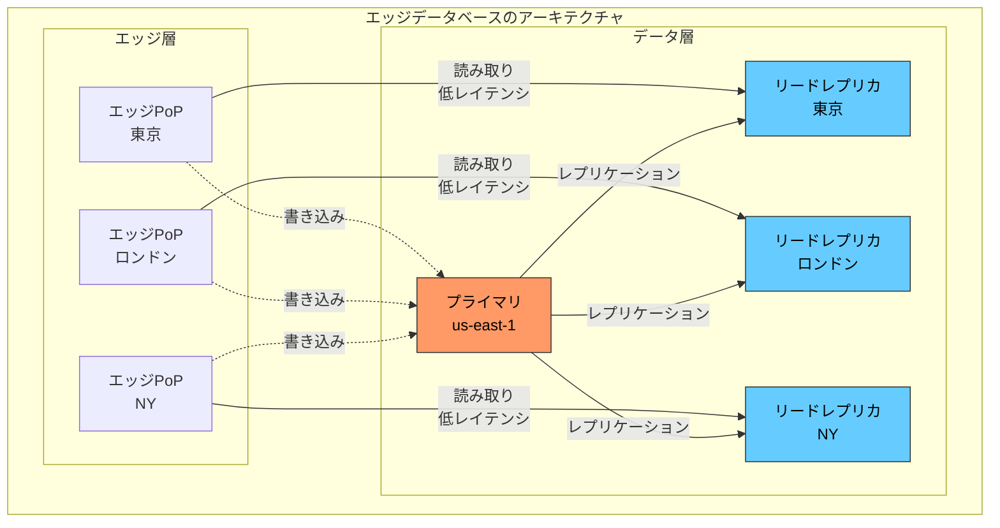

::: details エッジデータベースの選定基準
エッジデータベースを選定する際の主な判断基準は以下の通りである。

1. **読み書きの比率**: 読み取りが圧倒的に多いなら、SQLiteベース（D1, Turso）の分散リードレプリカが効果的
2. **整合性の要件**: 強い整合性が必要ならDurable Objects、結果整合性で十分ならWorkers KV
3. **クエリの複雑さ**: SQLが必要ならD1/Turso、単純なキーバリューならKV
4. **データサイズ**: 大容量データの保存にはR2、構造化データにはD1/Turso
5. **既存のスキーマ**: MySQL互換が必要ならPlanetScale、PostgreSQL互換ならNeon
:::

### 5.3 AIインファレンスのエッジ化

機械学習モデルの推論（インファレンス）をエッジで実行する動きが加速している。テキスト分類、画像認識、自然言語処理などの軽量なAIタスクを、リクエストの発生地点に近いエッジで処理することで、レイテンシの低減とプライバシーの向上を同時に実現できる。

#### Cloudflare Workers AI

Cloudflare Workers AIは、Cloudflareのネットワーク上でAIモデルを実行するサービスである。テキスト生成（LLM）、テキスト分類、画像分類、翻訳、音声認識などのモデルが利用可能で、WorkersのコードからAPI呼び出しで利用できる。

```javascript
// Cloudflare Workers AI: text classification at the edge
export default {
  async fetch(request, env) {
    const { text } = await request.json();

    // Run sentiment analysis at the edge
    const result = await env.AI.run('@cf/huggingface/distilbert-sst-2-int8', {
      text,
    });

    return Response.json({
      sentiment: result[0].label,
      confidence: result[0].score,
    });
  },
};
```

#### エッジAIの課題と展望

エッジでのAIインファレンスには以下のような課題が残されている。

- **モデルサイズの制限**: エッジのリソース制限により、大規模なモデル（数十億パラメータのLLMなど）の実行は困難
- **GPU/TPUの可用性**: 現時点でエッジPoPに高性能なGPUが配置されているケースは限定的
- **モデルの更新**: グローバルに分散したエッジロケーションにモデルを高速にデプロイする仕組みが必要

しかし、モデルの量子化技術の進歩、WASMによるポータブルなモデル実行、専用推論チップのエッジ配置など、これらの課題を解決する技術が急速に進歩している。将来的には、ユーザーのリクエストがエッジに到達した時点で、認証、パーソナライゼーション、AIインファレンスまでが数ミリ秒で完了する世界が実現されるだろう。

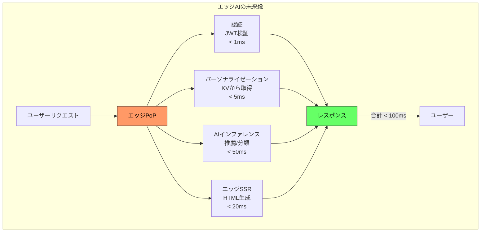

### 5.4 標準化の動き — WinterCG

エッジランタイムの乱立に伴い、ポータビリティの問題が浮上している。Cloudflare Workers、Deno Deploy、Vercel Edge Functions、Node.jsなど、各ランタイムが微妙に異なるAPIを提供しており、コードの移植が困難な場合がある。

この問題に対処するために、**WinterCG**（Web-interoperable Runtimes Community Group）というW3Cコミュニティグループが設立された。Cloudflare、Vercel、Deno、Node.jsなどの主要なプレイヤーが参加し、サーバーサイドJavaScriptランタイムの相互運用性を高めるための標準仕様を策定している。

WinterCGが標準化を進めている主要なAPIは以下の通りである。

- **Fetch API**: HTTP リクエスト/レスポンスの標準的な扱い
- **Web Streams**: ストリーミングデータの処理
- **Web Crypto API**: 暗号処理
- **URL Pattern API**: URLのマッチング
- **Structured Clone**: オブジェクトの深いコピー

この標準化が進むことで、エッジランタイム間のコードのポータビリティが向上し、ベンダーロックインのリスクが軽減される。「Write once, run on any edge」の実現に向けた重要な一歩である。

## まとめ

エッジコンピューティングは、CDNの「静的コンテンツの配信」という原点から進化し、「コンピューティング自体をユーザーの近くで実行する」という新しいパラダイムを確立した。V8 Isolatesの登場によりコールドスタートの問題が事実上解消され、Workers KV、Durable Objects、D1などのエッジネイティブなデータストアの台頭により、ステートフルなアプリケーションもエッジで構築可能になりつつある。

ただし、エッジコンピューティングは万能ではない。CPU時間やメモリの厳しい制限、デバッグの困難さ、データの整合性管理の複雑さは、設計段階で慎重に考慮すべきトレードオフである。「すべてをエッジで実行する」のではなく、「エッジで実行すべき処理を適切に選び、オリジンとの役割分担を明確にする」ことが、エッジコンピューティングを効果的に活用するための鍵である。

WASMの進化、エッジデータベースの成熟、AIインファレンスのエッジ化、WinterCGによる標準化——これらの技術動向は、エッジコンピューティングのさらなる発展を予感させる。インターネットの物理的な構造（光速の壁とグローバルなPoPの分散配置）と、ソフトウェアの論理的な要求（低レイテンシ、高可用性、パーソナライゼーション）が交差する場所に、エッジコンピューティングの本質的な価値がある。
