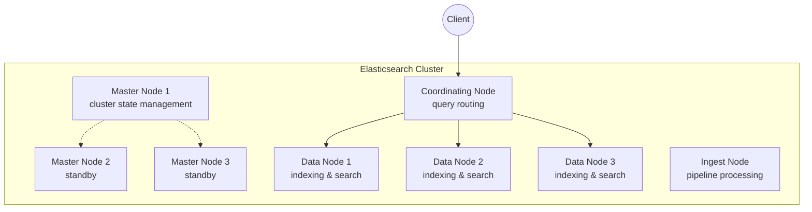
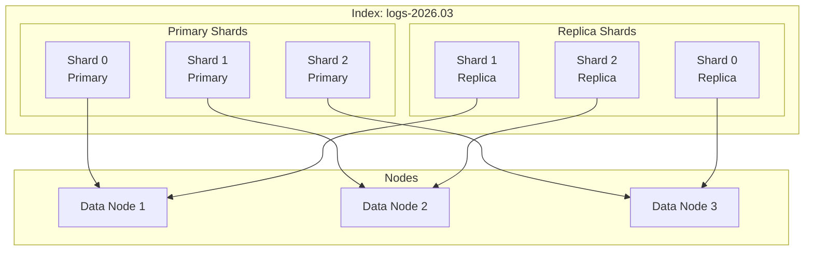
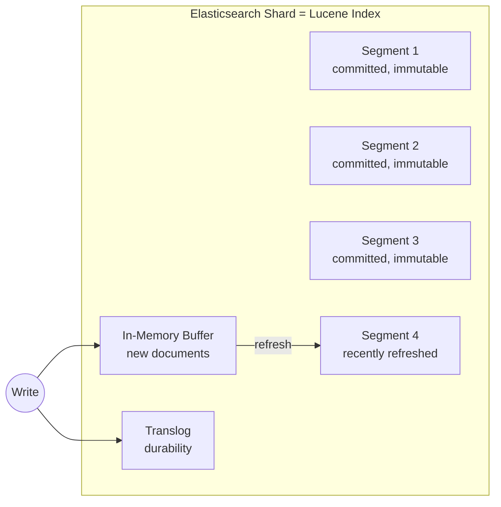
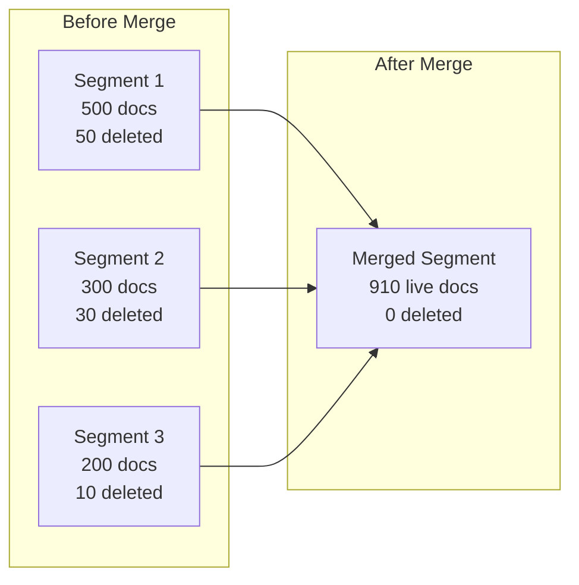
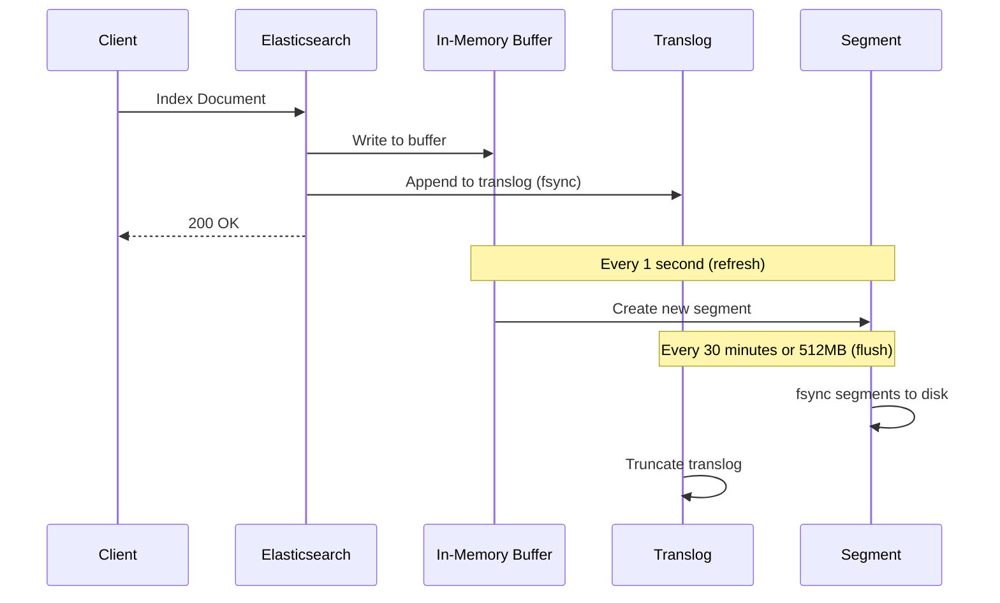
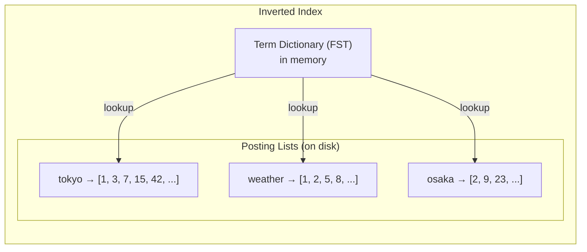
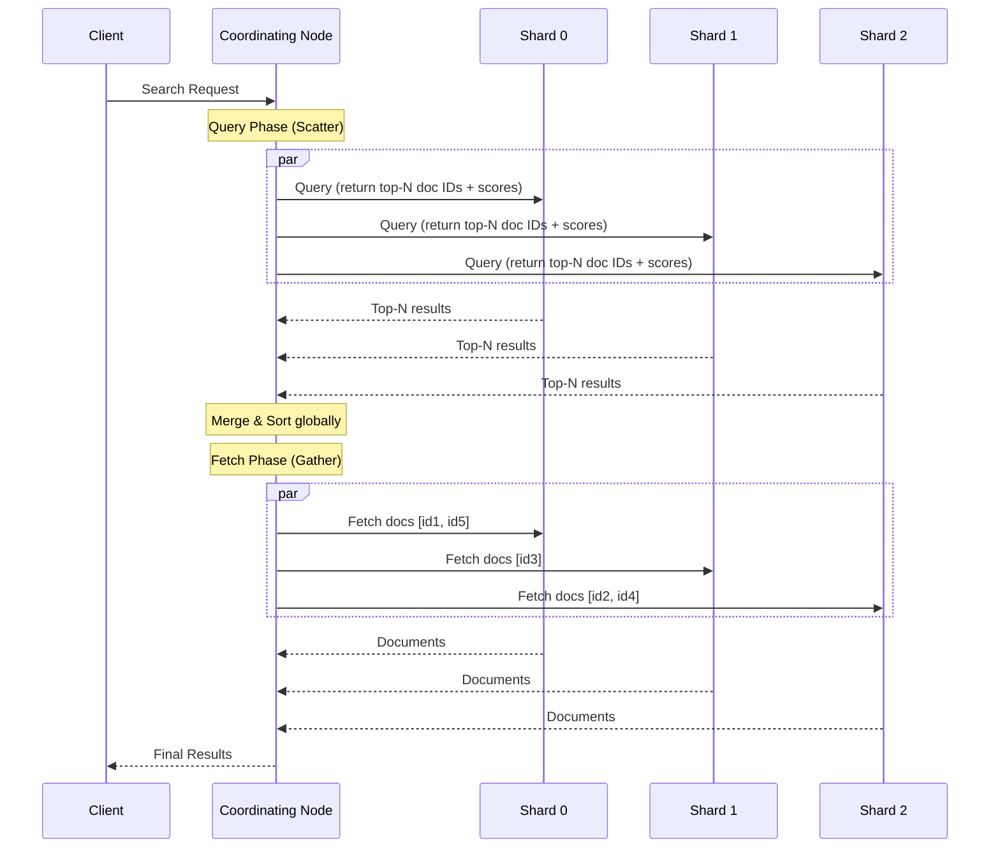
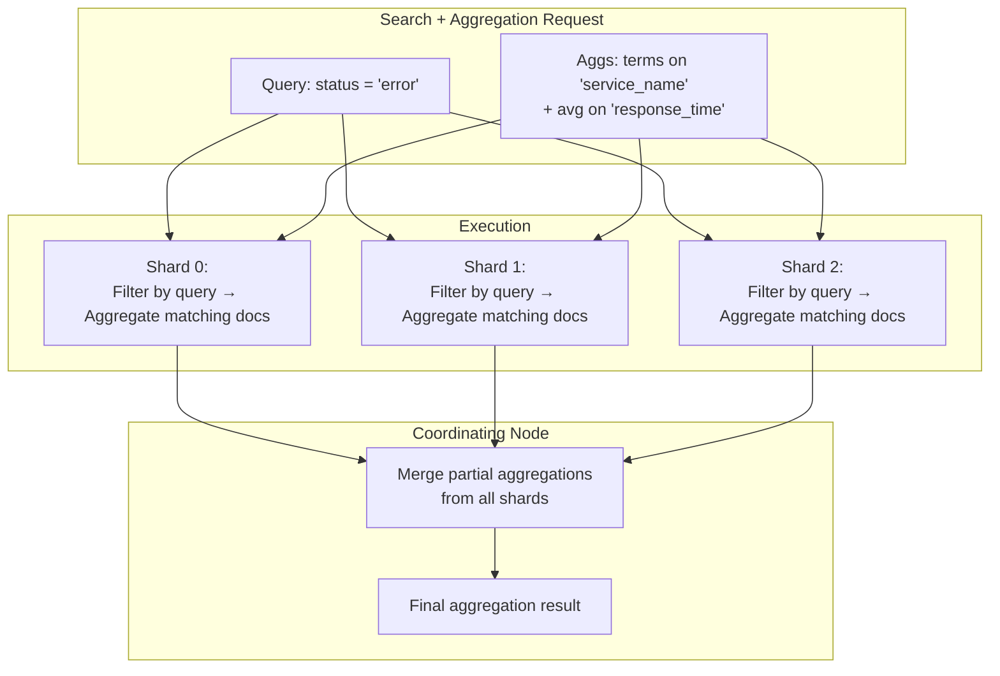

# Elasticsearchの内部構造

## 1. はじめに：Elasticsearchの位置付け

全文検索エンジンは、現代のソフトウェアシステムにおいて不可欠なコンポーネントである。ECサイトの商品検索、ログ分析基盤、ナレッジベースの横断検索、セキュリティイベントの監視——いずれの場面でも、膨大なテキストデータから瞬時に関連する情報を取り出す能力が求められる。

Elasticsearchは、この全文検索を分散システムとして実現するオープンソースの検索・分析エンジンである。2010年にShay Banonによって初版がリリースされ、Apache Luceneをコアに据えつつ、分散アーキテクチャ、RESTful API、リアルタイムに近い検索性能を提供する。現在ではElastic社が開発を主導し、Elastic Stack（旧ELK Stack）の中核として、検索だけでなくログ分析、APM（Application Performance Monitoring）、セキュリティ分析など多岐にわたる用途で利用されている。

しかし、Elasticsearchを本番環境で運用するには、その内部構造を理解することが不可欠である。「なぜこの設定が必要なのか」「なぜこのクエリが遅いのか」「なぜクラスタが不安定になるのか」——これらの疑問に答えるためには、Luceneのセグメント構造、転置インデックスの仕組み、分散クエリの実行フロー、マージ戦略といった内部の詳細を把握する必要がある。

本記事では、Elasticsearchの内部構造を層ごとに分解し、その設計思想と実装の詳細を解説する。

### 1.1 Luceneとの関係

Elasticsearchを理解するうえで最も重要な前提は、**検索の核心部分はすべてApache Luceneが担っている**という点である。

Apache Luceneは、Doug Cuttingが1999年に開発を開始したJava製の全文検索ライブラリである。転置インデックスの構築、テキスト解析、スコアリング、クエリ実行など、検索エンジンの基盤となる機能を網羅的に提供する。Luceneはライブラリであるため、単体ではHTTPサーバーとしては動作せず、分散処理の機能も持たない。

Elasticsearchは、このLuceneの上に以下の層を構築している。

```
┌─────────────────────────────────────────────────┐
│              REST API Layer                     │
│     (JSON over HTTP, Query DSL)                 │
├─────────────────────────────────────────────────┤
│           Distributed Layer                     │
│  (Cluster management, Sharding, Replication,    │
│   Distributed query coordination)               │
├─────────────────────────────────────────────────┤
│            Index Management                     │
│  (Mapping, Settings, Aliases, ILM)              │
├─────────────────────────────────────────────────┤
│          Apache Lucene (per shard)              │
│  (Inverted index, Segments, Merging,            │
│   Scoring, Analysis)                            │
└─────────────────────────────────────────────────┘
```

つまり、Elasticsearchとは「**Luceneを分散システムとして使えるようにするラッパー**」と言える。各シャードは内部的にひとつのLuceneインデックスであり、Elasticsearchはそれらを束ね、分散クエリの調整、レプリケーション、クラスタ管理を行う。

### 1.2 他の検索エンジンとの比較

Elasticsearchの位置付けをより明確にするために、関連する技術との比較を示す。

| 技術 | 種別 | 特徴 |
|---|---|---|
| Apache Lucene | ライブラリ | 全文検索の基盤。単体では分散機能なし |
| Apache Solr | サーバー | Luceneベース。ZooKeeperで分散管理。歴史が長い |
| Elasticsearch | サーバー | Luceneベース。独自の分散管理。REST API中心 |
| Meilisearch | サーバー | Rust製。タイポ耐性に特化。小〜中規模向け |
| Typesense | サーバー | C++製。簡易セットアップ志向。中規模向け |
| OpenSearch | サーバー | Elasticsearch 7.10のフォーク。AWS主導 |

Elasticsearchが広く採用されている理由は、Luceneの成熟した検索機能を、運用しやすい分散システムとして提供した最初のプロダクトであったことが大きい。

## 2. クラスタアーキテクチャ

### 2.1 ノードの種類と役割

Elasticsearchクラスタは、複数のノード（プロセス）で構成される。各ノードは設定によって異なる役割を担う。



主要なノードロールは以下の通りである。

**Master-eligible ノード**：クラスタの状態（cluster state）を管理する。クラスタ状態にはインデックスのメタデータ、シャードの配置情報、ノードの参加・離脱情報が含まれる。Master-eligibleノードの中から選出された1台がアクティブマスターとして機能し、残りは待機する。マスター選出にはクォーラムベースの合意アルゴリズムが用いられる。Elasticsearch 7.0以降では、独自に実装された合意プロトコルが使用されている。

**Data ノード**：実際のデータ（Luceneインデックス）を保持し、インデックス処理とクエリ処理を実行する。クラスタ内で最もリソースを消費するノードであり、CPU、メモリ、ディスクI/Oのすべてが要求される。

**Coordinating ノード（調整ノード）**：クライアントからのリクエストを受け付け、適切なデータノードにルーティングし、結果を集約して返却する。すべてのノードは暗黙的にCoordinatingノードとしても機能するが、専用のCoordinatingノードを設けることで、集約処理のメモリ負荷をデータノードから分離できる。

**Ingest ノード**：ドキュメントがインデックスされる前にパイプライン処理（変換、エンリッチメント）を行う。ログのパース、日付のフォーマット変換、GeoIPルックアップなどに使用される。

**Machine Learning ノード**（X-Pack機能）：異常検知やデータフレーム分析のジョブを実行する専用ノード。

### 2.2 シャーディング

Elasticsearchはインデックスを複数の**シャード**に分割して分散格納する。各シャードは独立したLuceneインデックスである。



**プライマリシャード**：ドキュメントの書き込みは必ずプライマリシャードに対して行われる。インデックス作成時にプライマリシャード数を指定し、**作成後は変更できない**（`_split` や `_shrink` APIで別インデックスを作る方法を除く）。これは、ドキュメントのルーティング先がシャード数に依存するためである。

**レプリカシャード**：プライマリシャードのコピーであり、冗長性と読み取りスループットの向上を提供する。レプリカ数は動的に変更可能である。

ドキュメントがどのシャードに格納されるかは、以下のルーティング式で決定される。

$$
\text{shard} = \text{hash}(\text{routing}) \mod \text{number\_of\_primary\_shards}
$$

デフォルトでは `routing` はドキュメントの `_id` フィールドであるが、カスタムルーティングを指定することも可能である。この式が示す通り、プライマリシャード数を変更するとルーティング結果が変わるため、シャード数の事後変更が許されないのである。

### 2.3 マスター選出とクラスタ状態

Elasticsearch 7.0で導入されたマスター選出メカニズムは、Raftに類似した独自の合意アルゴリズムに基づいている。これは `discovery.seed_hosts` と `cluster.initial_master_nodes` の設定で初期クラスタを形成し、その後は動的にノードの参加・離脱を管理する。

クラスタ状態（Cluster State）は、クラスタ全体のメタデータを保持する重要なデータ構造である。

- インデックスのメタデータ（マッピング、設定、エイリアス）
- シャードの配置情報（どのシャードがどのノードにあるか）
- ノードの参加状況
- インジェストパイプラインの定義
- 永続的・一時的なクラスタ設定

クラスタ状態の更新はマスターノードのみが行い、更新は全ノードに伝播される。巨大なクラスタ状態（数千インデックス、数万シャード）はマスターノードの負荷を増大させ、クラスタの安定性に影響を与えるため、インデックス数やシャード数の管理はクラスタ設計の重要な考慮事項である。

### 2.4 スプリットブレイン問題

分散システムにおける古典的な課題であるスプリットブレインは、ネットワーク分断により複数のマスターノードが同時に選出される事態である。Elasticsearch 7.0以前では `minimum_master_nodes` の設定ミスによりこの問題が発生しやすかった。

7.0以降の新しい選出メカニズムでは、投票構成（voting configuration）の概念が導入され、マスター選出にはクォーラム（過半数）の合意が必須となった。これにより、スプリットブレインのリスクは大幅に軽減されている。ただし、3台以上のMaster-eligibleノードを配置し、可用性ゾーンを分散させることが推奨される基本設計であることに変わりはない。

## 3. インデックスとマッピング

### 3.1 インデックスの論理構造

Elasticsearchにおける「インデックス」は、リレーショナルデータベースにおける「テーブル」にやや近い概念である。インデックスはドキュメントの論理的なコレクションであり、以下の要素で構成される。

- **マッピング（Mapping）**：ドキュメントのスキーマ定義。フィールド名、データ型、解析方法を指定する
- **設定（Settings）**：シャード数、レプリカ数、リフレッシュ間隔、アナライザの定義など
- **エイリアス（Alias）**：インデックスの論理名。インデックスの切り替えを無停止で行うために使用される

### 3.2 マッピングとフィールドタイプ

マッピングは、ドキュメントの各フィールドがどのようにインデックスされ、格納されるかを定義する。Elasticsearchは動的マッピング（Dynamic Mapping）をサポートしており、ドキュメントを投入すると自動的にフィールドの型を推測するが、本番環境では明示的なマッピング定義が推奨される。

主要なフィールドタイプを以下に示す。

| フィールドタイプ | 用途 | インデックス方法 |
|---|---|---|
| `text` | 全文検索対象の文字列 | アナライザで分割してトークンごとに転置インデックスを構築 |
| `keyword` | 完全一致検索、ソート、集約 | そのままの値で転置インデックスを構築（解析なし） |
| `integer`, `long`, `float`, `double` | 数値 | BKD Tree（Block KD Tree）で範囲検索に最適化 |
| `date` | 日時 | 内部的にlong値（エポックミリ秒）として格納。BKD Tree使用 |
| `boolean` | 真偽値 | 転置インデックス |
| `object` | ネストされたJSONオブジェクト | フラット化してインデックス |
| `nested` | 独立した内部ドキュメント | 隠しドキュメントとして別途インデックス |
| `geo_point` | 緯度経度 | BKD Treeで空間検索に対応 |
| `dense_vector` | ベクトル（kNN検索用） | HNSWグラフまたはフラットインデックス |

**`text` vs `keyword`** の区別は、Elasticsearchのマッピング設計で最も重要な判断のひとつである。`text` フィールドはアナライザを通して分割・正規化された上でインデックスされるため、全文検索（「東京 ホテル」のような部分一致検索）に適している。一方、`keyword` フィールドはそのままの値でインデックスされるため、ステータスコードやタグ、IDのような完全一致検索やファセット集約に適している。

### 3.3 マルチフィールド

実際の運用では、ひとつのフィールドを `text` と `keyword` の両方でインデックスしたいケースが頻繁にある。Elasticsearchはマルチフィールド機能でこれを実現する。

```json
{
  "mappings": {
    "properties": {
      "title": {
        "type": "text",
        "analyzer": "japanese_analyzer",
        "fields": {
          "keyword": {
            "type": "keyword",
            "ignore_above": 256
          }
        }
      }
    }
  }
}
```

この設定では、`title` フィールドは全文検索用にアナライザを通してインデックスされ、同時に `title.keyword` として完全一致検索や集約にも使用できる。

### 3.4 Dynamic Mappingの仕組みと罠

Dynamic Mappingは便利だが、本番環境では注意が必要である。例えば、ログデータにおいて、あるフィールドが最初に数値として検出されると `long` 型でマッピングされる。しかし後続のドキュメントで同じフィールドに文字列が入ると、マッピングの競合エラーが発生する。一度作成されたマッピングは変更できないため（新しいフィールドの追加は可能だが、既存フィールドの型変更は不可）、リインデックスが必要になる。

この問題を防ぐために、以下の戦略が推奨される。

- 明示的なマッピング定義とインデックステンプレートの使用
- `dynamic: "strict"` の設定（未定義フィールドの投入をエラーにする）
- フィールド爆発（Mapping Explosion）を防ぐための `index.mapping.total_fields.limit` の設定

## 4. Luceneセグメントとマージ

### 4.1 セグメントの概念

Luceneの内部では、インデックスは複数の**セグメント**と呼ばれる不変（immutable）のデータ構造で構成される。この不変性がLuceneの設計の核心である。



ドキュメントがインデックスされると、まずインメモリバッファに書き込まれる。このバッファは一定間隔（デフォルト1秒）で**リフレッシュ**され、新しいセグメントとしてディスクに書き出される。この仕組みにより、Elasticsearchは「ニアリアルタイム（Near Real-Time: NRT）」の検索を実現している。

### 4.2 セグメントが不変である理由

セグメントが不変（immutable）であることには、重要な技術的利点がある。

1. **ロック不要**：読み取り時にロックを取得する必要がなく、並行読み取りが自由に行える
2. **OSのファイルシステムキャッシュとの親和性**：不変のファイルはOSのページキャッシュに効率的に載り、繰り返しの読み取りが高速化される
3. **データ構造の最適化**：書き込み後に変更されないことが保証されるため、転置インデックスやBKD Treeを最適なレイアウトで構築できる
4. **圧縮効率**：不変データは一度圧縮すれば再圧縮が不要であり、高い圧縮率を維持できる

### 4.3 ドキュメントの更新と削除

セグメントが不変であるため、ドキュメントの更新と削除は特殊な方法で処理される。

**削除**：セグメント内のドキュメントを物理的に削除することはできない。代わりに、各セグメントに付随する `.del` ファイル（ビットマップ）にドキュメントIDを記録する。検索時には、このビットマップを参照して削除済みドキュメントをフィルタリングする。

**更新**：Elasticsearchにおけるドキュメントの更新は、内部的には「旧ドキュメントを削除マークし、新ドキュメントをインデックスする」という2ステップで実現される。したがって、頻繁な更新はセグメント内に大量の削除済みドキュメントを生み出し、検索性能とストレージ効率を低下させる。

### 4.4 マージ（Segment Merge）

セグメントが増え続けると、検索時にすべてのセグメントを走査する必要があるため、性能が劣化する。また、削除済みドキュメントがストレージを無駄に消費する。これを解決するのが**セグメントマージ**である。



マージ処理では以下が行われる。

1. 複数のセグメントのドキュメントを読み出す
2. 削除済みドキュメントを除外する
3. 新しいセグメントに生きたドキュメントだけを書き出す
4. 古いセグメントを安全に削除する

Luceneのマージ戦略は**TieredMergePolicy**がデフォルトであり、セグメントサイズに基づいて階層的にマージ対象を選択する。小さなセグメントは頻繁にマージされ、大きなセグメントはめったにマージされない。これにより、書き込み増幅（write amplification）とセグメント数のバランスが取られる。

マージはバックグラウンドで自動的に実行されるが、CPUとディスクI/Oを大量に消費するため、書き込みが集中する時間帯にはインデックス性能に影響を与えることがある。`force merge` APIを使って手動マージを実行することも可能だが、これはインデックスが読み取り専用になったタイミング（例：日次ログインデックスが翌日にローテーションされた後）に限って実行すべきである。

### 4.5 Translog（トランザクションログ）

セグメントはリフレッシュ時にディスクに書き出されるが、リフレッシュ間隔（デフォルト1秒）の間にノードがクラッシュすると、インメモリバッファのデータが失われる。この問題を防ぐために、Elasticsearchは**Translog（トランザクションログ）**を使用する。



各インデックス操作はTranslogに追記され、デフォルトではリクエストごとに `fsync` される（`index.translog.durability: "request"`）。ノードが再起動した場合、コミット済みセグメントに加えてTranslogのリプレイによりデータが復旧される。

**Flush**操作は、インメモリバッファをセグメントとしてディスクにコミットし、Translogをクリアする。デフォルトでは30分ごと、またはTranslogが512MBに達した時に自動実行される。

## 5. 転置インデックスの実装

### 5.1 転置インデックスの基本原理

全文検索の核心技術は**転置インデックス（Inverted Index）**である。通常のインデックス（前方インデックス）がドキュメントからその中に含まれる単語を引くのに対し、転置インデックスは**単語からそれを含むドキュメント群を引く**。

以下の3つのドキュメントを例に考える。

```
Doc 1: "東京の天気は晴れです"
Doc 2: "大阪の天気は曇りです"
Doc 3: "東京の気温は高いです"
```

アナライザによる分割後、以下のような転置インデックスが構築される。

| Term（語） | Posting List（文書リスト） |
|---|---|
| 東京 | [Doc 1, Doc 3] |
| 大阪 | [Doc 2] |
| 天気 | [Doc 1, Doc 2] |
| 晴れ | [Doc 1] |
| 曇り | [Doc 2] |
| 気温 | [Doc 3] |
| 高い | [Doc 3] |

「東京」で検索すると、転置インデックスから直接 `[Doc 1, Doc 3]` を取得でき、全ドキュメントを走査する必要がない。

### 5.2 転置インデックスの内部データ構造

Luceneの転置インデックスは、以下のコンポーネントで構成される。

**Term Dictionary（語辞書）**：すべてのユニークな語（Term）をソート順に保持する辞書。Luceneでは**FST（Finite State Transducer：有限状態変換器）**というデータ構造でこれを実装している。FSTはTrieの一種であり、共通のプレフィックスとサフィックスを共有することで、メモリ効率に極めて優れた辞書を構築する。FSTはメモリ上に展開され、高速な語の検索を実現する。

**Posting List（ポスティングリスト）**：各語に対応するドキュメントIDのリスト。ディスク上に格納される。Luceneでは以下の情報を含む。

- ドキュメントID（ソート済み、差分符号化で圧縮）
- 出現頻度（Term Frequency: TF）
- 出現位置（Position）とオフセット（ハイライト表示に使用）
- ペイロード（カスタムメタデータ）



### 5.3 Posting Listの圧縮

大規模なインデックスでは、ポスティングリストが数百万エントリに達することがある。Luceneはこれを効率的に格納するために、高度な圧縮技術を使用する。

**差分符号化（Delta Encoding）**：ドキュメントIDをソート済みで格納し、絶対値ではなく前の値との差分を記録する。例えば `[1, 3, 7, 15, 42]` は `[1, 2, 4, 8, 27]` として格納される。差分は元の値より小さいため、少ないビット数で表現できる。

**FOR（Frame of Reference）圧縮**：差分符号化された値をブロック（128個）単位でグループ化し、ブロック内の最大値に必要なビット数で全値をパッキングする。例えば、ブロック内の最大差分が15以下であれば、各値を4ビットで格納できる。

**Roaring Bitmap**：フィルタークエリのキャッシュなどに使用される。ドキュメントIDの集合を効率的に表現するために、密な区間はビットマップで、疎な区間はソート済み配列で格納するハイブリッド構造を採用している。

### 5.4 BKD Tree

数値型、日付型、地理座標型のフィールドには、転置インデックスではなく**BKD Tree（Block KD Tree）**が使用される。BKD TreeはKD Treeのディスク最適化版であり、多次元の範囲検索を効率的に処理する。

例えば、`price >= 100 AND price <= 500` のような範囲クエリは、BKD Treeを辿ることで対象のドキュメントIDを効率的に取得できる。地理空間検索（`geo_bounding_box` や `geo_distance`）でも2次元のBKD Treeが使用される。

### 5.5 Doc Values

集約（Aggregation）、ソート、スクリプトフィールドでは、転置インデックスとは逆方向のアクセスパターン——ドキュメントIDからフィールド値を引く——が必要になる。これを効率的に行うために、Luceneは**Doc Values**という列指向（columnar）のデータ構造を使用する。

```
Forward Index:      Doc ID → [field1, field2, field3, ...]

Inverted Index:     Term → [Doc ID1, Doc ID2, ...]  (search)

Doc Values:         Doc ID → field value             (sort, aggregation)
```

Doc Valuesはディスク上に列指向フォーマットで格納され、メモリマップドI/O（`mmap`）を通じてアクセスされる。`keyword`、数値型、日付型、地理座標型などのフィールドではデフォルトで有効であるが、`text` フィールドではDoc Valuesは利用できない（代わりに `fielddata` をメモリ上に構築する必要があるが、これはメモリ消費が大きいため非推奨である）。

## 6. クエリの実行フロー

### 6.1 Scatter-Gather モデル

Elasticsearchの分散クエリは**Scatter-Gather**（散布・集約）モデルで実行される。



**Query Phase（クエリフェーズ）**：Coordinatingノードがすべての関連シャードにクエリを送信する。各シャードはローカルで検索を実行し、上位N件のドキュメントIDとスコアのみを返す（ドキュメント本体は返さない）。Coordinatingノードは全シャードの結果をマージし、グローバルな上位N件を決定する。

**Fetch Phase（フェッチフェーズ）**：グローバルな上位N件に含まれるドキュメントの本体を、各シャードから取得する。ドキュメントの `_source` フィールド（JSONの原文）や、ハイライト情報はこのフェーズで取得される。

この2フェーズ方式には重要な意味がある。Query Phaseでは軽量なIDとスコアのみがネットワークを通過するため、帯域幅の消費を抑えられる。Fetch Phaseでは実際に必要なドキュメントだけを取得するため、無駄な転送を避けられる。

### 6.2 Deep Paging問題

Scatter-Gatherモデルには、ページネーションの深さに応じて性能が劣化する問題がある。例えば、10,000件目から10件を取得する場合（`from: 10000, size: 10`）、各シャードは上位10,010件を計算してCoordinatingノードに返す必要がある。5シャードのインデックスでは、Coordinatingノードは50,050件の結果をメモリ上でソートしなければならない。

この問題に対するElasticsearchの解決策は以下の通りである。

- **`index.max_result_window`**：デフォルト10,000件でハードリミットを設定
- **`search_after`**：前回の結果の最後のドキュメントのソート値を起点に次ページを取得する。ステートレスなカーソルベースのページネーション
- **`scroll` API**（レガシー）：検索コンテキストをサーバー側に保持する。大量データのエクスポートに使用されるが、リソースを消費するため `search_after` + PIT（Point in Time）が推奨される
- **PIT（Point in Time）**：検索時点のインデックススナップショットを保持し、`search_after` と組み合わせることでページ間の一貫性を保証する

### 6.3 各シャード内のクエリ実行

各シャード（= Luceneインデックス）内でのクエリ実行は、以下のステップで進む。

1. **セグメントの列挙**：シャード内のすべてのセグメント（コミット済み + 最新のリフレッシュ済み）を対象とする
2. **各セグメントでの検索**：セグメントごとに転置インデックスを参照し、マッチするドキュメントIDを取得する
3. **フィルターキャッシュの適用**：頻繁に使用されるフィルタークエリの結果はビットセット（Roaring Bitmap）としてキャッシュされる
4. **スコアリング**：マッチしたドキュメントのスコアを計算する（BM25アルゴリズム）
5. **トップNの選択**：優先度キュー（ヒープ）を使用して上位N件を効率的に選択する
6. **セグメント間のマージ**：複数セグメントの結果をマージして、シャードレベルの上位N件を返す

### 6.4 スコアリング（BM25）

Elasticsearch 5.0以降では、デフォルトのスコアリングアルゴリズムとして**BM25（Best Matching 25）**が使用されている（それ以前はTF-IDFが使用されていた）。

BM25のスコア計算式は以下の通りである。

$$
\text{score}(D, Q) = \sum_{i=1}^{n} \text{IDF}(q_i) \cdot \frac{f(q_i, D) \cdot (k_1 + 1)}{f(q_i, D) + k_1 \cdot \left(1 - b + b \cdot \frac{|D|}{\text{avgdl}}\right)}
$$

ここで：
- $f(q_i, D)$ は、クエリ語 $q_i$ のドキュメント $D$ における出現頻度（Term Frequency）
- $|D|$ はドキュメントの長さ（語数）
- $\text{avgdl}$ は全ドキュメントの平均長
- $k_1$ と $b$ はパラメータ（デフォルトでは $k_1 = 1.2$、$b = 0.75$）
- $\text{IDF}(q_i)$ は逆文書頻度（Inverse Document Frequency）

$$
\text{IDF}(q_i) = \ln\left(1 + \frac{N - n(q_i) + 0.5}{n(q_i) + 0.5}\right)
$$

BM25のTF-IDFに対する主な利点は、Term Frequencyの飽和（saturation）特性である。TF-IDFでは、ある語がドキュメント内に出現する回数が増えるほどスコアも線形に増加するが、BM25ではパラメータ $k_1$ によって上限が設けられ、一定回数以上の出現はスコアへの寄与が飽和する。これにより、特定の語が大量に含まれるドキュメントへの不当な高スコアを防ぐ。

### 6.5 Query DSLの内部分類

ElasticsearchのQuery DSLには、大きく分けて2種類のクエリが存在する。

**Query Context（クエリコンテキスト）**：「このドキュメントはどれだけクエリにマッチするか」を問う。スコアが計算され、関連度順のソートに使用される。`match`、`multi_match`、`bool` の `must`/`should` 句が該当する。

**Filter Context（フィルターコンテキスト）**：「このドキュメントはクエリにマッチするか否か」を問う。スコアは計算されず、結果はキャッシュ対象となる。`term`、`range`、`exists`、`bool` の `filter`/`must_not` 句が該当する。

```json
{
  "query": {
    "bool": {
      "must": [
        { "match": { "content": "Elasticsearch 内部構造" } }
      ],
      "filter": [
        { "range": { "date": { "gte": "2025-01-01" } } },
        { "term": { "status": "published" } }
      ]
    }
  }
}
```

この区別は性能に直結する。Filter Contextのクエリはスコア計算をスキップするため高速であり、結果がビットセットとしてキャッシュされるため繰り返しの実行がさらに高速になる。したがって、スコアリングが不要な条件は常にFilter Contextに配置すべきである。

## 7. アナライザとトークナイザ

### 7.1 テキスト解析パイプライン

`text` フィールドにドキュメントがインデックスされる際、テキストは**アナライザ**を通じて解析される。アナライザは3つのコンポーネントのパイプラインで構成される。


**Character Filter（文字フィルター）**：トークナイズの前にテキスト全体に適用される前処理。HTMLタグの除去（`html_strip`）、文字の置換（`mapping`）、パターンベースの置換（`pattern_replace`）などがある。

**Tokenizer（トークナイザ）**：テキストをトークン（語）に分割する。`standard`（Unicodeテキスト分割）、`whitespace`（空白分割）、`keyword`（分割なし）、`pattern`（正規表現分割）などがビルトインで提供される。

**Token Filter（トークンフィルター）**：トークナイズ後の各トークンに適用される後処理。`lowercase`（小文字化）、`stop`（ストップワード除去）、`stemmer`（語幹抽出）、`synonym`（同義語展開）などがある。

### 7.2 日本語テキスト解析の課題

英語のように語が空白で区切られる言語では、`standard` トークナイザで十分な結果が得られる。しかし日本語は語の境界が明示的でないため、**形態素解析**が必要となる。

Elasticsearchで日本語を扱う場合、主に以下のプラグインが利用される。

**kuromoji（クロモジ）プラグイン**：Elastic公式の日本語解析プラグイン。IPAdic辞書を内蔵し、形態素解析による精密なトークナイズを行う。

```json
{
  "settings": {
    "analysis": {
      "analyzer": {
        "japanese_analyzer": {
          "type": "custom",
          "tokenizer": "kuromoji_tokenizer",
          "char_filter": ["icu_normalizer"],
          "filter": [
            "kuromoji_baseform",
            "kuromoji_part_of_speech",
            "ja_stop",
            "kuromoji_stemmer",
            "lowercase"
          ]
        }
      }
    }
  }
}
```

上記の設定では以下の処理パイプラインが構成される。

1. `icu_normalizer`：Unicode正規化（全角半角統一など）
2. `kuromoji_tokenizer`：形態素解析による分割
3. `kuromoji_baseform`：活用形を原形に変換（「走って」→「走る」）
4. `kuromoji_part_of_speech`：助詞や助動詞などの不要な品詞を除去
5. `ja_stop`：日本語ストップワードの除去
6. `kuromoji_stemmer`：長音の正規化（「サーバー」→「サーバ」）

### 7.3 N-gramアプローチとの比較

形態素解析の代替として**N-gram**トークナイザを使用するアプローチもある。

| 特性 | 形態素解析（kuromoji） | N-gram |
|---|---|---|
| 精度 | 高い（語の境界を正確に認識） | 低い（部分文字列マッチも含む） |
| 再現率 | やや低い（辞書にない語は分割ミスの可能性） | 高い（部分一致で漏れにくい） |
| インデックスサイズ | 小さい | 大きい（N-gramの組み合わせ爆発） |
| 辞書メンテナンス | 必要（新語・固有名詞への対応） | 不要 |
| 典型的な用途 | 一般的な全文検索 | 製品型番、コード、部分一致が重要な場面 |

実運用では、形態素解析をメインとしつつ、特定のフィールドでN-gramを併用するハイブリッドアプローチが採用されることが多い。

### 7.4 Analyze API

マッピングやアナライザの設定が意図通りに動作しているかを確認するために、Elasticsearchは `_analyze` APIを提供している。

```json
GET /_analyze
{
  "analyzer": "standard",
  "text": "Elasticsearchの内部構造を解説します"
}
```

このAPIは、テキストがどのようにトークン化されるかを確認できるデバッグツールであり、検索精度の問題を調査する際に極めて有用である。

## 8. 集約（Aggregation）

### 8.1 集約の概念

Elasticsearchの集約機能は、検索結果に対するリアルタイムの分析を可能にする。SQLにおける `GROUP BY`、`COUNT`、`AVG`、`SUM` のような集計処理に相当するが、より柔軟で階層的な集約が可能である。

集約は大きく4種類に分類される。

**Bucket Aggregation（バケット集約）**：ドキュメントを条件に基づいてグループ分けする。SQLの `GROUP BY` に相当する。`terms`（値ごと）、`date_histogram`（日時間隔ごと）、`range`（範囲ごと）、`filters`（条件ごと）など。

**Metric Aggregation（メトリック集約）**：数値の統計量を計算する。`avg`、`sum`、`min`、`max`、`cardinality`（近似ユニーク数）、`percentiles`（パーセンタイル）など。

**Pipeline Aggregation（パイプライン集約）**：他の集約の結果を入力として、さらなる計算を行う。`derivative`（微分）、`moving_avg`（移動平均）、`cumulative_sum`（累積和）など。

**Matrix Aggregation（マトリックス集約）**：複数フィールドの統計量を一括計算する。`matrix_stats` など。

### 8.2 集約の実行メカニズム

集約はDoc Valuesを基盤として実行される。Doc Valuesは列指向フォーマットであるため、特定フィールドの全値を高速にスキャンでき、集約処理に適している。



集約もクエリと同様にScatter-Gatherモデルで実行される。各シャードは部分的な集約結果を計算し、Coordinatingノードがそれらをマージして最終結果を生成する。

### 8.3 Terms集約の精度問題

`terms` 集約の分散実行には精度の問題が伴う。例えば、「上位10件のサービス名」を集約する場合、各シャードはローカルの上位10件を返すが、グローバルには上位に入るべき値がローカルでは11位以下だった場合、最終結果から漏れることがある。

```
Shard 0: service_A=100, service_B=80, service_C=50, ...
Shard 1: service_B=90, service_D=85, service_A=40, ...
Shard 2: service_C=95, service_A=70, service_E=60, ...
```

各シャードが上位2件のみを返す場合、Coordinatingノードが受け取る結果にはservice_Cのシャード0の値（50）が含まれない可能性がある。最終結果ではservice_C（50+95=145）がservice_D（85）よりも上位であるべきだが、正確に計算されない。

この問題を緩和するために、`shard_size` パラメータ（デフォルトで `size * 1.5 + 10`）が使用される。各シャードは要求された `size` よりも多くのバケットを返し、精度を向上させる。完全な精度が必要な場合は `shard_size` を大きくするか、対象データが少ない場合はシャード数を1にすることが考えられる。

### 8.4 近似集約

大規模データセットに対する一部の集約は、正確な計算が現実的でないため、近似アルゴリズムが使用される。

**Cardinality集約**：ユニーク数のカウントにはHyperLogLog++（HLL++）アルゴリズムが使用される。正確なカウントには全値をメモリに保持する必要があるが、HLL++は固定のメモリ量で近似値を算出する。精度はパラメータ `precision_threshold`（デフォルト3000）で調整可能であり、閾値以下のカーディナリティではほぼ正確な値を返す。

**Percentiles集約**：TDigestアルゴリズムにより、データの分位点を近似的に計算する。中央値付近の精度が高く、極端な分位点（p99、p99.9）では精度が低下する傾向がある。

## 9. スケーラビリティとパフォーマンス

### 9.1 スケーリング戦略

Elasticsearchのスケーリングは、以下の軸で行われる。

**水平スケーリング（データノードの追加）**：ノードを追加すると、Elasticsearchはシャードを自動的にリバランスして新しいノードに再配置する。これにより、ストレージ容量とクエリスループットが向上する。

**シャード設計**：適切なシャード数とシャードサイズの設計は、パフォーマンスに直結する。

| 指標 | 推奨値 |
|---|---|
| シャードあたりのサイズ | 10GB〜50GB |
| ノードあたりのシャード数 | JVMヒープ1GBあたり20シャード以下 |
| シャード数の総計 | 数万を超えると管理負荷が増大 |

シャードが小さすぎると、セグメントのオーバーヘッドやクラスタ状態の管理コストが増大する。大きすぎると、障害時の復旧時間が長くなり、リバランスの負荷も増加する。

### 9.2 ヒープメモリとOSキャッシュ

Elasticsearchのメモリ設計において、JVMヒープとOSのファイルシステムキャッシュのバランスは極めて重要である。

```
┌──────────────────────────────────────────┐
│              物理メモリ (64GB例)           │
│                                          │
│  ┌──────────────┐  ┌──────────────────┐  │
│  │ JVM Heap     │  │ OS File Cache    │  │
│  │ 30GB以下      │  │ 残りすべて        │  │
│  │              │  │                  │  │
│  │ - Field data │  │ - Lucene segments│  │
│  │ - Query cache│  │ - Doc Values     │  │
│  │ - Aggregation│  │ - Inverted Index │  │
│  │ - Indexing   │  │ - Stored Fields  │  │
│  │   buffers    │  │                  │  │
│  └──────────────┘  └──────────────────┘  │
└──────────────────────────────────────────┘
```

**JVMヒープは物理メモリの50%以下、かつ30GB以下**に設定すべきである。これには2つの理由がある。

1. **Compressed Oops（圧縮オブジェクトポインタ）**：JVMはヒープが約32GB以下の場合にポインタを圧縮する最適化を適用する。この閾値を超えると、ポインタサイズが倍増し、実効メモリ容量が大幅に減少する。実際には約30.5GBが閾値であるため、安全マージンを取って30GBまたは31GBに設定する。

2. **OSキャッシュの確保**：LuceneのセグメントファイルはメモリマップドI/O（`mmap`）を通じてアクセスされる。OSのファイルシステムキャッシュにセグメントが載ることで、ディスクI/Oを回避した高速な読み取りが実現される。ヒープにメモリを割り当てすぎると、このキャッシュ領域が圧迫される。

### 9.3 インデックス性能の最適化

大量データのインデックス時には、以下のチューニングが有効である。

- **`refresh_interval`** の延長：デフォルトの1秒から30秒や-1（無効化）に変更し、セグメント生成頻度を下げる
- **`number_of_replicas`** の一時的な0設定：バルクインデックス中はレプリケーションを無効化し、完了後に元に戻す
- **`index.translog.durability`** を `async` に変更：リクエストごとの `fsync` を廃止し、定期的な `fsync` に切り替える（データ損失リスクあり）
- **Bulk API**の使用：個別のインデックスリクエストではなく、バルクリクエストで複数ドキュメントをまとめて送信する
- **`_source`** の無効化（慎重に）：原文の格納を省略してストレージとI/Oを削減するが、Updateやリインデックスが不可能になる

### 9.4 クエリ性能の最適化

- **Filter Contextの活用**：スコア不要な条件はすべて `filter` に配置し、キャッシュの恩恵を受ける
- **`_source` フィルタリング**：必要なフィールドのみを返す
- **`routing`** の活用：カスタムルーティングにより特定のシャードのみにクエリを送信する
- **ウォームアップ**：コールドスタート時のレイテンシを避けるためにキャッシュをウォームアップする
- **Profile API**：`"profile": true` を指定すると、クエリの各フェーズの実行時間が詳細に返される。性能問題の調査に不可欠なツールである

### 9.5 Index Lifecycle Management（ILM）

時系列データ（ログ、メトリクス）を扱う場合、**ILM（Index Lifecycle Management）**によるインデックスのライフサイクル管理が重要である。


各フェーズの設定例を以下に示す。

- **Hot**：インデックス作成〜数日。SSD上のデータノードで書き込みと検索を処理。ロールオーバー条件（サイズ、ドキュメント数、日数）を設定
- **Warm**：Hot終了〜数週間。読み取り専用にし、Force Mergeで1セグメントに統合。HDDノードへ移動
- **Cold**：Warm終了〜数ヶ月。レプリカ数を削減し、ストレージコストを削減
- **Frozen**：Cold終了〜保持期間終了。Searchable Snapshot機能でS3等のオブジェクトストレージに格納。検索時にオンデマンドでローカルキャッシュにロード
- **Delete**：保持期間終了後にインデックスを削除

ILMにより、頻繁にアクセスされるデータは高性能なストレージに、アクセス頻度の低いデータは安価なストレージに自動的に移行させることで、コストとパフォーマンスのバランスを取ることができる。

## 10. 運用上の課題

### 10.1 マッピング爆発（Mapping Explosion）

動的マッピングを有効にしたまま、キー名が動的に変化するJSONドキュメント（例：ユーザーが定義したキーバリューペア）をインデックスすると、フィールド数が際限なく増加する。各フィールドにはメモリ上のデータ構造が割り当てられるため、数千〜数万フィールドのマッピングはメモリを圧迫し、クラスタ状態のサイズを肥大化させる。

対策として以下がある。

- `index.mapping.total_fields.limit`（デフォルト1000）の適切な設定
- `dynamic: "strict"` による未定義フィールドの拒否
- 動的なキーバリューデータは `flattened` 型の使用を検討

### 10.2 ホットシャード問題

特定のシャードにアクセスが集中する問題である。以下の原因が考えられる。

- カスタムルーティングによる偏り
- 時系列インデックスにおいて最新のインデックスのみがHotフェーズにあり、書き込みが集中
- データ量の偏りによるシャードサイズの不均衡

時系列データの場合は、ロールオーバーポリシーを適切に設定し、Hotフェーズのインデックスを複数シャードに分散させることが重要である。

### 10.3 GC（Garbage Collection）による停止

JVM上で動作するElasticsearchは、GCの影響を受ける。特に長時間のFull GCは、ノードの応答停止を引き起こし、マスターノードがそのノードをクラスタから除外する可能性がある。

対策として以下がある。

- ヒープサイズの適切な設定（前述の30GB以下ルール）
- G1GCの使用（Elasticsearch 7.x以降のデフォルト）
- `fielddata` の使用を避ける（`text` フィールドでの集約を避けるか、`keyword` サブフィールドを使用する）
- サーキットブレーカーの設定確認（`indices.breaker.total.limit` など）

### 10.4 クラスタの安定性

大規模クラスタの安定運用には、以下の監視項目が重要である。

- **クラスタヘルス**：`green`（すべてのシャードが割り当て済み）、`yellow`（プライマリは割り当て済みだがレプリカが未割り当て）、`red`（一部のプライマリが未割り当て）
- **保留中のタスク**：マスターノードのタスクキューが溜まっていないか
- **シャード割り当ての失敗**：ディスク容量不足やアロケーションフィルターによる割り当て失敗
- **Slow Log**：閾値を超えた遅いクエリやインデックス操作の記録
- **ディスク使用率**：ウォーターマーク（`cluster.routing.allocation.disk.watermark`）によるシャード割り当ての制御

### 10.5 バージョンアップグレード

Elasticsearchのメジャーバージョンアップグレードは、慎重に計画する必要がある。Elasticsearchは1つ前のメジャーバージョンのインデックスのみを読み取れるため、例えば6.xのインデックスを8.xで使用するにはリインデックスが必要である。

ローリングアップグレード（ノードを1台ずつ停止してアップグレード）が推奨されるが、マッピングやクエリの互換性を事前に検証することが不可欠である。マイナーバージョンのアップグレードは通常互換性が保たれるが、非推奨となったAPIや設定の確認は必要である。

## 11. まとめ

Elasticsearchの内部構造を層ごとに分解して見てきた。改めて整理すると、その構造は以下のように要約できる。

1. **最下層にはLucene**がある。転置インデックス、BKD Tree、Doc Values、セグメント、マージ——検索のコア技術はすべてLuceneが提供する
2. **その上にシャーディングとレプリケーション**の層がある。各シャードはLuceneインデックスであり、ルーティングにより水平分散される
3. **クラスタ管理層**がノードの参加・離脱、マスター選出、クラスタ状態の管理を行う
4. **クエリ実行層**がScatter-Gatherモデルにより分散クエリを調整する
5. **REST API層**がJSON/HTTPのインタフェースを提供する

Elasticsearchを効果的に運用するためには、これらの各層がどのように動作し、どこにボトルネックが生じうるかを理解することが重要である。セグメントの数とサイズの管理、適切なマッピング設計、JVMヒープとOSキャッシュのバランス、シャード設計とILMによるライフサイクル管理——これらの知識は、Elasticsearchを「なんとなく動かす」レベルから「理解して運用する」レベルへと引き上げるために不可欠である。

検索エンジン技術は、近年のベクトル検索やセマンティック検索の台頭により急速に進化している。Elasticsearch 8.x以降ではkNN検索やELSER（Elastic Learned Sparse EncodeR）といった機能が追加され、従来の語彙ベースの検索とベクトルベースの検索のハイブリッドアプローチが可能になっている。しかし、その基盤にある転置インデックスとLuceneの設計原理は変わらず重要であり、これらを理解することが新しい技術を正しく評価・活用するための土台となる。
