# メール配信の仕組み — SPF, DKIM, DMARC, バウンス処理

## 1. メール配信の全体像

### なぜメール配信は難しいのか

電子メールは1970年代に誕生し、50年以上にわたってインターネットの基幹コミュニケーション手段であり続けている。しかし、初期のメールプロトコルは「送信者を信頼する」という前提で設計されたため、なりすまし（spoofing）やスパムに対する耐性がまったくなかった。この構造的な脆弱性を補うために、SPF、DKIM、DMARCといった認証技術が後から積み重ねられてきた。

現代のメール配信は、単にメッセージを送信するだけの技術ではない。送信者の正当性を証明し、受信側の信頼を獲得し、バウンス（不達）を適切に処理し、レピュテーション（評判）を管理する、総合的なインフラ運用である。

### メールシステムの構成要素

メールシステムは、大きく3つのコンポーネントで構成される。

| コンポーネント | 正式名称 | 役割 | 具体例 |
|---|---|---|---|
| MUA | Mail User Agent | メールの読み書きを行うクライアント | Gmail Web UI, Thunderbird, Apple Mail |
| MTA | Mail Transfer Agent | メールを転送・ルーティングする | Postfix, Sendmail, Amazon SES |
| MDA | Mail Delivery Agent | メールを最終的な宛先メールボックスに格納する | Dovecot, Cyrus IMAP |

これらに加えて、現代のメール配信では以下のコンポーネントも重要な役割を果たす。

| コンポーネント | 役割 |
|---|---|
| MSA (Mail Submission Agent) | MUAからのメール送信を受け付ける（ポート587） |
| Anti-Spam Filter | スパム判定・フィルタリングを行う（SpamAssassin等） |
| DNS | MXレコード、SPF/DKIM/DMARCレコードの公開と参照 |

### メール配信の流れ

送信者がメールを作成してから受信者がそれを読むまでの全体像を示す。

```mermaid
sequenceDiagram
    participant Sender as Sender MUA
    participant MSA as MSA (Port 587)
    participant SMTA as Sender MTA
    participant DNS as DNS Server
    participant RMTA as Receiver MTA
    participant Filter as Spam Filter
    participant MDA as MDA
    participant Receiver as Receiver MUA

    Sender->>MSA: SMTP (STARTTLS + AUTH)
    MSA->>SMTA: Enqueue message
    SMTA->>DNS: Query MX record for recipient domain
    DNS-->>SMTA: MX: mail.example.com (priority 10)
    SMTA->>RMTA: SMTP (Port 25)
    RMTA->>DNS: Query SPF record
    DNS-->>RMTA: v=spf1 include:...
    RMTA->>DNS: Query DKIM public key
    DNS-->>RMTA: v=DKIM1; k=rsa; p=...
    RMTA->>DNS: Query DMARC policy
    DNS-->>RMTA: v=DMARC1; p=reject; ...
    RMTA->>Filter: Pass to spam filter
    Filter->>MDA: Deliver to mailbox
    MDA->>Receiver: IMAP/POP3
```

この流れの中で、いくつかの重要なポイントがある。

1. **MUAからMSAへの通信**はポート587を使用し、STARTTLS による暗号化と SMTP AUTH による認証が必須である
2. **MTA間の通信**はポート25を使用し、歴史的な理由から認証なしで行われる（そのためSPF/DKIM/DMARCが必要）
3. **受信側MTA**は送信者の正当性を複数の手段で検証する
4. **最終配送**にはIMAP（ポート993）またはPOP3（ポート995）が使われる

---

## 2. SMTPプロトコルの基本

### SMTPとは

SMTP（Simple Mail Transfer Protocol）は、メール転送のための標準プロトコルである。1982年に RFC 821 として定義され、現在は RFC 5321（2008年）が最新の仕様である。名前の通り「シンプル」なテキストベースのプロトコルであり、コマンドと応答のやり取りで構成される。

### SMTPセッションの流れ

典型的なSMTPセッションは以下のように進行する。

```
S: 220 mail.example.com ESMTP Postfix
C: EHLO sender.example.org
S: 250-mail.example.com
S: 250-SIZE 52428800
S: 250-STARTTLS
S: 250-AUTH PLAIN LOGIN
S: 250 8BITMIME
C: STARTTLS
S: 220 2.0.0 Ready to start TLS
    ... TLS handshake ...
C: MAIL FROM:<alice@example.org>
S: 250 2.1.0 Ok
C: RCPT TO:<bob@example.com>
S: 250 2.1.5 Ok
C: DATA
S: 354 End data with <CR><LF>.<CR><LF>
C: From: Alice <alice@example.org>
C: To: Bob <bob@example.com>
C: Subject: Hello
C: Date: Sun, 02 Mar 2026 10:00:00 +0900
C: MIME-Version: 1.0
C: Content-Type: text/plain; charset=UTF-8
C:
C: Hi Bob, this is a test email.
C: .
S: 250 2.0.0 Ok: queued as ABC123
C: QUIT
S: 221 2.0.0 Bye
```

### エンベロープとヘッダの二重構造

SMTPには重要な設計上の特徴がある。**エンベロープ**（`MAIL FROM` / `RCPT TO` で指定されるアドレス）と**メールヘッダ**（`From:` / `To:` ヘッダ）が独立している点だ。

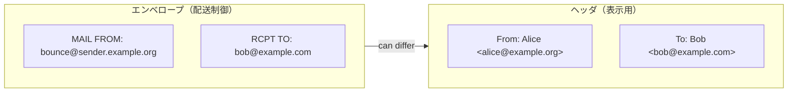

この二重構造は、メーリングリストやバウンス通知など正当な用途がある。たとえばメーリングリストでは、ヘッダの `From:` は元の送信者のまま、エンベロープの `MAIL FROM` はリストのバウンスアドレスに設定される。

しかし、この仕様はなりすましにも悪用できる。エンベロープの `MAIL FROM` を任意のアドレスに設定しても、SMTPプロトコル自体は何のチェックも行わない。これが SPF、DKIM、DMARC が必要とされる根本的な理由である。

### SMTP拡張（ESMTP）

現代のSMTPは、RFC 5321 で定義される拡張SMTP（ESMTP）が標準である。`EHLO` コマンドで接続を開始すると、サーバがサポートする拡張機能の一覧が返される。主要な拡張を以下に示す。

| 拡張 | RFC | 用途 |
|---|---|---|
| STARTTLS | RFC 3207 | 通信のTLS暗号化 |
| AUTH | RFC 4954 | SMTP認証（PLAIN, LOGIN, XOAUTH2等） |
| SIZE | RFC 1870 | メッセージサイズの事前通知 |
| 8BITMIME | RFC 6152 | 8ビット文字の直接転送 |
| PIPELINING | RFC 2920 | コマンドのパイプライン処理 |
| DSN | RFC 3461 | 配送状態通知の要求 |
| CHUNKING | RFC 3030 | 大きなメッセージのチャンク転送 |

### MXレコードによるルーティング

メールのルーティングはDNSの**MXレコード**（Mail Exchange Record）によって制御される。送信側MTAは、宛先ドメインのMXレコードを問い合わせ、最も優先度の高い（preference値が小さい）サーバにメールを配送する。

```
$ dig +short MX example.com
10 mail1.example.com.
20 mail2.example.com.
30 mail3.example.com.
```

この例では、`mail1.example.com` が最優先（preference 10）であり、これが利用不可能な場合に `mail2.example.com`（preference 20）にフォールバックする。MXレコードが存在しない場合、送信側MTAはドメインのAレコードまたはAAAAレコードに直接接続を試みる。

---

## 3. SPF（Sender Policy Framework）

### SPFの目的と仕組み

SPF（Sender Policy Framework）は、RFC 7208 で定義されたメール送信者認証の仕組みである。ドメインの所有者が「このドメインからメールを送信する権限を持つIPアドレスの一覧」をDNSのTXTレコードとして公開し、受信側MTAがそのリストを参照してエンベロープ `MAIL FROM` のドメインとの整合性を検証する。

### SPFの検証フロー

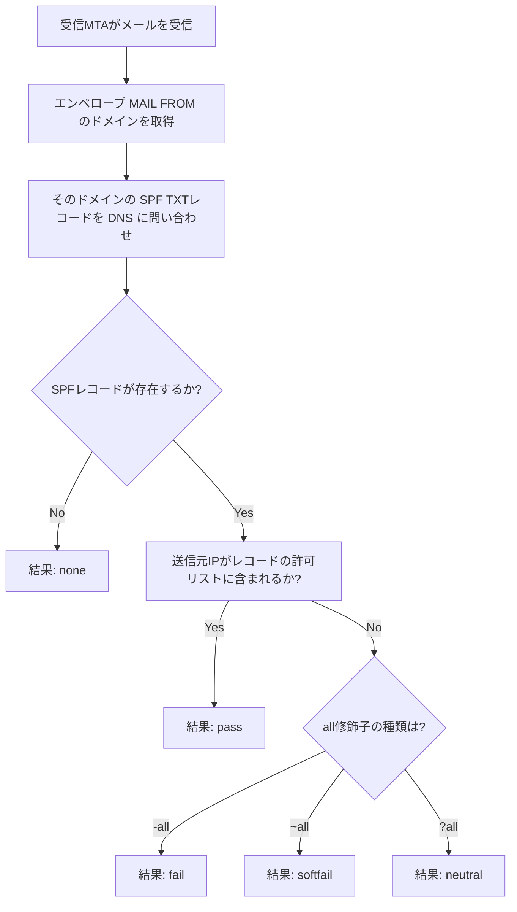

### SPFレコードの構文

SPFレコードはDNSのTXTレコードとして公開される。以下に代表的な構文要素を示す。

```
v=spf1 ip4:203.0.113.0/24 ip6:2001:db8::/32 include:_spf.google.com include:amazonses.com -all
```

| 要素 | 意味 |
|---|---|
| `v=spf1` | SPFバージョン1の宣言（必須） |
| `ip4:203.0.113.0/24` | このIPv4アドレス範囲からの送信を許可 |
| `ip6:2001:db8::/32` | このIPv6アドレス範囲からの送信を許可 |
| `include:_spf.google.com` | 指定ドメインのSPFレコードも参照する |
| `a` | ドメインのAレコードに解決されるIPを許可 |
| `mx` | ドメインのMXレコードに解決されるIPを許可 |
| `-all` | 上記以外のすべてを拒否（fail） |
| `~all` | 上記以外のすべてをソフト拒否（softfail） |

### SPFの限界

SPFには以下の重要な限界がある。

**転送問題**

メールが中間サーバを経由して転送されると、送信元IPアドレスが変わるため、SPF検証が失敗する。たとえば、`alice@company.com` が `bob@university.edu` にメールを送り、Bob がそのメールを `bob@gmail.com` に自動転送している場合、Gmail が受信するメールの送信元IPは大学のサーバであり、`company.com` のSPFレコードには含まれない。

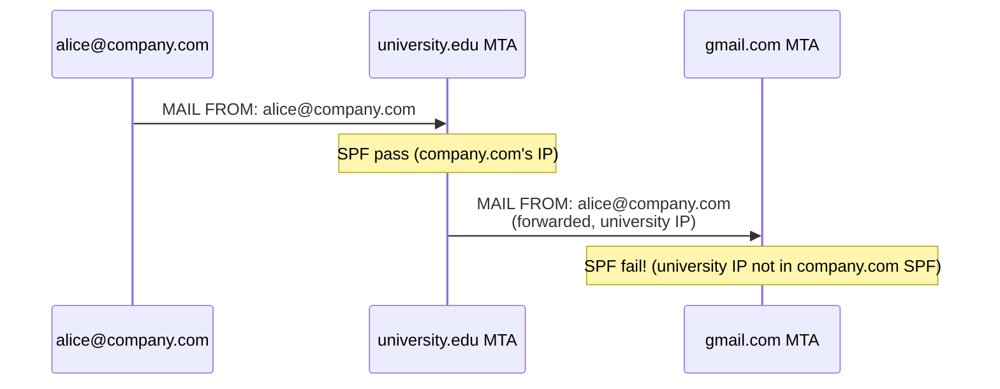

この問題を軽減するために、**SRS（Sender Rewriting Scheme）**が提案されているが、広く普及しているとは言い難い。

**DNSルックアップ制限**

SPFの検証時に許可されるDNSルックアップは最大10回と定められている（RFC 7208 Section 4.6.4）。`include` が連鎖すると、この制限に簡単に到達する。大規模な組織が複数のメール配信サービス（Google Workspace、Amazon SES、SendGrid等）を併用する場合、この制限は深刻な問題になる。

対策として、SPFレコードを**フラット化（flattening）**し、`include` を展開して直接IPアドレスに置き換えるツールが使われることがあるが、参照先のIPアドレスが変更された場合に追従が必要になるという運用上の課題がある。

**ヘッダFromとの不一致**

SPFはエンベロープの `MAIL FROM`（Return-Path）のドメインのみを検証する。ユーザーがメールクライアントで目にするヘッダの `From:` アドレスとは独立しているため、SPFだけではヘッダ `From:` のなりすましを防げない。この問題はDMARCのアライメントチェックによって解決される。

---

## 4. DKIM（DomainKeys Identified Mail）

### DKIMの目的と仕組み

DKIM（DomainKeys Identified Mail）は、RFC 6376 で定義されたメール認証技術である。送信側がメールに電子署名を付与し、受信側がその署名を検証することで、メールが改ざんされていないこと、および署名したドメインが実際にそのメールに関与していることを証明する。

SPFがIPアドレスに基づく認証であるのに対し、DKIMは暗号技術に基づく認証であり、メール転送の影響を受けにくいという大きな利点がある。

### DKIM署名の仕組み

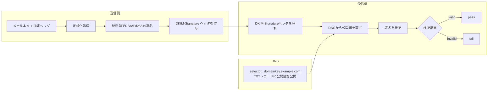

### DKIM-Signatureヘッダの詳細

実際のDKIM-Signatureヘッダの例を示す。

```
DKIM-Signature: v=1; a=rsa-sha256; c=relaxed/relaxed;
    d=example.com; s=selector1;
    h=from:to:subject:date:message-id;
    bh=YjJhNGE4NjVhOWI2YjllZDM4ZGZk...;
    b=dGhpcyBpcyBhIHNpZ25hdHVyZSBl...
```

| タグ | 意味 |
|---|---|
| `v=1` | DKIM バージョン |
| `a=rsa-sha256` | 署名アルゴリズム（RSA-SHA256またはEd25519-SHA256） |
| `c=relaxed/relaxed` | 正規化方式（ヘッダ/ボディ） |
| `d=example.com` | 署名ドメイン |
| `s=selector1` | セレクタ（公開鍵のDNSレコードを特定する名前） |
| `h=from:to:subject:...` | 署名対象のヘッダフィールド一覧 |
| `bh=...` | メール本文のハッシュ値（Base64） |
| `b=...` | 署名値（Base64） |

### 正規化（Canonicalization）

DKIMでは、メールがMTAを経由する際にヘッダやボディが微妙に変更される可能性を考慮し、署名検証前に**正規化**を行う。2つのモードがある。

| モード | ヘッダの処理 | ボディの処理 |
|---|---|---|
| `simple` | ほぼ変更なし（末尾の空行除去のみ） | ほぼ変更なし |
| `relaxed` | ヘッダ名の小文字化、連続空白の単一スペース化、行末空白の除去 | 行末空白の除去、連続空白の単一スペース化、末尾空行の除去 |

実運用では `relaxed/relaxed` が最も一般的である。中間MTAによるヘッダの書き換え（大文字小文字の変更、空白の正規化など）に対して耐性があるためだ。

### セレクタとキーローテーション

DKIM の重要な設計上の特徴として**セレクタ**がある。セレクタにより、同一ドメインで複数の鍵ペアを同時に運用できる。

```
# DNS query for DKIM public key
selector1._domainkey.example.com. IN TXT "v=DKIM1; k=rsa; p=MIGfMA0GCSqG..."
selector2._domainkey.example.com. IN TXT "v=DKIM1; k=rsa; p=MIIBIjANBgkq..."
```

この設計により、以下が可能になる。

- **キーローテーション**: 新しいセレクタで新しい鍵ペアを公開し、古い鍵を段階的に廃止できる。移行期間中、古い署名も引き続き検証可能である
- **サービス分離**: マーケティングメール用（`marketing._domainkey`）とトランザクションメール用（`transactional._domainkey`）で異なる鍵を使い分けられる
- **委任**: 外部のメール配信サービスに専用のセレクタを割り当てられる

### DKIMの限界

DKIMにもいくつかの制限がある。

**署名対象外の改変**

DKIMは署名対象として指定されたヘッダとボディのみを保護する。`h=` タグに含まれていないヘッダは改変されても検知できない。

**メーリングリストの問題**

メーリングリストがサブジェクトにプレフィックス（例: `[ML-Name]`）を付けたり、フッタを追加したりすると、署名対象が変更されるためDKIM検証が失敗する。これに対処するため、多くのメーリングリストソフトウェアは受信したDKIM署名を除去して、リストドメインの鍵で再署名する。

**公開鍵のDNS管理**

DKIM公開鍵はDNS TXTレコードとして管理するため、鍵の更新にDNSの変更が必要となる。DNS変更の反映にはTTLの関係でタイムラグが生じるため、キーローテーションは計画的に行う必要がある。

---

## 5. DMARC（Domain-based Message Authentication, Reporting & Conformance）

### DMARCの目的

DMARC（RFC 7489）は、SPFとDKIMの結果を統合し、ドメイン所有者が認証失敗時のポリシーを宣言するための仕組みである。DMARCが解決する核心的な課題は、**ヘッダ `From:` ドメインのなりすまし防止**である。

SPFはエンベロープ `MAIL FROM` のドメインを検証し、DKIMは `DKIM-Signature` の `d=` ドメインを検証するが、いずれもユーザーが目にするヘッダ `From:` のドメインとの関係を強制しない。DMARCは**アライメント（alignment）**という概念を導入し、これらの認証結果がヘッダ `From:` ドメインと一致することを要求する。

### DMARCの検証フロー

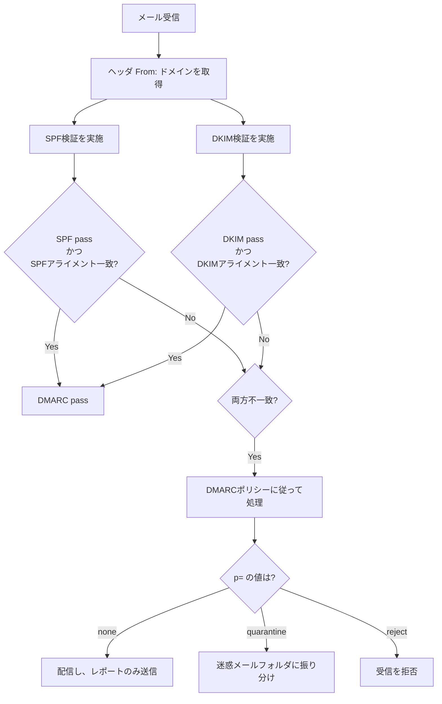

> [!IMPORTANT]
> DMARCは SPF **または** DKIM のどちらか一方がパスし、かつアライメントが一致すればパスする。両方が必要なわけではない。

### アライメント（Alignment）

アライメントには **strict** と **relaxed** の2種類がある。

| 種類 | SPFの場合 | DKIMの場合 |
|---|---|---|
| strict (`aspf=s`, `adkim=s`) | エンベロープ `MAIL FROM` ドメインがヘッダ `From:` ドメインと完全一致 | DKIM `d=` ドメインがヘッダ `From:` ドメインと完全一致 |
| relaxed (`aspf=r`, `adkim=r`) | エンベロープ `MAIL FROM` の組織ドメインがヘッダ `From:` の組織ドメインと一致 | DKIM `d=` の組織ドメインがヘッダ `From:` の組織ドメインと一致 |

「組織ドメイン」とは、Public Suffix List に基づいて決定される登録可能ドメインのことである。たとえば `news.example.com` と `mail.example.com` は同じ組織ドメイン `example.com` に属する。

**relaxed アライメントの具体例:**

```
Header From: news@marketing.example.com
DKIM d=example.com
→ 組織ドメインが一致（example.com）→ アライメント成功
```

### DMARCレコードの構文

DMARCレコードは `_dmarc.example.com` のTXTレコードとして公開する。

```
_dmarc.example.com. IN TXT "v=DMARC1; p=reject; sp=quarantine; adkim=r; aspf=r; rua=mailto:dmarc-reports@example.com; ruf=mailto:dmarc-forensic@example.com; pct=100; fo=1"
```

| タグ | 意味 | 値の例 |
|---|---|---|
| `v` | バージョン（必須） | `DMARC1` |
| `p` | ポリシー（必須） | `none`, `quarantine`, `reject` |
| `sp` | サブドメインポリシー | `none`, `quarantine`, `reject` |
| `adkim` | DKIMアライメントモード | `r` (relaxed), `s` (strict) |
| `aspf` | SPFアライメントモード | `r` (relaxed), `s` (strict) |
| `rua` | 集約レポート送信先 | `mailto:dmarc@example.com` |
| `ruf` | フォレンジックレポート送信先 | `mailto:forensic@example.com` |
| `pct` | ポリシー適用率（%） | `100` |
| `fo` | フォレンジックレポート生成条件 | `0`, `1`, `d`, `s` |

### DMARC導入の段階的アプローチ

DMARCの導入は段階的に行うことが推奨される。いきなり `p=reject` を設定すると、正当なメールが拒否されるリスクがある。

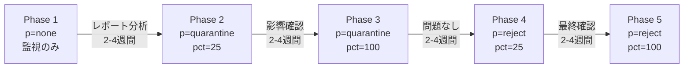

**Phase 1: 監視フェーズ（p=none）**

まず `p=none` で開始し、`rua` で集約レポートを受信する。この段階ではメールの配送に一切影響を与えず、どのIPアドレスから自ドメインのメールが送信されているかを把握する。

**Phase 2-3: 隔離フェーズ（p=quarantine）**

レポート分析で正当な送信元がすべてSPF/DKIMに対応していることを確認したら、`p=quarantine` に移行する。`pct=25` から開始し、段階的に100%まで引き上げる。

**Phase 4-5: 拒否フェーズ（p=reject）**

最終的に `p=reject` に移行することで、なりすましメールを完全にブロックする。

### DMARCレポート

DMARCの重要な機能の一つがレポーティングである。

**集約レポート（Aggregate Report, rua）**

XMLフォーマットで配信され、以下の情報を含む。

- レポート期間
- 送信元IPアドレスごとの通数
- SPF/DKIM/DMARCの認証結果
- 適用されたポリシー

```xml
<?xml version="1.0" encoding="UTF-8"?>
<feedback>
  <report_metadata>
    <org_name>google.com</org_name>
    <date_range>
      <begin>1709251200</begin>
      <end>1709337600</end>
    </date_range>
  </report_metadata>
  <record>
    <row>
      <source_ip>203.0.113.10</source_ip>
      <count>1500</count>
      <policy_evaluated>
        <disposition>none</disposition>
        <dkim>pass</dkim>
        <spf>pass</spf>
      </policy_evaluated>
    </row>
    <row>
      <source_ip>198.51.100.50</source_ip>
      <count>3</count>
      <policy_evaluated>
        <disposition>reject</disposition>
        <dkim>fail</dkim>
        <spf>fail</spf>
      </policy_evaluated>
    </row>
  </record>
</feedback>
```

大量のDMARCレポートを手動で分析するのは現実的ではないため、DMARC Analyzer、Postmark、Valimail などの専用ツールやサービスを利用するのが一般的である。

---

## 6. バウンス処理（ハードバウンス、ソフトバウンス）

### バウンスとは

バウンス（bounce）とは、メールが宛先に配送できなかった場合に、送信側に返される不達通知（Non-Delivery Report / Delivery Status Notification）のことである。バウンスの適切な処理は、メール配信のレピュテーション維持において極めて重要である。

### バウンスの種類

バウンスは大きく**ハードバウンス**と**ソフトバウンス**に分類される。

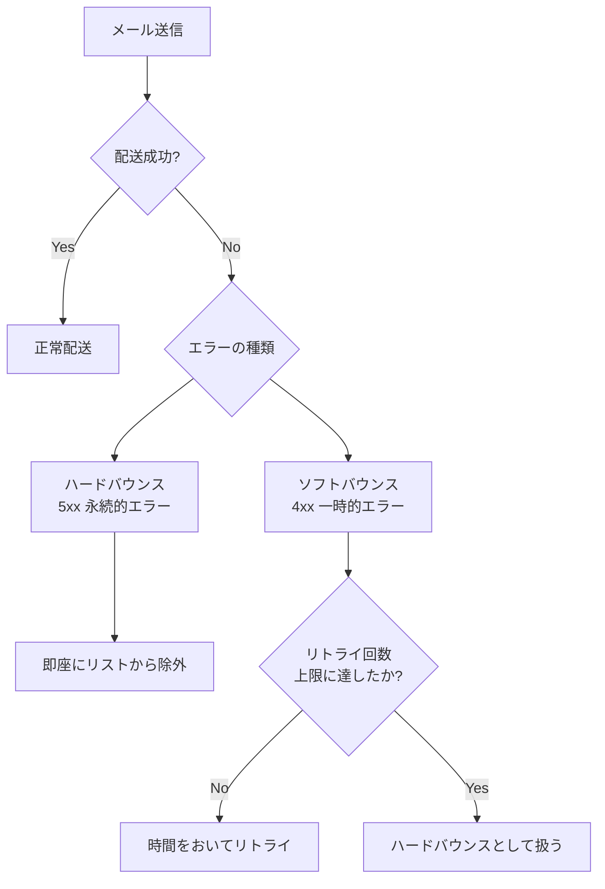

#### ハードバウンス（Hard Bounce）

ハードバウンスは**永続的な配送失敗**を示す。SMTPの5xxステータスコードで返される。

| SMTPコード | 拡張コード | 意味 |
|---|---|---|
| 550 | 5.1.1 | 受信者アドレスが存在しない |
| 550 | 5.1.2 | ドメインが存在しない |
| 551 | 5.1.6 | 受信者アドレスが移動した |
| 553 | 5.1.3 | アドレスの構文が不正 |
| 550 | 5.7.1 | ポリシーにより拒否（ブラックリスト等） |

ハードバウンスが発生したアドレスには、**再送を試みてはならない**。存在しないアドレスへの繰り返し送信は、スパム行為とみなされ、送信ドメインのレピュテーションを著しく損なう。

#### ソフトバウンス（Soft Bounce）

ソフトバウンスは**一時的な配送失敗**を示す。SMTPの4xxステータスコードで返される。

| SMTPコード | 拡張コード | 意味 |
|---|---|---|
| 421 | 4.7.0 | サーバが一時的に利用不可 |
| 450 | 4.2.1 | メールボックスが一時的に利用不可 |
| 451 | 4.3.0 | メールシステムが一時的にフル |
| 452 | 4.3.1 | ディスク容量不足 |
| 421 | 4.7.1 | レート制限に到達 |

ソフトバウンスに対しては、**指数バックオフ（exponential backoff）**によるリトライが適切である。

### バウンス処理の実装

大規模なメール配信システムでは、バウンス処理を自動化する仕組みが不可欠である。

#### VERP（Variable Envelope Return Path）

バウンスメールを送信先アドレスと正確に対応付けるために、**VERP（Variable Envelope Return Path）**が広く使われている。

```
# Standard Return-Path
MAIL FROM:<bounce@example.com>

# VERP Return-Path (encodes recipient address)
MAIL FROM:<bounce+bob=recipient.com@example.com>
```

VERPでは、エンベロープの `MAIL FROM` に受信者アドレスをエンコードして埋め込む。バウンスが返ってきた際に、`MAIL FROM` のアドレスをデコードすることで、どの受信者への配送が失敗したのかを正確に特定できる。

#### リトライ戦略

ソフトバウンスに対するリトライは、以下のような指数バックオフ戦略で実装するのが一般的である。

```python
import time
import random

def retry_with_backoff(send_fn, recipient, max_retries=5):
    """
    Retry sending email with exponential backoff.
    """
    for attempt in range(max_retries):
        try:
            send_fn(recipient)
            return True  # success
        except SoftBounceError:
            if attempt == max_retries - 1:
                # Treat as hard bounce after max retries
                mark_as_hard_bounce(recipient)
                return False

            # Exponential backoff with jitter
            base_delay = min(300, 15 * (2 ** attempt))  # cap at 5 minutes
            jitter = random.uniform(0, base_delay * 0.1)
            delay = base_delay + jitter
            time.sleep(delay)

    return False
```

#### サプレッションリスト

ハードバウンスが発生したアドレスは**サプレッションリスト（suppression list）**に登録し、以降の配信対象から除外する。

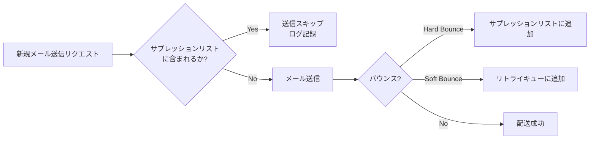

サプレッションリストは、同一アドレスへの無駄な送信を防ぎ、送信ドメインのレピュテーションを保護する重要な仕組みである。Amazon SES、SendGrid、Mailgun などの主要なメール配信サービスは、すべてサプレッションリスト機能を提供している。

### Feedback Loop（FBL）

大手ISP（Gmail, Yahoo, Outlook等）は**Feedback Loop**プログラムを提供している。これは受信者がメールを「スパム」として報告した場合、その情報を送信者に通知する仕組みである。ARF（Abuse Reporting Format, RFC 5965）形式で通知が送られる。

FBLの通知を受け取ったら、そのアドレスをサプレッションリストに追加し、以降のメール送信を停止すべきである。スパム報告を無視して送信を続けると、レピュテーションが急速に悪化する。

---

## 7. レピュテーション管理とIPウォームアップ

### 送信レピュテーションとは

メールの配信率（inbox placement rate）を左右する最大の要因は、送信者の**レピュテーション（評判）**である。レピュテーションは主に2つの軸で評価される。

| レピュテーションの種類 | 評価対象 | 概要 |
|---|---|---|
| IPレピュテーション | 送信元IPアドレス | そのIPアドレスからの過去の送信実績 |
| ドメインレピュテーション | 送信元ドメイン | そのドメインからの過去の送信実績 |

近年では、IPアドレスよりもドメインレピュテーションの比重が増している。共有IP環境の普及や、クラウドメール配信サービスの利用拡大により、IPアドレスだけでは送信者を識別できないためである。

### レピュテーションに影響する要因

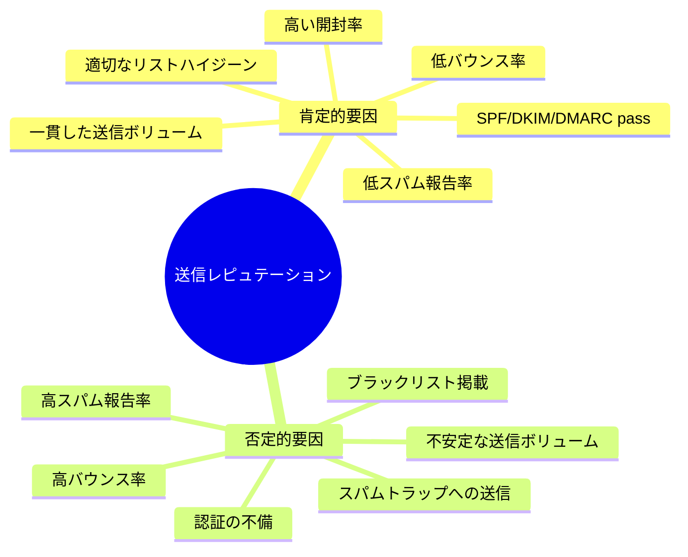

特に注意すべき指標の目安を以下に示す。

| 指標 | 健全な範囲 | 危険な閾値 |
|---|---|---|
| バウンス率 | < 2% | > 5% |
| スパム報告率 | < 0.1% | > 0.3% |
| スパムトラップヒット | 0 | 1以上 |

### スパムトラップ（Spam Trap）

スパムトラップは、ISPやブラックリスト運営組織が設置する**おとりメールアドレス**であり、メール配信者のリスト管理品質を測るために使われる。

| 種類 | 説明 | リスク |
|---|---|---|
| Pristine Trap | 一度も正規利用されたことがないアドレス。Webサイトをクロールして収集したリストに含まれる | 即座にブラックリスト化 |
| Recycled Trap | かつて有効だったが長期間放棄されたアドレスをISPがトラップに転用 | レピュテーション低下 |
| Typo Trap | よくあるタイポ（例: `gmial.com`）のドメインに設置 | レピュテーション低下 |

スパムトラップに送信してしまう主な原因は、**メールアドレスの購入リストの使用**や**長期間の未送信リストの再利用**である。これを防ぐためには、ダブルオプトイン（メールアドレス登録後に確認メールを送信し、リンクのクリックで登録を完了する）の採用が最も効果的である。

### IPウォームアップ

新しいIPアドレスからメールを送信する場合、そのIPにはレピュテーション履歴がないため、ISPは慎重に扱う。大量のメールをいきなり新しいIPから送信すると、スパムと判定されるリスクが高い。

**IPウォームアップ**とは、新しいIPアドレスから段階的にメール送信量を増やしていき、ISPの信頼を獲得するプロセスである。

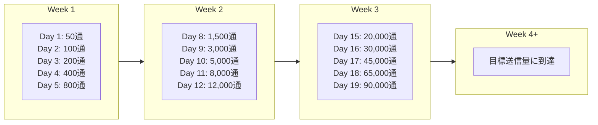

ウォームアップ期間中のベストプラクティスは以下の通りである。

1. **最もエンゲージメントの高い受信者から始める**: 過去に開封やクリックの実績がある受信者を優先する
2. **送信量を1日あたり最大2倍のペースで増加させる**: 急激な増加は避ける
3. **バウンス率とスパム報告率を毎日監視する**: 異常値が出たら送信量の増加を一時停止する
4. **ウォームアップ期間は最低2-4週間確保する**: 送信量によってはさらに長期間が必要

### 専用IPと共有IP

メール配信において、IPアドレスの運用には2つの選択肢がある。

| 項目 | 専用IP | 共有IP |
|---|---|---|
| レピュテーション管理 | 自社の送信実績のみに依存 | 同じIPを使う他の送信者の影響を受ける |
| ウォームアップ | 必要 | 不要（既に確立されている） |
| 適合する送信量 | 月10万通以上 | 月10万通未満 |
| コスト | 高い | 低い |
| 制御性 | 高い | 低い |

月間送信量が少ない場合、専用IPではウォームアップの維持が難しい。一貫した送信ボリュームがなければ、IPレピュテーションが「冷える」ためである。そのような場合は、メール配信サービスの共有IPプールを利用するほうが合理的である。

---

## 8. テンプレートエンジンとパーソナライゼーション

### メールテンプレートの必要性

大規模なメール配信では、受信者ごとに内容をカスタマイズする必要がある。ユーザー名、注文情報、推薦コンテンツなどを動的に埋め込むために、テンプレートエンジンが使われる。

### テンプレートの構造

メールテンプレートは、HTMLメールとテキストメールの両方を用意する**マルチパート構成**が推奨される。

```
Content-Type: multipart/alternative; boundary="boundary123"

--boundary123
Content-Type: text/plain; charset=UTF-8

Hello {{user.name}},

Your order #{{order.id}} has been shipped.

--boundary123
Content-Type: text/html; charset=UTF-8

<html>
<body>
  <h1>Hello {{user.name}},</h1>
  <p>Your order #<strong>{{order.id}}</strong> has been shipped.</p>
</body>
</html>
--boundary123--
```

::: tip マルチパートの重要性
HTMLのみのメールは、テキスト版がないことでスパムスコアが上昇する場合がある。また、テキストメールクライアントのユーザーや、プライバシーを重視してHTML表示を無効にしているユーザーへの配慮としても、テキスト版の提供は重要である。
:::

### テンプレートエンジンの選択

メール配信システムで使われる代表的なテンプレートエンジンを比較する。

| エンジン | 言語 | 特徴 |
|---|---|---|
| Handlebars | JavaScript/汎用 | ロジックレスに近い、安全なテンプレート |
| Jinja2 | Python | 強力なフィルタ・マクロ機能 |
| Liquid | Ruby/汎用 | Shopifyが開発、安全な実行環境 |
| MJML | JavaScript | メール専用のマークアップ言語、レスポンシブ対応 |

### HTMLメールの課題

HTMLメールのレンダリングは、Webブラウザとは大きく異なる制約がある。メールクライアントごとにCSSサポートが大幅に異なるため、以下の点に注意が必要である。

| 制約 | 詳細 |
|---|---|
| テーブルレイアウト | Outlook（Word レンダリングエンジン使用）ではFlexboxやGridが使えないため、テーブルレイアウトが必須 |
| インラインCSS | `<style>` タグをサポートしないクライアントがあるため、CSSのインライン化が推奨 |
| 画像のブロック | 多くのクライアントがデフォルトで外部画像をブロック |
| JavaScriptの不可 | セキュリティ上、JavaScriptは一切実行されない |
| フォームの不可 | `<form>` 要素はサポートされない |

このような制約を吸収するために、**MJML**（Mailjet Markup Language）や **Foundation for Emails** などのメール専用フレームワークが利用される。

```html
<!-- MJML example -->
<mjml>
  <mj-body>
    <mj-section>
      <mj-column>
        <mj-text font-size="20px">
          Hello {{user.name}}!
        </mj-text>
        <mj-button href="https://example.com/orders/{{order.id}}">
          View Your Order
        </mj-button>
      </mj-column>
    </mj-section>
  </mj-body>
</mjml>
```

MJMLはビルド時にメールクライアント互換のHTMLに変換される。レスポンシブデザインも自動的に処理されるため、開発効率が大幅に向上する。

### パーソナライゼーションの階層

パーソナライゼーションには、単純な変数置換から高度なコンテンツ最適化まで、複数の階層がある。

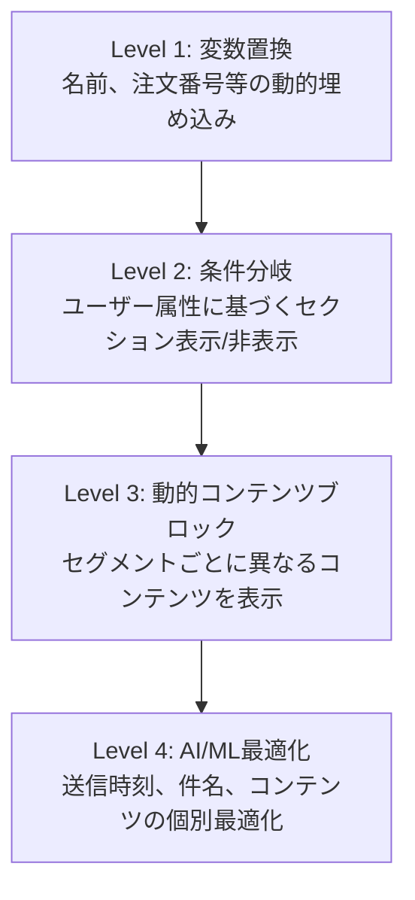

**Level 1: 変数置換**

最も基本的なパーソナライゼーション。受信者の名前や注文番号を埋め込む。

```
Hello {{user.first_name}},
Your subscription expires on {{subscription.expires_at | date: "%Y/%m/%d"}}.
```

**Level 2: 条件分岐**

受信者の属性やステータスに基づいて、表示するコンテンツを切り替える。

```
{{#if user.is_premium}}
  Thank you for being a Premium member!
{{else}}
  Upgrade to Premium for exclusive benefits.
{{/if}}
```

**Level 3: 動的コンテンツブロック**

セグメント（地域、購買履歴、行動データ等）に基づいて、メールの一部分を完全に差し替える。同一キャンペーンでありながら、受信者ごとに異なるコンテンツを配信する。

**Level 4: AI/ML最適化**

機械学習モデルを使い、件名のA/Bテスト自動化、最適送信時刻の予測、コンテンツレコメンデーションなどを行う。

---

## 9. 配信率の監視と改善

### 主要なメトリクス

メール配信の健全性を評価するために、以下のメトリクスを継続的に監視する必要がある。

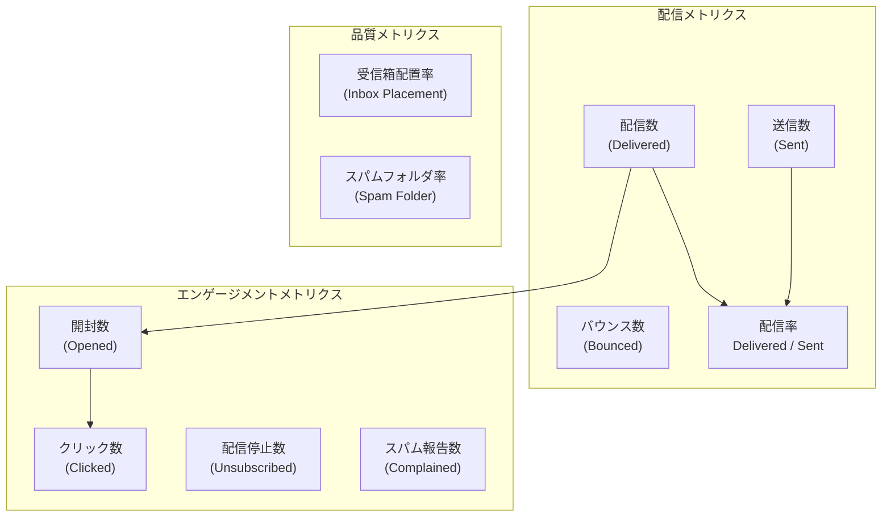

| メトリクス | 計算方法 | 健全な目安 |
|---|---|---|
| 配信率 | 配信数 / 送信数 | > 95% |
| 開封率 | 開封数 / 配信数 | 15-25%（業界平均） |
| クリック率 | クリック数 / 配信数 | 2-5%（業界平均） |
| バウンス率 | バウンス数 / 送信数 | < 2% |
| スパム報告率 | 報告数 / 配信数 | < 0.1% |
| 配信停止率 | 配信停止数 / 配信数 | < 0.5% |

::: warning 開封率の計測限界
開封率は、HTMLメール内に埋め込まれた1px透明画像（トラッキングピクセル）のリクエストで計測される。しかし、Apple Mail Privacy Protection（iOS 15以降）やメールプロキシの普及により、開封率の正確性は年々低下している。Appleのメールプライバシー保護機能は、メールクライアントの読み込み時にトラッキングピクセルを自動的にプリフェッチするため、実際に開封されていなくても「開封」として計測される。今後はクリック率やコンバージョン率など、より確実なエンゲージメント指標への移行が求められている。
:::

### Google Postmaster Tools

Gmailは世界最大のメールプロバイダであり、Gmail宛ての配信品質は特に重要である。**Google Postmaster Tools** は、Gmail宛てのメールに関する以下の情報を提供する。

- ドメインレピュテーション（High / Medium / Low / Bad）
- IPレピュテーション
- SPF/DKIM/DMARC認証率
- 暗号化率（TLS使用率）
- 配信エラー

### ブラックリストの監視

送信IPアドレスやドメインが**ブラックリスト（DNSBL: DNS-based Blackhole List）**に掲載されると、配信率が壊滅的に低下する。主要なブラックリストと対処法を以下に示す。

| ブラックリスト | 運営 | 影響範囲 |
|---|---|---|
| Spamhaus SBL/XBL | Spamhaus Project | 非常に大きい（多くのISPが参照） |
| Barracuda BRBL | Barracuda Networks | 大きい |
| SORBS | Proofpoint | 中程度 |
| SpamCop | Cisco | 中程度 |

ブラックリスト掲載の確認は、MXToolbox などのオンラインツールや、以下のようなDNSクエリで行える。

```bash
# Check if IP 203.0.113.10 is on Spamhaus SBL
# Reverse IP octets and query the DNSBL zone
dig +short 10.113.0.203.zen.spamhaus.org
```

応答が返ってきた場合（例: `127.0.0.2`）、そのIPアドレスはブラックリストに掲載されている。応答がない（`NXDOMAIN`）場合は掲載されていない。

### 配信率改善のチェックリスト

配信率を継続的に改善するためのアプローチを体系的に整理する。

**認証設定**

- [ ] SPFレコードが正しく設定され、すべての正当な送信元IPを包含している
- [ ] DKIMが有効で、2048ビット以上のRSA鍵またはEd25519鍵を使用している
- [ ] DMARCが `p=reject` まで段階的に移行済みである
- [ ] MTA-STS（RFC 8461）による SMTP TLS の強制を設定している
- [ ] BIMI（Brand Indicators for Message Identification）でブランドロゴを表示している

**リスト管理**

- [ ] ダブルオプトインを採用している
- [ ] ハードバウンスアドレスを即座にサプレッションリストに追加している
- [ ] 長期間（6ヶ月以上）エンゲージメントのないアドレスを定期的にクリーニングしている
- [ ] FBL（Feedback Loop）の通知に基づいてスパム報告者を除外している
- [ ] メールアドレスの購入リストを使用していない

**コンテンツ**

- [ ] テキスト版とHTML版の両方を提供している
- [ ] 件名にスパムフィルタに引っかかりやすい語句（「無料」「今すぐ」「緊急」など）を多用していない
- [ ] 配信停止リンク（List-Unsubscribe ヘッダおよび本文内リンク）を含めている
- [ ] 画像とテキストのバランスが適切である（画像のみのメールは避ける）

### ARC（Authenticated Received Chain）

メール転送時のSPF/DKIM認証失敗に対処するために、**ARC（RFC 8617）**が策定された。ARCは、メールが中間サーバを通過する際に、各サーバが認証結果を署名付きで記録する仕組みである。

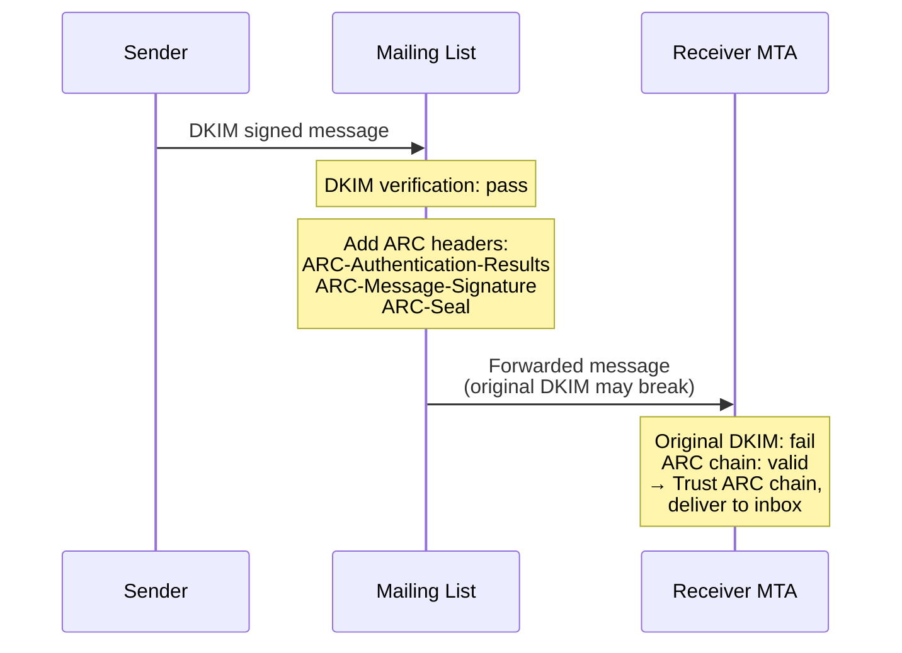

ARCヘッダは3つのコンポーネントで構成される。

| ヘッダ | 役割 |
|---|---|
| `ARC-Authentication-Results` | そのホップ時点での認証結果（SPF, DKIM, DMARC） |
| `ARC-Message-Signature` | DKIMに似た形式でメッセージに署名 |
| `ARC-Seal` | ARCヘッダチェーン全体の改ざん防止署名 |

ARCは、Gmail、Microsoft 365 などの主要なメールプロバイダで既にサポートされている。

### MTA-STS と TLS-RPT

**MTA-STS（SMTP MTA Strict Transport Security, RFC 8461）**は、メールの転送経路におけるTLS暗号化を強制する仕組みである。DNSのTXTレコードとHTTPS上のポリシーファイルの2つで構成される。

```
# DNS TXT record
_mta-sts.example.com. IN TXT "v=STSv1; id=20260302"

# Policy file at https://mta-sts.example.com/.well-known/mta-sts.txt
version: STSv1
mode: enforce
mx: mail.example.com
mx: mail2.example.com
max_age: 86400
```

**TLS-RPT（SMTP TLS Reporting, RFC 8460）**は、MTA-STSのポリシー適用結果をレポートとして送信する仕組みである。

```
_smtp._tls.example.com. IN TXT "v=TLSRPTv1; rua=mailto:tls-reports@example.com"
```

これらにより、「日和見的TLS（opportunistic TLS）」から「強制的TLS」への移行が可能となる。日和見的TLSでは、STARTTLS がサポートされていない場合に平文にフォールバックする可能性があるが、MTA-STSはこれを禁止する。

---

## まとめ

メール配信は、半世紀前に設計されたプロトコルの上に、認証・セキュリティ・レピュテーション管理の仕組みを積み重ねた複合的なインフラである。本記事で取り上げた技術要素の関係を最後に整理する。

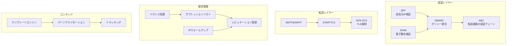

**信頼できるメール配信を実現するために最低限必要な設定は以下である。**

1. SPF、DKIM、DMARCの3つの認証をすべて設定する
2. DMARCを段階的に `p=reject` まで引き上げる
3. バウンスを適切に処理し、サプレッションリストを運用する
4. 送信リストの品質を維持する（ダブルオプトイン、定期クリーニング）
5. 配信メトリクスを継続的に監視する

メールは「送れば届く」ものではない。送信者の正当性を証明し、受信側の信頼を獲得し続ける継続的な運用こそが、高い配信率を維持する鍵である。
