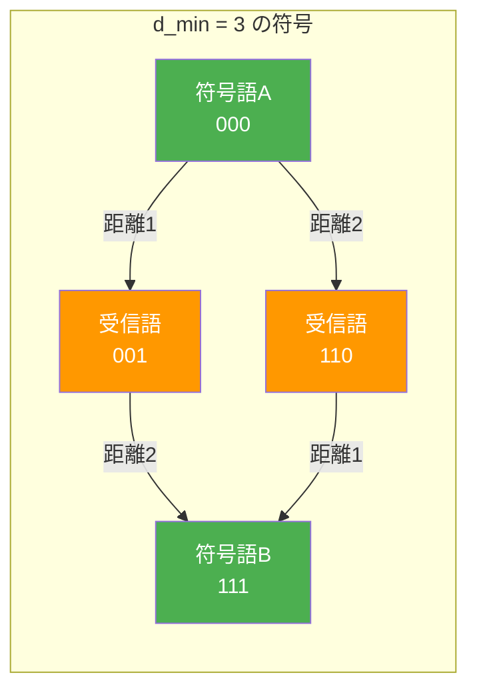
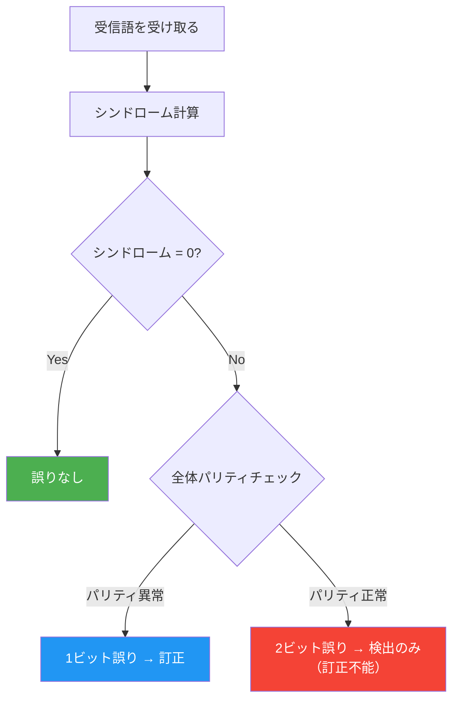
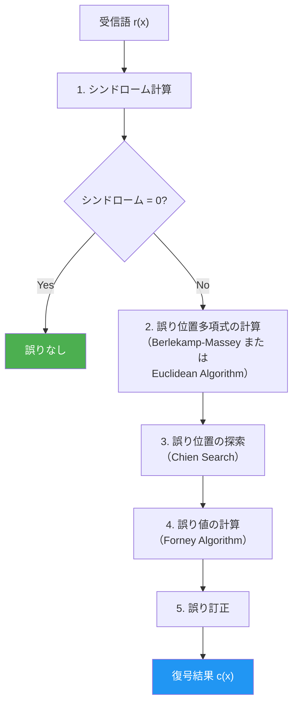
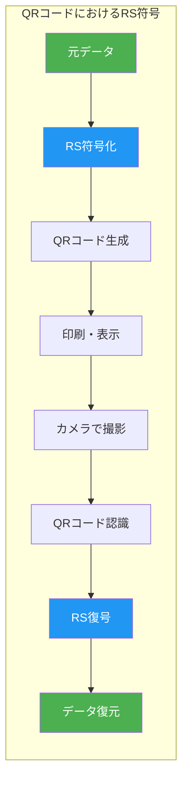
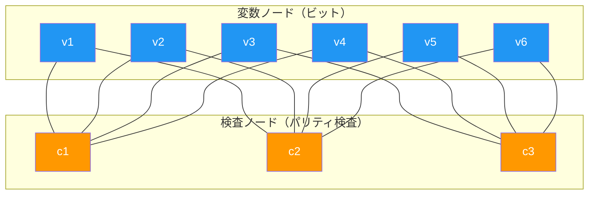
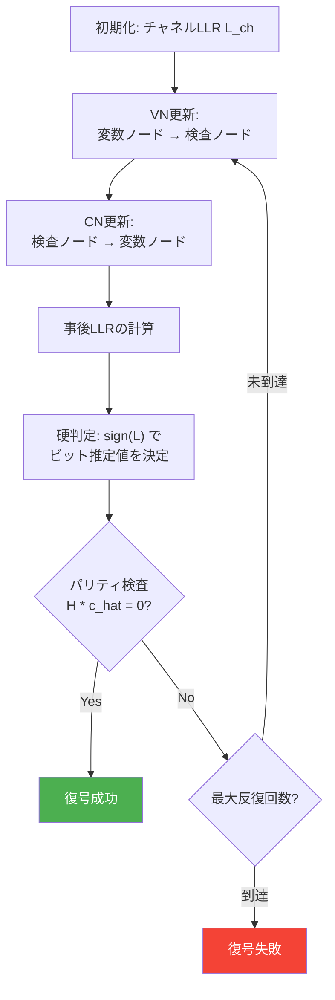
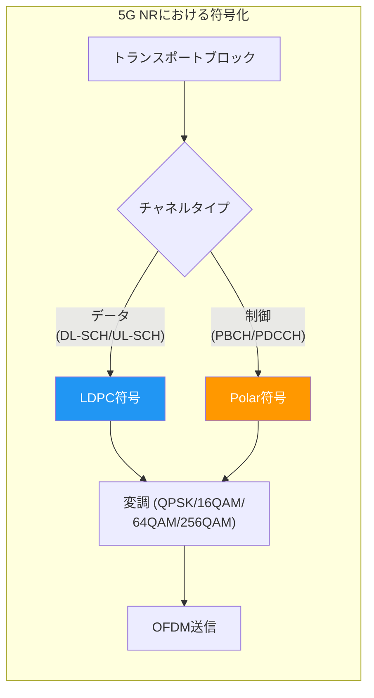
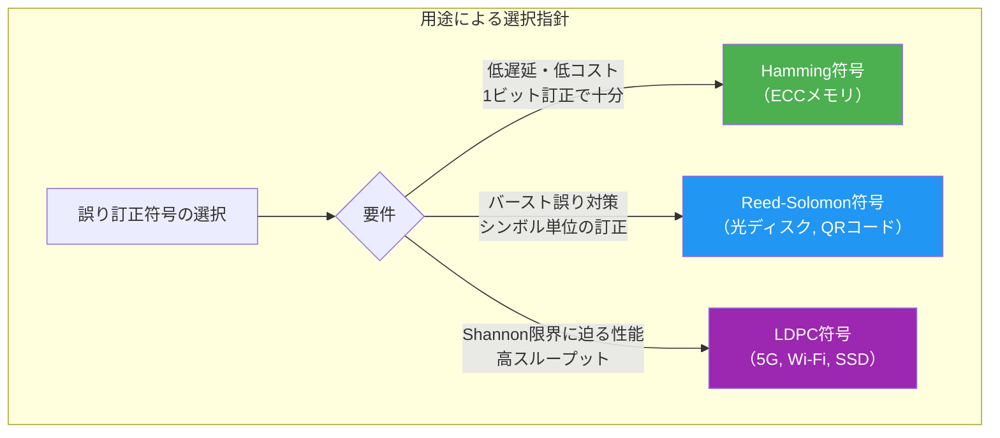

# 誤り訂正符号（Hamming, Reed-Solomon, LDPC）

## はじめに — なぜ誤り訂正符号が必要か

デジタルデータの伝送や保存において、ビット誤りは避けられない現実である。電磁ノイズ、宇宙線、ディスクの劣化、光ファイバーの減衰など、あらゆる物理チャネルには雑音が存在する。通信路の信頼性をハードウェアだけで保証しようとすると、コストが指数関数的に増大する。そこで、数学的な手法によって誤りを**検出**し、さらには**訂正**するのが**誤り訂正符号**（Error-Correcting Code, ECC）である。

1948年にClaude Shannonが発表した「通信の数学的理論」は、雑音のある通信路であっても、適切な符号化を行えば任意に低い誤り率で情報を伝達できることを証明した。これが**チャネル符号化定理**（Shannon's Channel Coding Theorem）であり、誤り訂正符号の理論的基盤となっている。

本記事では、誤り訂正符号の基本概念から出発し、代表的な3つの符号方式 — **Hamming符号**、**Reed-Solomon符号**、**LDPC符号** — を詳しく解説する。それぞれの数学的原理、符号化・復号の仕組み、そして実世界での採用事例を掘り下げる。

## 基本概念

### 符号理論の基礎用語

誤り訂正符号を理解するために、まず基本的な用語を整理する。

| 用語 | 定義 |
|---|---|
| **符号語**（Codeword） | 符号化によって生成される、冗長ビットを含むビット列 |
| **情報ビット** | 送信したい元のデータビット |
| **冗長ビット**（Parity bits） | 誤り検出・訂正のために追加されるビット |
| **符号率**（Code rate） $R = k/n$ | 情報ビット数 $k$ と符号語長 $n$ の比 |
| **Hamming距離** | 2つの符号語間で異なるビット数 |
| **最小距離** $d_{\min}$ | 符号の全符号語間の最小Hamming距離 |

### Hamming距離と誤り訂正能力

誤り訂正符号の能力は、**最小Hamming距離** $d_{\min}$ によって決まる。

::: tip Hamming距離の定義
2つのビット列 $\mathbf{x}$ と $\mathbf{y}$ のHamming距離は、対応するビットが異なる位置の数である：

$$d_H(\mathbf{x}, \mathbf{y}) = |\{i : x_i \neq y_i\}|$$
:::

最小距離 $d_{\min}$ を持つ符号は、以下の能力を有する：

- **検出可能な誤り数**: $d_{\min} - 1$ ビットまでの誤りを検出
- **訂正可能な誤り数**: $\lfloor (d_{\min} - 1) / 2 \rfloor$ ビットまでの誤りを訂正

この関係は直観的に理解できる。符号語を $n$ 次元空間上の点と考えると、最小距離 $d_{\min}$ は最も近い2つの符号語間の距離である。受信語が正しい符号語から $t$ ビット以内にあれば、$t \leq \lfloor (d_{\min} - 1) / 2 \rfloor$ のとき、最も近い符号語に一意に復号できる。



### 線形符号

多くの実用的な誤り訂正符号は**線形符号**である。線形符号は以下の特徴を持つ。

**$(n, k)$ 線形符号**は、$k$ ビットの情報を $n$ ビットの符号語に変換する。符号化は **生成行列** $G$（$k \times n$）を使った行列演算で表現できる：

$$\mathbf{c} = \mathbf{m} \cdot G$$

ここで $\mathbf{m}$ は $k$ ビットの情報ベクトル、$\mathbf{c}$ は $n$ ビットの符号語であり、演算はすべて $\text{GF}(2)$（2元体）上で行われる。

復号のためには**パリティ検査行列** $H$（$(n-k) \times n$）が用いられる。正しい符号語 $\mathbf{c}$ に対して：

$$H \cdot \mathbf{c}^T = \mathbf{0}$$

が成り立つ。受信語 $\mathbf{r} = \mathbf{c} + \mathbf{e}$（$\mathbf{e}$ は誤りパターン）の**シンドローム**は：

$$\mathbf{s} = H \cdot \mathbf{r}^T = H \cdot \mathbf{e}^T$$

このシンドロームから誤りパターン $\mathbf{e}$ を推定するのが復号処理の本質である。

### Shannon限界と符号の性能

Shannon のチャネル符号化定理は、二元対称通信路（BSC）のチャネル容量を次のように定める：

$$C = 1 - H_2(p)$$

ここで $p$ はビット誤り率、$H_2(p) = -p\log_2 p - (1-p)\log_2(1-p)$ は二元エントロピー関数である。

符号率 $R < C$ であれば、符号語長 $n \to \infty$ のとき復号誤り率を任意に小さくできる。この理論限界にどれだけ近づけるかが、誤り訂正符号の性能評価の基準となる。

## Hamming符号

### 歴史と動機

1950年、Bell研究所のRichard Hammingは、パンチカードリーダーの誤りに悩まされた経験から、体系的に1ビット誤りを訂正できる符号を考案した。これが**Hamming符号**であり、誤り訂正符号の歴史における最初の実用的な成果である。

Hammingの着想は単純かつ優美であった。パリティビットを巧みに配置することで、シンドロームが直接的に誤りの位置を二進数で指し示すよう設計したのである。

### 数学的構造

$(7, 4)$ Hamming符号を例にとる。これは4ビットの情報を7ビットの符号語に変換する符号で、最小距離 $d_{\min} = 3$ を持ち、1ビットの誤りを訂正できる。

パリティ検査行列 $H$ は以下のように構成される：

$$
H = \begin{pmatrix}
1 & 0 & 1 & 0 & 1 & 0 & 1 \\
0 & 1 & 1 & 0 & 0 & 1 & 1 \\
0 & 0 & 0 & 1 & 1 & 1 & 1
\end{pmatrix}
$$

$H$ の列ベクトルは $1$ から $7$ までの整数の二進表現に対応している。これが Hamming 符号の本質的な設計原理である。

生成行列は組織的な形式では以下のようになる：

$$
G = \begin{pmatrix}
1 & 1 & 0 & 1 & 0 & 0 & 0 \\
0 & 1 & 1 & 0 & 1 & 0 & 0 \\
1 & 1 & 1 & 0 & 0 & 1 & 0 \\
1 & 0 & 1 & 0 & 0 & 0 & 1
\end{pmatrix}
$$

### 符号化の手順

$(7, 4)$ Hamming符号の符号化を具体的に見てみよう。符号語のビット位置を $c_1, c_2, \ldots, c_7$ とする。位置1, 2, 4はパリティビット、位置3, 5, 6, 7は情報ビットである。

```
ビット位置:  1   2   3   4   5   6   7
役割:       p1  p2  d1  p3  d2  d3  d4
```

パリティビットの計算規則は以下の通りである（$\oplus$ はXOR演算）：

$$
\begin{aligned}
p_1 &= d_1 \oplus d_2 \oplus d_4 \quad &\text{(位置 1, 3, 5, 7 をカバー)} \\
p_2 &= d_1 \oplus d_3 \oplus d_4 \quad &\text{(位置 2, 3, 6, 7 をカバー)} \\
p_3 &= d_2 \oplus d_3 \oplus d_4 \quad &\text{(位置 4, 5, 6, 7 をカバー)}
\end{aligned}
$$

::: details 具体例：データ 1011 の符号化

情報ビット: $d_1 = 1, d_2 = 0, d_3 = 1, d_4 = 1$

パリティビットの計算：

$$
\begin{aligned}
p_1 &= 1 \oplus 0 \oplus 1 = 0 \\
p_2 &= 1 \oplus 1 \oplus 1 = 1 \\
p_3 &= 0 \oplus 1 \oplus 1 = 0
\end{aligned}
$$

符号語: $\mathbf{c} = (0, 1, 1, 0, 0, 1, 1)$
:::

### 復号とシンドローム

受信語 $\mathbf{r}$ のシンドロームを計算する：

$$\mathbf{s} = H \cdot \mathbf{r}^T = (s_1, s_2, s_3)^T$$

シンドロームが $\mathbf{0}$ であれば誤りなし（または検出不能な誤り）。シンドロームが非零であれば、$\mathbf{s}$ を二進数として解釈した値が誤りビットの位置を示す。

::: details 具体例：1ビット誤りの訂正

送信: $\mathbf{c} = (0, 1, 1, 0, 0, 1, 1)$

位置5にビット誤りが発生: $\mathbf{r} = (0, 1, 1, 0, \mathbf{1}, 1, 1)$

シンドローム計算：

$$
\mathbf{s} = H \cdot \mathbf{r}^T = \begin{pmatrix}
0 \oplus 0 \oplus 1 \oplus 0 \oplus 1 \oplus 0 \oplus 1 \\
0 \oplus 1 \oplus 1 \oplus 0 \oplus 0 \oplus 1 \oplus 1 \\
0 \oplus 0 \oplus 0 \oplus 0 \oplus 1 \oplus 1 \oplus 1
\end{pmatrix} = \begin{pmatrix} 0 \\ 0 \\ 1 \end{pmatrix}
$$

再計算すると：

$$
\begin{aligned}
s_1 &= r_1 \oplus r_3 \oplus r_5 \oplus r_7 = 0 \oplus 1 \oplus 1 \oplus 1 = 1 \\
s_2 &= r_2 \oplus r_3 \oplus r_6 \oplus r_7 = 1 \oplus 1 \oplus 1 \oplus 1 = 0 \\
s_3 &= r_4 \oplus r_5 \oplus r_6 \oplus r_7 = 0 \oplus 1 \oplus 1 \oplus 1 = 1
\end{aligned}
$$

シンドローム: $(s_1, s_2, s_3) = (1, 0, 1)$。二進数で $101_2 = 5$。よって位置5のビットを反転すれば訂正完了。
:::

### 一般化された Hamming 符号

$(7, 4)$ 符号は $r = 3$ のケースだが、一般に $r$ 個のパリティビットを持つHamming符号は以下のパラメータを持つ：

- 符号語長: $n = 2^r - 1$
- 情報ビット数: $k = 2^r - 1 - r$
- 最小距離: $d_{\min} = 3$
- 訂正能力: 1ビット

| $r$ | $n$ | $k$ | 符号率 $R = k/n$ |
|-----|-----|-----|-----------------|
| 3 | 7 | 4 | 0.571 |
| 4 | 15 | 11 | 0.733 |
| 5 | 31 | 26 | 0.839 |
| 6 | 63 | 57 | 0.905 |
| 7 | 127 | 120 | 0.945 |

$r$ が大きくなるほど符号率は1に近づくが、訂正能力は常に1ビットである。これはHamming符号の本質的な限界である。

### SECDED（Single Error Correction, Double Error Detection）

Hamming符号に1ビットの全体パリティを追加することで、1ビット誤り訂正に加えて2ビット誤りの検出が可能になる。これが**SECDED**符号であり、ECCメモリで広く使われている。

$(7, 4)$ Hamming符号をSECDEDに拡張すると $(8, 4)$ 符号となり、$d_{\min} = 4$ を持つ。



### Hamming符号の実世界での応用

- **ECCメモリ（ECC RAM）**: サーバーや高信頼性システムのメモリで使われるSECDED符号。72ビット幅（64データ + 8パリティ）が標準的
- **バーコード**: UPC/EAN バーコードの検査数字
- **初期の通信システム**: テレタイプや初期のデータモデムでの誤り制御

## Reed-Solomon符号

### 歴史と動機

1960年、Irving ReedとGustave Solomonは、**シンボル**レベルで動作する強力な誤り訂正符号を提案した。Hamming符号がビット単位で動作するのに対し、Reed-Solomon（RS）符号は複数ビットからなるシンボル単位で誤りを扱う。この特性により、**バースト誤り**（連続的な誤り）の訂正に特に有効である。

### 有限体（ガロア体）の数学

RS符号を理解するには**有限体**（Galois Field、ガロア体）の知識が不可欠である。

::: tip 有限体 $\text{GF}(2^m)$
$\text{GF}(2^m)$ は $2^m$ 個の元を持つ有限体である。この体の元は $m$ ビットのバイナリベクトルとして表現でき、以下の性質を満たす：

1. 加法は ビットごとのXOR
2. 乗法は 既約多項式を法とする多項式乗算
3. ゼロ元 $0$ と単位元 $1$ が存在
4. すべての非零元に逆元が存在
:::

$\text{GF}(2^8)$ を例にとる（RS符号で最も一般的）。既約多項式 $p(x) = x^8 + x^4 + x^3 + x^2 + 1$ を使用する。原始元 $\alpha$ はこの体の乗法群の生成元であり、$\alpha^{255} = 1$（$\text{GF}(2^8)$ の非零元は255個）。

$\text{GF}(2^8)$ の非零元はすべて $\alpha$ のべき乗で表現される：

$$\text{GF}(2^8)^* = \{1, \alpha, \alpha^2, \ldots, \alpha^{254}\}$$

### RS符号のパラメータ

$\text{GF}(2^m)$ 上の RS 符号のパラメータは以下の通りである：

- シンボルサイズ: $m$ ビット
- 符号語長: $n = 2^m - 1$ シンボル
- 情報シンボル数: $k$
- 冗長シンボル数: $n - k = 2t$（$t$ は訂正可能シンボル数）
- 最小距離: $d_{\min} = n - k + 1 = 2t + 1$

RS符号は**MDS符号**（Maximum Distance Separable）である。すなわち、与えられた $n$ と $k$ に対して、Singleton限界 $d \leq n - k + 1$ を等号で達成する。これは理論上最も効率的な符号の一つである。

### 生成多項式と符号化

RS符号の生成多項式は、$\alpha$ の連続するべき乗を根として持つ：

$$g(x) = \prod_{i=0}^{2t-1}(x - \alpha^i) = g_0 + g_1 x + \cdots + g_{2t-1}x^{2t-1} + x^{2t}$$

符号化は、情報多項式 $m(x)$（次数 $k-1$ 以下）から符号語多項式 $c(x)$ を生成する操作である。

**組織的符号化**（情報部分がそのまま残る方式）：

$$c(x) = x^{2t} \cdot m(x) + \left(x^{2t} \cdot m(x) \mod g(x)\right)$$

このとき $c(x)$ は $g(x)$ で割り切れる。

::: details 具体例：RS(7, 5) on GF(2^3)

$\text{GF}(2^3)$ 上で、$n = 7, k = 5, t = 1$（1シンボル訂正可能）のRS符号を考える。

既約多項式: $p(x) = x^3 + x + 1$

原始元 $\alpha$ は $p(\alpha) = 0$ を満たす。すなわち $\alpha^3 = \alpha + 1$。

生成多項式:

$$g(x) = (x - \alpha^0)(x - \alpha^1) = (x - 1)(x - \alpha) = x^2 - (1 + \alpha)x + \alpha = x^2 + (\alpha^2 + \alpha + 1)x + \alpha$$

（$\text{GF}(2^3)$ では加法と減法は同じ（XOR）であることに注意）

$1 + \alpha = \alpha^3 = \alpha + 1$ の$\text{GF}(2^3)$ における対数表現を用いて：$1 + \alpha = \alpha^3$

$$g(x) = x^2 + \alpha^3 x + \alpha$$
:::

### 復号アルゴリズム

RS符号の復号は、以下のステップで構成される。



#### ステップ1: シンドローム計算

受信多項式 $r(x) = c(x) + e(x)$（$e(x)$ は誤り多項式）のシンドロームは：

$$S_i = r(\alpha^i) = e(\alpha^i), \quad i = 0, 1, \ldots, 2t-1$$

$c(\alpha^i) = 0$（$\alpha^i$ は $g(x)$ の根であり、$c(x)$ は $g(x)$ で割り切れるため）であるから、シンドロームは誤り多項式のみに依存する。

#### ステップ2: 誤り位置多項式

$\nu$ 個の誤りが位置 $j_1, j_2, \ldots, j_\nu$ に発生したとする。誤り位置子は $X_l = \alpha^{j_l}$、誤り値は $Y_l = e_{j_l}$ と定義する。

**誤り位置多項式**（Error Locator Polynomial）は：

$$\Lambda(x) = \prod_{l=1}^{\nu}(1 - X_l x) = 1 + \Lambda_1 x + \Lambda_2 x^2 + \cdots + \Lambda_\nu x^\nu$$

この多項式をシンドロームから求めるのが**Berlekamp-Masseyアルゴリズム**（反復的方法）または**拡張ユークリッドアルゴリズム**である。

**Berlekamp-Masseyアルゴリズム**の核心は、シンドローム列 $S_0, S_1, \ldots, S_{2t-1}$ に対する最短線形帰還シフトレジスタ（LFSR）を求めることに等価である。

#### ステップ3: Chien Search

$\Lambda(x)$ の根を総当たりで探索する。$\text{GF}(2^m)$ のすべての非零元 $\alpha^j$ に対して $\Lambda(\alpha^{-j})$ を計算し、$\Lambda(\alpha^{-j}) = 0$ となる $j$ が誤り位置である。

#### ステップ4: Forney Algorithm

誤り値は以下の公式で計算される：

$$Y_l = -\frac{X_l \cdot \Omega(X_l^{-1})}{\Lambda'(X_l^{-1})}$$

ここで $\Omega(x)$ は誤り評価多項式（$\Omega(x) = S(x)\Lambda(x) \mod x^{2t}$）、$\Lambda'(x)$ は $\Lambda(x)$ の形式的微分である。

### 消失訂正（Erasure Correction）

RS符号の重要な特徴は、**消失**（erasure：誤りの位置がわかっている場合）の訂正能力が2倍になることである。$2t$ 個の冗長シンボルで：

- 最大 $t$ 個のシンボル誤りを訂正（位置不明）
- 最大 $2t$ 個の消失を訂正（位置既知）
- 混在する場合: $2e + s \leq 2t$（$e$: 誤り数, $s$: 消失数）

この性質は RAID-6 などで重要な意味を持つ。

### 実装上の最適化

RS符号の実装では、$\text{GF}(2^m)$ の演算を効率的に行う必要がある。

```python
class GF256:
    """GF(2^8) arithmetic with primitive polynomial x^8 + x^4 + x^3 + x^2 + 1"""

    # Precomputed lookup tables for fast arithmetic
    EXP_TABLE = [0] * 512  # alpha^i -> element
    LOG_TABLE = [0] * 256  # element -> i (log_alpha)

    @classmethod
    def _init_tables(cls):
        # Build exponentiation and logarithm tables
        x = 1
        for i in range(255):
            cls.EXP_TABLE[i] = x
            cls.LOG_TABLE[x] = i
            x <<= 1
            if x & 0x100:  # overflow: reduce mod primitive polynomial
                x ^= 0x11D  # x^8 + x^4 + x^3 + x^2 + 1
        # Extend exp table for convenience
        for i in range(255, 512):
            cls.EXP_TABLE[i] = cls.EXP_TABLE[i - 255]

    @classmethod
    def mul(cls, a: int, b: int) -> int:
        """Multiplication in GF(2^8) using log/exp tables"""
        if a == 0 or b == 0:
            return 0
        return cls.EXP_TABLE[cls.LOG_TABLE[a] + cls.LOG_TABLE[b]]

    @classmethod
    def inv(cls, a: int) -> int:
        """Multiplicative inverse in GF(2^8)"""
        if a == 0:
            raise ZeroDivisionError
        return cls.EXP_TABLE[255 - cls.LOG_TABLE[a]]
```

対数表・指数表を事前計算しておくことで、乗算を加算と表引きに帰着できる。これにより計算コストを大幅に削減する。

### Reed-Solomon符号の応用

RS符号は極めて広範に利用されている。

| 応用分野 | 使用されるRS符号 | 備考 |
|---------|---------------|------|
| **CD/DVD/Blu-ray** | RS(255, 223) over GF(2^8) | CIRC（Cross-Interleaved RS Code）として使用。傷やホコリによるバースト誤りに対応 |
| **QRコード** | RS over GF(2^8) | 4段階の誤り訂正レベル（L:7%, M:15%, Q:25%, H:30%） |
| **RAID-6** | RS(n, n-2) | 2台のディスク障害を許容 |
| **深宇宙通信** | RS(255, 223) | NASAのボイジャー、カッシーニなどで使用。畳み込み符号との連接符号 |
| **デジタルテレビ** | DVB-T/DVB-S | 外符号としてRSを使用 |
| **データストレージ** | 各種 | NVMe SSDの内部ECCなど |



> [!NOTE]
> QRコードの誤り訂正レベルHでは、コード面積の約30%が汚損しても正しく読み取れる。これはRS符号の消失訂正能力を活用している。ロゴの埋め込みが可能なのもこの冗長性のおかげである。

## LDPC符号

### 歴史と再発見

**LDPC符号**（Low-Density Parity-Check Code）は、1962年にRobert Gallagerが博士論文で提案した。しかし、当時の計算能力では実用的な復号が困難であったため、長らく忘れ去られていた。1990年代後半にDavid MacKayらによって再発見され、**Shannon限界に迫る性能**を持つことが実証された。

LDPC符号の再発見は、同時期に発明されたTurbo符号（1993年、Berrou, Glavieux, Thitimajshima）とともに、符号理論における革命的な出来事であった。

### LDPC符号の基本構造

LDPC符号は、パリティ検査行列 $H$ が**疎行列**（sparse matrix）であることを特徴とする線形符号である。「低密度」とは、$H$ 中の1の割合が非常に低いことを意味する。

**正則LDPC符号**では、$H$ の各列にちょうど $w_c$ 個の1、各行にちょうど $w_r$ 個の1が含まれる。$w_c$ と $w_r$ は符号語長 $n$ に比べて十分小さい定数である。

例えば、$(10, 5)$ の正則LDPC符号のパリティ検査行列：

$$
H = \begin{pmatrix}
1 & 1 & 1 & 1 & 0 & 0 & 0 & 0 & 0 & 0 \\
1 & 0 & 0 & 0 & 1 & 1 & 1 & 0 & 0 & 0 \\
0 & 1 & 0 & 0 & 1 & 0 & 0 & 1 & 1 & 0 \\
0 & 0 & 1 & 0 & 0 & 1 & 0 & 1 & 0 & 1 \\
0 & 0 & 0 & 1 & 0 & 0 & 1 & 0 & 1 & 1
\end{pmatrix}
$$

この行列の各列には2個の1（$w_c = 2$）、各行には4個の1（$w_r = 4$）が含まれている。

### Tanner グラフ

LDPC符号の構造と復号アルゴリズムを理解する上で最も重要な概念が**Tannerグラフ**である。Tannerグラフは二部グラフであり、以下の2種類のノードから構成される：

- **変数ノード**（Variable Node, VN）: 符号語の各ビットに対応。$n$ 個
- **検査ノード**（Check Node, CN）: パリティ検査方程式に対応。$m = n - k$ 個

$H$ の $(i, j)$ 成分が1であれば、$i$ 番目の検査ノードと $j$ 番目の変数ノードの間にエッジが引かれる。



Tannerグラフの重要な構造的特徴は**グラフの周長**（girth）である。周長とは、グラフ中の最短サイクルの長さであり、大きいほど反復復号の性能が良い。理想的にはサイクルフリー（木構造）が望ましいが、有限長の符号では不可能である。

### 確率伝搬復号（Belief Propagation）

LDPC符号が Shannon 限界に迫る性能を達成できる鍵は、**確率伝搬**（Belief Propagation, BP）復号アルゴリズム（別名: Sum-Productアルゴリズム）にある。

BP復号は、Tannerグラフ上で**メッセージ**（確率情報）を反復的にやり取りすることで、各ビットの事後確率を推定する。

#### 対数尤度比（LLR）

計算の便宜上、確率ではなく**対数尤度比**（Log-Likelihood Ratio, LLR）を使う：

$$L(v) = \ln\frac{P(v = 0)}{P(v = 1)}$$

$L(v) > 0$ なら $v = 0$ の可能性が高く、$L(v) < 0$ なら $v = 1$ の可能性が高い。$|L(v)|$ が大きいほど確信度が高い。

AWGN（加法性白色ガウス雑音）通信路の場合、チャネルからの初期LLRは：

$$L_{\text{ch}}(v_j) = \frac{2y_j}{\sigma^2}$$

ここで $y_j$ は受信値、$\sigma^2$ は雑音分散である。

#### メッセージ更新規則

BP復号は以下の2つの更新を反復的に行う。

**変数ノード → 検査ノードへのメッセージ**（VN更新）：

$$L_{v_j \to c_i} = L_{\text{ch}}(v_j) + \sum_{c_{i'} \in \mathcal{N}(v_j) \setminus c_i} L_{c_{i'} \to v_j}$$

変数ノード $v_j$ は、チャネル情報と、$c_i$ 以外の隣接検査ノードからのメッセージを合計して送信する。

**検査ノード → 変数ノードへのメッセージ**（CN更新）：

$$L_{c_i \to v_j} = 2 \tanh^{-1}\left(\prod_{v_{j'} \in \mathcal{N}(c_i) \setminus v_j} \tanh\left(\frac{L_{v_{j'} \to c_i}}{2}\right)\right)$$

検査ノード $c_i$ は、$v_j$ 以外の隣接変数ノードからのメッセージに基づいて、パリティ条件を満たすための情報を送信する。

> [!WARNING]
> CN更新の $\tanh$ 演算は数値的に不安定になりうる。実装では **min-sum近似** や **offset min-sum** が広く使われる。min-sum近似では $\tanh$ の積を最小値の選択で代替し、ハードウェア実装に適した形にする。

#### 復号の反復



各変数ノードの事後LLRは：

$$L(v_j) = L_{\text{ch}}(v_j) + \sum_{c_i \in \mathcal{N}(v_j)} L_{c_i \to v_j}$$

硬判定は $\hat{v}_j = 0$ if $L(v_j) \geq 0$、$\hat{v}_j = 1$ otherwise で行う。

### LDPC符号の設計手法

LDPC符号の性能は、パリティ検査行列 $H$ の設計に大きく依存する。

#### ランダム構成法

Gallagerの元々の提案は、$H$ をランダムに生成する方法であった。制約は各列の重み $w_c$ と各行の重み $w_r$ を固定することだけである。ランダム構成は理論的には良い性能を持つが、実装効率に難がある。

#### 構造化LDPC符号

実用的な実装では、規則的な構造を持つLDPC符号が好まれる。

**QC-LDPC符号**（Quasi-Cyclic LDPC）は、$H$ を巡回シフト行列のブロックで構成する：

$$H = \begin{pmatrix}
P^{a_{0,0}} & P^{a_{0,1}} & \cdots & P^{a_{0,n_b-1}} \\
P^{a_{1,0}} & P^{a_{1,1}} & \cdots & P^{a_{1,n_b-1}} \\
\vdots & \vdots & \ddots & \vdots \\
P^{a_{m_b-1,0}} & P^{a_{m_b-1,1}} & \cdots & P^{a_{m_b-1,n_b-1}}
\end{pmatrix}
$$

ここで $P$ は $z \times z$ の巡回置換行列、$P^{a_{i,j}}$ は $P$ の $a_{i,j}$ 乗（$a_{i,j} = -1$ のときはゼロ行列）である。

QC-LDPC符号の利点は、並列処理に適した規則的な構造を持つことであり、5Gの NR（New Radio）標準でも採用されている。

#### 密度発展法（Density Evolution）

LDPC符号のアンサンブル（度数分布で特徴づけられる符号群）の理論的性能は、**密度発展法**によって解析できる。

変数ノード次数分布 $\lambda(x) = \sum_i \lambda_i x^{i-1}$ と検査ノード次数分布 $\rho(x) = \sum_i \rho_i x^{i-1}$ を定義する（エッジ数の観点）。ここで $\lambda_i$ は次数 $i$ の変数ノードに接続するエッジの割合、$\rho_i$ は次数 $i$ の検査ノードに接続するエッジの割合である。

密度発展法は、反復数 $\ell \to \infty$ かつ符号語長 $n \to \infty$ の極限で、復号の収束条件を解析する。これにより、符号率と復号閾値（Shannon限界との差）の関係を最適化できる。

### LDPC符号の性能

LDPC符号は Shannon 限界に極めて近い性能を達成する。

| 符号 | 符号率 | Shannon限界からのギャップ（BER $= 10^{-5}$ at AWGN） |
|-----|--------|----------------------------------------------|
| 正則LDPC $(3, 6)$ | $1/2$ | 約 0.5 dB |
| 不正則LDPC（最適化済み） | $1/2$ | 約 0.04 dB |
| Turbo符号 | $1/2$ | 約 0.3 dB |
| $(7, 4)$ Hamming符号 | $4/7$ | 約 5.0 dB |

不正則LDPC符号（変数ノードの次数が一様でない符号）は、密度発展法による最適化によって、Shannon限界まで0.04 dB以内に迫ることが知られている。

### LDPC符号の実世界での応用

LDPC符号は現代の通信・記録システムの標準技術となっている。

| 応用分野 | 規格 | 備考 |
|---------|------|------|
| **5G NR** | 3GPP | データチャネル（DL-SCH/UL-SCH）にLDPCを採用。制御チャネルはPolar符号 |
| **Wi-Fi** | IEEE 802.11n/ac/ax/be | 802.11n以降でLDPCを採用。高スループット通信に必須 |
| **DVB-S2/T2** | デジタルTV | 衛星放送・地上波デジタル放送 |
| **10GBASE-T** | IEEE 802.3an | 10Gbps Ethernet over Cat6a |
| **SSD** | 各社実装 | NANDフラッシュの誤り訂正。TLC/QLCの信頼性確保に必須 |
| **WiMAX** | IEEE 802.16e | モバイルブロードバンド |



## 3つの符号方式の比較

### 性能比較

| 特性 | Hamming符号 | Reed-Solomon符号 | LDPC符号 |
|------|-----------|-----------------|---------|
| **年代** | 1950 | 1960 | 1962（再発見:1996） |
| **符号の種類** | 二元線形符号 | 非二元（シンボル）線形符号 | 二元線形符号 |
| **訂正対象** | ランダム1ビット誤り | バーストシンボル誤り | ランダムビット誤り |
| **Shannon限界** | 遠い（5 dB+） | 中程度 | 極めて近い（0.04 dB） |
| **復号複雑度** | $O(n)$ | $O(n^2)$〜$O(n \log^2 n)$ | $O(n)$ per iteration |
| **復号方式** | シンドローム（代数的） | 代数的（BM, Euclidean） | 反復確率的（BP） |
| **遅延** | 極小 | 中程度 | 大（反復あり） |
| **ハードウェアコスト** | 極小 | 中程度 | 大（並列処理で緩和可能） |

### 適用領域のまとめ



### 連接符号（Concatenated Codes）

実際のシステムでは、複数の符号を組み合わせた**連接符号**が使われることも多い。

- **深宇宙通信**: 内符号（畳み込み符号またはTurbo符号） + 外符号（RS符号）
- **デジタルTV**: 内符号（LDPC符号） + 外符号（BCH符号）
- **光ディスク**: 2重のRS符号（CIRC: Cross-Interleaved Reed-Solomon Code）にインターリーブを組み合わせ

内符号がランダム誤りを訂正し、残留誤り（バーストになりやすい）を外符号が処理するという役割分担である。

## 現代的な発展

### Polar符号

2009年にErdal Arikanが提案した**Polar符号**は、理論的にShannon限界を達成する最初の**構成的**符号として画期的であった。5G NRの制御チャネルで採用されている。Polar符号はチャネル分極（Channel Polarization）という現象を利用し、十分に長い符号語長でチャネル容量を達成する。

### Fountain符号（噴水符号）

**LT符号**（Luby Transform、2002年）や**Raptor符号**（2006年）は、符号率が事前に固定されない**レートレス符号**である。受信側は十分な数の符号化シンボルを受信した時点で復号を開始できる。DVB-H（モバイルTV）やMBMS（3GPPの放送サービス）、RFC 5053/6330で標準化されている。

### 量子誤り訂正符号

量子コンピュータにおいて量子ビット（qubit）のデコヒーレンスに対処するため、**量子誤り訂正符号**が研究されている。代表的なものに以下がある：

- **Shor符号**: 9 qubitで1 qubitの任意の誤りを訂正
- **Steane符号**: 古典的なHamming符号を量子に拡張した$(7, 1)$符号
- **Surface Code**: 2次元格子上に構成され、物理的に実装しやすい。GoogleやIBMの量子計算ロードマップで中心的な役割を担う

量子誤り訂正は**量子コンピュータの実用化における最大のボトルネック**の一つであり、活発に研究が進められている分野である。

## 理論的限界

### Singleton限界

$(n, k, d)$ 符号に対して：

$$d \leq n - k + 1$$

この限界を等号で達成する符号がMDS符号であり、RS符号はMDS符号である。

### Hamming限界（球充填限界）

$t$ ビット誤りを訂正する二元符号 $(n, k)$ に対して：

$$2^k \sum_{i=0}^{t}\binom{n}{i} \leq 2^n$$

この限界を等号で達成する符号を**完全符号**という。Hamming符号は完全符号の一例である。

### Gilbert-Varshamov限界

十分長い符号語に対して、以下を満たす線形符号が存在することを保証する：

$$\sum_{i=0}^{d-2}\binom{n-1}{i} < 2^{n-k}$$

これは存在定理であり、具体的な構成法を与えるわけではない。

### Shannon限界との関係

これらの組み合わせ論的な限界とは別に、Shannonのチャネル符号化定理は情報理論的な限界を与える。LDPC符号やTurbo符号がShannon限界に迫れることが示されたことで、理論と実践の間のギャップが大幅に縮小された。

## まとめ

誤り訂正符号は、ディジタル通信と記録の信頼性を根底から支える技術である。

**Hamming符号**は、その簡潔な構造と低い計算コストから、70年以上経った今もECCメモリの基盤として使われ続けている。1ビット訂正という限定的な能力しか持たないが、メモリのようなランダム1ビット誤りが支配的な環境では十分な性能を発揮する。

**Reed-Solomon符号**は、有限体上の代数的構造を利用した強力なバースト誤り訂正能力を持つ。MDS符号としての理論的最適性と、シンボル単位の柔軟な誤り訂正により、光ディスク、QRコード、RAID、深宇宙通信など、物理的な損傷やバースト雑音が問題となる環境で不可欠な技術である。

**LDPC符号**は、疎なパリティ検査行列と確率伝搬復号の組み合わせにより、Shannon限界にきわめて近い性能を達成する。当初は計算コストの問題から実用化されなかったが、半導体技術の進歩と復号アルゴリズムの洗練により、5G、Wi-Fi、SSDなど現代の高速通信・記録システムにおける標準技術となった。

Shannonが1948年に示した理論的限界に対して、人類は70年以上かけてほぼ追いついた。しかし、量子誤り訂正や超低遅延通信など、新たな課題が次々と生まれており、誤り訂正符号の研究は今後も発展し続けるだろう。
