# Ethernet と ARP

現代のネットワーク通信の根幹を支える技術として、Ethernet と ARP（Address Resolution Protocol）がある。データセンターの高速バックボーンから家庭内の Wi-Fi ルーターまで、私たちが日常的に使うインターネット接続の大部分は、Ethernet によるリンク層の通信基盤と ARP によるアドレス解決の仕組みの上に成り立っている。本記事では、その歴史的背景から技術的詳細、現代的な課題と将来の展望まで、包括的に解説する。

---

## 1. 歴史的背景

### 1.1 ALOHAnet の誕生

Ethernet の源流を辿ると、1970 年代初頭にハワイ大学で開発された **ALOHAnet** に行き着く。ALOHAnet は、ハワイ諸島の各島に散在するコンピューターを無線で接続するために設計されたネットワークであり、1971 年に運用を開始した。

ALOHAnet が後世に残した最大の遺産は、その媒体アクセス制御方式である。複数の端末が同一の無線チャネルを共有する場合、複数端末が同時に送信すると衝突（コリジョン）が発生し、データが失われる。ALOHAnet はこの問題に対して **Pure ALOHA** と呼ばれるシンプルな方式を採用した。端末はデータを送信したいときにそのまま送信し、衝突が発生した場合はランダムな時間待機してから再送する、というアプローチだ。

その後、スロット ALOHA（Slotted ALOHA）という改良版が開発された。時間を固定長のスロットに分割し、各端末はスロットの先頭のみに送信を開始することで衝突確率を低下させた。Pure ALOHA のチャネル利用率の理論的上限が約 18.4% であるのに対し、Slotted ALOHA は約 36.8% まで改善できることが証明されている。

これらの成果が後に CSMA（Carrier Sense Multiple Access）の開発へとつながっていく。

### 1.2 Xerox PARC での Ethernet 開発

1973 年、カリフォルニア州パロアルトにある Xerox 社の研究機関 **Xerox PARC**（Palo Alto Research Center）において、Robert Metcalfe と David Boggs は同軸ケーブルを使用した有線 LAN 技術を開発した。Metcalfe はその名を「Ether（エーテル）」に着想を得て **Ethernet** と命名した。エーテルとは、19 世紀の物理学者が光を伝播させる媒体として想定した架空の物質であり、情報が伝わる「空間」を意識した命名だった。

当初の Ethernet は 2.94 Mbps の速度で動作し、Xerox Alto という当時最先端のワークステーション群を接続するために使われた。同軸ケーブル上に複数の端末が接続され、CSMA/CD（Carrier Sense Multiple Access with Collision Detection）方式で衝突を検出・回避する仕組みが実装された。

Metcalfe らが 1976 年に発表した論文「Ethernet: Distributed Packet Switching for Local Computer Networks」は、Ethernet の基本原理を世界に広めた記念碑的な論文となった。

### 1.3 IEEE 802.3 による標準化

1980 年、DEC（Digital Equipment Corporation）、Intel、Xerox の 3 社が共同で **DIX Ethernet** 標準（後に Ethernet II と呼ばれる）を発表した。これは 10 Mbps で動作する最初の商用 Ethernet 標準であった。

1983 年、IEEE（Institute of Electrical and Electronics Engineers）は **IEEE 802.3** として Ethernet を正式に標準化した。IEEE 802.3 は DIX Ethernet を基に作られたが、フレームフォーマットに若干の差異がある。具体的には、DIX Ethernet のフレームには EtherType フィールドがあり値が 1536 以上であるのに対し、IEEE 802.3 のフレームには Length フィールドがあり値が 1500 以下である。この 2 つのフォーマットは現在も並立して使われている。

その後、Ethernet は急速に進化し、10BASE-T（ツイストペアケーブルを使った 10 Mbps）、100BASE-TX（Fast Ethernet）、1000BASE-T（Gigabit Ethernet）、10GBASE-T（10 Gigabit Ethernet）と速度向上を重ね、現在では 400 Gbps・800 Gbps の規格も登場している。

---

## 2. Ethernet の基本

### 2.1 フレーム構造

Ethernet のデータ転送の基本単位は **フレーム** である。フレームの構造は次のようになっている。

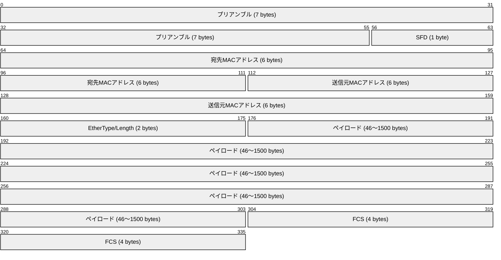

各フィールドの詳細を以下に示す。

| フィールド | サイズ | 説明 |
|-----------|--------|------|
| プリアンブル | 7 バイト | `10101010` パターンを繰り返し、受信側のクロック同期に使用 |
| SFD（Start Frame Delimiter） | 1 バイト | `10101011` のビットパターンでフレーム開始を通知 |
| 宛先 MAC アドレス | 6 バイト | フレームの宛先となるデバイスの MAC アドレス |
| 送信元 MAC アドレス | 6 バイト | フレームを送信するデバイスの MAC アドレス |
| EtherType / Length | 2 バイト | 上位プロトコルの識別（例: `0x0800` = IPv4、`0x0806` = ARP）または長さ |
| ペイロード | 46〜1500 バイト | 上位層のデータ（最小 46 バイトはパディングで補完） |
| FCS（Frame Check Sequence） | 4 バイト | CRC-32 による誤り検出 |

フレーム全体のサイズは最小 64 バイト（プリアンブル・SFD を除いた場合）から最大 1518 バイトとなる。最小フレームサイズが 64 バイトに定められているのは、CSMA/CD の衝突検出が正しく機能するための要件からくるものだ（後述）。

なお、**ジャンボフレーム**と呼ばれる拡張では、ペイロードを 9000 バイトまで拡大できる。これはデータセンター内の高速通信でよく利用される。

### 2.2 MAC アドレス

**MAC アドレス（Media Access Control アドレス）** は、ネットワークインターフェースカード（NIC）に割り当てられた 48 ビット（6 バイト）のアドレスであり、リンク層における識別子として機能する。

```
  OUI (3 bytes)       NIC固有部 (3 bytes)
┌──────────────────┬──────────────────────┐
│  00:1A:2B         │  3C:4D:5E            │
└──────────────────┴──────────────────────┘
    メーカー識別子         製品固有番号
```

MAC アドレスの最初の 3 バイトは **OUI（Organizationally Unique Identifier）** と呼ばれ、IEEE が各メーカーに割り当てる識別子だ。残りの 3 バイトはメーカーが自由に割り当てる。このため、MAC アドレスはグローバルに一意である（理論上）。

MAC アドレスには特殊な用途のビットがある。

- **ユニキャスト/マルチキャストビット（I/G ビット）**: 先頭バイトの最下位ビット。0 なら個別アドレス（ユニキャスト）、1 ならグループアドレス（マルチキャストまたはブロードキャスト）。
- **グローバル/ローカルビット（U/L ビット）**: 先頭バイトの下から 2 番目のビット。0 なら IEEE が管理するグローバルアドレス、1 なら管理者が設定したローカルアドレス。

**ブロードキャスト MAC アドレス**は `FF:FF:FF:FF:FF:FF`（全ビットが 1）で、同一ネットワークセグメント上のすべてのデバイスに届く。ARP 要求の送信にはこのブロードキャストアドレスが使われる。

### 2.3 CSMA/CD（搬送波感知多重アクセス/衝突検出）

初期の Ethernet は半二重通信で動作し、複数のデバイスが同一の共有媒体（バスや同軸ケーブル）にアクセスするための調停機構として **CSMA/CD** を採用していた。

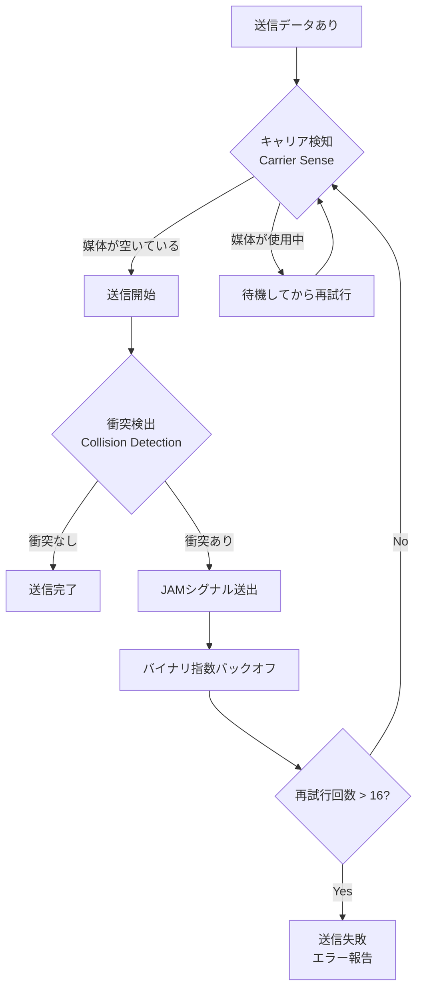

CSMA/CD の動作手順は以下のとおりだ。

1. **Carrier Sense（搬送波感知）**: 送信前に媒体が空いているかどうかを確認する。
2. **Multiple Access（多重アクセス）**: 媒体が空いていれば送信を開始する。複数のデバイスが同時に空きを検知して送信を開始する可能性がある。
3. **Collision Detection（衝突検出）**: 送信中に電圧レベルを監視し、自分の送信信号以外の信号が混入した場合（衝突）を検出する。
4. **JAM シグナル**: 衝突を検出した場合、32 ビットの JAM シグナルを送出し、他のデバイスにも衝突が発生したことを知らせる。
5. **バイナリ指数バックオフ**: 衝突後は 0〜2^n - 1 のスロット時間の中からランダムに待機時間を選んで再試行する。n は再試行回数で、最大 16 回まで試みる。

**最小フレームサイズの理由**: 10 Mbps Ethernet では、最大ケーブル長（最大伝播遅延）を考慮すると、送信を開始してから衝突が検出されるまでの最大時間は 51.2 マイクロ秒（往復伝播遅延）となる。この時間内に送信が完了してしまうと衝突を検知できない。10 Mbps で 51.2 マイクロ秒間送信できるデータ量は 512 ビット = 64 バイトであり、これが最小フレームサイズの根拠だ。

---

## 3. 現代の Ethernet

### 3.1 全二重通信とスイッチドイーサネット

共有媒体型の Ethernet はコリジョンドメインという概念が重要だったが、スイッチ（Ethernet スイッチ）の普及により状況は大きく変わった。

**スイッチ**は、各ポートにデバイスを 1 対 1 で接続し、MAC アドレステーブルを参照して適切なポートにのみフレームを転送する。これにより各接続が独立したコリジョンドメインを持ち、衝突が発生しない環境が実現される。

衝突がない環境では、**全二重通信（Full Duplex）** が可能になる。全二重では送信と受信を同時に行えるため、理論上 2 倍のスループットが得られ、CSMA/CD も不要となる。

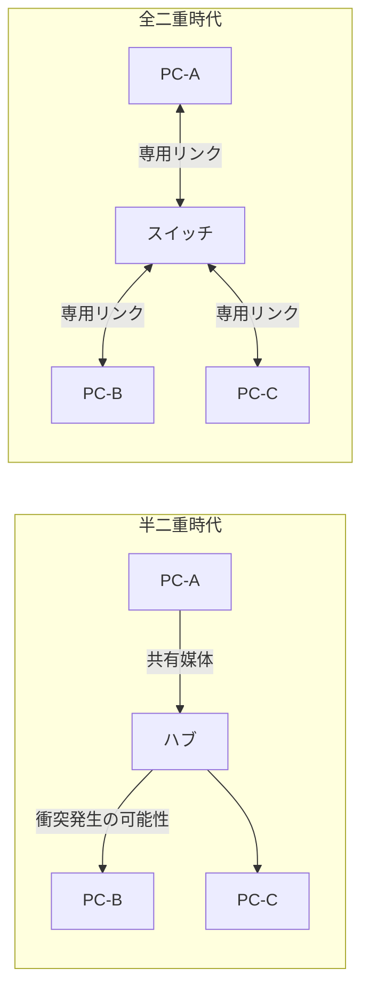

### 3.2 スイッチングの仕組み（MAC アドレステーブル）

Ethernet スイッチは **MAC アドレステーブル**（CAM テーブル: Content Addressable Memory テーブルとも呼ばれる）を管理し、宛先 MAC アドレスに基づいてフレームを転送する。

スイッチの学習プロセスは次のとおりだ。

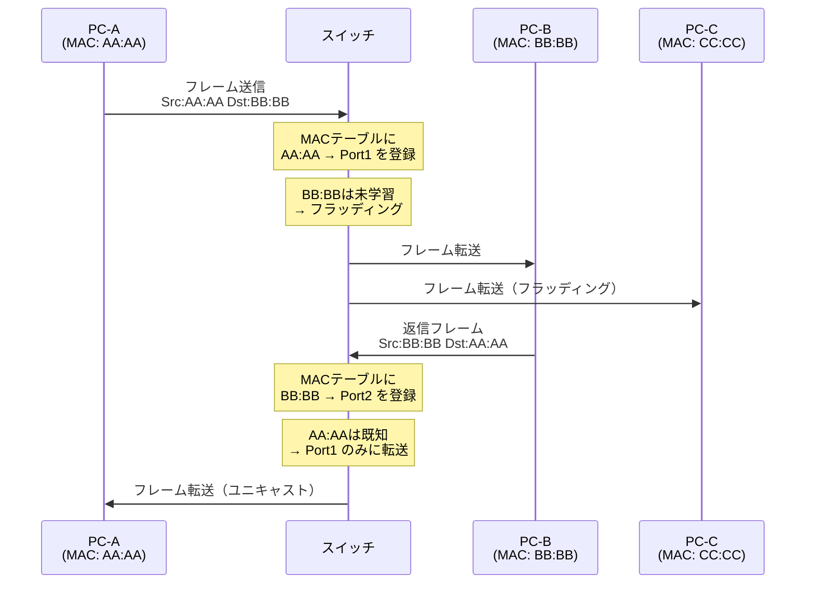

スイッチの転送動作には 3 種類ある。

- **フラッディング**: 宛先 MAC アドレスが未学習の場合、受信ポート以外の全ポートにフレームを転送する。
- **ユニキャスト転送**: 宛先 MAC アドレスがテーブルに存在する場合、対応するポートのみに転送する。
- **フィルタリング**: 送信元と宛先が同じポートにある場合（自己ループ防止）、フレームを破棄する。

MAC アドレスエントリは通常 300 秒（5 分）のエージングタイムを持ち、この時間内に再学習されないエントリは削除される。

### 3.3 VLAN（Virtual LAN）

VLAN は、物理的な接続に関わらず、スイッチを論理的に分割する技術だ。IEEE 802.1Q タグと呼ばれる 4 バイトのフィールドをフレームに追加することで、最大 4094 個の論理ネットワークを 1 台のスイッチ上に構成できる。

```
通常の Ethernet フレーム:
┌────────────┬────────────┬──────────┬─────────┬─────┐
│ 宛先 MAC   │ 送信元 MAC │EtherType │ペイロード│ FCS │
└────────────┴────────────┴──────────┴─────────┴─────┘

802.1Q タグ付きフレーム:
┌────────────┬────────────┬────────┬──────────┬─────────┬─────┐
│ 宛先 MAC   │ 送信元 MAC │802.1Q  │EtherType │ペイロード│ FCS │
│            │            │Tag(4B) │          │         │     │
└────────────┴────────────┴────────┴──────────┴─────────┴─────┘
                           └─ TPID(2B) + TCI(2B: PCP+DEI+VID) ─┘
```

802.1Q タグの構成要素は以下のとおりだ。

- **TPID（Tag Protocol Identifier）**: `0x8100` 固定で、802.1Q タグであることを示す。
- **PCP（Priority Code Point）**: 3 ビット、QoS 優先度（802.1p）。
- **DEI（Drop Eligible Indicator）**: 1 ビット、輻輳時に廃棄可能かどうかを示す。
- **VID（VLAN Identifier）**: 12 ビット、VLAN ID（0〜4095、ただし 0 と 4095 は予約）。

### 3.4 速度の進化

Ethernet は誕生以来、目覚ましい速度向上を遂げてきた。

| 規格 | 速度 | 媒体 | 標準化年 |
|------|------|------|---------|
| 10BASE5 | 10 Mbps | 同軸ケーブル | 1983 |
| 10BASE-T | 10 Mbps | ツイストペア | 1990 |
| 100BASE-TX | 100 Mbps | ツイストペア（Cat 5） | 1995 |
| 1000BASE-T | 1 Gbps | ツイストペア（Cat 5e/6） | 1999 |
| 10GBASE-T | 10 Gbps | ツイストペア（Cat 6a） | 2006 |
| 25GbE | 25 Gbps | 光ファイバー/DAC | 2014 |
| 40GbE | 40 Gbps | 光ファイバー/DAC | 2010 |
| 100GbE | 100 Gbps | 光ファイバー | 2010 |
| 400GbE | 400 Gbps | 光ファイバー | 2018 |
| 800GbE | 800 Gbps | 光ファイバー | 2023 |

現在のデータセンターでは、サーバー間接続に 25GbE や 100GbE が広く使われ、スパイン・リーフアーキテクチャの基幹接続には 400GbE や 800GbE が採用されている。

---

## 4. ARP の仕組み

### 4.1 ARP が必要な理由

IP ネットワーク（インターネット層）でのルーティングは IP アドレスに基づいて行われるが、実際のフレーム送信（リンク層）は MAC アドレスに基づいて行われる。この「IP アドレスから MAC アドレスへのマッピング」を動的に解決するためのプロトコルが **ARP（Address Resolution Protocol）** である。

RFC 826 として 1982 年に標準化された ARP は、シンプルながら非常に重要な役割を担っている。

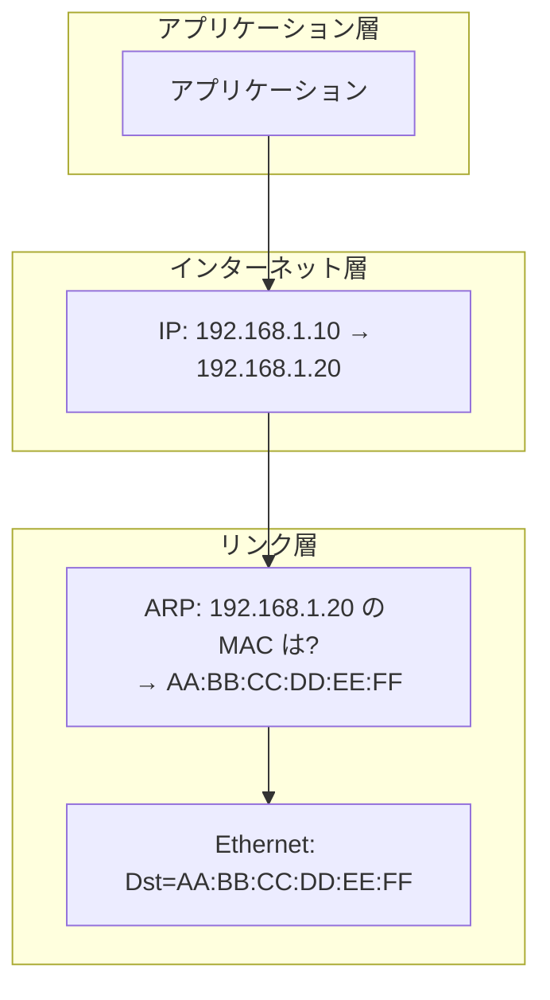

### 4.2 ARP パケット構造

ARP パケットは Ethernet フレームのペイロードとして送られ、EtherType フィールドの値は `0x0806` となる。

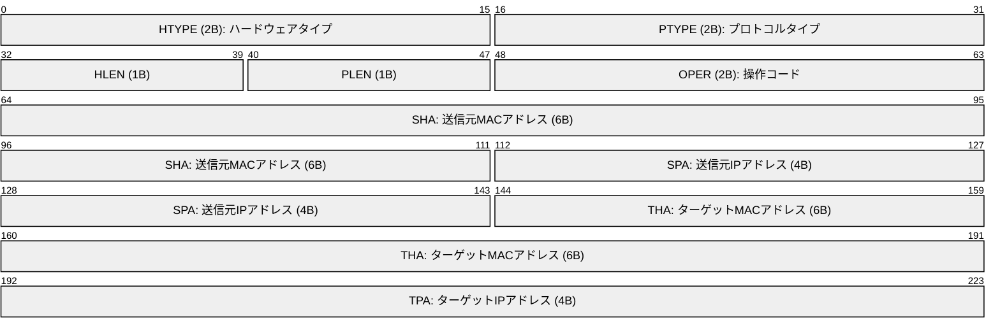

各フィールドの意味は以下のとおりだ。

| フィールド | 値（IPv4/Ethernet の場合） | 説明 |
|-----------|---------------------------|------|
| HTYPE | `0x0001` | ハードウェアタイプ（Ethernet = 1） |
| PTYPE | `0x0800` | プロトコルタイプ（IPv4 = `0x0800`） |
| HLEN | `6` | MAC アドレス長（バイト数） |
| PLEN | `4` | IP アドレス長（バイト数） |
| OPER | `1`（要求）または `2`（応答） | 操作コード |
| SHA | 送信元の MAC アドレス | Sender Hardware Address |
| SPA | 送信元の IP アドレス | Sender Protocol Address |
| THA | ターゲットの MAC アドレス | Target Hardware Address |
| TPA | ターゲットの IP アドレス | Target Protocol Address |

ARP 要求（OPER=1）では THA は `00:00:00:00:00:00`（未知）に設定され、ARP 応答（OPER=2）では THA に解決された MAC アドレスが入る。

### 4.3 ARP 要求と応答のフロー

ARP の動作を具体的なシナリオで説明しよう。PC-A（IP: 192.168.1.1、MAC: AA:AA:AA:AA:AA:AA）が PC-B（IP: 192.168.1.2、MAC: BB:BB:BB:BB:BB:BB）に通信したい場合を想定する。

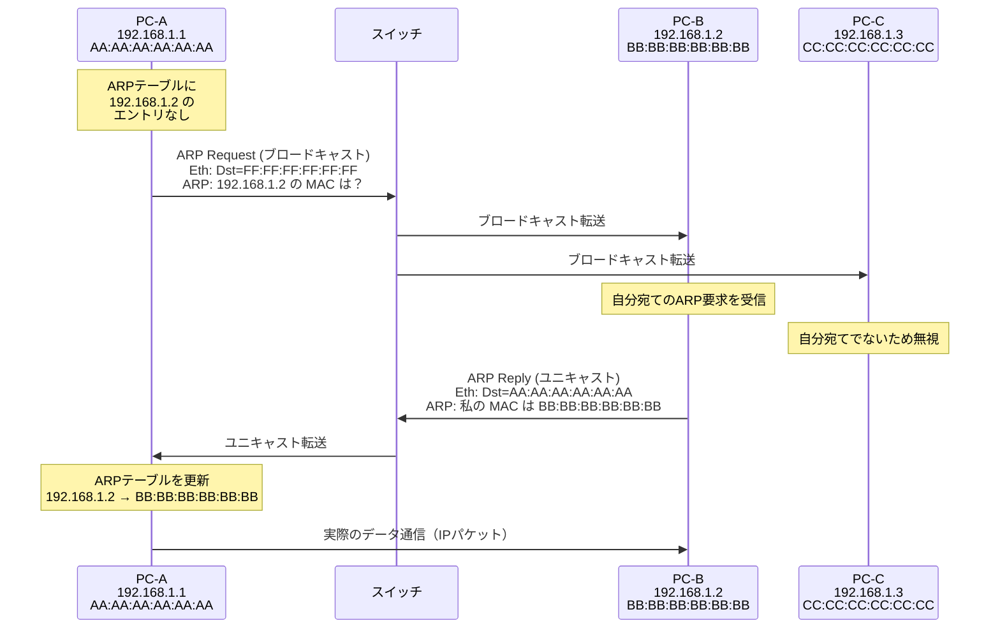

ARP 要求はブロードキャストで送信されるため、同一ネットワークセグメント上のすべてのデバイスがこれを受信する。ただし、ターゲット以外のデバイスは処理せずに破棄する（ただし後述の副作用がある）。

ARP 応答はユニキャストで送信される点に注目してほしい。要求者の MAC アドレスは ARP 要求パケットの SHA フィールドに含まれているため、応答は直接送信元に届けられる。

### 4.4 ARP テーブル

各ホストは **ARP テーブル**（ARP キャッシュ）を持ち、解決済みの IP ↔ MAC マッピングを一定時間保存する。これにより、同一宛先への通信では毎回 ARP が不要になり、ブロードキャストトラフィックを削減できる。

ARP テーブルの確認コマンドと典型的な出力例を以下に示す。

```bash
# Linux での ARP テーブル確認
$ arp -n
Address          HWtype  HWaddress           Flags Mask  Iface
192.168.1.1      ether   aa:bb:cc:dd:ee:ff   C           eth0
192.168.1.254    ether   00:11:22:33:44:55   C           eth0

# または ip コマンドを使用
$ ip neigh show
192.168.1.1 dev eth0 lladdr aa:bb:cc:dd:ee:ff REACHABLE
192.168.1.254 dev eth0 lladdr 00:11:22:33:44:55 REACHABLE
```

エントリの状態（Flags）は以下のとおりだ。

| 状態（Linux ip neigh） | 説明 |
|----------------------|------|
| `REACHABLE` | 最近通信が確認されたエントリ |
| `STALE` | エージングタイムが切れたが未削除のエントリ |
| `DELAY` | 到達性確認待ちのエントリ |
| `PROBE` | 到達性確認のプローブを送信中 |
| `FAILED` | 到達性確認に失敗したエントリ |
| `PERMANENT` | 手動設定の永続エントリ |

Linux では、ARP エントリのデフォルトライフタイムは `REACHABLE` 状態で 30〜60 秒程度であり、その後 `STALE` となって最終的に削除される。`/proc/sys/net/ipv4/neigh/eth0/base_reachable_time_ms` などのカーネルパラメーターで調整可能だ。

### 4.5 Gratuitous ARP（無償 ARP）

**Gratuitous ARP**（GARP）は、送信元と宛先の IP アドレスが同一のデバイス自身の IP アドレスを指す特殊な ARP パケットだ。「誰かが私の IP アドレスの MAC アドレスを知りたい？答えは私だ」と自己紹介するようなパケットである。

Gratuitous ARP は以下の用途で使われる。

**IP アドレスの重複検出（DAD 相当）**: ホストが起動時に自分の IP アドレスを宛先とした ARP 要求を送信し、応答が来れば同一 IP が既に使用されていることを検出できる。

**ARP テーブルの更新**: 仮想 IP を使ったフェイルオーバー（HSRP/VRRP など）では、新しいマスターノードが Gratuitous ARP を送信して、他のホストの ARP テーブルを強制的に更新させる。

**HA クラスターのフェイルオーバー**: プライマリノードから バックアップノードへの切り替え時、Gratuitous ARP で周辺デバイスに MAC アドレスの変更を通知する。

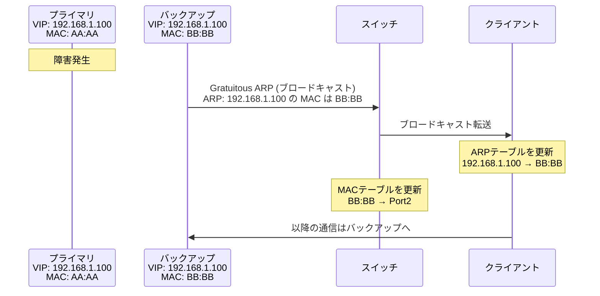

---

## 5. ARP の問題点

ARP の設計はシンプルで効果的だが、その簡素さゆえにいくつかの重大な問題を抱えている。

### 5.1 ARP スプーフィング（ARP ポイズニング）

**ARP スプーフィング**は、ARP プロトコルが認証機構を持たない（任意の ARP 応答を信頼する）という弱点を悪用した攻撃手法だ。

攻撃者は偽の ARP 応答を送信し、被害者の ARP テーブルを改ざんすることができる。これにより、被害者が意図するホストへの通信が攻撃者のマシンを経由するようになる（中間者攻撃）。

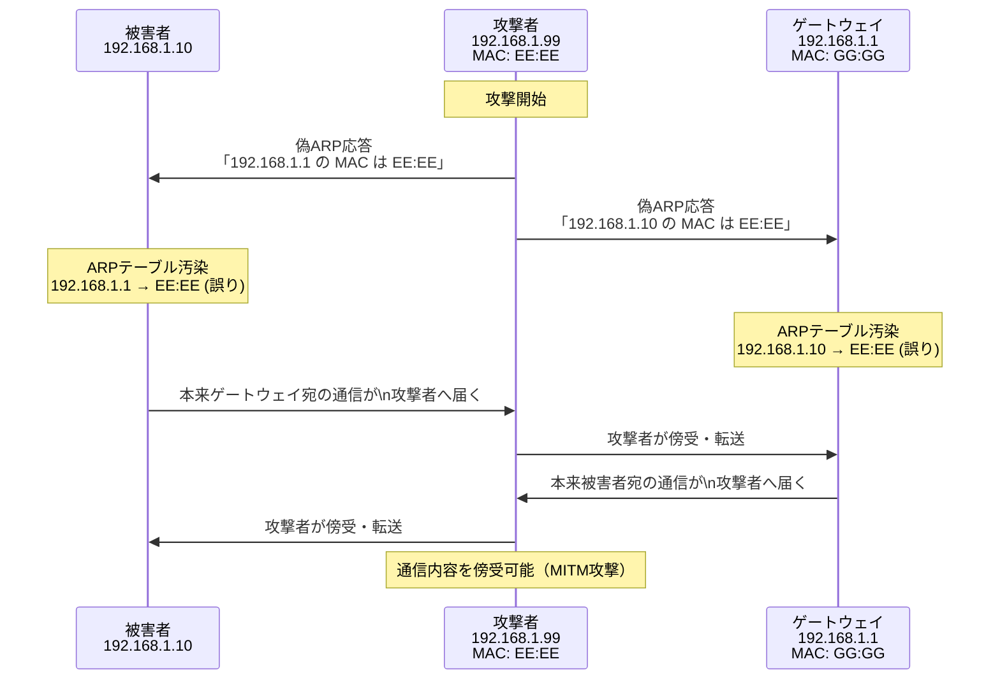

ARP スプーフィングへの対策として、以下の技術が使われる。

**Dynamic ARP Inspection（DAI）**: スイッチレベルでの対策。DHCP スヌーピングデータベースと照合することで、正当でない ARP パケットを検出・廃棄する。

```
スイッチの設定例（Cisco IOS）:
# ip dhcp snooping を有効化
ip dhcp snooping
ip dhcp snooping vlan 10

# ARP インスペクションを有効化
ip arp inspection vlan 10

# トランクポートは信頼済みとして設定
interface GigabitEthernet1/1
 ip dhcp snooping trust
 ip arp inspection trust
```

**静的 ARP エントリ**: 重要なホストの ARP エントリを静的に設定することで、偽の ARP 応答による書き換えを防ぐ。ただし管理コストが高い。

**ARP Watchdog / arpwatch**: ARP トラフィックを監視し、MAC アドレスの変化を検出してアラートを発するソフトウェア。

**802.1X 認証と NAC**: ポート単位の認証を強制することで、未認証デバイスのネットワーク接続を拒否する。

### 5.2 ARP ストーム

**ARP ストーム**は、大量の ARP ブロードキャストがネットワークを氾濫させる現象だ。ループが発生したネットワーク（STP の設定不備など）では、ブロードキャストフレームが際限なく増幅されて伝播し、ネットワーク全体が機能不全に陥る。

また、大規模なフラットネットワーク（VLAN 分割のないネットワーク）では、多数のホストが生成する ARP トラフィックが積み重なってネットワーク帯域を圧迫することがある。これは **ブロードキャストストーム** の一形態だ。

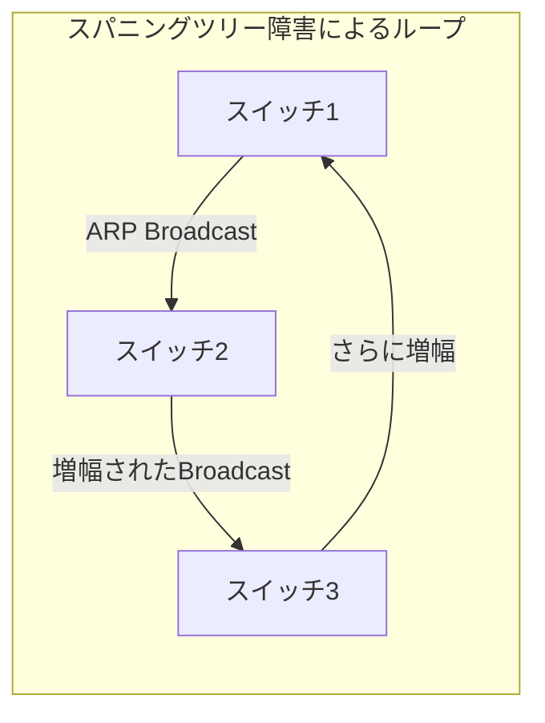

STP（Spanning Tree Protocol）や RSTP（Rapid STP）は、ループを防ぐためにネットワーク内の冗長リンクを論理的にブロックする。また、ループガード、BPDU ガード、ポートファストなどの機能を適切に設定することが重要だ。

### 5.3 ARP テーブルの容量限界

多数のホストが接続されたネットワークでは、ルーターやスイッチの ARP テーブルが満杯になる可能性がある。特にデータセンターにおけるスケールアウト構成では、数万〜数十万のエントリが必要になる場合もある。ハードウェアの TCAM（Ternary Content Addressable Memory）の制限がボトルネックになることがある。

この問題への対策としては、VLAN によるブロードキャストドメインの分割、BGP EVPN + VXLAN による分散型 ARP 処理、ルートリフレクターによる ARP キャッシュの集中管理などが挙げられる。

---

## 6. IPv6 における NDP（Neighbor Discovery Protocol）

IPv6 では ARP に相当する機能を **NDP（Neighbor Discovery Protocol）** が担う。NDP は ICMPv6 のメッセージタイプとして実装されており、ARP よりも大幅に機能が拡張されている。

### 6.1 NDP の主な機能

NDP は RFC 4861 で定義されており、以下の機能を提供する。

| 機能 | 対応する IPv4 機能 | 説明 |
|------|-------------------|------|
| アドレス解決 | ARP | IPv6 アドレスから MAC アドレスへの解決 |
| ルーター探索 | ICMP Router Discovery | デフォルトゲートウェイの動的発見 |
| プレフィックス探索 | DHCP | リンクプレフィックスの通知 |
| アドレス自動設定 | DHCP | SLAAC（Stateless Address Autoconfiguration） |
| 到達性確認 | ARP（ポーリング） | ネイバーの到達性検証 |
| 重複アドレス検出 | Gratuitous ARP | アドレス衝突検出 |
| リダイレクト | ICMP Redirect | より適切なルーターへの誘導 |

### 6.2 マルチキャストベースのアドレス解決

IPv6 の NDP がブロードキャストの代わりに **Solicited-Node マルチキャスト** を使用する点は特筆すべき改善だ。

Solicited-Node マルチキャストアドレスは、IPv6 アドレスの下位 24 ビットを使って `FF02::1:FF__:____` の形式で生成される。例えば、IPv6 アドレス `2001:db8::1:2:3456` のホストが参加するマルチキャストグループは `FF02::1:FF02:3456` となる。

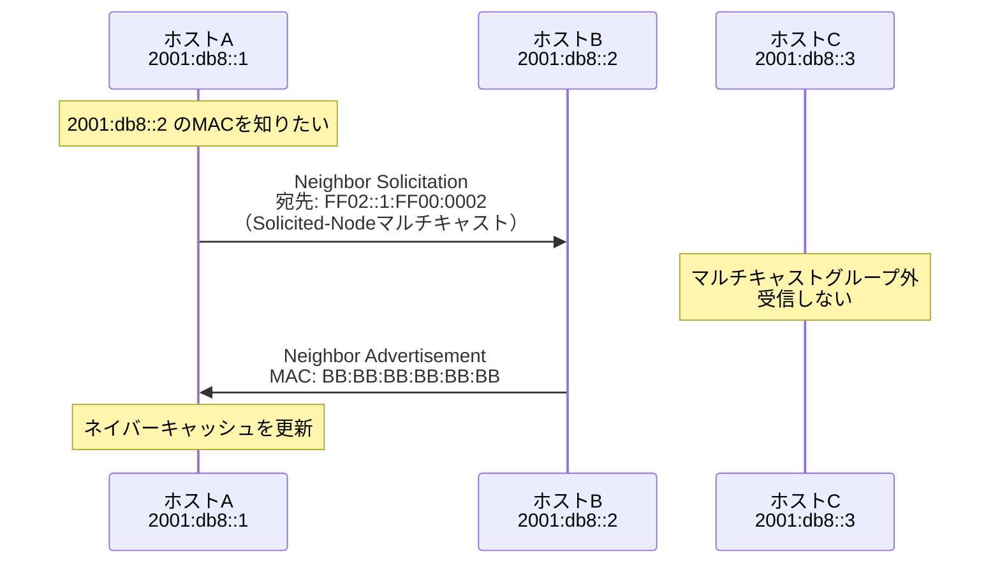

この方式により、ブロードキャストのようにすべてのホストが処理する必要がなく、関係するホストのみがパケットを処理する。大規模なネットワークでの効率性が大幅に向上する。

### 6.3 SLAAC（ステートレスアドレス自動設定）

NDP の重要な機能の一つが **SLAAC（Stateless Address Autoconfiguration）** だ。IPv6 ホストはルーターが送信する **RA（Router Advertisement）** メッセージからネットワークプレフィックスを取得し、インターフェースの MAC アドレスから **EUI-64** を使って自動的に IPv6 アドレスを生成できる。

DHCP サーバーなしでアドレスを自動設定できるのは、IPv6 の大きな利点の一つだ。ただし、EUI-64 ではMAC アドレスがアドレスに埋め込まれるためプライバシーの問題がある。RFC 4941 のプライバシー拡張では、ランダムなインターフェース識別子を使用することでこの問題に対処している。

### 6.4 SEND（Secure Neighbor Discovery）

ARP スプーフィングの IPv6 版（NDP スプーフィング）への対策として、RFC 3971 で **SEND（Secure Neighbor Discovery）** が定義されている。SEND は暗号学的に生成されたアドレス（CGA: Cryptographically Generated Addresses）と RSA 署名を使って NDP メッセージを認証する。ただし、実装の複雑さから広く普及はしていない。

---

## 7. 実運用の考慮事項

### 7.1 Proxy ARP

**Proxy ARP** は、ルーターが異なるサブネット上のホストの代わりに ARP 応答を送信する機能だ。これにより、クライアントはデフォルトゲートウェイを明示的に設定しなくても通信できる。

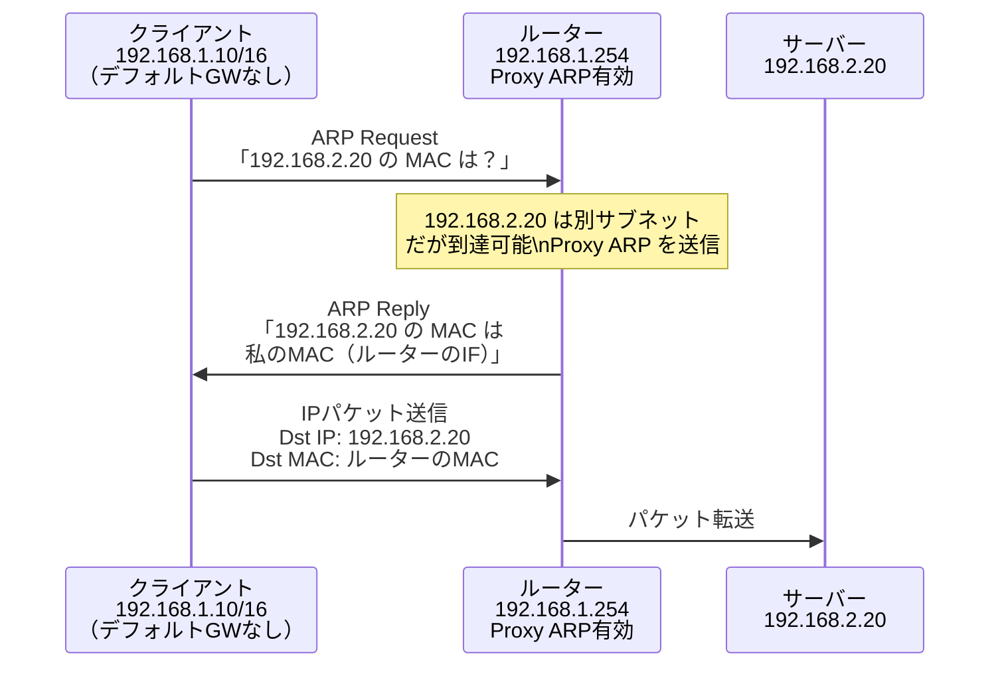

Proxy ARP は設定が不要で便利な反面、ARP テーブルが肥大化しやすく、セキュリティリスクもある。現代ではほとんどの場合、クライアントに適切なデフォルトゲートウェイを設定する方が推奨される。

### 7.2 ARP タイムアウトのチューニング

ARP キャッシュのタイムアウト値は環境に応じて調整が必要になる場合がある。

```bash
# Linux でのARP設定確認と調整
$ sysctl net.ipv4.neigh.eth0.base_reachable_time_ms
net.ipv4.neigh.eth0.base_reachable_time_ms = 30000

# 到達性確認間隔を設定（ミリ秒単位）
$ sysctl -w net.ipv4.neigh.eth0.base_reachable_time_ms=60000

# ARP テーブルの最大エントリ数
$ sysctl net.ipv4.neigh.default.gc_thresh3
net.ipv4.neigh.default.gc_thresh3 = 1024
```

大規模環境では `gc_thresh1`、`gc_thresh2`、`gc_thresh3` の各しきい値を適切に設定することで、ARP テーブルの容量不足やガベージコレクションのオーバーヘッドを回避できる。

### 7.3 Ethernet オフロード機能

現代の NIC（Network Interface Card）は CPU 負荷を軽減するためのさまざまなオフロード機能を持つ。

| 機能 | 説明 |
|------|------|
| TSO（TCP Segmentation Offload） | TCP セグメンテーションをハードウェアで処理 |
| LRO（Large Receive Offload） | 受信時に複数のパケットを結合してCPU転送回数を削減 |
| GRO（Generic Receive Offload） | ソフトウェアレベルの LRO（ドライバー非依存） |
| RSS（Receive Side Scaling） | 複数のCPUコアに受信処理を分散 |
| SR-IOV（Single Root I/O Virtualization） | 1つの物理NICを仮想環境に直接公開 |
| RDMA（Remote Direct Memory Access） | ゼロコピーでのリモートメモリアクセス |

```bash
# ethtool でオフロード機能の確認
$ ethtool -k eth0 | grep -E "tcp-segmentation|generic-receive|large-receive"
tcp-segmentation-offload: on
generic-receive-offload: on
large-receive-offload: off [fixed]

# TSO を無効化（トラブルシューティング時など）
$ ethtool -K eth0 tso off
```

### 7.4 ECMP と Ethernet

データセンターネットワークでは、**ECMP（Equal-Cost Multi-Path）** と Ethernet スイッチングを組み合わせることが多い。ECMP はフローハッシュ（送信元/宛先 IP、ポート番号などのハッシュ値）に基づいて複数のパスに負荷分散する。

スパイン・リーフアーキテクチャでは、各リーフスイッチが複数のスパインスイッチに Ethernet で接続され、ECMP でトラフィックを均等分散する。これにより、水平スケールアウトが容易なネットワーク基盤が実現する。

---

## 8. 将来の展望

### 8.1 Time-Sensitive Networking（TSN）

**TSN（Time-Sensitive Networking）** は、IEEE 802.1 ワーキンググループが開発中の Ethernet 拡張規格群だ。産業用オートメーション、車載ネットワーク、プロ向けオーディオ/ビデオなど、リアルタイム性が求められるアプリケーション向けに、決定論的な低遅延と高信頼性を Ethernet 上で実現する。

主要な TSN 規格は以下のとおりだ。

- **IEEE 802.1Qbv（TAS: Time-Aware Shaper）**: 時間に同期したゲートスケジューリングで決定論的遅延を保証する。
- **IEEE 802.1CB（FRER: Frame Replication and Elimination）**: フレームを複数パスで複製送信し、パケットロスに対する冗長性を高める。
- **IEEE 802.1AS（gPTP: Generalized Precision Time Protocol）**: ナノ秒精度の時刻同期を Ethernet 上で実現する。

### 8.2 800GbE と次世代高速 Ethernet

400GbE が普及期を迎える一方、800GbE の標準化（IEEE 802.3df）が進行中だ。さらには 1.6 Tbps Ethernet の研究も進んでいる。これらの高速 Ethernet は、AI/ML のトレーニングに使われる GPU クラスター間の超高速インターコネクトとして需要が急増している。

シリコンフォトニクス技術の進化により、高速・長距離・低消費電力の光インターコネクトが実用化されつつあり、次世代 Ethernet の物理層を支える重要な技術となっている。

### 8.3 ARP の後継技術

IPv6 の普及に伴い、ARP は NDP に置き換えられていく。ただし、IPv4 はまだ広く使われており、ARP が完全に廃止されるまでには長い時間がかかるだろう。

データセンター環境では、BGP EVPN（Ethernet VPN）と VXLAN の組み合わせが台頭している。EVPN では BGP を使って MAC アドレスと IP アドレスのマッピング情報をコントロールプレーンで配布するため、従来の ARP ブロードキャストに依存しない。これにより、大規模なマルチテナント環境での ARP スケーラビリティ問題が解決される。

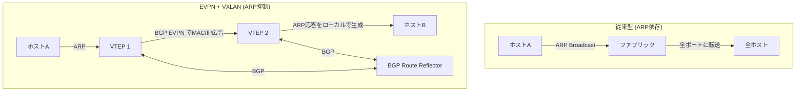

### 8.4 SmartNIC と DPU

**SmartNIC（Smart Network Interface Card）** および **DPU（Data Processing Unit）** は、ネットワーク処理をホスト CPU からオフロードする次世代デバイスだ。NVIDIA BlueField、Intel IPU、AMD Pensando などが代表的な製品だ。

SmartNIC/DPU では、ARP プロキシ、セキュリティポリシー適用、VXLANカプセル化/デカプセル化、ロードバランシングなどの処理をハードウェア上の専用プロセッサで実行する。これにより、ホスト CPU はアプリケーション処理に専念でき、全体的なシステム性能が向上する。

---

## まとめ

Ethernet は 1970 年代の ALOHAnet の研究から生まれ、Xerox PARC での開発、IEEE による標準化を経て、現代のネットワーク基盤として欠かせない技術となった。半二重の共有バスから全二重スイッチドネットワークへの進化、そして 10 Mbps から 800 Gbps 以上への速度向上は、ネットワーク技術の半世紀にわたる発展を体現している。

ARP は IPv4 ネットワークにおける IP ↔ MAC アドレス解決の根幹を担うシンプルなプロトコルだ。その簡素さは大きな利点である一方、認証機構の欠如によるスプーフィング攻撃への脆弱性や、大規模ネットワークでのスケーラビリティ問題という課題も内包している。

IPv6 と NDP の普及、EVPN/VXLAN によるコントロールプレーンでの ARP 抑制、TSN による決定論的通信など、次世代の技術が従来の課題を解決しながらネットワーク技術はさらに進化している。Ethernet と ARP の基本原理を深く理解することは、これらの最新技術を正しく活用するための確固たる土台となる。

---

## 参考資料

- RFC 826 - An Ethernet Address Resolution Protocol
- RFC 4861 - Neighbor Discovery for IP version 6 (IPv6)
- RFC 4862 - IPv6 Stateless Address Autoconfiguration
- RFC 7348 - Virtual eXtensible Local Area Network (VXLAN)
- RFC 7432 - BGP MPLS-Based Ethernet VPN
- IEEE 802.3 - Ethernet Standard
- IEEE 802.1Q - Virtual LANs
- IEEE 802.1AS - Timing and Synchronization for Time-Sensitive Applications
- Metcalfe, R.M. and Boggs, D.R. "Ethernet: Distributed Packet Switching for Local Computer Networks." *Communications of the ACM* 19, 7 (July 1976)
