# イベント駆動アーキテクチャ

## 1. 歴史的背景 — リクエスト/レスポンスモデルの限界とイベント駆動の台頭

### 1.1 リクエスト/レスポンスモデルの支配

ソフトウェアアーキテクチャの歴史において、長らく支配的だったのは**リクエスト/レスポンスモデル**である。クライアントがサーバーにリクエストを送信し、サーバーが処理結果をレスポンスとして返す。HTTP、RPC、データベースクエリなど、ほとんどの通信パターンがこのモデルに基づいている。

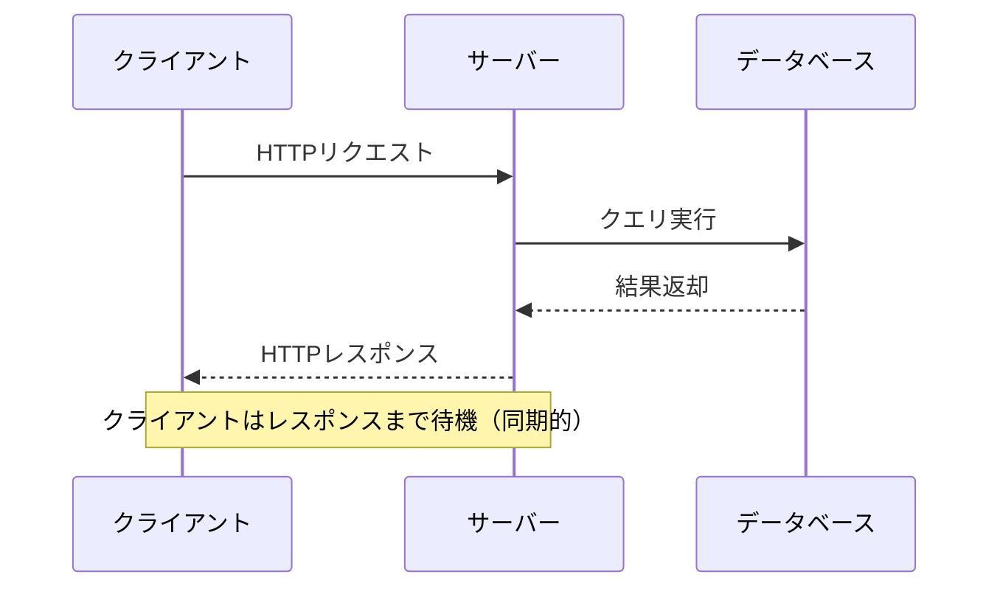

このモデルはシンプルで理解しやすいが、システムの規模と複雑さが増すにつれて根本的な限界が露呈してきた。

### 1.2 モノリスからマイクロサービスへ

2000年代後半から2010年代にかけて、大規模なWebサービスを運用する企業（Amazon、Netflix、Uber など）は、巨大なモノリシックアプリケーションを小さな独立したサービスに分割する**マイクロサービスアーキテクチャ**を採用し始めた。

しかし、マイクロサービスに分割しただけでは、サービス間の通信にリクエスト/レスポンスモデル（REST API や gRPC）を使い続けることになる。この同期的な通信は以下の問題を引き起こす：

- **時間的結合（Temporal Coupling）**：呼び出し先サービスが停止していると、呼び出し元も処理できない。サービスAがサービスBを呼び出し、BがCを呼び出すような連鎖では、一つの障害がシステム全体に波及する
- **空間的結合（Spatial Coupling）**：呼び出し元がサービスのアドレスやAPIの詳細を知っている必要がある。サービスの追加・変更のたびに、呼び出し元も変更しなければならない
- **スケーラビリティの制約**：同期呼び出しではリクエスト数に比例してレイテンシが増加する。負荷のピーク時にシステム全体がボトルネックの最も遅いサービスに引きずられる
- **変更の波及**：あるサービスにビジネスロジックを追加すると、関連するすべてのサービスの修正が必要になることがある

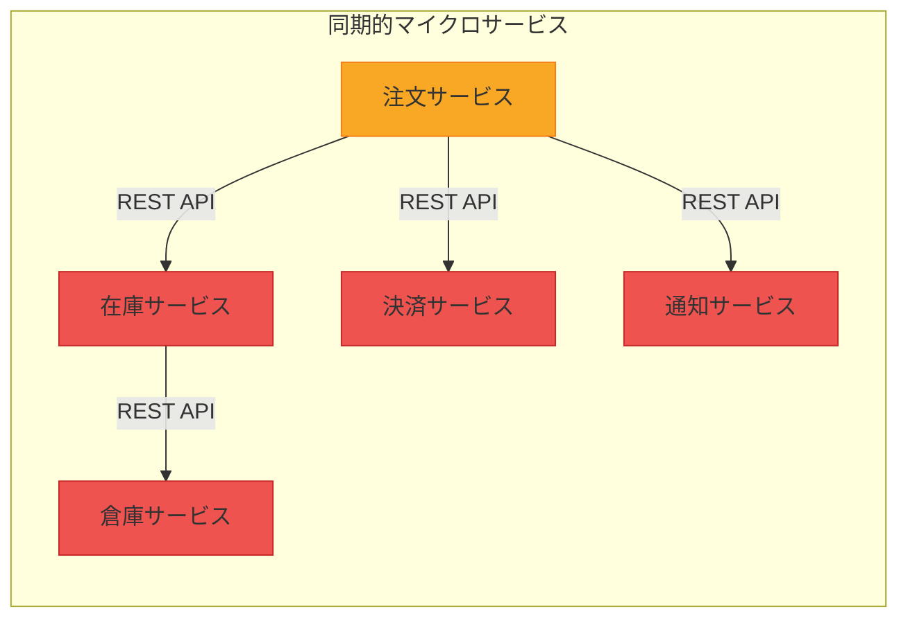

::: warning 同期呼び出しの連鎖は脆い
注文サービスが在庫サービス、決済サービス、通知サービスをすべて同期的に呼び出す場合、通知サービスの障害で注文処理全体が失敗する可能性がある。注文の成否が通知の成否に依存すべきではない。
:::

### 1.3 イベント駆動アーキテクチャの台頭

これらの課題に対する解として注目されたのが**イベント駆動アーキテクチャ（Event-Driven Architecture, EDA）**である。

イベント駆動アーキテクチャの概念自体は新しいものではない。1960年代の割り込み駆動プログラミング、1980年代のGUIイベントループ、1990年代のメッセージ指向ミドルウェア（MOM）、2000年代のSOAにおけるEnterprise Service Bus（ESB）など、その思想は長い歴史を持つ。

しかし、現代的なイベント駆動アーキテクチャが大きく注目されるようになったのは、2010年代にLinkedInで開発された**Apache Kafka**の登場が契機である。Kafkaは、従来のメッセージキューとは異なり、大量のイベントを耐久性のあるログとして永続化し、複数のコンシューマが独立して読み取れるモデルを提供した。これにより、イベント駆動アーキテクチャはエンタープライズシステムの本流に躍り出た。

::: tip 歴史的な文脈
Martin Fowlerは2017年のGOTO Conferenceで「"Event-Driven"という言葉は人によって意味が異なる」と指摘し、イベント駆動アーキテクチャを4つの異なるパターンに分類した。本記事でもこの分類に従って解説する。
:::

## 2. 基本概念 — イベント、プロデューサ、コンシューマ、チャネル

### 2.1 イベントとは何か

イベントとは、**システム内で発生した意味のある事実（fact）の記録**である。重要なのは、イベントは「すでに起こったこと」を表すという点である。コマンド（命令）が「これを実行せよ」という要求であるのに対し、イベントは「これが起こった」という過去の事実を伝える。

| 概念 | 意味 | 例 | 時制 |
|------|------|-----|------|
| コマンド（Command） | 何かを実行する要求 | `CreateOrder` | 命令 |
| イベント（Event） | 何かが起こった事実 | `OrderCreated` | 過去形 |
| クエリ（Query） | 情報を取得する要求 | `GetOrderById` | 現在形 |

この区別は単なる命名規約ではなく、アーキテクチャ上の重要な設計判断である。イベントは過去の事実であるため、**取り消し（undo）はできない**。誤った注文を取り消すには、`OrderCreated` イベントを削除するのではなく、新たに `OrderCancelled` イベントを発行する。

### 2.2 イベントの構造

典型的なイベントは以下の要素で構成される：

```json
{
  // Event metadata
  "eventId": "550e8400-e29b-41d4-a716-446655440000",
  "eventType": "OrderCreated",
  "timestamp": "2026-03-01T10:15:30Z",
  "source": "order-service",
  "correlationId": "req-abc-123",
  "schemaVersion": "1.2.0",

  // Event payload
  "data": {
    "orderId": "ORD-2026-001",
    "customerId": "CUST-42",
    "items": [
      { "productId": "PROD-100", "quantity": 2, "unitPrice": 1500 }
    ],
    "totalAmount": 3000,
    "currency": "JPY"
  }
}
```

::: details イベントメタデータの各フィールドの役割
- **eventId**: イベントを一意に識別するID。冪等性処理に使用
- **eventType**: イベントの種類。コンシューマがフィルタリングに使用
- **timestamp**: イベントが発生した日時。順序の判断に使用
- **source**: イベントを発行したサービスの識別子
- **correlationId**: 一連の処理を追跡するためのID。分散トレーシングに活用
- **schemaVersion**: イベントスキーマのバージョン。スキーマ進化の管理に使用
:::

### 2.3 プロデューサとコンシューマ

イベント駆動アーキテクチャの参加者は、大きく二つの役割に分かれる：

- **イベントプロデューサ（Event Producer）**：イベントを発行する側。ビジネス上の何かが起こったときに、そのことをイベントとして公開する。プロデューサは誰がそのイベントを消費するかを知らない（知る必要がない）
- **イベントコンシューマ（Event Consumer）**：イベントを受信して処理する側。関心のあるイベントを購読（subscribe）し、受信時に自身のビジネスロジックを実行する

この分離が、イベント駆動アーキテクチャの最大の利点である**疎結合（Loose Coupling）**を実現する。

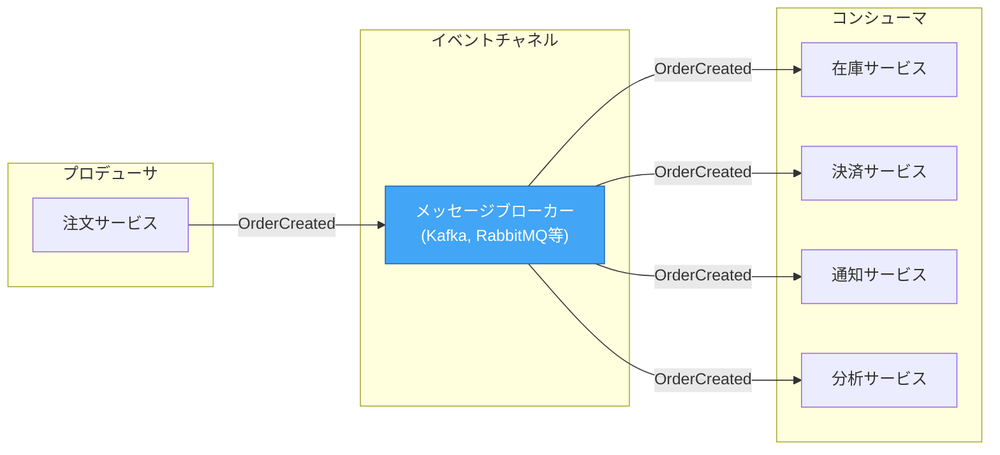

上の図で重要なのは、注文サービスは `OrderCreated` イベントを発行するだけであり、誰がそれを処理するかには関知しないことである。後から分析サービスを追加しても、注文サービスのコードは一切変更不要である。

### 2.4 イベントチャネル（メッセージブローカー）

プロデューサとコンシューマを仲介するインフラストラクチャが**イベントチャネル**である。多くの場合、**メッセージブローカー**がこの役割を担う。

メッセージブローカーは以下の基本的な配信モデルを提供する：

**Point-to-Point（キューイング）**

メッセージは一つのコンシューマだけが受信する。複数のコンシューマがいる場合は競合的に消費する（Competing Consumers パターン）。タスクの分散処理に適している。

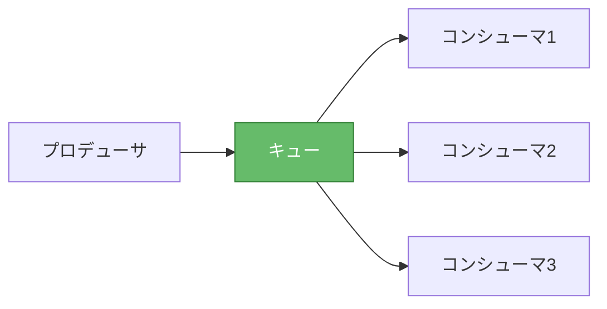

**Publish/Subscribe（Pub/Sub）**

メッセージはすべてのサブスクライバに配信される。一つのイベントが複数の異なるサービスで並行して処理される場合に適している。

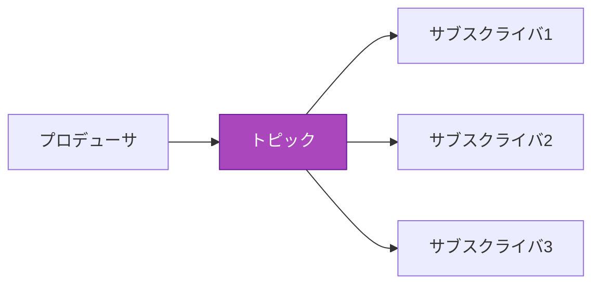

実際のシステムでは、この二つを組み合わせることが多い。Kafkaの**コンシューマグループ**はその代表例であり、同一グループ内ではPoint-to-Point、異なるグループ間ではPub/Subとして動作する。

## 3. アーキテクチャパターン

イベント駆動アーキテクチャには、複数の異なるパターンが存在する。これらは排他的ではなく、一つのシステム内で組み合わせて使われることも多い。

### 3.1 イベント通知（Event Notification）

最もシンプルなパターンである。あるサービスで何かが起こったことを他のサービスに通知する。イベントには最小限の情報（何が起こったかと、その識別子）のみを含める。

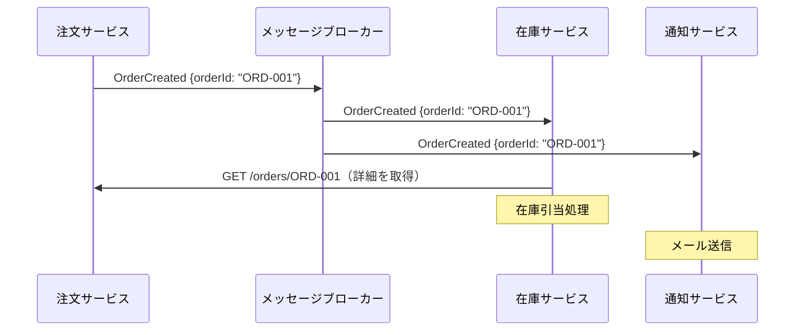

このパターンの特徴は、イベントに含まれる情報が少ないため、コンシューマが詳細情報を必要とする場合はプロデューサに問い合わせる必要がある点である。

**メリット：**
- プロデューサとコンシューマの結合度が低い
- イベントのペイロードが小さい
- コンシューマの追加が容易

**デメリット：**
- コンシューマからプロデューサへのコールバック呼び出しが発生するため、完全な非同期にならない
- プロデューサへの問い合わせが集中するとボトルネックになる

### 3.2 Event-Carried State Transfer（ECST）

イベントに十分な情報を含めることで、コンシューマがプロデューサに問い合わせる必要をなくすパターンである。RESTにおけるHATEOASのように、イベント自体が必要なデータを運ぶ。

```json
{
  "eventType": "CustomerAddressChanged",
  "data": {
    "customerId": "CUST-42",
    "oldAddress": {
      "postalCode": "100-0001",
      "city": "千代田区",
      "street": "丸の内1-1-1"
    },
    "newAddress": {
      "postalCode": "150-0001",
      "city": "渋谷区",
      "street": "神宮前1-2-3"
    }
  }
}
```

コンシューマは受信したイベントのデータを自身のローカルストアにキャッシュし、以後はそのローカルコピーを参照する。これにより、サービス間のランタイム依存がなくなる。

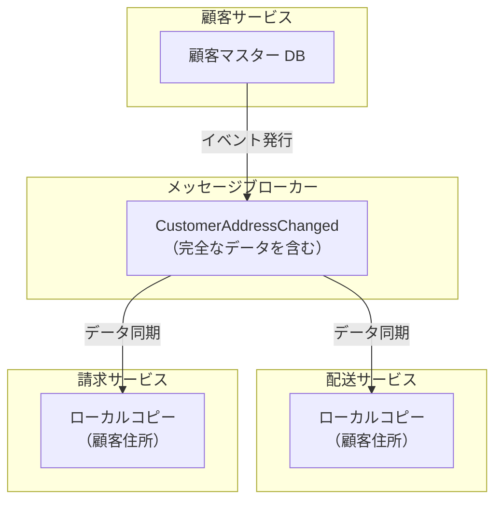

::: warning データの整合性について
Event-Carried State Transfer では、各サービスがデータのローカルコピーを保持するため、**結果整合性（Eventual Consistency）**になる。イベントの伝播に遅延がある間、サービス間でデータの不一致が生じる。これはトレードオフとして受け入れる必要がある。
:::

**メリット：**
- サービス間のランタイム依存がなくなる（高い可用性）
- コンシューマのクエリが高速（ローカルストアへのアクセス）

**デメリット：**
- イベントのペイロードが大きくなる
- データの結果整合性を許容する必要がある
- 各サービスにデータの重複が生じる

### 3.3 Event Sourcing

Event Sourcing は、システムの状態を直接保存するのではなく、**状態変更を引き起こしたイベントの系列（イベントストリーム）を永続化**するパターンである。現在の状態は、イベントを先頭から順に再生（replay）することで導出する。

これは会計における複式簿記の考え方と同じである。預金残高（状態）を直接管理するのではなく、すべての取引（入出金イベント）を記録し、残高はそこから算出する。

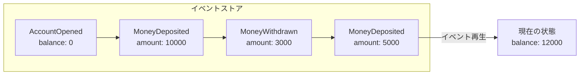

```python
class BankAccount:
    def __init__(self):
        self.balance = 0
        self.events = []

    def apply_event(self, event):
        """Apply a single event to reconstruct state."""
        if event["type"] == "AccountOpened":
            self.balance = 0
        elif event["type"] == "MoneyDeposited":
            self.balance += event["amount"]
        elif event["type"] == "MoneyWithdrawn":
            self.balance -= event["amount"]

    def replay(self, events):
        """Replay all events to reconstruct current state."""
        for event in events:
            self.apply_event(event)

    def deposit(self, amount):
        """Record a deposit event."""
        event = {
            "type": "MoneyDeposited",
            "amount": amount,
            "timestamp": "2026-03-01T10:00:00Z"
        }
        self.events.append(event)
        self.apply_event(event)

    def withdraw(self, amount):
        """Record a withdrawal event."""
        if self.balance < amount:
            raise ValueError("Insufficient balance")
        event = {
            "type": "MoneyWithdrawn",
            "amount": amount,
            "timestamp": "2026-03-01T10:05:00Z"
        }
        self.events.append(event)
        self.apply_event(event)
```

::: tip スナップショットによる最適化
イベント数が膨大になると、毎回先頭から再生するのは非効率である。実践的には**スナップショット**を定期的に保存し、スナップショット以降のイベントだけを再生する。例えば、1000イベントごとにスナップショットを取得すれば、最大1000イベントの再生で現在の状態を復元できる。
:::

**Event Sourcingのメリット：**
- 完全な監査ログが自然に得られる
- 任意の時点の状態を再構築できる（タイムトラベルデバッグ）
- イベントストリームから新しいプロジェクション（ビュー）を後から構築できる
- バグの再現と修正が容易（同じイベント列を再生すればよい）

**Event Sourcingのデメリット：**
- 学習コストが高い（CRUD思考からの脱却が必要）
- クエリが困難（「残高が10万円以上の顧客一覧」のような集約クエリは直接実行できない）
- イベントスキーマの進化が複雑
- ストレージ容量が増大する

### 3.4 CQRS（Command Query Responsibility Segregation）

CQRSは、**書き込み操作（コマンド）と読み取り操作（クエリ）のモデルを分離**するパターンである。Event Sourcingと組み合わせて使われることが多いが、CQRS単体でも適用可能である。

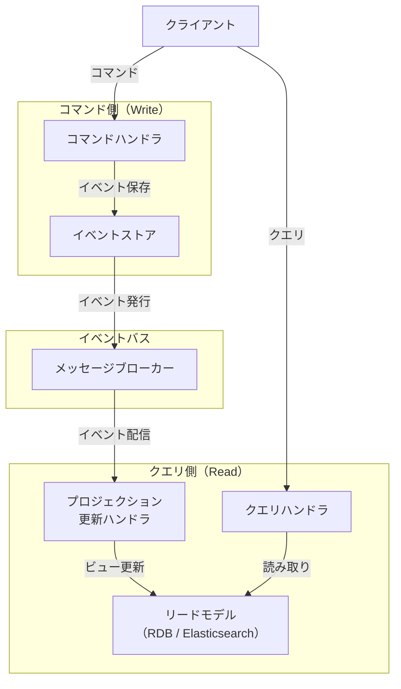

CQRSの核心は、書き込みに最適化されたモデルと読み取りに最適化されたモデルは異なる構造を持つべきだという認識にある。例えば、ECサイトの注文システムでは：

- **コマンド側**：注文のドメインモデル（注文、注文明細、支払い情報）がイベントとして保存される
- **クエリ側**：「顧客ごとの注文履歴」「商品ごとの売上集計」「日別の注文件数」など、用途に応じた非正規化されたビューが用意される

::: danger CQRSの過剰適用に注意
CQRSは強力だが、すべてのシステムに必要なわけではない。読み取りと書き込みのパターンが大きく異なる場合や、読み取りの負荷が書き込みを大幅に上回る場合に有効である。単純なCRUDアプリケーションにCQRSを適用すると、不要な複雑さだけが増す。
:::

### 3.5 パターンの比較

| パターン | 複雑さ | データ結合度 | 適用場面 |
|---------|--------|------------|---------|
| イベント通知 | 低 | 低（コールバック必要） | サービス間の緩やかな連携 |
| ECST | 中 | なし（自己完結型） | サービスの独立性が重要な場合 |
| Event Sourcing | 高 | なし | 監査、時系列分析、複雑なドメイン |
| CQRS | 高 | なし | 読み書きパターンが異なるシステム |

## 4. メッセージブローカー — Kafka, RabbitMQ, Pulsar の比較

### 4.1 Apache Kafka

Kafkaは、LinkedInで開発され2011年にオープンソース化された分散イベントストリーミングプラットフォームである。元々はログ収集基盤として設計されたが、現在ではイベント駆動アーキテクチャの中核として広く使われている。

**アーキテクチャの特徴：**

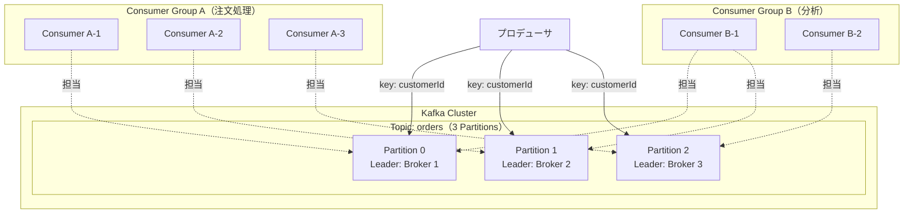

Kafkaの設計思想の核心は、メッセージを**永続化された不変のログ（immutable log）**として扱うことにある。従来のメッセージキューがメッセージ消費後に削除するのに対し、Kafkaはメッセージを設定された保持期間（デフォルト7日、無期限も可能）だけ保存し続ける。コンシューマは自身の**オフセット（読み取り位置）**を管理し、任意の位置から再読み取りできる。

**主な特徴：**
- 高スループット（毎秒数百万メッセージ）
- パーティションによる水平スケーリング
- コンシューマグループによる負荷分散
- メッセージの永続化と再読み取り
- At-least-once / Exactly-once セマンティクス（トランザクション機能）

### 4.2 RabbitMQ

RabbitMQは、AMQP（Advanced Message Queuing Protocol）を実装したメッセージブローカーである。2007年にRabbit Technologies社によって開発され、Erlang/OTPで実装されている。

**アーキテクチャの特徴：**

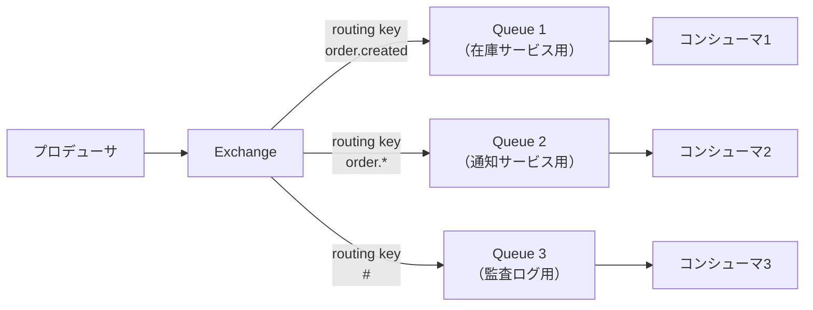

RabbitMQは「スマートブローカー、ダムコンシューマ」モデルを採用している。ブローカーがメッセージのルーティング、フィルタリング、配信確認を担い、コンシューマは受動的にメッセージを受け取る。Exchange のタイプ（Direct, Fanout, Topic, Headers）によって柔軟なルーティングが可能である。

**主な特徴：**
- 柔軟なルーティング（Exchange + Binding Key）
- メッセージの優先度キュー
- メッセージのTTL（Time to Live）
- Dead Letter Exchange（DLX）による障害処理
- プラグインによる拡張性（Shovel、Federation など）

### 4.3 Apache Pulsar

Apache Pulsarは、Yahoo!で開発され2018年にApache トップレベルプロジェクトとなった分散メッセージングプラットフォームである。KafkaとRabbitMQの長所を統合することを目指して設計された。

**アーキテクチャの特徴：**

Pulsarの最大の特徴は、**コンピュートとストレージの分離**である。メッセージの処理（ブローカー）とメッセージの永続化（Apache BookKeeper）が独立してスケールできる。

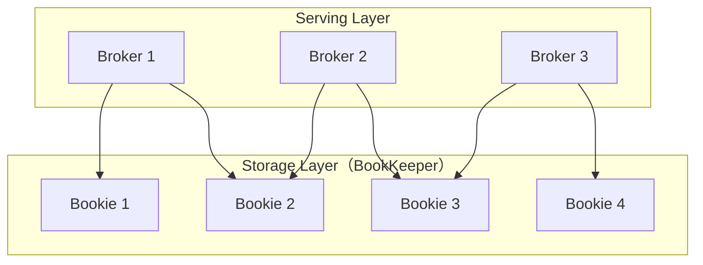

**主な特徴：**
- コンピュートとストレージの分離による柔軟なスケーリング
- マルチテナント対応（ネームスペースによる分離）
- 地理的レプリケーション（Geo-Replication）のネイティブサポート
- キューイングとストリーミングの両方のセマンティクスをサポート
- Tiered Storage（古いメッセージをS3等に退避）

### 4.4 比較表

| 特性 | Apache Kafka | RabbitMQ | Apache Pulsar |
|------|-------------|----------|---------------|
| 設計思想 | 分散ログ | メッセージキュー | 統合型メッセージング |
| スループット | 非常に高い | 中程度 | 高い |
| レイテンシ | 中程度（バッチ処理） | 低い | 低い |
| メッセージ保持 | 設定期間（永続可能） | 消費後に削除 | 設定期間（Tiered Storage） |
| ルーティング | パーティションキーのみ | 柔軟（Exchange） | パーティション + ルーティング |
| 順序保証 | パーティション内 | キュー内 | パーティション内 |
| マルチテナント | 制限的 | vhost | ネイティブサポート |
| 実装言語 | Java/Scala | Erlang | Java |
| エコシステム | 非常に成熟 | 成熟 | 成長中 |

::: tip 選定の指針
- **Kafka**: 大量のイベントストリーミング、イベントソーシング、ログ集約。イベントの再読み取りが必要な場合
- **RabbitMQ**: タスクキュー、複雑なルーティング、低レイテンシが求められるリクエスト/リプライパターン
- **Pulsar**: マルチテナント環境、地理的分散、キューイングとストリーミングの両方が必要な場合
:::

## 5. 設計上の考慮点 — 順序保証、冪等性、スキーマ進化

### 5.1 順序保証

イベント駆動アーキテクチャにおいて、イベントの処理順序は最も頭を悩ませる問題の一つである。

**グローバルな順序保証は現実的でない。** 分散システムでは、異なるパーティションやノードに分散されたイベントの間でグローバルな全順序を保証することは、極めてコストが高いか不可能である。

実践的なアプローチは**パーティション内の順序保証**である。同じエンティティに関連するイベントを同じパーティションに送信する（パーティションキーにエンティティIDを使用する）ことで、そのエンティティに関する順序は保証される。

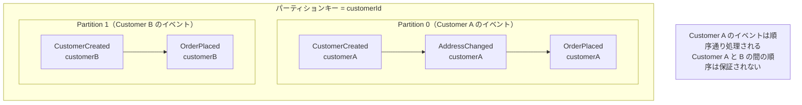

::: warning 順序保証とスケーラビリティのトレードオフ
パーティション数を増やすとスループットは向上するが、同じキーのイベントが同一パーティションに収まることは変わらない。特定のキー（例：人気商品のID）にイベントが集中するホットパーティション問題が発生し得る。
:::

### 5.2 冪等性（Idempotency）

分散システムでは、ネットワーク障害やリトライにより、同じイベントが複数回配信される可能性がある。**At-least-once delivery**（少なくとも1回の配信）を前提として、コンシューマを冪等に設計することが重要である。

冪等性とは、同じ操作を何回実行しても結果が変わらない性質である。例えば、「残高を1000円に設定する」は冪等だが、「残高に1000円を加算する」は冪等ではない。

**冪等性を実現する主な手法：**

**1. イベントIDによる重複排除**

```python
class IdempotentEventHandler:
    def __init__(self, db):
        self.db = db

    def handle(self, event):
        """Process an event idempotently using event ID deduplication."""
        event_id = event["eventId"]

        # Check if this event has already been processed
        if self.db.exists("processed_events", event_id):
            return  # Already processed, skip

        # Process the event within a transaction
        with self.db.transaction():
            self._process_event(event)
            # Record that this event has been processed
            self.db.insert("processed_events", {
                "event_id": event_id,
                "processed_at": datetime.utcnow()
            })
```

**2. 冪等なオペレーションの設計**

操作自体を冪等に設計する。「加算する」ではなく「設定する」、「作成する」ではなく「存在しなければ作成する（upsert）」のように設計する。

**3. バージョンによる楽観的ロック**

エンティティにバージョン番号を持たせ、更新時にバージョンが一致する場合のみ処理を実行する。

### 5.3 スキーマ進化

長期間運用されるイベント駆動システムでは、イベントのスキーマが変更される場面が必ず訪れる。Event Sourcingでは過去のイベントを再生する必要があるため、スキーマの互換性管理は特に重要である。

**互換性の種類：**

| 互換性タイプ | 意味 | 例 |
|-------------|------|-----|
| 後方互換（Backward） | 新しいコンシューマが古いイベントを読める | フィールドの追加（デフォルト値あり） |
| 前方互換（Forward） | 古いコンシューマが新しいイベントを読める | フィールドの追加（未知フィールド無視） |
| 完全互換（Full） | 後方互換 + 前方互換 | オプショナルフィールドの追加 |

::: tip Apache Avro と Schema Registry
Kafkaエコシステムでは、Apache AvroとSchema Registryを組み合わせることで、スキーマの互換性を自動的に検証できる。プロデューサがイベントを発行する際にスキーマの互換性チェックが行われ、互換性を壊す変更は拒否される。
:::

**安全なスキーマ変更のルール：**
1. 新しいフィールドはオプショナルにし、デフォルト値を設定する
2. 既存のフィールドを削除しない（非推奨にはできる）
3. フィールドの型を変更しない
4. 必須フィールドをオプショナルにするのは安全だが、逆は安全ではない

## 6. イベントの設計 — イベント命名、スキーマ設計、バージョニング

### 6.1 イベント命名規則

イベントの名前は、システム全体のコミュニケーションの基盤となる。以下の規則を推奨する：

**過去形で命名する**：イベントは「すでに起こったこと」であるため、過去形を使用する。

```
✅ OrderCreated, PaymentProcessed, ItemShipped
❌ CreateOrder, ProcessPayment, ShipItem（これはコマンド）
```

**ドメイン固有の語彙を使う**：技術的な名前ではなく、ビジネスドメインの言葉を使用する。

```
✅ OrderCancelled, RefundIssued
❌ DatabaseRowDeleted, HttpPostSent
```

**適切な粒度を選ぶ**：粗すぎるイベント（`OrderUpdated`）は何が変わったか不明であり、細かすぎるイベント（`OrderShippingAddressLine1Changed`）は実用的でない。

```
✅ OrderShippingAddressChanged
❌ OrderUpdated（何が更新されたか不明）
❌ OrderShippingAddressPostalCodeChanged（粒度が細かすぎる）
```

### 6.2 Thin Event vs Fat Event

イベントに含めるデータ量の設計判断は、アーキテクチャ全体に大きな影響を与える。

**Thin Event（薄いイベント）：**

```json
{
  "eventType": "OrderCreated",
  "data": {
    "orderId": "ORD-001"
  }
}
```

最小限の識別情報のみ。詳細はプロデューサに問い合わせる。イベント通知パターンで使用される。

**Fat Event（厚いイベント）：**

```json
{
  "eventType": "OrderCreated",
  "data": {
    "orderId": "ORD-001",
    "customerId": "CUST-42",
    "customerName": "山田太郎",
    "items": [
      {
        "productId": "PROD-100",
        "productName": "ワイヤレスマウス",
        "quantity": 2,
        "unitPrice": 1500
      }
    ],
    "totalAmount": 3000,
    "shippingAddress": {
      "postalCode": "150-0001",
      "city": "渋谷区",
      "street": "神宮前1-2-3"
    },
    "paymentMethod": "credit_card"
  }
}
```

必要な情報をすべて含む。Event-Carried State Transferパターンで使用される。

どちらを選ぶかはトレードオフであり、一般的にはFat Eventが推奨される。理由は以下の通り：

- コンシューマの独立性が高まる（他サービスへの問い合わせが不要）
- ネットワーク呼び出しの総数が減る
- イベントの再生や遡及分析が容易

ただし、Fat Eventにはセキュリティ上の懸念もある。個人情報（PII）を含むイベントは、本来その情報にアクセスすべきでないサービスにまで配信される可能性がある。

### 6.3 イベントのバージョニング

イベントスキーマは時間とともに進化する。バージョニング戦略を事前に定めておくことが重要である。

**方法1：スキーマバージョンをメタデータに含める**

```json
{
  "eventType": "OrderCreated",
  "schemaVersion": "2.0.0",
  "data": { ... }
}
```

コンシューマはバージョンに応じて処理を分岐する。セマンティックバージョニング（SemVer）を適用すると、メジャーバージョンの変更は後方互換性のない変更を意味する。

**方法2：イベントタイプ名にバージョンを含める**

```
OrderCreated.v1
OrderCreated.v2
```

異なるバージョンを異なるトピック/キューで配信する。旧バージョンのコンシューマと新バージョンのコンシューマが共存できる。

**方法3：アップキャスター（Upcaster）**

Event Sourcingにおいて、古いバージョンのイベントを新しいバージョンに変換するコンポーネントを設ける。

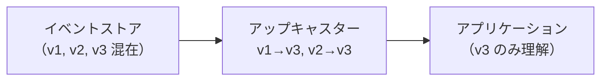

## 7. 障害処理 — Dead Letter Queue, リトライ戦略, 補償トランザクション

### 7.1 障害の種類

イベント処理における障害は、大きく二つに分類できる：

- **一時的障害（Transient Failure）**：ネットワークタイムアウト、データベースの一時的な過負荷など。リトライで解決する可能性が高い
- **恒久的障害（Permanent Failure）**：スキーマ不一致、ビジネスルール違反、バグなど。リトライしても解決しない

この区別は重要である。一時的障害にはリトライが有効だが、恒久的障害にリトライしても無駄にリソースを消費するだけである。

### 7.2 リトライ戦略

**即時リトライ**は一時的なネットワークの問題には有効だが、相手サービスが過負荷の場合は状況を悪化させる。推奨されるのは**指数バックオフ（Exponential Backoff）**にジッター（ランダムな揺らぎ）を加えた戦略である。

```python
import random
import time

def retry_with_exponential_backoff(func, max_retries=5, base_delay=1.0):
    """
    Retry a function with exponential backoff and jitter.

    Args:
        func: The function to retry
        max_retries: Maximum number of retry attempts
        base_delay: Base delay in seconds
    """
    for attempt in range(max_retries):
        try:
            return func()
        except TransientError as e:
            if attempt == max_retries - 1:
                raise  # Final attempt failed, propagate the error

            # Exponential backoff with full jitter
            max_delay = base_delay * (2 ** attempt)
            delay = random.uniform(0, max_delay)
            time.sleep(delay)
        except PermanentError:
            raise  # No point retrying permanent errors
```

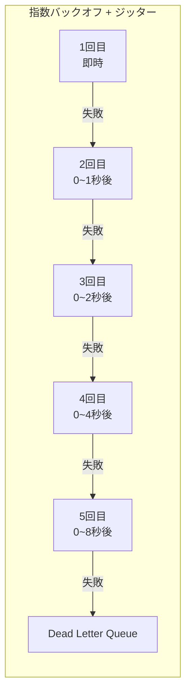

::: warning Thundering Herd問題
ジッターを加えない指数バックオフでは、多数のクライアントが同じタイミングでリトライを行い、サーバーに一斉にリクエストが殺到する**Thundering Herd問題**が発生する。ジッター（ランダムな遅延）を加えることで、リトライのタイミングが分散される。
:::

### 7.3 Dead Letter Queue（DLQ）

リトライを繰り返しても処理できないメッセージは、**Dead Letter Queue（DLQ）**に退避する。DLQは「処理不能メッセージの墓場」であり、人間の介入を待つメッセージが格納される。

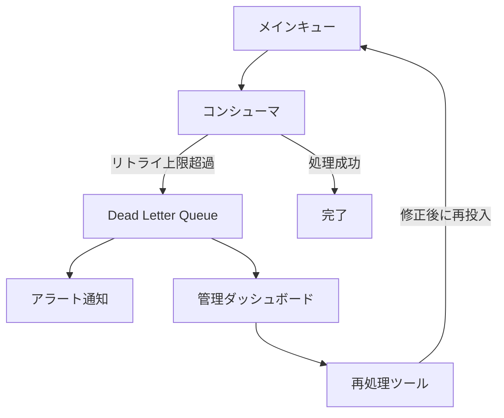

DLQの運用において重要なのは：

1. **監視とアラート**：DLQにメッセージが溜まったら即座にアラートを発報する
2. **原因の記録**：なぜ処理に失敗したかの情報（エラーメッセージ、スタックトレース、リトライ回数）をメッセージに付与する
3. **再処理の手段**：原因を修正した後に、DLQのメッセージをメインキューに戻す仕組みを用意する
4. **保持期間**：DLQのメッセージにも有効期限を設定し、無限に溜まり続けないようにする

### 7.4 補償トランザクション（Saga パターン）

分散システムでは、複数のサービスにまたがるトランザクションを従来の2相コミット（2PC）で管理するのは現実的でない。代わりに、**Sagaパターン**による補償トランザクションを使用する。

Sagaは、一連のローカルトランザクションの連鎖であり、途中のステップが失敗した場合は、それまで完了したステップの補償（undo）操作を逆順に実行する。

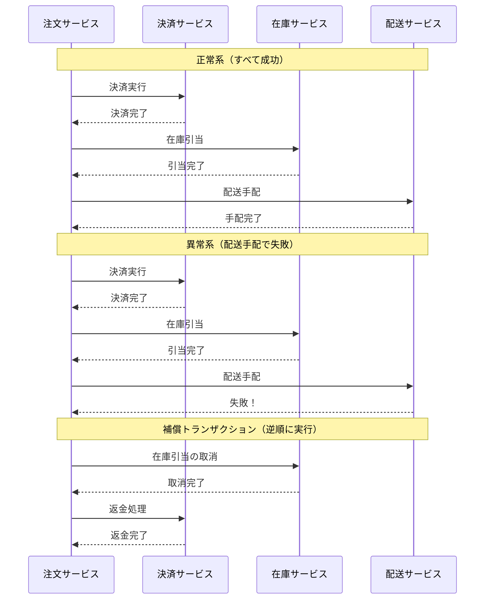

Sagaの実装方式には二つある：

**コレオグラフィ（Choreography）**：各サービスが自律的にイベントを発行・消費し、中央のコーディネーターなしに連携する。シンプルだが、全体の流れを把握しにくい。

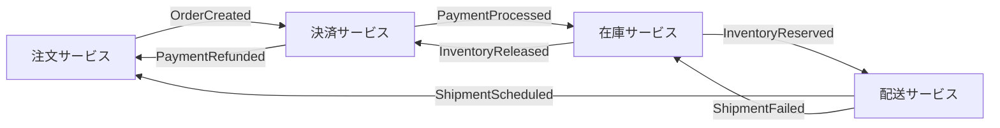

**オーケストレーション（Orchestration）**：中央のSagaオーケストレーターが全体の流れを制御する。可視性が高いが、オーケストレーターが単一障害点になり得る。

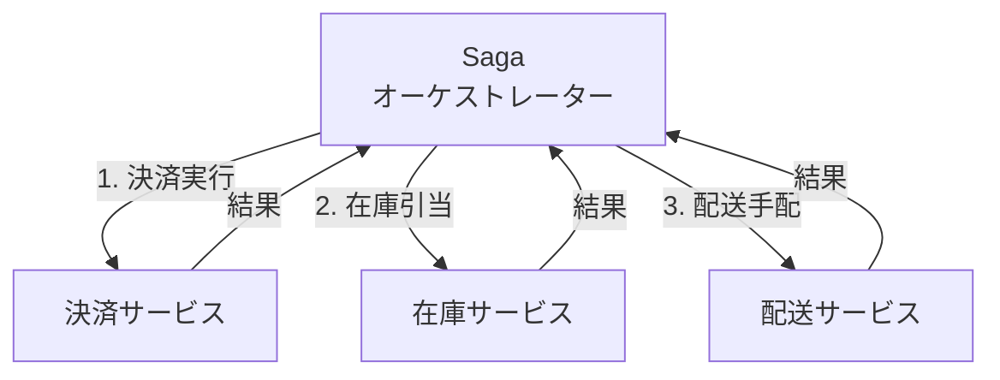

::: details コレオグラフィ vs オーケストレーション：どちらを選ぶか
- **コレオグラフィ**が適する場合：サービス数が少ない（3~4程度）、フローが単純、各サービスチームの自律性を重視
- **オーケストレーション**が適する場合：サービス数が多い、フローが複雑で条件分岐が多い、全体の可視性が重要
- 実務では、単純なフローにはコレオグラフィ、複雑なビジネスプロセスにはオーケストレーションを使い分けることが多い
:::

## 8. メリット・デメリット

### 8.1 メリット

**疎結合（Loose Coupling）**

イベント駆動アーキテクチャの最大のメリットである。プロデューサはコンシューマの存在を知らず、コンシューマの追加・削除がプロデューサに影響しない。これにより、各サービスの独立した開発・デプロイ・スケーリングが可能になる。

**スケーラビリティ**

イベントの処理は非同期であるため、負荷のピーク時にメッセージブローカーがバッファとして機能する。コンシューマは自身の処理能力に応じてイベントを消費でき、一時的なスパイクに耐えられる。また、コンシューマのインスタンス数を増やすことで水平スケーリングが容易である。

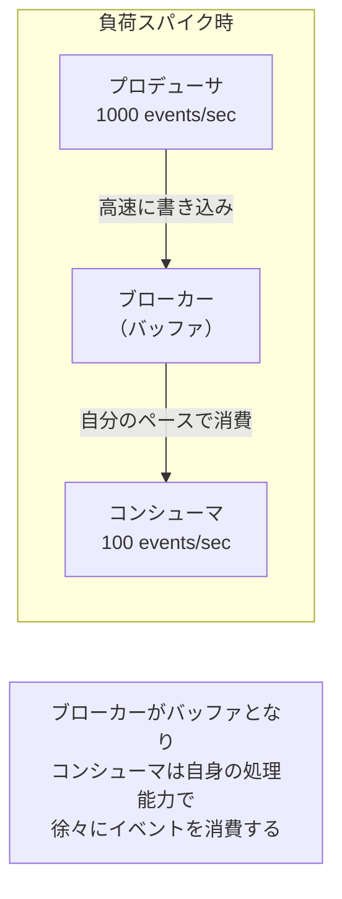

**回復力（Resilience）**

あるサービスがダウンしても、メッセージブローカーにイベントが保持されるため、復旧後に未処理のイベントから処理を再開できる。また、サービス間が同期的に依存していないため、一つのサービスの障害がシステム全体に波及しにくい。

**拡張性**

新しいコンシューマを追加するだけで、既存のイベントに対する新しい処理を追加できる。例えば、既存の注文処理フローに「不正検知サービス」を追加する場合、`OrderCreated` イベントを購読するコンシューマを追加するだけでよい。既存のコードは一切変更不要である。

**監査とデバッグ**

イベントがすべて記録されているため、「いつ、何が、なぜ起こったか」を後から追跡できる。特にEvent Sourcingでは完全な履歴が保存されるため、問題発生時のデバッグが容易になる。

### 8.2 デメリット

**複雑さの増大**

イベント駆動アーキテクチャは、同期的なリクエスト/レスポンスモデルと比較して、理解・デバッグ・テストが格段に難しくなる。イベントの流れを追跡するには分散トレーシング（Jaeger、Zipkin など）が不可欠であり、ローカルでの再現テストも工夫が必要である。

**結果整合性**

データの一貫性が即座には保証されず、**結果整合性（Eventual Consistency）**に依存する。例えば、注文が作成された直後に注文一覧を照会しても、まだ反映されていない可能性がある。これはユーザー体験の設計にも影響する。

**イベントの順序と重複**

前述の通り、グローバルな順序保証は困難であり、重複配信も発生し得る。コンシューマ側での順序処理と冪等性の担保は、開発者に追加の負担を強いる。

**運用の複雑さ**

メッセージブローカーのクラスタ管理、パーティションの設計、コンシューマグループの管理、DLQの監視、スキーマレジストリの運用など、インフラの運用負荷が増加する。特にKafkaクラスタの運用は、ZooKeeper（またはKRaft）の管理を含めて専門的な知識が必要である。

**デバッグの困難さ**

非同期処理のため、「リクエストを送ったら即座にレスポンスが返る」というシンプルなデバッグモデルが使えない。問題の原因がプロデューサにあるのか、ブローカーにあるのか、コンシューマにあるのかを切り分けるのは容易ではない。

::: danger データ消失のリスク
メッセージブローカーの設定ミス（レプリケーション不足、ACKの設定ミスなど）により、イベントが消失するリスクがある。イベント駆動アーキテクチャでは、イベントが唯一の通信手段であるため、イベントの消失はデータの消失を意味する。ブローカーの信頼性設定を慎重に行い、十分にテストすることが不可欠である。
:::

## 9. 適用が有効なケースと避けるべきケース

### 9.1 適用が有効なケース

**複数のサービスが同じイベントに反応する必要がある場合**

ECサイトで注文が作成されたとき、在庫の引当、決済処理、通知送信、分析データの更新、不正検知など、複数の独立した処理が必要になる。同期的に順番に呼び出すのではなく、一つのイベントを発行して各サービスが並行処理する方が効率的で柔軟である。

**負荷の変動が大きいシステム**

ECサイトのセール時や、チケット予約の開始時など、突発的な負荷スパイクが発生するシステム。メッセージブローカーがバッファとなり、バックエンドサービスは自身の処理能力に応じてイベントを消費できる。

**監査・コンプライアンス要件がある場合**

金融システムや医療システムなど、すべての操作の完全な履歴が求められる場合。Event Sourcingにより、監査ログが自然に構築される。

**異なるチームが独立して開発するシステム**

大規模な組織で、異なるチームがそれぞれのマイクロサービスを独立して開発・デプロイする場合。イベント駆動の疎結合により、チーム間の調整コストが低減される。

**リアルタイムデータパイプライン**

IoTデバイスからのセンサーデータ、ユーザーの行動ログ、リアルタイム分析など、大量のデータを連続的に処理するパイプライン。

### 9.2 避けるべきケース

**単純なCRUDアプリケーション**

小規模なWebアプリケーションやシンプルなバックオフィスツールなど、サービスの数が少なく、データモデルが単純な場合。イベント駆動アーキテクチャの複雑さがメリットを上回る。

**強い一貫性が必須の場合**

銀行の口座振替のように、「AからBへの送金」が一つの不可分なトランザクションとして成功/失敗しなければならない場合。結果整合性では対応できないシナリオには、従来のACIDトランザクションの方が適切である。

::: tip ただし、工夫次第で対応可能な場合もある
結果整合性でも、ユーザー体験を工夫することで対応できる場合がある。例えば、送金処理を「保留中」として即座に表示し、バックグラウンドで確定処理を行うアプローチは、多くの実際の金融サービスで採用されている。
:::

**低レイテンシが必須の同期処理**

ユーザーが操作の結果を即座に確認する必要がある場合（例：パスワードの変更後に即座にログインできる必要がある場合）。非同期処理の遅延がユーザー体験を損なうケースでは、同期的なリクエスト/レスポンスの方が適切である。

**チームの経験が不足している場合**

イベント駆動アーキテクチャの設計・運用には、分散システムに関する深い理解が必要である。チームがその経験を持っていない場合、まずは同期的なアーキテクチャから始め、必要に応じて段階的にイベント駆動に移行する方が賢明である。

### 9.3 判断フローチャート

```mermaid
graph TB
    Start["新しいサービス間連携の<br/>設計が必要"] --> Q1{"複数のサービスが<br/>同じ事象に反応する？"}
    Q1 -->|"はい"| Q2{"強い一貫性が<br/>必須か？"}
    Q1 -->|"いいえ"| Q3{"非同期処理が<br/>許容できるか？"}
    Q2 -->|"はい"| SYNC["同期的RPC +<br/>分散トランザクション"]
    Q2 -->|"いいえ"| EVENT["イベント駆動<br/>アーキテクチャ"]
    Q3 -->|"はい"| Q4{"負荷の変動が<br/>大きいか？"}
    Q3 -->|"いいえ"| SYNC
    Q4 -->|"はい"| EVENT
    Q4 -->|"いいえ"| EITHER["どちらでも可<br/>（チームの経験で判断）"]

    style EVENT fill:#66bb6a,stroke:#2e7d32,color:#fff
    style SYNC fill:#42a5f5,stroke:#1565c0,color:#fff
    style EITHER fill:#ffa726,stroke:#ef6c00,color:#fff
```

## 10. まとめ

イベント駆動アーキテクチャは、現代の分散システムにおける重要なアーキテクチャパターンである。その核心は、サービス間の通信を「コマンドの送信」から「事実の公開」に転換することにある。

**本記事で解説した主要なポイント：**

1. **リクエスト/レスポンスモデルの限界**：同期的な通信は時間的・空間的結合を生み、スケーラビリティと回復力を制限する

2. **基本概念**：イベントは過去の事実であり、プロデューサとコンシューマはメッセージブローカーを介して疎結合に連携する

3. **4つのパターン**：イベント通知、Event-Carried State Transfer、Event Sourcing、CQRSはそれぞれ異なる問題を解決する。適切なパターンの選択が重要である

4. **メッセージブローカー**：Kafka（大量ストリーミング）、RabbitMQ（柔軟なルーティング）、Pulsar（統合型）の特性を理解し、要件に応じて選定する

5. **設計上の考慮点**：順序保証はパーティション単位で行い、冪等性はコンシューマ側で担保し、スキーマの進化は互換性を維持しながら行う

6. **障害処理**：指数バックオフ+ジッターによるリトライ、Dead Letter Queue、Sagaパターンによる補償トランザクションが基本的な対策である

7. **適用判断**：複数サービスの連携、高スケーラビリティ、監査要件がある場合に有効であるが、単純なCRUDや強い一貫性が必須の場面では過剰な複雑さとなる

イベント駆動アーキテクチャの導入は、技術的な選択であると同時に組織的な選択でもある。疎結合なアーキテクチャは、疎結合な組織構造（コンウェイの法則）と相性がよい。逆に言えば、密結合な組織がイベント駆動アーキテクチャを採用しても、その恩恵を十分に受けることは難しい。

最後に、Martin Fowlerの助言を引用しておく：

> "The first rule of distributed systems: Don't distribute."（分散システムの第一法則：分散するな）

イベント駆動アーキテクチャは強力な道具だが、あらゆるシステムに適用すべきではない。**問題が存在してから解決策を適用する**というエンジニアリングの基本原則を忘れてはならない。まずは同期的でシンプルなアーキテクチャから始め、具体的な課題に直面したときに、段階的にイベント駆動を導入する。それが最も現実的で堅実なアプローチである。
