# イベントループの内部設計（libuv, tokio, Netty）

## 1. イベントループモデルの基本概念

### 1.1 なぜイベントループが必要なのか

ネットワークサーバーの設計において最も根本的な問いは「同時に多数のクライアントからの接続をどう処理するか」である。この問いに対する古典的な回答は**thread-per-connection モデル** -- 接続ごとにスレッドを割り当て、各スレッドがブロッキングI/Oで読み書きを行う方式 -- であった。Apache HTTP Server の prefork/worker MPM はこの代表例である。

しかし、このモデルには本質的なスケーラビリティの壁が存在する。

| 問題 | 具体的な影響 |
|---|---|
| **メモリ消費** | 各スレッドのスタック（通常 1〜8 MB）× 接続数でメモリが枯渇する |
| **コンテキストスイッチ** | OS スケジューラがスレッド間を切り替えるたびに TLB フラッシュやキャッシュ汚染が発生する |
| **スケジューラ負荷** | 数万スレッドの管理自体が CPU 時間を消費する |
| **C10K 問題** | 1 万同時接続を超えるとスレッドベースのモデルでは性能が急激に劣化する |

1999 年に Dan Kegel が提起した **C10K 問題** は、この限界を鮮明にした。そしてその解決策として浮上したのが、少数のスレッド（多くの場合シングルスレッド）で大量の I/O を効率的に多重化する**イベントループモデル**である。

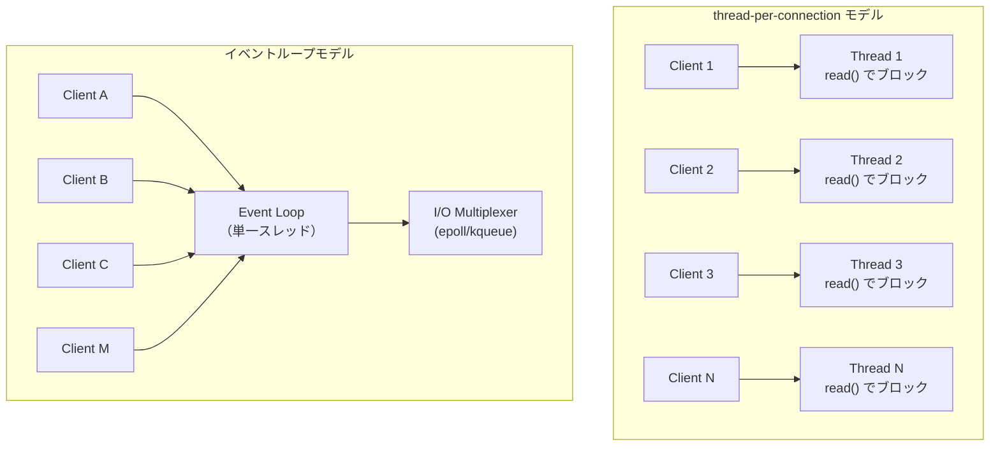

### 1.2 イベントループの基本構造

イベントループの核心は、「**I/O の準備ができたものだけを処理する**」という原則にある。ブロッキング I/O がデータの到着を受動的に待つのに対し、イベントループは OS のI/O 多重化機構（epoll, kqueue, IOCP など）を使って、準備完了した fd を能動的に検出し、対応するコールバックを実行する。

概念的には、あらゆるイベントループは以下の疑似コードに集約される。

```c
// Simplified event loop pseudo-code
while (running) {
    // 1. Calculate timeout for next timer
    timeout = calculate_next_timer_timeout();

    // 2. Block until I/O events arrive or timeout expires
    events = io_poll(epoll_fd, timeout);

    // 3. Process ready I/O events
    for (event in events) {
        dispatch_callback(event);
    }

    // 4. Execute expired timers
    process_expired_timers();

    // 5. Run deferred / microtask callbacks
    process_deferred_callbacks();
}
```

このループの各ステップは実装によって名称やフェーズの区分が異なるが、本質的な構造はすべてのイベントループランタイムに共通している。

### 1.3 イベント駆動の設計哲学

イベントループモデルの背後にある設計哲学は、**「CPU がアイドル状態で待機する時間を最小化する」** ことに尽きる。ネットワークサーバーにおいて最大のボトルネックは CPU の計算能力ではなく I/O のレイテンシである。1 つの read() 呼び出しが返るまでの数ミリ秒の間に、CPU は数百万命令を実行できる。

イベントループはこの非対称性を活用し、I/O 待ちの間に他のタスクを処理することでスループットを最大化する。これはいわば**協調的マルチタスク**であり、OS のプリエンプティブなスレッドスケジューリングに依存せず、アプリケーションレベルでタスクの切り替えを制御する。

::: tip イベントループとコルーチン
イベントループは「いつタスクを切り替えるか」を制御する**スケジューラ**であり、コルーチン（async/await）は「どこでタスクを中断・再開するか」を表現する**プログラミング抽象**である。両者は密接に関連しているが、独立した概念である。
:::

## 2. libuv の設計と実装

### 2.1 歴史的背景

libuv は、Node.js のために開発されたクロスプラットフォームの非同期 I/O ライブラリである。Node.js の初期バージョン（2009年）では、Linux 向けには libev、Windows 向けには IOCP を直接利用していた。しかし、プラットフォーム間の抽象化レイヤーとして 2011 年に libuv が誕生し、以降 Node.js のイベントループの心臓部として機能している。

libuv は Node.js 以外にも、Neovim、Julia、Luvit など多くのプロジェクトで採用されている。C 言語で書かれており、API は明快でポータブルである。

### 2.2 イベントループのフェーズ

libuv のイベントループは、**7つのフェーズ**を順番に巡回する構造を持つ。各フェーズには固有のキューがあり、そのフェーズに対応するコールバックだけが実行される。

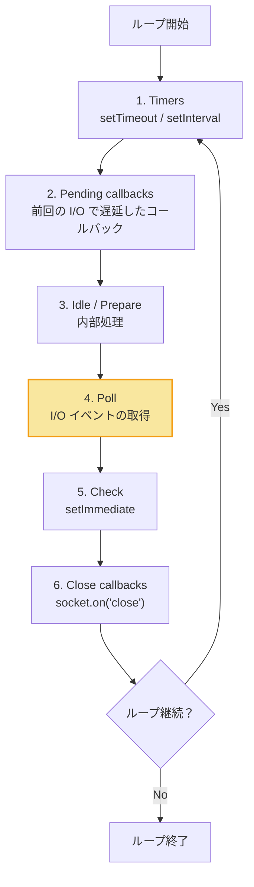

各フェーズの詳細を順に見ていく。

**1. Timers フェーズ**

`setTimeout()` と `setInterval()` で登録されたコールバックのうち、指定した遅延時間が経過したものを実行する。libuv 内部ではタイマーを**最小ヒープ（min-heap）** で管理しており、最も早く期限が到来するタイマーを O(1) で取得し、挿入・削除を O(log n) で処理する。

::: warning タイマーの精度
タイマーは「指定時間が経過した後、最も早い機会に」実行されるものであり、正確にその時刻に実行されることを保証しない。Poll フェーズでのブロック時間や、他のコールバックの実行時間によって遅延が生じる。
:::

**2. Pending callbacks フェーズ**

前回のループ反復で実行が延期された I/O コールバックを処理する。たとえば、TCP ソケットの接続時に `ECONNREFUSED` を受け取った場合、そのエラーコールバックはこのフェーズで実行される。

**3. Idle / Prepare フェーズ**

libuv が内部的に使用するフェーズで、Poll フェーズの直前に毎回実行される。アプリケーションが直接このフェーズを利用することは稀である。

**4. Poll フェーズ**

イベントループの中核である。このフェーズでは、新しい I/O イベントを取得し、関連するコールバックを実行する。Linux では `epoll_wait()`、macOS/BSD では `kevent()`、Windows では `GetQueuedCompletionStatusEx()` が呼ばれる。

Poll フェーズの動作は以下のように決定される。

```
Poll フェーズの動作決定ロジック：

1. Poll キューが空でない場合:
   → キュー内のコールバックを同期的に順次実行する
   → キューが空になるか、システムのハードリミットに達するまで続ける

2. Poll キューが空の場合:
   a. setImmediate() のコールバックがスケジュールされている場合:
      → Poll フェーズを終了し、Check フェーズへ進む
   b. setImmediate() のコールバックがない場合:
      → 次のタイマーの期限まで epoll_wait() でブロックする
      → I/O イベントが到着したら即座にコールバックを実行する
```

**5. Check フェーズ**

`setImmediate()` で登録されたコールバックを実行する。このフェーズは Poll フェーズの直後に実行されるため、I/O コールバックの後に確実に実行したいコードを登録するのに適している。

**6. Close callbacks フェーズ**

`socket.destroy()` などで閉じられたハンドルの `'close'` イベントコールバックを実行する。

### 2.3 スレッドプールとの連携

libuv のイベントループはシングルスレッドで動作するが、すべての操作がノンブロッキングで実行できるわけではない。特に以下の操作はOS レベルでのノンブロッキング API が存在しないか、使いにくい場合がある。

- ファイルシステム操作（`fs.readFile()` など）
- DNS 名前解決（`dns.lookup()`）
- 一部の暗号処理
- zlib 圧縮

これらの操作のために、libuv は内部に**スレッドプール**を持っている。デフォルトのプールサイズは 4 スレッドで、環境変数 `UV_THREADPOOL_SIZE` で最大 1024 まで変更できる。

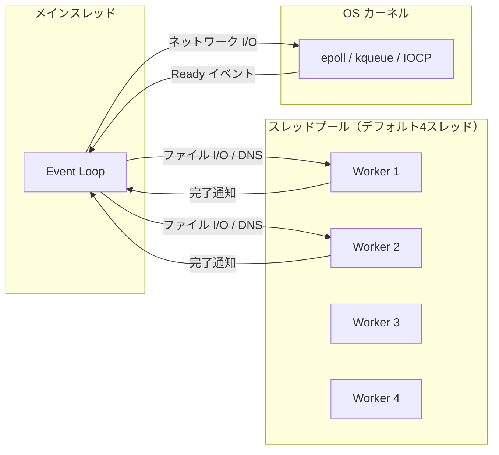

::: warning スレッドプールの飽和
スレッドプールが飽和すると（全スレッドがビジーな状態）、新しいファイル I/O や DNS リクエストはキューに積まれ、完了まで大幅な遅延が生じる。Node.js アプリケーションでファイル操作を多用する場合、`UV_THREADPOOL_SIZE` の調整が重要になる。
:::

### 2.4 Node.js における microtask の位置づけ

Node.js のイベントループには、libuv のフェーズに加えて**microtask キュー**が存在する。`Promise.then()` や `queueMicrotask()` で登録されたコールバックは、このキューに入る。

microtask は libuv のフェーズ間ではなく、**各フェーズ内でコールバックが1つ実行されるたびに**処理される。つまり、microtask は最も優先度が高い。

```javascript
// Execution order demonstration
setTimeout(() => console.log('1: setTimeout'), 0);         // Timers phase
setImmediate(() => console.log('2: setImmediate'));         // Check phase
Promise.resolve().then(() => console.log('3: Promise'));    // Microtask
process.nextTick(() => console.log('4: nextTick'));         // Microtask (even higher priority)
console.log('5: synchronous');                             // Synchronous

// Output:
// 5: synchronous
// 4: nextTick
// 3: Promise
// 1: setTimeout  (or 2: setImmediate - order is non-deterministic at top level)
// 2: setImmediate (or 1: setTimeout)
```

`process.nextTick()` は microtask の中でもさらに優先度が高く、Promise よりも先に実行される。ただし、`nextTick` を再帰的に呼び出すと I/O が永遠に処理されない「starvation」が発生するため、注意が必要である。

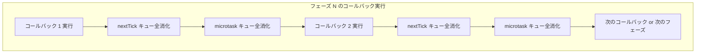

### 2.5 libuv のハンドルとリクエスト

libuv の API は**ハンドル（handle）** と**リクエスト（request）** という2つの抽象概念を中心に構成されている。

- **ハンドル**: 長寿命のオブジェクトで、アクティブな間は繰り返しコールバックを発火する。TCP ソケット（`uv_tcp_t`）、タイマー（`uv_timer_t`）、シグナル（`uv_signal_t`）などが該当する。ハンドルが1つでもアクティブであれば、イベントループは終了しない。
- **リクエスト**: 短寿命のオブジェクトで、1回限りの操作を表す。ファイル書き込み（`uv_write_t`）、DNS 解決（`uv_getaddrinfo_t`）などが該当する。

```c
// Example: creating a TCP server with libuv
uv_tcp_t server;
uv_tcp_init(loop, &server);

struct sockaddr_in addr;
uv_ip4_addr("0.0.0.0", 8080, &addr);
uv_tcp_bind(&server, (const struct sockaddr*)&addr, 0);

// Start listening - the callback fires for each new connection
int r = uv_listen((uv_stream_t*)&server, 128, on_new_connection);
```

## 3. tokio の設計と実装

### 3.1 Rust の非同期モデル

tokio を理解するには、まず Rust の非同期モデルの特徴を把握する必要がある。Rust の非同期は以下の3つの要素で構成される。

1. **`Future` トレイト**: 非同期計算を表す抽象。`poll()` メソッドを持ち、`Poll::Ready(value)` または `Poll::Pending` を返す。
2. **`async`/`await` 構文**: Future を合成するための構文糖衣。コンパイラが `async fn` をステートマシンに変換する。
3. **ランタイム**: Future を実際に駆動するスケジューラ。標準ライブラリには含まれず、tokio やasync-std などの外部クレートとして提供される。

Rust の Future は**遅延評価（lazy）** であり、ランタイムが `poll()` を呼ぶまで一切の処理を行わない点が、JavaScript の Promise（即時実行）と根本的に異なる。

```rust
use std::future::Future;
use std::pin::Pin;
use std::task::{Context, Poll};

// A simplified Future that resolves after being polled twice
struct CountdownFuture {
    remaining: u32,
}

impl Future for CountdownFuture {
    type Output = String;

    fn poll(mut self: Pin<&mut Self>, cx: &mut Context<'_>) -> Poll<Self::Output> {
        if self.remaining == 0 {
            Poll::Ready("done!".to_string())
        } else {
            self.remaining -= 1;
            cx.waker().wake_by_ref(); // Schedule re-poll
            Poll::Pending
        }
    }
}
```

### 3.2 tokio のアーキテクチャ

tokio は Rust エコシステムにおける事実上の標準非同期ランタイムである。その内部は複数のコンポーネントから構成される。

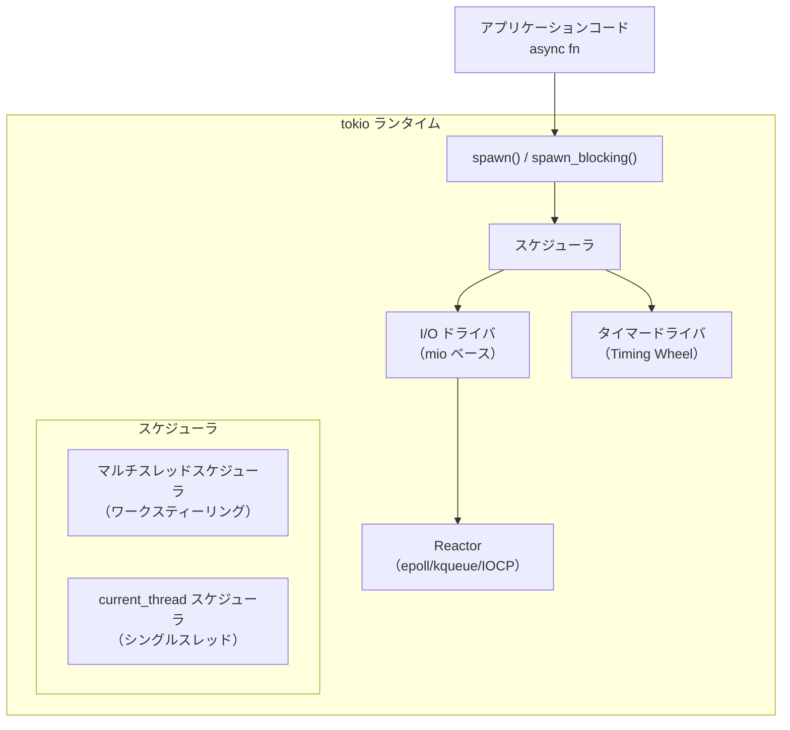

主要なコンポーネントは以下の通りである。

- **スケジューラ**: タスク（`JoinHandle<T>` で表現される軽量グリーンスレッド）のスケジューリングを担う
- **I/O ドライバ**: mio クレートを使い、OS のI/O 多重化機構と連携する
- **タイマードライバ**: `tokio::time::sleep()` などのタイマー操作を管理する
- **ブロッキングプール**: `spawn_blocking()` で起動される、CPU バウンドまたはブロッキング操作用のスレッドプール

### 3.3 ワークスティーリングスケジューラ

tokio のマルチスレッドスケジューラの最大の特徴は**ワークスティーリング（work-stealing）** アルゴリズムの採用である。これは、各ワーカースレッドがローカルキューを持ち、自分のキューが空になったら他のスレッドのキューからタスクを「盗む」ことでロードバランシングを実現する手法である。

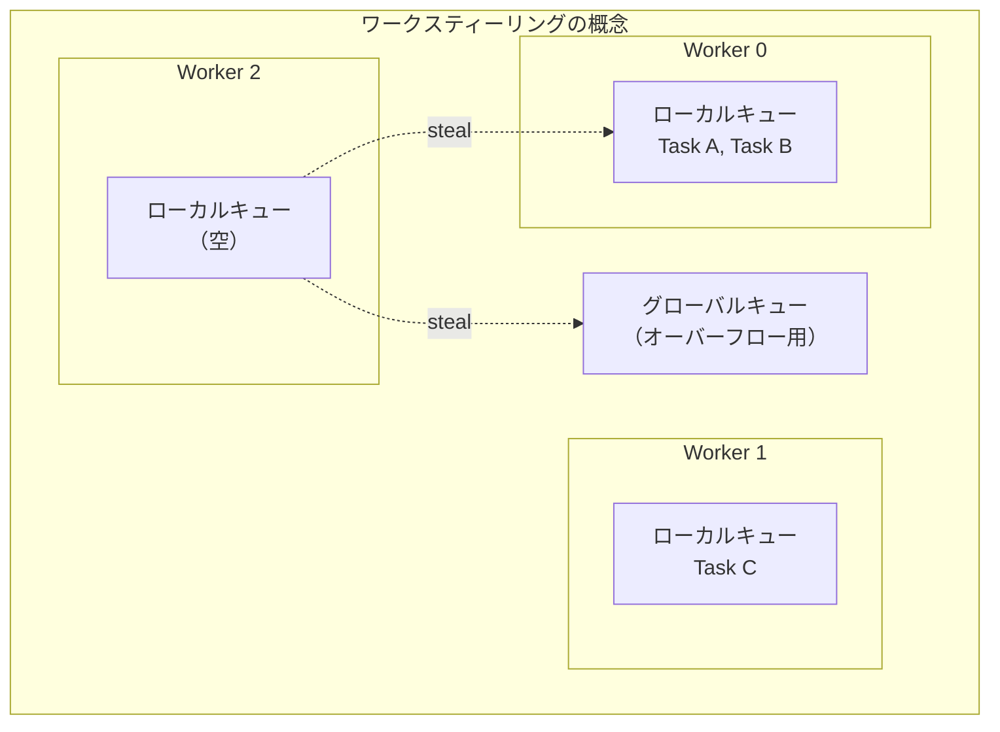

tokio のワークスティーリングの実装には以下の工夫が施されている。

**ローカルキュー（Local Run Queue）**

各ワーカースレッドは固定サイズ（256 スロット）のリングバッファとして実装されたローカルキューを持つ。新しいタスクは通常このキューに追加される。ローカルキューへのアクセスは所有スレッドからはロック不要であり、盗み手からのアクセスのみアトミック操作で同期される。

**グローバルキュー（Global Inject Queue）**

ローカルキューが満杯になった場合、タスクの半分がグローバルキューに移動される（batch migration）。また、外部スレッドから `spawn()` されたタスクもまずグローバルキューに入る。グローバルキューへのアクセスには Mutex が使用される。

**スティーリング手順**

ワーカースレッドが自分のローカルキューとグローバルキューの両方が空の場合、ランダムに選んだ他のワーカーのローカルキューからタスクの半分を盗む。これにより、タスクの偏りが自然に解消される。

```rust
// Simplified work-stealing loop (conceptual)
fn worker_loop(worker: &Worker) {
    loop {
        // 1. Try local queue first (no lock needed)
        if let Some(task) = worker.local_queue.pop() {
            task.run();
            continue;
        }

        // 2. Try global queue (requires lock)
        if let Some(task) = worker.shared.global_queue.pop() {
            task.run();
            continue;
        }

        // 3. Try stealing from another worker
        if let Some(task) = worker.steal_from_random_peer() {
            task.run();
            continue;
        }

        // 4. No work available - park the thread and wait for I/O
        worker.park();
    }
}
```

### 3.4 I/O ドライバと Reactor パターン

tokio の I/O ドライバは **Reactor パターン**を採用している。Reactor は OS の I/O 多重化機構をラップし、I/O の準備状態が変化したときに対応する Future を wake する役割を担う。

内部的には、mio クレートが epoll（Linux）/ kqueue（macOS）/ IOCP（Windows）を抽象化しており、tokio はその上に構築されている。

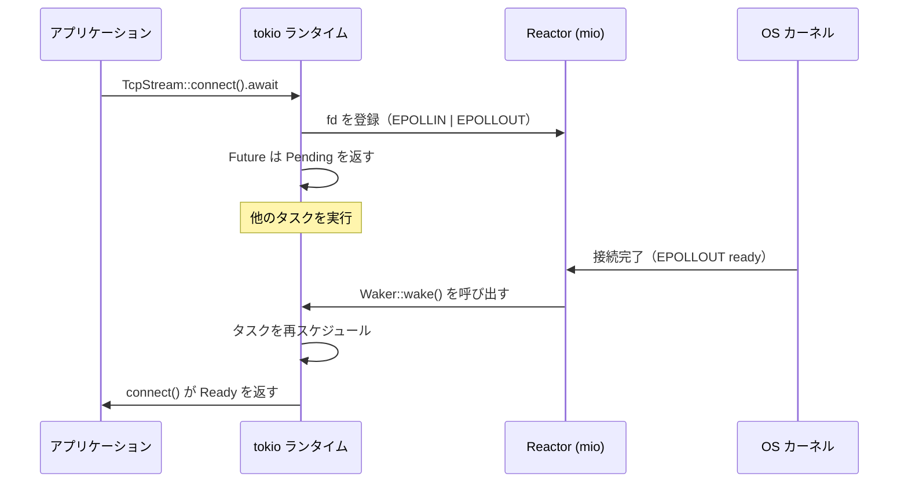

tokio の Reactor は「**readiness-based**」モデルを採用している。つまり、「I/O が準備完了した」という通知を受け取り、その後アプリケーションが実際の I/O 操作を行う。これは Windows の IOCP が採用する「completion-based」モデル（I/O 操作の完了を通知する）とは対照的である。

::: tip readiness vs completion
- **Readiness-based** (epoll/kqueue): 「読める準備ができた」→ アプリが read() を呼ぶ
- **Completion-based** (IOCP/io_uring): 「読み終わった」→ データがすでにバッファに入っている

Linux の io_uring は completion-based モデルであり、tokio も io_uring への対応を進めている（tokio-uring クレート）。
:::

### 3.5 タイマー管理：Timing Wheel

tokio のタイマーは **Hierarchical Timing Wheel** アルゴリズムで管理される。これは、タイマーを時間の精度に応じた複数の「ホイール」（配列）に分散して格納する手法である。

通常のヒープベースのタイマー管理では、挿入と削除に O(log n) のコストがかかるが、Timing Wheel では挿入は O(1) で行え、大量のタイマーを効率的に管理できる。

```
Timing Wheel の構造（概念図）:

Level 0: [0][1][2][3]...[63]     ← 1ms 精度、64スロット（0〜63ms）
Level 1: [0][1][2][3]...[63]     ← 64ms 精度（64ms〜4096ms）
Level 2: [0][1][2][3]...[63]     ← 4096ms 精度（4096ms〜約4分）
Level 3: [0][1][2][3]...[63]     ← 約4分精度（約4分〜約4時間）
Level 4: [0][1][2][3]...[63]     ← 約4時間精度（約4時間〜約11日）
Level 5: [0][1][2][3]...[63]     ← 約11日精度（約11日〜約2年）

挿入: O(1) — 適切なレベルとスロットを計算して直接挿入
期限到来: Level N のスロットが期限に達したら、
          その中のタイマーを Level N-1 に「降格」（cascade）する
```

### 3.6 spawn_blocking とブリッジング

非同期ランタイム内でブロッキング操作を直接実行すると、ワーカースレッドが停止し、他のタスクの進行が阻害される。tokio はこの問題に対して `spawn_blocking()` を提供する。

```rust
use tokio::task;

async fn process_request() {
    // CPU-intensive or blocking work should be offloaded
    let result = task::spawn_blocking(|| {
        // This runs on a dedicated blocking thread pool
        compute_heavy_hash()
    })
    .await
    .unwrap();

    // Back on the async runtime
    send_response(result).await;
}
```

`spawn_blocking()` は内部的に専用のスレッドプールを使用する。このプールのサイズはデフォルトで 512 スレッドまで拡張され、アイドルスレッドは 10 秒後に回収される。

::: danger ワーカースレッドでのブロッキング
tokio のワーカースレッド上でブロッキング操作（`std::thread::sleep()`、同期的なファイル I/O、Mutex のロック待ちなど）を行うと、そのワーカーが担当するすべてのタスクが停止する。必ず `spawn_blocking()` を使うか、専用の非同期 API（`tokio::fs`、`tokio::time::sleep()`）を使用すること。
:::

## 4. Netty の設計と実装

### 4.1 Java NIO の進化と Netty の誕生

Java における非同期 I/O の歴史は、JDK 1.4（2002年）で導入された **Java NIO（New I/O）** に始まる。NIO は `Selector`（内部的には epoll/kqueue を利用）を通じたノンブロッキング I/O を提供したが、API が低レベルで扱いにくく、バグを埋め込みやすかった。

Netty は 2004 年に Trustin Lee（韓国出身のエンジニア）によって開発が始まった、Java/JVM 向けの非同期イベント駆動ネットワークフレームワークである。Java NIO の複雑さを隠蔽しつつ、高性能で拡張可能な API を提供することを目的としている。

現在、Netty は以下のような広範なプロジェクトの基盤として採用されている。

- **gRPC** (Java 実装)
- **Apache Kafka** (ブローカー間通信)
- **Elasticsearch** (トランスポート層)
- **Spring WebFlux** (リアクティブ Web フレームワーク)
- **Vert.x** (ポリグロットリアクティブツールキット)
- **Play Framework** (Scala/Java Web フレームワーク)
- **Apache Cassandra** (クライアント通信)

### 4.2 EventLoopGroup と EventLoop

Netty の中核となるスレッドモデルは、**EventLoopGroup** と **EventLoop** の2層構造である。

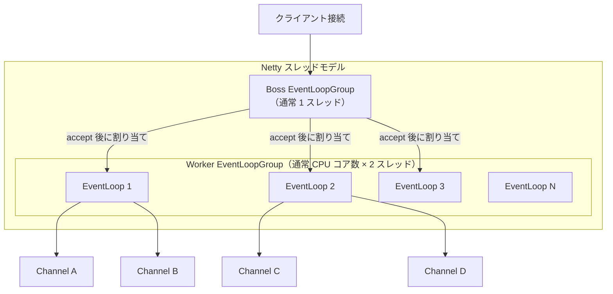

**Boss EventLoopGroup** は新しい接続の accept を担当する。通常は 1 スレッドで十分である（accept 操作は軽量なため）。新しい接続が確立されると、その Channel を Worker EventLoopGroup 内の EventLoop にラウンドロビンで割り当てる。

**Worker EventLoopGroup** は割り当てられた Channel の I/O 操作とイベント処理を担当する。デフォルトのスレッド数は `Runtime.getRuntime().availableProcessors() * 2` である。

各 **EventLoop** は以下の特性を持つ。

1. **1つの Selector に紐づく**: 各 EventLoop は自身の `java.nio.channels.Selector` を持ち、複数の Channel を多重化する
2. **1つのスレッドに紐づく**: EventLoop は生存期間を通じて同一のスレッドで実行される
3. **Channel との固定バインディング**: Channel は一度 EventLoop に割り当てられると、その Channel のライフタイム全体を通じて同じ EventLoop で処理される

この「Channel と EventLoop の固定バインディング」が Netty の設計における重要な決定である。これにより、1つの Channel に対する操作は常に同一スレッドで実行されるため、**Channel 単位ではロックが不要**になる。

```java
// Bootstrap configuration for a Netty server
EventLoopGroup bossGroup = new NioEventLoopGroup(1);
EventLoopGroup workerGroup = new NioEventLoopGroup(); // default: cores * 2

ServerBootstrap b = new ServerBootstrap();
b.group(bossGroup, workerGroup)
 .channel(NioServerSocketChannel.class)
 .option(ChannelOption.SO_BACKLOG, 128)
 .childHandler(new ChannelInitializer<SocketChannel>() {
     @Override
     public void initChannel(SocketChannel ch) {
         ch.pipeline().addLast(
             new HttpServerCodec(),
             new HttpObjectAggregator(65536),
             new MyBusinessHandler()
         );
     }
 });

ChannelFuture f = b.bind(8080).sync();
```

### 4.3 EventLoop の内部ループ

各 EventLoop のメインループは、以下の3つのステップを繰り返す。

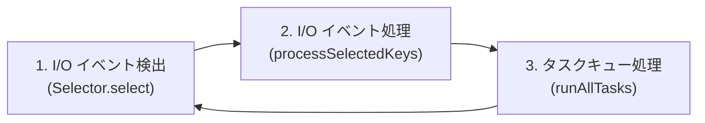

ここで重要なのが、**I/O 処理とタスク処理の時間配分**である。Netty は `ioRatio` パラメータ（デフォルト 50）により、I/O 処理とタスク処理に費やす時間の比率を制御する。

```
ioRatio = 50 の場合:
  I/O 処理に費やした時間と同じ時間をタスク処理に割り当てる

ioRatio = 100 の場合:
  すべての I/O イベントを処理した後、
  タスクキューのすべてのタスクを時間制限なしで処理する
```

### 4.4 ChannelPipeline とハンドラチェーン

Netty の最も特徴的な設計要素は **ChannelPipeline** である。これは、受信・送信データの処理をハンドラの連鎖（Chain of Responsibility パターン）として構成する仕組みである。


パイプラインにはハンドラが順番に並び、受信データ（Inbound）は先頭から末尾へ、送信データ（Outbound）は末尾から先頭へと流れる。各ハンドラは以下の2つのインターフェースのいずれか（または両方）を実装する。

- **`ChannelInboundHandler`**: 受信イベント（データ到着、接続確立など）を処理する
- **`ChannelOutboundHandler`**: 送信イベント（データ書き込み、接続クローズなど）を処理する

```java
// Example: a simple inbound handler
public class EchoServerHandler extends ChannelInboundHandlerAdapter {

    @Override
    public void channelRead(ChannelHandlerContext ctx, Object msg) {
        // Received data - echo it back
        ctx.write(msg);
    }

    @Override
    public void channelReadComplete(ChannelHandlerContext ctx) {
        // Flush after all reads in this batch
        ctx.flush();
    }

    @Override
    public void exceptionCaught(ChannelHandlerContext ctx, Throwable cause) {
        cause.printStackTrace();
        ctx.close();
    }
}
```

この設計の利点は、各ハンドラが単一の責務に集中できることにある。プロトコルのデコード、ビジネスロジック、エンコードをそれぞれ独立したハンドラとして実装し、パイプラインに組み込むことで、関心の分離と再利用性を実現する。

### 4.5 ByteBuf — ゼロコピーを目指したバッファ設計

Netty は Java 標準の `java.nio.ByteBuffer` の限界を克服するために、独自のバッファ実装 **ByteBuf** を提供している。

| 特性 | java.nio.ByteBuffer | Netty ByteBuf |
|---|---|---|
| 読み書きインデックス | 単一の position | 独立した readerIndex / writerIndex |
| flip() の必要性 | 読み書きモード切替に必要 | 不要 |
| 容量拡張 | 不可（固定サイズ） | 動的に拡張可能 |
| メモリプーリング | なし | Pooled allocator 標準装備 |
| 参照カウント | なし | ReferenceCounted による手動管理 |
| ゼロコピー合成 | なし | CompositeByteBuf で複数バッファを仮想結合 |

**CompositeByteBuf** は複数の ByteBuf を論理的に1つのバッファとして扱う機能である。たとえば、HTTP レスポンスのヘッダとボディを別々のバッファで保持しつつ、送信時にはメモリコピーなしで連結できる。

```java
// Zero-copy composition of buffers
CompositeByteBuf composite = Unpooled.compositeBuffer();
ByteBuf header = ...; // HTTP header
ByteBuf body = ...;   // HTTP body

// No memory copy - just logical aggregation
composite.addComponents(true, header, body);
```

::: warning ByteBuf のメモリリーク
ByteBuf は参照カウント方式でメモリを管理する。`release()` の呼び忘れはメモリリークにつながる。Netty はリークの検出機構（`ResourceLeakDetector`）を内蔵しており、開発時には `PARANOID` レベルで有効化することが推奨される。
:::

### 4.6 Netty の Native Transport

Netty は Java NIO の `Selector` だけでなく、OS ネイティブのトランスポート実装も提供している。

- **epoll transport** (Linux): JNI 経由で epoll を直接利用する。Java NIO の Selector は内部的に epoll を使用しているが、Netty の native transport は Java NIO のオーバーヘッド（Selector の wakeup() における pipe への書き込み、Selected Key の Set 操作など）を回避し、5〜10% の性能改善を実現する。
- **kqueue transport** (macOS/BSD): kqueue を直接利用する。
- **io_uring transport** (Linux 5.1+): io_uring を利用する completion-based モデル。実験的段階だが、高 I/O 負荷シナリオでの改善が期待される。

```java
// Using native epoll transport on Linux
EventLoopGroup bossGroup = new EpollEventLoopGroup(1);
EventLoopGroup workerGroup = new EpollEventLoopGroup();

ServerBootstrap b = new ServerBootstrap();
b.group(bossGroup, workerGroup)
 .channel(EpollServerSocketChannel.class)  // Native epoll channel
 .option(EpollChannelOption.SO_REUSEPORT, true)  // Linux-specific option
 .childHandler(/* ... */);
```

## 5. 各ランタイムの比較と設計哲学の違い

### 5.1 スレッドモデルの比較

3つのランタイムは、スレッドモデルにおいて根本的に異なるアプローチを採用している。

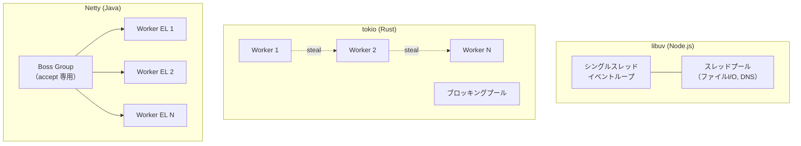

| 項目 | libuv (Node.js) | tokio (Rust) | Netty (Java) |
|---|---|---|---|
| **メインのスレッドモデル** | シングルスレッド | マルチスレッド（ワークスティーリング） | マルチスレッド（固定割り当て） |
| **ワーカー数** | 1（+ スレッドプール） | CPU コア数（デフォルト） | CPU コア数 x 2（デフォルト） |
| **タスク割り当て** | 全タスクが1スレッド | タスク単位で動的分散 | Channel 単位で固定バインド |
| **負荷分散** | N/A（シングル） | ワークスティーリング | ラウンドロビン（接続時） |
| **ブロッキング対策** | スレッドプール | spawn_blocking() | 別 EventExecutorGroup |

### 5.2 設計哲学の対比

**libuv / Node.js: 「シンプルさと予測可能性」**

シングルスレッドイベントループは、並行性に伴うデータ競合やデッドロックの問題を構造的に排除する。JavaScript の実行はすべてメインスレッド上で行われるため、共有状態へのアクセスにロックが不要であり、プログラマが並行性の問題を意識する必要がない。

この設計の代償は、CPU バウンドな処理でイベントループがブロックされるリスクである。Node.js はこの問題に対して Worker Threads（Node.js 10.5+）を提供しているが、根本的には「Node.js は I/O バウンドなワークロードに最適化されたランタイムである」という前提に基づいている。

**tokio / Rust: 「ゼロコスト抽象化と安全性」**

tokio は Rust の「ゼロコスト抽象化」の哲学に則り、コンパイル時に可能な限りのオーバーヘッドを排除する。`async fn` はコンパイラによってステートマシンに変換され、ヒープアロケーションは最小限に抑えられる。Rust の所有権システムにより、コンパイル時にデータ競合が防止される。

ワークスティーリングスケジューラは、タスク間の負荷を動的に均等化し、マルチコアの能力を最大限に活用する。ただし、タスクが異なるスレッドで実行される可能性があるため、`Send` トレイトの制約を満たす必要がある。

**Netty / Java: 「構造化と拡張性」**

Netty は Channel と EventLoop の固定バインディングにより、「1つのコネクションに対する処理は常に同一スレッド」という保証を提供する。これにより、Channel 単位のロックフリーなイベント処理が実現される。

ChannelPipeline はハンドラの組み合わせによるプロトコル処理の構築を可能にし、高い拡張性とモジュール性を提供する。JVM の成熟した GC とJIT コンパイラの恩恵を受けつつ、ByteBuf のプーリングによってGC圧力を軽減している。

### 5.3 タスクモデルの比較

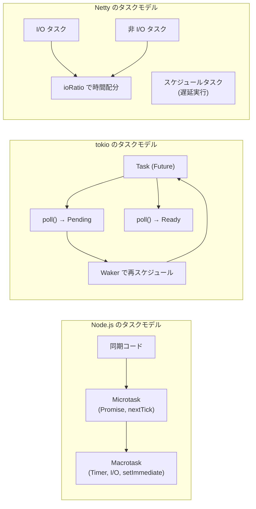

Node.js は macrotask と microtask の2層キューモデルを採用し、実行順序を厳密に定義する。tokio は poll ベースの lazy evaluation を行い、Future がPending を返すたびにスケジューラに制御が戻る。Netty は I/O タスクと非 I/O タスクを区別し、ioRatio で処理時間を調整する。

## 6. パフォーマンス特性と使い分け

### 6.1 レイテンシ特性

各ランタイムのレイテンシ特性は、その設計から導かれる。

**libuv (Node.js)**

シングルスレッドであるため、テールレイテンシ（p99, p999）は1つのコールバックの実行時間に大きく左右される。1つの重い処理がイベントループをブロックすると、その間の全リクエストのレイテンシが悪化する。V8 の JIT コンパイルやGCによる一時停止（pause）も影響する。

**tokio (Rust)**

ワークスティーリングにより、1つのタスクが重くても他のタスクは別ワーカーで継続できる。Rust のゼロコスト抽象化とGC の不在により、予測可能なレイテンシを実現しやすい。ただし、`await` ポイントなしにCPUを長時間占有するタスクは、同じワーカー上の他のタスクをブロックする。

**Netty (Java)**

マルチ EventLoop により並列処理が可能だが、1つの EventLoop に割り当てられた Channel が集中すると、その EventLoop がホットスポットになる。JVM の GC、特に Major GC は大きなレイテンシスパイクの原因となる。ZGC や Shenandoah GC の採用によりこの問題は改善されつつある。

### 6.2 スループット特性

```
スループットに影響する要因の比較:

                    libuv       tokio       Netty
─────────────────────────────────────────────────────
マルチコア活用      △ (※1)      ◎           ○
メモリ効率          ○           ◎ (※2)      ○
GC の影響          △ (※3)      ◎ (GCなし)   △ (※4)
I/O 効率           ○           ◎           ○
プロトコル処理      ○           ○           ◎ (※5)

※1: Worker Threads やクラスタモードで緩和可能
※2: ステートマシンベースの Future は最小限のメモリで動作
※3: V8 の GC は比較的軽量だが影響はある
※4: ByteBuf プーリングで GC 圧力を軽減
※5: ChannelPipeline による効率的なプロトコル処理
```

### 6.3 メモリ効率の違い

非同期タスク1つあたりのメモリオーバーヘッドは、ランタイムによって大きく異なる。

- **Node.js**: Promise/コールバック1つあたり数百バイト〜数KB（V8 のオブジェクトオーバーヘッドを含む）
- **tokio**: Future 1つあたりはそのステートマシンのサイズのみ（数十〜数百バイトが一般的）。ヒープアロケーションは `Box::pin()` で明示的に行う場合のみ
- **Netty**: Channel 1つあたり数KB（ChannelPipeline、ChannelHandlerContext のチェーン、ByteBuf アロケータへの参照など）

tokio の Future がコンパイル時にステートマシンに変換される設計は、メモリ効率において際立った優位性を持つ。以下のコードがどのようにコンパイルされるかを見ると、その理由が明確になる。

```rust
// This async function...
async fn fetch_and_process(url: &str) -> Result<Data> {
    let response = http_get(url).await;      // state 0 -> state 1
    let parsed = parse(response).await;       // state 1 -> state 2
    let result = transform(parsed).await;     // state 2 -> state 3
    Ok(result)
}

// ...is compiled into a state machine (conceptually):
enum FetchAndProcessFuture {
    State0 { url: String },
    State1 { response_future: HttpGetFuture },
    State2 { parse_future: ParseFuture },
    State3 { transform_future: TransformFuture },
}
```

この enum は、同時に1つの状態しか保持しないため、全状態の最大サイズ分のメモリしか消費しない（各状態のユニオン）。Go のゴルーチンが最小 2KB のスタックを確保するのと比較すると、tokio のタスクは桁違いに小さい。

### 6.4 使い分けの指針

各ランタイムが最も効果を発揮するシナリオを整理する。

**libuv / Node.js が適するケース**

- I/O バウンドな Web アプリケーション（REST API、リアルタイム通信）
- プロトタイピングやスタートアップフェーズでの高速な開発
- JavaScript / TypeScript のエコシステムを活用したい場合
- フロントエンドとバックエンドで言語を統一したい場合

**tokio / Rust が適するケース**

- 極めて低いレイテンシと高いスループットが要求されるシステム（プロキシ、ロードバランサ）
- メモリ使用量に厳しい制約があるシステム（組み込み、エッジコンピューティング）
- 予測可能な性能が求められるシステム（GC パーズの回避）
- システムプログラミング領域（OS ツール、ネットワーク基盤）

**Netty / Java が適するケース**

- 複雑なプロトコルの実装（独自バイナリプロトコル、HTTP/2、gRPC）
- 既存の Java/JVM エコシステムとの統合
- 大規模な組織での長期的な保守性が求められるプロジェクト
- 豊富なサードパーティのコーデックやハンドラの再利用

### 6.5 現代における収束

かつては明確に異なっていた3つのランタイムの設計も、近年は一定の収束傾向を見せている。

- **Node.js**: Worker Threads（マルチスレッド）、`fetch()` のネイティブサポートなど、シングルスレッドの制約を緩和する方向へ進化している
- **tokio**: `tokio-uring` による io_uring 対応、`tokio-console` によるランタイムの可観測性向上など、エコシステムの成熟が進んでいる
- **Netty**: io_uring transport の実験的サポート、Project Loom（Virtual Threads）との共存など、新しい技術への適応を進めている

::: tip Java Virtual Threads との関係
Java 21 で正式導入された Virtual Threads（Project Loom）は、スレッドベースのブロッキングモデルに戻りつつ、OS スレッドのオーバーヘッドを回避する技術である。これは Netty のイベントループモデルとは異なるアプローチだが、両者は排他的ではない。I/O 処理の性能が最優先の場合は Netty が優位であり、プログラミングモデルのシンプルさを優先する場合は Virtual Threads が有利である。
:::

## 7. まとめ

イベントループは「少数のスレッドで大量の並行 I/O を処理する」という課題に対する根本的な解答であり、現代のネットワークサーバーの基盤技術である。

libuv、tokio、Netty はそれぞれ異なる言語・エコシステム・設計哲学に基づいて構築されているが、根底にある原則は共通している。

1. **I/O の多重化**: OS のカーネル機構（epoll, kqueue, IOCP）を利用して、少数のスレッドで多数のファイルディスクリプタを監視する
2. **コールバック / Future / Handler による非同期処理**: I/O の完了をブロッキングで待つのではなく、準備完了時にディスパッチする
3. **CPU バウンドな処理の分離**: イベントループをブロックしないために、重い処理はスレッドプールに委譲する

これら3つのランタイムを深く理解することは、非同期 I/O の本質を捉えることにつながる。表面的な API の違いの奥にある共通の設計原理を見抜くことで、どのランタイムを使う場合でも適切な設計判断を下せるようになるだろう。
