# イベントソーシングとCQRS

## 1. 背景と動機 — 「現在の状態」だけを保存するモデルの限界

### 1.1 CRUDの支配とその問題

ほとんどのアプリケーションは、データの管理にCRUD（Create, Read, Update, Delete）パターンを採用している。リレーショナルデータベースのテーブルに対して、レコードを挿入し、読み取り、更新し、削除する。この単純なモデルは、数十年にわたってソフトウェア開発の標準であり続けてきた。

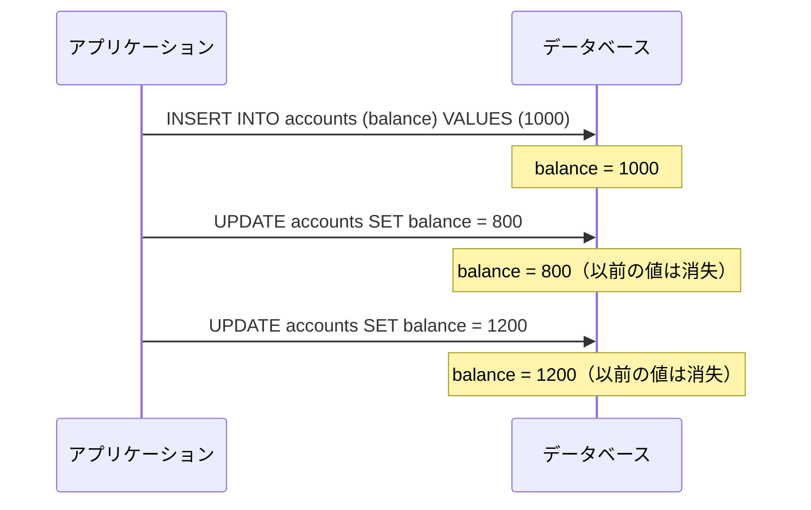

しかし、CRUDモデルには根本的な限界がある。

- **履歴の喪失**: UPDATEを実行するたびに、以前の状態は上書きされて消える。「なぜ残高が1200円になったのか」「いつ、誰が、どのような理由で変更したのか」を後から知る方法がない
- **監査とコンプライアンス**: 金融、医療、法律など規制の厳しいドメインでは、すべての状態変更の完全な履歴が求められる。CRUDでは監査ログを別途実装する必要があり、ログとデータの整合性を維持するのは困難である
- **時間的クエリの困難**: 「先月末時点の在庫状態は？」「ユーザーが退会する直前のプロファイルは？」といった過去の時点での状態を復元する手段がない
- **ドメインの意図の消失**: UPDATE文は「何が変わったか」を記録するが、「なぜ変わったか」は記録しない。「残高が400円減った」のか「商品購入で400円支払った」のかは、UPDATE文からは区別できない

### 1.2 会計の世界からの着想

興味深いことに、これらの問題を数百年前から解決している領域がある。**複式簿記**である。

会計の世界では、元帳（Ledger）の数字を直接書き換えることは決してしない。代わりに、すべての取引を仕訳帳（Journal）に記録し、その集計結果として残高を導出する。

| 日付 | 摘要 | 借方 | 貸方 |
|------|------|------|------|
| 1/1 | 口座開設 | 1,000 | - |
| 1/5 | 商品購入 | - | 200 |
| 1/10 | 給与入金 | 400 | - |
| **残高** | | **1,200** | |

残高1,200円は、個々の取引記録から**導出される値**である。取引記録さえ正確に保存されていれば、任意の時点の残高を再計算できる。これが**イベントソーシング**の基本的な考え方である。

### 1.3 歴史的経緯

イベントソーシングの概念は、複数の流れが合流して形成された。

- **1990年代**: Martin Fowlerが「Event Sourcing」のパターン名を提唱。ドメイン駆動設計（DDD）コミュニティで注目される
- **2000年代**: Greg Youngが CQRSパターンを体系化し、イベントソーシングとの組み合わせを提唱
- **2010年代**: Apache Kafka の登場により、大規模なイベントストリーミング基盤が実現可能になり、実用的な採用が加速
- **2020年代**: EventStoreDB、Axon Framework などの専用フレームワークが成熟。マイクロサービスアーキテクチャの普及とともに、サービス間のデータ整合性を確保する手段として広く認知される

## 2. イベントソーシングの原理

### 2.1 基本概念

**イベントソーシング（Event Sourcing）** とは、アプリケーションの状態変更を**イベント（Event）** のシーケンスとして記録し、現在の状態をそのイベント列を再生することで導出するアーキテクチャパターンである。

::: tip イベントソーシングの核心
システムの状態を「現在の値」として保存するのではなく、「状態に至るまでのすべての変更操作」を記録する。現在の状態は、イベント列を先頭から順に適用した結果として**計算される**。
:::

ここで重要な性質がいくつかある。

1. **イベントは不変（Immutable）**: 一度記録されたイベントは変更も削除もされない。過去を書き換えることはできない
2. **イベントは追記のみ（Append-Only）**: 新しいイベントは常にシーケンスの末尾に追加される
3. **イベントは過去形で命名される**: イベントは「起きたこと」を表すため、`OrderPlaced`（注文が確定された）、`PaymentReceived`（支払いが受領された）のように過去形で命名する
4. **状態は導出される**: 現在の状態は、イベント列の関数として計算される

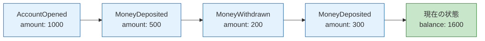

### 2.2 イベント、コマンド、集約

イベントソーシングは、しばしば DDD（ドメイン駆動設計）の概念と組み合わせて使われる。その中心的な要素を整理しよう。

**コマンド（Command）** は、システムに対する変更要求を表す。コマンドは「これをやってほしい」という意図であり、拒否される可能性がある。命名は命令形を使う（例: `WithdrawMoney`、`PlaceOrder`）。

**イベント（Event）** は、すでに発生した事実を表す。イベントは「これが起きた」という過去の記録であり、取り消すことはできない。命名は過去形を使う（例: `MoneyWithdrawn`、`OrderPlaced`）。

**集約（Aggregate）** は、一貫性の境界を定義する DDD の概念であり、イベントソーシングにおいてはイベントストリームの単位となる。集約は、コマンドを受け取り、ビジネスルールを検証した上で、イベントを発行する。

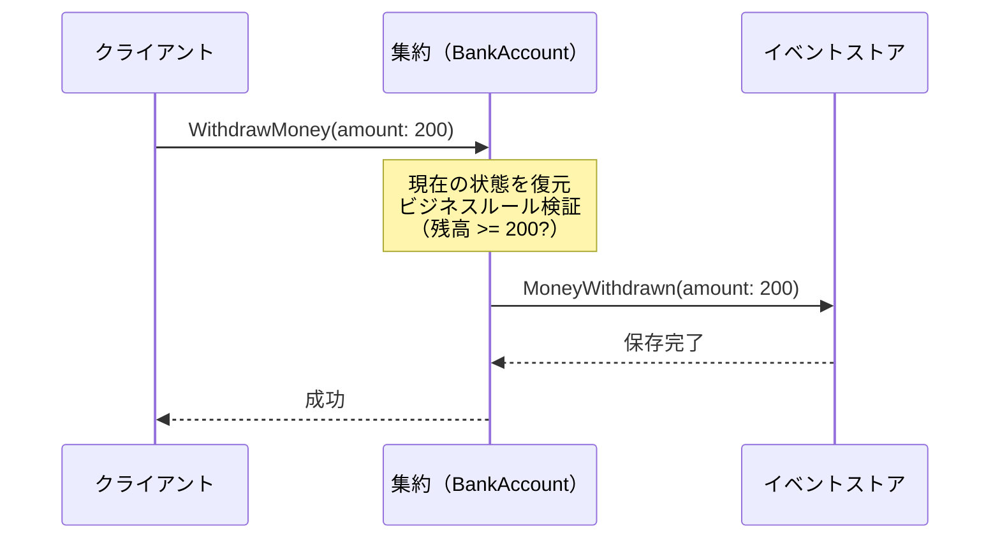

### 2.3 イベントストア

**イベントストア（Event Store）** は、イベントを永続化するための専用データストアである。以下の基本操作を提供する。

- **Append**: あるストリーム（集約インスタンス）にイベントを追加する
- **Read**: あるストリームのイベントを先頭から（またはある位置から）読み取る
- **Subscribe**: 新しいイベントが追加されたときに通知を受け取る

イベントストアの論理的な構造は以下のようになる。

| stream_id | version | event_type | event_data | timestamp |
|-----------|---------|------------|------------|-----------|
| account-123 | 1 | AccountOpened | <code v-pre>{"amount": 1000}</code> | 2026-01-01T00:00:00Z |
| account-123 | 2 | MoneyDeposited | <code v-pre>{"amount": 500}</code> | 2026-01-05T10:30:00Z |
| account-123 | 3 | MoneyWithdrawn | <code v-pre>{"amount": 200}</code> | 2026-01-10T14:15:00Z |
| order-456 | 1 | OrderPlaced | <code v-pre>{"items": [...]}</code> | 2026-01-10T14:20:00Z |
| account-123 | 4 | MoneyDeposited | <code v-pre>{"amount": 300}</code> | 2026-01-15T09:00:00Z |

::: warning 楽観的同時実行制御
イベントストアでは、**バージョン番号**を使って楽観的同時実行制御を行うのが一般的である。イベントを追加する際に「期待するバージョン番号」を指定し、実際のバージョンと一致しない場合は競合エラーを返す。これにより、2つのプロセスが同じ集約に対して同時に変更を加えようとした場合に、一方を拒否できる。
:::

### 2.4 集約の実装パターン

以下は、銀行口座の集約をイベントソーシングで実装する例である。

::: code-group

```typescript [TypeScript]
// Event types
type AccountEvent =
  | { type: "AccountOpened"; amount: number }
  | { type: "MoneyDeposited"; amount: number }
  | { type: "MoneyWithdrawn"; amount: number }
  | { type: "AccountClosed"; reason: string };

// Aggregate state
interface AccountState {
  balance: number;
  isOpen: boolean;
}

// Apply an event to produce new state
function apply(state: AccountState, event: AccountEvent): AccountState {
  switch (event.type) {
    case "AccountOpened":
      return { balance: event.amount, isOpen: true };
    case "MoneyDeposited":
      return { ...state, balance: state.balance + event.amount };
    case "MoneyWithdrawn":
      return { ...state, balance: state.balance - event.amount };
    case "AccountClosed":
      return { ...state, isOpen: false };
  }
}

// Reconstruct state from event history
function reconstruct(events: AccountEvent[]): AccountState {
  const initial: AccountState = { balance: 0, isOpen: false };
  return events.reduce(apply, initial);
}

// Command handler with business rule validation
function withdraw(
  state: AccountState,
  amount: number
): AccountEvent[] {
  if (!state.isOpen) {
    throw new Error("Account is closed");
  }
  if (state.balance < amount) {
    throw new Error("Insufficient funds");
  }
  // Return events (not state mutations)
  return [{ type: "MoneyWithdrawn", amount }];
}
```

```java [Java]
// Event types
public sealed interface AccountEvent {
    record AccountOpened(BigDecimal amount) implements AccountEvent {}
    record MoneyDeposited(BigDecimal amount) implements AccountEvent {}
    record MoneyWithdrawn(BigDecimal amount) implements AccountEvent {}
    record AccountClosed(String reason) implements AccountEvent {}
}

// Aggregate
public class BankAccount {
    private BigDecimal balance = BigDecimal.ZERO;
    private boolean isOpen = false;

    // Reconstruct from events
    public static BankAccount fromEvents(List<AccountEvent> events) {
        BankAccount account = new BankAccount();
        events.forEach(account::apply);
        return account;
    }

    // Apply an event to mutate state
    private void apply(AccountEvent event) {
        switch (event) {
            case AccountOpened e -> {
                this.balance = e.amount();
                this.isOpen = true;
            }
            case MoneyDeposited e ->
                this.balance = this.balance.add(e.amount());
            case MoneyWithdrawn e ->
                this.balance = this.balance.subtract(e.amount());
            case AccountClosed e ->
                this.isOpen = false;
        }
    }

    // Command handler
    public List<AccountEvent> withdraw(BigDecimal amount) {
        if (!isOpen) throw new IllegalStateException("Account is closed");
        if (balance.compareTo(amount) < 0)
            throw new IllegalStateException("Insufficient funds");
        return List.of(new MoneyWithdrawn(amount));
    }
}
```

:::

この実装パターンの重要なポイントは以下の通りである。

1. **コマンドハンドラはイベントを返す**: 状態を直接変更するのではなく、発生したイベントのリストを返す
2. **applyは純粋関数**: 状態とイベントを受け取り、新しい状態を返す。副作用はない
3. **ビジネスルールはコマンドハンドラで検証**: コマンドを処理する時点で、ドメインのルール（残高不足の検出など）を検証する

### 2.5 状態の復元とスナップショット

イベント列から状態を復元する処理（replay）は、イベント数が増えるにつれて遅くなる。何百万ものイベントを毎回再生するのは非現実的である。この問題を解決するのが**スナップショット（Snapshot）** である。

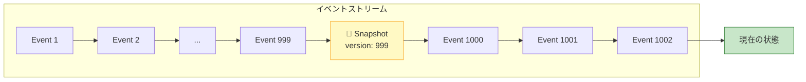

スナップショットは、ある時点での集約の状態を保存したものである。状態を復元する際は、直近のスナップショットからロードし、それ以降のイベントだけを再生すればよい。

スナップショットの取得戦略にはいくつかのパターンがある。

- **N件ごと**: イベントが一定数（例: 100件）追加されるたびにスナップショットを取る
- **時間ベース**: 一定時間ごとにスナップショットを取る
- **オンデマンド**: 復元に時間がかかりすぎた場合にスナップショットを作成する

::: danger スナップショットはキャッシュである
スナップショットは最適化手段であり、イベントの代替ではない。スナップショットが壊れた場合でも、イベント列が残っていれば状態を完全に復元できる。スナップショットをイベントの代わりにするのは、イベントソーシングの原則に反する。
:::

## 3. CQRS — コマンドとクエリの分離

### 3.1 CQS原則からCQRSへ

**CQS（Command-Query Separation）** は、Bertrand Meyerが1988年に提唱した原則で、「メソッドはコマンド（状態を変更する）かクエリ（状態を返す）のどちらかであり、両方を兼ねるべきではない」というものである。

**CQRS（Command Query Responsibility Segregation）** は、CQS原則をアーキテクチャレベルに拡張したパターンである。Greg Youngが2010年頃に体系化した。CQRSの核心は、**データの書き込みモデルと読み取りモデルを完全に分離する**ことにある。

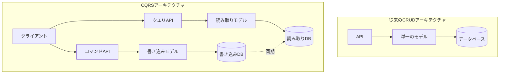

### 3.2 なぜCQRSが必要か

多くのシステムでは、読み取りと書き込みのパターンが大きく異なる。

| 観点 | 書き込み | 読み取り |
|------|---------|---------|
| **データモデル** | ドメインの整合性を保証する正規化されたモデル | 画面表示に最適化された非正規化モデル |
| **スケーリング** | 一般的に読み取りより少ない（例: 1:10〜1:100） | 大量のリクエストを高速に処理する必要がある |
| **整合性** | 強い整合性が必要 | 結果整合性で十分な場合が多い |
| **最適化** | トランザクション、バリデーション、ビジネスルール | インデックス、キャッシュ、プリコンピューテーション |

CRUDの単一モデルでは、これらの異なる要件を一つのデータモデルで満たそうとするため、妥協が生じる。CQRSはこの問題を、書き込みと読み取りのモデルを完全に分離することで解決する。

### 3.3 CQRSの実現パターン

CQRSには、分離の度合いに応じていくつかのレベルがある。

**レベル1: コード上の分離**

同じデータベースを使いながら、書き込みと読み取りのコードを分離する。

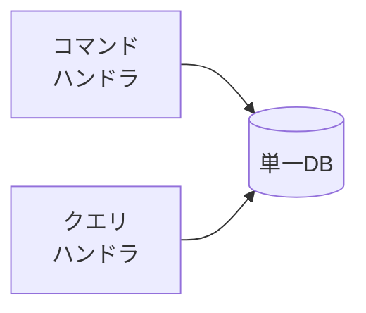

これは最も軽量なCQRSであり、コードの責務を明確にするだけでも一定の効果がある。

**レベル2: データストアの分離**

書き込みと読み取りで異なるデータストアを使う。書き込みDBからイベントやChange Data Capture（CDC）を通じて読み取りDBに同期する。

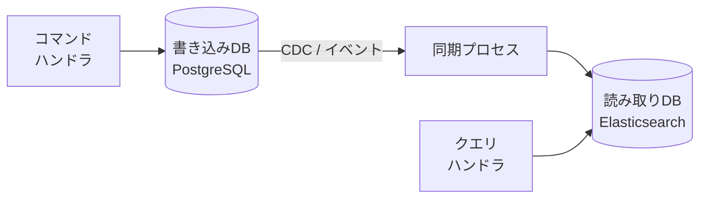

**レベル3: イベントソーシング + CQRS**

書き込み側はイベントストアにイベントを記録し、読み取り側はイベントを購読してプロジェクション（ビューモデル）を構築する。

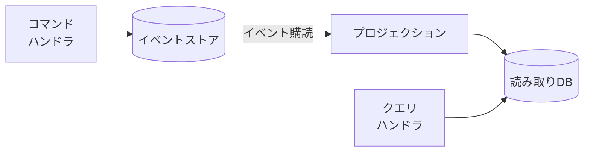

このレベル3が、イベントソーシングとCQRSを組み合わせた「フル CQRS」パターンであり、以降の節で詳しく解説する。

## 4. イベントソーシング + CQRS の統合アーキテクチャ

### 4.1 全体構成

イベントソーシングとCQRSを組み合わせると、以下のようなアーキテクチャになる。

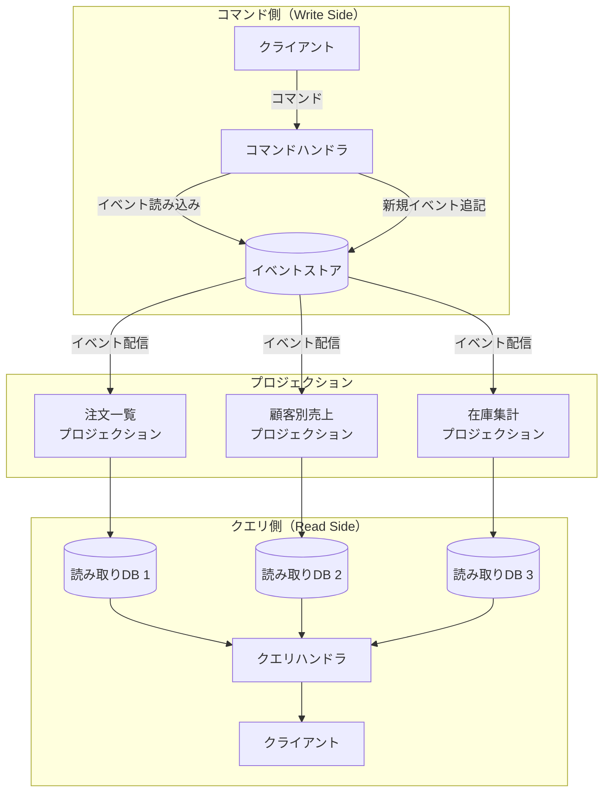

この構成では、以下の流れでデータが処理される。

1. クライアントが**コマンド**を送信する（例: `PlaceOrder`）
2. コマンドハンドラが対象の集約をイベントストアから復元する
3. 集約がビジネスルールを検証し、新しいイベントを生成する
4. イベントがイベントストアに追記される
5. **プロジェクション**がイベントを購読し、読み取り用のビューモデルを更新する
6. クエリは読み取りモデルに対して実行される

### 4.2 プロジェクション（Read Model）

**プロジェクション**は、イベントストリームを「読み取りに適した形」に変換するプロセスである。RDBMS のビュー（VIEW）と似た概念だが、異なるデータストアにマテリアライズできる点が異なる。

同一のイベントストリームから、用途に応じた複数のプロジェクションを作成できる。

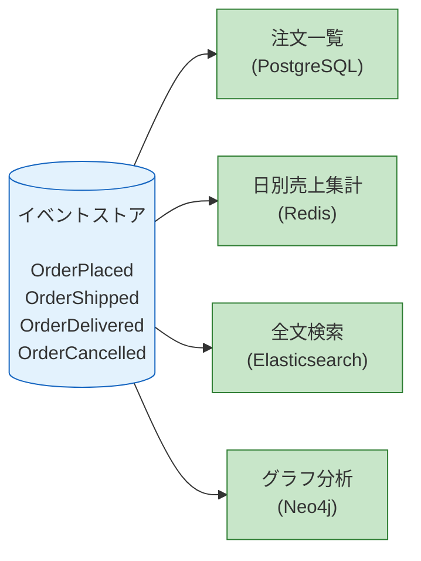

プロジェクションの実装例を示す。

::: code-group

```typescript [TypeScript - 注文一覧プロジェクション]
interface OrderSummary {
  orderId: string;
  customerId: string;
  totalAmount: number;
  status: "placed" | "shipped" | "delivered" | "cancelled";
  placedAt: string;
}

// Projection handler
async function handleEvent(
  event: OrderEvent,
  db: Database
): Promise<void> {
  switch (event.type) {
    case "OrderPlaced":
      await db.insert("order_summaries", {
        orderId: event.orderId,
        customerId: event.customerId,
        totalAmount: event.totalAmount,
        status: "placed",
        placedAt: event.timestamp,
      });
      break;

    case "OrderShipped":
      await db.update("order_summaries",
        { orderId: event.orderId },
        { status: "shipped" }
      );
      break;

    case "OrderDelivered":
      await db.update("order_summaries",
        { orderId: event.orderId },
        { status: "delivered" }
      );
      break;

    case "OrderCancelled":
      await db.update("order_summaries",
        { orderId: event.orderId },
        { status: "cancelled" }
      );
      break;
  }
}
```

```typescript [TypeScript - 日別売上プロジェクション]
// Separate projection: daily revenue
async function handleRevenueEvent(
  event: OrderEvent,
  redis: RedisClient
): Promise<void> {
  if (event.type === "OrderPlaced") {
    const dateKey = event.timestamp.substring(0, 10); // YYYY-MM-DD
    await redis.incrByFloat(
      `daily_revenue:${dateKey}`,
      event.totalAmount
    );
    await redis.incr(`daily_order_count:${dateKey}`);
  }
  if (event.type === "OrderCancelled") {
    const dateKey = event.timestamp.substring(0, 10);
    await redis.incrByFloat(
      `daily_revenue:${dateKey}`,
      -event.refundAmount
    );
  }
}
```

:::

### 4.3 結果整合性と「Read Your Own Writes」

イベントソーシング + CQRS のアーキテクチャでは、コマンド側で書き込んだイベントがプロジェクション（読み取り側）に反映されるまでにタイムラグが生じる。これは**結果整合性（Eventual Consistency）** である。

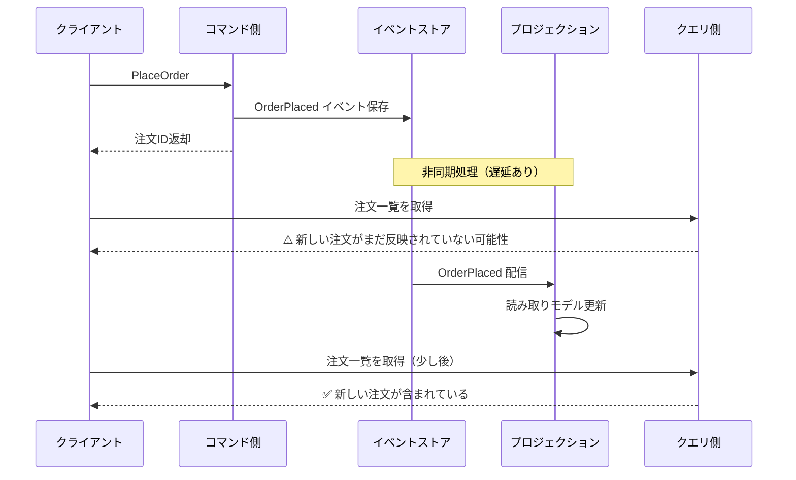

この結果整合性は、ユーザー体験に影響を与える可能性がある。ユーザーが注文を確定した直後に注文一覧を見たとき、たった今の注文が表示されなければ混乱する。

この問題に対する一般的な対処法は以下の通りである。

**1. UI側での楽観的更新（Optimistic UI）**

コマンドの成功レスポンスを受け取った時点で、UIにローカルに変更を反映する。読み取りモデルの更新を待たずに、「変更が反映された」ように見せる。

**2. 書き込みの結果をコマンドレスポンスに含める**

コマンドの成功時に、更新後の状態（またはその一部）をレスポンスとして返す。これにより、直後の読み取りで最新状態を利用できる。

**3. Causal Consistency の実装**

コマンドの結果として返されたイベントのバージョン番号を、クエリに含める。クエリ側は、そのバージョン番号以降のプロジェクションが完了するまで待機するか、完了していない場合はその旨をクライアントに伝える。

**4. 同期プロジェクション**

特定の重要なプロジェクションについては、イベントの保存と同じトランザクション内でプロジェクションを更新する。ただし、これはCQRSの非同期性の利点を一部犠牲にする。

### 4.4 イベントの発行とメッセージブローカー

実運用では、イベントストアからプロジェクションへのイベント配信にメッセージブローカーを利用することが多い。

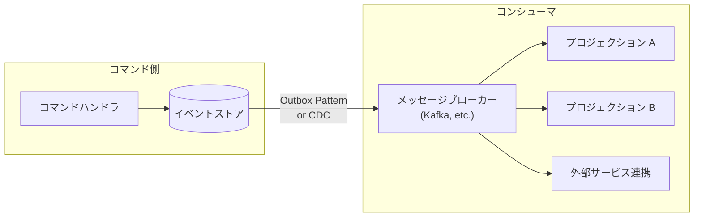

ここで重要なのは、**イベントストアへの保存とメッセージブローカーへの発行を原子的に行う**必要があるということである。イベントは保存されたがブローカーへの発行が失敗した場合（またはその逆）、データの不整合が発生する。

この問題の代表的な解決策が**Outboxパターン**と**CDCパターン**である。

**Outboxパターン**: イベントストアと同じデータベース内にoutboxテーブルを作り、同一トランザクションでイベントとoutboxレコードを書き込む。別のプロセスがoutboxテーブルをポーリングし、メッセージブローカーに発行する。

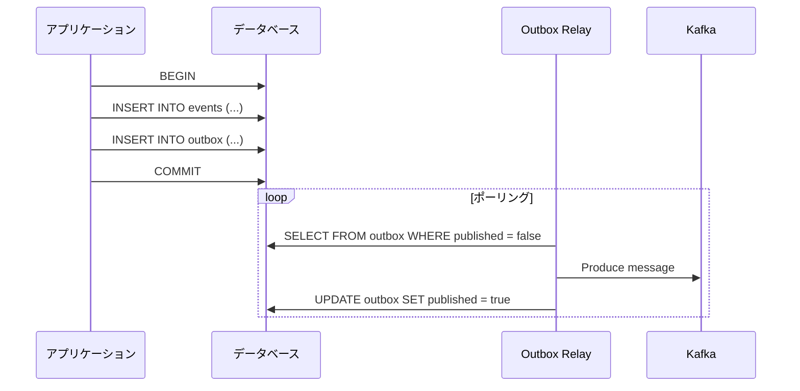

**CDC（Change Data Capture）パターン**: データベースのトランザクションログ（WAL、binlog等）を監視するツール（Debezium など）を使い、イベントストアへの書き込みを自動的にメッセージブローカーに転送する。

## 5. イベントの設計と進化

### 5.1 よいイベントの設計原則

イベントの設計は、イベントソーシングの成否を左右する最も重要な要素の一つである。

**1. ドメインの言語を使う**

技術的な用語ではなく、ビジネスドメインの用語でイベントを命名する。

| 悪い例 | 良い例 |
|--------|--------|
| `RowUpdated` | `OrderPlaced` |
| `StatusChanged` | `OrderShipped` |
| `RecordDeleted` | `OrderCancelled` |
| `DataInserted` | `PaymentReceived` |

**2. 十分な情報を含める**

イベントは、そのイベントだけで何が起きたかを理解できる程度の情報を含むべきである。

```typescript
// Bad: insufficient information
interface OrderPlaced {
  type: "OrderPlaced";
  orderId: string;
}

// Good: self-contained with relevant context
interface OrderPlaced {
  type: "OrderPlaced";
  orderId: string;
  customerId: string;
  items: Array<{
    productId: string;
    quantity: number;
    unitPrice: number;
  }>;
  totalAmount: number;
  shippingAddress: Address;
  placedAt: string;
}
```

**3. イベントの粒度を適切にする**

粒度が細かすぎると意味的なまとまりが失われ、粗すぎるとイベントの再利用性が低下する。

### 5.2 イベントのバージョニングとスキーマ進化

イベントソーシングでは、イベントは永続的に保存される。しかし、アプリケーションは進化する。イベントのスキーマが変更されたとき、過去に保存されたイベントとの互換性をどう保つかは重大な課題である。

**アップキャスティング（Upcasting）**: 古いバージョンのイベントを読み取る際に、新しいスキーマに変換する。

```typescript
// Version 1 (original)
interface OrderPlacedV1 {
  type: "OrderPlaced";
  orderId: string;
  amount: number; // single currency assumed
}

// Version 2 (added currency support)
interface OrderPlacedV2 {
  type: "OrderPlaced";
  orderId: string;
  amount: number;
  currency: string; // new field
}

// Upcaster: V1 -> V2
function upcastOrderPlaced(event: OrderPlacedV1): OrderPlacedV2 {
  return {
    ...event,
    currency: "JPY", // default for old events
  };
}
```

**イベントの新バージョン追加**: 互換性が保てないほどの変更が必要な場合は、新しいイベントタイプを追加する（例: `OrderPlacedV2`）。ただし、これはイベントタイプの増殖を招くため、慎重に行うべきである。

::: tip スキーマ進化の戦略
イベントのスキーマ進化には、JSON Schemaやprotobufのようなスキーマ管理ツールを活用するのが実践的である。特にprotobufは、フィールドの追加に対して前方互換性と後方互換性を提供するため、イベントスキーマの進化に適している。
:::

### 5.3 イベントストリームの再構築

プロジェクションのロジックにバグがあった場合や、新しいプロジェクションを追加したい場合に、イベントストリームを再生して読み取りモデルを再構築できることは、イベントソーシングの大きな利点である。

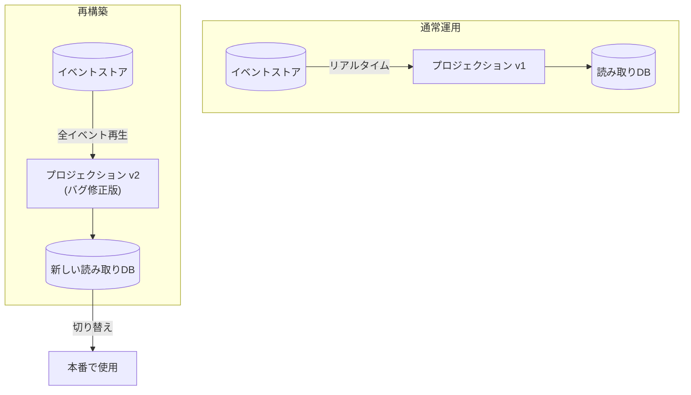

再構築のプロセスは以下のようになる。

1. 新しいプロジェクションのコードをデプロイする
2. 新しい読み取りモデルのデータストアを用意する
3. イベントストアの先頭からすべてのイベントを再生する
4. 再生が完了したら、クエリの参照先を新しいデータストアに切り替える
5. リアルタイムのイベント購読を新しいプロジェクションに接続する

## 6. 実装上の課題と解決策

### 6.1 イベントストアの技術選択

イベントストアの実装には、いくつかの選択肢がある。

| 実装 | 特徴 | 適用場面 |
|------|------|---------|
| **EventStoreDB** | イベントソーシング専用DB。ストリーム管理、購読、プロジェクションをネイティブにサポート | イベントソーシングを中心に設計する場合 |
| **PostgreSQL** | JSONB型でイベントを保存。LISTEN/NOTIFYで購読。堅牢なトランザクション | 既存のPostgreSQL運用ノウハウを活かす場合 |
| **Apache Kafka** | 高スループットの分散ログ。パーティション単位の順序保証 | 大規模イベントストリーミング基盤として |
| **DynamoDB** | サーバーレス運用。条件付き書き込みで楽観ロック | AWSエコシステムでの運用 |

PostgreSQLをイベントストアとして使う場合のスキーマ例を示す。

```sql
-- Event store schema
CREATE TABLE events (
    -- Global unique identifier
    event_id UUID PRIMARY KEY DEFAULT gen_random_uuid(),

    -- Stream identification
    stream_id VARCHAR(255) NOT NULL,
    stream_version INT NOT NULL,

    -- Event data
    event_type VARCHAR(255) NOT NULL,
    event_data JSONB NOT NULL,
    metadata JSONB DEFAULT '{}',

    -- Timestamps
    created_at TIMESTAMPTZ NOT NULL DEFAULT NOW(),

    -- Optimistic concurrency: unique version per stream
    UNIQUE (stream_id, stream_version)
);

-- Index for reading a stream
CREATE INDEX idx_events_stream
    ON events (stream_id, stream_version);

-- Index for global ordering (used by projections)
CREATE INDEX idx_events_created_at
    ON events (created_at);

-- Outbox table for reliable event publishing
CREATE TABLE outbox (
    outbox_id UUID PRIMARY KEY DEFAULT gen_random_uuid(),
    event_id UUID NOT NULL REFERENCES events(event_id),
    published BOOLEAN NOT NULL DEFAULT FALSE,
    created_at TIMESTAMPTZ NOT NULL DEFAULT NOW()
);

CREATE INDEX idx_outbox_unpublished
    ON outbox (created_at) WHERE published = FALSE;
```

### 6.2 冪等性の確保

プロジェクションがイベントを処理する際、ネットワーク障害やプロセスの再起動により同じイベントが複数回配信される可能性がある（at-least-once delivery）。プロジェクションは**冪等（Idempotent）** でなければならない。

```typescript
async function handleEventIdempotently(
  event: DomainEvent,
  db: Database
): Promise<void> {
  // Check if this event has already been processed
  const processed = await db.query(
    "SELECT 1 FROM processed_events WHERE event_id = $1",
    [event.eventId]
  );
  if (processed.rowCount > 0) {
    return; // Already processed, skip
  }

  await db.transaction(async (tx) => {
    // Process the event
    await applyProjection(event, tx);

    // Record that this event has been processed
    await tx.query(
      "INSERT INTO processed_events (event_id, processed_at) VALUES ($1, NOW())",
      [event.eventId]
    );
  });
}
```

### 6.3 大規模システムでのパフォーマンス

イベントソーシングシステムが大規模になると、いくつかのパフォーマンス上の課題が顕在化する。

**イベントの読み込み速度**: 集約のイベント数が多い場合、復元が遅くなる。前述のスナップショットが解決策となる。

**プロジェクションの遅延**: イベントの発行量が多い場合、プロジェクションの更新が追いつかなくなる。パーティショニングや並列処理による対応が必要になる。

**ストレージ容量**: すべてのイベントを永続化するため、CRUDモデルに比べてストレージ使用量が大きくなる。ただし、現代のストレージコストを考えると、多くの場合これは実用上の問題にはならない。

**イベントストリームの分割**: Kafka を使う場合、パーティション内の順序は保証されるが、パーティション間の順序は保証されない。同一集約のイベントが同一パーティションに入るように、パーティションキーを設計する必要がある。

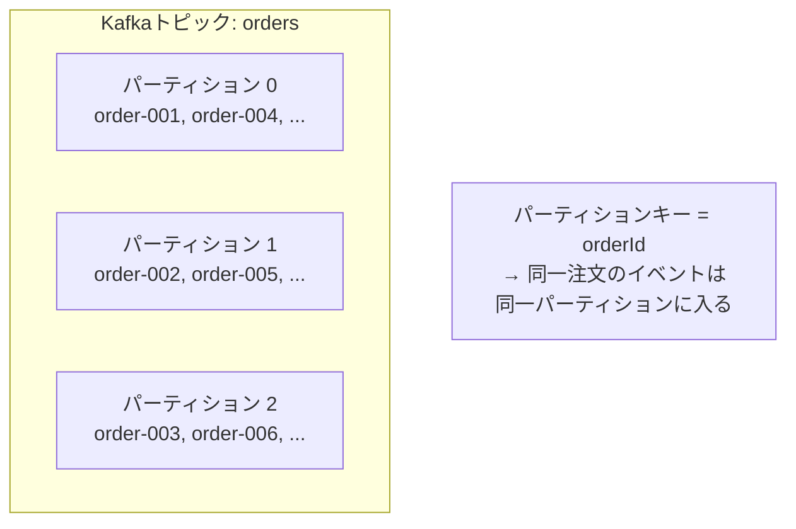

### 6.4 テスト戦略

イベントソーシングのシステムは、以下の観点でテストする。

**1. Given-When-Then パターン**

集約のテストは、「Given（過去のイベント）」「When（コマンド）」「Then（期待されるイベント）」のパターンで記述すると明快である。

```typescript
describe("BankAccount", () => {
  it("should withdraw money when sufficient balance", () => {
    // Given: past events
    const history = [
      { type: "AccountOpened", amount: 1000 },
      { type: "MoneyDeposited", amount: 500 },
    ];

    // When: command
    const state = reconstruct(history);
    const events = withdraw(state, 200);

    // Then: expected new events
    expect(events).toEqual([
      { type: "MoneyWithdrawn", amount: 200 },
    ]);
  });

  it("should reject withdrawal when insufficient balance", () => {
    // Given
    const history = [
      { type: "AccountOpened", amount: 100 },
    ];

    // When + Then
    const state = reconstruct(history);
    expect(() => withdraw(state, 200)).toThrow("Insufficient funds");
  });
});
```

**2. プロジェクションのテスト**

プロジェクションのテストは、イベントのシーケンスを入力として与え、読み取りモデルの状態を検証する。

**3. シナリオテスト**

エンドツーエンドで、コマンドの発行からプロジェクションの更新、クエリの結果までを通しで検証する。

## 7. 実世界での適用事例

### 7.1 金融システム

銀行や決済システムは、イベントソーシングの最も自然な適用先である。すべての取引は本質的にイベントであり、残高は取引の集計結果である。規制要件として取引履歴の完全な保存が求められるため、イベントソーシングの「すべてを記録する」という性質が完全に合致する。

### 7.2 ECサイトの注文管理

注文のライフサイクル（注文確定 → 決済 → 出荷 → 配送 → 返品）は、状態遷移として自然にモデル化でき、各遷移がイベントとなる。注文一覧、売上レポート、在庫管理など、同じイベントから複数のビューを導出するCQRSの利点が活きる。

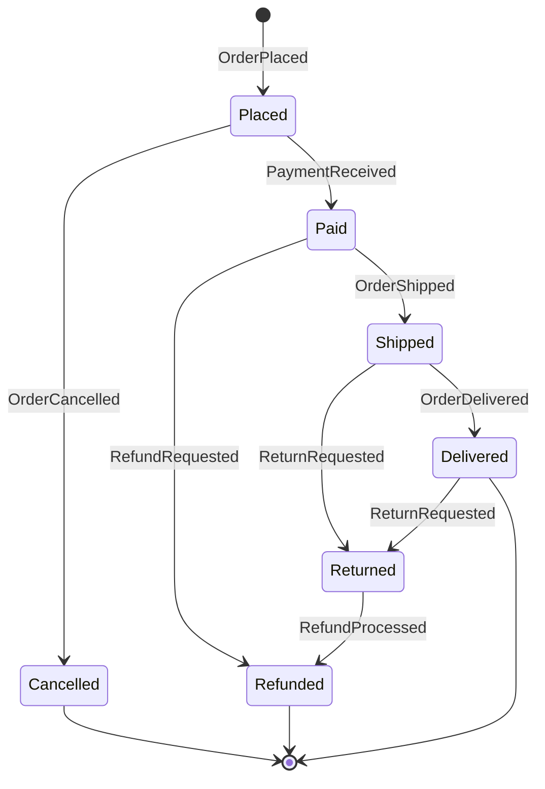

### 7.3 協調編集（Collaborative Editing）

Google DocsのようなリアルタイムコラボレーションツールでもGitでも、変更操作を記録してドキュメントの状態を構築するという点でイベントソーシングと同じ原理が使われている。変更操作が「イベント」に相当し、ドキュメントの現在の状態は操作のリプレイによって導出される。

### 7.4 マイクロサービス間のデータ整合性

マイクロサービスアーキテクチャにおいて、サービス間のデータ整合性を確保するためにイベントソーシングとCQRSが活用される。各サービスが自身のイベントストアを持ち、他のサービスのイベントを購読して必要なデータのローカルコピーを維持する。

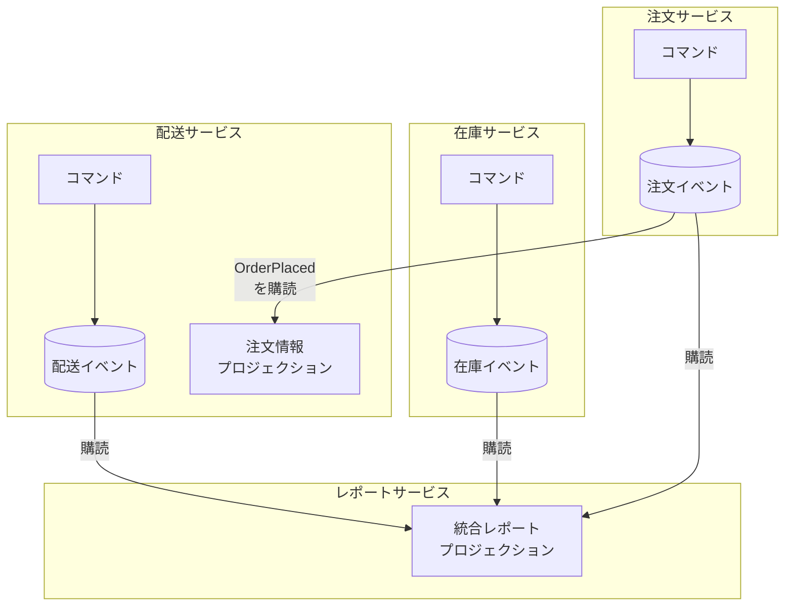

## 8. イベントソーシングとCQRSの利点と欠点

### 8.1 利点

| 利点 | 説明 |
|------|------|
| **完全な監査ログ** | すべての状態変更がイベントとして記録される。規制要件や障害分析に不可欠 |
| **時間旅行** | 任意の過去の時点の状態を復元できる。デバッグ、分析、コンプライアンスに有用 |
| **プロジェクションの柔軟性** | 後から新しい読み取りモデルを追加できる。要件変更への耐性が高い |
| **ドメインの表現力** | イベントはビジネスで実際に起きたことを表現する。CRUDのUPDATE文よりもドメインの意図を正確に記録できる |
| **スケーラビリティ** | 書き込みと読み取りを独立にスケールできる。読み取りモデルは用途に応じて最適なデータストアを選択できる |
| **疎結合** | イベントを介した通信により、サービス間の結合度が低下する |
| **再構築可能性** | プロジェクションにバグがあっても、イベントから再構築できる |

### 8.2 欠点

| 欠点 | 説明 |
|------|------|
| **複雑性の増加** | CRUDに比べて概念が多く、学習コストが高い。チーム全体の理解が必要 |
| **結果整合性** | 書き込みと読み取りが非同期であるため、即時反映が必要な場面では工夫が要る |
| **イベントスキーマの進化** | イベントは永続的であるため、スキーマの変更に慎重な設計が必要 |
| **デバッグの難しさ** | 状態が直接保存されないため、現在の状態を確認するにはイベントの再生が必要 |
| **ストレージコスト** | すべてのイベントを保存するため、CRUDよりストレージ使用量が大きくなる傾向がある |
| **運用の複雑さ** | プロジェクション、イベントブローカー、スナップショットなど、運用すべきコンポーネントが増える |

### 8.3 採用すべき場面と避けるべき場面

::: tip 採用が適している場面
- 監査・コンプライアンス要件が厳しいドメイン（金融、医療、法律）
- 状態の変遷自体がビジネス価値を持つ場合（注文管理、ワークフロー）
- 読み取りと書き込みのパターンが大きく異なる場合
- 複数の異なるビュー（プロジェクション）が必要な場合
- マイクロサービス間のデータ整合性が課題となっている場合
:::

::: danger 採用を避けるべき場面
- 単純なCRUDで十分な場合（設定画面、マスタデータ管理など）
- チームがイベントソーシングの概念に習熟していない場合（学習コストが高い）
- 強い整合性が必須で、結果整合性が許容できない場合
- イベントの設計が困難なドメイン（変更の意味が不明確な場合）
- プロトタイプや短期間のプロジェクト
:::

## 9. 関連パターンとの比較

### 9.1 イベントソーシング vs Change Data Capture（CDC）

CDCは、データベースのトランザクションログ（binlog、WAL）をキャプチャして、変更を他のシステムに伝播する技術である。一見イベントソーシングと似ているが、根本的に異なる。

| 観点 | イベントソーシング | CDC |
|------|-----------------|-----|
| **データモデル** | イベントが一次データ | テーブルの行が一次データ |
| **設計の意図** | ドメインイベントを明示的に設計 | 既存のCRUDデータベースの変更をキャプチャ |
| **イベントの意味** | ビジネスの意図を持つ（`OrderPlaced`） | 技術的な変更（`row updated in orders table`） |
| **スキーマの関係** | イベントスキーマはドメインモデルに基づく | データベーススキーマに依存する |

CDCは、既存のCRUDシステムにイベント駆動の要素を追加する際に有用であり、イベントソーシングへの段階的な移行のステップとして活用できる。

### 9.2 イベントソーシング vs Event-Carried State Transfer

**Event-Carried State Transfer**は、イベントに変更後の状態全体を含めるパターンである。受信側はイベントから最新の状態を直接取得できる。

```typescript
// Event Sourcing: what happened
{ type: "AddressChanged", newStreet: "...", newCity: "..." }

// Event-Carried State Transfer: current state included
{ type: "CustomerUpdated", customer: { id: "...", name: "...", address: { ... }, ... } }
```

Event-Carried State Transferは、コンシューマが独自のプロジェクションを構築する必要がないという利点があるが、イベントのサイズが大きくなり、ドメインの意図が薄まるという欠点がある。

### 9.3 CQRS vs 従来のリードレプリカ

データベースのリードレプリカも、書き込みと読み取りの負荷を分離する手法である。CQRSとの違いは、リードレプリカが同じスキーマのコピーを持つのに対し、CQRSは読み取り専用のスキーマを書き込みスキーマとは独立に設計できる点にある。

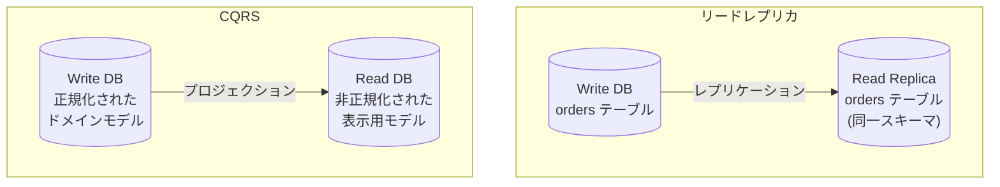

## 10. Axon FrameworkとEventStoreDBによる実装例

### 10.1 Axon Framework（Java/Kotlin）

Axon Frameworkは、Java/Kotlin向けのCQRS + イベントソーシングフレームワークである。集約、コマンドハンドラ、イベントハンドラ、プロジェクションを宣言的に定義できる。

```java
// Aggregate
@Aggregate
public class OrderAggregate {

    @AggregateIdentifier
    private String orderId;
    private OrderStatus status;
    private BigDecimal totalAmount;

    // Command handler
    @CommandHandler
    public OrderAggregate(PlaceOrderCommand cmd) {
        // Validate business rules
        if (cmd.getItems().isEmpty()) {
            throw new IllegalArgumentException("Order must have at least one item");
        }
        // Emit event (NOT direct state mutation)
        AggregateLifecycle.apply(new OrderPlacedEvent(
            cmd.getOrderId(),
            cmd.getCustomerId(),
            cmd.getItems(),
            cmd.getTotalAmount()
        ));
    }

    // Event sourcing handler (state reconstruction)
    @EventSourcingHandler
    public void on(OrderPlacedEvent event) {
        this.orderId = event.getOrderId();
        this.status = OrderStatus.PLACED;
        this.totalAmount = event.getTotalAmount();
    }

    @CommandHandler
    public void handle(ShipOrderCommand cmd) {
        if (this.status != OrderStatus.PLACED) {
            throw new IllegalStateException("Can only ship placed orders");
        }
        AggregateLifecycle.apply(new OrderShippedEvent(this.orderId));
    }

    @EventSourcingHandler
    public void on(OrderShippedEvent event) {
        this.status = OrderStatus.SHIPPED;
    }
}

// Projection (Read Side)
@Component
public class OrderSummaryProjection {

    private final OrderSummaryRepository repository;

    @EventHandler
    public void on(OrderPlacedEvent event) {
        repository.save(new OrderSummary(
            event.getOrderId(),
            event.getCustomerId(),
            event.getTotalAmount(),
            "PLACED"
        ));
    }

    @EventHandler
    public void on(OrderShippedEvent event) {
        repository.findById(event.getOrderId())
            .ifPresent(summary -> {
                summary.setStatus("SHIPPED");
                repository.save(summary);
            });
    }
}
```

### 10.2 EventStoreDB

EventStoreDBは、イベントソーシング専用のデータベースである。ストリームの管理、楽観的同時実行制御、サーバーサイドプロジェクション、永続的購読をネイティブにサポートする。

```typescript
import { EventStoreDBClient, jsonEvent } from "@eventstore/db-client";

// Connect to EventStoreDB
const client = EventStoreDBClient.connectionString(
  "esdb://localhost:2113?tls=false"
);

// Append events to a stream
const event = jsonEvent({
  type: "OrderPlaced",
  data: {
    orderId: "order-123",
    customerId: "cust-456",
    totalAmount: 5000,
    items: [
      { productId: "prod-A", quantity: 2, unitPrice: 2500 },
    ],
  },
});

await client.appendToStream("order-order-123", [event], {
  expectedRevision: "no_stream", // optimistic concurrency
});

// Read events from a stream
const events = client.readStream("order-order-123");

for await (const resolvedEvent of events) {
  console.log(resolvedEvent.event?.type);
  console.log(resolvedEvent.event?.data);
}

// Subscribe to all events (for projections)
const subscription = client.subscribeToAll({
  fromPosition: "start",
  filter: {
    filterOn: "streamName",
    prefixes: ["order-"],
  },
});

for await (const resolvedEvent of subscription) {
  // Update read model based on event
  await updateProjection(resolvedEvent);
}
```

## 11. まとめと実践へのガイド

### 11.1 段階的な導入戦略

イベントソーシングとCQRSは、システム全体に一度に導入する必要はない。以下のような段階的アプローチが推奨される。

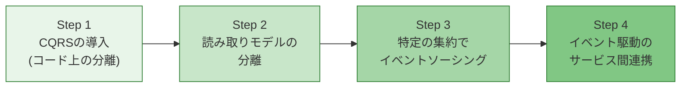

1. **Step 1**: コマンドとクエリのコードを分離する。同じデータベースを使いながら、書き込みと読み取りのインターフェースを分ける
2. **Step 2**: 読み取り専用のデータストア（Elasticsearch、Redis など）を導入し、CDCやイベントで同期する
3. **Step 3**: ビジネス上重要な集約（注文、決済など）でイベントソーシングを採用する。すべてのエンティティをイベントソーシングにする必要はない
4. **Step 4**: サービス間の通信をイベント駆動に移行し、各サービスが他サービスのイベントを購読してプロジェクションを維持する

### 11.2 設計判断のチェックリスト

イベントソーシングとCQRSの導入を検討する際は、以下のチェックポイントを確認する。

- **ドメインの適合性**: そのドメインは「変更の履歴」に本質的な価値があるか？
- **チームの準備状況**: チームがイベント駆動の設計パターンに習熟しているか？
- **結果整合性の許容**: ユーザーやビジネスが結果整合性を許容できるか？
- **運用体制**: プロジェクション、イベントストア、メッセージブローカーを運用する体制があるか？
- **段階的導入の計画**: 全面導入ではなく、段階的に導入する計画があるか？

### 11.3 結論

イベントソーシングとCQRSは、データの管理方法に対する根本的な発想の転換を提案するパターンである。「現在の状態」を直接保存する代わりに「状態に至るまでの変更の歴史」を記録するイベントソーシングと、読み取りと書き込みのモデルを分離するCQRSの組み合わせは、監査性、柔軟性、スケーラビリティの面で大きな利点をもたらす。

しかし、これらのパターンは銀の弾丸ではない。複雑性の増加、結果整合性への対応、イベントスキーマの進化といった課題を伴う。重要なのは、**ドメインの特性とシステムの要件に基づいて、適切な粒度で採用する**ことである。すべてのシステムにイベントソーシングが必要なわけではなく、すべてのエンティティにCQRSが必要なわけでもない。

会計の複式簿記が数百年の歴史を持つように、イベントソーシングの「すべてを記録する」というアプローチは、特定のドメインにおいて本質的に正しい設計思想である。自分のシステムがそのドメインに該当するかを見極め、適切に活用することが、ソフトウェアアーキテクトに求められる判断力である。
