# 結果整合性とCRDTs

## 1. はじめに：分散システムにおける一貫性の課題

分散システムを設計する際、避けて通れない根本的な問いがある。「複数のノードにまたがるデータの一貫性をどのように保証するか」という問いである。

理想的には、すべてのノードが常に同一のデータを保持し、どのノードに問い合わせても同じ応答が返ることが望ましい。これは**強い一貫性（Strong Consistency）**と呼ばれ、プログラマにとっては最も直感的なモデルである。しかし、ネットワーク分断（Partition）が発生しうる現実の分散環境では、強い一貫性を維持しようとすると、可用性（Availability）を犠牲にせざるを得ない。これがCAP定理の核心的な洞察である。

この制約の中で生まれた実用的な妥協点が**結果整合性（Eventual Consistency）**である。結果整合性は「更新がすべてのレプリカに即座に反映されることは保証しないが、新たな更新が行われなければ、最終的にはすべてのレプリカが同じ状態に収束する」という保証を提供する。Amazon DynamoDB、Apache Cassandra、Riakなど、高可用性を重視する分散データストアの多くがこのモデルを採用している。

しかし、結果整合性を実現するには、レプリカ間で生じる**競合（Conflict）**をどのように解決するかという難題に向き合わなければならない。同じデータに対して、異なるノードで同時に異なる更新が行われた場合、最終的な状態をどう決定するのか。Last-Writer-Wins（LWW）のような単純な戦略では、データの損失が発生しうる。アプリケーションレベルでの競合解決はプログラマの負担が大きく、バグの温床にもなる。

この競合解決の問題に対して、数学的に厳密な解決策を提供するのが**CRDT（Conflict-free Replicated Data Type）**である。CRDTは、データ型そのものに競合が発生しない性質を組み込むことで、任意の順序でレプリカ間の同期が行われても、自動的に一貫した状態に収束することを保証する。本記事では、一貫性モデルの基礎からCRDTの理論的基盤、代表的なCRDTの実装、そして実世界での採用事例までを包括的に解説する。

## 2. 一貫性モデルの概要

### 2.1 強い一貫性と結果整合性のスペクトラム

分散システムにおける一貫性モデルは、保証の強さに応じてスペクトラムを形成する。以下に代表的なモデルを示す。

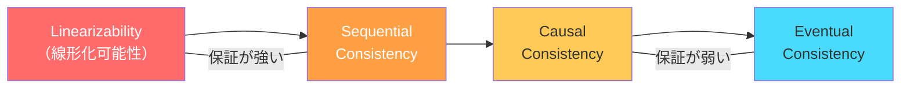

| 一貫性モデル | 保証内容 | 代表的なシステム |
|---|---|---|
| **Linearizability** | すべての操作があたかも単一のグローバルな順序で実行されたかのように見える | Spanner, etcd, ZooKeeper |
| **Sequential Consistency** | すべてのプロセスが同じ操作の順序を観測する（リアルタイム順序は不要） | — |
| **Causal Consistency** | 因果関係のある操作の順序が保存される | COPS, MongoDB（一部設定） |
| **Eventual Consistency** | 更新停止後、最終的にすべてのレプリカが収束する | DynamoDB, Cassandra, Riak |

### 2.2 強い一貫性のコスト

強い一貫性を実現するためには、各操作について複数のノード間で合意を取る必要がある。例えば、Linearizabilityを保証するためには、Raftなどのコンセンサスプロトコルを使用し、過半数のノードからの応答を待つ必要がある。

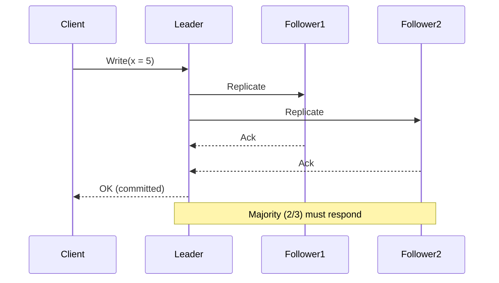

この方式は正確性を保証するが、以下のコストを伴う。

- **レイテンシの増加**：過半数のノードの応答を待つため、最も遅いノードに律速される
- **可用性の低下**：過半数のノードが到達不能になると書き込みができない
- **地理的分散の困難**：大陸間をまたぐレプリケーションでは数百ミリ秒のレイテンシが加算される

### 2.3 結果整合性の魅力

結果整合性は、これらのコストを大幅に削減する。各ノードがローカルで即座に書き込みを受け付け、非同期にレプリカ間で同期を行うことで、以下の利点を得られる。

- **低レイテンシ**：ローカルノードへの書き込みが即座に完了する
- **高可用性**：ネットワーク分断中もすべてのノードで読み書きが継続可能
- **地理的分散の容易さ**：異なるリージョンのレプリカが独立に動作できる

## 3. CAP定理との関係

### 3.1 CAP定理の再考

Eric Brewerが2000年に提唱し、Seth GilbertとNancy Lynchが2002年に形式的に証明したCAP定理は、分散システムにおいて以下の3つの性質を同時に満たすことは不可能であると述べる。

- **Consistency（一貫性）**：すべてのノードが同時に同じデータを見る
- **Availability（可用性）**：すべてのリクエストが応答を受け取る
- **Partition Tolerance（分断耐性）**：ネットワーク分断が発生してもシステムが動作し続ける

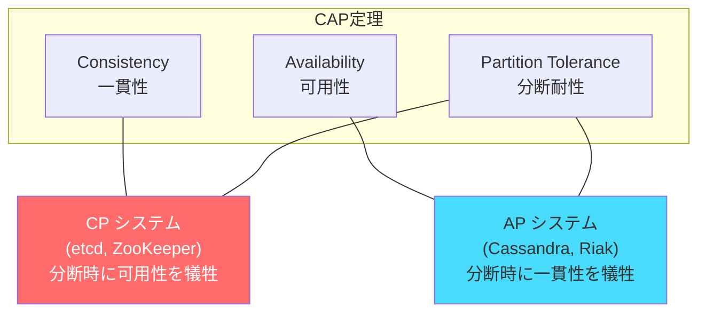

現実のネットワークでは分断は必ず起こりうる（Partition Toleranceは選択の余地がない）ため、実質的にはCとAのトレードオフとなる。結果整合性を採用するシステムは、APの立場を選び、分断中も書き込みを受け付ける代わりに、一時的な不整合を許容する。

### 3.2 PACELC定理

Daniel Abadi が提案したPACELC定理は、CAP定理をさらに拡張し、分断がない通常時（Else）のトレードオフも考慮する。

> Partition が発生した場合、Availability と Consistency のどちらを選ぶか（PAC）。分断がない場合（Else）、Latency と Consistency のどちらを選ぶか（LC）。

結果整合性を採用するシステムの多くは**PA/EL**——つまり、分断時には可用性を優先し、通常時にはレイテンシを優先する。

| システム | 分断時（PA/PC） | 通常時（EL/EC） | 分類 |
|---|---|---|---|
| DynamoDB | PA | EL | PA/EL |
| Cassandra | PA | EL（設定次第でECも可能） | PA/EL |
| Spanner | PC | EC | PC/EC |
| MongoDB | PA（デフォルト） | EC（Write Concern設定次第） | PA/EC |

## 4. 結果整合性の定義と種類

### 4.1 形式的定義

結果整合性の形式的な定義は、Werner Vogelsの2008年の論文 *"Eventually Consistent"* による以下の表現が広く知られている。

> もしオブジェクトに対する新たな更新が行われなければ、最終的にはすべてのアクセスがそのオブジェクトの最後に更新された値を返す。

この定義を形式的に表現すると、以下のようになる。

レプリカ集合 $R = \{r_1, r_2, ..., r_n\}$ に対して、時刻 $t_w$ に書き込み操作 $w$ が行われたとする。$t_w$ 以降に新たな書き込みが行われなければ、ある時刻 $t_c > t_w$ が存在し、$t \geq t_c$ であるすべての時刻 $t$ において、すべてのレプリカ $r_i$ が $w$ の結果を反映した同一の値を返す。$t_c - t_w$ を**収束時間（convergence window）**と呼ぶ。

### 4.2 結果整合性の変種

結果整合性には、追加の保証を提供するいくつかの変種がある。

**Read-your-writes Consistency（自身の書き込みの読み取り保証）**

プロセスが値を書き込んだ後、同じプロセスが読み取りを行うと、書き込んだ値（またはそれ以降の値）が返されることを保証する。これは、セッション保証（Session Guarantee）の一種である。

**Monotonic Read Consistency（単調読み取り一貫性）**

あるプロセスが値 $v$ を読み取った後、同じプロセスが再度読み取りを行うと、$v$ またはそれ以降の値が返されることを保証する。時間を逆行するような読み取りは発生しない。

**Monotonic Write Consistency（単調書き込み一貫性）**

同一プロセスによる書き込みが、すべてのレプリカで同じ順序で適用されることを保証する。

**Causal Consistency（因果一貫性）**

因果関係のある操作の順序がすべてのレプリカで保存されることを保証する。操作AがBに因果的に先行する場合、すべてのレプリカでAがBの前に適用される。

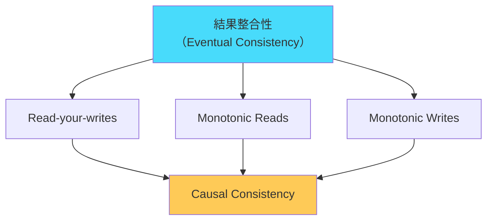

### 4.3 競合解決の課題

結果整合性を採用するシステムでは、複数のレプリカに対して同時に異なる更新が行われる**書き込み競合（Write Conflict）**が発生しうる。この競合をどのように解決するかが、システム設計における最大の課題の一つである。

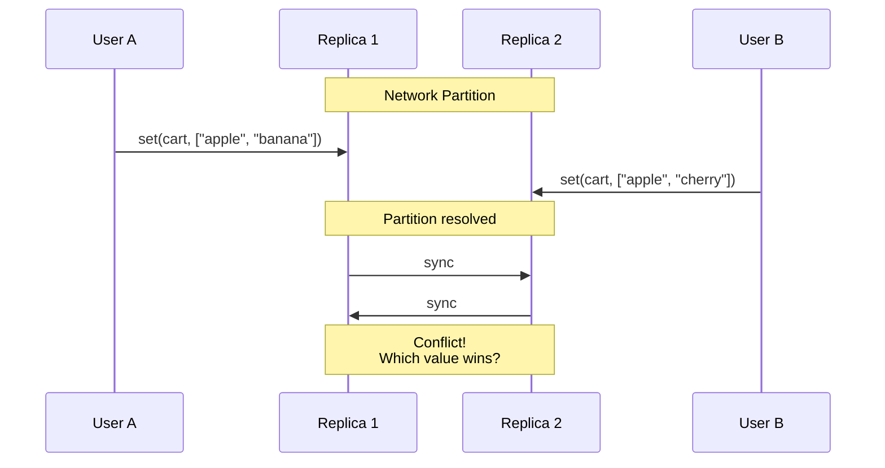

代表的な競合解決戦略を以下に示す。

| 戦略 | 動作 | 長所 | 短所 |
|---|---|---|---|
| **Last-Writer-Wins (LWW)** | タイムスタンプが最新の書き込みが勝つ | 実装が簡単 | データ損失の可能性 |
| **First-Writer-Wins** | 最初の書き込みが優先される | 不変性の保証 | 更新が拒否される |
| **アプリケーション解決** | 競合をアプリケーションに通知し、解決を委ねる | 柔軟 | プログラマの負担大 |
| **CRDT** | データ型の数学的性質により自動解決 | 自動的・正確 | 使えるデータ型に制約 |

## 5. CRDTの基本概念

### 5.1 CRDTとは何か

CRDT（Conflict-free Replicated Data Type）は、2011年にMarc Shapiro、Nuno Preguica、Carlos Baquero、Marek Zawirskiらが体系化したデータ型の概念である。CRDTは、その数学的構造により、レプリカ間の同期がどのような順序で行われても、すべてのレプリカが同一の状態に収束することを保証する。

CRDTの本質は、「競合を解決する」のではなく、「そもそも競合が発生しない」ようにデータ型を設計するという発想の転換にある。

### 5.2 State-based CRDT（CvRDT）

**State-based CRDT**（Convergent Replicated Data Type、CvRDTとも呼ばれる）は、レプリカ間で**完全な状態**をやり取りする方式である。

各レプリカは自身のローカル状態を保持し、定期的に他のレプリカと状態を交換する。受信した状態とローカル状態を**マージ関数**で結合することにより、収束を達成する。

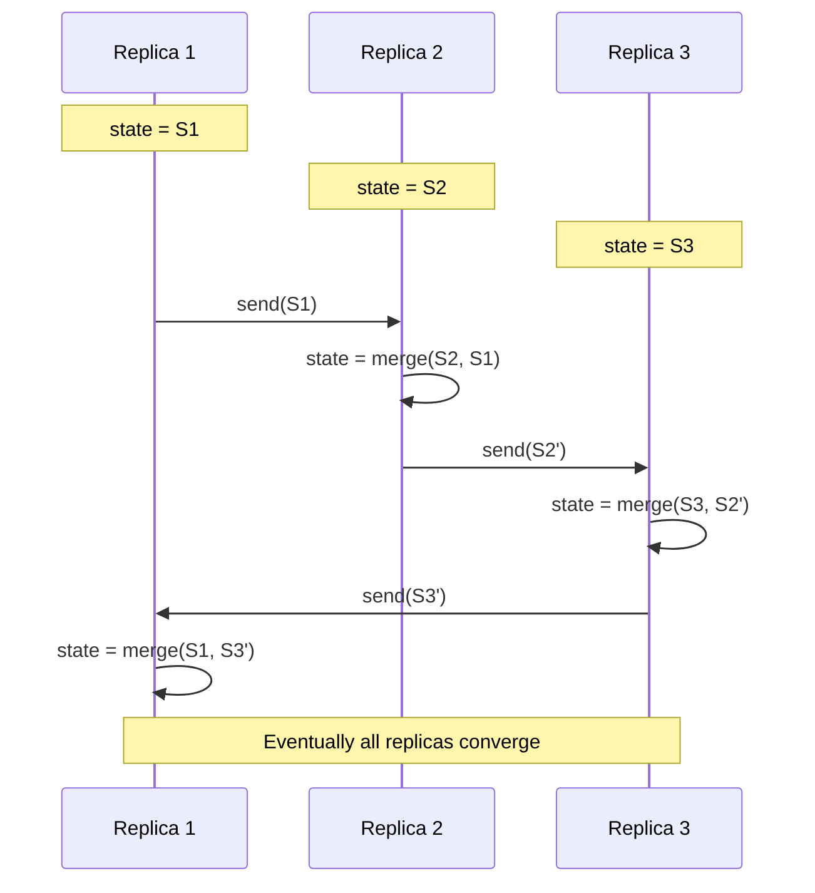

State-based CRDTが収束するための条件は以下のとおりである。

1. 状態の集合が**結合半束（Join-Semilattice）**を形成すること
2. マージ関数が半束の**最小上界（Least Upper Bound, LUB）**演算であること
3. 更新操作が**単調増加（monotonically increasing）**であること

### 5.3 Operation-based CRDT（CmRDT）

**Operation-based CRDT**（Commutative Replicated Data Type、CmRDTとも呼ばれる）は、レプリカ間で**操作（Operation）**をやり取りする方式である。

各レプリカは、ローカルで操作を実行した後、その操作を他のすべてのレプリカにブロードキャストする。受信側は、受信した操作を自身の状態に適用する。

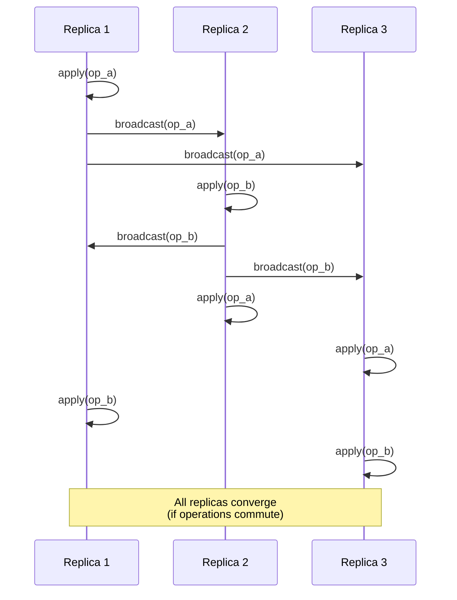

Operation-based CRDTが収束するための条件は以下のとおりである。

1. すべての並行操作が**可換（Commutative）**であること：$op_a \circ op_b = op_b \circ op_a$
2. メッセージ配信が**信頼できる（Reliable）**こと：すべての操作が最終的にすべてのレプリカに届く
3. メッセージ配信が**因果順序**を守ること（因果関係のある操作は正しい順序で届く）

### 5.4 State-based vs Operation-based の比較

| 特性 | State-based (CvRDT) | Operation-based (CmRDT) |
|---|---|---|
| 通信内容 | 完全な状態 | 操作のみ |
| 通信量 | 状態が大きいと大 | 通常は小さい |
| メッセージ配信要件 | 信頼性のみ（順序不問） | 信頼性＋因果順序 |
| 冪等性要件 | マージが冪等 | 操作が冪等でない場合、重複配信に注意 |
| 実装の容易さ | 比較的容易 | 配信保証の実装が複雑 |
| 適用場面 | Gossipプロトコルとの組み合わせ | 因果順序配信が使える環境 |

### 5.5 Delta-state CRDT

State-based CRDTの通信量の問題を解決するために提案されたのが**Delta-state CRDT**（$\delta$-CRDT）である。完全な状態ではなく、最近の変更分（delta）のみを送信することで、State-based CRDTの理論的保証を維持しつつ、通信量をOperation-basedに近いレベルまで削減する。

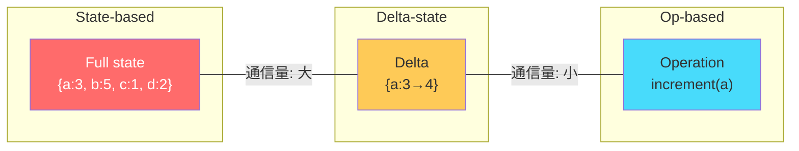

Delta-state CRDTは、Antidote DBやAkka Distributed Dataで採用されている。

## 6. 代表的なCRDT

### 6.1 G-Counter（Grow-Only Counter）

G-Counterは、値の増加のみが可能なカウンターである。分散環境でのカウントアップ（例：ページビュー数、いいね数）に使用される。

**設計思想**

単一のカウンター値を共有するのではなく、各レプリカが自身のカウンター値を独立に保持する。全体のカウント値は、すべてのレプリカの値の合計として算出される。

**データ構造**

各レプリカ $i$ がローカルカウンター $c_i$ を持つベクトル $[c_1, c_2, ..., c_n]$。

```python
class GCounter:
    def __init__(self, node_id, num_nodes):
        self.node_id = node_id
        # Each node maintains its own counter
        self.counters = [0] * num_nodes

    def increment(self):
        # Only increment own counter
        self.counters[self.node_id] += 1

    def value(self):
        # Total value is the sum of all counters
        return sum(self.counters)

    def merge(self, other):
        # Take element-wise maximum
        for i in range(len(self.counters)):
            self.counters[i] = max(self.counters[i], other.counters[i])
```

**収束の証明**

マージ操作は要素ごとの `max` であり、`max` は可換（$\max(a,b) = \max(b,a)$）、結合的（$\max(a,\max(b,c)) = \max(\max(a,b),c)$）、冪等（$\max(a,a) = a$）である。したがって、G-Counterのマージは結合半束のLUB演算であり、State-based CRDTの収束条件を満たす。

**具体例**

```
Initial state:
  Replica A: [0, 0, 0]    value = 0
  Replica B: [0, 0, 0]    value = 0
  Replica C: [0, 0, 0]    value = 0

Replica A increments twice:
  Replica A: [2, 0, 0]    value = 2

Replica B increments three times:
  Replica B: [0, 3, 0]    value = 3

After merge(A, B):
  [max(2,0), max(0,3), max(0,0)] = [2, 3, 0]    value = 5
```

### 6.2 PN-Counter（Positive-Negative Counter）

G-Counterでは値の増加しかできない。減少（デクリメント）もサポートするために、PN-Counterは2つのG-Counterを組み合わせる。

**データ構造**

正のカウンター（P）と負のカウンター（N）の2つのG-Counterを保持する。実際の値は $P - N$ として算出される。

```python
class PNCounter:
    def __init__(self, node_id, num_nodes):
        # Positive counter (increments)
        self.p = GCounter(node_id, num_nodes)
        # Negative counter (decrements)
        self.n = GCounter(node_id, num_nodes)

    def increment(self):
        self.p.increment()

    def decrement(self):
        self.n.increment()

    def value(self):
        # Actual value = increments - decrements
        return self.p.value() - self.n.value()

    def merge(self, other):
        self.p.merge(other.p)
        self.n.merge(other.n)
```

PN-Counterは、G-Counterの収束性質を継承しているため、自動的に収束が保証される。ただし、値が0未満になることを防ぐ**境界カウンター**は標準的なCRDTでは実現が困難であり、追加の協調メカニズムが必要になる。

### 6.3 G-Set（Grow-Only Set）

G-Setは、要素の追加のみが可能な集合である。一度追加された要素は削除できない。

```python
class GSet:
    def __init__(self):
        self.elements = set()

    def add(self, element):
        self.elements.add(element)

    def lookup(self, element):
        return element in self.elements

    def merge(self, other):
        # Union of sets
        self.elements = self.elements | other.elements
```

マージ操作は集合の和（Union）であり、和は可換・結合的・冪等であるため、G-Setは自明にCRDTである。

### 6.4 2P-Set（Two-Phase Set）

G-Setに削除機能を加えたものが2P-Setである。追加集合（A）と削除集合（R、tombstone set）の2つのG-Setを保持する。

```python
class TwoPSet:
    def __init__(self):
        self.add_set = set()       # Elements that have been added
        self.remove_set = set()    # Elements that have been removed (tombstones)

    def add(self, element):
        self.add_set.add(element)

    def remove(self, element):
        if element in self.add_set:
            self.remove_set.add(element)

    def lookup(self, element):
        # Element is present if added and not removed
        return element in self.add_set and element not in self.remove_set

    def merge(self, other):
        self.add_set = self.add_set | other.add_set
        self.remove_set = self.remove_set | other.remove_set
```

2P-Setの制約は、**一度削除した要素を再追加できない**ことである。また、追加と削除が並行して行われた場合、削除が優先される（remove-wins セマンティクス）。

### 6.5 OR-Set（Observed-Remove Set）

2P-Setの制約を克服するために設計されたのがOR-Set（Observed-Remove Set、Add-Wins Setとも呼ばれる）である。OR-Setでは、要素の再追加が可能であり、追加と削除が並行した場合は**追加が優先**される。

**設計のアイデア**

各追加操作に一意のタグ（UUID等）を付与する。削除操作は、その時点で観測可能なタグのみを削除する。並行して別のレプリカで行われた追加操作のタグは削除対象にならないため、追加が優先される。

```python
import uuid

class ORSet:
    def __init__(self):
        # Set of (element, unique_tag) pairs
        self.elements = set()

    def add(self, element):
        # Generate a unique tag for this add operation
        tag = str(uuid.uuid4())
        self.elements.add((element, tag))

    def remove(self, element):
        # Remove all currently observed tags for this element
        self.elements = {
            (e, t) for (e, t) in self.elements if e != element
        }

    def lookup(self, element):
        return any(e == element for (e, _) in self.elements)

    def value(self):
        return {e for (e, _) in self.elements}

    def merge(self, other):
        # Union of element-tag pairs
        self.elements = self.elements | other.elements
```

::: tip OR-Setの追加優先セマンティクス
OR-Setでは、Replica Aで `add("x")` を行い、並行してReplica Bで `remove("x")` を行った場合、マージ後に `"x"` は集合に残る。Replica Aの追加操作で付与された新しいタグは、Replica Bの削除操作の時点では観測されていないため、削除対象にならないからである。
:::

**具体例**

```
Replica A:
  add("apple")  → elements = {("apple", "tag-1")}
  add("banana") → elements = {("apple", "tag-1"), ("banana", "tag-2")}

Replica B (received merge from A earlier):
  elements = {("apple", "tag-1"), ("banana", "tag-2")}
  remove("apple") → elements = {("banana", "tag-2")}

Replica A (concurrently):
  add("apple")  → elements = {("apple", "tag-1"), ("banana", "tag-2"), ("apple", "tag-3")}

After merge(A, B):
  elements = {("banana", "tag-2"), ("apple", "tag-3")}
  → "apple" is still present (tag-3 was not observed by B's remove)
```

### 6.6 LWW-Register（Last-Writer-Wins Register）

LWW-Registerは、最新のタイムスタンプを持つ値が勝つという単純な戦略を採用するレジスタである。

```python
class LWWRegister:
    def __init__(self):
        self.value = None
        self.timestamp = 0

    def set(self, value, timestamp):
        # Only update if the new timestamp is greater
        if timestamp > self.timestamp:
            self.value = value
            self.timestamp = timestamp

    def get(self):
        return self.value

    def merge(self, other):
        # The value with the greater timestamp wins
        if other.timestamp > self.timestamp:
            self.value = other.value
            self.timestamp = other.timestamp
```

LWW-Registerの`max`によるタイムスタンプ比較は全順序を定義し、マージ操作は結合半束のLUBを構成する。

::: warning LWW-Registerの注意点
LWW-Registerは、並行する更新のうち1つだけを採用するため、**データ損失**が発生しうる。また、分散環境でのタイムスタンプの正確性（時計の同期問題）にも注意が必要である。NTPの精度限界やクロックスキューにより、「最新」の判定が意図と異なる場合がある。
:::

### 6.7 LWW-Element-Set

LWW-RegisterのアイデアをSetに拡張したものがLWW-Element-Setである。各要素に追加タイムスタンプと削除タイムスタンプを付与し、タイムスタンプの比較によって要素の有無を判定する。

```python
class LWWElementSet:
    def __init__(self):
        self.add_map = {}     # element -> timestamp
        self.remove_map = {}  # element -> timestamp

    def add(self, element, timestamp):
        if element not in self.add_map or timestamp > self.add_map[element]:
            self.add_map[element] = timestamp

    def remove(self, element, timestamp):
        if element not in self.remove_map or timestamp > self.remove_map[element]:
            self.remove_map[element] = timestamp

    def lookup(self, element):
        if element not in self.add_map:
            return False
        if element not in self.remove_map:
            return True
        # add wins if timestamps are equal (bias toward add)
        return self.add_map[element] >= self.remove_map[element]

    def merge(self, other):
        for elem, ts in other.add_map.items():
            if elem not in self.add_map or ts > self.add_map[elem]:
                self.add_map[elem] = ts
        for elem, ts in other.remove_map.items():
            if elem not in self.remove_map or ts > self.remove_map[elem]:
                self.remove_map[elem] = ts
```

### 6.8 MV-Register（Multi-Value Register）

LWW-Registerと異なり、MV-Register（Multi-Value Register）は並行する更新をすべて保持し、競合を明示的に表現する。Amazon DynamoDBのSibling Values（旧バージョンのRiakも同様）がこの方式を採用している。

並行する書き込みが検出された場合、MV-Registerはすべての値を保持し、読み取り時にアプリケーションに対して「複数の値が存在する」ことを通知する。最終的な解決はアプリケーションに委ねられる。

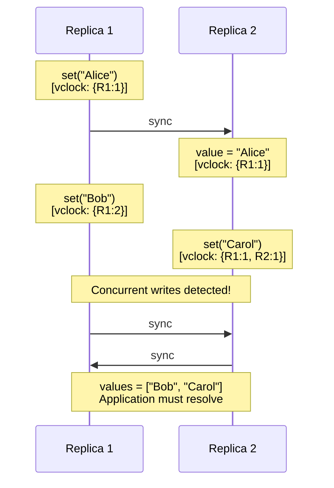

## 7. CRDTの数学的基盤

### 7.1 半束（Semilattice）

CRDTの理論的基盤は、順序理論における**半束（Semilattice）**の概念にある。

**定義**：集合 $S$ と二項演算 $\sqcup$（join, LUB）が以下の性質を満たすとき、$(S, \sqcup)$ を**結合半束（Join-Semilattice）**と呼ぶ。

1. **可換律（Commutativity）**：$a \sqcup b = b \sqcup a$
2. **結合律（Associativity）**：$a \sqcup (b \sqcup c) = (a \sqcup b) \sqcup c$
3. **冪等律（Idempotency）**：$a \sqcup a = a$

これらの3つの性質が、CRDTの収束を保証する鍵である。

$$
\text{Commutativity} \Rightarrow \text{順序に依存しない}
$$
$$
\text{Associativity} \Rightarrow \text{グループ化に依存しない}
$$
$$
\text{Idempotency} \Rightarrow \text{重複適用が安全}
$$

### 7.2 半束と半順序

結合半束 $(S, \sqcup)$ は、以下の関係により**半順序集合（Partially Ordered Set, poset）**を自然に誘導する。

$$
a \leq b \iff a \sqcup b = b
$$

この半順序は、CRDTの状態の「進化の方向」を定義する。状態は半順序に沿って単調に増加し、後退することはない。

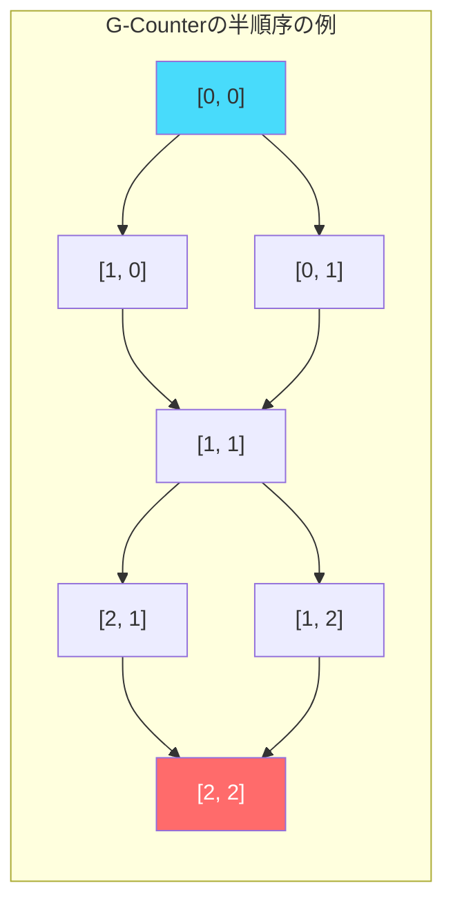

### 7.3 結合準同型（Join Homomorphism）

State-based CRDTにおいて、更新操作 $f$ が半束の構造を保存する必要がある。具体的には、更新操作は**インフレーション**（膨張）である必要がある。つまり、

$$
s \leq f(s)
$$

すべての状態 $s$ に対して、更新操作の適用後の状態が元の状態以上（半順序の意味で）であること。これは、状態が半束の中で**単調に上昇**することを意味し、更新操作がすでに達成された情報を失わないことを保証する。

### 7.4 Operation-based CRDTの可換性

Operation-based CRDTでは、半束の代わりに操作の**可換性**が収束を保証する。

並行する操作 $op_1$ と $op_2$ に対して、

$$
\sigma \circ op_1 \circ op_2 = \sigma \circ op_2 \circ op_1
$$

が任意の状態 $\sigma$ で成り立つとき、操作は可換であると言える。可換性により、並行する操作をどの順序で適用しても同じ最終状態に到達する。

::: details State-based と Operation-based の等価性
Shapiroらの論文では、State-based CRDTとOperation-based CRDTの表現力が等価であることが示されている。任意のState-based CRDTはOperation-based CRDTとして表現でき、その逆も成り立つ。ただし、通信要件が異なるため（State-basedは順序不問、Operation-basedは因果順序が必要）、実装上の特性は異なる。
:::

## 8. 高度なCRDT

### 8.1 RGA（Replicated Growable Array）

RGAは、共同編集テキストの実装に使用される順序付きリストのCRDTである。各要素に一意のIDを付与し、挿入位置を「既存の要素の後」として指定する。

```
Document: "HELLO"

Structure:
  root → H(id:A1) → E(id:A2) → L(id:A3) → L(id:A4) → O(id:A5)

User A inserts "!" after O:
  root → H(id:A1) → E(id:A2) → L(id:A3) → L(id:A4) → O(id:A5) → !(id:A6)

User B (concurrently) inserts "?" after O:
  root → H(id:A1) → E(id:A2) → L(id:A3) → L(id:A4) → O(id:A5) → ?(id:B1)

After merge (tie-breaking by node ID):
  root → H(id:A1) → E(id:A2) → L(id:A3) → L(id:A4) → O(id:A5) → ?(id:B1) → !(id:A6)
  Result: "HELLO?!"
```

### 8.2 JSON CRDT

Automergeなどのライブラリが実装するJSON CRDTは、ネストされたオブジェクト・配列・プリミティブ値をCRDTとして扱う。

構造としては、以下のCRDTを再帰的に組み合わせる。

- **オブジェクト**：キーから値への写像（各値がCRDT）
- **配列**：RGAベースの順序付きリスト
- **レジスタ**：LWW-RegisterまたはMV-Register
- **カウンター**：PN-Counter

```
{
  "title": "Meeting Notes",        // LWW-Register
  "attendees": ["Alice", "Bob"],   // RGA (ordered list CRDT)
  "votes": 5,                      // PN-Counter
  "metadata": {                    // Nested map CRDT
    "created": "2026-03-01"        // LWW-Register
  }
}
```

### 8.3 Merkle-CRDT

Merkle-CRDTは、CRDTの同期にMerkleツリー（ハッシュツリー）を利用する手法である。各レプリカの状態をMerkleツリーとして表現し、ルートハッシュの比較だけで状態の差異を検出できる。差異がある部分木のみを交換することで、効率的な同期を実現する。

IPFSのデータ構造であるMerkle-DAGとCRDTの組み合わせは、分散ストレージにおける整合性の保証に有用である。

## 9. 実用例

### 9.1 Riak

Riakは、CRDTを最初期から組み込んだ分散キーバリューストアの一つである。Basho Technologies（現在はTI Tokyo）が開発し、Amazon Dynamoの論文に強く影響を受けている。

Riakは以下のCRDTをネイティブにサポートしている。

| Riak Data Type | 対応するCRDT | 用途例 |
|---|---|---|
| Counter | PN-Counter | いいね数、ページビュー |
| Set | OR-Set | タグ、メンバーリスト |
| Map | 再帰的CRDT Map | ユーザープロファイル |
| Register | LWW-Register | 最終更新値 |
| Flag | LWW-Register (boolean) | トグル状態 |

Riakでは、CRDTは `CRDT bucket type` として定義され、通常のキーバリュー操作とは異なるAPIを通じてアクセスされる。

### 9.2 Redis CRDT（Redis Enterprise）

Redis Enterpriseは、Active-Activeレプリケーション（旧称CRDBs: Conflict-free Replicated Databases）を通じてCRDTを実装している。複数の地理的に分散したクラスタ間で、CRDTベースの競合解決を自動的に行う。

Redisが対応するCRDTの対応関係は以下のとおりである。

| Redisコマンド | CRDT方式 |
|---|---|
| `INCR` / `DECR` | PN-Counter |
| `SET` | LWW-Register |
| `SADD` / `SREM` | OR-Set |
| `RPUSH` / `LPUSH` | 独自のリストCRDT |

### 9.3 Automerge

Automergeは、Martin Kleppmannらが開発したJSON CRDTライブラリである。テキスト、リスト、マップなどのネストされたデータ構造を、CRDTとして透過的に扱える。

```javascript
// Automerge usage example
import * as Automerge from 'automerge';

// Create initial document
let doc1 = Automerge.init();
doc1 = Automerge.change(doc1, 'Initialize', doc => {
  doc.title = 'Shopping List';
  doc.items = ['milk', 'eggs'];
});

// Fork for concurrent editing
let doc2 = Automerge.clone(doc1);

// Concurrent edits on doc1
doc1 = Automerge.change(doc1, 'Add bread', doc => {
  doc.items.push('bread');
});

// Concurrent edits on doc2
doc2 = Automerge.change(doc2, 'Add butter', doc => {
  doc.items.push('butter');
});

// Merge — no conflicts!
let merged = Automerge.merge(doc1, doc2);
// merged.items = ['milk', 'eggs', 'bread', 'butter']
// (order may vary, but both items are preserved)
```

Automergeの特筆すべき点は以下のとおりである。

- **変更履歴の完全な保持**：Git のように、すべての変更がイミュータブルに記録される
- **高効率なバイナリフォーマット**：エンコード・デコードが高速
- **言語バインディング**：JavaScript/TypeScript、Rust、C、Swift、Kotlin等

### 9.4 Yjs

Yjsは、Kevin Jahnsが開発した高性能な共同編集フレームワークである。YjsはCRDTの一種であるYATAアルゴリズムに基づいている。

Yjsの特長は以下のとおりである。

- **極めて高い性能**：他の競合ライブラリと比較して、数十倍のパフォーマンス
- **リッチテキスト対応**：Quill、ProseMirror、Monaco Editor、CodeMirrorなどのエディタとの統合
- **ネットワーク非依存**：WebRTC、WebSocket、あるいはファイル経由での同期が可能
- **サブドキュメント**：大規模ドキュメントを複数のサブドキュメントに分割し、オンデマンドでロード

```javascript
// Yjs usage example
import * as Y from 'yjs';
import { WebrtcProvider } from 'y-webrtc';

// Create a shared document
const ydoc = new Y.Doc();

// Connect via WebRTC
const provider = new WebrtcProvider('room-name', ydoc);

// Shared data types
const ytext = ydoc.getText('shared-text');
const ymap = ydoc.getMap('shared-map');
const yarray = ydoc.getArray('shared-array');

// Observe changes
ytext.observe(event => {
  console.log('Text changed:', ytext.toString());
});

// Concurrent edits are automatically merged
ytext.insert(0, 'Hello, ');
ytext.insert(7, 'World!');
```

### 9.5 CRDTの実世界での採用状況

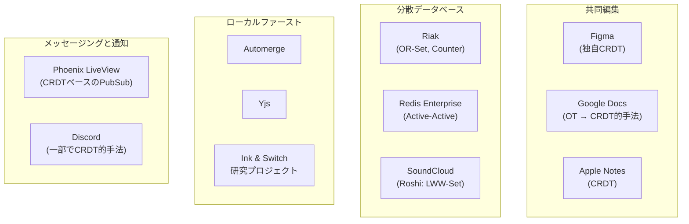

## 10. Local-First Software とCRDT

### 10.1 Local-First Softwareの思想

2019年にMartin Kleppmannらが提唱した**Local-First Software**は、CRDTの応用として特に注目されている概念である。

Local-First Softwareは、以下の7つの原則を掲げる。

1. **高速性**：操作はローカルで即座に完了する
2. **マルチデバイス対応**：複数のデバイス間でデータが同期される
3. **オフライン対応**：ネットワーク接続なしでも完全に動作する
4. **コラボレーション**：複数のユーザーがリアルタイムに共同作業できる
5. **永続性**：クラウドサービスが終了してもデータが失われない
6. **プライバシー**：データはデフォルトでローカルに保存される
7. **ユーザーの所有権**：ユーザーがデータを完全にコントロールできる

CRDTは、これらの原則のうち特に1〜4を技術的に実現する基盤として位置づけられる。

### 10.2 従来のアーキテクチャとの比較

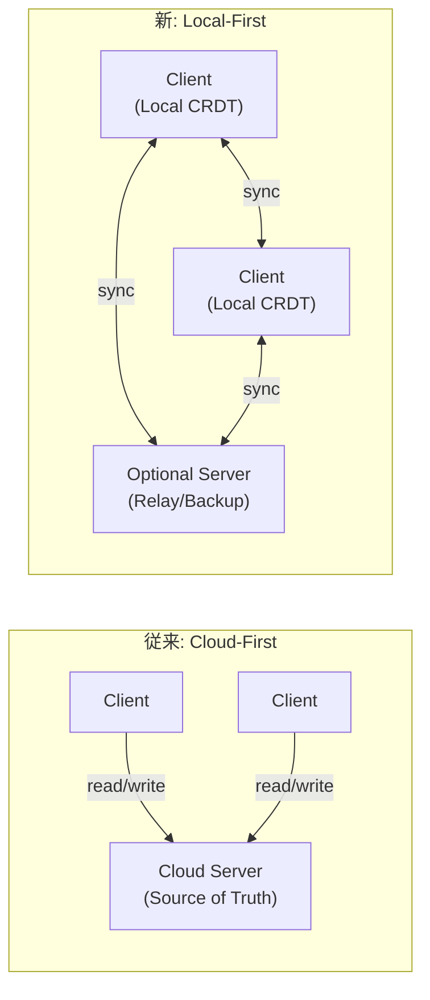

| 特性 | Cloud-First | Local-First (CRDT) |
|---|---|---|
| レイテンシ | サーバーRTT依存 | 即座（ローカル操作） |
| オフライン | 動作しない | 完全に動作 |
| データ所有権 | サービス提供者 | ユーザー |
| サービス終了時 | データ喪失リスク | データは手元に残る |
| 競合解決 | サーバーが判定 | CRDTが自動解決 |

## 11. CRDTの制約と課題

### 11.1 メタデータのオーバーヘッド

CRDTは収束を保証するためにメタデータ（タイムスタンプ、一意のタグ、Vector Clock等）を保持する必要がある。このメタデータは、データ量が増加するにつれて無視できない大きさになる。

**具体例：OR-Setのメタデータ**

OR-Setでは、各追加操作に一意のタグを付与する。要素の追加と削除が頻繁に行われるシステムでは、タグの数が際限なく増加する。削除された要素のタグ（tombstone）も状態の一部として保持し続ける必要がある場合があり、**tombstone の肥大化**は深刻な問題となる。

```
After many add/remove cycles:
  elements = {
    ("item_a", "tag-001"),
    ("item_a", "tag-047"),
    ("item_a", "tag-193"),  // only latest is "live"
    // ... hundreds of tombstones for removed items
  }
```

### 11.2 Tombstoneの蓄積

削除操作をサポートするCRDT（2P-Set、OR-Set等）では、削除された要素の記録（tombstone）を永続的に保持する必要がある。これは以下の問題を引き起こす。

- **ストレージの増大**：tombstoneがデータ本体よりも大きくなることがある
- **マージ性能の低下**：マージ操作の計算量がtombstoneの数に比例する
- **ガベージコレクションの困難**：安全にtombstoneを削除するには、すべてのレプリカがその情報を受信済みであることを確認する必要がある

tombstoneのガベージコレクション（pruning）は、「すべてのレプリカが同期済みであること」を確認する必要があるため、完全に分散化された環境では困難である。実用的には、**causal stability**（ある操作がすべてのレプリカに到達したことが確認された状態）を検出し、安定した操作に関連するメタデータを安全に削除する手法が研究されている。

### 11.3 表現力の制約

CRDTの数学的制約により、すべてのデータ操作をCRDTとして表現できるわけではない。特に以下のような操作は、CRDTとしての実現が困難または不可能である。

- **境界制約を伴うカウンター**：「在庫数は0未満にならない」のような不変条件を分散環境で保証することは、CRDTの枠組み内では困難
- **一意性制約**：「ユーザー名はグローバルに一意でなければならない」のような制約は、全レプリカ間の調整が必要
- **トランザクション的操作**：複数のCRDT操作をアトミックに実行する保証

::: warning CRDTの限界
CRDTは万能ではない。銀行口座の残高管理のように「残高が負にならない」という不変条件が絶対的に必要な場面では、CRDTだけでは解決できず、何らかの形での協調（Coordination）が必要になる。これは、CRDTがcoordination-freeであることの本質的な帰結である。
:::

### 11.4 意図の保持（Intent Preservation）

共同編集の文脈では、CRDTが数学的には正しく収束しても、ユーザーの**意図**が保持されるとは限らないという問題がある。

例えば、テキスト編集において、User Aが「Hello World」の「World」を「Earth」に変更し、同時にUser Bが「World」の後に「!」を追加した場合、CRDTはこれらを「Hello Earth!」としてマージするかもしれないが、User Bの意図は「Hello World!」であり、「Earth」に変わった文に「!」をつけることではなかった可能性がある。

この意図の保持の問題は、OT（Operational Transformation）でも同様に存在する根本的な課題であり、完全な自動解決は不可能である場合が多い。

### 11.5 パフォーマンスの課題

State-based CRDTのマージ操作は、状態のサイズに比例した計算量を必要とする。大規模なドキュメントや集合を扱う場合、マージ操作自体がボトルネックになりうる。

Delta-state CRDTや、効率的なエンコーディング（Automergeのバイナリフォーマット等）によって改善されつつあるが、リアルタイム共同編集のような高頻度の更新がある場面では、依然としてパフォーマンスへの配慮が重要である。

## 12. CRDTとOT（Operational Transformation）の比較

共同編集の分野では、CRDTの他にOT（Operational Transformation）が広く使われてきた。Google DocsがOTを採用していたことで広く知られている。

| 特性 | CRDT | OT |
|---|---|---|
| 中央サーバー | 不要 | 必要（変換の基準点） |
| オフライン編集 | ネイティブに対応 | 困難 |
| 正確性の証明 | 数学的に厳密 | 変換関数の正確性証明が困難 |
| 実装の複雑さ | データ型の設計が複雑 | 変換関数の設計が複雑 |
| メタデータ | 必要（タグ、ID等） | 少ない |
| スケーラビリティ | P2Pでスケール | サーバーがボトルネック |
| 歴史 | 2006年〜 | 1989年〜（Ellis & Gibbs） |
| 採用実績 | Figma, Yjs, Automerge | Google Docs（旧）, ShareDB |

近年の傾向として、OTからCRDTへの移行が進みつつある。これは、Local-First Softwareの台頭や、P2Pアーキテクチャへの関心の高まりが背景にある。

## 13. まとめ

### 13.1 結果整合性の位置づけ

結果整合性は、分散システムにおける一貫性と可用性のトレードオフの中で、可用性を優先する実用的な選択肢である。CAP定理が示す本質的な制約の下で、多くの実世界のシステムが結果整合性を採用している。ただし、結果整合性の採用は「一貫性を諦める」ことではなく、「収束の保証を維持しつつ、一時的な不整合を許容する」ことである。

### 13.2 CRDTの意義

CRDTは、結果整合性の実現における最大の課題——競合解決——に対して、数学的に厳密な解決策を提供する。半束の理論に基づく収束保証は、アプリケーション開発者が個々の競合解決ロジックを記述する負担を大幅に軽減する。

CRDTの核心的な洞察は以下の3点に集約される。

1. **データ型に一貫性を埋め込む**：競合をプロトコルレベルではなく、データ型の数学的構造によって解決する
2. **Coordination-free**：ノード間の明示的な調整なしに収束を保証する
3. **可換性と冪等性**：操作の順序や重複に対して不変な結果を保証する

### 13.3 今後の展望

CRDTの研究と実用は、以下の方向に進展している。

- **Local-First Software**：CRDTを基盤とした、ユーザーのデータ主権を尊重するソフトウェアアーキテクチャ
- **性能の改善**：Delta-state CRDT、効率的なエンコーディング、tombstoneのガベージコレクション
- **豊かなデータ型**：リッチテキスト、スプレッドシート、グラフ構造など、より複雑なデータ型のCRDT化
- **形式検証**：TLA+やCoqなどの形式手法によるCRDTの正確性検証
- **ハイブリッドアプローチ**：CRDTと強い一貫性を組み合わせた、柔軟な一貫性モデルの提供

CRDTは万能ではないが、分散システムにおける一貫性の問題に対して、理論的に美しく実用的に有効な解決策を提供している。結果整合性を採用するシステムの設計者にとって、CRDTは不可欠なツールキットの一部となっている。
