# Exactly-Once セマンティクス — 分散システムにおけるメッセージ配信保証の極致

## 1. はじめに：メッセージ配信セマンティクスの分類

分散システムにおいて、あるコンポーネントから別のコンポーネントへメッセージを送り、それが「正しく処理される」とはどういうことかを厳密に定義することは、見た目ほど単純ではない。ネットワークの遅延、パケットの喪失、ノードの障害など、現実の環境には不確実性が常に存在する。この不確実性に対して、メッセージングシステムがどのレベルの保証を提供するかを示す概念が**メッセージ配信セマンティクス（Message Delivery Semantics）** である。

メッセージ配信セマンティクスには、大きく分けて3つの分類がある。

### 1.1 At-Most-Once（最大1回）

メッセージは最大で1回配信される。つまり、メッセージが失われる可能性はあるが、重複して配信されることはない。送信側はメッセージを1回だけ送信し、配信が失敗しても再送しない。

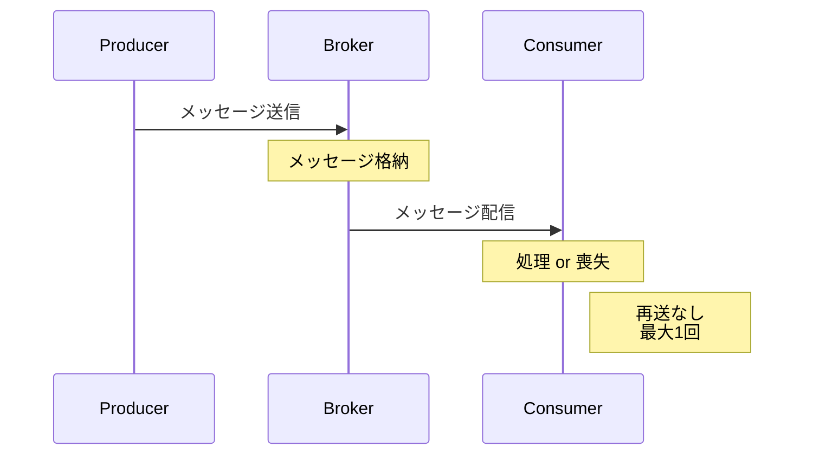
```mermaid
sequenceDiagram
    participant P as Producer
    participant B as Broker
    participant C as Consumer

    P->>B: メッセージ送信
    Note over B: メッセージ格納
    B->>C: メッセージ配信
    Note over C: 処理 or 喪失
    Note right of C: 再送なし<br/>最大1回
```

実装が最も単純であり、UDP を用いた通信やログ収集のように、一部のメッセージが欠落しても問題にならないユースケースに適している。メトリクスの収集やリアルタイムのセンサーデータの送信など、データの完全性よりもスループットを重視するケースで採用される。

### 1.2 At-Least-Once（最低1回）

メッセージは少なくとも1回配信される。配信の失敗を検出した場合、送信側が再送を行う。このため、メッセージが失われることはないが、同じメッセージが複数回配信される可能性がある。

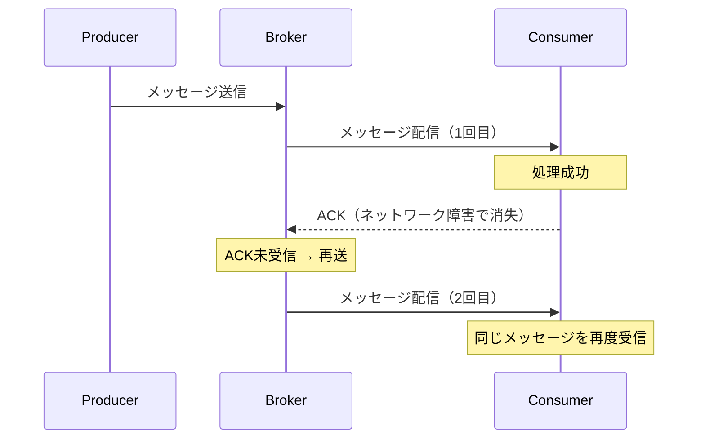
```mermaid
sequenceDiagram
    participant P as Producer
    participant B as Broker
    participant C as Consumer

    P->>B: メッセージ送信
    B->>C: メッセージ配信（1回目）
    Note over C: 処理成功
    C-->>B: ACK（ネットワーク障害で消失）
    Note over B: ACK未受信 → 再送
    B->>C: メッセージ配信（2回目）
    Note over C: 同じメッセージを再度受信
```

多くのメッセージングシステムのデフォルト設定はこのセマンティクスを提供する。RabbitMQ の手動 ACK モード、Apache Kafka のデフォルトのプロデューサー設定、Amazon SQS の標準キューなどがこれに該当する。重複が発生する可能性があるため、コンシューマー側でべき等な処理を実装する必要がある。

### 1.3 Exactly-Once（正確に1回）

メッセージは正確に1回だけ処理される。メッセージの喪失も重複もない、理想的なセマンティクスである。しかし、その実現には深刻な技術的困難が伴う。

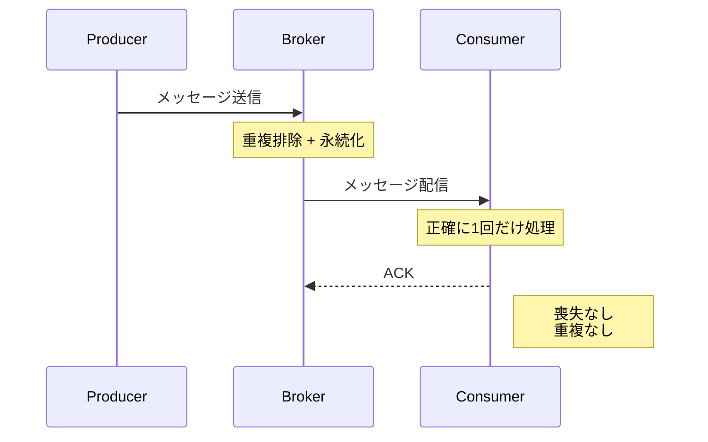
```mermaid
sequenceDiagram
    participant P as Producer
    participant B as Broker
    participant C as Consumer

    P->>B: メッセージ送信
    Note over B: 重複排除 + 永続化
    B->>C: メッセージ配信
    Note over C: 正確に1回だけ処理
    C-->>B: ACK
    Note right of C: 喪失なし<br/>重複なし
```

「Exactly-Once は不可能だ」という主張を耳にすることがあるが、これは半分正しく半分誤りである。純粋なネットワーク通信のレベルでは確かに不可能だが、システム全体としての**エフェクティブ Exactly-Once**（効果的に1回だけ処理されたのと同じ結果を得る）は、適切な設計によって実現可能である。本記事では、この区別を明確にしながら、Exactly-Once セマンティクスの実現手法を深く掘り下げる。

### 1.4 三つのセマンティクスの比較

| 特性 | At-Most-Once | At-Least-Once | Exactly-Once |
|------|-------------|---------------|-------------|
| メッセージ喪失 | あり | なし | なし |
| メッセージ重複 | なし | あり | なし |
| 実装複雑度 | 低 | 中 | 高 |
| スループット | 高 | 中〜高 | 中〜低 |
| レイテンシ | 低 | 中 | 中〜高 |
| 代表的なユースケース | ログ収集、メトリクス | メール通知、タスク処理 | 決済、在庫管理 |

## 2. Exactly-Once が難しい理由

### 2.1 二将軍問題

Exactly-Once の困難さを理解するためには、分散システムの古典的な不可能性定理に立ち返る必要がある。**二将軍問題（Two Generals' Problem）** は、信頼性の低い通信路を介して2つのプロセスが合意に到達することが不可能であることを示す。

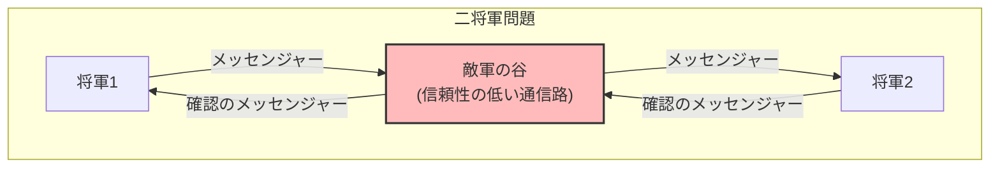
```mermaid
graph TB
    subgraph "二将軍問題"
        G1[将軍1] -->|メッセンジャー| V["敵軍の谷<br/>(信頼性の低い通信路)"]
        V -->|メッセンジャー| G2[将軍2]
        G2 -->|確認のメッセンジャー| V
        V -->|確認のメッセンジャー| G1
    end

    style V fill:#fbb,stroke:#333,stroke-width:2px
```

将軍1が「明日攻撃する」というメッセージを送り、将軍2が「了解」と返す。しかし、将軍1はこの確認メッセージが届いたかどうかを確認できない。確認の確認、さらにその確認…と無限に続き、両者が完全に合意に達する保証は得られない。

メッセージングシステムに当てはめると、プロデューサーがメッセージを送信し、ブローカーが受信確認を返す場面で同じ問題が発生する。確認メッセージが失われた場合、プロデューサーはメッセージが正常に処理されたかどうかを知る術がない。再送すれば重複が生じ、再送しなければ喪失のリスクがある。

### 2.2 ネットワーク障害の現実

分散システムの教科書では、ネットワーク障害を「メッセージの喪失」として単純化することが多い。しかし、現実の障害はもっと多様で厄介である。

- **パケットの喪失**: 最もシンプルなケース。再送で対処可能だが、重複のリスクが生じる
- **パケットの重複**: ネットワーク機器の誤動作やリトライにより、同じパケットが複数回到着する
- **パケットの順序逆転**: 先に送ったメッセージが後から到着する
- **パーティション（分断）**: ネットワークが分断され、一部のノード間で通信が不可能になる
- **遅延の急増**: メッセージは最終的に届くが、極端に遅れる。タイムアウトによって障害と誤判定される

特に問題なのは、**タイムアウトだけでは障害と遅延を区別できない**という点である。プロデューサーがメッセージを送信し、一定時間内に ACK が返ってこなかった場合、以下の3つの可能性がある。

1. メッセージがブローカーに届かなかった（再送すべき）
2. メッセージはブローカーに届いたが、ACK が戻ってこなかった（再送すると重複する）
3. ACK は送られたが、まだ到着していないだけ（再送すると重複する）

この曖昧さが、Exactly-Once の実現を根本的に困難にしている。

### 2.3 プロセス障害と再開

ネットワーク障害に加えて、プロセスの障害も Exactly-Once を脅かす。コンシューマーがメッセージを受信し、処理を実行し、ACK を返すという一連のステップの途中でクラッシュした場合を考える。

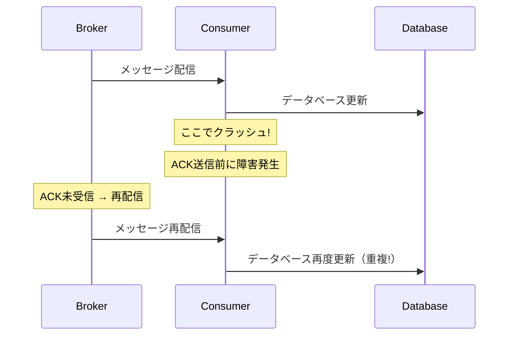
```mermaid
sequenceDiagram
    participant B as Broker
    participant C as Consumer
    participant DB as Database

    B->>C: メッセージ配信
    C->>DB: データベース更新
    Note over C: ここでクラッシュ!
    Note over C: ACK送信前に障害発生
    Note over B: ACK未受信 → 再配信
    B->>C: メッセージ再配信
    C->>DB: データベース再度更新（重複!）
```

この場合、データベースは更新されたが ACK は送信されていないため、ブローカーはメッセージを再配信する。結果として、データベースの更新が2回実行される。逆に、ACK を先に送信してからデータベースを更新する場合は、ACK送信後のクラッシュによりデータベースの更新が失われるリスクがある。

これは「メッセージの処理」と「処理完了の記録」という2つの操作を**アトミックに実行できない**ことが原因である。この問題を解決するためには、べき等性やトランザクションなどのメカニズムが必要になる。

### 2.4 FLP 不可能性定理との関連

Fischer, Lynch, Paterson による FLP 不可能性定理（1985）は、非同期分散システムにおいて、1つでもプロセスが障害を起こす可能性がある場合、確定的な合意アルゴリズムは存在しないことを証明した。Exactly-Once セマンティクスは本質的に「メッセージの処理状態に関する合意」を必要とするため、FLP 不可能性の影響を受ける。

ただし、FLP 定理は最悪ケースでの不可能性を示すものであり、実用的なシステムでは障害検出器やタイムアウトなどの仕組みを導入することで、「ほとんどの場合」に合意を達成できる。Exactly-Once セマンティクスもまた、理論的な純粋さを追求するのではなく、実用的なレベルでの保証を目指す設計が現実解となる。

## 3. べき等性による Exactly-Once の実現

### 3.1 べき等性とは何か

**べき等性（Idempotency）** とは、同じ操作を何回実行しても、1回実行した場合と同じ結果になる性質である。数学的に表現すると、関数 $f$ がべき等であるとは、任意の入力 $x$ に対して $f(f(x)) = f(x)$ が成り立つことである。

メッセージ処理の文脈では、同じメッセージを複数回処理しても、副作用（状態変更）が1回処理した場合と同じになることを意味する。At-Least-Once のセマンティクスとべき等な処理を組み合わせることで、**エフェクティブ Exactly-Once** を実現できる。

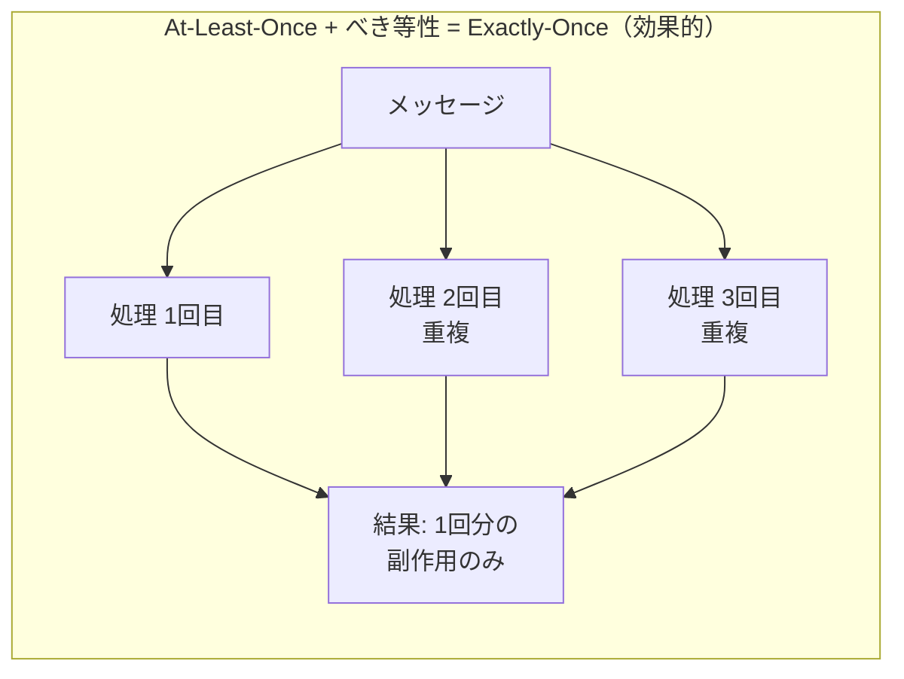
```mermaid
graph LR
    subgraph "At-Least-Once + べき等性 = Exactly-Once（効果的）"
        M[メッセージ] --> P1[処理 1回目]
        M --> P2[処理 2回目<br/>重複]
        M --> P3[処理 3回目<br/>重複]
        P1 --> R[結果: 1回分の<br/>副作用のみ]
        P2 --> R
        P3 --> R
    end
```

### 3.2 自然にべき等な操作

一部の操作は、特別な工夫なしに本質的にべき等である。

- **絶対値の設定（SET）**: `SET balance = 1000` は何回実行しても結果が同じ
- **削除（DELETE）**: `DELETE FROM users WHERE id = 42` は、既に削除されていれば何もしない
- **上書き（PUT）**: REST API の PUT は同じリソースの完全な置換であり、べき等

一方、以下の操作は自然にはべき等ではない。

- **相対値の変更（INCREMENT/DECREMENT）**: `UPDATE balance SET amount = amount + 100` は実行回数だけ加算される
- **追記（APPEND）**: ログやリストへの追記は実行回数分だけ増える
- **メッセージ送信**: メール送信やプッシュ通知は実行回数分だけ送られる

### 3.3 べき等キーによる重複排除

自然にはべき等でない操作をべき等にするための基本的な手法が、**べき等キー（Idempotency Key）** の利用である。各メッセージまたはリクエストにユニークな識別子を付与し、処理済みのキーを記録することで、重複を検出し排除する。

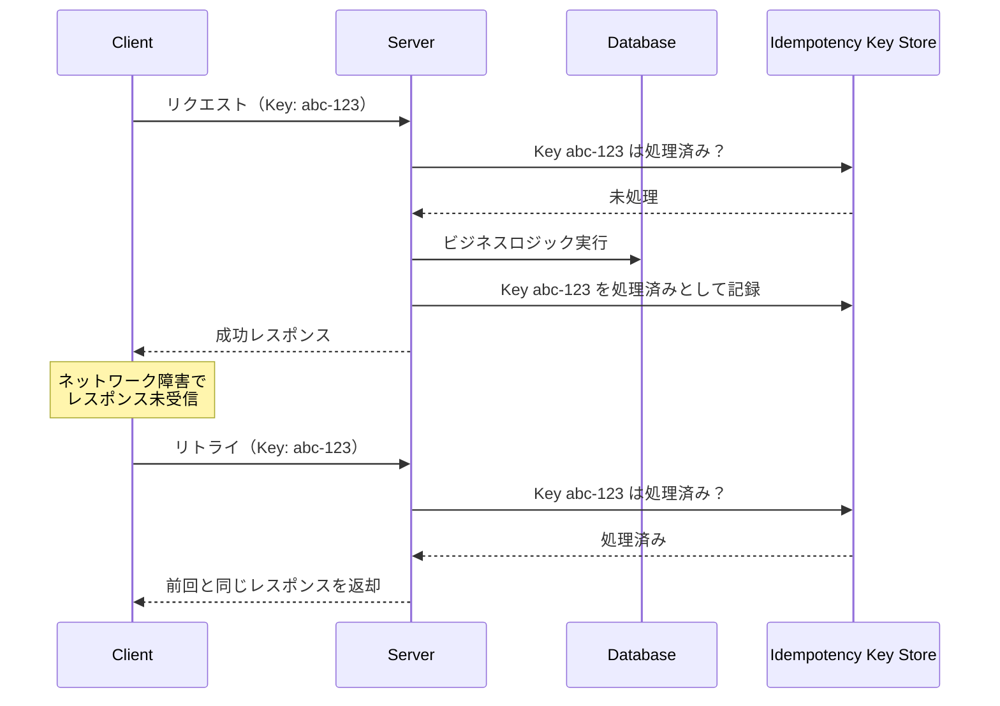
```mermaid
sequenceDiagram
    participant Client
    participant Server
    participant DB as Database
    participant IK as Idempotency Key Store

    Client->>Server: リクエスト（Key: abc-123）
    Server->>IK: Key abc-123 は処理済み？
    IK-->>Server: 未処理
    Server->>DB: ビジネスロジック実行
    Server->>IK: Key abc-123 を処理済みとして記録
    Server-->>Client: 成功レスポンス

    Note over Client: ネットワーク障害で<br/>レスポンス未受信
    Client->>Server: リトライ（Key: abc-123）
    Server->>IK: Key abc-123 は処理済み？
    IK-->>Server: 処理済み
    Server-->>Client: 前回と同じレスポンスを返却
```

この実装には以下のような考慮事項がある。

**べき等キーの生成方法**: クライアント側で UUID v4 や ULID を生成するのが一般的である。サーバー側で生成すると、レスポンスが失われた際にクライアントが同じキーを再利用できない。

**べき等キーの保存期間**: 永久に保存すればストレージが無限に増大する。実用的には、メッセージの再送が行われうる期間（たとえば24時間〜7日間）だけ保持し、TTL（Time To Live）で自動的に期限切れにする。

**べき等キーの保存先**: 処理結果を保存するデータベースと同じトランザクション内で記録するのが理想的である。別の保存先を使うと、べき等キーの記録とビジネスロジックの実行の間に不整合が生じる可能性がある。

### 3.4 実装例：べき等な決済処理

以下は、べき等キーを用いた決済処理の概念的な実装例である。

```python
def process_payment(idempotency_key: str, payment_request: PaymentRequest) -> PaymentResult:
    # Check if this request has already been processed
    existing = db.query(
        "SELECT result FROM idempotency_keys WHERE key = %s",
        [idempotency_key]
    )
    if existing:
        return deserialize(existing.result)

    # Execute within a single transaction
    with db.transaction() as tx:
        # Perform the actual payment
        result = execute_payment(tx, payment_request)

        # Record the idempotency key and result atomically
        tx.execute(
            "INSERT INTO idempotency_keys (key, result, created_at) VALUES (%s, %s, NOW())",
            [idempotency_key, serialize(result)]
        )

    return result
```

重要なのは、決済の実行とべき等キーの記録が**同一トランザクション内**で行われている点である。これにより、処理の途中でクラッシュが発生しても、不整合な状態にはならない。

## 4. トランザクショナルメッセージング

### 4.1 ローカルトランザクションとメッセージ送信の不整合

実際のアプリケーションでは、データベースの更新とメッセージの送信を両方行う必要があるケースが非常に多い。たとえば、ECサイトで注文を確定する際には、データベースに注文レコードを挿入し、同時に配送サービスや在庫管理サービスにメッセージを送信する必要がある。

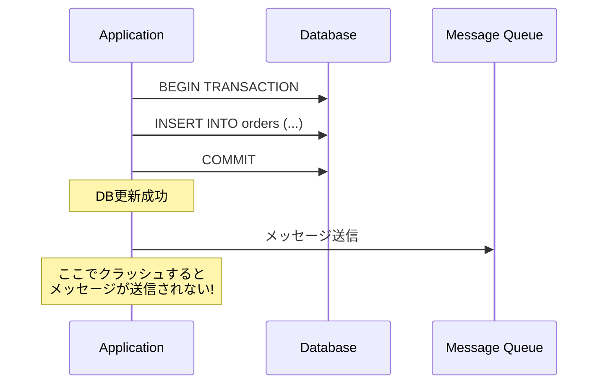
```mermaid
sequenceDiagram
    participant App as Application
    participant DB as Database
    participant MQ as Message Queue

    App->>DB: BEGIN TRANSACTION
    App->>DB: INSERT INTO orders (...)
    App->>DB: COMMIT
    Note over App: DB更新成功
    App->>MQ: メッセージ送信
    Note over App: ここでクラッシュすると<br/>メッセージが送信されない!
```

データベースのトランザクションとメッセージキューへの送信は、異なるシステムに対する操作であるため、一方が成功して他方が失敗する可能性がある。これはまさに**二相コミット（Two-Phase Commit, 2PC）** が解決しようとした問題であるが、2PC は可用性の低下やパフォーマンスのオーバーヘッドが大きく、実用上の問題が多い。

### 4.2 Outbox パターン

**Outbox パターン**は、データベースのトランザクション機能を活用して、ビジネスデータの更新とメッセージの送信を確実に行う設計パターンである。メッセージキューに直接送信する代わりに、メッセージをデータベースの **Outbox テーブル**に書き込む。

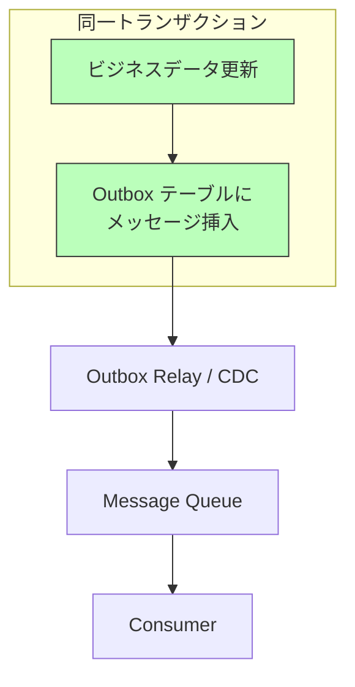
```mermaid
graph TB
    subgraph "同一トランザクション"
        A[ビジネスデータ更新] --> B[Outbox テーブルに<br/>メッセージ挿入]
    end

    B --> C[Outbox Relay / CDC]
    C --> D[Message Queue]
    D --> E[Consumer]

    style A fill:#bfb,stroke:#333
    style B fill:#bfb,stroke:#333
```

具体的な流れは以下の通りである。

1. アプリケーションは、データベーストランザクション内でビジネスデータの更新と Outbox テーブルへのメッセージ挿入を行う
2. 別のプロセス（Outbox Relay）が Outbox テーブルを定期的にポーリングし、未送信のメッセージをメッセージキューに送信する
3. 送信が成功したら、Outbox テーブルのレコードを送信済みとしてマークする

```sql
-- Step 1: Within a single database transaction
BEGIN;

INSERT INTO orders (id, user_id, total, status)
VALUES ('order-001', 'user-42', 15000, 'confirmed');

INSERT INTO outbox (id, aggregate_type, aggregate_id, event_type, payload, created_at)
VALUES (
    'evt-001',
    'Order',
    'order-001',
    'OrderConfirmed',
    '{"orderId": "order-001", "userId": "user-42", "total": 15000}',
    NOW()
);

COMMIT;
```

Outbox パターンの利点は、データベースのローカルトランザクションのみを使用するため、分散トランザクションが不要であることだ。データベースが ACID 特性を保証してくれるため、ビジネスデータの更新と Outbox レコードの挿入は必ず両方成功するか両方失敗する。

### 4.3 Change Data Capture（CDC）による Outbox の実装

Outbox テーブルのポーリングにはいくつかの課題がある。ポーリング間隔が長いとレイテンシが増加し、短いとデータベースへの負荷が増大する。この問題を解決するのが **Change Data Capture（CDC）** である。

CDC は、データベースのトランザクションログ（WAL: Write-Ahead Log）を監視し、データの変更をリアルタイムで検出する技術である。Debezium は、CDC を実現するオープンソースプラットフォームとして広く利用されている。

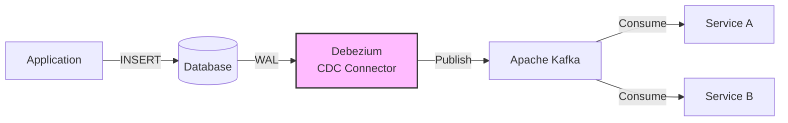
```mermaid
graph LR
    App[Application] -->|INSERT| DB[(Database)]
    DB -->|WAL| CDC[Debezium<br/>CDC Connector]
    CDC -->|Publish| Kafka[Apache Kafka]
    Kafka -->|Consume| S1[Service A]
    Kafka -->|Consume| S2[Service B]

    style CDC fill:#fbf,stroke:#333,stroke-width:2px
```

CDC を用いた Outbox パターン（Debezium の Outbox Event Router として知られる）の利点は以下の通りである。

- **低レイテンシ**: ポーリングではなくストリーミングベースのため、データ変更がほぼリアルタイムで検出される
- **データベース負荷の軽減**: ポーリングクエリが不要
- **順序保証**: WAL の順序がそのまま維持される

### 4.4 Transactional Outbox の課題

Outbox パターンは強力であるが、いくつかの課題も存在する。

**Outbox Relay の障害**: Outbox Relay プロセスが障害を起こした場合、メッセージの送信が停止する。At-Least-Once での再送が必要になるため、コンシューマー側でのべき等性が前提となる。

**Outbox テーブルの肥大化**: 送信済みのレコードを定期的にクリーンアップする必要がある。大量のトランザクションが発生するシステムでは、このクリーンアップ処理自体がパフォーマンスの問題になりうる。

**順序保証の複雑さ**: 複数の Outbox Relay インスタンスを並列に動作させる場合、メッセージの送信順序が保証されない可能性がある。順序保証が必要な場合は、パーティションキーに基づく順序制御が必要になる。

## 5. Kafka の Exactly-Once セマンティクス

Apache Kafka は、バージョン 0.11（2017年リリース）以降、Exactly-Once セマンティクス（EOS: Exactly-Once Semantics）を公式にサポートしている。Kafka の EOS は、**Idempotent Producer** と **Transactional API** という2つのメカニズムの組み合わせによって実現される。

### 5.1 Idempotent Producer

Idempotent Producer は、プロデューサーからブローカーへのメッセージ送信におけるべき等性を保証する。ネットワーク障害による再送で重複メッセージが発生することを防ぐ。

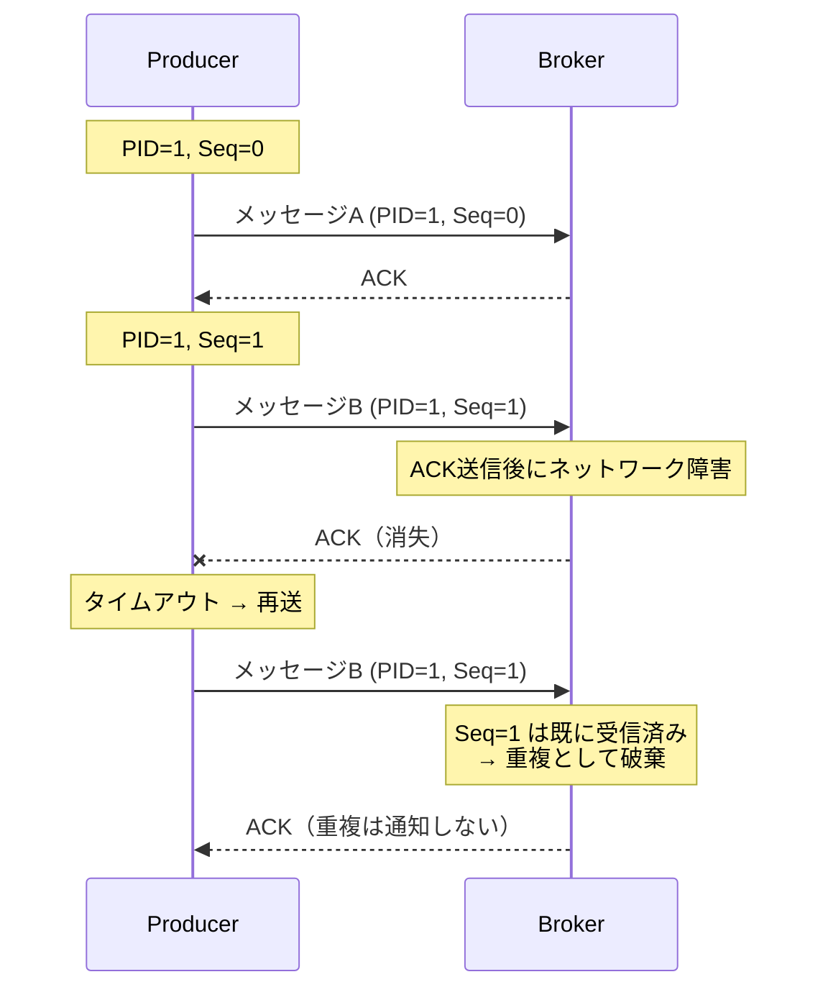
```mermaid
sequenceDiagram
    participant P as Producer
    participant B as Broker

    Note over P: PID=1, Seq=0
    P->>B: メッセージA (PID=1, Seq=0)
    B-->>P: ACK
    Note over P: PID=1, Seq=1
    P->>B: メッセージB (PID=1, Seq=1)
    Note over B: ACK送信後にネットワーク障害
    B--xP: ACK（消失）
    Note over P: タイムアウト → 再送
    P->>B: メッセージB (PID=1, Seq=1)
    Note over B: Seq=1 は既に受信済み<br/>→ 重複として破棄
    B-->>P: ACK（重複は通知しない）
```

Idempotent Producer の仕組みは以下の通りである。

1. **Producer ID（PID）の割り当て**: プロデューサーが初回接続時に、ブローカーから一意の PID を割り当てられる
2. **シーケンス番号の付与**: プロデューサーは各パーティションに対して送信するメッセージに、0から始まる連続的なシーケンス番号を付与する
3. **重複検出**: ブローカーは各パーティションごとに、各 PID の最新のシーケンス番号を記録する。同じ PID・同じシーケンス番号のメッセージが届いた場合、重複として扱いログに書き込まない
4. **順序検証**: シーケンス番号が期待値と異なる場合（たとえば飛び番号が発生した場合）、`OutOfOrderSequenceException` が発生する

Idempotent Producer の有効化は非常に簡単で、プロデューサーの設定に1行追加するだけである。

```java
Properties props = new Properties();
props.put("bootstrap.servers", "localhost:9092");
props.put("enable.idempotence", "true"); // Enable idempotent producer
props.put("acks", "all"); // Required for idempotent producer
props.put("key.serializer", "org.apache.kafka.common.serialization.StringSerializer");
props.put("value.serializer", "org.apache.kafka.common.serialization.StringSerializer");

KafkaProducer<String, String> producer = new KafkaProducer<>(props);
```

::: tip
Kafka 3.0 以降、`enable.idempotence` はデフォルトで `true` に設定されている。つまり、Kafka 3.0 以降を使用している場合、特別な設定なしにプロデューサーのべき等性が有効になる。
:::

ただし、Idempotent Producer だけでは Exactly-Once が完全に実現されるわけではない。以下の制約がある。

- **単一プロデューサーセッション内のみ**: プロデューサーが再起動すると新しい PID が割り当てられるため、再起動をまたぐ重複検出はできない
- **単一パーティション内のみ**: 複数パーティションにまたがるアトミック書き込みは保証されない
- **プロデューサー→ブローカー間のみ**: コンシューマー側での Exactly-Once は保証されない

### 5.2 Transactional API

Kafka の Transactional API は、Idempotent Producer を拡張し、**複数パーティションへのアトミック書き込み**と**コンシューマーオフセットのアトミックコミット**を実現する。これにより、Kafka のストリーム処理（consume-transform-produce パイプライン）において End-to-End の Exactly-Once が可能になる。

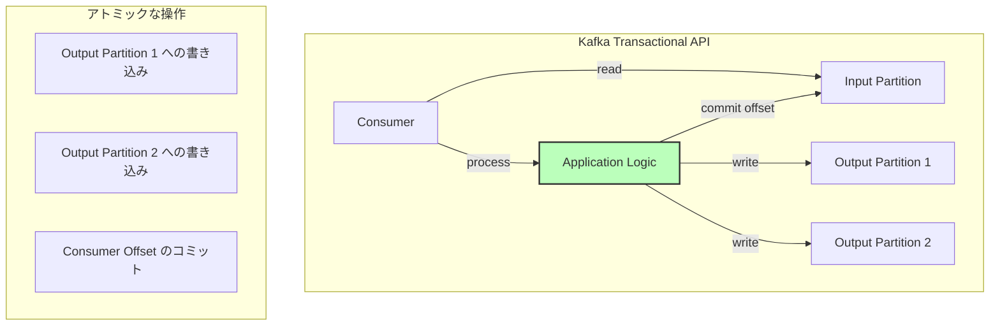
```mermaid
graph TB
    subgraph "Kafka Transactional API"
        C[Consumer] -->|read| IP[Input Partition]
        C -->|process| App[Application Logic]
        App -->|write| OP1[Output Partition 1]
        App -->|write| OP2[Output Partition 2]
        App -->|commit offset| IP
    end

    subgraph "アトミックな操作"
        direction LR
        W1["Output Partition 1 への書き込み"]
        W2["Output Partition 2 への書き込み"]
        OC["Consumer Offset のコミット"]
    end

    style App fill:#bfb,stroke:#333,stroke-width:2px
```

Transactional API の核となるのが **Transaction Coordinator** と **Transaction Log** である。

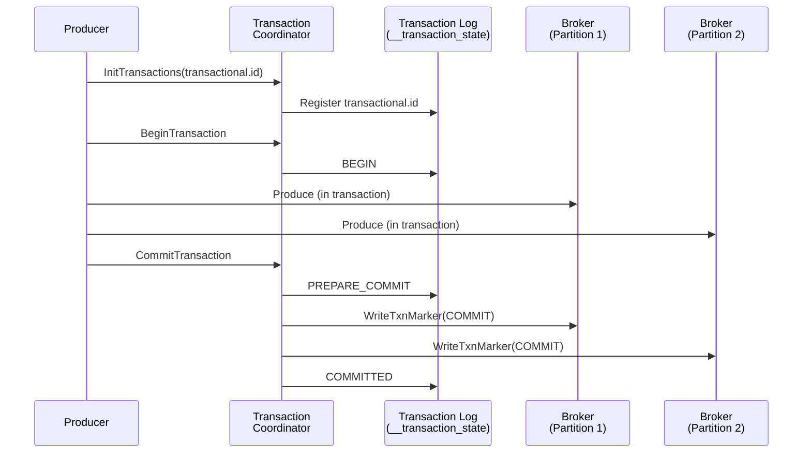
```mermaid
sequenceDiagram
    participant P as Producer
    participant TC as Transaction<br/>Coordinator
    participant TL as Transaction Log<br/>(__transaction_state)
    participant B1 as Broker<br/>(Partition 1)
    participant B2 as Broker<br/>(Partition 2)

    P->>TC: InitTransactions(transactional.id)
    TC->>TL: Register transactional.id

    P->>TC: BeginTransaction
    TC->>TL: BEGIN

    P->>B1: Produce (in transaction)
    P->>B2: Produce (in transaction)

    P->>TC: CommitTransaction
    TC->>TL: PREPARE_COMMIT
    TC->>B1: WriteTxnMarker(COMMIT)
    TC->>B2: WriteTxnMarker(COMMIT)
    TC->>TL: COMMITTED
```

**Transactional ID** は、Idempotent Producer の PID とは異なり、プロデューサーの再起動をまたいで維持される永続的な識別子である。これにより、プロデューサーが再起動した場合でも、前回の未完了トランザクションを適切にアボートし、重複を防止できる。

以下は、Transactional API を用いた consume-transform-produce パイプラインの実装例である。

```java
Properties producerProps = new Properties();
producerProps.put("bootstrap.servers", "localhost:9092");
producerProps.put("transactional.id", "my-transactional-id"); // Persistent across restarts
producerProps.put("enable.idempotence", "true");

KafkaProducer<String, String> producer = new KafkaProducer<>(producerProps);
producer.initTransactions();

Properties consumerProps = new Properties();
consumerProps.put("bootstrap.servers", "localhost:9092");
consumerProps.put("group.id", "my-group");
consumerProps.put("isolation.level", "read_committed"); // Only read committed messages
consumerProps.put("enable.auto.commit", "false"); // Disable auto-commit

KafkaConsumer<String, String> consumer = new KafkaConsumer<>(consumerProps);
consumer.subscribe(Arrays.asList("input-topic"));

while (true) {
    ConsumerRecords<String, String> records = consumer.poll(Duration.ofMillis(100));

    producer.beginTransaction();
    try {
        for (ConsumerRecord<String, String> record : records) {
            // Transform and produce to output topic
            String transformed = transform(record.value());
            producer.send(new ProducerRecord<>("output-topic", record.key(), transformed));
        }

        // Commit consumer offsets as part of the transaction
        Map<TopicPartition, OffsetAndMetadata> offsets = computeOffsets(records);
        producer.sendOffsetsToTransaction(offsets, consumer.groupMetadata());

        producer.commitTransaction();
    } catch (Exception e) {
        producer.abortTransaction();
    }
}
```

::: warning
`isolation.level` を `read_committed` に設定することが重要である。デフォルトの `read_uncommitted` では、アボートされたトランザクションのメッセージも読み取ってしまい、Exactly-Once の保証が崩れる。
:::

### 5.3 Kafka Streams と Exactly-Once

Kafka Streams は、Transactional API を内部的に使用して Exactly-Once を実現するストリーム処理ライブラリである。アプリケーション開発者は、低レベルの Transactional API を直接使用する必要がなく、設定一つで Exactly-Once を有効にできる。

```java
Properties props = new Properties();
props.put(StreamsConfig.APPLICATION_ID_CONFIG, "my-streams-app");
props.put(StreamsConfig.BOOTSTRAP_SERVERS_CONFIG, "localhost:9092");
props.put(StreamsConfig.PROCESSING_GUARANTEE_CONFIG, StreamsConfig.EXACTLY_ONCE_V2);

StreamsBuilder builder = new StreamsBuilder();
builder.stream("input-topic")
       .mapValues(value -> transform(value))
       .to("output-topic");

KafkaStreams streams = new KafkaStreams(builder.build(), props);
streams.start();
```

`EXACTLY_ONCE_V2`（Kafka 2.5 以降で利用可能）は、`EXACTLY_ONCE`（v1）の改良版であり、以下の点で優れている。

- **スケーラビリティの向上**: v1 では各入力パーティションに1つの Transactional ID が必要だったが、v2 では各 StreamThread に1つで済む
- **トランザクションの効率化**: Transaction Coordinator への負荷が大幅に軽減される
- **フェンシングの改善**: コンシューマグループのメンバーシッププロトコルを利用した、より効率的なゾンビフェンシングを実現

### 5.4 Kafka の Exactly-Once の制約

Kafka の Exactly-Once は強力な保証を提供するが、**Kafka エコシステム内に限定される**という重要な制約がある。

- **Kafka → 外部システム**: Kafka から外部データベースや API への書き込みは、Kafka の Transactional API のスコープ外である。外部システムへの Exactly-Once を実現するには、コンシューマー側でのべき等性が必要
- **外部システム → Kafka**: 外部システムから Kafka への書き込みも同様に、Kafka 側の Idempotent Producer だけでは不十分で、アプリケーションレベルでの重複排除が必要な場合がある
- **長時間トランザクション**: デフォルトのトランザクションタイムアウトは15分であり、これを超えるとトランザクションは自動的にアボートされる

## 6. 二重処理防止パターン

Exactly-Once を実現するための汎用的なパターンをいくつか紹介する。これらは特定のメッセージングシステムに依存せず、幅広いアーキテクチャで適用可能である。

### 6.1 Deduplication テーブル

最もシンプルで広く使われているパターンが、処理済みメッセージの ID を記録するテーブルを用いた重複排除である。

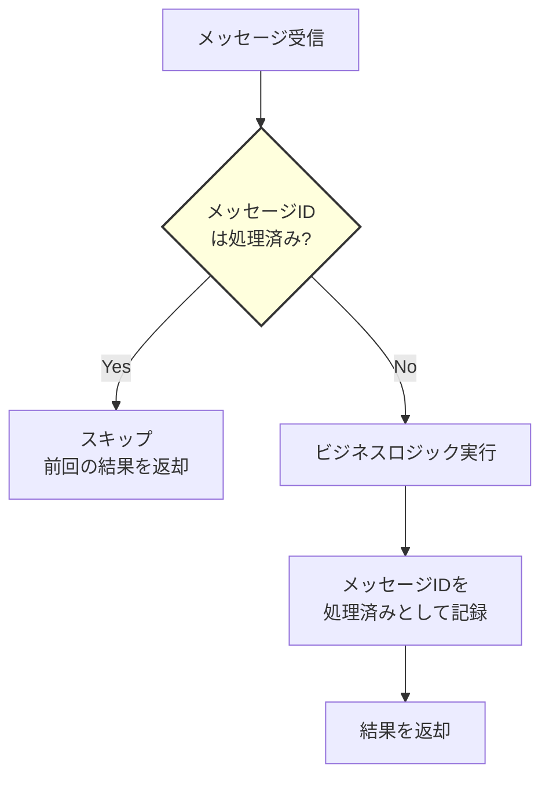
```mermaid
graph TB
    M[メッセージ受信] --> Check{メッセージID<br/>は処理済み?}
    Check -->|Yes| Skip[スキップ<br/>前回の結果を返却]
    Check -->|No| Process[ビジネスロジック実行]
    Process --> Record[メッセージIDを<br/>処理済みとして記録]
    Record --> Respond[結果を返却]

    style Check fill:#ffd,stroke:#333,stroke-width:2px
```

```sql
-- Create deduplication table
CREATE TABLE processed_messages (
    message_id VARCHAR(255) PRIMARY KEY,
    processed_at TIMESTAMP NOT NULL DEFAULT NOW(),
    result JSONB
);

-- Create index for TTL-based cleanup
CREATE INDEX idx_processed_messages_time ON processed_messages (processed_at);
```

実装上の注意点として、メッセージ ID のチェックとビジネスロジックの実行と処理済みの記録を**同一トランザクション**で行う必要がある。そうでないと、チェックと記録の間にクラッシュが発生した場合に不整合が生じる。

### 6.2 楽観的ロックによるバージョン管理

データベースの行にバージョン番号を付与し、更新時にバージョンを検証するパターンである。

```sql
-- Optimistic locking with version number
UPDATE accounts
SET balance = balance - 1000,
    version = version + 1
WHERE id = 42 AND version = 5;

-- If affected rows = 0, the version has changed (concurrent update or duplicate)
```

このパターンは、同じデータに対する複数の更新が競合する場合にも有効であり、Exactly-Once と並行制御を同時に実現できる。

### 6.3 条件付き書き込み（Conditional Write）

データの現在の状態を条件として書き込みを行うパターンである。DynamoDB の条件付き書き込みや、Cassandra の Lightweight Transaction がこれに該当する。

```python
# DynamoDB conditional write example
table.update_item(
    Key={'order_id': 'order-001'},
    UpdateExpression='SET #s = :new_status, amount = :amount',
    ConditionExpression='#s = :expected_status',
    ExpressionAttributeNames={'#s': 'status'},
    ExpressionAttributeValues={
        ':new_status': 'completed',
        ':expected_status': 'pending',  # Only update if status is still "pending"
        ':amount': 15000
    }
)
```

このパターンは、状態遷移が一方向である場合に特に有効である。注文のステータスが `pending → confirmed → shipped → delivered` と進む場合、各遷移は一度しか行われないため、条件付き書き込みで自然に Exactly-Once が実現される。

### 6.4 トークンベースの重複排除

分散環境で一意なトークンを生成し、そのトークンに対する処理を1回に制限するパターンである。決済システムでよく使われる。

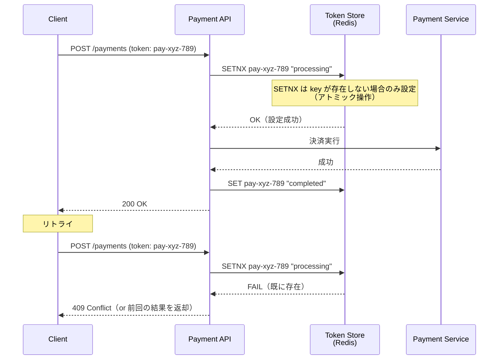
```mermaid
sequenceDiagram
    participant Client
    participant API as Payment API
    participant Token as Token Store<br/>(Redis)
    participant Payment as Payment Service

    Client->>API: POST /payments (token: pay-xyz-789)
    API->>Token: SETNX pay-xyz-789 "processing"
    Note over Token: SETNX は key が存在しない場合のみ設定<br/>（アトミック操作）
    Token-->>API: OK（設定成功）
    API->>Payment: 決済実行
    Payment-->>API: 成功
    API->>Token: SET pay-xyz-789 "completed"
    API-->>Client: 200 OK

    Note over Client: リトライ
    Client->>API: POST /payments (token: pay-xyz-789)
    API->>Token: SETNX pay-xyz-789 "processing"
    Token-->>API: FAIL（既に存在）
    API-->>Client: 409 Conflict（or 前回の結果を返却）
```

Redis の `SETNX`（SET if Not eXists）コマンドは、キーが存在しない場合にのみ値を設定するアトミックな操作である。この特性を利用して、分散環境でもロックなしに重複排除を実現できる。

## 7. 分散システムにおける End-to-End Exactly-Once

### 7.1 End-to-End の視点

これまで個別のコンポーネント間の Exactly-Once について議論してきたが、実際のシステムでは複数のコンポーネントを横断した **End-to-End の Exactly-Once** が求められる。

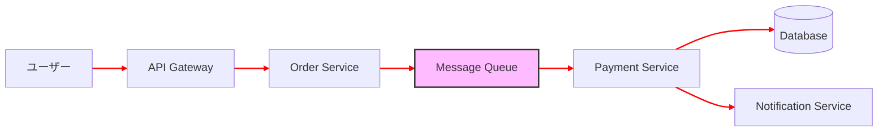
```mermaid
graph LR
    U[ユーザー] --> API[API Gateway]
    API --> S1[Order Service]
    S1 --> MQ[Message Queue]
    MQ --> S2[Payment Service]
    S2 --> DB[(Database)]
    S2 --> S3[Notification Service]

    style MQ fill:#fbf,stroke:#333,stroke-width:2px

    linkStyle 0 stroke:#f00,stroke-width:2px
    linkStyle 1 stroke:#f00,stroke-width:2px
    linkStyle 2 stroke:#f00,stroke-width:2px
    linkStyle 3 stroke:#f00,stroke-width:2px
    linkStyle 4 stroke:#f00,stroke-width:2px
    linkStyle 5 stroke:#f00,stroke-width:2px
```

End-to-End の Exactly-Once を実現するには、パイプラインの各段階で Exactly-Once を保証する必要がある。1つでも保証が崩れる箇所があれば、全体として Exactly-Once にはならない。

### 7.2 End-to-End Argument

Saltzer, Reed, Clark が1984年に提唱した **End-to-End Argument** は、ネットワークやシステムの設計における基本原則の一つである。この原則によれば、アプリケーションレベルで必要な機能は、中間層の努力だけでは完全に実現できず、最終的にはエンドポイント（アプリケーション）で保証する必要がある。

Exactly-Once セマンティクスにもこの原則が適用される。メッセージングシステムが内部的に Exactly-Once を保証していても、アプリケーションが外部システムと連携する場合、アプリケーションレベルでの追加的な対策が不可欠である。

### 7.3 Saga パターンと Exactly-Once

分散トランザクションが必要な場合、**Saga パターン**がよく使われる。Saga は、長時間にわたる分散トランザクションを一連のローカルトランザクションに分解し、失敗時には補償トランザクションを実行して整合性を保つ設計パターンである。

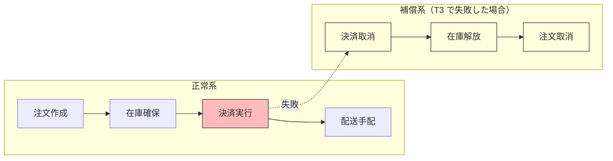
```mermaid
graph LR
    subgraph "正常系"
        T1[注文作成] --> T2[在庫確保] --> T3[決済実行] --> T4[配送手配]
    end

    subgraph "補償系（T3 で失敗した場合）"
        C3[決済取消] --> C2[在庫解放] --> C1[注文取消]
    end

    T3 -.->|失敗| C3

    style T3 fill:#fbb,stroke:#333
    style C3 fill:#ffd,stroke:#333
    style C2 fill:#ffd,stroke:#333
    style C1 fill:#ffd,stroke:#333
```

Saga パターンにおける Exactly-Once の課題は、各ステップが At-Least-Once で実行される可能性があるため、**各ローカルトランザクションと各補償トランザクションがべき等でなければならない**という点である。

Saga のオーケストレーションにおいても、オーケストレーターが同じステップを重複して実行しないための仕組みが必要である。

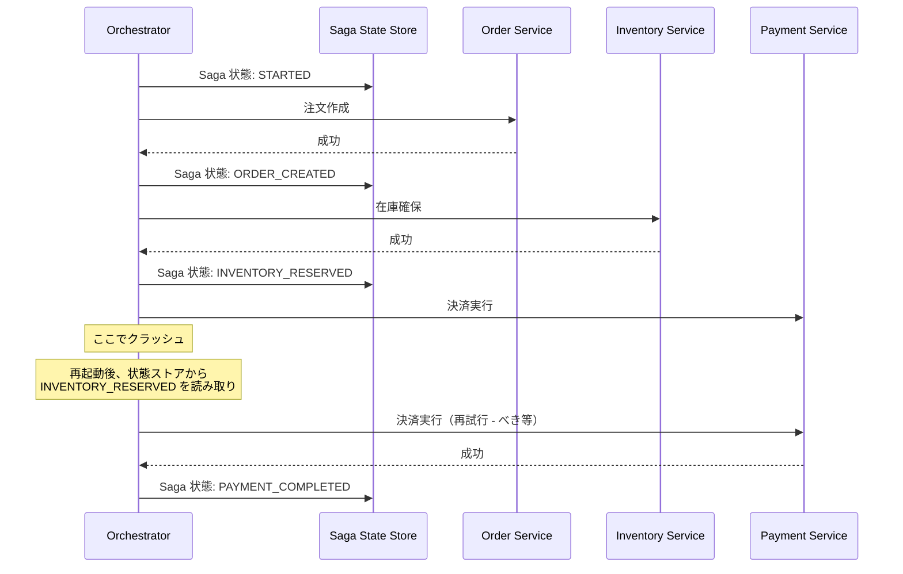
```mermaid
sequenceDiagram
    participant O as Orchestrator
    participant S as Saga State Store
    participant T1 as Order Service
    participant T2 as Inventory Service
    participant T3 as Payment Service

    O->>S: Saga 状態: STARTED
    O->>T1: 注文作成
    T1-->>O: 成功
    O->>S: Saga 状態: ORDER_CREATED

    O->>T2: 在庫確保
    T2-->>O: 成功
    O->>S: Saga 状態: INVENTORY_RESERVED

    O->>T3: 決済実行
    Note over O: ここでクラッシュ
    Note over O: 再起動後、状態ストアから<br/>INVENTORY_RESERVED を読み取り
    O->>T3: 決済実行（再試行 - べき等）
    T3-->>O: 成功
    O->>S: Saga 状態: PAYMENT_COMPLETED
```

### 7.4 Exactly-Once なストリーム処理

Apache Flink は、分散ストリーム処理フレームワークとして、End-to-End の Exactly-Once を実現するための包括的なアプローチを提供している。Flink の Exactly-Once は以下の3つの要素で構成される。

1. **チェックポインティング**: Chandy-Lamport アルゴリズムに基づく分散スナップショットにより、処理状態を定期的に保存する
2. **バリアアラインメント**: ストリーム中にバリアマーカーを挿入し、チェックポイントの整合性を保証する
3. **Two-Phase Commit Sink**: 外部システムへの書き込みに対して、2PC ベースの Exactly-Once を実現する

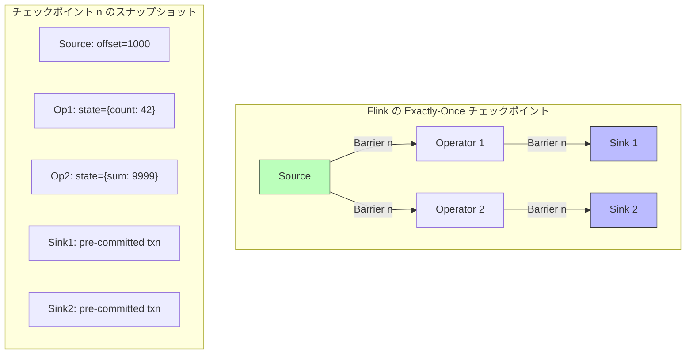
```mermaid
graph TB
    subgraph "Flink の Exactly-Once チェックポイント"
        Source[Source] -->|Barrier n| Op1[Operator 1]
        Source -->|Barrier n| Op2[Operator 2]
        Op1 -->|Barrier n| Sink1[Sink 1]
        Op2 -->|Barrier n| Sink2[Sink 2]
    end

    subgraph "チェックポイント n のスナップショット"
        S1["Source: offset=1000"]
        S2["Op1: state={count: 42}"]
        S3["Op2: state={sum: 9999}"]
        S4["Sink1: pre-committed txn"]
        S5["Sink2: pre-committed txn"]
    end

    style Source fill:#bfb,stroke:#333
    style Sink1 fill:#bbf,stroke:#333
    style Sink2 fill:#bbf,stroke:#333
```

Flink のチェックポイント機構は、障害発生時にストリーム処理のパイプライン全体を一貫した状態にロールバックすることを可能にする。これにより、「処理したがまだコミットしていない」中間状態が排除され、Exactly-Once が保証される。

## 8. 実装上のトレードオフ

### 8.1 パフォーマンスへの影響

Exactly-Once セマンティクスの実現は、必然的にパフォーマンスのオーバーヘッドを伴う。

| 要素 | オーバーヘッドの原因 | 影響の程度 |
|------|---------------------|------------|
| べき等キーの検索 | 各メッセージ処理前のデータベースルックアップ | 中 |
| Outbox パターン | 追加のテーブル書き込みとリレープロセスの運用 | 中 |
| Kafka Transactional API | Transaction Coordinator との通信、トランザクションマーカーの書き込み | 低〜中 |
| 分散スナップショット | チェックポイントの作成と保存 | バースト的に高 |
| 2PC | コーディネーターとの往復通信、ロックの保持 | 高 |

Kafka の公式ベンチマークによると、Transactional API を有効にした場合のスループット低下は約3〜20%程度とされている。この低下は、バッチサイズやコミット間隔の調整によってある程度緩和可能である。

### 8.2 レイテンシとスループットのトレードオフ

Exactly-Once の実現方法によって、レイテンシとスループットのバランスが異なる。

**バッチ処理アプローチ**: 複数のメッセージをまとめてトランザクションとして処理する。スループットは向上するが、個々のメッセージのレイテンシは増加する。Kafka の Transactional API はこのアプローチを採用している。

**個別処理アプローチ**: 各メッセージを個別にべき等チェックして処理する。レイテンシは低いが、べき等キーの検索がボトルネックになりやすい。

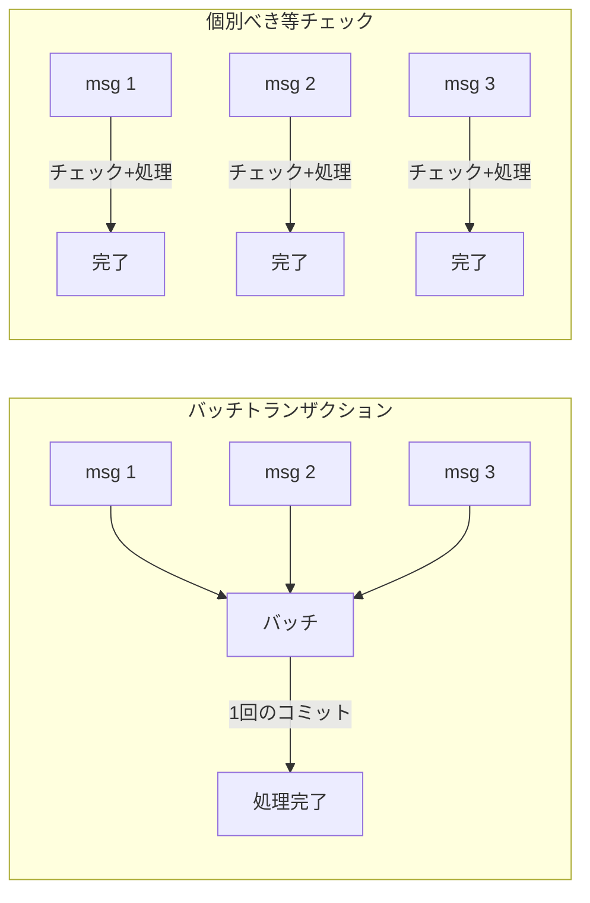
```mermaid
graph LR
    subgraph "バッチトランザクション"
        M1[msg 1] --> Batch[バッチ]
        M2[msg 2] --> Batch
        M3[msg 3] --> Batch
        Batch -->|1回のコミット| Result[処理完了]
    end

    subgraph "個別べき等チェック"
        M4[msg 1] -->|チェック+処理| R1[完了]
        M5[msg 2] -->|チェック+処理| R2[完了]
        M6[msg 3] -->|チェック+処理| R3[完了]
    end
```

### 8.3 一貫性と可用性のトレードオフ（CAP定理との関連）

CAP定理が示すように、ネットワーク分断が発生した場合、一貫性と可用性を同時に保証することはできない。Exactly-Once セマンティクスは強い一貫性を要求するため、ネットワーク分断時には可用性が犠牲になる傾向がある。

具体的には、以下のような状況が発生する。

- **ネットワーク分断中のプロデューサー**: トランザクションのコミットが完了できず、プロデューサーがブロックされる
- **ネットワーク分断中のコンシューマー**: オフセットのコミットができず、処理が停止する
- **べき等キーストアへのアクセス不能**: 重複チェックができないため、処理を進められない

多くのシステムでは、Exactly-Once を「通常運用時の保証」として位置づけ、障害時には At-Least-Once にフォールバックする設計を採用している。

### 8.4 運用の複雑さ

Exactly-Once の実現は、システムの運用複雑度を大幅に増加させる。

**監視の複雑化**: トランザクションの状態、べき等キーストアのサイズ、Outbox テーブルのバックログ、CDC コネクタの遅延など、監視すべきメトリクスが増える。

**障害復旧の複雑化**: 障害時の復旧手順が複雑になる。たとえば、Kafka の Transaction Coordinator が障害を起こした場合、未完了のトランザクションの処理方法を理解している必要がある。

**テストの困難さ**: Exactly-Once の保証が正しく機能していることを検証するテストは、ネットワーク障害やプロセスクラッシュのシミュレーションを含むため、構築が困難である。Jepsen のようなテストフレームワークを用いた厳密な検証が望ましい。

### 8.5 べき等キーのストレージ戦略

べき等キーの保存先の選択は、パフォーマンスと信頼性のトレードオフを伴う。

| 保存先 | レイテンシ | 耐久性 | トランザクション整合性 |
|--------|-----------|--------|----------------------|
| 同一データベース | 低（同一トランザクション） | 高 | 完全 |
| Redis | 極低 | 中（永続化設定依存） | なし（別システム） |
| 専用データベース | 中 | 高 | なし（別システム） |
| インメモリ（プロセス内） | 極低 | なし（再起動で消失） | なし |

最も信頼性が高いのは、ビジネスデータと同じデータベースに同一トランザクション内で保存する方法である。Redis などの外部キャッシュを使う場合は、ビジネスロジックの実行と重複チェックの間に不整合が生じるエッジケースを許容する覚悟が必要である。

## 9. 実世界の事例と教訓

### 9.1 Stripe の Idempotency Key

決済プラットフォーム Stripe は、API レベルでのべき等性を `Idempotency-Key` HTTP ヘッダーを通じて提供している。クライアントはリクエストごとに一意のキーを設定し、同じキーでリクエストを再送しても、課金が二重に行われることはない。

Stripe の実装は、べき等キーの状態を以下のように管理している。

1. **started**: リクエストの処理が開始された
2. **completed**: リクエストの処理が完了し、レスポンスが保存された
3. **error**: リクエストの処理中にエラーが発生した

`completed` 状態のキーに対する再リクエストは、保存されたレスポンスをそのまま返却する。これにより、ネットワーク障害でレスポンスが失われた場合でも、クライアントは安全にリトライできる。

### 9.2 AWS SQS の FIFO キューと重複排除

Amazon SQS の FIFO（First-In-First-Out）キューは、5分間の重複排除ウィンドウを持つ。送信されたメッセージには **Message Deduplication ID** が付与され、同じ ID のメッセージが5分以内に再送された場合、重複として扱われる。

この5分間というウィンドウは、「ほとんどのリトライシナリオをカバーするが、永久的な重複排除は行わない」という実用的な妥協点である。5分を超えた後に同じメッセージが送信された場合、重複として検出されない可能性がある。

### 9.3 Google Cloud Pub/Sub の Exactly-Once 配信

Google Cloud Pub/Sub は2022年に Exactly-Once 配信機能をリリースした。これは、ACK 期限内でのメッセージの再配信を防ぐ仕組みであり、サブスクライバーが ACK を返したメッセージは再配信されないことが保証される。

ただし、これは「配信」レベルの保証であり、「処理」レベルの Exactly-Once を自動的に保証するものではない。サブスクライバーがメッセージを受信して処理を完了するまでの間にクラッシュした場合、メッセージは再配信される。処理の Exactly-Once を実現するには、サブスクライバー側でのべき等性の実装が依然として必要である。

### 9.4 実務における指針

実世界のシステムで Exactly-Once を実現する際の実践的な指針を以下にまとめる。

1. **本当に Exactly-Once が必要か検討する**: 多くのユースケースでは、At-Least-Once + べき等性で十分である。Exactly-Once のフルスタック実装は複雑でコストが高い
2. **べき等性を第一の選択肢とする**: 操作をべき等に設計できるならば、それが最もシンプルで堅牢なアプローチである
3. **スコープを明確にする**: 「どこからどこまでの Exactly-Once が必要か」を明確に定義する。Kafka 内部の Exactly-Once と、End-to-End の Exactly-Once では、必要な対策が大きく異なる
4. **障害モードを列挙する**: 「この障害が発生した場合、Exactly-Once は維持されるか」を各障害モードごとに検証する
5. **監視と観測を最優先する**: 重複や欠損が発生した場合に迅速に検出できる監視体制を構築する

## 10. まとめ

Exactly-Once セマンティクスは、分散システムにおけるメッセージ配信保証の中で最も強力であり、同時に最も実現が困難な保証である。その困難さは、二将軍問題や FLP 不可能性定理といった理論的な制約に根ざしている。

しかし、「理論的に不可能」であることは「実用的に無意味」であることを意味しない。べき等性、トランザクショナルメッセージング、Outbox パターン、Kafka の Transactional API、分散スナップショットなどの技術を組み合わせることで、**エフェクティブ Exactly-Once** — つまり、外部から観測される結果が正確に1回処理された場合と区別がつかない状態 — を実現できる。

重要なのは、Exactly-Once が銀の弾丸ではないということである。パフォーマンスのオーバーヘッド、運用の複雑さ、可用性とのトレードオフを十分に理解した上で、本当に必要な箇所にのみ適用するのが賢明な設計判断である。多くのケースでは、At-Least-Once + べき等性という組み合わせが、複雑さと保証のバランスが最もよい選択肢となる。

分散システムの設計において、完璧な保証を追求するよりも、**障害が発生した際にシステムが正しく回復できること**を保証する方が、実務上は遥かに重要である。Exactly-Once の仕組みを深く理解することは、この「正しい回復」を設計するための基盤となる。
