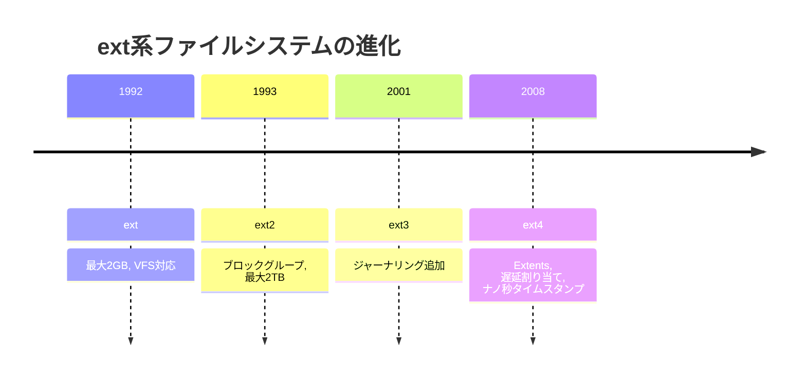
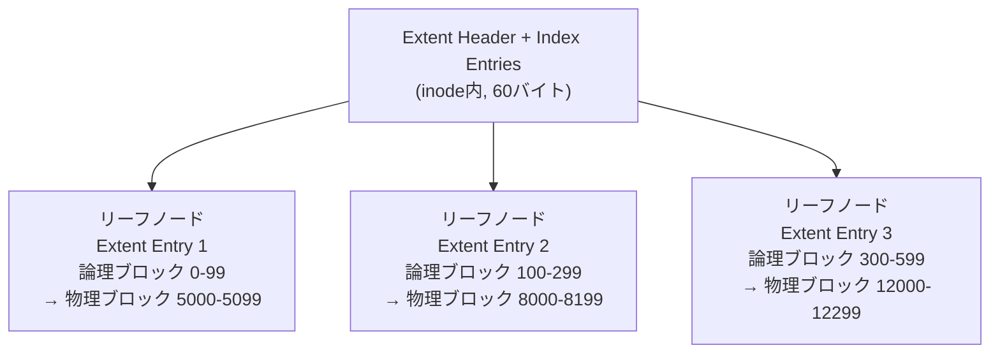
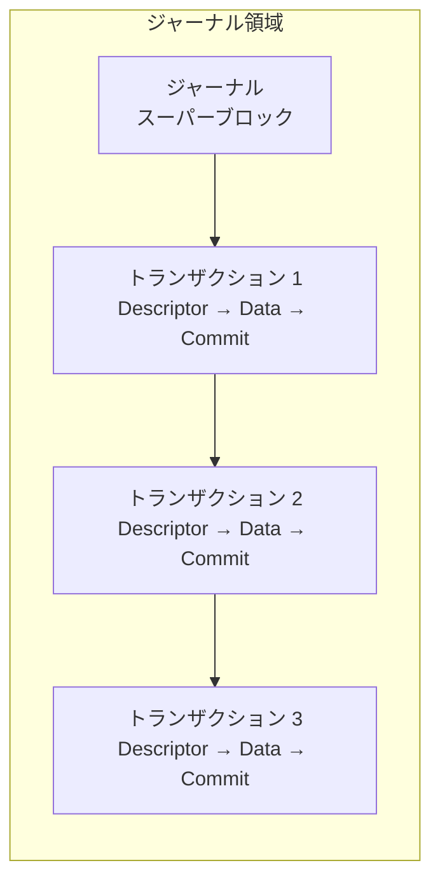
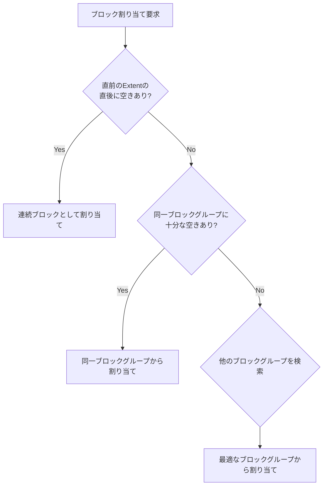
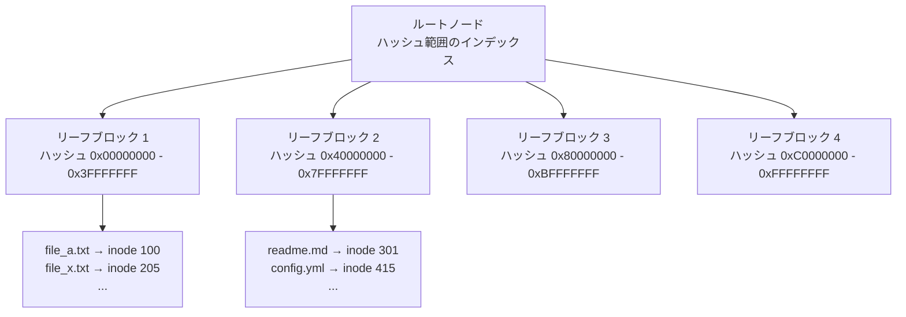

# ext4ファイルシステム — 設計と内部構造

## 1. ext系ファイルシステムの歴史 — Linuxファイルシステムの進化

### 1.1 MINIX fsからの出発

Linuxカーネルが1991年に誕生したとき、最初に使われたファイルシステムは**MINIX fs**であった。MINIX fsはAndrew S. Tanenbaumが教育用OS「MINIX」のために設計したもので、ファイル名は14文字まで、最大パーティションサイズは64MBという制約があった。Linus Torvaldsが最初のLinuxカーネルを開発した際、開発環境がMINIXであったため、そのファイルシステムをそのまま採用したのは自然な流れであった。

しかし、Linuxが実用的なOSとして成長するにつれ、MINIX fsの制約は明らかなボトルネックとなった。

### 1.2 ext（Extended File System）— 最初の独自ファイルシステム

1992年、Rémy Cardが**ext（Extended File System）** を開発した。これはLinux専用に設計された最初のファイルシステムであり、MINIX fsの制約を大幅に緩和した。最大ファイルシステムサイズは2GBに拡大され、ファイル名も255文字まで対応した。

extはUFS（Unix File System）の影響を強く受けており、**VFS（Virtual File System）** レイヤーを通じてカーネルと連携する設計を採用した。しかし、タイムスタンプの精度が秒単位であること、フラグメンテーションへの耐性が弱いことなど、複数の問題を抱えていた。

### 1.3 ext2 — 長期間使われた安定版

1993年、Rémy Cardは**ext2**を開発した。ext2は以下の重要な改善を導入した。

- **ブロックグループ**の概念を導入し、関連するデータを物理的に近い位置に配置
- 最大ファイルシステムサイズを2TBに拡大（後に4TBへ）
- **事前割り当て（preallocation）** による連続ブロック確保
- ファイル属性（immutableなど）のサポート

ext2はジャーナリング機能を持たないため、不正なシャットダウン後には`fsck`（File System Check）による全スキャンが必要であった。大容量ディスクでは、この修復処理に数十分から数時間を要することもあった。しかし、その単純さと安定性から、ext2は長年にわたりLinuxの標準ファイルシステムとして使われた。

### 1.4 ext3 — ジャーナリングの導入

2001年、Stephen Tweedieが**ext3**を開発した。ext3の最大の特徴は**ジャーナリング**の追加であり、これによりクラッシュ後の復旧時間が劇的に短縮された。

ext3のもう1つの重要な設計判断は、**ext2との後方互換性を完全に維持した**ことである。ext2パーティションをext3に変換する際、データの移行やフォーマットは不要で、ジャーナル領域を追加するだけで済んだ。これにより、多くのLinuxディストリビューションがスムーズにext3へ移行できた。

ただし、ext3はext2のディスクレイアウトをほぼそのまま引き継いだため、**間接ブロック（indirect blocks）** によるファイルマッピングという非効率な構造を残していた。大きなファイルを扱う際のオーバーヘッドは無視できないものであった。

### 1.5 ext4 — 現代的な拡張

ext4は2006年に開発が始まり、2008年にLinuxカーネル2.6.28で安定版として正式にマージされた。主要な開発者にはTheodore Ts'o、Mingming Cao、Alex Zhuravlev（Tomas）らがいる。

ext4は以下の主要な改善を提供した。

| 機能 | ext3 | ext4 |
|---|---|---|
| 最大ファイルシステムサイズ | 16TB | 1EB（理論値） |
| 最大ファイルサイズ | 2TB | 16TB |
| ファイルマッピング | 間接ブロック | Extents |
| タイムスタンプ精度 | 秒 | ナノ秒 |
| サブディレクトリ数上限 | 32,000 | 無制限 |
| ジャーナルチェックサム | なし | あり |
| 遅延割り当て | なし | あり |
| マルチブロック割り当て | なし | あり |

ext4は現在もLinuxで最も広く使われているファイルシステムであり、多くのディストリビューションでデフォルトのファイルシステムとなっている。



## 2. ext4のディスクレイアウト — 全体構造を理解する

### 2.1 パーティション全体の構成

ext4ファイルシステムは、パーティション全体を**ブロック**という固定サイズの単位に分割して管理する。ブロックサイズは通常1KB、2KB、4KBのいずれかであり、現代の環境では**4KB**が一般的である。

パーティション全体は以下のように構成される。

```
+-------------+------------------+------------------+-----+------------------+
| Boot Block  | Block Group 0    | Block Group 1    | ... | Block Group N    |
| (1024 bytes)|                  |                  |     |                  |
+-------------+------------------+------------------+-----+------------------+
```

先頭の1024バイトはブートブロック（またはブートセクタ）として予約されている。これはファイルシステム自体には使用されず、ブートローダーが必要とする領域である。その後ろに、複数の**ブロックグループ**が連続して配置される。

### 2.2 ブロックサイズとアドレッシング

ext4は48ビットのブロック番号を使用する（64ビットモードが有効な場合は64ビット）。4KBブロックの場合、48ビットアドレッシングで最大 $2^{48} \times 4\text{KB} = 1\text{EB}$ のファイルシステムサイズを理論的にサポートする。

ブロックサイズの選択はパフォーマンスに大きな影響を与える。

- **小さなブロックサイズ（1KB）**: 小さなファイルが多い場合に内部断片化を抑えられるが、メタデータのオーバーヘッドが増大する
- **大きなブロックサイズ（4KB）**: 大きなファイルの読み書きが効率的だが、小さなファイルでの無駄が生じる

現代のLinuxカーネルはページサイズ（通常4KB）に合わせたブロックサイズを推奨しており、ページキャッシュとの整合性が最も良い4KBブロックが事実上の標準となっている。

### 2.3 Flex Block Groups

ext4には**Flex Block Groups（フレキシブルブロックグループ）** という概念がある。これは複数の連続するブロックグループを論理的にまとめ、メタデータ（inode テーブル、ビットマップ等）を先頭のブロックグループに集約する仕組みである。

```
通常のブロックグループ:
+-------+-------+-------+-------+
|  BG0  |  BG1  |  BG2  |  BG3  |
| meta  | meta  | meta  | meta  |
| data  | data  | data  | data  |
+-------+-------+-------+-------+

Flex Block Groups (flex_bg サイズ = 4):
+-------+-------+-------+-------+
|  BG0  |  BG1  |  BG2  |  BG3  |
| meta0 | data  | data  | data  |
| meta1 |       |       |       |
| meta2 |       |       |       |
| meta3 |       |       |       |
| data  |       |       |       |
+-------+-------+-------+-------+
```

Flex Block Groupsのメリットは明確である。

1. **メタデータの局所性向上**: メタデータが物理的に近い位置にまとめられるため、ディレクトリのスキャンやinode検索時のシーク回数が減少する
2. **連続データ領域の確保**: データ用のブロックがより大きな連続領域として確保できるため、大きなファイルの書き込みパフォーマンスが向上する
3. **HDDでの効果**: 特に回転型ディスクにおいて、シーク時間の削減効果が顕著である

## 3. ブロックグループとスーパーブロック

### 3.1 スーパーブロックの構造

**スーパーブロック（Superblock）** はファイルシステム全体のメタデータを格納する最も重要なデータ構造である。パーティションの先頭（オフセット1024バイト）に配置され、ファイルシステムの全体像を記述する。

スーパーブロックに含まれる主要な情報は以下のとおりである。

```c
struct ext4_super_block {
    __le32 s_inodes_count;        // Total inode count
    __le32 s_blocks_count_lo;     // Total block count (lower 32 bits)
    __le32 s_r_blocks_count_lo;   // Reserved block count (lower 32 bits)
    __le32 s_free_blocks_count_lo;// Free block count (lower 32 bits)
    __le32 s_free_inodes_count;   // Free inode count
    __le32 s_first_data_block;    // First data block
    __le32 s_log_block_size;      // Block size (log2(block_size) - 10)
    __le32 s_blocks_per_group;    // Blocks per group
    __le32 s_inodes_per_group;    // Inodes per group
    __le32 s_mtime;               // Mount time
    __le32 s_wtime;               // Write time
    __le16 s_mnt_count;           // Mount count
    __le16 s_max_mnt_count;       // Max mount count before fsck
    __le16 s_magic;               // Magic number (0xEF53)
    __le16 s_state;               // Filesystem state
    // ... many more fields
};
```

**マジックナンバー `0xEF53`** はext2/ext3/ext4で共通であり、カーネルがファイルシステムの種別を識別するために使用する。

### 3.2 スーパーブロックの冗長化

スーパーブロックはファイルシステムの「設計図」であり、これが破損するとファイルシステム全体にアクセスできなくなる。そのため、ext4ではスーパーブロックのコピーが複数のブロックグループに配置される。

ext4では**sparse superblock**機能が有効であり、すべてのブロックグループにコピーを置くのではなく、ブロックグループ番号が0、1、および3、5、7のべき乗（つまり 0, 1, 3, 5, 7, 9, 25, 27, 49, ...）のグループにのみ配置される。これにより、冗長性を確保しつつディスク空間の浪費を防いでいる。

スーパーブロックが破損した場合、`e2fsck`コマンドでバックアップのスーパーブロックを指定して修復できる。

```bash
# List backup superblock locations
dumpe2fs /dev/sda1 | grep -i superblock

# Repair using backup superblock at block group 1
e2fsck -b 32768 /dev/sda1
```

### 3.3 ブロックグループの内部構造

各ブロックグループは以下の要素で構成される。


各要素の役割を詳しく見ていく。

**グループディスクリプタテーブル（GDT）**: 全ブロックグループのメタデータ位置情報を格納するテーブルである。各グループディスクリプタには、そのブロックグループのビットマップやinodeテーブルの位置、空きブロック数、空きinode数などが記録される。

```c
struct ext4_group_desc {
    __le32 bg_block_bitmap_lo;      // Block bitmap block (lower 32 bits)
    __le32 bg_inode_bitmap_lo;      // Inode bitmap block (lower 32 bits)
    __le32 bg_inode_table_lo;       // Inode table block (lower 32 bits)
    __le16 bg_free_blocks_count_lo; // Free blocks count (lower 16 bits)
    __le16 bg_free_inodes_count_lo; // Free inodes count (lower 16 bits)
    __le16 bg_used_dirs_count_lo;   // Directories count (lower 16 bits)
    __le16 bg_flags;                // Flags
    __le32 bg_exclude_bitmap_lo;    // Exclude bitmap (snapshots)
    __le16 bg_block_bitmap_csum_lo; // Block bitmap checksum (lower 16 bits)
    __le16 bg_inode_bitmap_csum_lo; // Inode bitmap checksum (lower 16 bits)
    __le16 bg_itable_unused_lo;     // Unused inodes count (lower 16 bits)
    __le16 bg_checksum;             // Group descriptor checksum
    // 64-bit extensions follow...
};
```

**データブロックビットマップ**: 1ブロック分のビットマップで、ブロックグループ内の各データブロックの使用状況を管理する。4KBブロックの場合、1つのビットマップで $4096 \times 8 = 32768$ ブロック、つまり128MBのデータを管理できる。

**inodeビットマップ**: inodeの使用状況を管理するビットマップである。

**inodeテーブル**: そのブロックグループに属するinodeが格納される領域である。

### 3.4 ブロックグループサイズの計算

ブロックグループのサイズはブロックサイズによって決定される。データブロックビットマップが1ブロックに収まる必要があるため、以下の関係が成立する。

$$
\text{ブロック/グループ} = \text{ブロックサイズ} \times 8
$$

4KBブロックの場合、1ブロックグループは $4096 \times 8 = 32768$ ブロック = **128MB** となる。1TBのパーティションでは約8,192個のブロックグループが作られる。

## 4. inode構造 — ファイルのメタデータ

### 4.1 inodeとは何か

**inode（index node）** はファイルのメタデータを格納するデータ構造である。Unixファイルシステムにおいて、ファイル名とファイルの実体は分離されている。ディレクトリエントリがファイル名とinode番号の対応を持ち、inodeがファイルの属性とデータブロックの位置情報を保持する。


この分離設計により、**ハードリンク**（同じinodeを複数のファイル名で参照する機能）が自然に実現される。

### 4.2 ext4のinode構造

ext4のinodeサイズはデフォルトで**256バイト**である（ext2/ext3では128バイトであった）。拡大された領域は、ナノ秒精度のタイムスタンプや拡張属性などに使用される。

```c
struct ext4_inode {
    __le16 i_mode;         // File mode (permissions + type)
    __le16 i_uid;          // Owner UID (lower 16 bits)
    __le32 i_size_lo;      // File size in bytes (lower 32 bits)
    __le32 i_atime;        // Last access time
    __le32 i_ctime;        // Last inode change time
    __le32 i_mtime;        // Last data modification time
    __le32 i_dtime;        // Deletion time
    __le16 i_gid;          // Group ID (lower 16 bits)
    __le16 i_links_count;  // Hard link count
    __le32 i_blocks_lo;    // Block count (lower 32 bits)
    __le32 i_flags;        // File flags
    // ...
    __le32 i_block[15];    // Block map or extent tree (60 bytes)
    __le32 i_generation;   // File version (for NFS)
    __le32 i_file_acl_lo;  // Extended attributes block (lower 32 bits)
    __le32 i_size_high;    // File size in bytes (upper 32 bits)
    // ...
    __le16 i_extra_isize;  // Size of extra inode fields
    __le16 i_checksum_hi;  // Inode checksum (upper 16 bits)
    __le32 i_ctime_extra;  // Extra change time (nanoseconds + epoch bits)
    __le32 i_mtime_extra;  // Extra modification time
    __le32 i_atime_extra;  // Extra access time
    __le32 i_crtime;       // File creation time
    __le32 i_crtime_extra; // Extra creation time
    // ...
};
```

### 4.3 タイムスタンプの拡張

ext4はext3から大幅にタイムスタンプを強化した。

**ナノ秒精度**: `i_atime_extra`などの追加フィールドの下位2ビットがエポックビット、上位30ビットがナノ秒部分として使われる。これにより、秒単位からナノ秒単位への精度向上を実現している。

**2038年問題への対応**: Unix時間は符号付き32ビット整数で表現されるため、2038年1月19日にオーバーフローする。ext4ではエポックビット（2ビット）を追加することで、タイムスタンプの範囲を**2446年**まで拡張している。

$$
\text{最大表現可能時刻} = 2^{32} \times (2^{2}) = 2^{34} \text{秒} \approx 544\text{年分の追加範囲}
$$

**作成時刻（crtime）**: ext2/ext3では記録されなかったファイルの作成時刻が、ext4では`i_crtime`フィールドとして追加された。`statx()`システムコールを通じて取得できる。

### 4.4 特殊なinode番号

ext4ではいくつかのinode番号が予約されている。

| inode番号 | 用途 |
|---|---|
| 1 | 不良ブロックリスト |
| 2 | ルートディレクトリ |
| 3 | ACLインデックス（未使用） |
| 4 | ACLデータ（未使用） |
| 5 | ブートローダー |
| 6 | 未削除ディレクトリ |
| 7 | 予約済みグループディスクリプタ |
| 8 | ジャーナル |
| 11 | 最初の非予約inode（デフォルト） |

ルートディレクトリが常にinode 2であることは、ファイルシステムのマウント時にカーネルがルートディレクトリを見つけるための出発点となる。

### 4.5 インライン データ

ext4には**inline data**機能がある。非常に小さなファイル（数十バイト程度）の場合、データブロックを別途割り当てるのは無駄が大きい。inline data機能が有効な場合、ファイルの内容をinode内の`i_block`フィールド（60バイト）と拡張属性領域に直接格納できる。

これにより、小さなファイルに対するI/O効率が大幅に向上する。データブロックの読み込みが不要となり、inodeの読み込みだけでファイルの内容を取得できるためである。

## 5. Extents — 効率的なブロックマッピング

### 5.1 間接ブロックの問題

ext2/ext3では、ファイルのデータブロック位置を管理するために**間接ブロック（indirect blocks）** 方式を採用していた。inodeの`i_block`配列（15エントリ）のうち、最初の12個が直接ブロックポインタ、13番目が間接ブロック、14番目が二重間接ブロック、15番目が三重間接ブロックを指す。

```
inode i_block[15]:
  [0]-[11]  → 直接ブロック（12ブロック = 48KB）
  [12]      → 間接ブロック（1024ブロック = 4MB）
  [13]      → 二重間接ブロック（1024² = 4GB）
  [14]      → 三重間接ブロック（1024³ = 4TB）
```

この方式には以下の問題がある。

1. **大きなファイルのランダムアクセスが遅い**: 三重間接ブロックを辿る場合、目的のデータブロックに到達するまでに最大3回の追加ディスクI/Oが必要
2. **メタデータのオーバーヘッドが大きい**: 連続した領域に配置された1GBのファイルであっても、すべてのブロック番号を個別に記録する必要がある
3. **削除が遅い**: 大きなファイルの削除時に、すべての間接ブロックを辿って解放する必要がある

### 5.2 Extentsの導入

ext4は間接ブロックに代わり、**Extent（エクステント）** 方式を採用した。Extentは「連続するブロックの範囲」を1つのエントリで表現する。

```c
struct ext4_extent {
    __le32 ee_block;    // First logical block of the extent
    __le16 ee_len;      // Number of blocks covered by the extent
    __le16 ee_start_hi; // Physical block number (upper 16 bits)
    __le32 ee_start_lo; // Physical block number (lower 32 bits)
};
```

例えば、物理ブロック1000から100ブロック連続して割り当てられている場合、間接ブロック方式では100個のエントリが必要だが、Extent方式では1個のエントリ（12バイト）で済む。

```
間接ブロック方式:
  ブロック1000, ブロック1001, ブロック1002, ..., ブロック1099
  → 100エントリ × 4バイト = 400バイト

Extent方式:
  開始ブロック: 1000, 長さ: 100
  → 1エントリ × 12バイト = 12バイト
```

### 5.3 Extentツリーの構造

inodeの`i_block`フィールド（60バイト）は、Extent方式ではExtentツリーのルートノードとして使われる。このツリーは**B木（B-tree）** に似た構造を持つ。



ツリーの各ノードには**Extentヘッダー**が付く。

```c
struct ext4_extent_header {
    __le16 eh_magic;    // Magic number (0xF30A)
    __le16 eh_entries;  // Number of valid entries
    __le16 eh_max;      // Maximum number of entries
    __le16 eh_depth;    // Depth of this node in the tree (0 = leaf)
    __le32 eh_generation; // Generation of the tree
};
```

**深さ0（リーフノード）** の場合、ヘッダーの後に`ext4_extent`構造体が並ぶ。**深さ1以上（内部ノード）** の場合、ヘッダーの後に`ext4_extent_idx`（インデックスエントリ）が並び、子ノードのブロック番号を指す。

inodeの`i_block`フィールド（60バイト）には、ヘッダー（12バイト）を除いて4つのExtentエントリ（各12バイト）を格納できる。多くの小〜中サイズのファイルは4つ以下のExtentで表現できるため、追加のブロック割り当てなしにマッピング情報をinode内に完結できる。

### 5.4 Extentsのメリット

Extent方式の利点を整理する。

1. **メタデータの大幅な削減**: 連続ブロックを1エントリで表現できるため、特に大きなファイルのメタデータが劇的に小さくなる
2. **高速なブロック検索**: B木構造により、任意の論理ブロックに対応する物理ブロックを $O(\log n)$ で検索できる
3. **大きなファイルの効率的な削除**: Extentツリーを辿るだけで連続ブロックを一括解放できる
4. **事前割り当てとの親和性**: `fallocate()`システムコールにより、ファイルに対してExtent単位で領域を事前に確保できる

## 6. ジャーナリング — クラッシュからの回復

### 6.1 ジャーナリングが解決する問題

ファイルシステムへの書き込み操作は、多くの場合複数のディスク操作から成る**トランザクション**である。例えば、新しいファイルを作成する際には以下の操作が必要になる。

1. inodeビットマップを更新して新しいinodeを割り当てる
2. inodeテーブルにファイルのメタデータを書き込む
3. データブロックビットマップを更新してデータブロックを割り当てる
4. データブロックにファイルの内容を書き込む
5. ディレクトリエントリを更新して新しいファイル名を追加する
6. ディレクトリのinodeを更新する（サイズ、タイムスタンプなど）

これらの操作の途中でシステムがクラッシュした場合、ファイルシステムは**不整合な状態**に陥る可能性がある。例えば、inodeは割り当てられたがディレクトリエントリが更新されていない場合、そのinodeは「孤児」となりディスク空間を無駄に消費する。

ジャーナリング機能のないext2では、この問題に対処するために`fsck`によるファイルシステム全体の整合性チェックが必要であった。

### 6.2 ジャーナルの基本構造

ext4のジャーナルは、ファイルシステム内の特別な領域（通常はinode 8が指す隠しファイル）に配置される。ジャーナルは**JBD2（Journaling Block Device 2）** サブシステムによって管理される。



ジャーナルは**循環バッファ**として動作する。古いトランザクションが最終的なディスク位置に書き出された（チェックポイントされた）後、そのジャーナル領域は再利用される。

各トランザクションは以下の要素で構成される。

- **ディスクリプタブロック**: このトランザクションでどのブロックが変更されるかを記述
- **データブロック（またはメタデータブロック）のコピー**: 変更されるブロックの新しい内容
- **コミットブロック**: トランザクションの完了を示すマーカー（チェックサムを含む）

### 6.3 ジャーナリングモード

ext4では3つのジャーナリングモードが選択できる。

**journal モード**: メタデータとデータの両方をジャーナルに記録する。最も安全だが、すべてのデータが2回書き込まれる（ジャーナルへの書き込み + 最終位置への書き込み）ため、書き込みパフォーマンスが最も低い。

**ordered モード（デフォルト）**: メタデータのみをジャーナルに記録する。ただし、メタデータをジャーナルにコミットする前に、対応するデータブロックを最終位置に書き出すことが保証される。これにより、クラッシュ後にメタデータが新しいブロックを指しているのに中身が古い（あるいはゴミ）データという状況を防ぐ。

**writeback モード**: メタデータのみをジャーナルに記録し、データブロックの書き出し順序は保証しない。最も高速だが、クラッシュ後にファイルの内容が古いデータやゴミデータになるリスクがある。


マウントオプションで指定する場合は以下のようになる。

```bash
# journal mode
mount -o data=journal /dev/sda1 /mnt

# ordered mode (default)
mount -o data=ordered /dev/sda1 /mnt

# writeback mode
mount -o data=writeback /dev/sda1 /mnt
```

### 6.4 ジャーナルチェックサム

ext4はext3にはなかった**ジャーナルチェックサム**機能を導入した。コミットブロックにCRC32チェックサムを含めることで、ジャーナル自体の破損を検出できる。

リカバリ時にチェックサムが一致しないトランザクションは不完全なものとして破棄される。これにより、ジャーナルのリプレイ処理の信頼性が大幅に向上した。

### 6.5 リカバリプロセス

クラッシュ後のリカバリは以下の手順で行われる。

1. **ジャーナルのスキャン**: ジャーナルスーパーブロックから最新のトランザクション位置を特定し、コミット済みだがチェックポイントされていないトランザクションを見つける
2. **トランザクションの検証**: チェックサムを検証し、完全なトランザクションのみを抽出する
3. **リプレイ**: 検証済みトランザクションのブロックを最終的なディスク位置に書き出す
4. **ジャーナルのクリア**: リプレイ完了後、ジャーナルをクリアする

このプロセスは数秒で完了し、ext2の`fsck`が数十分かかっていたのと比べて劇的な改善である。

## 7. 遅延割り当て（Delayed Allocation）

### 7.1 従来の即時割り当ての問題

ext3以前のファイルシステムでは、`write()`システムコールが呼ばれた時点でデータブロックの物理的な割り当てが行われていた（**即時割り当て**）。しかし、この方式には以下の問題がある。

1. **断片化の増加**: 小さな`write()`が連続して発行される場合、各`write()`で個別にブロックが割り当てられるため、物理的に離れた位置にブロックが散在しやすい
2. **最適な配置の困難**: アロケータは最終的なファイルサイズを知らないため、どの程度の連続領域を確保すべきか判断できない
3. **不要な割り当て**: 一時ファイルへの書き込み後すぐに削除される場合、ブロック割り当てと解放のオーバーヘッドが無駄になる

### 7.2 遅延割り当ての仕組み

**遅延割り当て（Delayed Allocation、delalloc）** は、データブロックの物理的な割り当てを**実際にディスクに書き出す（フラッシュする）直前まで遅延させる**手法である。


遅延割り当ての動作を具体的に説明する。

1. `write()`が呼ばれると、データはページキャッシュに書き込まれるが、物理ブロックの割り当ては行われない。代わりに、空き容量の**予約（reservation）** だけが行われる
2. ページキャッシュのダーティページがフラッシュされるタイミング（`pdflush`/`writeback`デーモンによる定期フラッシュ、`sync()`呼び出し、メモリ圧迫時など）で初めてブロックアロケータが呼ばれる
3. この時点でアロケータはファイルの最終的なサイズを把握しているため、可能な限り連続したブロックを割り当てることができる

### 7.3 遅延割り当ての利点と注意点

**利点**:

- **連続ブロック割り当ての最適化**: フラッシュ時にファイル全体（または大部分）のサイズがわかるため、連続した物理ブロックを効率的に割り当てられる
- **一時ファイルの最適化**: 書き込み後すぐに削除されるファイルは、ブロック割り当て自体がスキップされる
- **CPUオーバーヘッドの削減**: アロケータの呼び出し回数が減少する

**注意点**:

遅延割り当てにはデータ損失のリスクがある。`write()`が成功を返した時点ではデータはページキャッシュにしか存在せず、クラッシュするとデータが失われる。特にorderedモードで、`write()`でデータを書き換えた後クラッシュした場合に、ファイルの末尾がゼロで埋められる（新しいExtentが割り当てられたがデータが書かれていない状態）可能性がある。

この問題に対処するため、ext4では`write()`後に`rename()`する一般的なパターン（アトミックな置換）に対して特別な処理を行い、データの整合性を確保している。アプリケーション側でも`fsync()`を適切に呼び出すことが重要である。

## 8. マルチブロック割り当て（Multiblock Allocation）

### 8.1 従来の単一ブロック割り当ての問題

ext3のブロックアロケータは、1回の呼び出しで**1ブロックずつ**しか割り当てられなかった。1MBのファイルを書き込む場合、4KBブロックで256回のアロケータ呼び出しが必要であった。各呼び出しでビットマップの検索と更新が行われるため、大きなファイルの書き込みでCPUオーバーヘッドが無視できなかった。

### 8.2 mballoc（Multiblock Allocator）

ext4は**mballoc（Multiblock Allocator）** を導入し、1回の呼び出しで**複数の連続するブロック**を割り当てられるようにした。これは遅延割り当てと組み合わせることで最大の効果を発揮する。

mbmallocは以下の戦略を用いてブロックを割り当てる。

**バディアロケータ**: 空きブロックを $2^n$ サイズの「バディ」グループとして管理する。メモリ管理のバディシステムと同様の原理で、大きな連続領域を効率的に検索・分割・統合する。

```
バディシステムの例（16ブロック）:
注文4: [________________]               (16ブロック)
注文3: [________][________]              (8ブロック × 2)
注文2: [____][____][____][____]          (4ブロック × 4)
注文1: [__][__][__][__][__][__][__][__]  (2ブロック × 8)
注文0: 個々のブロック                      (1ブロック × 16)
```

**正規化（Normalization）**: 小さな要求でも、一定サイズ以上に正規化して割り当てる。例えば、1ブロックの要求でも8ブロックや16ブロック分を割り当て、将来の拡張に備える。これにより、ファイルが順次拡張される際の断片化を抑制する。

**プリアロケーション**: mbmallocはファイルごとに**プリアロケーション空間**を維持する。ファイルに新しいブロックを割り当てる際、要求よりも多くのブロックを事前に確保し、次の書き込みで即座に使えるようにする。

### 8.3 割り当て戦略

mbmallocは以下の優先順位でブロックを割り当てる。

1. **ゴール指向割り当て**: ファイルの直前のExtentの直後にブロックを割り当てようとする（物理的な連続性の維持）
2. **同一ブロックグループ内割り当て**: ファイルのinodeと同じブロックグループからブロックを割り当てようとする（局所性の維持）
3. **他のブロックグループからの割り当て**: 上記が失敗した場合、空きの多い他のブロックグループを検索する



## 9. ディレクトリ構造 — HTREEインデックス

### 9.1 線形ディレクトリの限界

初期のext2では、ディレクトリは単純な**線形リスト**として実装されていた。ディレクトリエントリは先頭から順に並べられ、ファイル名の検索には先頭から順にスキャンする必要があった。

```c
struct ext4_dir_entry_2 {
    __le32 inode;      // Inode number
    __le16 rec_len;    // Directory entry length
    __u8   name_len;   // Name length
    __u8   file_type;  // File type
    char   name[];     // File name (variable length)
};
```

この方式はファイル数が少ない場合には問題ないが、1つのディレクトリに数万〜数十万のファイルが存在する場合、ファイル名の検索が $O(n)$ となり、深刻なパフォーマンス問題を引き起こす。

### 9.2 HTREEインデックス

ext3で導入され、ext4でも引き続き使用されている**HTREE（Hash Tree）** は、ディレクトリエントリを**ハッシュベースのB木**で管理する仕組みである。

HTREEの動作原理は以下のとおりである。

1. ファイル名のハッシュ値を計算する（デフォルトではhalf MD4ハッシュ）
2. ハッシュ値をキーとしてB木を検索し、該当するディレクトリブロックを特定する
3. そのブロック内で線形探索してエントリを見つける



HTREEの利点は、ファイル名の検索が平均的に $O(\log n)$ で完了することである。数十万ファイルを含むディレクトリでも、通常2〜3回のブロック読み込みで目的のエントリを見つけることができる。

HTREEは後方互換性を維持する設計になっており、HTREEを理解しないext2ドライバでもリーフブロックを線形スキャンすることでディレクトリの内容を読み取ることができる。

## 10. パフォーマンスチューニング

### 10.1 mkfs時のパラメータ

ファイルシステム作成時の選択はパフォーマンスに大きな影響を与える。

**ブロックサイズ**: ほとんどのケースでデフォルトの4KBが最適である。ただし、データベースのような大きなファイルを扱うワークロードでは、カーネルがサポートする場合に限り、より大きなブロックサイズが有効な場合もある。

**inodeサイズ**: デフォルトの256バイトが推奨される。拡張属性を多用する場合は512バイト以上を検討する。

**inode比率（bytes-per-inode）**: `-i`オプションでinode数の密度を制御する。小さなファイルが大量にある場合は値を小さく（例: `-i 4096`）、大きなファイルが中心の場合は値を大きく（例: `-i 65536`）設定する。

```bash
# Example: Create filesystem optimized for many small files
mkfs.ext4 -i 4096 -b 4096 /dev/sda1

# Example: Create filesystem optimized for large files
mkfs.ext4 -i 65536 -b 4096 -O ^has_journal /dev/sda1
```

**ジャーナルサイズ**: デフォルトでは128MBだが、書き込みが頻繁なワークロードでは大きなジャーナルサイズ（256MB〜1GB）が有効な場合がある。

```bash
# Create filesystem with larger journal
mkfs.ext4 -J size=256 /dev/sda1
```

### 10.2 マウントオプション

ext4のマウントオプションはパフォーマンスに直接影響する重要な設定項目である。

**noatime / relatime**: ファイルへのアクセス時刻（atime）の更新を制御する。

- `noatime`: アクセス時刻の更新を完全に無効化する。読み取り専用のワークロードでディスクI/Oを大幅に削減できる
- `relatime`（デフォルト）: mtime（更新時刻）やctime（変更時刻）より古い場合、または前回のatime更新から24時間以上経過した場合のみ更新する

**barrier / nobarrier**: ディスクの書き込みバリアを制御する。バリアはジャーナルのコミットブロックがデータブロックより先にディスクに書き込まれることを保証するために使用される。バッテリーバックアップ付きRAIDコントローラ（BBU RAID）を使用している場合、`nobarrier`を指定することで書き込みパフォーマンスが向上する場合がある。ただし、BBUなしで`nobarrier`を使用するとデータ破損のリスクがある。

> [!WARNING]
> `nobarrier`オプションはバッテリーバックアップ付きRAIDコントローラがある場合にのみ使用すること。それ以外の環境では、クラッシュ時にファイルシステムの破損を招く危険がある。

**commit=N**: ジャーナルのコミット間隔を秒単位で指定する。デフォルトは5秒。値を大きくするとバッチ処理の効率が上がるが、クラッシュ時の損失データが増える。

**discard / nodiscard**: SSDの場合、`discard`を指定するとファイル削除時にTRIMコマンドが発行される。SSDのガベージコレクション効率が向上するが、TRIM自体のオーバーヘッドが書き込みパフォーマンスに影響する場合がある。代替として、`fstrim`コマンドを定期的に実行する方法もある。

```bash
# Typical mount options for a general-purpose server
mount -o noatime,commit=30 /dev/sda1 /data

# Typical mount options for SSD
mount -o noatime,discard /dev/nvme0n1p1 /data
```

### 10.3 I/Oスケジューラとの組み合わせ

ext4のパフォーマンスはI/Oスケジューラの選択にも影響される。

- **mq-deadline**: レイテンシ重視のワークロードに適している。データベースサーバーなどで推奨
- **bfq**: デスクトップ環境など、対話性を重視する場合に有効
- **none（noop）**: NVMe SSDのように十分高速なデバイスでは、スケジューラのオーバーヘッドを省くことが有効

```bash
# Check current scheduler
cat /sys/block/sda/queue/scheduler

# Change scheduler
echo mq-deadline > /sys/block/sda/queue/scheduler
```

### 10.4 tune2fsによる事後調整

`tune2fs`コマンドで、既存のファイルシステムのパラメータを変更できる。

```bash
# Show current filesystem parameters
tune2fs -l /dev/sda1

# Set reserved block percentage to 1% (default is 5%)
tune2fs -m 1 /dev/sda1

# Enable directory indexing (HTREE)
tune2fs -O dir_index /dev/sda1

# Disable filesystem check after N mounts
tune2fs -c 0 /dev/sda1
```

**予約ブロック比率**: デフォルトでは全体の5%がrootユーザーに予約されている。データ専用パーティションでは1%に下げることで、利用可能な容量を増やせる。ただし、予約ブロックはファイルシステムの断片化を抑制する効果もあるため、あまり小さくしすぎないことが推奨される。

### 10.5 断片化の監視と対策

ext4はExtentsと遅延割り当てにより断片化を抑制するが、長期間の運用では断片化が進行する場合がある。

```bash
# Check fragmentation level
e4defrag -c /data

# Defragment a specific file
e4defrag /data/large_file.dat

# Defragment entire filesystem
e4defrag /data
```

`e4defrag`はオンライン（マウント中）でデフラグメンテーションを実行できる。ただし、SSDの場合はランダムアクセスのペナルティが小さいため、デフラグメンテーションの効果は限定的である。

## 11. ext4の限界と将来

### 11.1 現在の制約

ext4は成熟した安定的なファイルシステムであるが、いくつかの設計上の制約を抱えている。

**スケーラビリティの限界**: ブロックグループベースの設計は、数百TBを超えるような超大容量ストレージでは管理効率が低下する。

**チェックサム機能の制限**: ext4はメタデータのチェックサムをサポートするが、データブロックのチェックサムはサポートしない。サイレントデータ破損（ビットロット）を検出できないため、ストレージの信頼性に完全に依存する。

**スナップショット機能の欠如**: ext4にはファイルシステムレベルのスナップショット機能がない。LVMスナップショットで補うことは可能だが、CoW（Copy-on-Write）ベースのファイルシステムに比べると柔軟性が劣る。

**リファレンスリンク（reflink）非対応**: Btrfsやxfsがサポートするreflinkコピー（CoWによる効率的なファイルコピー）をext4はサポートしない。

### 11.2 次世代ファイルシステムとの比較

ext4の制約を克服するために、いくつかの次世代ファイルシステムが開発されている。

| 機能 | ext4 | Btrfs | XFS | ZFS |
|---|---|---|---|---|
| CoWスナップショット | 非対応 | 対応 | 非対応 | 対応 |
| データチェックサム | 非対応 | 対応 | 非対応 | 対応 |
| 圧縮 | 非対応 | 対応 | 非対応 | 対応 |
| reflink | 非対応 | 対応 | 対応 | 対応 |
| RAID統合 | 非対応 | 対応 | 非対応 | 対応 |
| 最大ファイルシステムサイズ | 1EB | 16EB | 8EB | 256ZB |
| 成熟度 | 非常に高い | 中程度 | 非常に高い | 非常に高い |
| デフォルト採用 | 多くのディストリビューション | openSUSE, Fedora | RHEL | FreeBSD |

しかし、ext4の「安定性」と「枯れた技術としての信頼性」は今なお大きな強みである。新しいファイルシステムはより多くの機能を提供するが、それに伴う複雑性がバグや予期しない挙動の原因となることもある。

### 11.3 ext4の今後

ext4の開発は現在もメンテナンスモードで継続されており、バグ修正やパフォーマンスの微調整が行われている。Theodore Ts'oは、ext4が「退屈なファイルシステム」であることこそが最大の美点であると述べている。新しい機能よりも安定性と信頼性を重視する用途では、ext4は今後も長く使われ続けるだろう。

大規模なデータセンターやクラウド環境でも、ext4は多くのワークロードにおいて十分な性能と信頼性を提供しており、わざわざ別のファイルシステムに移行する理由がない場合が多い。「動いているものに触るな」というUNIXの伝統的な哲学は、ext4の採用状況にも当てはまる。

## まとめ

ext4ファイルシステムは、ext2から始まるLinuxファイルシステムの進化の到達点である。Extentsによる効率的なブロックマッピング、ジャーナリングによるクラッシュ耐性、遅延割り当てとマルチブロック割り当てによる書き込みパフォーマンスの最適化、HTREEによるディレクトリ検索の高速化など、多くの技術が組み合わさって現代的なファイルシステムを形成している。

次世代ファイルシステムが提供するCoWスナップショットやデータチェックサムなどの機能は魅力的であるが、ext4の「シンプルさに裏打ちされた信頼性」は容易に置き換えられるものではない。ファイルシステムの選択においては、ワークロードの特性と要件を慎重に評価し、「最も新しい技術」ではなく「最も適切な技術」を選ぶことが重要である。
