# 分散システムにおける障害モデル

## 1. はじめに：なぜ障害モデルが重要なのか

分散システムを設計するとき、避けて通れない現実がある。**部品は壊れる**。ネットワークケーブルは切断され、ハードディスクは故障し、プロセスは予告なくクラッシュする。単一マシン上のプログラムであれば、マシンが動いているか動いていないかの二択であり、障害の性質は比較的単純である。しかし、複数のノードがネットワークを介して協調動作する分散システムでは、障害の様相は根本的に異なる。

分散システムにおいて決定的に重要なのは、**部分障害（partial failure）** という概念である。システムの一部が正常に動作している一方で、他の一部が故障している状態が発生しうる。しかも、正常なノードから見て、障害が発生しているのか、単にネットワーク遅延が大きいだけなのかを確実に区別する方法は一般に存在しない。Leslie Lamportが「分散システムとは、自分が存在すら知らないコンピュータの故障によって、自分のコンピュータが使えなくなるシステムである」と述べたのは、まさにこの本質を突いている。

**障害モデル（failure model）** とは、分散システムにおいてコンポーネントがどのような形で故障しうるかを形式的に定義したものである。これはシステムの「脅威モデル」に相当し、設計者が対処すべき障害の範囲を明確にする。障害モデルの選択は、システムに必要なアルゴリズム、コストの複雑さ、そして達成可能な保証の限界を直接的に規定する。

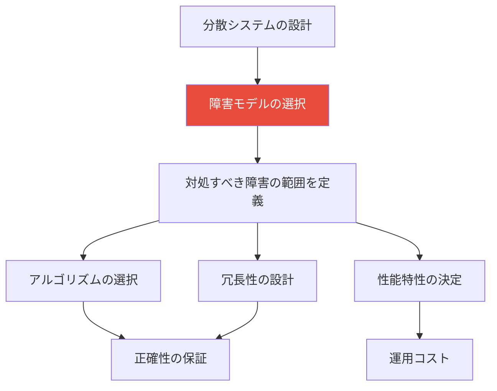

本記事では、分散システムにおける障害モデルの全体像を体系的に解説する。まず、障害モデルの階層構造を概観し、最も単純なクラッシュ障害から最も複雑なビザンチン障害まで、各モデルの定義・性質・実際の適用領域を詳述する。さらに、各障害モデルのもとで何ノードまで耐障害性を確保できるかという理論的限界、そして実世界のシステムがこれらのモデルをどのように活用しているかを考察する。

## 2. 障害の基本概念

### 2.1 障害・エラー・故障の区別

障害（fault）、エラー（error）、故障（failure）は、しばしば混同されるが、ディペンダビリティ研究（特にJean-Claude LapireらのDependability Taxonomy）においては明確に区別される。

| 用語 | 定義 | 例 |
|------|------|------|
| **障害（Fault）** | システムの誤動作を引き起こす原因となる異常 | メモリのビット反転、コードのバグ |
| **エラー（Error）** | 障害によって引き起こされたシステム状態の逸脱 | 不正な値を持つ変数 |
| **故障（Failure）** | エラーがシステムの外部に現れ、仕様を逸脱すること | 間違った応答を返す、応答しない |

障害がエラーを引き起こし、エラーが故障に伝播するという因果連鎖が存在する。耐障害設計とは、障害が存在してもエラーが故障に至らないようにするための手法である。

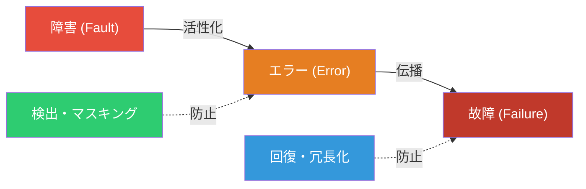

### 2.2 障害の時間的分類

障害は、その発生パターンに基づいて以下のように分類できる。

- **一時的障害（Transient fault）**: 一度発生した後、自然に消失する障害。ネットワークの一時的な輻輳、宇宙線によるメモリのビット反転などが該当する。
- **間欠的障害（Intermittent fault）**: 発生と消失を繰り返す障害。接触不良、温度依存の回路障害などが典型的である。デバッグが最も困難な障害クラスとされる。
- **永続的障害（Permanent fault）**: 修理または交換がなされるまで継続する障害。ディスクの物理的な破損、ソフトウェアのバグ（修正されるまで）などが含まれる。

分散システムの設計においては、特に永続的障害と一時的障害を区別することが重要である。永続的な障害に対しては冗長化（レプリケーション）で対処し、一時的な障害に対してはリトライ戦略で対処するという設計方針が一般的である。

### 2.3 システムモデルにおける仮定

障害モデルを議論する際には、システム全体のモデルについても明確にする必要がある。特に以下の3つの側面における仮定が重要である。

**ネットワークモデル**

- **信頼性のあるネットワーク（Reliable network）**: メッセージは必ず配信される（順序は保証されない場合がある）
- **公正損失ネットワーク（Fair-loss network）**: メッセージは失われうるが、繰り返し送信すれば最終的に届く
- **任意ネットワーク（Arbitrary network）**: メッセージは改竄・複製・破棄されうる

**タイミングモデル**

- **同期モデル（Synchronous model）**: メッセージの伝達時間とプロセスの処理速度に既知の上界がある
- **部分同期モデル（Partially synchronous model）**: 上界は存在するが、未知であるか、一定期間は成り立たない場合がある
- **非同期モデル（Asynchronous model）**: メッセージの伝達時間とプロセスの処理速度にいかなる上界もない

**障害モデル**

- 以降のセクションで詳述する各種の障害モデル

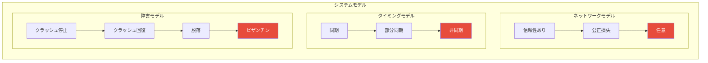

一般に、仮定が弱い（すなわち、より多くの種類の障害を許容する）モデルほど、正確なアルゴリズムの設計は困難になるが、実世界での適用範囲は広がる。

## 3. 障害モデルの階層構造

障害モデルには明確な階層構造がある。上位のモデルほど許容する障害の範囲が広く、その分だけ対処が困難になる。以下の図は、主要な障害モデルの包含関係を示している。

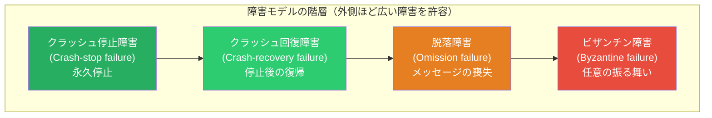

この階層関係の重要な含意は、**上位の障害モデルに耐性を持つアルゴリズムは、下位の障害モデルに対しても自動的に耐性を持つ**という点である。ビザンチン障害に耐えるアルゴリズムは、クラッシュ障害にも当然耐える。逆に、クラッシュ障害のみを想定したアルゴリズムは、ビザンチン障害が発生した場合には正しく動作する保証がない。

以下では、各障害モデルを詳細に検討する。

## 4. クラッシュ停止障害（Crash-Stop Failure）

### 4.1 定義

**クラッシュ停止障害（crash-stop failure）** は、最も単純な障害モデルである。このモデルでは、プロセスは以下の2つの状態のみを取る。

1. **正常に動作している**: プロセスはアルゴリズムの仕様に従って正しく動作し、メッセージの送受信を行う
2. **永久に停止している**: プロセスはある時点で永久に停止し、以降は一切の動作を行わない

重要な点は、プロセスが**停止と正常動作の間の中間状態を取らない**ことである。プロセスは正しく動作しているか、完全に停止しているかのいずれかであり、部分的に故障した状態（例えば、一部のメッセージだけを送信する、誤った値を返す）は発生しない。

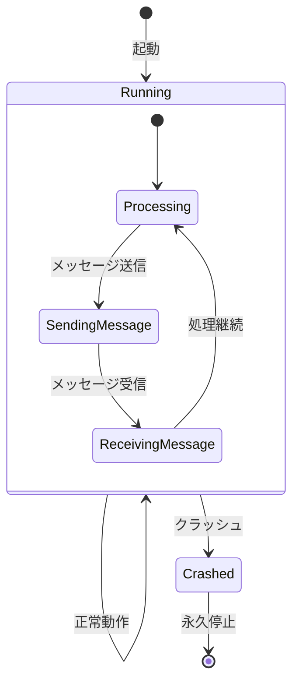

### 4.2 形式的な定義

より形式的に述べると、クラッシュ停止モデルにおけるプロセス $p$ の振る舞いは以下の制約を満たす。

- 時刻 $t$ までプロセス $p$ が正常に動作していた場合、$p$ は時刻 $t$ までに受信したすべてのメッセージを正しく処理し、必要なメッセージを正しく送信している
- プロセス $p$ がクラッシュする場合、ある時刻 $t_c$ が存在し、$t < t_c$ のすべての時刻で $p$ は正しく動作し、$t > t_c$ のすべての時刻で $p$ は一切の動作を行わない
- クラッシュしたプロセスは二度と復帰しない

### 4.3 障害検出

クラッシュ停止モデルでは、プロセスの障害は**最終的に検出可能**である。障害検出器（failure detector）はこのモデルにおいて中心的な役割を果たす。

::: tip 障害検出器の理論
Chandra-Touegの研究（1996年）により、障害検出器の性質は2つの軸で分類される。

- **完全性（Completeness）**: 実際にクラッシュしたプロセスは最終的に検出される
- **正確性（Accuracy）**: 正常なプロセスを誤ってクラッシュしたと判定しない

同期モデルでは完全かつ正確な障害検出器を構築できるが、非同期モデルではこの2つの性質を同時に完全に満たすことはできない。
:::

同期モデルにおいては、ハートビートに基づく単純な障害検出が有効である。

```python
class CrashStopFailureDetector:
    def __init__(self, timeout: float, nodes: list[str]):
        self.timeout = timeout
        self.nodes = nodes
        self.last_heartbeat: dict[str, float] = {}
        self.suspected: set[str] = set()

    def on_heartbeat_received(self, node_id: str, timestamp: float):
        """Handle incoming heartbeat from a node."""
        self.last_heartbeat[node_id] = timestamp
        # Remove from suspected set if previously suspected
        self.suspected.discard(node_id)

    def check_nodes(self, current_time: float) -> set[str]:
        """Check which nodes are suspected to have crashed."""
        for node_id in self.nodes:
            last = self.last_heartbeat.get(node_id, 0)
            if current_time - last > self.timeout:
                self.suspected.add(node_id)
        return self.suspected
```

### 4.4 耐障害性の限界

$n$ 個のプロセスからなるシステムにおいて、クラッシュ停止障害モデルのもとでコンセンサスを達成するためには、以下の条件が必要である。

$$f < \frac{n}{2}$$

ここで $f$ は同時に障害を起こしうるプロセスの最大数である。つまり、**過半数のプロセスが正常である限り**、コンセンサスを達成できる。これが、Raft や Paxos といったコンセンサスアルゴリズムにおいて「過半数のノードの同意」を必要とする根拠である。

::: warning なぜ過半数が必要なのか
$n = 5$ のクラスタで $f = 2$ のクラッシュ障害を許容する場合を考える。最悪のケースでは、2つのプロセスがクラッシュし、残りの3つのプロセスだけでコンセンサスを達成する必要がある。もし過半数未満（例えば2つ）で合意を形成すると、異なる2つの少数派グループが互いに矛盾する決定を下す可能性がある（split-brain）。過半数を要求することで、任意の2つの過半数集合は必ず共通のメンバーを持つため、矛盾した決定が防がれる。
:::

### 4.5 適用事例

クラッシュ停止モデルは、以下のようなシステムで広く採用されている。

- **Raft**: リーダー選出とログレプリケーションにおいて、過半数の応答を条件とする。クラッシュしたノードは永久に離脱する前提で設計されている（実際にはクラッシュ回復も想定しているが、基本的なアルゴリズムの正しさはクラッシュ停止モデルで証明される）
- **ZooKeeper（ZAB）**: クラスタのリーダーがクラッシュした場合、生存ノードの過半数による新リーダーの選出を行う
- **etcd**: Raftを実装し、クラッシュ停止モデルに基づく耐障害性を提供する

## 5. クラッシュ回復障害（Crash-Recovery Failure）

### 5.1 定義

**クラッシュ回復障害（crash-recovery failure）** モデルは、クラッシュ停止モデルを拡張し、クラッシュしたプロセスが**再起動して復帰する**可能性を許容する。このモデルでは、プロセスは以下の状態遷移を行いうる。

1. **正常に動作している**
2. **クラッシュして停止する**
3. **再起動して復帰する**（ただし、揮発性メモリの内容は失われる）

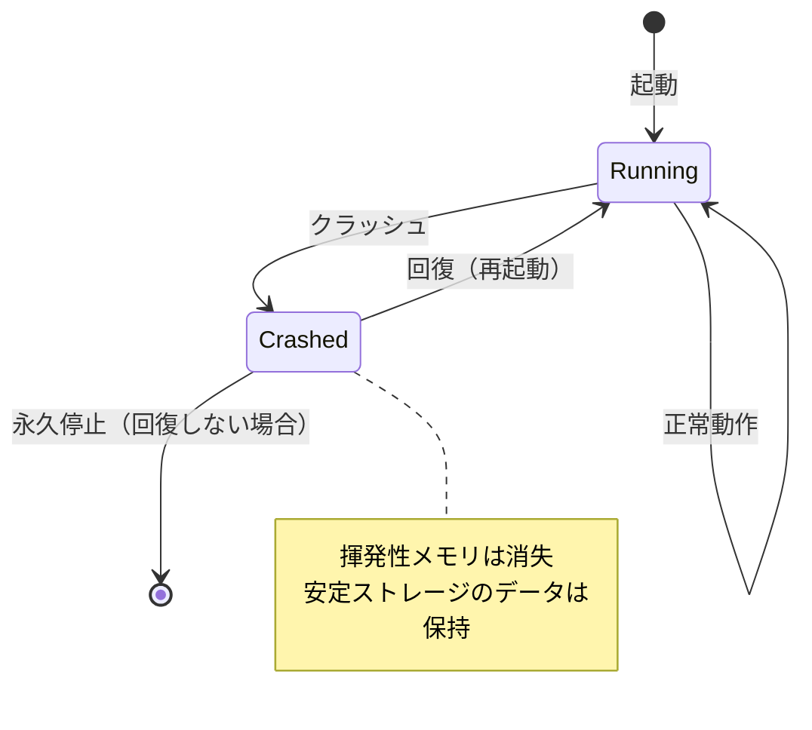

### 5.2 安定ストレージの重要性

クラッシュ回復モデルの鍵となるのは、**安定ストレージ（stable storage）** の概念である。クラッシュによって揮発性メモリ（RAM）の内容は失われるが、安定ストレージ（ディスク、不揮発性メモリなど）に書き込まれたデータはクラッシュを跨いで保持される。

これにより、プロセスは回復後に安定ストレージからの状態復元が可能になる。ただし、以下の課題が生じる。

- **クラッシュ時に送信途中だったメッセージはどうなるか？**: 送信完了前にクラッシュした場合、メッセージは送られなかったことになる。受信側はそのメッセージを受け取れない。
- **受信したが処理前にクラッシュしたメッセージはどうなるか？**: メッセージは消失する。送信側は再送の必要があるかもしれない。
- **安定ストレージへの書き込み途中にクラッシュした場合はどうなるか？**: データの整合性が損なわれる可能性がある。これを防ぐために、Write-Ahead Logging（WAL）などの手法が用いられる。

```python
class CrashRecoveryProcess:
    def __init__(self, process_id: str, stable_storage_path: str):
        self.process_id = process_id
        self.stable_storage_path = stable_storage_path
        self.volatile_state: dict = {}  # Lost on crash
        self.epoch: int = 0  # Incremented on each recovery

    def recover(self):
        """Recover from crash using stable storage."""
        # Read persisted state from stable storage
        persisted = self._read_stable_storage()
        self.epoch = persisted.get("epoch", 0) + 1
        self.volatile_state = {}
        # Write new epoch to stable storage
        self._write_stable_storage({"epoch": self.epoch})
        # Re-register with cluster, announcing recovery
        self._announce_recovery()

    def _write_stable_storage(self, data: dict):
        """Write data to stable storage (survives crashes)."""
        # Uses WAL or atomic write to ensure consistency
        import json
        with open(self.stable_storage_path, 'w') as f:
            json.dump(data, f)
            f.flush()
            import os
            os.fsync(f.fileno())

    def _read_stable_storage(self) -> dict:
        """Read data from stable storage."""
        import json
        try:
            with open(self.stable_storage_path, 'r') as f:
                return json.load(f)
        except FileNotFoundError:
            return {}

    def _announce_recovery(self):
        """Notify other nodes about recovery with new epoch."""
        pass
```

### 5.3 エポックとフェンシング

クラッシュ回復モデルにおいて重要な概念が**エポック（epoch）** である。プロセスが回復するたびにエポック番号を増加させることで、「クラッシュ前の古い自分」と「回復後の新しい自分」を区別できる。

これは**フェンシング（fencing）** と呼ばれる技法に応用される。古いエポックからのメッセージを拒否することで、「ゾンビプロセス」（クラッシュしたと思われていたが実は遅延していたプロセス）からの干渉を防ぐ。

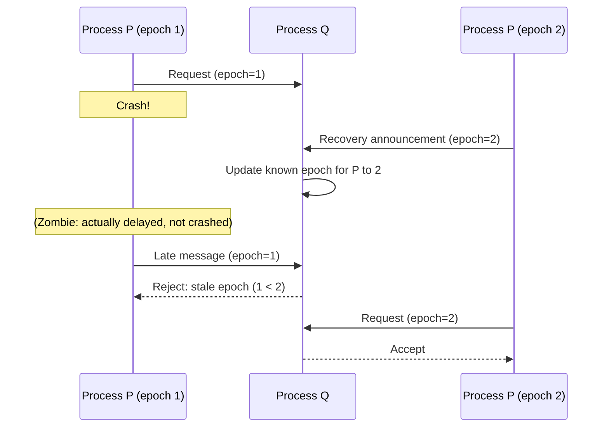

### 5.4 耐障害性の限界

クラッシュ回復モデルでは、耐障害性の分析がクラッシュ停止モデルよりも複雑になる。プロセスの分類が以下のように細分化されるためである。

- **常に正常（always-up）**: 一度もクラッシュしない
- **不安定（unstable）**: クラッシュと回復を繰り返す
- **最終的に常に正常（eventually always-up）**: ある時点以降はクラッシュしない
- **最終的に常に停止（eventually always-down）**: ある時点以降は永久に停止する

コンセンサスを達成するためには、「最終的に常に正常」なプロセスが過半数以上存在する必要がある。

### 5.5 適用事例

- **データベースシステム**: ほぼすべてのRDBMS（PostgreSQL、MySQLなど）は、WALを用いたクラッシュ回復メカニズムを実装している。プロセスのクラッシュ後、WALからコミット済みトランザクションを再適用（redo）し、未コミットトランザクションを取り消す（undo）
- **Apache Kafka**: ブローカーのクラッシュと回復を前提として設計されている。メッセージはディスクに永続化され、回復後にレプリカの再同期を行う
- **Raftの実用実装**: 理論上のRaftはクラッシュ停止で証明されるが、実用上の実装（etcdなど）はクラッシュ回復を前提としており、永続化されたログから状態を復元する

## 6. 脱落障害（Omission Failure）

### 6.1 定義

**脱落障害（omission failure）** モデルは、プロセスがクラッシュしないものの、**送信すべきメッセージを送信しない、または受信すべきメッセージを受信しない**ことを許容する。脱落障害は以下の2つに分類される。

- **送信脱落（Send omission）**: プロセスがメッセージの送信に失敗する。例えば、送信バッファのオーバーフロー、ネットワークインターフェースの一時的な障害などが原因となりうる。
- **受信脱落（Receive omission）**: プロセスがメッセージの受信に失敗する。例えば、受信バッファのオーバーフロー、カーネルのパケットドロップなどが原因となりうる。

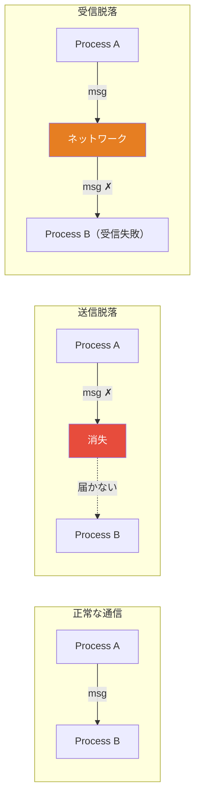

### 6.2 ネットワーク障害との関係

脱落障害とネットワーク障害は密接に関連している。実際の分散システムにおいて、メッセージの喪失はネットワークの問題として現れることが多い。

::: details ネットワークにおけるメッセージ喪失の原因
- **ネットワーク輻輳**: ルーターやスイッチのバッファが溢れ、パケットがドロップされる
- **リンク障害**: 物理的なケーブルの損傷、光ファイバーの劣化
- **ソフトウェアバグ**: NICドライバのバグ、カーネルのネットワークスタックの問題
- **ファイアウォール**: セキュリティポリシーの誤設定によるパケットの破棄
- **MTU不整合**: パケットサイズが中間ネットワークのMTUを超え、フラグメンテーションと再組み立ての失敗
- **ARP テーブルの溢れ**: 大規模なL2ネットワークでのARP応答の喪失
:::

### 6.3 クラッシュ障害との関係

脱落障害はクラッシュ障害の**上位互換**である。クラッシュ障害は、「すべてのメッセージを脱落させる（=一切のメッセージを送受信しない）特殊な脱落障害」と見なすことができる。つまり、クラッシュ停止 $\subset$ クラッシュ回復 $\subset$ 脱落障害 という包含関係が成立する。

### 6.4 性能障害（Performance/Timing Failure）

脱落障害の変種として、**性能障害（performance failure）** または**タイミング障害（timing failure）** がある。これは、メッセージ自体は送受信されるが、**規定された時間内に届かない**ことを指す。

同期モデルにおいては、メッセージの遅延に上界が定められているため、上界を超えた遅延は障害として扱われる。部分同期モデルや非同期モデルでは、このような遅延は障害とは見なされない（上界の概念がないため）。

::: warning グレー障害（Gray Failure）
近年の分散システム研究で注目されているのが**グレー障害（gray failure）** の概念である（Huang et al., 2017）。これは、完全なクラッシュでも完全な正常動作でもなく、**性能劣化**や**部分的な機能喪失**として現れる障害である。例えば、ディスクの一部セクタのみが読み取り不能になる、ネットワークの特定ポートのみがパケットロスを起こす、といった状況である。

グレー障害は、従来の障害検出器では検出が困難であり、そのノードと直接通信しているプロセスには障害が見えるが、障害検出器からは正常に見えるという「差分観測（differential observability）」の問題を引き起こす。
:::

## 7. ビザンチン障害（Byzantine Failure）

### 7.1 定義

**ビザンチン障害（Byzantine failure）** は、最も広範な障害モデルであり、プロセスが**任意の振る舞い**をすることを許容する。すなわち、障害を起こしたプロセスは以下のような行動を取りうる。

- **何もしない**（クラッシュ障害の特殊ケース）
- **メッセージを送信しない**（脱落障害の特殊ケース）
- **誤った値を送信する**
- **異なるプロセスに異なるメッセージを送信する**（equivocation）
- **プロトコルを逸脱した行動を取る**
- **他のプロセスと共謀して悪意のある行動を取る**

この障害モデルの名称は、Leslie Lamport、Robert Shostak、Marshall Peaseが1982年に発表した論文「The Byzantine Generals Problem」に由来する。

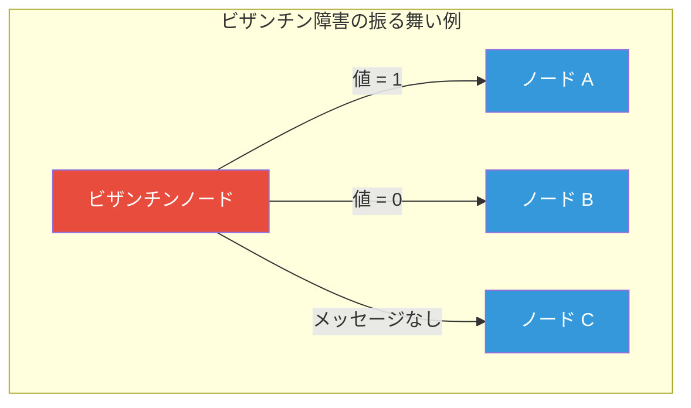

### 7.2 ビザンチン将軍問題

ビザンチン障害の本質を理解するために、元の問題設定を振り返る。

ビザンチン帝国の $n$ 人の将軍が、敵の都市を攻撃するか撤退するかを決定する必要がある。将軍たちは伝令（メッセージ）を通じてのみ通信できる。将軍の中に**裏切り者**（ビザンチン障害ノード）が存在する可能性がある。裏切り者は、異なる将軍に異なる命令を伝えることで、忠実な将軍の間に不一致を引き起こそうとする。

::: tip ビザンチン将軍問題の要件
1. **合意（Agreement）**: すべての忠実な将軍は同じ決定に到達する
2. **妥当性（Validity）**: すべての忠実な将軍が同じ初期値を持つ場合、その値が決定される
:::

### 7.3 耐障害性の限界

ビザンチン障害に対する耐障害性の理論的限界は、クラッシュ障害に比べて格段に厳しい。

**口頭メッセージの場合（認証なし）**

認証機構を用いない場合、$n$ 個のプロセスのうち $f$ 個がビザンチン障害を起こしうるとき、ビザンチン合意を達成するためには以下の条件が必要である。

$$n \geq 3f + 1$$

すなわち、ビザンチン障害ノードの3倍以上の正常ノードが必要である。この結果は Lamport, Shostak, Pease（1982）によって証明された。

::: details なぜ $3f + 1$ が必要なのか
$n = 3, f = 1$ の場合を考える。3人の将軍 A, B, C のうち C が裏切り者であるとする。

- 将軍 A は「攻撃」を提案し、B と C に伝える
- 裏切り者 C は、A に対しては「Bは攻撃と言った」と伝え、B に対しては「Aは撤退と言った」と伝える
- 将軍 B は「攻撃」を提案し、A と C に伝える
- 裏切り者 C は同様に矛盾した情報を流す

この状況で、A から見ると「自分は攻撃、B は攻撃（直接聞いた）、C 経由で B は攻撃」となる。しかし B から見ると「自分は攻撃、A は撤退（C 経由）、A は攻撃（直接聞いた）」となり、C が嘘をついているのか A が嘘をついているのかを区別できない。

$n = 3$ では、誰が裏切り者かを特定することが不可能であり、合意に到達できない。$n = 4$ にすれば、3人の忠実な将軍の間で多数決が成立し、裏切り者の影響を排除できる。
:::

**署名付きメッセージの場合（認証あり）**

デジタル署名などの暗号学的認証を用いることで、プロセスがメッセージを偽造できない場合、必要なノード数の条件は緩和される。

$$n \geq 2f + 1$$

署名によってメッセージの改竄（equivocation）が不可能になるため、必要な冗長性が減少する。

### 7.4 クラッシュ障害との比較

以下の表は、クラッシュ障害モデルとビザンチン障害モデルの主要な違いを整理したものである。

| 特性 | クラッシュ障害 | ビザンチン障害 |
|------|-------------|--------------|
| 障害の振る舞い | 停止のみ | 任意（悪意ある行動を含む） |
| コンセンサスに必要なノード数 | $n \geq 2f + 1$ | $n \geq 3f + 1$（認証なし） |
| 必要な通信ラウンド数 | $f + 1$（同期モデル） | $f + 1$（同期モデル） |
| メッセージ計算量 | $O(n^2)$ | $O(n^2)$ 以上 |
| 実装の複雑さ | 低い | 高い |
| 想定する環境 | 信頼できるが故障する環境 | 敵対的な環境 |

### 7.5 実用的なビザンチン耐障害アルゴリズム

#### PBFT（Practical Byzantine Fault Tolerance）

1999年にMiguel CastroとBarbara Liskovが提案したPBFTは、ビザンチン障害に対する耐障害コンセンサスを実用的な性能で実現した最初のアルゴリズムである。

PBFTの通信フローは以下の3フェーズから構成される。

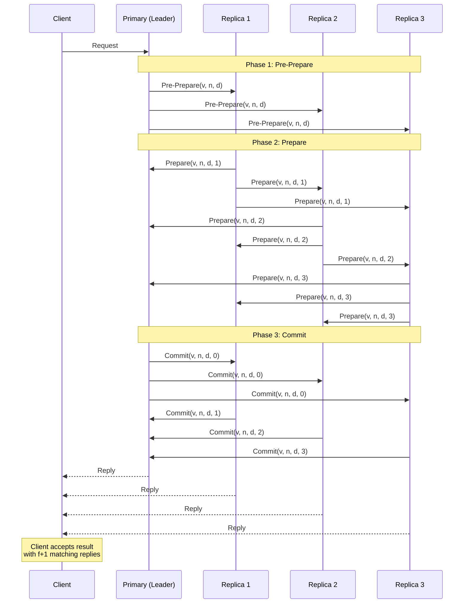

PBFTでは、$n = 3f + 1$ のレプリカ（$f$ がビザンチン障害を許容する最大数）を使用し、3フェーズのプロトコルで合意に到達する。通信のメッセージ計算量は $O(n^2)$ であり、大規模なネットワークではスケーラビリティの問題が生じる。

#### HotStuff

HotStuff（2019年、Yin et al.）は、PBFTのスケーラビリティ問題を解決するために提案されたアルゴリズムである。リーダーベースの設計により、メッセージ計算量を $O(n)$ に削減した。Meta（旧Facebook）が開発したLibraブロックチェーン（後のDiem）のコンセンサスレイヤーの基盤として採用された。

### 7.6 適用事例

- **ブロックチェーン**: Bitcoin（Proof of Work）、Ethereum（Proof of Stake）は、ビザンチン障害モデルを前提としたコンセンサスを達成する。参加者は互いを信頼せず、悪意のあるノードの存在を前提とする
- **航空宇宙システム**: Boeing 777やAirbus A320のフライトコントロールシステムは、ビザンチン耐障害性を持つ投票ベースのアーキテクチャを採用する。ハードウェアの障害が誤った値を生成する可能性に対処する必要がある
- **分散台帳技術（DLT）**: Hyperledger Fabricなどのエンタープライズブロックチェーンは、PBFT系のコンセンサスアルゴリズムを採用している

## 8. ネットワーク分断（Network Partition）

### 8.1 定義

**ネットワーク分断（network partition）** は、ノード間のネットワーク接続が失われ、システムが2つ以上の互いに通信不能なグループに分かれる障害である。ネットワーク分断は、ノードの障害ではなく通信路の障害であるが、その影響はノード障害と同等かそれ以上に深刻である。

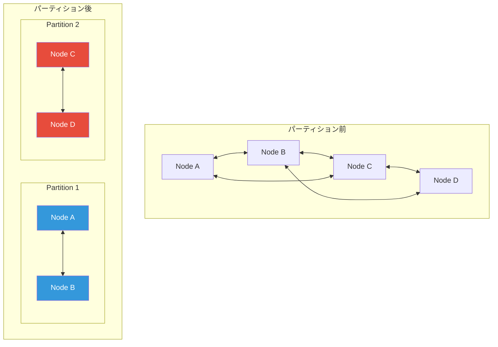

### 8.2 分断とクラッシュの区別不可能性

非同期モデルにおいて、ネットワーク分断とノードのクラッシュは**外部から区別できない**。ノード A がノード B からの応答を受け取れない場合、以下のいずれの状況かを判定する方法がない。

1. ノード B がクラッシュした
2. ノード A と B の間のネットワークが分断された
3. ノード B の応答が遅延している（ネットワーク遅延）
4. ノード B の処理が遅延している（負荷過多）

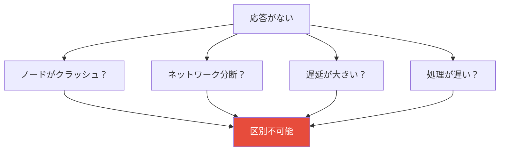

この区別不可能性が、分散システムの設計を根本的に困難にしている理由である。CAP定理は、まさにこの状況における一貫性と可用性のトレードオフを述べている。

### 8.3 非対称パーティション

ネットワーク分断は、しばしば**非対称（asymmetric）** に発生する。すなわち、ノード A からノード B へのメッセージは届くが、B から A へのメッセージは届かないという状況がありうる。これは、以下のような原因で発生する。

- ファイアウォールの非対称な設定
- ルーティングテーブルの不整合
- ネットワーク機器の部分故障

非対称パーティションは、対称パーティションよりもデバッグが困難であり、多くのアルゴリズムは対称パーティションのみを想定しているため、非対称パーティションで予期しない動作を示すことがある。

### 8.4 実世界でのネットワーク分断

ネットワーク分断は理論上の問題ではなく、実世界のデータセンターやクラウド環境で頻繁に発生する。以下は、著名な事例の一部である。

::: details 実世界のネットワーク分断事例
- **2011年のAmazon EC2障害**: US-East-1リージョンで大規模なネットワーク分断が発生し、EBSボリュームへのアクセスが数時間にわたって不可能になった。EBSのレプリケーションプロトコルが分断に適切に対処できず、大量のデータ再同期が必要になった
- **GitHubの分断（2012年）**: データセンター間のネットワーク分断により、MySQLのプライマリとレプリカの間で不整合が発生した
- **Google Cloud（2019年）**: 設定変更に起因するネットワーク障害により、複数リージョンにまたがるサービスが影響を受けた
:::

Baiduが2014年に発表した研究（Gunawi et al., "What Bugs Live in the Cloud?")によれば、クラウド環境における障害の約35%がネットワーク関連であり、その中でもネットワーク分断は特に深刻な影響をもたらすカテゴリーである。

## 9. FLP不可能性定理との関連

### 9.1 概要

障害モデルの議論において避けて通れないのが、**FLP不可能性定理**（Fischer, Lynch, Paterson, 1985）である。この定理は、**非同期ネットワークモデルにおいて、たった1つのプロセスがクラッシュする可能性があるだけで、確定的なコンセンサスアルゴリズムは存在しない**ことを証明した。

形式的に述べると、以下の3つの条件をすべて満たすコンセンサスプロトコルは存在しない。

1. **安全性（Safety）**: 合意に達した場合、その値はいずれかのプロセスが提案した値である
2. **活性（Liveness）**: すべての正常なプロセスは最終的に決定に到達する
3. **耐障害性**: 最大1つのプロセスのクラッシュ障害を許容する

### 9.2 障害モデルとの関係

FLP不可能性定理は、障害モデルの階層において以下の含意を持つ。

- **クラッシュ停止モデル + 非同期ネットワーク**: 確定的コンセンサスは不可能
- **クラッシュ停止モデル + 同期ネットワーク**: 確定的コンセンサスは可能（タイムアウトによる障害検出が信頼できるため）
- **クラッシュ停止モデル + 部分同期ネットワーク**: 安全性を常に保証しつつ、最終的に同期が回復すれば活性も達成するアルゴリズムが可能（Raft, Paxos）
- **ビザンチン障害モデル + 非同期ネットワーク**: 確定的コンセンサスは不可能（FLPの拡張）

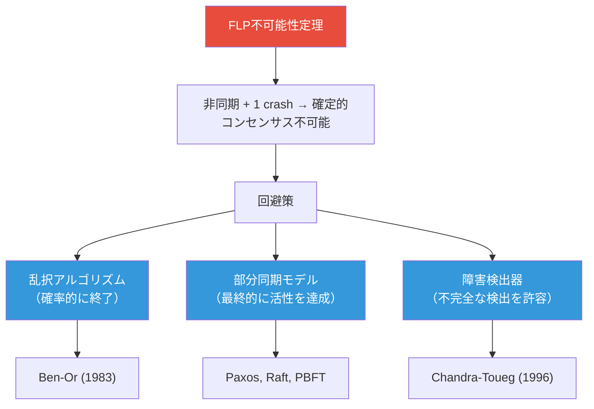

### 9.3 実用的な回避策

FLP不可能性定理は「解が存在しない」ことを示すが、実用上は以下の方法で回避される。

1. **部分同期モデルの採用**: 実世界のネットワークは、完全な非同期ではなく部分同期に近い。タイムアウトを設定し、タイムアウト後にリーダー交代を行うことで、活性を確率的に保証する（Raft, Paxos）
2. **乱択アルゴリズム**: 確率的な手法を用いて、期待値有限の時間でコンセンサスに到達する（Ben-Orアルゴリズム）
3. **障害検出器の抽象化**: Chandra-Touegの「最終的に弱い障害検出器」（eventually weak failure detector, $\Diamond W$）を用いることで、コンセンサスが可能になる

## 10. 障害モデルの選択指針

### 10.1 環境に基づく選択

障害モデルの選択は、システムの運用環境に大きく依存する。以下の表は、典型的な環境と推奨される障害モデルの対応を示す。

| 環境 | 推奨障害モデル | 根拠 |
|------|-------------|------|
| 単一データセンター内 | クラッシュ回復 | ノードは信頼できるが故障する。悪意のある行動は想定不要 |
| 複数データセンター間 | クラッシュ回復 + ネットワーク分断 | データセンター間のネットワーク分断が現実的に発生する |
| パブリッククラウド | クラッシュ回復 + 脱落 | クラウドプロバイダのインフラは信頼できるが、メッセージ喪失は発生しうる |
| パーミッションレスブロックチェーン | ビザンチン | 参加者は相互に信頼せず、悪意のあるノードの存在を前提とする |
| 航空宇宙・原子力 | ビザンチン | ハードウェア障害が任意の誤った値を生成しうる。安全性が最優先 |
| エンタープライズDLT | ビザンチン（認証あり） | 参加組織間の信頼が限定的。署名によりequivocationを防止 |

### 10.2 コストのトレードオフ

障害モデルが広範になるほど（すなわち、より多くの種類の障害に耐える設計になるほど）、以下のコストが増大する。

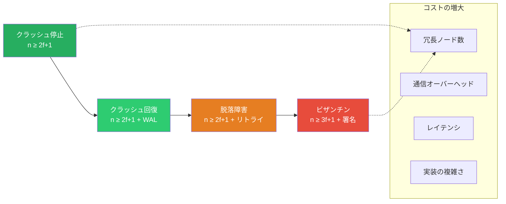

具体的には以下の通りである。

- **ノード数**: クラッシュ障害では $2f + 1$ ノードで $f$ 障害に耐えるが、ビザンチン障害では $3f + 1$ ノードが必要。つまり、1障害に耐えるために、クラッシュ障害では3ノード、ビザンチン障害では4ノードが必要
- **通信量**: クラッシュ障害のコンセンサス（Raft）は $O(n)$ のメッセージで済むが、ビザンチン障害のコンセンサス（PBFT）は $O(n^2)$ のメッセージが必要
- **レイテンシ**: ビザンチン障害のプロトコルは一般により多くのラウンドトリップを必要とし、コミットレイテンシが増大する
- **実装の複雑さ**: ビザンチン障害に対応するには、暗号学的署名の検証、悪意のあるメッセージの検出と排除、ビュー変更プロトコルなど、追加の機構が必要

### 10.3 過剰設計の危険性

障害モデルの選択においては、**過剰設計（over-engineering）** を避けることも重要である。ビザンチン障害に耐えるシステムは、クラッシュ障害のみに耐えるシステムに比べて、ノード数、通信量、レイテンシ、実装の複雑さのすべてにおいて大きなコストがかかる。

信頼できるデータセンター内で運用されるシステムにビザンチン耐障害性を導入することは、セキュリティ上の利点がコストに見合わない場合が多い。逆に、パーミッションレスなブロックチェーンにクラッシュ障害のみの耐障害性を実装することは、明らかに不十分である。

> "Make your system as simple as possible, but no simpler." — Albert Einstein（とされる格言の応用）

## 11. 実世界のシステムにおける障害モデルの適用

### 11.1 Google Spanner

Google Spannerは、グローバルに分散されたデータベースであり、以下の障害モデルを想定している。

- **ノード障害**: クラッシュ回復モデル。ノードはクラッシュ後にログから状態を復元して復帰する
- **ネットワーク障害**: 脱落障害モデル。データセンター間のネットワーク分断を想定する
- **ビザンチン障害**: 想定しない。Googleの内部インフラはビザンチン障害が起こりにくい環境であるため
- **時刻同期**: TrueTime APIにより、不確実性区間を伴う時刻を提供。これにより、Linearizabilityを保証しつつ外部一貫性（external consistency）を実現する

### 11.2 Apache ZooKeeper

ZooKeeperは、分散協調サービスとして以下の障害モデルに基づいている。

- **ノード障害**: クラッシュ回復モデル。ZABプロトコルにより、リーダーのクラッシュと回復を処理する
- **ネットワーク障害**: ネットワーク分断を想定。分断時には少数派のノードはリクエストの処理を停止する（一貫性を可用性よりも優先）
- **ビザンチン障害**: 想定しない

### 11.3 Ethereum 2.0（Consensus Layer）

Ethereum 2.0のコンセンサスレイヤー（Beacon Chain）は、以下の障害モデルを採用している。

- **ノード障害**: ビザンチン障害モデル。バリデータは任意の振る舞いをしうる
- **ネットワーク障害**: 部分同期モデル。最終的にメッセージは配信される
- **耐障害性**: 全バリデータのステーク量の$\frac{1}{3}$未満がビザンチン障害を起こす限り、安全性が保証される。$\frac{2}{3}$以上の正直なバリデータのステークにより、活性も保証される
- **スラッシング（Slashing）**: ビザンチン的な振る舞い（equivocation）が検出された場合、ステークの一部を没収することで、経済的インセンティブにより障害を抑止する

### 11.4 障害モデルの組み合わせ

実世界のシステムは、単一の障害モデルではなく、**コンポーネントごとに異なる障害モデル**を適用することが一般的である。

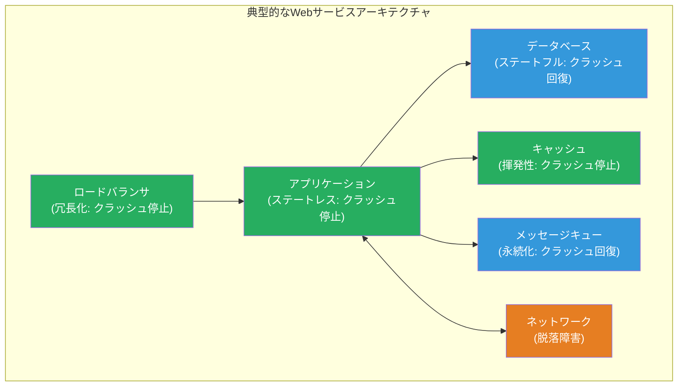

## 12. 障害の検出と対処の実践

### 12.1 障害検出の手法

分散システムにおける障害検出の主要な手法を以下に整理する。

**ハートビート方式**

最も基本的な障害検出方式。各ノードが定期的にハートビートメッセージを送信し、タイムアウト内に受信できない場合にそのノードをクラッシュしたと判定する。

::: code-group

```go [Push型ハートビート]
// Each node periodically sends heartbeats to a central monitor
func (n *Node) startHeartbeat(ctx context.Context, monitor *Monitor) {
    ticker := time.NewTicker(heartbeatInterval)
    defer ticker.Stop()
    for {
        select {
        case <-ticker.C:
            monitor.RecordHeartbeat(n.ID, time.Now())
        case <-ctx.Done():
            return
        }
    }
}

// Monitor detects failures based on missing heartbeats
func (m *Monitor) checkFailures() []NodeID {
    var failed []NodeID
    now := time.Now()
    for id, lastSeen := range m.lastHeartbeat {
        if now.Sub(lastSeen) > failureTimeout {
            failed = append(failed, id)
        }
    }
    return failed
}
```

```go [Pull型ハートビート]
// Monitor periodically pings each node
func (m *Monitor) probe(ctx context.Context) {
    ticker := time.NewTicker(probeInterval)
    defer ticker.Stop()
    for {
        select {
        case <-ticker.C:
            for _, node := range m.nodes {
                go func(n *Node) {
                    ctx, cancel := context.WithTimeout(ctx, probeTimeout)
                    defer cancel()
                    if err := n.Ping(ctx); err != nil {
                        m.markSuspected(n.ID)
                    } else {
                        m.markAlive(n.ID)
                    }
                }(node)
            }
        case <-ctx.Done():
            return
        }
    }
}
```

:::

**Phi Accrual Failure Detector**

Hayashibara et al.（2004）が提案した確率的な障害検出器。ハートビートの到着間隔の統計的分布を学習し、障害の「疑い度（suspicion level）」を連続値として出力する。

$$\Phi(t) = -\log_{10}(1 - F(t - t_{last}))$$

ここで $F$ はハートビートの到着間隔の累積分布関数、$t_{last}$ は最後にハートビートを受信した時刻である。$\Phi$ 値が閾値を超えた場合に、そのノードを障害と判定する。

Apache CassandraやAkkaのクラスタ管理において採用されている。

**Gossipベースの障害検出**

各ノードがランダムに選択した他のノードとハートビート情報を交換する方式。中央集権的な監視ノードが不要であり、スケーラビリティに優れる。

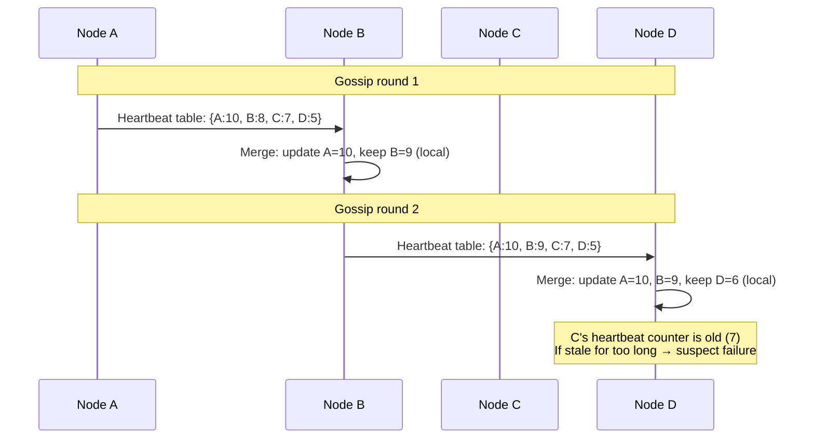

### 12.2 障害対処のパターン

障害を検出した後の対処方法は、障害モデルとシステム要件に応じて異なる。

| パターン | 説明 | 適用場面 |
|---------|------|---------|
| **フェイルオーバー** | 障害ノードの役割を待機ノードに引き継ぐ | データベースのプライマリ障害 |
| **リトライ** | 一時的な障害に対して操作を再試行する | ネットワークの一時的な不通 |
| **サーキットブレーカー** | 繰り返し障害するサービスへの呼び出しを一時的に遮断する | マイクロサービス間通信 |
| **冗長実行** | 同じリクエストを複数のノードに同時に送り、最初の応答を採用する | レイテンシ重視の環境 |
| **優雅な劣化** | 障害が発生しても、機能を限定してサービスを継続する | ユーザー向けサービス |

## 13. 最近の研究動向

### 13.1 形式検証と障害モデル

TLA+やAlloyなどの形式仕様記述言語を用いて、特定の障害モデルのもとでのアルゴリズムの正確性を検証する取り組みが広がっている。Amazonは、S3やDynamoDBなどの分散サービスの設計において、TLA+を用いて障害シナリオを網羅的に検証していることを報告している（Newcombe et al., 2015, "How Amazon Web Services Uses Formal Methods"）。

### 13.2 カオスエンジニアリング

Netflixが提唱した**カオスエンジニアリング**は、本番環境に意図的に障害を注入し、システムの耐障害性を検証する手法である。これは、理論的な障害モデルと実際の障害対処能力のギャップを埋めるアプローチである。

代表的なツール：
- **Chaos Monkey**: ランダムにインスタンスを終了させる（クラッシュ停止障害の注入）
- **Chaos Kong**: リージョン全体の障害をシミュレートする（大規模ネットワーク分断の注入）
- **Litmus Chaos**: Kubernetes環境向けのカオスエンジニアリングツール

### 13.3 確定的シミュレーションテスト

FoundationDB（Apple が買収）やTigerBeetleなどのシステムでは、**確定的シミュレーション（deterministic simulation）** を用いて、あらゆる障害シナリオをテストする手法が採用されている。決定論的なスケジューリングと擬似乱数を用いることで、障害の発生タイミングと順序を完全に制御可能にし、再現可能なテストを実現する。

FoundationDBは、この手法を用いて「7年間の本番運用でデータ損失ゼロ」という実績を達成している。

## 14. まとめ

分散システムにおける障害モデルは、システム設計の基盤をなす重要な概念である。本記事で解説した内容を総括する。

**障害モデルの階層**:
- **クラッシュ停止障害**: プロセスは永久に停止する。最も単純で、最も多くのアルゴリズムがこのモデルで設計されている
- **クラッシュ回復障害**: プロセスは停止後に復帰しうる。安定ストレージとWALが鍵となる
- **脱落障害**: メッセージの送受信に失敗しうる。ネットワーク障害の抽象化である
- **ビザンチン障害**: プロセスは任意の振る舞いをしうる。最も広範だが、最もコストが高い

**設計上の教訓**:
- 障害モデルの選択は、環境の信頼性とコストのバランスで決まる
- 過剰な障害モデルの採用は、不必要な複雑さとコストを招く
- 不十分な障害モデルの採用は、予期しない障害に対する脆弱性を生む
- 実世界のシステムは、コンポーネントごとに異なる障害モデルを組み合わせる

**理論と実践の架橋**:
- FLP不可能性定理は障害モデルの理論的限界を示すが、部分同期モデルや乱択アルゴリズムにより実用的に回避される
- カオスエンジニアリングや確定的シミュレーションは、理論的な障害モデルと実際の障害対処能力のギャップを検証する手法である
- 形式検証ツールは、障害モデルのもとでのアルゴリズムの正しさを数学的に保証する

障害モデルの理解は、「障害は起こるものである」という分散システムの根本原則を受け入れ、その上で何を保証でき、何を保証できないかを明確にするための出発点である。

## 参考文献

- Lamport, L., Shostak, R., Pease, M. (1982). *The Byzantine Generals Problem*. ACM Transactions on Programming Languages and Systems.
- Fischer, M., Lynch, N., Paterson, M. (1985). *Impossibility of Distributed Consensus with One Faulty Process*. Journal of the ACM.
- Chandra, T. D., Toueg, S. (1996). *Unreliable Failure Detectors for Reliable Distributed Systems*. Journal of the ACM.
- Castro, M., Liskov, B. (1999). *Practical Byzantine Fault Tolerance*. OSDI.
- Hayashibara, N. et al. (2004). *The φ Accrual Failure Detector*. IEEE SRDS.
- Avizienis, A. et al. (2004). *Basic Concepts and Taxonomy of Dependable and Secure Computing*. IEEE TDSC.
- Newcombe, C. et al. (2015). *How Amazon Web Services Uses Formal Methods*. Communications of the ACM.
- Huang, P. et al. (2017). *Gray Failure: The Achilles' Heel of Cloud-Scale Systems*. HotOS.
- Yin, M. et al. (2019). *HotStuff: BFT Consensus with Linearity and Responsiveness*. PODC.
- Kleppmann, M. (2017). *Designing Data-Intensive Applications*. O'Reilly Media.
