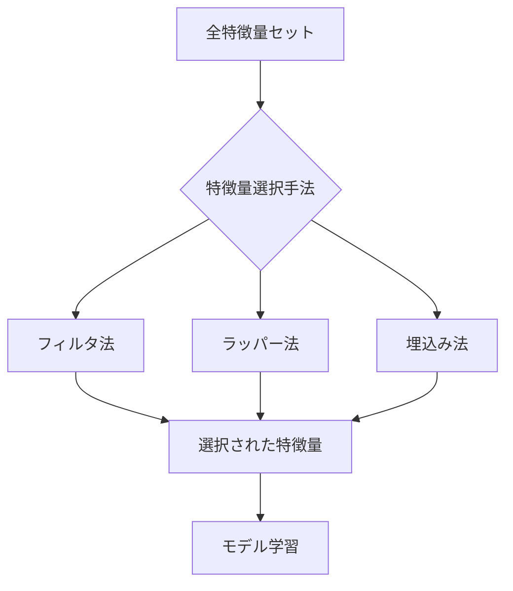
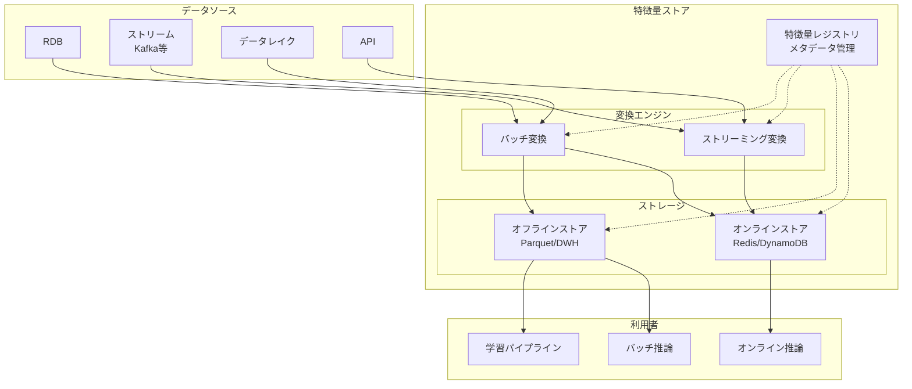
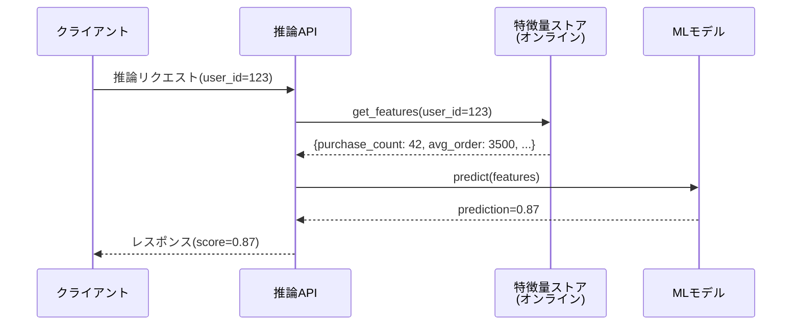
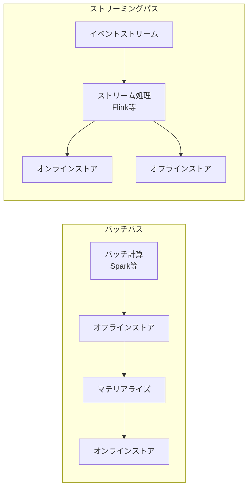
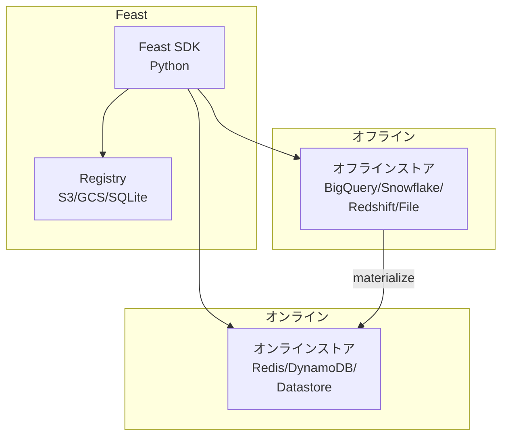
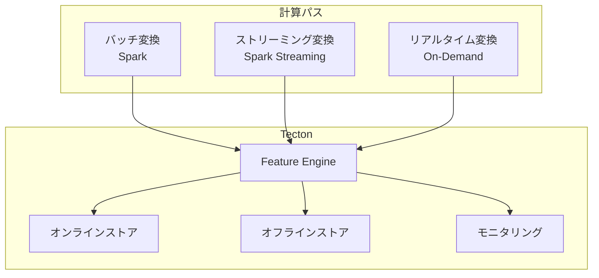
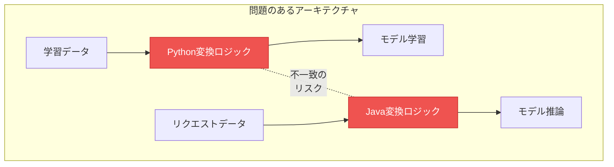
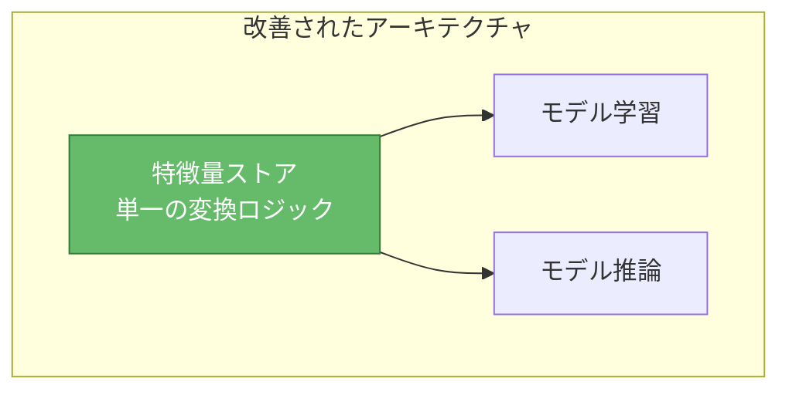
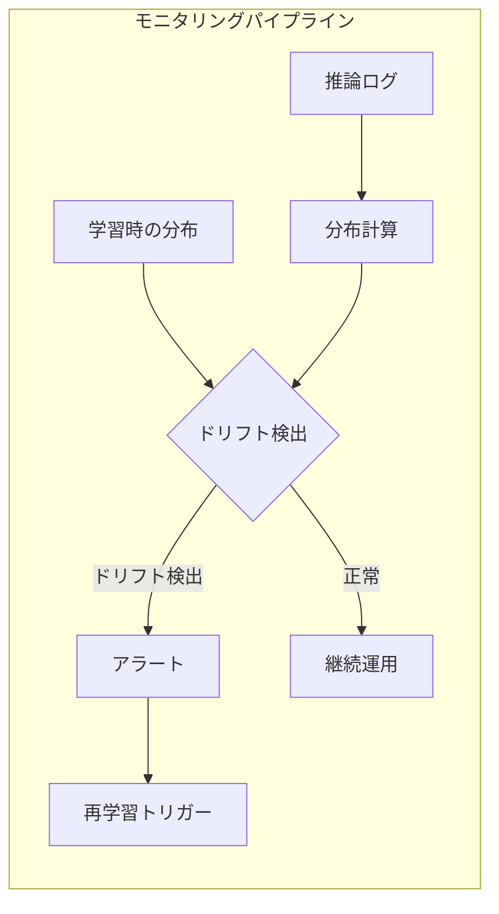

# 特徴量エンジニアリングと特徴量ストア

## 背景と動機

機械学習プロジェクトの成功は、モデルのアーキテクチャ選定やハイパーパラメータチューニングだけで決まるわけではない。実務上、モデルの性能を最も大きく左右するのは**特徴量（feature）の質**である。Andrew Ng が "Applied ML is basically feature engineering" と述べたように、生のデータを機械学習アルゴリズムが効果的に利用できる形に変換するプロセス、すなわち**特徴量エンジニアリング**は、ML パイプライン全体の中で最も時間と労力を要する工程の一つである。

### なぜ特徴量エンジニアリングが重要か

機械学習モデルは入力データの数値的パターンを学習する。しかし、現実世界のデータは多様な形式（テキスト、画像、カテゴリ値、時系列など）を持ち、そのままではモデルに投入できない場合が多い。さらに、同じ情報でも表現方法を変えるだけで、モデルの学習効率と汎化性能が大きく変わる。

例えば、不動産価格の予測タスクにおいて「住所」という生データをそのまま使うのと、そこから「最寄り駅からの距離」「学区の評価」「商業施設の密度」といった特徴量を抽出するのとでは、モデルの予測精度に劇的な差が生まれる。


### ML パイプラインにおける位置づけ

特徴量エンジニアリングは、データ収集・前処理とモデル学習の間に位置する中核的なステップである。しかし、単なる前処理にとどまらず、ドメイン知識とデータサイエンスの専門性を融合させた創造的な作業でもある。


近年、深層学習の発展により「モデルが自動的に特徴量を学習する」という流れ（表現学習）も強まっている。しかし、構造化データ（テーブルデータ）を扱う多くの実務シーンでは、依然として手動の特徴量エンジニアリングが最良の成果をもたらす場合が多い。また、深層学習モデルにおいても、入力の前処理や特徴量の設計が性能を大きく左右するケースは珍しくない。

### 組織的な課題

特徴量エンジニアリングは個人の技量に依存しやすく、組織全体での再利用性やガバナンスに課題を生じやすい。同じ特徴量を複数のチームが独立に実装し、微妙に異なる定義やロジックが乱立するという問題は、大規模な ML 組織ではほぼ必ず直面する問題である。こうした背景から、**特徴量ストア（Feature Store）** という概念が生まれた。特徴量ストアは、特徴量の定義・計算・提供を一元的に管理するインフラストラクチャであり、ML エンジニアリングの生産性と信頼性を飛躍的に向上させる。

---

## 特徴量エンジニアリングの手法

特徴量エンジニアリングの手法は、入力データの型に応じて大きく分類できる。ここでは、主要なデータ型ごとに代表的な変換手法を解説する。

### 数値特徴量

数値データは最も基本的な特徴量であるが、そのまま使用すると様々な問題が生じうる。

#### スケーリングと正規化

機械学習アルゴリズムの多くは、特徴量のスケール（値の範囲）に敏感である。例えば、「年齢（0〜100）」と「年収（0〜数千万）」を同時に使用する場合、勾配降下法の収束が遅くなったり、距離ベースのアルゴリズム（k-NN、SVM）が年収に偏った判断をしてしまったりする。

**標準化（Standardization / Z-score Normalization）**は、平均を 0、標準偏差を 1 に変換する手法である。

$$
z = \frac{x - \mu}{\sigma}
$$

**Min-Max 正規化**は、値を $[0, 1]$ の範囲にスケーリングする。

$$
x' = \frac{x - x_{\min}}{x_{\max} - x_{\min}}
$$

**Robust Scaler** は、中央値と四分位範囲（IQR）を使用し、外れ値の影響を受けにくい。

$$
x' = \frac{x - \text{median}}{Q_3 - Q_1}
$$

```python
from sklearn.preprocessing import StandardScaler, MinMaxScaler, RobustScaler

# Standardization: mean=0, std=1
scaler_standard = StandardScaler()
X_standard = scaler_standard.fit_transform(X)

# Min-Max: scale to [0, 1]
scaler_minmax = MinMaxScaler()
X_minmax = scaler_minmax.fit_transform(X)

# Robust: use median and IQR, robust to outliers
scaler_robust = RobustScaler()
X_robust = scaler_robust.fit_transform(X)
```

#### 非線形変換

データの分布が偏っている場合（右に裾が長い分布など）、対数変換やべき乗変換によって分布を正規分布に近づけることで、線形モデルの性能が向上する場合がある。

**Box-Cox 変換**は、最適なべき乗パラメータ $\lambda$ を自動的に推定する。

$$
y^{(\lambda)} = \begin{cases}
\frac{y^\lambda - 1}{\lambda} & \text{if } \lambda \neq 0 \\
\ln(y) & \text{if } \lambda = 0
\end{cases}
$$

**Yeo-Johnson 変換**は、Box-Cox 変換を負の値にも適用可能に拡張したものである。

#### ビニング（離散化）

連続値を区間に分割してカテゴリ変数に変換するビニングは、非線形な関係を捉えやすくする効果がある。例えば、年齢を「若年層」「中年層」「高年層」に分割することで、ステップ関数的な関係を表現できる。

```python
import pandas as pd
import numpy as np

# Equal-width binning
df['age_bin'] = pd.cut(df['age'], bins=5, labels=False)

# Quantile-based binning (equal-frequency)
df['income_bin'] = pd.qcut(df['income'], q=4, labels=['Q1', 'Q2', 'Q3', 'Q4'])

# Custom bins based on domain knowledge
df['bmi_category'] = pd.cut(
    df['bmi'],
    bins=[0, 18.5, 25, 30, float('inf')],
    labels=['underweight', 'normal', 'overweight', 'obese']
)
```

#### 特徴量の交互作用

複数の特徴量を組み合わせて新たな特徴量を生成する方法は、モデルが学習しにくい非線形な関係を明示的に表現する効果がある。

```python
# Interaction features
df['area'] = df['width'] * df['height']
df['bmi'] = df['weight'] / (df['height_m'] ** 2)
df['price_per_sqft'] = df['price'] / df['sqft']

# Polynomial features (automated)
from sklearn.preprocessing import PolynomialFeatures
poly = PolynomialFeatures(degree=2, interaction_only=True)
X_poly = poly.fit_transform(X)
```

### カテゴリ特徴量

カテゴリデータ（名義変数・順序変数）は、機械学習モデルが直接扱えない場合が多く、数値への変換が必要である。

#### One-Hot エンコーディング

最も基本的な手法で、各カテゴリ値に対して独立したバイナリ列を作成する。カテゴリ数が少ない場合に有効だが、高カーディナリティ（カテゴリ数が多い）の場合は次元の爆発が問題となる。

```python
# One-hot encoding
df_encoded = pd.get_dummies(df, columns=['color'], prefix='color')
# color_red, color_blue, color_green, ...
```

#### ラベルエンコーディングと順序エンコーディング

順序関係のあるカテゴリ（例：低・中・高）には、整数値を割り当てるラベルエンコーディングが適している。ただし、名義変数にラベルエンコーディングを適用すると、存在しない順序関係をモデルが学習してしまうリスクがある。

```python
from sklearn.preprocessing import OrdinalEncoder

# Ordinal encoding for ordered categories
encoder = OrdinalEncoder(categories=[['low', 'medium', 'high']])
df['priority_encoded'] = encoder.fit_transform(df[['priority']])
```

#### ターゲットエンコーディング

カテゴリ値をそのカテゴリにおける目的変数の統計量（平均値など）で置換する手法である。高カーディナリティのカテゴリに対して有効だが、目的変数のリーク（data leakage）に注意が必要である。

```python
import category_encoders as ce

# Target encoding with leave-one-out to prevent leakage
encoder = ce.TargetEncoder(cols=['city'], smoothing=1.0)
df['city_encoded'] = encoder.fit_transform(df['city'], df['target'])
```

リーク対策として、交差検証の枠組みの中でエンコーディングを行う（各 fold の学習データのみで統計量を計算し、検証データに適用する）方法や、ベイズ的なスムージングを適用する方法がある。

#### エンティティ埋め込み

深層学習の手法を用いて、カテゴリ変数を低次元の密なベクトルに変換する方法である。Word2Vec の考え方をカテゴリ変数に応用したものと捉えることができる。


### テキスト特徴量

テキストデータは非構造化データの代表であり、数値化には特別な手法が必要である。

#### Bag of Words と TF-IDF

最も古典的な手法は、文書をトークン（単語）の集合として扱う Bag of Words（BoW）である。各単語の出現頻度をカウントし、文書をベクトルとして表現する。

TF-IDF（Term Frequency - Inverse Document Frequency）は、BoW を改良し、多くの文書に出現する一般的な単語の重みを下げ、特定の文書にのみ出現する単語の重みを上げる。

$$
\text{TF-IDF}(t, d) = \text{TF}(t, d) \times \log\frac{N}{\text{DF}(t)}
$$

ここで $t$ はトークン、$d$ は文書、$N$ は全文書数、$\text{DF}(t)$ はトークン $t$ を含む文書数である。

```python
from sklearn.feature_extraction.text import TfidfVectorizer

# TF-IDF vectorization
vectorizer = TfidfVectorizer(max_features=10000, ngram_range=(1, 2))
X_tfidf = vectorizer.fit_transform(texts)
```

#### テキスト埋め込み

近年は、事前学習済みの言語モデル（BERT、Sentence-BERT など）を用いて文や文書を固定長のベクトルに変換する手法が主流になりつつある。これにより、単語の意味的な類似性や文脈情報を捉えた高品質な特徴量を得ることができる。

```python
from sentence_transformers import SentenceTransformer

# Generate text embeddings using a pre-trained model
model = SentenceTransformer('all-MiniLM-L6-v2')
embeddings = model.encode(texts)  # shape: (n_docs, 384)
```

### 時系列特徴量

時系列データの特徴量エンジニアリングでは、時間的な構造を活用することが重要である。

#### ラグ特徴量と移動統計量

過去の値（ラグ）をそのまま特徴量として使用する方法と、窓幅を指定して統計量（平均、分散、最大値など）を計算する移動統計量は、時系列予測の基本的な手法である。

```python
# Lag features
df['sales_lag_1'] = df['sales'].shift(1)
df['sales_lag_7'] = df['sales'].shift(7)
df['sales_lag_30'] = df['sales'].shift(30)

# Rolling statistics
df['sales_rolling_mean_7'] = df['sales'].rolling(window=7).mean()
df['sales_rolling_std_7'] = df['sales'].rolling(window=7).std()
df['sales_rolling_max_30'] = df['sales'].rolling(window=30).max()

# Expanding statistics (cumulative)
df['sales_expanding_mean'] = df['sales'].expanding().mean()
```

#### 日時特徴量

日時データからは、様々な周期的パターンを抽出できる。曜日、月、四半期、祝日フラグなどに加えて、三角関数を用いた周期的エンコーディングも有効である。

```python
# Calendar features
df['hour'] = df['timestamp'].dt.hour
df['day_of_week'] = df['timestamp'].dt.dayofweek
df['month'] = df['timestamp'].dt.month
df['is_weekend'] = df['day_of_week'].isin([5, 6]).astype(int)

# Cyclical encoding using sine/cosine
df['hour_sin'] = np.sin(2 * np.pi * df['hour'] / 24)
df['hour_cos'] = np.cos(2 * np.pi * df['hour'] / 24)
df['month_sin'] = np.sin(2 * np.pi * df['month'] / 12)
df['month_cos'] = np.cos(2 * np.pi * df['month'] / 12)
```

三角関数によるエンコーディングは、23時と0時の「近さ」を正しく表現できるという利点がある。

#### 変化率とトレンド特徴量

時系列データの変化率やトレンドを捉える特徴量は、定常性を仮定するモデルにおいて特に重要である。

```python
# Rate of change
df['sales_pct_change'] = df['sales'].pct_change()

# Difference (stationarity)
df['sales_diff_1'] = df['sales'].diff(1)
df['sales_diff_7'] = df['sales'].diff(7)

# Trend: ratio to rolling average
df['sales_trend'] = df['sales'] / df['sales'].rolling(window=30).mean()
```

---

## 特徴量選択

多数の特徴量を生成した後、そのすべてをモデルに投入することが必ずしも最善ではない。冗長な特徴量や無関係な特徴量は、過学習のリスクを高め、学習と推論のコストを増大させる。**特徴量選択（Feature Selection）**は、モデルの性能を維持または向上させつつ、特徴量の数を削減する手法である。



### フィルタ法

フィルタ法は、モデルに依存しない統計的指標を用いて特徴量を評価・選択する手法である。計算コストが低く、大規模なデータセットにも適用しやすい。

**分散による選択**: 分散が極めて小さい（ほぼ定数値の）特徴量は情報量が少ないため除外する。

**相関係数による選択**: ピアソン相関係数やスピアマン相関係数を用いて、目的変数との相関が低い特徴量を除外する。また、特徴量間の相関が高いペアから一方を除外する（多重共線性の排除）。

**統計的検定**: カイ二乗検定（カテゴリ変数と目的変数の関連）、ANOVA F 検定（数値変数とカテゴリ目的変数の関連）、相互情報量（任意の変数間の非線形な依存関係）などを用いる。

```python
from sklearn.feature_selection import (
    VarianceThreshold,
    SelectKBest,
    mutual_info_classif,
    f_classif,
)

# Remove low-variance features
selector_var = VarianceThreshold(threshold=0.01)
X_filtered = selector_var.fit_transform(X)

# Select top-k features by mutual information
selector_mi = SelectKBest(score_func=mutual_info_classif, k=20)
X_selected = selector_mi.fit_transform(X, y)

# Select by ANOVA F-test
selector_f = SelectKBest(score_func=f_classif, k=20)
X_selected_f = selector_f.fit_transform(X, y)
```

### ラッパー法

ラッパー法は、実際にモデルを学習して特徴量の部分集合を評価する手法である。モデルの性能を直接的に最適化できるが、計算コストが非常に高い。

**前方選択（Forward Selection）**: 空の特徴量集合から始めて、1つずつ最も性能を改善する特徴量を追加する。

**後方除去（Backward Elimination）**: 全特徴量から始めて、1つずつ最も性能に影響しない特徴量を除去する。

**再帰的特徴量削除（RFE: Recursive Feature Elimination）**: モデルの特徴量重要度に基づいて、最も重要度の低い特徴量を再帰的に除去する。

```python
from sklearn.feature_selection import RFE
from sklearn.ensemble import RandomForestClassifier

# Recursive Feature Elimination
model = RandomForestClassifier(n_estimators=100)
rfe = RFE(estimator=model, n_features_to_select=15, step=1)
rfe.fit(X, y)

# Selected feature mask
selected_features = rfe.support_
feature_ranking = rfe.ranking_
```

### 埋込み法

埋込み法は、モデルの学習過程自体に特徴量選択の仕組みが組み込まれている手法である。フィルタ法の効率性とラッパー法のモデル依存性の良いバランスを提供する。

**L1 正則化（Lasso）**: L1 ペナルティにより、重要でない特徴量の係数がちょうどゼロになるため、自動的に特徴量選択が行われる。

**木ベースモデルの特徴量重要度**: ランダムフォレストや勾配ブースティング木は、各特徴量の分割への貢献度に基づく重要度スコアを提供する。

**Permutation Importance**: 特徴量の値をシャッフルした際のモデル性能の低下度合いを測定する。モデルに依存しない手法であり、過学習に対しても頑健である。

```python
from sklearn.linear_model import LassoCV
from sklearn.inspection import permutation_importance
import lightgbm as lgb

# L1 regularization (Lasso) - coefficients become exactly 0
lasso = LassoCV(cv=5)
lasso.fit(X, y)
important_features = np.abs(lasso.coef_) > 0

# LightGBM feature importance
model_lgb = lgb.LGBMClassifier()
model_lgb.fit(X, y)
importance = model_lgb.feature_importances_

# Permutation importance (model-agnostic)
perm_imp = permutation_importance(model_lgb, X_test, y_test, n_repeats=10)
sorted_idx = perm_imp.importances_mean.argsort()[::-1]
```

### 特徴量選択の指針

| 手法 | 計算コスト | モデル依存性 | 特徴量間の相互作用 | 適用場面 |
|------|----------|------------|-----------------|---------|
| フィルタ法 | 低 | なし | 考慮しない | 大規模データ、前処理 |
| ラッパー法 | 高 | あり | 考慮する | 小〜中規模データ |
| 埋込み法 | 中 | あり | 部分的に考慮 | 一般的な選択肢 |

実務では、まずフィルタ法で明らかに不要な特徴量を除外し、その後埋込み法やラッパー法で精緻な選択を行うという段階的アプローチが効果的である。

---

## 特徴量ストアのアーキテクチャ

ML システムがプロダクション環境で稼働する規模になると、特徴量の管理が大きな課題となる。**特徴量ストア（Feature Store）**は、特徴量の定義・計算・保存・提供を一元的に管理するプラットフォームである。

### なぜ特徴量ストアが必要か

特徴量ストアが解決する主要な課題は以下の通りである。

1. **特徴量の再利用**: チーム間で同じ特徴量を共有し、重複した計算を排除する
2. **Training-Serving Skew の防止**: 学習時と推論時で同じ特徴量変換ロジックを保証する
3. **特徴量のディスカバリ**: 利用可能な特徴量を検索・発見できるカタログを提供する
4. **ガバナンスと監査**: 特徴量の定義、所有者、利用状況を追跡する
5. **低レイテンシの提供**: オンライン推論に必要な特徴量を高速に提供する

### アーキテクチャの全体像

特徴量ストアは通常、以下の主要コンポーネントで構成される。



### オフラインストア

オフラインストアは、学習データの生成やバッチ推論に使用される大量の過去データを保持する。主な要件は以下の通りである。

- **大容量**: 数TB〜PBオーダーのデータを格納できること
- **Point-in-Time Correctness**: 特定の時点で利用可能だったデータのみを返す（未来のデータのリークを防止する）
- **効率的なバッチ読み取り**: 学習パイプラインへの高スループットなデータ提供

一般的なストレージ技術としては、Apache Parquet ファイル（S3/GCS 上）、データウェアハウス（BigQuery, Snowflake, Redshift）、Delta Lake / Apache Iceberg などが用いられる。

#### Point-in-Time Join

特徴量ストアの中核的な機能の一つが **Point-in-Time Join** である。学習データを作成する際、各イベント時刻の時点で「実際に利用可能だった」特徴量の値のみを結合する必要がある。これを正確に行わないと、未来の情報が学習データに混入する**データリーク**が発生し、モデルの性能が過大評価される。

```mermaid
gantt
    title Point-in-Time Join の概念
    dateFormat X
    axisFormat %s

    section イベント
    注文A         : milestone, 0, 0
    注文B         : milestone, 5, 5

    section 特徴量: 購入回数
    値=3         : 0, 3
    値=5         : 3, 7

    section 結合結果
    注文A → 値=3 : milestone, 0, 0
    注文B → 値=5 : milestone, 5, 5
```



上の例では、注文Aの時点（時刻0）では購入回数が3であるため、注文Aのレコードには購入回数=3が結合される。時刻3で購入回数が5に更新されているが、この値は注文Bの時点（時刻5）に対してのみ使用される。

### オンラインストア

オンラインストアは、リアルタイムの推論リクエストに対して低レイテンシで特徴量を提供する。主な要件は以下の通りである。

- **低レイテンシ**: 数ミリ秒〜数十ミリ秒での応答
- **高スループット**: 大量の同時リクエストへの対応
- **最新値の提供**: 各エンティティの最新の特徴量値を保持

一般的なストレージ技術としては、Redis、Amazon DynamoDB、Apache Cassandra、Google Cloud Bigtable などのキーバリューストアが用いられる。



### オフライン→オンラインの同期

オフラインストアで計算された特徴量をオンラインストアに反映するための同期メカニズムが必要である。この同期は、バッチジョブ（定期的な全量・差分更新）またはストリーミングパイプライン（リアルタイムな更新）で実現される。



この二系統のパスを組み合わせたアーキテクチャは **Lambda Architecture** と呼ばれ、バッチ処理の正確性とストリーミング処理の即時性を両立させる。

### 特徴量レジストリ

特徴量レジストリは、特徴量のメタデータを管理する中央カタログである。以下の情報を保持する。

- **特徴量の定義**: 名前、データ型、説明、変換ロジック
- **エンティティとの関連**: どのエンティティ（ユーザー、商品など）に紐づくか
- **データソース**: どのデータソースから計算されるか
- **所有権**: どのチーム・個人が管理しているか
- **バージョン履歴**: 定義の変更履歴
- **依存関係**: 他の特徴量や上流データへの依存

```python
# Feast feature definition example
from feast import Entity, FeatureView, Field, FileSource
from feast.types import Float32, Int64
from datetime import timedelta

# Define entity
user = Entity(
    name="user_id",
    description="Unique identifier for users",
)

# Define data source
user_stats_source = FileSource(
    path="data/user_stats.parquet",
    timestamp_field="event_timestamp",
)

# Define feature view
user_stats_fv = FeatureView(
    name="user_stats",
    entities=[user],
    ttl=timedelta(days=1),
    schema=[
        Field(name="total_purchases", dtype=Int64),
        Field(name="avg_order_value", dtype=Float32),
        Field(name="days_since_last_purchase", dtype=Int64),
    ],
    source=user_stats_source,
)
```

---

## 主要ツール

特徴量ストアの実装には、オープンソースからマネージドサービスまで様々な選択肢がある。ここでは代表的な3つのツールを比較する。

### Feast

**Feast（Feature Store）**は、最も広く使われているオープンソースの特徴量ストアである。Gojek で開発が始まり、現在は Linux Foundation AI & Data のプロジェクトとして運営されている。

#### 特徴

- **軽量**: Python ベースのシンプルなアーキテクチャ
- **プロバイダ非依存**: AWS, GCP, Azure, ローカル環境で動作
- **Git ベースの管理**: 特徴量定義をコードとして Git で管理
- **最小限のインフラ**: 大規模なインフラ不要で小規模チームでも導入しやすい

#### アーキテクチャ



#### 使用例

```python
from feast import FeatureStore
import pandas as pd

store = FeatureStore(repo_path="feature_repo/")

# Retrieve training data with point-in-time join
entity_df = pd.DataFrame({
    "user_id": [1001, 1002, 1003],
    "event_timestamp": pd.to_datetime([
        "2026-01-15 10:00:00",
        "2026-01-15 12:00:00",
        "2026-01-16 08:00:00",
    ]),
})

training_df = store.get_historical_features(
    entity_df=entity_df,
    features=[
        "user_stats:total_purchases",
        "user_stats:avg_order_value",
        "user_stats:days_since_last_purchase",
    ],
).to_df()

# Retrieve online features for real-time inference
online_features = store.get_online_features(
    features=[
        "user_stats:total_purchases",
        "user_stats:avg_order_value",
    ],
    entity_rows=[{"user_id": 1001}],
).to_dict()
```

### Tecton

**Tecton** は、Uber の Michelangelo（社内 ML プラットフォーム）の開発者が創設したマネージド特徴量ストアである。エンタープライズ向けの機能が充実している。

#### 特徴

- **フルマネージド**: インフラ管理が不要
- **リアルタイム特徴量**: ストリーミング変換のネイティブサポート
- **オンデマンド特徴量**: リクエスト時にリアルタイムで計算する特徴量
- **Feature Freshness SLA**: 特徴量の鮮度を保証する仕組み
- **組み込みモニタリング**: データドリフトや特徴量品質の監視

#### アーキテクチャの特徴

Tecton は、バッチ・ストリーミング・リアルタイムの3つの計算パスを統一的に管理する。



### Hopsworks

**Hopsworks** は、KTH（スウェーデン王立工科大学）の研究プロジェクトから生まれたオープンソースの ML プラットフォームで、特徴量ストアを中核的なコンポーネントとして提供する。

#### 特徴

- **オープンソース + マネージドサービス**: 自前運用とマネージドの両方を選択可能
- **Python 中心の API**: データサイエンティストにとって使いやすいインターフェース
- **組み込みの特徴量バリデーション**: Great Expectations との統合
- **マルチモーダル対応**: テーブルデータだけでなく、埋め込みベクトルも管理可能
- **オンライン/オフラインの一体管理**: RonDB（MySQL NDB Cluster の派生）をオンラインストアとして使用

### ツール比較

| 項目 | Feast | Tecton | Hopsworks |
|------|-------|--------|-----------|
| ライセンス | OSS (Apache 2.0) | 商用 | OSS + 商用 |
| デプロイ | セルフホスト | フルマネージド | 両方 |
| ストリーミング変換 | 限定的 | ネイティブ | サポート |
| オンデマンド特徴量 | サポート | ネイティブ | サポート |
| モニタリング | 外部ツール連携 | 組み込み | 組み込み |
| 学習コスト | 低 | 中 | 中 |
| 適用規模 | 小〜中 | 中〜大 | 小〜大 |

選択の指針として、小規模チームやプロトタイピングには Feast、エンタープライズのプロダクション環境には Tecton、オープンソースで本格的な運用を行いたい場合は Hopsworks が適している。

---

## 実装考慮事項

特徴量エンジニアリングと特徴量ストアをプロダクション環境で運用する際には、いくつかの重要な考慮事項がある。

### Training-Serving Skew

**Training-Serving Skew**は、学習時と推論時で特徴量の値が異なってしまう問題であり、ML システムにおける最も深刻なバグの一つである。この問題はサイレントに発生し（エラーにならず）、モデルの性能が気づかないうちに低下する。

#### 原因

Training-Serving Skew の主な原因は以下の通りである。

1. **コードの重複**: 学習パイプライン（Python/Spark）と推論サービス（Java/Go）で特徴量変換のロジックを別々に実装し、微妙な差異が生じる
2. **データの不整合**: 学習時はバッチ処理で全データにアクセスできるが、推論時はリアルタイムのデータのみにアクセスする
3. **前処理のパラメータの不一致**: 標準化のパラメータ（平均、標準偏差）が学習時と推論時で異なる
4. **時間の取り扱いの差異**: 学習時は確定した過去のデータを使うが、推論時は「現在」の時間に依存する処理がある



#### 対策

Training-Serving Skew を防ぐための代表的な対策を以下に示す。

**特徴量ストアの活用**: 学習時も推論時も同じ特徴量ストアから特徴量を取得することで、変換ロジックの一貫性を保証する。



**変換パイプラインの共有**: TensorFlow Transform（`tf.Transform`）などのツールを使い、学習パイプラインで生成された変換グラフを推論時にもそのまま適用する。

**統計的な監視**: 学習時の特徴量分布と推論時の特徴量分布を継続的に比較し、統計的に有意な差異を検出する。

```python
from scipy import stats
import numpy as np

def detect_skew(training_values, serving_values, threshold=0.05):
    """Detect training-serving skew using KS test."""
    statistic, p_value = stats.ks_2samp(training_values, serving_values)
    is_skewed = p_value < threshold
    return {
        "ks_statistic": statistic,
        "p_value": p_value,
        "is_skewed": is_skewed,
    }
```

### 特徴量のバージョン管理

特徴量の定義は時間とともに変化する。新しいビジネスロジックの導入、バグの修正、データソースの変更などにより、同じ名前の特徴量でも計算ロジックが変わることがある。

#### バージョン管理の戦略

**Git ベースの管理**: 特徴量定義をコードとして管理し、変更履歴を Git で追跡する。Feast はこのアプローチを採用している。

**スキーマレジストリ**: 特徴量のスキーマ（データ型、許容値の範囲など）をレジストリで管理し、互換性のない変更を検出する。

**バージョン付き特徴量**: 特徴量名にバージョンを付与し、新旧のバージョンを並行して運用する。

```python
# Versioned feature views in Feast
user_stats_v1 = FeatureView(
    name="user_stats_v1",  # Original definition
    ...
)

user_stats_v2 = FeatureView(
    name="user_stats_v2",  # Updated with new logic
    ...
)
```

### データドリフトとモニタリング

プロダクション環境では、入力データの分布が時間とともに変化する**データドリフト**が発生する。これにより、学習時に有効だった特徴量が推論時に不適切な値を返すことがある。



モニタリングすべき指標には以下のものがある。

- **特徴量の統計量**: 平均、分散、最小・最大値、欠損率
- **分布の類似度**: KL ダイバージェンス、KS 検定統計量、PSI（Population Stability Index）
- **特徴量の鮮度**: 最終更新からの経過時間
- **特徴量の完全性**: 欠損値の割合

```python
def compute_psi(expected, actual, bins=10):
    """Compute Population Stability Index (PSI)."""
    breakpoints = np.linspace(
        min(np.min(expected), np.min(actual)),
        max(np.max(expected), np.max(actual)),
        bins + 1,
    )

    expected_counts = np.histogram(expected, breakpoints)[0] / len(expected)
    actual_counts = np.histogram(actual, breakpoints)[0] / len(actual)

    # Avoid division by zero
    expected_counts = np.clip(expected_counts, 1e-6, None)
    actual_counts = np.clip(actual_counts, 1e-6, None)

    psi = np.sum(
        (actual_counts - expected_counts) * np.log(actual_counts / expected_counts)
    )
    return psi  # PSI > 0.2 indicates significant drift
```

### 特徴量の品質保証

特徴量パイプラインにおけるデータ品質の保証は、モデルの信頼性を担保するために不可欠である。

**スキーマバリデーション**: データ型、値の範囲、NULL 許容性の検証を行う。

**統計的バリデーション**: 期待される分布からの逸脱を検出する。

**整合性バリデーション**: 特徴量間の論理的な関係（例：開始日 < 終了日）を検証する。

```python
import great_expectations as gx

# Define expectations for a feature
context = gx.get_context()
validator = context.sources.pandas_default.read_dataframe(df)

# Schema validation
validator.expect_column_values_to_be_of_type("age", "int64")
validator.expect_column_values_to_not_be_null("user_id")

# Statistical validation
validator.expect_column_values_to_be_between("age", min_value=0, max_value=150)
validator.expect_column_mean_to_be_between("purchase_amount", min_value=10, max_value=1000)

# Run validation
results = validator.validate()
```

---

## 今後の方向性

特徴量エンジニアリングと特徴量ストアの領域は、急速に進化し続けている。以下に主要なトレンドと今後の方向性を示す。

### 自動特徴量エンジニアリング（AutoFE）

手動の特徴量エンジニアリングは専門知識と時間を要する。自動特徴量エンジニアリングは、この作業を自動化する試みである。

**Featuretools** は、Deep Feature Synthesis（DFS）というアルゴリズムを用いて、リレーショナルデータから自動的に特徴量を生成する。エンティティ間の関係を定義するだけで、多数の集約特徴量や変換特徴量を自動生成する。

```python
import featuretools as ft

# Define entity set (relational structure)
es = ft.EntitySet(id="ecommerce")
es = es.add_dataframe(dataframe=orders, dataframe_name="orders", index="order_id")
es = es.add_dataframe(dataframe=products, dataframe_name="products", index="product_id")

# Define relationships
es = es.add_relationship("products", "product_id", "orders", "product_id")

# Automatic feature generation via Deep Feature Synthesis
feature_matrix, feature_defs = ft.dfs(
    entityset=es,
    target_dataframe_name="orders",
    max_depth=2,
)
```

近年は、LLM を活用した自動特徴量エンジニアリングの研究も進んでおり、ドメイン知識を自然言語で記述するだけで適切な特徴量を提案するシステムも登場しつつある。

### リアルタイム特徴量計算

ストリーミング処理の成熟とオンライン推論の需要増加に伴い、リアルタイムに計算される特徴量の重要性が増している。不正検知、リアルタイムレコメンデーション、動的価格設定などのユースケースでは、数秒〜数分前のデータに基づく特徴量が求められる。


### Feature as Code

特徴量定義をソフトウェアのコードとして管理する **Feature as Code** のアプローチが広まっている。これにより、以下の利点が得られる。

- **バージョン管理**: Git による変更履歴の追跡
- **コードレビュー**: 特徴量定義の変更に対するピアレビュー
- **CI/CD**: 特徴量パイプラインの自動テストと自動デプロイ
- **再現性**: 任意の時点の特徴量定義を再現可能

### 埋め込みの管理

大規模言語モデルやマルチモーダルモデルの普及に伴い、テキスト・画像・音声などの非構造化データの埋め込みベクトルを特徴量として管理するニーズが急増している。従来の特徴量ストアはスカラー値やカテゴリ値を前提としていたが、高次元の密ベクトルを効率的に保存・検索・提供するための拡張が進んでいる。

ベクトルデータベース（Pinecone, Weaviate, Qdrant など）との統合や、特徴量ストア自体にベクトル検索機能を組み込む動きも見られる。

### Declarative Feature Engineering

宣言的（declarative）なアプローチによる特徴量エンジニアリングも注目されている。SQL ライクな記述で特徴量の変換を定義し、実行エンジンが最適な計算方法を自動的に選択するという考え方である。これにより、データサイエンティストはビジネスロジックに集中し、インフラストラクチャの詳細から解放される。

### フェデレーテッド特徴量ストア

大規模組織では、複数のチームがそれぞれ独自の特徴量ストアを運用するケースがある。フェデレーテッド特徴量ストアは、これらの分散した特徴量ストアを仮想的に統合し、組織全体で特徴量の検索・共有を可能にするアーキテクチャである。データメッシュの考え方を特徴量管理に適用したものと言える。

---

## まとめ

特徴量エンジニアリングは、機械学習プロジェクトの成功を左右する最も重要なプロセスの一つである。数値、カテゴリ、テキスト、時系列といった多様なデータ型に対する変換手法と、フィルタ法・ラッパー法・埋込み法による特徴量選択の手法を理解し、適切に適用することが求められる。

また、組織的な規模で ML システムを運用する場合、特徴量ストアは不可欠なインフラストラクチャとなる。オフライン/オンラインの二層構造、Point-in-Time Join、特徴量レジストリといったコアコンセプトを理解し、Feast・Tecton・Hopsworks などのツールを適切に選択・導入することで、Training-Serving Skew の防止、特徴量の再利用促進、データ品質の保証を実現できる。

特徴量エンジニアリングの自動化、リアルタイム特徴量計算、埋め込みベクトルの管理など、この領域は急速に進化し続けている。ML エンジニアにとって、これらの技術動向を把握し、プロジェクトの要件に応じた適切なアプローチを選択する能力は、今後ますます重要性を増すだろう。
