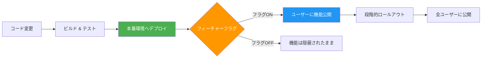
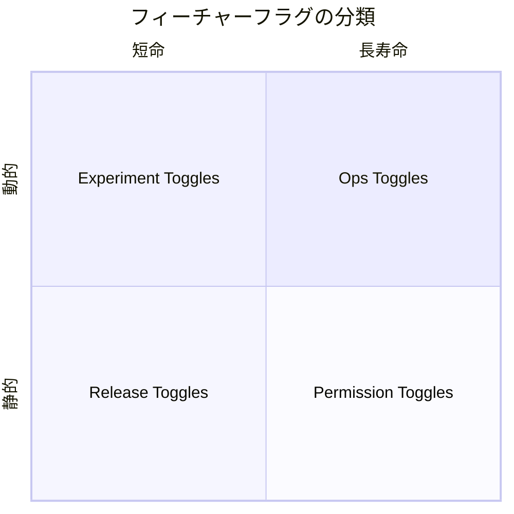
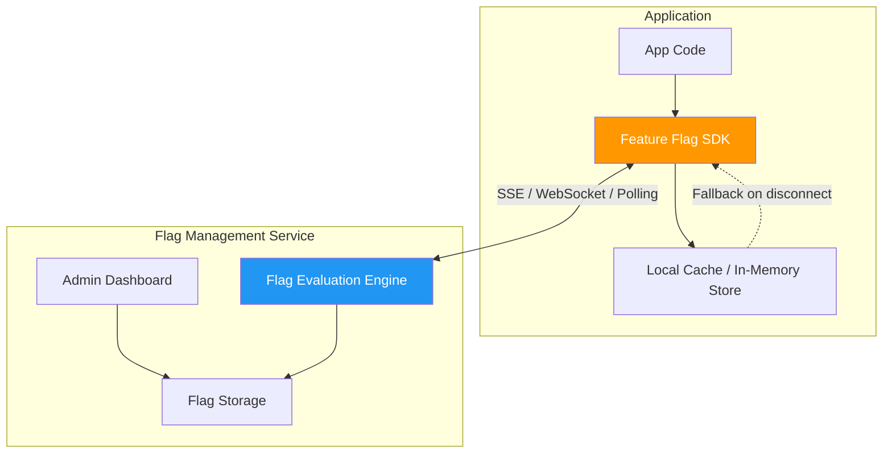
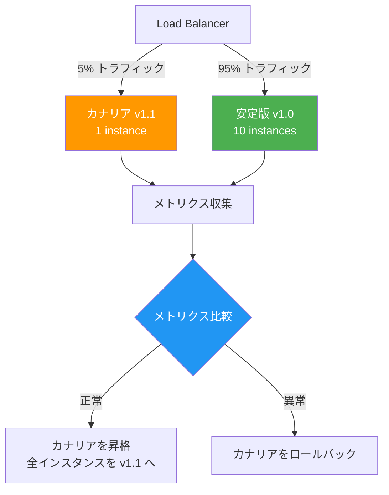
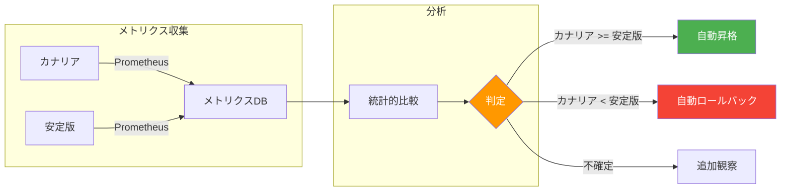
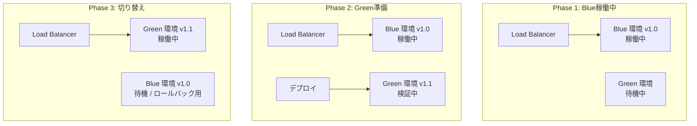
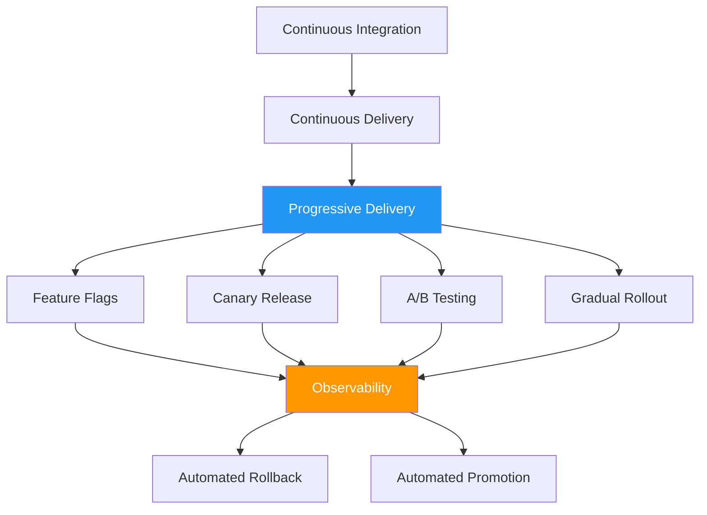
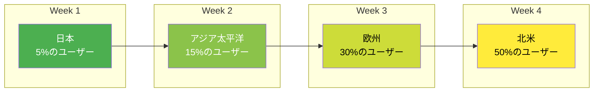
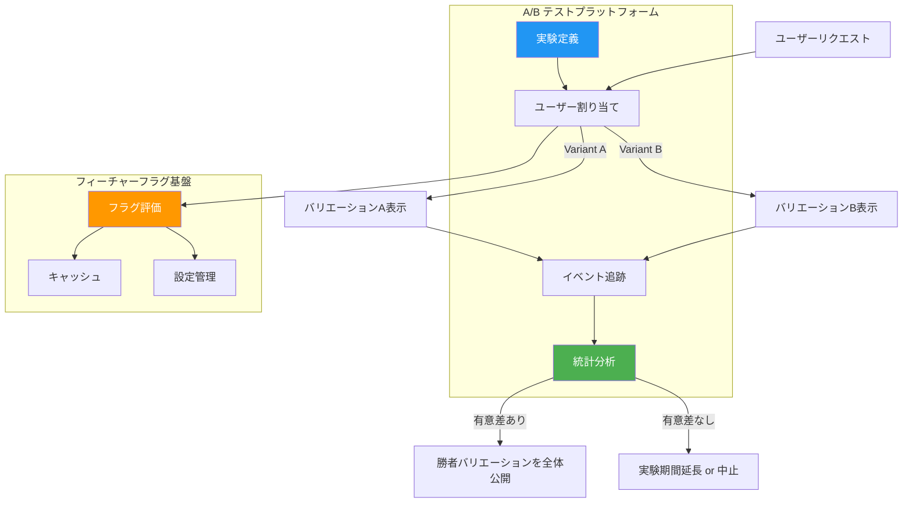

# フィーチャーフラグとカナリアリリース

## 1. 背景と動機 — デプロイとリリースの分離

ソフトウェア開発において、「デプロイ」と「リリース」は長らく同義語のように扱われてきた。コードをビルドし、本番サーバーに配置した瞬間、すべてのユーザーに新機能が届く。この単純なモデルは、開発規模が小さいうちは問題にならない。しかし、ユーザー数が数百万に達し、チームが数十・数百人規模になり、1日に何十回もデプロイするような現代的な開発環境では、この一体化が深刻なボトルネックとなる。

### デプロイとリリースが一体化した場合の問題

**リスクの集中**: すべてのユーザーに一斉にリリースするため、バグの影響が即座に全ユーザーに波及する。大規模障害のリスクが常にある。

**デプロイの恐怖**: リリースと直結しているために、デプロイ自体が緊張を伴うイベントとなる。チームは「金曜日にデプロイするな」「深夜にリリースしよう」といったルールを作り始め、デプロイ頻度が自然と下がっていく。

**長命ブランチの発生**: リリースが怖いからこそ、フィーチャーブランチが長期化する。長期化したブランチはマージコンフリクトを招き、さらにリリースリスクを高めるという悪循環に陥る。

**ビジネスとの非同期**: プロダクトマネージャーが「来週火曜のイベントに合わせてリリースしたい」と言っても、技術的な都合でデプロイのタイミングが制約される。ビジネス要件と技術的なデプロイスケジュールの調整が常に摩擦を生む。

### デプロイとリリースの分離という発想

これらの問題に対する根本的な解決策が、**デプロイとリリースの分離（Decoupling Deploy from Release）** という概念である。

```
デプロイ = コードを本番環境に配置すること（技術的操作）
リリース = 機能をユーザーに公開すること（ビジネス判断）
```

この分離を実現する中核技術が **フィーチャーフラグ（Feature Flag）** であり、段階的にユーザーへ公開していく手法が **カナリアリリース（Canary Release）** や **プログレッシブデリバリー（Progressive Delivery）** である。



この考え方は、2010年代にFacebook、Google、Netflix、LinkedInなどの大規模テック企業で広く採用され、現在ではあらゆる規模の開発チームにとって標準的なプラクティスとなりつつある。Martin Fowlerが2010年に発表した記事「Feature Toggles」がこの概念を広く知らしめたきっかけの一つとされている。

## 2. フィーチャーフラグの基本概念

### 定義

フィーチャーフラグ（Feature Flag）とは、コードの動作を実行時に切り替えるための条件分岐メカニズムである。Feature Toggle、Feature Switch、Feature Gateなどとも呼ばれる。

最も単純な形態は、if文による分岐である。

```python
# Simplest form of a feature flag
if feature_flags.is_enabled("new_checkout_flow"):
    return render_new_checkout()
else:
    return render_old_checkout()
```

しかし、実際のプロダクション環境では、単純なbooleanの切り替えだけでなく、ユーザー属性に基づく条件分岐、段階的なロールアウト率の制御、A/Bテスト用のバリエーション管理など、より複雑な機能が求められる。

### フィーチャーフラグの分類

Pete Hodgsonによる分類（Martin Fowlerのサイトで公開された記事に基づく）では、フィーチャーフラグは以下の4つのカテゴリに分けられる。それぞれのフラグは**寿命（Longevity）** と**動的性（Dynamism）** が異なり、管理方法も異なる。



#### Release Toggle（リリーストグル）

**目的**: 未完成の機能や、リリースタイミングを制御したい機能を隠すために使用する。

**寿命**: 短期（数日〜数週間）。機能が安定し、完全にロールアウトされたら削除すべき。

**動的性**: 低い。基本的にはデプロイ時やランタイムの設定変更で切り替える。ユーザー単位の条件分岐は通常不要。

```python
# Release Toggle example
class CheckoutService:
    def process_order(self, order):
        if self.feature_flags.is_enabled("new_payment_gateway"):
            # New implementation under development
            return self._process_with_stripe(order)
        else:
            # Existing stable implementation
            return self._process_with_legacy(order)
```

::: tip Release Toggleの運用ポイント
Release Toggleは最も一般的なフラグであり、同時に最も技術的負債になりやすいフラグでもある。フラグ作成時に**有効期限（expiry date）** を設定し、期限を過ぎたフラグを自動的に検出する仕組みを作ることが重要である。
:::

#### Experiment Toggle（実験トグル）

**目的**: A/Bテストやマルチバリエーションテストを実施し、ユーザー行動に基づいてどの実装が優れているかをデータドリブンに判断する。

**寿命**: 中期（数週間〜数ヶ月）。統計的に有意な結果が得られるまで継続する。

**動的性**: 高い。ユーザーごとに異なるバリエーションを出し分け、各バリエーションの結果を測定する。コホートの一貫性（同じユーザーには常に同じバリエーションを見せる）が重要。

```python
# Experiment Toggle example
class RecommendationEngine:
    def get_recommendations(self, user):
        variant = self.feature_flags.get_variant(
            "recommendation_algorithm_experiment",
            user_id=user.id,
            # Consistent hashing ensures same user always sees same variant
        )

        if variant == "control":
            return self._collaborative_filtering(user)
        elif variant == "variant_a":
            return self._content_based(user)
        elif variant == "variant_b":
            return self._hybrid_approach(user)
```

#### Ops Toggle（運用トグル）

**目的**: 運用上の理由でシステムの振る舞いを制御する。高負荷時に特定の機能を無効化したり、パフォーマンスに影響する機能を緊急停止したりする。いわゆる「キルスイッチ」としての役割。

**寿命**: 長期（恒久的に存在することもある）。特に、外部依存のある機能のフォールバック制御では永続的に維持される。

**動的性**: 高い。障害発生時に即座に切り替えられる必要がある。

```python
# Ops Toggle example
class SearchService:
    def search(self, query):
        if self.feature_flags.is_enabled("elasticsearch_circuit_breaker"):
            try:
                return self._search_elasticsearch(query)
            except ElasticsearchTimeoutError:
                # Fallback to simpler search
                return self._search_database(query)
        else:
            # Elasticsearch is disabled due to operational issues
            return self._search_database(query)
```

::: warning Ops Toggleの注意点
Ops Toggleは緊急時に使用するため、フラグ管理システム自体の可用性が極めて重要になる。フラグ管理サーバーがダウンした場合のデフォルト値を慎重に設計する必要がある。通常は、最も安全な動作をデフォルトにする。
:::

#### Permission Toggle（権限トグル）

**目的**: 特定のユーザーやグループにのみ機能を公開する。プレミアム機能のゲーティング、内部テスター向けの先行公開、ベータプログラムの管理などに使用する。

**寿命**: 長期（ビジネスモデルに関わるため、恒久的に存在する場合もある）。

**動的性**: ユーザー単位で異なるため動的だが、頻繁に変更されるものではない。

```python
# Permission Toggle example
class DashboardService:
    def get_dashboard(self, user):
        if self.feature_flags.is_enabled("advanced_analytics", user=user):
            # Premium feature available for paid users
            return self._render_advanced_dashboard(user)
        else:
            return self._render_basic_dashboard(user)
```

### 各フラグのライフサイクル比較

| 種類 | 寿命 | 動的性 | 削除のタイミング | 主な責任者 |
|------|------|--------|------------------|------------|
| Release Toggle | 短期（日〜週） | 低い | 完全ロールアウト後 | 開発者 |
| Experiment Toggle | 中期（週〜月） | 高い | 実験結論後 | PM / データサイエンティスト |
| Ops Toggle | 長期〜恒久 | 高い | 対象システム廃止時 | SRE / インフラ |
| Permission Toggle | 長期〜恒久 | 中程度 | ビジネスモデル変更時 | プロダクト |

## 3. フィーチャーフラグの実装パターン

### コードレベルの実装

#### 基本的なif/else方式

最もシンプルだが、フラグが増えるとコードの可読性が急速に低下する。

```typescript
// Basic if/else approach
function processPayment(order: Order): PaymentResult {
  if (featureFlags.isEnabled("new_payment_processor")) {
    return processWithNewGateway(order);
  } else {
    return processWithLegacyGateway(order);
  }
}
```

#### Strategy パターンによる抽象化

フラグの分岐をStrategy パターンで抽象化することで、コードの見通しを改善できる。

```typescript
// Strategy pattern approach
interface PaymentProcessor {
  process(order: Order): PaymentResult;
}

class LegacyPaymentProcessor implements PaymentProcessor {
  process(order: Order): PaymentResult {
    // Legacy implementation
    return this.legacyGateway.charge(order);
  }
}

class NewPaymentProcessor implements PaymentProcessor {
  process(order: Order): PaymentResult {
    // New implementation
    return this.stripeGateway.charge(order);
  }
}

// Factory selects implementation based on feature flag
class PaymentProcessorFactory {
  create(): PaymentProcessor {
    if (featureFlags.isEnabled("new_payment_processor")) {
      return new NewPaymentProcessor();
    }
    return new LegacyPaymentProcessor();
  }
}
```

#### デコレータ / アノテーション方式

フレームワークの機能を利用して、宣言的にフラグを適用する方法もある。

```python
# Decorator-based feature flag
from feature_flags import feature_gate

@feature_gate("new_recommendation_engine")
def get_recommendations(user_id: str) -> list[Recommendation]:
    """This function is only called when the flag is enabled."""
    return new_engine.recommend(user_id)

@feature_gate("new_recommendation_engine", is_fallback=True)
def get_recommendations_fallback(user_id: str) -> list[Recommendation]:
    """Fallback when the flag is disabled."""
    return legacy_engine.recommend(user_id)
```

### 設定管理のアプローチ

フラグの値をどこに保持するかによって、運用特性が大きく異なる。

#### ハードコード

最も単純だが、変更にはコードの変更とデプロイが必要。

```python
# Hardcoded flags (not recommended for production)
FEATURE_FLAGS = {
    "new_checkout": True,
    "dark_mode": False,
}
```

#### 設定ファイル

環境変数や設定ファイルで管理する。デプロイ時に値を切り替えられるが、ランタイムでの変更はできない（再起動が必要）。

```yaml
# config/feature_flags.yaml
feature_flags:
  new_checkout:
    enabled: true
    description: "New checkout flow with Stripe"
  dark_mode:
    enabled: false
    description: "Dark mode UI"
    rollout_percentage: 0
```

#### データベース / KVS

データベースやRedisなどのKey-Value Storeに保持する。ランタイムで変更可能だが、アプリケーション起動時やフラグ評価時にI/Oが発生する。キャッシュ戦略が重要になる。

```python
# Database-backed feature flag service
class FeatureFlagService:
    def __init__(self, db, cache_ttl=60):
        self.db = db
        self.cache = {}
        self.cache_ttl = cache_ttl

    def is_enabled(self, flag_name: str, context: dict = None) -> bool:
        # Check local cache first
        cached = self._get_from_cache(flag_name)
        if cached is not None:
            return self._evaluate(cached, context)

        # Fetch from database
        flag = self.db.query(
            "SELECT * FROM feature_flags WHERE name = %s", flag_name
        )
        if flag is None:
            return False  # Safe default

        self._set_cache(flag_name, flag)
        return self._evaluate(flag, context)

    def _evaluate(self, flag, context):
        if not flag.enabled:
            return False

        # Percentage-based rollout
        if flag.rollout_percentage < 100 and context:
            user_hash = hash(f"{flag.name}:{context.get('user_id', '')}")
            return (user_hash % 100) < flag.rollout_percentage

        return flag.enabled
```

#### 専用フラグ管理サービス

後述するLaunchDarklyやUnleashのような専用プラットフォームを利用する方法。SDKがキャッシュ、ストリーミング更新、フォールバックなどを透過的に処理する。



### フラグ評価のパフォーマンス

フラグの評価はリクエストごとに複数回実行されるため、パフォーマンスは極めて重要である。

::: details フラグ評価の最適化手法

**ローカルキャッシュ**: SDK側にフラグ定義のキャッシュを持ち、ネットワークI/Oなしに評価する。ほとんどの商用SDKはこの方式を採用している。

**ストリーミング更新**: SSE（Server-Sent Events）やWebSocketで変更を即座にプッシュする。ポーリング方式よりもリアルタイム性が高く、サーバー負荷も低い。

**ブートストラップ**: アプリケーション起動時に全フラグの現在値をまとめて取得し、ローカルに保持する。起動時のレイテンシを最小化する。

**フォールバック値**: フラグ管理サービスに到達できない場合のデフォルト値を定義する。可用性の確保に不可欠。

:::

## 4. フラグ管理プラットフォーム

手作りのフラグ管理から始めたチームも、規模が大きくなるにつれて専用のプラットフォームを求めるようになる。ここでは代表的な3つのプラットフォームを比較する。

### LaunchDarkly

最も成熟した商用フィーチャーフラグプラットフォームである。2014年に設立され、多くのエンタープライズ企業で採用されている。

**主な特徴**:
- リアルタイムのストリーミング更新（SSEベース）
- 25以上の言語/フレームワーク向けSDK
- ターゲティングルール（ユーザー属性、セグメント、パーセンテージベース）
- 監査ログとアクセス制御
- 実験機能（A/Bテスト統合）
- フラグのライフサイクル管理（ステイルフラグの検出）

**価格**: 有償。スタートアッププランから大規模エンタープライズプランまで。

### Unleash

オープンソースのフィーチャーフラグプラットフォーム。セルフホスティング可能で、データの主権を重視する組織に適している。

**主な特徴**:
- オープンソース（Apache 2.0ライセンス）
- セルフホスティング可能
- Activation Strategies（段階的ロールアウト、ユーザーID指定、IPアドレスベースなど）
- 複数環境のサポート（development, staging, production）
- SDK: Java, Node.js, Go, Python, Ruby, .NET など
- プロジェクト単位でのフラグ管理

```typescript
// Unleash SDK usage example
import { initialize } from "unleash-client";

const unleash = initialize({
  url: "https://unleash.example.com/api",
  appName: "my-app",
  customHeaders: { Authorization: "some-secret" },
});

unleash.on("ready", () => {
  if (unleash.isEnabled("new_feature")) {
    console.log("New feature is enabled");
  }

  // With context for gradual rollout
  const context = {
    userId: "user-123",
    properties: {
      plan: "premium",
      region: "asia",
    },
  };

  if (unleash.isEnabled("premium_dashboard", context)) {
    console.log("Premium dashboard enabled for this user");
  }
});
```

### Flagsmith

オープンソースのフィーチャーフラグ＆リモート設定プラットフォーム。フラグに加えてリモート設定（Remote Config）の管理も統合されている点が特徴的である。

**主な特徴**:
- オープンソース（BSD 3-Clause）
- クラウドホスティング版とセルフホスティング版
- フィーチャーフラグとリモート設定の統合
- セグメント管理
- 変更履歴の追跡
- REST APIベースのアーキテクチャ

### プラットフォーム比較

| 特性 | LaunchDarkly | Unleash | Flagsmith |
|------|-------------|---------|-----------|
| ライセンス | 商用 | OSS (Apache 2.0) | OSS (BSD 3-Clause) |
| ホスティング | クラウドのみ | セルフ / クラウド | セルフ / クラウド |
| リアルタイム更新 | SSE | ポーリング（有償版はSSE） | ポーリング / SSE |
| SDK数 | 25+ | 15+ | 15+ |
| A/Bテスト | 内蔵 | 限定的 | 基本的 |
| リモート設定 | 限定的 | なし | 内蔵 |
| 適したチーム規模 | 中〜大規模 | 小〜大規模 | 小〜中規模 |

::: tip 自作か導入か
小規模なチーム（10人以下）で、フラグ数が少ない（20個以下）場合は、シンプルなデータベースベースの自作実装でも十分機能する。しかし、フラグ数が増え、複数チームが並行してフラグを管理する状況では、専用プラットフォームの導入が運用コストの削減に直結する。特に、監査ログ、アクセス制御、フラグのライフサイクル管理といった機能は自作で実装するコストが高い。
:::

## 5. カナリアリリース

### 概念

カナリアリリースとは、新しいバージョンのソフトウェアを**まず少数のユーザー（またはサーバー）にのみ**公開し、問題がないことを確認してから段階的に公開範囲を広げるデプロイ手法である。

名前の由来は、炭鉱でカナリア（canaria）を有毒ガスの検知に使っていた慣習からきている。カナリアが先に影響を受けることで、鉱夫たちの安全を確保していた。同様に、ソフトウェアの新バージョンも少数のユーザーに先行して公開し、問題を早期に検知する。



### カナリアリリースとフィーチャーフラグの関係

カナリアリリースとフィーチャーフラグは、しばしば混同されるが、異なるレイヤーで動作する。

- **カナリアリリース**: インフラ / デプロイメントレイヤーで動作。異なるバージョンのアプリケーションバイナリをデプロイし、ロードバランサーでトラフィックを制御する。
- **フィーチャーフラグ**: アプリケーションレイヤーで動作。同一バイナリ内のコードパスを実行時に切り替える。

両者は補完的に使用されることが多い。カナリアリリースでインフラレベルの安全性を担保しつつ、フィーチャーフラグでアプリケーションレベルの機能公開を制御する。

### トラフィック制御

カナリアリリースにおけるトラフィック制御は、主に以下の方法で実現される。

#### ロードバランサーによる重み付きルーティング

Nginx、Envoy、AWS ALBなどのロードバランサーで、トラフィックの一定割合をカナリアインスタンスに振り向ける。

```nginx
# Nginx weighted upstream configuration
upstream backend {
    server stable-v1.example.com weight=95;
    server canary-v1.1.example.com weight=5;
}

server {
    listen 80;
    location / {
        proxy_pass http://backend;
    }
}
```

#### Kubernetes Ingress によるカナリアリリース

Kubernetesでは、Ingress Controllerのアノテーションを用いてカナリアルーティングを実現できる。

```yaml
# Canary Ingress with NGINX Ingress Controller
apiVersion: networking.k8s.io/v1
kind: Ingress
metadata:
  name: my-app-canary
  annotations:
    nginx.ingress.kubernetes.io/canary: "true"
    nginx.ingress.kubernetes.io/canary-weight: "5"
spec:
  rules:
    - host: app.example.com
      http:
        paths:
          - path: /
            pathType: Prefix
            backend:
              service:
                name: my-app-canary
                port:
                  number: 80
```

#### サービスメッシュによるトラフィック分割

Istioなどのサービスメッシュを使えば、より柔軟なトラフィック制御が可能になる。

```yaml
# Istio VirtualService for canary routing
apiVersion: networking.istio.io/v1beta1
kind: VirtualService
metadata:
  name: my-app
spec:
  hosts:
    - my-app
  http:
    - route:
        - destination:
            host: my-app
            subset: stable
          weight: 95
        - destination:
            host: my-app
            subset: canary
          weight: 5
---
apiVersion: networking.istio.io/v1beta1
kind: DestinationRule
metadata:
  name: my-app
spec:
  host: my-app
  subsets:
    - name: stable
      labels:
        version: v1.0
    - name: canary
      labels:
        version: v1.1
```

### メトリクスによる自動判定

カナリアリリースの成否を判断するためには、カナリアインスタンスと安定版インスタンスのメトリクスを比較する必要がある。手動で判断することも可能だが、メトリクスに基づく自動判定を導入することで、人為的なミスを排除し、リリース速度を向上させることができる。

#### 監視すべきメトリクス

**レイテンシ**: p50, p95, p99 レスポンスタイム。カナリアが安定版と比較して著しく遅くなっていないか。

**エラーレート**: HTTP 5xxエラーの割合。カナリアでエラー率が上昇していないか。

**スループット**: 単位時間あたりのリクエスト処理数。性能劣化がないか。

**ビジネスメトリクス**: コンバージョン率、ユーザーエンゲージメントなど。技術的には問題なくても、ビジネスKPIが悪化していないか。

**サチュレーション**: CPU使用率、メモリ使用率、ディスクI/O。リソース消費に問題がないか。



#### 自動カナリア分析（Automated Canary Analysis）

Googleが開発したKayenta（Spinnaker統合）やArgo Rolloutsなどのツールは、統計的手法を用いてカナリアと安定版のメトリクスを自動比較する。

代表的な統計手法として以下がある。

- **Mann-Whitney U検定**: ノンパラメトリックな検定で、2つの分布が異なるかどうかを判定する。
- **Kolmogorov-Smirnov検定**: 2つの分布の形状の違いを検定する。
- **ベイズ推定**: 事後確率に基づいてカナリアの品質を推定する。

```yaml
# Argo Rollouts canary analysis example
apiVersion: argoproj.io/v1alpha1
kind: Rollout
metadata:
  name: my-app
spec:
  strategy:
    canary:
      steps:
        - setWeight: 5
        - pause: { duration: 5m }
        - analysis:
            templates:
              - templateName: success-rate
            args:
              - name: service-name
                value: my-app-canary
        - setWeight: 25
        - pause: { duration: 5m }
        - analysis:
            templates:
              - templateName: success-rate
        - setWeight: 50
        - pause: { duration: 5m }
        - setWeight: 100
---
apiVersion: argoproj.io/v1alpha1
kind: AnalysisTemplate
metadata:
  name: success-rate
spec:
  metrics:
    - name: success-rate
      interval: 60s
      successCondition: result[0] >= 0.99
      provider:
        prometheus:
          address: http://prometheus:9090
          query: |
            sum(rate(http_requests_total{
              service="{{args.service-name}}",
              status=~"2.."
            }[5m])) /
            sum(rate(http_requests_total{
              service="{{args.service-name}}"
            }[5m]))
```

## 6. Blue/Greenデプロイとの比較

カナリアリリースと頻繁に比較されるデプロイ手法として、Blue/Greenデプロイがある。

### Blue/Greenデプロイの仕組み

Blue/Greenデプロイでは、本番環境を2つ用意する。現在稼働中の環境を「Blue」、新バージョンをデプロイする環境を「Green」と呼ぶ。Greenへのデプロイと検証が完了したら、ロードバランサーの向き先を一斉にGreenに切り替える。



### 比較表

| 特性 | カナリアリリース | Blue/Green デプロイ |
|------|-----------------|-------------------|
| リスク | 低い（少数ユーザーで先行検証） | 中程度（切り替え時に全ユーザーに影響） |
| ロールバック | カナリアインスタンスの除去 | ロードバランサーの切り替え（高速） |
| リソースコスト | 低い（カナリア分のみ追加） | 高い（完全な環境を2つ維持） |
| トラフィック制御 | 段階的に調整可能 | 全か無か（0% or 100%） |
| 検証期間 | 長く取れる（段階的に拡大） | 短い（切り替え前の検証のみ） |
| 複雑性 | 高い（メトリクス比較、自動判定が必要） | 低い（環境の切り替えのみ） |
| データベース移行 | 両バージョンが共存するため注意が必要 | 同様に注意が必要 |

::: warning データベーススキーマの互換性
カナリアリリースでもBlue/Greenデプロイでも、新旧バージョンが同時に稼働する期間が存在する。この期間中、データベーススキーマは両方のバージョンと互換性を持つ必要がある。Expand-Contract パターン（拡張→移行→収縮）を用いて、後方互換性を維持しながらスキーマを変更するのが一般的なプラクティスである。
:::

## 7. プログレッシブデリバリー

### 概念

プログレッシブデリバリー（Progressive Delivery）とは、James Governorが2018年に提唱した用語で、Continuous Delivery（継続的デリバリー）を拡張した概念である。「全ユーザーに一斉にリリースする」のではなく、「段階的に、かつメトリクスに基づいて制御しながらリリースする」というアプローチを指す。

カナリアリリース、フィーチャーフラグ、A/Bテスト、段階的ロールアウトなど、これまで個別に語られてきた手法を包括する上位概念として位置づけられている。



### 段階的ロールアウトの戦略

段階的ロールアウトとは、新機能の公開範囲を時間とともに段階的に広げていく手法である。典型的なロールアウト戦略を以下に示す。

#### パーセンテージベースのロールアウト

最も一般的な手法。ユーザーIDのハッシュ値を用いて、一貫した振り分けを行う。

```python
# Percentage-based rollout with consistent hashing
import hashlib

def is_feature_enabled(feature_name: str, user_id: str, percentage: int) -> bool:
    """
    Determine if a feature is enabled for a specific user
    based on consistent hashing.
    """
    # Create a deterministic hash from feature name and user ID
    hash_input = f"{feature_name}:{user_id}".encode("utf-8")
    hash_value = int(hashlib.sha256(hash_input).hexdigest(), 16)

    # Map hash to 0-99 range
    bucket = hash_value % 100

    return bucket < percentage
```

典型的なロールアウトスケジュールの例を以下に示す。

| フェーズ | 対象割合 | 期間 | 判定基準 |
|---------|---------|------|---------|
| Phase 1 | 内部ユーザーのみ | 1日 | 明らかなバグがないこと |
| Phase 2 | 1% | 1日 | エラーレート < 0.1% |
| Phase 3 | 5% | 2日 | p99レイテンシが安定版の 1.1倍以内 |
| Phase 4 | 25% | 3日 | ビジネスKPIの悪化がないこと |
| Phase 5 | 50% | 2日 | 全メトリクスが許容範囲内 |
| Phase 6 | 100% | - | フラグの削除を計画 |

#### セグメントベースのロールアウト

ユーザー属性に基づいて、特定のセグメントから順に公開していく。

```python
# Segment-based rollout
class SegmentRollout:
    def __init__(self):
        self.segments = [
            {
                "name": "internal_testers",
                "condition": lambda user: user.is_employee,
                "priority": 1,
            },
            {
                "name": "beta_users",
                "condition": lambda user: user.is_beta,
                "priority": 2,
            },
            {
                "name": "premium_users",
                "condition": lambda user: user.plan == "premium",
                "priority": 3,
            },
            {
                "name": "all_users",
                "condition": lambda user: True,
                "priority": 4,
            },
        ]

    def is_enabled(self, feature: str, user, current_phase: int) -> bool:
        for segment in self.segments:
            if segment["priority"] <= current_phase:
                if segment["condition"](user):
                    return True
        return False
```

#### 地理的ロールアウト

まず特定の地域でリリースし、問題がなければ他の地域に展開する。タイムゾーンの違いを利用して、深夜帯の地域から始めることもある。



### ロールアウト自動化

プログレッシブデリバリーの最終形態は、ロールアウトの各段階の昇格・ロールバック判定を完全に自動化することである。

```python
# Automated progressive rollout controller (simplified)
class ProgressiveRolloutController:
    def __init__(self, feature_name: str, metrics_client, flag_service):
        self.feature_name = feature_name
        self.metrics = metrics_client
        self.flags = flag_service
        self.stages = [1, 5, 25, 50, 100]
        self.current_stage_index = 0
        self.observation_period = timedelta(hours=2)

    async def run(self):
        """Main rollout loop."""
        for stage_index, percentage in enumerate(self.stages):
            self.current_stage_index = stage_index

            # Set the rollout percentage
            await self.flags.set_percentage(self.feature_name, percentage)
            logger.info(f"Rollout: {self.feature_name} set to {percentage}%")

            # Wait and observe
            await asyncio.sleep(self.observation_period.total_seconds())

            # Evaluate metrics
            analysis = await self._analyze_metrics()

            if analysis.verdict == "fail":
                logger.error(f"Rollout failed at {percentage}%: {analysis.reason}")
                await self.flags.set_percentage(self.feature_name, 0)
                await self._notify_team(f"Rollback: {analysis.reason}")
                return False

            if analysis.verdict == "inconclusive":
                logger.warning(f"Inconclusive at {percentage}%, extending observation")
                await asyncio.sleep(self.observation_period.total_seconds())
                analysis = await self._analyze_metrics()
                if analysis.verdict != "pass":
                    await self.flags.set_percentage(self.feature_name, 0)
                    return False

        logger.info(f"Rollout complete: {self.feature_name} at 100%")
        return True

    async def _analyze_metrics(self):
        """Compare canary metrics against baseline."""
        canary_error_rate = await self.metrics.query(
            f'rate(errors{{feature="{self.feature_name}"}}[30m])'
        )
        baseline_error_rate = await self.metrics.query(
            'rate(errors{feature="baseline"}[30m])'
        )
        canary_latency_p99 = await self.metrics.query(
            f'histogram_quantile(0.99, rate(latency_bucket{{feature="{self.feature_name}"}}[30m]))'
        )
        baseline_latency_p99 = await self.metrics.query(
            'histogram_quantile(0.99, rate(latency_bucket{feature="baseline"}[30m]))'
        )

        # Evaluate against thresholds
        if canary_error_rate > baseline_error_rate * 1.5:
            return AnalysisResult("fail", "Error rate 50% higher than baseline")
        if canary_latency_p99 > baseline_latency_p99 * 1.2:
            return AnalysisResult("fail", "p99 latency 20% higher than baseline")

        return AnalysisResult("pass", "All metrics within acceptable range")
```

## 8. フラグの技術的負債

フィーチャーフラグは強力なツールだが、適切に管理しなければ深刻な技術的負債を生む。

### フラグの増殖問題

典型的なシナリオとして以下がある。

1. 開発者がリリーストグルを作成する
2. 機能が正常にロールアウトされる
3. フラグの削除を「後でやる」として先送りする
4. 数ヶ月後、誰もそのフラグの目的を覚えていない
5. フラグを削除するのが怖くなる（削除して壊れたら誰が責任を取るのか）
6. フラグが永遠に残り続ける

大規模なコードベースでは、数百〜数千のフラグが存在することも珍しくない。Googleの内部調査では、リリーストグルの平均寿命が設計時の想定よりも大幅に長いことが報告されている。

### フラグがもたらすコード品質の低下

```python
# The horror of nested feature flags
def process_order(order, user):
    if feature_flags.is_enabled("new_checkout"):
        if feature_flags.is_enabled("express_shipping"):
            if feature_flags.is_enabled("loyalty_points"):
                # 8 possible code paths (2^3)
                # How do you test all of them?
                return process_new_checkout_express_with_loyalty(order, user)
            else:
                return process_new_checkout_express(order, user)
        else:
            if feature_flags.is_enabled("loyalty_points"):
                return process_new_checkout_with_loyalty(order, user)
            else:
                return process_new_checkout(order, user)
    else:
        if feature_flags.is_enabled("express_shipping"):
            # ... and so on
            pass
```

フラグが $n$ 個ある場合、理論的には $2^n$ 通りの組み合わせが存在する。これらすべてをテストすることは現実的に不可能であり、予期しないフラグの組み合わせによるバグが発生するリスクがある。

### クリーンアップ戦略

#### 有効期限の設定

フラグ作成時に有効期限を設定し、期限切れフラグを自動検出する。

```python
# Feature flag with expiry date
@dataclass
class FeatureFlag:
    name: str
    enabled: bool
    created_at: datetime
    expires_at: datetime  # Mandatory expiry
    owner: str            # Team or person responsible
    flag_type: str        # release, experiment, ops, permission
    jira_ticket: str      # Tracking ticket for cleanup

    def is_stale(self) -> bool:
        return datetime.now() > self.expires_at

# Automated stale flag detection
class StaleFlagDetector:
    def __init__(self, flag_repository):
        self.repo = flag_repository

    def detect_stale_flags(self) -> list[FeatureFlag]:
        all_flags = self.repo.get_all()
        stale = [f for f in all_flags if f.is_stale()]
        return stale

    def notify_owners(self, stale_flags: list[FeatureFlag]):
        for flag in stale_flags:
            slack.send(
                channel=flag.owner,
                message=f"Feature flag '{flag.name}' expired on "
                        f"{flag.expires_at}. Please clean up. "
                        f"Ticket: {flag.jira_ticket}"
            )
```

#### 静的解析によるデッドフラグ検出

コードベースを静的解析して、使用されていないフラグや、常にtrue/falseのフラグを検出する。

```python
# Static analysis for dead flags (simplified concept)
import ast

class FeatureFlagAnalyzer(ast.NodeVisitor):
    def __init__(self):
        self.referenced_flags = set()

    def visit_Call(self, node):
        # Detect feature_flags.is_enabled("flag_name") calls
        if (isinstance(node.func, ast.Attribute)
            and node.func.attr == "is_enabled"
            and node.args
            and isinstance(node.args[0], ast.Constant)):
            self.referenced_flags.add(node.args[0].value)
        self.generic_visit(node)

def find_unreferenced_flags(codebase_path: str, registered_flags: set[str]):
    """Find flags that are registered but never referenced in code."""
    analyzer = FeatureFlagAnalyzer()

    for py_file in Path(codebase_path).rglob("*.py"):
        tree = ast.parse(py_file.read_text())
        analyzer.visit(tree)

    unreferenced = registered_flags - analyzer.referenced_flags
    return unreferenced
```

#### フラグ削除の自動化

フラグが完全にロールアウトされた後、コード中のフラグ分岐を自動的に除去するツールも存在する。例えば、Piranhaa（Uber開発のOSSツール）は、指定されたフラグのコード分岐を自動的にリファクタリングする。

```
# Before: flag "new_checkout" is fully rolled out
if feature_flags.is_enabled("new_checkout"):
    process_new_checkout(order)
else:
    process_old_checkout(order)

# After: Piranha automatically removes the dead branch
process_new_checkout(order)
```

::: tip フラグ管理のベストプラクティス
1. **フラグ作成時に有効期限とオーナーを必須にする**
2. **定期的なフラグレビュー会議を実施する**（月次や四半期ごと）
3. **フラグ数の上限を設定する**（チームあたりの同時アクティブフラグ数を制限）
4. **フラグの削除をDefinition of Doneに含める**（機能のリリースはフラグ削除までが完了）
5. **CIパイプラインで期限切れフラグを検出し、ビルドを警告（または失敗）させる**
:::

### フラグのテスト戦略

フラグが存在する場合のテスト戦略は慎重に設計する必要がある。

```python
# Testing with feature flags
import pytest

class TestCheckoutFlow:
    def test_old_checkout_when_flag_disabled(self, mock_flags):
        """Ensure old checkout works when flag is off."""
        mock_flags.set("new_checkout", False)
        result = process_order(sample_order)
        assert result.processor == "legacy"

    def test_new_checkout_when_flag_enabled(self, mock_flags):
        """Ensure new checkout works when flag is on."""
        mock_flags.set("new_checkout", True)
        result = process_order(sample_order)
        assert result.processor == "stripe"

    def test_flag_default_is_safe(self, mock_flags):
        """Ensure default behavior is safe when flag service is unavailable."""
        mock_flags.simulate_unavailable()
        result = process_order(sample_order)
        # Default should fall back to old checkout
        assert result.processor == "legacy"

    @pytest.mark.parametrize("flags", [
        {"new_checkout": True, "express_shipping": True},
        {"new_checkout": True, "express_shipping": False},
        {"new_checkout": False, "express_shipping": True},
        {"new_checkout": False, "express_shipping": False},
    ])
    def test_flag_combinations(self, mock_flags, flags):
        """Test critical flag combinations."""
        for flag_name, value in flags.items():
            mock_flags.set(flag_name, value)
        result = process_order(sample_order)
        assert result.success is True
```

## 9. A/Bテストとの統合

### A/Bテストとフィーチャーフラグの関係

A/Bテストは、フィーチャーフラグの上に構築される実験フレームワークである。フィーチャーフラグが「機能のON/OFF」を制御する低レベルのメカニズムであるのに対し、A/Bテストは「どのバリエーションが統計的に優れているか」を判定するための高レベルのフレームワークである。



### 実験設計のポイント

#### 仮説の設定

A/Bテストは「仮説検証」のプロセスである。テスト実施前に、明確な仮説を立てる必要がある。

```
仮説: チェックアウトページのCTAボタンの色を緑からオレンジに変更すると、
      コンバージョン率が5%以上改善される。

主要KPI: チェックアウト完了率
副次KPI: カート放棄率、平均注文金額
対象: 全ユーザーのうち、チェックアウトページに到達したユーザー
サンプルサイズ: 各バリアントに最低10,000セッション
有意水準: α = 0.05
検出力: 1 - β = 0.80
```

#### サンプルサイズの計算

統計的に有意な結果を得るために必要なサンプルサイズを事前に計算することは極めて重要である。サンプルサイズが不足した状態で結論を出すと、偽陽性（実際には差がないのに差があると判定する）のリスクが高まる。

```python
# Sample size calculation for A/B test
import math
from scipy import stats

def calculate_sample_size(
    baseline_rate: float,
    minimum_detectable_effect: float,
    alpha: float = 0.05,
    power: float = 0.80,
) -> int:
    """
    Calculate the required sample size per variant.

    Args:
        baseline_rate: Current conversion rate (e.g., 0.10 for 10%)
        minimum_detectable_effect: Relative change to detect (e.g., 0.05 for 5%)
        alpha: Significance level (Type I error rate)
        power: Statistical power (1 - Type II error rate)
    """
    p1 = baseline_rate
    p2 = baseline_rate * (1 + minimum_detectable_effect)
    pooled_p = (p1 + p2) / 2

    z_alpha = stats.norm.ppf(1 - alpha / 2)
    z_beta = stats.norm.ppf(power)

    numerator = (
        z_alpha * math.sqrt(2 * pooled_p * (1 - pooled_p))
        + z_beta * math.sqrt(p1 * (1 - p1) + p2 * (1 - p2))
    ) ** 2
    denominator = (p2 - p1) ** 2

    return math.ceil(numerator / denominator)


# Example: detect 5% relative improvement on 10% baseline conversion rate
sample_size = calculate_sample_size(
    baseline_rate=0.10,
    minimum_detectable_effect=0.05,
)
print(f"Required sample size per variant: {sample_size}")
```

#### コホートの一貫性

A/Bテストにおいて、同一ユーザーに常に同じバリエーションを表示する一貫性は非常に重要である。ユーザーがページを再読み込みするたびに異なるバリエーションを見ることは、ユーザー体験を損なうだけでなく、実験結果の信頼性も低下させる。

一貫性は通常、ユーザーIDと実験名のハッシュ値を用いて実現する。

```python
# Consistent experiment assignment
import hashlib

def assign_variant(experiment_name: str, user_id: str, variants: list[str]) -> str:
    """
    Consistently assign a user to a variant using deterministic hashing.
    Same user + same experiment always returns the same variant.
    """
    hash_input = f"{experiment_name}:{user_id}".encode("utf-8")
    hash_value = int(hashlib.sha256(hash_input).hexdigest(), 16)
    variant_index = hash_value % len(variants)
    return variants[variant_index]
```

### 多変量テストとの違い

A/Bテストは2つ（またはそれ以上）のバリエーション間で比較を行うが、各バリエーションは独立した全体像である。一方、多変量テスト（Multivariate Test, MVT）は、複数の要素の組み合わせを同時にテストする。

例えば、チェックアウトページのボタンの色（赤 / 緑）とテキスト（「購入する」/「今すぐ購入」）を同時にテストする場合、A/Bテストでは4つのバリエーション（色×テキスト）を個別に比較するが、MVTでは各要素の効果と交互作用を分離して分析できる。

ただし、MVTは必要なサンプルサイズが大幅に増加するため、トラフィックの多いサイトでないと実用的でない。

## 10. まとめ

### デプロイとリリースの分離がもたらす変革

本記事で解説した技術群 ── フィーチャーフラグ、カナリアリリース、プログレッシブデリバリー ── の根底にある思想は、**デプロイとリリースの分離**である。この分離が実現することで、以下の根本的な変化が起こる。

**リスクの段階的管理**: 全ユーザーへの一斉リリースではなく、段階的な公開により、問題の影響範囲を最小化できる。仮に問題が発生しても、1%のユーザーへの影響に留めることが可能になる。

**ビジネスとエンジニアリングの独立**: 技術的なデプロイのタイミングとビジネス上のリリースタイミングを独立に制御できるようになる。「今週中にデプロイするが、リリースは来月のイベントに合わせる」という要件が自然に実現できる。

**実験文化の醸成**: A/Bテストや段階的ロールアウトが容易になることで、「意見」ではなく「データ」に基づいた意思決定が可能になる。

**デプロイ頻度の向上**: リリースリスクが低減することで、デプロイが恐怖ではなく日常的なオペレーションとなり、結果としてデプロイ頻度が向上する。これはDORA（DevOps Research and Assessment）が示す高パフォーマンスチームの特徴でもある。

### 技術選定の指針

| 状況 | 推奨アプローチ |
|------|--------------|
| 新機能の段階的公開 | Release Toggle + パーセンテージベースのロールアウト |
| UIの最適化 | Experiment Toggle + A/Bテスト |
| 障害時のフォールバック | Ops Toggle（キルスイッチ） |
| プレミアム機能のゲーティング | Permission Toggle |
| インフラレベルの安全なデプロイ | カナリアリリース |
| ダウンタイムゼロのデプロイ | Blue/Green デプロイ |
| 上記すべてを段階的に組み合わせ | プログレッシブデリバリー |

### 忘れてはならない注意点

フィーチャーフラグは強力だが、万能ではない。適切に管理しなければ技術的負債の温床となる。フラグの作成は簡単だが、削除は困難であり、削除を怠ればコードの複雑性が指数的に増大する。

フラグを導入する際は、以下の問いに答えられるようにすべきである。

1. **このフラグの目的は何か？**（Release, Experiment, Ops, Permission）
2. **このフラグの有効期限はいつか？**
3. **このフラグのオーナーは誰か？**
4. **このフラグを削除するためのタスクは作成済みか？**
5. **このフラグが無効な場合のデフォルト動作は安全か？**

これらの規律を守りつつ、フィーチャーフラグとカナリアリリースを活用することで、ソフトウェアデリバリーの速度と安全性を両立させることができる。デプロイとリリースの分離は、現代のソフトウェア開発における最も重要なプラクティスの一つであり、チームの規模や成熟度に関わらず、導入を検討する価値がある技術体系である。
