# ファイル変換パイプライン設計 — 非同期処理・ワーカー・プログレス管理の実践

## 1. ファイル変換処理の要件と課題

### 1.1 ファイル変換が必要とされる場面

Webアプリケーションやバックエンドシステムにおいて、ファイル変換は極めて一般的な要件である。ユーザーがアップロードした画像のリサイズやフォーマット変換、動画のトランスコーディング、ドキュメントの PDF 化、CSV から Parquet への変換など、あらゆる場面でファイル変換は発生する。

これらの処理に共通する特徴は、**処理時間が長い**ということである。数百ミリ秒で完了する通常の API リクエストとは異なり、ファイル変換は数秒から数十分、場合によっては数時間を要する。この特性が、システム設計に独自の課題をもたらす。

具体的なユースケースをいくつか挙げる。

| ユースケース | 入力 | 出力 | 典型的な処理時間 |
|---|---|---|---|
| 画像サムネイル生成 | JPEG / PNG（数 MB） | 複数サイズの WebP | 1 〜 5 秒 |
| 動画トランスコーディング | MP4 / MOV（数 GB） | HLS / DASH セグメント | 数分 〜 数時間 |
| ドキュメント PDF 化 | DOCX / PPTX | PDF | 5 〜 30 秒 |
| データ形式変換 | CSV（数百 MB） | Parquet | 10 秒 〜 数分 |
| 音声文字起こし | WAV / MP3 | テキスト / SRT | 数分 〜 数十分 |

### 1.2 同期処理の限界

最も素朴な実装は、ファイル変換を HTTP リクエストの中で同期的に処理する方法である。ユーザーがファイルをアップロードし、サーバーが変換を行い、変換結果をレスポンスとして返す。

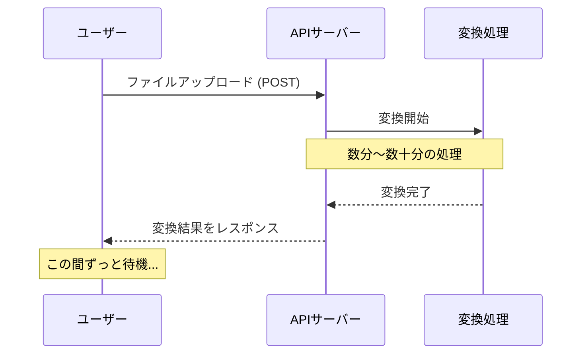
```mermaid
sequenceDiagram
    participant User as ユーザー
    participant API as APIサーバー
    participant Conv as 変換処理

    User->>API: ファイルアップロード (POST)
    API->>Conv: 変換開始
    Note over API,Conv: 数分〜数十分の処理
    Conv-->>API: 変換完了
    API-->>User: 変換結果をレスポンス
    Note over User: この間ずっと待機...
```

この方法には深刻な問題がある。

**タイムアウト**: HTTP リクエストには通常 30 〜 60 秒のタイムアウトが設定されている。ロードバランサー、リバースプロキシ、クライアントライブラリのそれぞれがタイムアウトを持っており、長時間の処理は途中で切断される可能性が高い。

**リソースの占有**: 変換処理が実行されている間、Web サーバーのワーカースレッドが1本占有される。大量の変換リクエストが同時に発生すると、Web サーバーの全スレッドが変換処理に占有され、通常のリクエストを処理できなくなる。

**信頼性の欠如**: 処理中にサーバーが再起動すると、変換処理は最初からやり直しになる。ユーザーはもう一度ファイルをアップロードし直さなければならない。

**ユーザー体験の劣化**: ユーザーは処理が完了するまでブラウザを閉じることができない。進捗状況も分からないまま、ただ待つことしかできない。

### 1.3 非同期処理アーキテクチャの必要性

これらの問題を解決するために、ファイル変換処理は**非同期**で実行するのが定石である。ユーザーのリクエストを即座に受け付け、バックグラウンドで変換を実行し、完了したら通知するという方式だ。

非同期処理アーキテクチャは以下の要素で構成される。

1. **API サーバー**: ジョブの登録と状態の問い合わせを担当
2. **ジョブキュー**: 未処理のジョブを蓄積する中間バッファ
3. **ワーカー**: ジョブキューからタスクを取り出して実際の変換を実行
4. **ストレージ**: 入力ファイル・変換結果・中間ファイルの保管
5. **状態管理**: ジョブの進捗と状態の追跡
6. **通知機構**: 進捗や完了をクライアントに伝達

以降の章では、これらの要素を順に設計していく。

## 2. 非同期処理アーキテクチャ

### 2.1 全体像

ファイル変換パイプラインの全体的なアーキテクチャを以下に示す。

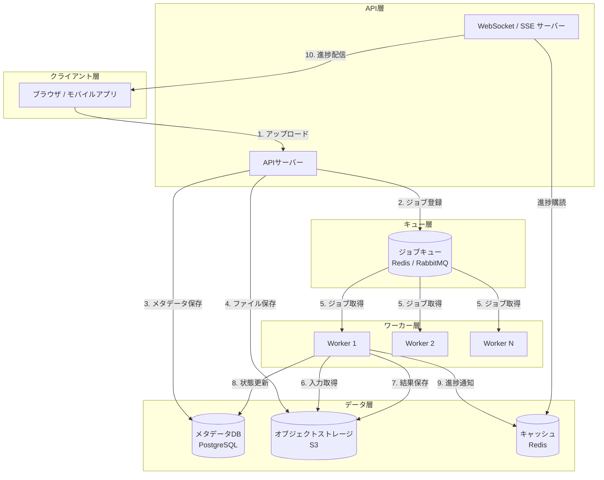
```mermaid
graph TB
    subgraph "クライアント層"
        Client[ブラウザ / モバイルアプリ]
    end

    subgraph "API層"
        API[APIサーバー]
        WS[WebSocket / SSE サーバー]
    end

    subgraph "キュー層"
        Queue[(ジョブキュー<br/>Redis / RabbitMQ)]
    end

    subgraph "ワーカー層"
        W1[Worker 1]
        W2[Worker 2]
        W3[Worker N]
    end

    subgraph "データ層"
        DB[(メタデータDB<br/>PostgreSQL)]
        ObjStore[(オブジェクトストレージ<br/>S3)]
        Cache[(キャッシュ<br/>Redis)]
    end

    Client -->|"1. アップロード"| API
    API -->|"2. ジョブ登録"| Queue
    API -->|"3. メタデータ保存"| DB
    API -->|"4. ファイル保存"| ObjStore
    Queue -->|"5. ジョブ取得"| W1
    Queue -->|"5. ジョブ取得"| W2
    Queue -->|"5. ジョブ取得"| W3
    W1 -->|"6. 入力取得"| ObjStore
    W1 -->|"7. 結果保存"| ObjStore
    W1 -->|"8. 状態更新"| DB
    W1 -->|"9. 進捗通知"| Cache
    WS -->|"10. 進捗配信"| Client
    WS -->|"進捗購読"| Cache
```

### 2.2 ジョブキューの選択

ジョブキューは非同期処理アーキテクチャの中核を担う。選定時に考慮すべき要素は以下のとおりである。

**永続化**: ジョブの登録後にキューのプロセスが再起動しても、ジョブが失われてはならない。インメモリのみのキューは本番環境では危険である。

**可視性タイムアウト（Visibility Timeout）**: ワーカーがジョブを取得した後、一定時間以内に処理を完了しない場合、そのジョブを別のワーカーに再配信する仕組み。ワーカーがクラッシュした場合のフェイルオーバーに不可欠である。

**優先度**: 有料ユーザーのジョブを優先的に処理する、小さいファイルを先に処理するなど、優先度制御が求められる場面は多い。

**遅延配信**: 失敗したジョブを一定時間後にリトライする場合、遅延配信（Delayed Message）が必要になる。

代表的なキューの選択肢を比較する。

| キュー | 永続化 | 優先度 | 遅延配信 | 特徴 |
|---|---|---|---|---|
| Redis（Bull / BullMQ） | RDB/AOF | サポート | サポート | 軽量で導入が容易。小〜中規模に最適 |
| RabbitMQ | ディスク | サポート | プラグイン | 高機能。ルーティングが柔軟 |
| Amazon SQS | マネージド | 制限あり | サポート | 運用不要。AWS との統合が強力 |
| PostgreSQL（SKIP LOCKED） | トランザクション | カスタム | カスタム | 別途ミドルウェア不要 |

::: tip PostgreSQL をジョブキューとして使う
小規模なシステムであれば、PostgreSQL のテーブルをジョブキューとして使う方法は十分に実用的である。`SELECT ... FOR UPDATE SKIP LOCKED` を使えば、複数のワーカーが安全にジョブを取り出せる。専用のミドルウェアを追加しなくて済むため、運用負荷が低い。ただし、大量のジョブが短時間に投入される場合はポーリングのオーバーヘッドに注意が必要である。
:::

### 2.3 ジョブの投入フロー

ユーザーがファイルをアップロードしてから、ジョブがワーカーに配信されるまでの流れを詳細に見ていく。

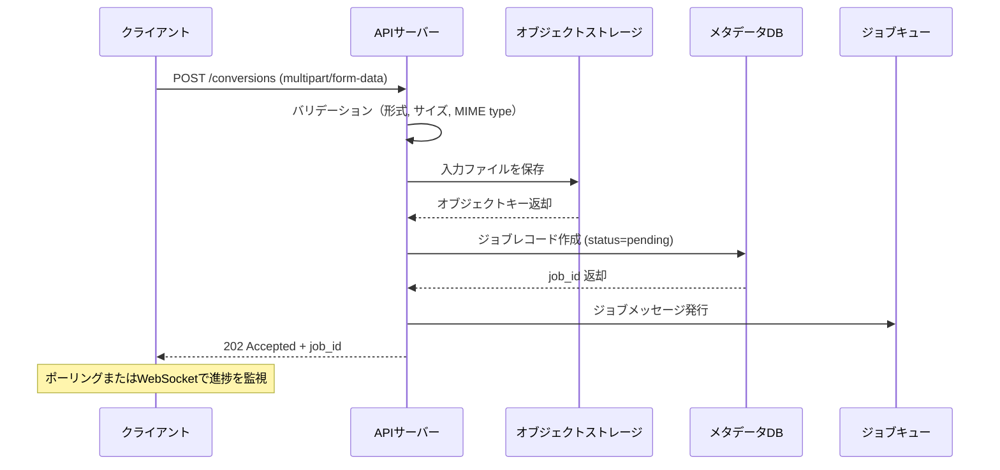
```mermaid
sequenceDiagram
    participant Client as クライアント
    participant API as APIサーバー
    participant S3 as オブジェクトストレージ
    participant DB as メタデータDB
    participant Queue as ジョブキュー

    Client->>API: POST /conversions (multipart/form-data)
    API->>API: バリデーション（形式, サイズ, MIME type）
    API->>S3: 入力ファイルを保存
    S3-->>API: オブジェクトキー返却
    API->>DB: ジョブレコード作成 (status=pending)
    DB-->>API: job_id 返却
    API->>Queue: ジョブメッセージ発行
    API-->>Client: 202 Accepted + job_id
    Note over Client: ポーリングまたはWebSocketで進捗を監視
```

重要なポイントは、API サーバーが **202 Accepted** を返す点である。202 はリクエストを受け付けたが、まだ処理は完了していないことを示す HTTP ステータスコードである。レスポンスにはジョブの ID を含め、クライアントがその後の状態を問い合わせるための識別子を提供する。

### 2.4 ワーカーの処理フロー

ワーカーはキューからジョブを取得し、以下の手順で変換を実行する。

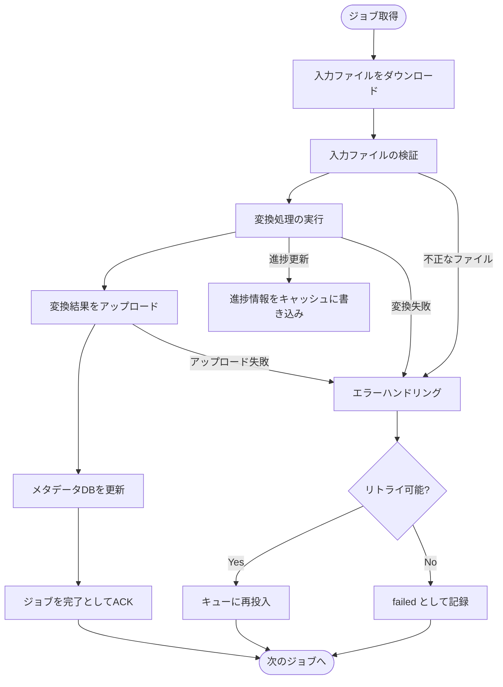
```mermaid
flowchart TB
    Start([ジョブ取得]) --> Fetch[入力ファイルをダウンロード]
    Fetch --> Validate[入力ファイルの検証]
    Validate --> Convert[変換処理の実行]
    Convert --> Upload[変換結果をアップロード]
    Upload --> UpdateDB[メタデータDBを更新]
    UpdateDB --> Ack[ジョブを完了としてACK]
    Ack --> End([次のジョブへ])

    Convert -->|進捗更新| Progress[進捗情報をキャッシュに書き込み]

    Validate -->|不正なファイル| Fail[エラーハンドリング]
    Convert -->|変換失敗| Fail
    Upload -->|アップロード失敗| Fail
    Fail --> Retry{リトライ可能?}
    Retry -->|Yes| Requeue[キューに再投入]
    Retry -->|No| MarkFailed[failed として記録]
    Requeue --> End
    MarkFailed --> End
```

ワーカーの処理を TypeScript の擬似コードで示す。

```typescript
async function processJob(job: ConversionJob): Promise<void> {
  const { jobId, inputKey, outputFormat, options } = job;

  try {
    // Update status to "processing"
    await db.updateJobStatus(jobId, "processing");

    // Download input file from object storage
    const inputPath = await storage.download(inputKey, tmpDir);

    // Validate input file
    const fileInfo = await validateFile(inputPath);
    if (!fileInfo.valid) {
      throw new ValidationError(fileInfo.reason);
    }

    // Execute conversion with progress callback
    const outputPath = await convert(inputPath, outputFormat, {
      ...options,
      onProgress: async (percent: number) => {
        await cache.set(`job:${jobId}:progress`, percent, { ttl: 3600 });
        await pubsub.publish(`job:${jobId}`, { type: "progress", percent });
      },
    });

    // Upload result to object storage
    const outputKey = `results/${jobId}/${path.basename(outputPath)}`;
    await storage.upload(outputPath, outputKey);

    // Update metadata
    await db.updateJobCompleted(jobId, {
      outputKey,
      outputSize: await getFileSize(outputPath),
      completedAt: new Date(),
    });

    // Notify completion
    await pubsub.publish(`job:${jobId}`, { type: "completed", outputKey });
  } catch (error) {
    await handleJobError(jobId, error, job.retryCount);
  } finally {
    // Clean up temporary files
    await cleanupTmpFiles(tmpDir);
  }
}
```

## 3. ジョブの状態管理

### 3.1 ステートマシン設計

ジョブの状態遷移を厳密に管理することは、信頼性の高いパイプラインを構築する上で極めて重要である。以下のステートマシンは、ファイル変換ジョブのライフサイクルを定義する。

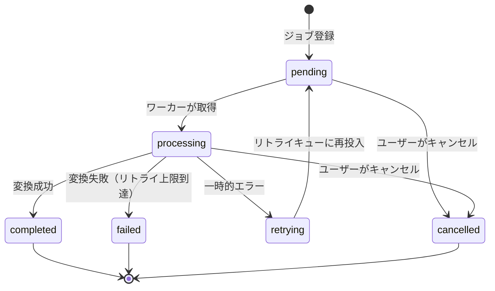
```mermaid
stateDiagram-v2
    [*] --> pending : ジョブ登録

    pending --> processing : ワーカーが取得

    processing --> completed : 変換成功
    processing --> failed : 変換失敗（リトライ上限到達）
    processing --> retrying : 一時的エラー

    retrying --> pending : リトライキューに再投入

    pending --> cancelled : ユーザーがキャンセル
    processing --> cancelled : ユーザーがキャンセル

    completed --> [*]
    failed --> [*]
    cancelled --> [*]
```

各状態の意味を明確に定義する。

| 状態 | 意味 | 遷移条件 |
|---|---|---|
| `pending` | キューに投入済み、ワーカー未着手 | ジョブ登録時、リトライ時 |
| `processing` | ワーカーが変換処理を実行中 | ワーカーがジョブを取得 |
| `completed` | 変換が正常に完了 | 変換結果のアップロード成功 |
| `failed` | リトライ上限に達して最終的に失敗 | 最大リトライ回数を超過 |
| `retrying` | 一時的エラーで再試行待ち | 一時的エラー発生 |
| `cancelled` | ユーザーまたは管理者がキャンセル | キャンセルリクエスト受信 |

### 3.2 データベーススキーマ

ジョブの状態管理に使用するテーブル設計を示す。

```sql
CREATE TYPE job_status AS ENUM (
    'pending', 'processing', 'completed', 'failed', 'retrying', 'cancelled'
);

CREATE TABLE conversion_jobs (
    id            UUID PRIMARY KEY DEFAULT gen_random_uuid(),
    -- Input
    input_key     TEXT NOT NULL,
    input_format  TEXT NOT NULL,
    input_size    BIGINT NOT NULL,
    -- Output
    output_format TEXT NOT NULL,
    output_key    TEXT,
    output_size   BIGINT,
    -- Options
    options       JSONB NOT NULL DEFAULT '{}',
    -- Status
    status        job_status NOT NULL DEFAULT 'pending',
    progress      SMALLINT NOT NULL DEFAULT 0 CHECK (progress BETWEEN 0 AND 100),
    error_message TEXT,
    -- Retry
    retry_count   SMALLINT NOT NULL DEFAULT 0,
    max_retries   SMALLINT NOT NULL DEFAULT 3,
    -- Worker info
    worker_id     TEXT,
    locked_at     TIMESTAMPTZ,
    -- Timestamps
    created_at    TIMESTAMPTZ NOT NULL DEFAULT NOW(),
    started_at    TIMESTAMPTZ,
    completed_at  TIMESTAMPTZ,
    -- User
    user_id       UUID NOT NULL REFERENCES users(id),

    -- Indexes for common queries
    CONSTRAINT valid_progress CHECK (progress BETWEEN 0 AND 100)
);

-- Index for worker polling
CREATE INDEX idx_jobs_pending ON conversion_jobs (status, created_at)
    WHERE status = 'pending';

-- Index for user's job list
CREATE INDEX idx_jobs_user ON conversion_jobs (user_id, created_at DESC);
```

### 3.3 状態遷移の排他制御

複数のワーカーが同時にジョブを取得しようとすると、同一のジョブが複数のワーカーで処理される**二重処理**が発生する可能性がある。これを防ぐために、ジョブ取得時に排他制御を行う必要がある。

PostgreSQL の `FOR UPDATE SKIP LOCKED` を使った排他制御の例を示す。

```sql
-- Acquire a pending job atomically
WITH next_job AS (
    SELECT id
    FROM conversion_jobs
    WHERE status = 'pending'
    ORDER BY created_at
    LIMIT 1
    FOR UPDATE SKIP LOCKED
)
UPDATE conversion_jobs
SET status = 'processing',
    worker_id = $1,
    locked_at = NOW(),
    started_at = NOW()
FROM next_job
WHERE conversion_jobs.id = next_job.id
RETURNING conversion_jobs.*;
```

`SKIP LOCKED` は、他のトランザクションがロックしている行をスキップする。これにより、複数のワーカーが同時にポーリングしても、それぞれ異なるジョブを安全に取得できる。

::: warning 楽観的ロックとの違い
楽観的ロック（`UPDATE ... WHERE status = 'pending'` + バージョン番号チェック）も使えるが、競合時にリトライが必要になる。`SKIP LOCKED` は競合時にスキップするため、リトライなしでスムーズにジョブを取得できる点で優れている。
:::

### 3.4 ジョブの TTL とクリーンアップ

ワーカーがジョブを取得した後、クラッシュして応答しなくなるケースは必ず発生する。このようなジョブは `processing` 状態のまま放置される。これを検出して再投入するために、定期的なクリーンアップ処理が必要である。

```sql
-- Requeue stale jobs (locked for more than 10 minutes)
UPDATE conversion_jobs
SET status = 'pending',
    worker_id = NULL,
    locked_at = NULL,
    retry_count = retry_count + 1
WHERE status = 'processing'
  AND locked_at < NOW() - INTERVAL '10 minutes'
  AND retry_count < max_retries;

-- Mark stale jobs as failed if max retries exceeded
UPDATE conversion_jobs
SET status = 'failed',
    error_message = 'Worker timeout: exceeded maximum lock duration'
WHERE status = 'processing'
  AND locked_at < NOW() - INTERVAL '10 minutes'
  AND retry_count >= max_retries;
```

このクリーンアップ処理は、cron ジョブや専用のスケジューラーで定期的に実行する。

## 4. プログレス通知

### 4.1 通知方式の比較

ファイル変換の進捗をリアルタイムにクライアントへ通知する方法は、大きく3つに分類される。

```mermaid
graph LR
    subgraph "ポーリング"
        C1[Client] -->|"GET /jobs/:id (繰り返し)"| S1[API Server]
    end

    subgraph "SSE"
        C2[Client] <--|"text/event-stream"| S2[API Server]
    end

    subgraph "WebSocket"
        C3[Client] <-->|"双方向通信"| S3[API Server]
    end
```

| 方式 | リアルタイム性 | サーバー負荷 | 実装の複雑さ | インフラ要件 |
|---|---|---|---|---|
| ポーリング | 低（間隔依存） | 高（無駄なリクエスト） | 低 | 特になし |
| SSE | 高 | 中 | 中 | HTTP/2 推奨 |
| WebSocket | 高 | 中 | 高 | WebSocket 対応 LB |

### 4.2 ポーリング

最もシンプルな方式。クライアントが定期的に API を呼び出して状態を確認する。

```typescript
// Client-side polling
async function pollJobStatus(jobId: string): Promise<void> {
  const interval = setInterval(async () => {
    const res = await fetch(`/api/conversions/${jobId}`);
    const job = await res.json();

    updateProgressBar(job.progress);

    if (job.status === "completed" || job.status === "failed") {
      clearInterval(interval);
      handleJobResult(job);
    }
  }, 2000); // Poll every 2 seconds
}
```

ポーリングの欠点は、ジョブが大量にある場合にリクエスト数が膨大になることである。1,000 件の同時変換ジョブがあり、2 秒間隔でポーリングすると、API サーバーは秒間 500 リクエストをポーリングだけで処理しなければならない。

::: tip Exponential Backoff の活用
ポーリング間隔を固定にするのではなく、処理の進捗に応じて調整するアプローチも有効である。処理開始直後は頻繁に、処理が進むにつれて間隔を広げるなど、適応的な制御が負荷を軽減する。
:::

### 4.3 Server-Sent Events（SSE）

SSE はサーバーからクライアントへの単方向ストリーミングを実現する。HTTP ベースであるため、既存のインフラ（ロードバランサー、リバースプロキシ）との相性がよい。

```typescript
// Server-side SSE endpoint (Express.js example)
app.get("/api/conversions/:id/events", async (req, res) => {
  const jobId = req.params.id;

  // Set SSE headers
  res.setHeader("Content-Type", "text/event-stream");
  res.setHeader("Cache-Control", "no-cache");
  res.setHeader("Connection", "keep-alive");
  res.flushHeaders();

  // Subscribe to job events via Redis Pub/Sub
  const subscriber = redis.duplicate();
  await subscriber.subscribe(`job:${jobId}`);

  subscriber.on("message", (channel: string, message: string) => {
    const event = JSON.parse(message);
    res.write(`event: ${event.type}\n`);
    res.write(`data: ${JSON.stringify(event)}\n\n`);

    if (event.type === "completed" || event.type === "failed") {
      subscriber.unsubscribe();
      subscriber.quit();
      res.end();
    }
  });

  // Handle client disconnect
  req.on("close", () => {
    subscriber.unsubscribe();
    subscriber.quit();
  });

  // Send initial state
  const job = await db.getJob(jobId);
  res.write(`event: status\n`);
  res.write(`data: ${JSON.stringify({ status: job.status, progress: job.progress })}\n\n`);
});
```

クライアント側は `EventSource` API で接続する。

```typescript
// Client-side SSE consumption
const eventSource = new EventSource(`/api/conversions/${jobId}/events`);

eventSource.addEventListener("progress", (event) => {
  const data = JSON.parse(event.data);
  updateProgressBar(data.percent);
});

eventSource.addEventListener("completed", (event) => {
  const data = JSON.parse(event.data);
  downloadResult(data.outputKey);
  eventSource.close();
});

eventSource.addEventListener("failed", (event) => {
  const data = JSON.parse(event.data);
  showError(data.errorMessage);
  eventSource.close();
});
```

### 4.4 WebSocket

WebSocket は双方向通信を提供し、最もリアルタイム性が高い。ファイル変換パイプラインでは、進捗通知に加えてキャンセルリクエストの送信にも使える。

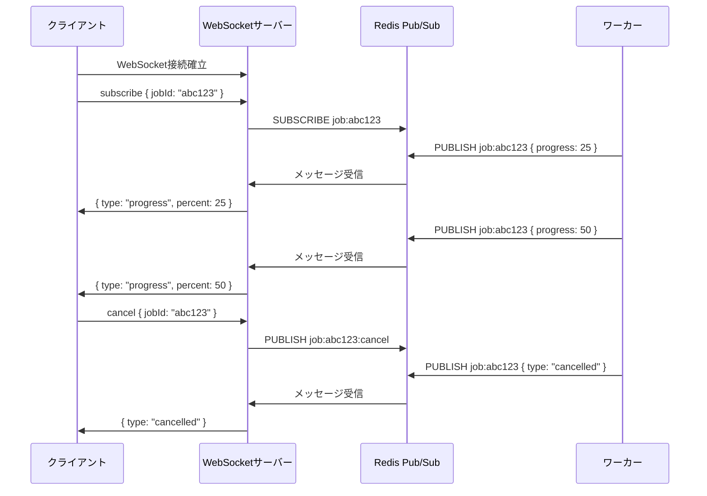
```mermaid
sequenceDiagram
    participant Client as クライアント
    participant WS as WebSocketサーバー
    participant Cache as Redis Pub/Sub
    participant Worker as ワーカー

    Client->>WS: WebSocket接続確立
    Client->>WS: subscribe { jobId: "abc123" }
    WS->>Cache: SUBSCRIBE job:abc123

    Worker->>Cache: PUBLISH job:abc123 { progress: 25 }
    Cache->>WS: メッセージ受信
    WS->>Client: { type: "progress", percent: 25 }

    Worker->>Cache: PUBLISH job:abc123 { progress: 50 }
    Cache->>WS: メッセージ受信
    WS->>Client: { type: "progress", percent: 50 }

    Client->>WS: cancel { jobId: "abc123" }
    WS->>Cache: PUBLISH job:abc123:cancel

    Worker->>Cache: PUBLISH job:abc123 { type: "cancelled" }
    Cache->>WS: メッセージ受信
    WS->>Client: { type: "cancelled" }
```

### 4.5 方式の選択指針

実際のシステムでは、以下の基準で方式を選択するとよい。

- **ポーリング**: ジョブの同時数が少なく（数十件以下）、厳密なリアルタイム性が不要な場合。MVP やプロトタイプには最適
- **SSE**: 多くのケースで最もバランスがよい選択。進捗通知は本質的にサーバーからクライアントへの単方向であるため、SSE の特性と合致する
- **WebSocket**: 双方向通信が必要な場合（キャンセル、一時停止、優先度変更など）。既に WebSocket インフラがある場合にも有利

実務的なアプローチとして、**SSE を基本としつつ、SSE 未対応のクライアント向けにポーリングのフォールバックを用意する**という方針がバランスがよい。

## 5. エラーハンドリングとリトライ

### 5.1 エラーの分類

ファイル変換パイプラインで発生するエラーは、リトライ可能なものとそうでないものに厳密に分類する必要がある。

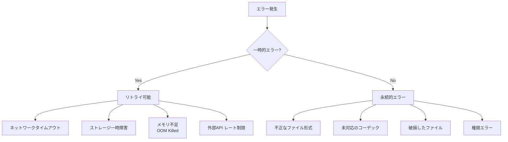
```mermaid
graph TB
    Error[エラー発生]
    Error --> Transient{一時的エラー?}
    Transient -->|Yes| Retryable[リトライ可能]
    Transient -->|No| Permanent[永続的エラー]

    Retryable --> R1[ネットワークタイムアウト]
    Retryable --> R2[ストレージ一時障害]
    Retryable --> R3[メモリ不足<br/>OOM Killed]
    Retryable --> R4[外部API レート制限]

    Permanent --> P1[不正なファイル形式]
    Permanent --> P2[未対応のコーデック]
    Permanent --> P3[破損したファイル]
    Permanent --> P4[権限エラー]
```

| エラー種別 | リトライ | 対応 |
|---|---|---|
| ネットワーク障害 | あり | Exponential Backoff でリトライ |
| ストレージ一時障害 | あり | リトライ + 別リージョンへのフォールバック |
| OOM Killed | あり | メモリ設定を調整して再試行 |
| 不正ファイル形式 | なし | 即座に `failed` へ遷移 |
| 未対応コーデック | なし | ユーザーに対応形式を案内 |
| 認証エラー | なし | 設定確認を促す |

### 5.2 Exponential Backoff with Jitter

リトライ時にすべてのワーカーが同じタイミングで再試行すると、外部サービスに対する「リトライの雷群（Thundering Herd）」が発生する。これを防ぐため、Exponential Backoff にランダムなジッターを加える。

```typescript
function calculateRetryDelay(retryCount: number): number {
  const baseDelay = 1000; // 1 second
  const maxDelay = 60000; // 60 seconds

  // Exponential backoff: 1s, 2s, 4s, 8s, 16s, ...
  const exponentialDelay = baseDelay * Math.pow(2, retryCount);

  // Cap at max delay
  const cappedDelay = Math.min(exponentialDelay, maxDelay);

  // Add full jitter: random value between 0 and cappedDelay
  return Math.random() * cappedDelay;
}

async function handleJobError(
  jobId: string,
  error: Error,
  retryCount: number
): Promise<void> {
  const isRetryable = classifyError(error);
  const maxRetries = 3;

  if (isRetryable && retryCount < maxRetries) {
    const delay = calculateRetryDelay(retryCount);
    await db.updateJobStatus(jobId, "retrying", {
      errorMessage: error.message,
      retryCount: retryCount + 1,
    });
    // Re-enqueue with delay
    await queue.add(
      "conversion",
      { jobId, retryCount: retryCount + 1 },
      { delay }
    );
  } else {
    await db.updateJobStatus(jobId, "failed", {
      errorMessage: error.message,
    });
    await pubsub.publish(`job:${jobId}`, {
      type: "failed",
      errorMessage: error.message,
    });
  }
}
```

### 5.3 Dead Letter Queue（DLQ）

リトライ上限に達したジョブは Dead Letter Queue に移動する。DLQ に入ったジョブは自動処理されず、運用者が手動で調査・再処理する対象となる。

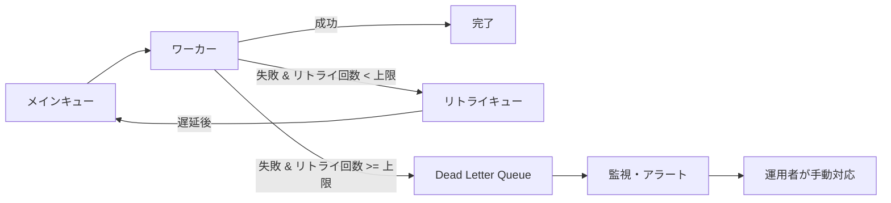
```mermaid
graph LR
    MainQueue[メインキュー] --> Worker[ワーカー]
    Worker -->|成功| Done[完了]
    Worker -->|失敗 & リトライ回数 < 上限| RetryQueue[リトライキュー]
    RetryQueue -->|遅延後| MainQueue
    Worker -->|失敗 & リトライ回数 >= 上限| DLQ[Dead Letter Queue]
    DLQ --> Monitor[監視・アラート]
    Monitor --> Operator[運用者が手動対応]
```

DLQ の運用において重要なのは、**アラートの設定**である。DLQ にジョブが滞留していること自体が異常であるため、件数が閾値を超えた場合にはアラートを発報し、迅速な対応を促す。

### 5.4 冪等性の確保

リトライが発生する以上、同じジョブが複数回処理される可能性がある。変換処理自体が冪等（何度実行しても同じ結果になる）であることを保証するか、二重実行を検出して防ぐ仕組みが必要である。

ファイル変換の場合、同じ入力に対して同じ変換パラメータで処理すれば同じ出力が得られるため、結果の上書きは基本的に安全である。ただし、以下の点に注意が必要である。

- **出力ファイル名にジョブ ID を含める**: `results/{jobId}/output.pdf` のようにすれば、異なるジョブの出力が衝突しない
- **メタデータの更新を冪等にする**: `UPDATE ... SET status = 'completed'` は何度実行しても同じ結果になる
- **通知の重複を許容するか防ぐか**: 完了通知が2回届いても問題ないようにクライアントを実装するか、サーバー側で重複検出を行う

## 6. 大容量ファイルの処理

### 6.1 ストリーミング処理

大容量ファイル（数 GB 以上）を処理する場合、ファイル全体をメモリに読み込むことは不可能である。ストリーミング処理を採用し、データを小さなチャンクに分割して逐次的に処理する必要がある。

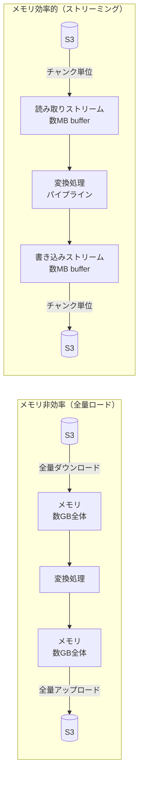
```mermaid
graph LR
    subgraph "メモリ非効率（全量ロード）"
        S3A[(S3)] -->|全量ダウンロード| MemA[メモリ<br/>数GB全体]
        MemA --> ConvA[変換処理]
        ConvA --> MemB[メモリ<br/>数GB全体]
        MemB -->|全量アップロード| S3B[(S3)]
    end

    subgraph "メモリ効率的（ストリーミング）"
        S3C[(S3)] -->|チャンク単位| Stream1[読み取りストリーム<br/>数MB buffer]
        Stream1 --> ConvB[変換処理<br/>パイプライン]
        ConvB --> Stream2[書き込みストリーム<br/>数MB buffer]
        Stream2 -->|チャンク単位| S3D[(S3)]
    end
```

Node.js の Stream API を使ったストリーミング変換の例を示す。

```typescript
import { pipeline } from "stream/promises";
import { createReadStream, createWriteStream } from "fs";
import { Transform } from "stream";

async function streamConvert(
  inputPath: string,
  outputPath: string,
  onProgress: (bytes: number) => void
): Promise<void> {
  const inputSize = (await stat(inputPath)).size;
  let processedBytes = 0;

  const progressTracker = new Transform({
    transform(chunk, encoding, callback) {
      processedBytes += chunk.length;
      onProgress(processedBytes);
      callback(null, chunk);
    },
  });

  await pipeline(
    createReadStream(inputPath, { highWaterMark: 1024 * 1024 }), // 1MB chunks
    progressTracker,
    createConversionTransform(), // Application-specific conversion
    createWriteStream(outputPath)
  );
}
```

### 6.2 チャンク分割とマルチパートアップロード

大きなファイルをオブジェクトストレージにアップロードする場合、マルチパートアップロードを使用する。これにより、アップロードの途中で失敗しても、失敗したパートのみを再送すればよい。

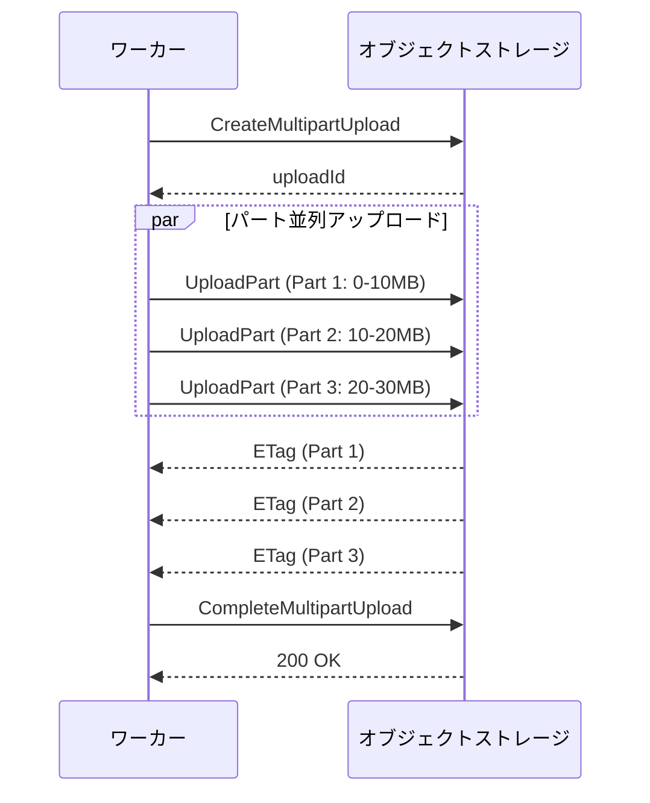
```mermaid
sequenceDiagram
    participant Worker as ワーカー
    participant S3 as オブジェクトストレージ

    Worker->>S3: CreateMultipartUpload
    S3-->>Worker: uploadId

    par パート並列アップロード
        Worker->>S3: UploadPart (Part 1: 0-10MB)
        Worker->>S3: UploadPart (Part 2: 10-20MB)
        Worker->>S3: UploadPart (Part 3: 20-30MB)
    end

    S3-->>Worker: ETag (Part 1)
    S3-->>Worker: ETag (Part 2)
    S3-->>Worker: ETag (Part 3)

    Worker->>S3: CompleteMultipartUpload
    S3-->>Worker: 200 OK
```

### 6.3 分割変換（チャンク分割処理）

動画のトランスコーディングのように、入力ファイルを複数のチャンクに分割し、並列に変換するパターンもある。これは処理時間を大幅に短縮できるが、設計は複雑になる。

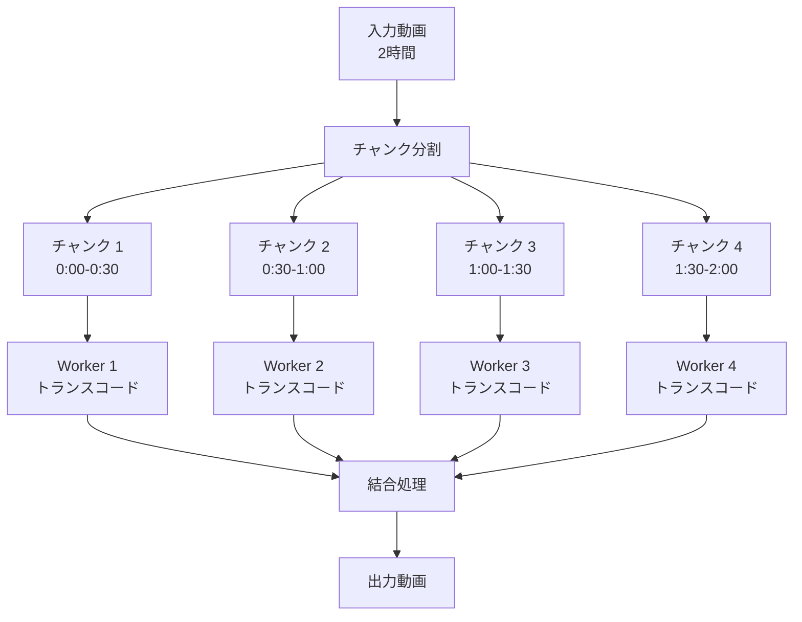
```mermaid
graph TB
    Input[入力動画<br/>2時間] --> Split[チャンク分割]
    Split --> C1[チャンク 1<br/>0:00-0:30]
    Split --> C2[チャンク 2<br/>0:30-1:00]
    Split --> C3[チャンク 3<br/>1:00-1:30]
    Split --> C4[チャンク 4<br/>1:30-2:00]

    C1 --> W1[Worker 1<br/>トランスコード]
    C2 --> W2[Worker 2<br/>トランスコード]
    C3 --> W3[Worker 3<br/>トランスコード]
    C4 --> W4[Worker 4<br/>トランスコード]

    W1 --> Merge[結合処理]
    W2 --> Merge
    W3 --> Merge
    W4 --> Merge

    Merge --> Output[出力動画]
```

この分割変換パターンは、親ジョブ（全体）と子ジョブ（チャンク単位）の2層構造で管理する。

```sql
CREATE TABLE conversion_chunks (
    id          UUID PRIMARY KEY DEFAULT gen_random_uuid(),
    job_id      UUID NOT NULL REFERENCES conversion_jobs(id),
    chunk_index SMALLINT NOT NULL,
    status      job_status NOT NULL DEFAULT 'pending',
    input_key   TEXT NOT NULL,
    output_key  TEXT,
    started_at  TIMESTAMPTZ,
    completed_at TIMESTAMPTZ,
    error_message TEXT,

    UNIQUE (job_id, chunk_index)
);
```

親ジョブの進捗は、子ジョブの完了比率から算出する。

```typescript
async function updateParentProgress(jobId: string): Promise<void> {
  const chunks = await db.getChunks(jobId);
  const completedCount = chunks.filter((c) => c.status === "completed").length;
  const progress = Math.floor((completedCount / chunks.length) * 100);

  await db.updateJobProgress(jobId, progress);
  await pubsub.publish(`job:${jobId}`, { type: "progress", percent: progress });
}
```

### 6.4 メモリ管理とリソース制限

大容量ファイルの処理では、メモリ使用量の制御が不可欠である。ワーカーがメモリを使い尽くすと OOM Killer に殺され、処理が突然中断される。

対策として以下が有効である。

- **メモリ使用量の上限設定**: Node.js の `--max-old-space-size`、Java の `-Xmx` などでプロセスのメモリ使用量を制限する
- **ファイルサイズに基づくルーティング**: 小さいファイルは軽量なワーカーに、大きいファイルはメモリの多いワーカーにルーティングする
- **一時ファイルのディスク使用量監視**: `/tmp` のディスク使用量を監視し、閾値を超えたらジョブの受付を停止する
- **cgroups によるリソース制限**: コンテナ環境では cgroups でメモリと CPU を厳密に制限できる

## 7. ワーカーのスケーリング

### 7.1 スケーリングの必要性

ファイル変換の需要は時間帯やイベントによって大きく変動する。昼間のピーク時には多くのワーカーが必要だが、深夜には最小限でよい。固定台数のワーカーでは、ピーク時に処理が追いつかないか、閑散時にリソースを無駄にすることになる。

### 7.2 スケーリング戦略

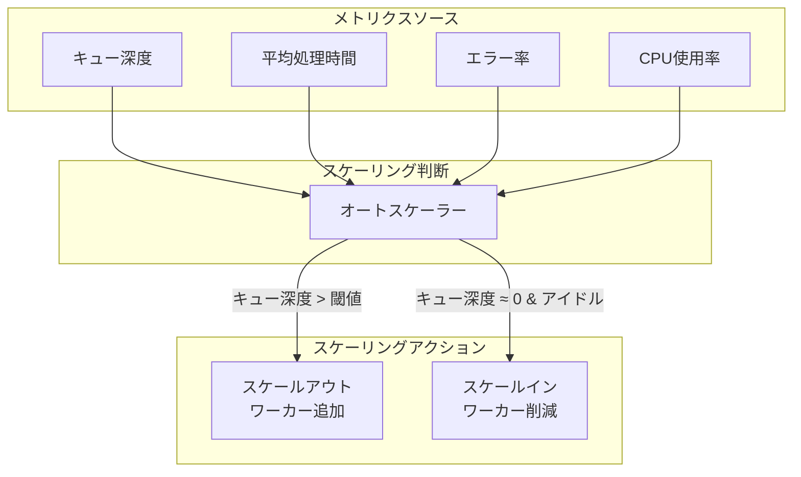
```mermaid
graph TB
    subgraph "メトリクスソース"
        QueueDepth[キュー深度]
        ProcessingTime[平均処理時間]
        ErrorRate[エラー率]
        CPU[CPU使用率]
    end

    subgraph "スケーリング判断"
        Monitor[オートスケーラー]
        QueueDepth --> Monitor
        ProcessingTime --> Monitor
        ErrorRate --> Monitor
        CPU --> Monitor
    end

    subgraph "スケーリングアクション"
        ScaleUp[スケールアウト<br/>ワーカー追加]
        ScaleDown[スケールイン<br/>ワーカー削減]
        Monitor -->|"キュー深度 > 閾値"| ScaleUp
        Monitor -->|"キュー深度 ≈ 0 & アイドル"| ScaleDown
    end
```

最も直感的なスケーリングメトリクスは**キュー深度**（キューに滞留しているジョブの数）である。キュー深度が増加しているということは、ワーカーの処理能力が投入量に追いついていないことを意味する。

```typescript
interface ScalingPolicy {
  minWorkers: number;
  maxWorkers: number;
  scaleUpThreshold: number;   // Queue depth to trigger scale-up
  scaleDownThreshold: number; // Queue depth to trigger scale-down
  cooldownPeriod: number;     // Seconds between scaling decisions
}

async function evaluateScaling(policy: ScalingPolicy): Promise<ScalingDecision> {
  const queueDepth = await queue.getWaitingCount();
  const activeWorkers = await getActiveWorkerCount();
  const avgProcessingTime = await getAvgProcessingTime();

  // Estimate required workers
  const estimatedWorkers = Math.ceil(
    queueDepth / (policy.cooldownPeriod / avgProcessingTime)
  );

  if (queueDepth > policy.scaleUpThreshold && activeWorkers < policy.maxWorkers) {
    const targetWorkers = Math.min(estimatedWorkers, policy.maxWorkers);
    return { action: "scale_up", targetCount: targetWorkers };
  }

  if (queueDepth < policy.scaleDownThreshold && activeWorkers > policy.minWorkers) {
    return { action: "scale_down", targetCount: Math.max(policy.minWorkers, activeWorkers - 1) };
  }

  return { action: "none", targetCount: activeWorkers };
}
```

### 7.3 Graceful Shutdown

スケールインでワーカーを削減する際、実行中のジョブを中断してはならない。ワーカーは**Graceful Shutdown**をサポートし、現在処理中のジョブが完了してから終了する必要がある。

```typescript
class ConversionWorker {
  private isShuttingDown = false;
  private activeJobs = new Set<string>();

  async start(): Promise<void> {
    // Handle SIGTERM for graceful shutdown
    process.on("SIGTERM", () => this.initiateShutdown());
    process.on("SIGINT", () => this.initiateShutdown());

    while (!this.isShuttingDown) {
      const job = await this.dequeueJob();
      if (job) {
        this.activeJobs.add(job.id);
        try {
          await this.processJob(job);
        } finally {
          this.activeJobs.delete(job.id);
        }
      } else {
        // No job available, wait briefly
        await sleep(1000);
      }
    }

    console.log("Worker shutdown complete");
    process.exit(0);
  }

  private async initiateShutdown(): Promise<void> {
    console.log("Shutdown signal received, finishing active jobs...");
    this.isShuttingDown = true;

    // Wait for active jobs to complete (with timeout)
    const timeout = 300_000; // 5 minutes
    const start = Date.now();

    while (this.activeJobs.size > 0 && Date.now() - start < timeout) {
      console.log(`Waiting for ${this.activeJobs.size} active job(s)...`);
      await sleep(5000);
    }

    if (this.activeJobs.size > 0) {
      console.warn(`Force shutdown with ${this.activeJobs.size} active job(s)`);
    }
  }
}
```

::: warning Kubernetes の terminationGracePeriodSeconds
Kubernetes 環境では、Pod の `terminationGracePeriodSeconds` をワーカーの最大処理時間よりも大きく設定する必要がある。デフォルトの 30 秒では、長時間の変換処理が途中で kill される。動画トランスコーディングなど時間のかかるワーカーでは、数分から数十分に設定することも珍しくない。
:::

### 7.4 Kubernetes でのオートスケール実装

Kubernetes 環境では、KEDA（Kubernetes Event-Driven Autoscaler）を使うと、キュー深度に基づくワーカーのオートスケールを宣言的に構成できる。

```yaml
apiVersion: keda.sh/v1alpha1
kind: ScaledObject
metadata:
  name: conversion-worker
spec:
  scaleTargetRef:
    name: conversion-worker
  minReplicaCount: 1
  maxReplicaCount: 20
  cooldownPeriod: 60
  triggers:
    - type: redis-lists
      metadata:
        address: redis:6379
        listName: conversion-queue
        listLength: "5"  # Scale up when > 5 jobs per worker
```

この設定では、Redis リストの長さ（キュー深度）が 5 を超えるとワーカー Pod が追加され、最大 20 台までスケールアウトする。キューが空になると 60 秒のクールダウン後にスケールインが開始される。

## 8. ストレージ設計

### 8.1 ストレージの層構造

ファイル変換パイプラインでは、用途に応じて複数のストレージ層を使い分ける。

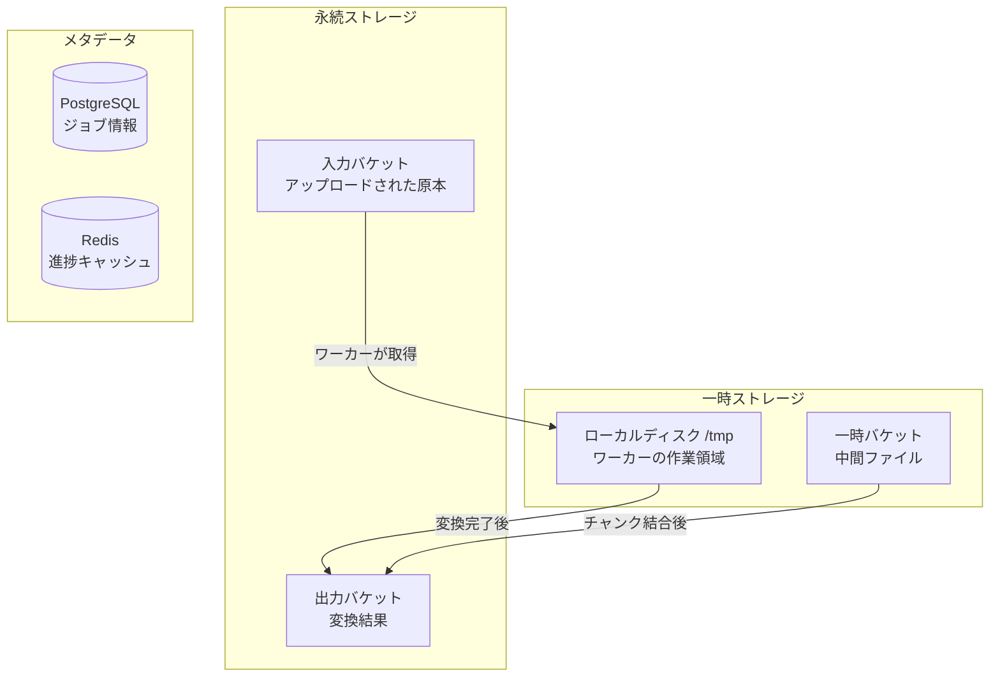
```mermaid
graph TB
    subgraph "一時ストレージ"
        TmpDisk[ローカルディスク /tmp<br/>ワーカーの作業領域]
        TmpBucket[一時バケット<br/>中間ファイル]
    end

    subgraph "永続ストレージ"
        InputBucket[入力バケット<br/>アップロードされた原本]
        OutputBucket[出力バケット<br/>変換結果]
    end

    subgraph "メタデータ"
        DB[(PostgreSQL<br/>ジョブ情報)]
        Cache[(Redis<br/>進捗キャッシュ)]
    end

    TmpDisk -->|変換完了後| OutputBucket
    InputBucket -->|ワーカーが取得| TmpDisk
    TmpBucket -->|チャンク結合後| OutputBucket
```

| ストレージ層 | 用途 | 保持期間 | 要件 |
|---|---|---|---|
| ローカルディスク | ワーカーの作業領域 | ジョブ処理中のみ | 高速 I/O、十分な容量 |
| 一時バケット | 中間ファイル、チャンク | 数時間〜数日 | 自動削除（ライフサイクルポリシー） |
| 入力バケット | アップロード原本 | 数日〜数週間 | 重複排除、スキャン済みフラグ |
| 出力バケット | 変換結果 | ユーザー保持期間依存 | CDN 配信、署名付き URL |

### 8.2 一時ファイルの管理

ワーカーのローカルディスク上の一時ファイルは、確実にクリーンアップされなければならない。ジョブが正常に完了した場合も、エラーで中断した場合も、ワーカーがクラッシュした場合も、一時ファイルが残り続けてディスクを圧迫することは避けなければならない。

```typescript
import { mkdtemp, rm } from "fs/promises";
import { tmpdir } from "os";
import { join } from "path";

async function withTempDir<T>(
  fn: (dir: string) => Promise<T>
): Promise<T> {
  const dir = await mkdtemp(join(tmpdir(), "conversion-"));
  try {
    return await fn(dir);
  } finally {
    // Always clean up, even on error
    await rm(dir, { recursive: true, force: true }).catch((err) => {
      console.error(`Failed to clean up temp dir ${dir}:`, err);
    });
  }
}

// Usage
await withTempDir(async (tmpDir) => {
  const inputPath = join(tmpDir, "input.mp4");
  const outputPath = join(tmpDir, "output.webm");

  await storage.download(job.inputKey, inputPath);
  await transcode(inputPath, outputPath);
  await storage.upload(outputPath, job.outputKey);
});
```

さらに、ワーカーの起動時に前回のクラッシュで残った一時ファイルを掃除するスタートアップスクリプトを実行するとよい。

### 8.3 オブジェクトストレージのライフサイクルポリシー

一時バケットや入力バケットのファイルは、一定期間後に自動削除すべきである。AWS S3 のライフサイクルルールの例を示す。

```json
{
  "Rules": [
    {
      "ID": "DeleteTempFiles",
      "Filter": { "Prefix": "temp/" },
      "Status": "Enabled",
      "Expiration": { "Days": 1 }
    },
    {
      "ID": "DeleteInputFiles",
      "Filter": { "Prefix": "inputs/" },
      "Status": "Enabled",
      "Expiration": { "Days": 7 }
    },
    {
      "ID": "TransitionOutputToIA",
      "Filter": { "Prefix": "results/" },
      "Status": "Enabled",
      "Transitions": [
        {
          "Days": 30,
          "StorageClass": "STANDARD_IA"
        }
      ]
    }
  ]
}
```

### 8.4 署名付き URL による安全な配信

変換結果のダウンロードには、署名付き URL（Presigned URL）を使用する。これにより、オブジェクトストレージのバケットをパブリックにすることなく、認証済みのユーザーにのみファイルへのアクセスを許可できる。

```typescript
import { S3Client, GetObjectCommand } from "@aws-sdk/client-s3";
import { getSignedUrl } from "@aws-sdk/s3-request-presigner";

async function getDownloadUrl(outputKey: string): Promise<string> {
  const client = new S3Client({ region: "ap-northeast-1" });
  const command = new GetObjectCommand({
    Bucket: "conversion-results",
    Key: outputKey,
  });

  // URL expires in 1 hour
  return getSignedUrl(client, command, { expiresIn: 3600 });
}
```

## 9. 実務でのアーキテクチャ例

### 9.1 小規模構成（スタートアップ向け）

月間数千件程度の変換ジョブを処理する小規模なシステムの構成例を示す。

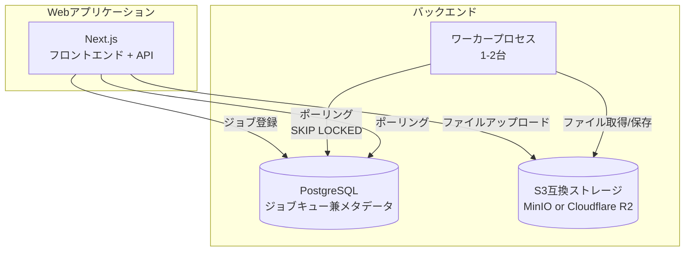
```mermaid
graph TB
    subgraph "Webアプリケーション"
        Next[Next.js<br/>フロントエンド + API]
    end

    subgraph "バックエンド"
        PG[(PostgreSQL<br/>ジョブキュー兼メタデータ)]
        Worker[ワーカープロセス<br/>1-2台]
        S3[(S3互換ストレージ<br/>MinIO or Cloudflare R2)]
    end

    Next -->|ジョブ登録| PG
    Next -->|ファイルアップロード| S3
    Worker -->|ポーリング<br/>SKIP LOCKED| PG
    Worker -->|ファイル取得/保存| S3
    Next -->|ポーリング| PG
```

**特徴**:
- PostgreSQL をジョブキューとメタデータ DB の両方に使用し、インフラを最小化
- ワーカーは Web アプリケーションと同じサーバー上で別プロセスとして動かすことも可能
- 進捗通知はポーリングで十分
- 初期コストを最小限に抑えつつ、後からスケールアウトしやすい設計

::: details 小規模構成の具体的な実装イメージ

```typescript
// Simple worker using PostgreSQL as job queue
import { Pool } from "pg";

const pool = new Pool({ connectionString: process.env.DATABASE_URL });

async function workerLoop(): Promise<void> {
  while (true) {
    const client = await pool.connect();
    try {
      await client.query("BEGIN");

      const result = await client.query(`
        WITH next_job AS (
          SELECT id FROM conversion_jobs
          WHERE status = 'pending'
          ORDER BY created_at
          LIMIT 1
          FOR UPDATE SKIP LOCKED
        )
        UPDATE conversion_jobs
        SET status = 'processing', started_at = NOW()
        FROM next_job
        WHERE conversion_jobs.id = next_job.id
        RETURNING conversion_jobs.*
      `);

      if (result.rows.length === 0) {
        await client.query("COMMIT");
        // No jobs available, wait before polling again
        await sleep(2000);
        continue;
      }

      const job = result.rows[0];
      await client.query("COMMIT");

      // Process the job
      await processConversion(job);
    } catch (error) {
      await client.query("ROLLBACK");
      console.error("Worker error:", error);
    } finally {
      client.release();
    }
  }
}
```
:::

### 9.2 中規模構成（成長フェーズ）

月間数万〜数十万件のジョブを処理する構成。

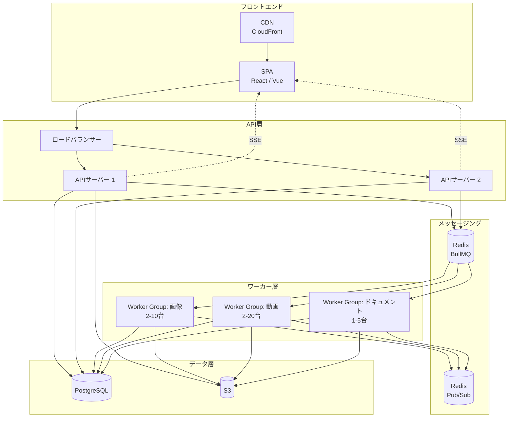
```mermaid
graph TB
    subgraph "フロントエンド"
        CDN[CDN<br/>CloudFront]
        SPA[SPA<br/>React / Vue]
    end

    subgraph "API層"
        LB[ロードバランサー]
        API1[APIサーバー 1]
        API2[APIサーバー 2]
    end

    subgraph "メッセージング"
        Redis[(Redis<br/>BullMQ)]
        RedisPubSub[(Redis<br/>Pub/Sub)]
    end

    subgraph "ワーカー層"
        WG1[Worker Group: 画像<br/>2-10台]
        WG2[Worker Group: 動画<br/>2-20台]
        WG3[Worker Group: ドキュメント<br/>1-5台]
    end

    subgraph "データ層"
        PG[(PostgreSQL)]
        S3[(S3)]
    end

    CDN --> SPA
    SPA --> LB
    LB --> API1
    LB --> API2
    API1 --> Redis
    API2 --> Redis
    API1 --> PG
    API2 --> PG
    API1 --> S3
    Redis --> WG1
    Redis --> WG2
    Redis --> WG3
    WG1 --> S3
    WG2 --> S3
    WG3 --> S3
    WG1 --> PG
    WG2 --> PG
    WG3 --> PG
    WG1 --> RedisPubSub
    WG2 --> RedisPubSub
    WG3 --> RedisPubSub
    API1 -.->|SSE| SPA
    API2 -.->|SSE| SPA
```

**特徴**:
- ファイル種別ごとにワーカーグループを分離し、独立してスケール
- Redis（BullMQ）を専用のジョブキューとして使用
- SSE によるリアルタイム進捗通知
- 画像変換は CPU バウンドだが軽量、動画変換は CPU バウンドかつ重い、ドキュメント変換はそこそこ、といった特性の違いに応じてワーカーのリソース配分を最適化

### 9.3 大規模構成（エンタープライズ）

月間数百万件以上のジョブを処理するエンタープライズ向け構成。

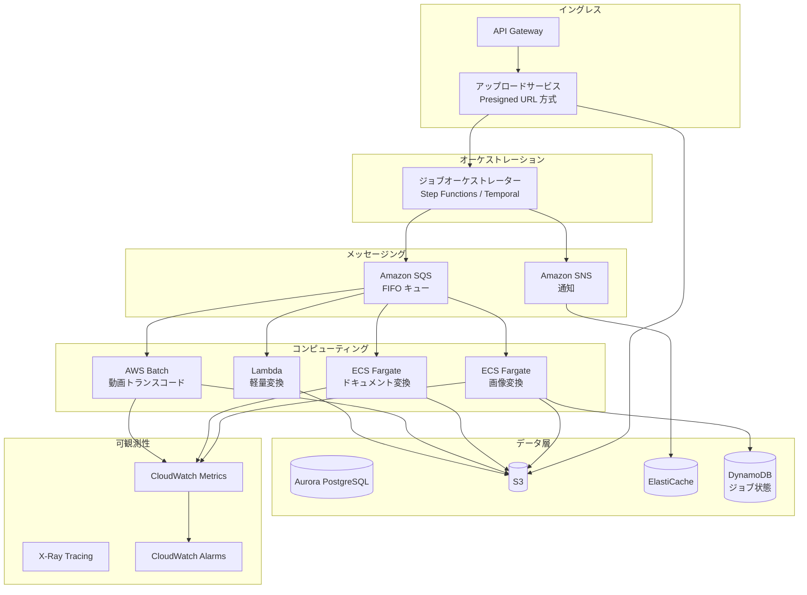
```mermaid
graph TB
    subgraph "イングレス"
        AGW[API Gateway]
        Upload[アップロードサービス<br/>Presigned URL 方式]
    end

    subgraph "オーケストレーション"
        Orchestrator[ジョブオーケストレーター<br/>Step Functions / Temporal]
    end

    subgraph "メッセージング"
        SQS[Amazon SQS<br/>FIFO キュー]
        SNS[Amazon SNS<br/>通知]
    end

    subgraph "コンピューティング"
        ECS1[ECS Fargate<br/>画像変換]
        ECS2[ECS Fargate<br/>ドキュメント変換]
        Batch[AWS Batch<br/>動画トランスコード]
        Lambda[Lambda<br/>軽量変換]
    end

    subgraph "データ層"
        Aurora[(Aurora PostgreSQL)]
        S3[(S3)]
        ElastiCache[(ElastiCache)]
        DDB[(DynamoDB<br/>ジョブ状態)]
    end

    subgraph "可観測性"
        CW[CloudWatch Metrics]
        XRay[X-Ray Tracing]
        Alarm[CloudWatch Alarms]
    end

    AGW --> Upload
    Upload --> S3
    Upload --> Orchestrator
    Orchestrator --> SQS
    SQS --> ECS1
    SQS --> ECS2
    SQS --> Batch
    SQS --> Lambda
    ECS1 --> S3
    ECS2 --> S3
    Batch --> S3
    Lambda --> S3
    ECS1 --> DDB
    Orchestrator --> SNS
    SNS --> ElastiCache
    ECS1 --> CW
    ECS2 --> CW
    Batch --> CW
    CW --> Alarm
```

**特徴**:
- ワークフローオーケストレーター（AWS Step Functions や Temporal）で複雑なパイプラインを管理
- Presigned URL 方式でファイルをクライアントから直接 S3 にアップロードし、API サーバーの帯域を消費しない
- ファイルの種類や規模に応じて Lambda（軽量・即時）、ECS Fargate（中規模）、AWS Batch（大規模・バッチ処理）を使い分け
- DynamoDB をジョブ状態の高速ストアとして使用（書き込み/読み込みが高頻度）
- 分散トレーシング（X-Ray）でジョブのライフサイクル全体を可視化

### 9.4 Presigned URL によるアップロード最適化

大規模構成で特に重要なのが、**Presigned URL を使ったクライアント直接アップロード**である。API サーバーを経由せず、クライアントからオブジェクトストレージに直接ファイルをアップロードすることで、API サーバーの帯域とメモリの消費を回避できる。

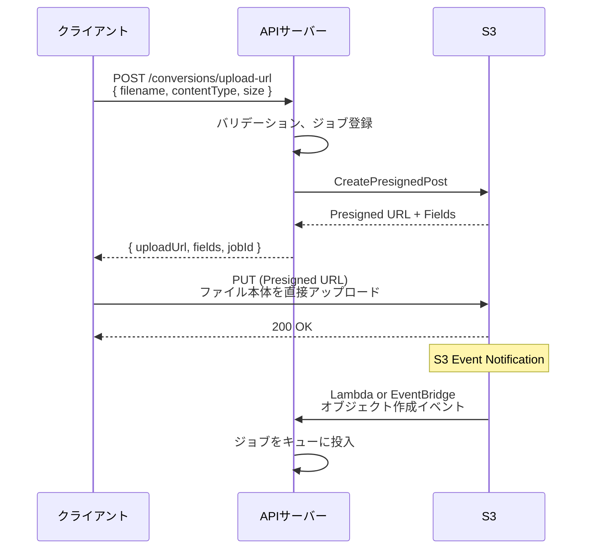
```mermaid
sequenceDiagram
    participant Client as クライアント
    participant API as APIサーバー
    participant S3 as S3

    Client->>API: POST /conversions/upload-url<br/>{ filename, contentType, size }
    API->>API: バリデーション、ジョブ登録
    API->>S3: CreatePresignedPost
    S3-->>API: Presigned URL + Fields
    API-->>Client: { uploadUrl, fields, jobId }

    Client->>S3: PUT (Presigned URL)<br/>ファイル本体を直接アップロード
    S3-->>Client: 200 OK

    Note over S3: S3 Event Notification
    S3->>API: Lambda or EventBridge<br/>オブジェクト作成イベント
    API->>API: ジョブをキューに投入
```

この方式では、数 GB のファイルであっても API サーバーのメモリとネットワーク帯域を消費しない。

## 10. 可観測性とモニタリング

### 10.1 重要なメトリクス

ファイル変換パイプラインの健全性を監視するために、以下のメトリクスを収集する。

| メトリクス | 意味 | アラート条件 |
|---|---|---|
| キュー深度 | 未処理ジョブ数 | 一定値以上が継続 |
| 処理時間（P50 / P95 / P99） | ジョブ完了までの所要時間 | P95 が SLA を超過 |
| エラー率 | 失敗ジョブの比率 | 5% を超過 |
| DLQ 滞留数 | 最終的に失敗したジョブ数 | 1件以上 |
| ワーカー稼働率 | アクティブワーカーの処理率 | 90% 以上が継続（スケールアウト必要）|
| ストレージ使用量 | 一時ファイル、出力ファイルの総量 | 閾値の 80% に到達 |

### 10.2 構造化ログ

ジョブの追跡性を高めるため、すべてのログにジョブ ID を含める。

```typescript
import pino from "pino";

const logger = pino();

async function processJob(job: ConversionJob): Promise<void> {
  const jobLogger = logger.child({
    jobId: job.id,
    userId: job.userId,
    inputFormat: job.inputFormat,
    outputFormat: job.outputFormat,
  });

  jobLogger.info("Job processing started");

  try {
    const startTime = Date.now();
    await executeConversion(job);
    const duration = Date.now() - startTime;

    jobLogger.info({ durationMs: duration }, "Job completed successfully");
  } catch (error) {
    jobLogger.error({ err: error }, "Job processing failed");
    throw error;
  }
}
```

### 10.3 分散トレーシング

ファイル変換パイプラインは、API サーバー、キュー、ワーカー、ストレージと複数のコンポーネントにまたがるため、分散トレーシングが有効である。OpenTelemetry を使って、ジョブの全ライフサイクルを1つのトレースとして追跡できる。


```mermaid
gantt
    title ジョブ "abc123" のトレース
    dateFormat X
    axisFormat %s秒

    section API
    リクエスト受付       : 0, 1
    バリデーション       : 1, 2
    S3 アップロード      : 2, 5
    DB 書き込み          : 5, 6
    キュー投入           : 6, 7

    section Queue
    キュー待機           : 7, 12

    section Worker
    S3 ダウンロード      : 12, 15
    変換処理             : 15, 45
    S3 アップロード      : 45, 50
    DB 更新              : 50, 51
```

このトレースにより、「変換処理自体は速いがキュー待機時間が長い」「S3 のアップロードがボトルネック」といったパフォーマンスの問題を特定できる。

## 11. セキュリティ考慮事項

### 11.1 入力ファイルの検証

ユーザーからアップロードされたファイルは、信頼できない入力として扱わなければならない。

- **MIME タイプの検証**: Content-Type ヘッダーだけでなく、ファイルのマジックバイトを確認する
- **ファイルサイズの制限**: アップロード時とワーカー処理時の両方で検証する
- **アンチウイルススキャン**: ClamAV 等によるマルウェアスキャンを変換前に実行する
- **パストラバーサル防止**: ZIP ファイルの展開時に `../` を含むパスを拒否する

```typescript
import fileType from "file-type";

async function validateUploadedFile(
  filePath: string,
  expectedMimeType: string,
  maxSize: number
): Promise<ValidationResult> {
  // Check file size
  const stats = await stat(filePath);
  if (stats.size > maxSize) {
    return { valid: false, reason: `File size ${stats.size} exceeds limit ${maxSize}` };
  }

  // Check actual MIME type via magic bytes
  const detected = await fileType.fromFile(filePath);
  if (!detected || detected.mime !== expectedMimeType) {
    return {
      valid: false,
      reason: `Expected ${expectedMimeType}, detected ${detected?.mime ?? "unknown"}`,
    };
  }

  return { valid: true };
}
```

### 11.2 ワーカーの隔離

ファイル変換処理（特に FFmpeg、ImageMagick、LibreOffice など外部ツールを使う場合）は、脆弱性を突かれるリスクがある。ワーカーは以下の方針で隔離する。

- **最小権限の原則**: ワーカーに必要最小限の権限のみを付与する。S3 への読み取り/書き込み権限のみ、データベースへの書き込み対象テーブルを限定するなど
- **コンテナ隔離**: 各ワーカーをコンテナで実行し、ホストから隔離する
- **ネットワーク制限**: ワーカーがアクセスできるネットワークを必要最小限に制限する。外部へのインターネットアクセスは原則不要
- **リソース制限**: cgroups によるメモリ・CPU 制限で、悪意のあるファイルによるリソース枯渇を防ぐ

## 12. まとめと設計判断のガイドライン

ファイル変換パイプラインの設計は、システムの規模や要件に応じて段階的に進化させるべきである。以下に、設計判断のためのチェックリストを示す。

**規模が小さいうちは単純に保つ**:
- PostgreSQL の `SKIP LOCKED` をジョブキューとして使い、Redis を追加しない
- ポーリングで進捗を確認し、SSE/WebSocket は後から導入する
- ワーカーは固定台数で運用し、オートスケールは後から追加する

**規模の成長に合わせて分離する**:
- ジョブキューを専用のミドルウェア（Redis / RabbitMQ）に移行する
- ファイル種別ごとにワーカーグループを分離する
- SSE によるリアルタイム通知を導入する

**大規模ではマネージドサービスを活用する**:
- SQS、Step Functions、AWS Batch 等のマネージドサービスで運用負荷を下げる
- Presigned URL でアップロード経路を最適化する
- 分散トレーシングとメトリクスで全体を可視化する

どの規模においても共通して重要なのは、**冪等性**、**Graceful Shutdown**、**一時ファイルの確実なクリーンアップ**、**入力ファイルの検証**である。これらを最初から設計に組み込むことで、後からの改修コストを大幅に削減できる。

ファイル変換パイプラインは、非同期処理、状態管理、スケーリング、ストレージ設計といったバックエンドシステム設計の基本的なパターンが凝縮された題材である。ここで得た知見は、メール送信、レポート生成、データパイプラインなど、他の非同期処理システムにも広く応用できる。
