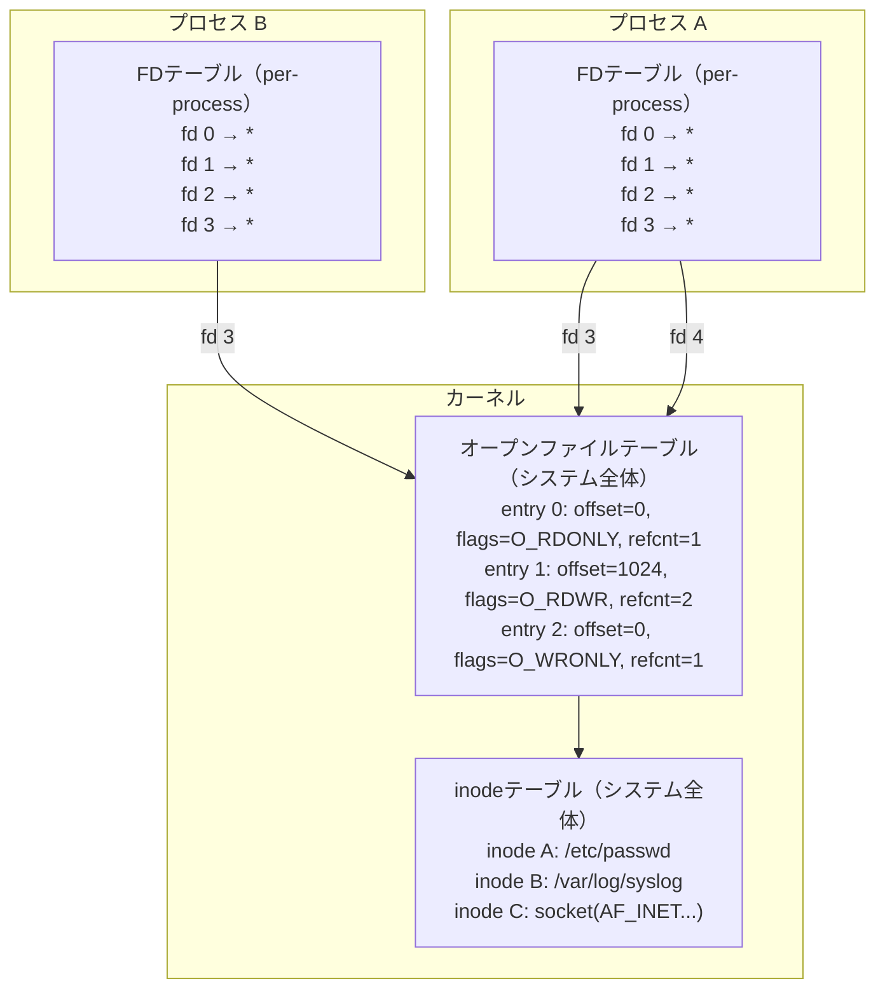
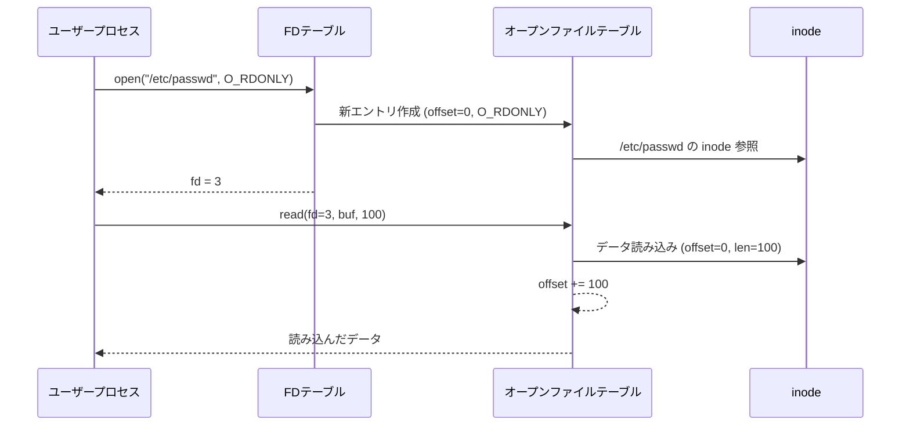
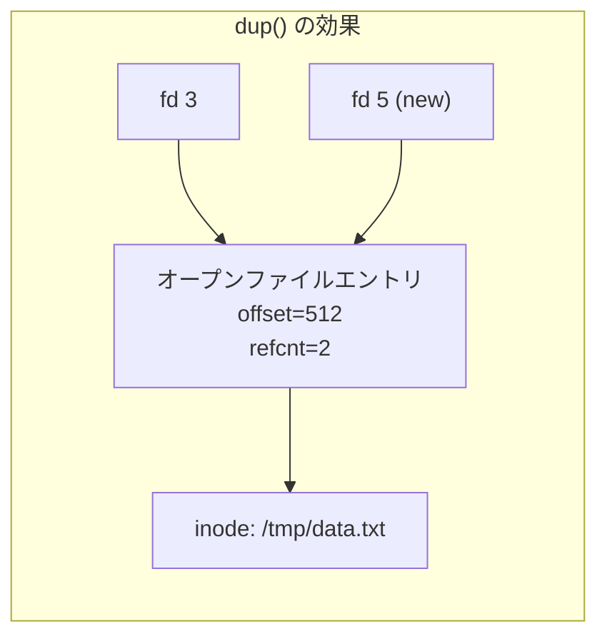
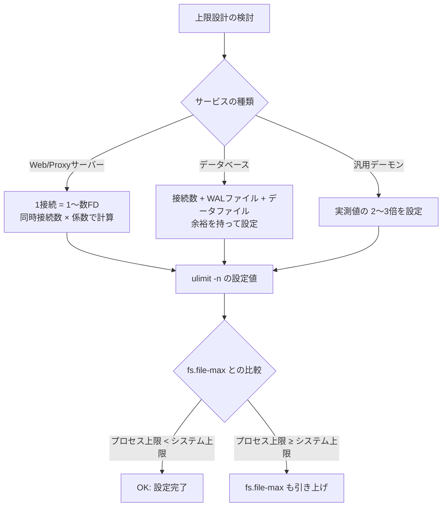
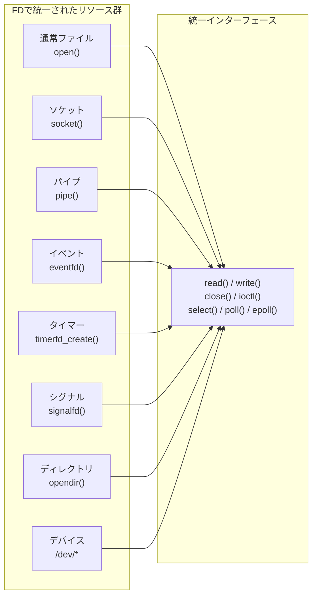
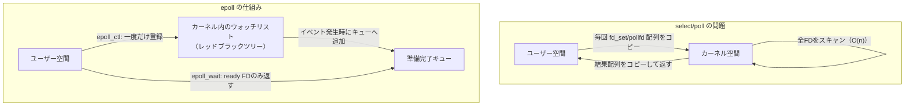
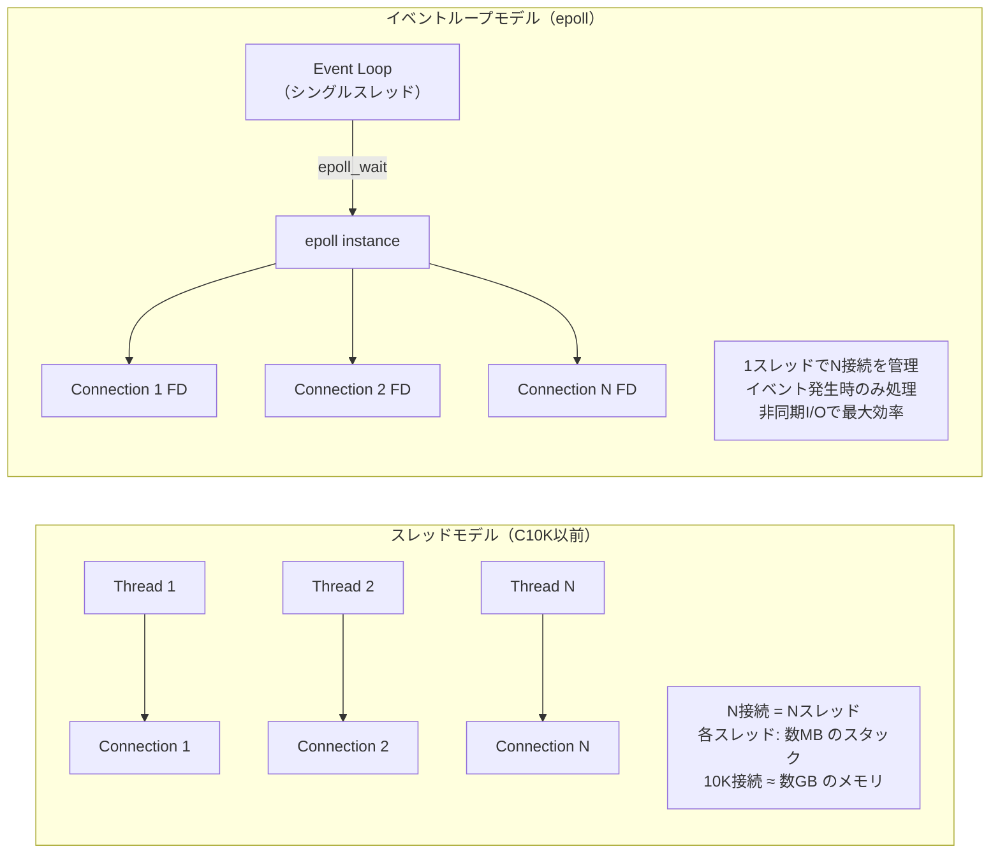

# ファイルディスクリプタの仕組みと上限設計

## 1. ファイルディスクリプタとは何か

Unixの設計思想を象徴するフレーズとして「**すべてはファイルである（Everything is a file）**」という言葉がある。通常のファイルはもちろん、ディレクトリ、デバイス、パイプ、ソケット、タイマー、シグナル受信機——これらすべてが、同一のインターフェースを通じて扱われる。そのインターフェースの入り口が**ファイルディスクリプタ（File Descriptor、FD）** である。

ファイルディスクリプタは単純な**非負整数**である。`int` 型の値として表現され、プロセスが「何かを開いているリソース」を識別するための番号票（ticket）に過ぎない。しかしこの単純な整数の背後には、カーネル内部の複数層にわたるデータ構造が存在する。

```c
int fd = open("/etc/hostname", O_RDONLY); // fd is just an integer, e.g. 3
char buf[256];
ssize_t n = read(fd, buf, sizeof(buf));   // use fd as the handle
close(fd);                                // release the fd
```

この単純さが Unix の強みである。`read(2)`, `write(2)`, `close(2)`, `select(2)` といったシステムコールは、リソースの種類を問わず同じ関数で動作する。ネットワークソケットからデータを読み込む場合も、ファイルから読み込む場合も、コードの形は変わらない。

### 1.1 なぜ整数なのか

ファイルディスクリプタが整数である理由は、カーネルとのインターフェースの効率にある。システムコールはユーザー空間とカーネル空間の境界を越える高コストな操作である。境界を越える際にポインタを直接渡すことはセキュリティ上許されない——ユーザーが不正なポインタを渡せば、カーネルがクラッシュしたり、任意のカーネルメモリが読み書きされてしまう。

整数を「インデックス」として使い、カーネル内のテーブルを参照するアーキテクチャは、このセキュリティ問題を根本から解決する。ユーザーが渡せるのは単なる配列インデックスであり、カーネルはそのインデックスが有効な範囲内かどうかを容易に検証できる。

## 2. カーネル内部のデータ構造

ファイルディスクリプタを理解するには、カーネル内部に存在する3つの層を把握する必要がある。



### 2.1 プロセスごとのFDテーブル（File Descriptor Table）

各プロセスは、自分専用の**FDテーブル**を持つ。これは `task_struct`（Linuxにおけるプロセス記述子）内の `files_struct` が管理する配列であり、インデックスがファイルディスクリプタ番号、値が次に説明する「オープンファイルテーブルのエントリへのポインタ」である。

FDテーブルの重要な性質として、**ファイルディスクリプタ番号はプロセスローカル**であることが挙げられる。プロセスAの fd=5 とプロセスBの fd=5 は、完全に異なるリソースを指している可能性がある。

### 2.2 オープンファイルテーブル（Open File Table）

カーネル内にシステム全体で1つ存在する構造体のテーブルである。Linux のソースコードでは `struct file` として定義されている。各エントリは以下の情報を持つ。

- **ファイルオフセット（f_pos）**: 現在の読み書き位置。`read()` や `write()` の呼び出しによって自動的に進む
- **オープンフラグ（f_flags）**: `O_RDONLY`, `O_WRONLY`, `O_RDWR`, `O_NONBLOCK` などの状態
- **参照カウント（f_count）**: このエントリを指しているFDの数。`fork()` や `dup()` によって複数のFDが同一エントリを指せる
- **inodeへのポインタ（f_inode）**: 実際のファイルメタデータへの参照

このテーブルが「共有」される仕組みこそが、`dup()` や `fork()` の動作を理解する鍵である。

### 2.3 inodeテーブル

ファイルの実体情報（パーミッション、タイムスタンプ、データブロックの位置など）はinode（index node）として管理される。同じファイルに対してオープンファイルテーブルのエントリが複数存在することがある（同じファイルを複数回 `open()` した場合）が、それらはすべて同一のinodeを参照する。



## 3. 標準ストリーム：0, 1, 2

プロセスが起動した時点で、通常3つのファイルディスクリプタが自動的に割り当てられている。

| FD番号 | 名前 | シンボル定数 | デフォルトの接続先 |
|--------|------|------------|-----------------|
| 0 | 標準入力 | `STDIN_FILENO` | 端末（キーボード）|
| 1 | 標準出力 | `STDOUT_FILENO` | 端末（画面）|
| 2 | 標準エラー出力 | `STDERR_FILENO` | 端末（画面）|

これらの番号は Unix の長い歴史の中で固定化された慣習であり、多くのシステムコールやライブラリが暗黙的にこの番号を仮定している。シェルのリダイレクト `> file` は実際には fd=1 をファイルに差し替える操作であり、`2>&1` は fd=2 が fd=1 と同じエントリを指すよう `dup2(1, 2)` を実行している。

```c
// Shell redirect: command > output.txt 2>&1
// Internally does:
int fd = open("output.txt", O_WRONLY | O_CREAT | O_TRUNC, 0644);
dup2(fd, STDOUT_FILENO); // fd 1 now points to output.txt
dup2(fd, STDERR_FILENO); // fd 2 now points to output.txt
close(fd);               // original fd no longer needed
```

> [!NOTE]
> `STDIN_FILENO`, `STDOUT_FILENO`, `STDERR_FILENO` は `<unistd.h>` で定義されるマクロである。Cの標準ライブラリが提供する `stdin`, `stdout`, `stderr`（`FILE *` 型）はこれらのFDをラップしたバッファリングI/Oオブジェクトである。

## 4. open / close / dup / dup2

### 4.1 open(2)

`open()` システムコールはファイルをオープンし、新しいFDを返す。カーネルは**FDテーブルで利用可能な最小の番号**を割り当てる。これを**最小空きFDの割り当て（lowest available FD allocation）** と呼ぶ。

```c
int fd = open(pathname, flags, mode);
// flags: O_RDONLY, O_WRONLY, O_RDWR, O_CREAT, O_TRUNC, O_APPEND, O_NONBLOCK, etc.
// mode: permission bits (used when O_CREAT is set)
```

`close()` で fd=3 を閉じた後、次の `open()` は再び fd=3 を返す。この性質がFDリーク（後述）の検出を難しくする。

### 4.2 close(2)

`close()` はFDテーブルのエントリを解放し、対応するオープンファイルテーブルの参照カウントをデクリメントする。参照カウントが0になった時点でオープンファイルテーブルのエントリも解放される（ファイルが実際にディスクから削除されるのは、inodeの参照カウントも0になった時）。

```c
if (close(fd) == -1) {
    // Errors from close() must not be ignored
    // NFS or similar may return EIO here
    perror("close");
}
```

::: warning
`close()` の戻り値を無視してはいけない。特にNFSやその他のネットワークファイルシステムでは、`close()` 時に書き込みバッファのフラッシュが行われ、ここで `EIO` エラーが発生することがある。
:::

### 4.3 dup(2) と dup2(2)

`dup()` は既存のFDの**コピー**を作成する。コピーは元のFDと同じオープンファイルテーブルのエントリを指す。つまり、**ファイルオフセットと状態を共有する**。

```c
int newfd = dup(oldfd);        // returns lowest available fd
int newfd = dup2(oldfd, newfd); // duplicate oldfd to specific newfd
                                // if newfd is already open, close it first
```



`dup2(oldfd, newfd)` はシェルのリダイレクト実装に不可欠である。`newfd` が既にオープンされている場合は自動的に閉じられてから複製される。`dup3()` は追加フラグ（主に `O_CLOEXEC`）を指定できる Linux 独自の拡張である。

### 4.4 O_CLOEXEC フラグ

`open()` に `O_CLOEXEC` フラグを渡すか、`dup3()` を使うと、`exec()` 実行時にFDが自動的に閉じられる。このフラグは**FDリークの防止**に重要な役割を果たす。

```c
// Without O_CLOEXEC: child process created by fork+exec inherits fd
int fd = open("secret.txt", O_RDONLY);
// After exec(), child still has access to fd!

// With O_CLOEXEC: fd is automatically closed on exec()
int fd = open("secret.txt", O_RDONLY | O_CLOEXEC);
// After exec(), fd is gone
```

マルチスレッド環境では `open()` と後続の `fcntl(fd, F_SETFD, FD_CLOEXEC)` の間に `fork()` が割り込む可能性がある（TOCTOU問題）。`O_CLOEXEC` はこの競合条件を排除するためにアトミックに設定できる。

## 5. ファイルディスクリプタの上限

FDは有限のリソースである。プロセスが無制限にFDを開き続けることはできない。上限は複数の層で管理されている。

### 5.1 プロセスごとの上限：ulimit -n

`ulimit -n` コマンドが示す値は、1プロセスが同時に開くことができるFDの最大数である。この値はカーネルでは `RLIMIT_NOFILE` リソース制限として管理される。

```bash
ulimit -n          # display soft limit (default: 1024 on many systems)
ulimit -Sn         # soft limit (process can lower voluntarily)
ulimit -Hn         # hard limit (only root can raise above this)
ulimit -n 65536    # set soft limit (up to hard limit)
```

**ソフトリミット（soft limit）** は現在の実効的な上限であり、プロセス自身が変更できる（ハードリミットを超えない範囲で）。**ハードリミット（hard limit）** はソフトリミットの上限であり、root 権限があればのみ引き上げられる。

```c
#include <sys/resource.h>

struct rlimit rl;
getrlimit(RLIMIT_NOFILE, &rl);

rl.rlim_cur = 65536;  // soft limit
rl.rlim_max = 65536;  // hard limit (requires root if raising)
setrlimit(RLIMIT_NOFILE, &rl);
```

### 5.2 システム全体の上限：fs.file-max

カーネルパラメータ `fs.file-max` は、システム全体（全プロセスの合計）で同時にオープンできるFDの最大数である。

```bash
cat /proc/sys/fs/file-max        # current value (e.g., 9223372036854775807)
sysctl fs.file-max               # equivalent
sysctl -w fs.file-max=2097152    # set temporarily

# Persistent setting in /etc/sysctl.conf or /etc/sysctl.d/*.conf:
# fs.file-max = 2097152
```

関連するパラメータとして `fs.file-nr` があり、現在開かれているFDの数、利用可能なFDの数、最大値の3つの値を返す。

```bash
cat /proc/sys/fs/file-nr
# 3456  0  9223372036854775807
# (open fds) (available) (max)
```

### 5.3 systemd の LimitNOFILE

モダンなLinuxディストリビューションでは、多くのサービスが systemd によって管理される。ulimit の設定は systemd のサービスユニットでは引き継がれないため、サービスごとに明示的に設定が必要である。

```ini
# /etc/systemd/system/myapp.service
[Service]
LimitNOFILE=65536
# Or for unlimited: LimitNOFILE=infinity
```

```bash
systemctl show myapp.service | grep LimitNOFILE
# Check current limit for running service:
cat /proc/$(systemctl show -p MainPID --value myapp.service)/limits | grep "open files"
```

::: tip
systemd のデフォルトの `DefaultLimitNOFILE` は `/etc/systemd/system.conf` または `/etc/systemd/user.conf` で変更できる。多くのディストリビューションではデフォルトが 1024 であり、高負荷なサービスには明示的な設定が必須である。
:::

### 5.4 上限値の設計指針



| 用途 | 推奨 ulimit -n |
|------|--------------|
| 開発環境のデフォルト | 1024〜4096 |
| 中規模Webサーバー | 65536 |
| 大規模プロキシ/LB | 524288〜1048576 |
| macOS デフォルト | 256（歴史的に低い） |

## 6. FDリーク問題と検出

### 6.1 FDリークとは

`open()` でFDを取得したにもかかわらず、適切に `close()` されない状態が継続することを**FDリーク（File Descriptor Leak）** と呼ぶ。メモリリークと同様に、長期稼働するプロセスでは積み重なってリソース枯渇に至る。

典型的なFDリークのパターンを示す。

```c
// Pattern 1: early return without close
int process_file(const char *path) {
    int fd = open(path, O_RDONLY);
    if (fd < 0) return -1;

    if (some_condition()) {
        return -2; // BUG: fd is not closed here!
    }

    close(fd);
    return 0;
}

// Correct: RAII-like cleanup in C
int process_file(const char *path) {
    int fd = open(path, O_RDONLY);
    if (fd < 0) return -1;
    int ret = -2;

    if (!some_condition()) {
        // ... do work ...
        ret = 0;
    }

    close(fd); // always reached
    return ret;
}
```

```cpp
// C++: Use RAII to prevent FD leaks
class FdGuard {
    int fd_;
public:
    explicit FdGuard(int fd) : fd_(fd) {}
    ~FdGuard() { if (fd_ >= 0) close(fd_); }
    int get() const { return fd_; }
    FdGuard(const FdGuard&) = delete;
    FdGuard& operator=(const FdGuard&) = delete;
};

int process_file(const char *path) {
    FdGuard guard(open(path, O_RDONLY));
    if (guard.get() < 0) return -1;
    // fd is automatically closed when guard goes out of scope
    return 0;
}
```

### 6.2 FDリークの検出方法

**方法1: /proc/self/fd の監視**

```bash
# List all open FDs of a process
ls -la /proc/<PID>/fd
ls -la /proc/self/fd  # for current shell process

# Count open FDs
ls /proc/<PID>/fd | wc -l

# Watch FD count over time (detect leaks)
watch -n 1 'ls /proc/<PID>/fd | wc -l'
```

**方法2: lsof コマンド**

```bash
lsof -p <PID>                    # all FDs for a process
lsof -p <PID> | wc -l           # count
lsof -p <PID> | grep "deleted"  # detect deleted-but-open files
```

**方法3: /proc/self/fdinfo**

```bash
cat /proc/<PID>/fdinfo/3
# pos:    512
# flags:  0100000  (O_RDONLY)
# mnt_id: 23
```

**方法4: strace による追跡**

```bash
strace -e trace=open,openat,close -p <PID> 2>&1 | head -100
```

::: details FDリーク検出スクリプトの例
```bash
#!/bin/bash
# Monitor FD count for a process, alert if it exceeds threshold
PID=$1
THRESHOLD=${2:-1000}

while true; do
    count=$(ls /proc/$PID/fd 2>/dev/null | wc -l)
    if [ $count -gt $THRESHOLD ]; then
        echo "WARNING: PID $PID has $count open FDs (threshold: $THRESHOLD)"
        ls -la /proc/$PID/fd | sort -k 10 | tail -20
    fi
    sleep 10
done
```
:::

### 6.3 削除済みファイルとFD

興味深いケースとして、ファイルを `unlink()` で削除した後もFDが開いたままの場合、ファイルの内容はディスクに残り続ける。inodeの参照カウントが0になるまでデータは解放されない。

```bash
# Find deleted files still held open (common cause of "disk full" despite no files)
lsof | grep deleted
lsof +L1  # show files with link count < 1 (deleted but open)
```

これはログローテーションで頻繁に問題となる。`logrotate` がファイルを削除・リネームしても、アプリケーションが古いFDに書き続けるとディスクを圧迫する。適切なシグナル（`SIGHUP` など）でログファイルを再オープンさせる仕組みが必要である。

## 7. 特殊なFD：ソケット・パイプ・eventfd・timerfd・signalfd

Unixの「すべてはファイル」哲学の真価は、通常のファイル以外のリソースもFDとして統一的に扱えることにある。

### 7.1 ソケット

ネットワーク通信はソケットFDを通じて行われる。`socket()` システムコールがFDを返し、以降は `read()`/`write()` または `recv()`/`send()` で通信できる。

```c
int sockfd = socket(AF_INET, SOCK_STREAM, 0); // returns an FD
// sockfd behaves like a regular file FD for read/write
int n = read(sockfd, buf, sizeof(buf));
write(sockfd, response, len);
close(sockfd); // closes the network connection
```

### 7.2 パイプ

パイプはプロセス間通信（IPC）の原始的な手段であり、`pipe()` システムコールが2つのFDを返す——一方は読み取り端、もう一方は書き込み端。

```c
int pipefd[2];
pipe(pipefd); // pipefd[0] = read end, pipefd[1] = write end

if (fork() == 0) {
    // Child process: write to pipe
    close(pipefd[0]); // close unused read end
    write(pipefd[1], "hello", 5);
    close(pipefd[1]);
} else {
    // Parent process: read from pipe
    close(pipefd[1]); // close unused write end
    char buf[10];
    read(pipefd[0], buf, sizeof(buf));
    close(pipefd[0]);
}
```

シェルの `cmd1 | cmd2` はまさにこの仕組みを使っており、`cmd1` の stdout（fd=1）をパイプの書き込み端に、`cmd2` の stdin（fd=0）をパイプの読み取り端に `dup2()` している。

### 7.3 eventfd

`eventfd` は Linux 2.6.22 で導入された、カウンターベースの通知メカニズムである。スレッド間またはカーネル→ユーザー空間の通知に使われる。

```c
#include <sys/eventfd.h>

int efd = eventfd(0, EFD_NONBLOCK | EFD_CLOEXEC);
// Write a value to signal an event
uint64_t val = 1;
write(efd, &val, sizeof(val)); // increments internal counter

// Read to consume the event (resets counter to 0 if EFD_SEMAPHORE not set)
uint64_t counter;
read(efd, &counter, sizeof(counter));
```

epoll と組み合わせて、ブロッキングI/Oループへのウェイクアップ通知として広く使われる。

### 7.4 timerfd

`timerfd` は Linux 2.6.25 で導入された、タイマーをFDとして扱う仕組みである。`SIGALRM` シグナルの代わりに、epoll のイベントループ内でタイマーを扱えるようになる。

```c
#include <sys/timerfd.h>

int tfd = timerfd_create(CLOCK_MONOTONIC, TFD_NONBLOCK | TFD_CLOEXEC);

struct itimerspec ts = {
    .it_interval = { .tv_sec = 1, .tv_nsec = 0 }, // repeat every 1 second
    .it_value    = { .tv_sec = 1, .tv_nsec = 0 }  // first expiry after 1 second
};
timerfd_settime(tfd, 0, &ts, NULL);

// In event loop: read() on tfd returns number of expirations
uint64_t expirations;
read(tfd, &expirations, sizeof(expirations));
```

### 7.5 signalfd

`signalfd` はシグナルをFDとして受信できる Linux 2.6.22 以降の機能である。シグナルハンドラという非同期の仕組みを、同期的なI/Oの枠組みに統合できる。

```c
#include <sys/signalfd.h>

sigset_t mask;
sigemptyset(&mask);
sigaddset(&mask, SIGTERM);
sigaddset(&mask, SIGINT);
sigprocmask(SIG_BLOCK, &mask, NULL); // block the signals first

int sfd = signalfd(-1, &mask, SFD_NONBLOCK | SFD_CLOEXEC);

// In event loop: read() returns struct signalfd_siginfo
struct signalfd_siginfo si;
read(sfd, &si, sizeof(si));
if (si.ssi_signo == SIGTERM) {
    // handle graceful shutdown
}
```



## 8. /proc/self/fd と /proc/PID/fd

Linuxの `/proc` 仮想ファイルシステムはプロセスの内部状態をファイルとして公開する。FDに関しては `/proc/self/fd/` ディレクトリが特に有用である。

```bash
ls -la /proc/self/fd
# lrwx------ 1 user user 64 Mar  2 /proc/self/fd/0 -> /dev/pts/0
# lrwx------ 1 user user 64 Mar  2 /proc/self/fd/1 -> /dev/pts/0
# lrwx------ 1 user user 64 Mar  2 /proc/self/fd/2 -> /dev/pts/0
# lr-x------ 1 user user 64 Mar  2 /proc/self/fd/3 -> /etc/hostname

# Find what's behind a specific FD
readlink /proc/self/fd/3

# fdinfo: detailed state of each FD
cat /proc/self/fdinfo/3
# pos:    0
# flags:  0100000
# mnt_id: 24
```

`/proc/self/fd` のエントリはシンボリックリンクであり、リンク先がFDが指すリソースのパスを示す。ソケットの場合は `socket:[inode番号]` という形式になる。

```bash
# Full socket information via /proc
cat /proc/self/net/tcp   # TCP socket states
cat /proc/self/net/unix  # Unix domain sockets

# Map socket inode to connection details
ss -tlnp | grep <port>
```

プログラム内から現在開いているFDを安全に列挙するには `/proc/self/fd` を読むのが最も確実な方法である。

```c
#include <dirent.h>

void list_open_fds(void) {
    DIR *dir = opendir("/proc/self/fd");
    struct dirent *entry;
    while ((entry = readdir(dir)) != NULL) {
        if (entry->d_name[0] == '.') continue;
        int fd = atoi(entry->d_name);
        char path[256], target[256];
        snprintf(path, sizeof(path), "/proc/self/fd/%d", fd);
        ssize_t n = readlink(path, target, sizeof(target) - 1);
        if (n > 0) {
            target[n] = '\0';
            printf("fd %d -> %s\n", fd, target);
        }
    }
    closedir(dir);
}
```

## 9. select / poll / epoll と FD

多数のFDを同時に監視する仕組みは、高性能なI/Oプログラミングの核心である。

### 9.1 select(2)

`select()` は最も古典的なI/O多重化システムコールである。監視したいFDをビットマスク（`fd_set`）で指定し、いずれかが準備完了になるまでブロックする。

```c
fd_set readfds;
FD_ZERO(&readfds);
FD_SET(fd1, &readfds);
FD_SET(fd2, &readfds);

struct timeval tv = { .tv_sec = 5, .tv_usec = 0 }; // 5 second timeout
int nready = select(max_fd + 1, &readfds, NULL, NULL, &tv);

if (FD_ISSET(fd1, &readfds)) {
    // fd1 is ready to read
}
```

**select の根本的な問題**:

- FDの上限が `FD_SETSIZE`（通常1024）に固定されている
- 毎回のコールでFD集合をユーザー空間→カーネル空間にコピーする必要がある
- どのFDが準備完了かを知るためにO(n)のスキャンが必要
- 大量のFDに対してO(n²)のスケーリング特性を持つ

### 9.2 poll(2)

`poll()` は `select()` の FD_SETSIZE 制限を解消したが、根本的な性能問題は残る。

```c
struct pollfd fds[2] = {
    { .fd = fd1, .events = POLLIN },
    { .fd = fd2, .events = POLLIN | POLLOUT }
};

int nready = poll(fds, 2, 5000); // 5000 ms timeout

if (fds[0].revents & POLLIN) {
    // fd1 is ready to read
}
```

FDの上限は解消されたが、毎回のコールでFD配列全体をカーネルにコピーし、結果を受け取る点は変わらない。O(n)のコスト構造は select と同じである。

### 9.3 epoll(7)：Linuxの解答

`epoll` は Linux 2.5.44 で導入された、大量のFDを効率的に監視するためのインターフェースである。

```c
// Create epoll instance (returns an FD itself!)
int epfd = epoll_create1(EPOLL_CLOEXEC);

// Add fd to watch list (O(log n) amortized)
struct epoll_event ev = {
    .events = EPOLLIN | EPOLLET, // edge-triggered mode
    .data.fd = client_fd
};
epoll_ctl(epfd, EPOLL_CTL_ADD, client_fd, &ev);

// Wait for events (returns only ready FDs)
struct epoll_event events[MAX_EVENTS];
int nready = epoll_wait(epfd, events, MAX_EVENTS, -1); // -1 = block forever

for (int i = 0; i < nready; i++) {
    int fd = events[i].data.fd;
    // handle events[i].events
}
```



epoll の優位性：

| 操作 | select | poll | epoll |
|------|--------|------|-------|
| FD登録コスト | O(1) | O(1) | O(log n) |
| 待機コスト | O(n) | O(n) | O(1) |
| FD上限 | FD_SETSIZE (1024) | 無制限 | 無制限 |
| カーネルコピー | 毎回全FD | 毎回全FD | 変更時のみ |
| 10000FDの効率 | 非常に低い | 低い | 高い |

**エッジトリガー（ET）とレベルトリガー（LT）**:

- **レベルトリガー（LT、デフォルト）**: FDが準備完了状態である限り、毎回 `epoll_wait` で通知される。`read()` しきれていないデータが残っていれば次回も通知される
- **エッジトリガー（ET、`EPOLLET`）**: 状態が「未準備」→「準備完了」に変化した瞬間のみ通知される。通知を見逃さないよう、`EAGAIN` が返るまでループで読み続ける必要がある

```c
// Edge-triggered: must read until EAGAIN
while (1) {
    ssize_t n = read(fd, buf, sizeof(buf));
    if (n < 0) {
        if (errno == EAGAIN || errno == EWOULDBLOCK)
            break; // no more data available right now
        // handle error
        break;
    }
    if (n == 0) {
        // connection closed
        break;
    }
    // process buf[0..n-1]
}
```

## 10. C10K問題とFDの関係

### 10.1 C10K問題とは

1999年、Dan Kegel は「C10K問題」を提起した。「1台のサーバーで同時に10,000接続を処理するにはどうすればよいか？」という問いである。当時のハードウェアスペック（Pentium Pro、128MB RAM）では、スレッドベースのサーバーでは1接続あたりのコスト（スタックメモリ、コンテキストスイッチ）が高すぎた。

C10K問題の核心には、FDの設計が直接関わっている。

**問題の構造**:

1. 各接続 = 1ソケットFD が必要
2. 10,000接続 = 10,000 のFD が必要
3. デフォルトの `ulimit -n = 1024` では到底足りない
4. `select()` の FD_SETSIZE = 1024 の壁
5. `select()`/`poll()` のO(n)スキャンがボトルネック

### 10.2 epoll による解決

epoll はC10K問題に対するLinuxの答えであった。`epoll_wait` はO(1)でイベントを取得し、FDの上限もシステム全体のリソース制限のみに依存する。



Node.js、nginx、Redis などの高性能サーバーはすべてこのイベントループ + epoll のパターンを採用している。

### 10.3 現代のC10M問題

C10K は解決されたが、現代では**C10M（1,000万接続）** が新たな課題である。この規模になると、epoll 自身のオーバーヘッドや、カーネルのTCPスタックの処理コストが問題となる。解決策として以下が登場している。

- **io_uring（Linux 5.1+）**: カーネルとユーザー空間を共有リングバッファで繋ぐ、ゼロコピーの非同期I/Oインターフェース
- **DPDK（Data Plane Development Kit）**: カーネルをバイパスしてNICを直接ユーザー空間から操作する
- **XDP（eXpress Data Path）**: eBPFプログラムをNICドライバ層で実行し、パケットをカーネルスタックに届く前に処理する

## 11. 高負荷サーバーでのFD設計

### 11.1 必要なFD数の見積もり

高負荷サーバーのFD設計では、以下の要素を考慮して上限値を設定する。

```
必要FD数 = (最大同時接続数 × 接続あたりのFD数)
          + (ログファイル数)
          + (設定ファイル・証明書等)
          + (内部パイプ・ソケット数)
          + (バッファ: 通常は計算値の 20〜30%)
```

**接続あたりのFD数の例**:
- 単純なHTTPサーバー: クライアント接続1FD = 1FD
- リバースプロキシ: クライアント側1FD + バックエンド側1FD = 2FD
- データベース接続プール: 接続数 + 各接続の内部FD（ソケット1つ）

### 11.2 設定チェックリスト

::: details 高負荷サーバーのFD設定チェックリスト

**OS レベル**
```bash
# 1. Check current limits
ulimit -n
cat /proc/sys/fs/file-max

# 2. Set per-process limit (non-root user can only raise to hard limit)
ulimit -n 65536

# 3. Persistent setting in /etc/security/limits.conf
# www-data soft nofile 65536
# www-data hard nofile 65536

# 4. System-wide limit
sysctl -w fs.file-max=2097152
# Add to /etc/sysctl.d/99-performance.conf:
# fs.file-max = 2097152
```

**systemd サービス**
```ini
[Service]
LimitNOFILE=65536
# For very high-load services:
# LimitNOFILE=524288
```

**nginx の例**
```nginx
worker_processes auto;
worker_rlimit_nofile 65536;

events {
    worker_connections 16384; # per worker
    use epoll;                # use epoll explicitly
    multi_accept on;
}
```

**確認コマンド**
```bash
# Verify limits are applied
cat /proc/$(pgrep nginx | head -1)/limits | grep "open files"

# Monitor FD usage
watch -n 1 'ls /proc/$(pgrep -f myapp)/fd | wc -l'

# Check system-wide FD usage
cat /proc/sys/fs/file-nr
```
:::

### 11.3 FD設計のアンチパターン

**アンチパターン1: ulimit を無制限に設定する**

`ulimit -n unlimited` は一見便利だが、プロセスのバグによるFD枯渇がシステム全体に影響する可能性がある。適切な上限値を設定し、`fs.file-max` でシステム全体の安全網を設けるべきである。

**アンチパターン2: 短命な接続のソケットを使いまわさない**

短時間に大量の接続を作成・破棄すると、`TIME_WAIT` 状態のソケットが蓄積し、FDは解放されても `ss` で確認するとソケットが残り続けることがある。`SO_REUSEADDR` と `SO_REUSEPORT` の適切な使用が重要である。

```c
int opt = 1;
setsockopt(sockfd, SOL_SOCKET, SO_REUSEADDR, &opt, sizeof(opt));
setsockopt(sockfd, SOL_SOCKET, SO_REUSEPORT, &opt, sizeof(opt));
```

**アンチパターン3: エラーパスでのFDリーク**

エラー処理コードは正常パスよりもテストされることが少なく、`close()` 忘れが紛れ込みやすい。C言語では `goto cleanup` パターン、C++ではRAII、Go/Python/Rust では言語機能（`defer`/`with`/`drop`）を活用する。

```python
# Python: context manager guarantees close()
with open('/etc/hostname') as f:
    data = f.read()
# fd is automatically closed here, even if exception occurs

# Or explicitly with socket
import socket
with socket.create_connection(('example.com', 80)) as sock:
    sock.sendall(b'GET / HTTP/1.1\r\nHost: example.com\r\n\r\n')
    response = sock.recv(4096)
```

```go
// Go: defer guarantees close()
func readFile(path string) ([]byte, error) {
    f, err := os.Open(path)
    if err != nil {
        return nil, err
    }
    defer f.Close() // always called when function returns
    return io.ReadAll(f)
}
```

### 11.4 io_uring：次世代の非同期I/O

Linux 5.1 で導入された `io_uring` は、FDを使った非同期I/Oの新しい形を提示している。従来の `epoll` + non-blocking I/O では、イベント検出と実際のI/O操作に2段階のシステムコールが必要だった。`io_uring` では操作を送信リングに積み、結果を完了リングから取得することで、システムコールの回数を劇的に削減できる。

```c
#include <liburing.h>

struct io_uring ring;
io_uring_queue_init(256, &ring, 0);

// Submit read operation without blocking
struct io_uring_sqe *sqe = io_uring_get_sqe(&ring);
io_uring_prep_read(sqe, fd, buf, sizeof(buf), 0);
sqe->user_data = (uint64_t)fd;
io_uring_submit(&ring);

// Wait for completion
struct io_uring_cqe *cqe;
io_uring_wait_cqe(&ring, &cqe);
int result = cqe->res; // number of bytes read, or -errno
io_uring_cqe_seen(&ring, cqe);

io_uring_queue_exit(&ring);
```

`io_uring` においてもFDは依然として中心的な役割を果たす。ただし操作の送信がシステムコールを必要とせず（`IORING_SETUP_SQPOLL` 使用時）、カーネルスレッドがリングをポーリングして処理する。

## 12. まとめ

ファイルディスクリプタは単純な整数でありながら、Unixの設計哲学を体現する強力な抽象化である。

**設計上の要点**をまとめると：

1. **FDはプロセスローカルな整数インデックス**であり、カーネル内のオープンファイルテーブルエントリを参照する。`fork()` や `dup()` によって複数のFDが同一エントリを共有できる

2. **stdin/stdout/stderr の 0/1/2 は慣習**であり、シェルのリダイレクトは `dup2()` でこれらを差し替えることで実現される

3. **FDの上限は多層構造**になっている。`ulimit -n`（プロセスレベル）、`fs.file-max`（システムレベル）、systemd の `LimitNOFILE`（サービスレベル）を整合的に設定する必要がある

4. **FDリークは長期稼働サービスの天敵**である。すべてのエラーパスで `close()` を保証するRAII・defer・context managerを活用し、`/proc/self/fd` や `lsof` で定期的に監視する

5. **epoll は C10K 問題への解答**であり、O(1) のイベント取得により単一スレッドで数万〜数十万の接続を処理できる。レベルトリガーとエッジトリガーの使い分けを理解することが重要である

6. **eventfd・timerfd・signalfd** は従来シグナルやスリープで扱っていたイベントをFDに統一し、epoll のイベントループに統合できる

7. **高負荷サーバーのFD設計**では、接続数・用途・エラーマージンを考慮して上限値を算出し、OS・systemd・アプリケーションの全層で一貫した設定を行う

Unixの「すべてはファイル」という設計はFDによって実現されており、その上に epoll・io_uring といった高性能I/Oが構築されている。FDの仕組みを深く理解することは、システムプログラミングの根幹を理解することに等しい。

## 参考

- Linux man pages: `open(2)`, `close(2)`, `dup(2)`, `epoll(7)`, `eventfd(2)`, `timerfd_create(2)`, `signalfd(2)`
- W. Richard Stevens, Stephen A. Rago "Advanced Programming in the UNIX Environment (3rd Edition)"
- Dan Kegel "The C10K Problem" (1999) — http://www.kegel.com/c10k.html
- Jens Axboe "Efficient IO with io_uring" (2019)
- Linux kernel source: `include/linux/fs.h`, `fs/file.c`
