# ファイルアップロード設計（マルチパート, チャンク, Resumable）

## はじめに：ファイルアップロードの難しさ

ファイルアップロードは、一見シンプルに見えて実装が難しいバックエンド機能の代表格である。単純なフォームから画像を送信する場合であれば、`<input type="file">` と `multipart/form-data` エンコーディングの組み合わせで十分かもしれない。しかし実際のプロダクトでは、以下のような多様な要求が生じる。

- **大容量ファイル**：動画ファイルが数 GB、バックアップが数十 GB に達する
- **不安定なネットワーク**：モバイル回線や海外拠点からのアップロードでは途中切断が頻発する
- **セキュリティ**：悪意のあるファイルや不正なコンテンツのアップロードを防がなければならない
- **スケーラビリティ**：多数のユーザーが同時にアップロードしても性能が劣化しない
- **ユーザー体験**：進捗表示、一時停止・再開、エラー時のリトライが自然に動作する

これらの要求に応えるために、様々な設計パターンが生まれてきた。本記事では、HTTP のレイヤーから始まり、チャンク分割、Resumable Upload、ストレージ連携、セキュリティ対策、フロントエンドの UX 設計まで、ファイルアップロード設計の全体像を解説する。

## 1. multipart/form-data の仕組みと HTTP 仕様

### 1.1 Content-Type と境界文字列

HTMLフォームのファイルアップロードでは、`enctype="multipart/form-data"` を指定する。ブラウザはこれを受けて、HTTP リクエストのボディを複数のパートに分割するエンコーディングを行う。

```http
POST /upload HTTP/1.1
Host: api.example.com
Content-Type: multipart/form-data; boundary=----WebKitFormBoundaryABCDEF123456
Content-Length: 1234

------WebKitFormBoundaryABCDEF123456
Content-Disposition: form-data; name="username"

alice
------WebKitFormBoundaryABCDEF123456
Content-Disposition: form-data; name="file"; filename="photo.jpg"
Content-Type: image/jpeg

<binary JPEG data here>
------WebKitFormBoundaryABCDEF123456--
```

この構造には以下の特徴がある。

- **`boundary` パラメータ**：各パートを区切る文字列。ブラウザがランダムに生成するため、ファイルデータ中に同一文字列が出現しないことが保証される
- **`Content-Disposition`**：各パートの役割を示す。`name` はフォームフィールド名、`filename` はファイル名
- **終端マーカー**：最後の境界文字列には `--` が末尾に付く（`------boundary--`）

仕様は RFC 2046（MIME: Multipart Content-Type）と RFC 7578（Returning Values from Forms）で定義されている。

### 1.2 サーバー側のパース

サーバー側では、`Content-Type` ヘッダから `boundary` 値を取得し、ボディを分割してパースする。主要なフレームワークではこの処理が自動化されている。

```python
# Python (FastAPI) example
from fastapi import FastAPI, File, UploadFile, Form

app = FastAPI()

@app.post("/upload")
async def upload_file(
    username: str = Form(...),
    file: UploadFile = File(...),
):
    # File metadata
    filename = file.filename
    content_type = file.content_type

    # Read file content (streaming)
    content = await file.read()
    return {"filename": filename, "size": len(content)}
```

```go
// Go (net/http) example
func uploadHandler(w http.ResponseWriter, r *http.Request) {
    // Parse multipart form with 32MB in-memory limit
    r.ParseMultipartForm(32 << 20)

    file, handler, err := r.FormFile("file")
    if err != nil {
        http.Error(w, "No file found", http.StatusBadRequest)
        return
    }
    defer file.Close()

    // handler.Filename, handler.Size are available
}
```

### 1.3 application/octet-stream との比較

ファイルのみを送信する場合、`multipart/form-data` を使わずに直接バイナリをボディに入れる方式も選択できる。

```http
POST /upload HTTP/1.1
Content-Type: application/octet-stream
Content-Length: 5242880

<raw binary data>
```

| 比較項目 | multipart/form-data | application/octet-stream |
|---------|--------------------|-----------------------|
| 複数フィールドの同時送信 | できる | できない |
| ファイル名のメタデータ | Content-Disposition で送れる | ヘッダで別途送る |
| オーバーヘッド | boundary 分のオーバーヘッドあり | ほぼゼロ |
| シンプルさ | フレームワーク依存のパース処理 | 単純なボディ読み取り |
| 適したユースケース | フォームと一緒に送るケース | API からプログラム的に送るケース |

::: tip
REST API として設計する場合、ファイルのみを送信するシンプルな API では `application/octet-stream` の方が HTTP の意味論に沿っている。フォームとの共存が必要な場合のみ `multipart/form-data` を選ぶのが良い。
:::

### 1.4 ファイルサイズ制限

HTTP レイヤーの `Content-Length` ヘッダにはサイズ制限がないが、実際のシステムでは複数の層でサイズ制限がかかる。


nginx では以下の設定でサイズを制御する。

```nginx
# nginx configuration
server {
    # Allow up to 100MB uploads
    client_max_body_size 100m;

    # Increase timeout for large file uploads
    client_body_timeout 300s;
    proxy_read_timeout 300s;
    proxy_send_timeout 300s;
}
```

::: warning
リバースプロキシとアプリケーション両方でサイズ制限を設定しておかないと、大きなファイルを送り始めた後でプロキシ層でエラーになりタイムアウト待ちが発生するなど、ユーザー体験を大きく損なう。制限値はプロキシとアプリケーションで揃えること。
:::

## 2. チャンクアップロード（分割送信）の設計パターン

### 2.1 なぜチャンク分割が必要か

単一の HTTP リクエストでファイル全体を送信する方式には、以下の問題がある。

1. **途中切断**：ネットワーク切断が発生すると、最初からやり直しになる
2. **タイムアウト**：大容量ファイルは HTTP タイムアウトに引っかかる
3. **メモリ消費**：サーバーがリクエスト全体をメモリに保持する必要がある
4. **進捗表示の困難さ**：クライアント側では送信バイト数が分かっても、サーバーでの処理進捗が分からない

チャンクアップロードはファイルを固定サイズのチャンクに分割し、複数のリクエストで送信する。

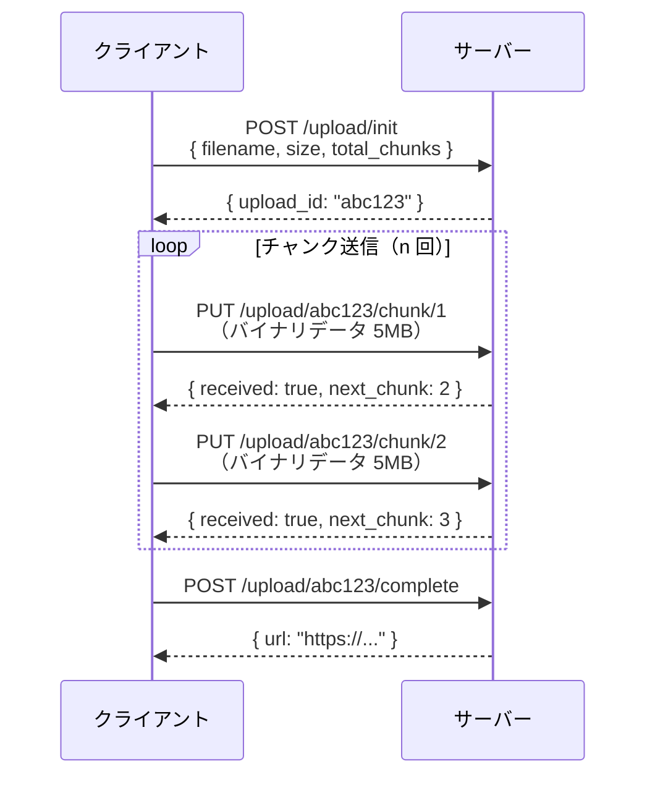

### 2.2 チャンク API 設計のパターン

チャンクアップロード API は大きく 2 つのアプローチに分けられる。

**パターン A：セッションベース（インデックス管理）**

アップロードセッションを事前に作成し、チャンクをインデックス番号で管理する。

```
POST   /uploads              → セッション作成、upload_id を返す
PUT    /uploads/:id/chunks/:n → チャンク n を送信
GET    /uploads/:id          → 受信済みチャンクの確認
POST   /uploads/:id/complete → チャンクの結合を要求
DELETE /uploads/:id          → アップロードをキャンセル
```

**パターン B：オフセットベース（バイト範囲管理）**

HTTP の `Content-Range` ヘッダを使ってバイト範囲を指定する。

```http
PUT /uploads/abc123 HTTP/1.1
Content-Range: bytes 0-5242879/26214400
Content-Type: application/octet-stream
Content-Length: 5242880

<binary data, bytes 0 to 5242879>
```

オフセットベースは HTTP 標準ヘッダを使うため相互運用性が高い。

### 2.3 チャンクサイズの選択

チャンクサイズはシステムの特性によって最適値が異なる。

| チャンクサイズ | メリット | デメリット | 適したケース |
|-------------|---------|-----------|------------|
| 1MB 未満 | リクエスト数が多く、進捗が細かく分かる | HTTP オーバーヘッドが積み重なる | 不安定な回線 |
| 5〜10MB | オーバーヘッドと復旧コストのバランスが良い | - | 一般的な用途 |
| 50MB 以上 | HTTP オーバーヘッドが小さい | 切断時のロスが大きい | 高速・安定した回線 |

実用的には **5MB〜10MB** が多くのケースで適切なチャンクサイズとなる。S3 のマルチパートアップロードが最小パートサイズ 5MB を要求することもこれと整合している。

### 2.4 並列チャンクアップロード

チャンクを並列で送信することでスループットを向上させられる。

```javascript
// Client-side parallel chunk upload
async function uploadFileInParallel(file, uploadId, concurrency = 3) {
    const CHUNK_SIZE = 5 * 1024 * 1024; // 5MB
    const totalChunks = Math.ceil(file.size / CHUNK_SIZE);
    const semaphore = new Semaphore(concurrency);

    const chunkPromises = Array.from({ length: totalChunks }, (_, i) => {
        return semaphore.acquire().then(async (release) => {
            try {
                const start = i * CHUNK_SIZE;
                const end = Math.min(start + CHUNK_SIZE, file.size);
                const chunk = file.slice(start, end);

                await uploadChunk(uploadId, i, chunk);
            } finally {
                release();
            }
        });
    });

    await Promise.all(chunkPromises);
    await completeUpload(uploadId);
}
```

::: tip
並列度を上げすぎるとサーバー側に過大な負荷がかかる。クライアントのネットワーク帯域幅はファイルが 1 つであれ複数チャンクであれ変わらないため、並列度 3〜5 程度が一般的に最適である。
:::

## 3. Resumable Upload の設計

### 3.1 Resumable Upload が必要な理由

チャンクアップロードでは「途中から再開できる」ようにするには、どのチャンクまで受信できているかをクライアントとサーバー両方が把握する必要がある。**Resumable Upload**（再開可能アップロード）は、この「再開」の仕組みを標準化した設計パターンである。

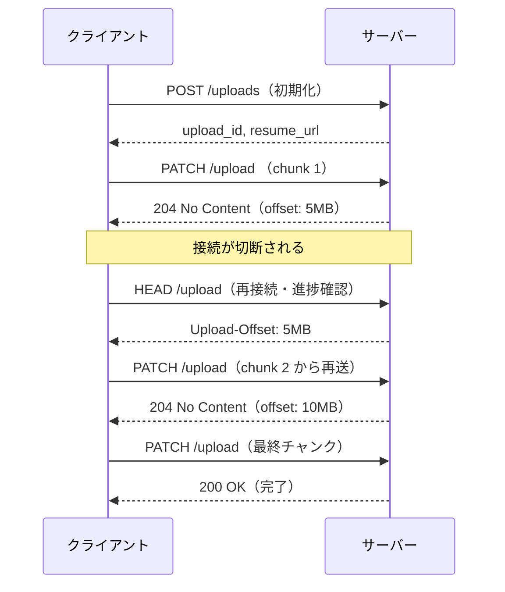

### 3.2 TUS プロトコル

**TUS**（Tus Resumable Uploads Protocol）は、Resumable Upload の標準オープンプロトコルである。2013年に Transloadit 社が公開し、現在は tus.io として仕様が管理されている。

TUS のコアプロトコルは以下の HTTP 拡張で構成される。

| メソッド / ヘッダ | 役割 |
|----------------|------|
| `POST`（Creation 拡張） | アップロードリソースを作成する |
| `PATCH` | データを送信する |
| `HEAD` | 受信済みバイト数（オフセット）を確認する |
| `DELETE`（Termination 拡張） | アップロードをキャンセルする |
| `Upload-Offset` | サーバーが受信した末尾バイト位置 |
| `Upload-Length` | ファイルの総バイト数 |
| `Tus-Resumable` | TUS プロトコルバージョン |

```http
# Step 1: Create upload resource
POST /files/ HTTP/1.1
Host: upload.example.com
Tus-Resumable: 1.0.0
Upload-Length: 100000000
Upload-Metadata: filename aGVsbG8ud29ybGQ=

HTTP/1.1 201 Created
Location: /files/abc123
Tus-Resumable: 1.0.0
Upload-Offset: 0

# Step 2: Send chunk
PATCH /files/abc123 HTTP/1.1
Content-Type: application/offset+octet-stream
Content-Length: 5000000
Upload-Offset: 0
Tus-Resumable: 1.0.0

<binary data>

HTTP/1.1 204 No Content
Upload-Offset: 5000000

# Step 3: Resume after disconnection
HEAD /files/abc123 HTTP/1.1
Tus-Resumable: 1.0.0

HTTP/1.1 200 OK
Upload-Offset: 5000000
Upload-Length: 100000000
```

TUS の主要な実装は以下の通りである。

- **tusd**：Go 製のリファレンスサーバー実装。ローカルディスク、S3、GCS へのバックエンドをサポート
- **tus-js-client**：JavaScript / TypeScript 用クライアントライブラリ
- **uppy**：TUS を含む多様なアップロード戦略をサポートするフロントエンドファイルアップローダー

```javascript
// tus-js-client の使用例
import * as tus from "tus-js-client";

const upload = new tus.Upload(file, {
    endpoint: "https://upload.example.com/files/",
    retryDelays: [0, 3000, 5000, 10000, 20000],
    metadata: {
        filename: file.name,
        filetype: file.type,
    },
    onError: (error) => {
        console.error("Upload failed:", error);
    },
    onProgress: (bytesUploaded, bytesTotal) => {
        const percentage = ((bytesUploaded / bytesTotal) * 100).toFixed(2);
        console.log(`${bytesUploaded} / ${bytesTotal} (${percentage}%)`);
    },
    onSuccess: () => {
        console.log("Upload finished:", upload.url);
    },
});

// Resume previous upload if available
upload.findPreviousUploads().then((previousUploads) => {
    if (previousUploads.length) {
        upload.resumeFromPreviousUpload(previousUploads[0]);
    }
    upload.start();
});
```

### 3.3 Google Resumable Upload API

Google は Google Drive API、Google Cloud Storage、YouTube Data API など多くのサービスで独自の Resumable Upload を実装している。仕様は TUS とは異なるが、概念は共通している。

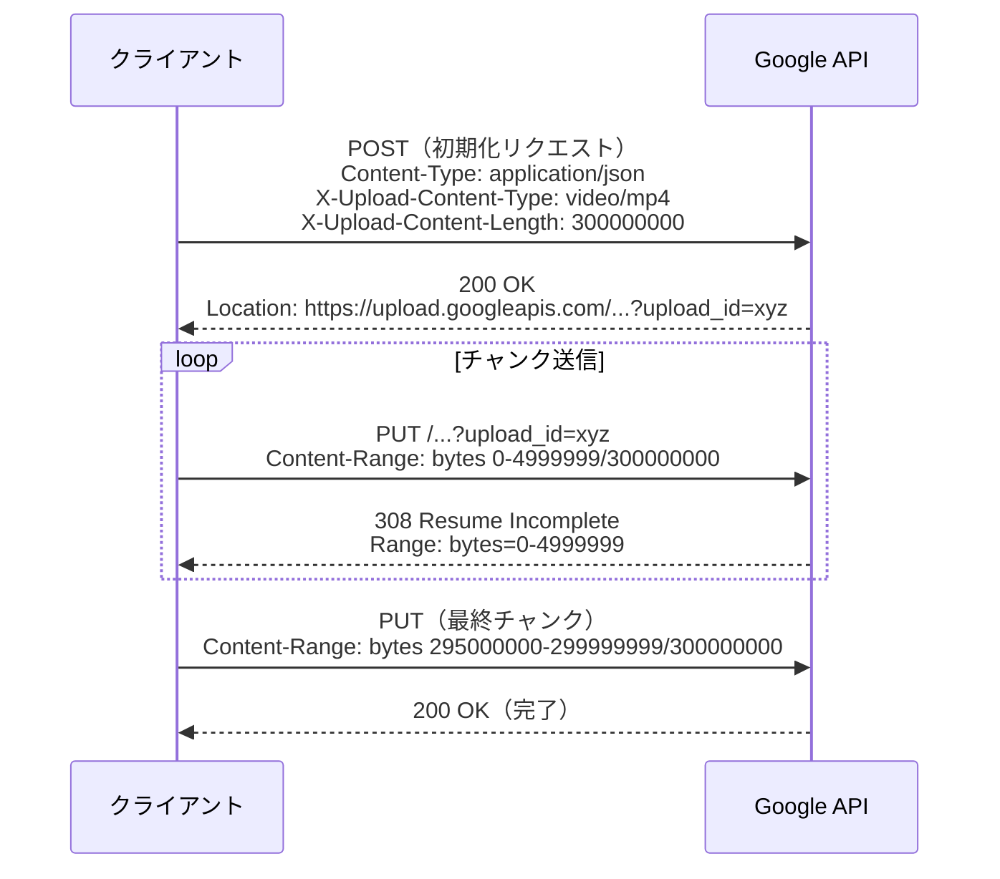

Google 方式での特徴的な点として、途中チャンクのレスポンスに **308 Resume Incomplete** ステータスコードを使用することがある（通常の HTTP ステータスコードとは異なる特殊な利用法）。また、切断後の再開時には `Content-Range: bytes */300000000` で現在の進捗を問い合わせる。

### 3.4 アップロード状態の永続化

Resumable Upload のサーバー実装では、アップロードセッションの状態を永続化する必要がある。

```python
# Upload session model (pseudo-code)
class UploadSession:
    upload_id: str
    user_id: str
    filename: str
    total_size: int
    received_offset: int          # How many bytes received
    chunk_hashes: List[str]       # For integrity verification
    storage_path: str             # Temp storage location
    created_at: datetime
    expires_at: datetime          # TTL for incomplete uploads

# Using Redis for session state
def save_upload_state(session: UploadSession):
    key = f"upload:{session.upload_id}"
    redis.hset(key, mapping={
        "offset": session.received_offset,
        "total_size": session.total_size,
        "storage_path": session.storage_path,
    })
    # Set TTL so incomplete uploads are cleaned up automatically
    redis.expire(key, 24 * 3600)  # 24 hours TTL

def get_upload_offset(upload_id: str) -> int:
    offset = redis.hget(f"upload:{upload_id}", "offset")
    if offset is None:
        raise UploadNotFoundException(upload_id)
    return int(offset)
```

::: warning
未完了のアップロードが永続化されたまま残り続けるとストレージが圧迫される。セッションには明示的な有効期限（TTL）を設定し、一定時間経過後に自動的にクリーンアップする仕組みを必ず実装すること。
:::

## 4. ファイル検証とセキュリティ

### 4.1 セキュリティ上のリスク

ファイルアップロードは攻撃ベクターとして非常に一般的である。主なリスクは以下の通りである。

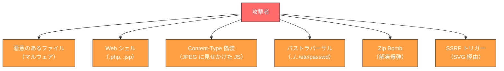

### 4.2 Content-Type 検証とマジックバイト

クライアントが送信する `Content-Type` ヘッダは攻撃者により簡単に偽装できる。そのため、**ファイルの先頭バイト（マジックバイト）を読んで実際のファイル形式を判定する**ことが不可欠である。

主要なファイル形式のマジックバイトを以下に示す。

| ファイル形式 | マジックバイト（16進数） |
|------------|----------------------|
| JPEG | `FF D8 FF` |
| PNG | `89 50 4E 47 0D 0A 1A 0A` |
| GIF | `47 49 46 38` |
| PDF | `25 50 44 46` (`%PDF`) |
| ZIP | `50 4B 03 04` |
| MP4 | `00 00 00 XX 66 74 79 70` |
| MP3 | `49 44 33` または `FF FB` |

```python
import magic

def detect_file_type(file_data: bytes) -> str:
    """Detect file MIME type using magic bytes."""
    mime = magic.from_buffer(file_data[:2048], mime=True)
    return mime

def validate_upload(file_data: bytes, claimed_content_type: str) -> None:
    """Validate that actual file type matches claimed type."""
    allowed_types = {
        "image/jpeg", "image/png", "image/gif",
        "application/pdf", "video/mp4",
    }

    # Detect actual MIME type from file content
    actual_type = detect_file_type(file_data)

    if actual_type not in allowed_types:
        raise ValidationError(f"File type {actual_type} is not allowed")

    # Optional: warn if Content-Type header doesn't match
    if actual_type != claimed_content_type:
        logger.warning(
            f"Content-Type mismatch: claimed={claimed_content_type}, "
            f"actual={actual_type}"
        )

    return actual_type
```

Python では `python-magic`（libmagic のバインディング）を使うのが一般的である。Go では `net/http` の `DetectContentType` 関数が利用できる。

### 4.3 ファイル名のサニタイズ

ファイル名も攻撃ベクターになりうる。パストラバーサル攻撃（`../../etc/passwd` のようなファイル名）やプラットフォーム固有の問題を防ぐ必要がある。

```python
import os
import re
import uuid

def sanitize_filename(filename: str) -> str:
    """
    Sanitize an uploaded filename to prevent path traversal and other attacks.
    Returns a safe filename preserving the extension.
    """
    # Get only the basename (removes any directory component)
    filename = os.path.basename(filename)

    # Split name and extension
    name, ext = os.path.splitext(filename)

    # Allow only alphanumerics, hyphens, underscores, and dots
    name = re.sub(r"[^a-zA-Z0-9_\-]", "_", name)

    # Normalize extension to lowercase
    ext = ext.lower()

    # Disallow dangerous extensions
    dangerous_extensions = {
        ".php", ".php3", ".php4", ".php5", ".phtml",
        ".asp", ".aspx", ".jsp", ".jspx",
        ".cgi", ".pl", ".py", ".rb", ".sh",
        ".exe", ".bat", ".cmd", ".ps1",
    }
    if ext in dangerous_extensions:
        raise ValidationError(f"Extension {ext} is not allowed")

    # Generate a unique prefix to prevent collision
    safe_filename = f"{uuid.uuid4().hex}_{name}{ext}"
    return safe_filename
```

::: danger
ユーザーが指定したファイル名をそのままストレージのパスに使用してはならない。たとえサニタイズしていても、最終的なストレージパスは UUID などをベースとした内部管理 ID で決定し、元のファイル名はメタデータとして別途保持するのが最も安全な設計である。
:::

### 4.4 ウイルス・マルウェアスキャン

本番環境では、アップロードされたファイルに対してウイルスとマルウェアのスキャンを実施することが強く推奨される。主なアプローチは以下の通りである。

**同期スキャン（アップロード時にスキャン）**

```python
import clamd  # Python bindings for ClamAV

def scan_file(file_path: str) -> bool:
    """
    Scan file for viruses using ClamAV.
    Returns True if file is clean, raises exception if infected.
    """
    cd = clamd.ClamdUnixSocket()
    scan_result = cd.scan(file_path)

    if file_path in scan_result:
        status, virus_name = scan_result[file_path]
        if status == "FOUND":
            raise SecurityError(f"Virus detected: {virus_name}")

    return True
```

**非同期スキャン（アップロード後にキューで処理）**

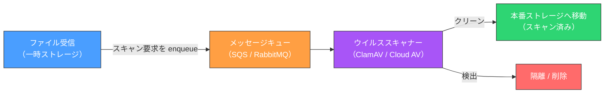

非同期スキャンはユーザーのレイテンシに影響しないが、スキャン完了前にファイルが参照できないことをユーザーに伝える仕組みが必要である（処理中ステータス、ポーリング API、Webhook など）。

### 4.5 Zip Bomb と圧縮ファイルの注意

ZIP や gzip などの圧縮ファイルは、展開後サイズが数 GB や数 TB にも膨れあがる「Zip Bomb」として悪用されることがある。展開前にファイルサイズを確認することが重要である。

```python
import zipfile

def validate_zip(file_path: str, max_uncompressed_size: int = 500 * 1024 * 1024):
    """
    Validate ZIP file to prevent zip bomb attacks.
    Checks total uncompressed size before extraction.
    """
    with zipfile.ZipFile(file_path) as zf:
        total_size = sum(info.file_size for info in zf.infolist())

        if total_size > max_uncompressed_size:
            raise ValidationError(
                f"ZIP contents too large: {total_size} bytes "
                f"(max: {max_uncompressed_size} bytes)"
            )

        # Also limit number of files to prevent exhaustion attacks
        if len(zf.infolist()) > 10000:
            raise ValidationError("ZIP contains too many files")
```

## 5. ストレージ設計：ローカル・S3・GCS と Presigned URL

### 5.1 ストレージ選択の考え方

アップロードされたファイルをどこに保存するかは、スケーラビリティとコストに大きく影響する。

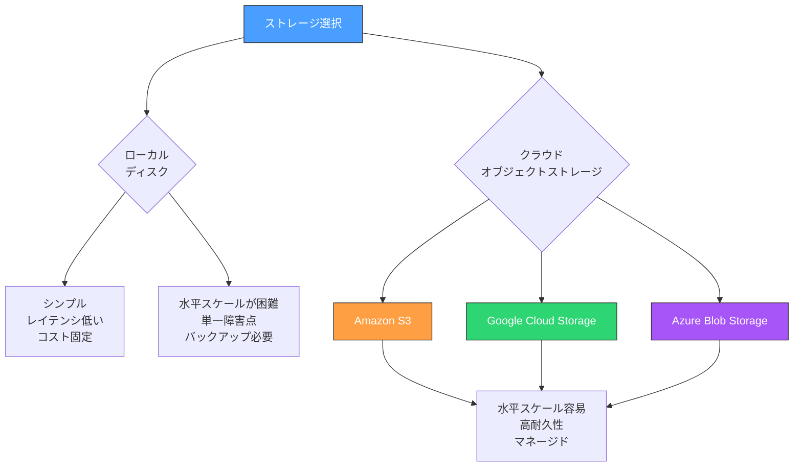

複数サーバーへの水平スケールアウトを想定するのであれば、ローカルディスクへの保存は避けるべきである。ローカルストレージを使うと特定のサーバーにファイルが紐づいてしまい、ロードバランサー経由で別サーバーにルーティングされると「ファイルが見つからない」問題が発生する。

### 5.2 サーバー経由アップロードのアーキテクチャ

最もシンプルな構成は、クライアントからアプリケーションサーバーを経由してオブジェクトストレージにアップロードする方式である。

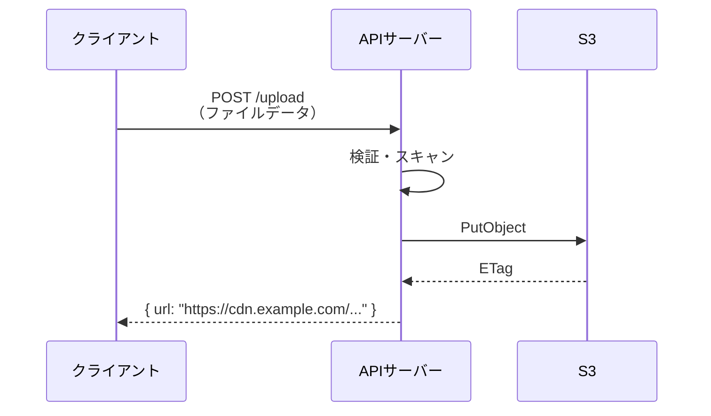

この方式のデメリットは、**ファイルデータが一度アプリケーションサーバーを経由する**ため、帯域幅消費と CPU/メモリ負荷がアプリケーションサーバーに集中することである。

```python
# Server-side upload to S3 (boto3)
import boto3
from botocore.exceptions import ClientError

s3_client = boto3.client("s3")

async def upload_to_s3(file_data: bytes, filename: str) -> str:
    """Upload file to S3 and return public URL."""
    bucket_name = "my-uploads-bucket"
    key = f"uploads/{uuid.uuid4().hex}/{filename}"

    try:
        s3_client.put_object(
            Bucket=bucket_name,
            Key=key,
            Body=file_data,
            ContentType=detect_file_type(file_data),
            # Set server-side encryption
            ServerSideEncryption="AES256",
        )
    except ClientError as e:
        raise StorageError(f"Failed to upload to S3: {e}")

    return f"https://{bucket_name}.s3.amazonaws.com/{key}"
```

### 5.3 Presigned URL を使ったダイレクトアップロード

大容量ファイルのアップロードでは、アプリケーションサーバーを経由せずクライアントが **S3 や GCS に直接アップロードする**方式が推奨される。これを実現するのが **Presigned URL**（署名付き URL）である。

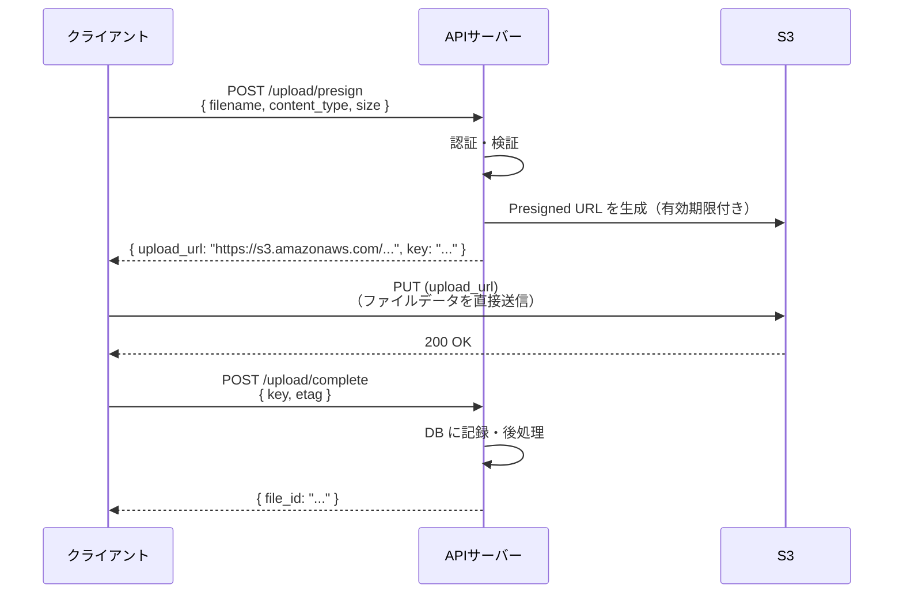

この方式の利点は以下の通りである。

- **アプリケーションサーバーの負荷軽減**：ファイルデータはサーバーを通過しない
- **クライアントから S3 への直接通信**：ラウンドトリップが減り、転送速度が向上する
- **サーバーのスケーラビリティ向上**：小さなメタデータリクエストのみを処理すればよい

```python
# Generate presigned URL for direct upload to S3
def generate_presigned_upload_url(
    filename: str,
    content_type: str,
    max_size: int,
    expires_in: int = 3600,
) -> dict:
    """
    Generate a presigned URL for direct client-to-S3 upload.
    Returns upload URL and the object key.
    """
    bucket_name = "my-uploads-bucket"
    key = f"uploads/{uuid.uuid4().hex}/{sanitize_filename(filename)}"

    # Generate presigned PUT URL
    presigned_url = s3_client.generate_presigned_url(
        ClientMethod="put_object",
        Params={
            "Bucket": bucket_name,
            "Key": key,
            "ContentType": content_type,
        },
        ExpiresIn=expires_in,
    )

    return {
        "upload_url": presigned_url,
        "key": key,
        "expires_in": expires_in,
    }
```

```javascript
// Client-side direct upload using presigned URL
async function uploadWithPresignedUrl(file) {
    // Step 1: Get presigned URL from API server
    const response = await fetch("/api/upload/presign", {
        method: "POST",
        headers: { "Content-Type": "application/json" },
        body: JSON.stringify({
            filename: file.name,
            content_type: file.type,
            size: file.size,
        }),
    });
    const { upload_url, key } = await response.json();

    // Step 2: Upload directly to S3
    const uploadResponse = await fetch(upload_url, {
        method: "PUT",
        headers: { "Content-Type": file.type },
        body: file,
    });

    if (!uploadResponse.ok) {
        throw new Error("Upload to S3 failed");
    }

    // Step 3: Notify API server of completion
    await fetch("/api/upload/complete", {
        method: "POST",
        headers: { "Content-Type": "application/json" },
        body: JSON.stringify({ key }),
    });
}
```

### 5.4 Presigned URL の CORS 設定

Presigned URL を使ったブラウザからのダイレクトアップロードには、S3 バケットへの CORS 設定が必要である。

```json
{
    "CORSRules": [
        {
            "AllowedOrigins": ["https://www.example.com"],
            "AllowedMethods": ["PUT"],
            "AllowedHeaders": ["Content-Type", "Content-Length"],
            "ExposeHeaders": ["ETag"],
            "MaxAgeSeconds": 3000
        }
    ]
}
```

::: warning
CORS の `AllowedOrigins` に `*`（ワイルドカード）を設定すると、任意のサイトから S3 バケットに PUT リクエストを送れてしまう。たとえ Presigned URL がなければ成功しないとしても、セキュリティ上の原則として許可するオリジンは必要最小限に絞ること。
:::

### 5.5 GCS の署名付き URL

Google Cloud Storage でも同様の Presigned URL 機能が提供されている。

```python
from google.cloud import storage
from datetime import timedelta

def generate_gcs_signed_url(bucket_name: str, blob_name: str) -> str:
    """Generate a signed URL for direct upload to GCS."""
    storage_client = storage.Client()
    bucket = storage_client.bucket(bucket_name)
    blob = bucket.blob(blob_name)

    url = blob.generate_signed_url(
        version="v4",
        expiration=timedelta(hours=1),
        method="PUT",
        content_type="application/octet-stream",
    )
    return url
```

## 6. S3 マルチパートアップロード

### 6.1 S3 マルチパートアップロードの仕組み

S3 への大容量ファイルのアップロードには、S3 が提供するネイティブのマルチパートアップロード機能を使うのが最適である。ファイルを複数のパートに分割し、並列にアップロードして最後に S3 側で結合する。

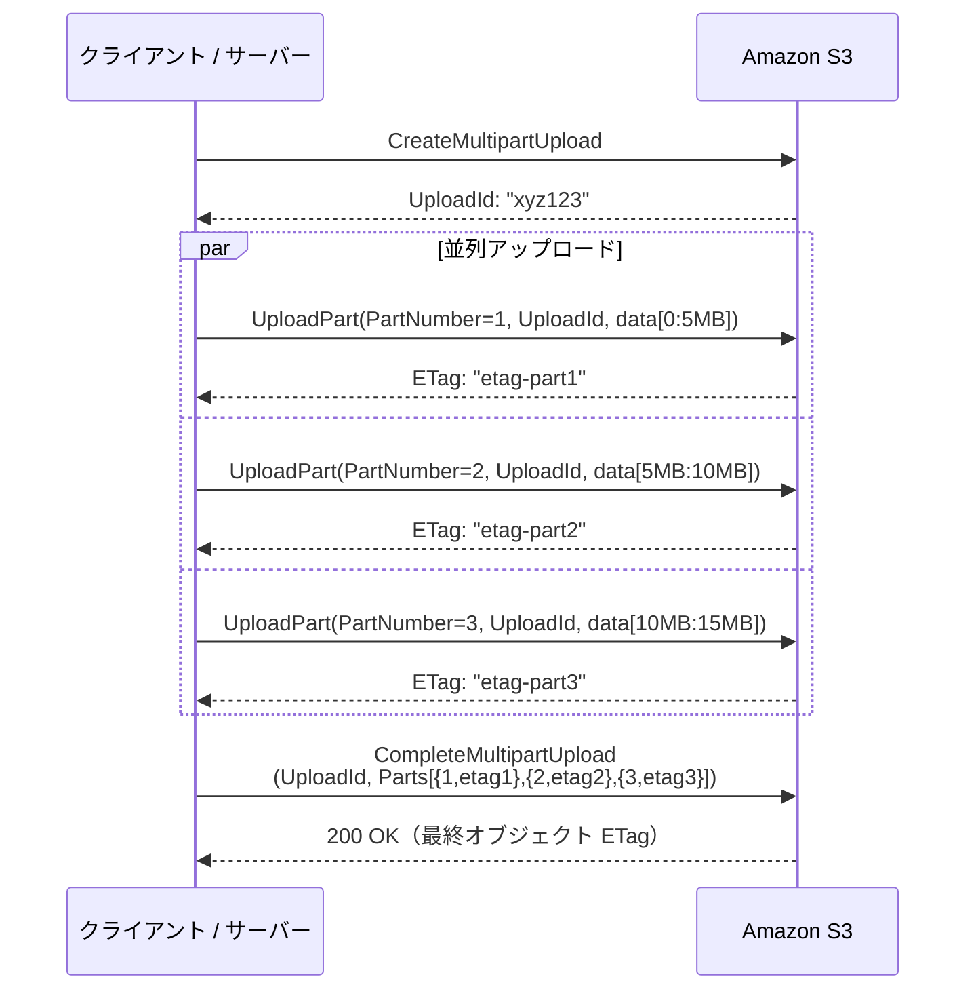

重要な制約事項を以下に示す。

| 項目 | 制約 |
|------|------|
| 最小パートサイズ | 5MB（最終パートを除く） |
| 最大パートサイズ | 5GB |
| 最大パート数 | 10,000 |
| 最大オブジェクトサイズ | 5TB |
| 推奨開始サイズ | 100MB 以上のファイルで使用 |

### 6.2 boto3 を使った実装例

```python
import boto3
from math import ceil
import threading

def multipart_upload_to_s3(
    file_path: str,
    bucket: str,
    key: str,
    part_size: int = 5 * 1024 * 1024,  # 5MB per part
    max_workers: int = 4,
) -> str:
    """
    Upload a large file to S3 using multipart upload.
    Returns the ETag of the completed object.
    """
    s3 = boto3.client("s3")

    # Initialize multipart upload
    response = s3.create_multipart_upload(
        Bucket=bucket,
        Key=key,
        ServerSideEncryption="AES256",
    )
    upload_id = response["UploadId"]

    parts = []
    part_number = 1

    try:
        with open(file_path, "rb") as f:
            while True:
                data = f.read(part_size)
                if not data:
                    break

                # Upload part
                part_response = s3.upload_part(
                    Bucket=bucket,
                    Key=key,
                    UploadId=upload_id,
                    PartNumber=part_number,
                    Body=data,
                )
                parts.append({
                    "PartNumber": part_number,
                    "ETag": part_response["ETag"],
                })
                part_number += 1

        # Complete the upload
        result = s3.complete_multipart_upload(
            Bucket=bucket,
            Key=key,
            UploadId=upload_id,
            MultipartUpload={"Parts": parts},
        )
        return result["ETag"]

    except Exception as e:
        # Abort on failure to avoid incomplete upload charges
        s3.abort_multipart_upload(
            Bucket=bucket,
            Key=key,
            UploadId=upload_id,
        )
        raise
```

### 6.3 PresignedURL を使ったクライアント直接マルチパートアップロード

サーバーを介さずクライアントが直接 S3 マルチパートアップロードを行う構成も可能である。Presigned URL を各パートごとに発行することで実現する。

```python
# Server: generate presigned URLs for each part
def initiate_multipart_upload(filename: str, total_parts: int) -> dict:
    """
    Initiate S3 multipart upload and return presigned URLs for each part.
    """
    bucket = "my-uploads-bucket"
    key = f"uploads/{uuid.uuid4().hex}/{sanitize_filename(filename)}"

    # Start multipart upload
    mpu = s3_client.create_multipart_upload(Bucket=bucket, Key=key)
    upload_id = mpu["UploadId"]

    # Generate presigned URL for each part
    presigned_urls = []
    for part_number in range(1, total_parts + 1):
        url = s3_client.generate_presigned_url(
            "upload_part",
            Params={
                "Bucket": bucket,
                "Key": key,
                "UploadId": upload_id,
                "PartNumber": part_number,
            },
            ExpiresIn=3600,
        )
        presigned_urls.append(url)

    return {
        "upload_id": upload_id,
        "key": key,
        "presigned_urls": presigned_urls,
    }
```

## 7. 進捗表示とリトライの UI 設計

### 7.1 アップロード進捗の実装パターン

ユーザーに進捗を正確に伝えることは UX において非常に重要である。進捗の計算方法にはいくつかのレベルがある。

**レベル 1：単純バイト進捗**

最も基本的な実装で、送信済みバイト数をもとに算出する。

```javascript
// Using XMLHttpRequest for progress tracking
function uploadWithProgress(file, url) {
    return new Promise((resolve, reject) => {
        const xhr = new XMLHttpRequest();

        xhr.upload.addEventListener("progress", (event) => {
            if (event.lengthComputable) {
                const progress = (event.loaded / event.total) * 100;
                updateProgressBar(progress);

                // Calculate upload speed
                const elapsed = (Date.now() - startTime) / 1000;
                const speed = event.loaded / elapsed; // bytes/sec
                const remaining = (event.total - event.loaded) / speed;
                updateSpeedDisplay(speed, remaining);
            }
        });

        xhr.addEventListener("load", () => resolve(xhr.response));
        xhr.addEventListener("error", () => reject(new Error("Upload failed")));

        xhr.open("PUT", url);
        xhr.setRequestHeader("Content-Type", file.type);
        xhr.send(file);
    });
}
```

**レベル 2：チャンク単位の進捗**

複数チャンクを送信する場合、チャンク完了ごとに進捗を更新する。

```javascript
class ChunkedUploadManager {
    constructor(file, chunkSize = 5 * 1024 * 1024) {
        this.file = file;
        this.chunkSize = chunkSize;
        this.totalChunks = Math.ceil(file.size / chunkSize);
        this.completedChunks = 0;
        this.onProgress = null; // callback
    }

    async upload(uploadId) {
        const chunks = this.createChunks();

        for (const chunk of chunks) {
            await this.uploadChunk(uploadId, chunk);
            this.completedChunks++;

            if (this.onProgress) {
                this.onProgress({
                    completedChunks: this.completedChunks,
                    totalChunks: this.totalChunks,
                    percentage: (this.completedChunks / this.totalChunks) * 100,
                });
            }
        }
    }

    createChunks() {
        const chunks = [];
        for (let i = 0; i < this.totalChunks; i++) {
            const start = i * this.chunkSize;
            const end = Math.min(start + this.chunkSize, this.file.size);
            chunks.push({
                index: i,
                data: this.file.slice(start, end),
                start,
                end,
            });
        }
        return chunks;
    }
}
```

### 7.2 リトライ戦略

ネットワーク障害やサーバーエラー時のリトライ設計はユーザー体験に直結する。

**指数バックオフ（Exponential Backoff）**

ネットワーク輻輳を避けるために、リトライ間隔を指数的に延ばしながら再試行する。

```javascript
async function uploadChunkWithRetry(
    uploadId,
    chunkIndex,
    chunkData,
    maxRetries = 3,
) {
    const baseDelay = 1000; // 1 second

    for (let attempt = 0; attempt <= maxRetries; attempt++) {
        try {
            const response = await fetch(`/upload/${uploadId}/chunk/${chunkIndex}`, {
                method: "PUT",
                body: chunkData,
                headers: { "Content-Type": "application/octet-stream" },
                // Set a reasonable timeout per chunk
                signal: AbortSignal.timeout(30000),
            });

            if (!response.ok) {
                // Only retry on 5xx errors, not 4xx
                if (response.status >= 400 && response.status < 500) {
                    throw new Error(`Client error ${response.status}: not retrying`);
                }
                throw new Error(`Server error ${response.status}`);
            }

            return await response.json();
        } catch (error) {
            if (attempt === maxRetries) {
                throw error; // Give up after max retries
            }

            // Exponential backoff with jitter
            const delay = baseDelay * Math.pow(2, attempt) + Math.random() * 1000;
            console.warn(`Chunk ${chunkIndex} failed, retrying in ${delay}ms...`);
            await new Promise((resolve) => setTimeout(resolve, delay));
        }
    }
}
```

### 7.3 ネットワーク状態の検知と自動一時停止

オンライン・オフラインの状態を検知して、自動的にアップロードを一時停止・再開する機能も重要な UX 要素である。

```javascript
class ResumableUploadManager {
    constructor() {
        this.isPaused = false;
        this.uploadQueue = [];

        // Detect online/offline state
        window.addEventListener("offline", () => {
            console.log("Network offline - pausing upload");
            this.pause();
        });

        window.addEventListener("online", () => {
            console.log("Network restored - resuming upload");
            this.resume();
        });
    }

    pause() {
        this.isPaused = true;
        // Notify user
        showNotification("ネットワークが切断されました。再接続後、自動的に再開します。");
    }

    async resume() {
        this.isPaused = false;
        hideNotification();

        // Check server for actual received offset
        const serverOffset = await this.checkServerOffset();

        // Resume from where server left off
        await this.uploadFromOffset(serverOffset);
    }

    async checkServerOffset() {
        const response = await fetch(`/upload/${this.uploadId}`, {
            method: "HEAD",
        });
        return parseInt(response.headers.get("Upload-Offset") || "0");
    }
}
```

### 7.4 UI コンポーネントの設計

適切な進捗 UI はユーザーに現在の状態を明確に伝える。以下に一般的な状態遷移を示す。

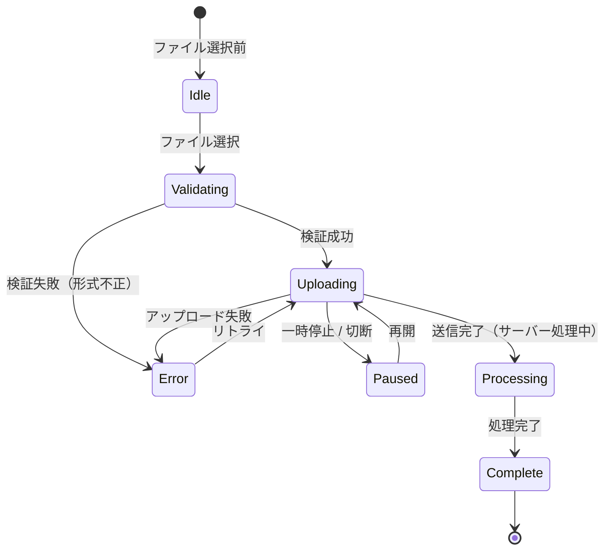

各状態でユーザーに表示すべき情報を以下に示す。

| 状態 | 表示内容 |
|------|---------|
| Idle | ファイル選択ボタン、ドラッグ&ドロップエリア |
| Validating | 「検証中...」スピナー |
| Uploading | プログレスバー、送信速度、残り時間、一時停止ボタン |
| Paused | 「接続が切断されました」メッセージ、再開ボタン |
| Processing | 「サーバーで処理中...」スピナー |
| Complete | 「アップロード完了」、ファイルへのリンク |
| Error | エラーメッセージ、リトライボタン |

## 8. 大規模システムにおける設計上の考慮事項

### 8.1 一時ファイルとストレージの分離

アップロードされたファイルは、検証・スキャン前と後でストレージを分けることが推奨される。

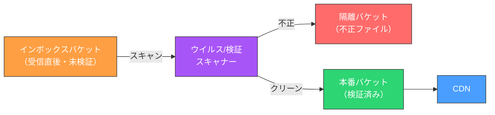

このパターンでは以下の利点がある。

- ユーザーがアップロードした不正なファイルが本番 URL に乗ることがない
- 隔離されたファイルを安全に分析できる
- インボックスバケットには CDN を設定しないため、スキャン前のファイルへのアクセスを制限できる

### 8.2 ファイルの重複排除（デデュープ）

同一ファイルが複数回アップロードされることを検知して、ストレージコストを削減するデデュープ（重複排除）が有効なケースがある。

```python
import hashlib

def compute_file_hash(file_data: bytes) -> str:
    """Compute SHA-256 hash of file content."""
    return hashlib.sha256(file_data).hexdigest()

def upload_with_dedup(file_data: bytes, filename: str) -> str:
    """
    Upload file with deduplication.
    If same content already exists, returns existing URL without re-uploading.
    """
    content_hash = compute_file_hash(file_data)

    # Check if this hash already exists in the database
    existing = db.query(
        "SELECT storage_key FROM files WHERE content_hash = %s",
        (content_hash,)
    ).fetchone()

    if existing:
        # Same content already stored — return existing URL
        return get_file_url(existing["storage_key"])

    # New file — upload to storage
    key = f"uploads/{content_hash[:2]}/{content_hash}/{sanitize_filename(filename)}"
    upload_to_s3(file_data, key)

    # Record in database
    db.execute(
        "INSERT INTO files (content_hash, storage_key, filename) VALUES (%s, %s, %s)",
        (content_hash, key, filename)
    )

    return get_file_url(key)
```

::: tip
デデュープはバックアップシステムや共有ストレージなどコンテンツの重複が多いユースケースで特に効果を発揮する。ただし、ファイルの読み込みとハッシュ計算のコストが発生するため、小さなファイルや重複が少ないシステムではオーバーヘッドになることもある。
:::

### 8.3 アップロードレート制限

悪意のあるユーザーや誤動作したクライアントが大量のファイルをアップロードし続けてシステムを圧迫することを防ぐため、レート制限を実装する。

```python
import redis
from functools import wraps

def rate_limit_upload(max_uploads_per_hour: int = 100, max_bytes_per_hour: int = 1024 * 1024 * 1024):
    """
    Decorator to rate limit file uploads per user.
    Limits both upload count and total bytes uploaded.
    """
    def decorator(func):
        @wraps(func)
        async def wrapper(request, *args, **kwargs):
            user_id = request.user.id
            hour_key = f"upload_ratelimit:{user_id}:{datetime.utcnow().strftime('%Y%m%d%H')}"

            # Check current upload count
            current_count = int(redis_client.hget(hour_key, "count") or 0)
            current_bytes = int(redis_client.hget(hour_key, "bytes") or 0)

            file_size = int(request.headers.get("Content-Length", 0))

            if current_count >= max_uploads_per_hour:
                raise RateLimitError("Upload count limit exceeded")

            if current_bytes + file_size > max_bytes_per_hour:
                raise RateLimitError("Upload size limit exceeded")

            result = await func(request, *args, **kwargs)

            # Increment counters
            pipe = redis_client.pipeline()
            pipe.hincrby(hour_key, "count", 1)
            pipe.hincrby(hour_key, "bytes", file_size)
            pipe.expire(hour_key, 7200)  # TTL 2 hours
            pipe.execute()

            return result
        return wrapper
    return decorator
```

### 8.4 ファイルアクセス制御と署名付き読み取り URL

アップロードされたファイルを非公開にして、アクセス権のあるユーザーにのみ読み取りを許可する場合、読み取り用の Presigned URL を使う。

```python
def generate_download_url(file_key: str, user_id: str, expires_in: int = 3600) -> str:
    """
    Generate a time-limited presigned URL for downloading a file.
    Caller must verify user has access before calling this function.
    """
    # Verify user has access to this file
    file_record = db.get_file(file_key)
    if not has_access(user_id, file_record):
        raise PermissionError("Access denied")

    # Generate time-limited download URL
    url = s3_client.generate_presigned_url(
        "get_object",
        Params={
            "Bucket": PRIVATE_BUCKET,
            "Key": file_key,
            # Optionally force download with filename
            "ResponseContentDisposition": f'attachment; filename="{file_record.original_name}"',
        },
        ExpiresIn=expires_in,
    )
    return url
```

## 9. アーキテクチャ全体像

以下に、エンタープライズグレードのファイルアップロードシステムの全体アーキテクチャを示す。

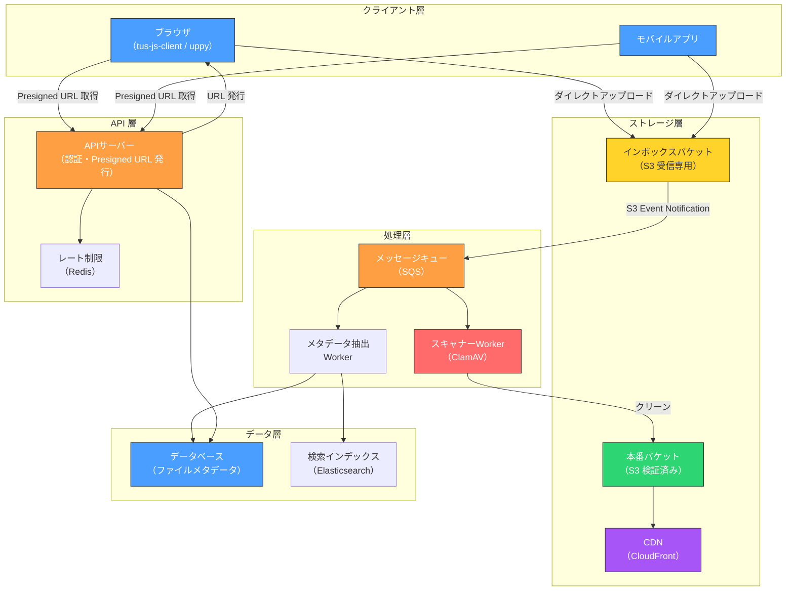

このアーキテクチャは以下の原則に基づいている。

1. **APIサーバーはファイルデータを通過させない**：Presigned URL による直接アップロードで、API サーバーの帯域幅消費を最小化
2. **インボックスと本番ストレージを分離**：スキャン前のファイルは絶対に本番 URL で公開しない
3. **非同期スキャン**：ウイルススキャンをキュー経由で非同期処理し、アップロード完了のレイテンシに影響させない
4. **レート制限**：悪意のある利用によるリソース枯渇を防ぐ

## まとめ

ファイルアップロードの設計は、HTTP の基礎知識からセキュリティ、クラウドストレージの活用、UX 設計まで、多くのレイヤーを横断する総合的な課題である。本記事で解説したポイントを整理する。

**HTTP と基礎設計**
- `multipart/form-data` はフォームとの共存に適し、`application/octet-stream` は純粋な API に適する
- リバースプロキシとアプリケーションサーバーの両方でサイズ制限を一致させる

**チャンク分割と Resumable Upload**
- 大容量ファイルは必ずチャンク分割し、途中再開を可能にする
- TUS プロトコルは標準化された Resumable Upload の実装として有力な選択肢である
- Google Resumable Upload も業界で広く採用されている実績ある方式である

**セキュリティ**
- Content-Type ヘッダを信用せず、マジックバイトでファイル形式を判定する
- ユーザー指定のファイル名を直接ストレージパスに使わない
- ウイルススキャンを必ず実施する（同期か非同期かはレイテンシ要件による）
- Zip Bomb などの圧縮爆弾に注意する

**ストレージ設計**
- Presigned URL を使ったダイレクトアップロードでアプリケーションサーバーの負荷を軽減する
- インボックスバケットと本番バケットを分離することでセキュリティを強化する
- 大容量ファイルには S3 マルチパートアップロードを使う

**UX 設計**
- 進捗表示、転送速度、残り時間を表示する
- 指数バックオフでリトライを実装する
- ネットワーク切断を検知して自動一時停止・再開する
- アップロード状態を状態機械として明確に管理する

ファイルアップロードは「動けば良い」で実装すると、後になってスケーラビリティやセキュリティの問題が顕在化しがちな機能である。設計段階からこれらの考慮事項を組み込むことで、堅牢で拡張性の高いシステムを構築できる。
