# 有限オートマトンと正規言語 — 計算の最も基本的なモデル

## 1. 背景と動機：なぜ有限オートマトンを学ぶのか

コンピュータサイエンスにおいて、**有限オートマトン（Finite Automaton, FA）**は最も単純かつ最も基本的な計算モデルである。有限個の状態と状態間の遷移規則だけで構成されるこの抽象機械は、一見すると素朴すぎるように思えるかもしれない。しかし、その理論的な美しさと実用的な応用範囲の広さは、コンピュータサイエンスの他のどの概念にも劣らない。

### 1.1 歴史的背景

有限オートマトンの起源は1940年代から1950年代にさかのぼる。1943年、神経科学者の Warren McCulloch と論理学者の Walter Pitts は、神経回路のモデルとして有限状態の抽象機械を提案した。1956年には、Stephen Kleene が正規表現（regular expression）と有限オートマトンの等価性を証明し、Michael Rabin と Dana Scott は1959年の画期的な論文 *"Finite Automata and Their Decision Problems"* で非決定性有限オートマトン（NFA）の概念を導入した。この論文は後に Rabin と Scott に1976年のチューリング賞をもたらした。

### 1.2 計算の階層における位置づけ

有限オートマトンは、**Chomsky 階層（Chomsky hierarchy）**における最も制約の強い計算モデルに対応する。Chomsky 階層は形式言語を4つのクラスに分類する。

| 型 | 言語クラス | 計算モデル | 文法の制約 |
|---|---|---|---|
| Type 0 | 帰納的可算言語 | チューリングマシン | 制約なし |
| Type 1 | 文脈依存言語 | 線形有界オートマトン | $\alpha A \beta \to \alpha \gamma \beta$ |
| Type 2 | 文脈自由言語 | プッシュダウンオートマトン | $A \to \gamma$ |
| Type 3 | 正規言語 | 有限オートマトン | $A \to aB$ または $A \to a$ |

有限オートマトンは Type 3（正規言語）を受理する機械であり、メモリを持たない（有限個の状態のみで情報を記憶する）という根本的な制約がある。この制約こそが、有限オートマトンの解析を容易にし、多くの決定問題を効率的に解けるようにしている。

### 1.3 理論と実用の交差点

有限オートマトンが特に重要なのは、理論と実用が密接に結びついている点である。

- **字句解析器（Lexer）**：プログラミング言語のコンパイラは、ソースコードをトークンに分割するために有限オートマトンを使用する
- **正規表現エンジン**：`grep`、`sed`、テキストエディタの検索機能など、パターンマッチングの基盤技術である
- **プロトコル検証**：通信プロトコルの状態遷移を有限オートマトンとしてモデル化し、デッドロックや到達不能状態を検出する
- **ハードウェア設計**：デジタル回路の順序回路は本質的に有限オートマトンである

::: tip 有限オートマトンの本質
有限オートマトンとは、**有限個の状態と状態遷移規則だけで計算を行う抽象機械**である。入力を1文字ずつ左から右に読み、現在の状態と読んだ文字に基づいて次の状態に遷移する。入力を全部読み終えたとき、受理状態にいれば「受理」、そうでなければ「拒否」と判定する。このシンプルさゆえに、等価性判定や最小化など多くの問題が効率的に解け、実用的な応用が広がっている。
:::

## 2. 決定性有限オートマトン（DFA）

### 2.1 形式的定義

**決定性有限オートマトン（Deterministic Finite Automaton, DFA）**は、以下の5つ組 $M = (Q, \Sigma, \delta, q_0, F)$ として定義される。

- $Q$：**状態の有限集合**（finite set of states）
- $\Sigma$：**入力アルファベットの有限集合**（finite input alphabet）
- $\delta: Q \times \Sigma \to Q$：**遷移関数**（transition function）
- $q_0 \in Q$：**初期状態**（initial state）
- $F \subseteq Q$：**受理状態の集合**（set of accepting/final states）

遷移関数 $\delta$ は**全関数**である点が重要だ。つまり、任意の状態 $q \in Q$ と任意の入力記号 $a \in \Sigma$ に対して、$\delta(q, a)$ は必ず一意に定まる。これが「決定性」の意味である——現在の状態と読んだ記号が決まれば、次の状態は一つに決まる。

### 2.2 拡張遷移関数

遷移関数 $\delta$ を文字列全体に拡張した**拡張遷移関数** $\hat{\delta}: Q \times \Sigma^* \to Q$ を以下のように帰納的に定義する。

$$
\begin{aligned}
\hat{\delta}(q, \varepsilon) &= q \\
\hat{\delta}(q, wa) &= \delta(\hat{\delta}(q, w), a)
\end{aligned}
$$

ここで $\varepsilon$ は空文字列、$w \in \Sigma^*$ は文字列、$a \in \Sigma$ は単一の記号である。

DFA $M$ が**受理する言語**は次のように定義される。

$$
L(M) = \{ w \in \Sigma^* \mid \hat{\delta}(q_0, w) \in F \}
$$

### 2.3 具体例：偶数個の 0 を含む文字列

アルファベット $\Sigma = \{0, 1\}$ 上で、0 の出現回数が偶数である文字列を受理する DFA を考えよう。

$M = (Q, \Sigma, \delta, q_0, F)$ は以下のように定義される。

- $Q = \{q_{\text{even}}, q_{\text{odd}}\}$
- $\Sigma = \{0, 1\}$
- $q_0 = q_{\text{even}}$
- $F = \{q_{\text{even}}\}$
- 遷移関数 $\delta$ は以下の通り

| 状態 | 入力 0 | 入力 1 |
|---|---|---|
| $q_{\text{even}}$ | $q_{\text{odd}}$ | $q_{\text{even}}$ |
| $q_{\text{odd}}$ | $q_{\text{even}}$ | $q_{\text{odd}}$ |

この DFA を状態遷移図で表すと以下のようになる。

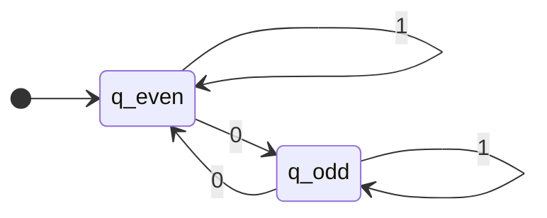

入力 `1010` に対するこの DFA の動作を追跡してみよう。

| ステップ | 読んだ記号 | 現在の状態 | 次の状態 |
|---|---|---|---|
| 0 | — | $q_{\text{even}}$ | — |
| 1 | 1 | $q_{\text{even}}$ | $q_{\text{even}}$ |
| 2 | 0 | $q_{\text{even}}$ | $q_{\text{odd}}$ |
| 3 | 1 | $q_{\text{odd}}$ | $q_{\text{odd}}$ |
| 4 | 0 | $q_{\text{odd}}$ | $q_{\text{even}}$ |

最終状態は $q_{\text{even}} \in F$ なので、`1010` は受理される。確かに 0 は2回（偶数回）出現している。

### 2.4 もう一つの例：末尾が `01` の文字列

$\Sigma = \{0, 1\}$ 上で、末尾が `01` である文字列の集合を受理する DFA を構成する。

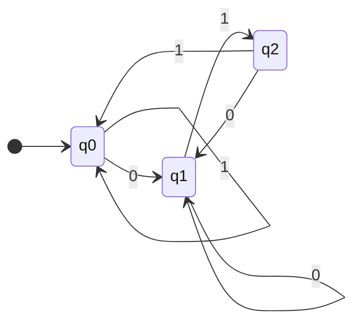

- $q_0$：初期状態。直前に読んだ文字が `01` パターンの一部ではない
- $q_1$：直前に `0` を読んだ状態
- $q_2$：直前に `01` を読んだ状態（受理状態）

## 3. 非決定性有限オートマトン（NFA）

### 3.1 非決定性の概念

DFA では、各状態と各入力記号に対して次の状態が一意に決まる。これに対して、**非決定性有限オートマトン（Nondeterministic Finite Automaton, NFA）**では、次の状態が複数存在することが許される。さらに、ある状態・入力記号の組に対して遷移先が存在しないこともある。

非決定性は直感に反するかもしれない。実際の計算機は決定的に動作するからだ。しかし、非決定性は計算理論において極めて重要な概念である。NFA は DFA よりも表現力が高いわけではない（後述の通り、受理する言語のクラスは同じである）が、特定の言語に対してはるかにコンパクトな表現が可能になる。

### 3.2 形式的定義

NFA は5つ組 $N = (Q, \Sigma, \delta, q_0, F)$ として定義される。DFA との唯一の違いは遷移関数の型である。

- $Q$：状態の有限集合
- $\Sigma$：入力アルファベットの有限集合
- $\delta: Q \times \Sigma \to \mathcal{P}(Q)$：**遷移関数**
- $q_0 \in Q$：初期状態
- $F \subseteq Q$：受理状態の集合

ここで $\mathcal{P}(Q)$ は $Q$ の**冪集合（power set）**、すなわち $Q$ のすべての部分集合の集合である。遷移関数 $\delta(q, a)$ は状態の集合を返す。これは、状態 $q$ で記号 $a$ を読んだとき、複数の状態（0個以上）に遷移できることを意味する。

NFA の拡張遷移関数は、状態の集合に対して定義される。

$$
\begin{aligned}
\hat{\delta}(q, \varepsilon) &= \{q\} \\
\hat{\delta}(q, wa) &= \bigcup_{p \in \hat{\delta}(q, w)} \delta(p, a)
\end{aligned}
$$

NFA $N$ が文字列 $w$ を**受理する**とは、$\hat{\delta}(q_0, w) \cap F \neq \emptyset$ であることをいう。つまり、可能な計算経路のうち少なくとも1つが受理状態に到達すれば、NFA はその文字列を受理する。

$$
L(N) = \{ w \in \Sigma^* \mid \hat{\delta}(q_0, w) \cap F \neq \emptyset \}
$$

### 3.3 具体例：`01` または `10` を部分文字列として含む

$\Sigma = \{0, 1\}$ 上で、部分文字列として `01` または `10` を含む文字列を受理する NFA を考える。

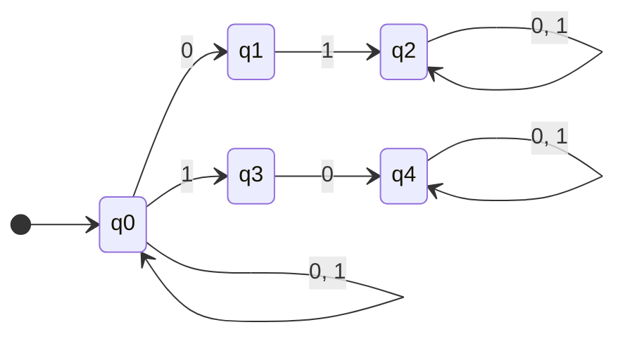

この NFA では、$q_0$ で記号 `0` を読んだとき $q_0$ にも $q_1$ にも遷移できる。これが非決定性である。NFA は「正しい選択を推測する」と考えることもできる。入力中に `01` が現れた時点で、$q_0 \to q_1 \to q_2$ という経路を「選ぶ」ことで受理に至る。

### 3.4 NFA の計算の解釈

NFA の非決定性は、いくつかの異なる方法で解釈できる。

1. **並行計算としての解釈**：NFA は同時に複数の状態に「いる」。各入力記号を読むたびに、現在いるすべての状態から可能な遷移を行い、新しい状態の集合を得る
2. **推測としての解釈**：NFA は「正しい経路を推測する」能力を持つ。受理される入力に対しては、常に正しい遷移先を選ぶ
3. **木探索としての解釈**：NFA の計算は計算木（computation tree）を形成する。入力が受理されるのは、この木に受理状態に到達する葉が少なくとも1つ存在する場合である

## 4. ε-NFA：空文字列遷移を持つ NFA

### 4.1 定義

**ε-NFA** は NFA をさらに拡張し、入力記号を読まずに状態を遷移する**ε遷移（epsilon transition）**を許す。

ε-NFA は5つ組 $(Q, \Sigma, \delta, q_0, F)$ として定義される。遷移関数の型は次のようになる。

$$
\delta: Q \times (\Sigma \cup \{\varepsilon\}) \to \mathcal{P}(Q)
$$

### 4.2 ε閉包（ε-closure）

ε-NFA の動作を理解するために、**ε閉包（ε-closure）**の概念が不可欠である。状態 $q$ の ε閉包 $\text{ECLOSE}(q)$ は、$q$ から ε遷移のみで到達可能なすべての状態の集合（$q$ 自身を含む）として定義される。

$$
\text{ECLOSE}(q) = \{q\} \cup \{p \mid q \text{ から } p \text{ へ } \varepsilon \text{ 遷移のみで到達可能}\}
$$

状態の集合 $S$ に対しては、$\text{ECLOSE}(S) = \bigcup_{q \in S} \text{ECLOSE}(q)$ と定義する。

ε-NFA の拡張遷移関数は以下のように定義される。

$$
\begin{aligned}
\hat{\delta}(q, \varepsilon) &= \text{ECLOSE}(q) \\
\hat{\delta}(q, wa) &= \text{ECLOSE}\left(\bigcup_{p \in \hat{\delta}(q, w)} \delta(p, a)\right)
\end{aligned}
$$

### 4.3 具体例：0の倍数長または1の倍数長

空文字列、0が3の倍数個からなる文字列、または1が2の倍数個からなる文字列を受理する ε-NFA を考える。

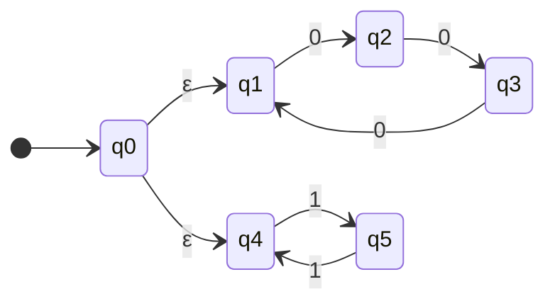

この ε-NFA は初期状態 $q_0$ から ε遷移で $q_1$（0が3の倍数個を追跡）と $q_4$（1が2の倍数個を追跡）の両方に到達できる。ε遷移により、2つの独立した条件を自然に組み合わせた構成が可能になっている。

### 4.4 ε-NFA から NFA への変換

ε-NFA は通常の NFA（ε遷移なし）に変換できる。変換の基本的な考え方は以下の通りである。

ε-NFA $E = (Q, \Sigma, \delta_E, q_0, F_E)$ から等価な NFA $N = (Q, \Sigma, \delta_N, q_0, F_N)$ を構成する。

1. **遷移関数の変換**：各状態 $q$ と各入力記号 $a$ に対して

$$
\delta_N(q, a) = \text{ECLOSE}\left(\bigcup_{p \in \text{ECLOSE}(q)} \delta_E(p, a)\right)
$$

2. **受理状態の変換**：$F_N = \{q \in Q \mid \text{ECLOSE}(q) \cap F_E \neq \emptyset\}$

つまり、ε遷移で受理状態に到達できる状態も受理状態に加える。

この変換により、DFA、NFA、ε-NFA の3つのモデルは、受理する言語のクラスにおいて等価であることがわかる。

## 5. DFA と NFA の等価性：部分集合構成法

### 5.1 定理

**定理（Rabin-Scott, 1959）**：任意の NFA $N$ に対して、$L(M) = L(N)$ を満たす DFA $M$ が存在する。

この定理は、非決定性が有限オートマトンの計算能力を本質的には増大させないことを意味する。NFA が受理できる言語はすべて DFA でも受理でき、逆もまた然りである（DFA は NFA の特殊な場合であるため、DFA が受理する言語は当然 NFA でも受理できる）。

### 5.2 部分集合構成法（Subset Construction）

この定理の証明は**部分集合構成法（subset construction）**と呼ばれるアルゴリズムによる。NFA の「同時に複数の状態にいる」という動作を、DFA の一つの状態として表現するのがその核心的なアイデアである。

NFA $N = (Q_N, \Sigma, \delta_N, q_0, F_N)$ から DFA $M = (Q_M, \Sigma, \delta_M, s_0, F_M)$ を以下のように構成する。

1. $Q_M = \mathcal{P}(Q_N)$：DFA の各状態は NFA の状態の部分集合
2. $s_0 = \{q_0\}$：DFA の初期状態は NFA の初期状態のみを含む集合（ε-NFA の場合は $\text{ECLOSE}(q_0)$）
3. $\delta_M(S, a) = \bigcup_{q \in S} \delta_N(q, a)$：NFA の状態集合 $S$ に属するすべての状態から記号 $a$ で遷移可能な状態の和集合
4. $F_M = \{S \in Q_M \mid S \cap F_N \neq \emptyset\}$：NFA の受理状態を1つでも含む集合は DFA の受理状態

### 5.3 部分集合構成法の実行例

以下の NFA を DFA に変換する具体例を示す。末尾が `01` である文字列を受理する NFA を考える。

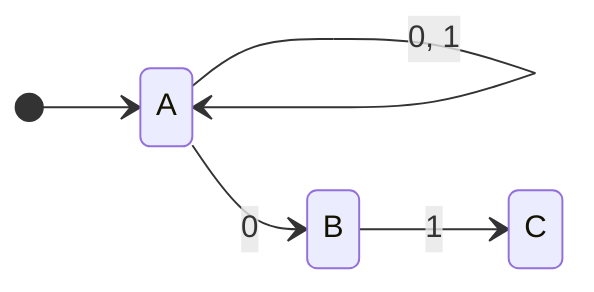

部分集合構成法を適用する。到達可能な部分集合のみを構成する。

**初期状態**：$\{A\}$

**遷移の計算**：

| NFA 状態集合 | 入力 0 | 入力 1 |
|---|---|---|
| $\{A\}$ | $\{A, B\}$ | $\{A\}$ |
| $\{A, B\}$ | $\{A, B\}$ | $\{A, C\}$ |
| $\{A, C\}$ | $\{A, B\}$ | $\{A\}$ |

$C \in F_N$ なので、$\{A, C\}$ は受理状態である。

```mermaid
stateDiagram-v2
    direction LR
    [*] --> "{A}"
    "{A}" --> "{A,B}": 0
    "{A}" --> "{A}": 1
    "{A,B}" --> "{A,B}": 0
    "{A,B}" --> "{A,C}": 1
    "{A,C}" --> "{A,B}": 0
    "{A,C}" --> "{A}": 1
    "{A,C}":::accepting
    classDef accepting stroke-width:4px
```

### 5.4 状態数の爆発

部分集合構成法は理論的に正しいが、実用上の重要な問題がある。NFA が $n$ 個の状態を持つとき、構成される DFA は最大 $2^n$ 個の状態を持ちうる。

この指数的爆発は最悪の場合に実際に起こる。典型的な例として、$\Sigma = \{0, 1\}$ 上で「末尾から $n$ 番目の記号が 0 である」文字列を受理する NFA は $n + 1$ 個の状態で構成できるが、等価な DFA には少なくとも $2^n$ 個の状態が必要である。

::: warning 状態数の指数的爆発
NFA から DFA への変換では、$n$ 状態の NFA に対して最大 $2^n$ 状態の DFA が生成される。これは最悪の場合の理論的な上界であるが、実際にこの上界に達する NFA のファミリーが知られている。実用的には、到達可能な状態のみを構成する「遅延構成（lazy construction）」によって、この問題を緩和できる場合が多い。
:::

## 6. 正規言語との対応

### 6.1 正規言語の定義

以下の条件のいずれかを満たす言語を**正規言語（regular language）**という。

1. ある DFA が受理する言語である
2. ある NFA が受理する言語である
3. ある正規表現が表す言語である
4. ある正規文法（Type 3 文法）が生成する言語である

DFA と NFA の等価性（前節）により、条件1と条件2は同値である。以下では、正規表現と有限オートマトンの対応を見ていく。

### 6.2 正規表現の形式的定義

アルファベット $\Sigma$ 上の**正規表現（regular expression）**は、以下の規則で帰納的に定義される。

**基底（Base cases）**：
- $\emptyset$ は正規表現であり、空言語 $\emptyset$ を表す
- $\varepsilon$ は正規表現であり、空文字列のみからなる言語 $\{\varepsilon\}$ を表す
- 任意の $a \in \Sigma$ に対して、$a$ は正規表現であり、言語 $\{a\}$ を表す

**帰納（Inductive cases）**：$R_1$ と $R_2$ が正規表現であるとき、
- $R_1 + R_2$（和集合/選択）は正規表現であり、$L(R_1) \cup L(R_2)$ を表す
- $R_1 \cdot R_2$（連接）は正規表現であり、$L(R_1) \cdot L(R_2) = \{xy \mid x \in L(R_1), y \in L(R_2)\}$ を表す
- $R_1^*$（Kleene閉包）は正規表現であり、$L(R_1)^* = \bigcup_{i=0}^{\infty} L(R_1)^i$ を表す

### 6.3 Kleene の定理

**定理（Kleene, 1956）**：言語 $L$ が正規言語であることと、$L$ を表す正規表現が存在することは同値である。

この定理は2つの方向の証明を必要とする。

1. **正規表現 → NFA**（任意の正規表現に対して等価な NFA を構成できる）
2. **DFA → 正規表現**（任意の DFA に対して等価な正規表現を構成できる）

方向1は次節の Thompson 構成法で、方向2は状態除去法（state elimination）などのアルゴリズムで実現される。

## 7. 正規表現から NFA への変換：Thompson 構成法

### 7.1 概要

**Thompson 構成法（Thompson's construction）**は、Ken Thompson が1968年に提案したアルゴリズムで、正規表現から等価な ε-NFA を再帰的に構成する。構成される ε-NFA は以下の性質を持つ。

- 受理状態は1つだけ
- 初期状態に入る遷移はない
- 受理状態から出る遷移はない
- 各状態から出る遷移は最大2つ（ε遷移が最大2つ、または特定の記号による遷移が1つ）

### 7.2 基本構成

正規表現の基本要素に対する ε-NFA の構成は以下の通りである。

**空文字列 $\varepsilon$**：

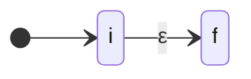

**単一記号 $a$**：

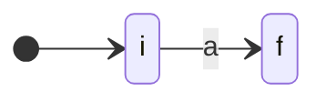

### 7.3 帰納的構成

正規表現 $R_1$ に対応する ε-NFA を $N_1$（初期状態 $i_1$、受理状態 $f_1$）、$R_2$ に対応する ε-NFA を $N_2$（初期状態 $i_2$、受理状態 $f_2$）とする。

**和集合 $R_1 + R_2$**：

新しい初期状態 $i$ と受理状態 $f$ を追加し、ε遷移で $N_1$ と $N_2$ を並列に接続する。

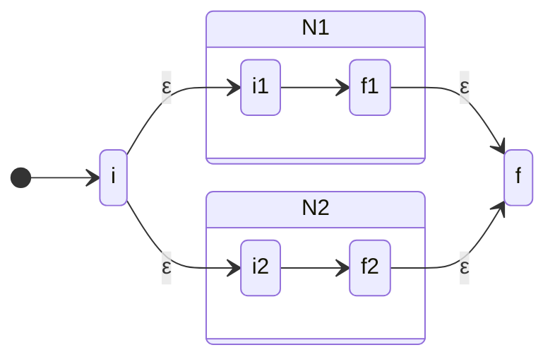

**連接 $R_1 \cdot R_2$**：

$N_1$ の受理状態 $f_1$ と $N_2$ の初期状態 $i_2$ を ε遷移で接続する。

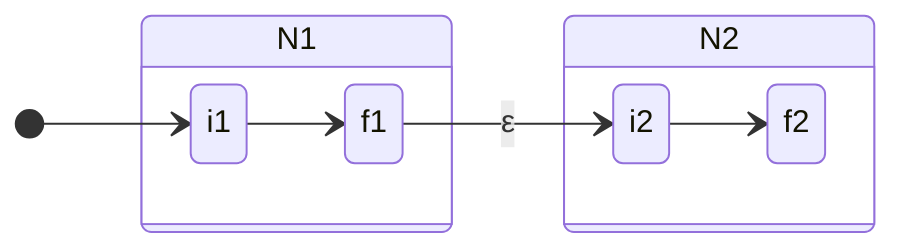

**Kleene閉包 $R_1^*$**：

新しい初期状態 $i$ と受理状態 $f$ を追加し、繰り返しのためのフィードバックループを作る。

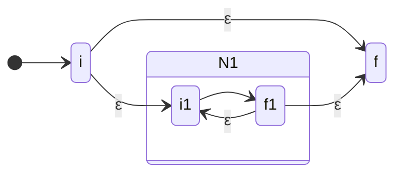

### 7.4 Thompson 構成法の計算量

正規表現の長さを $m$ とすると、Thompson 構成法が生成する ε-NFA は以下の性質を持つ。

- 状態数：最大 $2m$ 個
- 遷移数：最大 $4m$ 個
- 構成の時間計算量：$O(m)$

この線形性は、正規表現エンジンの実装において非常に重要な性質である。

## 8. DFA の最小化

### 8.1 等価な状態の概念

DFA には冗長な状態が含まれることがある。2つの状態が本質的に同じ振る舞いをする場合、それらを統合してより小さな DFA を構成できる。

DFA $M = (Q, \Sigma, \delta, q_0, F)$ の2つの状態 $p, q \in Q$ が**区別不可能（indistinguishable）**であるとは、任意の文字列 $w \in \Sigma^*$ に対して以下が成り立つことをいう。

$$
\hat{\delta}(p, w) \in F \iff \hat{\delta}(q, w) \in F
$$

つまり、$p$ から出発しても $q$ から出発しても、同じ文字列に対して受理・拒否の判定が一致する。

2つの状態が**区別可能（distinguishable）**であるとは、ある文字列 $w$ が存在して $\hat{\delta}(p, w) \in F$ かつ $\hat{\delta}(q, w) \notin F$（またはその逆）が成り立つことをいう。

### 8.2 Myhill-Nerode 定理

**定理（Myhill-Nerode, 1957/1958）**：言語 $L \subseteq \Sigma^*$ に対して、以下の3つの条件は同値である。

1. $L$ は正規言語である
2. $L$ を受理する DFA が存在する
3. $\Sigma^*$ 上の同値関係 $\equiv_L$（Myhill-Nerode 同値関係）の同値類の数が有限である

ここで、Myhill-Nerode 同値関係 $\equiv_L$ は次のように定義される。

$$
x \equiv_L y \iff \forall z \in \Sigma^*: (xz \in L \iff yz \in L)
$$

つまり、文字列 $x$ と $y$ が同値であるとは、どんな接尾辞 $z$ を付けても、$L$ に属するか否かの判定が一致することをいう。

Myhill-Nerode 定理の重要な帰結は、**$L$ を受理する最小 DFA は同値関係 $\equiv_L$ の同値類に対応し、同型を除いて一意に存在する**ということである。最小 DFA の状態数は $\equiv_L$ の同値類の数と一致する。

### 8.3 Hopcroft のアルゴリズム

DFA の最小化を効率的に行うアルゴリズムとして、**Hopcroft のアルゴリズム（1971年）**が広く知られている。このアルゴリズムは、区別可能な状態のペアを反復的に見つけることで、状態の分割を洗練（refine）していく。

**アルゴリズムの概要**：

1. 初期分割として $\{F, Q \setminus F\}$ を設定する（受理状態と非受理状態の2グループ）
2. 分割が安定するまで以下を繰り返す
   - あるグループ $A$ と入力記号 $a$ を選ぶ
   - 各グループ $G$ について、$a$ を読んだとき $A$ に遷移する状態とそうでない状態に $G$ を分割する
3. 分割が安定したら、各グループを新しい DFA の状態とする

```
function HopcroftMinimize(DFA M = (Q, Σ, δ, q₀, F)):
    // Initial partition
    P = {F, Q \ F}
    // Worklist of (group, symbol) pairs to process
    W = {(F, a) | a ∈ Σ}  // or {(Q\F, a) | a ∈ Σ}, whichever is smaller

    while W is not empty:
        remove some (A, a) from W
        for each group G in P:
            // Split G based on transitions on 'a' into A
            G₁ = {q ∈ G | δ(q, a) ∈ A}
            G₂ = G \ G₁
            if G₁ ≠ ∅ and G₂ ≠ ∅:
                replace G in P with G₁ and G₂
                for each symbol c in Σ:
                    if (G, c) ∈ W:
                        replace (G, c) in W with (G₁, c) and (G₂, c)
                    else:
                        add (smaller of G₁, G₂, c) to W

    // Construct minimized DFA from partition P
    return construct_dfa_from_partition(P)
```

### 8.4 Hopcroft のアルゴリズムの計算量

Hopcroft のアルゴリズムの時間計算量は $O(n |\Sigma| \log n)$ である。ここで $n = |Q|$ は状態数、$|\Sigma|$ はアルファベットのサイズである。これは DFA 最小化の最良の既知アルゴリズムの一つであり、ワークリストの管理における巧みな選択（分割の小さい方を選ぶ）によって $O(\log n)$ の因子を実現している。

### 8.5 最小化の具体例

以下の DFA を最小化する例を示す。

| 状態 | 入力 0 | 入力 1 | 受理? |
|---|---|---|---|
| A | B | C | No |
| B | D | E | No |
| C | D | E | No |
| D | F | F | Yes |
| E | F | F | Yes |
| F | F | F | Yes |

**ステップ 1**（初期分割）：$\{D, E, F\}$ と $\{A, B, C\}$

**ステップ 2**（入力 0 で分割）：
- $\{A, B, C\}$：0 を読むと $B, D, D$ に遷移。$B \in \{A, B, C\}$、$D \in \{D, E, F\}$ なので、$A$ と $\{B, C\}$ に分割
- $\{D, E, F\}$：0 を読むと $F, F, F$ に遷移。分割不要

**ステップ 3**（入力 1 で分割）：
- $\{B, C\}$：1 を読むとどちらも $E$ に遷移。分割不要
- $\{D, E, F\}$：1 を読むと $F, F, F$ に遷移。分割不要

最終分割：$\{A\}, \{B, C\}, \{D, E, F\}$

最小 DFA は3状態で、$B$ と $C$ が統合され、$D$、$E$、$F$ が統合される。

## 9. ポンプ補題と正規言語の限界

### 9.1 ポンプ補題（Pumping Lemma）

有限オートマトンは強力だが、すべての言語を受理できるわけではない。正規言語の限界を示す重要なツールが**ポンプ補題（Pumping Lemma for Regular Languages）**である。

**定理（ポンプ補題）**：$L$ が正規言語であるならば、ある正の整数 $p$（ポンプ長）が存在して、$L$ に属する長さ $p$ 以上のすべての文字列 $s$ は $s = xyz$ と分割でき、以下の3条件を満たす。

1. $|y| > 0$（$y$ は空でない）
2. $|xy| \leq p$
3. 任意の $i \geq 0$ に対して $xy^iz \in L$

直感的には、十分長い文字列が正規言語に属するならば、その文字列の中にある部分（$y$）を「ポンプ（pump）」——つまり繰り返し回数を0回にしたり増やしたりしても、結果の文字列は依然として同じ言語に属する、という主張である。

これは DFA の鳩巣原理に基づいている。DFA が $p$ 個の状態を持つとき、長さ $p$ 以上の入力を処理する過程で必ずどこかの状態を再訪する。再訪した2回の間に読まれた部分が $y$ であり、この部分を反復しても同じ状態遷移のループを繰り返すだけなので、受理・拒否の判定は変わらない。

### 9.2 ポンプ補題の適用例

**例 1**：$L_1 = \{0^n 1^n \mid n \geq 0\}$ が正規言語でないことの証明。

仮に $L_1$ が正規言語であるとし、ポンプ長を $p$ とする。文字列 $s = 0^p 1^p \in L_1$ を考える。$|s| = 2p \geq p$ なので、ポンプ補題が適用できる。

$s = xyz$ と分割したとき、条件2（$|xy| \leq p$）より、$xy$ は $s$ の最初の $p$ 文字以内、すなわち $0$ のみからなる部分に含まれる。したがって $y = 0^k$（$k > 0$）と書ける。

条件3より、$xy^0z = xz = 0^{p-k}1^p \in L_1$ でなければならない。しかし $k > 0$ なので $p - k < p$ であり、$0^{p-k}1^p \notin L_1$（0 の数と 1 の数が等しくない）。これは矛盾である。

したがって、$L_1 = \{0^n 1^n \mid n \geq 0\}$ は正規言語ではない。

**例 2**：$L_2 = \{w \in \{0, 1\}^* \mid w \text{ は回文}\}$ が正規言語でないことの証明。

同様にポンプ補題を適用する。$s = 0^p 1 0^p$ を選ぶ。$|xy| \leq p$ より $y$ は最初の $0$ の並びの中にある。$y = 0^k$（$k > 0$）として $xy^2z = 0^{p+k} 1 0^p$ を考えると、これは回文ではない。矛盾が生じるため、$L_2$ は正規言語ではない。

### 9.3 ポンプ補題の限界

ポンプ補題は正規言語の**必要条件**を与えるが、**十分条件**ではない。つまり、ポンプ補題を満たすが正規言語でない言語が存在する。ポンプ補題はあくまで「正規言語でないことを示す」ためのツールであり、「正規言語であることを示す」ためには使えない。

正規言語であることの十分条件を与えるには、実際に DFA/NFA を構成するか、正規表現を示すか、あるいは Myhill-Nerode 定理を用いて同値類の有限性を示す必要がある。

### 9.4 正規言語の閉包性

正規言語は以下の演算に対して**閉じている（closed）**。これらの性質は、ある言語が正規であることを示すためにも、正規でないことを示すためにも有用である。

| 演算 | 説明 |
|---|---|
| 和集合 $L_1 \cup L_2$ | NFA の並列構成で証明 |
| 連接 $L_1 \cdot L_2$ | NFA の直列構成で証明 |
| Kleene閉包 $L^*$ | NFA のループ構成で証明 |
| 補集合 $\overline{L}$ | DFA の受理/非受理状態を入れ替えて証明 |
| 共通集合 $L_1 \cap L_2$ | De Morgan の法則 $L_1 \cap L_2 = \overline{\overline{L_1} \cup \overline{L_2}}$、または直積構成で証明 |
| 差集合 $L_1 \setminus L_2$ | $L_1 \cap \overline{L_2}$ として証明 |
| 反転 $L^R$ | NFA の矢印を反転し、初期状態と受理状態を入れ替えて証明 |
| 準同型写像 | NFA の遷移ラベルを置換して証明 |
| 逆準同型写像 | DFA の遷移関数を変換して証明 |

## 10. 実用的な応用

### 10.1 字句解析（Lexical Analysis）

コンパイラの最初のフェーズである**字句解析（lexical analysis）**は、有限オートマトンの最も代表的な応用の一つである。字句解析器（lexer）は、ソースコードの文字列をトークン（token）の列に変換する。

字句解析の典型的な流れは以下の通りである。

1. 各トークンカテゴリ（識別子、整数リテラル、キーワード、演算子など）を正規表現で定義する
2. 各正規表現を Thompson 構成法で ε-NFA に変換する
3. すべての ε-NFA を結合し、部分集合構成法で単一の DFA に変換する
4. DFA を最小化する
5. 最小化された DFA を使ってソースコードを走査し、トークンを切り出す

```
// Token definitions as regular expressions
IDENTIFIER: [a-zA-Z_][a-zA-Z0-9_]*
INTEGER:    [0-9]+
FLOAT:      [0-9]+\.[0-9]+
IF:         if
ELSE:       else
WHILE:      while
PLUS:       \+
MINUS:      \-
ASSIGN:     =
EQ:         ==
LPAREN:     \(
RPAREN:     \)
```

`flex`（Unix の字句解析器生成ツール）や ANTLR の字句解析部は、まさにこのプロセスを自動化している。

::: details 最長一致と優先度
字句解析において、複数のトークン定義が同じ文字列の接頭辞にマッチする場合がある。このとき、2つの規則が適用される。

1. **最長一致（longest match）**：可能な限り長い文字列にマッチするトークンを選ぶ。たとえば `ifvar` は `IF` + `IDENTIFIER(var)` ではなく、`IDENTIFIER(ifvar)` としてトークン化される
2. **優先度（priority）**：同じ長さの文字列にマッチする場合、定義順序が早いほうが優先される。たとえば `if` は `IDENTIFIER` にも `IF` にもマッチするが、`IF` の定義が先にあれば `IF` トークンとして認識される
:::

### 10.2 正規表現エンジン

正規表現は現代のソフトウェア開発において不可欠なツールである。`grep`、`sed`、`awk` といった Unix ユーティリティから、プログラミング言語の標準ライブラリまで、広く使われている。

正規表現エンジンの実装には大きく2つのアプローチがある。

**DFA ベースのエンジン**：
- 正規表現を DFA に変換してからマッチングを行う
- マッチング自体は入力文字列の長さに対して線形時間 $O(n)$
- 後方参照（backreference）をサポートしない
- `grep -E`、`awk`、RE2（Google）などがこのアプローチを採用

**NFA ベースのエンジン（バックトラッキング）**：
- NFA を直接シミュレートし、バックトラッキングで探索する
- 最悪の場合、指数時間 $O(2^n)$ になりうる
- 後方参照やその他の拡張機能をサポート可能
- Perl、Python、Java、JavaScript などの正規表現ライブラリがこのアプローチを採用

::: danger 正規表現の ReDoS 攻撃
NFA ベース（バックトラッキング）の正規表現エンジンは、**ReDoS（Regular Expression Denial of Service）**攻撃に脆弱である。悪意のある入力が病的なバックトラッキングを引き起こし、CPU 使用率が爆発的に増大する。たとえば、正規表現 `(a+)+$` に対する入力 `aaaaaaaaaaaaaaaaaaaaaaaaa!` は指数時間の処理を要する。DFA ベースのエンジンではこの問題は原理的に発生しない。
:::

### 10.3 プロトコル検証

通信プロトコルの振る舞いは、有限オートマトンとして自然にモデル化できる。たとえば TCP 接続のライフサイクルは、CLOSED、LISTEN、SYN-SENT、SYN-RECEIVED、ESTABLISHED、FIN-WAIT-1 などの状態と、パケット送受信によるイベントで構成される有限状態機械として記述される。

有限オートマトンによるプロトコルモデル化の利点は以下の通りである。

- **到達可能性解析**：すべての状態が到達可能であることを検証する（デッドコードの検出）
- **安全性検証**：禁止された状態（デッドロック、不正な状態遷移）に到達しないことを確認する
- **活性検証**：最終的に目的の状態に到達することを確認する
- **適合性テスト**：実装がプロトコル仕様に適合しているかを体系的にテストする

### 10.4 ハードウェア設計

デジタル回路において、**順序回路（sequential circuit）**は有限オートマトンとして設計される。フリップフロップやレジスタが状態を保持し、組合せ論理が遷移関数を実装する。

自動販売機、交通信号制御、エレベータ制御など、組込みシステムのコントローラは典型的に有限状態機械として設計される。ハードウェア記述言語（Verilog、VHDL）には、状態機械を記述するための専用の構文パターンが用意されている。

```verilog
// Simple traffic light controller (Verilog)
module traffic_light(
    input clk, reset,
    output reg [1:0] light  // 00=RED, 01=GREEN, 10=YELLOW
);
    // State encoding
    localparam RED    = 2'b00;
    localparam GREEN  = 2'b01;
    localparam YELLOW = 2'b10;

    reg [1:0] state, next_state;
    reg [3:0] counter;

    // State transition logic
    always @(*) begin
        case (state)
            RED:    next_state = (counter == 4'd10) ? GREEN  : RED;
            GREEN:  next_state = (counter == 4'd8)  ? YELLOW : GREEN;
            YELLOW: next_state = (counter == 4'd3)  ? RED    : YELLOW;
            default: next_state = RED;
        endcase
    end

    // State register
    always @(posedge clk or posedge reset) begin
        if (reset) begin
            state   <= RED;
            counter <= 0;
        end else begin
            if (state != next_state)
                counter <= 0;
            else
                counter <= counter + 1;
            state <= next_state;
        end
    end

    assign light = state;
endmodule
```

### 10.5 モデル検査（Model Checking）

有限オートマトンの理論は、**モデル検査（model checking）**の基盤技術でもある。モデル検査とは、システムの振る舞いを有限状態モデルとして表現し、時相論理式（temporal logic formula）で記述された性質を自動的に検証する手法である。

Edmund Clarke、Allen Emerson、Joseph Sifakis は、モデル検査への貢献により2007年のチューリング賞を受賞した。オートマトンに基づくモデル検査では、以下の手順で検証が行われる。

1. システムの振る舞いを有限オートマトン（またはその拡張）としてモデル化する
2. 検証したい性質を時相論理（LTL、CTL など）で記述する
3. 性質の否定をオートマトンに変換する
4. システムのオートマトンと性質の否定のオートマトンの積（product）を計算する
5. 積オートマトンの空性を判定する——空であれば性質は成り立ち、空でなければ反例が得られる

## 11. 有限オートマトンの限界と上位モデルとの関係

### 11.1 正規言語で表現できないもの

ポンプ補題で示したように、正規言語には根本的な限界がある。以下の言語はいずれも正規言語ではない。

- $\{0^n 1^n \mid n \geq 0\}$：対応する括弧のカウントが必要
- $\{ww^R \mid w \in \{0, 1\}^*\}$：回文の認識には無限のメモリが必要
- $\{a^{n^2} \mid n \geq 0\}$：算術的な制約
- $\{a^p \mid p \text{ は素数}\}$：素数性の判定

これらの限界は、有限オートマトンが有限個の状態しか持たないこと、すなわち**有限のメモリ**しか持たないことに起因する。括弧の入れ子の深さを追跡するには無限のカウンタが必要であり、これは有限個の状態では実現できない。

### 11.2 Chomsky 階層との関係

正規言語の上位クラスである**文脈自由言語（CFL）**は、有限オートマトンにスタックを追加した**プッシュダウンオートマトン（PDA）**によって受理される。$\{0^n 1^n\}$ は文脈自由言語であり、PDA で受理できる。

さらに上位の**文脈依存言語**は線形有界オートマトンで、最も一般的な**帰納的可算言語**はチューリングマシンで認識される。

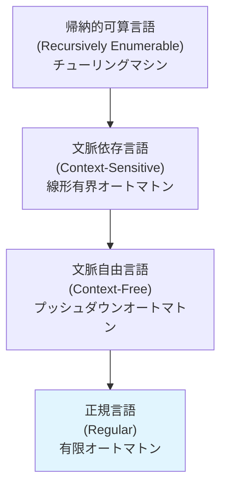

各クラスは真の包含関係にある。

$$
\text{正規言語} \subsetneq \text{文脈自由言語} \subsetneq \text{文脈依存言語} \subsetneq \text{帰納的可算言語}
$$

### 11.3 決定可能性

有限オートマトンに関する多くの問題は**決定可能**であり、効率的に解くことができる。これは上位の計算モデルと比較した場合の大きな利点である。

| 問題 | 正規言語 | 文脈自由言語 | 帰納的可算言語 |
|---|---|---|---|
| 空性（$L = \emptyset$?） | 決定可能（$O(n)$） | 決定可能 | 決定不能 |
| 所属性（$w \in L$?） | 決定可能（$O(n)$） | 決定可能 | 決定不能 |
| 等価性（$L_1 = L_2$?） | 決定可能 | 決定不能 | 決定不能 |
| 包含性（$L_1 \subseteq L_2$?） | 決定可能 | 決定不能 | 決定不能 |
| 普遍性（$L = \Sigma^*$?） | 決定可能 | 決定不能 | 決定不能 |

正規言語の等価性が決定可能であるのは、最小 DFA が一意に存在し、2つの DFA を最小化して比較できるためである。

## 12. 発展的な話題

### 12.1 双方向有限オートマトン（2DFA）

通常の有限オートマトンは入力を左から右に一方向に読む。**双方向有限オートマトン（Two-way Deterministic Finite Automaton, 2DFA）**は、ヘッドを左右両方向に動かすことができる。

興味深いことに、2DFA が受理する言語のクラスは通常の DFA と同じ（正規言語）であることが知られている。ただし、$n$ 状態の 2DFA を通常の DFA に変換すると、状態数が指数的に増大する場合がある。J. C. Shepherdson（1959年）がこの等価性を証明した。

### 12.2 有限変換器（Finite Transducer）

有限オートマトンを拡張して、入力を処理しながら出力を生成する機械が**有限変換器（finite transducer）**である。

- **Mealy マシン**：出力が遷移（状態と入力記号の組）に付随する
- **Moore マシン**：出力が状態に付随する

有限変換器は、テキスト処理（大文字変換、文字置換など）、通信プロトコルにおけるメッセージ変換、コンパイラの前処理（トライグラフの展開など）に応用される。

### 12.3 確率的有限オートマトン

**確率的有限オートマトン（Probabilistic Finite Automaton, PFA）**は、遷移関数を確率分布に置き換えたモデルである。各遷移に確率が付与され、文字列の受理確率が定義される。

確率的有限オートマトンは、自然言語処理における $n$-gram 言語モデルの理論的基盤であり、隠れマルコフモデル（HMM）とも密接な関係がある。

### 12.4 量子有限オートマトン

**量子有限オートマトン（Quantum Finite Automaton, QFA）**は、量子力学の原理（重ね合わせ、干渉、測定）に基づく有限オートマトンの量子版である。量子有限オートマトンは古典的な有限オートマトンと比較して、ある種の問題に対して少ない状態数で解けることが知られているが、受理できる言語のクラスは正規言語と完全には一致しない。

## 13. まとめ

有限オートマトンは、コンピュータサイエンスにおける計算の最も基本的なモデルであり、その理論的な美しさと実用的な応用範囲の広さは際立っている。

**理論的側面**では、DFA、NFA、ε-NFA の3つのモデルが正規言語という同じ言語クラスを受理すること、正規表現とのKleene の等価定理、Myhill-Nerode 定理による最小 DFA の一意性、そしてポンプ補題による正規言語の限界の証明が、形式言語理論の中核をなしている。

**実用的側面**では、字句解析器の自動生成、正規表現パターンマッチング、プロトコルの状態遷移検証、ハードウェア設計における順序回路、モデル検査と形式検証など、幅広い分野で有限オートマトンの理論が活用されている。

有限オートマトンを学ぶことは、計算理論の入口に立つだけでなく、コンピュータサイエンスのあらゆる領域に通じる形式的思考の基盤を築くことでもある。その単純さの中に潜む奥深い構造は、半世紀以上にわたって研究者と実務者の双方を魅了し続けている。

## 参考文献

- Hopcroft, J.E., Motwani, R., Ullman, J.D. *Introduction to Automata Theory, Languages, and Computation* (3rd ed.). Pearson, 2006.
- Sipser, M. *Introduction to the Theory of Computation* (3rd ed.). Cengage Learning, 2012.
- Rabin, M.O., Scott, D. *"Finite Automata and Their Decision Problems"*. IBM Journal of Research and Development, 3(2), 1959.
- Thompson, K. *"Programming Techniques: Regular Expression Search Algorithm"*. Communications of the ACM, 11(6), 1968.
- Hopcroft, J.E. *"An n log n Algorithm for Minimizing States in a Finite Automaton"*. Theory of Machines and Computations, Academic Press, 1971.
- Kleene, S.C. *"Representation of Events in Nerve Nets and Finite Automata"*. Automata Studies, Princeton University Press, 1956.
