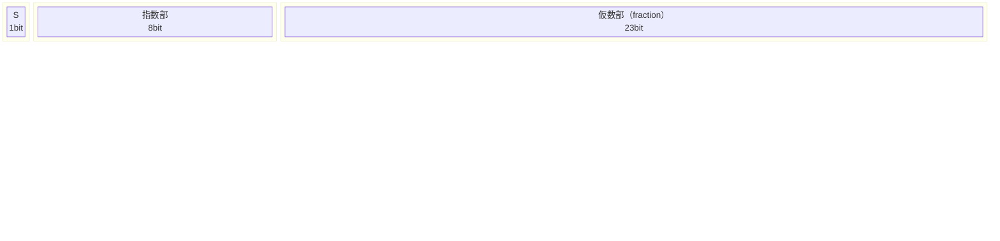
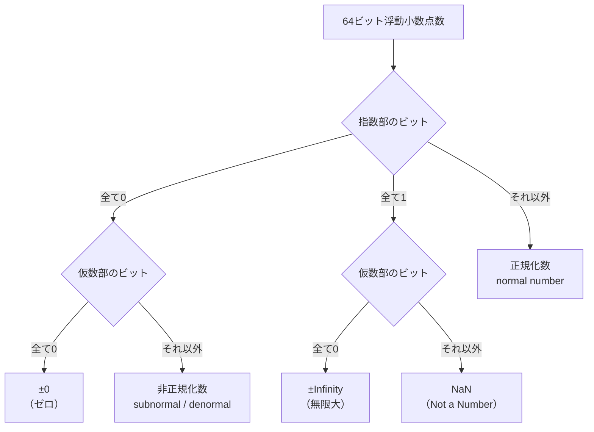
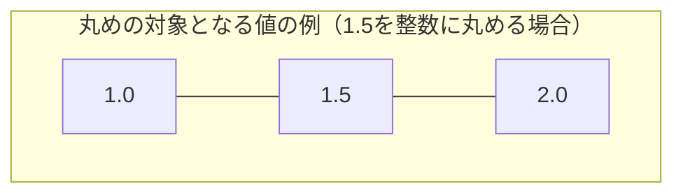
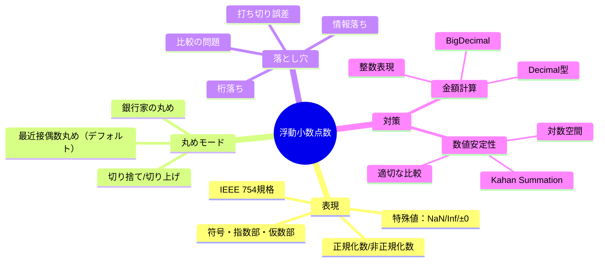

# 浮動小数点数の落とし穴（IEEE 754, 丸め誤差, 金額計算）

## 1. はじめに：「0.1 + 0.2 ≠ 0.3」という衝撃

プログラミングを始めたばかりの人が最初に遭遇する驚きの一つが、次のような現象である。

```python
>>> 0.1 + 0.2
0.30000000000000004
>>> 0.1 + 0.2 == 0.3
False
```

「0.1 と 0.2 を足したら 0.3 になるはずなのに、なぜ違うのか？」この疑問は単なるバグではなく、コンピュータが実数を表現する方法の根本的な性質から来ている。そして、この性質を理解せずにコードを書くことは、金融システムの計算誤差、センサーデータの解析ミス、科学シミュレーションの破綻など、深刻な問題につながる。

本記事では、IEEE 754浮動小数点規格のビットレベルの仕組みから始め、丸め誤差の本質的な原因、典型的な落とし穴、そして金融計算における正しい対処法まで、体系的に解説する。

---

## 2. IEEE 754の表現形式

### 2.1 規格の背景

1970年代以前、各コンピュータメーカーは独自の浮動小数点フォーマットを使っていた。同じ計算でも異なるマシンでは異なる結果が出るという状況が当たり前で、科学計算の再現性が保証されなかった。

この状況を打開するために、1985年にIEEE（Institute of Electrical and Electronics Engineers）が浮動小数点演算の統一規格 **IEEE 754-1985** を策定した。その後2008年に改訂された **IEEE 754-2008**（さらに2019年に軽微改訂）が現在の標準である。今日のほぼすべてのCPU（x86、ARM、RISC-Vなど）はこの規格に準拠したハードウェアを持ち、ほぼすべてのプログラミング言語の浮動小数点型がこれに基づいている。

### 2.2 符号・指数部・仮数部の三要素

IEEE 754の浮動小数点数は、**符号（sign）**、**指数部（exponent）**、**仮数部（mantissa / significand / fraction）** の三つのフィールドで表現される。これは科学的記数法（scientific notation）をバイナリで実装したものだ。

十進数での科学的記数法では例えば $-1.23 \times 10^5$ のように書くが、二進数では次のようになる。

$$(-1)^s \times 1.f_1 f_2 \ldots f_n \times 2^{e - \text{bias}}$$

- $s$：符号ビット（0 = 正、1 = 負）
- $1.f_1 f_2 \ldots f_n$：仮数（先頭の 1 は正規化数では暗黙的に存在する）
- $e$：格納されているバイアス付き指数
- $\text{bias}$：指数を非負の整数として格納するためのオフセット値

### 2.3 single（32ビット）とdouble（64ビット）のビットレイアウト



**single precision（float, 32ビット）**

| フィールド | ビット数 | バイアス |
|-----------|---------|---------|
| 符号      | 1       | —       |
| 指数部    | 8       | 127     |
| 仮数部    | 23      | —       |

**double precision（double, 64ビット）**

| フィールド | ビット数 | バイアス |
|-----------|---------|---------|
| 符号      | 1       | —       |
| 指数部    | 11      | 1023    |
| 仮数部    | 52      | —       |

64ビットのdoubleは約15〜17桁の十進数精度を持つ。

### 2.4 具体例：0.1 をバイナリで表現する

0.1 を二進数に変換してみよう。整数部は 0 なので、小数部を2倍し続けながら整数部分を読み取る。

```
0.1 × 2 = 0.2  → 0
0.2 × 2 = 0.4  → 0
0.4 × 2 = 0.8  → 0
0.8 × 2 = 1.6  → 1
0.6 × 2 = 1.2  → 1
0.2 × 2 = 0.4  → 0  ← ここで 0.2 が再登場 → 無限循環
0.4 × 2 = 0.8  → 0
0.8 × 2 = 1.6  → 1
0.6 × 2 = 1.2  → 1
...
```

0.1 は二進数では `0.0001100110011...`（0011 が無限に繰り返す）という**無限循環小数**になる。これが丸め誤差の根本原因だ。1/3 が十進小数で 0.333... と無限に続くのと同じ構造である。

doubleとして格納されると、この無限小数は52ビットの仮数部で打ち切られる。結果として、格納される値は厳密な 0.1 ではなく、最も近い表現可能な値になる。

$$0.1_{\text{double}} = 0.1000000000000000055511151231257827021181583404541015625$$

これは10進数で正確に記述できるが、プログラマが意図した 0.1 とはわずかに異なる。

---

## 3. 特殊値と非正規化数

IEEE 754は通常の数だけでなく、いくつかの特殊な値を定義している。

### 3.1 指数部のビットパターンによる分類



### 3.2 正規化数（Normal Numbers）

通常の浮動小数点数。指数部が 1〜2046（doubleの場合）の範囲であり、仮数部の先頭に暗黙の 1 がある。

$$\text{value} = (-1)^s \times 1.f \times 2^{e - 1023}$$

doubleで表現できる最大の正規化数は約 $1.8 \times 10^{308}$、最小（絶対値が最小）の正の正規化数は約 $2.2 \times 10^{-308}$。

### 3.3 非正規化数（Subnormal Numbers）

指数部が全ビット 0 のとき、仮数部の先頭の暗黙の 1 が 0 になる。これにより、正規化数より小さい値（0 に近い値）を段階的に表現できる。

$$\text{value} = (-1)^s \times 0.f \times 2^{-1022}$$

非正規化数は「**漸進的アンダーフロー**（gradual underflow）」を実現するためにIEEE 754に導入された。非正規化数がなければ、ある閾値以下の値は全て突然0になってしまう（急激なアンダーフロー）。

> [!WARNING]
> 非正規化数は多くのCPUでハードウェア的に処理コストが高い（数十倍遅くなることがある）。数値計算の性能が重要なアプリケーションでは、非正規化数が発生しないよう注意が必要。x86では `MXCSR` レジスタの `DAZ`（Denormals-Are-Zero）や `FTZ`（Flush-To-Zero）フラグで非正規化数を無効化できる。

### 3.4 無限大（±Infinity）

指数部が全ビット 1 で仮数部が全ビット 0 のとき。

```python
>>> import math
>>> 1.0 / 0.0  # Python ではゼロ除算で ZeroDivisionError だが
>>> float('inf')  # このように生成できる
inf
>>> float('inf') + 1
inf
>>> float('-inf') < -1e308
True
>>> math.isinf(float('inf'))
True
```

無限大の算術は数学的に自然な動作をする：
- $+\infty + x = +\infty$（有限な $x$ に対して）
- $+\infty \times (+\infty) = +\infty$
- $+\infty + (-\infty) = \text{NaN}$

### 3.5 NaN（Not a Number）

指数部が全ビット 1 で仮数部が 0 以外のとき。数学的に未定義な演算の結果。

```python
>>> float('nan')
nan
>>> float('nan') == float('nan')  # NaN is not equal to itself!
False
>>> import math
>>> math.isnan(float('nan'))
True
>>> 0.0 / 0.0  # In C/C++, this gives NaN
```

NaN の重要な性質：**NaN は自分自身と等しくない**。これはIEEE 754の仕様である。この性質を使って `x != x` という比較で NaN を検出できる（ただし `math.isnan()` の使用を推奨）。

NaN には二種類ある：
- **Quiet NaN（qNaN）**：伝播する。演算の結果として生成され、後続の演算でも NaN が伝播する。
- **Signaling NaN（sNaN）**：使用されると浮動小数点例外を発生させる（ハードウェアレベルでの異常検知に使用）。

### 3.6 ゼロの符号：+0 と -0

IEEE 754では **+0 と -0 が存在する**。比較演算では等しいが、いくつかの演算で挙動が異なる。

```python
>>> +0.0 == -0.0
True
>>> 1.0 / +0.0
inf
>>> 1.0 / -0.0
-inf
>>> import math
>>> math.copysign(1, +0.0)
1.0
>>> math.copysign(1, -0.0)
-1.0
```

-0 は非常に小さな負の数がアンダーフローした結果として現れる。

---

## 4. 丸めモード

浮動小数点演算では、結果が正確に表現できない場合に丸め（rounding）が必要になる。IEEE 754は5つの丸めモードを定義している。



### 4.1 五つの丸めモード

| モード | 名称 | 説明 |
|-------|------|------|
| `roundTiesToEven` | 最近接偶数丸め（デフォルト）| 最も近い値へ。同距離なら偶数へ |
| `roundTiesToAway` | 最近接丸め（ゼロから遠い方）| 最も近い値へ。同距離ならゼロから遠い方へ |
| `roundTowardPositive` | 切り上げ（+∞方向）| +∞ 方向に丸める |
| `roundTowardNegative` | 切り下げ（-∞方向）| -∞ 方向に丸める |
| `roundTowardZero` | 切り捨て（ゼロ方向）| ゼロ方向に丸める（絶対値を切り捨て）|

### 4.2 Round to Nearest Even（銀行家の丸め）

デフォルトの丸めモードは **Round to Nearest, Ties to Even**（最近接偶数丸め）である。これは一般に「**銀行家の丸め**（Banker's Rounding）」とも呼ばれる。

ちょうど中間の値（0.5 の位置）に当たる場合は、末尾ビットが 0（偶数）になる方向に丸める。

```
1.5 → 2  （2は偶数）
2.5 → 2  （2は偶数）
3.5 → 4  （4は偶数）
4.5 → 4  （4は偶数）
```

通常の四捨五入（Round Half Up）では、0.5 の位置で常に上方向に丸めるため、大量の数を丸めると統計的偏りが生じる。最近接偶数丸めはこの偏りを避けるための設計だ。

> [!TIP]
> Pythonの `round()` 関数は最近接偶数丸めを使用する。`round(0.5)` は `0`、`round(1.5)` は `2` になる。これを「バグ」と思い込む開発者が多いが、IEEE 754に準拠した正しい動作である。

### 4.3 区間演算での丸めモードの活用

数値計算の正確性を保証する**区間演算**（interval arithmetic）では、切り上げと切り下げを交互に使うことで、真の値が含まれる区間を計算できる。例えば、下界の計算では「-∞方向丸め」、上界の計算では「+∞方向丸め」を適用する。

```c
// Example of using rounding modes in C (fesetround)
#include <fenv.h>

// Set rounding toward -infinity for lower bound
fesetround(FE_DOWNWARD);
double lower = a + b;

// Set rounding toward +infinity for upper bound
fesetround(FE_UPWARD);
double upper = a + b;

// Restore default rounding
fesetround(FE_TONEAREST);
```

---

## 5. 浮動小数点数の比較問題

浮動小数点数の比較は、初心者が最もつまずきやすいポイントの一つである。

### 5.1 直接比較が危険な理由

```c
double x = 0.1 + 0.2;
double y = 0.3;

if (x == y) {  // This is almost always wrong!
    printf("equal\n");
} else {
    printf("not equal\n");  // This will be printed
}
```

直前に見たとおり、0.1 + 0.2 と 0.3 は IEEE 754 の表現上わずかに異なる。`==` による比較は「ビットが完全に一致するか」を確認するため、数学的に等しい値でも `false` を返すことがある。

### 5.2 イプシロン比較（Epsilon Comparison）

最もよく知られた対策は、二つの値の差の絶対値が十分小さければ等しいとみなす「**イプシロン比較**」である。

```c
#include <math.h>
#include <float.h>

// Absolute epsilon comparison (simple but has problems)
bool approx_equal_abs(double a, double b, double epsilon) {
    return fabs(a - b) < epsilon;
}

// Relative epsilon comparison (better for large values)
bool approx_equal_rel(double a, double b, double epsilon) {
    return fabs(a - b) <= epsilon * fmax(fabs(a), fabs(b));
}
```

しかし絶対イプシロン比較には問題がある。`epsilon = 1e-9` を使った場合、`1e10` と `1.000000001e10` は等しいと判定されてしまう（差が `1e1` でも `epsilon` より大きいので実は判定される）。逆に、`1e-15` と `2e-15` は等しいとみなされないかもしれない。

相対イプシロン比較はより汎用的だが、どちらもゼロ付近での動作に注意が必要だ（相対差はゼロ同士の比較で問題になる）。

### 5.3 ULP（Units in the Last Place）比較

より洗練されたアプローチが **ULP（Unit in the Last Place）** に基づく比較である。ULPとは、ある浮動小数点数の最下位ビット（LSB）が表す値の大きさであり、「その数を表現できる精度の最小単位」を意味する。

二つの浮動小数点数が k ULP 以内であれば「等しい」とみなす方法：

```c
#include <stdint.h>
#include <string.h>
#include <stdbool.h>

// ULP-based comparison for doubles
bool almost_equal_ulp(double a, double b, int max_ulp_diff) {
    // Handle NaN
    if (a != a || b != b) return false;
    // Handle infinity and sign differences
    if (a == b) return true;

    // Reinterpret as 64-bit integers
    int64_t ia, ib;
    memcpy(&ia, &a, sizeof(a));
    memcpy(&ib, &b, sizeof(b));

    // Convert to lexicographically ordered integers
    if (ia < 0) ia = (int64_t)0x8000000000000000LL - ia;
    if (ib < 0) ib = (int64_t)0x8000000000000000LL - ib;

    int64_t diff = ia - ib;
    if (diff < 0) diff = -diff;
    return diff <= max_ulp_diff;
}
```

ULP比較の利点は、値の大小に関わらず「浮動小数点表現上の距離」を一様に測れること。ただし、実装が複雑であることと、ゼロの周辺では非正規化数の扱いに注意が必要という欠点がある。

> [!NOTE]
> 実用的には Google の [Abseil](https://abseil.io/) や [Catch2](https://github.com/catchorg/Catch2) テストフレームワーク、Rustの `approx` クレートなど、ULP比較を適切に実装したライブラリを使うことを推奨する。

---

## 6. 典型的な落とし穴

浮動小数点計算でよく発生する問題パターンを整理する。

### 6.1 桁落ち（Catastrophic Cancellation）

**桁落ち**（catastrophic cancellation）は、ほぼ等しい二つの浮動小数点数を引き算するときに有効桁数が激減する現象である。

```python
x = 1.0000000000000002  # 1 + 2e-16
y = 1.0000000000000001  # 1 + 1e-16

result = x - y
print(result)  # 0.0 (should be ~1e-16)
```

この問題は、二次方程式の解の公式でよく発生する。

$$x = \frac{-b \pm \sqrt{b^2 - 4ac}}{2a}$$

$b \gg 4ac$ のとき（例：$b = 10000$、$4ac = 0.001$）、$\sqrt{b^2 - 4ac} \approx b$ となり、$-b + \sqrt{b^2 - 4ac}$ の計算で桁落ちが発生する。

```python
import math

# Catastrophic cancellation in quadratic formula
def quadratic_naive(a, b, c):
    discriminant = b**2 - 4*a*c
    x1 = (-b + math.sqrt(discriminant)) / (2*a)
    x2 = (-b - math.sqrt(discriminant)) / (2*a)
    return x1, x2

# Numerically stable version using the Vieta formula trick
def quadratic_stable(a, b, c):
    discriminant = b**2 - 4*a*c
    # Compute the root with larger absolute value first (avoid cancellation)
    if b >= 0:
        x2 = (-b - math.sqrt(discriminant)) / (2*a)
    else:
        x2 = (-b + math.sqrt(discriminant)) / (2*a)
    # Use Vieta's formula: x1 * x2 = c/a
    x1 = (c/a) / x2
    return x1, x2

# Example: x^2 - 10000x + 1 = 0
# True roots: approximately 9999.9999... and 0.0001000...
print(quadratic_naive(1, -10000, 1))   # (9999.9999..., 0.00010000000...) possibly inaccurate
print(quadratic_stable(1, -10000, 1)) # more accurate
```

### 6.2 情報落ち（Loss of Significance）

**情報落ち**は、絶対値が大きく異なる二つの数を加算するとき、小さい方の数の有効桁数が失われる現象である。

```python
big = 1.0e15
small = 1.0

result = big + small
print(result == big)  # True! The 1.0 was lost.
print(result - big)   # 0.0 (should be 1.0)
```

doubleは約15〜16桁の精度しかないため、`1e15` と `1.0` では15桁の差があり、`1.0` は完全に失われてしまう。

大量の数を合計するときにこの問題が累積すると、結果の精度が著しく低下する。後述のKahan Summationはこの問題への対策である。

### 6.3 打ち切り誤差（Truncation Error）

**打ち切り誤差**は、無限級数や微積分の近似計算において、有限の項数で計算を打ち切ることで生じる誤差である。浮動小数点固有の問題ではなく、数値計算一般の問題だが、丸め誤差と組み合わさって複雑な挙動をする。

例えば、$e^x$ のテイラー展開 $e^x = \sum_{k=0}^{\infty} \frac{x^k}{k!}$ を打ち切る場合：

```python
def exp_naive(x, terms=50):
    """Compute exp(x) by Taylor series - naive and potentially inaccurate"""
    result = 0.0
    term = 1.0
    for k in range(1, terms + 1):
        result += term
        term *= x / k  # next term
    result += term
    return result

# For large negative x, this can be wildly inaccurate due to cancellation
print(exp_naive(-20))  # May have large error
import math
print(math.exp(-20))   # Reference value
```

大きな負の $x$ に対しては、正の大きな項と負の大きな項が交互に現れ、桁落ちが発生する。安定な実装では `exp(-x) = 1/exp(x)` のように変換して正の $x$ に対してのみ計算する。

### 6.4 丸め誤差の蓄積

ループ内での浮動小数点演算は、誤差が蓄積する。

```python
# Seemingly harmless loop
x = 0.0
for i in range(10):
    x += 0.1

print(x)           # 0.9999999999999999 (not 1.0)
print(x == 1.0)    # False
```

これはループの反復回数が多いほど深刻になる。100万回のループで 0.1 を加算し続けると、誤差が顕著になる。

---

## 7. 金額計算における問題と対策

浮動小数点数の問題が最も実害を引き起こすのが金融・会計システムである。

### 7.1 なぜ金額計算に float/double を使ってはいけないか

```python
# Simulated financial calculation
price = 19.99
tax_rate = 0.08
quantity = 100

total = price * quantity * (1 + tax_rate)
print(f"Total: {total}")  # 2158.9200000000003 (not 2158.92)

# Accumulated error in billing
account_balance = 0.0
for _ in range(1000):
    account_balance += 0.10  # Add 10 cents 1000 times

print(f"Balance: {account_balance}")  # 99.99999999999999 (not 100.0)
```

会計システムで1円以下の誤差が生じると、帳簿の不一致、税計算の誤り、監査の問題につながる。

### 7.2 Decimal型による解決（Python）

Pythonの `decimal.Decimal` は十進数演算を任意精度で行うクラスである。

```python
from decimal import Decimal, ROUND_HALF_UP, getcontext

# Set precision
getcontext().prec = 28

price = Decimal("19.99")
tax_rate = Decimal("0.08")
quantity = Decimal("100")

total = price * quantity * (1 + tax_rate)
print(total)  # 2158.92 (exact!)

# Proper rounding for currency (2 decimal places)
total_rounded = total.quantize(Decimal("0.01"), rounding=ROUND_HALF_UP)
print(total_rounded)  # 2158.92
```

> [!WARNING]
> `Decimal(0.1)` ではなく `Decimal("0.1")` と文字列で初期化すること。`Decimal(0.1)` は先にfloatで 0.1 を表現しようとするため、`Decimal('0.1000000000000000055511151231257827021181583404541015625')` になってしまう。

### 7.3 整数表現（Integer Representation）

金額を「最小通貨単位の整数」として扱う方法。日本円なら円単位の整数、米ドルならセント単位の整数。

```python
# Represent amounts in smallest unit (cents for USD, yen for JPY)
class Money:
    def __init__(self, amount_cents: int, currency: str = "JPY"):
        # Store as integer in smallest unit
        self._cents = amount_cents
        self._currency = currency

    @classmethod
    def from_display(cls, amount: str, currency: str = "JPY") -> "Money":
        """Create from display string like '1999.99' or '100'"""
        if '.' in amount:
            yen, cents = amount.split('.')
            total_cents = int(yen) * 100 + int(cents.ljust(2, '0')[:2])
        else:
            total_cents = int(amount) * 100
        return cls(total_cents, currency)

    def __add__(self, other: "Money") -> "Money":
        assert self._currency == other._currency
        return Money(self._cents + other._cents, self._currency)

    def __mul__(self, factor: int) -> "Money":
        return Money(self._cents * factor, self._currency)

    def __str__(self) -> str:
        return f"{self._cents // 100}.{self._cents % 100:02d} {self._currency}"

price = Money.from_display("19.99", "USD")
total = price * 100
print(total)  # 1999.00 USD (exact)
```

整数演算はオーバーフローに注意が必要だが（Javaの `long` は約9200京まで）、金融システムでは現実的に十分な範囲である。

### 7.4 BigDecimal（Java）

Javaでは `java.math.BigDecimal` が金融計算に使われる。

```java
import java.math.BigDecimal;
import java.math.RoundingMode;

public class FinancialCalculation {
    public static void main(String[] args) {
        // WRONG: using double
        double wrongPrice = 19.99;
        double wrongTotal = wrongPrice * 100 * 1.08;
        System.out.println("Wrong: " + wrongTotal); // 2158.9200000000003

        // CORRECT: using BigDecimal with string constructor
        BigDecimal price = new BigDecimal("19.99");
        BigDecimal taxRate = new BigDecimal("1.08");
        BigDecimal quantity = new BigDecimal("100");

        BigDecimal total = price.multiply(quantity).multiply(taxRate);
        // Round to 2 decimal places using HALF_UP
        BigDecimal rounded = total.setScale(2, RoundingMode.HALF_UP);

        System.out.println("Correct: " + rounded); // 2158.92
    }
}
```

Javaの注意点：
- `new BigDecimal(0.1)` ではなく `new BigDecimal("0.1")` と文字列を使う
- 除算には必ずスケール（小数点以下の桁数）と丸めモードを指定する（`divide(divisor, scale, RoundingMode)`)
- `BigDecimal` は不変（immutable）オブジェクトであり、演算ごとに新しいオブジェクトが生成される

### 7.5 他の言語での対応

**JavaScript/TypeScript**: 組み込みの `number` は64ビットfloatのみ。金融計算には `big.js`、`decimal.js`、または `bignumber.js` などのライブラリを使用する。

```javascript
import Decimal from 'decimal.js';

const price = new Decimal('19.99');
const quantity = new Decimal('100');
const taxRate = new Decimal('1.08');

const total = price.times(quantity).times(taxRate);
console.log(total.toFixed(2)); // "2158.92"
```

**Go**: 標準ライブラリの `math/big` パッケージに `big.Float`（任意精度浮動小数点）と `big.Rat`（有理数）がある。金融用途には `github.com/shopspring/decimal` が広く使われる。

**Rust**: `rust_decimal` クレートが金融計算向けの Decimal 型を提供する。

---

## 8. 数値安定性のテクニック

### 8.1 Kahan Summation Algorithm

多数の浮動小数点数を加算するとき、逐次加算では情報落ちが累積する。**Kahan Summation**（カハン加算）はこの問題を補正する巧妙なアルゴリズムである。1965年に William Kahan が考案した。

```python
def kahan_sum(numbers):
    """
    Kahan compensated summation for accurate floating-point addition.
    The error compensation term 'c' tracks the lost low-order bits.
    """
    total = 0.0
    c = 0.0  # Compensation for lost low-order bits

    for x in numbers:
        y = x - c           # Compensated value
        t = total + y       # Add to total (low bits of y may be lost)
        c = (t - total) - y # Recover the lost bits
        total = t

    return total

# Comparison
import math
numbers = [0.1] * 10

naive_sum = sum(numbers)
kahan = kahan_sum(numbers)
expected = 1.0

print(f"Naive sum: {naive_sum}")   # 0.9999999999999999
print(f"Kahan sum: {kahan}")       # 1.0
print(f"Expected:  {expected}")    # 1.0
```

Kahan Summationの誤差は $O(\epsilon)$（$\epsilon$ は機械イプシロン）に抑えられる。通常の逐次加算が $O(n\epsilon)$ の誤差を持つのと比較して劇的な改善である。

アルゴリズムの直観：加算 `t = total + y` で失われた低位ビット `(t - total) - y` を補正変数 `c` に記録し、次の加算の前に補正する。

### 8.2 Neumaier Sum（改良Kahan）

Kahan Summationは加算する値の絶対値が partial sum より常に小さい場合を前提としている。大きな値が後から来る場合に精度が落ちることがある。**Neumaier Sum** はこの問題を修正した改良版である。

```python
def neumaier_sum(numbers):
    """
    Neumaier compensated summation - handles cases where individual
    values may be larger than the running total.
    """
    total = 0.0
    c = 0.0

    for x in numbers:
        t = total + x
        if abs(total) >= abs(x):
            c += (total - t) + x  # total is larger
        else:
            c += (x - t) + total  # x is larger
        total = t

    return total + c
```

### 8.3 Pairwise Summation

配列を二分割して再帰的に合計する方法。誤差が $O(\log n \cdot \epsilon)$ に抑えられる。NumPyはこの手法を実装している。

```python
def pairwise_sum(numbers, start, end):
    """
    Recursive pairwise summation.
    Error is O(log n * epsilon) instead of O(n * epsilon).
    """
    if end - start <= 32:  # Leaf threshold
        return sum(numbers[start:end])
    mid = (start + end) // 2
    return pairwise_sum(numbers, start, mid) + pairwise_sum(numbers, mid, end)
```

### 8.4 数値微分における中心差分法

数値微分において、前進差分（forward difference）より**中心差分**（central difference）の方が精度が高い。

$$f'(x) \approx \frac{f(x+h) - f(x-h)}{2h}$$

ただし $h$ が小さすぎると桁落ちが発生する。doubleでは $h \approx \sqrt{\epsilon_{\text{machine}}} \approx 10^{-8}$ が最適値。

```python
import math

def derivative_forward(f, x, h=1e-7):
    """Forward difference - O(h) error"""
    return (f(x + h) - f(x)) / h

def derivative_central(f, x, h=1e-5):
    """Central difference - O(h^2) error, more accurate"""
    return (f(x + h) - f(x - h)) / (2 * h)

# Test with sin(x), derivative should be cos(x)
x = 1.0
exact = math.cos(x)
print(f"Exact:    {exact}")
print(f"Forward:  {derivative_forward(math.sin, x)}")  # Less accurate
print(f"Central:  {derivative_central(math.sin, x)}")  # More accurate
```

### 8.5 対数空間での計算

確率の積を計算するとき（ナイーブベイズ、HMM等）、確率の積は非常に小さくなりアンダーフローする。対数空間での計算により、この問題を回避できる。

```python
import math

# Computing product of small probabilities
probs = [0.001, 0.002, 0.003, 0.004, 0.005]

# Naive: underflows to 0.0 for many probabilities
naive_product = 1.0
for p in probs:
    naive_product *= p
print(f"Naive: {naive_product}")  # 1.2e-13 (OK for 5 probs)

# Log-space: sum of logs, then exp (handles thousands of probabilities)
log_sum = sum(math.log(p) for p in probs)
log_product = math.exp(log_sum)
print(f"Log-space: {log_product}")  # 1.2e-13 (same, but won't underflow)

# LogSumExp trick for numerical stability in softmax etc.
def logsumexp(log_probs):
    """Numerically stable log(sum(exp(x))) computation"""
    max_val = max(log_probs)
    return max_val + math.log(sum(math.exp(x - max_val) for x in log_probs))
```

---

## 9. 各言語での浮動小数点の取り扱い

### 9.1 Python

```python
import sys
import struct

# Machine epsilon
print(sys.float_info.epsilon)   # 2.220446049250313e-16
print(sys.float_info.max)       # 1.7976931348623157e+308
print(sys.float_info.min)       # 2.2250738585072014e-308

# Inspect bit representation
def float_bits(x):
    """Show the bits of a double-precision float"""
    packed = struct.pack('>d', x)
    bits = int.from_bytes(packed, 'big')
    sign = (bits >> 63) & 1
    exp = (bits >> 52) & 0x7FF
    mantissa = bits & 0x000FFFFFFFFFFFFF
    return f"sign={sign}, exp={exp} (bias-adjusted={exp-1023}), mantissa=0x{mantissa:013X}"

print(float_bits(0.1))
# sign=0, exp=1019 (bias-adjusted=-4), mantissa=0x999999999999A

# math module provides accurate implementations
import math
print(math.fsum([0.1, 0.2, 0.3]))   # 0.6 (accurate)
print(0.1 + 0.2 + 0.3)              # 0.6000000000000001 (inaccurate)
```

`math.fsum()` はKahan Summationより高精度な拡張精度内部表現を使ったPython組み込みの精度保証付き合計関数である。

### 9.2 JavaScript / TypeScript

```javascript
// JavaScript has only one number type: IEEE 754 double
console.log(Number.EPSILON);         // 2.220446049250313e-16
console.log(Number.MAX_SAFE_INTEGER); // 9007199254740991 (2^53 - 1)
console.log(Number.MIN_SAFE_INTEGER); // -9007199254740991

// Safe integer check
console.log(Number.isSafeInteger(9007199254740991));  // true
console.log(Number.isSafeInteger(9007199254740992));  // false!

// BigInt for large exact integers (ES2020)
const big = 9007199254740992n;
console.log(big + 1n);  // 9007199254740993n (exact)

// Safe comparison utility
function almostEqual(a, b, epsilon = Number.EPSILON * 100) {
    return Math.abs(a - b) <= epsilon * Math.max(Math.abs(a), Math.abs(b));
}
```

JavaScriptでは `Number.MAX_SAFE_INTEGER`（$2^{53} - 1$）を超える整数の演算が不正確になる。大きな整数が必要な場合は `BigInt` を使う（ただしfloatとの混在は不可）。

### 9.3 Java

```java
import java.lang.Math;

public class FloatDemo {
    public static void main(String[] args) {
        // float vs double precision
        float f = 0.1f;
        double d = 0.1;
        System.out.println(f);  // 0.1 (displayed but stored as ~0.10000000149...)
        System.out.println(d);  // 0.1 (displayed but stored as ~0.100000000000000005...)

        // Machine epsilon
        System.out.println(Math.ulp(1.0));  // 2.220446049250313E-16
        System.out.println(Math.ulp(1000.0)); // 1.1368683772161603E-13

        // Comparing with ULP
        double a = 0.1 + 0.2;
        double b = 0.3;
        System.out.println(Math.abs(a - b) <= 2 * Math.ulp(b)); // true

        // StrictMath for guaranteed cross-platform reproducibility
        // Math may use extended precision on some platforms
        // StrictMath guarantees IEEE 754 bitwise reproducibility
        System.out.println(StrictMath.sin(Math.PI));
    }
}
```

Javaの `Math` クラスは一部の実装でx87の拡張精度（80ビット）を使うことがある。厳密な再現性が必要な場合は `StrictMath` を使う。

### 9.4 C / C++

```c
#include <stdio.h>
#include <float.h>
#include <fenv.h>
#include <math.h>

int main() {
    // Machine constants
    printf("FLT_EPSILON:  %e\n", FLT_EPSILON);   // 1.192093e-07
    printf("DBL_EPSILON:  %e\n", DBL_EPSILON);   // 2.220446e-16
    printf("LDBL_EPSILON: %Le\n", LDBL_EPSILON); // 1.084202e-19 (80-bit on x86)

    // Floating-point exceptions
    feclearexcept(FE_ALL_EXCEPT);

    double result = 1.0 / 0.0;  // Division by zero

    if (fetestexcept(FE_DIVBYZERO)) {
        printf("Division by zero occurred\n");
    }

    // Checking for NaN and Inf
    printf("isnan: %d\n", isnan(0.0 / 0.0));  // 1
    printf("isinf: %d\n", isinf(1.0 / 0.0)); // 1

    return 0;
}
```

C/C++の注意点：
- `long double` はプラットフォーム依存（x86では80ビット拡張精度、ARM/MSVCでは64ビット）
- コンパイラの最適化オプション（`-ffast-math`）は IEEE 754 の厳密なセマンティクスを破壊することがある（連想律を仮定した再順序化など）
- `-ffp-contract=off` で融合積和演算（FMA: Fused Multiply-Add）を無効化できる

### 9.5 Rust

```rust
fn main() {
    // Rust's f64 is IEEE 754 double
    println!("{}", f64::EPSILON);   // 2.220446049250313e-16
    println!("{}", f64::MAX);       // 1.7976931348623157e308
    println!("{}", f64::INFINITY);  // inf
    println!("{}", f64::NAN);       // NaN

    // NaN comparison
    let nan = f64::NAN;
    println!("{}", nan == nan);     // false (correct per IEEE 754)
    println!("{}", nan.is_nan());   // true

    // Total ordering with total_cmp (Rust 1.62+)
    // Handles NaN, infinities, and -0 in a consistent way
    let mut numbers = vec![3.0_f64, f64::NAN, 1.0, f64::INFINITY, -0.0, 0.0];
    numbers.sort_by(|a, b| a.total_cmp(b));
    println!("{:?}", numbers);
    // [-0.0, 0.0, 1.0, 3.0, inf, NaN]

    // ULP distance
    fn ulp_distance(a: f64, b: f64) -> u64 {
        let ia = a.to_bits() as i64;
        let ib = b.to_bits() as i64;
        ia.wrapping_sub(ib).unsigned_abs()
    }
    println!("{}", ulp_distance(0.1 + 0.2, 0.3)); // small ULP distance
}
```

---

## 10. 浮動小数点数のデバッグとツール

### 10.1 16進浮動小数点リテラル

C99以降（およびJava 17, Python 3.6+）では、浮動小数点数を16進数で正確に記述できる。

```c
// C99 hexadecimal floating-point literal
double x = 0x1.8p1;  // 1.5 * 2^1 = 3.0 (exact, no rounding)
printf("%.20g\n", x);  // Exactly 3

// 0.1 in hexadecimal: 0x1.999999999999ap-4
double one_tenth = 0x1.999999999999ap-4;
printf("%.20g\n", one_tenth); // 0.10000000000000000555
```

### 10.2 Valgrind と Sanitizer

GCCとClangは浮動小数点の問題を検出するフラグを持つ。

```bash
# Enable undefined behavior sanitizer (catches NaN propagation issues)
gcc -fsanitize=undefined -fsanitize=float-divide-by-zero prog.c

# Trap on NaN or Infinity
gcc -fsanitize=float-cast-overflow prog.c
```

### 10.3 数値計算の「信頼できる情報源」

浮動小数点数の実装を評価・検証する主要なリソース：

- **What Every Computer Scientist Should Know About Floating-Point Arithmetic** (David Goldberg, 1991): この分野の必読論文
- **IEEE 754-2019**: 現行の公式規格
- **Herbie**: 浮動小数点プログラムの精度を自動改善するツール（https://herbie.uwplse.org/）

---

## 11. まとめ：浮動小数点数との正しい向き合い方

本記事で扱った内容を整理する。



浮動小数点数について、開発者が覚えておくべき核心的な教訓を以下にまとめる。

> [!TIP]
> **浮動小数点数の7つの鉄則**
>
> 1. **floatでお金を表現しない**。金融計算にはDecimal型か整数表現を使う。
> 2. **`==` で比較しない**。イプシロン比較かULP比較を使う。
> 3. **文字列から初期化する**。`Decimal(0.1)` ではなく `Decimal("0.1")`。
> 4. **大きさの大きく違う値の足し算に注意する**。情報落ちが発生する。
> 5. **ほぼ等しい値の引き算に注意する**。桁落ちが発生する。
> 6. **大量の数の合計には補償付き加算を使う**。Kahan Summationか `math.fsum()`。
> 7. **NaNの伝播を意識する**。NaNは `==` で自分自身と等しくない。

浮動小数点数は「完璧な実数演算ができないもの」ではない。IEEE 754は非常によく設計された規格であり、その性質を理解した上で適切に使えば、必要十分な精度で実用的な計算ができる。問題が生じるのは、その性質を無視して「実数のように扱う」ときである。

コンピュータは有限のビット数で実数を近似しているという事実を常に念頭に置き、用途に応じた適切な数値表現と演算手法を選択することが、信頼性の高いソフトウェアを作る上での基本的な素養である。
