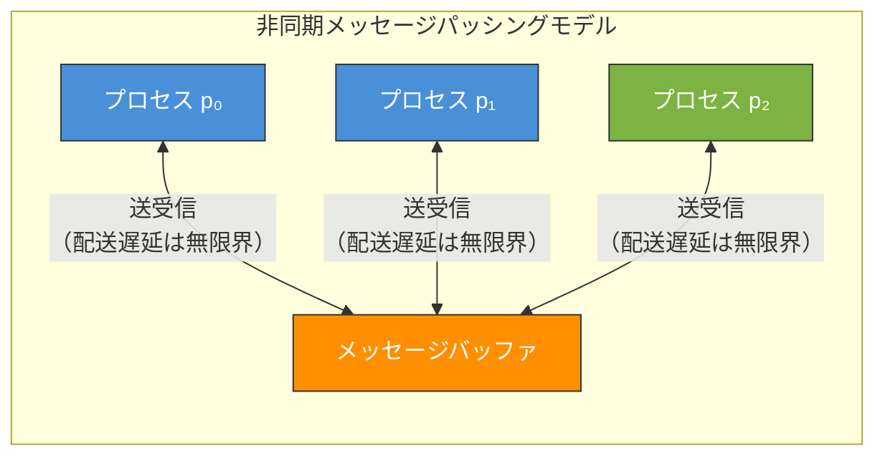
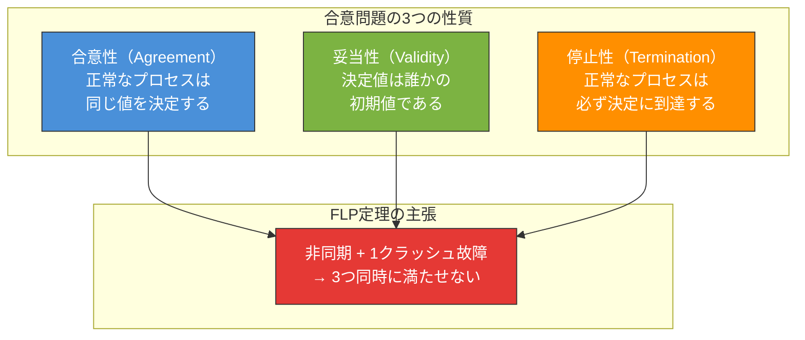
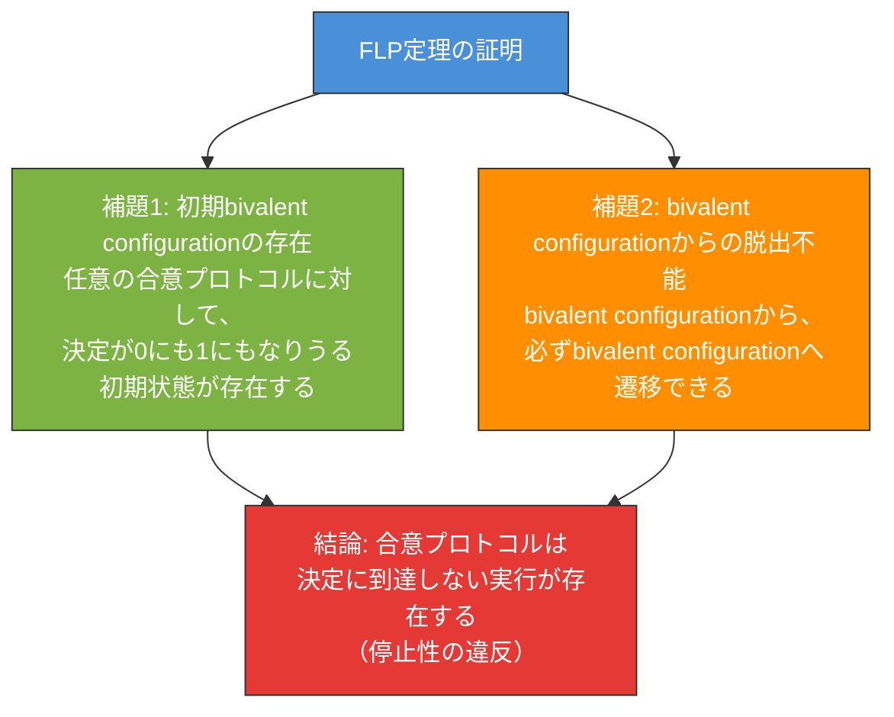
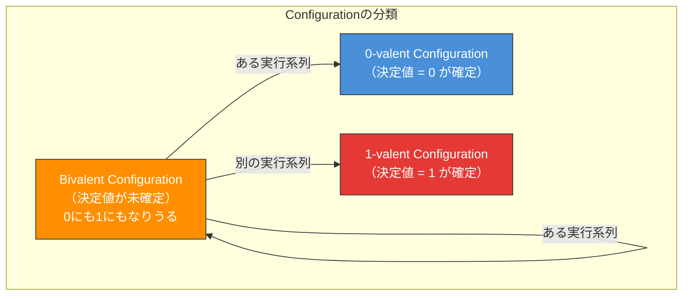
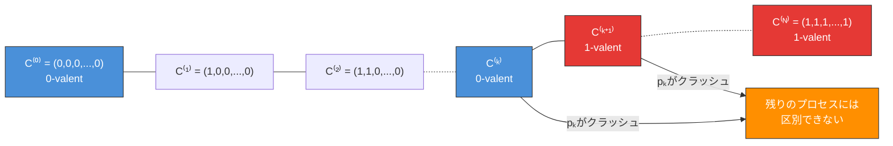
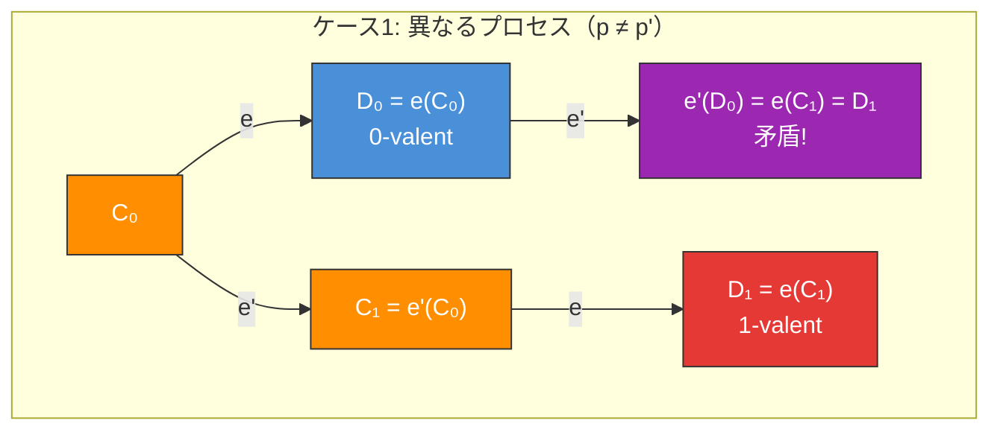
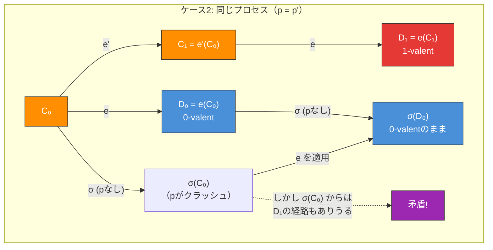
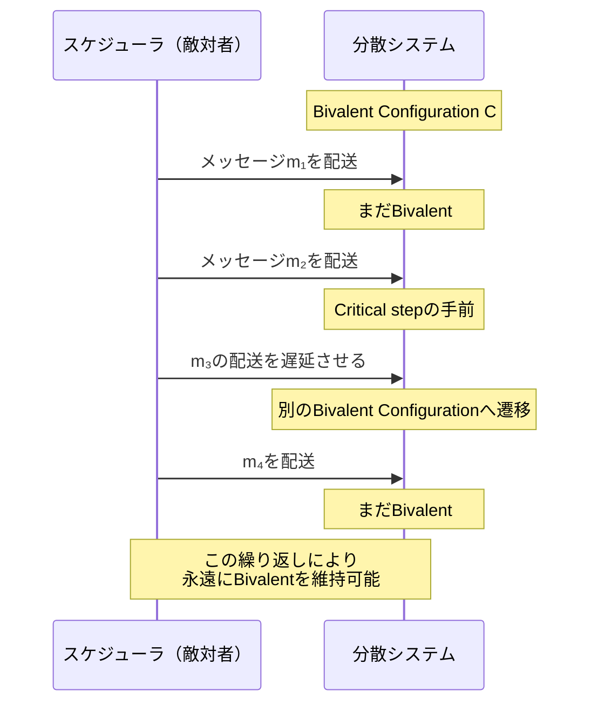
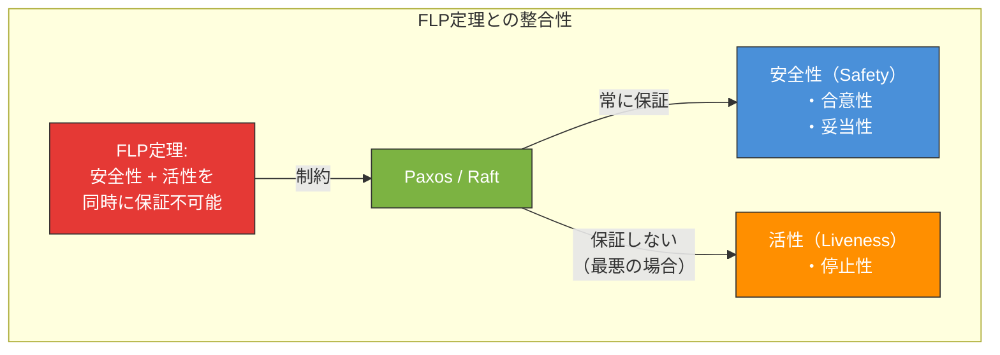
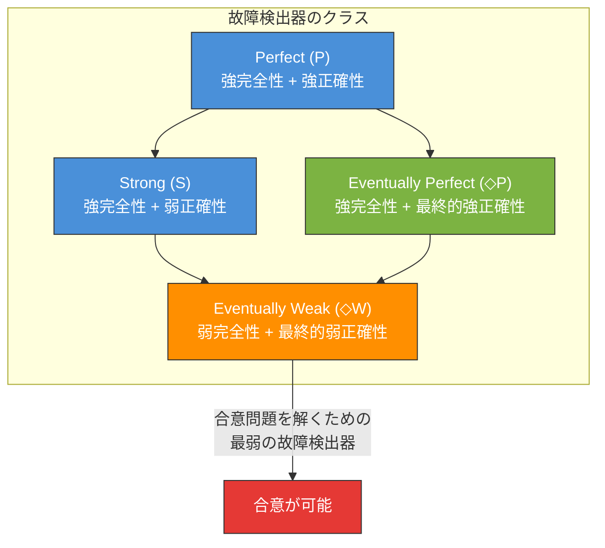

# FLP不可能性定理 — 非同期分散合意の根本的限界

## 1. はじめに：分散合意はなぜ難しいのか

分散システムにおける**合意（Consensus）**問題は、複数のプロセスがひとつの値について一致した決定を下すことを要求する。一見すると単純に思えるこの問題は、ネットワーク遅延やプロセス障害が存在する環境では、驚くほど困難な課題となる。

1985年、Michael J. Fischer、Nancy A. Lynch、Michael S. Patersonの3人は、この困難さの根本的な原因を数学的に証明した。彼らの論文「Impossibility of Distributed Consensus with One Faulty Process」は、分散コンピューティング理論の中で最も重要な結果のひとつであり、その頭文字をとって**FLP不可能性定理**と呼ばれている。

FLP定理の主張は衝撃的なほど明快である。

> **完全に非同期なシステムにおいて、たった1つのプロセスがクラッシュする可能性がある場合、すべてのプロセスが必ず合意に到達することを保証する決定的アルゴリズムは存在しない。**

この結果は、分散システムの設計に対して根本的な制約を課す。Paxos、Raft、ZABといった実用的な合意アルゴリズムが存在する中で、FLP定理はこれらのアルゴリズムが何を犠牲にしているのかを理解するための理論的基盤を提供する。

本記事では、FLP定理の歴史的背景、問題の厳密な定式化、証明の構造と直感的理解、そして実用上の含意と回避策まで、包括的に解説する。

## 2. 歴史的背景

### 2.1 1980年代の分散コンピューティング

FLP定理が発表された1985年は、分散コンピューティングの理論的基盤が活発に研究されていた時代である。1978年にはLeslie Lamportが論理時計（Lamport Clock）を発表し、分散システムにおけるイベントの順序付けの概念を確立していた。1982年にはLamport、Shostak、Peaseによるビザンチン将軍問題の研究が発表され、障害が存在する環境での合意問題の難しさが認識され始めていた。

このような背景の中、Fischer、Lynch、Patersonは、合意問題の困難さがビザンチン障害のような「悪意ある障害」に限らず、**最も単純な障害モデル（クラッシュ障害）においても本質的に存在する**ことを示した。

### 2.2 論文の意義

FLP論文は1985年にJournal of the ACMに掲載され、同年のDijkstra賞（現在のEdsger W. Dijkstra Prize in Distributed Computing）の受賞対象となった。この論文の意義は以下の点にある。

1. **不可能性の証明**: 分散合意問題には、特定のシステムモデルにおいて**解が存在しない**ことを厳密に示した
2. **モデルの明確化**: 非同期システムモデルの定義と、その下での合意問題の限界を明確にした
3. **研究の方向付け**: 不可能性を回避するためのアプローチ（部分同期、乱択、故障検出器）の研究を動機づけた

### 2.3 著者について

- **Michael J. Fischer**: イェール大学教授。計算理論と暗号理論の分野で多くの貢献を残した
- **Nancy A. Lynch**: MIT教授。著書「Distributed Algorithms」は分散アルゴリズムの標準的教科書として知られる。CAP定理の厳密な証明にも関わった
- **Michael S. Paterson**: ウォーリック大学教授。計算理論の幅広い分野で活躍した

## 3. 合意問題の定式化

FLP定理を理解するためには、まず合意問題とシステムモデルを厳密に定義する必要がある。

### 3.1 システムモデル

FLP定理は以下のシステムモデルを前提とする。

#### プロセス

$N$ 個のプロセス $p_0, p_1, \ldots, p_{N-1}$（$N \geq 2$）が存在する。各プロセスは**決定的**であり、その振る舞いは現在の状態と受信したメッセージによって一意に決定される。

#### 通信モデル

プロセス間の通信は、**メッセージパッシング**によって行われる。すべてのメッセージは共有の**メッセージバッファ**を通じて送受信される。

- メッセージは最終的に配送される（永久に失われることはない）
- メッセージの配送順序や配送時間に上限はない（**非同期**）
- メッセージの重複や改ざんは発生しない

#### 障害モデル

- **最大1つのプロセス**がクラッシュ故障しうる
- クラッシュしたプロセスは永久に停止する（回復しない）
- クラッシュの検出は不可能である（非同期性により、遅いプロセスとクラッシュしたプロセスの区別がつかない）



上図のモデルでは、各プロセスがメッセージバッファを介して通信する。メッセージの配送に時間的な保証がないため、あるプロセスからのメッセージが遅延しているのか、そのプロセスがクラッシュしたのかを他のプロセスが判別する手段がない。これがFLP定理の核心的な困難さである。

### 3.2 合意問題の定義

合意問題（Consensus Problem）は、以下の3つの性質を満たすプロトコルを求める問題である。

#### 合意性（Agreement）

すべての正常なプロセスは、同じ決定値 $v$ を出力する。

$$\forall p_i, p_j \in \text{correct processes}: \text{decision}(p_i) = \text{decision}(p_j)$$

#### 妥当性（Validity）

決定値は、いずれかのプロセスの初期値でなければならない。すなわち、決定値は「無から生じる」ものではなく、誰かが実際に提案した値である。

$$\text{decision}(p_i) \in \{v_0, v_1, \ldots, v_{N-1}\}$$

ここで $v_j$ はプロセス $p_j$ の初期値である。FLP論文では簡単のため、各プロセスの初期値は $0$ または $1$ のいずれかとする（バイナリ合意）。

#### 停止性（Termination）

すべての正常なプロセスは、**有限ステップ以内に**決定値を出力する。

$$\forall p_i \in \text{correct processes}: p_i \text{ は最終的に決定を下す}$$



### 3.3 安全性と活性の区別

合意問題の3つの性質は、分散システムにおける**安全性（Safety）**と**活性（Liveness）**の2つのカテゴリに分類できる。

- **安全性**: 「悪いことが起きない」ことを保証する性質
  - 合意性：異なるプロセスが異なる値に決定しない
  - 妥当性：提案されていない値に決定しない
- **活性**: 「良いことがいつか起きる」ことを保証する性質
  - 停止性：正常なプロセスはいつか必ず決定する

FLP定理は、非同期システムにおいて安全性と活性を**同時に**保証する決定的アルゴリズムが存在しないことを主張する。後に見るように、Paxosなどの実用的な合意アルゴリズムは安全性を常に保証しつつ、活性を犠牲にすることでFLP定理と整合性を保っている。

## 4. 定理の厳密な主張

FLP定理を正式に述べる。

**定理（Fischer, Lynch, Paterson 1985）**:

> メッセージパッシングによる非同期分散システムにおいて、最大1つのプロセスがクラッシュ故障しうる場合、合意性、妥当性、停止性をすべて満たす決定的プロトコルは存在しない。

形式的に記述すると：

$$\nexists P: P \text{ は決定的} \land P \text{ は合意性を満たす} \land P \text{ は妥当性を満たす} \land P \text{ は1-耐故障で停止性を満たす}$$

ここで「1-耐故障」とは、最大1つのプロセスのクラッシュを許容することを意味する。

注目すべきは、この定理が要求する条件の弱さである。

- 障害はクラッシュのみ（ビザンチン障害ではない）
- 最大**1つ**のプロセスのクラッシュ（複数ではない）
- メッセージは改ざんされない
- メッセージは最終的には配送される

これほど弱い障害モデルにおいてすら合意が不可能であるという事実は、非同期性の持つ根本的な困難さを浮き彫りにしている。

## 5. 証明の概要

FLP定理の証明は、2つの補題から構成される。証明の全体的な構造を先に示し、各補題の詳細を解説する。

### 5.1 証明の全体構造



証明の核心は、**bivalent（二値的）configuration** という概念にある。これは、まだ最終的な決定値が確定していない状態、すなわち将来の実行によって0にも1にもなりうる状態を意味する。

### 5.2 基本概念の定義

#### Configuration（構成）

**Configuration**は、システムのある時点でのグローバルな状態であり、以下の2つの要素から構成される。

- 各プロセスの内部状態
- メッセージバッファの内容（送信済みだが未配送のメッセージの集合）

初期構成（Initial Configuration）$C_0$ は、各プロセスが初期値（0または1）を持ち、メッセージバッファが空の状態である。

#### Step（ステップ）

あるconfiguration $C$ において、メッセージバッファ中のメッセージ $m$ をプロセス $p$ に配送することを**ステップ**と呼ぶ。ステップ $e = (p, m)$ の適用により、$C$ は新しいconfiguration $C' = e(C)$ に遷移する。プロセス $p$ は決定的であるため、$C$ と $e$ が与えられれば $C'$ は一意に定まる。

#### Run（実行）

初期構成 $C_0$ から始まるステップの列 $e_1, e_2, e_3, \ldots$ を**run（実行）** と呼ぶ。

#### Decision Value（決定値）

あるconfiguration $C$ から到達可能なconfigurationにおいて、いずれかのプロセスが出力した決定値を $C$ の**到達可能な決定値**と呼ぶ。

#### Univalent / Bivalent Configuration

ここで、証明の鍵となる概念を導入する。

- **0-valent configuration**: そのconfigurationから到達可能なすべての決定値が0であるもの。すなわち、どのような実行を続けても結果は必ず0になる
- **1-valent configuration**: 同様に、すべての到達可能な決定値が1であるもの
- **univalent（一価的）configuration**: 0-valentまたは1-valentであるconfiguration。決定値が事実上確定している
- **bivalent（二価的）configuration**: 0を決定値とする到達可能なconfigurationと、1を決定値とする到達可能なconfigurationの両方が存在するもの。すなわち、**まだ結果が確定していない**状態



直感的に言えば、bivalent configurationとは「未来が分岐しうる状態」である。次にどのメッセージが配送されるか、あるいはどのプロセスがクラッシュするかによって、最終的な決定値が変わりうる。

### 5.3 補題1: 初期bivalent configurationの存在

**補題1**: 任意の1-耐故障な合意プロトコル $P$ に対して、bivalentな初期構成が存在する。

#### 証明のアイデア

背理法で証明する。すべての初期構成がunivalentであると仮定し、矛盾を導く。

各プロセスの初期値は0または1であるため、$N$ 個のプロセスの初期値の組み合わせとして、$2^N$ 通りの初期構成が存在する。

- すべてのプロセスの初期値が0である構成を $C_{\text{all-0}}$ とする。妥当性より、このconfigurationからの決定値は0でなければならない。よって $C_{\text{all-0}}$ は0-valentである
- すべてのプロセスの初期値が1である構成を $C_{\text{all-1}}$ とする。同様に、$C_{\text{all-1}}$ は1-valentである

すべての初期構成がunivalentであると仮定すると、0-valentな初期構成と1-valentな初期構成が少なくともひとつずつ存在する。初期値をひとつずつ変えていく系列を考えると、0-valentな構成から1-valentな構成に「切り替わる」隣接する一対 $(C, C')$ が存在する。

$$C_{\text{all-0}} = C^{(0)}, C^{(1)}, C^{(2)}, \ldots, C^{(N)} = C_{\text{all-1}}$$

ここで $C^{(k)}$ と $C^{(k+1)}$ は、プロセス $p_k$ の初期値のみが異なる。

ある $k$ において、$C^{(k)}$ が0-valentで $C^{(k+1)}$ が1-valentであるとする。この2つの構成は、プロセス $p_k$ の初期値のみが異なる。

ここで、プロセス $p_k$ がクラッシュした場合を考える。残りのプロセスにとって、$C^{(k)}$ から始まった実行と $C^{(k+1)}$ から始まった実行は**区別不可能**である（$p_k$ からのメッセージは一切届かないため）。しかし、$C^{(k)}$ からは0に、$C^{(k+1)}$ からは1に決定しなければならない。これは矛盾である。

したがって、すべての初期構成がunivalentであるという仮定は誤りであり、bivalentな初期構成が存在する。$\square$



### 5.4 補題2: Bivalent configurationからの脱出不能

**補題2**: bivalent configurationから、任意のステップを適用しても、bivalent configurationに遷移する実行が常に存在する。

より正確には：

**補題2（正式版）**: $C$ をbivalent configurationとし、$e = (p, m)$ を $C$ に適用可能なステップとする。$C$ から $e$ を含む任意のステップ列で到達可能なconfigurationの集合を考えたとき、この集合にはbivalent configurationが含まれるか、あるいは $e$ の適用を遅延させ続けることでbivalentな状態を維持できる。

#### 証明のアイデア

この補題の証明は、FLP論文の中で最も精緻な部分である。背理法を用いる。

$C$ をbivalent configurationとし、$e = (p, m)$ を $C$ に適用可能な特定のステップとする。$C$ に対して、$e$ を最初に適用する場合と、$e$ を遅延させて他のステップを先に適用する場合を考える。

$\mathcal{C}$ を、$C$ から $e$ を適用せずに到達可能なconfigurationの集合とする（$C$ 自身も含む）。$\mathcal{D}$ を、$\mathcal{C}$ の各要素に $e$ を適用して得られるconfigurationの集合とする。

$$\mathcal{D} = \{ e(C') \mid C' \in \mathcal{C} \}$$

$\mathcal{D}$ 内のすべてのconfigurationがunivalentであると仮定して矛盾を導く。

$C$ がbivalentであるため、$C$ からは0に到達する実行と1に到達する実行がともに存在する。$\mathcal{D}$ 内のconfigurationがすべて同じvalency（たとえばすべて0-valent）になることは、$C$ のbivalencyと矛盾する場合がある。したがって、$\mathcal{D}$ 内には0-valentなconfigurationと1-valentなconfigurationの両方が存在する。

$\mathcal{D}$ 内に0-valent $D_0$ と 1-valent $D_1$ が存在するとする。この2つは、$\mathcal{C}$ 内の隣接するconfiguration $C_0, C_1$（ひとつのステップ $e'$ だけ異なる）に $e$ を適用して得られたものとする。

$$C_0 \xrightarrow{e} D_0 \text{（0-valent）}, \quad C_1 = e'(C_0) \xrightarrow{e} D_1 \text{（1-valent）}$$

ここで2つのケースを考える。

**ケース1**: $e$ と $e'$ が**異なるプロセス**に関与する場合

$e = (p, m)$ と $e' = (p', m')$ で $p \neq p'$ であるとする。この場合、$e$ と $e'$ は独立であり、適用順序を入れ替えても結果は同じである。

$$e'(D_0) = e'(e(C_0)) = e(e'(C_0)) = e(C_1) = D_1$$

しかし、$D_0$ は0-valentであるから、$D_0$ から到達可能な $e'(D_0)$ も0に決定しなければならない。一方、$e'(D_0) = D_1$ は1-valentである。これは矛盾。

**ケース2**: $e$ と $e'$ が**同じプロセス** $p$ に関与する場合

$e = (p, m)$ と $e' = (p, m')$ であるとする。プロセス $p$ がクラッシュした場合のrunを考える。$C_0$ から $p$ 以外のプロセスだけでステップを進める有限のステップ列 $\sigma$ を考えると、$p$ がクラッシュしているため、停止性の仮定より残りのプロセスは最終的に決定に到達する。

$\sigma(C_0)$ に $e$ を適用した結果と、$\sigma$ を $C_0$ に $e$ を適用した後（すなわち $D_0$ から）のrunを比較すると、同様の議論から矛盾が導かれる。$\sigma$ は $p$ を含まないため、$e$ との順序を交換でき、$\sigma(D_0)$ は0-valentなconfigurationから到達可能なので0-valentである。しかし同時に、$\sigma(C_0)$ からの到達可能性を考えると1-valentにもなりうることが示され、矛盾する。





したがって、$\mathcal{D}$ 内のすべてのconfigurationがunivalentであるという仮定は誤りであり、$\mathcal{D}$ 内にbivalent configurationが存在する。$\square$

### 5.5 証明の完成

補題1と補題2を組み合わせると、FLP定理の証明が完成する。

1. **補題1**により、任意の合意プロトコルに対して、bivalentな初期構成 $C_0$ が存在する
2. **補題2**により、$C_0$ から任意のステップを適用しても、bivalent configurationに遷移する実行が存在する
3. これを繰り返すことで、**永遠にbivalentなconfigurationに留まり続ける無限のrun**を構成できる
4. このrunでは、いかなるプロセスも決定値を出力しない（決定値を出力するとunivalentになるため）
5. したがって、**停止性が満たされない**

このrunにおいて最大1つのプロセスをクラッシュさせることで、1-耐故障の条件下でも停止性を満たせないことが示される。具体的には、bivalencyを維持する実行を構成する際に、特定のメッセージの配送を遅延させ続けることが可能であり、これは非同期システムの正当な実行として認められる（メッセージの配送に時間的な上限がないため）。

## 6. 証明の直感的理解

FLP定理の証明は技術的に精緻だが、その本質的な洞察は直感的に理解できる。

### 6.1 非同期性がもたらす本質的困難

非同期システムにおける根本的な問題は、**遅延とクラッシュの区別がつかない**ことである。

あるプロセスからメッセージが届かない場合、以下の2つの可能性がある。

1. そのプロセスはクラッシュした
2. そのプロセスは正常だが、メッセージが遅延している

この区別がつかないことが、合意の達成を困難にする。

もしプロセスがクラッシュしたと判断して、そのプロセス抜きで合意を進めると、後からそのプロセスのメッセージが届いたときに一貫性が失われる可能性がある。一方、メッセージを待ち続けると、実際にクラッシュしている場合には永遠に決定できない。

### 6.2 2人の将軍のアナロジー

FLP定理の直感を掴むために、簡単な例を考える。

2つのプロセス $p_0$ と $p_1$ があり、それぞれ初期値を持つ。両者が合意するためには通信が必要だが、通信には任意の遅延がありうる。

- $p_0$ が先に決定しようとする場合：$p_1$ からのメッセージなしに決定すると、$p_1$ の初期値が異なる場合に合意性を満たせない可能性がある
- $p_0$ が $p_1$ のメッセージを待つ場合：$p_1$ がクラッシュしていれば永遠に待ち続ける

このジレンマは、プロセス数が増えても本質的に解消されない。

### 6.3 Critical Step（臨界ステップ）の概念

証明の核心は、システムがbivalent configurationからunivalent configurationに遷移する「瞬間」に着目する。この遷移が起きるステップを**critical step**（臨界ステップ）と呼ぶ。

FLP定理の証明は、この臨界ステップが常に回避可能であることを示す。具体的には、臨界ステップを引き起こすメッセージの配送を遅延させることで、システムをbivalentな状態に留め置くことができる。非同期システムではメッセージの配送に時間的制約がないため、この遅延は「不正」な操作ではなく、システムモデルの下で完全に正当な実行である。



この「敵対的スケジューラ」の視点は、FLP定理の理解において非常に有用である。スケジューラは非同期システムのセマンティクスの範囲内でメッセージの配送順序を自由に制御できるため、常にシステムを「最悪の」状態に追い込むことができる。

## 7. FLP定理が言っていないこと

FLP定理は非常に強力な不可能性結果であるが、その主張の範囲を正確に理解することが重要である。以下は、FLP定理がしばしば誤解される点である。

### 7.1 合意が「絶対に」達成不可能というわけではない

FLP定理は、**すべての実行で**停止性が保証されるプロトコルが存在しないことを述べている。多くの実行で合意に到達するプロトコルは存在しうる。問題は、**最悪の場合**（敵対的なメッセージスケジューリング）に停止性が破れることである。

### 7.2 同期システムには適用されない

FLP定理の前提は**非同期**システムである。メッセージの配送に既知の上限がある**同期**システムや、部分的な時間の仮定を置く**部分同期**システムには、この結果は適用されない。

### 7.3 ビザンチン障害を仮定していない

FLP定理はクラッシュ故障のみを考慮している。プロセスが嘘をついたり、矛盾するメッセージを送信したりするビザンチン障害は考えていない。クラッシュ故障という最も穏やかな障害モデルでも合意が不可能であるという点が、この定理の衝撃的な部分である。

### 7.4 安全性の維持は可能

FLP定理は**停止性**（活性）の保証が不可能であることを述べている。合意性と妥当性（安全性）を常に維持しつつ、「通常の」実行では合意に到達するプロトコルは構築可能である。Paxosはまさにこのアプローチをとっている。

## 8. 実用的な含意：なぜPaxos/Raftは動くのか

FLP定理は「合意は不可能」と述べているにもかかわらず、実世界ではPaxos、Raft、ZABなどの合意アルゴリズムが数多くの分散システムで実用されている。この「矛盾」をどう理解すべきだろうか。

### 8.1 Paxosの戦略：活性を犠牲にする

Paxosは、FLP定理の制約下で以下の戦略をとっている。

- **安全性（合意性 + 妥当性）**: あらゆる実行において常に保証される
- **活性（停止性）**: 保証されない。理論的には、2つのProposerが永遠に互いのProposalを上書きし続ける「デュエリングリーダー」問題により、合意に到達しない実行が存在する

Paxosが実用上「動く」のは、このデュエリングリーダー問題が実際には稀にしか発生せず、リーダー選出メカニズムなどのヒューリスティクスによって緩和されるためである。

### 8.2 Raftの戦略：リーダーベースの合意

Raftは、リーダー選出を合意アルゴリズムの中核に据えることで、FLP定理の影響を最小化している。

- 安定したリーダーが存在する限り、合意は効率的に進行する
- リーダーの障害時には新しいリーダーを選出する
- リーダー選出のためのランダム化されたタイムアウトを使用する

このランダム化されたタイムアウトは、FLP定理を回避するための実用的な手法であり、後述する乱択アルゴリズムの一種と見なすことができる。

### 8.3 安全性と活性の分離



実用的な合意アルゴリズムの設計哲学は、**安全性は絶対に侵さず、活性は最善の努力で追求する**というものである。FLP定理は、この設計判断の理論的正当性を与えている。

## 9. FLP定理の回避策

FLP定理が示す不可能性を回避するために、研究者たちはシステムモデルの仮定を緩和するさまざまなアプローチを提案してきた。

### 9.1 部分同期モデル（Partial Synchrony）

**部分同期モデル**は、Dwork、Lynch、Stockmeyer（DLS）が1988年に提案したシステムモデルであり、非同期モデルと同期モデルの中間に位置する。

部分同期モデルには2つの変種がある。

#### 既知の上限、未知の開始時刻（GST モデル）

メッセージの配送時間に上限 $\Delta$ が存在するが、この上限が有効になる時刻（Global Stabilization Time, GST）は未知である。

$$\forall t \geq \text{GST}: \text{メッセージの配送遅延} \leq \Delta$$

GSTより前はメッセージが任意に遅延しうるが、GSTの後はメッセージが $\Delta$ 以内に配送される。

#### 未知の上限、既知の開始時刻

メッセージの配送時間に上限が存在することは保証されるが、その具体的な値は未知である。

部分同期モデルは、実世界のネットワークをより現実的にモデル化している。実際のネットワークは、通常は応答時間に上限があるが、障害や輻輳により一時的にその上限を超えることがある。GSTモデルは、「いずれネットワークが安定する」という仮定を形式化したものである。

部分同期モデルにおいては、停止性を含む合意が達成可能であることがDLSの論文で示されている。Paxos、Raft、PBFTなどの実用的なアルゴリズムは、実質的にこのモデルを仮定している。

### 9.2 乱択アルゴリズム（Randomized Algorithms）

FLP定理は**決定的**プロトコルに対する不可能性結果である。プロセスが確率的な選択を行うことを許す**乱択アルゴリズム**では、合意を達成できることが示されている。

#### Ben-Orのアルゴリズム（1983年）

Ben-Orは、非同期システムにおいて乱択化された合意アルゴリズムを提案した。このアルゴリズムは、**確率1で**合意に到達する（ただし、到達までのステップ数の期待値は有限だが、最悪の場合は無限大になりうる）。

各ラウンドにおいて、プロセスが「コイン投げ」を行い、合意できない場合はランダムに値を選び直す。十分な回数のラウンドを経ることで、確率的に合意に収束する。

$$P(\text{ラウンド } r \text{ で合意に到達}) > 0 \implies P(\text{最終的に合意に到達}) = 1$$

#### 乱択合意の理論的保証

乱択アルゴリズムによる合意は、以下の保証を提供する。

- **合意性**: 常に保証される（安全性）
- **妥当性**: 常に保証される（安全性）
- **確率的停止性**: 確率1で停止する（ただし、有限ステップの保証はない）

FLP定理が禁じているのは「必ず有限ステップで停止する」ことであり、「確率1で停止する」ことは禁じていない。この微妙な違いが、乱択アルゴリズムの理論的基盤となっている。

### 9.3 故障検出器（Failure Detectors）

Chandra and Toueg（1996年）は、**故障検出器**という抽象化を導入し、合意問題の解決可能性を体系的に分析した。

故障検出器は、各プロセスに「どのプロセスがクラッシュしたか」のヒント（必ずしも正確ではない）を提供するオラクルである。

#### 完全性と正確性

故障検出器は、以下の2つの性質の強さによって分類される。

- **完全性（Completeness）**: クラッシュしたプロセスを最終的に検出できるか
  - **強完全性**: すべての正常なプロセスが、クラッシュしたすべてのプロセスを最終的に疑う
  - **弱完全性**: ある正常なプロセスが、クラッシュしたすべてのプロセスを最終的に疑う
- **正確性（Accuracy）**: 誤検出（正常なプロセスを故障と判断）の度合い
  - **強正確性**: 正常なプロセスは一度も疑われない
  - **弱正確性**: ある正常なプロセスは一度も疑われない
  - **最終的強正確性**: ある時刻以降、正常なプロセスは疑われない
  - **最終的弱正確性**: ある時刻以降、ある正常なプロセスは疑われない

#### 最弱の故障検出器 $\diamondsuit\mathcal{W}$

Chandra、Hadzilacos、Toueg（1996年）は、合意問題を解くために必要十分な最弱の故障検出器が、**最終的弱正確性**と**弱完全性**を持つ $\diamondsuit\mathcal{W}$（Eventually Weak）であることを示した。

$$\diamondsuit\mathcal{W}: \text{最終的弱正確性} + \text{弱完全性}$$

この結果は、FLP定理の不可能性を「ちょうど」克服するために必要な追加情報の量を明確にしたという点で非常に重要である。



### 9.4 各回避策の比較

| 回避策 | FLP定理の何を緩和するか | 合意の保証 | 実用例 |
|--------|------------------------|-----------|--------|
| 部分同期モデル | 非同期性の仮定 | GST後に停止を保証 | Paxos, Raft, PBFT |
| 乱択アルゴリズム | 決定性の仮定 | 確率1で停止 | Ben-Or, Rabin |
| 故障検出器 | 障害の非検出可能性 | 故障検出器が正しく機能する限り停止 | 実装ではタイムアウトで近似 |
| 同期モデル | 非同期性の仮定（完全に） | 常に停止を保証 | 実世界では非現実的 |

## 10. FLP定理と関連する不可能性定理

FLP定理は、分散コンピューティングにおける不可能性結果の系譜の中に位置づけられる。

### 10.1 CAP定理との関係

Gilbert and Lynch（2002年）によるCAP定理は、分断が発生しうるシステムにおいて一貫性と可用性を同時に達成できないことを述べる。FLP定理とCAP定理は、ともに分散システムの根本的なトレードオフを示しているが、そのフォーカスは異なる。

- **FLP定理**: 非同期性 + 障害 → 合意の停止性が不可能
- **CAP定理**: 分断 → 一貫性と可用性の同時達成が不可能

両者の深い関連として、CAP定理の証明はFLP定理と類似の手法を用いている。どちらも、非同期ネットワークにおける通信の不確実性が根本的な制約の源泉であるという点で共通している。

### 10.2 ビザンチン合意の限界

Lamport、Shostak、Peaseによるビザンチン将軍問題（1982年）は、$n$ 個のプロセスのうち $f$ 個がビザンチン障害を起こしうる場合、合意には $n \geq 3f + 1$ が必要であることを示した。

FLP定理はこれよりも強い結果である。なぜなら、ビザンチン障害よりも弱いクラッシュ障害（$f = 1$）の下でも、非同期システムでは合意が不可能であることを示しているからである。

### 10.3 Two Generals' Problem

Two Generals' Problemは、信頼できない通信路を介した2つのプロセスの合意の不可能性を示す古典的な結果である。FLP定理はより一般的な設定（$N$ プロセス、信頼できるが非同期な通信）における不可能性を示すものであり、Two Generals' Problemを包含するより広範な結果と言える。

## 11. FLP定理の影響と遺産

### 11.1 理論的影響

FLP定理は、分散コンピューティング理論の方向性を大きく変えた。この定理の発表以降、研究者たちは以下の方向に研究を進めた。

1. **不可能性のマッピング**: さまざまなシステムモデルにおいて何が可能で何が不可能かを体系的に分類する研究
2. **最小限の仮定の探求**: 合意を可能にするための「ちょうど必要十分な」仮定の特定（故障検出器の研究）
3. **実用的なアルゴリズム設計**: 理論的限界を理解した上で、実用上十分な保証を提供するアルゴリズムの設計

### 11.2 実践的影響

FLP定理の実践的な教訓は以下にまとめられる。

1. **タイムアウトの必要性**: 純粋な非同期システムでは合意が不可能であるため、実用的なシステムは何らかの形でタイムアウトやハートビートを使用する必要がある
2. **安全性優先の設計**: 停止性の保証が困難であることを踏まえ、安全性を絶対に侵さない設計を優先する
3. **障害検出の重要性**: 故障検出メカニズム（ハートビート、タイムアウト）の設計が、合意アルゴリズムの実用性を大きく左右する
4. **最終的な一貫性への道**: 強い一貫性の保証が困難な場面では、結果整合性などの弱い一貫性モデルが合理的な選択となることの理論的裏付け

### 11.3 現代の分散システム設計への示唆

FLP定理は、現代の分散システム設計に対して以下の示唆を与える。

- **etcd / ZooKeeper**: Raft / ZABを使用し、リーダーベースの合意を実現。タイムアウトベースのリーダー選出により活性を「ほぼ」保証する
- **Spanner**: TrueTimeを用いた部分同期の仮定により、外部一貫性を実現。ハードウェアレベルの時間同期がFLP定理の非同期仮定を緩和する
- **DynamoDB / Cassandra**: 強い合意を避け、結果整合性を採用。FLP定理の制約を根本的に回避する設計

## 12. 数学的補足：証明の形式的構造

ここでは、FLP証明の数学的構造をより形式的に整理する。

### 12.1 形式的な定義

プロトコル $P$ を以下のように定義する。

各プロセス $p_i$ は、以下の要素からなる。
- 状態集合 $Q_i$（初期状態 $q_i^0 \in Q_i$ を含む）
- メッセージアルファベット $M$
- 遷移関数 $\delta_i: Q_i \times M \to Q_i \times 2^{M \times \{1, \ldots, N\}}$
- 決定関数 $d_i: Q_i \to \{0, 1, \bot\}$（$\bot$ は「未決定」を表す）

Configuration $C = (s_1, \ldots, s_N, B)$ は、各プロセスの状態 $s_i \in Q_i$ とメッセージバッファ $B$ の組である。

ステップ $e = (p, m)$ は、プロセス $p$ がメッセージ $m \in B$ を受信することを表す。ステップの適用は以下のように定義される。

$$e(C) = (s_1, \ldots, s'_p, \ldots, s_N, B')$$

ここで $(s'_p, \text{msgs}) = \delta_p(s_p, m)$ であり、$B' = (B \setminus \{m\}) \cup \text{msgs}$ である。

### 12.2 Valencyの帰納的性質

Configuration $C$ のvalencyに関する重要な性質として、以下が成り立つ。

**性質1**: $C$ が $v$-valent（$v \in \{0, 1\}$）であるとき、$C$ から到達可能なすべてのconfiguration $C'$ も $v$-valentまたは決定済み（すべてのプロセスが $v$ を出力）である。

**性質2**: $C$ がbivalentであるとき、$C$ に任意のステップ $e$ を適用した結果 $e(C)$ は、bivalentまたは0-valentまたは1-valentのいずれかである。

これらの性質は、configuration空間における「不可逆性」を表現している。一度univalentになると、もう一方のvalencyに「戻る」ことはない。

### 12.3 証明の構成的側面

FLP定理の証明は、**非構成的**な存在証明ではなく、bivalent configurationに留まり続ける実行を**構成的に**構築する。この構成は、以下のアルゴリズムとして理解できる。

```
algorithm ConstructNonTerminatingRun:
    C ← bivalent initial configuration  // Lemma 1
    while true:
        choose pending message e = (p, m) in C
        // Lemma 2 guarantees we can find a bivalent successor
        if e(C) is bivalent:
            C ← e(C)
        else:
            // find an alternative sequence that maintains bivalency
            apply Lemma 2 to find bivalent C' reachable from C
            C ← C'
```

このアルゴリズムは、非停止のrunを生成する。この過程でメッセージの配送を「遅延」させているが、公平性（fairness）の条件を維持することもできる（各メッセージは最終的に配送される）。ただし、特定のメッセージの配送タイミングを制御することで、bivalencyを維持し続ける。

## 13. まとめ

FLP不可能性定理は、分散コンピューティングにおける最も基本的な制約のひとつを明らかにした画期的な結果である。

### 定理の核心

完全に非同期なメッセージパッシングシステムにおいて、たった1つのプロセスのクラッシュ故障を許容する場合、合意性・妥当性・停止性をすべて満たす決定的プロトコルは存在しない。

### 証明の本質

証明は、（1）任意のプロトコルにbivalentな初期構成が存在すること、（2）bivalent configurationから常にbivalent configurationへ遷移できることを示し、永遠に決定に到達しない実行の存在を構成的に証明する。

### 実用的な意味

FLP定理は、分散合意が「不可能」であることを意味するのではなく、**何かを犠牲にしなければ合意を達成できない**ことを意味する。実用的な合意アルゴリズム（Paxos、Raft）は安全性を常に保証しつつ、活性については最善の努力で追求する戦略をとっている。

### 回避策の体系

FLP定理の不可能性を回避する3つの主要なアプローチ——部分同期モデル、乱択アルゴリズム、故障検出器——は、それぞれ非同期性の仮定、決定性の仮定、障害検出不能の仮定を緩和することで合意を可能にする。

FLP定理は、分散システムの設計者に対して「何が本質的に困難か」を教えてくれる。この定理を理解することは、なぜ実用的な合意アルゴリズムがあのように設計されているのか、なぜタイムアウトやリーダー選出が不可欠なのか、そしてなぜ分散システムの設計には常にトレードオフが伴うのかを深く理解するための鍵となる。
