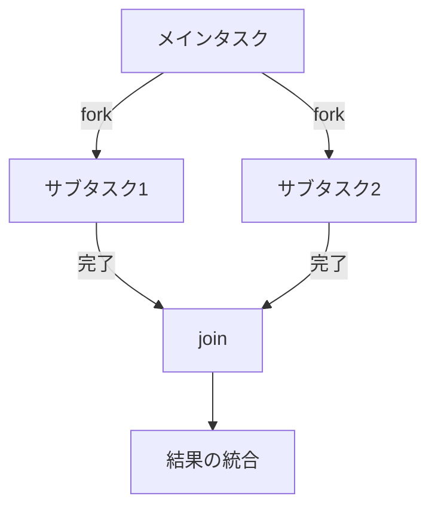
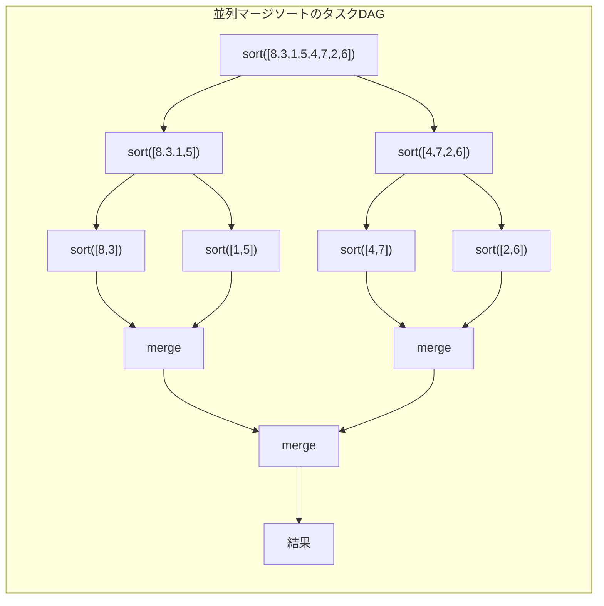
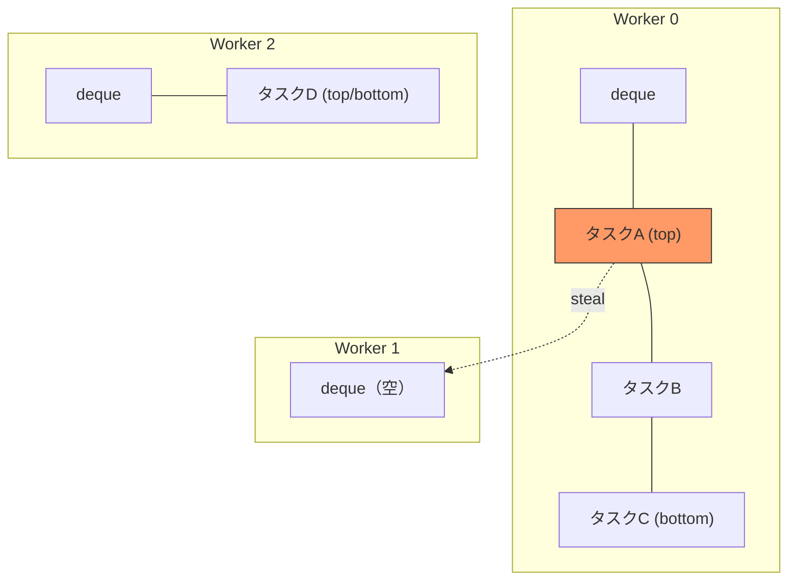
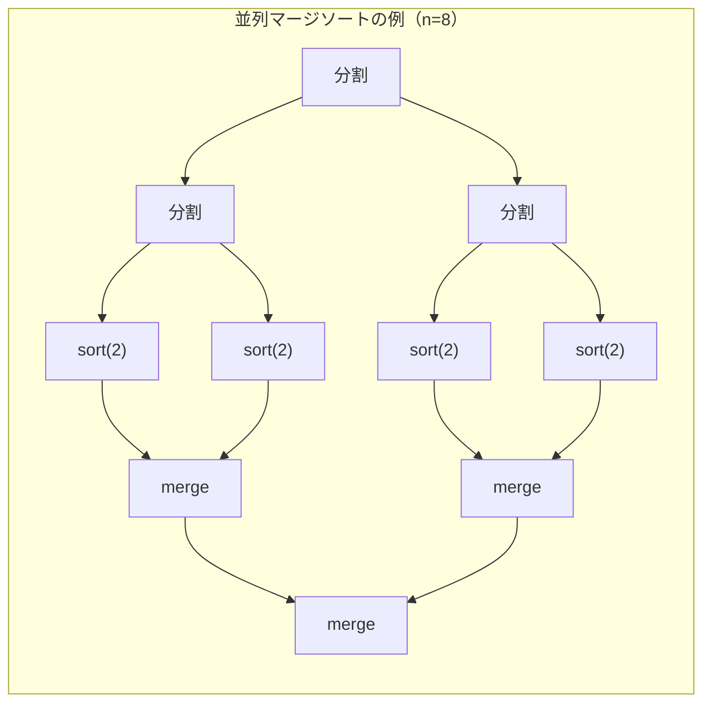
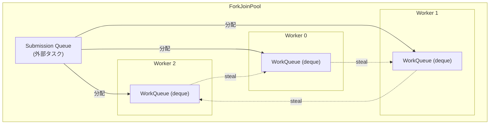
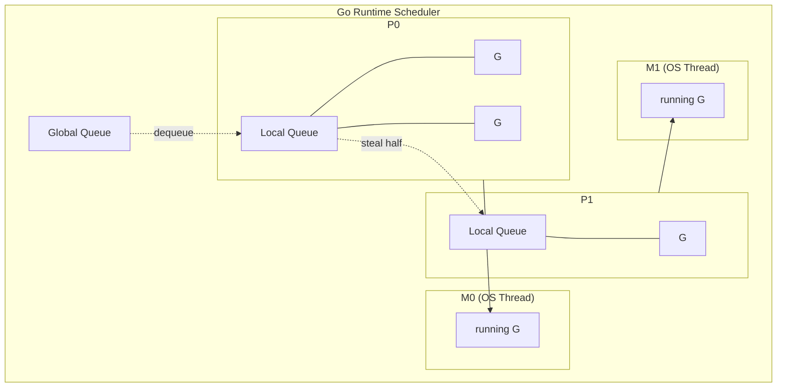
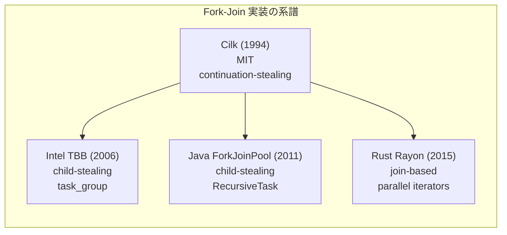

# Fork-Join モデルとワークスティーリング

## 背景と動機

### なぜ並列処理が必要なのか

2005年頃を境に、CPU のシングルスレッド性能向上は鈍化した。クロック周波数の向上は消費電力と発熱の壁（"Power Wall"）に阻まれ、代わりにマルチコア化が進んだ。この転換により、プログラムが高速に動作するためには、複数コアを効率的に活用する並列プログラミングが不可避となった。

しかし、並列プログラミングには本質的な難しさがある。タスクの分割、同期、負荷分散を手動で行うと、デッドロックやレースコンディションといった並行処理特有のバグに悩まされ、開発コストが大幅に増加する。Fork-Join モデルは、この複雑さを構造化された形で管理するための計算モデルである。

### タスク並列とデータ並列

並列処理には大きく分けて2つのパラダイムがある。

**タスク並列（Task Parallelism）** は、異なる処理を複数のプロセッサで同時に実行する方式である。たとえば、Web サーバーがリクエストの受付・処理・レスポンス生成を異なるスレッドで並行して行うケースがこれに該当する。

**データ並列（Data Parallelism）** は、同じ処理を異なるデータに対して同時に適用する方式である。大規模配列の各要素に同一の変換を施すような場面で効果を発揮する。GPU の SIMD 演算はデータ並列の典型例である。

Fork-Join モデルは主にタスク並列に分類されるが、データ並列的な問題（たとえば配列の並列ソート）にも自然に適用できる。分割統治法によって問題をサブタスクに分解し、それぞれを独立に処理するという構造が、両パラダイムの橋渡しとなっている。

### 分割統治法との関係

Fork-Join モデルの本質は、分割統治法（Divide and Conquer）の並列化にある。分割統治法は以下の3段階で構成される。

1. **分割（Divide）**: 問題を小さなサブ問題に分割する
2. **統治（Conquer）**: 各サブ問題を再帰的に解く
3. **結合（Combine）**: サブ問題の解を統合して元の問題の解を得る

逐次的な分割統治法では、サブ問題を1つずつ順番に解くが、多くの場合サブ問題間に依存関係はない。Fork-Join モデルはこの独立性を利用し、「分割」の段階で新しいタスクを fork（生成）し、「結合」の段階で join（合流）することで、自然な形で並列性を引き出す。

```
sequential:     solve(left) → solve(right) → merge
fork-join:      fork(solve(left)) | fork(solve(right)) → join → merge
```

この対応関係により、既存の分割統治アルゴリズム（MergeSort、QuickSort、行列乗算など）を最小限のコード変更で並列化できる。

## Fork-Join モデルの基本概念

### Fork と Join の意味

Fork-Join モデルにおける2つの基本操作を定義する。

- **Fork**: 現在のタスクが新しい子タスクを生成し、その子タスクが非同期に実行可能な状態になること。親タスクは子タスクの完了を待たずに自身の処理を続行できる。
- **Join**: 親タスクが、fork した子タスクの完了を待機すること。join が完了した時点で、子タスクの計算結果を安全に利用できる。

この2つの操作の組み合わせにより、計算の並列性と同期が表現される。



### 再帰的なタスク生成

Fork-Join モデルの強力さは、タスクがさらに子タスクを再帰的に生成できる点にある。たとえば、並列マージソートでは以下のように動作する。

```java
// Parallel merge sort using fork-join pattern (pseudocode)
Result solve(Problem p) {
    if (p.size() <= THRESHOLD) {
        return sequentialSolve(p);  // base case
    }
    Problem left = p.leftHalf();
    Problem right = p.rightHalf();

    Task t1 = fork(solve(left));   // spawn child task
    Result r2 = solve(right);      // continue in current task
    Result r1 = t1.join();         // wait for child

    return merge(r1, r2);
}
```

ここで重要なパターンがある。**2つのサブ問題のうち、一方だけを fork し、もう一方は現在のタスクで直接実行する**。これを "fork-join idiom" と呼ぶ。両方を fork すると無駄なタスク生成が発生し、現在のワーカースレッドが遊んでしまう。

### DAG としてのタスクグラフ

Fork-Join 計算は、有向非巡回グラフ（DAG: Directed Acyclic Graph）として表現できる。



DAG の各ノードはタスク（計算単位）を表し、辺は依存関係を表す。辺のないノード同士は並列に実行可能である。このグラフ構造から、計算の最大並列度や最短完了時間を理論的に解析できる。

DAG を用いた表現の利点は以下の通りである。

- **並列性の可視化**: グラフの幅（同時に実行可能なタスクの最大数）が並列度を示す
- **クリティカルパスの特定**: 最長経路が理論的な最短実行時間を決定する
- **依存関係の明示**: タスク間の順序制約が明確になる

### Fully Strict な計算と Terminally Strict な計算

Fork-Join モデルには制約の強さに応じたバリエーションがある。

**Fully Strict（完全厳密）** な計算では、子タスクを join できるのは、その子タスクを fork した親タスクだけである。つまり、タスクの合流は必ずタスクの生成と対になる。Cilk の `spawn`/`sync` はこのモデルに従う。

**Terminally Strict（終端厳密）** な計算では、子タスクの結果を他のタスクが参照できる。Java の `ForkJoinTask` はこの柔軟性を提供する。

Fully Strict モデルの利点は、タスクグラフがシリーズ-パラレル（SP）グラフとなり、ワークスティーリングスケジューラの解析が容易になることである。

## ワークスティーリング

### スケジューリングの課題

Fork-Join モデルで生成されるタスクを複数のプロセッサに割り当てる方法は、性能に直結する重要な問題である。

ナイーブなアプローチとして、**中央集権的なタスクキュー** を使う方法がある。すべてのタスクを1つの共有キューに入れ、空いたプロセッサが取り出す。しかし、この方式にはボトルネックがある。

- キューへのアクセスが競合し、ロックの争奪が発生する
- タスク数が膨大な場合、キュー自体がスケーラビリティの限界となる
- データの局所性（キャッシュ効率）が考慮されない

**静的分割** も別のアプローチだが、タスクの実行時間が不均一な場合に負荷の偏りが生じる。再帰的に生成されるタスクでは、事前に実行時間を予測することが困難である。

ワークスティーリングは、これらの問題を解決するスケジューリング手法である。

### Cilk の設計

ワークスティーリングの理論と実装は、MIT の Cilk プロジェクト（1994年〜）によって確立された。Charles E. Leiserson と Robert Blumofe の研究が基盤となっている。Cilk の設計原則は以下の通りである。

**原則1: ワーカーごとにローカル deque を持つ**

各ワーカースレッドは、自分用の両端キュー（deque: double-ended queue）を持つ。新しいタスクを fork すると、そのタスクは自身の deque の底（bottom）に追加される。自分のタスクを実行する際は、deque の底から取り出す（LIFO: Last-In-First-Out）。

**原則2: 暇なワーカーが他のワーカーから盗む**

自分の deque が空になったワーカーは、ランダムに選んだ他のワーカーの deque の先頭（top）からタスクを盗む（FIFO: First-In-First-Out）。



**原則3: Child-stealing ではなく Continuation-stealing**

Cilk は「continuation-stealing」（別名 "work-first" 原則）を採用している。タスクが `spawn` を実行すると、親の「続き（continuation）」を deque に置き、子タスクの実行を直ちに開始する。これにより、逐次実行とほぼ同じ実行パスを辿ることになり、キャッシュの局所性が保たれる。

対照的な方式として「child-stealing」がある。こちらでは、fork した子タスクを deque に置き、親が自身の処理を続行する。Java の ForkJoinPool はこの方式を採用している。

### Deque の役割と構造

ワークスティーリングの中核データ構造は、ロックフリーな deque（通称 "Chase-Lev deque" または "ABP deque"）である。

```
         top (steal side)
           ↓
        ┌──────────┐
        │  task_3   │  ← 最も古い（最も大きい）タスク
        ├──────────┤
        │  task_2   │
        ├──────────┤
        │  task_1   │  ← 最も新しい（最も小さい）タスク
        └──────────┘
           ↑
        bottom (owner side)
```

この deque には以下の性質がある。

- **所有者（Owner）** は bottom からの push/pop のみを行う。これは通常のスタック操作と同じであり、同期のコストがほぼゼロである
- **窃取者（Thief）** は top からの pop（steal）を行う。これには CAS（Compare-And-Swap）操作が必要だが、競合が発生するのは deque にタスクが1つしかない場合だけである
- top から盗むことで、再帰ツリーの上位にある大きなタスクが盗まれる。大きなタスクは盗んだ先で再帰的に分割されるため、盗む回数を少なく抑えられる

Chase と Lev による効率的な deque 実装のポイントは以下の通りである。

```c
// Simplified Chase-Lev deque
struct Deque {
    atomic<int64_t> top;
    atomic<int64_t> bottom;
    atomic<Task**> array;  // circular buffer
};

void push(Deque *dq, Task *task) {
    int64_t b = load_relaxed(&dq->bottom);
    int64_t t = load_acquire(&dq->top);
    // Resize if full
    if (b - t >= capacity(dq->array)) {
        resize(dq);
    }
    store_relaxed(&dq->array[b % capacity], task);
    fence_release();
    store_relaxed(&dq->bottom, b + 1);
}

Task* pop(Deque *dq) {
    int64_t b = load_relaxed(&dq->bottom) - 1;
    store_relaxed(&dq->bottom, b);
    fence_seq_cst();
    int64_t t = load_relaxed(&dq->top);
    if (t <= b) {
        // Non-empty: no contention
        return load_relaxed(&dq->array[b % capacity]);
    }
    if (t == b) {
        // One element: race with steal
        if (CAS(&dq->top, t, t + 1)) {
            store_relaxed(&dq->bottom, t + 1);
            return load_relaxed(&dq->array[b % capacity]);
        }
        store_relaxed(&dq->bottom, t + 1);
        return NULL;  // lost race
    }
    // Empty
    store_relaxed(&dq->bottom, t);
    return NULL;
}

Task* steal(Deque *dq) {
    int64_t t = load_acquire(&dq->top);
    fence_seq_cst();
    int64_t b = load_acquire(&dq->bottom);
    if (t < b) {
        Task *task = load_relaxed(&dq->array[t % capacity]);
        if (CAS(&dq->top, t, t + 1)) {
            return task;
        }
        return NULL;  // lost race
    }
    return NULL;  // empty
}
```

重要な設計判断は以下の通りである。

- 所有者の操作（push/pop）は通常パスでアトミック操作を必要としない
- CAS が必要になるのは deque に要素が1つしかない場合だけ
- メモリフェンスの配置により、コストの高い同期を最小限に抑える

### ランダムスティーリング

暇なワーカーがどのワーカーから盗むかを決めるポリシーとして、Cilk は**一様ランダム選択**を採用している。この単純な戦略が最適に近い性能を発揮する理由は、理論的に証明されている。

ランダムスティーリングのアルゴリズムは以下の通りである。

```
procedure work_stealing_loop(worker_id, num_workers):
    while tasks remain:
        task = my_deque.pop()
        if task != NULL:
            execute(task)
        else:
            // My deque is empty, try to steal
            victim = random_choice(0..num_workers-1, excluding worker_id)
            stolen = victim.deque.steal()
            if stolen != NULL:
                execute(stolen)
            else:
                // Optionally yield or backoff
                yield()
```

ランダム選択の利点は以下の通りである。

1. **均等な負荷分散**: 長期的に見ると、各ワーカーがほぼ均等にタスクを盗む対象となる
2. **低オーバーヘッド**: 乱数生成は O(1) で、グローバルな状態を参照する必要がない
3. **理論的保証**: 期待実行時間が最適に近いことが証明されている
4. **ロバスト性**: 特定のワーカーに盗みが集中するホットスポットが生じにくい

## 理論的解析

### ワーク（Work）とスパン（Span）

Fork-Join 計算の性能を解析するための2つの基本量を定義する。

**ワーク（Work）** $T_1$ は、1つのプロセッサで全タスクを逐次的に実行した場合の総計算量である。すなわち、DAG のすべてのノードの実行時間の合計である。

**スパン（Span）** $T_\infty$ は、無限個のプロセッサが利用可能な場合の最短実行時間である。これは DAG の最長経路（クリティカルパス）の長さに等しい。



並列マージソートの場合、以下のようになる。

- ワーク: $T_1 = O(n \log n)$（逐次マージソートと同じ）
- スパン: $T_\infty = O(\log^2 n)$（並列マージを使う場合）または $T_\infty = O(n)$（逐次マージの場合）

これらの量から、以下の下界が導かれる。

$$T_P \geq \max\left(\frac{T_1}{P}, T_\infty\right)$$

ここで $T_P$ は $P$ 個のプロセッサでの実行時間である。第一項はワークを $P$ 個のプロセッサで均等に分割した場合の理想値、第二項は無限のプロセッサがあっても超えられないクリティカルパスの制約である。

### 並列度（Parallelism）

**並列度** は、計算がどれだけ並列化可能かを示す指標であり、以下のように定義される。

$$\text{Parallelism} = \frac{T_1}{T_\infty}$$

この値は、計算を効率的に並列実行するために利用できるプロセッサの上限数を意味する。プロセッサ数 $P$ がこの値を大きく超えると、余剰プロセッサは遊んでしまう。

たとえば、$T_1 = 10^9$ ステップ、$T_\infty = 10^4$ ステップの計算では、並列度は $10^5$ となり、10万プロセッサまでは効率的にスケールする可能性がある。

### Brent の定理

Brent の定理（1974年）は、任意の DAG スケジューリングに関する上界を与える。

::: tip Brent の定理
任意の DAG 計算を $P$ 個のプロセッサで実行する場合、貪欲スケジューリング（実行可能なタスクがある限りプロセッサを遊ばせない）のもとで、実行時間 $T_P$ は以下を満たす。

$$T_P \leq \frac{T_1}{P} + T_\infty$$
:::

この定理の意味は直感的に理解できる。全体のワーク $T_1$ を $P$ 個のプロセッサで分担した時間に加え、クリティカルパス $T_\infty$ 分の追加遅延が最悪でも生じる、ということである。

**スピードアップ** を $S_P = T_1 / T_P$ と定義すると、Brent の定理から以下が導かれる。

$$S_P \geq \frac{T_1}{\frac{T_1}{P} + T_\infty} = \frac{P}{1 + P \cdot \frac{T_\infty}{T_1}}$$

$T_\infty \ll T_1 / P$、すなわちスパンが十分に小さい場合、$S_P \approx P$ となり、線形スピードアップが達成される。

### ワークスティーリングの理論的保証

Blumofe と Leiserson（1999年）は、ランダムワークスティーリングスケジューラの期待実行時間について以下の定理を証明した。

::: tip ランダムワークスティーリング定理
Fully Strict な Fork-Join 計算に対し、$P$ 個のプロセッサ上のランダムワークスティーリングスケジューラの期待実行時間は以下を満たす。

$$E[T_P] \leq \frac{T_1}{P} + O(T_\infty)$$
:::

この結果は、Brent の定理の上界を期待値の意味で（定数倍の誤差の範囲で）達成することを示している。特に重要な帰結として、以下が導かれる。

- $P \leq T_1 / T_\infty$（プロセッサ数が並列度以下）のとき、期待線形スピードアップが得られる
- steal の総回数の期待値は $O(P \cdot T_\infty)$ であり、ワーク $T_1$ に比べて小さい

後者の結果は、通信コストの観点からも重要である。steal 操作はプロセッサ間のデータ転送を伴うため、その回数が少ないことは実用上の性能に直結する。

### 空間計算量

ワークスティーリングスケジューラのスタック空間使用量についても理論的な保証がある。

逐次実行時のスタック空間を $S_1$ とすると、$P$ プロセッサでのワークスティーリング実行に必要な空間は $O(P \cdot S_1)$ である。これは各ワーカーが最悪でも逐次実行と同程度のスタック深さを持つことから導かれる。

この性質は、BFS（幅優先探索）型のスケジューラと対照的である。BFS スケジューラでは、すべての並列タスクを同時に生成するため、空間使用量が指数的に増加しうる。ワークスティーリングの DFS（深さ優先探索）的な性質が、空間効率の良さを保証している。

## 実装

### Java ForkJoinPool

Java 7 で導入された `ForkJoinPool`（Doug Lea による設計・実装）は、ワークスティーリングの最も広く使われている実装の一つである。

#### 基本的な使い方

```java
import java.util.concurrent.RecursiveTask;
import java.util.concurrent.ForkJoinPool;

public class ParallelMergeSort extends RecursiveTask<int[]> {
    private static final int THRESHOLD = 1024;
    private final int[] array;
    private final int lo, hi;

    public ParallelMergeSort(int[] array, int lo, int hi) {
        this.array = array;
        this.lo = lo;
        this.hi = hi;
    }

    @Override
    protected int[] compute() {
        if (hi - lo <= THRESHOLD) {
            return sequentialSort(array, lo, hi);
        }
        int mid = lo + (hi - lo) / 2;

        // Fork the left half
        ParallelMergeSort left = new ParallelMergeSort(array, lo, mid);
        left.fork();

        // Compute the right half in current task
        ParallelMergeSort right = new ParallelMergeSort(array, mid, hi);
        int[] rightResult = right.compute();

        // Join the left half
        int[] leftResult = left.join();

        return merge(leftResult, rightResult);
    }

    private int[] sequentialSort(int[] arr, int lo, int hi) {
        int[] sub = java.util.Arrays.copyOfRange(arr, lo, hi);
        java.util.Arrays.sort(sub);
        return sub;
    }

    private int[] merge(int[] a, int[] b) {
        int[] result = new int[a.length + b.length];
        int i = 0, j = 0, k = 0;
        while (i < a.length && j < b.length) {
            result[k++] = (a[i] <= b[j]) ? a[i++] : b[j++];
        }
        while (i < a.length) result[k++] = a[i++];
        while (j < b.length) result[k++] = b[j++];
        return result;
    }

    public static void main(String[] args) {
        int[] data = new int[10_000_000];
        // ... fill data ...

        ForkJoinPool pool = new ForkJoinPool();  // default: # of available processors
        int[] sorted = pool.invoke(new ParallelMergeSort(data, 0, data.length));
    }
}
```

#### ForkJoinPool の内部構造

`ForkJoinPool` の内部は以下のように構成されている。



主要な設計上の特徴は以下の通りである。

- **Child-stealing 方式**: Cilk と異なり、fork された子タスクが deque に置かれ、親タスクが続行する
- **Compensating threads**: ワーカーが `join` でブロックされる場合、プール内のアクティブスレッド数を維持するために補償スレッドが生成されることがある
- **Common pool**: Java 8 以降、`ForkJoinPool.commonPool()` が提供され、parallel stream やCompletableFuture のデフォルト実行基盤として利用される
- **Work queue の偶奇分離**: 外部から submit されたタスク用のキュー（偶数インデックス）とワーカー固有のキュー（奇数インデックス）が分離されている

#### Java Parallel Streams との関係

Java 8 の parallel stream は内部的に ForkJoinPool の common pool を利用する。

```java
// Parallel stream using ForkJoinPool internally
long count = list.parallelStream()
    .filter(x -> x > 0)
    .map(x -> x * 2)
    .count();
```

注意点として、common pool はアプリケーション全体で共有されるため、I/O バウンドなタスクを parallel stream で実行すると、他の並列処理に悪影響を及ぼすことがある。I/O バウンドなタスクには専用の Executor を使用すべきである。

### Rust Rayon

Rayon は Rust の並列処理ライブラリで、ワークスティーリングを基盤としている。Rust の所有権システムとの統合により、データ競合をコンパイル時に防止できる点が特徴的である。

#### 基本的な使い方

```rust
use rayon::prelude::*;

fn main() {
    let mut data = vec![5, 3, 8, 1, 9, 2, 7, 4, 6];

    // Parallel sort
    data.par_sort();

    // Parallel iterator
    let sum: i64 = (0..1_000_000i64)
        .into_par_iter()
        .filter(|&x| x % 2 == 0)
        .map(|x| x * x)
        .sum();

    println!("Sum of squares of evens: {}", sum);
}
```

#### join による明示的な Fork-Join

Rayon の `join` 関数は、Fork-Join パターンの最も基本的な API である。

```rust
use rayon;

fn parallel_merge_sort<T: Ord + Send>(v: &mut [T]) {
    if v.len() <= 32 {
        v.sort();
        return;
    }
    let mid = v.len() / 2;
    let (left, right) = v.split_at_mut(mid);

    // Fork-join: execute both halves in parallel
    rayon::join(
        || parallel_merge_sort(left),
        || parallel_merge_sort(right),
    );

    // Merge step (in-place merge would go here)
    // For simplicity, using a temporary buffer
    merge_in_place(v, mid);
}

fn merge_in_place<T: Ord + Send>(v: &mut [T], mid: usize) {
    // Merge the two sorted halves
    let mut buf: Vec<T> = Vec::with_capacity(v.len());
    // ... merge logic ...
}
```

Rayon の `join` は、実装上は右側のクロージャを即座に実行し、左側をタスクとして deque に追加する。他のワーカーが暇であれば左側を盗んで並列に実行する。

#### Rayon の内部アーキテクチャ

Rayon のスケジューラは以下の構成要素からなる。

1. **ThreadPool**: グローバルなスレッドプール（デフォルトでは CPU コア数分のスレッド）
2. **Worker thread**: 各スレッドが deque を保持
3. **Job**: 実行可能な計算単位（クロージャ）
4. **Latch**: join の同期に使われる軽量な同期プリミティブ

Rayon の設計で注目すべき点は、**スコープ付きスレッド** の概念との統合である。`rayon::scope` を使うと、スコープ内で生成されたタスクがスコープ終了時に必ず完了する保証が得られる。これにより、スタック上のデータへの安全な並列アクセスが可能になる。

```rust
fn example(data: &[i32]) {
    rayon::scope(|s| {
        // Both closures can safely borrow 'data'
        // because they complete before scope exits
        s.spawn(|_| {
            let sum: i32 = data[..data.len()/2].iter().sum();
            println!("Left sum: {}", sum);
        });
        s.spawn(|_| {
            let sum: i32 = data[data.len()/2..].iter().sum();
            println!("Right sum: {}", sum);
        });
    });
    // All spawned tasks have completed here
}
```

### Go の goroutine との比較

Go は goroutine と channel による CSP（Communicating Sequential Processes）モデルを採用しており、Fork-Join とは異なるアプローチを取っている。しかし、Go のランタイムスケジューラもワークスティーリングの要素を取り入れている。

#### Go のスケジューラ（GMP モデル）

Go のスケジューラは以下の3つの概念で構成される。

- **G（Goroutine）**: 軽量な実行単位
- **M（Machine）**: OS スレッド
- **P（Processor）**: 論理プロセッサ（ローカルの実行キューを持つ）



Go の P はローカルキューを持ち、キューが空になると他の P のキューの半分を盗む。この仕組みは Fork-Join のワークスティーリングと共通している。

ただし、重要な違いがある。

| 特性 | Fork-Join (Cilk/Rayon) | Go goroutine |
|------|----------------------|--------------|
| タスクモデル | 構造化された再帰タスク | 非構造的な軽量スレッド |
| 同期 | join（暗黙の構造） | channel / sync パッケージ |
| deque の順序 | LIFO (owner) / FIFO (thief) | FIFO ベース |
| 設計目標 | 分割統治の最適化 | 汎用的な並行処理 |
| 理論的保証 | ワーク・スパン解析に基づく | 実験的な性能チューニング |

Go で Fork-Join 的なパターンを実現するには、`sync.WaitGroup` や `errgroup` を明示的に使用する必要がある。

```go
package main

import (
	"fmt"
	"sync"
)

func parallelSum(data []int) int {
	if len(data) <= 1000 {
		sum := 0
		for _, v := range data {
			sum += v
		}
		return sum
	}

	mid := len(data) / 2
	var leftSum, rightSum int
	var wg sync.WaitGroup
	wg.Add(1)

	// Fork
	go func() {
		defer wg.Done()
		leftSum = parallelSum(data[:mid])
	}()

	// Continue in current goroutine
	rightSum = parallelSum(data[mid:])

	// Join
	wg.Wait()

	return leftSum + rightSum
}

func main() {
	data := make([]int, 10_000_000)
	for i := range data {
		data[i] = i
	}
	fmt.Println(parallelSum(data))
}
```

### 実装の比較まとめ



各実装の特性比較は以下の通りである。

| 実装 | 言語 | stealing 方式 | タスク表現 | 主な用途 |
|------|------|--------------|-----------|---------|
| Cilk Plus | C/C++ | continuation | `cilk_spawn` / `cilk_sync` | HPC |
| Intel TBB | C++ | child | `task_group` | 並列アルゴリズム |
| Java ForkJoinPool | Java | child | `RecursiveTask` / `RecursiveAction` | parallel stream |
| Rayon | Rust | hybrid | `join` / `par_iter` | 安全な並列処理 |
| .NET TPL | C# | child | `Parallel.Invoke` / `Task` | 汎用並列処理 |

## 実装考慮事項

### グラニュラリティ制御

Fork-Join モデルの実用上最も重要なチューニングポイントは、タスクの粒度（granularity）制御である。

**粒度が細かすぎる場合**: タスクの生成・管理のオーバーヘッドが、計算そのものの時間を上回る。fork/join の操作にはメモリ確保、deque 操作、メモリフェンスなどのコストがかかる。

**粒度が粗すぎる場合**: 並列度が不足し、一部のプロセッサが遊んでしまう。負荷の不均衡が生じやすくなる。

一般的な指針として、**逐次処理のカットオフ閾値** を設定する。タスクのサイズが閾値以下になったら、それ以上の分割をやめて逐次的に処理する。

```java
// Granularity control example
@Override
protected Long compute() {
    if (hi - lo <= THRESHOLD) {
        // Sequential fallback: no more forking
        long sum = 0;
        for (int i = lo; i < hi; i++) {
            sum += process(array[i]);
        }
        return sum;
    }
    // Otherwise, fork
    int mid = lo + (hi - lo) / 2;
    SumTask left = new SumTask(array, lo, mid);
    SumTask right = new SumTask(array, mid, hi);
    left.fork();
    Long rightResult = right.compute();
    Long leftResult = left.join();
    return leftResult + rightResult;
}
```

最適な閾値の決定方法にはいくつかのアプローチがある。

1. **経験則**: タスクあたりの計算量が数千〜数万命令になるよう設定する。Cilk の経験則では、fork/join のオーバーヘッドが計算量の 1% 以下になるようにする
2. **自動チューニング**: 実行時にタスクの実行時間を計測し、閾値を動的に調整する
3. **遅延分割（Lazy Splitting）**: Rayon の parallel iterator はこの手法を採用しており、steal が発生したときにのみ分割を行う

Rayon の遅延分割の仕組みを以下に示す。

```
初期状態: [0, 1, 2, 3, 4, 5, 6, 7, 8, 9]  → Worker 0 が処理中

Worker 1 が steal:
  Worker 0: [0, 1, 2, 3, 4]
  Worker 1: [5, 6, 7, 8, 9]  ← 盗まれた部分

Worker 2 が steal (Worker 0 から):
  Worker 0: [0, 1, 2]
  Worker 2: [3, 4]
  Worker 1: [5, 6, 7, 8, 9]
```

この方式では、並列度が十分であれば分割が自動的に停止するため、閾値の手動調整が不要になる。

### キャッシュ効率

ワークスティーリングのキャッシュ効率は、その DFS（深さ優先探索）的な実行パスに由来する。

**ローカル実行のキャッシュ効率**: 各ワーカーは自身の deque から LIFO でタスクを取り出す。これは再帰の深さ優先実行に対応し、逐次実行と同じメモリアクセスパターンを持つ。結果として、キャッシュミスが逐次実行と同程度に抑えられる。

**steal 時のキャッシュコスト**: deque の上部（top）から盗まれるタスクは、再帰ツリーの上位に位置する大きなタスクである。このタスクが参照するデータは大きいため、キャッシュに載っていなくても、続く計算で十分に再利用される。

Acar, Blelloch, Blumofe（2002年）は、ワークスティーリングスケジューラのキャッシュミス数について以下の上界を示した。

$$\text{Cache misses} \leq Q_1 + O\left(\frac{C \cdot P \cdot T_\infty}{L}\right)$$

ここで $Q_1$ は逐次実行時のキャッシュミス数、$C$ はキャッシュサイズ、$L$ はキャッシュラインサイズである。第二項は steal によって追加的に発生するキャッシュミスの上界であり、steal の回数（$O(P \cdot T_\infty)$）に比例する。

### False Sharing への対策

マルチプロセッサ環境では、異なるプロセッサが同じキャッシュラインの異なる部分を書き換えると、キャッシュコヒーレンスプロトコルによるオーバーヘッドが発生する。これを false sharing と呼ぶ。

ワークスティーリングの deque 自体が false sharing の原因となりうる。`top` と `bottom` が同じキャッシュラインに配置されると、所有者の `push`/`pop` と窃取者の `steal` が互いのキャッシュラインを無効化する。

```c
// Bad: top and bottom may share a cache line
struct Deque {
    atomic<int64_t> top;
    atomic<int64_t> bottom;
    // ...
};

// Good: padding to separate cache lines
struct Deque {
    atomic<int64_t> top;
    char padding1[64 - sizeof(atomic<int64_t>)];  // cache line padding
    atomic<int64_t> bottom;
    char padding2[64 - sizeof(atomic<int64_t>)];
    // ...
};
```

Java では `@Contended` アノテーション（JDK 内部用）や手動のパディングフィールドで対策する。

### 例外処理とキャンセル

Fork-Join モデルにおける例外処理は、逐次プログラミングよりも複雑である。子タスクで発生した例外は、join 時に親タスクに伝播させる必要がある。

Java の `ForkJoinTask` は以下の方式を取っている。

- 子タスクで例外が発生すると、その例外はタスクオブジェクトに保存される
- `join()` 呼び出し時に、保存された例外が再スローされる
- 複数の子タスクが同時に例外を発生させた場合、そのうちの1つが伝播し、残りは suppressed exceptions として保持される

キャンセルについても同様の考慮が必要である。一方の子タスクが失敗した場合、もう一方の子タスクの実行を中断したい場面がある。Java では `ForkJoinTask.cancel(true)` が用意されているが、実行中のタスクを確実に中断することは保証されない。Rayon では `join` のバリアントとして、一方が panic した場合にもう一方をキャンセルしない `join` と、スコープ全体をキャンセルする `scope` が使い分けられる。

## 実世界での評価

### 適用事例

Fork-Join モデルとワークスティーリングは、以下のような場面で広く活用されている。

**並列ソート**: 配列のソートは Fork-Join の典型的な応用である。Java の `Arrays.parallelSort()` は内部的に ForkJoinPool を使用し、逐次版のTimSort に対して4コア環境で約2.5〜3倍のスピードアップを達成する。

**行列演算**: Strassen のアルゴリズムや行列乗算の分割統治的実装は、Fork-Join で自然に並列化できる。Cilk で実装された行列乗算は、手動チューニングされた BLAS ライブラリに迫る性能を示した。

**画像処理**: 画像のフィルタリングやレンダリングは、画像をタイルに分割して並列処理する。タイルごとの処理時間が不均衡な場合（複雑な領域と単純な領域が混在）、ワークスティーリングが負荷分散を自動的に行う。

**コンパイラの並列化**: GCC や LLVM のビルドプロセスでは、翻訳単位間の並列コンパイルに加え、翻訳単位内の最適化パスを並列化する試みがある。

**ゲームエンジン**: Unity や Unreal Engine は、レンダリング、物理演算、AI のタスクを並列に処理するためにワークスティーリング型のタスクスケジューラを内部的に使用している。

### 性能特性と制約

ワークスティーリングの実用上の性能特性を以下にまとめる。

**スケーラビリティ**: プロセッサ数が並列度を下回る範囲では、ほぼ線形のスピードアップが得られる。8コア環境での典型的なスピードアップは5〜7倍（理論上限8倍）である。

**オーバーヘッド**: fork/join の1回あたりのコストは、数百ナノ秒程度である。Java ForkJoinPool で約200〜500 ns、Rayon で約100〜300 ns が典型的な値である。このオーバーヘッドは、タスクの計算量が数マイクロ秒以上であれば無視できる。

**負荷不均衡への適応**: ワークスティーリングの最大の利点は、タスクの実行時間が不均一な場合にも効率的に負荷を分散できることである。静的分割では効率が50%程度に落ちるような不均衡なワークロードでも、ワークスティーリングは80〜90%の効率を維持できることが実験的に示されている。

### 制約と代替手法

Fork-Join モデルが適さない場面も存在する。

**I/O バウンドなタスク**: Fork-Join は計算集約的なタスクを想定しており、I/O 待ちでワーカースレッドがブロックされると、プール全体の性能が劣化する。I/O バウンドなタスクには、async/await ベースの非同期モデルやリアクティブプログラミングが適している。

**非構造的な並列性**: タスク間の依存関係が動的に決まる場合（たとえば、動的なグラフ計算）、Fork-Join の構造化された分割統治パターンにはうまく適合しない。タスクグラフが DAG で表現できない（サイクルがある）場合も同様である。

**通信集約的なタスク**: ワークスティーリングはタスク間の通信を最小化する設計になっている。タスク間で頻繁にデータをやり取りする必要がある場合は、アクターモデルや CSP のようなメッセージパッシングモデルの方が適切である。

**リアルタイムシステム**: ワークスティーリングの実行時間は確率的な保証しかなく、最悪ケースのレイテンシ保証が困難である。リアルタイムシステムには、静的スケジューリングや優先度ベースのスケジューリングが必要である。

### 今後の展望

Fork-Join モデルとワークスティーリングの研究は現在も活発に進められている。

**ヘテロジニアス環境**: CPU と GPU が混在する環境での Fork-Join スケジューリングは重要な研究課題である。タスクの特性（演算集約 vs メモリ集約）に応じて、CPU と GPU のどちらで実行するかを動的に決定するスケジューラの研究が進んでいる。

**NUMA 対応**: 大規模マルチソケットシステムでは、メモリアクセスのレイテンシがソケット間で異なる（NUMA: Non-Uniform Memory Access）。steal 先を NUMA トポロジに基づいて選択する NUMA-aware ワークスティーリングの研究がある。

**永続データ構造との統合**: 関数型プログラミングの永続データ構造（persistent data structures）と Fork-Join モデルを組み合わせることで、副作用のない安全な並列プログラミングを実現する試みがある。

**言語レベルの統合**: Rust の Rayon がそうであるように、型システムや所有権モデルと並列処理を統合することで、データ競合を構造的に排除する方向性が今後も重要になると考えられる。コンパイル時の安全性保証と実行時の効率性を両立させるアプローチは、並列プログラミングの民主化に貢献するだろう。

## まとめ

Fork-Join モデルは、分割統治法を並列化するための自然で強力な計算モデルである。ワークスティーリングスケジューラは、このモデルの実行基盤として、理論的にも実用的にも優れた特性を持つ。

重要なポイントを振り返る。

- Fork-Join は「fork で子タスクを生成し、join で結果を合流する」というシンプルな構造で、再帰的なタスク並列を表現する
- ワークスティーリングは、ワーカーごとの deque とランダムな steal により、低オーバーヘッドかつ高効率な負荷分散を実現する
- 理論的には、ワーク $T_1$ とスパン $T_\infty$ による解析が可能であり、期待線形スピードアップの保証がある
- グラニュラリティの適切な制御が実用上の最重要ポイントである
- Java ForkJoinPool、Rust Rayon など、成熟した実装が複数存在し、実用的に広く利用されている

逐次的な分割統治アルゴリズムを書ける開発者であれば、Fork-Join モデルを用いてそのアルゴリズムを効率的に並列化できる。この「逐次コードからの自然な拡張」こそが、Fork-Join モデルの最大の価値である。
