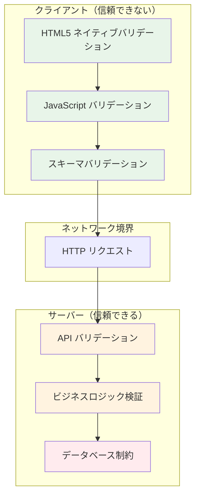
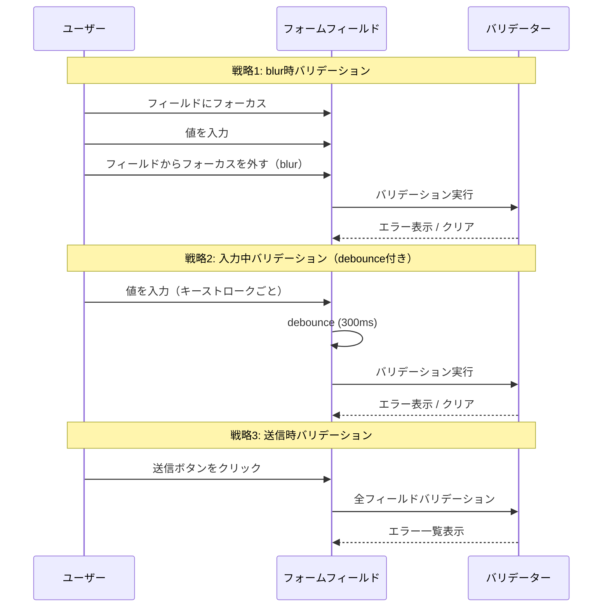
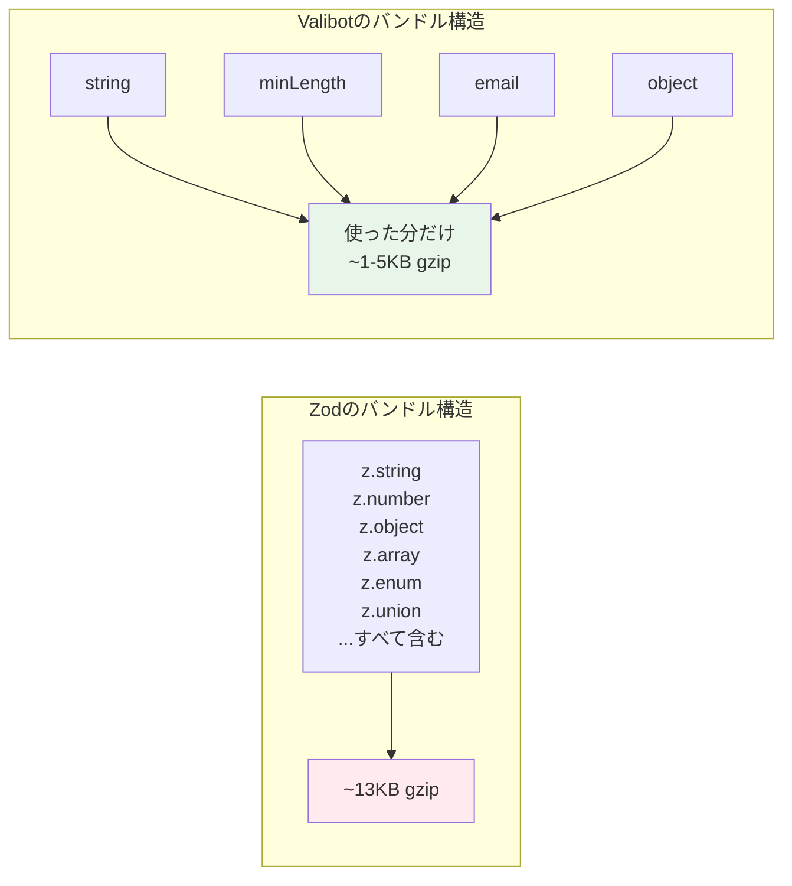
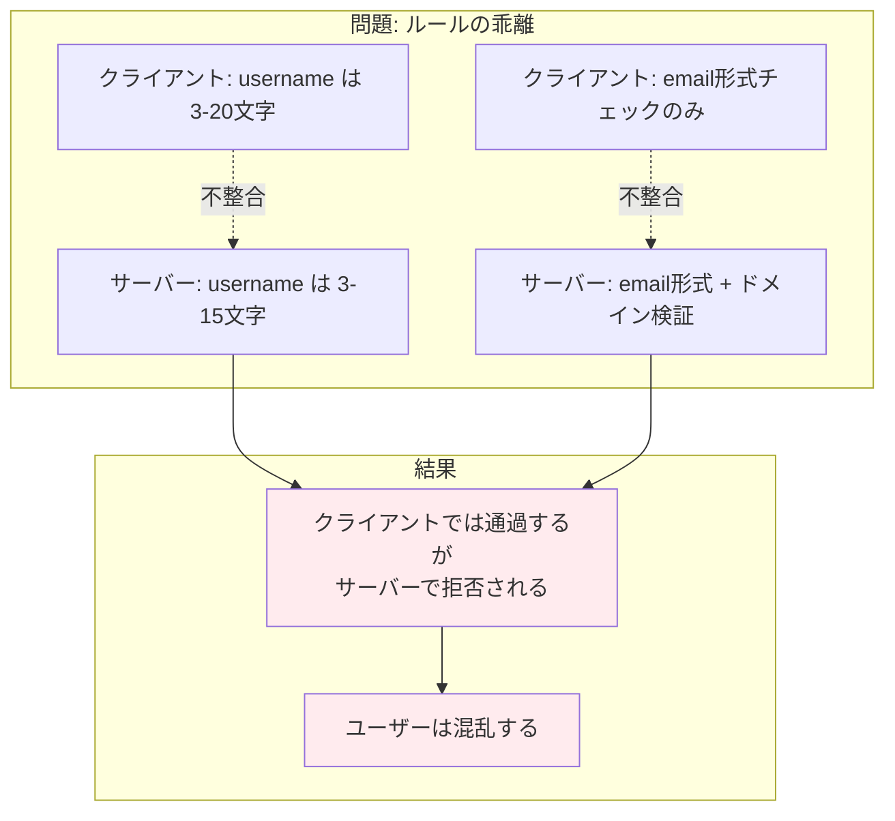
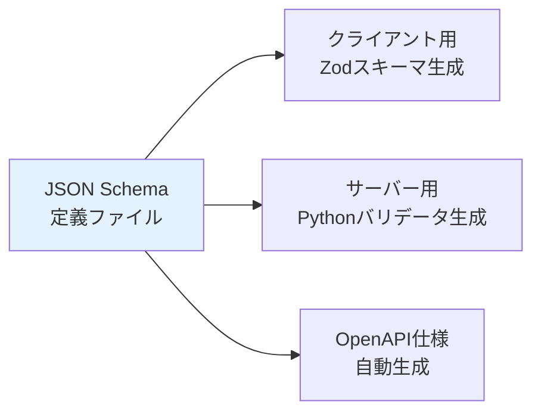
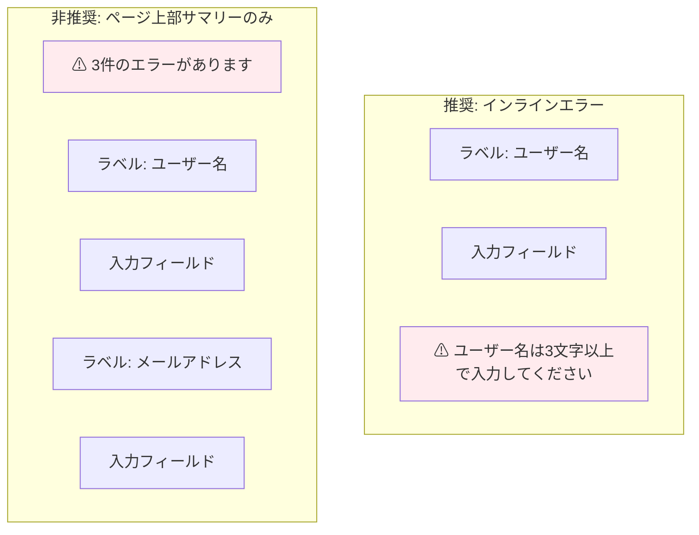
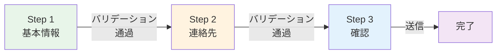
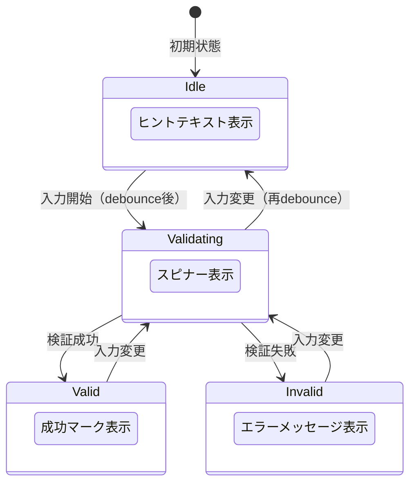
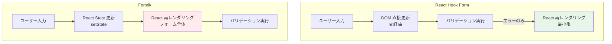
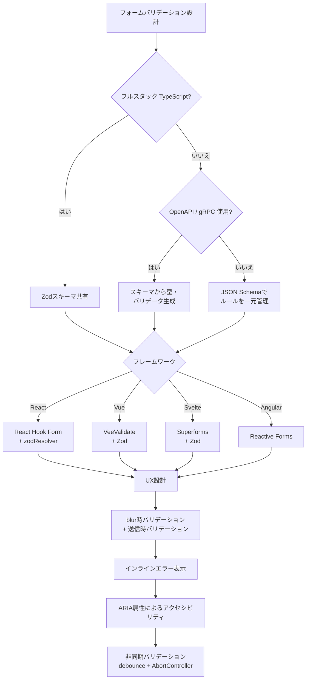

# フォームバリデーション設計

## 1. バリデーションの多層設計

### 1.1 なぜ多層が必要なのか

Webアプリケーションにおけるフォームバリデーションは、単なる「入力チェック」ではない。ユーザー体験の品質、データの整合性、そしてシステムのセキュリティを同時に担保する、アプリケーション設計の根幹に関わる問題である。

フォームバリデーションが複雑になる根本的な理由は、「信頼の境界（Trust Boundary）」の存在にある。クライアントサイドのコードはユーザーの手元で実行されるため、いかなるバリデーションも迂回される可能性がある。ブラウザのDevToolsでHTMLの `required` 属性を削除したり、JavaScriptを無効にしたり、あるいはcurlやPostmanで直接APIにリクエストを送ることは容易だ。したがって、クライアントサイドのバリデーションは「ユーザー体験の向上」が主目的であり、「セキュリティの担保」はサーバーサイドの責務である。



### 1.2 各層の役割と責務

多層バリデーションの設計においては、各層が明確な責務を持つ。

**第1層: HTML5ネイティブバリデーション**

最も軽量で、ブラウザが直接実行するバリデーション。JavaScriptが無効でも機能し、アクセシビリティ対応も標準で組み込まれている。ただし表現力に限界がある。

**第2層: JavaScriptバリデーション**

HTML5の限界を超えた複雑なバリデーションロジックを実装する。リアルタイムフィードバック、条件分岐バリデーション、フィールド間の相関チェックなど、柔軟な検証が可能になる。

**第3層: スキーマバリデーション**

Zod、Yup、Valibotなどのスキーマバリデーションライブラリを用いて、バリデーションルールを宣言的に定義する。型安全性とクライアント・サーバー間のルール共有を実現する中核的な層である。

**第4層: サーバーサイドバリデーション**

セキュリティの最終防衛線。クライアントを一切信頼せず、すべての入力を検証する。ビジネスルールの整合性チェック（例: メールアドレスの重複確認）もここで行う。

**第5層: データベース制約**

NOT NULL制約、UNIQUE制約、CHECK制約、外部キー制約など。アプリケーションのバグがあってもデータの整合性を守る最後の砦となる。

### 1.3 多層設計の原則

多層設計で守るべき原則は以下のとおりである。

1. **サーバーサイドは絶対に省略しない**: クライアントのバリデーションはあくまで補助。サーバーは常にすべてのルールを検証する
2. **同じルールを二重に書かない**: スキーマ共有により、クライアントとサーバーのバリデーションロジックを一元化する
3. **エラーメッセージは一貫させる**: どの層でエラーが検出されても、ユーザーに提示されるメッセージは統一する
4. **フィードバックは早く**: ネットワークラウンドトリップなしで検出できるエラーは、クライアント側で即座にフィードバックする

## 2. HTML5ネイティブバリデーション

### 2.1 Constraint Validation API

HTML5はフォーム要素に対する組み込みのバリデーション機構を提供している。これはConstraint Validation APIと呼ばれ、ブラウザが直接解釈・実行する。JavaScriptを一切書かなくても基本的なバリデーションが機能する点が最大の利点である。

```html
<form id="registration-form" novalidate>
  <!-- required: empty check -->
  <label for="username">ユーザー名</label>
  <input
    type="text"
    id="username"
    name="username"
    required
    minlength="3"
    maxlength="20"
    pattern="^[a-zA-Z0-9_]+$"
  />

  <!-- type="email": format check by browser -->
  <label for="email">メールアドレス</label>
  <input
    type="email"
    id="email"
    name="email"
    required
  />

  <!-- min/max: range check -->
  <label for="age">年齢</label>
  <input
    type="number"
    id="age"
    name="age"
    min="0"
    max="150"
    required
  />

  <!-- type="url": URL format check -->
  <label for="website">Webサイト</label>
  <input
    type="url"
    id="website"
    name="website"
  />

  <button type="submit">登録</button>
</form>
```

主要なバリデーション属性は以下のとおりである。

| 属性 | 用途 | 対象要素 |
|------|------|----------|
| `required` | 必須入力チェック | ほぼすべてのフォーム要素 |
| `minlength` / `maxlength` | 文字数制限 | `text`, `textarea` 等 |
| `min` / `max` | 数値範囲制限 | `number`, `date`, `range` 等 |
| `pattern` | 正規表現によるパターン検証 | `text`, `tel`, `search` 等 |
| `type` | 入力形式検証 | `email`, `url`, `number` 等 |
| `step` | 入力値の刻み幅 | `number`, `range`, `date` 等 |

### 2.2 ValidityStateオブジェクト

Constraint Validation APIの核心は `ValidityState` オブジェクトである。各フォーム要素は `validity` プロパティを通じてこのオブジェクトにアクセスでき、バリデーション状態を詳細に把握できる。

```javascript
const input = document.getElementById("username");

// Access the ValidityState object
const validity = input.validity;

// Each property represents a specific validation failure
console.log(validity.valueMissing);   // true if required but empty
console.log(validity.tooShort);       // true if shorter than minlength
console.log(validity.tooLong);        // true if longer than maxlength
console.log(validity.patternMismatch);// true if doesn't match pattern
console.log(validity.typeMismatch);   // true if type format is wrong
console.log(validity.rangeUnderflow); // true if value < min
console.log(validity.rangeOverflow);  // true if value > max
console.log(validity.stepMismatch);   // true if doesn't match step
console.log(validity.valid);          // true if all checks pass
```

### 2.3 カスタムバリデーションメッセージ

ブラウザのデフォルトエラーメッセージはブラウザごとに異なり、ローカライズの品質もまちまちである。`setCustomValidity()` メソッドを使えば、任意のメッセージに差し替えることができる。

```javascript
const passwordInput = document.getElementById("password");
const confirmInput = document.getElementById("password-confirm");

confirmInput.addEventListener("input", () => {
  if (confirmInput.value !== passwordInput.value) {
    // Set custom error message
    confirmInput.setCustomValidity("パスワードが一致しません");
  } else {
    // Clear custom error (empty string = valid)
    confirmInput.setCustomValidity("");
  }
});
```

### 2.4 ネイティブバリデーションの限界

HTML5ネイティブバリデーションだけでは対処できないケースは多い。

- **フィールド間の相関チェック**: パスワードと確認パスワードの一致、開始日と終了日の前後関係など
- **条件付きバリデーション**: 「法人の場合のみ会社名を必須にする」のような動的ルール
- **非同期バリデーション**: ユーザー名の重複チェックなどサーバー問い合わせが必要なケース
- **カスタムUIの制御**: エラーの表示位置、スタイル、アニメーションを細かく制御したい場合
- **複雑なパターン検証**: クレジットカード番号のLuhnチェック、電話番号の国際書式検証など

これらの限界を補うのが、次節で解説するJavaScriptバリデーションである。

> [!NOTE]
> `novalidate` 属性をフォームに付与すると、ブラウザのネイティブバリデーションを無効化できる。JavaScriptで独自のバリデーションUIを構築する場合、この属性を付けてネイティブのバブル表示を抑制するのが一般的である。

## 3. JavaScriptバリデーション

### 3.1 命令的バリデーションの基本パターン

JavaScriptによるバリデーションは、ネイティブバリデーションの限界を超えて柔軟な検証ロジックを実装する。まずは基本的な命令的（imperative）アプローチから見ていこう。

```javascript
class FormValidator {
  constructor(formElement) {
    this.form = formElement;
    this.errors = new Map();
  }

  // Validate a single field with multiple rules
  validateField(name, value, rules) {
    const fieldErrors = [];

    for (const rule of rules) {
      const error = rule(value);
      if (error) {
        fieldErrors.push(error);
        // Stop at first error (fail-fast) or collect all
        break;
      }
    }

    if (fieldErrors.length > 0) {
      this.errors.set(name, fieldErrors);
    } else {
      this.errors.delete(name);
    }

    return fieldErrors;
  }

  // Validate the entire form
  validateAll(fields) {
    this.errors.clear();
    for (const [name, { value, rules }] of Object.entries(fields)) {
      this.validateField(name, value, rules);
    }
    return this.errors.size === 0;
  }
}

// Reusable validation rules
const required = (msg = "この項目は必須です") =>
  (value) => (!value || value.trim() === "") ? msg : null;

const minLength = (min, msg) =>
  (value) => (value && value.length < min)
    ? (msg || `${min}文字以上で入力してください`)
    : null;

const maxLength = (max, msg) =>
  (value) => (value && value.length > max)
    ? (msg || `${max}文字以下で入力してください`)
    : null;

const pattern = (regex, msg) =>
  (value) => (value && !regex.test(value)) ? msg : null;

const email = (msg = "有効なメールアドレスを入力してください") =>
  (value) => (value && !/^[^\s@]+@[^\s@]+\.[^\s@]+$/.test(value)) ? msg : null;
```

### 3.2 バリデーションのタイミング設計

バリデーションを「いつ」実行するかは、UXに直結する重要な設計判断である。



一般的に推奨されるのは、**「blur時バリデーション + 送信時バリデーション」のハイブリッド戦略**である。ユーザーが入力中にエラーを表示すると煩わしく感じるが、フィールドを離れた時点でフィードバックを返せば自然なタイミングとなる。

ただし重要なポイントがある。**一度エラーが表示された後は、入力中（input / change イベント）にリアルタイムでバリデーションを実行するべき**である。ユーザーがエラーを修正しようとしているとき、修正が成功したかどうかを即座にフィードバックすることで、試行錯誤のコストを下げられる。

```javascript
class SmartValidator {
  constructor() {
    // Track which fields have been "touched" (blurred at least once)
    this.touchedFields = new Set();
    // Track which fields currently have errors
    this.errorFields = new Set();
  }

  // Called on blur
  handleBlur(fieldName, value, rules) {
    this.touchedFields.add(fieldName);
    return this.validate(fieldName, value, rules);
  }

  // Called on input/change
  handleInput(fieldName, value, rules) {
    // Only validate during input if:
    // 1. Field has been touched before, AND
    // 2. Field currently has an error
    if (this.touchedFields.has(fieldName) && this.errorFields.has(fieldName)) {
      return this.validate(fieldName, value, rules);
    }
    return [];
  }

  // Called on form submit
  handleSubmit(fields) {
    const allErrors = {};
    for (const [name, { value, rules }] of Object.entries(fields)) {
      this.touchedFields.add(name);
      const errors = this.validate(name, value, rules);
      if (errors.length > 0) {
        allErrors[name] = errors;
      }
    }
    return allErrors;
  }

  validate(fieldName, value, rules) {
    const errors = [];
    for (const rule of rules) {
      const error = rule(value);
      if (error) errors.push(error);
    }
    if (errors.length > 0) {
      this.errorFields.add(fieldName);
    } else {
      this.errorFields.delete(fieldName);
    }
    return errors;
  }
}
```

### 3.3 Debounceとバリデーション

入力中のバリデーションでは、キーストロークごとに実行するのではなく、ユーザーの入力が一定時間止まってから実行するdebounce処理が不可欠である。

```javascript
function debounce(fn, delay = 300) {
  let timerId = null;
  return (...args) => {
    if (timerId !== null) {
      clearTimeout(timerId);
    }
    timerId = setTimeout(() => {
      fn(...args);
      timerId = null;
    }, delay);
  };
}

// Usage: validate 300ms after the user stops typing
const debouncedValidate = debounce((fieldName, value, rules) => {
  const errors = validator.validate(fieldName, value, rules);
  renderErrors(fieldName, errors);
}, 300);

inputElement.addEventListener("input", (e) => {
  debouncedValidate("email", e.target.value, emailRules);
});
```

debounceの適切な遅延時間は、バリデーションの種類によって異なる。ローカルバリデーション（文字数チェック等）は150〜300ms程度で十分だが、非同期バリデーション（サーバー問い合わせ）は500〜1000msが適切である。短すぎるとサーバーに過剰な負荷をかけ、長すぎるとフィードバックが遅く感じられる。

## 4. スキーマバリデーション

### 4.1 スキーマバリデーションの意義

命令的なバリデーションコードは、ルールが増えるにつれて管理が困難になる。スキーマバリデーションライブラリは、バリデーションルールを**宣言的**に定義する手段を提供する。これにより以下のメリットが得られる。

1. **型安全性**: TypeScriptの型をスキーマから自動推論できる
2. **コードの共有**: 同じスキーマをクライアントとサーバーの双方で使える
3. **宣言的な記述**: ルールが何をチェックするかが一目で分かる
4. **合成可能性**: スキーマの結合、拡張、部分適用が容易

### 4.2 Zod

Zodは2020年に登場し、TypeScriptファーストの設計思想で急速に普及したスキーマバリデーションライブラリである。「スキーマから型を推論する」というアプローチが特徴で、バリデーションスキーマとTypeScript型定義の二重管理を解消する。

```typescript
import { z } from "zod";

// Define a schema declaratively
const userSchema = z.object({
  username: z
    .string()
    .min(3, "ユーザー名は3文字以上で入力してください")
    .max(20, "ユーザー名は20文字以下で入力してください")
    .regex(/^[a-zA-Z0-9_]+$/, "英数字とアンダースコアのみ使用できます"),

  email: z
    .string()
    .email("有効なメールアドレスを入力してください"),

  age: z
    .number()
    .int("整数を入力してください")
    .min(0, "0以上の値を入力してください")
    .max(150, "150以下の値を入力してください")
    .optional(),

  password: z
    .string()
    .min(8, "パスワードは8文字以上で入力してください")
    .regex(
      /^(?=.*[a-z])(?=.*[A-Z])(?=.*\d)/,
      "大文字・小文字・数字をそれぞれ1文字以上含めてください"
    ),

  passwordConfirm: z.string(),

  role: z.enum(["admin", "editor", "viewer"]),

  website: z.string().url("有効なURLを入力してください").optional(),
}).refine(
  (data) => data.password === data.passwordConfirm,
  {
    message: "パスワードが一致しません",
    path: ["passwordConfirm"],
  }
);

// Infer TypeScript type from schema
type User = z.infer<typeof userSchema>;
// Result:
// {
//   username: string;
//   email: string;
//   age?: number;
//   password: string;
//   passwordConfirm: string;
//   role: "admin" | "editor" | "viewer";
//   website?: string;
// }

// Validate input data
const result = userSchema.safeParse(formData);

if (result.success) {
  // result.data is typed as User
  console.log(result.data);
} else {
  // result.error contains structured error information
  for (const issue of result.error.issues) {
    console.log(`${issue.path.join(".")}: ${issue.message}`);
  }
}
```

Zodの `refine` と `superRefine` メソッドは、フィールド間の相関チェックや複雑なカスタムバリデーションを実現する。

```typescript
const dateRangeSchema = z.object({
  startDate: z.coerce.date(),
  endDate: z.coerce.date(),
}).refine(
  (data) => data.endDate > data.startDate,
  {
    message: "終了日は開始日より後の日付にしてください",
    path: ["endDate"],
  }
);

// superRefine for multiple custom validations
const complexSchema = z.object({
  accountType: z.enum(["personal", "business"]),
  companyName: z.string().optional(),
  taxId: z.string().optional(),
}).superRefine((data, ctx) => {
  if (data.accountType === "business") {
    if (!data.companyName) {
      ctx.addIssue({
        code: z.ZodIssueCode.custom,
        message: "法人アカウントの場合、会社名は必須です",
        path: ["companyName"],
      });
    }
    if (!data.taxId) {
      ctx.addIssue({
        code: z.ZodIssueCode.custom,
        message: "法人アカウントの場合、法人番号は必須です",
        path: ["taxId"],
      });
    }
  }
});
```

### 4.3 Yup

YupはZodより先に登場したスキーマバリデーションライブラリで、Formikとの統合で広く使われてきた。APIスタイルがZodと異なり、メソッドチェーンとキャストの概念を重視する。

```typescript
import * as yup from "yup";

const userSchema = yup.object({
  username: yup
    .string()
    .required("ユーザー名は必須です")
    .min(3, "ユーザー名は3文字以上で入力してください")
    .max(20, "ユーザー名は20文字以下で入力してください")
    .matches(/^[a-zA-Z0-9_]+$/, "英数字とアンダースコアのみ使用できます"),

  email: yup
    .string()
    .required("メールアドレスは必須です")
    .email("有効なメールアドレスを入力してください"),

  password: yup
    .string()
    .required("パスワードは必須です")
    .min(8, "パスワードは8文字以上で入力してください"),

  passwordConfirm: yup
    .string()
    .required("パスワード確認は必須です")
    .oneOf([yup.ref("password")], "パスワードが一致しません"),
});

// Yup type inference (requires @types/yup or yup v1+)
type User = yup.InferType<typeof userSchema>;
```

ZodとYupの主な違いを整理する。

| 観点 | Zod | Yup |
|------|-----|-----|
| TypeScript型推論 | ファーストクラスサポート | v1で改善されたが限定的 |
| デフォルト動作 | `required`がデフォルト | `optional`に近い動作 |
| バンドルサイズ | 約13KB（minified+gzip） | 約15KB（minified+gzip） |
| エコシステム | React Hook Form, tRPC, Next.js | Formik, React Hook Form |
| 非同期バリデーション | `refine` で対応 | `test` メソッドで対応 |
| 入力の変換 | `transform`, `coerce` | `cast`, `transform` |

### 4.4 Valibot

Valibotは2023年に登場した比較的新しいスキーマバリデーションライブラリである。**モジュラー設計**を採用し、Tree-shakingによるバンドルサイズの最小化を最大の特徴とする。

```typescript
import * as v from "valibot";

const userSchema = v.pipe(
  v.object({
    username: v.pipe(
      v.string(),
      v.minLength(3, "ユーザー名は3文字以上で入力してください"),
      v.maxLength(20, "ユーザー名は20文字以下で入力してください"),
      v.regex(/^[a-zA-Z0-9_]+$/, "英数字とアンダースコアのみ使用できます")
    ),
    email: v.pipe(
      v.string(),
      v.email("有効なメールアドレスを入力してください")
    ),
    password: v.pipe(
      v.string(),
      v.minLength(8, "パスワードは8文字以上で入力してください")
    ),
    passwordConfirm: v.string(),
  }),
  v.forward(
    v.partialCheck(
      [["password"], ["passwordConfirm"]],
      (input) => input.password === input.passwordConfirm,
      "パスワードが一致しません"
    ),
    ["passwordConfirm"]
  )
);

// Type inference
type User = v.InferOutput<typeof userSchema>;

// Validation
const result = v.safeParse(userSchema, formData);
```

Valibotの設計思想は「使わない機能のコードはバンドルに含めない」というものだ。Zodがすべての機能を1つのクラスインスタンスに持つモノリシックな設計であるのに対し、Valibotは個々のバリデーション関数を独立したモジュールとして提供する。この結果、Valibotの最小バンドルサイズはZodの10分の1以下になりうる。



### 4.5 スキーマライブラリ選定の指針

選定にあたっては、以下の観点で評価することを推奨する。

- **バンドルサイズが重要**: Valibotが最も有利。モバイル向けアプリや厳格なパフォーマンス要件がある場合に適する
- **TypeScript型推論を重視**: Zodが最も成熟している。tRPCやNext.jsとの統合も強力
- **Formikとの統合が必要**: Yupが最も実績がある
- **新規プロジェクト**: ZodまたはValibotを推奨。YupはレガシーAPIの影響が残る
- **エコシステムの広さ**: Zodが圧倒的。多くのフレームワークやツールが公式サポートしている

## 5. サーバーサイドとの一貫性

### 5.1 バリデーションルールの分散問題

フォームバリデーションの最も厄介な問題の一つが、クライアントとサーバーでバリデーションルールが乖離することである。典型的な例を見てみよう。



この乖離は「ルールをそれぞれ独立に実装する」アプローチに起因する。クライアントをTypeScriptで、サーバーをPythonやGoで書いている場合、同じルールを二つの言語で二重に実装することになり、変更時の同期漏れが日常的に発生する。

### 5.2 スキーマ共有によるSingle Source of Truth

この問題の最も効果的な解決策は、**バリデーションスキーマをクライアントとサーバーで共有する**ことである。TypeScriptをフルスタックで使う場合（Node.js / Deno / Bunのサーバー）、これは自然に実現できる。

```typescript
// shared/schemas/user.ts
// Single source of truth for validation rules
import { z } from "zod";

export const createUserSchema = z.object({
  username: z
    .string()
    .min(3, "ユーザー名は3文字以上で入力してください")
    .max(20, "ユーザー名は20文字以下で入力してください")
    .regex(/^[a-zA-Z0-9_]+$/, "英数字とアンダースコアのみ使用できます"),
  email: z
    .string()
    .email("有効なメールアドレスを入力してください"),
  password: z
    .string()
    .min(8, "パスワードは8文字以上で入力してください"),
});

export type CreateUserInput = z.infer<typeof createUserSchema>;
```

```typescript
// client/components/CreateUserForm.tsx
// Client-side usage
import { createUserSchema } from "@shared/schemas/user";
import { useForm } from "react-hook-form";
import { zodResolver } from "@hookform/resolvers/zod";

function CreateUserForm() {
  const { register, handleSubmit, formState: { errors } } = useForm({
    resolver: zodResolver(createUserSchema),
  });

  const onSubmit = async (data) => {
    // data is already validated by the shared schema
    await fetch("/api/users", {
      method: "POST",
      body: JSON.stringify(data),
    });
  };

  return (
    <form onSubmit={handleSubmit(onSubmit)}>
      {/* form fields */}
    </form>
  );
}
```

```typescript
// server/routes/users.ts
// Server-side usage (Express example)
import { createUserSchema } from "@shared/schemas/user";
import { Request, Response } from "express";

export async function createUser(req: Request, res: Response) {
  // Same schema, same rules, same error messages
  const result = createUserSchema.safeParse(req.body);

  if (!result.success) {
    return res.status(400).json({
      errors: result.error.issues.map((issue) => ({
        field: issue.path.join("."),
        message: issue.message,
      })),
    });
  }

  // result.data is typed and validated
  const user = await userRepository.create(result.data);
  return res.status(201).json(user);
}
```

### 5.3 tRPCによるエンドツーエンド型安全性

tRPCはTypeScriptのフルスタック環境において、APIの入出力の型安全性をエンドツーエンドで保証するフレームワークである。Zodスキーマを直接APIの入力バリデーションとして使えるため、スキーマ共有が自然に実現される。

```typescript
// server/trpc.ts
import { initTRPC } from "@trpc/server";
import { z } from "zod";

const t = initTRPC.create();

// Define the schema inline or import from shared module
const createUserInput = z.object({
  username: z.string().min(3).max(20),
  email: z.string().email(),
  password: z.string().min(8),
});

export const appRouter = t.router({
  createUser: t.procedure
    .input(createUserInput)
    .mutation(async ({ input }) => {
      // input is typed and validated automatically
      return await userRepository.create(input);
    }),
});

export type AppRouter = typeof appRouter;
```

```typescript
// client/components/CreateUserForm.tsx
import { trpc } from "../utils/trpc";

function CreateUserForm() {
  const createUser = trpc.createUser.useMutation();

  const handleSubmit = async (formData: FormData) => {
    // Type-safe call - TypeScript ensures input matches schema
    await createUser.mutate({
      username: formData.get("username") as string,
      email: formData.get("email") as string,
      password: formData.get("password") as string,
    });
  };
}
```

### 5.4 異種言語環境でのスキーマ共有

サーバーがTypeScript以外の言語で書かれている場合、直接的なスキーマ共有は困難になる。この場合の代替戦略を整理する。

**JSON Schemaを中間表現として使う方法**



JSON Schemaは言語非依存のバリデーション定義フォーマットであり、各言語向けのバリデーションコードを自動生成できる。`zod-to-json-schema` や `json-schema-to-zod` などの変換ツールが利用可能である。

**OpenAPI仕様を活用する方法**

OpenAPI（旧Swagger）の仕様にはリクエスト / レスポンスのスキーマ定義が含まれる。`openapi-typescript` や `openapi-zod-client` を使えば、OpenAPI仕様からTypeScript型やZodスキーマを自動生成できる。サーバーがPythonやGoで書かれていても、OpenAPI仕様さえ出力できれば、クライアント側のバリデーションスキーマを自動的に同期できる。

**Protocol Buffersを中間表現として使う方法**

gRPCを使っている場合は、`.proto` ファイルの定義からバリデーションルールを生成する方法もある。`protoc-gen-validate` や `buf validate` といったツールが利用可能である。

### 5.5 サーバーエラーのクライアント統合

スキーマ共有をしていても、サーバー側でのみ検出できるエラーは存在する。データベースの一意性制約違反、外部サービスとの連携エラーなどである。これらのサーバーエラーをクライアントのフォームUIにシームレスに統合する設計が必要となる。

```typescript
// Standardized API error response format
interface ApiValidationError {
  field: string;
  message: string;
  code: string;
}

interface ApiErrorResponse {
  status: "error";
  errors: ApiValidationError[];
}

// Example: integrate server errors into React Hook Form
async function onSubmit(data: CreateUserInput) {
  try {
    const response = await fetch("/api/users", {
      method: "POST",
      headers: { "Content-Type": "application/json" },
      body: JSON.stringify(data),
    });

    if (!response.ok) {
      const errorBody: ApiErrorResponse = await response.json();

      // Map server errors to form fields
      for (const error of errorBody.errors) {
        // setError is from React Hook Form's useForm
        setError(error.field as keyof CreateUserInput, {
          type: "server",
          message: error.message,
        });
      }
      return;
    }

    // Handle success
  } catch (e) {
    // Handle network error
    setError("root", {
      type: "network",
      message: "通信エラーが発生しました。しばらくしてから再試行してください。",
    });
  }
}
```

## 6. UXベストプラクティス

### 6.1 エラーメッセージの原則

良いエラーメッセージは、ユーザーに「何が問題で、どうすれば解決できるか」を明確に伝えるものである。

**悪い例と良い例**

| 悪い例 | 良い例 |
|--------|--------|
| 入力エラー | ユーザー名は3文字以上で入力してください |
| 無効な値です | メールアドレスの形式が正しくありません（例: user@example.com） |
| バリデーションに失敗しました | パスワードには大文字・小文字・数字をそれぞれ1文字以上含めてください |
| Error: INVALID_FORMAT | 電話番号はハイフンなしの10〜11桁で入力してください |

エラーメッセージ設計の原則は以下のとおりである。

1. **具体的であること**: 何が間違っているかを明示する
2. **建設的であること**: どうすれば修正できるかを示す
3. **例示すること**: 正しい入力の例を提示する
4. **人間の言葉で書くこと**: 技術的なエラーコードを見せない
5. **責めないこと**: 「入力が間違っています」ではなく「3文字以上で入力してください」

### 6.2 エラー表示の配置とタイミング



最も効果的なエラー表示は**インラインエラー**である。エラーメッセージを該当フィールドの直下に表示し、どのフィールドに問題があるかを一目で分かるようにする。研究によれば、インラインエラー表示はフォーム完了率を22%向上させるという結果がある（出典: Luke Wroblewski, "Inline Validation in Web Forms", 2009）。

ただし、フォームが長い場合は**サマリー + インラインのハイブリッド**が有効である。ページ上部にエラー数を要約し、各エラーをクリックすると該当フィールドにスクロール＆フォーカスする仕組みを組み合わせる。

```html
<!-- Error summary at the top -->
<div role="alert" class="error-summary" id="error-summary">
  <h2>3件の入力エラーがあります</h2>
  <ul>
    <li><a href="#username">ユーザー名は3文字以上で入力してください</a></li>
    <li><a href="#email">有効なメールアドレスを入力してください</a></li>
    <li><a href="#password">パスワードは8文字以上で入力してください</a></li>
  </ul>
</div>

<!-- Inline error next to the field -->
<div class="form-field" id="username-group">
  <label for="username">ユーザー名</label>
  <input
    type="text"
    id="username"
    name="username"
    aria-describedby="username-error"
    aria-invalid="true"
  />
  <p class="field-error" id="username-error" role="alert">
    ユーザー名は3文字以上で入力してください
  </p>
</div>
```

### 6.3 成功フィードバック

エラーだけでなく、正しい入力に対するポジティブフィードバックも重要である。フィールドがバリデーションを通過したら、チェックマークや緑色のボーダーで視覚的に「この項目はOK」と伝える。これによりユーザーは安心感を得て、残りのフィールドに集中できる。

ただし、過剰なフィードバックは逆効果になる。任意項目（optional）の空欄に成功マークを付けるのは不適切である。成功フィードバックは必須項目が正しく入力された場合に限定するのが望ましい。

### 6.4 プログレッシブディスクロージャー

長大なフォームは、すべてのフィールドを一度に表示するとユーザーを圧倒する。ステップ分割（ウィザード形式）やアコーディオン形式で、段階的にフィールドを開示する手法が有効である。



各ステップごとにバリデーションを実行し、現在のステップが有効な場合のみ次のステップに進めるようにする。これにより、最終送信時に大量のエラーが一斉に表示されることを防ぐ。

### 6.5 送信ボタンの状態管理

送信ボタンの制御にはいくつかの戦略がある。

**戦略1: 常に有効（推奨）**

送信ボタンを常にクリック可能にしておき、押下時にバリデーションを実行してエラーを表示する。この方法の利点は、ユーザーが「なぜボタンが押せないのか」と混乱することがない点である。

**戦略2: バリデーション通過まで無効化**

すべての必須フィールドが有効になるまでボタンを `disabled` にする。この方法はシンプルだが、「なぜボタンが無効なのか」が分かりにくいという問題がある。特にスクリーンリーダーでは、無効化されたボタンがフォーカスされない場合があり、アクセシビリティ上の課題が生じる。

実務では、戦略1を基本としつつ、フォーム送信中（API通信中）のみボタンを `disabled` にしてダブルサブミットを防止する方法が広く推奨されている。

```typescript
function SubmitButton({ isSubmitting }: { isSubmitting: boolean }) {
  return (
    <button
      type="submit"
      disabled={isSubmitting}
      aria-busy={isSubmitting}
    >
      {isSubmitting ? "送信中..." : "登録する"}
    </button>
  );
}
```

## 7. 非同期バリデーション

### 7.1 非同期バリデーションの必要性

一部のバリデーションは、サーバーに問い合わせなければ結果を判定できない。典型的な例を以下に挙げる。

- **ユーザー名の重複チェック**: データベースに同名のユーザーが存在するか
- **メールアドレスの到達性検証**: メールサーバーが存在するか
- **招待コードの有効性確認**: コードが有効期限内か、既に使用済みでないか
- **住所の正規化・検証**: 外部の住所検証APIとの照合

### 7.2 実装パターン

非同期バリデーションの実装にはいくつかの注意点がある。

```typescript
import { z } from "zod";

// Async validation with Zod's refine
const usernameSchema = z
  .string()
  .min(3, "ユーザー名は3文字以上で入力してください")
  .max(20, "ユーザー名は20文字以下で入力してください")
  .regex(/^[a-zA-Z0-9_]+$/, "英数字とアンダースコアのみ使用できます")
  .refine(
    async (username) => {
      // Check server for availability
      const response = await fetch(
        `/api/users/check-availability?username=${encodeURIComponent(username)}`
      );
      const data = await response.json();
      return data.available;
    },
    { message: "このユーザー名はすでに使われています" }
  );
```

### 7.3 Race Conditionの防止

非同期バリデーションではrace conditionが問題になる。ユーザーが「alice」と入力した後すぐに「aliceb」と変更した場合、「alice」の検証結果が「aliceb」の検証結果より後に返ってくると、古い結果が表示されてしまう。

```typescript
class AsyncValidator {
  private abortControllers: Map<string, AbortController> = new Map();

  async validate(
    fieldName: string,
    value: string,
    asyncCheck: (value: string, signal: AbortSignal) => Promise<string | null>
  ): Promise<string | null> {
    // Cancel any pending request for this field
    const existingController = this.abortControllers.get(fieldName);
    if (existingController) {
      existingController.abort();
    }

    // Create new AbortController for this request
    const controller = new AbortController();
    this.abortControllers.set(fieldName, controller);

    try {
      const error = await asyncCheck(value, controller.signal);
      // Only apply result if this is still the latest request
      if (!controller.signal.aborted) {
        return error;
      }
      return null;
    } catch (e) {
      if (e instanceof DOMException && e.name === "AbortError") {
        // Request was cancelled - ignore
        return null;
      }
      throw e;
    } finally {
      // Clean up if this is still the active controller
      if (this.abortControllers.get(fieldName) === controller) {
        this.abortControllers.delete(fieldName);
      }
    }
  }
}
```

### 7.4 ローディング状態の表示

非同期バリデーション中は、ユーザーに「検証中」であることを伝える必要がある。何のフィードバックもないと、ユーザーはフォームが壊れていると感じるか、検証が行われていないと誤解する。



```typescript
type ValidationState =
  | { status: "idle" }
  | { status: "validating" }
  | { status: "valid" }
  | { status: "invalid"; message: string };

function UsernameField() {
  const [state, setState] = useState<ValidationState>({ status: "idle" });

  return (
    <div className="form-field">
      <label htmlFor="username">ユーザー名</label>
      <div className="input-wrapper">
        <input
          type="text"
          id="username"
          aria-describedby="username-status"
          aria-invalid={state.status === "invalid"}
        />
        {state.status === "validating" && (
          <span className="spinner" aria-hidden="true" />
        )}
        {state.status === "valid" && (
          <span className="check-mark" aria-hidden="true" />
        )}
      </div>
      <p id="username-status" role="status" aria-live="polite">
        {state.status === "validating" && "確認中..."}
        {state.status === "valid" && "このユーザー名は使用可能です"}
        {state.status === "invalid" && state.message}
      </p>
    </div>
  );
}
```

### 7.5 非同期バリデーションのキャッシュ

同じ値に対するサーバー問い合わせを繰り返さないよう、結果をキャッシュする戦略も有効である。ただし、キャッシュの有効期限には注意が必要である。ユーザー名の利用可能性は時間とともに変化するため、長時間のキャッシュは避けるべきだ。

```typescript
class ValidationCache {
  private cache = new Map<string, { result: boolean; timestamp: number }>();
  private ttl: number;

  constructor(ttlMs: number = 30_000) {
    this.ttl = ttlMs;
  }

  get(key: string): boolean | null {
    const entry = this.cache.get(key);
    if (!entry) return null;
    if (Date.now() - entry.timestamp > this.ttl) {
      this.cache.delete(key);
      return null;
    }
    return entry.result;
  }

  set(key: string, result: boolean): void {
    this.cache.set(key, { result, timestamp: Date.now() });
  }
}
```

## 8. アクセシビリティ

### 8.1 フォームとアクセシビリティの関係

フォームはWebのアクセシビリティにおいて最も重要で、かつ最も問題が起きやすい領域の一つである。WCAG（Web Content Accessibility Guidelines）2.1では、フォームに関連するガイドラインが複数定められている。バリデーションエラーの通知は特に重要で、視覚的なフィードバックだけでなく、スクリーンリーダーやキーボード操作に対しても適切に情報を伝える必要がある。

### 8.2 ARIA属性によるエラーの通知

WAI-ARIA（Web Accessibility Initiative - Accessible Rich Internet Applications）は、HTMLの意味を補強するための属性セットである。フォームバリデーションに関連する主要なARIA属性は以下のとおりだ。

```html
<div class="form-field">
  <!-- aria-describedby: associate field with its description/error -->
  <!-- aria-required: indicate this field is required -->
  <label for="email">
    メールアドレス
    <span aria-hidden="true">*</span>
  </label>

  <input
    type="email"
    id="email"
    name="email"
    required
    aria-required="true"
    aria-invalid="true"
    aria-describedby="email-hint email-error"
    aria-errormessage="email-error"
  />

  <!-- Hint text (always visible) -->
  <p id="email-hint" class="hint">
    例: user@example.com
  </p>

  <!-- Error message (visible only when invalid) -->
  <p id="email-error" class="error" role="alert">
    有効なメールアドレスを入力してください
  </p>
</div>
```

各属性の役割を整理する。

| 属性 | 役割 |
|------|------|
| `aria-required="true"` | フィールドが必須であることをスクリーンリーダーに伝える |
| `aria-invalid="true"` | フィールドがバリデーションエラーの状態であることを伝える |
| `aria-describedby` | 補足説明やエラーメッセージを関連付ける（スペース区切りで複数可） |
| `aria-errormessage` | エラーメッセージ要素を直接関連付ける（ARIA 1.1） |
| `role="alert"` | 内容が変更されたときにスクリーンリーダーが即座に読み上げる |
| `aria-live="polite"` | 次の適切なタイミングで内容の変更を読み上げる |
| `aria-live="assertive"` | 即座に内容の変更を読み上げる（重要なエラーに使用） |

### 8.3 フォーカス管理

バリデーションエラーが発生した際のフォーカス管理は、キーボード操作やスクリーンリーダー利用者にとって特に重要である。

```typescript
function handleFormSubmit(form: HTMLFormElement) {
  const errors = validateForm(form);

  if (errors.length > 0) {
    // Focus the first field with an error
    const firstErrorField = form.querySelector(
      `[name="${errors[0].field}"]`
    ) as HTMLElement;

    if (firstErrorField) {
      firstErrorField.focus();
      // Scroll into view if needed
      firstErrorField.scrollIntoView({
        behavior: "smooth",
        block: "center",
      });
    }

    // If using an error summary, focus it instead
    const errorSummary = document.getElementById("error-summary");
    if (errorSummary) {
      errorSummary.focus();
    }
  }
}
```

### 8.4 スクリーンリーダー対応のバリデーション

スクリーンリーダー利用者にとって、バリデーションエラーの通知タイミングは慎重に設計する必要がある。キーストロークごとにエラーを読み上げると煩わしく、かといってフォーム送信時にまとめて通知すると、どこにエラーがあるか把握しにくい。

推奨するアプローチは以下のとおりである。

1. **blur時のエラー通知**: `aria-live="polite"` を使い、フィールドから離れたタイミングで通知する
2. **送信時のエラー通知**: `role="alert"` を使ってエラーサマリーを即座に通知し、最初のエラーフィールドにフォーカスを移す
3. **エラー修正時の通知**: エラーが解消されたら `aria-invalid="false"` に更新し、成功メッセージを `aria-live="polite"` で通知する

```typescript
function updateFieldAccessibility(
  field: HTMLInputElement,
  errors: string[]
) {
  const errorElement = document.getElementById(`${field.name}-error`);

  if (errors.length > 0) {
    field.setAttribute("aria-invalid", "true");
    if (errorElement) {
      errorElement.textContent = errors[0];
      errorElement.style.display = "block";
    }
  } else {
    field.setAttribute("aria-invalid", "false");
    if (errorElement) {
      errorElement.textContent = "";
      errorElement.style.display = "none";
    }
  }
}
```

### 8.5 色だけに頼らない

バリデーションエラーを赤色だけで示すのは不十分である。色覚異常のユーザーは赤色を識別できない場合がある。エラー表示は色に加えて以下の手段を組み合わせるべきである。

- **アイコン**: エラーを示す警告アイコンを付与する
- **テキスト**: 明確なエラーメッセージを表示する
- **ボーダー**: フィールドのボーダースタイルを変更する（太さやパターン）
- **位置**: エラーメッセージをフィールド直下に配置する

```css
/* Not just color - use icon, border style, and text */
.form-field.has-error input {
  border-color: #d32f2f;
  border-width: 2px;
  /* Add an error icon via background */
  background-image: url("data:image/svg+xml,...");
  background-position: right 8px center;
  background-repeat: no-repeat;
}

.form-field.has-error .error-message {
  color: #d32f2f;
  /* Prefix with icon for non-color indicator */
  display: flex;
  align-items: center;
  gap: 4px;
}

.form-field.has-error .error-message::before {
  content: "⚠";
  /* Icon provides non-color visual indicator */
}
```

## 9. フォームライブラリ

### 9.1 フォームライブラリの存在意義

ここまで見てきたバリデーションロジック、状態管理、エラー表示、アクセシビリティ対応をすべて手書きで実装するのは、現実的なプロジェクトでは非常に工数がかかる。フォームライブラリは、これらの横断的関心事をカプセル化し、宣言的なAPIで提供する。

Reactエコシステムにおける主要なフォームライブラリとして、React Hook FormとFormikがある。両者のアーキテクチャは根本的に異なり、それがパフォーマンスと開発体験に大きな差を生んでいる。

### 9.2 React Hook Form

React Hook Formは、**非制御コンポーネント（Uncontrolled Components）**を基盤とし、DOM参照を通じてフォームの状態を管理する。これにより、入力のたびにReactの再レンダリングが走ることを回避し、高いパフォーマンスを実現する。

```typescript
import { useForm } from "react-hook-form";
import { zodResolver } from "@hookform/resolvers/zod";
import { z } from "zod";

// Define schema
const schema = z.object({
  username: z
    .string()
    .min(3, "ユーザー名は3文字以上で入力してください")
    .max(20, "ユーザー名は20文字以下で入力してください"),
  email: z
    .string()
    .email("有効なメールアドレスを入力してください"),
  password: z
    .string()
    .min(8, "パスワードは8文字以上で入力してください"),
  role: z.enum(["admin", "editor", "viewer"]),
});

type FormData = z.infer<typeof schema>;

function RegistrationForm() {
  const {
    register,
    handleSubmit,
    formState: { errors, isSubmitting },
    setError,
  } = useForm<FormData>({
    resolver: zodResolver(schema),
    mode: "onBlur",           // Validate on blur
    reValidateMode: "onChange" // Re-validate on change after error
  });

  const onSubmit = async (data: FormData) => {
    try {
      const response = await fetch("/api/users", {
        method: "POST",
        headers: { "Content-Type": "application/json" },
        body: JSON.stringify(data),
      });

      if (!response.ok) {
        const errorBody = await response.json();
        // Integrate server-side errors
        for (const err of errorBody.errors) {
          setError(err.field as keyof FormData, {
            type: "server",
            message: err.message,
          });
        }
      }
    } catch {
      setError("root", {
        message: "通信エラーが発生しました",
      });
    }
  };

  return (
    <form onSubmit={handleSubmit(onSubmit)} noValidate>
      <div className="form-field">
        <label htmlFor="username">ユーザー名</label>
        <input
          {...register("username")}
          id="username"
          aria-invalid={!!errors.username}
          aria-describedby={errors.username ? "username-error" : undefined}
        />
        {errors.username && (
          <p id="username-error" role="alert" className="error">
            {errors.username.message}
          </p>
        )}
      </div>

      <div className="form-field">
        <label htmlFor="email">メールアドレス</label>
        <input
          {...register("email")}
          id="email"
          type="email"
          aria-invalid={!!errors.email}
          aria-describedby={errors.email ? "email-error" : undefined}
        />
        {errors.email && (
          <p id="email-error" role="alert" className="error">
            {errors.email.message}
          </p>
        )}
      </div>

      <div className="form-field">
        <label htmlFor="password">パスワード</label>
        <input
          {...register("password")}
          id="password"
          type="password"
          aria-invalid={!!errors.password}
          aria-describedby={errors.password ? "password-error" : undefined}
        />
        {errors.password && (
          <p id="password-error" role="alert" className="error">
            {errors.password.message}
          </p>
        )}
      </div>

      <div className="form-field">
        <label htmlFor="role">ロール</label>
        <select
          {...register("role")}
          id="role"
          aria-invalid={!!errors.role}
        >
          <option value="">選択してください</option>
          <option value="admin">管理者</option>
          <option value="editor">編集者</option>
          <option value="viewer">閲覧者</option>
        </select>
        {errors.role && (
          <p role="alert" className="error">
            {errors.role.message}
          </p>
        )}
      </div>

      {errors.root && (
        <p role="alert" className="error global-error">
          {errors.root.message}
        </p>
      )}

      <button type="submit" disabled={isSubmitting} aria-busy={isSubmitting}>
        {isSubmitting ? "送信中..." : "登録する"}
      </button>
    </form>
  );
}
```

React Hook Formの `register` 関数は、`ref`、`onChange`、`onBlur`、`name` を返すヘルパーであり、スプレッド演算子でinput要素に直接適用できる。内部ではDOMのref経由で値を読み取るため、入力のたびにReactの状態更新が発生しない。

### 9.3 Formik

Formikは**制御コンポーネント（Controlled Components）**を基盤とし、Reactの状態としてフォームの値を管理する。値の変更はReactのstate更新を通じて行われるため、React Developer Toolsでの状態確認が容易であり、複雑な条件付きバリデーションの実装が直感的である。

```typescript
import { Formik, Form, Field, ErrorMessage } from "formik";
import * as yup from "yup";

const schema = yup.object({
  username: yup
    .string()
    .required("ユーザー名は必須です")
    .min(3, "ユーザー名は3文字以上で入力してください")
    .max(20, "ユーザー名は20文字以下で入力してください"),
  email: yup
    .string()
    .required("メールアドレスは必須です")
    .email("有効なメールアドレスを入力してください"),
  password: yup
    .string()
    .required("パスワードは必須です")
    .min(8, "パスワードは8文字以上で入力してください"),
});

function RegistrationForm() {
  return (
    <Formik
      initialValues={{ username: "", email: "", password: "" }}
      validationSchema={schema}
      onSubmit={async (values, { setFieldError, setSubmitting }) => {
        try {
          const response = await fetch("/api/users", {
            method: "POST",
            headers: { "Content-Type": "application/json" },
            body: JSON.stringify(values),
          });

          if (!response.ok) {
            const errorBody = await response.json();
            for (const err of errorBody.errors) {
              setFieldError(err.field, err.message);
            }
          }
        } catch {
          setFieldError("username", "通信エラーが発生しました");
        } finally {
          setSubmitting(false);
        }
      }}
    >
      {({ errors, touched, isSubmitting }) => (
        <Form noValidate>
          <div className="form-field">
            <label htmlFor="username">ユーザー名</label>
            <Field
              name="username"
              id="username"
              aria-invalid={!!(errors.username && touched.username)}
            />
            <ErrorMessage
              name="username"
              component="p"
              className="error"
            />
          </div>

          <div className="form-field">
            <label htmlFor="email">メールアドレス</label>
            <Field
              name="email"
              id="email"
              type="email"
              aria-invalid={!!(errors.email && touched.email)}
            />
            <ErrorMessage
              name="email"
              component="p"
              className="error"
            />
          </div>

          <div className="form-field">
            <label htmlFor="password">パスワード</label>
            <Field
              name="password"
              id="password"
              type="password"
              aria-invalid={!!(errors.password && touched.password)}
            />
            <ErrorMessage
              name="password"
              component="p"
              className="error"
            />
          </div>

          <button type="submit" disabled={isSubmitting}>
            {isSubmitting ? "送信中..." : "登録する"}
          </button>
        </Form>
      )}
    </Formik>
  );
}
```

### 9.4 React Hook Form vs Formik

両ライブラリの根本的な違いは、状態管理のアーキテクチャにある。



| 観点 | React Hook Form | Formik |
|------|----------------|--------|
| 状態管理 | 非制御（DOMベース） | 制御（Reactステートベース） |
| 再レンダリング | エラー状態変更時のみ | 入力のたびに全体 |
| バンドルサイズ | 約8KB (gzip) | 約13KB (gzip) |
| TypeScript対応 | ネイティブ（TypeScriptで書かれている） | @types/formik が必要（v2以降は改善） |
| スキーマ統合 | Zod, Yup, Valibot等（resolverパターン） | Yup中心（validationSchemaプロパティ） |
| 学習コスト | やや高い（ref操作の理解が必要） | 低い（React標準の制御パターン） |
| パフォーマンス | 優れている（大規模フォーム向き） | 中規模以下なら問題なし |
| メンテナンス状況 | 活発に開発中 | 開発ペースは低下傾向 |

React Hook Formのパフォーマンス優位性は、フィールド数が多い大規模フォームで顕著になる。50フィールド以上のフォームでは、Formikはキーストロークごとのフォーム全体の再レンダリングが体感できるほどの遅延を生じうる。一方、React Hook Formは値の変更を読み取るフィールドのみが再レンダリングされるため、フィールド数の増加に強い。

### 9.5 その他のフォームライブラリ

React以外のフレームワークにおけるフォームライブラリも簡潔に紹介する。

**Vue: VeeValidate / FormKit**

VeeValidateはVue向けの代表的なフォームバリデーションライブラリで、Composition APIとの統合が優れている。Zodスキーマを直接使用できる `@vee-validate/zod` パッケージも提供されている。FormKitはバリデーションだけでなく、フォームのUI生成までカバーする包括的なフレームワークである。

**Svelte: Superforms**

SvelteKit向けのSuperformsは、Zodスキーマをサーバーとクライアントで共有する設計が組み込まれており、SvelteKitのForm Actionsとの統合がシームレスである。

**Angular: Reactive Forms**

Angularは標準ライブラリとしてReactive Formsを提供している。`FormGroup`、`FormControl`、`Validators` クラスを使ってバリデーションルールを宣言的に定義する。フレームワーク標準であるため追加ライブラリが不要という利点がある。

### 9.6 Server Actionsとフォームバリデーション

Next.js 14以降で導入されたServer Actionsは、フォーム処理のパラダイムに変化をもたらしている。サーバーサイドの関数をフォームのaction属性に直接渡すことで、クライアントサイドのJavaScriptなしにフォーム送信を処理できる。

```typescript
// app/actions.ts
"use server";

import { z } from "zod";

const schema = z.object({
  username: z.string().min(3).max(20),
  email: z.string().email(),
});

export async function createUser(prevState: any, formData: FormData) {
  const result = schema.safeParse({
    username: formData.get("username"),
    email: formData.get("email"),
  });

  if (!result.success) {
    return {
      errors: result.error.flatten().fieldErrors,
    };
  }

  // Persist to database
  await db.user.create({ data: result.data });

  return { success: true };
}
```

```typescript
// app/register/page.tsx
"use client";

import { useActionState } from "react";
import { createUser } from "../actions";

function RegistrationPage() {
  const [state, formAction, isPending] = useActionState(createUser, null);

  return (
    <form action={formAction}>
      <div>
        <label htmlFor="username">ユーザー名</label>
        <input id="username" name="username" />
        {state?.errors?.username && (
          <p className="error">{state.errors.username[0]}</p>
        )}
      </div>

      <div>
        <label htmlFor="email">メールアドレス</label>
        <input id="email" name="email" type="email" />
        {state?.errors?.email && (
          <p className="error">{state.errors.email[0]}</p>
        )}
      </div>

      <button type="submit" disabled={isPending}>
        {isPending ? "送信中..." : "登録する"}
      </button>
    </form>
  );
}
```

Server Actionsの利点は、JavaScriptが無効でもフォームが動作する**プログレッシブエンハンスメント**が自然に実現できる点である。ただし、クライアントサイドのリアルタイムバリデーションを併用する場合は、React Hook Formと組み合わせるのが一般的である。Conform（`@conform-to/react`）はServer Actionsとの統合に特化したフォームライブラリとして注目されている。

## 10. まとめ

### 10.1 設計判断のフローチャート

フォームバリデーションの設計は、プロジェクトの要件に応じて適切な戦略を選択する必要がある。以下のフローチャートは、設計判断の出発点として活用できる。



### 10.2 重要な設計原則の再確認

本記事で解説した設計原則を改めて整理する。

1. **多層防御**: クライアントはUXのため、サーバーはセキュリティのため。両方必要
2. **Single Source of Truth**: バリデーションルールは一箇所で定義し、共有する
3. **宣言的スキーマ**: Zod / Yup / Valibotなどでルールを宣言的に記述する
4. **適切なタイミング**: blur時バリデーション + エラー後のリアルタイム再検証
5. **明確なエラーメッセージ**: 具体的、建設的、例示付き
6. **アクセシビリティ**: ARIA属性、フォーカス管理、色以外のインジケータ
7. **パフォーマンス**: debounce、非同期バリデーションのキャンセル、キャッシュ
8. **プログレッシブエンハンスメント**: JavaScript無効でも最低限動作する設計

フォームバリデーションは地味な技術領域に見えるが、ユーザーがアプリケーションと「対話」する最も直接的な接点である。この接点の品質が、アプリケーション全体の信頼性とユーザー体験を左右する。バリデーション設計を軽視せず、各層の役割と責務を正しく理解した上で、プロジェクトの要件に合った適切な設計判断を行うことが重要である。
