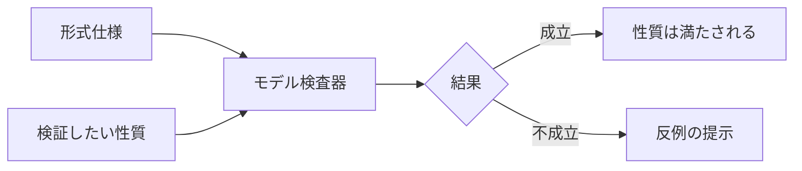
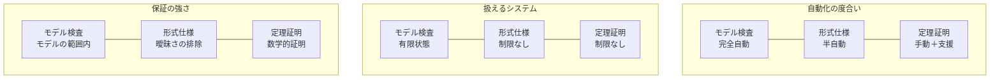
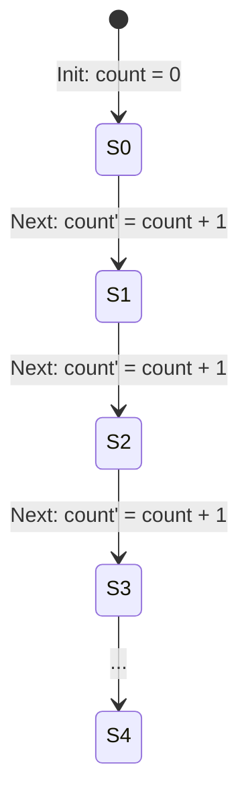
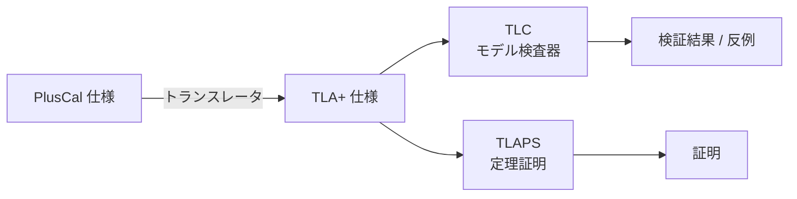
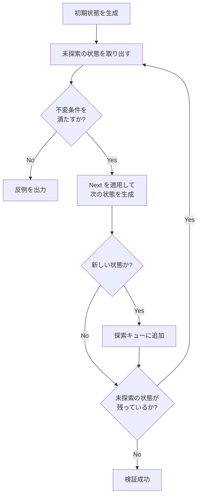
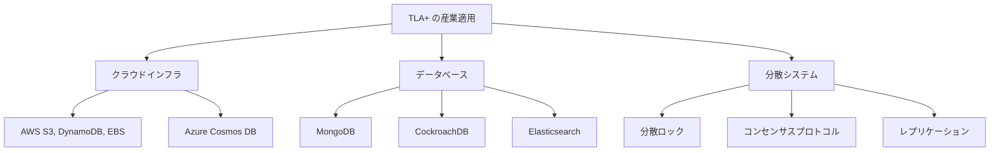
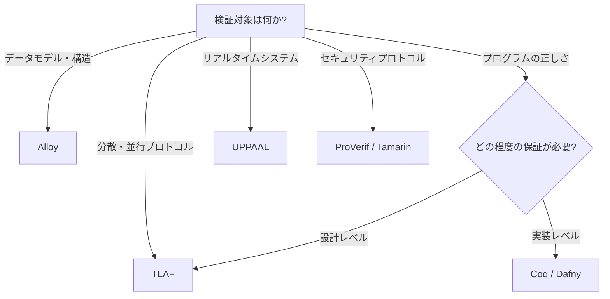

# 形式手法と TLA+

## 1. 形式手法の歴史と背景

### 1.1 ソフトウェアの正しさという問題

ソフトウェアシステムの規模と複雑性は、年を追うごとに加速度的に増大している。現代のクラウドサービスは数百のマイクロサービスから構成され、分散ストレージシステムは数千台のノードにまたがり、金融取引システムは毎秒数百万件のトランザクションを処理する。こうしたシステムにおいて、「ソフトウェアが正しく動作すること」を保証するのは極めて困難な課題である。

従来のソフトウェア品質保証は、主にテストに依存してきた。ユニットテスト、結合テスト、E2Eテストを組み合わせることで、個々の機能が期待通りに動作することを確認する。しかしテストには本質的な限界がある。Edsger Dijkstra が述べた有名な格言「テストはバグの存在を示せるが、バグの不在を証明することはできない（Testing shows the presence, not the absence of bugs）」は、この限界を端的に表現している。

特に並行処理や分散システムにおいては、テストの限界はより深刻になる。2つのスレッドが共有リソースにアクセスする際の競合状態（race condition）は、数百万回の実行のうち1回だけ発生するかもしれない。分散システムにおけるネットワーク分断やノード障害の組み合わせは天文学的な数に上り、すべてのシナリオをテストで網羅することは物理的に不可能である。

このような背景から、ソフトウェアの正しさを**数学的に証明**するアプローチ、すなわち**形式手法（Formal Methods）**への関心が高まってきた。

### 1.2 形式手法の歴史

形式手法の歴史は、計算機科学の黎明期にまで遡る。

**1960年代**には、Robert Floyd が「プログラムの意味に関するフローチャートへの割り当て（Assigning Meanings to Programs）」の中でプログラムの正しさを数学的に議論する枠組みを提案し、Tony Hoare が **Hoare論理**（1969年）を発表した。Hoare論理は、事前条件と事後条件によってプログラムの部分的正当性（partial correctness）を形式的に推論する体系であり、形式手法の理論的基盤となった。

**1970年代**には、Dijkstra が**最弱事前条件（weakest precondition）**の概念を導入し、プログラムの正しさを構造的に証明する手法を確立した。同時期に、Amir Pnueli が**時相論理（temporal logic）**をプログラム検証に導入した（1977年）。これは、システムの振る舞いを時間軸に沿って記述する論理体系であり、後のモデル検査や TLA+ の基盤となる重要な概念である。

**1980年代**には、Edmund Clarke と Allen Emerson、Jean-Pierre Queille と Joseph Sifakis がそれぞれ独立に**モデル検査（model checking）**を提案した（1981年）。モデル検査は、有限状態システムの性質を自動的に検証する手法であり、形式手法を実用に近づける大きな前進であった。Clarke、Emerson、Sifakis はこの業績により 2007年にチューリング賞を受賞している。

### 1.3 Leslie Lamport の貢献

形式手法、特に分散システムの検証において、**Leslie Lamport** の貢献は計り知れない。Lamport は分散システムの理論と実践の両面で多大な業績を残した計算機科学者であり、2013年にチューリング賞を受賞している。

Lamport の主要な貢献を以下に挙げる。

- **Lamport Clock**（1978年）：分散システムにおける因果関係を定式化した「happened-before」関係と論理時計の概念
- **Byzantine Generals Problem**（1982年）：ビザンチン障害の概念を定式化し、障害耐性の理論的限界を明らかにした
- **Paxos**（1989年発表、1998年出版）：分散合意アルゴリズムの古典的プロトコル
- **TLA（Temporal Logic of Actions）**（1994年）：時相論理に基づくシステム仕様記述のための形式体系
- **TLA+**（1999年）：TLA に基づく実用的な仕様記述言語
- **PlusCal**（2009年）：TLA+ をより手続き的に記述するためのアルゴリズム記述言語

Lamport が TLA+ を開発した動機は明確である。分散システムの設計において、自然言語による仕様記述は曖昧さを避けられず、実装コードから設計の正しさを検証することも困難である。数学的に厳密でありながら、実際のエンジニアが使える程度にアクセシブルな仕様記述言語が必要だと Lamport は考えた。TLA+ はその回答として生まれた。

::: tip Lamport の哲学
Lamport は「プログラミングの前に、まず仕様を書け」と一貫して主張している。コードを書き始める前にシステムの設計を数学的に記述し、その正しさを検証することで、設計段階のバグを早期に発見できる。これはソフトウェア開発において最もコスト効率の良い品質保証手法である。
:::

## 2. 形式手法の分類

形式手法は、その手法とアプローチに基づいていくつかのカテゴリに分類できる。それぞれに強みと弱みがあり、対象となるシステムや検証目的に応じて使い分ける。

### 2.1 形式仕様（Formal Specification）

形式仕様は、システムの振る舞いを数学的に厳密な言語で記述する手法である。自然言語による仕様書とは異なり、曖昧さのない定義を提供する。

代表的な形式仕様言語として以下がある。

| 言語 | 特徴 | 主な用途 |
|------|------|----------|
| TLA+ | 時相論理に基づく状態機械の記述 | 分散システム、並行アルゴリズム |
| Z 記法 | 集合論と述語論理に基づく仕様 | 情報システム、プロトコル |
| VDM | メタ言語的仕様記述 | ソフトウェア開発 |
| Alloy | 関係論理に基づく軽量仕様 | データモデル、構造的性質 |
| B-Method | 抽象機械記法に基づく仕様 | 鉄道信号、安全重要システム |

形式仕様のみでは正しさの検証は行われないが、仕様を書くこと自体が設計の曖昧さを排除し、重要な洞察をもたらす。

### 2.2 モデル検査（Model Checking）

モデル検査は、有限状態のシステムモデルに対して、指定された性質が成立するかを**網羅的に検証**する手法である。状態空間をすべて探索し、性質に違反する状態が存在するかを自動的に判定する。



モデル検査の最大の利点は**自動化**である。エンジニアはシステムモデルと検証したい性質を記述するだけでよく、証明の構築は検査器が自動的に行う。一方、最大の課題は**状態爆発問題（state explosion problem）**である。システムの変数や並行プロセスが増えると、状態空間が指数関数的に増大し、実用的な時間内に探索が完了しなくなる。

代表的なモデル検査ツールを以下に示す。

- **TLC**：TLA+ の仕様を検証するモデル検査器
- **SPIN**：Promela 言語による並行システムの検証
- **NuSMV**：CTL/LTL 時相論理に基づくシンボリックモデル検査
- **UPPAAL**：時間オートマトンに基づくリアルタイムシステムの検証

### 2.3 定理証明（Theorem Proving）

定理証明は、システムの性質を数学的な定理として記述し、その証明を構築する手法である。モデル検査が有限状態に限定されるのに対し、定理証明は無限の状態空間を持つシステムにも適用できる。

定理証明支援系（proof assistant）は、人間が証明を構築するのを支援するツールであり、証明の各ステップの正しさを機械的に検証する。

代表的な定理証明支援系を以下に示す。

| ツール | 基盤理論 | 主な用途 |
|--------|----------|----------|
| Coq | 帰納的構成の計算（CIC） | プログラム検証、数学の形式化 |
| Isabelle/HOL | 高階論理 | 数学の形式化、OS カーネル検証 |
| Lean | 依存型理論 | 数学の形式化 |
| ACL2 | 一階論理 | ハードウェア・ソフトウェア検証 |
| TLAPS | TLA+ の証明システム | 分散アルゴリズムの証明 |

定理証明は最も強力な検証手法であるが、証明の構築には高度な専門知識と多大な労力が必要である。

### 2.4 手法の比較

以下に3つの手法の特性を比較する。



実用上は、これらの手法を組み合わせることが多い。TLA+ はまさにこのアプローチを取っており、仕様記述言語（TLA+）、モデル検査器（TLC）、定理証明システム（TLAPS）を統合的に提供している。

## 3. TLA+ の基本概念

### 3.1 TLA+ とは何か

**TLA+** は、Leslie Lamport が開発したシステム仕様記述のための形式言語である。名前の由来は **Temporal Logic of Actions**（行為の時相論理）であり、時相論理と集合論に基づいてシステムの振る舞いを数学的に記述する。

TLA+ の核心的なアイデアは、**システムの振る舞いを状態の列（振る舞い）として捉え、その振る舞いが満たすべき性質を時相論理の式として記述する**ことにある。

### 3.2 状態機械としてのシステム

TLA+ では、あらゆるシステムを**状態機械（state machine）**としてモデル化する。状態機械は以下の3つの要素から構成される。

1. **状態変数（state variables）**：システムの状態を表す変数の集合
2. **初期状態（initial state）**：システムの起動時の状態を定義する述語
3. **遷移関係（next-state relation）**：ある状態から次の状態への遷移を定義する述語

例えば、シンプルなカウンターを考える。変数 `count` が 0 から始まり、1ずつ増加するシステムは以下のように定式化できる。

- **状態変数**：`count`
- **初期状態**：`count = 0`
- **遷移関係**：`count' = count + 1`（`count'` は次の状態における `count` の値を表す）

ここで注目すべきは、TLA+ における**プライム記法（prime notation）**である。変数名の末尾にプライム（`'`）を付けることで、「次の状態」における変数の値を表現する。これにより、遷移関係を現在の状態と次の状態の間の関係として自然に記述できる。



### 3.3 時相論理

TLA+ の「TL」は **Temporal Logic（時相論理）**を指す。時相論理は、命題の真偽が時間の経過とともに変化するシステムを扱うための論理体系である。

TLA+ では主に以下の時相演算子を使用する。

- **`[]P`（Box P / Always P）**：すべての時点で性質 P が成立する
- **`<>P`（Diamond P / Eventually P）**：いつか性質 P が成立する
- **`[]<>P`（Always Eventually P）**：何度でも P が成立する（繰り返し成立する）
- **`<>[]P`（Eventually Always P）**：いつか P が成立し、それ以降ずっと P が成立する

これらの演算子を使って、安全性（safety）と活性（liveness）の2種類の性質を表現できる。

**安全性（Safety）**は「悪いことが起きない」という性質である。例えば「デッドロックが発生しない」「不変条件が常に成り立つ」など。時相論理では `[]P`（常に P）の形で表現される。

**活性（Liveness）**は「良いことがいつか起きる」という性質である。例えば「送信されたメッセージはいつか配信される」「ロックを要求したプロセスはいつかロックを獲得する」など。時相論理では `<>P`（いつか P）の形で表現される。

::: warning 安全性と活性のトレードオフ
安全性のみを満たすシステムを構築するのは容易である。何もしないシステムは安全性をすべて満たす。しかしそれでは活性が満たされない。実際のシステム設計では、安全性と活性のバランスを取ることが重要であり、TLA+ はその両方を形式的に記述し検証できる。
:::

### 3.4 Action（行為）

TLA+ の「A」は **Actions（行為）**を指す。Action は、現在の状態と次の状態の関係を記述する論理式であり、プライム変数（`'`）と通常の変数の両方を含む。

例えば、「`count` が 10 未満のとき、`count` を 1 増加させる」という Action は以下のように書ける。

```
Increment == count < 10 /\ count' = count + 1
```

ここで `/\` は論理積（AND）を表す。この Action は「`count` が 10 未満であり、かつ次の状態の `count` は現在の `count` に 1 を加えた値である」と読める。

## 4. TLA+ の文法と記述方法

### 4.1 モジュール構造

TLA+ の仕様は**モジュール（module）**として記述する。モジュールは以下の構造を持つ。

```
---- MODULE ModuleName ----
EXTENDS Naturals, Sequences

VARIABLES var1, var2

\* Definitions and operators

Init == ...

Next == ...

Spec == Init /\ [][Next]_<<var1, var2>>
====
```

`---- MODULE ... ----` と `====` で囲まれた部分がモジュールの本体である。`EXTENDS` は他のモジュールをインポートし、`VARIABLES` は状態変数を宣言する。

### 4.2 基本的な構文要素

TLA+ の主要な構文要素を以下に示す。

**論理演算子**

| 記号 | 意味 |
|------|------|
| `/\` | 論理積（AND） |
| `\/` | 論理和（OR） |
| `~` | 否定（NOT） |
| `=>` | 含意（IMPLIES） |
| `<=>` | 同値（EQUIVALENT） |

**集合演算**

| 記号 | 意味 |
|------|------|
| `\in` | 集合の要素 |
| `\notin` | 集合の非要素 |
| `\subseteq` | 部分集合 |
| `\union` | 和集合 |
| `\intersect` | 共通集合 |
| `SUBSET S` | S のべき集合 |

**関数と構造**

| 記法 | 意味 |
|------|------|
| `[x \in S \|-> e]` | 定義域 S, 値域 e の関数 |
| `f[x]` | 関数 f を引数 x で適用 |
| `DOMAIN f` | 関数 f の定義域 |
| `[f EXCEPT ![x] = v]` | f の x での値を v に変更 |
| `<<a, b, c>>` | タプル（有限列） |
| `[key1 \|-> v1, key2 \|-> v2]` | レコード |

### 4.3 具体例：相互排除アルゴリズム

TLA+ の記述方法を理解するために、2つのプロセスの相互排除（mutual exclusion）を保証するシンプルなシステムを仕様として記述する。

```
---- MODULE MutualExclusion ----
EXTENDS Naturals

VARIABLES pc, flag, turn

Procs == {0, 1}

\* Each process is in one of the states: "idle", "waiting", "critical"
TypeOK ==
    /\ pc \in [Procs -> {"idle", "waiting", "critical"}]
    /\ flag \in [Procs -> BOOLEAN]
    /\ turn \in Procs

Init ==
    /\ pc = [p \in Procs |-> "idle"]
    /\ flag = [p \in Procs |-> FALSE]
    /\ turn = 0

\* Process p requests entry to the critical section
Request(p) ==
    /\ pc[p] = "idle"
    /\ pc' = [pc EXCEPT ![p] = "waiting"]
    /\ flag' = [flag EXCEPT ![p] = TRUE]
    /\ turn' = 1 - p
    /\ UNCHANGED <<>>

\* Process p enters the critical section
Enter(p) ==
    /\ pc[p] = "waiting"
    /\ flag[1-p] = FALSE \/ turn = p
    /\ pc' = [pc EXCEPT ![p] = "critical"]
    /\ UNCHANGED <<flag, turn>>

\* Process p exits the critical section
Exit(p) ==
    /\ pc[p] = "critical"
    /\ pc' = [pc EXCEPT ![p] = "idle"]
    /\ flag' = [flag EXCEPT ![p] = FALSE]
    /\ UNCHANGED turn

\* The next-state relation
Next ==
    \E p \in Procs :
        \/ Request(p)
        \/ Enter(p)
        \/ Exit(p)

\* The complete specification
Spec == Init /\ [][Next]_<<pc, flag, turn>>

\* Safety: mutual exclusion
MutualExclusion ==
    ~ (pc[0] = "critical" /\ pc[1] = "critical")

\* The invariant we want to verify
Safety == []MutualExclusion
====
```

この仕様の各要素を解説する。

**変数と初期化**

- `pc`（program counter）：各プロセスの状態を表す関数。`"idle"`、`"waiting"`、`"critical"` のいずれか
- `flag`：各プロセスがクリティカルセクションへの進入を要求しているかを示すフラグ
- `turn`：衝突時にどちらのプロセスを優先するかを決めるターン変数

**Action の定義**

- `Request(p)`：プロセス p がクリティカルセクションへの進入を要求する
- `Enter(p)`：進入条件が満たされたとき、プロセス p がクリティカルセクションに入る
- `Exit(p)`：プロセス p がクリティカルセクションを退出する

**遷移関係（Next）**

`\E p \in Procs` は「ある p が Procs に存在して」という意味の存在量化であり、非決定的にいずれかのプロセスのいずれかの Action が実行されることを表す。

**仕様（Spec）**

`Spec == Init /\ [][Next]_<<pc, flag, turn>>` は完全な仕様を表す。`Init` が初期状態を定義し、`[][Next]_<<pc, flag, turn>>` は「すべてのステップで Next が実行されるか、またはすべての変数が変化しない（スタッタリングステップ）」を意味する。スタッタリングステップを許容することは TLA+ の重要な設計原則であり、仕様の合成（composition）を容易にする。

**検証する性質**

`MutualExclusion` は「プロセス 0 とプロセス 1 が同時にクリティカルセクションにいない」という不変条件であり、`Safety` はその不変条件が常に成り立つことを要求する。

### 4.4 UNCHANGED と EXCEPT

TLA+ では、遷移において変化しない変数を明示的に記述する必要がある。`UNCHANGED <<flag, turn>>` は `flag' = flag /\ turn' = turn` の省略形である。これは冗長に見えるかもしれないが、仕様の明確性と正しさの保証において重要な役割を果たす。変更されるべきでない変数が誤って変更されるバグを防止するからである。

`EXCEPT` 構文は、関数の一部を更新するために使う。`[pc EXCEPT ![p] = "critical"]` は「pc の p での値を `"critical"` に変更し、それ以外は変えない」という意味である。命令型言語における `pc[p] = "critical"` に近いが、TLA+ では関数全体を新しい関数に置き換えるという意味論を持つ。

### 4.5 型不変条件（Type Invariant）

TLA+ には静的な型システムがないが、**型不変条件（type invariant）**を定義することで同等の役割を果たせる。上の例での `TypeOK` がそれにあたる。

```
TypeOK ==
    /\ pc \in [Procs -> {"idle", "waiting", "critical"}]
    /\ flag \in [Procs -> BOOLEAN]
    /\ turn \in Procs
```

これは「`pc` は `Procs` から `{"idle", "waiting", "critical"}` への関数であり、`flag` は `Procs` から `BOOLEAN` への関数であり、`turn` は `Procs` の要素である」と読める。この不変条件をモデル検査器で検証することで、変数が予期しない値を取るバグを検出できる。

## 5. PlusCal

### 5.1 PlusCal とは

**PlusCal** は、Lamport が 2009年に発表した、TLA+ の上に構築されたアルゴリズム記述言語である。C や Pascal のような手続き的な構文を持ちながら、内部的には TLA+ に変換（トランスパイル）される。

PlusCal の目的は、TLA+ の数学的記法に馴染みのないプログラマでも形式仕様を書きやすくすることにある。手続き的なコードとして読み書きできるため、アルゴリズムの記述において直感的である。

### 5.2 PlusCal の基本構文

PlusCal には **P-syntax**（Pascal風）と **C-syntax**（C風）の2つの構文がある。ここでは C-syntax を使って説明する。

```
---- MODULE EuclidPlusCal ----
EXTENDS Naturals, TLC

(* --algorithm Euclid {
    variables x = 15, y = 10;
    {
        while (x # y) {
            if (x > y) {
                x := x - y;
            } else {
                y := y - x;
            };
        };
        print x;
    }
} *)
====
```

この例はユークリッドの互除法を PlusCal で記述したものである。`#` は「等しくない」を意味する。PlusCal のコードは TLA+ のコメント `(* ... *)` の中に記述し、TLA+ Toolbox や VSCode 拡張によって自動的に TLA+ コードに変換される。

### 5.3 並行プロセスの記述

PlusCal が真価を発揮するのは、並行プロセスの記述においてである。`process` キーワードを使って複数のプロセスを定義できる。

```
---- MODULE TransferPlusCal ----
EXTENDS Naturals, TLC

CONSTANTS NumAccounts, InitBalance

(* --algorithm BankTransfer {
    variables
        balance = [a \in 1..NumAccounts |-> InitBalance];

    define {
        TotalBalance ==
            LET Sum[i \in 0..NumAccounts] ==
                IF i = 0 THEN 0
                ELSE Sum[i-1] + balance[i]
            IN Sum[NumAccounts]

        \* The total balance must be conserved
        BalanceInvariant == TotalBalance = NumAccounts * InitBalance

        \* No account should have a negative balance
        NoNegativeBalance == \A a \in 1..NumAccounts : balance[a] >= 0
    }

    process (Transfer \in 1..NumAccounts)
        variables from, to, amount;
    {
        t1: from := self;
        t2: with (dest \in 1..NumAccounts \ {from}) {
                to := dest;
            };
        t3: with (amt \in 1..balance[from]) {
                amount := amt;
            };
        t4: balance[from] := balance[from] - amount;
        t5: balance[to] := balance[to] + amount;
    }
} *)
====
```

この仕様は銀行口座間の送金を並行に処理するシステムをモデル化したものである。各ラベル（`t1:`, `t2:` など）は**アトミックなステップの粒度**を定義する。つまり、ラベル間の操作はアトミック（不可分）に実行されるが、異なるラベル間ではインターリーブが発生しうる。

::: details ラベルの重要性
PlusCal のラベルは、並行処理における原子性の粒度を制御する。上記の例では `t4` と `t5` が別のラベルであるため、`balance[from]` の減算と `balance[to]` の加算の間に他のプロセスが割り込む可能性がある。これは実際のシステムにおけるトランザクションの原子性の問題を正確にモデル化している。もし送金全体をアトミックにしたい場合は、`t4` と `t5` を同じラベルにまとめればよい。
:::

### 5.4 PlusCal と TLA+ の関係

PlusCal で記述された仕様は、TLA+ Toolbox のトランスレータによって TLA+ コードに変換される。変換後の TLA+ コードは人間が読むことも修正することもでき、TLC モデル検査器で直接検証される。



PlusCal は TLA+ のサブセットではなく、TLA+ の記述力をすべて使えるわけではない。例えば、より複雑な公正性条件（fairness）や合成（composition）の記述は、TLA+ で直接行う必要がある。しかし、並行アルゴリズムやプロトコルの記述においては、PlusCal の手続き的な記法が強力な武器となる。

## 6. TLC Model Checker

### 6.1 TLC とは

**TLC** は、TLA+ の仕様を自動的に検証するモデル検査器（model checker）である。Yu, Manolios, Lamport によって開発され、TLA+ の実用上の中核をなすツールである。

TLC は仕様に記述された初期状態からすべての到達可能な状態を生成し、指定された性質（不変条件や時相論理の式）がすべての状態およびすべての振る舞いにおいて成立するかを検証する。

### 6.2 状態空間探索

TLC の検証プロセスは以下の通りである。

1. **初期状態の生成**：`Init` を満たすすべての状態を生成する
2. **幅優先探索（BFS）**：各状態に対して `Next` を適用し、到達可能な次の状態をすべて生成する
3. **不変条件の検査**：各新しい状態に対して、指定された不変条件が成り立つかを確認する
4. **重複チェック**：すでに探索済みの状態を記録し、再探索を避ける
5. **反例の生成**：性質に違反する状態が見つかった場合、初期状態からその状態に至るまでの実行パスを反例として出力する



### 6.3 状態爆発への対処

TLC の最大の課題は状態爆発問題である。変数の数や取りうる値の範囲が増えると、探索すべき状態の数は指数関数的に増大する。

例えば、先述の相互排除の例では状態数は限定的だが、銀行送金の例で口座数を 10、初期残高を 100 にすると、状態数は膨大になる。

TLC はこの問題に対していくつかの対策を提供している。

**対称性の利用（Symmetry）**：モデルに対称性がある場合（例えば、プロセス ID の入れ替えが仕様の意味を変えない場合）、TLC は対称性を利用して探索すべき状態数を削減できる。

**並列検査**：TLC はマルチコアに対応しており、状態空間の探索を複数のワーカースレッドで並行に実行できる。さらに、分散モードでは複数のマシンに探索を分散することも可能である。

**モデルの抽象化**：実際のシステムでは値の範囲が大きすぎる場合、モデル検査用に範囲を小さくする。例えば、メッセージキューのサイズを 3 に制限したり、プロセス数を 2 〜 3 に限定したりする。重要なのは、**小さなモデルで見つかるバグは大きなモデルでも存在する**という経験則に基づいた実践知である。

::: tip 小さなスコープ仮説
形式手法の実践において広く知られている経験則に「小さなスコープ仮説（Small Scope Hypothesis）」がある。これは「ほとんどのバグは小さなインスタンスで再現できる」という仮説であり、Alloy の開発者である Daniel Jackson によって提唱された。TLA+ のモデル検査においても、プロセス数 2〜3、メッセージキュー長 2〜3 といった小さな設定でほとんどの設計バグを発見できることが経験的に知られている。
:::

### 6.4 TLC の実行例

TLC の実行結果は以下のような形式で出力される。

```
TLC2 Version 2.18 of Day Month 20XX

Running breadth-first search Model-Checking with fp 93 and target 1.
...
Model checking completed. No error has been found.
  Estimates of the probability that TLC did not check all reachable states
  because two distinct states have the same fingerprint:
  calculated (optimistic): val 1.1E-15
7442 states generated, 2890 distinct states found, 0 states left on queue.
The depth of the complete state graph search is 21.
The average outdegree of the complete state graph is 1.
Finished in 00s at (2026-03-01 12:00:00)
```

もし不変条件に違反する状態が見つかった場合は、以下のような反例（counterexample）が出力される。

```
Error: Invariant MutualExclusion is violated.
Error: The behavior up to this point is:
State 1: <Initial predicate>
/\ pc = (0 :> "idle" @@ 1 :> "idle")
/\ flag = (0 :> FALSE @@ 1 :> FALSE)
/\ turn = 0
State 2: <Request(0)>
/\ pc = (0 :> "waiting" @@ 1 :> "idle")
/\ flag = (0 :> TRUE @@ 1 :> FALSE)
/\ turn = 1
...
```

この反例は、初期状態から不変条件違反に至るまでの具体的な実行パスを示しており、設計バグの原因を特定するための強力な手がかりとなる。

## 7. 実世界での適用例

### 7.1 Amazon Web Services

TLA+ の実世界での最も有名な適用例は、**Amazon Web Services（AWS）** における活用である。2014年に発表された論文「Use of Formal Methods at Amazon Web Services」（Chris Newcombe ら）は、TLA+ の産業界での実用性を広く知らしめた画期的な報告であった。

AWS では、以下のシステムの設計検証に TLA+ が使用された。

| システム | 検証対象 | 発見された問題 |
|----------|----------|----------------|
| **S3** | フォールトトレラントな低レベルネットワークアルゴリズム | 微妙なバグ 2 件 |
| **DynamoDB** | レプリケーション、リカバリ | 設計上の欠陥 |
| **EBS** | ボリュームマネジメント | 競合状態のバグ |
| **Internal distributed lock manager** | ロック管理プロトコル | デッドロックの可能性 |

AWS のエンジニアたちの報告によれば、TLA+ の導入による主要な成果は以下の通りである。

**設計レベルのバグの発見**：テストでは発見が極めて困難な、設計レベルの微妙なバグが複数発見された。これらのバグは数千時間のストレステストでも発見されなかったものであり、もし本番環境で発現していれば重大なデータ損失を引き起こす可能性があった。

**設計の理解と共有**：TLA+ で仕様を記述する過程で、エンジニアたちはシステム設計への理解を深めた。曖昧さのない仕様は、チームメンバー間の設計の共有と議論を促進した。

**積極的な設計変更**：正しさが形式的に保証されているため、エンジニアたちはパフォーマンス最適化や積極的な設計変更を自信を持って行えるようになった。仕様なしでは「壊すのが怖い」ために回避されていた最適化が実行可能になった。

**学習コスト**：AWS の報告では、TLA+ の学習に要した期間は約 2〜3 週間とされている。数学的背景のないエンジニアでも、その期間で実用的な仕様を書けるようになったと報告されている。

::: details AWS S3 での具体的事例
AWS S3 のケースでは、フォールトトレラントなネットワークアルゴリズムの設計検証に TLA+ が使用された。このアルゴリズムは、ネットワーク分断やノード障害が発生しても正しく動作することが求められる。TLA+ による仕様記述とモデル検査の結果、通常の動作では発現しないが、特定の障害パターンの組み合わせで発生する 2 件のバグが発見された。これらのバグは、数週間にわたるストレステストでも検出されなかったものであり、TLA+ の検証なしには本番環境で数年後に発現し、データ損失につながる可能性があった。
:::

### 7.2 Microsoft Azure

Microsoft も **Azure Cosmos DB** の設計において TLA+ を活用している。Cosmos DB は地理的に分散されたデータベースサービスであり、複数の一貫性レベル（Strong, Bounded Staleness, Session, Consistent Prefix, Eventual）を提供している。

これらの一貫性モデルの仕様は TLA+ で厳密に定義されており、各一貫性レベルが提供する保証を数学的に明確にしている。この仕様は公開されており、ユーザーが Cosmos DB の一貫性保証を正確に理解するために参照できる。

### 7.3 Elasticsearch

**Elasticsearch** の開発チームは、分散データレプリケーションのプロトコルの設計と検証に TLA+ を使用した。特に、シーケンス番号に基づくレプリケーションプロトコルの正しさを検証するために TLA+ の仕様が作成され、GitHub 上で公開されている。

### 7.4 MongoDB

**MongoDB** も、レプリケーションプロトコルの設計検証に TLA+ を活用している。MongoDB のリーダー選出と障害復旧の仕組みが正しく動作することを、TLA+ の仕様記述とモデル検査によって確認している。

### 7.5 CockroachDB

分散 SQL データベースである **CockroachDB** でも、分散トランザクションプロトコルの検証に TLA+ が使用されている。並行トランザクション処理における直列化可能性（serializability）の保証を形式的に検証している。

### 7.6 産業界での TLA+ 活用のまとめ



これらの事例に共通するのは、**分散システムの並行処理プロトコル**の検証に TLA+ が特に有効であるという点である。分散システムでは、ネットワーク分断、メッセージの遅延・順序入れ替え・消失、ノード障害といった多数の障害シナリオの組み合わせがあり、テストですべてを網羅することは不可能である。TLA+ のモデル検査はこれらの組み合わせを網羅的に探索し、設計上の欠陥を発見する。

## 8. 他の形式手法ツール

TLA+ 以外にも、さまざまな形式手法ツールが存在する。それぞれ異なるアプローチと強みを持っている。

### 8.1 Alloy

**Alloy** は、MIT の Daniel Jackson が開発した軽量形式手法ツールである。関係論理に基づいており、データモデルや構造的な性質の検証に適している。

Alloy の特徴は以下の通りである。

- **宣言的な記述**：構造と制約を宣言的に記述する
- **自動解析**：SAT ソルバーを使って、制約を満たすインスタンスを自動生成する
- **可視化**：生成されたインスタンスをグラフとして視覚的に表示する
- **反例探索**：制約に違反する反例を自動的に発見する

TLA+ が振る舞い（behavior）の検証に強いのに対し、Alloy は構造（structure）の検証に強い。例えば、データベーススキーマの整合性制約やアクセス制御ポリシーの検証に適している。

### 8.2 Coq

**Coq** は、フランスの INRIA が開発した定理証明支援系である。**帰納的構成の計算（Calculus of Inductive Constructions, CIC）**に基づいており、プログラムと証明を同一の枠組みで扱える。

Coq の注目すべき応用例を以下に示す。

- **CompCert**：形式的に検証された C コンパイラ。コンパイルの各段階で意味が保存されることが Coq で証明されている
- **sel4**：形式的に検証されたマイクロカーネル（一部 Isabelle/HOL による検証）
- **四色定理の形式的証明**（2005年）：数学の有名な定理をコンピュータで形式的に証明した

Coq は最も強力な検証手法の一つであるが、証明の構築には相当な専門知識と労力が必要であり、TLA+ のように「普通のエンジニア」が短期間で習得できるものではない。

### 8.3 Isabelle/HOL

**Isabelle/HOL** は、ケンブリッジ大学とミュンヘン工科大学で開発された定理証明支援系である。高階論理（Higher-Order Logic, HOL）に基づいている。

Isabelle/HOL の代表的な応用例として、**seL4 マイクロカーネル**の完全な形式検証がある。seL4 は約 10,000 行の C コードからなるマイクロカーネルであり、その機能的正当性が Isabelle/HOL を用いて数学的に証明された。これは OS カーネルの完全な形式検証としては世界初の成果であり、検証に約 200,000 行の Isabelle/HOL の証明コードが必要であった。

### 8.4 Z3

**Z3** は、Microsoft Research が開発した **SMT（Satisfiability Modulo Theories）ソルバー**である。Z3 自体は汎用の制約充足ツールであるが、多くの形式検証ツールのバックエンドとして使用されている。

Z3 の主な用途を以下に示す。

- **プログラム検証**：Dafny、KLEE、SAGE などの検証ツールのバックエンド
- **シンボリック実行**：プログラムのパスを網羅的に探索するシンボリック実行エンジンの制約ソルバー
- **コンパイラ最適化**：最適化の正しさの検証
- **ネットワーク検証**：SDN ポリシーの正しさの検証

### 8.5 ツールの比較

| ツール | アプローチ | 主な対象 | 学習コスト | 自動化の度合い |
|--------|------------|----------|------------|----------------|
| TLA+ | モデル検査 + 仕様記述 | 分散・並行システム | 中 | 高（TLC） |
| Alloy | 関係モデルの解析 | データモデル、構造 | 低〜中 | 高 |
| Coq | 定理証明 | プログラム、数学 | 高 | 低（手動証明） |
| Isabelle/HOL | 定理証明 | システム、数学 | 高 | 低〜中 |
| Z3 | SMT ソルバー | 制約充足問題 | 中 | 高（自動ソルバー） |
| SPIN | モデル検査 | 並行プロトコル | 中 | 高 |

## 9. 形式手法の限界と実践的な導入指針

### 9.1 形式手法の限界

形式手法は強力なツールであるが、万能ではない。以下に主要な限界を述べる。

**状態爆発問題**

モデル検査は有限状態のモデルに対して網羅的な検証を行うが、状態空間が大きくなると実用的な時間内に検証が完了しなくなる。変数の数、プロセスの数、値の範囲が増えるに従い、状態数は指数関数的に増大する。このため、モデル検査では実際のシステムを抽象化し、重要な側面のみをモデル化する必要がある。

**モデルと実装の乖離**

形式仕様はシステムの**モデル**を記述するものであり、実際の実装コードそのものではない。仕様が正しくても、実装がその仕様に忠実でなければ意味がない。この「仕様と実装のギャップ」は形式手法の根本的な課題である。

この課題に対するアプローチとしては以下がある。

- **仕様からのコード生成**：仕様から自動的にコードを生成する（B-Method などで実用化されている）
- **コードレベルの検証**：実装コード自体を形式的に検証する（Coq の extraction、Dafny など）
- **テストとの組み合わせ**：仕様から自動的にテストケースを生成する

**すべてを検証できるわけではない**

形式手法で検証できるのは、仕様に記述された性質のみである。仕様に記述されていない性質については何も保証しない。また、ハードウェア障害、コンパイラのバグ、OSのバグといったシステム外部の要因はモデルの範囲外である。

**コストと専門知識**

形式手法の導入には学習コストと実施コストがかかる。特に定理証明は高度な数学的知識を要する。組織として形式手法を導入するためには、適切なトレーニングと文化的な変革が必要である。

::: warning 形式手法はテストの代替ではない
形式手法はテストを置き換えるものではなく、補完するものである。形式手法は設計レベルの正しさを保証するが、実装レベルのバグ（タイポ、メモリリーク、パフォーマンス問題など）はカバーしない。形式手法とテストを組み合わせることで、より高い品質保証が実現できる。
:::

### 9.2 実践的な導入指針

形式手法を実際のプロジェクトに導入するためのガイドラインを以下に示す。

**ステップ 1：適用範囲の選定**

形式手法をシステム全体に適用する必要はない。最も効果的なのは、以下のような部分に集中的に適用することである。

- **正しさが特に重要なコンポーネント**：分散合意プロトコル、レプリケーションロジック、トランザクション処理
- **テストでは検証が困難な並行処理**：ロック管理、メッセージ順序保証、障害復旧
- **設計変更の影響が大きい部分**：コア設計が変わるとシステム全体に影響を及ぼすコンポーネント

**ステップ 2：ツールの選択**

対象となるシステムの特性に応じて適切なツールを選ぶ。



**ステップ 3：段階的な導入**

いきなりチーム全体に形式手法を導入するのではなく、段階的に進める。

1. まず 1〜2 人のエンジニアが TLA+ を学習する（2〜3 週間）
2. パイロットプロジェクトとして、1つのコンポーネントに適用する
3. 成果と課題を評価し、ドキュメント化する
4. 成功体験に基づいて、チームに展開する

**ステップ 4：仕様をドキュメントとして維持する**

TLA+ の仕様は、コードと同様にバージョン管理し、設計ドキュメントとして維持する。仕様はシステムの設計意図を最も正確に伝える文書であり、新しいチームメンバーのオンボーディングや、設計変更時の影響分析に有用である。

### 9.3 形式手法が特に有効な場面

以下のような場面では、形式手法の投資対効果が特に高い。

1. **分散システムのプロトコル設計**：Paxos、Raft のような合意プロトコルの設計と検証
2. **並行データ構造**：ロックフリーキューやコンカレントハッシュマップの正しさの検証
3. **金融システム**：トランザクションの一貫性と正しさが金銭的損失に直結する場面
4. **安全重要システム**：航空宇宙、医療機器、自動車の制御システム
5. **インフラストラクチャの中核コンポーネント**：ストレージエンジン、レプリケーションプロトコル、スケジューラ

### 9.4 形式手法の費用対効果

AWS の事例に基づく形式手法の費用対効果を考える。TLA+ の学習に 2〜3 週間、1つのシステムの仕様記述に 1〜2 週間を要するとする。これに対して得られる効果は以下の通りである。

- **設計バグの早期発見**：本番環境で発現してから修正するコストは、設計段階で修正するコストの 10〜100 倍とされている。分散システムの設計バグは、データ損失やサービス停止という形で顕在化し、その損害は甚大である
- **設計変更の自信**：仕様の存在により、積極的な最適化や設計変更が可能になる
- **ドキュメントとしての価値**：形式仕様は最も正確な設計ドキュメントであり、長期的な保守性を向上させる

AWS のエンジニアたちは、形式手法の導入は「信じられないほど良い投資対効果（incredibly good return on investment）」であったと報告している。

## 10. まとめ

本記事では、形式手法の歴史と背景から始まり、TLA+ の基本概念、文法、PlusCal、TLC モデル検査器、実世界での適用例、他の形式手法ツール、そして形式手法の限界と実践的な導入指針について解説した。

### 要点の整理

**形式手法とは何か**

形式手法は、ソフトウェアシステムの正しさを数学的に保証するためのアプローチである。テストでは検証不可能な設計レベルのバグ、特に並行処理や分散システムにおける微妙な競合状態やプロトコルの欠陥を発見できる。

**TLA+ の位置づけ**

TLA+ は Leslie Lamport が開発した、時相論理に基づく形式仕様記述言語である。システムを状態機械としてモデル化し、不変条件や時相論理の性質を検証する。PlusCal による手続き的記述と TLC モデル検査器による自動検証を組み合わせることで、実用的な形式検証を実現している。

**産業界での実績**

AWS、Azure、Elasticsearch、MongoDB、CockroachDB など、世界を代表する技術企業が TLA+ を分散システムの設計検証に活用している。特に AWS の事例は、形式手法が「象牙の塔の理論」ではなく、実際のエンジニアリングにおいて費用対効果の高いツールであることを実証した。

**形式手法の実践**

形式手法はテストの代替ではなく補完であり、システムのすべてに適用する必要はない。正しさが特に重要で、テストでの検証が困難な部分（分散プロトコル、並行処理のロジック、障害復旧の手順など）に集中的に適用することで、最大の効果を得られる。

### 今後の展望

形式手法の分野は、以下の方向に進化しつつある。

**ツールの使いやすさの向上**：TLA+ Toolbox から VSCode 拡張への移行、IDE サポートの充実、エラーメッセージの改善などにより、形式手法のアクセシビリティは着実に向上している。

**AI との融合**：大規模言語モデル（LLM）を活用した仕様の自動生成や、証明の自動構築への研究が進んでいる。将来的には、AI が仕様記述を支援し、形式検証の敷居をさらに下げる可能性がある。

**実装との統合**：仕様と実装のギャップを埋めるために、仕様からのコード生成、実装コードの形式的検証、仕様に基づくテスト自動生成といったアプローチの研究が進んでいる。

形式手法は、ソフトウェアエンジニアリングにおける「もう一つの品質保証の柱」として、今後ますます重要性を増していくであろう。特に、システムの複雑性が増大し続ける現代において、設計レベルの正しさを数学的に保証する手法は、高品質なソフトウェアを構築するための不可欠なツールとなりつつある。
