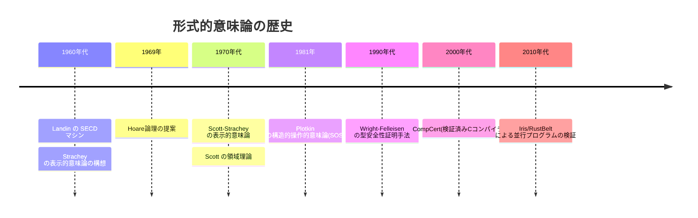
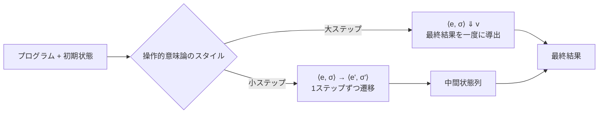
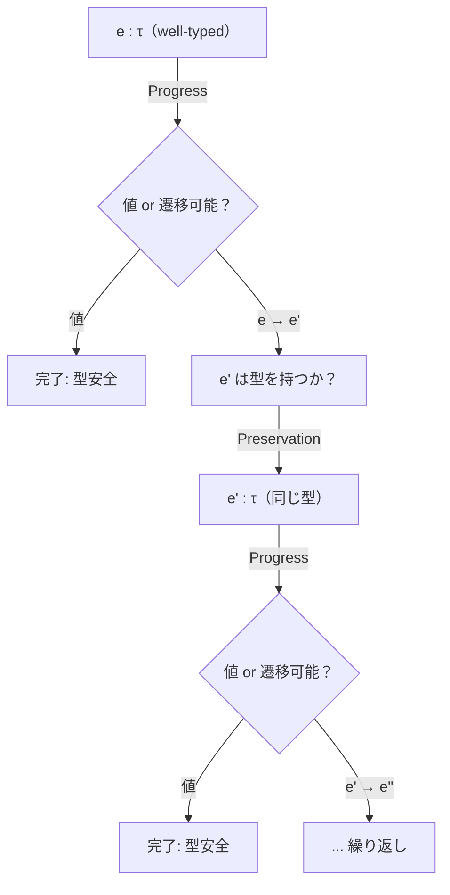
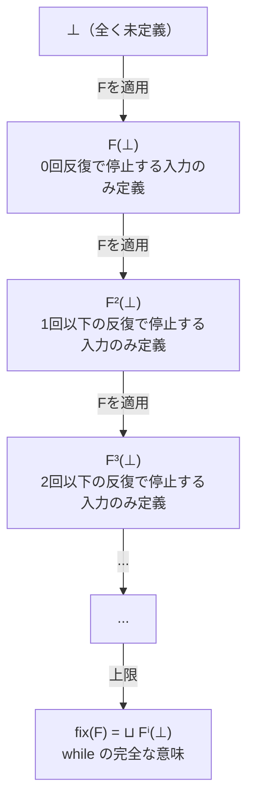
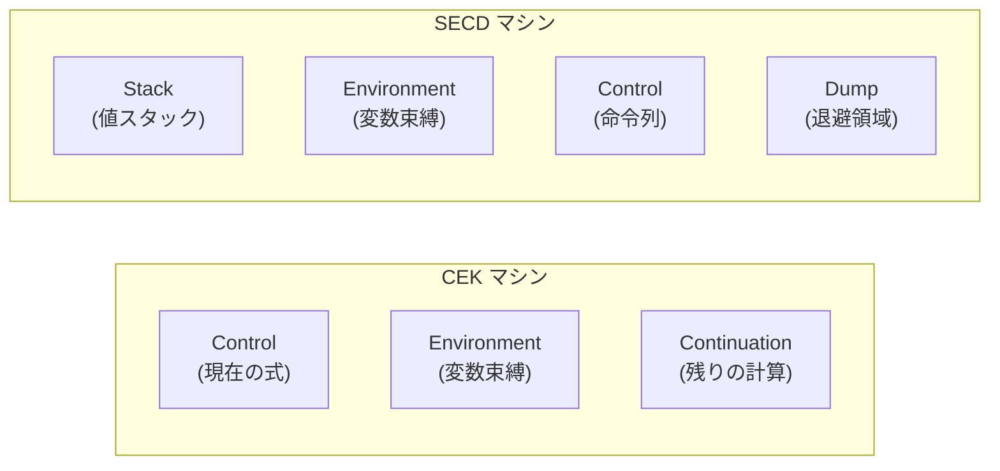

# 形式的意味論（操作的意味論, 表示的意味論）

## 1. はじめに：プログラムの「意味」とは何か

プログラミング言語を設計・実装・解析するためには、**プログラムが何を意味するのか**を厳密に定義する方法が必要である。たとえば、以下のような単純なプログラムを考えてみよう。

```
x := 3 + 5;
y := x * 2
```

このプログラムが「変数 `x` に `8` を代入し、次に変数 `y` に `16` を代入する」ことは直感的にわかる。しかし、この「直感的な理解」をどのように数学的に正確に記述すればよいのだろうか？

自然言語による説明は曖昧さを含む。実装（インタプリタやコンパイラ）を「定義」とみなすこともできるが、それでは実装の正しさを検証する基準がなくなる。**形式的意味論（formal semantics）**は、この問題に対する回答であり、数学的な道具立てを用いてプログラムの意味を厳密に定義する学問分野である。

### 1.1 なぜ形式的意味論が必要なのか

形式的意味論の必要性は、プログラミング言語の歴史の中で何度も痛感されてきた。

**言語仕様の曖昧さの排除**：C言語の規格には「未定義動作（undefined behavior）」が数多く存在する。これらの多くは、言語の意味論が自然言語で曖昧に記述されていることに起因する。形式的意味論を用いれば、プログラムのすべての振る舞いを網羅的に定義でき、未定義の隙間をなくすことができる。

**コンパイラの正しさの検証**：CompCert（C言語の検証済みコンパイラ）は、ソース言語とターゲット言語の両方に形式的意味論を与え、コンパイルがプログラムの意味を保存することをCoq証明支援系で機械的に証明した。これは形式的意味論なしには不可能な成果である。

**プログラムの性質の証明**：型安全性、メモリ安全性、情報フロー安全性といったプログラムの重要な性質を証明するためには、まずプログラムの「振る舞い」が厳密に定義されている必要がある。

**言語設計の指針**：新しい言語機能を設計する際、形式的意味論を用いて機能の振る舞いを事前に精密に定義し、既存の機能との相互作用を解析できる。

::: tip 形式的意味論の3つのアプローチ
形式的意味論には主に3つのアプローチが存在する。
1. **操作的意味論（Operational Semantics）**：プログラムの実行過程を数学的な遷移規則で記述する
2. **表示的意味論（Denotational Semantics）**：プログラムを数学的対象（関数など）に写像する
3. **公理的意味論（Axiomatic Semantics）**：プログラムの性質を論理的な表明（assertion）で記述する（Hoare論理など）

本記事では、特に操作的意味論と表示的意味論を中心に解説する。
:::

### 1.2 歴史的背景

形式的意味論の研究は1960年代に本格化した。

**操作的意味論**の起源は、1960年代の Peter Landin による SECD マシンにさかのぼる。Landin は関数型言語の実行モデルとして抽象機械を提案し、これが後に Gordon Plotkin によって**構造的操作的意味論（Structural Operational Semantics: SOS）**として1981年に体系化された。Plotkin の SOS は、推論規則を用いてプログラムの実行ステップを帰納的に定義する手法であり、現在でも最も広く使われている形式的意味論のスタイルである。

**表示的意味論**は、1960年代後半から1970年代にかけて Christopher Strachey と Dana Scott によって開発された。Strachey は言語の意味を数学的関数として記述するアイデアを提案し、Scott は自己適用的な関数（再帰的定義）に数学的な基礎を与えるために**領域理論（domain theory）**を発明した。Scott-Strachey の表示的意味論は、プログラミング言語理論の数学的基礎を確立した歴史的に重要な業績である。

**公理的意味論**は、1969年の C.A.R. Hoare による **Hoare論理（Hoare logic）**に端を発する。Hoare論理は事前条件と事後条件の対でプログラムの部分的正当性を記述するもので、プログラム検証の基礎となった。



## 2. 対象言語：IMP — 命令型言語の核

形式的意味論を説明するためには、具体的な対象言語が必要である。本記事では、**IMP**と呼ばれる小さな命令型言語を使用する。IMP は研究や教科書でよく使われる標準的な言語であり、現実のプログラミング言語の本質的な構成要素を最小限に含んでいる。

### 2.1 IMP の構文

IMP の構文を BNF（Backus-Naur Form）で定義する。

**算術式（Arithmetic Expressions）**：

$$
a ::= n \mid x \mid a_1 + a_2 \mid a_1 - a_2 \mid a_1 \times a_2
$$

ここで $n$ は整数リテラル、$x$ は変数名を表す。

**ブール式（Boolean Expressions）**：

$$
b ::= \text{true} \mid \text{false} \mid a_1 = a_2 \mid a_1 \leq a_2 \mid \neg b \mid b_1 \land b_2
$$

**コマンド（Commands / Statements）**：

$$
c ::= \text{skip} \mid x := a \mid c_1;\, c_2 \mid \text{if } b \text{ then } c_1 \text{ else } c_2 \mid \text{while } b \text{ do } c
$$

### 2.2 IMP のプログラム例

IMP で階乗を計算するプログラムの例を示す。

```
n := 5;
result := 1;
while 1 ≤ n do
  result := result × n;
  n := n - 1
```

このプログラムは $n!$ を計算し、結果を変数 `result` に格納する。

### 2.3 状態（State）

IMP のプログラムは**状態（state）**の上で動作する。状態とは、変数から値への写像である。

$$
\sigma : \text{Var} \to \mathbb{Z}
$$

ここで $\text{Var}$ は変数名の集合、$\mathbb{Z}$ は整数の集合である。たとえば、$\sigma = [x \mapsto 3, y \mapsto 7]$ は変数 $x$ の値が $3$、変数 $y$ の値が $7$ である状態を表す。

状態の更新を $\sigma[x \mapsto v]$ と書く。これは、$\sigma$ と同じだが変数 $x$ の値だけが $v$ に変更された新しい状態を意味する。

$$
\sigma[x \mapsto v](y) = \begin{cases} v & \text{if } y = x \\ \sigma(y) & \text{if } y \neq x \end{cases}
$$

## 3. 操作的意味論（Operational Semantics）

**操作的意味論**は、プログラムの意味を「プログラムがどのように実行されるか」という計算過程の記述によって定義する。抽象機械上でプログラムが一歩ずつどのように遷移するかを、推論規則（inference rules）の集合として形式的に与える。

操作的意味論は、コンパイラやインタプリタの実装に近い形で意味を定義するため、直感的に理解しやすく、実際の言語処理系の設計と検証に広く用いられている。

操作的意味論には大きく分けて2つのスタイルがある。

- **大ステップ意味論（Big-step semantics）**：式やコマンドの最終的な評価結果を直接定義する（自然意味論とも呼ばれる）
- **小ステップ意味論（Small-step semantics）**：計算の1ステップの遷移を定義し、計算全体はその繰り返しとして表現する（構造的操作的意味論: SOS とも呼ばれる）



### 3.1 大ステップ操作的意味論（Big-Step / Natural Semantics）

大ステップ意味論では、式やコマンドの評価結果を**判断（judgment）**として記述する。判断の形は構成要素の種類によって異なる。

- 算術式：$\langle a, \sigma \rangle \Downarrow n$ — 状態 $\sigma$ のもとで算術式 $a$ を評価すると整数 $n$ になる
- ブール式：$\langle b, \sigma \rangle \Downarrow v$ — 状態 $\sigma$ のもとでブール式 $b$ を評価するとブール値 $v$ になる
- コマンド：$\langle c, \sigma \rangle \Downarrow \sigma'$ — 状態 $\sigma$ のもとでコマンド $c$ を実行すると、状態が $\sigma'$ になる

#### 3.1.1 算術式の大ステップ意味論

$$
\frac{}{\langle n, \sigma \rangle \Downarrow n} \quad \text{(B-Num)}
$$

$$
\frac{}{\langle x, \sigma \rangle \Downarrow \sigma(x)} \quad \text{(B-Var)}
$$

$$
\frac{\langle a_1, \sigma \rangle \Downarrow n_1 \quad \langle a_2, \sigma \rangle \Downarrow n_2}{\langle a_1 + a_2, \sigma \rangle \Downarrow n_1 + n_2} \quad \text{(B-Add)}
$$

$$
\frac{\langle a_1, \sigma \rangle \Downarrow n_1 \quad \langle a_2, \sigma \rangle \Downarrow n_2}{\langle a_1 - a_2, \sigma \rangle \Downarrow n_1 - n_2} \quad \text{(B-Sub)}
$$

$$
\frac{\langle a_1, \sigma \rangle \Downarrow n_1 \quad \langle a_2, \sigma \rangle \Downarrow n_2}{\langle a_1 \times a_2, \sigma \rangle \Downarrow n_1 \times n_2} \quad \text{(B-Mul)}
$$

これらの推論規則の読み方を説明しよう。推論規則は「横線の上が前提（premise）、下が結論（conclusion）」という形式で書かれる。前提がすべて成り立つとき、結論が成り立つ。前提がない規則（B-Num, B-Var）は**公理（axiom）**と呼ばれる。

::: details 推論規則の導出例
状態 $\sigma = [x \mapsto 3]$ のもとで式 $x + 5$ を評価する導出を示す。

$$
\frac{\displaystyle\frac{}{\langle x, \sigma \rangle \Downarrow 3} \text{(B-Var)} \quad \frac{}{\langle 5, \sigma \rangle \Downarrow 5} \text{(B-Num)}}{\langle x + 5, \sigma \rangle \Downarrow 8} \text{(B-Add)}
$$

この導出は「$x$ を評価すると $3$、$5$ を評価すると $5$、よって $x + 5$ を評価すると $3 + 5 = 8$」と読める。導出は木構造をなし、葉は公理、内部ノードは推論規則の適用に対応する。この木構造を**導出木（derivation tree）**と呼ぶ。
:::

#### 3.1.2 ブール式の大ステップ意味論

$$
\frac{}{\langle \text{true}, \sigma \rangle \Downarrow \text{true}} \quad \text{(B-True)} \qquad \frac{}{\langle \text{false}, \sigma \rangle \Downarrow \text{false}} \quad \text{(B-False)}
$$

$$
\frac{\langle a_1, \sigma \rangle \Downarrow n_1 \quad \langle a_2, \sigma \rangle \Downarrow n_2 \quad n_1 = n_2}{\langle a_1 = a_2, \sigma \rangle \Downarrow \text{true}} \quad \text{(B-Eq-T)}
$$

$$
\frac{\langle a_1, \sigma \rangle \Downarrow n_1 \quad \langle a_2, \sigma \rangle \Downarrow n_2 \quad n_1 \neq n_2}{\langle a_1 = a_2, \sigma \rangle \Downarrow \text{false}} \quad \text{(B-Eq-F)}
$$

$$
\frac{\langle a_1, \sigma \rangle \Downarrow n_1 \quad \langle a_2, \sigma \rangle \Downarrow n_2 \quad n_1 \leq n_2}{\langle a_1 \leq a_2, \sigma \rangle \Downarrow \text{true}} \quad \text{(B-Leq-T)}
$$

$$
\frac{\langle a_1, \sigma \rangle \Downarrow n_1 \quad \langle a_2, \sigma \rangle \Downarrow n_2 \quad n_1 > n_2}{\langle a_1 \leq a_2, \sigma \rangle \Downarrow \text{false}} \quad \text{(B-Leq-F)}
$$

#### 3.1.3 コマンドの大ステップ意味論

コマンドの意味論が最も重要な部分である。コマンドは値を返すのではなく、**状態を変化させる**。

$$
\frac{}{\langle \text{skip}, \sigma \rangle \Downarrow \sigma} \quad \text{(B-Skip)}
$$

$$
\frac{\langle a, \sigma \rangle \Downarrow n}{\langle x := a, \sigma \rangle \Downarrow \sigma[x \mapsto n]} \quad \text{(B-Assign)}
$$

$$
\frac{\langle c_1, \sigma \rangle \Downarrow \sigma' \quad \langle c_2, \sigma' \rangle \Downarrow \sigma''}{\langle c_1;\, c_2, \sigma \rangle \Downarrow \sigma''} \quad \text{(B-Seq)}
$$

$$
\frac{\langle b, \sigma \rangle \Downarrow \text{true} \quad \langle c_1, \sigma \rangle \Downarrow \sigma'}{\langle \text{if } b \text{ then } c_1 \text{ else } c_2, \sigma \rangle \Downarrow \sigma'} \quad \text{(B-IfTrue)}
$$

$$
\frac{\langle b, \sigma \rangle \Downarrow \text{false} \quad \langle c_2, \sigma \rangle \Downarrow \sigma'}{\langle \text{if } b \text{ then } c_1 \text{ else } c_2, \sigma \rangle \Downarrow \sigma'} \quad \text{(B-IfFalse)}
$$

while ループの意味論は特に興味深い。条件が真の場合、本体を1回実行した後、再びwhile全体を実行する。

$$
\frac{\langle b, \sigma \rangle \Downarrow \text{false}}{\langle \text{while } b \text{ do } c, \sigma \rangle \Downarrow \sigma} \quad \text{(B-WhileFalse)}
$$

$$
\frac{\langle b, \sigma \rangle \Downarrow \text{true} \quad \langle c, \sigma \rangle \Downarrow \sigma' \quad \langle \text{while } b \text{ do } c, \sigma' \rangle \Downarrow \sigma''}{\langle \text{while } b \text{ do } c, \sigma \rangle \Downarrow \sigma''} \quad \text{(B-WhileTrue)}
$$

::: warning 大ステップ意味論と非停止
大ステップ意味論には重要な制限がある。プログラムが停止しない場合（無限ループなど）、判断 $\langle c, \sigma \rangle \Downarrow \sigma'$ を導出できない。つまり、大ステップ意味論は**停止するプログラムの意味しか定義できない**。非停止のプログラムについては「判断が導出できない」という形で間接的に扱うことになるが、「非停止」と「エラーで停止」の区別ができないという問題がある。
:::

#### 3.1.4 大ステップ意味論の完全な導出例

階乗プログラムの一部である `result := result × n; n := n - 1` を、状態 $\sigma = [\text{result} \mapsto 1, n \mapsto 3]$ のもとで評価する導出を追ってみよう。

まず `result := result × n` の導出：

$$
\frac{\displaystyle\frac{}{\langle \text{result}, \sigma \rangle \Downarrow 1} \text{(B-Var)} \quad \frac{}{\langle n, \sigma \rangle \Downarrow 3} \text{(B-Var)}}{\langle \text{result} \times n, \sigma \rangle \Downarrow 3} \text{(B-Mul)}
$$

$$
\frac{\langle \text{result} \times n, \sigma \rangle \Downarrow 3}{\langle \text{result} := \text{result} \times n, \sigma \rangle \Downarrow \sigma[\text{result} \mapsto 3]} \text{(B-Assign)}
$$

$\sigma_1 = \sigma[\text{result} \mapsto 3] = [\text{result} \mapsto 3, n \mapsto 3]$ とおく。次に `n := n - 1` の導出：

$$
\frac{\displaystyle\frac{}{\langle n, \sigma_1 \rangle \Downarrow 3} \text{(B-Var)} \quad \frac{}{\langle 1, \sigma_1 \rangle \Downarrow 1} \text{(B-Num)}}{\langle n - 1, \sigma_1 \rangle \Downarrow 2} \text{(B-Sub)}
$$

$$
\frac{\langle n - 1, \sigma_1 \rangle \Downarrow 2}{\langle n := n - 1, \sigma_1 \rangle \Downarrow \sigma_1[n \mapsto 2]} \text{(B-Assign)}
$$

最終的に B-Seq 規則で合成すると、$\sigma_2 = [\text{result} \mapsto 3, n \mapsto 2]$ が得られる。

### 3.2 小ステップ操作的意味論（Small-Step / Structural Operational Semantics）

小ステップ意味論では、計算の**1ステップ**の遷移を定義する。遷移関係は $\langle c, \sigma \rangle \to \langle c', \sigma' \rangle$ の形で記述される。これは「状態 $\sigma$ のもとでコマンド $c$ を1ステップ実行すると、残りのコマンドは $c'$ になり、状態は $\sigma'$ に変わる」ことを意味する。

大ステップ意味論が「出発点から目的地まで一気に飛ぶ」のに対し、小ステップ意味論は「1歩ずつ歩く」ようなものである。

#### 3.2.1 算術式の小ステップ意味論

算術式の遷移関係 $\langle a, \sigma \rangle \to \langle a', \sigma \rangle$ を定義する。（算術式の評価は状態を変更しないので、状態の変化は省略して $a \to_\sigma a'$ とも書く。）

$$
\frac{}{\langle x, \sigma \rangle \to \langle \sigma(x), \sigma \rangle} \quad \text{(S-Var)}
$$

$$
\frac{\langle a_1, \sigma \rangle \to \langle a_1', \sigma \rangle}{\langle a_1 + a_2, \sigma \rangle \to \langle a_1' + a_2, \sigma \rangle} \quad \text{(S-Add-L)}
$$

$$
\frac{\langle a_2, \sigma \rangle \to \langle a_2', \sigma \rangle}{\langle n_1 + a_2, \sigma \rangle \to \langle n_1 + a_2', \sigma \rangle} \quad \text{(S-Add-R)}
$$

$$
\frac{}{\langle n_1 + n_2, \sigma \rangle \to \langle n, \sigma \rangle} \quad \text{where } n = n_1 + n_2 \quad \text{(S-Add)}
$$

注目すべきは **S-Add-L** と **S-Add-R** の規則である。S-Add-L は左辺がまだ値でない場合に左辺を1ステップ簡約し、S-Add-R は左辺が値（整数 $n_1$）になってから右辺を1ステップ簡約する。この構造により、**左から右への評価順序**が意味論のレベルで明示的に定義されている。

::: details 小ステップでの評価列の例
状態 $\sigma = [x \mapsto 2, y \mapsto 5]$ のもとで $x + (y + 1)$ を評価する遷移列を示す。

$$
\langle x + (y + 1), \sigma \rangle
$$
$$
\to \langle 2 + (y + 1), \sigma \rangle \quad \text{(S-Var via S-Add-L)}
$$
$$
\to \langle 2 + (5 + 1), \sigma \rangle \quad \text{(S-Var via S-Add-R)}
$$
$$
\to \langle 2 + 6, \sigma \rangle \quad \text{(S-Add via S-Add-R)}
$$
$$
\to \langle 8, \sigma \rangle \quad \text{(S-Add)}
$$

各ステップで式のどの部分がどの規則で簡約されるかが明確である。
:::

#### 3.2.2 コマンドの小ステップ意味論

コマンドの遷移関係 $\langle c, \sigma \rangle \to \langle c', \sigma' \rangle$ を定義する。コマンドが完全に実行し終わった状態を表すために、**skip** を使用する。

$$
\frac{\langle a, \sigma \rangle \Downarrow n}{\langle x := a, \sigma \rangle \to \langle \text{skip}, \sigma[x \mapsto n] \rangle} \quad \text{(S-Assign)}
$$

$$
\frac{\langle c_1, \sigma \rangle \to \langle c_1', \sigma' \rangle}{\langle c_1;\, c_2, \sigma \rangle \to \langle c_1';\, c_2, \sigma' \rangle} \quad \text{(S-Seq)}
$$

$$
\frac{}{\langle \text{skip};\, c_2, \sigma \rangle \to \langle c_2, \sigma \rangle} \quad \text{(S-SeqSkip)}
$$

$$
\frac{\langle b, \sigma \rangle \Downarrow \text{true}}{\langle \text{if } b \text{ then } c_1 \text{ else } c_2, \sigma \rangle \to \langle c_1, \sigma \rangle} \quad \text{(S-IfTrue)}
$$

$$
\frac{\langle b, \sigma \rangle \Downarrow \text{false}}{\langle \text{if } b \text{ then } c_1 \text{ else } c_2, \sigma \rangle \to \langle c_2, \sigma \rangle} \quad \text{(S-IfFalse)}
$$

while ループの小ステップ規則は、ループを if 文に**展開（unfolding）**する。

$$
\frac{}{\langle \text{while } b \text{ do } c, \sigma \rangle \to \langle \text{if } b \text{ then } (c;\, \text{while } b \text{ do } c) \text{ else skip}, \sigma \rangle} \quad \text{(S-While)}
$$

この規則は非常に洗練されている。while ループは「条件 $b$ が真なら本体 $c$ を実行してから再びwhile全体に戻り、偽なら何もしない（skip）」という意味であり、1ステップで if 文に書き換えることでこの意味を表現している。

#### 3.2.3 小ステップ意味論の完全な遷移列

簡単な例として、状態 $\sigma_0 = [x \mapsto 0]$ のもとで `x := x + 1; x := x + 1` を実行する遷移列を示す。

$$
\langle x := x + 1;\, x := x + 1, \sigma_0 \rangle
$$
$$
\to \langle \text{skip};\, x := x + 1, [x \mapsto 1] \rangle \quad \text{(S-Assign via S-Seq)}
$$
$$
\to \langle x := x + 1, [x \mapsto 1] \rangle \quad \text{(S-SeqSkip)}
$$
$$
\to \langle \text{skip}, [x \mapsto 2] \rangle \quad \text{(S-Assign)}
$$

最終状態は $[x \mapsto 2]$ であり、変数 $x$ が2回インクリメントされたことがわかる。

### 3.3 大ステップと小ステップの比較

両者の違いを体系的に比較しよう。

| 観点 | 大ステップ | 小ステップ |
|------|-----------|-----------|
| 粒度 | 最終結果のみ | 各ステップの遷移 |
| 非停止の扱い | 判断が導出できない | 無限遷移列として表現可能 |
| エラーの扱い | 判断が導出できない（非停止と区別困難） | stuck状態として表現可能 |
| 評価順序 | 暗黙的（規則の前提の順序による） | 明示的（規則の構造で強制） |
| 並行性の扱い | 困難 | インターリービングで自然に表現可能 |
| 等価性証明 | 比較的容易 | やや技術的 |
| 実装への近さ | 再帰的インタプリタに近い | 抽象機械に近い |

::: tip 大ステップと小ステップの等価性
停止するプログラムに対して、大ステップ意味論と小ステップ意味論は**等価**である。すなわち、$\langle c, \sigma \rangle \Downarrow \sigma'$ が成り立つことと、$\langle c, \sigma \rangle \to^* \langle \text{skip}, \sigma' \rangle$ が成り立つこと（$\to^*$ は $\to$ の反射推移閉包）は同値である。この等価性は構造帰納法で証明できる。
:::

### 3.4 型安全性と操作的意味論：Progress and Preservation

操作的意味論の最も重要な応用の一つが、**型安全性（type safety）**の証明である。Wright と Felleisen（1994年）が確立した手法では、型安全性を以下の2つの補題に分解する。

**Progress（進行）**：well-typed なプログラム（型検査を通ったプログラム）は、最終状態（値）であるか、さらに1ステップ遷移できる。すなわち、stuck 状態（値でもなく遷移もできない状態）にはならない。

$$
\text{もし } \vdash e : \tau \text{ ならば、} e \text{ は値であるか、ある } e' \text{ が存在して } e \to e' \text{ が成り立つ}
$$

**Preservation（保存 / Subject Reduction）**：well-typed なプログラムが1ステップ遷移した結果もまた well-typed であり、同じ型を持つ。

$$
\text{もし } \vdash e : \tau \text{ かつ } e \to e' \text{ ならば } \vdash e' : \tau
$$



この2つの補題を組み合わせると、well-typed なプログラムは stuck 状態に陥ることなく、最終的に値に到達するか、無限に遷移し続ける（非停止）かのどちらかであることが保証される。これが型安全性の本質である。

この手法が小ステップ意味論と相性が良い理由は、各遷移ステップごとに型の保存を示すことで、帰納的に型安全性を証明できるからである。

## 4. 表示的意味論（Denotational Semantics）

**表示的意味論**は、プログラムの意味を直接的に**数学的対象**に写像することで定義する。操作的意味論が「どう実行するか」を記述するのに対し、表示的意味論は「何を計算するか」を記述する。

表示的意味論の中心的なアイデアは、プログラムの各構成要素に対して**意味関数（semantic function）**を定義し、その関数が返す数学的対象をプログラムの「意味（denotation）」とすることである。

### 4.1 構成性原理（Compositionality）

表示的意味論の最も重要な原理は**構成性（compositionality）**である。これは、「複合的な構成要素の意味は、その部分構成要素の意味のみから決定される」という原則である。

$$
\mathcal{S}\llbracket c_1;\, c_2 \rrbracket = \mathcal{S}\llbracket c_2 \rrbracket \circ \mathcal{S}\llbracket c_1 \rrbracket
$$

この式は、逐次実行 $c_1;\, c_2$ の意味が、$c_1$ の意味と $c_2$ の意味の**関数合成**であることを述べている。この性質により、プログラムの意味を構文の構造に沿って再帰的に定義できる。

::: tip 構成性の重要性
構成性は単なる美学的な原理ではなく、実用上も極めて重要である。
- **モジュール性**：プログラムの一部を変更しても、変更した部分の意味だけを再計算すればよい
- **推論の容易さ**：プログラムの意味を部分ごとに理解できる
- **等価性の判定**：2つのプログラムが同じ意味を持つかどうかを構造的に判定できる
:::

### 4.2 意味領域（Semantic Domains）

表示的意味論では、プログラムの意味を表す数学的対象を**意味領域（semantic domain）**に住まわせる。IMP の各構成要素に対する意味領域を定義する。

- 算術式の意味：$\mathcal{A}\llbracket a \rrbracket : \text{State} \to \mathbb{Z}$（状態を受け取って整数を返す関数）
- ブール式の意味：$\mathcal{B}\llbracket b \rrbracket : \text{State} \to \{\text{true}, \text{false}\}$（状態を受け取ってブール値を返す関数）
- コマンドの意味：$\mathcal{S}\llbracket c \rrbracket : \text{State} \to \text{State}$（状態を受け取って新しい状態を返す関数）

ここで $\text{State} = \text{Var} \to \mathbb{Z}$ は前述の状態の集合である。$\llbracket \cdot \rrbracket$ は**意味括弧（semantic brackets / Oxford brackets / Strachey brackets）**と呼ばれ、構文要素から意味領域への写像を表す。

### 4.3 算術式の表示的意味論

算術式の意味関数 $\mathcal{A}\llbracket \cdot \rrbracket$ を帰納的に定義する。

$$
\mathcal{A}\llbracket n \rrbracket(\sigma) = n
$$

$$
\mathcal{A}\llbracket x \rrbracket(\sigma) = \sigma(x)
$$

$$
\mathcal{A}\llbracket a_1 + a_2 \rrbracket(\sigma) = \mathcal{A}\llbracket a_1 \rrbracket(\sigma) + \mathcal{A}\llbracket a_2 \rrbracket(\sigma)
$$

$$
\mathcal{A}\llbracket a_1 - a_2 \rrbracket(\sigma) = \mathcal{A}\llbracket a_1 \rrbracket(\sigma) - \mathcal{A}\llbracket a_2 \rrbracket(\sigma)
$$

$$
\mathcal{A}\llbracket a_1 \times a_2 \rrbracket(\sigma) = \mathcal{A}\llbracket a_1 \rrbracket(\sigma) \times \mathcal{A}\llbracket a_2 \rrbracket(\sigma)
$$

これらの定義は極めて自然である。各算術式の意味は、状態 $\sigma$ を受け取り、その状態のもとでの式の値を返す関数として定義される。

### 4.4 ブール式の表示的意味論

$$
\mathcal{B}\llbracket \text{true} \rrbracket(\sigma) = \text{true}
$$

$$
\mathcal{B}\llbracket \text{false} \rrbracket(\sigma) = \text{false}
$$

$$
\mathcal{B}\llbracket a_1 = a_2 \rrbracket(\sigma) = \begin{cases} \text{true} & \text{if } \mathcal{A}\llbracket a_1 \rrbracket(\sigma) = \mathcal{A}\llbracket a_2 \rrbracket(\sigma) \\ \text{false} & \text{otherwise} \end{cases}
$$

$$
\mathcal{B}\llbracket a_1 \leq a_2 \rrbracket(\sigma) = \begin{cases} \text{true} & \text{if } \mathcal{A}\llbracket a_1 \rrbracket(\sigma) \leq \mathcal{A}\llbracket a_2 \rrbracket(\sigma) \\ \text{false} & \text{otherwise} \end{cases}
$$

$$
\mathcal{B}\llbracket \neg b \rrbracket(\sigma) = \neg \mathcal{B}\llbracket b \rrbracket(\sigma)
$$

$$
\mathcal{B}\llbracket b_1 \land b_2 \rrbracket(\sigma) = \mathcal{B}\llbracket b_1 \rrbracket(\sigma) \land \mathcal{B}\llbracket b_2 \rrbracket(\sigma)
$$

### 4.5 コマンドの表示的意味論

コマンドの意味関数 $\mathcal{S}\llbracket \cdot \rrbracket$ を定義する。

$$
\mathcal{S}\llbracket \text{skip} \rrbracket(\sigma) = \sigma
$$

$$
\mathcal{S}\llbracket x := a \rrbracket(\sigma) = \sigma[x \mapsto \mathcal{A}\llbracket a \rrbracket(\sigma)]
$$

$$
\mathcal{S}\llbracket c_1;\, c_2 \rrbracket(\sigma) = \mathcal{S}\llbracket c_2 \rrbracket(\mathcal{S}\llbracket c_1 \rrbracket(\sigma))
$$

$$
\mathcal{S}\llbracket \text{if } b \text{ then } c_1 \text{ else } c_2 \rrbracket(\sigma) = \begin{cases} \mathcal{S}\llbracket c_1 \rrbracket(\sigma) & \text{if } \mathcal{B}\llbracket b \rrbracket(\sigma) = \text{true} \\ \mathcal{S}\llbracket c_2 \rrbracket(\sigma) & \text{if } \mathcal{B}\llbracket b \rrbracket(\sigma) = \text{false} \end{cases}
$$

逐次実行の意味が関数合成 $\mathcal{S}\llbracket c_2 \rrbracket \circ \mathcal{S}\llbracket c_1 \rrbracket$ であることは構成性の好例である。$c_1$ の意味で状態を変換し、その結果に $c_2$ の意味を適用する。

### 4.6 while ループの表示的意味論と不動点

while ループの意味を定義しようとすると、根本的な問題に直面する。素朴に構成的に定義しようとすると、次のようになる。

$$
\mathcal{S}\llbracket \text{while } b \text{ do } c \rrbracket(\sigma) = \begin{cases} \sigma & \text{if } \mathcal{B}\llbracket b \rrbracket(\sigma) = \text{false} \\ \mathcal{S}\llbracket \text{while } b \text{ do } c \rrbracket(\mathcal{S}\llbracket c \rrbracket(\sigma)) & \text{if } \mathcal{B}\llbracket b \rrbracket(\sigma) = \text{true} \end{cases}
$$

しかし、この「定義」は定義する対象 $\mathcal{S}\llbracket \text{while } b \text{ do } c \rrbracket$ 自身を右辺で参照しており、**循環的**である。数学的に正当な定義とは言えない。

この問題を解決するために、Dana Scott が導入した**不動点理論（fixed-point theory）**が必要になる。

#### 4.6.1 不動点の考え方

while ループの意味を関数 $w : \text{State} \to \text{State}$ とおく。上の循環的な式を抽象化すると、$w$ は次の関数方程式を満たす必要がある。

$$
w = F(w)
$$

ここで $F$ は**関数の関数（汎関数: functional）**であり、次のように定義される。

$$
F(f)(\sigma) = \begin{cases} \sigma & \text{if } \mathcal{B}\llbracket b \rrbracket(\sigma) = \text{false} \\ f(\mathcal{S}\llbracket c \rrbracket(\sigma)) & \text{if } \mathcal{B}\llbracket b \rrbracket(\sigma) = \text{true} \end{cases}
$$

$w = F(w)$ を満たす $w$ を $F$ の**不動点（fixed point）**と呼ぶ。

#### 4.6.2 部分関数と非停止

しかし、while ループが停止しない場合はどうだろうか？ `while true do skip` は決して停止しないので、いかなる状態 $\sigma$ に対しても結果を返さない。

この問題を扱うために、意味領域を**部分関数（partial function）**の空間に拡張する。すなわち、コマンドの意味を次のように再定義する。

$$
\mathcal{S}\llbracket c \rrbracket : \text{State} \rightharpoonup \text{State}
$$

ここで $\rightharpoonup$ は部分関数を表す。あるいは同等に、**ボトム要素 $\bot$**（未定義/非停止を表す特別な値）を追加した持ち上げ領域（lifted domain）$\text{State}_\bot = \text{State} \cup \{\bot\}$ を使って次のように書くこともできる。

$$
\mathcal{S}\llbracket c \rrbracket : \text{State} \to \text{State}_\bot
$$

$\bot$ は「計算が停止しない」ことを表す特別な値である。

#### 4.6.3 Scott の領域理論と最小不動点

不動点方程式 $w = F(w)$ の解が存在し、しかも**一意的な最小の解**が存在することを保証するのが、Scott の**領域理論（domain theory）**である。

**完備半順序集合（CPO: Complete Partial Order）**：集合 $D$ に半順序 $\sqsubseteq$ が定義されており、すべての $\omega$-鎖（昇鎖列）$d_0 \sqsubseteq d_1 \sqsubseteq d_2 \sqsubseteq \cdots$ が上限 $\bigsqcup_{i \geq 0} d_i$ を持つとき、$(D, \sqsubseteq)$ を CPO と呼ぶ。

$\text{State}_\bot$ 上の順序 $\sqsubseteq$ を次のように定義する。

$$
f \sqsubseteq g \iff \forall \sigma.\, f(\sigma) = v \implies g(\sigma) = v
$$

つまり、$f$ が定義されているところでは $g$ も同じ値を返し、$g$ はさらに多くの入力に対して定義されているかもしれない、という関係である。$\bot$（すべての入力で未定義の関数）が最小元となる。

**連続関数（continuous function）**：CPO 間の関数 $F : D \to D$ が連続であるとは、すべての $\omega$-鎖の上限を保存すること、すなわち $F(\bigsqcup_{i \geq 0} d_i) = \bigsqcup_{i \geq 0} F(d_i)$ が成り立つことをいう。

**Kleene の不動点定理**：最小元 $\bot$ を持つ CPO 上の連続関数 $F$ は最小不動点 $\text{fix}(F)$ を持ち、以下の式で与えられる。

$$
\text{fix}(F) = \bigsqcup_{i \geq 0} F^i(\bot)
$$

ここで $F^0(\bot) = \bot$, $F^{i+1}(\bot) = F(F^i(\bot))$ である。



#### 4.6.4 while ループの不動点意味論の具体例

具体例で不動点による意味定義を理解しよう。`while x ≤ 0 do x := x + 1` を考える。$b$ を $x \leq 0$、$c$ を $x := x + 1$ とする。

汎関数 $F$ は次のようになる。

$$
F(f)(\sigma) = \begin{cases} \sigma & \text{if } \sigma(x) > 0 \\ f(\sigma[x \mapsto \sigma(x) + 1]) & \text{if } \sigma(x) \leq 0 \end{cases}
$$

$F$ を $\bot$ に繰り返し適用する。

**$F^0(\bot) = \bot$**：すべての入力で未定義。

**$F^1(\bot) = F(\bot)$**：

$$
F(\bot)(\sigma) = \begin{cases} \sigma & \text{if } \sigma(x) > 0 \\ \bot(\sigma[x \mapsto \sigma(x) + 1]) = \bot & \text{if } \sigma(x) \leq 0 \end{cases}
$$

つまり、$\sigma(x) > 0$ のときのみ定義され、結果は $\sigma$ そのもの。ループに入らずに即座に停止する場合のみを扱える。

**$F^2(\bot) = F(F(\bot))$**：

$$
F^2(\bot)(\sigma) = \begin{cases} \sigma & \text{if } \sigma(x) > 0 \\ F(\bot)(\sigma[x \mapsto \sigma(x) + 1]) & \text{if } \sigma(x) \leq 0 \end{cases}
$$

$\sigma(x) = 0$ の場合：$\sigma[x \mapsto 1]$ で $F(\bot)$ を適用すると $\sigma[x \mapsto 1]$（$1 > 0$ なので定義される）。
$\sigma(x) = -1$ の場合：$\sigma[x \mapsto 0]$ で $F(\bot)$ を適用すると $\bot$（$0 \leq 0$ なので未定義）。

つまり $F^2(\bot)$ は、ループの反復回数が0回または1回で停止する場合を扱える。

一般に $F^{n+1}(\bot)$ は、ループの反復回数が $n$ 回以下で停止する場合を扱える。最小不動点 $\text{fix}(F) = \bigsqcup_{i \geq 0} F^i(\bot)$ は、**任意の有限回数で停止するすべての場合**を扱える完全な意味を与える。

$$
\text{fix}(F)(\sigma) = \sigma[x \mapsto \max(\sigma(x), 1)]
$$

この結果は直感に合っている。$x$ が正であれば何もせず、$x$ が0以下であれば $x$ を1回ずつインクリメントして $x = 1$ になるまでループする。

### 4.7 操作的意味論との対応

表示的意味論と操作的意味論は、同じプログラムの意味を異なる方法で定義するが、停止するプログラムに対しては一致すべきである。この対応関係を**適切さ（adequacy）**と呼ぶ。

**健全性（Soundness）**：操作的意味論で導出できるものは表示的意味論でも正しい。

$$
\text{もし } \langle c, \sigma \rangle \Downarrow \sigma' \text{ ならば } \mathcal{S}\llbracket c \rrbracket(\sigma) = \sigma'
$$

**完全性（Completeness）**：表示的意味論で値が定まるものは操作的意味論でも導出できる。

$$
\text{もし } \mathcal{S}\llbracket c \rrbracket(\sigma) = \sigma' \text{ ならば } \langle c, \sigma \rangle \Downarrow \sigma'
$$

この2つが成り立つとき、操作的意味論と表示的意味論は**適切（adequate）**であるという。

## 5. 表示的意味論の拡張：関数、再帰、高階

IMP のような単純な言語を超えて、関数や再帰、高階関数を含む言語の表示的意味論を考える場合、意味領域の設計がより洗練されたものになる必要がある。

### 5.1 関数の表示的意味論

関数型言語（あるいは関数を持つ命令型言語）では、関数自体が値となる。関数の意味領域は、入力の領域から出力の領域への写像の空間である。

型 $\tau_1 \to \tau_2$ を持つ関数の意味は、$\llbracket \tau_1 \rrbracket$ から $\llbracket \tau_2 \rrbracket$ への連続関数の空間 $[\llbracket \tau_1 \rrbracket \to \llbracket \tau_2 \rrbracket]$ に住む。

$$
\mathcal{E}\llbracket \lambda x.\, e \rrbracket(\rho) = d \mapsto \mathcal{E}\llbracket e \rrbracket(\rho[x \mapsto d])
$$

ここで $\rho$ は**環境（environment）**、すなわち変数から値への写像であり、IMP の状態に相当する。$d \mapsto \cdots$ は $d$ を引数とする関数を表す。

### 5.2 再帰関数と不動点演算子

再帰関数の表示的意味論は、while ループと同様に不動点を用いて定義される。

$$
\mathcal{E}\llbracket \text{fix } f.\, \lambda x.\, e \rrbracket(\rho) = \text{fix}(\Phi)
$$

ここで $\Phi(g) = d \mapsto \mathcal{E}\llbracket e \rrbracket(\rho[f \mapsto g, x \mapsto d])$ は $f$ を自身に置き換える汎関数であり、Kleene の不動点定理によりその最小不動点が存在する。

### 5.3 領域方程式と再帰的な型

型なしラムダ計算のように、関数が自分自身に適用される可能性がある言語では、意味領域 $D$ が次のような**再帰的な領域方程式**を満たす必要がある。

$$
D \cong [D \to D]
$$

すなわち、$D$ は「$D$ から $D$ への連続関数の空間」と同型でなければならない。通常の集合論では、非自明な集合 $D$ がその関数空間と同型になることはありえない（基数の議論による）。

Dana Scott の画期的な貢献は、**集合全体ではなく連続関数のみを考えることで、この方程式が非自明な解を持つ**ことを示したことである。Scott は1969年に格子理論を用いてこの問題を解決し、$D_\infty$ と呼ばれるモデルを構成した。これは数学的にも深遠な結果であり、プログラミング言語理論と数学の融合を象徴する成果である。

## 6. 操作的意味論の発展的話題

### 6.1 抽象機械としての操作的意味論

小ステップ意味論のアイデアをさらに発展させると、**抽象機械（abstract machine）**に到達する。抽象機械は、明示的な制御スタックや環境を持つ遷移システムとしてプログラムの実行を表現する。

代表的な抽象機械を以下に示す。

**CEK マシン**（Felleisen-Friedman）：Control（現在の式）、Environment（環境）、Continuation（継続 = 残りの計算）の3つ組で状態を表現する。

$$
\langle e, \rho, \kappa \rangle \to \langle e', \rho', \kappa' \rangle
$$

**SECD マシン**（Landin）：Stack（スタック）、Environment（環境）、Control（制御）、Dump（退避領域）の4つ組で状態を表現する。



抽象機械の利点は、高レベルの意味論と実際の実装の間の橋渡しとなることである。CEK マシンは末尾呼び出し最適化を自然に表現でき、SECD マシンは関数型言語のインタプリタ設計に直結する。

### 6.2 ラベル付き遷移システムと並行性

並行プログラムの操作的意味論では、**ラベル付き遷移システム（Labelled Transition System: LTS）**がよく使われる。

$$
P \xrightarrow{\alpha} P'
$$

ここで $\alpha$ はアクション（送信、受信、内部遷移など）のラベルである。CCS（Calculus of Communicating Systems, Milner）や $\pi$ 計算（$\pi$-calculus, Milner-Parrow-Walker）は、LTS に基づく並行プロセスの操作的意味論を持つ代表的な体系である。

CCS における並行合成の規則を示す。

$$
\frac{P \xrightarrow{a} P'}{P \mid Q \xrightarrow{a} P' \mid Q} \quad \text{(Par-L)}
$$

$$
\frac{P \xrightarrow{a} P' \quad Q \xrightarrow{\bar{a}} Q'}{P \mid Q \xrightarrow{\tau} P' \mid Q'} \quad \text{(Comm)}
$$

Par-L 規則は一方のプロセスが独立に動作する場合、Comm 規則は2つのプロセスが相補的なアクション $a$ と $\bar{a}$ で同期通信を行う場合を表す。

### 6.3 評価文脈（Evaluation Contexts）

**評価文脈（evaluation context）**は、Felleisen と Hieb によって導入された、小ステップ意味論を簡潔に記述するための技法である。

評価文脈 $E$ は「次にどの部分式を評価すべきか」を示す「穴」$[\cdot]$ を含む式パターンである。

$$
E ::= [\cdot] \mid E + a \mid n + E \mid E \times a \mid n \times E \mid \cdots
$$

この定義により、「左から右への評価順序」が文脈の文法自体にエンコードされる。簡約規則（reduction rule）は穴の中での計算のみを記述し、文脈規則（context rule）が簡約を式全体に持ち上げる。

$$
\frac{e \to e'}{E[e] \to E[e']} \quad \text{(Context)}
$$

$$
n_1 + n_2 \to n \quad \text{where } n = n_1 + n_2 \quad \text{(Reduce-Add)}
$$

評価文脈を使うと、小ステップ意味論の規則数を大幅に削減できる。算術式の例では、S-Add-L、S-Add-R、S-Add の3つの規則が、Context 規則と Reduce-Add の2つに集約される。

## 7. 公理的意味論との関係

本記事の主題は操作的意味論と表示的意味論だが、3つ目の主要なアプローチである**公理的意味論**との関係にも触れておく。

### 7.1 Hoare 論理

Hoare論理は、**Hoareトリプル** $\{P\}\, c\, \{Q\}$ という形式でプログラムの性質を記述する。ここで $P$ は**事前条件（precondition）**、$c$ はコマンド、$Q$ は**事後条件（postcondition）**であり、「事前条件 $P$ が成り立つ状態でコマンド $c$ を実行し、実行が停止するならば、事後条件 $Q$ が成り立つ」ことを主張する。

代入規則（Assignment Rule）：

$$
\frac{}{\{Q[a/x]\}\, x := a\, \{Q\}} \quad \text{(Hoare-Assign)}
$$

逐次実行規則（Sequence Rule）：

$$
\frac{\{P\}\, c_1\, \{R\} \quad \{R\}\, c_2\, \{Q\}}{\{P\}\, c_1;\, c_2\, \{Q\}} \quad \text{(Hoare-Seq)}
$$

while 規則（While Rule）：

$$
\frac{\{P \land b\}\, c\, \{P\}}{\{P\}\, \text{while } b \text{ do } c\, \{P \land \neg b\}} \quad \text{(Hoare-While)}
$$

ここで $P$ は**ループ不変条件（loop invariant）**と呼ばれ、ループの各反復の前後で保たれる性質を表す。

### 7.2 3つのアプローチの関係

3つの意味論的アプローチは互いに補完的であり、それぞれ異なる場面で強みを発揮する。


**操作的意味論**は言語処理系の設計と実装に最も近く、型安全性の証明にも標準的に使われる。近年は最も広く使われているアプローチである。

**表示的意味論**は数学的に最もエレガントであり、プログラムの等価性の理論（たとえば、文脈的等価性の完全抽象化問題）に特に強みを発揮する。ただし、並行性や状態を持つ言語への適用は技術的に難しい。

**公理的意味論**はプログラム検証に直結しており、Hoare論理をベースとした検証ツール（Dafny、VeriFast、Why3など）が実用化されている。

### 7.3 Hoare論理の健全性

Hoare論理の推論規則が「正しい」ことは、操作的意味論または表示的意味論に基づいて証明できる。たとえば、代入規則の健全性は次のように示される。

$\{Q[a/x]\}\, x := a\, \{Q\}$ が妥当であることを示す。状態 $\sigma$ が事前条件 $Q[a/x]$ を満たすとする。操作的意味論により $\langle x := a, \sigma \rangle \Downarrow \sigma[x \mapsto \mathcal{A}\llbracket a \rrbracket(\sigma)]$ である。$\sigma$ が $Q[a/x]$ を満たすことから、$\sigma[x \mapsto \mathcal{A}\llbracket a \rrbracket(\sigma)]$ は $Q$ を満たす。よって事後条件が成り立つ。

## 8. 実装で見る意味論

形式的意味論は抽象的な理論であるが、プログラミング言語のインタプリタとして具体的に実装することもできる。以下に、IMP の大ステップ意味論をHaskellで実装した例を示す。

::: code-group

```haskell [IMP interpreter (Haskell)]
-- Abstract syntax
type Var = String

data AExp
  = ANum Int         -- integer literal
  | AVar Var         -- variable
  | AAdd AExp AExp   -- addition
  | ASub AExp AExp   -- subtraction
  | AMul AExp AExp   -- multiplication
  deriving (Show)

data BExp
  = BTrue            -- true
  | BFalse           -- false
  | BEq AExp AExp    -- equality
  | BLeq AExp AExp   -- less-than-or-equal
  | BNot BExp        -- negation
  | BAnd BExp BExp   -- conjunction
  deriving (Show)

data Com
  = CSkip            -- skip
  | CAssign Var AExp -- assignment
  | CSeq Com Com     -- sequential composition
  | CIf BExp Com Com -- conditional
  | CWhile BExp Com  -- while loop
  deriving (Show)

-- State: mapping from variables to integers
type State = Var -> Int

-- Empty state: all variables are 0
emptyState :: State
emptyState _ = 0

-- State update
update :: State -> Var -> Int -> State
update sigma x v y
  | y == x    = v
  | otherwise = sigma y

-- Big-step semantics for arithmetic expressions
-- Corresponds to ⟨a, σ⟩ ⇓ n
evalA :: AExp -> State -> Int
evalA (ANum n)     _     = n
evalA (AVar x)     sigma = sigma x
evalA (AAdd a1 a2) sigma = evalA a1 sigma + evalA a2 sigma
evalA (ASub a1 a2) sigma = evalA a1 sigma - evalA a2 sigma
evalA (AMul a1 a2) sigma = evalA a1 sigma * evalA a2 sigma

-- Big-step semantics for boolean expressions
-- Corresponds to ⟨b, σ⟩ ⇓ v
evalB :: BExp -> State -> Bool
evalB BTrue        _     = True
evalB BFalse       _     = False
evalB (BEq a1 a2)  sigma = evalA a1 sigma == evalA a2 sigma
evalB (BLeq a1 a2) sigma = evalA a1 sigma <= evalA a2 sigma
evalB (BNot b)     sigma = not (evalB b sigma)
evalB (BAnd b1 b2) sigma = evalB b1 sigma && evalB b2 sigma

-- Big-step semantics for commands
-- Corresponds to ⟨c, σ⟩ ⇓ σ'
evalC :: Com -> State -> State
evalC CSkip            sigma = sigma                      -- B-Skip
evalC (CAssign x a)    sigma = update sigma x (evalA a sigma) -- B-Assign
evalC (CSeq c1 c2)     sigma = evalC c2 (evalC c1 sigma) -- B-Seq
evalC (CIf b c1 c2)    sigma                              -- B-IfTrue / B-IfFalse
  | evalB b sigma = evalC c1 sigma
  | otherwise     = evalC c2 sigma
evalC (CWhile b c)     sigma                              -- B-WhileTrue / B-WhileFalse
  | evalB b sigma = evalC (CWhile b c) (evalC c sigma)
  | otherwise     = sigma

-- Example: factorial program
-- n := 5; result := 1; while 1 ≤ n do (result := result * n; n := n - 1)
factorial :: Com
factorial =
  CSeq (CAssign "n" (ANum 5))
  (CSeq (CAssign "result" (ANum 1))
  (CWhile (BLeq (ANum 1) (AVar "n"))
    (CSeq (CAssign "result" (AMul (AVar "result") (AVar "n")))
          (CAssign "n" (ASub (AVar "n") (ANum 1))))))

-- Run: evalC factorial emptyState "result" == 120
```

```ocaml [IMP interpreter (OCaml)]
(* Abstract syntax *)
type var = string

type aexp =
  | ANum of int
  | AVar of var
  | AAdd of aexp * aexp
  | ASub of aexp * aexp
  | AMul of aexp * aexp

type bexp =
  | BTrue
  | BFalse
  | BEq of aexp * aexp
  | BLeq of aexp * aexp
  | BNot of bexp
  | BAnd of bexp * bexp

type com =
  | CSkip
  | CAssign of var * aexp
  | CSeq of com * com
  | CIf of bexp * com * com
  | CWhile of bexp * com

(* State: association list *)
type state = (var * int) list

let lookup (sigma : state) (x : var) : int =
  try List.assoc x sigma with Not_found -> 0

let update (sigma : state) (x : var) (v : int) : state =
  (x, v) :: List.remove_assoc x sigma

(* Big-step semantics for arithmetic expressions *)
let rec eval_aexp (a : aexp) (sigma : state) : int =
  match a with
  | ANum n -> n
  | AVar x -> lookup sigma x
  | AAdd (a1, a2) -> eval_aexp a1 sigma + eval_aexp a2 sigma
  | ASub (a1, a2) -> eval_aexp a1 sigma - eval_aexp a2 sigma
  | AMul (a1, a2) -> eval_aexp a1 sigma * eval_aexp a2 sigma

(* Big-step semantics for boolean expressions *)
let rec eval_bexp (b : bexp) (sigma : state) : bool =
  match b with
  | BTrue -> true
  | BFalse -> false
  | BEq (a1, a2) -> eval_aexp a1 sigma = eval_aexp a2 sigma
  | BLeq (a1, a2) -> eval_aexp a1 sigma <= eval_aexp a2 sigma
  | BNot b1 -> not (eval_bexp b1 sigma)
  | BAnd (b1, b2) -> eval_bexp b1 sigma && eval_bexp b2 sigma

(* Big-step semantics for commands *)
let rec eval_com (c : com) (sigma : state) : state =
  match c with
  | CSkip -> sigma
  | CAssign (x, a) -> update sigma x (eval_aexp a sigma)
  | CSeq (c1, c2) -> eval_com c2 (eval_com c1 sigma)
  | CIf (b, c1, c2) ->
    if eval_bexp b sigma then eval_com c1 sigma
    else eval_com c2 sigma
  | CWhile (b, c1) ->
    if eval_bexp b sigma then
      eval_com (CWhile (b, c1)) (eval_com c1 sigma)
    else sigma
```

:::

この実装を見ると、大ステップ意味論の各規則がプログラムの1つの節（clause）に直接対応していることがわかる。形式的意味論は抽象的な理論でありながら、実際の実装に極めて近い形で記述される。

> [!NOTE]
> while ループの実装では Haskell の遅延評価（あるいは OCaml の末尾再帰）が無限ループを表現可能にしている。停止しないループに対してはこの関数が返らない（$\bot$ に対応）。

## 9. 現代の応用と研究動向

### 9.1 検証済みコンパイラ：CompCert

**CompCert**（Xavier Leroy, INRIA, 2006年〜）は、C言語のほぼ全体をカバーする**検証済みコンパイラ**である。CompCert は以下のような構成を持つ。

1. ソース言語（C のサブセット: Clight）に操作的意味論を定義
2. 中間言語（数段階）のそれぞれに操作的意味論を定義
3. 各コンパイルパスが意味を保存すること（semantic preservation）を Coq で機械的に証明

CompCert の意味保存定理は次のように述べられる。

> コンパイルが成功した場合、ソースプログラム $S$ のすべての観測可能な振る舞い（observable behavior）は、コンパイルされたプログラム $C$ の振る舞いでもある。

この定理により、コンパイラのバグがソースプログラムの意味を変えてしまう可能性が数学的に排除される。

### 9.2 機械化された意味論

近年、形式的意味論を証明支援系（Coq、Isabelle/HOL、Lean、Agda など）で**機械化**する研究が盛んである。

**POPLmark Challenge（2005年）**：プログラミング言語の意味論と型システムの機械化における標準的なベンチマーク問題を提供。束縛変数の扱い（de Bruijn インデックス、locally nameless 表現、名目論理など）が重要な技術的課題として認識された。

**Software Foundations シリーズ**（Benjamin Pierce ら）：Coq を用いてプログラミング言語理論を機械的に形式化する教科書シリーズ。操作的意味論、型システム、Hoare論理などを段階的に学ぶことができる。

### 9.3 並行・確率的プログラムの意味論

**Iris**（Birkedal, Jung ら）：高階の並行分離論理（concurrent separation logic）のフレームワーク。Rust の型システムの安全性（RustBelt プロジェクト）や、並行データ構造の検証に応用されている。Iris は操作的意味論をベースとしながらも、表示的意味論の構成性を取り入れた現代的なアプローチである。

**確率的プログラミング言語の意味論**：確率的プログラムの意味を測度論を用いて定義する研究が活発である。ベイズ推論を行うプログラミング言語（Stan、PyMC、Edward など）の理論的基礎を提供する。

### 9.4 ゲーム意味論

**ゲーム意味論（Game Semantics）**は、プログラムの意味を2人のプレイヤー（プログラムと環境）の間のゲーム（対話）として定義するアプローチである。1990年代に Abramsky-Jagadeesan-Malacaria（AJM）と Hyland-Ong（HO）によって独立に提案された。

ゲーム意味論の特筆すべき成果は、PCF（Programming Computable Functions）に対する**完全抽象モデル（fully abstract model）**の構成である。完全抽象性とは、表示的意味論における2つのプログラムの意味が等しいことと、2つのプログラムが任意の文脈で観察的に区別できないことが同値であるという、極めて強い性質である。

## 10. まとめと展望

### 10.1 操作的意味論と表示的意味論の対照

| 観点 | 操作的意味論 | 表示的意味論 |
|------|-------------|-------------|
| 定義方法 | 遷移規則（推論規則） | 意味関数（数学的写像） |
| 着目点 | 計算過程（how） | 計算結果（what） |
| 構成性 | 不要（規則全体で定義） | 必須（部分の意味から全体の意味） |
| 非停止の扱い | 小ステップ: 無限遷移列 | $\bot$ と領域理論 |
| 等価性 | 双模倣（bisimulation）など | 意味関数の等しさ |
| 数学的基盤 | 帰納的定義、遷移システム | 領域理論、圏論 |
| 実装との距離 | 近い | やや遠い |
| 主な応用 | 型安全性証明、コンパイラ検証 | プログラム等価性、意味の数学的理論 |

### 10.2 なぜ操作的意味論が主流になったのか

現代のプログラミング言語理論では、操作的意味論が最も広く使われている。その理由はいくつかある。

1. **直感性**：推論規則はインタプリタの動作に直結しており、理解しやすい
2. **柔軟性**：並行性、例外、可変状態、入出力などの複雑な機能を自然に扱える
3. **型安全性との親和性**：Progress and Preservation の手法が小ステップ意味論と完璧に噛み合う
4. **機械化のしやすさ**：推論規則は帰納的定義であり、証明支援系で直接表現できる

一方で、表示的意味論は等価性の理論やプログラムの抽象的な性質の研究において依然として重要であり、両アプローチは相補的な関係にある。

### 10.3 今後の展望

形式的意味論の研究は今も活発に進んでいる。主な研究方向として以下が挙げられる。

- **量子プログラミング言語の意味論**：量子計算のための形式的意味論の構築
- **微分可能プログラミングの意味論**：自動微分を言語の機能として持つプログラミング言語の数学的基礎
- **効果システムの意味論**：代数的効果（algebraic effects）とハンドラに基づくモジュラーな副作用の意味論
- **大規模言語の完全な形式化**：Rust、WebAssembly などの実用的な言語全体の形式的意味論の構築

形式的意味論は、プログラミング言語を「なんとなく動く」ものから「数学的に正しさが保証された」ものへと昇華させる基盤技術である。コンパイラの正しさの証明、型システムの設計と安全性の保証、プログラム検証ツールの理論的基礎——これらすべてが形式的意味論の上に構築されている。プログラミング言語のあらゆる深い理解は、形式的意味論への理解から始まるといっても過言ではない。
