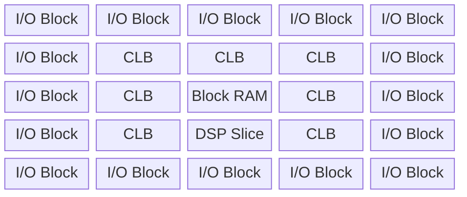
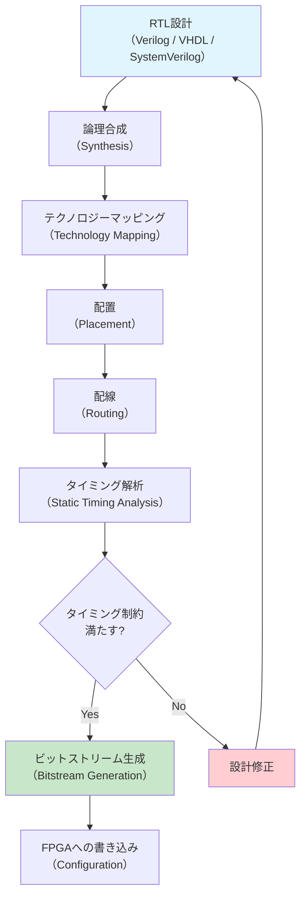
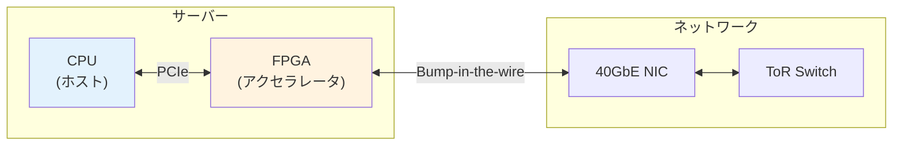
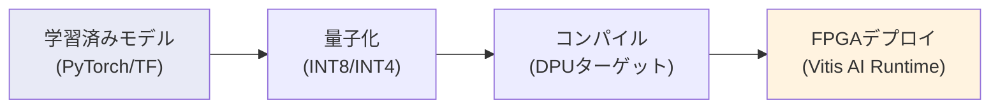
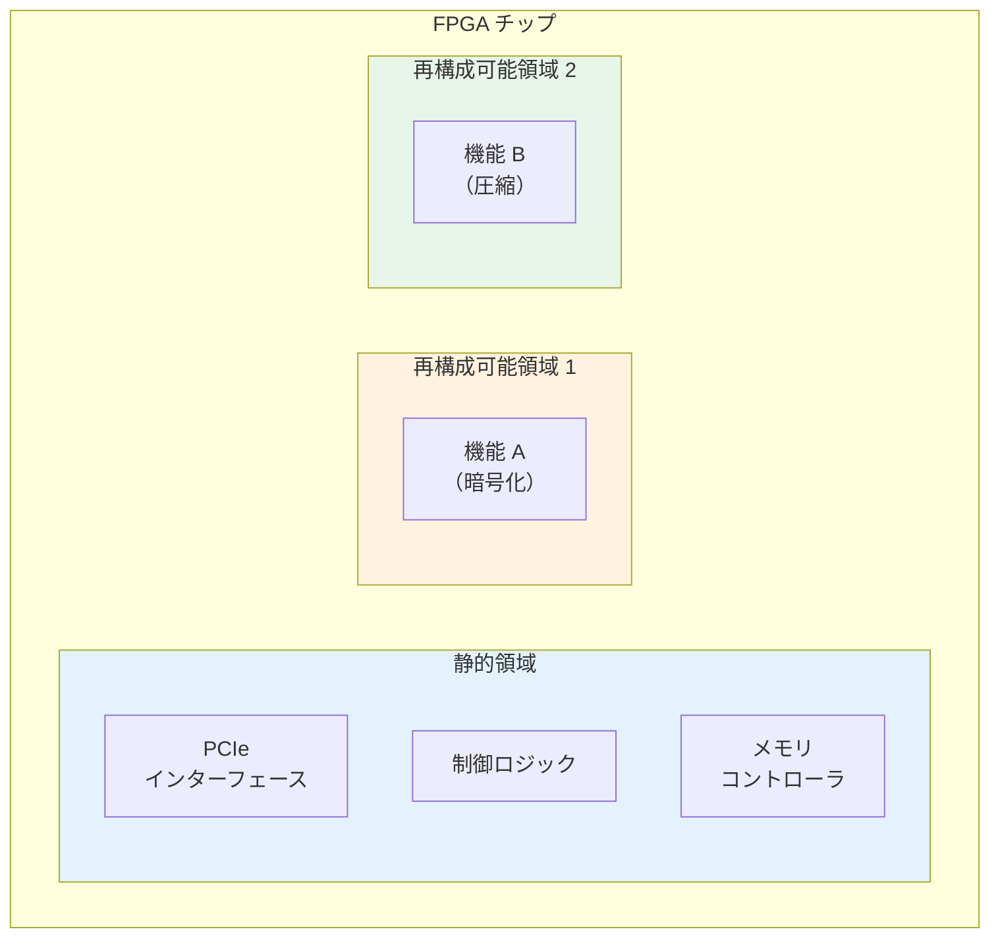
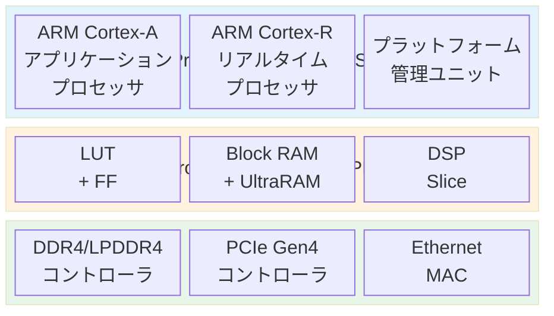
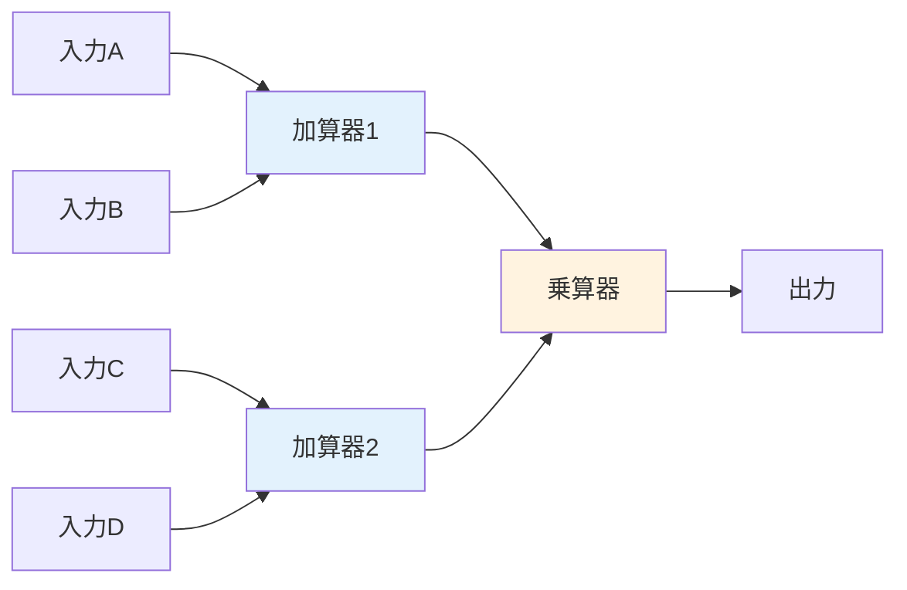

# FPGA と再構成可能コンピューティング

## 背景と動機 — なぜ再構成可能なハードウェアが求められるのか

コンピューティングの歴史は、汎用性と効率性の間のトレードオフとの闘いだった。CPU（Central Processing Unit）はソフトウェアによって任意の計算を実行できる究極の汎用プロセッサだが、その柔軟性と引き換えに、命令フェッチ・デコード・分岐予測といったオーバーヘッドを払い続けている。一方、ASIC（Application-Specific Integrated Circuit）は特定の処理に完全最適化されたハードウェアであり、性能・電力効率ともに最高水準を達成するが、一度製造すると機能変更は不可能であり、設計・製造コストは数億円から数十億円に達する。

FPGA（Field-Programmable Gate Array）は、この2つの極端なアプローチの間に位置する第3の選択肢である。製造後にハードウェアの論理回路構成を書き換えることができ、CPUのような柔軟性とASICに近い性能を両立させる。この「再構成可能性（reconfigurability）」こそが、FPGAの本質的な価値である。

```
性能・電力効率
    ▲
    │  ASIC ●
    │         ＼
    │          ＼
    │    FPGA ●  ＼
    │              ＼
    │    GPU ●      ＼
    │                 ＼
    │    CPU ●         ＼
    │                    ＼
    └──────────────────────→ 柔軟性（プログラマビリティ）
```

上図は計算プラットフォームの性能と柔軟性の関係を概念的に示したものである。FPGAはCPU/GPUとASICの間に位置し、「ちょうどよい」バランスを提供する。近年、ムーアの法則の鈍化、データセンターにおける電力効率への要求増大、AI/MLワークロードの爆発的増加を背景に、FPGAへの注目は急速に高まっている。

## FPGAの基本アーキテクチャ

### アーキテクチャ概要

FPGAの内部は、大きく分けて以下の要素で構成される。



- **CLB（Configurable Logic Block）**: 論理演算を行う基本単位
- **Routing Resources**: CLB間を接続する配線ネットワーク
- **I/O Block**: 外部デバイスとのインターフェース
- **Block RAM（BRAM）**: オンチップメモリ
- **DSP Slice**: 乗算・加算の専用ハードウェア
- **Clock Management**: PLL（Phase-Locked Loop）やクロック分配ネットワーク

### LUT（Look-Up Table） — 論理の基本素子

FPGAの論理実装の中核を担うのが **LUT（Look-Up Table）** である。LUTは、$n$ 入力に対するすべての可能な出力を SRAM に保持したテーブルであり、任意の $n$ 入力ブール関数を実現できる。

$n$ 入力LUTは $2^n$ ビットのSRAMで構成され、入力をアドレスとして使い、対応する出力値を読み出す。例えば、6入力LUT（6-LUT）は $2^6 = 64$ ビットのSRAMを持ち、任意の6変数ブール関数を1つのLUTで実現する。

$$
f: \{0, 1\}^n \rightarrow \{0, 1\}
$$

この方式の重要な点は、AND、OR、XORといった具体的なゲートを配線で構成するのではなく、真理値表そのものをメモリに格納することで任意の論理関数を実現していることである。これが再構成可能性の根幹をなす。

```
6入力LUT（6-LUT）の概念図:

  入力 A ─┐
  入力 B ─┤
  入力 C ─┤─→ [64-bit SRAM] ─→ 出力
  入力 D ─┤    (真理値表)
  入力 E ─┤
  入力 F ─┘

  アドレス = {A, B, C, D, E, F}
  データ   = f(A, B, C, D, E, F) の結果
```

現代のFPGA（Xilinx UltraScale+、Intel Agilex など）では6-LUTが主流である。6-LUTは4-LUTに比べて面積は大きくなるが、複雑な論理をより少ないLUT数で実現でき、配線遅延の削減に寄与する。CLB内部では、複数のLUTに加えてフリップフロップ（FF）、キャリーチェーン、マルチプレクサが組み合わされ、一つの **Slice** を構成する。

### 配線アーキテクチャ — Island-Style Routing

FPGAの面積と遅延の大部分は、論理素子そのものではなく **配線リソース** によって決まる。典型的なFPGAでは、チップ面積の60〜70%が配線に費やされている。

主流の配線アーキテクチャは **Island-Style**（島型）と呼ばれ、CLBの周囲にスイッチボックス（Switch Box）とコネクションボックス（Connection Box）が配置される。

```
  ┌─────┐    ┌─────┐    ┌─────┐
  │ CLB │────│ SB  │────│ CLB │
  └──┬──┘    └──┬──┘    └──┬──┘
     │          │          │
  ┌──┴──┐    ┌──┴──┐    ┌──┴──┐
  │ CB  │────│ SB  │────│ CB  │
  └──┬──┘    └──┬──┘    └──┬──┘
     │          │          │
  ┌──┴──┐    ┌──┴──┐    ┌──┴──┐
  │ CLB │────│ SB  │────│ CLB │
  └─────┘    └─────┘    └─────┘

  SB = Switch Box（配線間の接続を切り替え）
  CB = Connection Box（CLBと配線の接続を切り替え）
```

配線には短距離配線（隣接CLB間）と長距離配線（チップを横断する）があり、信号の遅延特性が異なる。配線の選択と割り当ては、後述するPlace & Route（配置配線）ツールの重要な最適化対象である。

### Block RAM と DSP Slice

**Block RAM（BRAM）** は、FPGAに内蔵されたSRAMブロックである。一般的に18Kbitまたは36Kbitの容量を持ち、デュアルポート（2つの独立したポートから同時に読み書き可能）をサポートする。FIFO、小規模なルックアップテーブル、バッファリングなど、データストレージが必要な場面で広く使われる。

**DSP Slice** は、乗算・加算を高速に行うための専用ハードウェアである。典型的には $27 \times 18$ ビットの乗算器と48ビットのアキュムレータを内蔵し、Multiply-Accumulate（MAC）演算を1サイクルで実行できる。DSPアプリケーション、FIRフィルタ、行列演算、ニューラルネットワークの推論など、数値計算を多用する処理で威力を発揮する。

## FPGA設計フロー

FPGA設計は、ソフトウェア開発とは根本的に異なるプロセスをたどる。以下に典型的な設計フローを示す。



### RTL設計

FPGA設計の出発点は **RTL（Register Transfer Level）** の記述である。RTLは、レジスタ間のデータ転送と組み合わせ論理の振る舞いを記述する抽象化レベルであり、Verilog、VHDL、またはSystemVerilogなどのハードウェア記述言語（HDL）で記述される。

以下は、Verilogで記述した単純なパイプライン化された加算器の例である。

```verilog
module pipelined_adder #(
    parameter WIDTH = 32
) (
    input  wire              clk,
    input  wire              rst_n,
    input  wire [WIDTH-1:0]  a,
    input  wire [WIDTH-1:0]  b,
    output reg  [WIDTH:0]    sum
);
    // Pipeline register for inputs
    reg [WIDTH-1:0] a_reg, b_reg;

    always @(posedge clk or negedge rst_n) begin
        if (!rst_n) begin
            a_reg <= {WIDTH{1'b0}};
            b_reg <= {WIDTH{1'b0}};
            sum   <= {(WIDTH+1){1'b0}};
        end else begin
            // Stage 1: Register inputs
            a_reg <= a;
            b_reg <= b;
            // Stage 2: Compute sum
            sum   <= a_reg + b_reg;
        end
    end
endmodule
```

RTL設計では、ハードウェアの並列性を常に意識する必要がある。ソフトウェアプログラミングのように逐次的に処理が進むのではなく、すべての `always` ブロックが同時に動作する。この並列性こそが、FPGAの性能の源泉である。

### 論理合成とテクノロジーマッピング

**論理合成（Synthesis）** は、RTL記述をゲートレベルのネットリストに変換するプロセスである。合成ツール（Xilinx Vivado、Intel Quartus Prime など）は以下のステップを実行する。

1. **RTLの解析とエラボレーション**: 構文解析とパラメータの展開
2. **論理最適化**: ブール代数の簡略化、冗長論理の除去
3. **テクノロジーマッピング**: 最適化された論理を、ターゲットFPGAのLUT、FF、BRAM、DSPにマッピング

テクノロジーマッピングでは、たとえば6入力以下のブール関数は1つの6-LUTに直接マッピングされる。それ以上の入力を持つ関数は複数のLUTに分割される。この分割の仕方が性能と面積に大きく影響する。

### 配置配線（Place & Route）

**配置（Placement）** は、合成で得られた論理素子をFPGAチップ上の物理的な位置に割り当てるプロセスである。**配線（Routing）** は、配置された素子間を配線リソースで接続するプロセスである。

配置配線はNP困難な最適化問題であり、ヒューリスティックアルゴリズムによって近似解を求める。代表的な手法として以下がある。

- **模擬焼鈍法（Simulated Annealing）**: 配置の初期段階で広く使われる。ランダムな入れ替えを行いながら、コスト関数（配線長、タイミング違反など）を最小化する
- **分割法（Partitioning-Based）**: チップを再帰的に分割し、各パーティション内で最適化を行う
- **PathFinder**: 配線で広く使われるアルゴリズム。まず配線リソースの競合を許容して配線し、その後反復的に競合を解消する

### 静的タイミング解析（STA）

配置配線後、**静的タイミング解析（Static Timing Analysis）** により、すべてのデータパスがタイミング制約を満たしているかを検証する。

FPGA設計で最も重要なタイミングパラメータは以下の通りである。

- **セットアップタイム**: フリップフロップのクロックエッジ前にデータが安定している必要がある時間
- **ホールドタイム**: クロックエッジ後にデータが安定している必要がある時間
- **クリティカルパス**: 回路全体で最も遅延の大きいデータパス。動作周波数を決定する

$$
T_{clk} \geq T_{cq} + T_{logic} + T_{routing} + T_{setup}
$$

ここで $T_{clk}$ はクロック周期、$T_{cq}$ はフリップフロップのclock-to-output遅延、$T_{logic}$ は組み合わせ論理の遅延、$T_{routing}$ は配線遅延、$T_{setup}$ はセットアップタイムである。

タイミング制約を満たさない場合は、RTLの修正（パイプライン段数の追加、クリティカルパスの短縮）や、配置配線の制約変更が必要となる。

## HDLからHLSへ — 設計抽象度の向上

### 高位合成（HLS: High-Level Synthesis）

従来、FPGA設計にはVerilog/VHDLの深い知識が必要とされ、ソフトウェアエンジニアにとって高い参入障壁となっていた。**HLS（High-Level Synthesis）** は、C/C++やOpenCLなどの高水準言語からRTLを自動生成する技術であり、この障壁を大幅に下げる。

代表的なHLSツールには以下がある。

| ツール | ベンダー | 入力言語 |
|--------|----------|----------|
| Vitis HLS | AMD (Xilinx) | C/C++, OpenCL |
| Intel HLS Compiler | Intel (Altera) | C/C++ |
| Catapult HLS | Siemens EDA | C/C++, SystemC |
| Bambu | PoliMi (OSS) | C/C++ |

以下は、Vitis HLSでFIRフィルタを記述した例である。

```cpp
#include <ap_fixed.h>

// 16-bit fixed-point type: 1 sign, 7 integer, 8 fractional bits
typedef ap_fixed<16, 8> data_t;
typedef ap_fixed<32, 16> acc_t;

#define NUM_TAPS 16

void fir_filter(
    data_t input,
    data_t coeffs[NUM_TAPS],
    data_t *output
) {
    #pragma HLS INTERFACE ap_ctrl_none port=return
    #pragma HLS PIPELINE II=1

    static data_t shift_reg[NUM_TAPS];
    #pragma HLS ARRAY_PARTITION variable=shift_reg complete

    acc_t acc = 0;

    // Shift register and multiply-accumulate
    shift_loop:
    for (int i = NUM_TAPS - 1; i > 0; i--) {
        #pragma HLS UNROLL
        shift_reg[i] = shift_reg[i - 1];
    }
    shift_reg[0] = input;

    mac_loop:
    for (int i = 0; i < NUM_TAPS; i++) {
        #pragma HLS UNROLL
        acc += shift_reg[i] * coeffs[i];
    }

    *output = acc;
}
```

HLSの核心は **プラグマ（pragma）** によるハードウェア最適化の指示である。上の例では以下のプラグマが使われている。

- `#pragma HLS PIPELINE II=1`: ループをパイプライン化し、1クロックサイクルごとに新しい入力を受け付ける（Initiation Interval = 1）
- `#pragma HLS UNROLL`: ループを完全に展開し、すべての反復を並列に実行するハードウェアを生成する
- `#pragma HLS ARRAY_PARTITION variable=shift_reg complete`: 配列を個別のレジスタに分割し、すべての要素への同時アクセスを可能にする

::: warning HLSの限界
HLSは万能ではない。生成されたRTLは手書きRTLと比較して面積が10〜50%増加し、動作周波数が低くなることがある。特に複雑な制御フロー（再帰、動的メモリ割り当て、関数ポインタ）は合成できないか、非効率なハードウェアが生成される。HLSはプロトタイピングや生産性が重要な場面で威力を発揮するが、極限の性能が求められる場面では依然として手書きRTLが選択される。
:::

### スケジューリングとバインディング

HLSの内部では、以下の2つの主要な最適化ステップが実行される。

**スケジューリング（Scheduling）** は、各演算をどのクロックサイクルで実行するかを決定する。データ依存関係を解析し、リソース制約の下で実行サイクル数を最小化する。代表的なアルゴリズムとして、ASAP（As Soon As Possible）、ALAP（As Late As Possible）、リストスケジューリングがある。

**バインディング（Binding）** は、スケジューリングされた演算を具体的なハードウェアリソース（乗算器、加算器、レジスタ、メモリポート）に割り当てる。演算を共有するリソースを増やせば面積が小さくなるが、配線が複雑になる。

$$
\text{最適化目標} = \alpha \cdot \text{レイテンシ} + \beta \cdot \text{面積} + \gamma \cdot \text{電力}
$$

ここで $\alpha, \beta, \gamma$ は設計者が与える重み付けパラメータであり、性能・面積・電力のトレードオフを制御する。

## FPGAのパフォーマンスモデル

FPGAの性能を理解するためには、CPUやGPUとは異なるパフォーマンスモデルを把握する必要がある。

### スループットとレイテンシ

FPGAアクセラレータの性能は主に2つの指標で評価される。

- **スループット**: 単位時間あたりの処理量。パイプライン化された設計では、動作周波数と1サイクルあたりの処理要素数の積で決まる
- **レイテンシ**: 入力から出力までの遅延。パイプラインの段数と動作周波数で決まる

パイプライン化された演算ユニットのスループットは以下のように表される。

$$
\text{Throughput} = \frac{N_{PE} \times N_{ops}}{II \times T_{clk}}
$$

ここで $N_{PE}$ は並列演算ユニット数、$N_{ops}$ は1ユニットあたりの1サイクルの演算数、$II$ はInitiation Interval（新しい入力を受け付けるサイクル間隔）、$T_{clk}$ はクロック周期である。

### ルーフラインモデル

FPGAのパフォーマンスバウンドを視覚化するために、CPUやGPUと同様に **ルーフラインモデル** が適用できる。

$$
\text{Performance} = \min\left(\text{Peak Compute}, \text{BW}_{\text{mem}} \times \text{Arithmetic Intensity}\right)
$$

FPGAの場合、ピーク計算性能はDSP Sliceの数と動作周波数で決まり、メモリ帯域幅はオンチップBRAM帯域幅と外部メモリ（DDR4/HBM）帯域幅で制約される。

### CPUとFPGAの本質的な違い

CPUとFPGAのパフォーマンス特性の違いを理解することは極めて重要である。

| 特性 | CPU | FPGA |
|------|-----|------|
| 実行モデル | 逐次（パイプライン＋OoO） | 空間的並列 |
| 動作周波数 | 3〜5 GHz | 100〜500 MHz |
| 並列度 | 数個〜数十のALU | 数千〜数万のLUT/DSP |
| メモリアクセス | キャッシュ階層に依存 | カスタムメモリ階層 |
| 命令オーバーヘッド | フェッチ/デコード必要 | 不要（データパスが直接実装） |
| 消費電力 | 65〜350 W | 5〜75 W |

FPGAの動作周波数はCPUの1/10以下だが、大規模な空間的並列性によってスループットで上回ることができる。また、命令フェッチ・デコードのオーバーヘッドがないため、データパスに投入するエネルギーの比率が高く、ワットあたりの性能（Performance per Watt）でCPUを大きく上回ることが多い。

## 応用分野

### データセンターアクセラレーション

データセンターにおけるFPGAの利用は、Microsoftの **Project Catapult** が先駆的な成功例である。Microsoftは2014年以降、Azure のデータセンターにFPGAを大規模に導入し、以下の処理をハードウェアアクセラレーションしている。

- **Bing検索のランキング**: ドキュメントランキングの一部をFPGAにオフロードし、レイテンシを50%削減
- **Azure Networking**: SmartNICとしてFPGAを用い、仮想ネットワークの暗号化・復号、ロードバランシング、トンネリングをアクセラレーション（Azure Accelerated Networking）
- **AI推論**: DNNモデルの推論を低レイテンシで実行（Project Brainwave）



AWSは **EC2 F1インスタンス** としてFPGAをクラウドで提供し、ユーザーが独自のアクセラレータを開発・デプロイできる環境を整えた。これにより、FPGAの初期投資を大幅に削減し、従量課金でハードウェアアクセラレーションを利用可能にした。

### ネットワーク処理（SmartNIC / DPU）

ネットワーク処理はFPGAの最も成熟した応用分野の一つである。パケット処理は本質的にパイプライン構造に適しており、FPGAの空間的並列性と低レイテンシ特性が活きる。

主要な処理内容には以下がある。

- **仮想スイッチ（OVS）のオフロード**: ネットワーク仮想化のマッチ・アクション処理をFPGAで実行し、CPUコアを解放
- **暗号化/復号**: TLS/IPsecの暗号処理をワイヤレートで実行
- **プロトコルパーシング**: 柔軟なパケットパーサをFPGAに実装し、新しいプロトコルに迅速に対応
- **テレメトリ**: INT（In-band Network Telemetry）のリアルタイム処理

AMD（Xilinx）のAlveoシリーズやIntelのAgilexは、この分野で広く採用されている。

### 機械学習推論

FPGAは機械学習の推論処理、特にエッジ環境での低レイテンシ・低消費電力の推論で強みを発揮する。

::: tip FPGAがML推論に適している理由
1. **カスタム精度**: INT8、INT4、さらにはカスタムビット幅（例: 3ビット、5ビット）の演算を効率的に実装できる。GPUのようにFP16/INT8に制限されない
2. **バッチサイズ1の効率性**: GPUはバッチ処理で効率が上がるが、FPGAは単一入力でも高いスループットを維持できる
3. **決定的レイテンシ**: パイプライン設計により、処理時間のばらつき（ジッタ）が極めて小さい
4. **電力効率**: 同一性能でGPUの1/5〜1/10の消費電力で動作可能
:::

代表的なFPGA向けMLフレームワークとして、AMD（Xilinx）の **Vitis AI** がある。TensorFlowやPyTorchで学習したモデルを量子化・最適化し、FPGAにデプロイするエンドツーエンドのフローを提供する。



### 金融取引（HFT: High-Frequency Trading）

金融取引は、FPGAの超低レイテンシ特性が最も劇的に活かされる分野である。高頻度取引（HFT）では、マーケットデータの受信から注文の発行までのレイテンシがマイクロ秒単位で競われる。

FPGAベースのトレーディングシステムでは、以下の処理チェーンをハードウェアにフル実装する。

1. **マーケットデータのパーシング**: UDP/マルチキャストパケットからFIXプロトコルのメッセージを抽出（数十ナノ秒）
2. **オーダーブックの更新**: 価格帯ごとの注文量をリアルタイムで管理（数十ナノ秒）
3. **シグナル生成**: 事前定義されたトレーディング戦略に基づく売買判断（数百ナノ秒）
4. **注文生成と送信**: FIXメッセージの組み立てと送信（数十ナノ秒）

このフル・ハードウェア実装により、市場データの受信から注文送信まで **1マイクロ秒以下** のエンドツーエンドレイテンシが達成されている。CPUベースのシステムでは10〜100マイクロ秒が一般的であり、FPGAは10倍以上の速度優位性を持つ。

### 通信（5G / 衛星通信）

5G基地局の無線処理は、FPGAの重要な応用分野である。5G NR（New Radio）では、OFDM変復調、ビームフォーミング、チャネル符号化/復号（LDPC、Polar Code）など、大量の信号処理が必要とされる。

FPGAが選ばれる理由は以下の通りである。

- **規格の進化への対応**: 5G規格は継続的に更新されるため、ASICでは対応しきれない
- **リアルタイム制約**: 無線フレームの処理には厳密なタイミング要件がある
- **大規模MIMO**: 多数のアンテナ素子の同時処理に空間的並列性が有効

### その他の応用

- **画像処理・映像処理**: リアルタイムの画像フィルタリング、エンコード/デコード
- **暗号処理**: ハードウェアセキュリティモジュール（HSM）、暗号通貨のマイニング
- **科学計算**: 分子動力学シミュレーション、ゲノム解析（Smith-Waterman アルゴリズムの高速化）
- **自動車**: ADAS（先進運転支援システム）のセンサーフュージョン、画像認識

## 部分再構成（Partial Reconfiguration）

### 概念と動機

**部分再構成（Partial Reconfiguration: PR）** は、FPGA全体を停止させることなく、チップの一部の領域だけを再構成する技術である。これにより、時分割でハードウェアリソースを複数の機能で共有したり、システムの稼働中に機能を更新したりすることが可能になる。



### 時分割多重化（Time-Multiplexing）

部分再構成の最も典型的なユースケースは **時分割多重化** である。FPGAのリソースが不足する場合、タスクを時間的に分割し、必要に応じて再構成可能領域のビットストリームを切り替える。

$$
\text{実効リソース} = \text{物理リソース} \times \frac{T_{task}}{T_{task} + T_{reconfig}}
$$

ここで $T_{task}$ はタスクの実行時間、$T_{reconfig}$ は再構成にかかる時間である。再構成時間は数ミリ秒〜数十ミリ秒であり、タスクの実行時間がこれに対して十分に長い場合に有効である。

### DFX（Dynamic Function eXchange）

AMD（Xilinx）は部分再構成を **DFX（Dynamic Function eXchange）** として体系化し、Vivado設計ツールでサポートしている。DFXの設計では、以下の概念が重要である。

- **静的領域（Static Region）**: 常に動作し続ける部分。ホストインターフェースや制御ロジックが配置される
- **再構成可能パーティション（Reconfigurable Partition: RP）**: 実行中に入れ替え可能な領域
- **再構成可能モジュール（Reconfigurable Module: RM）**: RPに配置される具体的な機能実装

## コンフィギュレーションと起動

### ビットストリーム

FPGAの構成情報は **ビットストリーム** と呼ばれるバイナリデータとして表現される。ビットストリームには以下の情報が含まれる。

- 各LUTのSRAM内容（真理値表）
- 各フリップフロップの初期値
- 配線スイッチの接続状態
- Block RAMの初期値
- DSP Sliceの動作モード設定
- I/Oブロックの設定（電圧レベル、終端抵抗など）

ビットストリームのサイズはFPGAの規模に比例し、小規模デバイスで数百KB、大規模デバイスで数十MB〜100MBに達する。

### コンフィギュレーション方式

FPGAの起動時のコンフィギュレーション方式には以下がある。

- **JTAG**: デバッグ用の標準インターフェース。低速だが確実
- **SPI Flash**: 外付けフラッシュメモリからビットストリームをロード。最も一般的な起動方法
- **SelectMAP / BPI**: パラレルインターフェースを用いた高速コンフィギュレーション
- **PCIe経由**: ホストCPUからPCIeバスを通じてビットストリームを転送

::: details SRAMベースとFlashベースの違い
FPGAのコンフィギュレーションメモリには、主にSRAMベースとFlashベースの2種類がある。

**SRAMベース**（Xilinx/AMD, Intel/Altera の主力製品）は、電源投入時に毎回外部メモリからビットストリームをロードする必要がある。再構成が高速で、最新プロセスノードを適用しやすいという利点がある。

**Flashベース**（Lattice, Microchip/Microsemi）は、コンフィギュレーション情報が不揮発メモリに保持されるため、電源投入と同時に動作を開始する（Instant-On）。セキュリティ面でもコールドブート攻撃に強い。ただし、プロセスの微細化に制約がある。
:::

## FPGAベンダーとエコシステム

### 主要ベンダー

| ベンダー | 主力製品ファミリ | 特徴 |
|----------|------------------|------|
| AMD (Xilinx) | Versal, UltraScale+, Artix, Zynq | 最大シェア。Versalは ACAP（Adaptive Compute Acceleration Platform）としてAIエンジンを統合 |
| Intel (Altera) | Agilex, Stratix 10, Cyclone | HBM2e統合、CXL対応。2024年にAlteraを独立子会社化 |
| Lattice | CertusPro-NX, CrossLink-NX, iCE40 | 低消費電力・小規模向け。エッジAI、コンシューマ向け |
| Microchip (Microsemi) | PolarFire, SmartFusion | 放射線耐性、低消費電力。航空宇宙・産業向け |
| Efinix | Trion, Titanium | Quantum Fabric アーキテクチャ。エッジAI向け新興ベンダー |

### Adaptive SoC — CPUとFPGAの融合

現代のFPGAは、単なるプログラマブルロジックにとどまらず、プロセッサコアやメモリコントローラを一体化した **Adaptive SoC** として進化している。



AMD の **Zynq UltraScale+ MPSoC** は、ARM Cortex-A53（アプリケーションプロセッサ）、ARM Cortex-R5（リアルタイムプロセッサ）、Mali GPU、プログラマブルロジックを1チップに統合している。これにより、LinuxベースのソフトウェアとFPGAアクセラレータを密結合で運用できる。

さらに次世代の **Versal ACAP** では、スカラーエンジン（ARM Cortex-A72）、Adaptableエンジン（プログラマブルロジック）、インテリジェントエンジン（AIエンジン：VLIW/SIMDプロセッサアレイ）の3つのエンジンを統合し、ソフトウェアプログラマビリティとハードウェアカスタマイズの両方を提供している。

## オープンソースFPGAツールチェーン

従来、FPGA開発はベンダー固有の高価なツール（Vivado, Quartus Prime）に依存していたが、オープンソースツールチェーンの発展により状況は変わりつつある。

### 主要なオープンソースツール

| ツール | 機能 | 対応デバイス |
|--------|------|--------------|
| Yosys | 論理合成 | 汎用（Verilog入力） |
| nextpnr | 配置配線 | iCE40, ECP5, Gowin, Nexus |
| Project IceStorm | iCE40のビットストリーム生成 | Lattice iCE40 |
| Project Trellis | ECP5のビットストリーム生成 | Lattice ECP5 |
| Project Apicula | Gowinのビットストリーム生成 | Gowin GW1N/GW2A |
| Verilator | RTLシミュレーション | 汎用 |
| cocotb | Python検証フレームワーク | 汎用 |
| SymbiYosys | 形式検証 | 汎用 |

以下はオープンソースツールチェーンでの開発フローの例である。

```bash
# Yosys: Synthesis (Verilog -> gate-level netlist)
yosys -p "read_verilog design.v; synth_ice40 -top top -json design.json"

# nextpnr: Place & Route (netlist -> routed design)
nextpnr-ice40 --hx8k --package ct256 --json design.json --asc design.asc --pcf pins.pcf

# IceStorm: Bitstream generation
icepack design.asc design.bin

# Program the FPGA
iceprog design.bin
```

::: tip オープンソースFPGAの意義
オープンソースツールチェーンは、教育やプロトタイピングにおいて大きな価値を持つ。ベンダーツールのライセンス費用（年間数万〜数百万円）を不要にし、FPGAへの参入障壁を劇的に下げる。また、ツールチェーンの内部動作が透明であるため、CADアルゴリズムの研究にも貢献している。ただし、AMD/IntelのハイエンドFPGAには対応していないため、製品開発にはベンダーツールが依然として必要である。
:::

## 設計パターンと最適化手法

### パイプライン化

FPGAにおける最も基本的かつ重要な最適化手法が **パイプライン化** である。組み合わせ論理の途中にレジスタ（フリップフロップ）を挿入することで、各段の遅延を短縮し、動作周波数を向上させる。

```
パイプライン化前:
  Input → [重い組み合わせ論理 (遅延: 20ns)] → Output
  最大周波数: 1/20ns = 50 MHz

パイプライン化後（3段）:
  Input → [Stage 1 (7ns)] → FF → [Stage 2 (7ns)] → FF → [Stage 3 (6ns)] → Output
  最大周波数: 1/7ns ≈ 143 MHz
  レイテンシ: 3サイクル = 21ns
```

パイプライン化はスループットを向上させるが、レイテンシ（サイクル数）は増加する。このトレードオフは多くの場面で許容可能であり、特にストリーミング処理（連続データの処理）では極めて有効である。

### データフローアーキテクチャ

FPGAはフォン・ノイマンアーキテクチャの制約から自由であり、**データフローアーキテクチャ** を直接実装できる。データフローでは、データが利用可能になった瞬間に演算が開始され、中央制御ユニットによるスケジューリングが不要である。



上図の例では、加算器1と加算器2は並列に動作し、その結果を受けて乗算器が動作する。CPUでは4つの演算を逐次実行する必要があるが、FPGAでは加算を並列化して2段のパイプラインで実行できる。

### リソース共有（Resource Sharing）

FPGAのリソースは有限であり、大規模な設計ではリソースの効率的な利用が不可欠である。**リソース共有** は、同時に使用されない演算器を時分割で共有する技術である。

```verilog
// Without resource sharing: 2 multipliers
assign result_a = x * coeff_a;
assign result_b = y * coeff_b;

// With resource sharing: 1 multiplier + MUX
always @(posedge clk) begin
    if (phase == 0) begin
        mul_in_a <= x;
        mul_in_b <= coeff_a;
    end else begin
        mul_in_a <= y;
        mul_in_b <= coeff_b;
    end
end
assign mul_result = mul_in_a * mul_in_b;
```

リソース共有はDSP Sliceや乗算器のような大規模なリソースに対して特に有効だが、マルチプレクサと制御論理の追加が必要になるため、動作周波数に影響する可能性がある。

### メモリアクセスの最適化

FPGAの性能はしばしばメモリ帯域幅によって制約される。以下の最適化が重要である。

- **オンチップバッファリング**: 外部メモリからのデータをBRAMにバッファリングし、再利用可能なデータへのアクセスを高速化する
- **メモリアクセスパターンの最適化**: バースト転送を活用し、ランダムアクセスを避ける
- **データの再利用**: 畳み込み処理などでは、ライン・バッファやウィンドウ・バッファによりデータの再読み込みを回避する
- **ダブルバッファリング**: 計算とメモリ転送をオーバーラップさせ、メモリアクセスのレイテンシを隠蔽する

## FPGAの限界と課題

FPGAは万能ではなく、いくつかの根本的な限界を持つ。

### 動作周波数の制約

FPGAのクロック周波数は、ASICやCPUと比較して大幅に低い。これはプログラマブルな配線によるスイッチング遅延が原因である。同一プロセスノードで比較すると、FPGAの配線遅延はASICの5〜10倍に達する。

### 面積効率

FPGAのロジック密度（単位面積あたりのゲート数）はASICの10〜20倍劣る。これは、プログラマブル配線のスイッチ、LUTのSRAM、コンフィギュレーションメモリが大量の面積を消費するためである。

### 開発の難易度

RTL設計はソフトウェア開発と比較して極めて高い専門性を要求する。HLSは参入障壁を下げたが、高性能な設計には依然としてハードウェアの深い理解が不可欠である。

::: danger 避けるべきアンチパターン
- **ソフトウェア的思考でのFPGA設計**: `for`ループや`if-else`の連鎖をそのままHLSに書くと、非効率なハードウェアが生成される
- **タイミング収束を無視した設計**: 配置配線後にタイミングが満たせず、大幅な設計変更を強いられることがある
- **CPUでやるべき処理のFPGA化**: 制御フローが複雑で並列性のない処理は、CPUの方が適切な場合が多い
:::

### デバッグの困難さ

FPGAのデバッグは、ソフトウェアのデバッグと比較して桁違いに困難である。シミュレーション（Verilator、ModelSim）で論理的な正確性を検証できるが、タイミング依存のバグや、実デバイスでの電気的問題の診断には、ロジックアナライザや内蔵デバッグプローブ（Xilinx ILA、Intel SignalTap）が必要となる。

### 消費電力の課題

FPGAはCPUと比較して電力効率が高いことが多いが、ASICと比較すると5〜10倍の消費電力となる。プログラマブル配線のスイッチングやSRAMのリーク電流が主な原因である。

## 将来展望

### チップレットとヘテロジニアス統合

半導体製造の微細化が限界に近づく中、**チップレット** 技術が注目を集めている。Intel の Agilex 7 は EMIB（Embedded Multi-die Interconnect Bridge）を用いた複数ダイの統合を実現しており、AMD の Versal Premium はHBM2eメモリダイを同一パッケージに統合している。

FPGAダイ、CPUダイ、メモリダイ、AIアクセラレータダイを先進パッケージング技術で組み合わせる **ヘテロジニアス統合** は、FPGAの次の大きな進化の方向性である。

### AIアクセラレータとの競争と共存

GPU（NVIDIA）やカスタムAIアクセラレータ（Google TPU、AWS Inferentia/Trainium）との競争は激化している。しかし、FPGAには以下の差別化要因がある。

- **柔軟性**: モデルアーキテクチャの急速な進化に対応可能
- **カスタム精度**: 任意ビット幅の量子化をハードウェアレベルで最適化
- **低レイテンシ**: バッチ不要のストリーミング推論
- **エッジ展開**: 消費電力の制約が厳しい環境

将来的には、GPUがトレーニングと大規模推論を担い、FPGAがエッジ推論と特殊なレイテンシ要件のワークロードを担うという棲み分けが進むと予想される。

### ソフトウェア定義ハードウェア

FPGAの設計生産性を飛躍的に向上させるために、ドメイン特化言語（DSL）やソフトウェアフレームワークの開発が進んでいる。

- **Chisel**: Scalaに埋め込まれたハードウェア記述DSL。UCバークレーで開発され、RISC-Vプロセッサの設計にも使われている
- **SpinalHDL**: Scalaベースの別のハードウェア記述DSL。Chiselよりも独自の型システムを持つ
- **Clash**: Haskellベースのハードウェア記述言語。関数型プログラミングの強力な型システムを活用
- **Amaranth HDL（旧nMigen）**: PythonベースのRTL設計ツール

これらのDSLは、ソフトウェアの生産性ツール（型チェック、テストフレームワーク、パッケージ管理）をハードウェア設計に持ち込むことで、設計の生産性と品質を向上させている。

### CGRA（Coarse-Grained Reconfigurable Architecture）

FPGAの進化形として、**CGRA（Coarse-Grained Reconfigurable Architecture）** が研究されている。FPGAがビットレベルの細粒度な再構成を行うのに対し、CGRAはワードレベル（16ビット、32ビット）の粗粒度な演算ユニットを再構成可能に配列する。

CGRAの利点は以下の通りである。

- **再構成の高速化**: 粗粒度であるため、コンフィギュレーションデータが小さく、再構成時間がマイクロ秒単位に短縮される
- **面積効率の向上**: プログラマブル配線のオーバーヘッドが小さい
- **プログラミングの容易さ**: コンパイラによる自動マッピングがFPGAより容易

ただし、ビットレベルの操作が必要な用途（暗号処理、プロトコルパーシングなど）ではFPGAの方が適している。FPGAとCGRAは補完的な関係にあり、将来的には同一チップ上に共存する可能性もある。

## まとめ

FPGAと再構成可能コンピューティングは、CPUの汎用性とASICの効率性の間のギャップを埋める独自の位置を占めている。その本質は「製造後にハードウェアを書き換えられる」という再構成可能性にあり、これにより以下の価値を提供する。

1. **空間的並列性**: 数千〜数万の演算ユニットの同時動作
2. **カスタムデータパス**: アプリケーションに最適化された専用ハードウェア
3. **低レイテンシ**: 命令フェッチ/デコードのオーバーヘッドがない
4. **電力効率**: CPUの数倍〜10倍以上の性能/ワット
5. **柔軟性**: フィールドでの機能変更と更新

ムーアの法則の鈍化、電力制約の厳格化、AI/MLワークロードの多様化を背景に、FPGAの重要性は今後さらに高まると考えられる。同時に、HLS、DSL、オープンソースツールチェーンの進化により、FPGAの設計生産性は着実に向上しており、より多くのエンジニアがハードウェアアクセラレーションの恩恵を受けられる時代が到来しつつある。
