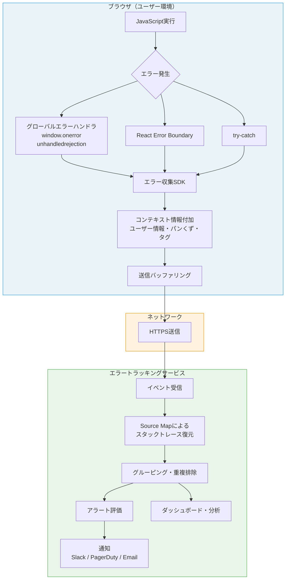
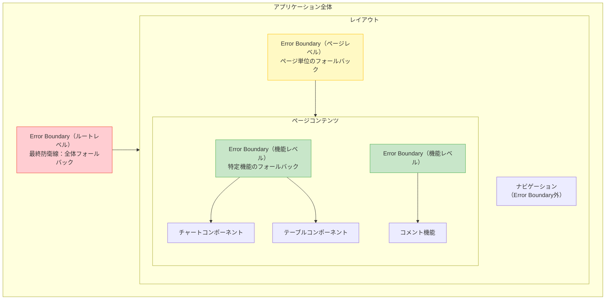
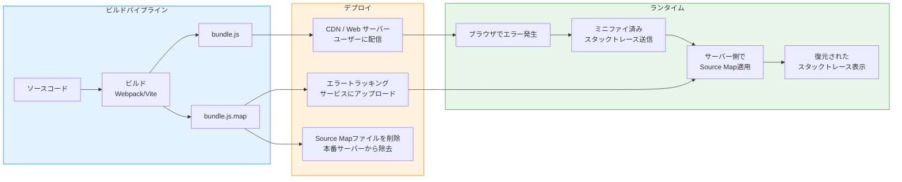
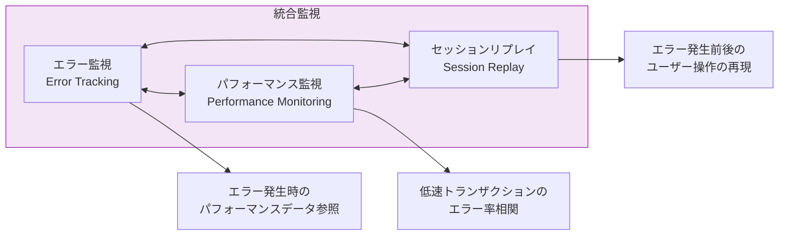
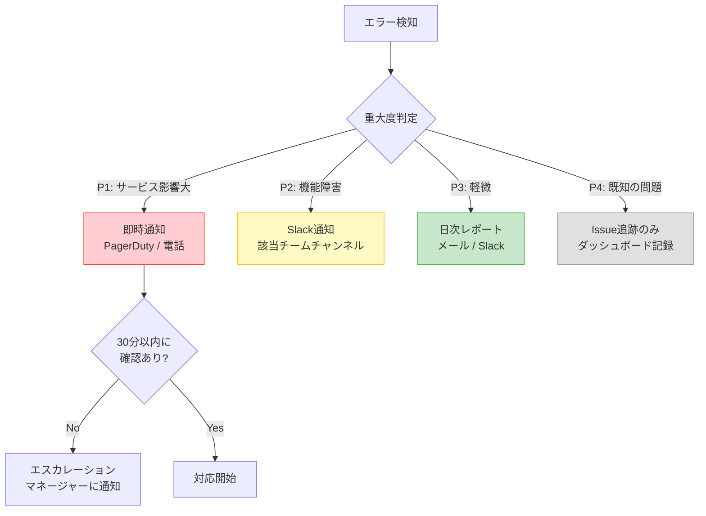

# フロントエンドエラー監視 — Error Boundary, Source Map, Sentry連携による本番障害の可視化

## 1. フロントエンドエラー監視の背景と動機

### 1.1 なぜフロントエンドのエラー監視が必要なのか

バックエンドのエラーは、サーバーログやAPM（Application Performance Monitoring）ツールによって比較的容易に検知・分析できる。サーバーは開発チームが管理する環境で動作しており、ログファイルへのアクセスも容易である。しかし、フロントエンドのエラーは根本的に異なる性質を持つ。

フロントエンドコードはユーザーのブラウザ上で実行される。開発チームはそのブラウザに直接アクセスできない。ユーザーがどのようなブラウザ、OS、デバイス、ネットワーク環境でアプリケーションを使用しているかは多種多様であり、開発環境やCI環境では再現しないエラーが本番環境で頻発するということは珍しくない。

さらに、多くのユーザーはエラーに遭遇しても報告しない。ページが正しく動作しなければ、静かに離脱するだけである。つまり、フロントエンドのエラーは「見えない障害」であり、能動的に監視しなければ認知すらできない。

### 1.2 フロントエンドエラー監視の全体像

フロントエンドエラー監視は、以下の要素から構成される複合的なシステムである。



本記事では、この全体像の各構成要素について、なぜそのような設計になっているのか、実装上の注意点は何か、そして現実の運用でどのような課題があるのかを詳しく解説する。

## 2. フロントエンドエラーの分類

フロントエンドで発生するエラーを適切に監視するためには、まずエラーの種類を理解する必要がある。エラーの種類によって、検知方法やハンドリング戦略が異なるためである。

### 2.1 JavaScript ランタイムエラー

最も基本的なエラーカテゴリである。コードの実行中に発生する例外（Exception）であり、`TypeError`、`ReferenceError`、`RangeError`、`SyntaxError`（eval経由）などが含まれる。

```javascript
// TypeError: undefined or null reference
const user = null;
console.log(user.name); // Cannot read properties of null

// ReferenceError: undeclared variable
console.log(undeclaredVariable); // undeclaredVariable is not defined

// RangeError: value out of range
const arr = new Array(-1); // Invalid array length
```

これらのエラーはスタックトレースを持ち、`window.onerror` やtry-catchで捕捉できる。

### 2.2 非同期エラー（Promise Rejection）

`Promise` がrejectされ、かつ `.catch()` ハンドラが設定されていない場合に発生する。`async/await` を使用している場合、`await` した `Promise` のrejectionはランタイムエラーとして伝播するが、`await` しなかった場合は unhandled rejection となる。

```javascript
// Unhandled promise rejection
fetch('/api/data').then(response => {
    if (!response.ok) {
        throw new Error(`HTTP ${response.status}`);
    }
    return response.json();
});
// .catch() handler is missing — this becomes an unhandled rejection

// async/await without try-catch
async function loadData() {
    const response = await fetch('/api/data'); // may throw
    return response.json();
}
loadData(); // rejection is not handled
```

### 2.3 リソース読み込みエラー

スクリプト、スタイルシート、画像、フォントなどの外部リソースが読み込めない場合に発生するエラーである。CDNの障害、ネットワーク接続の問題、ファイルパスの誤りなどが原因となる。

```html
<!-- Resource loading errors -->
<script src="https://cdn.example.com/app.js"></script>  <!-- CDN down -->
  <!-- 404 Not Found -->
<link rel="stylesheet" href="/styles/main.css" />  <!-- network error -->
```

リソース読み込みエラーは `window.onerror` では捕捉できず、`window.addEventListener('error', handler, true)` でキャプチャフェーズのイベントリスナーを使用する必要がある点に注意が必要である。

### 2.4 ネットワークエラー

API呼び出しの失敗、WebSocket接続の切断、タイムアウトなど、ネットワーク通信に関連するエラーである。`fetch` API は、ネットワークエラーの場合にのみPromiseをrejectし、HTTP 4xxや5xxのレスポンスはrejectしないという仕様上の注意点がある。

### 2.5 レンダリングエラー（React固有）

Reactなどのコンポーネントベースのフレームワークでは、レンダリング中に発生するエラーが特別なカテゴリとして存在する。これらはError Boundaryで捕捉される（後述）。

### 2.6 クロスオリジンスクリプトエラー

異なるオリジンから読み込まれたスクリプトでエラーが発生した場合、ブラウザのセキュリティポリシーにより、エラーの詳細情報が隠蔽される。`window.onerror` のコールバックには「Script error.」というメッセージのみが渡され、ファイル名、行番号、スタックトレースはすべて空になる。

```
Script error.
  at (unknown):(0):(0)
```

この問題を解決するには、外部スクリプトのレスポンスに `Access-Control-Allow-Origin` ヘッダーを付加し、`<script>` タグに `crossorigin="anonymous"` 属性を設定する必要がある。

```html
<!-- Enable CORS for cross-origin script error details -->
<script src="https://cdn.example.com/app.js" crossorigin="anonymous"></script>
```

## 3. グローバルエラーハンドリング

### 3.1 window.onerror

`window.onerror` は、ブラウザが提供する最も基本的なグローバルエラーハンドラである。スクリプトの実行中に捕捉されなかった例外が発生すると、このハンドラが呼び出される。

```javascript
window.onerror = function(message, source, lineno, colno, error) {
    // message: error message string
    // source: URL of the script where the error occurred
    // lineno: line number
    // colno: column number
    // error: Error object (may be null in older browsers)

    const errorData = {
        message,
        source,
        lineno,
        colno,
        stack: error?.stack || '',
        timestamp: new Date().toISOString(),
        userAgent: navigator.userAgent,
        url: window.location.href,
    };

    // Send to error tracking service
    sendToErrorService(errorData);

    // Return true to suppress the error from appearing in console
    // Return false (or nothing) to allow normal console error behavior
    return false;
};
```

`window.onerror` の歴史は古く、Internet Explorer 5の時代（1999年頃）から存在する。第5引数の `error` オブジェクトが追加されたのは比較的最近のことであり、これによりスタックトレースの取得が可能になった。

::: warning
`window.onerror` は、リソース読み込みエラー（``、`<script>` など）やPromiseのrejectionは捕捉できない。これらには別のハンドラが必要である。
:::

### 3.2 window.addEventListener('error') とリソースエラー

`window.addEventListener('error', handler, true)` を使用すると、リソース読み込みエラーも含めてキャプチャフェーズでイベントを捕捉できる。

```javascript
window.addEventListener('error', function(event) {
    // Distinguish between script errors and resource loading errors
    if (event.target && (event.target.tagName === 'SCRIPT' ||
                         event.target.tagName === 'LINK' ||
                         event.target.tagName === 'IMG')) {
        // Resource loading error
        const errorData = {
            type: 'resource_error',
            tagName: event.target.tagName,
            src: event.target.src || event.target.href,
            timestamp: new Date().toISOString(),
        };
        sendToErrorService(errorData);
    }
}, true); // true = capture phase
```

第3引数の `true` がキャプチャフェーズでの監視を指定しており、これが重要である。リソース読み込みエラーのイベントはバブリングしないため、バブリングフェーズ（デフォルト）ではイベントを捕捉できない。

### 3.3 unhandledrejection イベント

`unhandledrejection` イベントは、Promiseがrejectされ、かつrejectionハンドラが設定されていない場合に発火する。現代のフロントエンドアプリケーションは非同期処理を多用するため、このハンドラの設定は不可欠である。

```javascript
window.addEventListener('unhandledrejection', function(event) {
    // event.reason contains the rejection value
    const error = event.reason;
    const errorData = {
        type: 'unhandled_rejection',
        message: error?.message || String(error),
        stack: error?.stack || '',
        timestamp: new Date().toISOString(),
    };

    sendToErrorService(errorData);

    // Optionally prevent default browser behavior (console error)
    // event.preventDefault();
});
```

::: tip
`rejectionhandled` イベントも存在する。これは、一度 `unhandledrejection` として報告されたPromiseに、後からrejectionハンドラが追加された場合に発火する。高精度なエラー監視では、このイベントを使って誤検知（false positive）を除去する実装が考えられる。
:::

### 3.4 グローバルハンドラの設定順序

エラー監視SDKは、可能な限りアプリケーションの初期化の早い段階で設定する必要がある。SDKの初期化前に発生したエラーは捕捉できないためである。

```html
<!DOCTYPE html>
<html>
<head>
    <meta charset="utf-8" />
    <!-- Error monitoring SDK should be loaded FIRST -->
    <script src="https://cdn.example.com/error-sdk.js" crossorigin="anonymous"></script>
    <script>
        // Initialize immediately after SDK loads
        ErrorSDK.init({ dsn: '...' });
    </script>
    <!-- Application scripts load after -->
    <script src="/app.js" defer></script>
</head>
<body>
    <!-- ... -->
</body>
</html>
```

## 4. React Error Boundary

### 4.1 Error Boundaryの誕生背景

React 16（2017年）で導入されたError Boundaryは、Reactコンポーネントツリーのレンダリング中に発生するエラーを捕捉するための仕組みである。React 16以前は、レンダリング中のエラーはコンポーネントツリーを不整合な状態のまま残し、予測不可能なUIの動作を引き起こしていた。React 16ではこの挙動が変更され、Error Boundaryで捕捉されないレンダリングエラーはコンポーネントツリー全体のアンマウントを引き起こすようになった。

この設計判断の背景には、「壊れたUIを表示し続けるよりも、UIを完全に取り除く方が安全である」というReactチームの哲学がある。壊れた状態のUIは、ユーザーに誤った情報を表示したり、意図しない操作を誘発する恐れがあるためだ。

### 4.2 Error Boundaryの実装

Error Boundaryは、`static getDerivedStateFromError()` および `componentDidCatch()` のいずれか（または両方）を実装したクラスコンポーネントである。2026年現在、Error BoundaryはReactのフック（Hooks）APIとしては提供されておらず、クラスコンポーネントとして実装する必要がある。

```jsx
import React from 'react';

class ErrorBoundary extends React.Component {
    constructor(props) {
        super(props);
        this.state = { hasError: false, error: null };
    }

    static getDerivedStateFromError(error) {
        // Update state to render fallback UI on next render
        return { hasError: true, error };
    }

    componentDidCatch(error, errorInfo) {
        // error: the thrown error
        // errorInfo.componentStack: component stack trace
        console.error('ErrorBoundary caught:', error);
        console.error('Component stack:', errorInfo.componentStack);

        // Report to error tracking service
        sendToErrorService({
            type: 'react_render_error',
            message: error.message,
            stack: error.stack,
            componentStack: errorInfo.componentStack,
        });
    }

    render() {
        if (this.state.hasError) {
            // Render fallback UI
            return this.props.fallback || (
                <div role="alert">
                    <h2>問題が発生しました</h2>
                    <p>画面の読み込み中にエラーが発生しました。</p>
                    <button onClick={() => this.setState({ hasError: false, error: null })}>
                        再試行
                    </button>
                </div>
            );
        }
        return this.props.children;
    }
}
```

### 4.3 Error Boundaryの戦略的配置

Error Boundaryの配置は、アプリケーションのUX設計と密接に関連する。エラーの影響範囲をどの粒度で制御するかが設計上の判断ポイントとなる。



**ルートレベルError Boundary**: アプリケーション全体を包む最終防衛線。ここに到達した場合は深刻な問題であり、「予期しないエラーが発生しました。ページを再読み込みしてください」のようなフォールバックUIを表示する。

**ページレベルError Boundary**: 各ページやルートごとに設置し、特定ページのエラーが他のページのナビゲーションに影響しないようにする。サイドバーやヘッダーなどの共通UIは影響を受けない。

**機能レベルError Boundary**: チャート、コメント欄、推薦エンジンの結果表示など、個別の機能コンポーネントを囲む。特定機能が壊れても、ページの他の部分は正常に動作し続ける。

```jsx
function DashboardPage() {
    return (
        <ErrorBoundary fallback={<PageErrorFallback />}>
            <h1>ダッシュボード</h1>
            <div className="grid">
                <ErrorBoundary fallback={<WidgetErrorFallback name="売上チャート" />}>
                    <SalesChart />
                </ErrorBoundary>
                <ErrorBoundary fallback={<WidgetErrorFallback name="ユーザー統計" />}>
                    <UserStats />
                </ErrorBoundary>
                <ErrorBoundary fallback={<WidgetErrorFallback name="最近の注文" />}>
                    <RecentOrders />
                </ErrorBoundary>
            </div>
        </ErrorBoundary>
    );
}
```

### 4.4 Error Boundaryの制約

Error Boundaryには明確な制約がある。以下のエラーはError Boundaryでは捕捉できない。

1. **イベントハンドラ内のエラー**: `onClick`、`onChange` などのイベントハンドラはReactのレンダリングサイクル外で実行されるため、Error Boundaryでは捕捉されない。イベントハンドラ内のエラーにはtry-catchを使用する。
2. **非同期コード**: `setTimeout`、`requestAnimationFrame`、`Promise` 内のエラー。
3. **サーバーサイドレンダリング（SSR）**: SSR中のエラーはクライアントのError Boundaryでは捕捉されない。
4. **Error Boundary自身のエラー**: Error Boundaryコンポーネント自体のレンダリングで発生したエラーは、その上位のError Boundaryで捕捉される。

### 4.5 React 19以降の進化

React 19では、`createRoot` および `hydrateRoot` に新しいエラーコールバックが追加された。

```javascript
import { createRoot } from 'react-dom/client';

const root = createRoot(document.getElementById('root'), {
    // Called when React catches an error in an Error Boundary
    onCaughtError(error, errorInfo) {
        reportToService('caught', error, errorInfo);
    },
    // Called when an error is thrown and NOT caught by an Error Boundary
    onUncaughtError(error, errorInfo) {
        reportToService('uncaught', error, errorInfo);
    },
    // Called when React automatically recovers from errors
    onRecoverableError(error, errorInfo) {
        reportToService('recoverable', error, errorInfo);
    },
});
```

これらのコールバックにより、Error Boundaryの内外を問わず、Reactのレンダリングに関連するすべてのエラーを一元的に監視できるようになった。

### 4.6 react-error-boundary ライブラリ

`react-error-boundary` はBrian Vaughnが開発した軽量なライブラリで、Error Boundaryの実装を簡素化する。関数コンポーネントとの統合、エラー状態のリセット、宣言的なフォールバックUIの指定など、実用的なAPIを提供する。

```jsx
import { ErrorBoundary, useErrorBoundary } from 'react-error-boundary';

function ErrorFallback({ error, resetErrorBoundary }) {
    return (
        <div role="alert">
            <p>エラーが発生しました: {error.message}</p>
            <button onClick={resetErrorBoundary}>再試行</button>
        </div>
    );
}

function ChildComponent() {
    const { showBoundary } = useErrorBoundary();

    async function handleClick() {
        try {
            await riskyOperation();
        } catch (error) {
            // Manually propagate async errors to the nearest Error Boundary
            showBoundary(error);
        }
    }

    return <button onClick={handleClick}>実行</button>;
}

function App() {
    return (
        <ErrorBoundary
            FallbackComponent={ErrorFallback}
            onError={(error, info) => {
                // Report to error tracking service
                sendToErrorService({ error, componentStack: info.componentStack });
            }}
            onReset={() => {
                // Reset application state if needed
            }}
        >
            <ChildComponent />
        </ErrorBoundary>
    );
}
```

`useErrorBoundary` フックの `showBoundary` 関数は、非同期エラーやイベントハンドラ内のエラーを手動でError Boundaryに伝播させるために使用できる。これにより、Error Boundaryの「非同期エラーを捕捉できない」という制約を実用的に回避できる。

## 5. Source Mapの仕組みと管理

### 5.1 Source Mapが必要な理由

本番環境のJavaScriptコードは、通常、以下の最適化処理を経てブラウザに配信される。

1. **ミニファイ（Minification）**: 変数名の短縮、空白の除去、コードの圧縮
2. **バンドル（Bundling）**: 複数のモジュールを1つまたは少数のファイルに結合
3. **トランスパイル（Transpilation）**: TypeScriptからJavaScript、新しいES構文から互換構文への変換

これらの処理により、本番環境のコードは元のソースコードとは大きく異なる形になる。エラーが発生した場合、スタックトレースにはミニファイ後のコードの行番号・列番号が記録されるため、そのままでは原因の特定が極めて困難である。

```
// Minified error stack trace (difficult to debug)
TypeError: Cannot read properties of undefined (reading 'map')
    at e.render (app.3f7a2c.js:1:28456)
    at t.performWork (app.3f7a2c.js:1:31209)
    at Object.flush (app.3f7a2c.js:1:15783)
```

Source Mapは、ミニファイ・バンドル後のコードと元のソースコードの間のマッピング情報を提供するファイルである。これにより、難読化されたスタックトレースを元のソースコードの位置に復元できる。

### 5.2 Source Mapの構造

Source Mapの仕様はECMA-426（旧称Source Map Revision 3）として標準化されている。Source MapはJSON形式のファイルで、以下のような構造を持つ。

```json
{
    "version": 3,
    "file": "app.3f7a2c.js",
    "sources": [
        "../src/components/UserList.tsx",
        "../src/utils/api.ts",
        "../src/hooks/useData.ts"
    ],
    "sourcesContent": [
        "import React from 'react';\n...",
        "export async function fetchUsers() {\n...",
        "export function useData(url: string) {\n..."
    ],
    "names": ["render", "map", "fetchUsers", "useState", "useEffect"],
    "mappings": "AAAA,SAAS,OAAO,MAAM..."
}
```

各フィールドの意味は以下の通りである。

| フィールド | 説明 |
|---|---|
| `version` | Source Mapの仕様バージョン（現在は3） |
| `file` | 生成されたファイル名 |
| `sources` | 元のソースファイルのパス一覧 |
| `sourcesContent` | 元のソースファイルの内容（オプション。デバッグツールがソースを直接参照できない場合に使用） |
| `names` | 元のコードで使用されていた識別子名の一覧 |
| `mappings` | VLQエンコードされたマッピング情報（Source Mapの核心部分） |

### 5.3 VLQ（Variable Length Quantity）エンコーディング

`mappings` フィールドは、Source Mapのファイルサイズを抑えるためにVLQ（Variable Length Quantity）エンコーディングとBase64を組み合わせた圧縮形式を使用している。

マッピング情報の基本単位は「セグメント」であり、各セグメントは以下の4つまたは5つの値を持つ。

1. **生成ファイルの列番号**（前のセグメントからの相対値）
2. **ソースファイルのインデックス**（`sources` 配列内のインデックス、相対値）
3. **元のソースの行番号**（相対値）
4. **元のソースの列番号**（相対値）
5. **`names` 配列のインデックス**（オプション、相対値）

値が相対値（デルタ）であることが重要である。連続するマッピングの差分のみを記録することで、値が小さく保たれ、VLQエンコーディングの効率が最大化される。

```
mappings の構造:

  セミコロン(;) = 生成ファイルの行区切り
  カンマ(,) = 同一行内のセグメント区切り
  各セグメント = Base64 VLQエンコードされた4〜5つの数値

  例: "AAAA;AACA,EAAE,GAAG;..."

  "AAAA" → [0, 0, 0, 0]
           (列0, ソース0, 行0, 列0)

  ";" → 次の生成行へ

  "AACA" → [0, 0, 1, 0]
           (列0, ソース0, 行+1, 列0)
```

### 5.4 Source Mapの配信方式

Source Mapをブラウザに関連付ける方法は主に2つある。

**方式1: sourceMappingURL コメント**

生成されたJavaScriptファイルの末尾に、Source MapのURLを示すコメントを追加する。

```javascript
// ... minified code ...
//# sourceMappingURL=app.3f7a2c.js.map
```

**方式2: SourceMap HTTPヘッダー**

HTTPレスポンスヘッダーでSource Mapの場所を指示する。

```http
SourceMap: /maps/app.3f7a2c.js.map
```

### 5.5 本番環境でのSource Map管理

本番環境でのSource Map管理は、セキュリティとデバッガビリティのバランスが求められる。Source MapにはオリジナルのソースコードやファイルパスなどのSensitiveな情報が含まれるため、一般ユーザーに公開することは望ましくない。



一般的なベストプラクティスは以下の通りである。

1. **Source Mapをビルド時にエラートラッキングサービスにアップロードする**: Sentryなどのサービスに事前にアップロードしておく。
2. **本番サーバーからSource Mapファイルを削除する**: CDNやWebサーバーにSource Mapファイルをデプロイしない、またはデプロイ後に削除する。
3. **Hidden Source Mapを使用する**: `sourceMappingURL` コメントを含まないSource Mapを生成する。webpack の `hidden-source-map` オプション、Vite の同等の設定がこれに対応する。

```javascript
// webpack.config.js
module.exports = {
    // Generate source maps without the sourceMappingURL comment
    devtool: 'hidden-source-map',
    // ...
};
```

```javascript
// vite.config.js
export default defineConfig({
    build: {
        sourcemap: 'hidden',
    },
});
```

## 6. エラートラッキングサービス（Sentry）

### 6.1 Sentryの概要

Sentryは、2012年にDavid CramerとChris Jenningsによって開発されたオープンソースのエラートラッキングプラットフォームである。もともとはDjangoアプリケーションのエラー監視ツールとして始まったが、現在ではJavaScript、Python、Ruby、Go、Java、.NETなど数十のプラットフォームをサポートしている。

Sentryは、SaaS版とセルフホスト版の両方を提供しており、セルフホスト版はBSLライセンスの下で公開されている。フロントエンドエラー監視の分野では、デファクトスタンダードのひとつとして広く採用されている。

### 6.2 Sentry SDKの初期化

Sentry JavaScript SDKの初期化は、アプリケーションのエントリーポイントで可能な限り早い段階で行う。

```javascript
import * as Sentry from '@sentry/react';

Sentry.init({
    // DSN (Data Source Name): project-specific endpoint
    dsn: 'https://examplePublicKey@o0.ingest.sentry.io/0',

    // Release version for tracking deployments
    release: 'my-app@1.2.3',

    // Environment identifier
    environment: process.env.NODE_ENV,

    // Sample rate for error events (1.0 = 100%)
    sampleRate: 1.0,

    // Sample rate for performance transactions
    tracesSampleRate: 0.1, // 10% of transactions

    // Hook to modify or filter events before sending
    beforeSend(event, hint) {
        // Filter out known non-actionable errors
        if (event.exception?.values?.[0]?.type === 'ResizeObserver loop limit exceeded') {
            return null; // Drop the event
        }
        return event;
    },

    // Hook to modify or filter breadcrumbs
    beforeBreadcrumb(breadcrumb, hint) {
        // Redact sensitive data from breadcrumbs
        if (breadcrumb.category === 'xhr' || breadcrumb.category === 'fetch') {
            if (breadcrumb.data?.url?.includes('/auth')) {
                breadcrumb.data.body = '[REDACTED]';
            }
        }
        return breadcrumb;
    },

    // Integrations configuration
    integrations: [
        Sentry.browserTracingIntegration(),
        Sentry.replayIntegration({
            maskAllText: true,
            blockAllMedia: true,
        }),
    ],

    // Initial scope configuration
    initialScope: {
        tags: {
            component: 'frontend',
            team: 'web-platform',
        },
    },
});
```

`dsn`（Data Source Name）は、エラーイベントの送信先を特定する一意のURLである。DSNにはプロジェクトの公開鍵が含まれるが、これはイベントの送信先を特定するためだけに使用されるものであり、秘密鍵ではない。したがって、クライアントサイドのコードに含めることはセキュリティ上問題はない。

### 6.3 Sentryの Error Boundary統合

Sentry SDKは、`@sentry/react` パッケージを通じて、Reactとの深い統合を提供する。SDKが提供する `Sentry.ErrorBoundary` コンポーネントを使用すると、Error Boundaryで捕捉されたエラーが自動的にSentryに報告される。

```jsx
import * as Sentry from '@sentry/react';

function FallbackComponent({ error, componentStack, resetError }) {
    return (
        <div role="alert">
            <h2>エラーが発生しました</h2>
            <p>{error.toString()}</p>
            <button onClick={resetError}>再試行</button>
        </div>
    );
}

function App() {
    return (
        <Sentry.ErrorBoundary
            fallback={FallbackComponent}
            showDialog={true} // Show Sentry user feedback dialog
            beforeCapture={(scope) => {
                scope.setTag('boundary', 'app-root');
            }}
        >
            <MainContent />
        </Sentry.ErrorBoundary>
    );
}
```

### 6.4 Source Mapのアップロード

Sentryでのスタックトレース復元を実現するには、ビルド時にSource MapをSentryにアップロードする必要がある。現在推奨されている方法は、Debug IDを使用するArtifact Bundle方式である。

各ビルドツールに対応するSentryプラグインが提供されている。

::: code-group

```javascript [webpack]
// webpack.config.js
const { sentryWebpackPlugin } = require('@sentry/webpack-plugin');

module.exports = {
    devtool: 'source-map',
    plugins: [
        sentryWebpackPlugin({
            org: 'my-org',
            project: 'my-frontend',
            authToken: process.env.SENTRY_AUTH_TOKEN,
            // Delete source maps after upload
            sourcemaps: {
                filesToDeleteAfterUpload: ['./dist/**/*.map'],
            },
        }),
    ],
};
```

```javascript [vite]
// vite.config.js
import { defineConfig } from 'vite';
import { sentryVitePlugin } from '@sentry/vite-plugin';

export default defineConfig({
    build: {
        sourcemap: true,
    },
    plugins: [
        sentryVitePlugin({
            org: 'my-org',
            project: 'my-frontend',
            authToken: process.env.SENTRY_AUTH_TOKEN,
            sourcemaps: {
                filesToDeleteAfterUpload: ['./dist/**/*.map'],
            },
        }),
    ],
});
```

:::

`filesToDeleteAfterUpload` オプションにより、Sentryへのアップロード完了後にローカルのSource Mapファイルが自動削除される。これにより、本番サーバーにSource Mapが誤ってデプロイされるリスクを軽減できる。

Sentry CLIを使用した手動アップロードも可能である。

```bash
# Upload source maps using Sentry CLI
sentry-cli sourcemaps upload \
    --org my-org \
    --project my-frontend \
    --release my-app@1.2.3 \
    ./dist
```

### 6.5 イベントのグルーピングとフィンガープリント

Sentryは、受信したエラーイベントを自動的にグルーピングし、同一のエラーを1つの「Issue」としてまとめる。このグルーピングのアルゴリズムは、スタックトレースのフレーム、例外の型、メッセージなどの情報を組み合わせて使用する。

自動グルーピングが適切でない場合、カスタムフィンガープリントを指定して手動でグルーピングを制御できる。

```javascript
Sentry.withScope((scope) => {
    // Custom fingerprint for grouping
    scope.setFingerprint(['payment-failure', paymentMethod]);
    Sentry.captureException(error);
});
```

## 7. コンテキスト情報の収集

エラーの発生場所（スタックトレース）だけでは、根本原因の特定には不十分な場合が多い。エラーが「どのような状況で」発生したのかを理解するために、コンテキスト情報の収集が重要となる。

### 7.1 ブレッドクラム（Breadcrumbs）

ブレッドクラムは、エラーに至るまでのユーザー操作やシステムイベントの時系列記録である。Sentry SDKはデフォルトで以下のイベントを自動的にブレッドクラムとして記録する。

- **DOM操作**: クリック、入力などのユーザーインタラクション
- **ナビゲーション**: ページ遷移（`history.pushState` など）
- **ネットワーク**: `fetch` や `XMLHttpRequest` のリクエストとレスポンス
- **コンソール**: `console.log`、`console.warn`、`console.error` の呼び出し

```javascript
// Automatically captured breadcrumbs (example timeline):
// 10:00:01 [ui.click]      button#submit-order
// 10:00:01 [http]          POST /api/orders → 200
// 10:00:02 [navigation]    /checkout → /confirmation
// 10:00:03 [http]          GET /api/orders/123 → 500
// 10:00:03 [error]         TypeError: Cannot read properties of undefined

// Custom breadcrumb
Sentry.addBreadcrumb({
    category: 'user-action',
    message: 'User selected payment method: credit_card',
    level: 'info',
    data: {
        paymentMethod: 'credit_card',
        cartTotal: 4980,
    },
});
```

ブレッドクラムはエラーのデバッグにおいて非常に強力である。「ユーザーが注文ボタンをクリックし、APIが500を返し、その直後にTypeErrorが発生した」という時系列を把握できれば、根本原因の特定が大幅に効率化される。

### 7.2 ユーザーコンテキスト

エラーがどのユーザーに影響しているかを把握することは、エラーの影響範囲の評価と優先度付けに不可欠である。

```javascript
// Set user context after authentication
Sentry.setUser({
    id: 'user-12345',
    email: 'user@example.com', // Consider privacy implications
    username: 'johndoe',
    // Custom data
    subscription: 'premium',
});

// Clear user context on logout
Sentry.setUser(null);
```

::: warning
ユーザーのメールアドレスなどの個人情報をエラートラッキングサービスに送信する際は、プライバシーポリシーとの整合性を確認すること。GDPR、個人情報保護法などの規制要件を考慮する必要がある（後述の「プライバシー考慮事項」を参照）。
:::

### 7.3 タグとカスタムコンテキスト

タグは、エラーイベントに付加するキー・バリューのメタデータであり、検索やフィルタリングに使用される。カスタムコンテキストは、より詳細な構造化データを付加するために使用する。

```javascript
// Tags: indexed, searchable, limited to string values
Sentry.setTag('feature', 'checkout');
Sentry.setTag('ab_test_variant', 'B');
Sentry.setTag('browser_extension_detected', String(hasExtensions));

// Custom context: not indexed, but can contain structured data
Sentry.setContext('shopping_cart', {
    itemCount: 3,
    totalAmount: 14940,
    currency: 'JPY',
    couponApplied: true,
});

// Extra data (for ad-hoc debugging)
Sentry.setExtra('lastApiResponse', {
    status: 500,
    body: 'Internal Server Error',
    endpoint: '/api/orders',
});
```

### 7.4 コンテキスト収集のアーキテクチャ

コンテキスト情報の収集を体系的に行うために、アプリケーション内にコンテキストプロバイダーを設計する方法がある。

```javascript
// Centralized context collector
class ErrorContextCollector {
    constructor() {
        this.contexts = new Map();
    }

    setContext(key, value) {
        this.contexts.set(key, value);
        Sentry.setContext(key, value);
    }

    // Attach relevant contexts to error events
    enrichError(error) {
        Sentry.withScope((scope) => {
            for (const [key, value] of this.contexts) {
                scope.setContext(key, value);
            }
            Sentry.captureException(error);
        });
    }

    // Device and environment info
    collectEnvironmentContext() {
        this.setContext('device', {
            screenWidth: window.screen.width,
            screenHeight: window.screen.height,
            devicePixelRatio: window.devicePixelRatio,
            online: navigator.onLine,
            memory: navigator.deviceMemory,
            cpuCores: navigator.hardwareConcurrency,
        });
        this.setContext('viewport', {
            width: window.innerWidth,
            height: window.innerHeight,
        });
    }
}

const errorContext = new ErrorContextCollector();
errorContext.collectEnvironmentContext();
```

## 8. パフォーマンスモニタリングとの統合

### 8.1 エラーとパフォーマンスの関連性

エラー監視とパフォーマンス監視は、従来は別々のツールで行われることが多かったが、近年はこれらを統合する傾向が強まっている。両者には密接な関連がある。

- **低速なAPIレスポンス** → タイムアウトエラー → ユーザー離脱
- **メモリリーク** → ページの応答性低下 → ランタイムエラー
- **大量のレンダリング** → UIのフリーズ → ユーザーの再操作 → 競合状態エラー



### 8.2 Web Vitalsとの統合

Core Web Vitalsは、Googleが定義するWebページのユーザー体験品質指標である。エラー監視とWeb Vitalsの統合により、エラーがユーザー体験に与える影響を定量的に評価できる。

```javascript
import * as Sentry from '@sentry/react';
import { onCLS, onINP, onLCP, onFCP, onTTFB } from 'web-vitals';

// Report Web Vitals as custom measurements
function reportWebVital(metric) {
    Sentry.addBreadcrumb({
        category: 'web-vital',
        message: `${metric.name}: ${metric.value}`,
        level: 'info',
        data: {
            name: metric.name,
            value: metric.value,
            rating: metric.rating, // 'good', 'needs-improvement', 'poor'
            delta: metric.delta,
            navigationType: metric.navigationType,
        },
    });

    // Set as tag for correlation with errors
    Sentry.setTag(`web_vital_${metric.name.toLowerCase()}`, metric.rating);
}

onLCP(reportWebVital);  // Largest Contentful Paint
onINP(reportWebVital);  // Interaction to Next Paint
onCLS(reportWebVital);  // Cumulative Layout Shift
onFCP(reportWebVital);  // First Contentful Paint
onTTFB(reportWebVital); // Time to First Byte
```

### 8.3 トランザクショントレーシング

Sentryのパフォーマンスモニタリングは、OpenTelemetryのトレーシングモデルに基づいている。フロントエンドのページロードやユーザーインタラクションを「トランザクション」として記録し、その中のAPIコール、DOMレンダリングなどを「スパン」として階層的に記録する。

```javascript
import * as Sentry from '@sentry/react';

// Manual instrumentation example
async function processCheckout(cartId) {
    return Sentry.startSpan(
        { name: 'checkout.process', op: 'function' },
        async (span) => {
            // Child span: validate cart
            const cart = await Sentry.startSpan(
                { name: 'checkout.validate', op: 'function' },
                async () => {
                    return await validateCart(cartId);
                }
            );

            // Child span: API call
            const order = await Sentry.startSpan(
                { name: 'checkout.createOrder', op: 'http.client' },
                async () => {
                    return await fetch('/api/orders', {
                        method: 'POST',
                        body: JSON.stringify(cart),
                    }).then(r => r.json());
                }
            );

            return order;
        }
    );
}
```

エラーがトランザクション内で発生した場合、そのエラーはトランザクションに紐付けられ、「どの操作の中で、どのタイミングでエラーが発生したか」を把握できる。

### 8.4 Session Replay

Session Replayは、ユーザーのブラウザ上での操作をDOMの変更差分として記録し、エラー発生前後のユーザー体験をビデオのように再生できる機能である。

```javascript
Sentry.init({
    dsn: '...',
    integrations: [
        Sentry.replayIntegration({
            // Capture 10% of all sessions
            sessionSampleRate: 0.1,
            // Capture 100% of sessions with errors
            errorSampleRate: 1.0,
            // Privacy settings
            maskAllText: true,
            maskAllInputs: true,
            blockAllMedia: true,
        }),
    ],
});
```

Session Replayの `errorSampleRate: 1.0` は、エラーが発生したセッションを100%記録する設定である。これにより、エラーの再現手順を確認するための労力が大幅に削減される。ただし、Session Replayはデータ量が大きくなるため、通常セッションのサンプルレートは低く設定し、エラーセッションのみ高いサンプルレートとすることが一般的である。

## 9. アラート設計

### 9.1 アラートの目的と課題

エラー監視の最終的な目的は、問題を迅速に検知し、適切な担当者に通知し、修正を促すことである。しかし、アラートの設計が不適切であると、以下の問題が発生する。

- **アラート疲れ（Alert Fatigue）**: 大量の低優先度アラートにより、重要なアラートが埋もれる
- **誤検知（False Positives）**: 実際には問題でないエラーに対するアラートが多発する
- **検知漏れ（False Negatives）**: 重要なエラーがアラートの閾値を下回り、検知されない

### 9.2 アラート条件の設計

効果的なアラート設計のための基本的なアプローチを以下に示す。

**頻度ベースのアラート**: 単位時間あたりのエラー発生件数が閾値を超えた場合に通知する。

```
条件例:
- 「5分間に同一Issueが50件以上発生」→ P1アラート
- 「1時間に新規Issueが10件以上発生」→ P2アラート
```

**影響範囲ベースのアラート**: エラーの影響を受けているユーザー数に基づく。

```
条件例:
- 「30分間に100人以上のユーザーが影響」→ P1アラート
- 「1時間にエラー率が5%を超過」→ P1アラート
```

**新規エラーアラート**: 過去に発生したことのない新しいエラーが発生した場合に通知する。これはリリース直後の回帰バグの早期検知に有効である。

```
条件例:
- 「新規Issueが発生し、かつ直近のリリースに関連」→ 即時通知
```

### 9.3 アラートのエスカレーション



### 9.4 リリースとアラートの連携

デプロイ直後はエラーの発生パターンが変化しやすい。Sentryはリリース情報との統合機能を持ち、「どのリリースでエラーが導入されたか」「どのリリースでエラーが修正されたか」を追跡できる。

```javascript
Sentry.init({
    dsn: '...',
    release: 'my-app@2.3.1', // Release version
    environment: 'production',
});
```

リリースバージョンを設定することで、以下のような分析が可能になる。

- **回帰検知**: 新しいリリースで過去に修正済みのエラーが再発した場合の検知
- **リリース比較**: 現在のリリースと前回のリリースのエラー率を比較
- **Suspect Commits**: コミット情報との統合により、エラーの原因となった可能性が高いコミットを特定

### 9.5 ノイズの制御

実際の運用では、アクションが不要なエラーが大量に発生することがある。これらのノイズを適切に制御することが、アラートの信頼性を維持する上で重要である。

```javascript
Sentry.init({
    dsn: '...',
    // Filter events before sending
    beforeSend(event, hint) {
        const error = hint.originalException;

        // Ignore browser extension errors
        if (event.exception?.values?.some(v =>
            v.stacktrace?.frames?.some(f =>
                f.filename?.includes('chrome-extension://') ||
                f.filename?.includes('moz-extension://')
            )
        )) {
            return null;
        }

        // Ignore known non-actionable errors
        const ignoreErrors = [
            'ResizeObserver loop limit exceeded',
            'ResizeObserver loop completed with undelivered notifications',
            'Non-Error promise rejection captured',
            'Load failed',           // Safari network errors
            'Failed to fetch',       // Network errors
            'NetworkError',
        ];

        if (ignoreErrors.some(msg =>
            event.message?.includes(msg) ||
            error?.message?.includes(msg)
        )) {
            return null;
        }

        return event;
    },

    // Ignore specific error patterns
    ignoreErrors: [
        /^Script error\.?$/,
        /^ResizeObserver/,
    ],

    // Deny URLs (e.g., browser extensions, third-party scripts)
    denyUrls: [
        /extensions\//i,
        /^chrome:\/\//i,
        /^moz-extension:\/\//i,
    ],
});
```

## 10. プライバシー考慮事項

### 10.1 エラー監視とプライバシーの緊張関係

エラー監視のデバッグ能力は、収集する情報量に比例して向上する。しかし、収集する情報が増えるほど、プライバシーリスクも増大する。この緊張関係を適切にバランスさせることが、エラー監視システムの設計において重要な課題である。

### 10.2 収集すべきでない情報

以下の情報は、エラー監視システムで収集・保存すべきでない。

| 情報の種類 | 理由 | 対策 |
|---|---|---|
| パスワード | 認証情報の漏洩リスク | 入力フィールドのマスキング |
| クレジットカード番号 | PCI DSS準拠義務 | 決済フォームの除外 |
| 個人を特定できる医療情報 | HIPAA等の規制 | データのフィルタリング |
| APIキー・トークン | セキュリティリスク | `beforeSend` でのサニタイズ |
| フォーム入力内容 | 個人情報の可能性 | デフォルトでのマスキング |

### 10.3 データのサニタイズ

Sentryの `beforeSend` フックと `beforeBreadcrumb` フックを活用して、送信前にSensitiveなデータを除去する。

```javascript
Sentry.init({
    dsn: '...',
    beforeSend(event) {
        // Sanitize URL query parameters
        if (event.request?.query_string) {
            const params = new URLSearchParams(event.request.query_string);
            const sensitiveParams = ['token', 'api_key', 'password', 'secret'];
            sensitiveParams.forEach(param => {
                if (params.has(param)) {
                    params.set(param, '[REDACTED]');
                }
            });
            event.request.query_string = params.toString();
        }

        // Sanitize cookies
        if (event.request?.cookies) {
            event.request.cookies = '[REDACTED]';
        }

        // Sanitize form data in breadcrumbs
        if (event.breadcrumbs) {
            event.breadcrumbs = event.breadcrumbs.map(bc => {
                if (bc.data?.body && typeof bc.data.body === 'string') {
                    try {
                        const parsed = JSON.parse(bc.data.body);
                        const sensitiveFields = ['password', 'creditCard', 'ssn', 'token'];
                        sensitiveFields.forEach(field => {
                            if (parsed[field]) {
                                parsed[field] = '[REDACTED]';
                            }
                        });
                        bc.data.body = JSON.stringify(parsed);
                    } catch {
                        // Not JSON; leave as-is or redact entirely
                    }
                }
                return bc;
            });
        }

        return event;
    },
});
```

### 10.4 Session Replayのプライバシー設計

Session Replayは特にプライバシーへの配慮が必要な機能である。Sentry SDKはデフォルトでテキストコンテンツとフォーム入力をマスクする機能を提供している。

```javascript
Sentry.init({
    dsn: '...',
    integrations: [
        Sentry.replayIntegration({
            // Mask all text content by default
            maskAllText: true,
            // Mask all input field values
            maskAllInputs: true,
            // Block media elements (images, videos, etc.)
            blockAllMedia: true,
        }),
    ],
});
```

HTMLの `data-sentry-mask` 属性と `data-sentry-block` 属性を使用して、要素レベルでのマスキング・ブロッキングを制御することもできる。

```html
<!-- Mask specific elements -->
<div data-sentry-mask>
    <p>この要素内のテキストはマスクされます</p>
    <span>ユーザーの個人情報: ****</span>
</div>

<!-- Block entire elements from recording -->
<div data-sentry-block>
    <!-- This entire element will not be recorded -->
    <form id="payment-form">
        <!-- ... -->
    </form>
</div>

<!-- Unmask specific elements when maskAllText is enabled -->
<h1 data-sentry-unmask>このタイトルはマスクされません</h1>
```

### 10.5 データ保持と削除

GDPR（EU一般データ保護規則）やCCPA（カリフォルニア州消費者プライバシー法）などの規制に準拠するため、エラーデータの保持期間と削除ポリシーを明確に定める必要がある。

- **データ保持期間**: エラーデータの保持期間を30日、60日、90日などの適切な期間に設定する。Sentryでは組織設定でデータ保持期間を構成できる。
- **ユーザーからの削除要請**: GDPRの「消去権（Right to Erasure）」に対応するため、特定ユーザーに関連するエラーデータを削除するプロセスを整備する。
- **プライバシーポリシーとの整合性**: エラー監視で収集するデータについて、アプリケーションのプライバシーポリシーに明記する。

## 11. 実践的な導入アプローチ

### 11.1 段階的な導入ステップ

フロントエンドエラー監視を新規に導入する場合、以下の段階的アプローチを推奨する。

**フェーズ1: 基盤構築**
1. Sentry SDKの導入と基本初期化
2. グローバルエラーハンドラの設定確認
3. Source Mapアップロードの自動化（CIパイプラインへの組み込み）
4. ルートレベルのError Boundaryの設置

**フェーズ2: コンテキスト強化**
1. ユーザーコンテキストの設定
2. カスタムタグの追加（機能名、A/Bテストバリアントなど）
3. 重要なユーザーフローへのカスタムブレッドクラムの追加
4. ページレベル・機能レベルのError Boundaryの追加

**フェーズ3: アラートとワークフロー**
1. アラートルールの設計と設定
2. Slack、PagerDutyなどの通知チャネルとの統合
3. Issue管理ツール（Jira、GitHub Issuesなど）との統合
4. `beforeSend` によるノイズフィルタリングの調整

**フェーズ4: 高度な機能**
1. パフォーマンスモニタリングの有効化
2. Session Replayの導入
3. リリースヘルスの監視
4. ダッシュボードの構築とSLO/SLIの設定

### 11.2 サンプルレートの設計

本番環境の規模に応じて、適切なサンプルレートを設定する。すべてのイベントを100%送信すると、コストが膨大になるだけでなく、SDK自体がアプリケーションのパフォーマンスに影響を与える可能性がある。

```javascript
Sentry.init({
    dsn: '...',
    // Error events: usually 100% capture is acceptable
    sampleRate: 1.0,

    // Performance transactions: adjust based on traffic volume
    tracesSampleRate: calculateSampleRate(),

    // Session replay: conservative defaults
    replaysSessionSampleRate: 0.01,  // 1% of all sessions
    replaysOnErrorSampleRate: 1.0,   // 100% of error sessions
});

function calculateSampleRate() {
    // Higher sample rate for lower traffic, lower for high traffic
    const isHighTraffic = window.__APP_CONFIG__?.highTraffic;
    return isHighTraffic ? 0.01 : 0.1;
}
```

## 12. 代替ツールとエコシステム

### 12.1 Sentry以外の選択肢

フロントエンドエラー監視のエコシステムには、Sentry以外にも複数の選択肢が存在する。

| ツール | 特徴 | 形態 |
|---|---|---|
| Sentry | OSS、セルフホスト可能、広いプラットフォーム対応 | SaaS / セルフホスト |
| Datadog RUM | インフラ監視との統合、APMとの一体化 | SaaS |
| Bugsnag | モバイルアプリとの統合、安定性スコア | SaaS |
| LogRocket | Session Replayに強み | SaaS |
| Grafana Frontend Observability | Grafanaエコシステムとの統合、OpenTelemetry対応 | SaaS / セルフホスト |
| Rollbar | AI支援のエラーグルーピング | SaaS |

### 12.2 選択基準

ツールの選択にあたっては、以下の観点で評価することを推奨する。

- **既存の監視スタックとの統合**: すでにDatadogやGrafanaを使用している場合、同一プラットフォームでの統合が有利
- **セルフホストの可否**: データの保管場所に関する規制要件がある場合、セルフホスト可能なツールが必要
- **Source Mapの取り扱い**: Source Mapのアップロード、管理、セキュリティ
- **Session Replayの品質**: プライバシー機能、パフォーマンスへの影響
- **コスト構造**: イベント数課金、ユーザー数課金、定額課金など

## 13. まとめ

フロントエンドエラー監視は、「ユーザーのブラウザで何が起きているのかを知る」ための不可欠なインフラストラクチャである。本記事で解説した各要素を改めて整理する。

**エラーの検知**: `window.onerror`、`unhandledrejection`、React Error Boundaryの3層構造により、ランタイムエラー、非同期エラー、レンダリングエラーのすべてを捕捉する。

**スタックトレースの復元**: Source Mapにより、ミニファイされた本番コードのエラーを元のソースコードの位置に復元する。セキュリティの観点から、Source Mapはエラートラッキングサービスにのみアップロードし、エンドユーザーには公開しない。

**コンテキストの収集**: ブレッドクラム、ユーザーコンテキスト、タグ、カスタムコンテキストにより、エラーの発生状況を立体的に理解する。

**アラートとワークフロー**: 頻度ベース、影響範囲ベース、新規エラーの検知など、多面的なアラート条件の設計と、エスカレーションプロセスの確立。

**プライバシー**: `beforeSend` によるデータサニタイズ、Session Replayのマスキング設定、データ保持期間の管理により、監視能力とプライバシー保護のバランスを確保する。

フロントエンドエラー監視は、単にツールを導入すれば完了するものではない。エラーの検知から、トリアージ、修正、リリース、検証までの一連のワークフローを組織内で確立し、継続的に改善していくプロセスである。適切に設計・運用されたエラー監視システムは、ユーザー体験の品質を守る上で極めて重要な役割を果たす。
