# 全文検索の実装戦略 — Elasticsearch / OpenSearch / PostgreSQL全文検索

## 1. はじめに：なぜ全文検索が必要か

Webアプリケーションにおいて「検索」はユーザー体験の根幹をなす機能である。ECサイトで商品を探す、ドキュメント管理システムで過去の資料を見つける、ナレッジベースから回答を引き出す——これらすべてにおいて、ユーザーが入力した自然言語のクエリに対して関連性の高い結果を素早く返すことが求められる。

`SELECT * FROM products WHERE name LIKE '%キーワード%'` のような単純なパターンマッチでは、以下の問題が避けられない。

| 問題 | 具体例 |
|---|---|
| 性能劣化 | `LIKE '%...%'` はインデックスを使えず、テーブルフルスキャンになる |
| 関連性スコアがない | 一致した行が「どの程度関連しているか」を判断できない |
| 言語的な揺れに対応できない | 「走る」「走った」「走り」を同一視できない |
| 同義語の処理ができない | 「パソコン」と「PC」と「コンピュータ」を関連付けられない |

全文検索エンジンは、これらの課題を**転置インデックス**という専用のデータ構造と、**テキスト解析パイプライン**によって解決する。本記事では、全文検索の基本原理から、Elasticsearch/OpenSearch、PostgreSQLの全文検索機能、そして日本語特有の課題と実務での技術選定まで、実装戦略を体系的に解説する。

## 2. 全文検索の基本概念

### 2.1 転置インデックス（Inverted Index）

全文検索の核心は**転置インデックス**にある。通常のデータベースインデックスが「ドキュメントID → コンテンツ」の対応を持つのに対し、転置インデックスはその逆、「単語 → ドキュメントIDのリスト」を保持する。

```
ドキュメント1: "全文検索は高速な検索を実現する"
ドキュメント2: "データベースの検索性能を向上させる"
ドキュメント3: "全文検索エンジンの仕組みを解説する"
```

これらのドキュメントから構築される転置インデックスは以下のようになる。

```
Term（単語）     → Posting List（転記リスト）
─────────────────────────────────────────
全文検索         → [Doc1, Doc3]
高速             → [Doc1]
検索             → [Doc1, Doc2]
実現             → [Doc1]
データベース     → [Doc2]
性能             → [Doc2]
向上             → [Doc2]
エンジン         → [Doc3]
仕組み           → [Doc3]
解説             → [Doc3]
```

ユーザーが「全文検索」と検索すると、転置インデックスを1回参照するだけでDoc1とDoc3が該当すると即座にわかる。`LIKE` 検索のようにすべてのドキュメントを走査する必要がないため、ドキュメント数が数百万、数千万に増えても検索速度を維持できる。

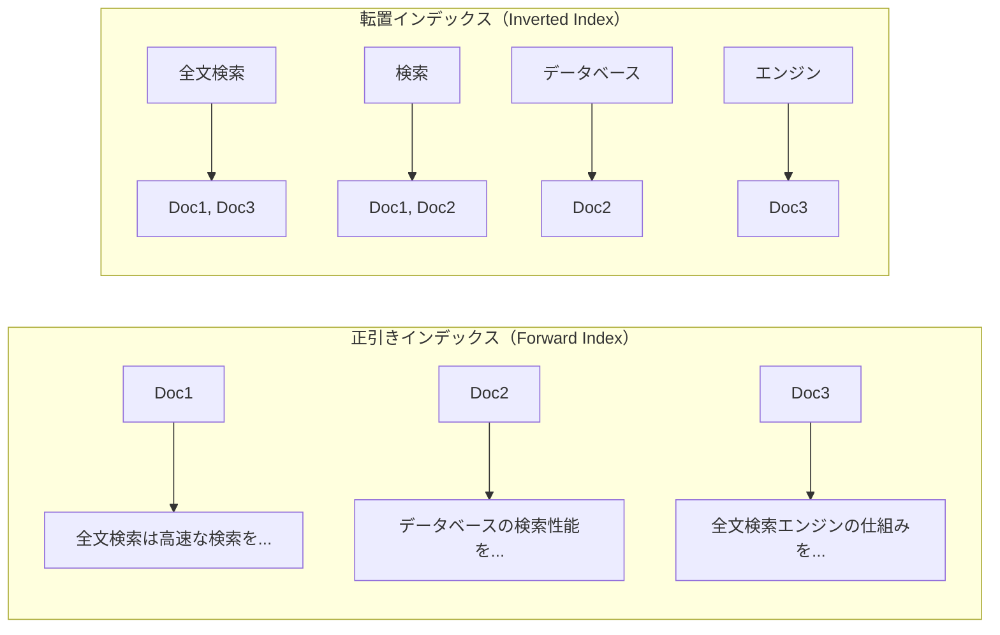

実際の転置インデックスでは、単なるドキュメントIDリストだけでなく、以下の追加情報も格納される。

- **出現頻度（Term Frequency）**: 各ドキュメント内でその単語が何回出現したか
- **出現位置（Position）**: ドキュメント内のどの位置に出現したか（フレーズ検索やハイライトに必要）
- **オフセット（Offset）**: 元テキスト内のバイト位置（スニペット生成に必要）

### 2.2 テキスト解析パイプライン（Analyzer）

転置インデックスを構築するには、元のテキストを意味のある単位に分割する必要がある。この処理を担うのが**アナライザ（Analyzer）**である。アナライザは複数のステージから構成されるパイプラインとして設計される。

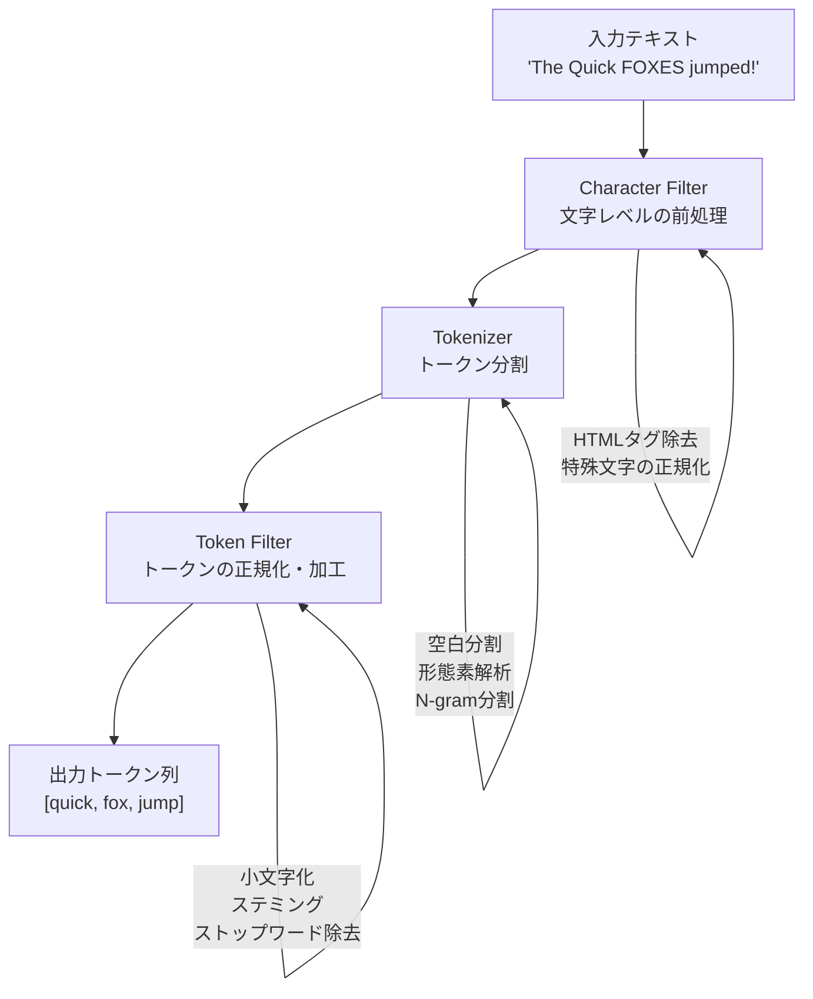

各ステージの役割を詳しく見ていこう。

#### Character Filter（文字フィルタ）

テキストがトークナイザに渡される前に、文字レベルの変換を行う。典型的な処理は以下のとおりである。

- **HTMLタグの除去**: `<p>検索</p>` → `検索`
- **文字の正規化**: 全角英数字を半角に変換、旧字体を新字体に統一
- **特殊文字のマッピング**: `&` → `and`、`©` → `(c)` など

#### Tokenizer（トークナイザ）

テキストを個々のトークン（≒ 単語）に分割する。言語によって最適なトークナイザは異なる。

| トークナイザ | 方式 | 適用言語 | 例 |
|---|---|---|---|
| Standard | Unicode Text Segmentationに基づく分割 | 英語など空白分割言語 | "full-text search" → ["full", "text", "search"] |
| 形態素解析 | 辞書ベースの言語解析 | 日本語、中国語、韓国語 | "東京都に住む" → ["東京都", "に", "住む"] |
| N-gram | 固定長の文字列に分割 | 言語非依存 | "検索" → ["検索"]（bigram） |

#### Token Filter（トークンフィルタ）

分割されたトークンを加工・変換する。複数のフィルタを連鎖的に適用できる。

- **Lowercase**: 大文字を小文字に変換（`The` → `the`）
- **Stemming**: 語幹の抽出（`running` → `run`）
- **Stop Words**: 検索に寄与しない頻出語の除去（`the`, `is`, `a` など）
- **Synonym**: 同義語の展開（`PC` → `PC`, `パソコン`, `コンピュータ`）

> [!IMPORTANT]
> アナライザはインデキシング時と検索時の両方で使用される。**インデキシング時のアナライザと検索時のアナライザは一致させる**のが原則である。異なるアナライザを使うと、インデキシング時に生成されたトークンと検索時のトークンが噛み合わず、ヒットすべきドキュメントが見つからないという問題が発生する。

### 2.3 スコアリング（Relevance Scoring）

全文検索エンジンは、一致したドキュメントに**関連性スコア**を付与してランキングする。最も広く使われているスコアリングアルゴリズムが**BM25**（Best Matching 25）である。

BM25は、もともと確率的情報検索モデルから導出されたTF-IDF（Term Frequency - Inverse Document Frequency）を改良したものであり、Elasticsearchでもバージョン5.0以降デフォルトのスコアリング関数として採用されている。

$$
\text{score}(D, Q) = \sum_{i=1}^{n} \text{IDF}(q_i) \cdot \frac{f(q_i, D) \cdot (k_1 + 1)}{f(q_i, D) + k_1 \cdot \left(1 - b + b \cdot \frac{|D|}{\text{avgdl}}\right)}
$$

各項の意味は以下のとおりである。

- $f(q_i, D)$: ドキュメント $D$ における検索語 $q_i$ の出現頻度（TF）
- $|D|$: ドキュメントの長さ
- $\text{avgdl}$: 全ドキュメントの平均長
- $k_1$: TFの飽和パラメータ（デフォルトは1.2）
- $b$: 文書長正規化パラメータ（デフォルトは0.75）
- $\text{IDF}(q_i)$: 逆文書頻度。その単語がどれだけ「珍しい」かを表す

BM25の直感的な理解は以下のとおりである。

1. **多くのドキュメントに出現する単語（例：「の」「は」）はスコアへの寄与が小さい**（IDF項）
2. **ドキュメント内で繰り返し出現する単語はスコアが高いが、頭打ちになる**（TF飽和）
3. **短いドキュメントで出現する方が、長いドキュメントで出現するよりスコアが高い**（文書長正規化）

## 3. Elasticsearch / OpenSearchのアーキテクチャ

### 3.1 概要と歴史

**Elasticsearch**は、Apache Luceneをベースとした分散型の全文検索・分析エンジンである。2010年にShay Banonによって最初のバージョンがリリースされ、その後Elastic社として商用展開が進められた。RESTful APIを通じてJSON形式でクエリを送受信でき、リアルタイムに近い検索を提供する。

**OpenSearch**は、2021年にAmazon Web Services（AWS）がElasticsearch 7.10.2をフォークして開始したプロジェクトである。Elasticsearchのライセンスが2021年にApache License 2.0からServer Side Public License（SSPL）に変更されたことを受け、AWSがApache License 2.0のもとでオープンソースとして継続開発する目的で誕生した。APIの互換性が高く、多くの機能はElasticsearchとほぼ同等である。

### 3.2 クラスタアーキテクチャ

Elasticsearch/OpenSearchは分散アーキテクチャを採用しており、複数のノードでクラスタを構成する。

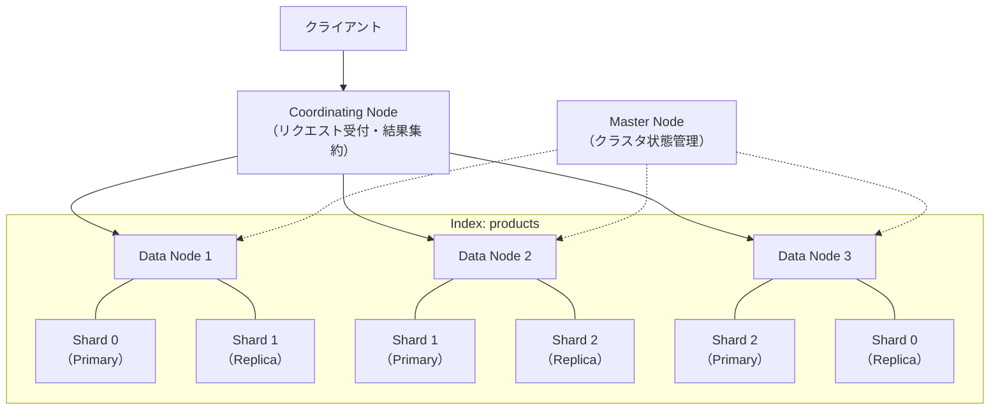

#### ノードの役割

| ノード種別 | 役割 |
|---|---|
| **Master Node** | クラスタのメタデータ管理、シャードの割り当て、ノードの参加・離脱の検知 |
| **Data Node** | データの格納、検索・インデキシングの実行 |
| **Coordinating Node** | クライアントからのリクエストを受け付け、各データノードに分散し、結果を集約して返す |
| **Ingest Node** | ドキュメントのインデキシング前にパイプラインで変換処理を行う |

#### シャードとレプリカ

Elasticsearchのインデックスは複数の**シャード**（Shard）に分割される。各シャードは独立したLuceneインデックスであり、それ自体が完全な検索エンジンとして機能する。

- **プライマリシャード**: データの書き込み先。インデックス作成時にシャード数を決定し、後から変更できない（reindex が必要）
- **レプリカシャード**: プライマリシャードの複製。検索リクエストの負荷分散と、ノード障害時のデータ保全を担う

### 3.3 インデキシングの内部動作

ドキュメントがインデキシングされる際の内部処理を詳しく見てみよう。

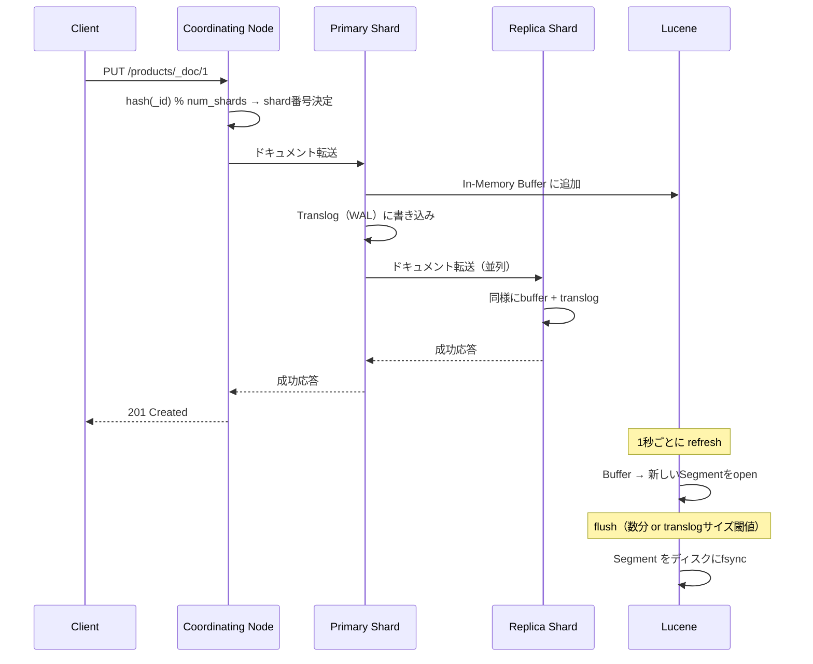

ここで重要な概念が**Near Real-Time（NRT）検索**である。Elasticsearchはドキュメントを受け付けた後、即座に検索可能にするのではなく、デフォルトで**1秒間隔のrefresh**によって新しいセグメントを生成し、検索可能にする。この1秒の遅延がNRT検索と呼ばれる所以である。

#### Luceneセグメントとマージ

各シャード内部のLuceneインデックスは、複数の**セグメント**から構成される。セグメントは不変（immutable）であり、一度書き込まれた後は変更されない。

- **ドキュメントの更新**: 古いドキュメントに「削除マーク」を付け、新しいバージョンを新セグメントに書き込む
- **ドキュメントの削除**: 削除マークを付けるだけで、物理的な削除はセグメントマージ時に行われる
- **セグメントマージ**: バックグラウンドプロセスが小さなセグメントを大きなセグメントに統合し、削除マーク付きドキュメントを物理削除する

### 3.4 検索の実行フロー

検索リクエストは**Query Phase**と**Fetch Phase**の2段階で処理される。

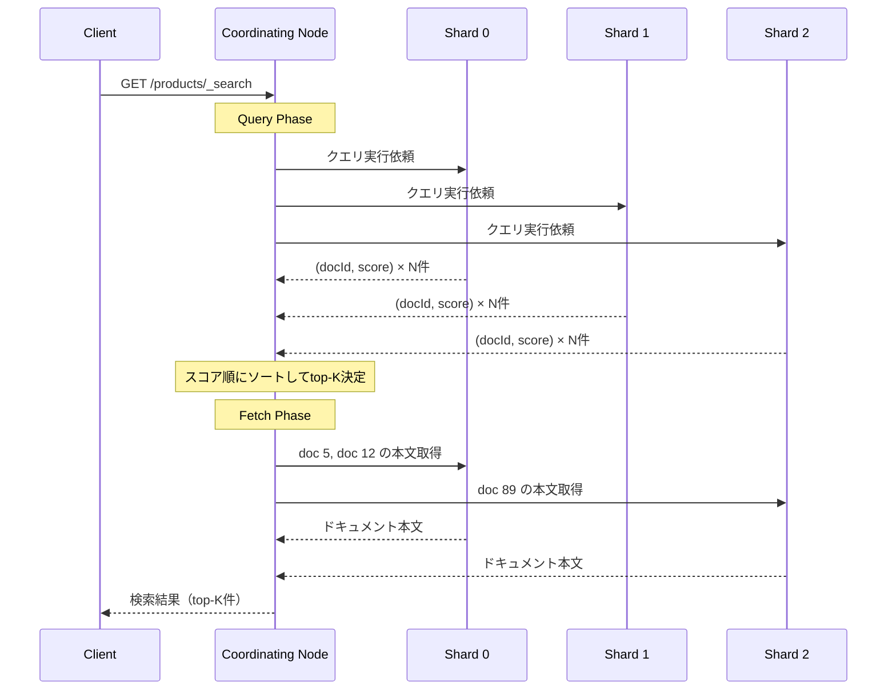

**Query Phase**では各シャードが独立にクエリを実行し、上位N件のドキュメントIDとスコアのみを返す。**Fetch Phase**ではCoordinating Nodeが全シャードの結果をマージしてグローバルなtop-Kを決定し、実際に必要なドキュメントの本文だけを取得する。この2段階構成により、ネットワーク転送量を最小化している。

### 3.5 マッピングとフィールド型

Elasticsearchでは、インデックスの**マッピング**によって各フィールドのデータ型と解析方法を定義する。

```json
{
  "mappings": {
    "properties": {
      "title": {
        "type": "text",
        "analyzer": "kuromoji_analyzer",
        "fields": {
          "keyword": {
            "type": "keyword"
          }
        }
      },
      "description": {
        "type": "text",
        "analyzer": "kuromoji_analyzer"
      },
      "price": {
        "type": "integer"
      },
      "category": {
        "type": "keyword"
      },
      "created_at": {
        "type": "date"
      }
    }
  }
}
```

| フィールド型 | 用途 | インデックス方式 |
|---|---|---|
| `text` | 全文検索対象のテキスト | アナライザで解析後、転置インデックスに格納 |
| `keyword` | 完全一致、集計、ソート用 | 解析せずそのまま格納 |
| `integer` / `long` | 数値フィルタ、範囲検索 | BKD Tree |
| `date` | 日時フィルタ、範囲検索 | BKD Tree |

`text` と `keyword` の使い分けは実務上極めて重要である。商品カテゴリのように「完全一致」で絞り込むフィールドには `keyword`、商品説明のように自然言語検索の対象となるフィールドには `text` を使う。上記の例のように `fields` を使って同じフィールドに両方の型を設定する**Multi-field**パターンもよく使われる。

## 4. PostgreSQLの全文検索機能

### 4.1 概要

PostgreSQLは、リレーショナルデータベースでありながら、組み込みの全文検索機能を備えている。専用の検索エンジンを導入せずに全文検索を実現できるため、小〜中規模のアプリケーションでは有力な選択肢となる。

PostgreSQLの全文検索は、以下の2つのデータ型を中心に構成される。

- **`tsvector`**: ドキュメントを正規化されたトークン（lexeme）の集合として表現する型
- **`tsquery`**: 検索条件を論理演算子付きのトークンとして表現する型

### 4.2 tsvectorとtsquery

#### tsvectorの構造

`tsvector` は、テキストを正規化した後のlexeme（語彙素）と、その出現位置を保持するデータ型である。

```sql
-- to_tsvector() converts text to tsvector
SELECT to_tsvector('english', 'The quick brown foxes jumped over the lazy dog');

-- Result:
-- 'brown':3 'dog':9 'fox':4 'jump':5 'lazi':8 'quick':2
```

この結果から、以下のことがわかる。

- ストップワード（`the`, `over`）が除去されている
- ステミング処理で `foxes` → `fox`、`jumped` → `jump`、`lazy` → `lazi` に変換されている
- 各lexemeの出現位置が保持されている

#### tsqueryの構造

`tsquery` は検索条件を表現する型で、論理演算子をサポートする。

```sql
-- AND search
SELECT to_tsquery('english', 'quick & fox');

-- OR search
SELECT to_tsquery('english', 'cat | dog');

-- NOT search
SELECT to_tsquery('english', '!cat');

-- Phrase search (adjacent words)
SELECT to_tsquery('english', 'quick <-> fox');

-- Proximity search (within N words)
SELECT to_tsquery('english', 'quick <2> fox');
```

#### マッチング演算子

`tsvector` と `tsquery` のマッチングには `@@` 演算子を使用する。

```sql
-- Basic full-text search query
SELECT title, body
FROM articles
WHERE to_tsvector('english', body) @@ to_tsquery('english', 'database & search');
```

### 4.3 GINインデックス

上記のクエリは動作するが、`to_tsvector()` が毎回呼び出されるためフルスキャンとなり、大量データでは実用的でない。これを解決するのが**GINインデックス**（Generalized Inverted Index）である。

```sql
-- Create a computed column for tsvector
ALTER TABLE articles ADD COLUMN search_vector tsvector
  GENERATED ALWAYS AS (
    setweight(to_tsvector('english', coalesce(title, '')), 'A') ||
    setweight(to_tsvector('english', coalesce(body, '')), 'B')
  ) STORED;

-- Create GIN index on the tsvector column
CREATE INDEX idx_articles_search ON articles USING GIN (search_vector);

-- Search using the indexed column
SELECT title, ts_rank(search_vector, query) AS rank
FROM articles, to_tsquery('english', 'database & search') query
WHERE search_vector @@ query
ORDER BY rank DESC;
```

GINインデックスは、内部的に転置インデックスと同じ構造を持つ。各lexemeから、そのlexemeを含む行のTID（タプルID）リストへのマッピングを格納する。

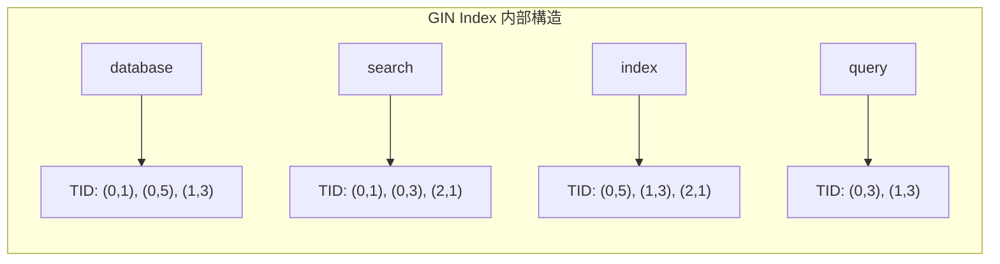

#### setweightによる重み付け

上記の例で使用した `setweight()` は、フィールドごとに異なる重みを設定するための関数である。PostgreSQLでは4段階の重み（A, B, C, D）をサポートしており、タイトルに出現するキーワードを本文よりも重要視するといった制御ができる。

```sql
-- ts_rank considers weights: A=1.0, B=0.4, C=0.2, D=0.1 (default)
SELECT title,
       ts_rank(search_vector, to_tsquery('english', 'database')) AS rank
FROM articles
ORDER BY rank DESC
LIMIT 10;
```

### 4.4 GINインデックスとGiSTインデックスの比較

PostgreSQLの全文検索では、GINの他に**GiSTインデックス**（Generalized Search Tree）も使用できる。

| 特性 | GIN | GiST |
|---|---|---|
| 検索速度 | 速い（正確な転置インデックス） | やや遅い（損失あり圧縮） |
| インデックス構築速度 | 遅い | 速い |
| インデックスサイズ | 大きい | 小さい |
| 更新コスト | 高い（pending listで緩和） | 低い |
| 偽陽性 | なし | あり（再チェック必要） |

GINは検索精度と検索速度に優れるが、更新が頻繁なテーブルではオーバーヘッドが大きい。GiSTは損失あり（lossy）な圧縮を使用するため、まれに偽陽性が発生し再チェックが必要になるが、更新コストは低い。一般的には**読み取り中心のワークロードではGIN、更新が多い場合はGiST**が推奨される。

### 4.5 PostgreSQL全文検索の制約

PostgreSQLの全文検索は十分に実用的だが、Elasticsearchと比較するといくつかの制約がある。

- **分散検索の欠如**: 単一ノードでの実行が前提であり、データ量がスケールすると性能限界がある
- **アナライザの柔軟性**: カスタムアナライザの構成がElasticsearchほど直感的でない
- **日本語対応**: 標準では日本語のトークナイズに対応しておらず、拡張が必要（後述）
- **ファセット検索**: ネイティブのファセット機能がなく、SQLの `GROUP BY` で代替する必要がある
- **ハイライト**: `ts_headline()` はあるがカスタマイズ性が限定的

## 5. 日本語検索の課題

### 5.1 日本語テキストの特殊性

英語をはじめとする欧米言語は、単語間がスペースで区切られているため、空白ベースのトークナイズが効果的に機能する。しかし日本語には単語間の明示的な区切りが存在しない。

```
英語: "I live in Tokyo" → ["I", "live", "in", "Tokyo"]  ← 空白で分割できる
日本語: "私は東京に住んでいます" → ???  ← どこで区切る？
```

この問題を解決するために、日本語の全文検索では主に2つのアプローチが用いられる。

### 5.2 形態素解析（Morphological Analysis）

形態素解析は、辞書と言語規則に基づいてテキストを最小の意味単位（形態素）に分割する手法である。日本語の形態素解析で最も広く使われているのが**MeCab**（和布蕪）と**kuromoji**である。

```
入力: "東京スカイツリーの高さは634メートルです"

MeCab出力:
東京スカイツリー  名詞,固有名詞,一般,*
の                助詞,連体化,*,*
高さ              名詞,一般,*,*
は                助詞,係助詞,*,*
634               名詞,数,*,*
メートル          名詞,接尾,助数詞,*
です              助動詞,*,*,*
```

形態素解析の利点と欠点は以下のとおりである。

| 観点 | 評価 |
|---|---|
| トークンの品質 | 高い。意味的に正しい単位で分割される |
| 検索精度 | 高い。不要なヒットが少ない |
| 辞書依存性 | 高い。辞書にない単語（新語、固有名詞）は正しく分割されない |
| 辞書メンテナンス | 新語の追加やユーザー辞書の管理が必要 |

#### Elasticsearchでのkuromoji設定

Elasticsearchでは `analysis-kuromoji` プラグインを使って日本語形態素解析を導入できる。

```json
{
  "settings": {
    "analysis": {
      "tokenizer": {
        "kuromoji_tokenizer": {
          "type": "kuromoji_tokenizer",
          "mode": "search"
        }
      },
      "analyzer": {
        "kuromoji_analyzer": {
          "type": "custom",
          "tokenizer": "kuromoji_tokenizer",
          "filter": [
            "kuromoji_baseform",
            "kuromoji_part_of_speech",
            "cjk_width",
            "ja_stop",
            "kuromoji_stemmer",
            "lowercase"
          ]
        }
      }
    }
  }
}
```

kuromojiのトークナイズモードには3種類がある。

| モード | 動作 | 用途 |
|---|---|---|
| `normal` | 辞書どおりに分割 | 厳密な分割が必要な場合 |
| `search` | 複合語を分割しつつ元の複合語も保持 | **検索用途に推奨** |
| `extended` | 未知語を1文字ずつ分割 | 再現率を重視する場合 |

`search` モードでは、例えば「関西国際空港」が以下のようにトークナイズされる。

```
search mode: ["関西", "国際", "空港", "関西国際空港"]
normal mode: ["関西国際空港"]
```

`search` モードでは「関西」や「空港」での部分的な検索でもヒットするため、ユーザビリティが向上する。

#### PostgreSQLでの日本語対応

PostgreSQLで日本語全文検索を行うには、**pg_bigm**（バイグラム）または**PGroonga**（Groongaベースの拡張）が主要な選択肢となる。

```sql
-- pg_bigm: bigram-based full-text search
CREATE INDEX idx_articles_bigm ON articles
  USING GIN (body gin_bigm_ops);

SELECT * FROM articles
WHERE body LIKE '%全文検索%';

-- PGroonga: Groonga-based full-text search with morphological analysis
CREATE INDEX idx_articles_pgroonga ON articles
  USING pgroonga (body);

SELECT * FROM articles
WHERE body &@~ '全文検索';
```

### 5.3 N-gram

N-gramは、テキストをN文字ずつずらしながら固定長の文字列に分割する手法である。辞書を必要としないため、言語に依存しないという大きな利点がある。

```
入力: "全文検索エンジン"

Unigram (N=1): ["全", "文", "検", "索", "エ", "ン", "ジ", "ン"]
Bigram  (N=2): ["全文", "文検", "検索", "索エ", "エン", "ンジ", "ジン"]
Trigram (N=3): ["全文検", "文検索", "検索エ", "索エン", "エンジ", "ンジン"]
```

| 観点 | 評価 |
|---|---|
| 辞書依存性 | なし。未知語でも確実にマッチする |
| 再現率（Recall） | 非常に高い。部分文字列での検索が可能 |
| 適合率（Precision） | 低い。意図しないマッチが増える（ノイズ） |
| インデックスサイズ | 大きい。トークン数が形態素解析より多い |
| 検索速度 | やや遅い。候補が多いためポスティングリストが長い |

N-gramの最大の弱点はノイズの多さである。例えば「京都」で検索すると「東京都」もヒットしてしまう（「京都」というbigramが「東**京都**」に含まれるため）。

### 5.4 ハイブリッドアプローチ

実務では、形態素解析とN-gramを組み合わせた**ハイブリッドアプローチ**が広く採用されている。

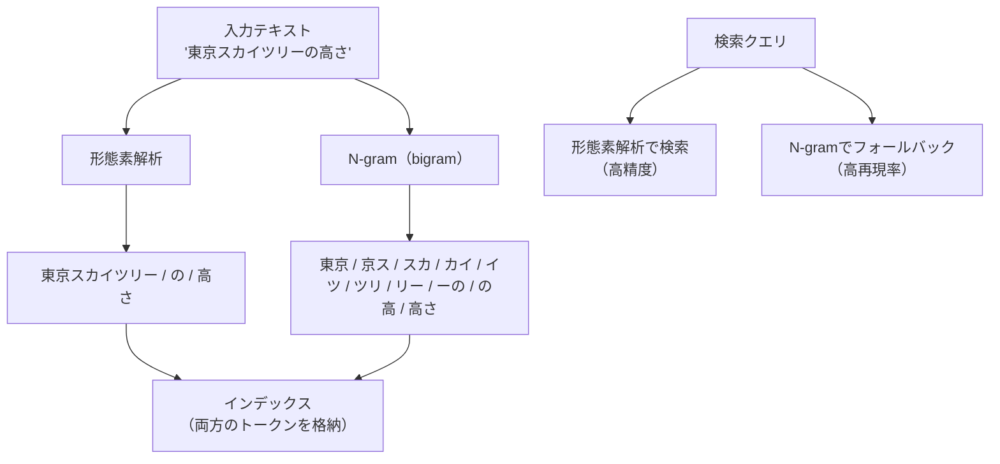

Elasticsearchでは、同一フィールドに対して形態素解析とN-gramの両方のアナライザを設定し、`multi_match` クエリで両方のスコアを統合する方法がよく使われる。

```json
{
  "mappings": {
    "properties": {
      "title": {
        "type": "text",
        "analyzer": "kuromoji_analyzer",
        "fields": {
          "ngram": {
            "type": "text",
            "analyzer": "ngram_analyzer"
          }
        }
      }
    }
  }
}
```

```json
{
  "query": {
    "multi_match": {
      "query": "スカイツリー",
      "fields": ["title^2", "title.ngram"],
      "type": "most_fields"
    }
  }
}
```

この設定では、形態素解析フィールドのスコアにブースト（`^2`）をかけることで精度を重視しつつ、N-gramフィールドで辞書にない単語もカバーする。

## 6. 検索精度の向上

### 6.1 同義語（Synonym）

ユーザーは同じ概念を異なる言葉で検索する。「パソコン」「PC」「パーソナルコンピュータ」「personal computer」はすべて同じものを指している。同義語辞書を用いることで、これらを統一的に扱える。

Elasticsearchでは `synonym` トークンフィルタで同義語を設定する。

```json
{
  "settings": {
    "analysis": {
      "filter": {
        "my_synonym_filter": {
          "type": "synonym",
          "synonyms": [
            "パソコン, PC, パーソナルコンピュータ",
            "スマホ, スマートフォン, smartphone",
            "DB, データベース, database"
          ]
        }
      },
      "analyzer": {
        "synonym_analyzer": {
          "tokenizer": "kuromoji_tokenizer",
          "filter": [
            "kuromoji_baseform",
            "lowercase",
            "my_synonym_filter"
          ]
        }
      }
    }
  }
}
```

> [!WARNING]
> 同義語フィルタをインデキシング時に適用するか検索時に適用するかは、トレードオフがある。**インデキシング時**に適用すると検索速度は速いが、同義語辞書を変更するたびに全データの再インデキシングが必要になる。**検索時**に適用すると辞書変更が即座に反映されるが、検索時のクエリ展開コストが増える。頻繁に同義語辞書を更新する場合は、検索時の適用が推奨される。

### 6.2 ステミングと語幹処理

ステミング（Stemming）は、単語の活用形や派生形を語幹に変換する処理である。英語では `running`, `runs`, `ran` → `run` のような変換を行う。

日本語では、kuromojiの `kuromoji_baseform` フィルタが活用形を基本形（辞書形）に変換する役割を果たす。

```
走った → 走る
食べている → 食べる
美しい → 美しい（形容詞の終止形）
```

### 6.3 ファジーマッチ（Fuzzy Matching）

ユーザーのタイプミスや表記揺れに対応するために、**ファジーマッチ**が使われる。編集距離（Levenshtein距離）に基づいて、指定した距離以内の単語をマッチさせる。

```json
{
  "query": {
    "match": {
      "title": {
        "query": "elasticserch",
        "fuzziness": "AUTO"
      }
    }
  }
}
```

`fuzziness: "AUTO"` は、単語の長さに応じて許容する編集距離を自動調整する。

| 単語の長さ | 許容編集距離 |
|---|---|
| 1〜2文字 | 0（完全一致のみ） |
| 3〜5文字 | 1 |
| 6文字以上 | 2 |

日本語ではファジーマッチの効果は限定的である。欧米語のタイプミス（1文字の入れ替わりなど）と異なり、日本語の表記揺れは「サーバー」と「サーバ」のような長音記号の有無や、「引っ越し」と「引越」のような送り仮名の違いなど、ファジーマッチでは対処しにくいパターンが多い。日本語の表記揺れには、同義語辞書やCharacter Filterによる正規化の方が効果的である。

### 6.4 検索クエリの組み立て

実務では、単一の `match` クエリだけでは不十分なことが多い。Elasticsearchの `bool` クエリを使って、複数の条件を組み合わせるのが一般的である。

```json
{
  "query": {
    "bool": {
      "must": [
        {
          "multi_match": {
            "query": "ワイヤレスイヤホン",
            "fields": ["title^3", "description", "title.ngram"],
            "type": "most_fields"
          }
        }
      ],
      "filter": [
        { "term": { "category": "electronics" } },
        { "range": { "price": { "gte": 1000, "lte": 30000 } } },
        { "term": { "in_stock": true } }
      ],
      "should": [
        { "term": { "brand": { "value": "sony", "boost": 1.5 } } },
        { "range": { "rating": { "gte": 4.0, "boost": 1.2 } } }
      ]
    }
  }
}
```

| 節 | 役割 | スコアへの影響 |
|---|---|---|
| `must` | 必須条件。すべて満たす必要がある | あり |
| `filter` | フィルタ条件。スコア計算に影響しない | なし（高速） |
| `should` | オプション条件。満たすとスコアにボーナス | あり（加算） |
| `must_not` | 除外条件。マッチしたドキュメントを除外 | なし |

`filter` 節はスコア計算をスキップし、結果がキャッシュされるため、カテゴリや価格帯のような構造化データの絞り込みに最適である。

## 7. ハイライトとスニペット

### 7.1 ハイライトの仕組み

検索結果において、ユーザーのクエリにマッチした箇所を強調表示（ハイライト）することは、検索体験の向上に不可欠である。ユーザーは「なぜこの結果が返されたのか」を瞬時に理解できる。

Elasticsearchでは、検索クエリに `highlight` パラメータを追加するだけでハイライトを有効にできる。

```json
{
  "query": {
    "match": {
      "body": "全文検索エンジン"
    }
  },
  "highlight": {
    "pre_tags": ["<mark>"],
    "post_tags": ["</mark>"],
    "fields": {
      "body": {
        "fragment_size": 150,
        "number_of_fragments": 3
      }
    }
  }
}
```

レスポンスの `highlight` フィールドには、マッチ箇所が強調タグで囲まれたテキスト断片が返される。

```json
{
  "highlight": {
    "body": [
      "...大規模なデータに対して<mark>全文検索</mark>を実行する<mark>エンジン</mark>として...",
      "...<mark>全文検索エンジン</mark>の内部では転置インデックスが使用されており..."
    ]
  }
}
```

### 7.2 ハイライターの種類

Elasticsearchには3種類のハイライターがある。

| ハイライター | 特徴 | 用途 |
|---|---|---|
| `unified`（デフォルト） | BM25ベースでスコアリングし、最も関連性の高い断片を選択 | 汎用。ほとんどの場合これで十分 |
| `plain` | 標準のLuceneハイライター。小さなフィールド向け | 短いテキストフィールド |
| `fvh`（Fast Vector Highlighter） | `term_vector` を使った高速ハイライト。大きなフィールド向け | 大量のテキストを持つフィールド |

### 7.3 PostgreSQLのts_headline

PostgreSQLでは `ts_headline()` 関数でハイライトを生成できる。

```sql
SELECT title,
       ts_headline('english', body,
                   to_tsquery('english', 'database & search'),
                   'StartSel=<mark>, StopSel=</mark>, MaxWords=50, MinWords=20'
       ) AS snippet
FROM articles
WHERE search_vector @@ to_tsquery('english', 'database & search')
ORDER BY ts_rank(search_vector, to_tsquery('english', 'database & search')) DESC
LIMIT 10;
```

> [!TIP]
> `ts_headline()` は内部的にドキュメント全体を再解析するため、大量の結果に対して適用すると性能が低下する可能性がある。まず `WHERE` と `ORDER BY ... LIMIT` で結果を絞り込んでから `ts_headline()` を適用するのがベストプラクティスである。

## 8. ファセット検索とアグリゲーション

### 8.1 ファセット検索とは

ファセット検索（Faceted Search）は、検索結果を複数のカテゴリ（ファセット）で分類し、ユーザーが動的に絞り込みを行えるUIパターンである。ECサイトで「カテゴリ」「ブランド」「価格帯」「レビュー評価」などでフィルタリングできるのがその典型である。

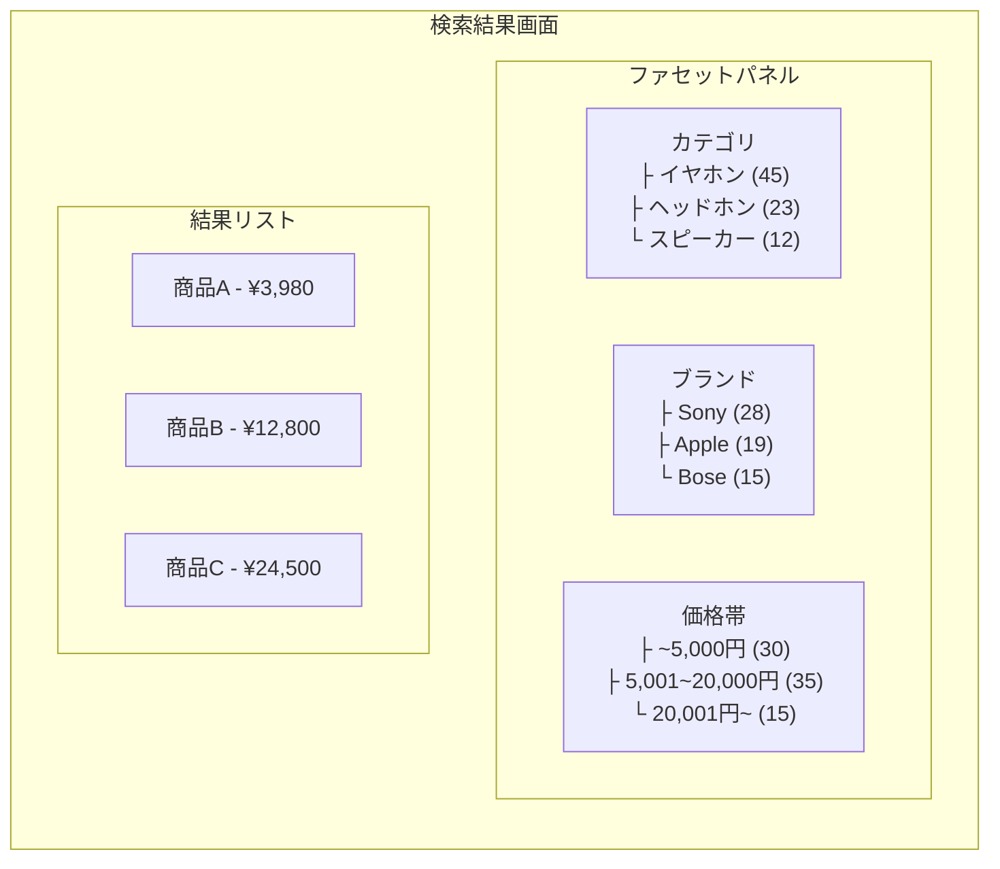

### 8.2 Elasticsearchのアグリゲーション

Elasticsearchでは**Aggregation**機能によってファセット検索を実現する。検索クエリと同時にアグリゲーションを実行し、1回のリクエストで検索結果とファセットカウントの両方を取得できる。

```json
{
  "query": {
    "match": {
      "title": "ワイヤレスイヤホン"
    }
  },
  "aggs": {
    "category_facet": {
      "terms": {
        "field": "category",
        "size": 10
      }
    },
    "brand_facet": {
      "terms": {
        "field": "brand",
        "size": 10
      }
    },
    "price_ranges": {
      "range": {
        "field": "price",
        "ranges": [
          { "to": 5000 },
          { "from": 5000, "to": 20000 },
          { "from": 20000 }
        ]
      }
    },
    "avg_rating": {
      "avg": {
        "field": "rating"
      }
    }
  }
}
```

アグリゲーションの主要なタイプは以下のとおりである。

| タイプ | 用途 | 例 |
|---|---|---|
| `terms` | カテゴリごとの件数集計 | カテゴリ別、ブランド別 |
| `range` | 数値範囲ごとの集計 | 価格帯 |
| `date_histogram` | 日時の区間ごとの集計 | 月別、日別の推移 |
| `histogram` | 数値の等間隔区間ごとの集計 | 評価スコア分布 |
| `nested` | ネストされたアグリゲーション | カテゴリ内のブランド別集計 |
| `filter` | 特定条件に絞ったアグリゲーション | 在庫あり商品のみの集計 |

#### post_filterによるファセット分離

ファセット検索では、**あるファセットで絞り込んでも他のファセットのカウントが変わらない**ようにしたい場合がある。例えば「Sony」で絞り込んでも、カテゴリファセットには全体のカウントを表示し続けるケースである。

これを実現するのが `post_filter` である。

```json
{
  "query": {
    "match": { "title": "ワイヤレスイヤホン" }
  },
  "aggs": {
    "category_facet": {
      "terms": { "field": "category", "size": 10 }
    }
  },
  "post_filter": {
    "term": { "brand": "sony" }
  }
}
```

`post_filter` は**アグリゲーションの実行後**に結果を絞り込むため、アグリゲーションの結果（カテゴリ別カウント）にはフィルタが影響しない。

### 8.3 PostgreSQLでのファセット相当の実装

PostgreSQLには専用のファセット機能はないが、`GROUP BY` と `COUNT` を使って同等の集計を行える。

```sql
-- Main search results
WITH search_results AS (
    SELECT id, title, category, brand, price
    FROM products
    WHERE search_vector @@ to_tsquery('japanese', 'ワイヤレス & イヤホン')
)
-- Category facet
SELECT 'category' AS facet, category AS value, COUNT(*) AS count
FROM search_results
GROUP BY category
UNION ALL
-- Brand facet
SELECT 'brand' AS facet, brand AS value, COUNT(*) AS count
FROM search_results
GROUP BY brand
ORDER BY facet, count DESC;
```

ただし、このアプローチはElasticsearchのアグリゲーションと比較して、クエリの複雑化と性能面でのオーバーヘッドが課題となる。

## 9. インデキシング戦略

### 9.1 リアルタイムインデキシング vs バッチインデキシング

データソース（RDBMS等）から検索エンジンにデータを投入する方法は、大きく分けて2つのアプローチがある。

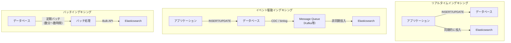

#### リアルタイムインデキシング（同期方式）

アプリケーションがデータベースに書き込むと同時に、Elasticsearchにもドキュメントを投入する。

**利点**: データの反映が最速。ユーザーが投稿した直後に検索可能になる。

**欠点**: Elasticsearchが一時的に利用不能な場合、書き込みが失敗する。アプリケーションロジックが複雑化する。データベースとElasticsearchの間で不整合が発生するリスクがある。

#### イベント駆動インデキシング

データベースの変更をChange Data Capture（CDC）やメッセージキュー経由で検索エンジンに伝播する方式。

**利点**: データベースと検索エンジンの疎結合。メッセージキューが変更イベントをバッファリングするため、一時的な障害に強い。反映までの遅延は通常数秒程度。

**欠点**: メッセージキュー（Kafka等）の運用が必要。イベントの順序保証やべき等性の考慮が必要。

#### バッチインデキシング

一定間隔でデータベースから変更分を抽出し、Bulk APIで一括投入する方式。

**利点**: 実装がシンプル。Bulk APIの利用により高スループット。検索エンジンへのリクエスト数を最小化できる。

**欠点**: 反映までの遅延が大きい（数分〜数時間）。変更の検出ロジック（updated_atカラム等）が必要。

### 9.2 Bulk APIの活用

Elasticsearchに大量のドキュメントを投入する場合、1件ずつインデキシングするのではなく**Bulk API**を使うことで大幅な性能改善が得られる。

```json
POST /_bulk
{"index": {"_index": "products", "_id": "1"}}
{"title": "ワイヤレスイヤホン X", "price": 5980, "category": "electronics"}
{"index": {"_index": "products", "_id": "2"}}
{"title": "Bluetoothスピーカー Y", "price": 3480, "category": "electronics"}
{"index": {"_index": "products", "_id": "3"}}
{"title": "USBマイク Z", "price": 12800, "category": "electronics"}
```

Bulk APIの最適なバッチサイズは環境によって異なるが、一般的には**5〜15MB程度のリクエストサイズ**が推奨される。ドキュメントの件数で言えば、500〜5,000件程度をひとつのBulkリクエストにまとめることが多い。

### 9.3 インデックスの再構築（Reindex）

マッピングの変更やアナライザの変更は、既存のインデックスに対して行えない場合が多い。その際は**Reindex API**を使って新しいインデックスにデータを移行する。

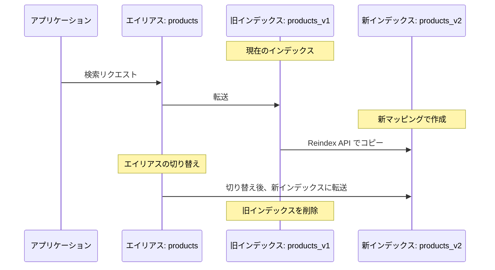

**エイリアス**（Alias）を使うことで、アプリケーションからはインデックス名の変更を意識せずに、無停止でインデックスを切り替えられる。

```json
POST /_aliases
{
  "actions": [
    { "remove": { "index": "products_v1", "alias": "products" } },
    { "add": { "index": "products_v2", "alias": "products" } }
  ]
}
```

### 9.4 インデキシング性能の最適化

大量データの初期ロード時には、以下の設定変更が性能改善に効果的である。

| 設定 | 通常時 | 初期ロード時 | 効果 |
|---|---|---|---|
| `refresh_interval` | `1s` | `-1`（無効） | refresh処理のオーバーヘッドを排除 |
| `number_of_replicas` | `1` | `0` | レプリカへの複製を省略 |
| `translog.durability` | `request` | `async` | fsyncの頻度を下げる |

初期ロード完了後は、必ず元の設定に戻してから `_refresh` と `_forcemerge` を実行する。

```json
PUT /products/_settings
{
  "index": {
    "refresh_interval": "1s",
    "number_of_replicas": 1,
    "translog.durability": "request"
  }
}

POST /products/_refresh
POST /products/_forcemerge?max_num_segments=5
```

## 10. 実務での技術選定ガイドライン

### 10.1 判断の軸

全文検索の実装にあたって、以下の観点から技術選定を行う必要がある。

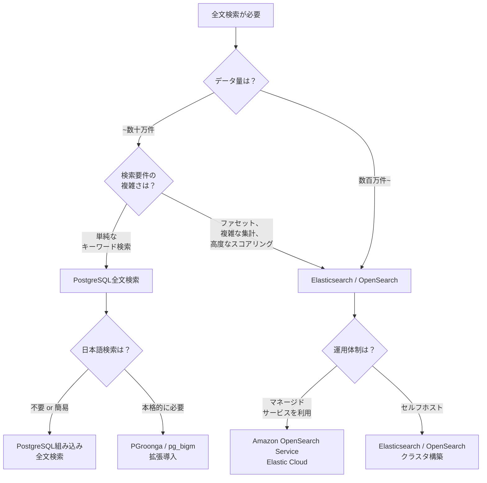

### 10.2 PostgreSQL全文検索を選ぶべきケース

PostgreSQLの全文検索は、以下の条件に合致する場合に有力な選択肢となる。

- **データ量が数十万件以下**で、将来的にも爆発的な増加が見込まれない
- **すでにPostgreSQLを使用**しており、追加のインフラを増やしたくない
- 検索要件が比較的シンプル（キーワード検索 + フィルタ程度）
- **運用コストを最小化**したい（専用の検索エンジンクラスタの運用が不要）
- トランザクション内で検索とデータ更新を一貫して行いたい

PostgreSQL全文検索の最大の利点は、**データの一貫性が保証される**ことである。データベースと検索インデックスが同じトランザクションで更新されるため、Elasticsearchを使う場合に避けられない「データベースとの同期」という課題が存在しない。

### 10.3 Elasticsearch/OpenSearchを選ぶべきケース

以下のいずれかに該当する場合は、Elasticsearch/OpenSearchの導入を検討すべきである。

- **データ量が数百万件以上**で、今後もスケールが見込まれる
- **ファセット検索、高度なアグリゲーション、サジェスト**など、リッチな検索機能が必要
- **複数のデータソース**（RDBMS、ログ、外部API等）を横断した検索が必要
- **検索性能のSLA**が厳しい（数十ミリ秒以内のレスポンスが求められる）
- ログ分析、可観測性（Observability）など、検索以外の用途も見込まれる

### 10.4 比較表

| 観点 | PostgreSQL全文検索 | Elasticsearch / OpenSearch |
|---|---|---|
| 導入コスト | 低い（既存DBに追加） | 高い（クラスタ構築・運用が必要） |
| 運用コスト | 低い | 中〜高い |
| データ一貫性 | トランザクションで保証 | 非同期同期のため遅延・不整合リスクあり |
| 検索性能 | 中程度（GINインデックス） | 高い（分散検索、キャッシュ） |
| スケーラビリティ | 単一ノード制約 | 水平スケール可能 |
| 日本語対応 | 拡張が必要 | kuromojiプラグインで容易 |
| ファセット検索 | SQL集計で代替（制約あり） | ネイティブサポート |
| ハイライト | `ts_headline()`（制約あり） | 多彩なハイライターを提供 |
| アグリゲーション | SQLで実装 | ネイティブで豊富 |
| クエリDSL | SQL（tsquery） | JSON DSL（柔軟で強力） |
| エコシステム | PGroonga, pg_bigm | Kibana, Logstash, Beats |

### 10.5 段階的な導入戦略

プロジェクトの初期段階でElasticsearchを導入するのは、運用コストの観点でオーバースペックになることが多い。以下のような段階的な移行戦略が現実的である。

**Phase 1: PostgreSQL `LIKE` / `ILIKE`**

ごく小規模なデータに対して、最もシンプルな方法で検索を提供する。データ量が増えて性能が問題になるまではこれで十分な場合も多い。

**Phase 2: PostgreSQL全文検索**

`LIKE` の性能が問題になったら、`tsvector` + GINインデックスに移行する。アプリケーションの変更は検索クエリ部分のみであり、インフラの追加は不要である。

**Phase 3: Elasticsearch/OpenSearch**

PostgreSQLの全文検索では対応しきれない要件（高度なファセット、大規模データ、複雑なスコアリング）が出てきたら、Elasticsearchへの移行を検討する。このとき、アプリケーションの検索レイヤーを抽象化しておくことで、移行コストを最小化できる。

```python
# Abstraction layer for search backends
class SearchService:
    def __init__(self, backend: SearchBackend):
        self._backend = backend

    def search(self, query: str, filters: dict, page: int = 1) -> SearchResult:
        return self._backend.execute(query, filters, page)

class PostgresSearchBackend(SearchBackend):
    def execute(self, query: str, filters: dict, page: int) -> SearchResult:
        # PostgreSQL full-text search implementation
        ...

class ElasticsearchBackend(SearchBackend):
    def execute(self, query: str, filters: dict, page: int) -> SearchResult:
        # Elasticsearch implementation
        ...
```

### 10.6 運用上の注意点

#### Elasticsearch/OpenSearchの運用

- **クラスタの監視**: シャードの状態、JVMヒープ使用率、インデキシング速度、検索レイテンシーを継続的に監視する
- **シャード数の設計**: シャードが多すぎるとオーバーヘッドが増大する。1シャードあたり10〜50GBが目安。シャード数はインデックス作成後に変更できないため、慎重に設計する
- **マッピングの事前定義**: Dynamic Mappingに依存せず、本番環境ではマッピングを明示的に定義する
- **スナップショットによるバックアップ**: 定期的にスナップショットを取得し、障害時の復旧手段を確保する
- **バージョンアップ**: ローリングアップグレードを利用して無停止でバージョンアップする

#### PostgreSQL全文検索の運用

- **GINインデックスの肥大化**: 大量のUPDATE/DELETEを行うとインデックスが肥大化するため、定期的な `REINDEX` が必要
- **`maintenance_work_mem`の調整**: GINインデックスの構築時にはメモリが多く必要になるため、適切に設定する
- **`gin_pending_list_limit`の調整**: GINのFast Updateが有効な場合、pending listのサイズ上限を調整する

## 11. まとめ

全文検索の実装は、単にテキストを検索するだけでなく、テキスト解析、スコアリング、インデキシング、スケーラビリティ、運用といった多岐にわたる技術的判断を伴う。本記事で解説した内容を整理すると、以下のようになる。

1. **転置インデックス**が全文検索の根幹であり、アナライザによるテキスト解析パイプラインがその品質を決定する
2. **Elasticsearch/OpenSearch**は、分散アーキテクチャ、豊富なクエリDSL、アグリゲーション機能により、大規模で高度な検索要件に対応する
3. **PostgreSQL全文検索**は、追加インフラなしでトランザクション内で一貫した検索を実現でき、中小規模のプロジェクトでは合理的な選択肢となる
4. **日本語検索**では形態素解析とN-gramの特性を理解し、ハイブリッドアプローチを検討すべきである
5. **検索精度の向上**には、同義語辞書、ステミング、ファジーマッチ、適切なクエリ構築が有効である
6. **インデキシング戦略**は、データの鮮度要件と運用の複雑さのバランスで選択する
7. **技術選定**は段階的に行い、要件の成長に合わせてシステムを進化させるのが現実的である

全文検索は「正解」がひとつではない領域である。ユーザーの検索体験を最良にするために、データの特性、検索パターン、運用体制を踏まえた継続的な改善が不可欠である。
