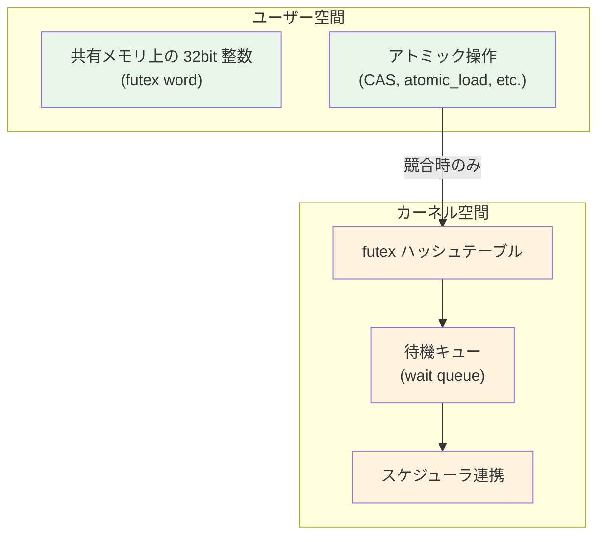
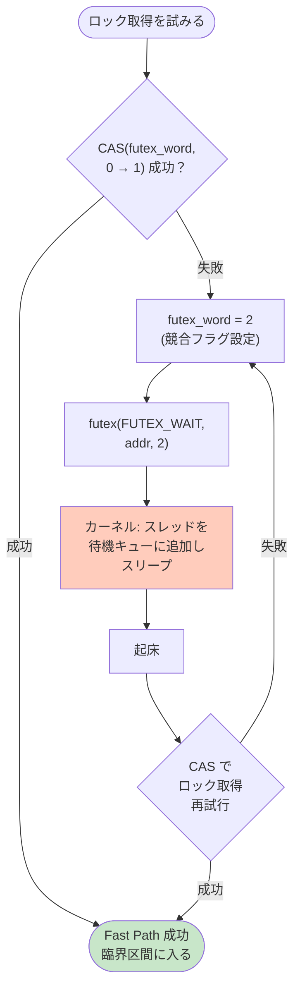
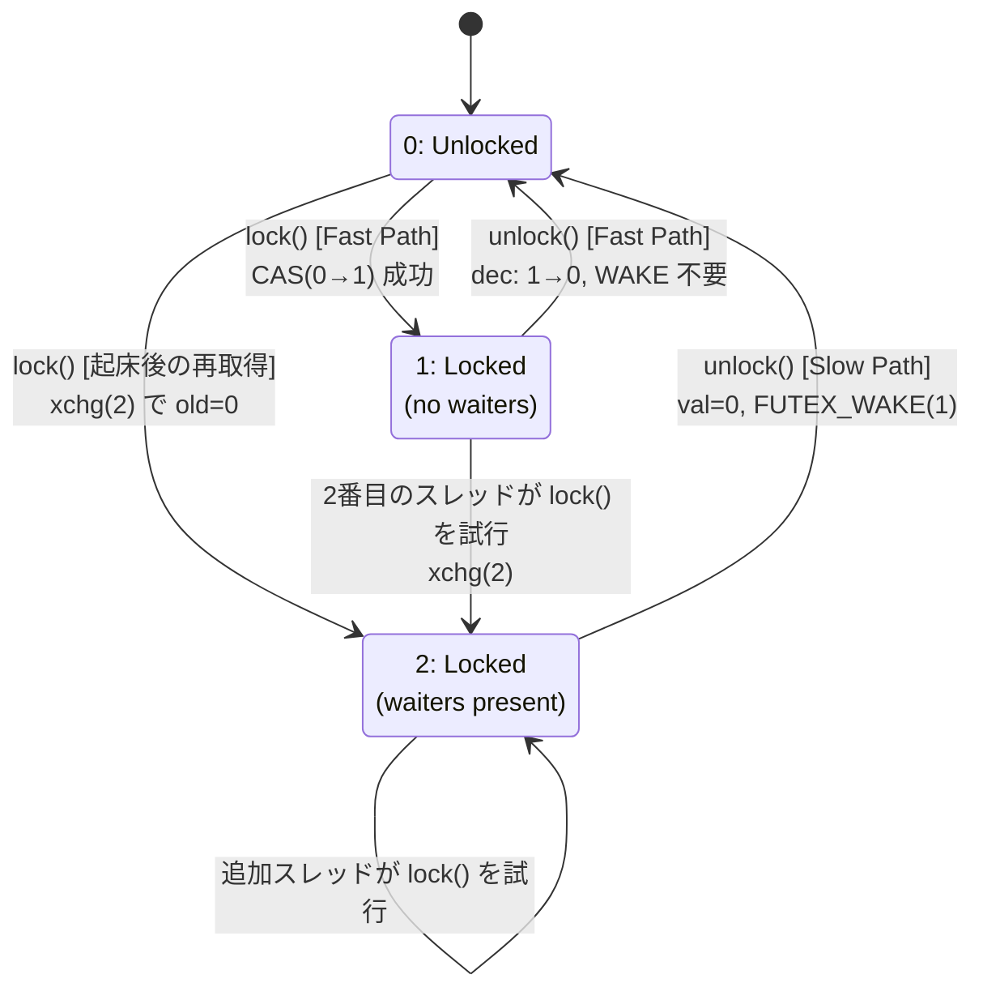
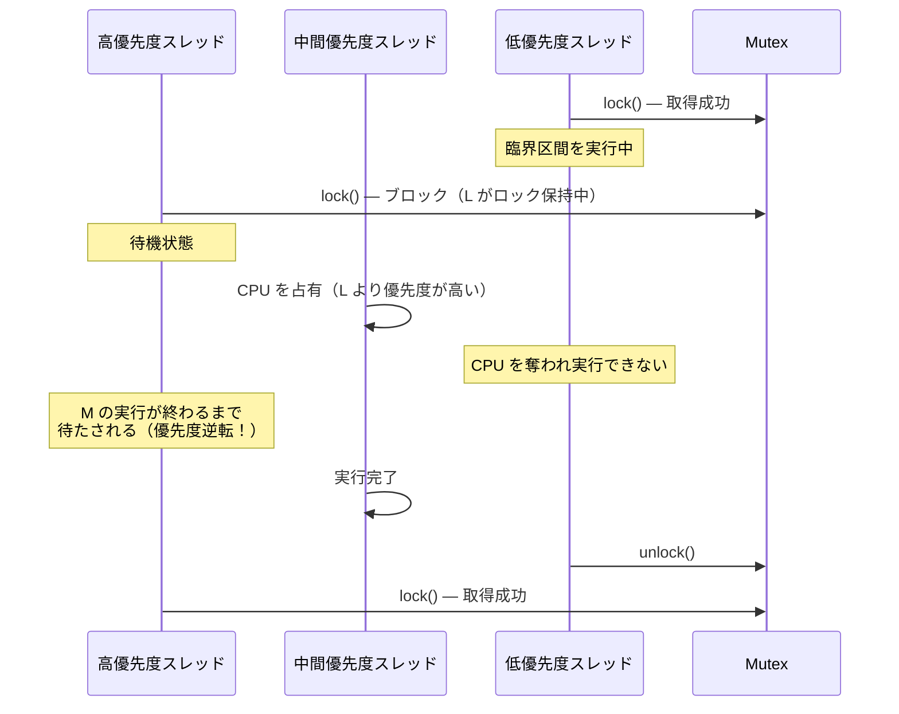
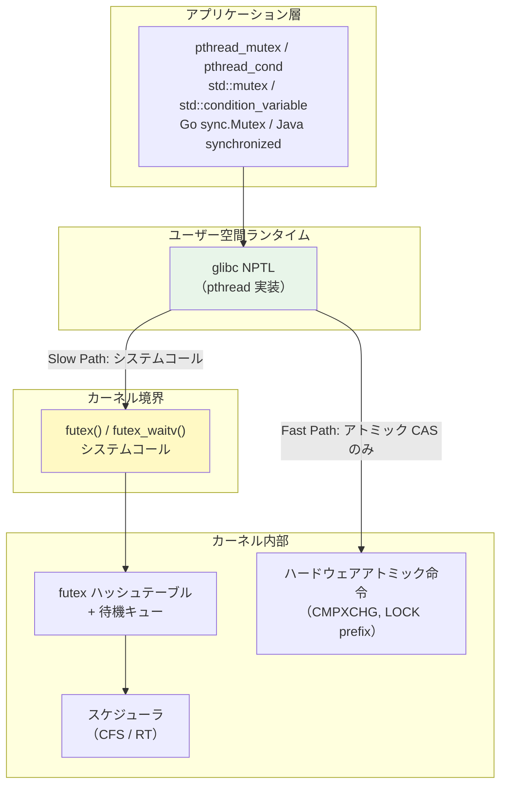

# Futex — ユーザー空間の高速同期

## 1. 背景と動機 — 従来の同期メカニズムの問題

マルチスレッドプログラミングにおける同期は、オペレーティングシステムの根幹を成す機能のひとつである。しかし、Linux における初期の同期メカニズムには深刻なパフォーマンス上の問題が存在していた。

### 1.1 System V セマフォの問題点

Linux がマルチスレッドプログラミングをサポートし始めた当初、プロセス間同期の主要な手段は **System V セマフォ**（`semget`/`semop`/`semctl`）であった。System V セマフォは 1983 年の System V IPC として導入され、長い歴史を持つが、以下の問題を抱えていた。

1. **毎回のシステムコールオーバーヘッド**: セマフォの操作（P操作/V操作）は、競合の有無にかかわらず必ずカーネル空間への遷移を伴う。ユーザーモードからカーネルモードへのコンテキストスイッチは、x86-64 環境で数百ナノ秒のコストがかかる
2. **カーネル内のグローバルロック**: System V セマフォはカーネル内部でグローバルなロックを取得するため、多数のスレッドが異なるセマフォを操作する場合でもシリアライズされる
3. **重量なデータ構造**: セマフォ集合（semaphore set）という単位で管理され、個々のセマフォごとに `struct sem` がカーネルメモリ上に確保される。少数の整数値を保護するだけの用途には過剰である
4. **リソースリーク**: プロセスが終了してもセマフォは自動的に削除されない。`SEM_UNDO` フラグで部分的に対処可能だが、すべてのケースをカバーできるわけではない

### 1.2 POSIX セマフォとスレッド同期の課題

POSIX セマフォ（`sem_init`/`sem_wait`/`sem_post`）は System V セマフォよりも軽量であったが、根本的な問題は同じであった。競合が発生していない（contention-free）場合であっても、カーネルへの遷移コストを払わなければならない。

実際のマルチスレッドアプリケーションにおいて、ロックの競合が発生する確率は驚くほど低い。データベースエンジンのベンチマークでは、ロック取得試行のうち競合が発生するのは全体の 1〜5% 程度であるという報告がある。つまり、**95% 以上のケースでは不要なシステムコールのオーバーヘッドを払っている**ことになる。

### 1.3 Futex の誕生

この問題を解決するために、2002 年に Hubertus Franke、Matthew Kirkwood、Ingo Molnar、Rusty Russell らによって **Futex（Fast Userspace muTEX）** が考案された。Futex の基本的な着想はシンプルである。

> 競合が発生していない場合はユーザー空間のアトミック操作だけで完結させ、競合が発生した場合にのみカーネルの支援を受ける。

この設計により、ロック取得の大部分を占める非競合ケースでは**システムコールを一切発行しない**高速パスが実現される。Futex は Linux 2.5.7 で初めてマージされ、2.6.0 の正式リリース以降、glibc の `pthread_mutex` をはじめとするすべての POSIX 同期プリミティブの基盤として機能し続けている。

## 2. Futex の基本概念

### 2.1 二層構造の設計

Futex の最も重要な設計原則は、同期メカニズムを**ユーザー空間**と**カーネル空間**の二層に分離することである。



**Futex word** は、ユーザー空間のプロセスがアクセス可能な 32 ビットのアラインされた整数値である。この値はプロセス間で共有メモリを通じて共有することもできるし、同一プロセス内のスレッド間で共有することもできる。Futex word の値の解釈はカーネルではなくユーザー空間のコード（通常は glibc などのランタイムライブラリ）が決定する。カーネルが関心を持つのは、「この word のアドレスで待機しているスレッドがいるか」と「そのスレッドを起こすべきか」だけである。

### 2.2 Fast Path と Slow Path

Futex の動作は大きく2つのパスに分かれる。

**Fast Path（高速パス）**: ユーザー空間のアトミック操作だけで完結するパスである。ロックが空いている場合の取得、または最後の待機者によるアンロックがこれに該当する。システムコールは発行されないため、レイテンシは数十ナノ秒程度である。

**Slow Path（低速パス）**: ロックが競合している場合に、`futex()` システムコールを通じてカーネルの待機キューを利用するパスである。スレッドはカーネルのスケジューラによってスリープ状態に移行し、CPU リソースを消費しない。起床時に再びユーザー空間に戻る。



この設計の優美さは、「ほとんどの場合システムコールが不要」という現実的な観察に基づいている点にある。非競合時のロック操作は単一のアトミック CAS 命令で完結し、これは最新の x86-64 プロセッサにおいて 10〜20 ナノ秒程度で実行される。

## 3. futex() システムコールのインターフェース

### 3.1 基本シグネチャ

`futex()` システムコールは以下のシグネチャを持つ。

```c
#include <linux/futex.h>
#include <sys/syscall.h>

long futex(uint32_t *uaddr, int futex_op, uint32_t val,
           const struct timespec *timeout, /* or: uint32_t val2 */
           uint32_t *uaddr2, uint32_t val3);
```

このシステムコールは glibc のラッパー関数を持たず、通常は `syscall(SYS_futex, ...)` を通じて直接呼び出す。各引数の意味は `futex_op` の値によって異なる。

### 3.2 主要な操作

#### FUTEX_WAIT

```c
futex(uaddr, FUTEX_WAIT, val, timeout, NULL, 0);
```

`*uaddr` の値が `val` と等しい場合、呼び出しスレッドをスリープさせる。`*uaddr` の値が `val` と異なる場合、即座に `EAGAIN` を返す。この「値の確認」と「スリープ」はカーネル内でアトミックに実行される点が決定的に重要である。

もしこの2つの操作がアトミックでなければ、以下のような TOCTOU（Time of Check to Time of Use）問題が発生する。

```
Thread A: if (*uaddr == val)    // check: true
Thread B: *uaddr = new_val;    // value changes
Thread B: futex(FUTEX_WAKE)    // wake: but A is not sleeping yet!
Thread A: sleep()              // A sleeps forever (lost wakeup)
```

`FUTEX_WAIT` はこの問題を、カーネル内で `uaddr` の値確認とスリープ登録をアトミックに行うことで解決する。`timeout` を指定すれば、タイムアウト付きの待機が可能である（`NULL` は無限待ち）。

#### FUTEX_WAKE

```c
futex(uaddr, FUTEX_WAKE, val, NULL, NULL, 0);
```

`uaddr` で待機しているスレッドを最大 `val` 個起床させる。通常、Mutex のアンロックでは `val = 1`（1つのスレッドだけを起こす）を指定する。ブロードキャスト的な起床が必要な場合は `val = INT_MAX` を指定する。戻り値は実際に起床させたスレッドの数である。

#### FUTEX_WAIT_BITSET / FUTEX_WAKE_BITSET

```c
futex(uaddr, FUTEX_WAIT_BITSET, val, timeout, NULL, bitset);
futex(uaddr, FUTEX_WAKE_BITSET, val, NULL, NULL, bitset);
```

ビットマスクによる選択的な待機・起床を提供する。`FUTEX_WAIT_BITSET` で待機する際にビットマスクを指定し、`FUTEX_WAKE_BITSET` でビットマスクの AND が非ゼロのスレッドだけを起床させることができる。これにより、条件変数の `pthread_cond_signal`（特定の待機者だけを起こす）を効率的に実装できる。

また、`FUTEX_WAIT_BITSET` は `FUTEX_WAIT` と異なり、タイムアウトを**絶対時刻**（`CLOCK_REALTIME` または `CLOCK_MONOTONIC`）で指定できるという利点がある。

#### FUTEX_REQUEUE / FUTEX_CMP_REQUEUE

```c
futex(uaddr, FUTEX_CMP_REQUEUE, val, val2, uaddr2, val3);
```

`uaddr` で待機しているスレッドのうち、最大 `val` 個を起床させ、残りの最大 `val2` 個を `uaddr2` の待機キューに移動させる。`val3` は `*uaddr` の期待値であり、一致しない場合は操作を中止する。

この操作は **Thundering Herd 問題**を回避するために不可欠である。例えば、`pthread_cond_broadcast` の素朴な実装では、条件変数で待機している全スレッドを一斉に起床させた後、それらのスレッドが関連する Mutex を獲得しようと殺到する。`FUTEX_CMP_REQUEUE` を使えば、1つのスレッドだけを起床させ、残りのスレッドを条件変数の待機キューから Mutex の待機キューへ直接移動させることができる。

#### FUTEX_WAKE_OP

```c
futex(uaddr, FUTEX_WAKE_OP, val, val2, uaddr2, val3);
```

2つの futex word に対する操作を1回のシステムコールで実行する。具体的には、`uaddr2` に対してアトミック操作（`val3` でエンコードされた演算）を実行しつつ、`uaddr` で最大 `val` 個、`uaddr2` で条件に基づき最大 `val2` 個のスレッドを起床させる。

この操作は glibc の `pthread_cond_signal` の最適化に使われる。条件変数とそれに紐づく Mutex の2つの futex を1回のシステムコールで操作できるため、システムコールの回数を半減させることが可能になる。

### 3.3 プライベート Futex

Linux 2.6.22 以降、`FUTEX_PRIVATE_FLAG` が追加された。

```c
futex(uaddr, FUTEX_WAIT | FUTEX_PRIVATE_FLAG, val, timeout, NULL, 0);
```

同一プロセス内のスレッド間でのみ使用される futex に対してこのフラグを指定すると、カーネルは仮想アドレスをそのまま使用してハッシュテーブルを検索できる。共有メモリ上の futex の場合は、物理ページフレーム番号とオフセットに基づくルックアップが必要となるため、`FUTEX_PRIVATE_FLAG` を使用することで大幅な高速化が見込める。glibc の `pthread_mutex` はデフォルトで `PTHREAD_PROCESS_PRIVATE` 属性を持つため、このフラグが自動的に付与される。

## 4. Futex を用いた Mutex の実装

### 4.1 Ulrich Drepper の論文

Futex を用いた効率的な Mutex の実装については、Ulrich Drepper（当時 Red Hat、glibc のメンテナ）の論文「**Futexes Are Tricky**」（2011 年改訂版）が決定的な参考文献である。この論文では、futex word の値として以下の3状態を定義する Mutex 実装が提案されている。

| futex word の値 | 意味 |
|:---:|:---|
| `0` | ロックされていない（unlocked） |
| `1` | ロックされているが、待機者はいない（locked, no waiters） |
| `2` | ロックされており、待機者が存在する（locked, waiters present） |

### 4.2 3状態 Mutex の実装

以下に、Drepper の論文に基づく Mutex 実装の擬似コードを示す。

```c
// Three-state mutex using futex
typedef struct { int val; } mutex_t;

void mutex_lock(mutex_t *m) {
    int c;
    // Fast path: try to acquire uncontested lock
    if ((c = cmpxchg(&m->val, 0, 1)) != 0) {
        // Lock is held; mark contended if not already
        if (c != 2) {
            c = xchg(&m->val, 2);
        }
        // Slow path: wait in kernel until woken
        while (c != 0) {
            futex(&m->val, FUTEX_WAIT | FUTEX_PRIVATE_FLAG, 2, NULL, NULL, 0);
            // On wakeup, try to acquire with contended flag
            c = xchg(&m->val, 2);
        }
    }
}

void mutex_unlock(mutex_t *m) {
    // Fast path: if val was 1 (no waiters), just set to 0
    if (atomic_dec_and_test(&m->val) != 1) {
        // Slow path: there are waiters
        m->val = 0;
        futex(&m->val, FUTEX_WAKE | FUTEX_PRIVATE_FLAG, 1, NULL, NULL, 0);
    }
}
```

この実装のポイントを詳しく解説する。

**ロック取得（`mutex_lock`）**:

1. まず `cmpxchg(&m->val, 0, 1)` で、値が 0（unlocked）であれば 1（locked, no waiters）に設定しようと試みる。成功すれば Fast Path で即座に返る
2. 失敗した場合（すでにロックされている場合）、`xchg(&m->val, 2)` で値を 2（locked, waiters present）に設定する。`xchg` は古い値を返すため、もし古い値が 0 であればロックを獲得できたことになる
3. ロックを獲得できなかった場合、`FUTEX_WAIT` で値が 2 のままであることを確認しつつスリープする
4. 起床後、再び `xchg(&m->val, 2)` でロック取得を試みる。取得できなければ再度スリープする

**ロック解放（`mutex_unlock`）**:

1. `atomic_dec_and_test` でアトミックにデクリメントする。デクリメント前の値が 1（待機者なし）であれば、0 になって Fast Path で終了する
2. デクリメント前の値が 2（待機者あり）であった場合、値を明示的に 0 に設定し、`FUTEX_WAKE` で待機者を1つ起こす

### 4.3 なぜ3状態が必要なのか

2状態（0 = unlocked, 1 = locked）では不十分である。理由を具体的に示す。

2状態の Mutex でアンロック時に毎回 `FUTEX_WAKE` を呼ぶと、待機者がいない場合でも不要なシステムコールが発生する。逆に、`FUTEX_WAKE` を省略すると、待機者が永遠にスリープし続ける可能性がある。

3状態にすることで、「待機者が存在するかどうか」をユーザー空間で判断できる。値が 1 の場合は待機者がいないことがわかるため、アンロック時にシステムコールを省略できる。値が 2 の場合は待機者がいる可能性があるため、`FUTEX_WAKE` を呼ぶ。



### 4.4 xchg を使う理由

ロック取得の Slow Path で `cmpxchg` ではなく `xchg` を使っているのには重要な理由がある。`xchg(&m->val, 2)` は無条件に値を 2 に設定し、古い値を返す。もし古い値が 0 であればロックを獲得できたことになり、かつ futex word が 2（待機者あり）に設定される。

これにより、このスレッドがロックを保持している間に新たな待機者が来なくても、アンロック時に `FUTEX_WAKE` が必ず呼ばれる。一見無駄に見えるが、起床した直後の他の待機者を確実に起こすために必要な保守的な設計である。`cmpxchg(0, 1)` でロックを取得すると、値が 1 になるため、アンロック時に `FUTEX_WAKE` が呼ばれず、他の待機者が取り残される危険がある。

## 5. Futex カーネル内部実装

### 5.1 ハッシュテーブルの構造

カーネルは futex word のアドレスから待機キューを高速に検索するために、グローバルなハッシュテーブルを使用する。このハッシュテーブルは起動時に確保され、デフォルトでは CPU 数に応じたバケット数（最小 16、最大 256）を持つ。

```
futex_queues[hash(key)] → bucket → wait_queue_entry → wait_queue_entry → ...
```

ハッシュキーの計算方法は、futex がプライベートかシェアードかによって異なる。

- **プライベート futex**（`FUTEX_PRIVATE_FLAG`）: 仮想アドレスとカレントプロセスの mm（メモリ記述子）をキーとする
- **シェアード futex**: ページフレーム番号（PFN）とページ内オフセットをキーとする。これにより、異なるプロセスが異なる仮想アドレスで同じ物理ページをマッピングしていても、同一の待機キューにマッピングされる

各バケットはスピンロックで保護されている。`FUTEX_WAIT` の実装を簡略化すると以下のようになる。

```c
// Simplified kernel-side FUTEX_WAIT
int futex_wait(u32 __user *uaddr, u32 val) {
    struct futex_hash_bucket *hb;
    struct futex_q q;
    u32 uval;

    // 1. Compute hash and lock the bucket
    hb = hash_futex(&key);
    spin_lock(&hb->lock);

    // 2. Re-read the user value under the bucket lock
    if (get_user(uval, uaddr) || uval != val) {
        spin_unlock(&hb->lock);
        return -EAGAIN;  // value changed; do not sleep
    }

    // 3. Enqueue this task on the wait queue
    __queue_me(&q, hb);
    spin_unlock(&hb->lock);

    // 4. Schedule away (sleep)
    schedule();

    // 5. Woken up — dequeue and return
    return 0;
}
```

ステップ 2 が重要である。バケットのスピンロックを保持した状態でユーザー空間の値を再確認することで、「値の確認」と「待機キューへの登録」をアトミックに行う。もし値がすでに変わっていれば（別のスレッドがアンロックした場合など）、スリープせずに即座に返る。

### 5.2 起床の仕組み

`FUTEX_WAKE` の処理は比較的単純である。

```c
// Simplified kernel-side FUTEX_WAKE
int futex_wake(u32 __user *uaddr, int nr_wake) {
    struct futex_hash_bucket *hb;
    struct futex_q *q, *next;
    int ret = 0;

    hb = hash_futex(&key);
    spin_lock(&hb->lock);

    list_for_each_entry_safe(q, next, &hb->chain, list) {
        if (match_futex(&q->key, &key)) {
            wake_up_process(q->task);
            list_del(&q->list);
            if (++ret >= nr_wake)
                break;
        }
    }

    spin_unlock(&hb->lock);
    return ret;
}
```

バケットのスピンロックを取得し、キーが一致するエントリを最大 `nr_wake` 個まで起床させ、待機キューから削除する。

### 5.3 ハッシュ衝突の影響

Futex のハッシュテーブルはバケット数が固定であるため、多数の異なる futex アドレスが同一バケットにマッピングされる可能性がある。これはハッシュ衝突と呼ばれ、以下の影響をもたらす。

1. **スピンロックの競合増大**: 異なる futex への操作であっても、同一バケットに属する場合はスピンロックを共有する
2. **検索コストの増大**: `FUTEX_WAKE` 時にバケット内の全エントリを走査してキーをマッチングする必要がある

Linux 5.x 以降では、バケット数のデフォルト計算が改善され、大規模システムではより多くのバケットが確保されるようになった。しかし、極端に多数の futex を使用するアプリケーション（数万の同期オブジェクトを持つデータベースサーバーなど）では、ハッシュ衝突がボトルネックになることがある。

## 6. Priority Inheritance Futex（PI Futex）

### 6.1 優先度逆転問題

リアルタイムシステムにおいて、**優先度逆転（Priority Inversion）** は深刻な問題である。低優先度のスレッドがロックを保持しているときに、高優先度のスレッドがそのロックを待つ状況が発生すると、高優先度スレッドは低優先度スレッドの実行完了を待たなければならない。さらに、中間優先度のスレッドが低優先度スレッドのCPU時間を奪うと、高優先度スレッドが間接的に中間優先度スレッドにブロックされるという**非有界優先度逆転（Unbounded Priority Inversion）** が発生する。

この問題は 1997 年の Mars Pathfinder ミッションで実際に発生し、探査機のリセットを引き起こしたことで広く知られるようになった。



### 6.2 Priority Inheritance プロトコル

**Priority Inheritance（PI）** は、ロックを保持している低優先度スレッドの優先度を、そのロックを待機している最高優先度スレッドの優先度まで一時的に引き上げるプロトコルである。これにより、低優先度スレッドは中間優先度スレッドにCPUを奪われることなく臨界区間を速やかに完了できる。

### 6.3 FUTEX_LOCK_PI / FUTEX_UNLOCK_PI

Linux では、PI Futex として以下のシステムコールが提供されている。

```c
futex(uaddr, FUTEX_LOCK_PI, 0, timeout, NULL, 0);
futex(uaddr, FUTEX_UNLOCK_PI, 0, NULL, NULL, 0);
```

PI Futex では、futex word にロック保持者のスレッドID（TID）が格納される。

| futex word のビット | 意味 |
|:---|:---|
| bit 0-29 | ロック保持者の TID（0 = unlocked） |
| bit 30 | `FUTEX_WAITERS` — 待機者が存在する |
| bit 31 | `FUTEX_OWNER_DIED` — 保持者がクラッシュした |

`FUTEX_LOCK_PI` の動作:

1. Fast Path: `cmpxchg(uaddr, 0, current_tid)` でロックの取得を試みる。成功すれば即座に返る
2. Slow Path: カーネルに入り、ロック保持者の優先度を呼び出し側の優先度まで引き上げ（PI boost）、カーネル内の RT-Mutex（リアルタイム Mutex）で待機する
3. 起床後、futex word に自身の TID を設定してロックを獲得する

カーネル内部では、PI Futex は通常の futex ハッシュテーブルに加えて、**RT-Mutex** データ構造を使用する。RT-Mutex は優先度順のウェイターリストを維持し、PI chain（優先度継承チェーン）の追跡を行う。これにより、A → B → C のように連鎖的なロック依存関係がある場合でも、優先度の引き上げが正しく伝播する。

### 6.4 PI Futex の制約

PI Futex にはいくつかの制約がある。

- **所有権が必須**: PI Futex はロックの保持者を TID で追跡するため、所有権の概念が本質的に必要である。セマフォのように「誰でもリリースできる」同期プリミティブには適用できない
- **ネストの深さ制限**: PI chain の深さには実装上の制限がある（Linux ではデフォルトで 1024）
- **オーバーヘッド**: PI の管理には追加のデータ構造（`rt_mutex`, `rt_mutex_waiter`）が必要であり、非 PI Futex よりも高コストである

## 7. Robust Futex — プロセスクラッシュへの対応

### 7.1 問題: ロック保持者のクラッシュ

通常の Futex では、ロックを保持したプロセス（またはスレッド）がクラッシュすると、そのロックは永遠にロック状態のまま残る。待機中のスレッドは永遠にスリープし続け、デッドロックが発生する。

これは特に、共有メモリを通じてプロセス間で futex を共有している場合に深刻である。一方のプロセスがクラッシュしても、他方のプロセスはその事実を検知できない。

### 7.2 Robust List メカニズム

Linux 2.6.17 で導入された **Robust Futex** は、この問題に対処するメカニズムである。基本的な仕組みは以下の通り。

1. 各スレッドは、自身が保持している Robust Futex のリスト（**robust list**）をカーネルに登録する
2. スレッドが終了する際（正常終了・異常終了を問わず）、カーネルは robust list を走査し、保持されているすべての futex に対して以下の操作を行う
   - futex word に `FUTEX_OWNER_DIED` ビット（bit 31）を設定する
   - `FUTEX_WAKE` で待機者を起こす

```c
// Register robust list with kernel
struct robust_list_head head;
set_robust_list(&head, sizeof(head));
```

起床したスレッドは、futex word の `FUTEX_OWNER_DIED` ビットを確認することで、前の保持者がクラッシュしたことを検知できる。これにより、共有データの整合性チェックやリカバリ処理を行ったうえで、ロックを再取得することが可能になる。

### 7.3 glibc の PTHREAD_MUTEX_ROBUST

glibc では、`pthread_mutexattr_setrobust` で `PTHREAD_MUTEX_ROBUST` 属性を設定することで、Robust Futex の機能を利用できる。

```c
pthread_mutexattr_t attr;
pthread_mutexattr_init(&attr);
pthread_mutexattr_setrobust(&attr, PTHREAD_MUTEX_ROBUST);
pthread_mutexattr_setpshared(&attr, PTHREAD_PROCESS_SHARED);

pthread_mutex_t mutex;
pthread_mutex_init(&mutex, &attr);
```

Robust Mutex を使用した場合、`pthread_mutex_lock` がロック取得に成功しても、戻り値が `EOWNERDEAD` であれば、前のロック保持者がクラッシュしたことを意味する。この場合、呼び出し側は共有データの整合性を回復させた後、`pthread_mutex_consistent` を呼んで Mutex を使用可能状態に復帰させなければならない。

```c
int ret = pthread_mutex_lock(&mutex);
if (ret == EOWNERDEAD) {
    // Previous owner died while holding the lock.
    // Recover shared data to a consistent state.
    recover_shared_data();
    // Mark mutex as consistent again.
    pthread_mutex_consistent(&mutex);
}
// ... use shared data ...
pthread_mutex_unlock(&mutex);
```

もし `pthread_mutex_consistent` を呼ばずにアンロックすると、その後の `pthread_mutex_lock` は `ENOTRECOVERABLE` を返し、Mutex は永久に使用不能になる。

## 8. glibc の pthread_mutex 実装との関係

### 8.1 NPTL（Native POSIX Threads Library）

現在の Linux における POSIX スレッド実装は **NPTL（Native POSIX Threads Library）** であり、glibc に統合されている。NPTL は 2003 年に Ulrich Drepper と Ingo Molnar によって開発され、それ以前の LinuxThreads 実装を置き換えた。NPTL の同期プリミティブはすべて futex をベースとしている。

### 8.2 pthread_mutex の種類と futex の使い方

glibc は `pthread_mutex` の種類（type）に応じて、異なる futex 操作戦略を使用する。

| Mutex 種類 | futex word の使い方 | 特記事項 |
|:---|:---|:---|
| `PTHREAD_MUTEX_NORMAL` | 0/1/2 の3状態 | Drepper の論文通りの実装。再帰ロック不可 |
| `PTHREAD_MUTEX_ERRORCHECK` | TID + カウンタ | 同一スレッドの再ロックを検出して `EDEADLK` を返す |
| `PTHREAD_MUTEX_RECURSIVE` | TID + カウンタ | 同一スレッドによる再帰ロックを許可。カウンタで深さを管理 |
| `PTHREAD_MUTEX_ADAPTIVE_NP` | 0/1/2 の3状態 | スリープ前にスピンを行う。マルチコア環境で有効 |

### 8.3 Adaptive Mutex の最適化

`PTHREAD_MUTEX_ADAPTIVE_NP`（glibc 拡張）は、Slow Path に入る前に短いスピンウェイトを行う。ロック保持者が別のCPUで実行中であれば、スピンしている間にロックが解放される可能性が高い。スピンのコストはシステムコールのコストよりも小さいため、短い臨界区間を持つロックに対しては大幅な性能改善が見込める。

glibc の実装では、スピン回数はシステムの CPU 数と過去のロック取得パターンに基づいて動的に調整される。スピン中にロック取得に成功した場合、次回のスピン回数が増加する（適応的なアプローチ）。

```c
// Simplified adaptive mutex lock (glibc internal)
void adaptive_mutex_lock(mutex_t *m) {
    int spins = max_spin_count;

    // Phase 1: Spin in userspace
    while (spins-- > 0) {
        if (cmpxchg(&m->val, 0, 1) == 0)
            return;  // acquired!
        // Pause instruction to reduce pipeline pressure
        cpu_relax();
    }

    // Phase 2: Fall back to futex wait
    // ... same as regular mutex slow path ...
}
```

### 8.4 pthread_cond の実装

条件変数（`pthread_cond_t`）も futex ベースで実装されている。glibc の `pthread_cond_wait` は、概略以下の手順で動作する。

1. 条件変数の内部シーケンス番号を読み取る
2. 関連する Mutex をアンロックする
3. `FUTEX_WAIT` でシーケンス番号が変わるまで待機する
4. 起床後、Mutex を再取得する

`pthread_cond_signal` はシーケンス番号をインクリメントし、`FUTEX_WAKE_OP` または `FUTEX_CMP_REQUEUE` を用いて待機スレッドを効率的に処理する。特に `FUTEX_CMP_REQUEUE` は、条件変数の待機キューから Mutex の待機キューへスレッドを直接移動させることで、Thundering Herd 問題を回避する。

### 8.5 pthread_rwlock の実装

読み書きロック（`pthread_rwlock_t`）は、複数の読者と単一の書き手を区別する必要があるため、より複雑な futex の使い方をする。glibc の実装では、futex word 内に読者カウント、書き手フラグ、待機者フラグをビットフィールドとしてエンコードしている。

## 9. パフォーマンス特性と実測データ

### 9.1 操作別レイテンシ

以下は、典型的な x86-64 環境（Intel Xeon, 3.0 GHz クラス）における各操作のおおよそのレイテンシである。

| 操作 | レイテンシ（概算） |
|:---|:---|
| アトミック CAS（非競合、L1 キャッシュヒット） | 5-15 ns |
| アトミック CAS（他コアのキャッシュラインを取得） | 40-100 ns |
| Futex lock（非競合、Fast Path） | 10-25 ns |
| Futex lock（競合、Slow Path — スリープ + 起床） | 1-10 us |
| System V semop（非競合） | 1-2 us |
| System V semop（競合） | 5-20 us |

Futex の Fast Path は System V セマフォと比較して **50〜100 倍高速**である。この差は、システムコールのオーバーヘッド（ユーザー↔カーネル遷移、引数の検証、カーネル内データ構造の操作）が支配的であることを示している。

### 9.2 スケーラビリティ特性

Futex のスケーラビリティは、ロックの競合率とコア数に大きく依存する。

**低競合時**: 各スレッドが独立した futex を操作する場合、スケーラビリティはほぼ線形である。Fast Path のみが使われるため、カーネル内のグローバルデータ構造へのアクセスが発生しない。

**高競合時**: 多数のスレッドが同一の futex を競合する場合、以下のボトルネックが発生する。

1. **キャッシュラインバウンシング**: futex word を含むキャッシュラインが各コア間で頻繁に転送される（MESI プロトコルの Invalidate/Transfer）
2. **カーネル側ハッシュバケットのスピンロック競合**: 同一バケットへの `FUTEX_WAIT`/`FUTEX_WAKE` が増加する
3. **スケジューラの負荷**: 大量のスレッドの起床・スリープがスケジューラに負荷をかける

### 9.3 NUMA 環境での考慮事項

NUMA（Non-Uniform Memory Access）環境では、futex word がどの NUMA ノードのメモリに配置されているかによって、パフォーマンスが大きく異なる。リモートノードのメモリへのアトミック操作は、ローカルノードと比較して 2〜3 倍のレイテンシがかかる場合がある。

高性能アプリケーションでは、NUMA ノードごとに独立したロックを用意し、ノード間の競合を最小化する設計が重要になる。

## 10. 実用上の注意点とデバッグ

### 10.1 Futex の直接使用に関する注意

Futex はきわめて低レベルなプリミティブであり、正しく使用するのは困難である。Drepper の論文のタイトル「Futexes Are Tricky」が示す通り、以下のような落とし穴がある。

1. **Lost Wakeup**: `FUTEX_WAKE` が `FUTEX_WAIT` より先に実行されると、待機者は永遠にスリープする。これを防ぐために、futex word の値チェックと `FUTEX_WAIT` のアトミック性に依存する必要がある
2. **Spurious Wakeup**: `FUTEX_WAIT` はシグナル受信やカーネル内部の理由で、`FUTEX_WAKE` が呼ばれていなくても返ることがある。したがって、起床後は必ずループで条件を再確認する必要がある
3. **ABA 問題**: futex word の値が A → B → A と変化した場合、`FUTEX_WAIT` は値が変わっていないと判断してスリープする。これが問題になるケースでは、シーケンス番号などのモノトニックカウンタを使用する必要がある

一般的なアプリケーション開発者は、`pthread_mutex`、`pthread_cond`、`pthread_rwlock` などの高レベル API を使用すべきであり、futex を直接使用するのは、ランタイムライブラリや高性能同期ライブラリの開発者に限定すべきである。

### 10.2 デバッグ手法

Futex 関連の問題をデバッグするための手法を紹介する。

**strace** による観察:

```bash
# Trace futex syscalls for a running process
strace -e trace=futex -p <pid>
```

```
futex(0x7f8a1c000910, FUTEX_WAIT_PRIVATE, 2, NULL) = 0
futex(0x7f8a1c000910, FUTEX_WAKE_PRIVATE, 1) = 1
```

**perf** によるプロファイリング:

```bash
# Profile futex contention
perf lock record -- ./my_program
perf lock report
```

**`/proc/<pid>/syscall`** による状態確認:

```bash
# Check if a thread is blocked in futex
cat /proc/<tid>/syscall
# Output: 202 0x7f8a1c000910 0x80 0x2 ...  (202 = SYS_futex)
```

**bpftrace** による動的追跡:

```bash
# Trace futex wait/wake with latency
bpftrace -e '
tracepoint:syscalls:sys_enter_futex /args->op == 0/ {
    @start[tid] = nsecs;
}
tracepoint:syscalls:sys_exit_futex /args->op == 0 && @start[tid]/ {
    @futex_wait_ns = hist(nsecs - @start[tid]);
    delete(@start[tid]);
}'
```

## 11. Futex2 と将来の拡張

### 11.1 現行 Futex の課題

現行の `futex()` システムコールには、20年以上の歴史を経て認識されるようになった設計上の課題がいくつかある。

1. **32ビット固定の futex word**: 現行の futex は 32 ビットの整数値のみをサポートする。64 ビットアーキテクチャでは、8/16/64 ビットの futex word をサポートする需要がある
2. **NUMA 最適化の欠如**: futex のハッシュテーブルは NUMA ノードを意識していないため、リモートノードへのアクセスが頻発する場合がある
3. **インターフェースの肥大化**: `futex_op` に多数の操作が詰め込まれ、引数の意味が操作によって異なるという使いにくいインターフェースになっている
4. **waitv 未対応**: 複数の futex を同時に待機する機能が長らく欠けていた

### 11.2 futex_waitv — 複数 Futex の同時待機

Linux 5.16 で導入された `futex_waitv()` は、複数の futex word を同時に待機できる新しいシステムコールである。

```c
#include <linux/futex.h>

struct futex_waitv {
    __u64 val;        // expected value
    __u64 uaddr;      // futex word address
    __u32 flags;      // flags (size, scope)
    __u32 __reserved;
};

long futex_waitv(struct futex_waitv *waiters, unsigned int nr_futexes,
                 unsigned int flags, struct timespec *timeout,
                 clockid_t clockid);
```

この機能は、特に **Windows のゲームを Linux で実行する Wine/Proton** での需要から推進された。Windows の `WaitForMultipleObjects` API は複数の同期オブジェクトを同時に待機でき、多くのゲームがこの機能に依存している。`futex_waitv` の導入により、Wine は `WaitForMultipleObjects` をネイティブに近い効率で実装できるようになった。

### 11.3 futex2 の構想

`futex2` は、現行の futex システムコールを段階的に置き換える新しいインターフェース群の総称である。`futex_waitv` はその第一歩であり、将来的には以下の機能が検討されている。

**可変サイズの futex word**: 8、16、32、64 ビットの futex word をサポートする。特に 64 ビットの futex word は、シーケンス番号と状態フラグを1つの word にパックする用途で有用である。`futex_waitv` の `flags` フィールドは、すでに `FUTEX2_SIZE_U8`、`FUTEX2_SIZE_U16`、`FUTEX2_SIZE_U32`、`FUTEX2_SIZE_U64` のサイズ指定をサポートしている。

**NUMA 対応**: futex のハッシュバケットを NUMA ノードごとに分離し、ローカルノードのバケットを優先的に使用する最適化。`FUTEX2_NUMA` フラグによる明示的な NUMA ノード指定も検討されている。

**個別のシステムコール**: `futex_wait`、`futex_wake`、`futex_requeue` など、操作ごとに独立したシステムコールを提供する。これにより、各システムコールの引数が明確になり、カーネル側の引数検証も簡素化される。

### 11.4 他の OS との比較

Futex に相当する機能は他の OS にも存在する。

- **Windows**: `WaitOnAddress` / `WakeByAddressSingle` / `WakeByAddressAll`（Windows 8 以降）。Linux の futex と概念的に同等だが、インターフェースは異なる
- **FreeBSD**: `_umtx_op`。Linux の futex に類似するが、より多くの操作（Mutex、R/W Lock、セマフォなど）を単一のシステムコールで提供する
- **macOS / iOS**: `os_unfair_lock`（内部的には `ulock` システムコールを使用）。優先度継承をデフォルトでサポートする
- **Fuchsia**: `zx_futex_wait` / `zx_futex_wake`。Linux の futex に強く影響を受けた設計

## 12. 設計思想の考察

### 12.1 ユーザー空間とカーネルの協調

Futex の設計は、「ユーザー空間とカーネルの責務を明確に分離する」というUnix哲学の一つの到達点である。カーネルは「アドレスで待機する」「アドレスで起こす」という最小限のプリミティブのみを提供し、その上にどのような同期プリミティブ（Mutex、条件変数、読み書きロック、バリアなど）を構築するかはユーザー空間に委ねられている。

この設計の利点は以下の通りである。

1. **カーネルの単純化**: カーネルは同期プリミティブのセマンティクスを理解する必要がない
2. **柔軟性**: ユーザー空間のライブラリは、用途に応じた最適な同期プリミティブを自由に設計できる
3. **進化の容易さ**: カーネル API を変更することなく、ユーザー空間のライブラリだけで同期アルゴリズムを改善できる

### 12.2 Fast Path の普遍的重要性

Futex の Fast Path/Slow Path 分離の設計パターンは、システムソフトウェア全般に通じる重要な原則を体現している。**一般的なケースを高速にし、例外的なケースだけコストを払う**。この原則は、以下のような多くの技術に見て取れる。

- **TLB**: ページテーブルウォーク（Slow Path）を避けるためのキャッシュ（Fast Path）
- **RCU**: 読み手はロックなし（Fast Path）、書き手がコストを負担する（Slow Path）
- **Speculative Execution**: 分岐予測が当たればペナルティなし（Fast Path）、外れた場合にロールバック（Slow Path）

Futex はこのパターンの同期プリミティブにおける実現であり、「非競合ケースの最適化」が実用上いかに重要であるかを示す好例である。

### 12.3 Linux の同期プリミティブ全体像における Futex の位置づけ

Futex は Linux の同期プリミティブの階層構造において、ユーザー空間とカーネル空間を橋渡しする中間層に位置する。



このように、Futex はユーザー空間のアトミック操作とカーネルのスケジューラを結合するブリッジとして機能し、Linux における効率的な並行プログラミングの基盤を形成している。

## 13. まとめ

Futex は、「競合しない場合はシステムコール不要」という洗練された設計により、Linux の同期プリミティブに革命をもたらした技術である。

- **従来の問題**: System V セマフォや初期の POSIX セマフォは、競合の有無にかかわらず毎回カーネルへの遷移を必要とし、非競合ケースで大きなオーバーヘッドを生じていた
- **Futex の解決策**: ユーザー空間のアトミック操作（Fast Path）とカーネルの待機キュー（Slow Path）の二層構造により、非競合ケースのレイテンシを 50〜100 倍改善した
- **広範な応用**: glibc の `pthread_mutex`、`pthread_cond`、`pthread_rwlock`、`pthread_barrier` など、すべての POSIX 同期プリミティブが Futex をベースに実装されている
- **発展**: PI Futex による優先度逆転の解決、Robust Futex によるプロセスクラッシュへの対応、`futex_waitv` による複数 Futex の同時待機など、Linux カーネルの進化とともに機能が拡張され続けている
- **将来**: futex2 インターフェース群による可変サイズ対応、NUMA 最適化、より明確な API 設計が進行中である

Futex の設計は、「一般的なケースを高速にする」という原則の見事な実現であり、20年以上にわたって Linux の並行プログラミング基盤として機能し続けている。現代のマルチコアシステムにおいて、Futex なしの高性能な同期は考えられない。アプリケーション開発者が直接 Futex を操作する機会は少ないが、`pthread_mutex_lock` を呼ぶたびに、その裏側では Futex の Fast Path がナノ秒単位の高速ロックを実現している。
