# ファジング

## 1. 背景と動機

### 1.1 ソフトウェアの脆弱性という終わりなき課題

ソフトウェアの脆弱性は、情報セキュリティにおける最も根源的な脅威の一つである。バッファオーバーフロー、整数オーバーフロー、Use-After-Free、メモリリーク――これらのバグは、コードレビューや従来のテスト手法だけでは発見が極めて困難である。なぜなら、これらの問題は**人間が想定しなかった入力パターン**によって引き起こされることが多く、テストケースを手動で列挙するアプローチでは入力空間のごく一部しかカバーできないからだ。

CVE（Common Vulnerabilities and Exposures）データベースに登録される脆弱性の数は年々増加の一途をたどっている。2023年には約29,000件、2024年には約40,000件もの脆弱性が報告された。これらの多くはメモリ安全性に関する問題であり、MicrosoftやGoogleの分析によれば、深刻な脆弱性の約70%がメモリ安全性のバグに起因するという。

### 1.2 ファジングとは何か

**ファジング（Fuzzing）** とは、プログラムに対して大量の異常な入力データ（ファズ入力）を自動的に生成・投入し、クラッシュや予期しない挙動を引き起こす入力を探索するテスト手法である。その基本的なアイデアは驚くほど単純だ――プログラムにランダムなデータを食わせ続け、壊れるかどうかを観察する。

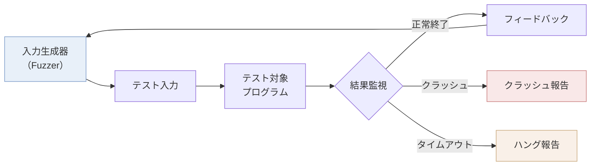

ファジングの概念は1988年にウィスコンシン大学のBarton Miller教授によって提唱された。Miller教授の実験は極めてシンプルなものだった――UNIXのコマンドラインユーティリティに対してランダムな文字列を入力し、どれだけのプログラムがクラッシュするかを調査した。結果は衝撃的で、テスト対象のUNIXユーティリティの**約25〜33%**がクラッシュまたはハングした。この実験は、広く利用されているソフトウェアですら基本的な堅牢性を欠いている現実を示した。

### 1.3 なぜファジングが必要か

従来のテスト手法――ユニットテスト、インテグレーションテスト、E2Eテスト――は、開発者が**仕様に基づいて想定した振る舞い**を検証するものである。これらは「正しい動作の確認」には有効だが、「想定外の入力に対する耐性」を体系的に検証する仕組みではない。

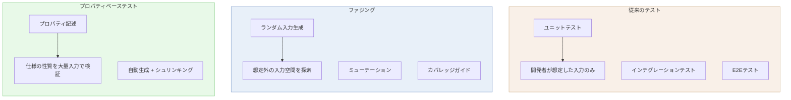

ファジングは、プロパティベーステストと補完的な関係にある。プロパティベーステストが「仕様の性質を記述し、大量の入力で検証する」のに対し、ファジングは「仕様の記述なしに、プログラムのクラッシュや異常な動作を発見する」ことに特化している。ファジングの強みは以下の通りである。

1. **仕様が不要**: プログラムが「クラッシュしない」という最低限の性質を暗黙的にテストする
2. **入力空間の広範な探索**: 人間が想像しない入力パターンを自動的に生成する
3. **セキュリティ脆弱性の発見に強い**: バッファオーバーフロー、Use-After-Free、未初期化メモリの読み取りなど
4. **自動化が容易**: 一度セットアップすれば、長時間にわたって自動的にテストを実行できる
5. **実績が豊富**: Google OSS-Fuzzだけで、700以上のプロジェクトにおいて10,000件以上の脆弱性と36,000件以上のバグを発見している

## 2. ファジングの分類

ファジングは、テスト対象の内部構造に対する知識の度合いに応じて三つのカテゴリに分類される。

### 2.1 ブラックボックスファジング

**ブラックボックスファジング**は、テスト対象の内部構造を一切考慮せず、完全にランダムな入力を生成して投入する手法である。Miller教授の元々の実験がまさにこのアプローチだった。

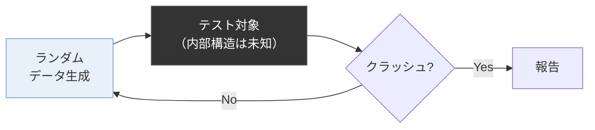

ブラックボックスファジングの利点は**セットアップの容易さ**にある。テスト対象のソースコードも、インストルメンテーションも必要ない。ネットワークプロトコルや外部のクローズドソースソフトウェアなど、ソースコードにアクセスできない場合にも適用可能だ。

しかし、決定的な弱点がある。**入力空間の探索効率が極めて低い**のだ。完全にランダムなバイト列を生成した場合、たとえばファイルフォーマットパーサーのようにマジックナンバーやチェックサムで入力を検証するプログラムでは、ほとんどの入力が初期段階で棄却され、深い処理パスに到達できない。

例えば、PNG画像パーサーをテストする場合を考えてみよう。PNGファイルは先頭8バイトに固定のシグネチャ（`89 50 4E 47 0D 0A 1A 0A`）を持つ。ランダムなバイト列がこのシグネチャに一致する確率は $\frac{1}{2^{64}}$ であり、ブラックボックスファジングではパーサーの本質的な処理に到達することすらほぼ不可能だ。

### 2.2 ホワイトボックスファジング

**ホワイトボックスファジング**は、テスト対象のソースコードまたはバイナリの詳細な解析に基づいて入力を生成する手法である。代表的な技術として**シンボリック実行（Symbolic Execution）**と**コンコリック実行（Concolic Execution）**がある。

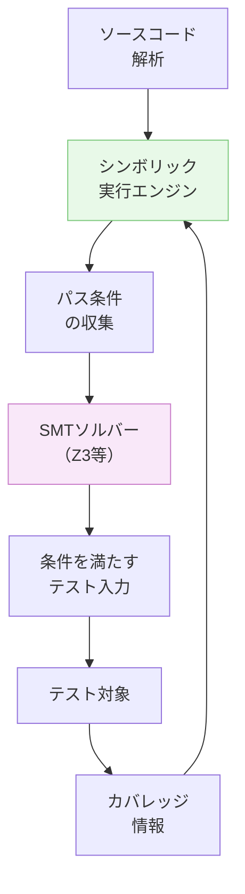

シンボリック実行では、入力をシンボル（記号的な変数）として扱い、プログラムの各分岐条件をシンボリックな制約として収集する。収集された制約をSMT（Satisfiability Modulo Theories）ソルバーで解くことで、特定の実行パスに到達する具体的な入力を生成できる。

```c
// Example: symbolic execution target
void process(int x, int y) {
    if (x > 10) {         // Constraint: x > 10
        if (y == x + 5) { // Constraint: y == x + 5
            if (x * y > 200) { // Constraint: x * y > 200
                abort();   // Reachable with x=15, y=20
            }
        }
    }
}
```

この例では、シンボリック実行は `x > 10 ∧ y = x + 5 ∧ x * y > 200` という制約系をSMTソルバーに渡し、`x = 15, y = 20` のような解を得ることができる。ブラックボックスファジングがランダムにこの組み合わせを発見する確率は天文学的に低いが、シンボリック実行は制約解決を通じて直接的に到達可能だ。

Microsoft のSAGE（Scalable, Automated, Guided Execution）は、ホワイトボックスファジングの代表的な実装であり、Windowsのファイルフォーマットパーサーのテストに長年利用されてきた。SAGEは、Windowsの重大な脆弱性を多数発見した実績がある。

しかし、ホワイトボックスファジングには**パス爆発（Path Explosion）**という根本的な課題がある。プログラム内の分岐が増えるにつれて、探索すべきパスの数が指数関数的に増大する。ループや再帰が含まれるプログラムでは、パス数は実質的に無限となる。

### 2.3 グレーボックスファジング

**グレーボックスファジング**は、ブラックボックスとホワイトボックスの中間に位置するアプローチであり、現在最も広く採用されている手法だ。テスト対象の**軽量なインストルメンテーション**を行い、実行時のカバレッジ情報をフィードバックとして活用する。

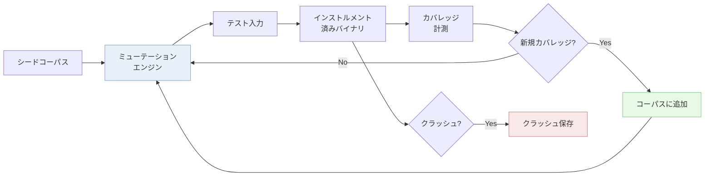

グレーボックスファジングの鍵は、**カバレッジ情報を用いた進化的アルゴリズム**にある。新しいコードパスを発見した入力は「興味深い」とみなされ、以降のミューテーションの基盤として保存される。これにより、完全なランダム生成では到達困難なコードパスにも段階的に到達可能となる。

ホワイトボックスファジングと比較した場合の最大の利点は**スケーラビリティ**である。シンボリック実行のような重い解析を行わず、軽量なカバレッジ計測のみを行うため、大規模なプログラムにも適用可能で、スループット（単位時間あたりの実行回数）がはるかに高い。

### 2.4 三手法の比較

| 特性 | ブラックボックス | ホワイトボックス | グレーボックス |
|------|-----------------|-----------------|---------------|
| 内部情報の利用 | なし | ソースコード/バイナリの詳細解析 | カバレッジ情報のみ |
| スループット | 高 | 低 | 高 |
| 到達可能性 | 浅いパスのみ | 理論的には高い | 段階的に深いパスへ |
| パス爆発の影響 | なし | 深刻 | 限定的 |
| セットアップコスト | 低 | 高 | 中 |
| 代表的ツール | Peach, zzuf | SAGE, KLEE | AFL, libFuzzer |

現代のファジング研究と実践の主流は、グレーボックスファジングである。以降の技術的詳細では、主にグレーボックスファジングの手法に焦点を当てて解説する。

## 3. 技術的詳細

### 3.1 カバレッジガイデッドファジング

カバレッジガイデッドファジング（Coverage-Guided Fuzzing, CGF）は、グレーボックスファジングの核心技術であり、**プログラムのコードカバレッジをフィードバックとして入力の進化を導く**手法だ。

#### 3.1.1 エッジカバレッジの計測

最も広く使われているカバレッジの単位は**エッジカバレッジ（Edge Coverage）**である。AFL（American Fuzzy Lop）が導入したこの手法では、プログラムの制御フローグラフにおける分岐のエッジ（A→BやA→Cなど）を追跡する。

```c
// AFL-style edge coverage instrumentation (simplified)
// Each basic block is assigned a random ID at compile time
static uint8_t shared_mem[MAP_SIZE]; // 64KB bitmap
static uint32_t prev_location;

void __afl_trace(uint32_t cur_location) {
    // XOR of previous and current location creates edge ID
    shared_mem[cur_location ^ prev_location]++;
    prev_location = cur_location >> 1;
}
```

この手法の巧みな点は、`prev_location ^ cur_location` というXOR演算によって**エッジの方向性**を表現していることだ。A→Bの遷移とB→Aの遷移は異なるハッシュ値を生成する。`prev_location >> 1` という右シフトは、A→A（自己ループ）のようなケースでもハッシュ値が0にならないようにするための工夫である。

カバレッジ情報は共有メモリ上の**ビットマップ**として保持される。AFLのデフォルトでは64KBのビットマップを使い、各バイトがヒットカウント（そのエッジを何回通過したか）を記録する。ヒットカウントはバケット化されて分類される。

```
Hit count buckets:
  1        → bucket 1
  2        → bucket 2
  3        → bucket 3
  4-7      → bucket 4
  8-15     → bucket 5
  16-31    → bucket 6
  32-127   → bucket 7
  128+     → bucket 8
```

このバケット化により、「あるエッジを1回通った場合」と「100回通った場合」が異なるカバレッジとして区別される。ループの反復回数が異なるパスを区別できるため、ループの展開に関連するバグの発見に寄与する。

#### 3.1.2 フィードバックループ

カバレッジガイデッドファジングの全体的なアルゴリズムは以下の通りだ。

```
Algorithm: Coverage-Guided Fuzzing
Input: seed corpus S, target program P
Output: set of crashing inputs

1.  corpus ← S
2.  while time budget not exhausted:
3.      input ← select(corpus)         // Select seed from corpus
4.      mutated ← mutate(input)        // Apply mutations
5.      result, coverage ← execute(P, mutated)
6.      if result == CRASH:
7.          save_crash(mutated)
8.      if is_interesting(coverage):    // New edges or hit count buckets?
9.          corpus ← corpus ∪ {mutated}
10.     endif
11. endwhile
```

`is_interesting` 関数は、新しい入力が**既存のコーパスでは到達できなかったエッジ**を発見したか、または**既存のエッジのヒットカウントが新しいバケットに到達した**かを判定する。これにより、コーパスは時間とともに段階的にカバレッジが拡大していく。

#### 3.1.3 コーパスの最小化

ファジングが長時間実行されると、コーパス内の入力数が膨大になり、ミューテーションの基盤として効率が低下する。**コーパス最小化（Corpus Minimization）**は、同一のカバレッジを維持しつつ、コーパスのサイズを最小限に抑える技術だ。

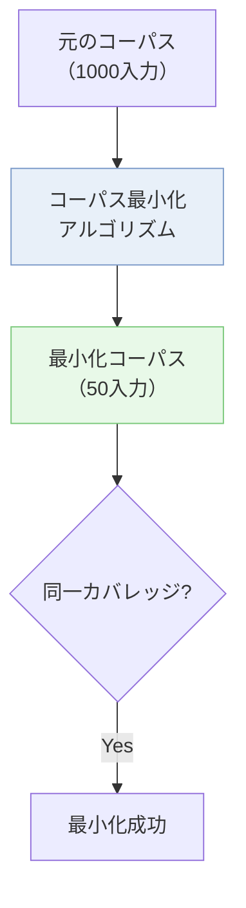

AFLの `afl-cmin` やlibFuzzerの `-merge` オプションがこの機能を提供する。アルゴリズムとしては、各エッジをカバーする最小のファイルを貪欲法で選択するという集合被覆問題の近似解法が用いられる。

### 3.2 ミューテーションベースファジング

ミューテーションベースファジングは、既存の有効な入力（シード）を**変異（ミューテーション）**させることで新しいテスト入力を生成する手法である。

#### 3.2.1 基本的なミューテーション戦略

AFLが実装する代表的なミューテーション操作は以下の通りだ。

| ミューテーション | 操作内容 |
|---------------|---------|
| Bit flip | 1ビット、2ビット、4ビットを反転 |
| Byte flip | 1バイト、2バイト、4バイトを反転 |
| Arithmetic | ±1〜±35の算術演算（バイト境界） |
| Interesting values | `0`, `1`, `MAX_INT`, `MIN_INT` などの特殊値で置換 |
| Havoc | 上記操作のランダムな組み合わせを連続適用 |
| Splice | 2つの入力を結合 |

```c
// Simplified example: bitflip mutation
void bitflip_mutate(uint8_t *buf, size_t len) {
    // Single bit flip
    size_t byte_pos = random() % len;
    uint8_t bit_pos = random() % 8;
    buf[byte_pos] ^= (1 << bit_pos);
}

// Simplified example: arithmetic mutation
void arith_mutate(uint8_t *buf, size_t len) {
    size_t pos = random() % (len - 3);
    int32_t *val = (int32_t *)(buf + pos);
    int32_t delta = (random() % 71) - 35; // Range: -35 to +35
    *val += delta;
}

// Simplified example: havoc mutation (random combination)
void havoc_mutate(uint8_t *buf, size_t *len, size_t max_len) {
    int num_mutations = 1 + random() % 16;
    for (int i = 0; i < num_mutations; i++) {
        switch (random() % 6) {
            case 0: bitflip_mutate(buf, *len); break;
            case 1: arith_mutate(buf, *len); break;
            case 2: // Replace with interesting value
                buf[random() % *len] = 0xFF;
                break;
            case 3: // Delete bytes
                if (*len > 1) {
                    size_t pos = random() % *len;
                    memmove(buf + pos, buf + pos + 1, *len - pos - 1);
                    (*len)--;
                }
                break;
            case 4: // Insert random byte
                if (*len < max_len) {
                    size_t pos = random() % *len;
                    memmove(buf + pos + 1, buf + pos, *len - pos);
                    buf[pos] = random() % 256;
                    (*len)++;
                }
                break;
            case 5: // Overwrite with random bytes
                {
                    size_t pos = random() % *len;
                    size_t copy_len = 1 + random() % 4;
                    for (size_t j = 0; j < copy_len && pos + j < *len; j++) {
                        buf[pos + j] = random() % 256;
                    }
                }
                break;
        }
    }
}
```

#### 3.2.2 AFL の Deterministic/Havoc フェーズ

AFLのミューテーションは**決定的フェーズ（Deterministic Phase）**と**ハボックフェーズ（Havoc Phase）**の2段階で構成される。

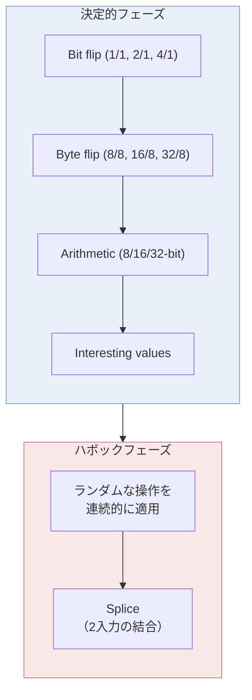

決定的フェーズでは、入力の各バイト位置に対して体系的にミューテーションを適用する。例えば、1ビットフリップでは入力の全ビットを順番に反転させる。この網羅的なアプローチにより、マジックバイトの発見や、特定のビットに敏感なパーサーの分岐条件の突破が可能になる。

ハボックフェーズでは、複数のミューテーション操作をランダムに組み合わせて適用する。決定的フェーズでは発見できない、複数箇所の同時変更が必要な入力パターンの発見に有効だ。

#### 3.2.3 構造を意識したミューテーション

単純なバイト列のミューテーションは、高度に構造化された入力フォーマット（XML、JSON、SQLなど）に対しては効率が悪い。多くの変異が構文的に不正な入力を生成し、パーサーの初期段階で棄却されてしまうからだ。

この問題に対処するために、**構造を意識したミューテーション（Structure-Aware Mutation）**が研究されている。libFuzzerの `LLVMFuzzerCustomMutator` インターフェースや、AFLのカスタムミュテーターフレームワークがこのアプローチを支援する。

```c
// Custom mutator for JSON fuzzing (simplified)
size_t LLVMFuzzerCustomMutator(uint8_t *data, size_t size,
                                size_t max_size, unsigned int seed) {
    // Parse JSON to AST
    json_value *root = json_parse(data, size);
    if (!root) {
        // If invalid JSON, fall back to default mutation
        return LLVMFuzzerMutate(data, size, max_size);
    }

    // Mutate at AST level
    srand(seed);
    switch (rand() % 4) {
        case 0: json_change_type(root);    break; // Change value type
        case 1: json_add_field(root);      break; // Add new field
        case 2: json_remove_field(root);   break; // Remove field
        case 3: json_modify_value(root);   break; // Modify value
    }

    // Serialize back to bytes
    size_t new_size = json_serialize(root, data, max_size);
    json_free(root);
    return new_size;
}
```

### 3.3 生成ベースファジング

生成ベースファジング（Generation-Based Fuzzing）は、入力フォーマットの**文法（Grammar）**や**仕様**を定義し、それに基づいてテスト入力をゼロから生成する手法だ。ミューテーションベースが既存の入力を変形するのに対し、生成ベースは入力を一から構築する。

#### 3.3.1 文法ベースファジング

文法ベースファジングでは、入力フォーマットをBNFやPEGのような形式文法で記述し、その文法に従った入力を自動生成する。

```
# Grammar for a simple arithmetic expression
<expr>   ::= <term> (("+" | "-") <term>)*
<term>   ::= <factor> (("*" | "/") <factor>)*
<factor> ::= <number> | "(" <expr> ")" | "-" <factor>
<number> ::= [0-9]+("."[0-9]+)?
```

文法ベースファジングの利点は、生成される入力が**常に構文的に正しい**ことだ。これにより、パーサーを通過して深い処理パスに到達する確率が大幅に向上する。Google のOSSプロジェクトでは、文法ベースファジングがJavaScript エンジンのテストで特に大きな成果を上げている。

#### 3.3.2 プロトコルファジング

ネットワークプロトコルのファジングでは、プロトコルの**ステートマシン**を考慮する必要がある。単純にランダムなパケットを送りつけるだけでは、プロトコルのハンドシェイクすら通過できない。

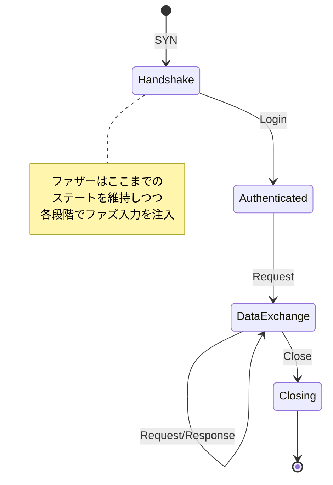

**ステートフルファジング**では、プロトコルの状態遷移を追跡しながら、各状態において異常な入力を注入する。Peach Fuzzerやboofuzzがこのアプローチをサポートしている。

### 3.4 サニタイザとの連携

ファジングの効果を最大化するうえで不可欠なのが、**サニタイザ（Sanitizer）**との組み合わせである。サニタイザは、プログラム実行時にメモリ安全性違反やその他の未定義動作を検出するためのインストルメンテーション技術だ。

サニタイザなしのファジングは、「クラッシュ」として検出可能なバグしか発見できない。しかし、多くのメモリ安全性のバグ（ヒープバッファオーバーリード、Use-After-Free の一部など）は、即座にクラッシュを引き起こさないことがある。サニタイザを有効にすることで、これらの「静かな」バグもクラッシュとして検出可能になる。

| サニタイザ | 検出対象 | オーバーヘッド |
|-----------|---------|-------------|
| AddressSanitizer (ASan) | バッファオーバーフロー、Use-After-Free、二重解放 | ~2x |
| MemorySanitizer (MSan) | 未初期化メモリの使用 | ~3x |
| UndefinedBehaviorSanitizer (UBSan) | 整数オーバーフロー、NULL参照など | ~1.2x |
| ThreadSanitizer (TSan) | データ競合 | ~5-15x |

```bash
# Build with AddressSanitizer for fuzzing
clang -fsanitize=fuzzer,address -g -O1 \
    -fno-omit-frame-pointer \
    target.c -o target_fuzzer

# Build with multiple sanitizers
clang -fsanitize=fuzzer,address,undefined -g -O1 \
    -fno-omit-frame-pointer \
    target.c -o target_fuzzer
```

## 4. 主要ツール

### 4.1 AFL（American Fuzzy Lop）

AFLは2013年にMichal Zalewskiによって開発されたカバレッジガイデッドファザーであり、現代のファジング技術に革命をもたらしたツールだ。AFLの登場により、ファジングは研究者のための高度な技術から、一般の開発者にもアクセス可能なツールへと変貌した。

#### 設計思想

AFLの設計思想は**実用性**にある。理論的な最適性よりも、実際に多くのバグを発見することを重視している。Zalewskiは、以下の原則に基づいてAFLを設計した。

- コンパイル時インストルメンテーションによる高速なカバレッジ計測
- 最小限の設定で動作する使いやすさ
- 決定的ミューテーションとハボックミューテーションの組み合わせ
- コーパスの自動管理と最小化

#### AFL++

オリジナルのAFLは2020年頃に開発が停滞したが、コミュニティによるフォークである**AFL++**が開発を引き継ぎ、多数の改善を加えた。AFL++は現在、AFLの事実上の後継として広く利用されている。

AFL++の主な改良点は以下の通りだ。

- **CmpLog/RedQueen**: 比較演算の引数を自動抽出し、マジックバイト突破を効率化
- **MOpt**: ミューテーション操作の選択を粒子群最適化で最適化
- **Persistent mode**: fork() のオーバーヘッドを回避し、スループットを大幅に向上
- **Custom mutator API**: ユーザー定義のミューテーション戦略をプラグインとして追加
- **QEMU/Unicorn mode**: ソースコードなしのバイナリファジングをサポート

```bash
# AFL++ basic usage
# 1. Build target with instrumentation
afl-clang-fast -fsanitize=address -g -O1 target.c -o target

# 2. Create initial seed corpus
mkdir corpus
echo "initial input" > corpus/seed1

# 3. Start fuzzing
afl-fuzz -i corpus -o findings -- ./target @@

# 4. Check results
ls findings/crashes/
ls findings/hangs/
```

### 4.2 libFuzzer

**libFuzzer**はLLVMプロジェクトの一部として開発されたインプロセスファジングエンジンである。AFLがプロセス外（fork方式）でファジングを行うのに対し、libFuzzerはテスト対象と**同一プロセス内**で動作する。

#### インプロセスファジングの利点

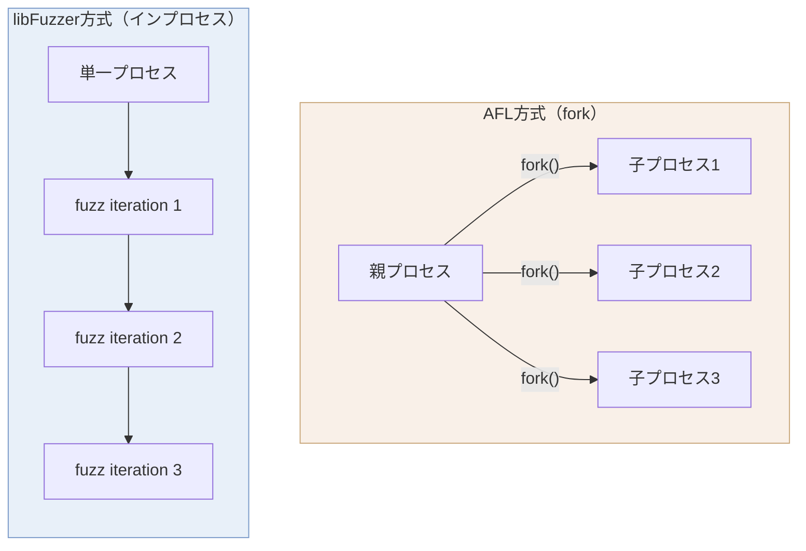

インプロセスファジングでは、各テスト入力の実行に `fork()` を必要としないため、**実行のオーバーヘッドが極めて小さい**。AFLのpersistent modeと同様のスループットを、よりシンプルな仕組みで実現する。libFuzzerでは秒間数万回のファジングイテレーションが可能だ。

#### ハーネスの記述

libFuzzerのテストハーネスは、`LLVMFuzzerTestOneInput` 関数を実装するだけだ。

```c
// Fuzz harness for a PNG parser
#include <stdint.h>
#include <stddef.h>

// Target function to test
extern int parse_png(const uint8_t *data, size_t size);

int LLVMFuzzerTestOneInput(const uint8_t *data, size_t size) {
    // Call the target with fuzz input
    parse_png(data, size);

    // Return 0 to indicate success (non-zero would abort fuzzing)
    return 0;
}
```

```bash
# Build and run with libFuzzer
clang -fsanitize=fuzzer,address -g target_harness.c png_parser.c -o fuzzer
./fuzzer corpus/ -max_len=65536 -timeout=5
```

#### 主要オプション

```bash
# Useful libFuzzer flags
./fuzzer corpus/ \
    -max_len=4096 \           # Maximum input size
    -timeout=10 \             # Timeout per execution (seconds)
    -jobs=4 \                 # Number of parallel jobs
    -workers=4 \              # Number of worker processes
    -dict=png.dict \          # Dictionary for guided mutations
    -only_ascii=1 \           # Restrict to ASCII inputs
    -print_final_stats=1 \    # Print statistics at end
    -use_value_profile=1      # Track value comparisons for feedback
```

### 4.3 honggfuzz

**honggfuzz**はGoogle のRobert Swieckiによって開発されたファジングツールであり、以下の特徴を持つ。

- **ハードウェアカウンターベースのカバレッジ**: Intel Processor Trace（PT）やBranch Trace Store（BTS）を利用し、ソースコードの変更なしにバイナリレベルのカバレッジを計測可能
- **マルチプロセス対応**: 複数のCPUコアを効率的に活用した並列ファジング
- **永続モード**: `HF_ITER` マクロによる高速なファジングループ
- **自動辞書生成**: 実行時にプログラム内の定数文字列を自動抽出

### 4.4 OSS-Fuzz

**OSS-Fuzz**はGoogleが運営するオープンソースソフトウェアのための継続的ファジングサービスであり、2016年の開始以来、ソフトウェアセキュリティに計り知れない貢献を果たしている。

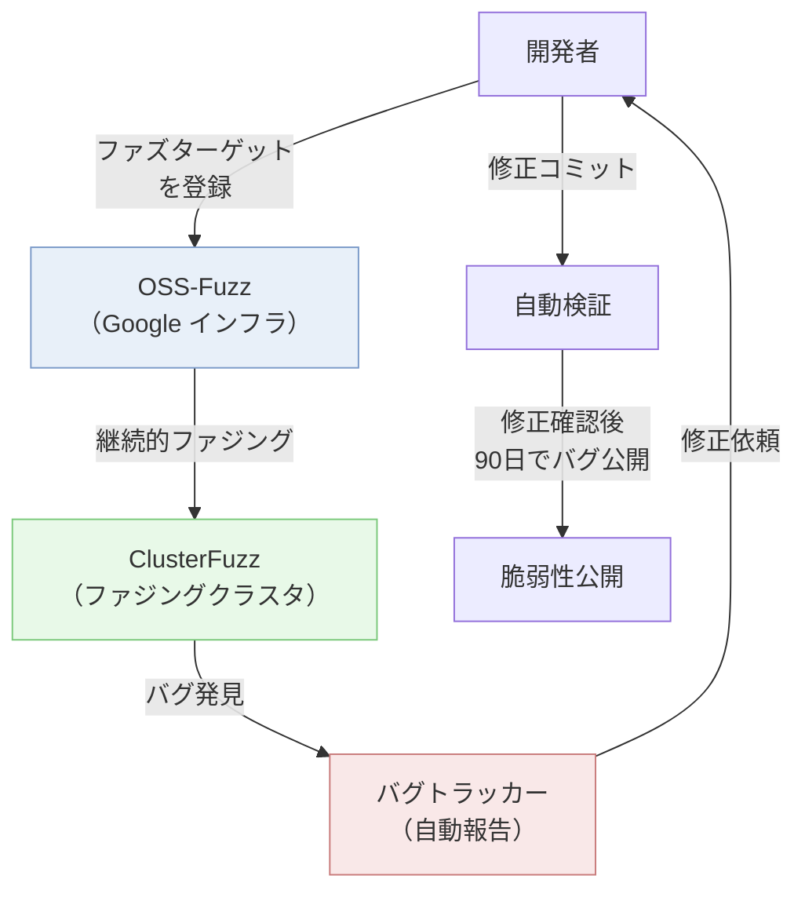

OSS-Fuzzの仕組みは以下の通りだ。

1. **プロジェクト登録**: 開発者がファズターゲット（ハーネス）とビルド設定を登録
2. **継続的ファジング**: Google のインフラ上で24時間365日ファジングを実行
3. **自動バグ報告**: クラッシュが発見されると、自動的にバグトラッカーにチケットが作成される
4. **自動検証**: 開発者が修正をコミットすると、自動的にバグが修正されたことを検証
5. **段階的公開**: 修正確認後、90日間の猶予期間を経て脆弱性が公開される

2024年時点で、OSS-Fuzzは700以上のオープンソースプロジェクト（OpenSSL, FFmpeg, SQLite, Linux カーネル, cURL, systemdなど）を対象に、累計で**10,000件以上のセキュリティ脆弱性**と**36,000件以上の一般的なバグ**を発見している。

### 4.5 ツールの選択指針

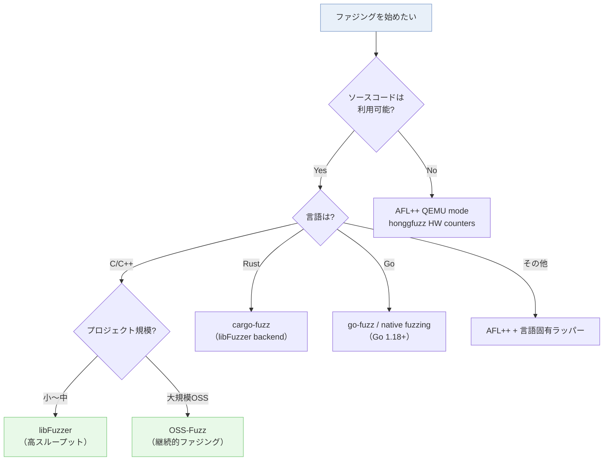

## 5. 実装考慮事項

### 5.1 シード選択

ファジングの効率は**初期シードコーパス**の品質に大きく依存する。適切なシードは、プログラムの様々なコードパスを網羅し、ファザーが深い処理パスに到達するための出発点を提供する。

#### シード選択のベストプラクティス

1. **有効な入力を使う**: テスト対象が受け付ける有効な入力ファイルをシードとして使用する。PDFパーサーのファジングなら、様々な種類のPDFファイルをシードとする
2. **多様性を確保する**: 異なるコードパスをカバーする多様なシードを用意する
3. **小さく保つ**: 大きなシードはミューテーションの効率を下げる。各シードは意味のある最小サイズに保つ
4. **コーパス蒸留**: `afl-cmin`（AFL++）や `-merge`（libFuzzer）でシードを最小化する

```bash
# Minimize seed corpus with AFL++
afl-cmin -i raw_corpus -o minimized_corpus -- ./target @@

# Minimize seed corpus with libFuzzer
mkdir minimized_corpus
./fuzzer -merge=1 minimized_corpus raw_corpus
```

#### 辞書の活用

辞書（Dictionary）は、テスト対象が認識する**キーワードやトークン**のリストである。ファザーは辞書のエントリをミューテーション時に入力に挿入することで、構文的に意味のある入力を生成する確率を高める。

```
# Example dictionary for XML fuzzing (xml.dict)
"<"
">"
"</"
"/>"
"<?"
"?>"
"<![CDATA["
"]]>"
"&amp;"
"&lt;"
"&gt;"
"encoding="
"version="
"xmlns:"
"utf-8"
```

### 5.2 ファズハーネスの作成

ファズハーネス（Fuzz Harness）は、ファザーとテスト対象のコードを接続するグルーコードである。良質なハーネスの設計は、ファジングの成功に直結する。

#### ハーネス設計の原則

```c
// Good harness: focused, minimal, handles edge cases
int LLVMFuzzerTestOneInput(const uint8_t *data, size_t size) {
    // 1. Early return for trivially small inputs
    if (size < 4) return 0;

    // 2. Limit input size to prevent OOM
    if (size > MAX_INPUT_SIZE) return 0;

    // 3. Initialize required state
    parser_context *ctx = parser_init();
    if (!ctx) return 0;

    // 4. Call the target function
    parser_result *result = parser_parse(ctx, data, size);

    // 5. Clean up all allocated resources
    if (result) parser_result_free(result);
    parser_free(ctx);

    return 0;
}
```

::: warning ハーネスで避けるべきこと
- **グローバル状態の蓄積**: 各イテレーション間で状態がリークすると、非決定的な動作やメモリ消費の増大を招く
- **ファイルシステムへの書き込み**: テンポラリファイルの作成は極力避ける。必要な場合はメモリ内バッファを使用する
- **ネットワーク通信**: 外部サービスへの依存はファジングのスループットを著しく低下させる
- **入力に依存するsleep**: 意図的なスローダウンはタイムアウトの誤検出を引き起こす
:::

#### 複数のエントリポイント

大規模なライブラリでは、APIのエントリポイントごとに個別のハーネスを作成するのが一般的だ。

```c
// Harness 1: Image decoding
int LLVMFuzzerTestOneInput(const uint8_t *data, size_t size) {
    image_t *img = image_decode(data, size);
    if (img) image_free(img);
    return 0;
}

// Harness 2: Image encoding (decode then re-encode)
int LLVMFuzzerTestOneInput(const uint8_t *data, size_t size) {
    image_t *img = image_decode(data, size);
    if (img) {
        uint8_t *buf = NULL;
        size_t buf_size = 0;
        image_encode(img, &buf, &buf_size);
        free(buf);
        image_free(img);
    }
    return 0;
}

// Harness 3: Image transformation
int LLVMFuzzerTestOneInput(const uint8_t *data, size_t size) {
    if (size < 2) return 0;
    // Use first 2 bytes as transformation parameters
    uint8_t rotation = data[0];
    uint8_t scale = data[1];

    image_t *img = image_decode(data + 2, size - 2);
    if (img) {
        image_rotate(img, rotation);
        image_scale(img, scale);
        image_free(img);
    }
    return 0;
}
```

### 5.3 クラッシュトリアージ

ファジングが長時間実行されると、大量のクラッシュ入力が蓄積される。これらを効率的に分類・優先順位付けすることを**クラッシュトリアージ**と呼ぶ。

#### 重複排除

同一の根本原因に起因するクラッシュは、数百〜数千の異なるテスト入力で再現されることがある。これらを重複として排除するために、以下の手法が使われる。

1. **スタックトレースのハッシュ化**: クラッシュ時のスタックトレースをハッシュ化し、同一のハッシュ値を持つクラッシュを同一とみなす
2. **カバレッジプロファイルの比較**: クラッシュに至る実行パスのカバレッジを比較し、類似のパスをグループ化する
3. **ASan のレポート解析**: AddressSanitizer のレポートに含まれるバグの種類（heap-buffer-overflow, use-after-freeなど）とアロケーションサイトで分類する

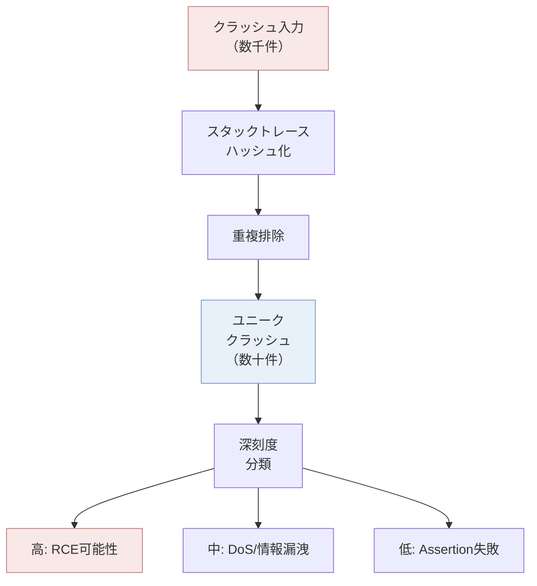

#### 最小化

クラッシュを再現する最小の入力を見つけることは、デバッグの効率を大幅に向上させる。

```bash
# Minimize crash input with AFL++
afl-tmin -i crash_input -o minimized_crash -- ./target @@

# Minimize with libFuzzer
./fuzzer -minimize_crash=1 -exact_artifact_path=minimized crash_input
```

#### 深刻度の評価

発見されたクラッシュの深刻度を評価するための基準として、以下のような観点が用いられる。

| バグの種類 | 深刻度 | 理由 |
|-----------|--------|------|
| Stack buffer overflow (書き込み) | 高 | リモートコード実行の可能性 |
| Heap buffer overflow (書き込み) | 高 | リモートコード実行の可能性 |
| Use-After-Free | 高 | リモートコード実行の可能性 |
| Stack buffer overflow (読み取り) | 中 | 情報漏洩の可能性 |
| Heap buffer overflow (読み取り) | 中 | 情報漏洩の可能性 |
| NULL pointer dereference | 低〜中 | DoS（サービス拒否）の可能性 |
| Assertion failure | 低 | DoSの可能性 |
| Memory leak | 低 | 長期的なDoSの可能性 |
| Integer overflow | 要調査 | 後続の処理によって深刻度が変わる |

### 5.4 ファジングキャンペーンの運用

実際のプロジェクトにおけるファジングは、一度実行して終わりではなく、**継続的なキャンペーン**として運用される。

#### CI/CDへの統合

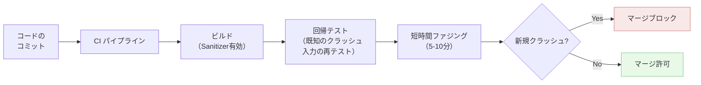

CIパイプラインへのファジングの統合では、以下の2つのアプローチを組み合わせる。

1. **回帰テスト**: 過去に発見されたクラッシュ入力を保存し、コード変更のたびに再テストする。修正されたはずのバグが再発していないことを確認する
2. **短時間ファジング**: PRやコミットのたびに短時間（数分〜数十分）のファジングを実行し、明らかなバグを検出する

#### 並列ファジング

ファジングのスループットを向上させるために、複数のファザーインスタンスを並列に実行する手法がある。

```bash
# AFL++ parallel fuzzing
# Primary instance
afl-fuzz -i corpus -o sync_dir -M primary -- ./target @@

# Secondary instances (different mutation strategies)
afl-fuzz -i corpus -o sync_dir -S secondary01 -- ./target @@
afl-fuzz -i corpus -o sync_dir -S secondary02 -L 0 -- ./target @@
```

AFL++の並列ファジングでは、複数のインスタンスが`sync_dir`を通じてコーパスを共有する。各インスタンスは独立にミューテーションを行いつつ、他のインスタンスが発見した興味深い入力を定期的に取り込む。異なるミューテーション戦略（deterministic, havoc, MOpt, CmpLogなど）を各インスタンスに割り当てることで、探索の多様性を確保する。

## 6. 実世界での評価

### 6.1 Heartbleed とファジングの教訓

2014年に発見されたOpenSSLのHeartbleed脆弱性（CVE-2014-0160）は、ファジングの重要性を世界に知らしめた象徴的な事例だ。TLSのHeartbeat拡張機能の実装において、ペイロード長のバリデーションが欠如しており、サーバーのメモリ内容（秘密鍵、パスワード、セッション情報）が最大64KBにわたって漏洩するという深刻な脆弱性だった。

```c
// Simplified vulnerable code (OpenSSL Heartbleed)
int dtls1_process_heartbeat(SSL *s) {
    unsigned char *p = &s->s3->rrec.data[0], *pl;
    unsigned short hbtype;
    unsigned int payload;

    hbtype = *p++;
    n2s(p, payload);  // Read claimed payload length from packet
    pl = p;

    // BUG: No check that payload <= actual received data length
    // Attacker can claim payload=65535 with only 1 byte of data

    unsigned char *buffer = OPENSSL_malloc(1 + 2 + payload + padding);
    // ... copies 'payload' bytes from memory after the actual data
    memcpy(bp, pl, payload);  // Reads beyond buffer boundary
    // ...
}
```

この脆弱性はコードレビューでは2年以上見逃されていたが、ファジングツールを適切に適用していれば発見可能だったことが後に実証された。David Wheeler の分析によれば、AddressSanitizer を有効にしたファジングにより、数分以内にHeartbleedを発見できたという。

Heartbleed以降、OpenSSLプロジェクトはOSS-Fuzzに統合され、継続的ファジングの対象となった。

### 6.2 Google Chrome のセキュリティ

Google Chromeは、ファジングを体系的に活用している最も成功した事例の一つだ。ChromeチームはClusterFuzz（OSS-Fuzzの内部版）を運用し、数千台のマシンで24時間365日ファジングを実行している。

2024年の時点で、Chromeのファジングインフラは以下の成果を報告している。

- 数万件のセキュリティバグを発見
- V8 JavaScript エンジン、Blink レンダリングエンジン、PDFium、画像デコーダーなど広範なコンポーネントをカバー
- Chrome のバグ報奨金プログラムの報告の多くがファジングによる発見

特にV8 JavaScriptエンジンに対しては、文法ベースファジングが大きな成果を上げている。正しいJavaScript構文を生成するジェネレータを用いることで、JITコンパイラの最適化バグやガベージコレクタの脆弱性が多数発見されてきた。

### 6.3 ファジングが発見した著名な脆弱性

| 脆弱性 | プロジェクト | 発見年 | 影響 |
|--------|------------|--------|------|
| Heartbleed (CVE-2014-0160) | OpenSSL | 2014 | サーバーメモリの漏洩 |
| Shellshock (CVE-2014-6271) | Bash | 2014 | リモートコード実行 |
| Stagefright | Android | 2015 | リモートコード実行 |
| ImageMagick RCE | ImageMagick | 2016 | リモートコード実行 |
| 多数のSQLiteバグ | SQLite | 継続的 | 様々（DoS〜情報漏洩） |

### 6.4 SQLite の事例

SQLiteはファジングを極めて積極的に活用しているプロジェクトだ。SQLiteの開発者Richard Hippは、ファジングの効果について以下のように述べている。

> "Fuzz testing is an important part of the SQLite quality assurance process. Billions of fuzz test cases have been run against SQLite over the years."

SQLiteは複数のファジング手法を組み合わせて使用している。

1. **SQL文法ベースファジング**: 有効なSQL文を生成するジェネレータを用いて、クエリ処理エンジンをテスト
2. **dbファイルのミューテーション**: 正常なSQLiteデータベースファイルをミューテーションし、データベースファイルパーサーの堅牢性をテスト
3. **OSS-Fuzz統合**: 継続的ファジングにより、リグレッションを早期に検出

SQLiteが到達している**MC/DC（Modified Condition/Decision Coverage）100%**というテストカバレッジは、ファジングの貢献なしには実現不可能だったであろう。

## 7. 今後の方向性

### 7.1 AI支援ファジング

大規模言語モデル（LLM）をファジングに活用する研究が急速に進展している。主要な研究方向は以下の通りだ。

- **ハーネスの自動生成**: LLMがソースコードを解析し、適切なファズハーネスを自動的に生成する。Google は2023年にLLMを用いたOSS-Fuzzのハーネス自動生成を実験し、一部のプロジェクトでカバレッジの向上を確認した
- **シードの知的生成**: LLMがテスト対象のコードを理解し、深いコードパスに到達しやすいシード入力を生成する
- **クラッシュの自動分析**: LLMがクラッシュレポートとソースコードを組み合わせて分析し、根本原因の特定と修正提案を行う

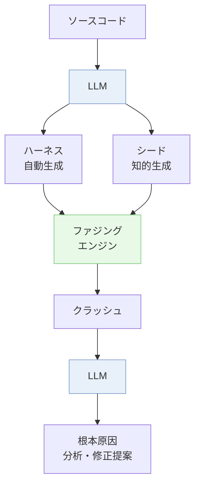

ただし、LLMが生成するコードの正確性は保証されないため、生成されたハーネスの品質検証が新たな課題となる。

### 7.2 ハードウェアファジング

従来ファジングの主な対象はソフトウェアだったが、近年では**ハードウェア設計の検証**にもファジング技術が応用されている。

- **CPU設計のファジング**: 命令列をファジングし、CPUの仕様違反やマイクロアーキテクチャレベルのバグを発見する。IntelのIPAS（Intel Product Assurance and Security）チームはファジングを用いてCPUのバグを検出している
- **RTLファジング**: VerilogやVHDLで記述されたRTL（Register Transfer Level）設計に対して、カバレッジガイデッドファジングを適用する

### 7.3 差分ファジング

**差分ファジング（Differential Fuzzing）**は、同一の機能を提供する複数の実装を同時にテストし、出力の差異を検出する手法だ。クラッシュのような明示的な障害がなくても、実装間の意味的な差異（セマンティックバグ）を発見できる。

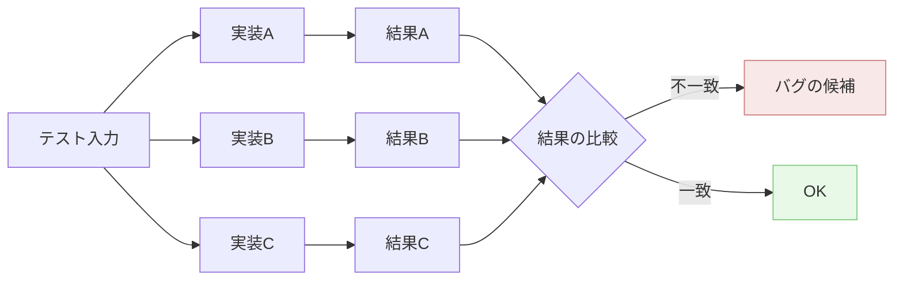

差分ファジングの応用例としては、以下が挙げられる。

- **暗号ライブラリの検証**: OpenSSL, BoringSSL, LibreSSLの暗号処理の結果を比較し、実装の不整合を検出する（Google のProject Wycheproof）
- **ブラウザエンジンの検証**: Chrome, Firefox, Safariのレンダリング結果を比較する
- **コンパイラの検証**: GCC, Clang, MSVCの出力結果を比較し、コンパイラのバグを発見する（Csmith）

### 7.4 ファジングの限界と課題

ファジングは強力な手法だが、万能ではない。以下の課題が残されている。

1. **状態爆発**: ステートフルなプログラム（データベース、ネットワークサーバーなど）では、状態空間が巨大になり、探索の効率が低下する
2. **マジックバイト問題**: チェックサムや暗号的ハッシュによるバリデーションは、通常のミューテーションでは突破困難。CmpLog/RedQueen や Symbolic Execution との組み合わせが必要
3. **環境依存のバグ**: 特定のOS、ハードウェア、タイミングに依存するバグは、単純なファジングでは再現困難
4. **論理バグの検出**: ファジングは主にクラッシュや異常な動作を検出するが、「計算結果が間違っている」という論理バグの検出は、明示的なオラクル（正解の定義）なしには困難
5. **カバレッジの飽和**: ファジングを長時間実行すると、新しいカバレッジの発見頻度が低下し、探索の効率が落ちる

これらの課題に対して、シンボリック実行との組み合わせ（ハイブリッドファジング）、構造化ファジング、人間の知識を活用したシード設計など、様々なアプローチが研究されている。ファジングは単独で完結する銀の弾丸ではなく、従来のテスト手法やコードレビュー、形式手法と組み合わせることで、ソフトウェアの品質とセキュリティを総合的に向上させるべき技術なのだ。

## まとめ

ファジングは、1988年のMiller教授の実験から始まり、2010年代のAFL登場によって実用的なツールへと成長し、現在ではソフトウェアセキュリティにおける不可欠な技術となっている。

その本質は、**人間の想像力の限界を計算機の力で補完する**ことにある。手動のテストでは決して試さないような入力パターンを自動的に大量に生成し、ソフトウェアの堅牢性を体系的に検証する。カバレッジガイデッドファジングの登場により、この探索はもはやランダムな総当たりではなく、プログラムの構造に導かれた知的な探索となった。

ファジングが最も効果を発揮するのは、「プログラムは何を入力されても安全に処理すべきである」という最低限の要件を大規模に検証する場面だ。正しさの検証にはユニットテストやプロパティベーステストが、設計の正当性の検証には形式手法が適している。ファジングは、これらの手法が見逃す**想定外の入力に対する耐性**を検証する、補完的な位置づけにある。

ソフトウェアがあらゆる社会インフラの基盤となった現代において、ファジングの重要性は増す一方だ。OSS-Fuzzの成果が示すように、ファジングは既に数万件の脆弱性を発見し、インターネットのセキュリティ向上に具体的に貢献している。AI技術との融合、ハードウェアへの適用範囲の拡大、差分ファジングによるセマンティックバグの検出など、今後もファジング技術は進化を続けていくだろう。
