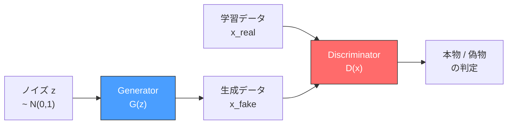
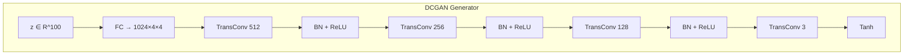
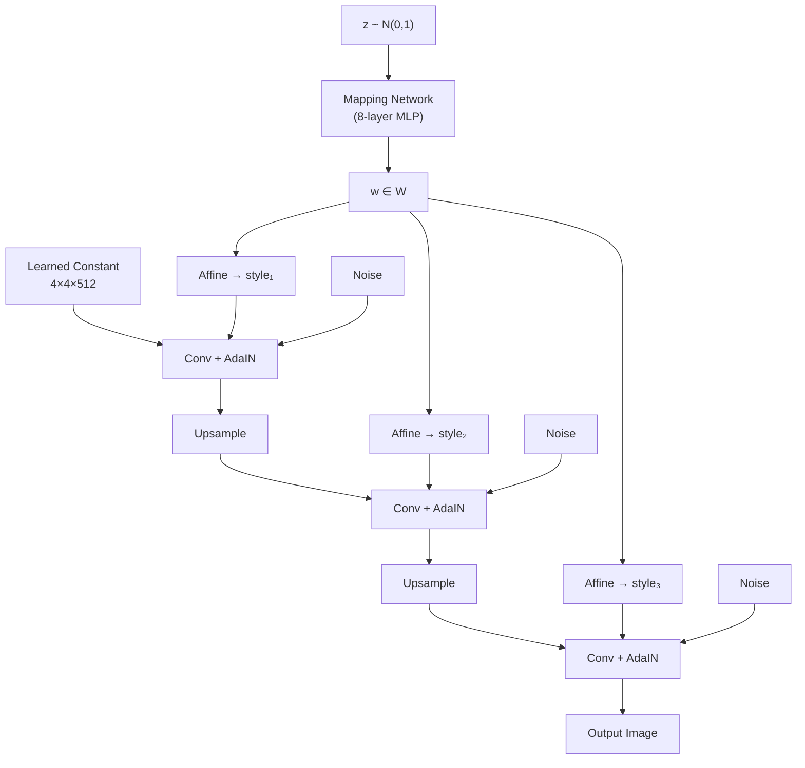
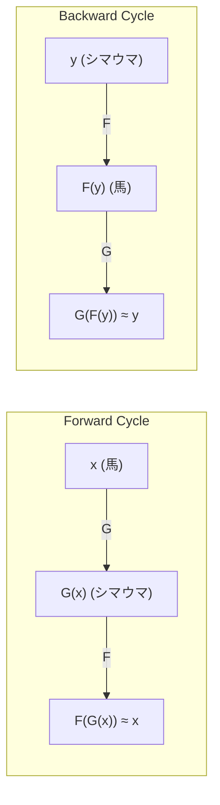
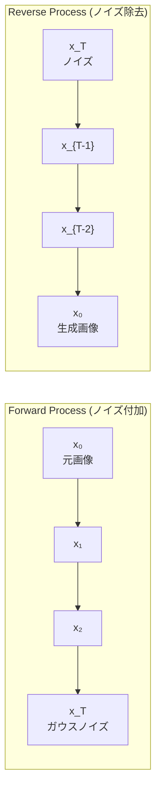

# GAN（敵対的生成ネットワーク）— 敵対的学習による生成モデル

## 1. 背景と動機：生成モデルの位置づけ

### 識別モデルと生成モデル

機械学習のモデルは、大きく2つのパラダイムに分類できる。

**識別モデル**（Discriminative Model）は、入力 $x$ が与えられたときの条件付き確率 $P(y \mid x)$ を直接モデル化する。たとえば画像分類では、「この画像が猫である確率は0.95」といった形で、入力からラベルへの写像を学習する。SVM、ロジスティック回帰、通常のCNNによる分類器などがこれに該当する。

**生成モデル**（Generative Model）は、データそのものの確率分布 $P(x)$、あるいは条件付き分布 $P(x \mid y)$ をモデル化する。生成モデルが学習に成功すれば、学習データと同じ分布に従う新しいサンプルを生成できる。つまり「猫の画像を見たことがあるなら、新しい猫の画像を描ける」という能力を獲得するのが生成モデルの目標である。

```
Discriminative Model:
  Input x  ──→  P(y|x)  ──→  Label y
  "What is this image?"

Generative Model:
  Noise z  ──→  P(x)    ──→  Data x
  "Generate a new image."
```

### 生成モデルの歴史的系譜

GAN以前の生成モデルには、いくつかの重要なアプローチが存在した。

**ボルツマンマシン / 制限ボルツマンマシン（RBM）**：エネルギーベースの確率モデルであり、2000年代には Deep Belief Network の構成要素として注目を集めた。しかし、サンプリングにマルコフ連鎖モンテカルロ法（MCMC）を必要とし、計算コストが高く、学習の収束が遅いという問題があった。

**変分オートエンコーダ（VAE）**：2013年にKingmaらが提案した。入力データを潜在空間にエンコードし、その潜在表現からデータを再構成するオートエンコーダ構造に、変分推論の枠組みを導入したモデルである。明示的な確率モデルとして損失関数にエビデンス下界（ELBO）を用いるため、学習は安定している。しかし、再構成誤差に基づく学習のため、生成された画像はぼやけやすいという欠点があった。

$$\mathcal{L}_{\text{VAE}} = \mathbb{E}_{q(z|x)}[\log p(x|z)] - D_{\text{KL}}(q(z|x) \| p(z))$$

**自己回帰モデル**（PixelCNN, PixelRNNなど）：画像のピクセルを1つずつ逐次的に生成するモデルである。尤度を正確に計算できるが、生成速度が極めて遅いという実用上の問題を抱えていた。

### GANの着想：敵対的学習

2014年、Ian Goodfellow らは、上記のアプローチとはまったく異なる発想の生成モデル **GAN（Generative Adversarial Network、敵対的生成ネットワーク）** を提案した。Goodfellow自身が語るところによれば、この着想はバーでの議論から生まれたという逸話がある。

GANの核心的なアイデアは、**2つのネットワークを敵対的に競わせることで、間接的にデータ分布を学習する**という点にある。偽造者（Generator）と鑑定者（Discriminator）のアナロジーで説明されることが多い。

- **Generator（生成器）**：ランダムなノイズからデータを生成する。偽札を作る偽造犯に相当する
- **Discriminator（識別器）**：入力データが本物（学習データ）か偽物（Generatorが生成したデータ）かを判定する。偽札を見破る鑑定士に相当する

偽造犯は鑑定士を騙せるほど精巧な偽札を作ろうとし、鑑定士はどんな偽札も見破れるよう鑑定能力を高める。この敵対的な相互作用を通じて、最終的にGeneratorは本物と見分けがつかないデータを生成できるようになる。



この枠組みの革新性は、Generatorがデータの尤度を明示的に計算する必要がないという点にある。VAEや自己回帰モデルが確率密度関数を直接モデル化するのに対し、GANはDiscriminatorからのフィードバック信号を通じて暗黙的にデータ分布を学習する。これにより、高解像度でシャープな画像を生成する道が開かれた。

## 2. GANの数学的定式化

### ミニマックスゲーム

GANの学習は、**ミニマックスゲーム**（2人零和ゲーム）として定式化される。Generator $G$ と Discriminator $D$ が以下の目的関数 $V(D, G)$ をめぐって対戦する。

$$\min_G \max_D V(D, G) = \mathbb{E}_{x \sim p_{\text{data}}(x)}[\log D(x)] + \mathbb{E}_{z \sim p_z(z)}[\log(1 - D(G(z)))]$$

ここで各記号の意味は以下の通りである。

| 記号 | 意味 |
|------|------|
| $p_{\text{data}}(x)$ | 学習データの真の分布 |
| $p_z(z)$ | ノイズの事前分布（通常は標準正規分布 $\mathcal{N}(0, I)$） |
| $G(z)$ | ノイズ $z$ から生成されたデータ |
| $D(x)$ | データ $x$ が本物である確率（$0 \leq D(x) \leq 1$） |

**Discriminatorの目的（最大化）**

Discriminatorは $V(D, G)$ を最大化する。すなわち、本物のデータ $x$ に対しては $D(x) \to 1$（本物と判定）、偽物のデータ $G(z)$ に対しては $D(G(z)) \to 0$（偽物と判定）となるよう学習する。

- 第1項 $\mathbb{E}_{x \sim p_{\text{data}}}[\log D(x)]$：本物データの判定精度を最大化
- 第2項 $\mathbb{E}_{z \sim p_z}[\log(1 - D(G(z)))]$：偽物データを正しく偽物と判定する能力を最大化

**Generatorの目的（最小化）**

Generatorは $V(D, G)$ を最小化する。Generatorは第1項に影響しないため、実質的には $\mathbb{E}_{z \sim p_z}[\log(1 - D(G(z)))]$ を最小化する。すなわち $D(G(z)) \to 1$ となるよう、Discriminatorを騙す生成を目指す。

### 最適なDiscriminatorの導出

Generatorを固定したとき、最適なDiscriminator $D^*_G(x)$ は解析的に求められる。目的関数の被積分関数を $x$ について最大化すると以下が得られる。

$$D^*_G(x) = \frac{p_{\text{data}}(x)}{p_{\text{data}}(x) + p_g(x)}$$

ここで $p_g(x)$ はGeneratorが生成するデータの分布である。この結果は直感的に理解できる。あるデータ点 $x$ が本物のデータから来る確率と、Generatorから来る確率の比率に基づいて判定するのが最適ということである。

### グローバル最適解

最適なDiscriminator $D^*_G$ のもとで目的関数を書き直すと以下のようになる。

$$C(G) = \max_D V(D, G) = -\log 4 + 2 \cdot D_{\text{JS}}(p_{\text{data}} \| p_g)$$

ここで $D_{\text{JS}}$ は **Jensen-Shannon ダイバージェンス**であり、以下のように定義される。

$$D_{\text{JS}}(P \| Q) = \frac{1}{2} D_{\text{KL}}(P \| M) + \frac{1}{2} D_{\text{KL}}(Q \| M), \quad M = \frac{P + Q}{2}$$

$D_{\text{KL}}$ はKullback-Leiblerダイバージェンスである。Jensen-Shannonダイバージェンスは $D_{\text{JS}} \geq 0$ であり、$P = Q$ のときに限り $D_{\text{JS}} = 0$ となる。

したがって、**$C(G)$ の最小値は $-\log 4$ であり、これは $p_g = p_{\text{data}}$ のときに達成される**。つまり、GANの学習が収束した理想的な状態では、Generatorの出力分布がデータの真の分布と完全に一致する。このとき $D^*_G(x) = \frac{1}{2}$ となり、Discriminatorは本物と偽物をまったく区別できなくなる。

### 実装上の損失関数

実際の学習では、上記のミニマックスゲームを交互最適化（Alternating Optimization）で解く。1ステップごとに以下を繰り返す。

**ステップ1：Discriminatorの更新**

$k$ 回（通常 $k = 1$）にわたり、以下の損失を最小化するようDiscriminatorのパラメータ $\theta_d$ を更新する。

$$\mathcal{L}_D = -\frac{1}{m} \sum_{i=1}^{m} [\log D(x^{(i)}) + \log(1 - D(G(z^{(i)})))]$$

これは交差エントロピー損失の形式であり、本物データに対するラベル $1$、偽物データに対するラベル $0$ の二値分類問題を解くことに相当する。

**ステップ2：Generatorの更新**

以下の損失を最小化するようGeneratorのパラメータ $\theta_g$ を更新する。

$$\mathcal{L}_G = -\frac{1}{m} \sum_{i=1}^{m} \log D(G(z^{(i)}))$$

::: warning Non-saturating loss
理論上のGenerator損失は $\mathcal{L}_G = \frac{1}{m} \sum_{i=1}^{m} \log(1 - D(G(z^{(i)})))$ であるが、学習初期にはGeneratorが未熟であるため $D(G(z)) \approx 0$ となりやすく、$\log(1 - D(G(z))) \approx 0$ の勾配が非常に小さくなる（勾配飽和）。

Goodfellowらは原論文で、Generatorの損失を $-\log D(G(z))$ に置き換える **Non-saturating loss** を提案した。この形式では $D(G(z)) \approx 0$ のとき $-\log D(G(z)) \to \infty$ となり、強い勾配信号が得られる。理論的にはミニマックスゲームとは異なる目的関数だが、実用上はこちらが広く使われている。
:::

## 3. GeneratorとDiscriminatorの構造

### Generatorの設計

Generatorは、低次元のノイズベクトル $z \in \mathbb{R}^d$（典型的には $d = 100$ 程度）から、高次元のデータ空間へのマッピング $G: \mathbb{R}^d \to \mathbb{R}^{C \times H \times W}$ を学習する。

初期のGANでは全結合層のみが使われていたが、画像生成においては**転置畳み込み**（Transposed Convolution、Fractionally-Strided Convolution）が広く用いられるようになった。転置畳み込みは、通常の畳み込みの逆方向の演算であり、小さな特徴マップから大きな特徴マップへの空間的なアップサンプリングを実現する。

```
Generator Architecture (typical):

z ∈ R^100
    │
    ▼
[Fully Connected] → reshape to (512, 4, 4)
    │
    ▼
[TransposeConv2d] → (256, 8, 8)     ↑ Spatial resolution
    │                                 ↑ increases
    ▼                                 ↑
[TransposeConv2d] → (128, 16, 16)    ↑
    │                                 ↑
    ▼                                 ↑
[TransposeConv2d] → (64, 32, 32)     ↑
    │
    ▼
[TransposeConv2d] → (3, 64, 64)
    │
    ▼
[Tanh] → Output image ∈ [-1, 1]
```

出力層の活性化関数には $\tanh$ が一般的に用いられ、画像のピクセル値を $[-1, 1]$ の範囲に正規化する。中間層にはBatch Normalizationと ReLU（またはLeaky ReLU）が使われることが多い。

### Discriminatorの設計

Discriminatorは、データ空間から確率値へのマッピング $D: \mathbb{R}^{C \times H \times W} \to [0, 1]$ を学習する。構造的には通常の画像分類CNNに類似しており、畳み込み層を重ねて空間解像度を徐々に縮小し、最終的にスカラー値を出力する。

```
Discriminator Architecture (typical):

Input image ∈ R^(3, 64, 64)
    │
    ▼
[Conv2d + LeakyReLU] → (64, 32, 32)     ↓ Spatial resolution
    │                                      ↓ decreases
    ▼                                      ↓
[Conv2d + BN + LeakyReLU] → (128, 16, 16) ↓
    │                                      ↓
    ▼                                      ↓
[Conv2d + BN + LeakyReLU] → (256, 8, 8)   ↓
    │                                      ↓
    ▼                                      ↓
[Conv2d + BN + LeakyReLU] → (512, 4, 4)   ↓
    │
    ▼
[Flatten + FC + Sigmoid] → D(x) ∈ [0, 1]
```

DiscriminatorではLeaky ReLU（$f(x) = \max(\alpha x, x)$, $\alpha = 0.2$ が一般的）が用いられることが多い。通常のReLUと異なり、負の入力に対しても小さな勾配を伝播させるため、学習の安定性に寄与する。

### 学習アルゴリズム

GANの学習は以下のアルゴリズムで行われる。

```python
# GAN training loop (pseudocode)
for epoch in range(num_epochs):
    for real_batch in dataloader:
        # --- Step 1: Train Discriminator ---
        z = sample_noise(batch_size, latent_dim)
        fake_batch = G(z).detach()  # no gradient to G

        loss_real = BCE(D(real_batch), ones)
        loss_fake = BCE(D(fake_batch), zeros)
        loss_D = loss_real + loss_fake

        optimizer_D.zero_grad()
        loss_D.backward()
        optimizer_D.step()

        # --- Step 2: Train Generator ---
        z = sample_noise(batch_size, latent_dim)
        fake_batch = G(z)

        loss_G = BCE(D(fake_batch), ones)  # non-saturating loss

        optimizer_G.zero_grad()
        loss_G.backward()
        optimizer_G.step()
```

重要なのは、Discriminatorの学習時にGeneratorのパラメータを固定し（`detach()`）、Generatorの学習時にはDiscriminatorのパラメータを固定するという交互更新の仕組みである。

## 4. 学習の不安定性と課題

GANの学習は理論的には収束が保証されているが、実際には極めて不安定であり、多くの実践的な問題が存在する。これはGANの研究における最大の課題であり、後述する多くのバリアントはこの問題への対処を動機としている。

### モード崩壊（Mode Collapse）

**モード崩壊**は、GANの学習において最も深刻で頻繁に発生する問題である。これは、Generatorが学習データの分布の一部のモード（代表的なパターン）のみを生成し、分布全体を捉えられない現象を指す。

たとえば、手書き数字（0〜9）を生成するGANにおいて、Generatorが「3」と「7」のみを繰り返し生成し、他の数字をまったく生成しない状態がモード崩壊である。

```
True distribution p_data:    Generator distribution p_g (mode collapse):

   ▲                              ▲
   │  ╱╲    ╱╲    ╱╲              │        ╱╲
   │ ╱  ╲  ╱  ╲  ╱  ╲             │       ╱  ╲
   │╱    ╲╱    ╲╱    ╲            │      ╱    ╲
   └──────────────────→           └──────────────────→
   Multiple modes                  Only one mode captured
```

モード崩壊が発生するメカニズムは以下のように理解できる。Generatorがある特定のモード $x^*$ を生成してDiscriminatorを騙すことに成功すると、そのモードばかりを生成するようにパラメータが更新される。Discriminatorはそのモードを偽物と判定できるようになるが、Generatorは別のモードに切り替えて再びDiscriminatorを騙す。この循環が繰り返され、結局一部のモードのみを周期的に訪問する不安定な挙動が生じる。

### 勾配消失問題

理論的なGANの損失関数 $\log(1 - D(G(z)))$ では、学習初期にGeneratorが生成するデータは質が低く、Discriminatorは容易にそれを判別できる（$D(G(z)) \approx 0$）。このとき $\log(1 - D(G(z))) \approx \log 1 = 0$ となり、**勾配がほぼゼロ**になる。つまり、Generatorが最も改善を必要とする学習初期において、改善のための信号が失われるという矛盾が生じる。

前述のNon-saturating lossはこの問題を緩和するが、完全には解決しない。Discriminatorが「強すぎる」場合、やはり勾配が消失しうる。

### 学習の振動と非収束

GANのミニマックスゲームにおいて、GeneratorとDiscriminatorの更新は互いに影響を及ぼし合う。一方のパラメータ更新が他方の最適解を変化させるため、ナッシュ均衡への収束が保証されない。

$$\theta_g^{t+1} = \theta_g^t - \eta \nabla_{\theta_g} \mathcal{L}_G(\theta_g^t, \theta_d^t)$$
$$\theta_d^{t+1} = \theta_d^t - \eta \nabla_{\theta_d} \mathcal{L}_D(\theta_g^t, \theta_d^t)$$

この同時勾配降下法は、凸-凹のミニマックス問題では収束するが、非凸なニューラルネットワークのパラメータ空間では、固定点周りでの振動や発散が容易に発生する。実用上は、GeneratorとDiscriminatorの学習率や更新回数のバランスを慎重に調整する必要がある。

### 学習安定化のテクニック

GANの学習を安定化させるために、多くの経験的な技法が蓄積されてきた。

| テクニック | 説明 |
|-----------|------|
| ラベルスムージング | Discriminatorの目標ラベルを $1.0$ ではなく $0.9$ にする |
| ノイズ追加 | Discriminatorの入力にガウスノイズを付加する |
| スペクトル正規化 | Discriminatorの重み行列のスペクトルノルムで正規化する |
| 学習率の差別化 | DiscriminatorとGeneratorで異なる学習率を用いる |
| 勾配ペナルティ | Discriminatorの勾配ノルムにペナルティを課す（WGAN-GPなど） |
| プログレッシブ学習 | 低解像度から段階的に解像度を上げていく（ProGAN） |

## 5. 主要なGANバリアント

GANの原論文以降、学習の安定性、生成品質、制御性を改善するために膨大な数のバリアントが提案された。ここでは特に重要なものを解説する。

### DCGAN（Deep Convolutional GAN, 2015）

Radford らによって提案されたDCGANは、「GANにCNNをどう組み合わせるか」のベストプラクティスを確立した画期的な研究である。原論文のGANは全結合層で構成されていたが、DCGANは畳み込み層を用いることで画像生成の品質を大幅に向上させた。

DCGANで確立されたアーキテクチャガイドラインは以下の通りである。

1. プーリング層を使わず、ストライド付き畳み込み（Discriminator）と転置畳み込み（Generator）で空間解像度を変更する
2. GeneratorとDiscriminatorの両方にBatch Normalization を適用する（ただしGeneratorの出力層とDiscriminatorの入力層を除く）
3. 全結合層を隠れ層から除去する
4. GeneratorではReLU活性化関数を使い、出力層のみTanhを使う
5. DiscriminatorではLeaky ReLUを全層で使う



DCGANはまた、学習された潜在空間が意味のある構造を持つことを示した。有名な例として、潜在空間上での算術演算が挙げられる。

$$\vec{z}_{\text{king}} - \vec{z}_{\text{man}} + \vec{z}_{\text{woman}} \approx \vec{z}_{\text{queen}}$$

これは単語埋め込み（Word2Vec）における有名な「king - man + woman = queen」のアナロジーが、GANの潜在空間でも成立することを示している。

### WGAN（Wasserstein GAN, 2017）

Arjovsky らによるWGANは、GANの学習不安定性に対する**理論的に動機づけられた**解決策を提示した。オリジナルのGANがJensen-Shannonダイバージェンスを最小化するのに対し、WGANは **Wasserstein距離**（Earth Mover's Distance）を用いる。

**Jensen-Shannonダイバージェンスの問題**

2つの分布 $p_{\text{data}}$ と $p_g$ の台（サポート）が重ならない場合、$D_{\text{JS}}(p_{\text{data}} \| p_g)$ は常に $\log 2$ となり、勾配が $0$ になる。高次元データでは、学習分布と生成分布が重なる確率は極めて低い（低次元の多様体上に集中しているため）。

**Wasserstein距離**

Wasserstein距離（$W_1$ 距離、Earth Mover's Distance）は、一方の分布を他方に移動させるのに必要な最小の「仕事量」として定義される。

$$W(p_{\text{data}}, p_g) = \inf_{\gamma \in \Pi(p_{\text{data}}, p_g)} \mathbb{E}_{(x, y) \sim \gamma}[\|x - y\|]$$

ここで $\Pi(p_{\text{data}}, p_g)$ は $p_{\text{data}}$ と $p_g$ を周辺分布とする全ての同時分布の集合である。

Wasserstein距離はJensen-Shannonダイバージェンスと比較して、以下の利点を持つ。

- 分布の台が重ならない場合でも連続的に変化し、意味のある勾配を提供する
- 学習の進捗と相関する指標として使える（オリジナルGANの損失は学習の進捗を反映しない）

**Kantorovich-Rubinstein双対性**

Wasserstein距離の直接計算は困難であるため、Kantorovich-Rubinstein双対性を用いて以下のように書き換える。

$$W(p_{\text{data}}, p_g) = \sup_{\|f\|_L \leq 1} \left( \mathbb{E}_{x \sim p_{\text{data}}}[f(x)] - \mathbb{E}_{x \sim p_g}[f(x)] \right)$$

ここで上限は全ての1-Lipschitz連続関数 $f$ 上で取られる。Discriminator（WGANでは**Critic**と呼ばれる）がこの関数 $f$ を近似する。

Lipschitz制約を満たすため、WGANではCriticの重みを $[-c, c]$ にクリッピングする。しかしこの方法は、最適な $c$ の選択が困難であり、勾配消失や勾配爆発を引き起こしやすい。

**WGAN-GP（Gradient Penalty）**

Gulrajani らは、重みクリッピングの代わりに**勾配ペナルティ**を用いる WGAN-GP を提案した。Lipschitz制約を直接的に勾配のノルムで制約する。

$$\mathcal{L}_{\text{WGAN-GP}} = \underbrace{\mathbb{E}_{\tilde{x} \sim p_g}[D(\tilde{x})] - \mathbb{E}_{x \sim p_{\text{data}}}[D(x)]}_{\text{Wasserstein distance}} + \lambda \underbrace{\mathbb{E}_{\hat{x} \sim p_{\hat{x}}}[(\|\nabla_{\hat{x}} D(\hat{x})\|_2 - 1)^2]}_{\text{gradient penalty}}$$

ここで $\hat{x}$ は本物データと偽物データの間をランダム補間した点であり、$\lambda$ は勾配ペナルティの重み（論文では $\lambda = 10$）である。

### StyleGAN（2018, 2019, 2020）

Karras らによるStyleGANシリーズは、高品質な画像生成とスタイルの制御性において画期的な成果を上げた。

**StyleGAN（v1, 2018）の核心アイデア**

従来のGeneratorがノイズ $z$ を直接入力として受け取るのに対し、StyleGANは $z$ をまず**Mapping Network** $f$ で中間潜在空間 $\mathcal{W}$ に写像し、その後 **Adaptive Instance Normalization（AdaIN）** を通じて各層のスタイルを制御する。

$$w = f(z), \quad w \in \mathcal{W}$$

$$\text{AdaIN}(x_i, w) = y_{s,i} \frac{x_i - \mu(x_i)}{\sigma(x_i)} + y_{b,i}$$

ここで $y_{s,i}$ と $y_{b,i}$ は $w$ から学習されたアフィン変換の係数であり、各畳み込み層の出力にスタイル情報を注入する。



この構造の利点は以下の通りである。

1. **スタイルの分離**：低解像度層のスタイルは大まかな構造（顔の形、ポーズ）を、高解像度層のスタイルは細部（髪質、肌のテクスチャ）を制御する
2. **スタイルミキシング**：異なる潜在ベクトル $w_1, w_2$ を異なる層に適用することで、複数の画像のスタイルを組み合わせた生成が可能
3. **ノイズ注入**：各層に独立したノイズを注入することで、確率的な変動（髪の毛の位置、そばかすの配置など）を制御できる

**StyleGAN2（2019）の改良**

StyleGAN2ではAdaINに起因するアーティファクト（水滴状の模様）を解消するために、**Weight Demodulation**を導入し、正規化をAdaINから重み空間に移行した。また、Progressive Growingに代えて残差接続を用いるアーキテクチャに変更し、さらなる品質向上を達成した。

**StyleGAN3（2021）の改良**

StyleGAN3では、生成画像に現れるテクスチャの「貼り付き」（texture sticking）問題を解決するため、信号処理の観点から各層のエイリアシングを厳密に制御する設計を導入した。

### CycleGAN（2017）

Zhu らによるCycleGANは、**ペア画像なし**でのドメイン間画像変換（Unpaired Image-to-Image Translation）を実現した。

通常の教師あり画像変換（Pix2Pixなど）では、入力画像と出力画像のペアが必要である。しかし、「馬をシマウマに変換する」「写真をモネ風に変換する」といったタスクでは、ペアデータの収集が困難または不可能である。

CycleGANは、2つのドメイン $X$ と $Y$ の間で2つのGenerator $G: X \to Y$ と $F: Y \to X$ を学習し、**サイクル一貫性制約**（Cycle Consistency Loss）を導入する。

$$\mathcal{L}_{\text{cyc}}(G, F) = \mathbb{E}_{x \sim p_{\text{data}}(x)}[\|F(G(x)) - x\|_1] + \mathbb{E}_{y \sim p_{\text{data}}(y)}[\|G(F(y)) - y\|_1]$$



全体の損失関数は以下の通りである。

$$\mathcal{L}(G, F, D_X, D_Y) = \mathcal{L}_{\text{GAN}}(G, D_Y) + \mathcal{L}_{\text{GAN}}(F, D_X) + \lambda \mathcal{L}_{\text{cyc}}(G, F)$$

CycleGANは、スタイル変換、季節変換（夏→冬）、写真↔絵画変換など、多様なドメイン間変換タスクに適用されている。

### Pix2Pix（2016）

Isola らによるPix2Pixは、**条件付き画像生成**（Conditional Image Generation）の枠組みで、ペアデータを用いた画像変換を行う。入力画像（たとえばセグメンテーションマップ）から出力画像（写真）への変換を学習する。

Pix2Pixは**条件付きGAN（cGAN）**の形式を取り、Generatorは入力画像を条件として出力画像を生成する。

$$\mathcal{L}_{\text{cGAN}}(G, D) = \mathbb{E}_{x, y}[\log D(x, y)] + \mathbb{E}_{x, z}[\log(1 - D(x, G(x, z)))]$$

さらに、L1再構成損失を加えることで、出力が入力と構造的に一致するよう制約する。

$$\mathcal{L}_{L1}(G) = \mathbb{E}_{x, y, z}[\|y - G(x, z)\|_1]$$

Pix2PixのDiscriminatorには**PatchGAN**が用いられる。これは画像全体に対して1つの真偽判定を行うのではなく、画像を $N \times N$ のパッチに分割し、各パッチごとに真偽を判定する。これにより高周波成分のテクスチャが改善される。

Pix2Pixの応用例には、セマンティックセグメンテーション→写真、白黒→カラー、昼→夜、エッジマップ→写真などがある。

### その他の重要なバリアント

| バリアント | 年 | 特徴 |
|-----------|-----|------|
| CGAN | 2014 | クラスラベルなどの条件を付加した条件付きGAN |
| InfoGAN | 2016 | 潜在変数の情報量最大化による教師なし特徴分離 |
| LSGAN | 2017 | 最小二乗損失によるより安定した学習 |
| SAGAN | 2018 | Self-Attention機構の導入 |
| BigGAN | 2018 | 大規模バッチと正則化による高品質クラス条件付き生成 |
| ProGAN | 2017 | 低解像度から段階的に解像度を上げるプログレッシブ学習 |
| SRGAN | 2017 | 超解像（Super-Resolution）に特化したGAN |
| StarGAN | 2018 | 複数ドメイン間の変換を1つのGeneratorで実現 |

## 6. GANの応用

### 画像生成

GANの最も代表的な応用は、高品質な画像の生成である。特にStyleGANシリーズは、人物の顔画像において写真と見分けがつかない品質を達成した。「This Person Does Not Exist」というウェブサイトでは、StyleGANが生成した架空の人物の顔が公開され、一般にも広く知られるようになった。

生成画像の応用分野は幅広い。

- **データ拡張**：学習データが不足している場合に、GANで合成データを生成して訓練データを増やす。医療画像（CT、MRI）の分野では、希少な疾患の画像を増やすためにGANが活用されている
- **コンテンツ制作**：ゲーム、映画、広告などのクリエイティブ産業における素材生成
- **匿名化**：個人を特定できない合成顔画像の生成によるプライバシー保護

### 画像変換

ドメイン間の画像変換はGANの強力な応用分野である。

- **スタイル変換**：写真を特定の画風に変換する（CycleGAN）
- **セマンティック画像合成**：セグメンテーションマップから写真をリアルに生成する（SPADE/GauGAN）
- **顔属性編集**：年齢、表情、髪型などの顔属性を変更する（StarGAN）
- **テキストから画像**：自然言語の記述から画像を生成する（StackGAN, AttnGAN）

### 超解像（Super-Resolution）

低解像度画像から高解像度画像を復元する超解像は、GANの重要な応用である。SRGAN（2017）とその後継のESRGAN（2018）は、従来のMSEベースの手法と比較して、知覚的により自然な超解像を実現した。

SRGANの損失関数は、敵対的損失と知覚損失（Perceptual Loss）を組み合わせる。知覚損失は、事前学習済みVGGネットワークの中間特徴量空間での距離を用いる。

$$\mathcal{L}_{\text{SRGAN}} = \underbrace{\mathcal{L}_{\text{adv}}}_{\text{adversarial}} + \lambda \underbrace{\mathcal{L}_{\text{VGG}}}_{\text{perceptual}}$$

### その他の応用

- **画像修復（Inpainting）**：画像の欠損部分を自然に補完する
- **テキスト生成**：SeqGANなどのモデルによるテキスト生成（ただし、言語モデリングではTransformerベースの手法が主流）
- **音声合成**：WaveGAN、MelGANなどによる音声波形の直接生成
- **異常検知**：正常データのみで学習したGANにより、異常パターンを検出する
- **創薬**：MolGAN などによる分子構造の生成

## 7. 評価指標

GANの生成品質を定量的に評価することは、それ自体が困難な研究課題である。生成モデルには「正解」がないため、人間の主観的な評価と統計的な指標を組み合わせて評価する必要がある。

### Inception Score（IS）

Inception Score は、Salimans らによって2016年に提案された最初の体系的な評価指標である。事前学習済みのInception v3モデルを用いて以下のように計算される。

$$\text{IS} = \exp(\mathbb{E}_{x \sim p_g}[D_{\text{KL}}(p(y|x) \| p(y))])$$

ここで $p(y|x)$ はInceptionモデルによる生成画像 $x$ のクラス分類確率であり、$p(y) = \mathbb{E}_{x \sim p_g}[p(y|x)]$ は生成画像全体の周辺クラス分布である。

ISが高い値を取るのは以下の条件が満たされるときである。

1. **品質**：各生成画像が明確に特定のクラスに分類される（$p(y|x)$ のエントロピーが低い）
2. **多様性**：生成画像全体として多様なクラスをカバーする（$p(y)$ のエントロピーが高い）

しかし、ISには以下の限界がある。

- 実際のデータ分布との比較を行わない（オーバーフィッティングを検出できない）
- ImageNetのクラスに偏った評価になる
- 画像内の多様性は捉えるが、モード崩壊を完全には検出できない

### Frechet Inception Distance（FID）

FIDは、Heusel らによって2017年に提案され、現在最も広く使われている評価指標である。生成画像と実画像をそれぞれInception v3モデルの中間層（通常は最終プーリング層）に通して特徴ベクトルを抽出し、それぞれの特徴分布をガウス分布で近似して、2つのガウス分布間のFrechet距離（Wasserstein-2距離）を計算する。

$$\text{FID} = \|\mu_r - \mu_g\|^2 + \text{Tr}(\Sigma_r + \Sigma_g - 2(\Sigma_r \Sigma_g)^{1/2})$$

ここで $(\mu_r, \Sigma_r)$ と $(\mu_g, \Sigma_g)$ はそれぞれ実画像と生成画像の特徴ベクトルの平均と共分散行列である。

FIDの値が**低い**ほど、生成画像の品質と多様性が高いことを示す。FIDはISと比較して以下の利点がある。

- 実画像との比較を行うため、オーバーフィッティングを検出できる
- モード崩壊に対してより敏感である
- 人間の知覚判断とよく相関する

ただし、FIDにも以下の注意点がある。

- Inception v3に依存しており、ImageNet以外のドメインでは適切でない可能性がある
- サンプル数が少ないと推定にバイアスが生じる（最低でも1万枚程度が推奨される）
- ガウス近似が不適切な場合がある

### その他の評価指標

| 指標 | 説明 |
|------|------|
| KID（Kernel Inception Distance） | FIDと似ているが、ガウス近似を用いずカーネル法で距離を計算。バイアスが小さい |
| LPIPS（Learned Perceptual Image Patch Similarity） | 知覚的な類似度を測る指標 |
| Precision / Recall | 生成画像の品質（Precision）と多様性（Recall）を分離して評価する |
| PPL（Perceptual Path Length） | 潜在空間の滑らかさを測る指標（StyleGANで導入） |

## 8. 拡散モデルとの比較

### 拡散モデルの台頭

2020年以降、**拡散モデル**（Diffusion Models）が画像生成の分野で急速に台頭し、多くのベンチマークでGANを上回る結果を示した。DALL-E 2、Stable Diffusion、Midjourney、Imagen などの商用画像生成サービスはいずれも拡散モデルをベースとしている。

拡散モデルは、データに段階的にノイズを加える**拡散過程**（Forward Process）と、ノイズからデータを段階的に復元する**逆拡散過程**（Reverse Process）からなる。

**拡散過程（Forward）**

$$q(x_t | x_{t-1}) = \mathcal{N}(x_t; \sqrt{1 - \beta_t} x_{t-1}, \beta_t I)$$

**逆拡散過程（Reverse）**

$$p_\theta(x_{t-1} | x_t) = \mathcal{N}(x_{t-1}; \mu_\theta(x_t, t), \sigma_t^2 I)$$



### GANと拡散モデルの比較

| 観点 | GAN | 拡散モデル |
|------|-----|-----------|
| 学習安定性 | 不安定（モード崩壊、勾配消失） | 安定（通常の回帰損失で学習） |
| 生成速度 | 高速（1回のフォワードパス） | 低速（数十〜数百ステップの逐次処理） |
| 生成品質（FID） | StyleGAN3: FID ≈ 2.79 (FFHQ) | DDPM++: FID ≈ 2.41 (CIFAR-10) |
| モード被覆 | モード崩壊のリスクあり | 良好（全モードをカバーしやすい） |
| 尤度計算 | 不可 | 可能（変分下界を通じて） |
| 条件付き生成 | 可能だが追加の工夫が必要 | Classifier-Free Guidanceで容易 |
| 潜在空間の操作 | 構造的な潜在空間（StyleGAN） | Latent Diffusion で可能 |

### GANの優位性が残る領域

拡散モデルの台頭にもかかわらず、GANには依然として以下の優位性がある。

**生成速度**：GANは1回のフォワードパスで画像を生成できるのに対し、拡散モデルは数十〜数百ステップの逐次的なデノイジングが必要である。リアルタイム性が要求されるアプリケーション（動画生成、インタラクティブな編集など）ではGANの優位性は大きい。

**軽量性**：GANのGeneratorは比較的小さなモデルで高品質な生成が可能であり、エッジデバイスやモバイル端末での推論に適している。

**潜在空間の解釈性**：特にStyleGANの潜在空間 $\mathcal{W}$ は意味のある構造を持ち、画像の属性操作（年齢変化、表情変化など）が直感的に行える。

**GAN蒸留**：最近の研究では、拡散モデルの知識をGANに蒸留する手法が提案されており、拡散モデルの品質とGANの速度を両立するアプローチが注目されている。

### 融合の方向性

現在の研究では、GANと拡散モデルの長所を組み合わせる試みが活発に行われている。

- **拡散モデルによるGANの学習安定化**：Discriminatorを拡散モデルで構成する手法
- **GANによる拡散モデルの高速化**：少ないステップで高品質な生成を実現する手法（Consistency Models, Adversarial Diffusionなど）
- **ハイブリッドモデル**：StyleGAN-Tのように、拡散モデルの損失関数をGANの学習に組み込む手法

## 9. 倫理的課題と社会的影響

GANの技術的成熟は、同時に深刻な倫理的課題を提起している。

### ディープフェイク

GANを用いた高品質な顔画像の生成・変換技術は、**ディープフェイク**（Deepfake）と呼ばれる偽造コンテンツの作成に悪用される危険性がある。政治家の発言の捏造、ポルノグラフィへの不正な顔合成、詐欺行為への利用など、社会的影響は深刻である。

これに対抗するため、ディープフェイク検出の研究も活発に行われている。周波数領域の分析、生体信号（瞬きのパターンなど）の不自然さの検出、学習ベースの真偽判定などのアプローチがある。

### 著作権と知的財産

GANが学習データから新しい画像を生成する際、学習データの著作権をどう扱うかは未解決の法的問題である。特に、特定のアーティストの画風を模倣する画像生成は、著作権侵害の可能性を孕んでいる。

### バイアスの増幅

学習データに内在するバイアス（人種、性別、年齢などに関する偏り）は、GANの生成結果にも反映される。場合によっては、バイアスが増幅されることもある。公平性を考慮したデータセットの構築と、バイアスを検出・緩和する手法の研究が求められている。

## 10. まとめと展望

GANは、2014年の提案以来、生成モデルの分野に革命をもたらした。2つのネットワークを敵対的に訓練するという独創的なアイデアは、画像生成の品質を飛躍的に向上させ、写真と見分けがつかない画像の生成を可能にした。

しかし、GANの学習は本質的に不安定であり、モード崩壊や勾配消失といった問題は完全には解決されていない。WGAN、スペクトル正規化、プログレッシブ学習といった技法がこれらの問題を緩和したが、拡散モデルの台頭は、GANの学習安定性の限界を浮き彫りにした。

2020年代に入り、拡散モデルが多くのベンチマークでGANを凌駕したことで、GANが画像生成の主流の座を拡散モデルに明け渡しつつあるのは事実である。しかし、GANの生成速度の優位性、潜在空間の操作性、軽量な推論モデルとしての価値は失われていない。

今後の方向性としては、以下が考えられる。

1. **拡散モデルとの融合**：両者の長所を組み合わせたハイブリッドモデルの研究が進展している
2. **高速かつ高品質な生成**：GANの速度と拡散モデルの品質を両立する蒸留手法の発展
3. **3D生成**：NeRFやGaussian Splattingとの組み合わせによる3Dコンテンツ生成
4. **動画生成**：時間的一貫性のある動画生成への応用
5. **安全性と制御性**：ディープフェイク対策と、倫理的に責任ある生成モデルの構築

GANは、その理論的な美しさ（ゲーム理論と深層学習の融合）と実用的なインパクト（画像生成の民主化）の両面において、機械学習史上最も重要な発明の一つであり続けるだろう。拡散モデルの登場によってGANの時代が終わったのではなく、生成モデルのエコシステムの一部として、GANの知見と技法は今後も発展し続けると考えられる。
