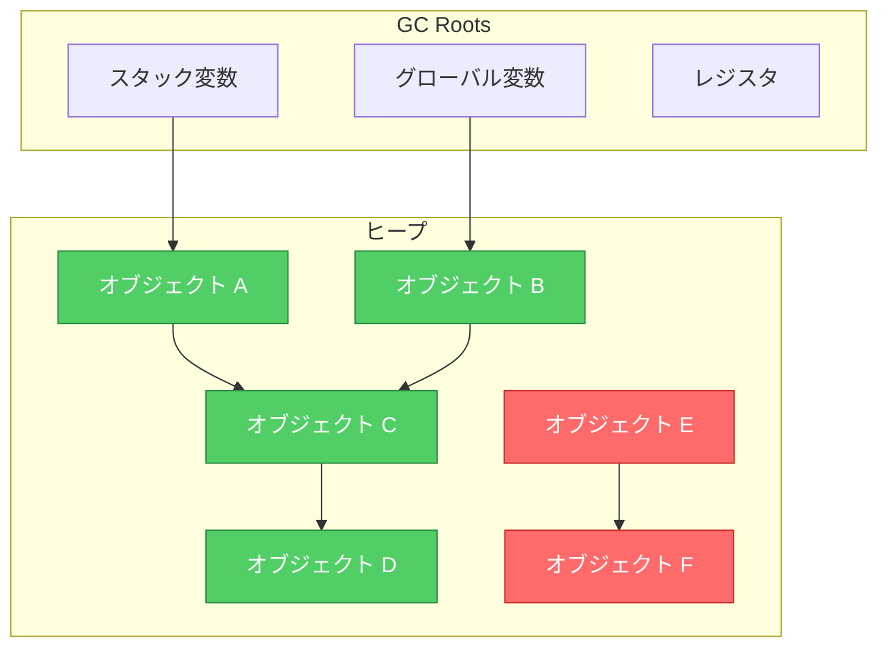
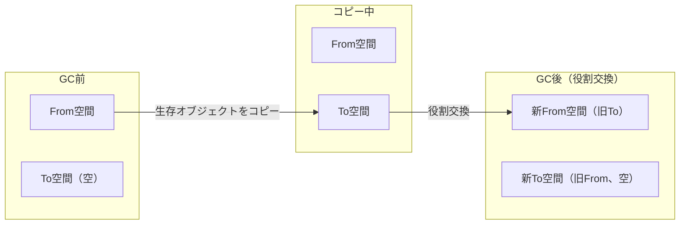
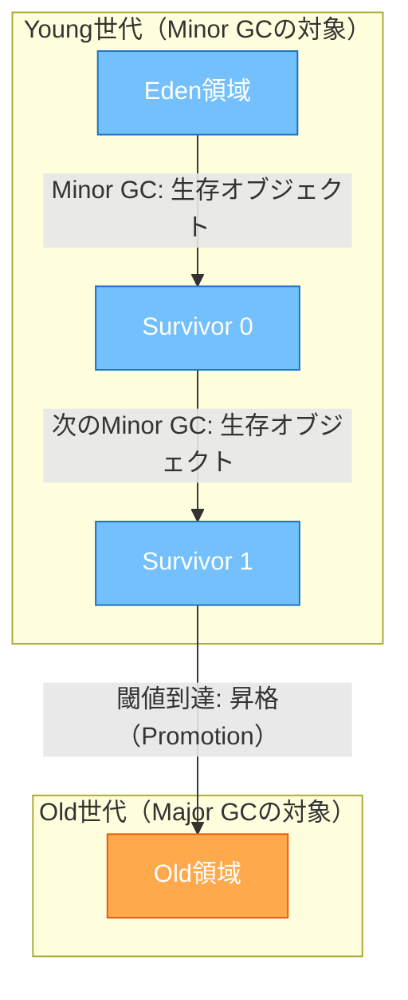
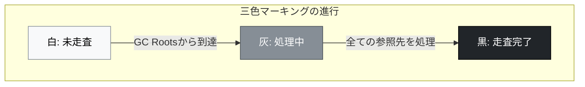
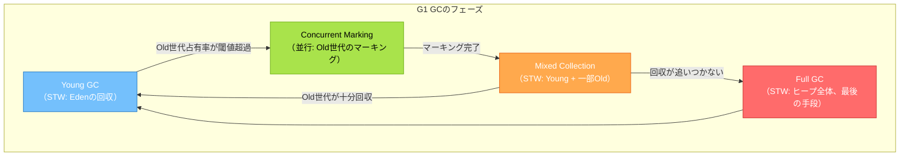
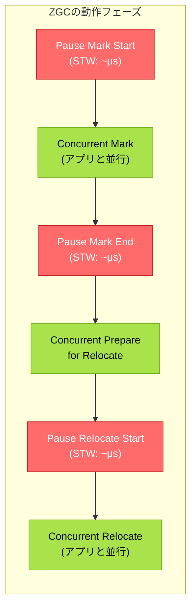
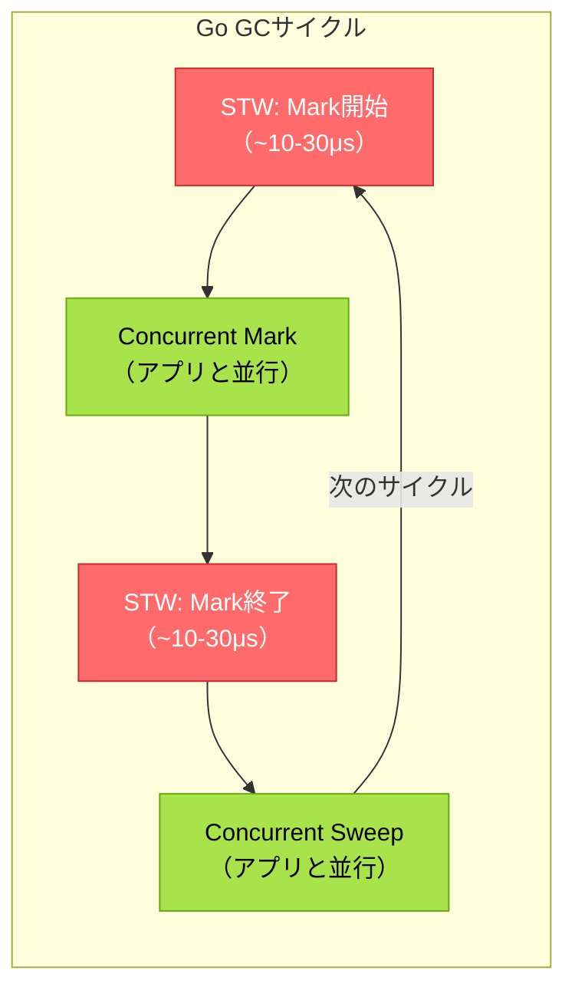
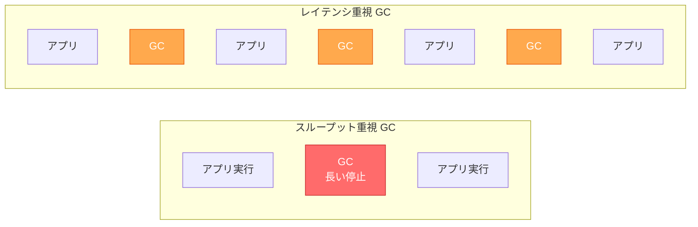

# ガベージコレクション

## 1. 背景と動機 — なぜ自動メモリ管理が必要なのか

### 1.1 手動メモリ管理の時代

コンピュータプログラムが動作するためにはメモリが必要である。変数の値、データ構造、関数呼び出しの情報 — あらゆるものがメモリ上に配置される。プログラミング言語の歴史において、このメモリをどのように管理するかという問題は常に中心的な課題であった。

CやC++に代表される言語では、プログラマが `malloc` / `free`（C）や `new` / `delete`（C++）を用いて明示的にメモリの確保と解放を行う。この手動メモリ管理（manual memory management）は、プログラマに完全な制御権を与える一方で、以下のような深刻な問題を引き起こす。

**ダングリングポインタ（dangling pointer）**：既に解放されたメモリ領域を指すポインタ。そのポインタを通じてメモリにアクセスすると、未定義動作が発生する。

```c
int *p = malloc(sizeof(int));
*p = 42;
free(p);
// p is now a dangling pointer
printf("%d\n", *p);  // undefined behavior
```

**メモリリーク（memory leak）**：確保したメモリを解放し忘れること。長時間稼働するサーバーアプリケーションでは、メモリリークの蓄積がやがてシステム全体を不安定にする。

```c
void process_request() {
    char *buf = malloc(1024);
    // ... process ...
    if (error_occurred) {
        return;  // memory leak: buf is never freed
    }
    free(buf);
}
```

**二重解放（double free）**：同じメモリ領域を2回解放すること。ヒープ管理のデータ構造が破壊され、セキュリティ脆弱性に直結する。

これらのバグは、発生しても直ちにクラッシュするとは限らず、時間差を置いて予期しない場所で症状が現れることが多い。デバッグは極めて困難であり、Microsoftの調査（2019年）では、同社製品におけるセキュリティ脆弱性の約70%がメモリ安全性に関連するバグであったと報告されている。

### 1.2 John McCarthyとLispの発明

1958年、MITのJohn McCarthyは、人工知能研究のためのプログラミング言語**Lisp**を設計した。Lispではリスト構造が動的に生成・連結・分解されるため、手動でメモリ管理を行うことは現実的でなかった。McCarthyは、プログラマの代わりにシステムが自動的に不要なメモリを回収する仕組みを考案した。これが世界初の**ガベージコレクション（Garbage Collection, GC）** である。

McCarthyの洞察は単純かつ強力であった。

> **プログラムから到達可能（reachable）なオブジェクトは「生きている」。到達不可能なオブジェクトは「ゴミ」であり、安全に回収できる。**

この基本原理は、60年以上経った現在でもGCの根幹をなしている。Java、Python、Go、JavaScript、C#、Ruby、Kotlin、Swift（部分的） — 現代の主要言語の大半がGCまたは自動メモリ管理を採用しているのは、手動管理の複雑さとリスクからプログラマを解放するためである。

### 1.3 GCの基本的な考え方

GCの動作を理解するには、プログラムのメモリ空間を有向グラフとして捉えるのが有効である。



上図において、**GC Roots**（スタック変数、グローバル変数、CPUレジスタ）から参照の連鎖をたどって到達できるオブジェクト（A, B, C, D）は生存しているとみなされる。一方、GC Rootsからどのような経路をたどっても到達できないオブジェクト（E, F）はゴミであり、回収対象となる。E→Fという参照が存在しても、E自体に到達できないため、Fも回収される。

この「到達可能性（reachability）」に基づく判定は、GCの正当性を保証する重要な性質を持つ。到達不可能なオブジェクトは、プログラムの今後の実行において決して参照されないことが保証されるため、回収しても安全である。

## 2. GCの基本戦略

GCのアルゴリズムは、到達可能性の判定方法と、回収後のメモリ整理方法によって分類される。ここでは3つの基本戦略を解説する。

### 2.1 Mark-Sweep

**Mark-Sweep**は、McCarthyが1960年に発表した最も古典的なGCアルゴリズムであり、GCの基本形といえる。名前が示すとおり、**Mark**（マーク）と**Sweep**（スイープ）の2つのフェーズからなる。

**Markフェーズ**：GC Rootsから出発し、参照をたどって到達可能なオブジェクトすべてに「生存」のマークを付ける。これは本質的にグラフの探索（深さ優先探索または幅優先探索）である。

**Sweepフェーズ**：ヒープ全体を走査し、マークが付いていないオブジェクトをフリーリストに返却する。マークが付いたオブジェクトのマークはクリアされ、次回のGCに備える。

```
Mark-Sweep の動作:

Markフェーズ（GC Rootsから到達可能なオブジェクトにマーク）:
+---+---+---+---+---+---+---+---+---+---+
| A*| B | C*| D | E*| F | G*| H | I | J |
+---+---+---+---+---+---+---+---+---+---+
  *=マーク済み（到達可能）

Sweepフェーズ（マークなしのオブジェクトを解放）:
+---+---+---+---+---+---+---+---+---+---+
| A |   | C |   | E |   | G |   |   |   |
+---+---+---+---+---+---+---+---+---+---+
       ↓       ↓       ↓       ↓   ↓   ↓
      フリーリストに追加
```

Mark-Sweepの擬似コードは以下のとおりである。

```python
def mark_sweep():
    # Mark phase
    worklist = list(gc_roots)
    while worklist:
        obj = worklist.pop()
        if not obj.marked:
            obj.marked = True
            for ref in obj.references:
                if ref is not None and not ref.marked:
                    worklist.append(ref)

    # Sweep phase
    for obj in heap:
        if obj.marked:
            obj.marked = False  # reset for next GC cycle
        else:
            free(obj)  # reclaim memory
```

**利点**：

- 実装が比較的単純
- オブジェクトを移動しないため、ポインタの書き換えが不要
- 循環参照も正しく回収できる（到達可能性に基づくため）

**欠点**：

- Sweepフェーズ後にメモリが断片化する（外部断片化）
- GC実行中はアプリケーションが停止する（Stop-the-World）
- ヒープ全体を走査するため、ヒープサイズに比例した時間がかかる

### 2.2 Mark-Compact

**Mark-Compact**は、Mark-Sweepの断片化問題を解決するアルゴリズムである。Markフェーズの後、生存オブジェクトをヒープの一端にコンパクションする（詰め寄せる）。

```
Mark-Compact の動作:

Markフェーズ後:
+---+---+---+---+---+---+---+---+---+---+
| A*|   | C*|   | E*|   | G*|   |   |   |
+---+---+---+---+---+---+---+---+---+---+

Compactフェーズ（生存オブジェクトを先頭に詰める）:
+---+---+---+---+---+---+---+---+---+---+
| A | C | E | G |   |   |   |   |   |   |
+---+---+---+---+---+---+---+---+---+---+
                ↑
           フリーポインタ（ここから先が空き）
```

コンパクション後は、フリーポインタより先のメモリがすべて連続した空き領域となる。新たなオブジェクトの割り当ては、フリーポインタを前進させるだけで済む（バンプポインタアロケーション）。これは `malloc` のフリーリスト探索と比較して非常に高速である。

**利点**：

- メモリの断片化が発生しない
- アロケーションがバンプポインタで高速
- キャッシュの局所性が向上する（関連オブジェクトが近接配置される傾向）

**欠点**：

- 生存オブジェクトの移動が必要であり、参照先のポインタをすべて更新しなければならない
- Mark-Sweepと比較して処理コストが高い（コンパクション自体がO(n)の追加コスト）

### 2.3 Copying GC（セミスペースGC）

**Copying GC**は、ヒープを**From空間**と**To空間**の2つに分割し、生存オブジェクトをFrom空間からTo空間にコピーすることでGCを実行する。コピー完了後、From空間とTo空間の役割を交換する。



このアルゴリズムはCheneyの方式（1970年）が有名であり、幅優先探索を用いてTo空間自体をキューとして利用するエレガントな実装が知られている。

```
Copying GC の動作:

GC前:
From空間: [A][  ][C][  ][E][  ][G][  ]
To空間:   [                            ]

コピー後:
From空間: [A][  ][C][  ][E][  ][G][  ]  ← 全体を解放
To空間:   [A][C][E][G][                ]
                      ↑
                 フリーポインタ

役割交換後:
From空間: [A][C][E][G][                ]  ← 現在のヒープ
To空間:   [                            ]  ← 次回GC用
```

**利点**：

- コンパクションと同等の効果（断片化なし、バンプポインタアロケーション）
- 生存オブジェクトのみをコピーするため、ゴミが多い場合は非常に高速
- Mark-Compactと異なり、1パスでコピーと参照更新を同時に行える

**欠点**：

- ヒープの半分しか使えない（メモリ利用効率50%）
- 生存オブジェクトが多い場合はコピーコストが大きい

### 2.4 基本戦略の比較

| 特性 | Mark-Sweep | Mark-Compact | Copying GC |
|------|-----------|-------------|------------|
| 断片化 | あり | なし | なし |
| アロケーション速度 | フリーリスト（遅い） | バンプポインタ（速い） | バンプポインタ（速い） |
| オブジェクト移動 | なし | あり | あり |
| メモリ利用効率 | 高い | 高い | 50%（半分が無駄） |
| ゴミが多い場合のGC速度 | 遅い（全走査） | 遅い（全走査+コンパクション） | 速い（コピー量が少ない） |
| 生存が多い場合のGC速度 | 速い（マークのみ） | 遅い（コンパクション大） | 遅い（コピー量が大） |

現代のGC実装は、これらの基本戦略を単独で使うのではなく、状況に応じて組み合わせて使用する。その最も重要な組み合わせが、次に述べる世代別GCである。

## 3. 世代別GC（Generational GC）

### 3.1 弱い世代仮説

1984年、David Ungarは自身のSmalltalk処理系（Generation Scavenging）の論文において、プログラムのメモリ使用パターンに関する経験的な観察を体系化した。これが**弱い世代仮説（Weak Generational Hypothesis）** として知られるものである。

> **ほとんどのオブジェクトは若くして死ぬ（Most objects die young）。**

具体的には、新しく生成されたオブジェクトの大半は、非常に短い期間のうちに到達不可能になるということである。一方、長期間生存しているオブジェクトは、その後も生存し続ける傾向がある。

この仮説は多くの実プログラムにおいて成立することが確認されている。例えば、以下のようなパターンは日常的に見られる。

```java
// temporary object: dies immediately after method returns
String result = firstName + " " + lastName;

// intermediate objects in stream operations
list.stream()
    .map(x -> x.toString())     // temporary String objects
    .filter(s -> s.length() > 3) // temporary lambda/predicate objects
    .collect(Collectors.toList());
```

メソッド呼び出しの途中で一時的に生成される文字列やイテレータ、ラッパーオブジェクトなどは、メソッドの終了とともに不要になる。このようなオブジェクトが全体の80〜95%を占めるという報告が多い。

### 3.2 世代別GCの基本構造

弱い世代仮説に基づき、世代別GCはヒープを**世代（generation）** に分割する。最も一般的な構成は、**Young世代**と**Old世代**の2世代構成である。



**Young世代**はさらに**Eden**領域と2つの**Survivor**領域に分割される（JVMの場合）。動作は以下のとおりである。

1. 新しいオブジェクトはEden領域に割り当てられる
2. Eden領域が満杯になると**Minor GC**が発生する
3. Minor GCでは、Eden領域とアクティブなSurvivor領域の生存オブジェクトを、もう一方のSurvivor領域にコピーする（Copying GC）
4. 複数回のMinor GCを生き延びたオブジェクト（年齢が閾値に達したもの）は、Old世代に**昇格（promotion）** される
5. Old世代が満杯になると**Major GC**（またはFull GC）が発生する

### 3.3 なぜ世代別GCが効率的なのか

世代別GCが効率的である理由は、弱い世代仮説から直接導かれる。

**Minor GCのコスト = 生存オブジェクトのコピー量に比例する。** Young世代のオブジェクトの大半が短命であるならば、Minor GCごとにコピーする量は少なく、GC時間も短い。

**Minor GCの頻度はOld世代のサイズに依存しない。** Young世代のサイズだけが重要であるため、ヒープ全体が巨大であっても、Minor GCの停止時間は短く保てる。

具体的な数値例で考えてみよう。Young世代が256MBで、Minor GCの時点で生存しているオブジェクトが5%（約13MB）だったとする。コピーGCのコストは生存オブジェクト量に比例するため、13MBのコピーで済む。一方、Old世代が4GBあっても、Minor GCはOld世代を走査しないため、停止時間に影響しない。

### 3.4 Write BarrierとRemembered Set

世代別GCには一つ重要な技術的課題がある。Minor GCの際、Young世代のみを対象としてGC Rootsから到達可能性を判定するが、**Old世代からYoung世代への参照**が存在する場合、その参照をたどらないとYoung世代の生存オブジェクトを見落としてしまう。

```
Old世代のオブジェクトXが、Young世代のオブジェクトYを参照:

   Old世代          Young世代
  +------+         +------+
  |  X   |-------->|  Y   |
  +------+         +------+

Minor GCでOld世代を走査しない場合、
Yは到達不可能と誤判定され回収されてしまう！
```

この問題を解決するために、**Write Barrier**と**Remembered Set**（または**Card Table**）が使用される。

**Write Barrier**とは、ポインタの書き込み（参照の設定）が行われるたびに実行される小さなコードフラグメントである。Old世代からYoung世代への参照が生じた場合、その参照を**Remembered Set**に記録する。

```java
// Write Barrier (pseudocode)
void write_barrier(Object *parent, Object *child) {
    *field = child;  // actual write
    if (is_old(parent) && is_young(child)) {
        remembered_set.add(parent);  // record cross-generational reference
    }
}
```

Minor GCの際には、GC Rootsに加えてRemembered Setに記録されたOld世代のオブジェクトもルートとして扱うことで、Young世代の生存オブジェクトを正しく特定できる。

JVMの**Card Table**は、Remembered Setの効率的な実装の一つである。Old世代を512バイト単位の「カード」に分割し、各カードに対して1バイトのフラグを持つ。Old→Youngの参照書き込みがあったカードは「dirty」としてマークされ、Minor GCの際にはdirtyなカードのみを走査すれば良い。

```
Card Table:
Old世代:  |  Card 0  |  Card 1  |  Card 2  |  Card 3  | ...
Card Table: [clean]    [dirty]    [clean]    [dirty]    ...

Minor GCではdirtyなカード（Card 1, Card 3）のみ走査
```

## 4. 並行・並列GC（Concurrent GC）

### 4.1 Stop-the-Worldの問題

これまで説明したGCアルゴリズムは、GC実行中にアプリケーションの全スレッドを停止させる**Stop-the-World（STW）** 方式を前提としている。GCがヒープを走査している間にアプリケーションがオブジェクトの参照を変更すると、到達可能性の判定が不正確になるためである。

しかし、ヒープサイズが数十GBに達する現代のアプリケーションにおいて、長いSTW停止は致命的である。

- **Webサービス**：数百ミリ秒のGC停止がSLAの99パーセンタイルレイテンシを悪化させる
- **金融トレーディング**：マイクロ秒単位のレイテンシが求められる場合、ミリ秒単位のSTWは許容できない
- **ゲームサーバー**：16ms（60fps）以内にフレーム処理を完了する必要がある

並行GC（Concurrent GC）は、アプリケーションの実行と並行してGCを行うことで、STW停止を最小化する技術である。

### 4.2 三色マーキング（Tri-color Marking）

並行GCの理論的基盤となるのが、Dijkstraらが1978年に提案した**三色マーキング（Tri-color Marking）** の抽象化である。ヒープ上のオブジェクトを以下の3色に分類する。

- **白（White）**：まだ走査されていないオブジェクト。GC完了時に白のままのオブジェクトはゴミ
- **灰（Gray）**：自身はマークされたが、参照先のオブジェクトはまだすべて走査されていないオブジェクト
- **黒（Black）**：自身もその参照先もすべてマーク済みのオブジェクト



Mark フェーズの開始時、GC Rootsから直接参照されるオブジェクトを灰色にする。その後、灰色のオブジェクトを一つ選び、その参照先を灰色にしてから自身を黒色にする。灰色のオブジェクトがなくなった時点でMarkフェーズは完了し、白のまま残ったオブジェクトがゴミである。

三色マーキングは、**不変条件（invariant）** として以下を維持する。

> **黒いオブジェクトから白いオブジェクトへの直接の参照は存在しない。**

この不変条件が維持される限り、灰色のオブジェクトがすべて黒くなった時点で、白いオブジェクトは到達不可能であることが保証される。

### 4.3 並行GCにおけるWrite Barrier

並行GCでは、アプリケーション（**ミューテータ**と呼ばれる）がGCと同時にオブジェクトの参照を変更する。これにより、三色不変条件が破られる危険がある。

具体的に問題が起きるシナリオを示す。

```
1. GCがオブジェクトAを走査済み（黒）。Aの参照先Bも走査済み（黒）。
2. ミューテータが A.field = C（白）に変更（AからCへの新しい参照）
3. ミューテータが B.field = null に変更（BからCへの唯一の参照を切断）
4. GCはAを再走査しない（黒だから）
5. Cに到達する経路がないとGCが判断し、Cを回収 → ダングリングポインタ！
```

この問題を防ぐために、2種類のWrite Barrierが使われる。

**Dijkstra式 Write Barrier（Snapshot-at-the-beginning）**：参照の書き込み時に、新たに参照されるオブジェクトを灰色にする。これにより、白→灰色の遷移を強制し、黒→白の参照が生じないようにする。

```python
def dijkstra_write_barrier(obj, field, new_ref):
    if new_ref is not None and new_ref.color == WHITE:
        new_ref.color = GRAY  # shade the new referent
        worklist.add(new_ref)
    obj.field = new_ref
```

**Yuasa式 Write Barrier（Snapshot-at-the-beginning の変種）**：参照の上書き時に、上書き前の古い参照先を灰色にする。GC開始時のスナップショットにおいて生存していたオブジェクトの回収を防ぐ。

```python
def yuasa_write_barrier(obj, field, new_ref):
    old_ref = obj.field
    if old_ref is not None and old_ref.color == WHITE:
        old_ref.color = GRAY  # shade the old referent
        worklist.add(old_ref)
    obj.field = new_ref
```

両方のアプローチとも**保守的**であり、実際にはゴミであるオブジェクトを1サイクル余分に生存させる可能性がある（**浮遊ゴミ: floating garbage**）。しかし、生存オブジェクトを誤って回収することは決してない。これはGCにおいて最も重要な安全性の保証である。

### 4.4 並行GCと並列GCの違い

用語を整理しておく。

- **並列GC（Parallel GC）**：複数のGCスレッドがSTW停止中に並列に作業する。アプリケーションは停止している。
- **並行GC（Concurrent GC）**：GCスレッドがアプリケーションスレッドと同時に実行される。STW停止を最小化する。
- **インクリメンタルGC（Incremental GC）**：GCの作業を小さな単位に分割し、アプリケーションの実行と交互に行う。

現代の高性能GCは、これらを組み合わせて使用する。例えば「Mostly Concurrent, Partially Parallel」（大部分は並行だが、一部の作業はSTW中に並列で実行する）という方式が一般的である。

## 5. 具体的なGC実装

### 5.1 JVM: G1 GC

**G1 GC（Garbage-First Garbage Collector）** は、2004年にSun Microsystems（後にOracle）のDetlef Detlefsらが論文で発表し、Java 7u4で導入、Java 9以降はデフォルトのGCとなった。G1は、従来の世代別GCとリージョンベースのアプローチを組み合わせた設計が特徴である。

**リージョンベースのヒープ管理**

G1はヒープを固定サイズの**リージョン（Region）**（通常1〜32MB）に分割する。各リージョンはEden、Survivor、Oldのいずれかの役割を動的に割り当てられる。

```
G1 GC のヒープレイアウト:

+---+---+---+---+---+---+---+---+---+---+---+---+
| E | E | S | O | O | E | O | H | H |   | O | E |
+---+---+---+---+---+---+---+---+---+---+---+---+
  E = Eden    S = Survivor    O = Old    H = Humongous     = 空き

リージョンの役割は動的に変化する
```

**Garbage-First戦略**

G1の名前の由来は、「ゴミが最も多いリージョンを最初に回収する」という戦略にある。各リージョンの生存率を追跡し、回収効率の高い（ゴミの多い）リージョンから優先的に回収する。これにより、限られた時間内で最大限のメモリを回収できる。

**停止時間目標**

G1の最大の特徴は、ユーザーが指定した**停止時間目標（pause time target）** に収まるようにGCの作業量を調整することである。`-XX:MaxGCPauseMillis=200`（デフォルト200ms）のように指定すると、G1はその目標に収まるように回収するリージョンの数を調整する。



### 5.2 JVM: ZGC

**ZGC（Z Garbage Collector）** は、Oracleが開発し、Java 11で実験的に導入、Java 15で本番対応（Production Ready）となった超低レイテンシGCである。Java 21からは世代別ZGC（Generational ZGC）がデフォルトモードとなった。

**設計目標**

ZGCの設計目標は明確であり、従来のGCとは一線を画している。

- **停止時間が1ミリ秒未満**（ヒープサイズに依存しない）
- テラバイト規模のヒープに対応
- スループットの低下を15%以内に抑える

**Colored Pointer（カラーポインタ）**

ZGCの最も特徴的な技術は**Colored Pointer**（着色ポインタ）である。64ビットのオブジェクト参照のうち、上位ビットにメタデータを格納する。

```
ZGC Colored Pointer（64ビット）:

 63                              47 46 45 44 43 42 41      0
+----------------------------------+--+--+--+--+--+--------+
|          未使用                  |  メタデータビット  | オフセット |
+----------------------------------+--+--+--+--+--+--------+
                                    |  |  |  |  |
                                    |  |  |  |  +-- Remapped
                                    |  |  |  +----- Marked1
                                    |  |  +-------- Marked0
                                    |  +----------- Finalizable
                                    +-------------- 未使用
```

Colored Pointerにより、オブジェクトへのアクセス時にGCの状態を即座に判断できる。これは**Load Barrier**（後述）と組み合わせて使用される。

**Load Barrier**

ZGCは従来のWrite Barrierではなく、**Load Barrier**を使用する。オブジェクト参照を**読み込む**（load）たびに、その参照が正しい状態かどうかをチェックし、必要に応じて修正する。

```java
// Load Barrier (pseudocode)
Object load_barrier(Object *ref) {
    Object obj = *ref;
    if (is_bad_color(obj)) {
        // slow path: relocate or remap the reference
        obj = gc_relocate_or_remap(obj);
        *ref = obj;  // self-healing: fix the reference in place
    }
    return obj;
}
```

Load Barrierの重要な特性は**Self-Healing**（自己修復）である。一度修正された参照は次回以降のLoad Barrierでスローパスに入らないため、GCが進行するにつれてLoad Barrierのオーバーヘッドは自動的に減少する。

**並行リロケーション**

ZGCは、オブジェクトの移動（リロケーション）をアプリケーションスレッドと並行して実行する。これを可能にしているのがColored PointerとLoad Barrierの組み合わせである。



3回のSTW停止はいずれもGC Rootsの処理のみであり、ヒープサイズに依存せず一定時間（通常サブミリ秒）で完了する。ヒープの走査やオブジェクトの移動はすべて並行フェーズで行われる。

**世代別ZGC（Java 21以降）**

Java 21で導入された世代別ZGCは、従来のZGCに世代別管理を追加したものである。Young世代とOld世代にそれぞれ独立したGCサイクルを持ち、Young世代の回収をより頻繁に行うことで、メモリ効率とスループットが大幅に向上した。

### 5.3 JVM: Shenandoah

**Shenandoah**は、Red Hatが開発したもう一つの超低レイテンシGCである。ZGCと同様にSTW停止をヒープサイズに依存しない定数時間に抑えることを目標としている。

ShenandoahとZGCの技術的な違いは以下のとおりである。

**Brooks Pointer**：Shenandoahは各オブジェクトにフォワーディングポインタ（Brooks Pointer）を追加する。オブジェクトが移動された場合、旧アドレスのフォワーディングポインタが新アドレスを指す。

```
Brooks Pointer:

移動前:
+-------------------+------------------+
| Forwarding Ptr    | Object Data      |
| (self-referencing)|                  |
+-------------------+------------------+
       ↓
  自分自身を指す

移動後:
旧アドレス:
+-------------------+------------------+
| Forwarding Ptr    | (stale data)     |
| → 新アドレス      |                  |
+-------------------+------------------+
       ↓
新アドレス:
+-------------------+------------------+
| Forwarding Ptr    | Object Data      |
| (self-referencing)|                  |
+-------------------+------------------+
```

ShenandoahはLoad BarrierではなくWrite Barrierとの組み合わせを用いる点でZGCと異なる（Shenandoah 2.0以降はLoad参照バリアに移行）。内部の実装戦略は異なるが、達成する性能特性はZGCと同等クラスである。

### 5.4 Go: Concurrent Mark-Sweep

GoのGCは、そのシンプルさが際立っている。世代別GCを採用せず、**非世代別の並行Mark-Sweep**を使用する。

**Goが世代別GCを採用しない理由**

Goのランタイムチームは、以下の理由から世代別GCを採用しないという判断を下している。

1. **コンパイラのエスケープ解析**：Goのコンパイラは高度なエスケープ解析を行い、関数のスコープを超えないオブジェクトをスタック上に割り当てる。これにより、短命なオブジェクトの多くがそもそもヒープに到達しないため、世代別GCの「短命オブジェクトの高速回収」という利点が薄れる。

2. **値型のサポート**：Goの構造体は値型であり、スライスやマップの要素として直接（ポインタ経由でなく）格納される。これにより、ヒープ上のオブジェクト数自体が減り、GCの負荷が軽減される。

3. **Write Barrierのコスト回避**：世代別GCに必要なWrite Barrierは、すべてのポインタ書き込みに追加コストを課す。Goのランタイムチームは、このコストを回避することを選択した。

**Goの並行GCの動作**

GoのGCは、三色マーキングをベースとした並行Mark-Sweepを実装している。



**GOGC環境変数**：GoのGCの振る舞いは `GOGC` 環境変数で制御する。デフォルト値は100であり、ヒープ使用量が前回のGC後のライブデータの2倍に達したときにGCが発動する。`GOGC=200` にすると、3倍に達するまで待つ（GC頻度が減るがメモリ使用量は増える）。

Go 1.19では**Soft Memory Limit**（`GOMEMLIMIT`）が導入され、メモリ上限をバイト単位で指定できるようになった。これにより、コンテナ環境でのメモリ管理がより精密に行えるようになった。

### 5.5 .NET: Generational GC

.NET（CLR: Common Language Runtime）は、3世代のGenerational GCを実装している。

- **Gen 0**：新しいオブジェクト。サイズは小さく（通常256KB〜数MB）、頻繁にGCされる
- **Gen 1**：Gen 0のGCを生き延びたオブジェクト。Gen 0とGen 2の間のバッファ的役割
- **Gen 2**：長寿命オブジェクト。サイズが最も大きく、GC頻度は低い

.NETのGCには2つの動作モードがある。

**Workstation GC**：シングルスレッドでGCを実行。クライアントアプリケーション向け。

**Server GC**：CPUコアごとに専用のヒープとGCスレッドを持つ。サーバーアプリケーション向けにスループットを最大化する設計。

.NET 5以降では**Region-based GC**が導入され、従来のセグメントベースの管理からリージョンベースの管理に移行した。これはG1 GCと類似したアプローチであり、メモリの効率的な利用とGC停止時間の短縮を両立させている。

## 6. GCの性能特性

### 6.1 スループット vs レイテンシ

GCの性能を評価する際、**スループット**と**レイテンシ**という2つの指標が重要である。両者はトレードオフの関係にある。

**スループット**：アプリケーションコードの実行に使われる時間の割合。例えば、100秒間のうち95秒がアプリケーションの実行、5秒がGCに費やされた場合、スループットは95%である。

**レイテンシ**：GCによるSTW停止の長さ。アプリケーションの応答性に直結する。



各GCの位置づけを以下に示す。

| GC | スループット | 最大停止時間 | ヒープサイズ |
|----|------------|------------|------------|
| Parallel GC（JVM） | 最高 | 数百ms〜数秒 | 〜数十GB |
| G1 GC | 高い | 数十ms〜200ms | 〜数百GB |
| ZGC | やや低い | < 1ms | 〜16TB |
| Shenandoah | やや低い | < 10ms | 〜数TB |
| Go GC | 中程度 | < 1ms | 〜数百GB |

### 6.2 メモリフットプリント

GCには、アプリケーションのデータ以外にもメモリを消費する要素がある。

- **GCメタデータ**：マークビットマップ、Remembered Set、Card Table など
- **コピー先の予約領域**：Copying GCでは、From空間と同じサイズのTo空間が必要
- **フラグメンテーション**：Mark-Sweepでは断片化によりメモリの有効利用率が低下
- **ライブデータと次回GCまでの猶予**：GC発動のタイミングを遅らせるためには、余分なヒープが必要

一般的に、GCを使用するプログラムは、同等の機能を持つ手動メモリ管理のプログラムと比較して、1.5〜3倍のメモリを消費する。

### 6.3 スケーラビリティ

GCのスケーラビリティには複数の側面がある。

**ヒープサイズのスケーラビリティ**：ヒープが大きくなるとGCの作業量が増える。Mark-Sweep系のGCでは、Markフェーズは生存オブジェクトの量に比例し、Sweepフェーズはヒープ全体のサイズに比例する。ZGCやShenandoahは、並行処理により大規模ヒープでも短い停止時間を実現する。

**CPUコア数のスケーラビリティ**：並列GCは複数のCPUコアを活用してGCの作業を高速化する。しかし、GCスレッドがCPUリソースをアプリケーションから奪うため、スループットが低下する可能性がある。

**アロケーションレートのスケーラビリティ**：アプリケーションのオブジェクト生成速度がGCの回収速度を上回ると、GCが追いつかなくなる。この状況を**アロケーション失速（allocation stall）** と呼ぶ。

## 7. GCチューニングの考え方

### 7.1 チューニングの前に

GCチューニングは、以下の前提が満たされてから行うべきである。

1. **アプリケーションのプロファイリングが完了している**：GCが本当にボトルネックであることを確認する。多くの場合、GC以外の部分（アルゴリズムの非効率性、I/O待ち、ロック競合など）がボトルネックである。

2. **不必要なオブジェクト生成を削減している**：GCチューニングの前に、そもそも不要なオブジェクト生成を減らすことが最も効果的である。

3. **GCログを取得・分析している**：JVMでは `-Xlog:gc*` オプションでGCログを取得できる。GCの頻度、停止時間、ヒープ使用量の推移を分析してから、チューニングに着手する。

### 7.2 JVMにおけるGCチューニングの基本

JVMにおけるGCチューニングの主要なパラメータを以下に示す。

**ヒープサイズ**

```bash
# minimum and maximum heap size
java -Xms4g -Xmx4g -jar app.jar

# setting Xms == Xmx avoids heap resizing overhead
```

`-Xms`（初期ヒープサイズ）と `-Xmx`（最大ヒープサイズ）を同じ値に設定することで、ヒープのリサイズによるオーバーヘッドを回避できる。

**GCの選択**

```bash
# G1 GC (default since Java 9)
java -XX:+UseG1GC -jar app.jar

# ZGC (recommended for latency-sensitive applications)
java -XX:+UseZGC -jar app.jar

# Parallel GC (best throughput)
java -XX:+UseParallelGC -jar app.jar
```

**G1 GCの主要パラメータ**

```bash
java -XX:+UseG1GC \
     -XX:MaxGCPauseMillis=100 \    # target pause time
     -XX:G1HeapRegionSize=16m \    # region size
     -XX:InitiatingHeapOccupancyPercent=45 \  # start concurrent mark
     -jar app.jar
```

**ZGCの主要パラメータ**

```bash
java -XX:+UseZGC \
     -XX:+ZGenerational \          # use generational ZGC (default in Java 21+)
     -XX:SoftMaxHeapSize=4g \      # soft limit for heap size
     -jar app.jar
```

ZGCは設計上チューニングパラメータが少ない。ヒープサイズの設定以外に必要な調整はほとんどない。

### 7.3 GoにおけるGCチューニング

GoのGCチューニングは、JVMと比較して非常にシンプルである。

```bash
# GOGC: target heap growth ratio (default: 100)
# 100 means GC triggers when heap doubles since last GC
GOGC=200 ./myapp

# GOMEMLIMIT: soft memory limit (Go 1.19+)
GOMEMLIMIT=4GiB ./myapp

# disable GC (not recommended for production)
GOGC=off ./myapp
```

Go 1.19以降で推奨される設定は、`GOGC` と `GOMEMLIMIT` の組み合わせである。

```bash
# typical container configuration
GOGC=100 GOMEMLIMIT=3750MiB ./myapp
# container memory limit: 4GiB
# GOMEMLIMIT: ~93% of container memory (leave room for goroutine stacks, etc.)
```

### 7.4 チューニングのアンチパターン

**GCの頻度を下げるためだけにヒープを巨大にする**：ヒープを大きくするとGCの頻度は下がるが、1回のGC停止時間が長くなる（特にFull GCの場合）。レイテンシが悪化する可能性がある。

**GCパラメータを過度に調整する**：数十のパラメータを微調整しても、アプリケーションの特性が変化すれば最適値も変わる。シンプルな設定で始め、必要に応じて調整するのが賢明である。

**GCログを見ずにチューニングする**：推測に基づくチューニングは、問題を悪化させることが多い。まずGCログを取得・分析し、データに基づいて判断すべきである。

## 8. GCの限界と代替アプローチ

### 8.1 GCの本質的な限界

GCは多くの問題を解決するが、万能ではない。以下の本質的な限界がある。

**非決定的な停止時間**：並行GCでも、完全に停止時間をゼロにすることはできない。ハードリアルタイムシステム（航空機の制御システム、ペースメーカーなど）では、GCの非決定的な停止時間は許容されない。

**メモリオーバーヘッド**：前述のとおり、GCにはメタデータやコピー先領域などの追加メモリが必要である。メモリが極めて制約された環境（組み込みシステム、マイクロコントローラー）では、このオーバーヘッドが問題となる。

**リソースリーク**：GCはメモリの回収を自動化するが、ファイルハンドル、ネットワークソケット、データベース接続などの**非メモリリソース**の管理は行わない。これらのリソースのリークはGCでは防げない。

**ファイナライザの問題**：オブジェクトの解放時にクリーンアップ処理を行うファイナライザ（JavaのfinalizeメソッドやC#のデストラクタ）は、実行タイミングが不定であり、パフォーマンスにも悪影響を与える。Javaでは `finalize()` メソッドはJava 9で非推奨化、Java 18で廃止された。

### 8.2 参照カウント（Reference Counting）

**参照カウント**は、GCの代替となるメモリ管理手法である。各オブジェクトに参照カウンタを持たせ、参照が増えるとカウンタを増加、参照が減るとカウンタを減少させる。カウンタがゼロになったオブジェクトは即座に解放される。

```
参照カウントの動作:

a = Object()       # refcount = 1
b = a               # refcount = 2
a = None            # refcount = 1
b = None            # refcount = 0 → 即座に解放
```

**利点**：

- メモリの回収が即時に行われる（停止時間なし）
- デストラクタの実行タイミングが予測可能
- 実装が比較的シンプル

**欠点**：

- **循環参照を回収できない**：A→BとB→Aが互いに参照し合う場合、外部からの参照がなくても参照カウンタはゼロにならない
- カウンタの操作（特にマルチスレッド環境でのアトミック操作）のオーバーヘッド
- カウンタ格納のためのメモリオーバーヘッド

**Pythonの参照カウント+GC**：Pythonは参照カウントを主要なメモリ管理手法として使用し、循環参照を回収するための補助的なGC（世代別の循環参照検出器）を併用している。

**Swift/Objective-CのARC（Automatic Reference Counting）**：Appleの言語ランタイムでは、コンパイラが参照カウントの増減コードを自動的に挿入する。循環参照はプログラマが `weak` や `unowned` 参照を使って手動で解消する。

### 8.3 Rustの所有権モデル

**Rust**は、GCも参照カウントも使わずに、コンパイル時にメモリ安全性を保証する独自のアプローチを採用している。これが**所有権（ownership）** と**借用（borrowing）** のシステムである。

Rustの3つの原則：

1. **各値には唯一の所有者がいる**
2. **所有者がスコープを外れると、値は自動的に解放される**
3. **参照には排他的な可変参照（`&mut`）か、複数の不変参照（`&`）のいずれかしか許さない**

```rust
fn main() {
    let s1 = String::from("hello"); // s1 owns the String
    let s2 = s1;                     // ownership moved to s2
    // println!("{}", s1);           // compile error: s1 no longer valid

    let s3 = String::from("world");
    let len = calculate_length(&s3); // borrow s3 (immutable reference)
    println!("{} has length {}", s3, len); // s3 is still valid
} // s2 and s3 are dropped (freed) here

fn calculate_length(s: &String) -> usize {
    s.len()
} // s (the reference) goes out of scope, but doesn't drop the data
```

Rustのアプローチは、GCのオーバーヘッドを完全に排除し、C/C++と同等のパフォーマンスを実現する。一方で、所有権の規則に従うためにコードの書き方が制約され、学習コストが高いという側面がある。

### 8.4 リージョンベースメモリ管理

**リージョンベースメモリ管理**は、メモリを「リージョン」（アリーナとも呼ばれる）にグループ化し、リージョン単位で一括解放する手法である。リージョン内の個々のオブジェクトを個別に解放するのではなく、リージョンの生存期間が終わったときにリージョン全体を一度に解放する。

```
リージョンベース管理:

リージョンA（リクエスト処理用）:
+------+------+------+------+------+
| obj1 | obj2 | obj3 | obj4 | obj5 |
+------+------+------+------+------+

リクエスト完了時 → リージョン全体を一括解放
+------+------+------+------+------+
|  (free)                           |
+------+------+------+------+------+
```

この手法は、Webサーバーのリクエスト処理のように、一定の単位で生存期間がまとまるワークロードに適している。Apache HTTP Serverのメモリプール（apr_pool_t）や、Goの `arena` パッケージの実験的実装がこの手法に基づいている。

### 8.5 各アプローチの比較

| 特性 | トレーシングGC | 参照カウント | Rustの所有権 | リージョン |
|------|-------------|------------|-------------|---------|
| 循環参照の処理 | 自動 | 手動対処必要 | コンパイル時排除 | 一括解放 |
| 停止時間 | あり（並行GCで軽減） | なし | なし | なし |
| 実行時オーバーヘッド | あり | あり（カウンタ操作） | なし | なし |
| メモリオーバーヘッド | あり | あり（カウンタ） | なし | あり（早期解放不可） |
| プログラマの負担 | 低い | 中程度 | 高い | 中程度 |
| 適用領域 | 汎用 | 汎用 | システムプログラミング | 特定パターン |

## 9. 最新動向と今後

### 9.1 値型（Value Type）の導入

多くのGC言語において、値型（Value Type）の導入が進んでいる。Javaの**Project Valhalla**は、ヒープにオブジェクトとして割り当てるのではなく、スタックやインラインに配置できる「value class」の導入を目指している。値型はGCの対象とならないため、GC負荷の軽減に直結する。

```java
// Project Valhalla: value class (preview feature)
value class Point {
    int x;
    int y;
}

// no heap allocation, no GC overhead
Point p = new Point(1, 2);
```

C#の `struct`、Kotlinの `value class`、Swiftの `struct` は、すでにこの概念を実装している。

### 9.2 Epsilon GC（No-Op GC）

Java 11で導入された**Epsilon GC**は、「何もしないGC」である。メモリの割り当てのみを行い、回収は一切行わない。ヒープが枯渇するとOutOfMemoryErrorで終了する。

Epsilon GCの用途は限定的だが、以下のシナリオで有用である。

- **パフォーマンスベンチマーク**：GCのオーバーヘッドを除外した純粋なアプリケーション性能を測定する
- **短寿命のバッチ処理**：プロセスの生存期間中にヒープが枯渇しないことが分かっている場合
- **メモリ使用量の分析**：GCなしでどれだけのメモリが必要かを測定する

### 9.3 GCの理論的な方向性

GC研究は成熟期にあるが、いくつかの重要な方向性がある。

**ハードウェアとの協調**：GPUやFPGAを活用したGCの加速、NVRAMを考慮したGC設計など、ハードウェアの進化に合わせたGCの最適化が研究されている。

**予測可能性の向上**：機械学習を活用して、GCの発動タイミングやパラメータを動的に最適化する研究が進んでいる。アプリケーションのメモリ使用パターンを学習し、最適なGC戦略を自動選択する。

**コンパイル時のGC最適化**：Rustの所有権モデルに触発され、コンパイラが静的にオブジェクトの生存期間を分析し、GCの負荷を軽減する研究が進んでいる。Goのエスケープ解析や、JavaのScalarReplacementはこの方向性の初期的な実装例といえる。

### 9.4 選択の指針

GCの選択は、アプリケーションの要件に依存する。以下に指針を示す。

**レイテンシが最重要**（マイクロサービス、リアルタイム処理）：
→ ZGC、Shenandoah、またはGoの並行GC

**スループットが最重要**（バッチ処理、科学計算）：
→ Parallel GC、またはGCを使わないアプローチ（Rust）

**メモリ効率が最重要**（コンテナ環境、エッジデバイス）：
→ G1 GC（適切にチューニング）、または.NETのServer GC

**GCを避けたい**（システムプログラミング、組み込み）：
→ Rust、C/C++（手動管理）

どのGCを選択するにせよ、最も重要なのは**計測に基づく判断**である。GCログの分析、プロファイリング、ベンチマークを通じて、自分のアプリケーションに最適なGC設定を見つけることが、GCチューニングの本質である。

## まとめ

ガベージコレクションは、1958年のLispに端を発し、60年以上にわたって進化を続けてきた自動メモリ管理技術である。Mark-Sweep、Mark-Compact、Copying GCという基本戦略から、世代別GC、並行GC、そしてZGCやShenandoahのような超低レイテンシGCへと発展してきた。

GCの設計はつねにトレードオフの連続である。スループットとレイテンシ、メモリ効率と停止時間、実装の複雑さとプログラマの負担 — これらの間でバランスを取ることが、GC設計者の仕事である。

一方で、Rustの所有権モデルのように、GCを使わずにメモリ安全性を保証する代替アプローチも台頭している。GCとこれらの代替手法は、対立するものではなく、異なるトレードオフを選択した結果であり、アプリケーションの要件に応じて使い分けるべきものである。

McCarthyが60年以上前に示した「到達不可能なオブジェクトは安全に回収できる」という洞察は、今日のGCの根幹を依然としてなしている。その上に、世代仮説の活用、三色マーキングの理論、Load BarrierやColored Pointerといった技術が積み重ねられ、テラバイト規模のヒープでもサブミリ秒の停止時間を実現するに至った。メモリ管理の自動化は、ソフトウェアの信頼性と開発者の生産性を支える基盤技術であり続けるだろう。
