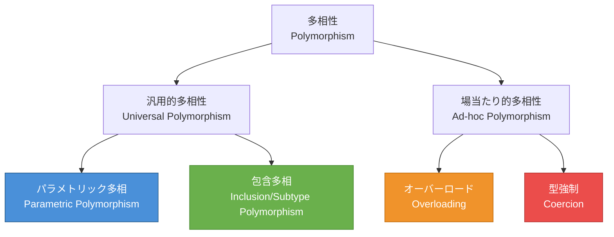
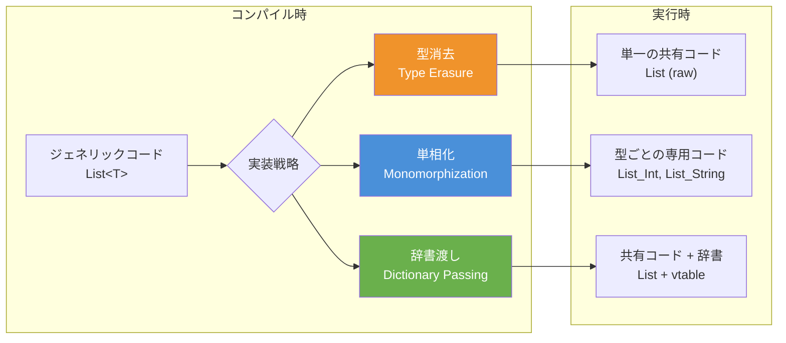
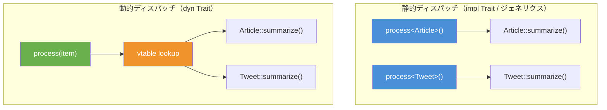
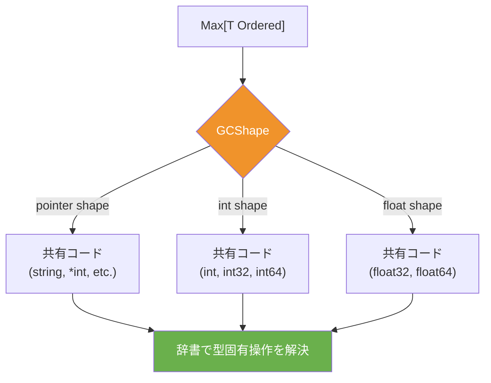
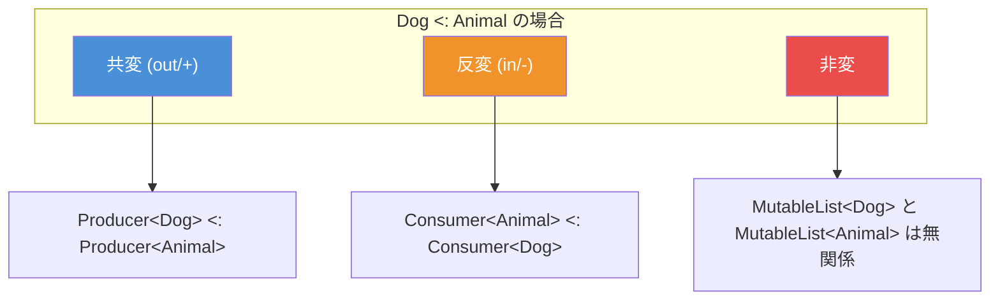
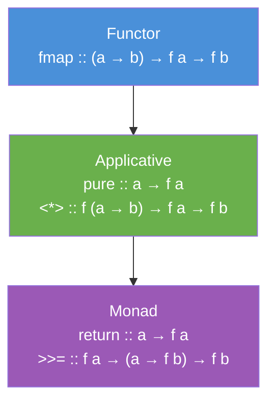

# ジェネリクスとパラメトリック多相

## なぜジェネリクスが必要なのか

プログラミングにおいて、同じ構造やアルゴリズムを異なる型に対して再利用したいという要求は極めて自然なものである。たとえば「要素のリスト」という概念は、整数のリストであろうと文字列のリストであろうと、その本質的な構造――先頭への追加、末尾への追加、長さの取得、反復処理――は同じである。

ジェネリクスが存在しない世界では、開発者は次のいずれかの妥協を強いられる。

1. **型ごとにコードを複製する**: `IntList`, `StringList`, `FloatList` のように型ごとに専用のデータ構造を実装する。コードの重複が爆発的に増え、保守が困難になる。
2. **汎用的な「何でも型」を使う**: Java の `Object` や C の `void*` のように、型情報を捨てて汎用的な入れ物を作る。型安全性が失われ、実行時エラーの温床となる。

ジェネリクス（Generics）は、この二律背反を解消するために生まれた言語機能である。**型をパラメータとして抽象化する**ことで、コードの再利用性と型安全性を両立させる。

```java
// Without generics: no type safety
List list = new ArrayList();
list.add("hello");
Integer n = (Integer) list.get(0); // Runtime ClassCastException

// With generics: compile-time type safety
List<String> list = new ArrayList<>();
list.add("hello");
String s = list.get(0); // No cast needed, type-safe
```

## 多相性の分類体系

ジェネリクスを深く理解するためには、多相性（Polymorphism）の分類体系を把握する必要がある。Christopher Strachey と Luca Cardelli による古典的な分類は、今なお多相性を理解する最良の枠組みである。



### パラメトリック多相（Parametric Polymorphism）

パラメトリック多相とは、型変数（type variable）を用いて、**あらゆる型に対して一様に動作する**コードを記述する能力である。関数やデータ構造が型パラメータによって抽象化され、具体的な型に依存しないアルゴリズムを表現できる。

パラメトリック多相の本質的な特性は **parametricity**（パラメトリシティ）である。これは、型パラメータに対して「中身を覗かない」という制約を課すことを意味する。型パラメータ `T` で抽象化された関数は、`T` の値を検査・生成・変更することができない。できるのは、渡された `T` の値をそのまま受け渡すことだけである。

```haskell
-- Haskell: parametric polymorphism
-- This function works for ANY type a
-- It cannot inspect, create, or modify values of type a
identity :: a -> a
identity x = x

-- The type signature tells us everything about what this function can do
-- It MUST return its input unchanged (by parametricity)
```

この性質から、**自由定理（free theorem）**と呼ばれる強力な推論が可能になる。Wadler の論文 "Theorems for Free!" (1989) で示されたように、パラメトリックな関数の型シグネチャだけから、その関数の振る舞いについて非自明な定理を導出できる。

::: tip 自由定理の例
型 `a -> a` を持つ関数は、恒等関数（identity function）しかあり得ない。なぜなら、型 `a` は任意の型であるため、その値を検査したり新しい値を生成したりする手段がないからである。受け取った値をそのまま返すことしかできない。
:::

### 包含多相（Subtype Polymorphism）

包含多相は、サブタイプ関係（subtyping relation）に基づく多相性である。型 `S` が型 `T` のサブタイプ（`S <: T`）であるとき、`T` が期待される場所で `S` の値を使用できる。オブジェクト指向プログラミングにおける継承がこれに対応する。

```java
// Subtype polymorphism: Animal <: Object, Dog <: Animal
Animal a = new Dog();  // Dog can be used where Animal is expected
a.speak();             // Dynamic dispatch to Dog.speak()
```

### アドホック多相（Ad-hoc Polymorphism）

アドホック多相は、型ごとに異なる実装を提供する多相性である。関数オーバーロードや演算子オーバーロードがこれに対応する。パラメトリック多相が「すべての型に対して同じ動作」であるのに対し、アドホック多相は「型ごとに異なる動作」を許す。

後述するように、Haskell の型クラスや Rust のトレイトは、パラメトリック多相とアドホック多相を巧みに組み合わせた仕組みである。

## ジェネリクスの理論的背景 --- System F

ジェネリクスの理論的基盤は、Jean-Yves Girard（1972）と John C. Reynolds（1974）がそれぞれ独立に発見した **System F**（多相型ラムダ計算、polymorphic lambda calculus）である。System F は単純型付きラムダ計算（simply typed lambda calculus）を拡張し、型を抽象化（type abstraction）し、型を適用（type application）する能力を加えたものである。

### System F の構文

System F では、通常のラムダ抽象 `\x:T. e`（値レベルの抽象化）に加えて、**型抽象** `\Alpha. e`（型レベルの抽象化）と **型適用** `e [T]`（型レベルの適用）が導入される。

$$
\begin{aligned}
e ::= & \quad x & \text{(変数)} \\
      & \mid \lambda x:T.\, e & \text{(値抽象)} \\
      & \mid e_1\, e_2 & \text{(値適用)} \\
      & \mid \Lambda \alpha.\, e & \text{(型抽象)} \\
      & \mid e\, [T] & \text{(型適用)}
\end{aligned}
$$

$$
\begin{aligned}
T ::= & \quad \alpha & \text{(型変数)} \\
      & \mid T_1 \to T_2 & \text{(関数型)} \\
      & \mid \forall \alpha.\, T & \text{(全称型)}
\end{aligned}
$$

たとえば恒等関数は System F では次のように表現される。

$$
\text{id} = \Lambda \alpha.\, \lambda x:\alpha.\, x \quad : \quad \forall \alpha.\, \alpha \to \alpha
$$

この定義は「任意の型 $\alpha$ に対して、$\alpha$ 型の値を受け取り、$\alpha$ 型の値を返す関数」を意味する。具体的な型に適用するときは、型適用を使う。

$$
\text{id}\, [\text{Int}]\, 42 = 42
$$

### ランク1多相とランクN多相

多相性の「ランク」とは、全称量化子 $\forall$ が型の中でどの位置に出現できるかを制限する概念である。

- **ランク1多相（Rank-1 Polymorphism）**: $\forall$ は型の最外部にのみ出現できる。ML 系言語（OCaml, Haskell のlet多相）はこの制限の下で動作し、型推論が決定可能となる。
- **ランク2多相以上（Higher-Rank Polymorphism）**: $\forall$ が関数の引数の型などにネストして出現できる。型推論は一般に決定不能となり、明示的な型注釈が必要になる。

```haskell
-- Rank-1: forall is at the outermost position
id :: forall a. a -> a

-- Rank-2: forall appears in an argument position
-- Requires RankNTypes extension in Haskell
applyToInt :: (forall a. a -> a) -> Int -> Int
applyToInt f x = f x
```

ランク1多相の範囲では、Hindley-Milner 型推論アルゴリズムによって完全な型推論が可能であり、プログラマが型注釈を一切書かなくてもコンパイラがすべての型を推論できる。これが ML 系言語の大きな魅力の一つである。

## 言語ごとのジェネリクス実装戦略

ジェネリクスの概念は言語横断的に共通であるが、その実装方法は言語によって大きく異なる。主要な実装戦略は **型消去（Type Erasure）**、**単相化（Monomorphization）**、**辞書渡し（Dictionary Passing）** の3つに分類できる。



### 型消去（Type Erasure）--- Java

Java のジェネリクスは **型消去** によって実装されている。これは、ジェネリクスの型パラメータ情報がコンパイル時にのみ使用され、実行時のバイトコードからは完全に除去される方式である。

Java にジェネリクスが導入されたのは Java 5（2004年）であり、後方互換性を保つために型消去が採用された。既存のバイトコードと JVM に一切変更を加えることなくジェネリクスを実現できるという利点がある一方、いくつかの重大な制約を生む。

```java
// Source code with generics
public class Box<T> {
    private T value;
    public T getValue() { return value; }
    public void setValue(T value) { this.value = value; }
}

// After type erasure (what the JVM actually sees)
public class Box {
    private Object value;
    public Object getValue() { return value; }
    public void setValue(Object value) { this.value = value; }
}
```

::: warning 型消去の制約
- **プリミティブ型をジェネリクスに使えない**: `List<int>` は不可、`List<Integer>` とラッパー型を使う必要がある（オートボクシングのコスト）
- **実行時に型パラメータを検査できない**: `instanceof T` や `new T()` は不可能
- **型パラメータの配列を作れない**: `new T[10]` は不可能
- **オーバーロードの制限**: 型消去後に同じシグネチャになるメソッドは共存できない
:::

::: code-group

```java [型消去前（ソースコード）]
List<String> strings = new ArrayList<>();
strings.add("hello");
String s = strings.get(0);

List<Integer> ints = new ArrayList<>();
ints.add(42);
Integer n = ints.get(0);
```

```java [型消去後（バイトコード相当）]
List strings = new ArrayList();
strings.add("hello");
String s = (String) strings.get(0);  // Compiler inserts cast

List ints = new ArrayList();
ints.add(Integer.valueOf(42));        // Autoboxing
Integer n = (Integer) ints.get(0);    // Compiler inserts cast
```

:::

型消去の最大の利点は **後方互換性** と **コードサイズの最小化** である。ジェネリクスの型パラメータが何種類あっても、生成されるバイトコードは1つだけであり、コードの肥大化（code bloat）が起こらない。

### 単相化（Monomorphization）--- Rust / C++

Rust と C++ のジェネリクス（C++ ではテンプレート）は **単相化** によって実装されている。コンパイラが型パラメータの具体的な型ごとに専用のコードを生成する方式である。

```rust
// Rust: generic function
fn max<T: PartialOrd>(a: T, b: T) -> T {
    if a >= b { a } else { b }
}

// Usage
let x = max(3, 5);          // Compiler generates max_i32
let y = max(1.0, 2.0);      // Compiler generates max_f64
let z = max("foo", "bar");  // Compiler generates max_str
```

コンパイラは上記のコードから、以下のような型ごとの専用関数を生成する。

```rust
// Generated by the compiler (conceptually)
fn max_i32(a: i32, b: i32) -> i32 {
    if a >= b { a } else { b }
}

fn max_f64(a: f64, b: f64) -> f64 {
    if a >= b { a } else { b }
}

fn max_str(a: &str, b: &str) -> &str {
    if a >= b { a } else { b }
}
```

単相化の利点は明確である。

1. **ゼロコスト抽象化**: 実行時のオーバーヘッドが一切ない。生成されるコードは手書きの型固有コードと同一である。
2. **最適化の機会**: 型ごとに生成されたコードに対してインライン展開やその他の最適化を適用できる。
3. **プリミティブ型の効率的な処理**: ボクシングやアンボクシングが不要である。

一方、デメリットも存在する。

1. **コード肥大化（Code Bloat）**: 使用される型の組み合わせの数だけコードが生成される。バイナリサイズが増大する。
2. **コンパイル時間の増加**: 各型の組み合わせに対してコード生成と最適化が必要なため、コンパイルが遅くなる。
3. **動的な型パラメータの扱いが困難**: コンパイル時に具体的な型が確定しなければならないため、実行時に型を決定することが難しい。

::: details C++ テンプレートとの比較
C++ テンプレートは Rust のジェネリクスよりもはるかに強力（かつ危険）である。C++ テンプレートは「構造的ダック・タイピング」に近い動作をし、テンプレート引数に対して明示的な制約を宣言する必要がない（C++20 の Concepts 導入以前）。テンプレートのインスタンス化時に初めて型チェックが行われるため、エラーメッセージが極めて難解になることで悪名高い。

```cpp
// C++ template: no constraint declaration needed (pre-C++20)
template <typename T>
T max(T a, T b) {
    return a >= b ? a : b;  // Fails at instantiation if T has no >=
}

// C++20 Concepts: explicit constraints (similar to Rust traits)
template <std::totally_ordered T>
T max(T a, T b) {
    return a >= b ? a : b;
}
```

Rust のジェネリクスでは、トレイト境界（trait bound）によって型パラメータに対する制約を宣言する。これにより、ジェネリック関数の定義時点で型チェックが完了し、エラーメッセージが明瞭になる。
:::

### 辞書渡し（Dictionary Passing）--- Haskell

Haskell の型クラスは、内部的に **辞書渡し**（dictionary passing）によって実装される。型クラスのインスタンスに対応する関数テーブル（辞書）を実行時に渡すことで、多相的なコードが具体的な型に対して正しい操作を呼び出せるようにする。

```haskell
-- Type class definition
class Eq a where
    (==) :: a -> a -> Bool

-- Instance for Int
instance Eq Int where
    x == y = eqInt x y

-- Instance for String
instance Eq String where
    x == y = eqString x y

-- Polymorphic function using type class
elem :: Eq a => a -> [a] -> Bool
elem _ []     = False
elem x (y:ys) = x == y || elem x ys
```

コンパイラは、型クラス制約を辞書パラメータに変換する。

```haskell
-- What the compiler generates (conceptually)

-- Dictionary type for Eq
data EqDict a = EqDict { eq :: a -> a -> Bool }

-- Dictionary for Int
eqDictInt :: EqDict Int
eqDictInt = EqDict { eq = eqInt }

-- Dictionary for String
eqDictString :: EqDict String
eqDictString = EqDict { eq = eqString }

-- Transformed function: dictionary is passed explicitly
elem :: EqDict a -> a -> [a] -> Bool
elem _    _ []     = False
elem dict x (y:ys) = eq dict x y || elem dict x ys
```

辞書渡しの特徴は以下のとおりである。

1. **コード共有**: 単相化と異なり、ジェネリック関数のコードは1つだけ生成される。辞書を通じて型固有の操作が呼び出される。
2. **実行時オーバーヘッド**: 辞書の渡しと間接呼び出しのコストが発生する。ただし、GHC（Glasgow Haskell Compiler）は特殊化（specialization）によって辞書渡しを排除する最適化を積極的に行う。
3. **高度な抽象化**: 型クラスの辞書は第一級の値として扱えるため、型クラスの合成やデフォルト実装など、高度なパターンが可能になる。

### 実装戦略の比較

| 特性 | 型消去（Java） | 単相化（Rust/C++） | 辞書渡し（Haskell） |
|------|------------|--------------|--------------|
| 実行時型情報 | なし | 完全 | 辞書経由 |
| 実行時オーバーヘッド | キャスト | なし | 間接呼び出し |
| コードサイズ | 最小 | 増大（型の数に比例） | 中間 |
| コンパイル時間 | 短い | 長い | 中間 |
| プリミティブ型の扱い | ボクシング必要 | ネイティブ | ネイティブ |
| 後方互換性 | 高い | 該当なし | 該当なし |
| 最適化の余地 | 限定的 | 最大 | 特殊化で改善可能 |

## 制約付きジェネリクス --- 型クラスとトレイト境界

純粋なパラメトリック多相（制約なし）では、型パラメータに対して何の操作も行えない。実用的なジェネリックプログラミングには、型パラメータに対して「この型は比較可能である」「この型は表示可能である」といった制約を課す仕組みが必要である。

この仕組みは言語によって名前が異なる。

- **Haskell**: 型クラス（type class）
- **Rust**: トレイト（trait）
- **Swift**: プロトコル（protocol）
- **C++20**: コンセプト（concept）
- **Java/C#**: インターフェースの境界（bounded type parameters）
- **Go**: インターフェース制約（type constraints, Go 1.18+）

### Haskell の型クラス

Haskell の型クラスは、Philip Wadler と Stephen Blott が1989年に提案したもので、アドホック多相をパラメトリック多相の枠組みの中で整合的に扱う仕組みである。

```haskell
-- Define a type class: sortable elements need comparison
class Ord a where
    compare :: a -> a -> Ordering
    (<)     :: a -> a -> Bool
    (<=)    :: a -> a -> Bool
    (>)     :: a -> a -> Bool
    (>=)    :: a -> a -> Bool
    max     :: a -> a -> a
    min     :: a -> a -> a

-- Generic sort function with Ord constraint
sort :: Ord a => [a] -> [a]
sort []     = []
sort (x:xs) = sort smaller ++ [x] ++ sort larger
  where
    smaller = filter (<= x) xs
    larger  = filter (> x) xs
```

型クラスの重要な特性は **オープンワールド仮定（open world assumption）** である。既存の型に対して、後から型クラスのインスタンスを追加できる。これは Java のインターフェースとは対照的である（Java では、型の定義時にインターフェースの実装を宣言しなければならない）。

```haskell
-- Even types from external libraries can be given new instances
data Color = Red | Green | Blue

instance Ord Color where
    compare Red   Red   = EQ
    compare Red   _     = LT
    compare Green Green = EQ
    compare Green Blue  = LT
    compare Green Red   = GT
    compare Blue  Blue  = EQ
    compare Blue  _     = GT
```

### Rust のトレイト

Rust のトレイトは Haskell の型クラスから強い影響を受けているが、所有権システムとの統合やオブジェクト安全性（object safety）の概念など、Rust 固有の設計上の選択がある。

```rust
// Define a trait
trait Summary {
    fn summarize(&self) -> String;

    // Default implementation
    fn preview(&self) -> String {
        format!("{}...", &self.summarize()[..50])
    }
}

// Implement for a specific type
struct Article {
    title: String,
    content: String,
}

impl Summary for Article {
    fn summarize(&self) -> String {
        format!("{}: {}", self.title, self.content)
    }
}

// Generic function with trait bound
fn print_summary<T: Summary>(item: &T) {
    println!("{}", item.summarize());
}

// Alternative syntax with where clause
fn print_summaries<T, U>(item1: &T, item2: &U)
where
    T: Summary + Clone,
    U: Summary + std::fmt::Debug,
{
    println!("{}", item1.summarize());
    println!("{}", item2.summarize());
}
```

Rust では、トレイト境界を満たすジェネリック関数は **静的ディスパッチ**（単相化）されるが、`dyn Trait` を使うことで **動的ディスパッチ**（vtable 経由）も選択できる。

```rust
// Static dispatch: monomorphized, zero-cost
fn process_static(item: &impl Summary) {
    println!("{}", item.summarize());
}

// Dynamic dispatch: vtable, runtime cost but flexible
fn process_dynamic(item: &dyn Summary) {
    println!("{}", item.summarize());
}
```



### Go のジェネリクス（Go 1.18+）

Go は長年ジェネリクスを持たない言語として知られていたが、2022年の Go 1.18 で型パラメータが導入された。Go のジェネリクスは型制約（type constraint）をインターフェースで表現するという独自のアプローチを採用している。

```go
// Type constraint using interface
type Ordered interface {
    ~int | ~int8 | ~int16 | ~int32 | ~int64 |
    ~uint | ~uint8 | ~uint16 | ~uint32 | ~uint64 |
    ~float32 | ~float64 |
    ~string
}

// Generic function with type constraint
func Max[T Ordered](a, b T) T {
    if a > b {
        return a
    }
    return b
}

// Generic data structure
type Stack[T any] struct {
    items []T
}

func (s *Stack[T]) Push(item T) {
    s.items = append(s.items, item)
}

func (s *Stack[T]) Pop() (T, bool) {
    if len(s.items) == 0 {
        var zero T
        return zero, false
    }
    item := s.items[len(s.items)-1]
    s.items = s.items[:len(s.items)-1]
    return item, true
}
```

Go のジェネリクスの実装は、**GCShape stenciling** と呼ばれる手法を採用している。これは純粋な単相化と辞書渡しのハイブリッドで、同じメモリレイアウト（GCShape）を持つ型は同じコードを共有し、型固有の操作は辞書経由で呼び出す。



## 変性（Variance）

ジェネリクスにおいて、型パラメータとサブタイプ関係がどのように相互作用するかは、**変性（Variance）** の概念で説明される。`Dog` が `Animal` のサブタイプであるとき、`List<Dog>` は `List<Animal>` のサブタイプだろうか？この問いに対する答えは、変性の種類によって異なる。

### 共変（Covariance）

`Dog <: Animal` のとき `F<Dog> <: F<Animal>` が成り立つ場合、`F` は型パラメータに対して**共変**（covariant）であるという。

共変は「データを取り出す」操作（Producer）に対して安全である。

```kotlin
// Kotlin: out keyword declares covariance
interface Producer<out T> {
    fun produce(): T  // T is only in output position
}

// Producer<Dog> <: Producer<Animal>
val dogProducer: Producer<Dog> = ...
val animalProducer: Producer<Animal> = dogProducer  // OK
```

### 反変（Contravariance）

`Dog <: Animal` のとき `F<Animal> <: F<Dog>` が成り立つ場合（方向が逆）、`F` は型パラメータに対して**反変**（contravariant）であるという。

反変は「データを受け取る」操作（Consumer）に対して安全である。

```kotlin
// Kotlin: in keyword declares contravariance
interface Consumer<in T> {
    fun consume(item: T)  // T is only in input position
}

// Consumer<Animal> <: Consumer<Dog>
val animalConsumer: Consumer<Animal> = ...
val dogConsumer: Consumer<Dog> = animalConsumer  // OK
```

### 非変（Invariance）

`F<Dog>` と `F<Animal>` の間にサブタイプ関係がない場合、`F` は型パラメータに対して**非変**（invariant）であるという。

型パラメータが入力位置と出力位置の両方に現れる場合、非変でなければ型安全性が壊れる。

```java
// Java arrays are covariant (a design mistake)
Object[] objects = new String[3];  // Compiles!
objects[0] = 42;  // ArrayStoreException at runtime!

// Java generics are invariant by default (safe)
// List<Object> list = new ArrayList<String>();  // Compile error!
```

::: danger Java 配列の共変性は型安全性の穴
Java の配列は共変に設計されている。`String[]` は `Object[]` のサブタイプとして扱える。これは Java のジェネリクス導入以前（Java 5 以前）に汎用的な配列操作メソッド（例: `Arrays.sort(Object[])` ）を書くために必要だった設計上の妥協であるが、実行時の `ArrayStoreException` という型安全性の穴を生む。Java のジェネリクスが配列と異なりデフォルトで非変に設計されているのは、この教訓を踏まえたものである。
:::

### 変性の全体像



### 使用場所変性 vs 宣言場所変性

変性の指定方法は、言語によって2つのアプローチがある。

**宣言場所変性（Declaration-site Variance）**: 型の宣言時に変性を指定する。Kotlin, Scala, C# がこの方式を採用している。

```kotlin
// Kotlin: variance declared at the class definition
class Producer<out T>(private val value: T) {
    fun get(): T = value
}

class Consumer<in T> {
    fun accept(item: T) { /* ... */ }
}
```

**使用場所変性（Use-site Variance）**: 型の使用時にワイルドカードで変性を指定する。Java がこの方式を採用している。

```java
// Java: variance specified at each use site with wildcards
// ? extends T = covariant (upper bound)
void printAll(List<? extends Animal> animals) {
    for (Animal a : animals) {
        System.out.println(a);
    }
}

// ? super T = contravariant (lower bound)
void addDogs(List<? super Dog> list) {
    list.add(new Dog());
}
```

Java の使用場所変性は柔軟ではあるが、ワイルドカード（`? extends T`, `? super T`）の構文が煩雑であり、**PECS（Producer Extends, Consumer Super）** という覚え方が必要になるほど直感的でない。宣言場所変性のほうが一般的に読みやすいと考えられている。

## 高カインド型（Higher-Kinded Types）

通常のジェネリクスは「型を受け取って型を返す」型コンストラクタ（例: `List<T>`, `Option<T>`）を扱う。**高カインド型（Higher-Kinded Types, HKT）** は、この抽象化をさらに一段階引き上げ、**型コンストラクタ自体をパラメータ化する**能力である。

### カインドとは何か

カインド（kind）とは「型の型」であり、型がどのようなパラメータを取るかを分類する。

$$
\begin{aligned}
\text{Int}    &: * & \text{(具体型: カインドは } * \text{)} \\
\text{List}   &: * \to * & \text{(1つの型を取って型を返す)} \\
\text{Map}    &: * \to * \to * & \text{(2つの型を取って型を返す)} \\
\text{Functor}&: (* \to *) \to \text{Constraint} & \text{(型コンストラクタを取る)}
\end{aligned}
$$

`List` や `Option` は単独では具体型ではなく、型パラメータを1つ適用して初めて具体型（`List<Int>`, `Option<String>`）になる。高カインド型は、この `List` や `Option` のような「型コンストラクタ」を抽象化する。

### Haskell における高カインド型

Haskell は高カインド型を完全にサポートしている。`Functor` 型クラスはその代表例である。

```haskell
-- Functor abstracts over type constructors of kind * -> *
class Functor f where
    fmap :: (a -> b) -> f a -> f b

-- List is a Functor
instance Functor [] where
    fmap = map

-- Maybe is a Functor
instance Functor Maybe where
    fmap _ Nothing  = Nothing
    fmap g (Just x) = Just (g x)

-- Using Functor generically over ANY type constructor
doubleAll :: Functor f => f Int -> f Int
doubleAll = fmap (* 2)

-- Works with List
-- doubleAll [1, 2, 3] => [2, 4, 6]

-- Works with Maybe
-- doubleAll (Just 5) => Just 10
```

`Functor` は「型パラメータを1つ取る型コンストラクタ」（カインド `* -> *`）に対して定義される型クラスであり、`List`, `Maybe`, `IO`, `Either a` など、様々な型コンストラクタに共通するインターフェースを提供する。

高カインド型を用いることで、`Functor`, `Applicative`, `Monad` といった強力な抽象化が可能になる。これらはコンテナに対する汎用的な操作パターンを体系化したものであり、Haskell プログラミングの中核をなす。



### 高カインド型を持たない言語での模倣

Rust, Java, Go などの主要言語は高カインド型を直接サポートしていない。これらの言語では、高カインド型が必要な場面でさまざまな回避策が用いられる。

Rust では、**関連型（associated type）** とトレイトを組み合わせた GAT（Generic Associated Types, Rust 1.65 以降）が、高カインド型の一部のユースケースをカバーする。

```rust
// Rust: simulating Functor-like abstraction with GAT
trait Functor {
    type Unwrapped;
    type Wrapped<B>: Functor;

    fn map<B, F>(self, f: F) -> Self::Wrapped<B>
    where
        F: FnMut(Self::Unwrapped) -> B;
}

impl<A> Functor for Option<A> {
    type Unwrapped = A;
    type Wrapped<B> = Option<B>;

    fn map<B, F>(self, f: F) -> Option<B>
    where
        F: FnMut(A) -> B,
    {
        self.map(f)
    }
}
```

## 存在型（Existential Types）

全称型（`forall a. ...`）が「すべての型に対して動作する」ことを表すのに対し、**存在型（Existential Types）** は「ある特定の型が存在するが、その具体的な型は隠されている」ことを表す。

$$
\exists \alpha.\, T[\alpha]
$$

存在型は、実装の詳細を隠蔽しながらインターフェースだけを公開する**抽象データ型（Abstract Data Type, ADT）** の理論的基盤である。

### Haskell における存在型

```haskell
{-# LANGUAGE ExistentialQuantification #-}

-- Existential type: the type a is hidden
data ShowBox = forall a. Show a => MkShowBox a

-- We can put different types in a homogeneous list
items :: [ShowBox]
items = [MkShowBox 42, MkShowBox "hello", MkShowBox True]

-- We can only use the Show interface, not the concrete type
showAll :: [ShowBox] -> [String]
showAll = map (\(MkShowBox x) -> show x)
```

### Rust における存在型

Rust の `dyn Trait` は本質的に存在型である。`Box<dyn Summary>` は「`Summary` トレイトを実装する何らかの型の値を持つボックス」を意味し、具体的な型は隠蔽されている。

```rust
// dyn Trait is essentially an existential type
fn make_summaries() -> Vec<Box<dyn Summary>> {
    vec![
        Box::new(Article { title: "...".into(), content: "...".into() }),
        Box::new(Tweet { user: "...".into(), text: "...".into() }),
    ]
}

// impl Trait in return position is also existential
fn make_iterator() -> impl Iterator<Item = i32> {
    (0..10).filter(|x| x % 2 == 0)
}
```

## 関連する高度なトピック

### ファントム型（Phantom Types）

ファントム型とは、型パラメータが実行時の値には現れないが、コンパイル時の型チェックにのみ使用される技法である。状態遷移の正しさをコンパイル時に保証するなどの用途に使われる。

```rust
use std::marker::PhantomData;

// State types (zero-sized, only used at compile time)
struct Locked;
struct Unlocked;

// Door with phantom state parameter
struct Door<State> {
    _state: PhantomData<State>,
}

impl Door<Locked> {
    fn unlock(self) -> Door<Unlocked> {
        println!("Unlocking door");
        Door { _state: PhantomData }
    }
}

impl Door<Unlocked> {
    fn lock(self) -> Door<Locked> {
        println!("Locking door");
        Door { _state: PhantomData }
    }

    fn open(&self) {
        println!("Opening door");
    }
}

fn example() {
    let door: Door<Locked> = Door { _state: PhantomData };
    // door.open();            // Compile error! Can't open a locked door
    let door = door.unlock();
    door.open();               // OK: door is unlocked
    let door = door.lock();
    // door.open();            // Compile error again!
}
```

ファントム型は実行時コストが一切なく（ゼロサイズ型）、状態マシンの不正な遷移をコンパイル時に検出できる強力な技法である。

### 型レベルプログラミングへの発展

ジェネリクスの延長線上には、型をプログラミング言語として使う **型レベルプログラミング** がある。Haskell の型ファミリ（type families）、Rust の const generics、C++ のテンプレートメタプログラミングなどがこれに該当する。

```haskell
-- Haskell: type-level natural numbers
{-# LANGUAGE DataKinds, GADTs, TypeFamilies #-}

data Nat = Zero | Succ Nat

-- Type-level addition
type family Add (m :: Nat) (n :: Nat) :: Nat where
    Add Zero     n = n
    Add (Succ m) n = Succ (Add m n)

-- Length-indexed vector (compile-time length tracking)
data Vec (n :: Nat) a where
    VNil  :: Vec Zero a
    VCons :: a -> Vec n a -> Vec (Succ n) a

-- Type-safe head: cannot be called on empty vector
vhead :: Vec (Succ n) a -> a
vhead (VCons x _) = x
```

このような型レベルの計算は、依存型（Dependent Types）を持つ言語（Idris, Agda, Lean）ではより自然に表現できる。

## ジェネリクスの実用的なパターン

### ジェネリックなデータ構造

最も基本的かつ頻繁に使われるジェネリクスの用途は、汎用的なデータ構造の定義である。

::: code-group

```rust [Rust: ジェネリックなバイナリツリー]
enum Tree<T> {
    Leaf,
    Node {
        value: T,
        left: Box<Tree<T>>,
        right: Box<Tree<T>>,
    },
}

impl<T: Ord> Tree<T> {
    fn insert(self, new_val: T) -> Tree<T> {
        match self {
            Tree::Leaf => Tree::Node {
                value: new_val,
                left: Box::new(Tree::Leaf),
                right: Box::new(Tree::Leaf),
            },
            Tree::Node { value, left, right } => {
                if new_val < value {
                    Tree::Node {
                        value,
                        left: Box::new(left.insert(new_val)),
                        right,
                    }
                } else if new_val > value {
                    Tree::Node {
                        value,
                        left,
                        right: Box::new(right.insert(new_val)),
                    }
                } else {
                    Tree::Node { value, left, right }
                }
            }
        }
    }
}
```

```java [Java: ジェネリックなバイナリツリー]
public class Tree<T extends Comparable<T>> {
    private T value;
    private Tree<T> left;
    private Tree<T> right;

    public Tree(T value) {
        this.value = value;
    }

    public void insert(T newVal) {
        int cmp = newVal.compareTo(this.value);
        if (cmp < 0) {
            if (left == null) left = new Tree<>(newVal);
            else left.insert(newVal);
        } else if (cmp > 0) {
            if (right == null) right = new Tree<>(newVal);
            else right.insert(newVal);
        }
    }
}
```

:::

### ビルダーパターンとジェネリクス

ジェネリクスはデザインパターンとも良く組み合わさる。ビルダーパターンにジェネリクスを適用することで、型安全なAPI設計が可能になる。

```rust
// Type-safe builder pattern using generics and phantom types
struct Builder<HasName, HasAge> {
    name: Option<String>,
    age: Option<u32>,
    _name: PhantomData<HasName>,
    _age: PhantomData<HasAge>,
}

struct Yes;
struct No;

impl Builder<No, No> {
    fn new() -> Self {
        Builder {
            name: None,
            age: None,
            _name: PhantomData,
            _age: PhantomData,
        }
    }
}

impl<HasAge> Builder<No, HasAge> {
    fn name(self, name: &str) -> Builder<Yes, HasAge> {
        Builder {
            name: Some(name.to_string()),
            age: self.age,
            _name: PhantomData,
            _age: PhantomData,
        }
    }
}

impl<HasName> Builder<HasName, No> {
    fn age(self, age: u32) -> Builder<HasName, Yes> {
        Builder {
            name: self.name,
            age: Some(age),
            _name: PhantomData,
            _age: PhantomData,
        }
    }
}

// build() is ONLY available when both name and age are set
impl Builder<Yes, Yes> {
    fn build(self) -> Person {
        Person {
            name: self.name.unwrap(),
            age: self.age.unwrap(),
        }
    }
}

struct Person {
    name: String,
    age: u32,
}
```

### Result / Either 型

ジェネリクスの最も重要な応用の一つが、エラーハンドリングにおける `Result` 型（Rust）や `Either` 型（Haskell）である。

```rust
// Rust's Result<T, E> is a generic enum
enum Result<T, E> {
    Ok(T),
    Err(E),
}

// Generic error handling
fn parse_and_double(s: &str) -> Result<i64, std::num::ParseIntError> {
    let n = s.parse::<i64>()?;  // ? operator works with Result
    Ok(n * 2)
}

// The ? operator desugars to:
fn parse_and_double_verbose(s: &str) -> Result<i64, std::num::ParseIntError> {
    let n = match s.parse::<i64>() {
        Ok(val) => val,
        Err(e) => return Err(e),
    };
    Ok(n * 2)
}
```

## ジェネリクスの限界と将来の方向性

### 現在の限界

1. **表現力の壁**: 多くの主流言語では高カインド型をサポートしておらず、`Functor` や `Monad` のような高度な抽象化を直接表現できない。

2. **コンパイル時間**: 単相化ベースの言語（Rust, C++）では、ジェネリクスの多用がコンパイル時間を劇的に増加させることがある。

3. **エラーメッセージの品質**: ジェネリクスに関するコンパイルエラーは、特に制約が複雑な場合に理解しづらくなる。C++ のテンプレートエラーは悪名高く、Rust でもトレイト境界が深くなると同様の問題が発生する。

4. **型消去の制約**: Java のように型消去を採用した言語では、実行時に型パラメータの情報が利用できないため、リフレクションやシリアライゼーションで問題が生じる。

### 進化の方向性

各言語は、ジェネリクスの機能を継続的に拡張している。

- **Java**: Valhalla プロジェクトで、プリミティブ型のジェネリクスサポート（value types）を目指している。型消去の制約を部分的に解消する reified generics も検討されている。
- **Rust**: const generics（型パラメータとしてコンパイル時定数を使用可能）が安定化され、型レベルプログラミングの可能性が広がっている。
- **Go**: Go 1.18 で導入されたジェネリクスは最小限の設計であり、メソッドの型パラメータや変性の概念は意図的に省かれている。Go チームは実際のユースケースに基づいて慎重に拡張を検討する方針を取っている。
- **C++**: C++20 で導入された Concepts が定着しつつあり、テンプレートの制約をより明示的に記述できるようになった。

## まとめ

ジェネリクスとパラメトリック多相は、型安全性とコード再利用性を両立させるプログラミング言語の中核機能である。その理論的基盤は System F（多相型ラムダ計算）にあり、実装戦略は言語の設計哲学とトレードオフに応じて型消去・単相化・辞書渡しの3つに大別される。

制約付きジェネリクス（型クラス、トレイト、コンセプト）はパラメトリック多相とアドホック多相を橋渡しし、変性は型パラメータとサブタイプ関係の相互作用を規定する。さらに、高カインド型やファントム型、存在型といった高度な概念は、型システムの表現力を大きく拡張する。

ジェネリクスの設計は、言語設計者にとって「表現力」「安全性」「性能」「コンパイル時間」「学習コスト」のバランスを取る難しい課題であり続けている。各言語がそれぞれの哲学に基づいて異なるトレードオフを選択していることを理解することが、ジェネリクスを深く理解する鍵である。
