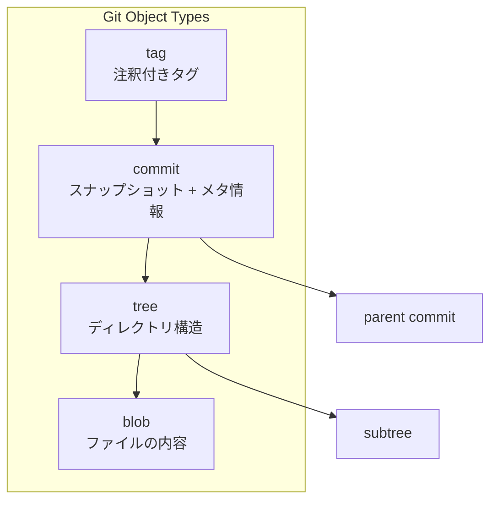
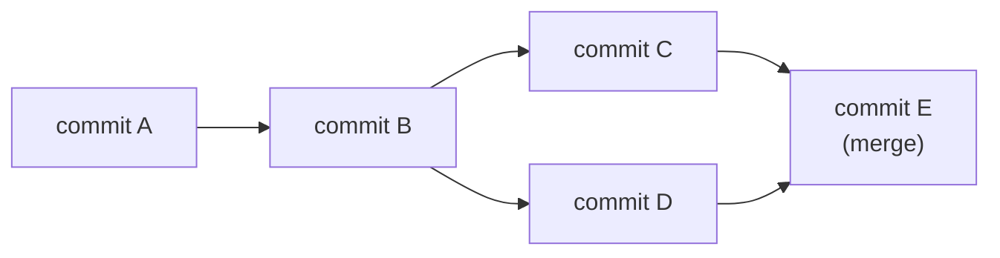
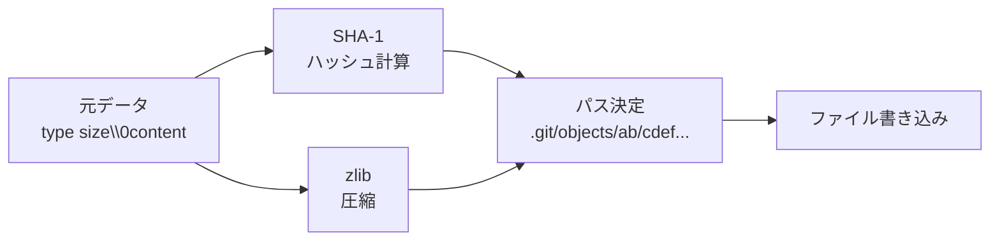
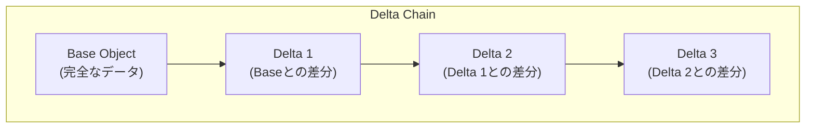
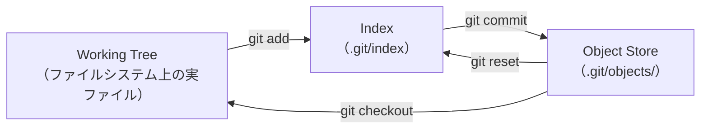
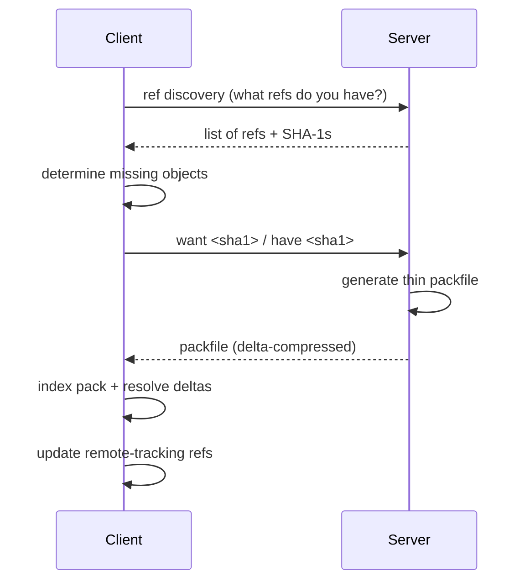
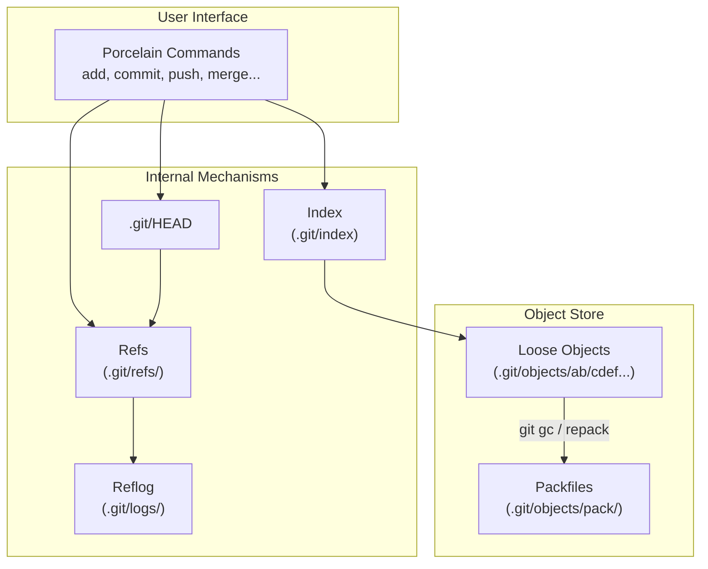

# Gitの内部構造（オブジェクトモデル, Packfile, Reflog）

## 1. はじめに：なぜGitの内部を理解するのか

Gitは2005年にLinus Torvaldsによって、Linuxカーネルの開発を支えるために設計・実装されたバージョン管理システムである。当時使用していたプロプライエタリなBitKeeperのライセンス問題を契機に、わずか数週間で基本実装が完成した。

Torvaldsが設計にあたって重視したのは以下の3点である：

1. **分散性** — 中央サーバーなしにすべての開発者が完全な履歴を持てること
2. **データの完全性** — 履歴の改ざんが検出可能であること
3. **性能** — Linuxカーネル規模（数万ファイル、数十万コミット）の開発に耐えること

これらの要件を満たすために、Gitは内部的に**コンテンツアドレスドストレージ（content-addressable storage）**というシンプルかつ強力なデータモデルを採用した。ファイルの内容そのものからハッシュ値を算出し、それをキーとして保存するという仕組みである。

多くの開発者はGitの日常的なコマンド（`git add`、`git commit`、`git push`など）を使いこなしているが、その背後でどのようなデータ構造が動いているかを理解している人は少ない。内部構造を理解することで、以下のような実践的な利点がある：

- トラブルシューティングの際に問題の本質を把握できる
- `git rebase`、`git cherry-pick`、`git reflog` などの高度な操作を自信を持って使える
- リポジトリの肥大化やパフォーマンス問題に適切に対処できる
- Gitの振る舞いを「暗記」ではなく「原理」から理解できる

本記事では、Gitの内部構造を以下の観点から解説する。まずオブジェクトモデルの詳細を理解し、次にそのオブジェクトがどのように効率的に格納されるか（Packfile）、そしてReflogによるリカバリ機構、Index（ステージングエリア）の実装、ブランチ・タグの実体（refs）について掘り下げる。

## 2. オブジェクトモデル

Gitの核心は、4種類のオブジェクトからなるシンプルなデータモデルである。すべてのオブジェクトは、その**内容**に基づいてSHA-1ハッシュ値が算出され、そのハッシュ値をキー（アドレス）として `.git/objects/` ディレクトリに保存される。



### 2.1 Blob オブジェクト

**Blob（Binary Large Object）**は、ファイルの内容をそのまま保存するオブジェクトである。ファイル名やパーミッションといったメタデータは一切含まない。純粋にファイルの内容だけがblobオブジェクトとして保存される。

blobオブジェクトの保存形式は以下のとおりである：

```
blob <content-size>\0<content>
```

ここで `\0` はヌルバイトである。このヘッダーと内容を結合した全体に対してSHA-1ハッシュを計算し、それがオブジェクトのIDとなる。

```bash
# Manually compute a blob hash
$ echo -n "Hello, Git" | git hash-object --stdin
af5626b4a114abcb82d63db7c8082c3c4756e51b

# Equivalent to:
$ printf "blob 10\0Hello, Git" | sha1sum
af5626b4a114abcb82d63db7c8082c3c4756e51b
```

重要な性質として、**同じ内容のファイルは常に同じハッシュ値を持つ**。つまり、リポジトリ内の異なる場所に同一内容のファイルが存在しても、blobオブジェクトは1つしか保存されない。これは自然な重複排除機構として機能する。

### 2.2 Tree オブジェクト

**Tree オブジェクト**は、ディレクトリの構成を表現する。各エントリは、ファイルモード（パーミッション）、オブジェクトの種類（blobまたは別のtree）、SHA-1ハッシュ、そしてファイル名から構成される。

```
tree <size>\0
<mode> <name>\0<20-byte SHA-1>
<mode> <name>\0<20-byte SHA-1>
...
```

例えば、以下のようなディレクトリ構成を考える：

```
project/
├── README.md
├── src/
│   ├── main.c
│   └── util.c
└── Makefile
```

この構造は2つのtreeオブジェクトで表現される：

```bash
# root tree
$ git cat-file -p HEAD^{tree}
100644 blob a1b2c3d4...  Makefile
100644 blob e5f6a7b8...  README.md
040000 tree 12345678...  src

# src/ subtree
$ git cat-file -p 12345678...
100644 blob abcdef01...  main.c
100644 blob 23456789...  util.c
```

ファイルモードの主な値は以下のとおりである：

| モード | 意味 |
|--------|------|
| `100644` | 通常ファイル |
| `100755` | 実行可能ファイル |
| `040000` | ディレクトリ（サブtree） |
| `120000` | シンボリックリンク |
| `160000` | gitlink（サブモジュール） |

treeオブジェクトの重要な性質は、**ディレクトリ構成全体がMerkle木を形成する**ことである。任意の階層で内容に変更があれば、その変更は上位のtreeオブジェクトのハッシュ値に伝播する。逆に、ルートtreeのハッシュ値が同一であれば、ディレクトリ構成全体が完全に同一であることが保証される。

### 2.3 Commit オブジェクト

**Commit オブジェクト**は、ある時点のプロジェクト全体のスナップショットを記録する。commitオブジェクトには以下の情報が含まれる：

```
tree <tree-sha1>
parent <parent-sha1>
author <name> <email> <timestamp> <timezone>
committer <name> <email> <timestamp> <timezone>

<commit message>
```

```bash
$ git cat-file -p HEAD
tree 4b825dc642cb6eb9a060e54bf899d5e094fa7c39
parent 8a76c48e5f3b2a1d0c9e7f6b4a2d8e1c3f5a7b9d
author Developer <dev@example.com> 1709280000 +0900
committer Developer <dev@example.com> 1709280000 +0900

docs: add article on Git internals
```

commitオブジェクトのポイントを整理する：

- **tree** フィールドは、このコミット時点のプロジェクト全体のルートtreeを指す。差分ではなくスナップショットである
- **parent** フィールドは、直前のコミットを指す。マージコミットの場合は複数のparentを持つ。初回コミットにはparentがない
- **author** と **committer** は異なる場合がある（例：`git am` でパッチを適用した場合、authorは原作者、committerはパッチ適用者）

コミット履歴は、commitオブジェクトのparentポインタによって形成される有向非巡回グラフ（DAG: Directed Acyclic Graph）である。



このDAG構造により、ブランチの分岐とマージが自然に表現される。各commitオブジェクトのハッシュ値は、tree・parent・author・committer・メッセージのすべてから算出されるため、**履歴のいかなる改ざんもハッシュ値の変化として検出できる**。これがGitのデータ完全性保証の基盤である。

### 2.4 Tag オブジェクト

**Tag オブジェクト**（注釈付きタグ / annotated tag）は、特定のオブジェクト（通常はcommit）に対して、タグ名・作成者・メッセージ・オプションでGPG署名を付与するものである。

```
object <sha1>
type commit
tag v1.0.0
tagger <name> <email> <timestamp> <timezone>

Release version 1.0.0
```

軽量タグ（lightweight tag）はtagオブジェクトを作らず、単に特定のcommitを指すrefファイルを作成するだけである。注釈付きタグはタグ自体がオブジェクトとして保存されるため、署名や作成者情報を持ち、リリース管理に適している。

### 2.5 SHA-1とコンテンツアドレッシング

Gitのオブジェクトストアは、**コンテンツアドレスドストレージ**である。すべてのオブジェクトは `<type> <size>\0<content>` という形式のデータからSHA-1ハッシュ（40文字の16進数文字列、160ビット）を算出し、そのハッシュ値をキーとして保存される。

この設計には以下の利点がある：

1. **重複排除** — 同一内容のオブジェクトは自動的に1つにまとまる
2. **完全性検証** — オブジェクトを読み出すたびにハッシュ値を再計算して検証できる
3. **分散同期の容易さ** — 同じ内容は世界中のどのリポジトリでも同じハッシュ値を持つ。オブジェクトの有無だけで同期の必要性を判断できる
4. **イミュータブル性** — オブジェクトは作成後に変更されることがない

::: warning SHA-1の安全性について
2017年にGoogleがSHA-1の衝突を実証した（SHAttered攻撃）。ただしこれはGitのセキュリティに直接的な脅威とはなっていない。Gitはハッシュ値を暗号学的な安全性のためではなく、主にデータの同一性確認のために使用しているためである。それでもGitプロジェクトは段階的にSHA-256への移行を進めており、Git 2.42以降でSHA-256リポジトリの実験的サポートが利用可能である。
:::

## 3. オブジェクトストアの仕組み

### 3.1 Loose Objects

Gitがオブジェクトを保存する最も基本的な形式が**ルーズオブジェクト（loose object）**である。各オブジェクトは、SHA-1ハッシュ値の先頭2文字をディレクトリ名、残り38文字をファイル名として `.git/objects/` 以下に保存される。

```
.git/objects/
├── af/
│   └── 5626b4a114abcb82d63db7c8082c3c4756e51b   # blob
├── 4b/
│   └── 825dc642cb6eb9a060e54bf899d5e094fa7c39   # tree
├── 8a/
│   └── 76c48e5f3b2a1d0c9e7f6b4a2d8e1c3f5a7b9d   # commit
...
```

先頭2文字でディレクトリを分割する理由は、1つのディレクトリに大量のファイルが配置されることによるファイルシステムのパフォーマンス低下を防ぐためである。256個のサブディレクトリに分散することで、各ディレクトリのエントリ数を抑えている。

オブジェクトファイルの内容は、**zlib（deflate）圧縮**されている。保存と読み出しの流れは以下のとおりである：



```bash
# View a raw loose object (decompressed)
$ python3 -c "
import zlib, sys
with open('.git/objects/af/5626b4a114abcb82d63db7c8082c3c4756e51b', 'rb') as f:
    print(zlib.decompress(f.read()))
"
b'blob 10\x00Hello, Git'
```

### 3.2 オブジェクトの参照と走査

Gitがコミット履歴を表示する際には、以下のような手順でオブジェクトを走査する：

1. ブランチ名（例：`main`）からcommitのSHA-1を解決する
2. commitオブジェクトを読み出し、treeのSHA-1を取得する
3. treeオブジェクトを再帰的に展開し、全ファイルの内容（blob）を取得する
4. parentコミットを辿って履歴を遡る

`git log`、`git diff`、`git checkout` といったコマンドはすべて、このオブジェクトグラフの走査に基づいている。

### 3.3 ガベージコレクション

Gitのオブジェクトストアには、どこからも参照されなくなったオブジェクト（unreachable object）が蓄積することがある。例えば、`git commit --amend` や `git rebase` を行うと、旧コミットはどのブランチからも到達不能になる（ただしReflogからは一定期間参照可能である）。

`git gc`（ガベージコレクション）は、以下の処理を行う：

1. **到達不能オブジェクトの削除** — すべてのref、Reflog、タグから辿れないオブジェクトを削除する（デフォルトで2週間の猶予期間あり）
2. **ルーズオブジェクトのPackfile化** — 多数のルーズオブジェクトを効率的なPackfile形式にまとめる（後述）
3. **Reflogの古いエントリの期限切れ処理**

`git gc` は明示的に実行するだけでなく、`git commit`、`git merge`、`git fetch` などのコマンドが自動的にトリガーすることもある（`gc.auto` 設定により、ルーズオブジェクトが一定数を超えると自動実行される）。

## 4. Packfileとデルタ圧縮

### 4.1 なぜPackfileが必要なのか

ルーズオブジェクトの方式には明らかな問題がある。10万個のオブジェクトがあれば10万個のファイルが作成される。ファイルシステムのオーバーヘッド（inode消費、ディレクトリエントリのルックアップコスト）が無視できなくなるうえに、個別のzlib圧縮ではオブジェクト間の類似性（例：ファイルの微小な変更）を活用できない。

Packfileは、この問題を解決するために設計された格納形式である。複数のオブジェクトを1つのファイルにパックし、**デルタ圧縮**によってオブジェクト間の差分を効率的に保存する。

### 4.2 Packfileの構造

Packfileは `.git/objects/pack/` ディレクトリに保存され、以下の2つのファイルで構成される：

- `.pack` ファイル — オブジェクトデータ本体
- `.idx` ファイル — オブジェクトの検索用インデックス

```
.git/objects/pack/
├── pack-abc123...def456.idx
└── pack-abc123...def456.pack
```

`.pack` ファイルの内部構造は以下のとおりである：

```
┌────────────────────────────────┐
│ Header                         │
│   "PACK" (4 bytes)            │
│   Version (4 bytes)           │
│   Number of objects (4 bytes) │
├────────────────────────────────┤
│ Object Entry 1                 │
│   Type + Size (variable)      │
│   Compressed Data             │
├────────────────────────────────┤
│ Object Entry 2                 │
│   Type + Size (variable)      │
│   Compressed Data             │
├────────────────────────────────┤
│ ...                            │
├────────────────────────────────┤
│ Trailer                        │
│   SHA-1 checksum (20 bytes)   │
└────────────────────────────────┘
```

各オブジェクトエントリのタイプフィールドには、4つの基本タイプ（commit、tree、blob、tag）に加えて、2つのデルタタイプが定義されている：

- **OFS_DELTA** — Packfile内のオフセットで基底オブジェクトを参照するデルタ
- **REF_DELTA** — SHA-1ハッシュで基底オブジェクトを参照するデルタ

### 4.3 デルタ圧縮の仕組み

デルタ圧縮は、Packfileの圧縮効率を飛躍的に高める技術である。概念的には、あるオブジェクト（ターゲット）を、別のオブジェクト（ベース）との差分として表現する。



Gitのデルタ圧縮は、テキストdiffとは異なり、**バイナリデルタ**形式を使用する。デルタ命令は2種類のみで構成される：

1. **COPY命令** — ベースオブジェクトの指定位置から指定長のデータをコピーする
2. **INSERT命令** — 新しいデータをそのまま挿入する

```
Delta format:
  <source-size>  (base object size, variable-length integer)
  <target-size>  (target object size, variable-length integer)
  <delta-instructions>:
    0xxxxxxx  → INSERT: next x bytes are literal data
    1xxxxxxx  → COPY: copy from base at offset/size encoded in following bytes
```

例えば、1000行のファイルの1行だけを変更した場合、デルタは「元のファイルのほぼ全体をコピーし、変更部分だけを挿入する」という形になり、非常にコンパクトに表現できる。

### 4.4 デルタチェーンとパック処理

`git gc` や `git repack` が実行されると、Gitは以下のアルゴリズムでデルタ圧縮を行う：

1. すべてのオブジェクトをタイプとファイル名（パス）でソートする
2. 類似するオブジェクト同士を近くに配置する（同じファイルの異なるバージョンが隣接するように）
3. スライディングウィンドウ（デフォルト10個）内のオブジェクト間でデルタ候補を探索する
4. 最小のデルタサイズが得られるベースオブジェクトを選択する

::: tip デルタの方向
直感に反するかもしれないが、Gitは**新しいバージョンを完全な形で保持し、古いバージョンをデルタとして保存する**傾向がある。これは、最新のバージョンへのアクセスが最も頻繁であるため、読み出し性能を最適化する設計判断である。CVS等の旧来のシステムでは逆方向（最新をデルタで保存）であった。
:::

デルタチェーンの深さには上限が設けられている（`pack.depth`、デフォルト50）。チェーンが深すぎると、1つのオブジェクトを復元するために多数のデルタを連鎖的に適用する必要があり、読み出し性能が低下するためである。

### 4.5 Packfileインデックス（.idxファイル）

`.idx` ファイルは、SHA-1ハッシュからPackfile内のオフセットへの高速な検索を可能にする。現行のバージョン2のインデックスは以下の構成を持つ：

```
┌──────────────────────────────────┐
│ Header (8 bytes)                  │
├──────────────────────────────────┤
│ Fan-out Table (256 × 4 bytes)    │
│   SHA-1の先頭1バイトごとの       │
│   累積オブジェクト数             │
├──────────────────────────────────┤
│ SHA-1 Table (N × 20 bytes)       │
│   ソート済みSHA-1リスト          │
├──────────────────────────────────┤
│ CRC32 Table (N × 4 bytes)        │
│   各オブジェクトのCRC32          │
├──────────────────────────────────┤
│ Offset Table (N × 4 bytes)       │
│   Packfile内のオフセット         │
├──────────────────────────────────┤
│ Large Offset Table (optional)    │
│   4GBを超えるPackfile用          │
├──────────────────────────────────┤
│ Checksums                         │
│   Pack SHA-1 + Index SHA-1       │
└──────────────────────────────────┘
```

Fan-outテーブルにより、SHA-1の先頭バイトに基づく二分探索の開始位置を即座に決定できる。これにより、数百万オブジェクトを含むPackfileからでも、わずか数回のディスクシークでオブジェクトを検索できる。

### 4.6 パフォーマンスへの影響

Packfileの効果は劇的である。具体的な数値で見てみよう：

- **Linuxカーネルリポジトリ**：約870万個のオブジェクト → Packfile化後のディスク使用量は約2.5GB（ルーズオブジェクトのまま保存した場合の数分の一）
- 一般的なプロジェクトでは、Packfile化により**50-90%のディスク容量削減**が達成される
- ネットワーク転送（`git clone`、`git fetch`）時にもPackfile形式が使用され、転送量が最小化される

`git verify-pack` コマンドを使うと、Packfileの内容を確認できる：

```bash
# View pack statistics
$ git verify-pack -v .git/objects/pack/pack-*.idx | tail -5
chain length = 1: 1547 objects
chain length = 2: 823 objects
...
non delta: 4521 objects
.git/objects/pack/pack-abc123.pack: ok
```

## 5. Reflog：操作履歴とリカバリ

### 5.1 Reflogとは何か

**Reflog（Reference Log）**は、各refの値が変化した履歴を記録するローカルなログである。ブランチのHEADがどのコミットを指していたか、いつ、どのような操作で変化したかがすべて記録される。

Reflogは `.git/logs/` ディレクトリに保存される：

```
.git/logs/
├── HEAD                    # HEADの変更履歴
└── refs/
    └── heads/
        ├── main            # mainブランチの変更履歴
        └── feature-x       # feature-xブランチの変更履歴
```

各エントリは以下の形式で記録される：

```
<old-sha1> <new-sha1> <name> <email> <timestamp> <timezone>\t<message>
```

### 5.2 Reflogの閲覧

```bash
# View HEAD reflog
$ git reflog
8a76c48 (HEAD -> main) HEAD@{0}: commit: docs: add article on B-tree
b0345ee HEAD@{1}: commit: docs: update sidebar
f50ef5d HEAD@{2}: rebase (finish): returning to refs/heads/main
1b6b3a7 HEAD@{3}: rebase (pick): docs: add categories
deac9d6 HEAD@{4}: rebase (start): checkout origin/main
...

# View reflog for a specific branch
$ git reflog show feature-x

# View reflog with timestamps
$ git reflog --date=iso
```

`HEAD@{n}` という表記は「n回前のHEADの値」を意味する。同様に `main@{n}` は「n回前のmainブランチのHEADの値」を指す。時刻ベースの参照も可能である：

```bash
# Reference by time
$ git show main@{yesterday}
$ git show HEAD@{2.hours.ago}
$ git show main@{2026-02-28}
```

### 5.3 Reflogによるリカバリ

Reflogの最大の価値は、**一見失われたように見えるコミットを復元できる**ことである。以下のシナリオでReflogが救いとなる：

**シナリオ1：`git reset --hard` の取り消し**

```bash
# Accidentally reset to wrong commit
$ git reset --hard HEAD~5

# Recover using reflog
$ git reflog
abcdef1 HEAD@{0}: reset: moving to HEAD~5
1234567 HEAD@{1}: commit: important work  # ← this is what we want

$ git reset --hard 1234567
```

**シナリオ2：削除したブランチの復元**

```bash
# Accidentally deleted a branch
$ git branch -D feature-important

# Find the last commit of that branch in reflog
$ git reflog | grep feature-important
# Or check the overall reflog
$ git reflog
abcdef1 HEAD@{3}: checkout: moving from feature-important to main

# Recreate the branch
$ git branch feature-important HEAD@{4}
```

**シナリオ3：`git rebase` の取り消し**

```bash
# Rebase went wrong
$ git rebase main
# ... conflicts and mistakes ...

# Undo the entire rebase
$ git reflog
abcdef1 HEAD@{0}: rebase (finish): ...
1234567 HEAD@{5}: rebase (start): checkout main
fedcba9 HEAD@{6}: commit: pre-rebase state  # ← before rebase

$ git reset --hard fedcba9
```

### 5.4 Reflogの有効期限

Reflogのエントリは永久に保持されるわけではない。デフォルトの有効期限は以下のとおりである：

- **到達可能なエントリ**（現在のブランチから辿れるコミット）：90日
- **到達不能なエントリ**：30日

```bash
# View expiry settings
$ git config gc.reflogExpire           # default: 90 days
$ git config gc.reflogExpireUnreachable  # default: 30 days

# Manually expire reflog entries
$ git reflog expire --expire=now --all
```

`git gc` の実行時にReflogの期限切れ処理も行われる。期限切れしたReflogエントリに対応するコミットは、他のrefから到達不能であればガベージコレクションの対象となる。

::: warning Reflogはローカル専用
Reflogはリモートリポジトリにpushされない。あくまでローカルの操作履歴であり、`git clone` した直後のリポジトリにはReflogの履歴が存在しない。これは設計上の判断であり、各開発者のローカル操作のプライバシーが保護される。
:::

## 6. Index（ステージングエリア）の内部構造

### 6.1 Indexの役割

**Index**（またはステージングエリア、キャッシュとも呼ばれる）は、次のコミットに含めるファイルの状態を保持するデータ構造である。`.git/index` というバイナリファイルとして保存される。

Indexは、ワーキングツリーとリポジトリ（オブジェクトストア）の間に位置する中間層として機能する：



### 6.2 Indexのバイナリ形式

Indexファイルは、パフォーマンスのためにバイナリ形式で保存されている。基本構造は以下のとおりである：

```
┌────────────────────────────────┐
│ Header                         │
│   "DIRC" signature (4 bytes)  │
│   Version (4 bytes)           │
│   Number of entries (4 bytes) │
├────────────────────────────────┤
│ Entry 1                        │
│   ctime (8 bytes)             │
│   mtime (8 bytes)             │
│   dev, ino (8 bytes)          │
│   mode (4 bytes)              │
│   uid, gid (8 bytes)          │
│   file size (4 bytes)         │
│   SHA-1 (20 bytes)            │
│   flags (2 bytes)             │
│   path name (variable)        │
├────────────────────────────────┤
│ Entry 2 ...                    │
├────────────────────────────────┤
│ Extensions (optional)          │
│   Tree cache, Resolve undo... │
├────────────────────────────────┤
│ SHA-1 checksum (20 bytes)      │
└────────────────────────────────┘
```

各エントリには、ファイルシステムのメタデータ（ctime、mtime、inode番号、デバイス番号など）が含まれている。これは**ファイルが変更されたかどうかを高速に判定する**ためである。`git status` の実行時、Gitはまずこれらのメタデータを比較し、変更がなければファイル内容のハッシュ計算を省略できる。これにより、数万ファイルのリポジトリでも `git status` は高速に動作する。

### 6.3 Indexの確認

```bash
# View index contents
$ git ls-files --stage
100644 af5626b4a114abcb82d63db7c8082c3c4756e51b 0  README.md
100644 e5f6a7b8c9d0e1f2a3b4c5d6e7f8a9b0c1d2e3f4 0  src/main.c
100644 23456789abcdef0123456789abcdef0123456789ab 0  src/util.c

# Show raw index data
$ git ls-files --debug
```

ステージ番号（上記出力の `0`）は、マージコンフリクト時に重要な役割を果たす：

- **ステージ0** — 通常のエントリ（コンフリクトなし）
- **ステージ1** — 共通祖先（base）バージョン
- **ステージ2** — 現在のブランチ（ours）バージョン
- **ステージ3** — マージ対象ブランチ（theirs）バージョン

コンフリクトが発生すると、対象ファイルのステージ0エントリが削除され、代わりにステージ1・2・3のエントリが作成される。コンフリクトを解決して `git add` すると、ステージ1・2・3が削除されてステージ0に統合される。

### 6.4 Assume-unchangedとSkip-worktree

大規模リポジトリでのパフォーマンス最適化として、Indexには特殊なフラグが用意されている：

- **assume-unchanged** — Gitにファイルの変更チェックを省略させる（`git update-index --assume-unchanged <file>`）
- **skip-worktree** — sparse checkoutで使用され、ファイルがワーキングツリーに存在しなくてもよいことを示す

これらのフラグは、大規模なモノレポで自分に関係のないファイルの変更チェックをスキップしたい場合に有用である。

## 7. ブランチとタグの実装（refs）

### 7.1 Refsとは何か

Gitにおけるブランチ、タグ、リモートトラッキングブランチの正体は、**ref（リファレンス）**と呼ばれるSHA-1ハッシュへのポインタである。`.git/refs/` ディレクトリに保存される。

```
.git/refs/
├── heads/              # local branches
│   ├── main            # contains: 8a76c48...
│   └── feature-x       # contains: abcdef1...
├── tags/               # tags
│   ├── v1.0.0          # contains: fedcba9...
│   └── v2.0.0          # contains: 1234567...
└── remotes/            # remote-tracking branches
    └── origin/
        ├── main        # contains: 8a76c48...
        └── feature-y   # contains: 9876543...
```

各refファイルの内容は、単にSHA-1ハッシュ値を記したテキストファイルである：

```bash
$ cat .git/refs/heads/main
8a76c48e5f3b2a1d0c9e7f6b4a2d8e1c3f5a7b9d
```

ブランチの作成は、このファイルを作成するだけである。ブランチの切り替え（`git checkout`）は、HEADの参照先を変更するだけである。この実装のシンプルさは、Gitの設計哲学を如実に表している。

### 7.2 HEAD

**HEAD** は特殊なrefであり、`.git/HEAD` ファイルに保存されている。通常はブランチを指す**シンボリックリファレンス**である：

```bash
$ cat .git/HEAD
ref: refs/heads/main
```

`git checkout <branch>` を実行すると、`.git/HEAD` の内容が `ref: refs/heads/<branch>` に更新される。

一方、特定のコミットを直接チェックアウトすると（`git checkout <sha1>`）、HEADは直接SHA-1を指す状態になる。これが**detached HEAD**状態である：

```bash
$ git checkout 8a76c48
$ cat .git/HEAD
8a76c48e5f3b2a1d0c9e7f6b4a2d8e1c3f5a7b9d
```

detached HEAD状態で作成したコミットは、どのブランチにも属さないため、別のブランチに切り替えると到達不能になる。ただし、Reflogには記録されるため、一定期間内であれば復元可能である。

### 7.3 Packed-refs

リポジトリの規模が大きくなると、`.git/refs/` 以下に大量の小さなファイルが作成される。これを最適化するために、Gitは**packed-refs**という仕組みを用意している。

`git pack-refs` を実行すると、すべてのrefsが `.git/packed-refs` という1つのファイルにまとめられる：

```bash
$ cat .git/packed-refs
# pack-refs with: peeled fully-peeled sorted
8a76c48e5f3b2a1d0c9e7f6b4a2d8e1c3f5a7b9d refs/heads/main
fedcba9876543210fedcba9876543210fedcba98 refs/tags/v1.0.0
^abcdef1234567890abcdef1234567890abcdef12
```

refの解決時、Gitはまず `.git/refs/` 以下のファイルを確認し、存在しなければ `.git/packed-refs` を参照する。ブランチが更新されると、個別のrefファイルが作成され（packed-refsの内容を上書きする形で優先される）、次回の `git pack-refs` でまとめられる。

### 7.4 シンボリックリファレンス

HEADの他にも、シンボリックリファレンスは存在する。例えば、`git symbolic-ref` コマンドで任意のシンボリックリファレンスを作成できる。また、`MERGE_HEAD`、`ORIG_HEAD`、`CHERRY_PICK_HEAD` などの特殊なrefは、各操作の途中状態を記録するために使用される。

```bash
# ORIG_HEAD: reset/merge/rebase前のHEADを保存
$ git reset --hard HEAD~3
# ORIG_HEAD now points to the previous HEAD
$ git reset --hard ORIG_HEAD  # undo the reset

# MERGE_HEAD: merge中の対象コミット
$ git merge feature-x
# .git/MERGE_HEAD contains the SHA-1 of feature-x's tip
```

## 8. ネットワークプロトコルとオブジェクト転送

### 8.1 転送プロトコル

Gitがリモートリポジトリとオブジェクトを交換する際のプロトコルも、オブジェクトモデルの理解なしには語れない。

`git fetch` の処理フローは以下のとおりである：



重要なポイントは、サーバーが**転送専用のPackfile（thin pack）**を動的に生成することである。thin packは、クライアントが既に保有しているオブジェクトをベースとしたデルタを含む。クライアント側では `git index-pack --fix-thin` で自己完結型のPackfileに変換される。

### 8.2 Shallow CloneとPartial Clone

大規模リポジトリの効率的な利用のため、Gitは以下の特殊なクローン方式をサポートしている：

- **Shallow clone**（`git clone --depth=1`）— コミット履歴の深さを制限する。ルートツリーのオブジェクトは完全に取得するが、古いコミットとそのツリーは取得しない
- **Partial clone**（`git clone --filter=blob:none`）— blobオブジェクトを遅延取得する。ディレクトリ構造やコミット履歴は完全に取得するが、ファイルの内容は必要時にオンデマンドで取得する

これらは特にCI/CDパイプラインやモノレポ環境で有用である。

## 9. 実践的な考慮事項

### 9.1 リポジトリの肥大化と対策

Gitリポジトリが肥大化する主な原因と対策を整理する：

| 原因 | 対策 |
|------|------|
| 大きなバイナリファイルのコミット | Git LFS（Large File Storage）を使用する |
| 不要になった大きなファイルが履歴に残存 | `git filter-repo` で履歴から除去する |
| Packfileの最適化不足 | `git gc --aggressive` を実行する |
| 不要なブランチの蓄積 | 定期的にマージ済みブランチを削除する |

### 9.2 パフォーマンス特性

Gitの内部構造から導かれるパフォーマンス特性を理解しておくことは重要である：

**高速な操作：**
- **`git status`** — Indexのメタデータ比較により、ファイル内容のハッシュ計算を最小限に抑える
- **`git log`** — commitオブジェクトのparentを辿るだけ。ファイル内容には触れない（`--patch` オプションなしの場合）
- **`git branch`** — refファイルの作成のみ（コピーは一切発生しない）
- **`git diff <commit1> <commit2>`** — 2つのtreeオブジェクトの比較。変更のあったパスのみblobを比較する

**比較的重い操作：**
- **`git blame`** — 各行の最終変更コミットを特定するため、履歴を広範に走査する必要がある
- **`git gc --aggressive`** — すべてのオブジェクトを再パックするため、リポジトリサイズに比例した時間がかかる
- **`git log --all --graph`** — 全ブランチのDAGを構築するため、大規模リポジトリでは重くなる

### 9.3 Git内部コマンド（Plumbing Commands）

Gitのコマンドは、ユーザー向けの**Porcelain Commands**（磁器：美しい外側）と、内部的な**Plumbing Commands**（配管：内部の仕組み）に分類される。内部構造の理解に役立つplumbingコマンドをまとめる：

```bash
# Object inspection
$ git cat-file -t <sha1>       # show object type
$ git cat-file -p <sha1>       # pretty-print object content
$ git cat-file -s <sha1>       # show object size

# Object creation
$ git hash-object -w <file>    # write file as blob object
$ git mktree                    # create tree object from stdin
$ git commit-tree <tree> -p <parent> -m "message"  # create commit

# Index manipulation
$ git ls-files --stage          # show index entries
$ git update-index --add <file> # add file to index
$ git read-tree <tree>          # read tree into index
$ git write-tree                # write index as tree object

# Reference manipulation
$ git update-ref refs/heads/main <sha1>  # update branch
$ git symbolic-ref HEAD refs/heads/main  # update HEAD
$ git for-each-ref               # list all refs

# Pack operations
$ git verify-pack -v <idx-file> # show pack contents
$ git unpack-objects < <pack>   # unpack a packfile
$ git pack-objects               # create a packfile
```

これらのコマンドを使えば、Gitの高レベルコマンドが内部的に何をしているかを一つ一つ再現できる。例えば、`git add` + `git commit` の処理は、以下のplumbingコマンドの組み合わせに相当する：

```bash
# Equivalent of "git add file.txt && git commit -m 'message'"
$ git hash-object -w file.txt          # create blob
$ git update-index --add file.txt      # add to index
$ git write-tree                        # create tree from index
$ git commit-tree <tree-sha1> -p HEAD -m "message"  # create commit
$ git update-ref refs/heads/main <commit-sha1>      # update branch
```

## 10. まとめ

Gitの内部構造は、一見すると複雑に思えるが、その根底にあるのは**コンテンツアドレスドストレージ**というシンプルな原理である。4種類のオブジェクト（blob、tree、commit、tag）がSHA-1ハッシュで管理され、それらがMerkle木とDAGを形成することで、分散環境における完全性保証と効率的な同期を実現している。

本記事で解説した各要素の関係を最後に整理する：



- **オブジェクトモデル**がGitのすべての基盤であり、ファイル内容・ディレクトリ構造・コミット履歴のすべてがイミュータブルなオブジェクトとして保存される
- **Packfile**がストレージ効率とネットワーク転送効率を劇的に改善する。デルタ圧縮により、類似オブジェクト間の冗長性を排除する
- **Reflog**がローカルの操作履歴を記録し、誤操作からのリカバリを可能にする安全ネットとして機能する
- **Index**がワーキングツリーとリポジトリの間の中間層として、ステージング機能とパフォーマンス最適化を提供する
- **Refs**がブランチ・タグ・リモートトラッキングブランチの実体であり、単なるSHA-1へのポインタに過ぎない

Gitの設計において特筆すべきは、これらの要素がすべて**ファイルシステム上のシンプルなデータ構造**として実装されていることである。データベースサーバーも複雑なバイナリ形式も必要としない。`.git/` ディレクトリの中身を直接読み書きすることで、Gitのすべての操作を原理的に再現できる。この透明性と可搬性が、Gitを単なるツールではなく、バージョン管理の「インフラストラクチャ」たらしめている所以である。
