# GitOps（Argo CD, Flux）

## 1. GitOps の原則

### 1.1 GitOps とは何か

GitOps は、Git リポジトリを「信頼できる唯一の情報源（Single Source of Truth）」として扱い、インフラストラクチャやアプリケーションの宣言的な望ましい状態（Desired State）を Git に格納し、自動化されたプロセスによってその状態を実際のシステムに継続的に適用するという運用パラダイムである。2017年に Weaveworks 社の Alexis Richardson が提唱し、Kubernetes エコシステムを中心に急速に普及した。

GitOps の本質は「宣言的な構成管理」と「Git ワークフローによる変更管理」の融合にある。従来の運用では、管理者がサーバーに SSH でログインし、手作業でコマンドを実行する命令的（Imperative）なアプローチが主流であった。これに対して GitOps は、システムのあるべき姿をコードとして記述し、実際の状態との差分を自動的に検知・解消する宣言的（Declarative）なアプローチを採用する。

### 1.2 GitOps の4原則

OpenGitOps プロジェクト（CNCF Sandbox）は、GitOps を定義する4つの原則を策定している。

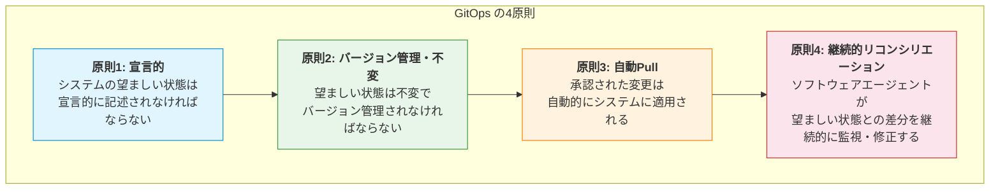

**原則1: 宣言的（Declarative）** --- システムの望ましい状態は宣言的に記述されなければならない。Kubernetes のマニフェスト（YAML）や Terraform の HCL のように、「何が存在すべきか」を記述する。「どのように実現するか」という手順ではなく、最終的な状態を定義する。

**原則2: バージョン管理と不変性（Versioned and Immutable）** --- 望ましい状態は Git リポジトリに格納され、すべての変更はコミット履歴として記録される。これにより、いつ・誰が・何を変更したかが完全に追跡可能となり、任意の時点への巻き戻しも容易になる。

**原則3: 自動的な Pull（Pulled Automatically）** --- 承認された変更は手動介入なしに自動的にシステムに適用される。Pull Request のマージをトリガーとして、ソフトウェアエージェントが変更を検知し、クラスター上に反映する。

**原則4: 継続的リコンシリエーション（Continuously Reconciled）** --- ソフトウェアエージェントは、実際の状態と望ましい状態の差分を継続的に監視し、ドリフト（乖離）を検知した場合は自動的に修正する。これにより、`kubectl edit` や `kubectl apply` による手動変更があっても、Git の状態に自動で収束する。

### 1.3 GitOps がもたらす価値

GitOps を導入することで、以下のような運用上の利点が得られる。

| 観点 | 従来の CI/CD | GitOps |
|------|-------------|--------|
| 変更の追跡 | CI/CD パイプラインのログに依存 | Git のコミット履歴で完全に追跡可能 |
| ロールバック | パイプラインの再実行や手動操作が必要 | `git revert` で即座に実行可能 |
| 監査 | 別途監査ログの仕組みが必要 | Git の履歴がそのまま監査証跡 |
| セキュリティ | CI/CD システムにクラスターの書き込み権限が必要 | クラスター内のエージェントのみが書き込み権限を持つ |
| 災害復旧 | 手順書に基づく手動復旧 | Git の状態を新クラスターに適用するだけ |
| ドリフト検知 | 定期的な手動確認が必要 | エージェントが自動で継続的に監視 |

::: tip GitOps と Infrastructure as Code の違い
Infrastructure as Code（IaC）は「インフラをコードで記述する」という概念であり、GitOps はそれをさらに一歩進めて「Git を運用ワークフローの中心に据える」という運用モデルである。IaC は Terraform や CloudFormation といったツールの話であり、GitOps はそのツールをどのように運用するかというプラクティスの話である。IaC なしに GitOps は成り立たないが、IaC を採用しているからといって GitOps を実践しているとは限らない。
:::

## 2. Push型 vs Pull型デプロイ

GitOps を理解する上で最も重要な区別の一つが、Push型とPull型のデプロイモデルの違いである。

### 2.1 Push型デプロイ

Push型デプロイは、従来の CI/CD パイプラインにおける標準的なアプローチである。CI システム（GitHub Actions、GitLab CI、Jenkins など）がビルド・テスト・デプロイを一気通貫で実行し、外部からターゲット環境に変更を「押し込む（Push）」。

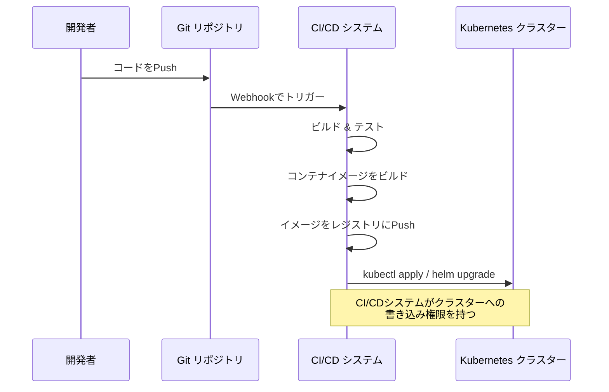

Push型の特徴は以下の通りである。

- **メリット**: シンプルで理解しやすい。既存の CI/CD パイプラインにそのまま組み込める。
- **デメリット**: CI/CD システムにクラスターへの書き込みクレデンシャルを渡す必要があり、攻撃対象面が広がる。また、Git の状態とクラスターの実際の状態が乖離しても検知されない。誰かが `kubectl edit` でマニフェストを直接変更した場合、その変更は Git に反映されず、ドリフトが発生する。

### 2.2 Pull型デプロイ

Pull型デプロイは GitOps の推奨アプローチである。クラスター内に配置されたエージェント（Argo CD や Flux）が Git リポジトリを定期的にポーリングし、変更を検知すると自動的にクラスターの状態を Git の状態に収束させる。

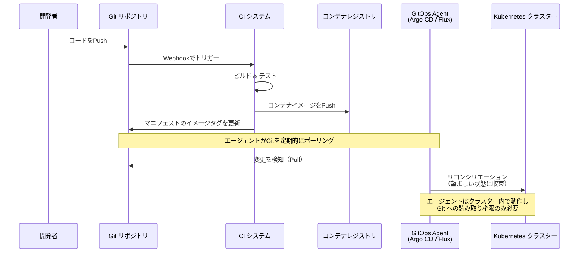

Pull型の特徴は以下の通りである。

- **メリット**: CI/CD システムにクラスターのクレデンシャルを渡す必要がない。エージェントがクラスター内で動作するため、ファイアウォール内のプライベートクラスターにも対応できる。ドリフトを自動検知・修正する。
- **デメリット**: アーキテクチャが若干複雑になる。ポーリング間隔に依存するため、Push型に比べてデプロイまでの遅延が生じうる（Webhook による即時通知で緩和可能）。

### 2.3 リポジトリ構成戦略

GitOps では、アプリケーションコードとデプロイマニフェストを同一リポジトリに置くか、別リポジトリに分離するかという重要な設計判断がある。

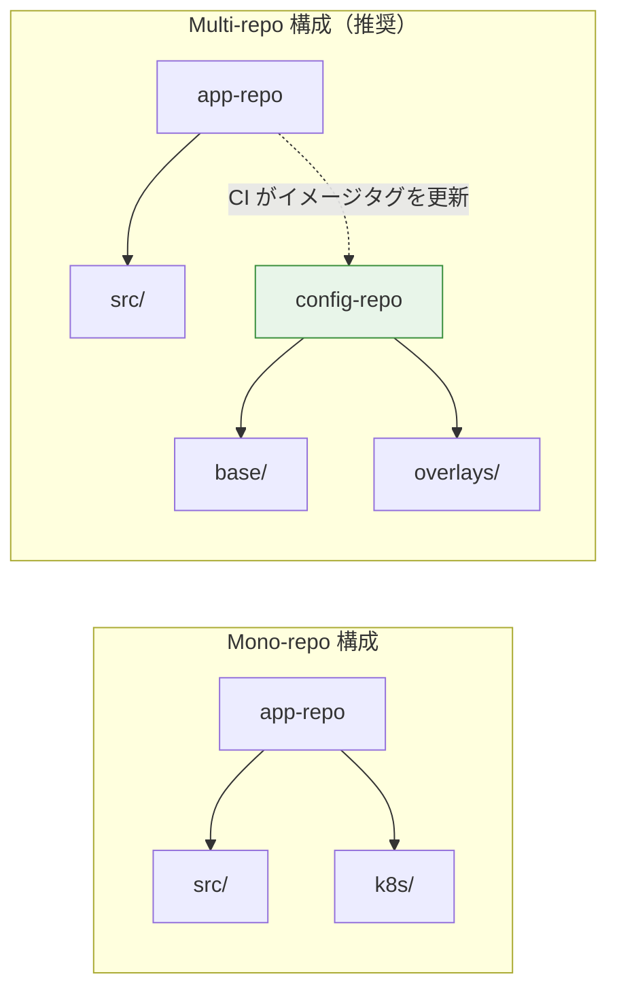

**Mono-repo 構成**: アプリケーションコードとマニフェストが同じリポジトリに存在する。小規模なプロジェクトでは管理が容易だが、アプリケーションのコード変更のたびにマニフェストのコミットが混在し、Git 履歴が複雑になる。また、CI パイプラインのトリガーを適切にフィルタリングする必要がある。

**Multi-repo 構成（推奨）**: アプリケーションコードのリポジトリとデプロイマニフェストのリポジトリを分離する。CI パイプラインはアプリケーションリポジトリでビルドを行い、成果物のイメージタグをマニフェストリポジトリに書き込む。権限の分離が容易であり、マニフェストの変更履歴がクリーンに保たれる。Argo CD や Flux が監視するのはマニフェストリポジトリのみであり、アプリケーションのソースコードにはアクセスしない。

## 3. Argo CD のアーキテクチャ

### 3.1 概要

Argo CD は、Kubernetes 向けの宣言的な GitOps 型継続的デリバリーツールである。Intuit 社によって開発され、2020年に CNCF に寄贈された。2024年に CNCF Graduated プロジェクトとなり、Kubernetes エコシステムにおける GitOps ツールのデファクトスタンダードとしての地位を確立している。

Argo CD は Kubernetes のコントローラーパターンに基づいて設計されており、CRD（Custom Resource Definition）を通じて宣言的に設定を管理する。Web UI、CLI、API のいずれからも操作可能であり、SSO（OIDC / SAML）やRBACといったエンタープライズ機能も充実している。

### 3.2 アーキテクチャの構成要素

Argo CD は複数のコンポーネントから構成されている。

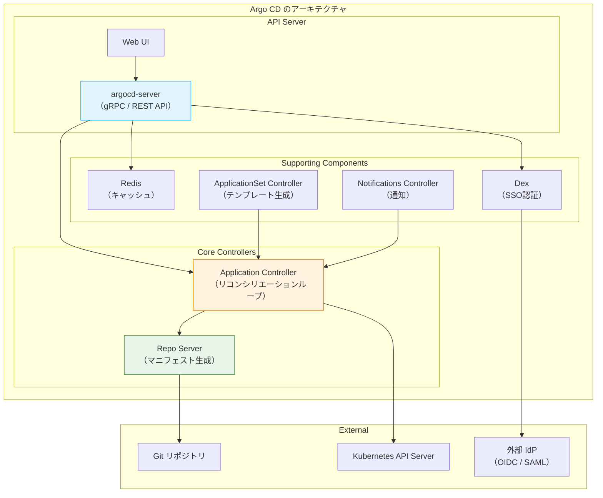

**API Server（argocd-server）**: Argo CD のフロントエンドとして機能し、gRPC と REST の両方の API を公開する。Web UI のホスティング、CLI からのリクエスト処理、認証・認可を担当する。

**Application Controller**: Argo CD の心臓部であり、リコンシリエーションループを実行する。Kubernetes API を監視して実際のクラスター状態を把握し、Git リポジトリの望ましい状態と比較して差分を検出する。Sync 操作が要求されると、差分を解消するために Kubernetes API に変更を適用する。

**Repo Server**: Git リポジトリからマニフェストを取得し、最終的な Kubernetes マニフェストを生成する責務を持つ。素の YAML だけでなく、Helm チャート、Kustomize、Jsonnet、各種プラグインに対応しており、これらのテンプレートエンジンを実行して最終的な YAML を出力する。セキュリティ上の理由から、Repo Server はサンドボックス化された環境で動作し、ネットワークアクセスを制限することが推奨される。

**Redis**: Application Controller と API Server のキャッシュストアとして使用される。Git リポジトリのマニフェストキャッシュやアプリケーションの状態キャッシュを保持し、パフォーマンスを向上させる。

**Dex**: 外部 IdP（Identity Provider）との連携を担当する OIDC / SAML プロバイダーである。GitHub、GitLab、LDAP、SAML などの認証バックエンドと統合できる。

**ApplicationSet Controller**: Application CRD のテンプレートから複数の Application リソースを自動生成するコントローラーである。モノレポや複数クラスターへのデプロイを効率化する。

### 3.3 リコンシリエーションの流れ

Argo CD のリコンシリエーション（調停）プロセスは、以下のような流れで実行される。

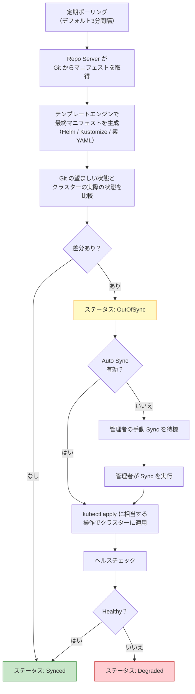

Argo CD は Git の変更を検知する手段として、デフォルトでは3分間隔のポーリングを使用する。ただし、Git リポジトリ側で Webhook を設定することで、コミットが Push された瞬間に Argo CD に通知を送り、即座にリコンシリエーションをトリガーすることも可能である。

::: warning Auto Sync と Self Heal
Argo CD には `automated.selfHeal` というオプションがある。これを有効にすると、誰かが `kubectl` で直接クラスター上のリソースを変更した場合にも、Argo CD が自動的に Git の状態に戻す。本番環境では強力な安全装置として機能するが、トラブルシューティング中に一時的な変更が即座に巻き戻されるため、運用チームとの合意が必要である。
:::

## 4. Application CRD

### 4.1 Application リソースの構造

Argo CD の中核となるのが `Application` CRD である。これは「どの Git リポジトリのどのパスにあるマニフェストを、どのクラスターのどの Namespace にデプロイするか」を宣言的に定義するリソースである。

```yaml
apiVersion: argoproj.io/v1alpha1
kind: Application
metadata:
  name: my-app
  namespace: argocd
  finalizers:
    # Ensure resources are deleted when Application is deleted
    - resources-finalizer.argocd.argoproj.io
spec:
  project: default

  source:
    # Git repository URL
    repoURL: https://github.com/example/config-repo.git
    # Target revision (branch, tag, or commit SHA)
    targetRevision: main
    # Path within the repository
    path: apps/my-app/overlays/production

  destination:
    # Target cluster (in-cluster or remote)
    server: https://kubernetes.default.svc
    # Target namespace
    namespace: my-app

  syncPolicy:
    automated:
      # Automatically sync when Git changes are detected
      prune: true
      # Revert manual changes in the cluster
      selfHeal: true
    syncOptions:
      # Create namespace if it doesn't exist
      - CreateNamespace=true
      # Apply out-of-sync resources only
      - ApplyOutOfSyncOnly=true
    retry:
      limit: 5
      backoff:
        duration: 5s
        factor: 2
        maxDuration: 3m

  ignoreDifferences:
    # Ignore fields managed by other controllers
    - group: apps
      kind: Deployment
      jsonPointers:
        - /spec/replicas
```

### 4.2 主要フィールドの解説

**`spec.source`**: マニフェストの取得元を定義する。`repoURL` で Git リポジトリの URL を、`targetRevision` でブランチ・タグ・コミット SHA を、`path` でリポジトリ内のディレクトリパスを指定する。Helm チャートの場合は `chart` フィールドで Helm リポジトリからのチャート指定も可能である。

**`spec.destination`**: デプロイ先のクラスターと Namespace を定義する。`server` には Kubernetes API Server のエンドポイントを指定する。同一クラスター内の場合は `https://kubernetes.default.svc` を使用する。外部クラスターの場合は事前に `argocd cluster add` で登録しておく必要がある。

**`spec.syncPolicy`**: 同期の挙動を制御する。`automated` を設定すると Auto Sync が有効になる。`prune: true` は Git から削除されたリソースをクラスターからも削除する設定であり、`selfHeal: true` は手動変更の自動修正を有効にする。

**`spec.ignoreDifferences`**: 特定のフィールドの差分を無視する設定である。たとえば、HPA（Horizontal Pod Autoscaler）が `spec.replicas` を動的に変更する場合、このフィールドを ignoreDifferences に含めないと、Argo CD が常に OutOfSync と報告してしまう。

### 4.3 Helm チャートとの統合

Argo CD は Helm チャートをネイティブにサポートしている。Git リポジトリ内の Helm チャートを直接参照する方法と、外部の Helm リポジトリからチャートを取得する方法の2つがある。

```yaml
apiVersion: argoproj.io/v1alpha1
kind: Application
metadata:
  name: nginx-ingress
  namespace: argocd
spec:
  project: default
  source:
    # Helm repository URL
    repoURL: https://kubernetes.github.io/ingress-nginx
    chart: ingress-nginx
    targetRevision: 4.11.3
    helm:
      # Override values
      values: |
        controller:
          replicaCount: 3
          resources:
            requests:
              cpu: 100m
              memory: 128Mi
          metrics:
            enabled: true
      # Individual parameter overrides
      parameters:
        - name: controller.service.type
          value: LoadBalancer
  destination:
    server: https://kubernetes.default.svc
    namespace: ingress-nginx
  syncPolicy:
    automated:
      prune: true
      selfHeal: true
    syncOptions:
      - CreateNamespace=true
```

::: details Kustomize との統合
Argo CD は Kustomize もネイティブにサポートしている。`path` に `kustomization.yaml` が存在するディレクトリを指定するだけで、自動的に Kustomize が適用される。

```yaml
spec:
  source:
    repoURL: https://github.com/example/config-repo.git
    targetRevision: main
    path: apps/my-app/overlays/production
    # Kustomize-specific options
    kustomize:
      images:
        - my-app=registry.example.com/my-app:v1.2.3
      namePrefix: prod-
```
:::

### 4.4 ApplicationSet によるスケーラブルな管理

単一の Application CRD では1つのアプリケーション×1つのクラスターの組み合わせしか定義できない。複数の環境やクラスターにデプロイする場合、Application を個別に作成するのは煩雑である。ApplicationSet はこの問題を解決するテンプレートエンジンである。

```yaml
apiVersion: argoproj.io/v1alpha1
kind: ApplicationSet
metadata:
  name: my-app
  namespace: argocd
spec:
  generators:
    # Generate one Application per list item
    - list:
        elements:
          - cluster: dev
            url: https://dev-cluster.example.com
            revision: develop
          - cluster: staging
            url: https://staging-cluster.example.com
            revision: main
          - cluster: production
            url: https://prod-cluster.example.com
            revision: "v1.5.0"
  template:
    metadata:
      name: "my-app-{{cluster}}"
    spec:
      project: default
      source:
        repoURL: https://github.com/example/config-repo.git
        targetRevision: "{{revision}}"
        path: "apps/my-app/overlays/{{cluster}}"
      destination:
        server: "{{url}}"
        namespace: my-app
      syncPolicy:
        automated:
          prune: true
          selfHeal: true
```

ApplicationSet は複数のジェネレーターをサポートしている。

| ジェネレーター | 用途 |
|---------------|------|
| List | 静的なリストからアプリケーションを生成 |
| Cluster | Argo CD に登録されたクラスターごとにアプリケーションを生成 |
| Git Directory | Git リポジトリ内のディレクトリ構造に基づいてアプリケーションを生成 |
| Git File | Git リポジトリ内の設定ファイル（JSON / YAML）に基づいて生成 |
| Pull Request | Pull Request ごとにプレビュー環境を自動生成 |
| Matrix | 2つのジェネレーターの直積で生成 |
| Merge | 複数のジェネレーターの出力をマージ |

## 5. Flux v2 の仕組み

### 5.1 概要

Flux は Weaveworks 社によって開発された GitOps ツールであり、GitOps という概念そのものの生みの親ともいえるプロジェクトである。2020年にゼロから再設計された Flux v2 が登場し、2022年に CNCF Graduated プロジェクトとなった。Flux v2 は GitOps Toolkit と呼ばれるコンポーネント群で構成されており、各コンポーネントが独立した Kubernetes コントローラーとして動作する。

### 5.2 GitOps Toolkit のアーキテクチャ

Flux v2 は「GitOps Toolkit」というモジュラーなアーキテクチャを採用しており、以下の主要コントローラーで構成されている。

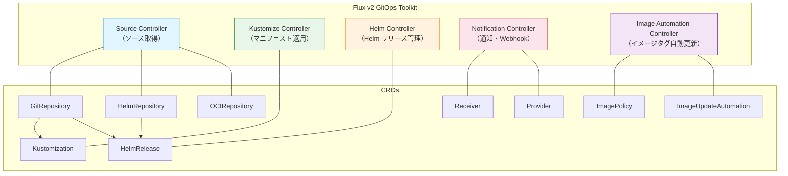

**Source Controller**: Git リポジトリ、Helm リポジトリ、OCI レジストリなどからソースを取得し、Kubernetes クラスター内にアーティファクトとして保存する。`GitRepository`、`HelmRepository`、`OCIRepository` などの CRD を管理する。

**Kustomize Controller**: Source Controller が取得したアーティファクトに対して Kustomize を適用し、最終的な Kubernetes マニフェストをクラスターに適用する。`Kustomization` CRD を管理する（Kustomize の `kustomization.yaml` とは別物であることに注意）。

**Helm Controller**: Source Controller が取得した Helm チャートを使用して Helm リリースを管理する。`HelmRelease` CRD を管理する。

**Notification Controller**: 外部サービスからの Webhook を受信し、Source Controller にリコンシリエーションをトリガーする。また、Flux のイベントを Slack、Microsoft Teams、GitHub などに通知する。

**Image Automation Controller**: コンテナレジストリを監視し、新しいイメージタグが公開されると Git リポジトリ内のマニフェストのイメージタグを自動的に更新してコミットする。

### 5.3 Flux の基本的なリソース定義

Flux v2 でアプリケーションをデプロイする基本的な構成を示す。

```yaml
# Step 1: Define the Git source
apiVersion: source.toolkit.fluxcd.io/v1
kind: GitRepository
metadata:
  name: my-app
  namespace: flux-system
spec:
  interval: 1m
  url: https://github.com/example/config-repo.git
  ref:
    branch: main
  secretRef:
    # Reference to a Secret containing Git credentials
    name: git-credentials
---
# Step 2: Define the Kustomization to apply manifests
apiVersion: kustomize.toolkit.fluxcd.io/v1
kind: Kustomization
metadata:
  name: my-app
  namespace: flux-system
spec:
  interval: 10m
  targetNamespace: my-app
  sourceRef:
    kind: GitRepository
    name: my-app
  path: ./apps/my-app/overlays/production
  prune: true
  healthChecks:
    - apiVersion: apps/v1
      kind: Deployment
      name: my-app
      namespace: my-app
  timeout: 3m
```

Helm チャートを使用する場合は、以下のように `HelmRepository` と `HelmRelease` を組み合わせる。

```yaml
# Define the Helm repository source
apiVersion: source.toolkit.fluxcd.io/v1
kind: HelmRepository
metadata:
  name: ingress-nginx
  namespace: flux-system
spec:
  interval: 1h
  url: https://kubernetes.github.io/ingress-nginx
---
# Define the Helm release
apiVersion: helm.toolkit.fluxcd.io/v2
kind: HelmRelease
metadata:
  name: ingress-nginx
  namespace: flux-system
spec:
  interval: 10m
  chart:
    spec:
      chart: ingress-nginx
      version: "4.11.x"
      sourceRef:
        kind: HelmRepository
        name: ingress-nginx
      interval: 1h
  targetNamespace: ingress-nginx
  install:
    createNamespace: true
  values:
    controller:
      replicaCount: 3
      metrics:
        enabled: true
```

### 5.4 Argo CD と Flux の比較

Argo CD と Flux はどちらも CNCF Graduated の GitOps ツールであるが、設計思想や運用モデルに違いがある。

| 観点 | Argo CD | Flux v2 |
|------|---------|---------|
| アーキテクチャ | 統合型。単一のアプリケーションとして動作 | モジュラー型。独立したコントローラー群 |
| UI | リッチな Web UI を標準搭載 | CLI 中心。Web UI はサードパーティ（Weave GitOps） |
| マルチテナンシー | AppProject による RBAC | Namespace ベースのマルチテナンシー |
| Helm サポート | テンプレートとしてレンダリング | ネイティブな Helm リリース管理（`helm install` 相当） |
| イメージ自動更新 | Argo CD Image Updater（別プロジェクト） | Image Automation Controller（組み込み） |
| 通知 | Argo CD Notifications（組み込み） | Notification Controller（組み込み） |
| 学習コスト | Web UI が直感的で低い | CRD の理解が必要で中程度 |
| 拡張性 | Config Management Plugin | GitOps Toolkit の各コントローラーが独立利用可能 |

::: tip 選定の指針
Web UI による視覚的な管理やマルチクラスターの一元管理を重視するなら Argo CD、Kubernetes ネイティブな宣言的管理やモジュラーな構成を重視するなら Flux v2 が適している。どちらも本番環境で十分に成熟しており、技術的な優劣で選ぶよりも、チームの運用スタイルや既存のワークフローとの親和性で判断するのが現実的である。
:::

## 6. マルチクラスタ管理

### 6.1 マルチクラスターが必要な理由

エンタープライズ環境では、開発（dev）、ステージング（staging）、本番（production）といった複数の環境を別々のクラスターで運用するのが一般的である。さらに、地理的な分散（マルチリージョン）、規制要件（データレジデンシー）、障害分離（ブラストラディウスの最小化）といった要因により、クラスター数は増加する傾向にある。

GitOps の文脈では、これら複数のクラスターに対して一貫したデプロイメントパイプラインを確立することが重要な課題となる。

### 6.2 Argo CD によるマルチクラスター管理

Argo CD はハブ・スポーク型のマルチクラスターモデルを採用している。中央の管理クラスター（ハブ）に Argo CD をインストールし、そこから複数のワークロードクラスター（スポーク）を管理する。

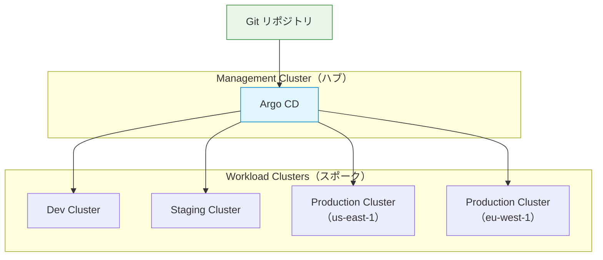

クラスターの登録は `argocd cluster add` コマンドで行う。内部的には、対象クラスターの ServiceAccount とそのクレデンシャルを Secret として管理クラスターに保存する。

ApplicationSet の Cluster ジェネレーターを使用すると、登録されたすべてのクラスターに対して自動的に Application リソースを生成できる。

```yaml
apiVersion: argoproj.io/v1alpha1
kind: ApplicationSet
metadata:
  name: cluster-addons
  namespace: argocd
spec:
  generators:
    - clusters:
        selector:
          matchLabels:
            # Only target clusters with this label
            env: production
  template:
    metadata:
      name: "cluster-addons-{{name}}"
    spec:
      project: default
      source:
        repoURL: https://github.com/example/cluster-addons.git
        targetRevision: main
        path: "addons/overlays/{{metadata.labels.region}}"
      destination:
        server: "{{server}}"
        namespace: kube-system
```

### 6.3 Flux によるマルチクラスター管理

Flux はデフォルトでは各クラスターにインストールし、それぞれが自律的に Git リポジトリを監視するモデルを採用している。ただし、Flux v2 では `kubeConfig` フィールドを使用してリモートクラスターへの適用も可能である。

Flux のマルチクラスター管理では、リポジトリのディレクトリ構成が重要な役割を果たす。

```
config-repo/
├── clusters/
│   ├── dev/
│   │   └── flux-system/
│   │       ├── gotk-components.yaml
│   │       └── gotk-sync.yaml
│   ├── staging/
│   │   └── flux-system/
│   │       ├── gotk-components.yaml
│   │       └── gotk-sync.yaml
│   └── production/
│       └── flux-system/
│           ├── gotk-components.yaml
│           └── gotk-sync.yaml
├── infrastructure/
│   ├── base/
│   │   ├── cert-manager/
│   │   ├── ingress-nginx/
│   │   └── monitoring/
│   └── overlays/
│       ├── dev/
│       ├── staging/
│       └── production/
└── apps/
    ├── base/
    │   └── my-app/
    └── overlays/
        ├── dev/
        ├── staging/
        └── production/
```

各クラスターの Flux インスタンスは `clusters/<env>/` 以下を起点として監視し、Kustomize の overlay パターンで環境ごとの差分を管理する。

### 6.4 環境プロモーション戦略

マルチクラスター環境では、変更を dev → staging → production と段階的に昇格（プロモーション）させるワークフローが必要となる。

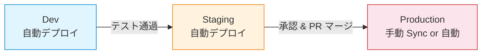

プロモーションの実現方法にはいくつかのパターンがある。

**ブランチベースのプロモーション**: 環境ごとにブランチを分け（`develop`、`staging`、`main`）、ブランチ間のマージでプロモーションを行う。シンプルだが、ブランチの管理が煩雑になりやすい。

**ディレクトリベースのプロモーション**: 単一ブランチ上で環境ごとのディレクトリ（overlay）を分け、各ディレクトリのイメージタグを更新することでプロモーションを行う。Kustomize の overlay パターンと親和性が高い。

**タグベースのプロモーション**: Git タグやリリースを作成し、各環境の `targetRevision` を異なるタグに設定する。本番環境は厳密にバージョニングされたタグのみを参照する。

## 7. Secret 管理

### 7.1 GitOps における Secret の課題

GitOps の原則では、すべての設定を Git に格納すべきである。しかし、データベースのパスワード、API キー、TLS 証明書といった機密情報（Secret）をそのまま Git にコミットすることはセキュリティ上許容されない。これは GitOps の根本的なジレンマである。

この課題に対する代表的なアプローチを以下に示す。

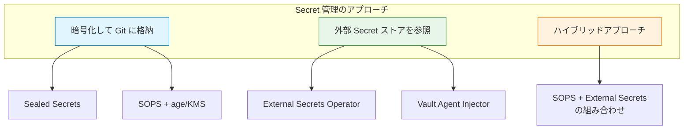

### 7.2 Sealed Secrets

Sealed Secrets は Bitnami が開発した Kubernetes コントローラーであり、暗号化された Secret（SealedSecret）を Git に安全に格納できる仕組みを提供する。

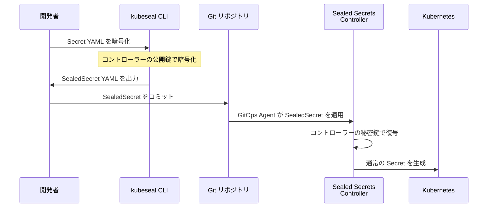

使用方法を示す。

```bash
# Create a regular Secret
kubectl create secret generic db-credentials \
  --from-literal=username=admin \
  --from-literal=password=s3cr3t \
  --dry-run=client -o yaml > secret.yaml

# Encrypt it using kubeseal
kubeseal --format yaml \
  --controller-name=sealed-secrets \
  --controller-namespace=kube-system \
  < secret.yaml > sealed-secret.yaml
```

生成される SealedSecret は以下のようになる。

```yaml
apiVersion: bitnami.com/v1alpha1
kind: SealedSecret
metadata:
  name: db-credentials
  namespace: my-app
spec:
  encryptedData:
    # Encrypted with the controller's public key
    username: AgBy3i4OJSWK+PiTySYZZA9rO43cGDEq...
    password: AgCtrNJVxp3l8Kh2DSJNqzL9RmPJGb4nW...
  template:
    metadata:
      name: db-credentials
      namespace: my-app
    type: Opaque
```

::: warning Sealed Secrets の注意点
Sealed Secrets の暗号化はクラスターごとの鍵ペアに紐づいている。つまり、あるクラスター向けに暗号化された SealedSecret は、別のクラスターでは復号できない。クラスターの再構築時にはバックアップした鍵ペアの復元が必要であり、この鍵管理自体が運用上の課題となる。
:::

### 7.3 SOPS（Secrets OPerationS）

SOPS は Mozilla が開発した暗号化ツールであり、YAML、JSON、ENV ファイルの値部分のみを暗号化できる。鍵にはキーがStructure が保持されるため、差分の確認が容易である。AWS KMS、GCP KMS、Azure Key Vault、age、PGP など多様な鍵管理システムに対応している。

```yaml
apiVersion: v1
kind: Secret
metadata:
  name: db-credentials
  namespace: my-app
type: Opaque
stringData:
  # Only values are encrypted; keys remain readable
  username: ENC[AES256_GCM,data:dGVzdA==,iv:...,tag:...,type:str]
  password: ENC[AES256_GCM,data:cGFzc3dvcmQ=,iv:...,tag:...,type:str]
sops:
  kms:
    - arn: arn:aws:kms:us-east-1:123456789:key/abcd-1234
      created_at: "2026-03-05T00:00:00Z"
      enc: AQICAHh...
  lastmodified: "2026-03-05T00:00:00Z"
  mac: ENC[AES256_GCM,data:...,iv:...,tag:...,type:str]
  version: 3.9.0
```

Flux v2 は SOPS をネイティブにサポートしている。Kustomization リソースに `decryption` フィールドを追加するだけで、SOPS で暗号化されたファイルを自動的に復号してクラスターに適用できる。

```yaml
apiVersion: kustomize.toolkit.fluxcd.io/v1
kind: Kustomization
metadata:
  name: my-app
  namespace: flux-system
spec:
  interval: 10m
  sourceRef:
    kind: GitRepository
    name: my-app
  path: ./apps/my-app
  prune: true
  # Enable SOPS decryption
  decryption:
    provider: sops
    secretRef:
      # Secret containing the age private key or KMS credentials
      name: sops-age-key
```

Argo CD で SOPS を使用する場合は、Argo CD の Helm/Kustomize プラグインとして `ksops`（Kustomize SOPS プラグイン）を設定するか、`argocd-vault-plugin` を使用する。

### 7.4 External Secrets Operator

External Secrets Operator（ESO）は、外部の Secret 管理サービス（AWS Secrets Manager、HashiCorp Vault、Google Secret Manager など）から Secret を取得し、Kubernetes の Secret リソースとして同期するオペレーターである。

```yaml
# Define the external secret store connection
apiVersion: external-secrets.io/v1beta1
kind: ClusterSecretStore
metadata:
  name: aws-secrets-manager
spec:
  provider:
    aws:
      service: SecretsManager
      region: ap-northeast-1
      auth:
        jwt:
          serviceAccountRef:
            name: external-secrets-sa
            namespace: external-secrets
---
# Define which secret to sync
apiVersion: external-secrets.io/v1beta1
kind: ExternalSecret
metadata:
  name: db-credentials
  namespace: my-app
spec:
  refreshInterval: 1h
  secretStoreRef:
    kind: ClusterSecretStore
    name: aws-secrets-manager
  target:
    name: db-credentials
    creationPolicy: Owner
  data:
    - secretKey: username
      remoteRef:
        key: production/db-credentials
        property: username
    - secretKey: password
      remoteRef:
        key: production/db-credentials
        property: password
```

External Secrets Operator のアプローチでは、Git には ExternalSecret リソースの定義（参照情報）のみを格納し、実際の機密情報は外部ストアに保持する。GitOps の原則に沿いながら、機密情報の一元管理を実現できる。

## 8. Progressive Delivery（Argo Rollouts）

### 8.1 Progressive Delivery とは

Progressive Delivery（段階的デリバリー）は、新しいバージョンのアプリケーションを段階的にリリースし、問題が検出された場合は自動的にロールバックするデプロイ戦略である。従来のローリングアップデートでは、全ての Pod が一斉に新バージョンに置き換わるため、問題発生時の影響範囲が大きかった。Progressive Delivery はこのリスクを最小化する。

Kubernetes 標準の Deployment リソースは、ローリングアップデートと Recreate の2つの戦略しかサポートしていない。Canary デプロイやブルーグリーンデプロイといった高度なデプロイ戦略を実現するには、Argo Rollouts や Flagger といった追加のツールが必要となる。

### 8.2 Argo Rollouts のアーキテクチャ

Argo Rollouts は Kubernetes のカスタムコントローラーであり、`Rollout` CRD を通じて高度なデプロイ戦略を提供する。Kubernetes の Deployment を置き換えるものとして機能し、Canary、ブルーグリーン、実験的デプロイなどをサポートする。

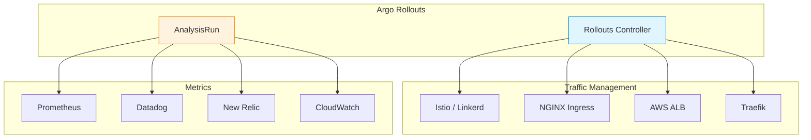

### 8.3 Canary デプロイ

Canary デプロイは、新バージョンを少量のトラフィックから始めて段階的にトラフィックを増やしていく戦略である。各ステップでメトリクスを分析し、異常が検出されれば自動ロールバックする。

```yaml
apiVersion: argoproj.io/v1alpha1
kind: Rollout
metadata:
  name: my-app
  namespace: my-app
spec:
  replicas: 10
  revisionHistoryLimit: 3
  selector:
    matchLabels:
      app: my-app
  template:
    metadata:
      labels:
        app: my-app
    spec:
      containers:
        - name: my-app
          image: registry.example.com/my-app:v2.0.0
          ports:
            - containerPort: 8080
  strategy:
    canary:
      # Traffic routing via service mesh or ingress controller
      canaryService: my-app-canary
      stableService: my-app-stable
      trafficRouting:
        istio:
          virtualServices:
            - name: my-app-vsvc
              routes:
                - primary
      steps:
        # Step 1: Route 5% of traffic to canary
        - setWeight: 5
        # Step 2: Wait and analyze metrics
        - pause:
            duration: 5m
        # Step 3: Run automated analysis
        - analysis:
            templates:
              - templateName: success-rate
            args:
              - name: service-name
                value: my-app-canary
        # Step 4: Increase to 25%
        - setWeight: 25
        - pause:
            duration: 5m
        - analysis:
            templates:
              - templateName: success-rate
            args:
              - name: service-name
                value: my-app-canary
        # Step 5: Increase to 50%
        - setWeight: 50
        - pause:
            duration: 10m
        - analysis:
            templates:
              - templateName: success-rate
            args:
              - name: service-name
                value: my-app-canary
        # Step 6: Full rollout (100%)
        - setWeight: 100
```

### 8.4 AnalysisTemplate によるメトリクス自動分析

Argo Rollouts の `AnalysisTemplate` は、Canary デプロイの各ステップでメトリクスを自動的に分析し、デプロイの継続やロールバックを判断する仕組みである。

```yaml
apiVersion: argoproj.io/v1alpha1
kind: AnalysisTemplate
metadata:
  name: success-rate
  namespace: my-app
spec:
  args:
    - name: service-name
  metrics:
    - name: success-rate
      # Run every 2 minutes
      interval: 2m
      # Number of measurements before concluding
      count: 3
      # Minimum number of successful measurements
      successCondition: result[0] >= 0.95
      failureLimit: 1
      provider:
        prometheus:
          address: http://prometheus.monitoring:9090
          query: |
            sum(rate(
              istio_requests_total{
                destination_service=~"{{args.service-name}}",
                response_code!~"5.*"
              }[5m]
            )) /
            sum(rate(
              istio_requests_total{
                destination_service=~"{{args.service-name}}"
              }[5m]
            ))
    - name: latency-p99
      interval: 2m
      count: 3
      # P99 latency must be under 500ms
      successCondition: result[0] < 500
      failureLimit: 1
      provider:
        prometheus:
          address: http://prometheus.monitoring:9090
          query: |
            histogram_quantile(0.99,
              sum(rate(
                istio_request_duration_milliseconds_bucket{
                  destination_service=~"{{args.service-name}}"
                }[5m]
              )) by (le)
            )
```

この AnalysisTemplate は、Canary バージョンの成功率（5xx 以外のレスポンスの割合）が95%以上であること、および P99 レイテンシが500ms以下であることを検証する。条件を満たさない場合、Argo Rollouts は自動的にロールバックを実行する。

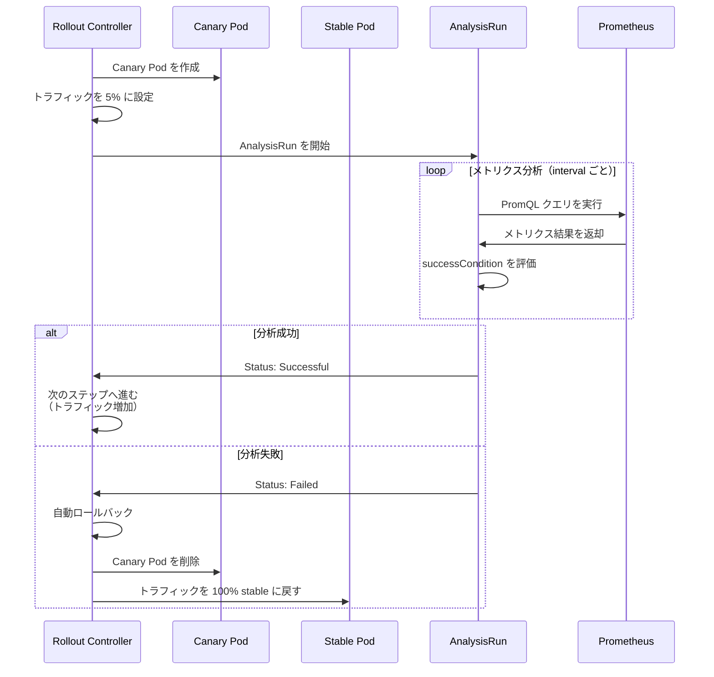

### 8.5 ブルーグリーンデプロイ

ブルーグリーンデプロイは、現行バージョン（Blue）と新バージョン（Green）の2つの完全なセットを同時に稼働させ、トラフィックを一括で切り替える戦略である。

```yaml
apiVersion: argoproj.io/v1alpha1
kind: Rollout
metadata:
  name: my-app
  namespace: my-app
spec:
  replicas: 5
  selector:
    matchLabels:
      app: my-app
  template:
    metadata:
      labels:
        app: my-app
    spec:
      containers:
        - name: my-app
          image: registry.example.com/my-app:v2.0.0
          ports:
            - containerPort: 8080
  strategy:
    blueGreen:
      # Service routing production traffic
      activeService: my-app-active
      # Service routing preview traffic (for testing)
      previewService: my-app-preview
      # Auto-promote after analysis succeeds
      autoPromotionEnabled: true
      # Run analysis before promotion
      prePromotionAnalysis:
        templates:
          - templateName: smoke-tests
        args:
          - name: preview-url
            value: http://my-app-preview.my-app.svc.cluster.local
      # Scale down old version after specified duration
      scaleDownDelaySeconds: 300
```

### 8.6 Flagger（Flux エコシステム）

Flux エコシステムにおける Progressive Delivery ツールとしては Flagger がある。Flagger は Flux と同じく Weaveworks が開発したツールであり、CNCF Graduated プロジェクトの一部である。Argo Rollouts が独自の Rollout CRD を導入するのに対し、Flagger は標準の Kubernetes Deployment を使用しつつ、Canary CRD で段階的デプロイを実現する点が設計上の違いである。

## 9. GitOps の課題と対策

### 9.1 Secret 管理の複雑さ

前述の通り、機密情報の Git 管理は GitOps の根本的な課題である。対策として Sealed Secrets、SOPS、External Secrets Operator などの選択肢があるが、いずれも追加の運用負荷を伴う。

**対策**: プロジェクトの規模やセキュリティ要件に応じて適切なアプローチを選定する。小規模なプロジェクトでは Sealed Secrets や SOPS で十分だが、エンタープライズ環境では External Secrets Operator と HashiCorp Vault の組み合わせが推奨される。

### 9.2 ステートフルなリソースの管理

GitOps は宣言的な状態管理を前提としているが、データベースのマイグレーションや一度限りの Job など、命令的な操作が必要なケースも存在する。

**対策**: Kubernetes の Job や CronJob を Git で管理しつつ、`argocd.argoproj.io/hook` アノテーションや Flux の `dependsOn` を活用して実行順序を制御する。データベースマイグレーションは、Init Container やサイドカーパターンで対応する方法もある。

```yaml
apiVersion: batch/v1
kind: Job
metadata:
  name: db-migration
  annotations:
    # Argo CD Sync Hook: run before other resources
    argocd.argoproj.io/hook: PreSync
    # Delete the Job after completion
    argocd.argoproj.io/hook-delete-policy: HookSucceeded
spec:
  template:
    spec:
      containers:
        - name: migrate
          image: registry.example.com/my-app:v2.0.0
          command: ["./migrate", "--target", "latest"]
      restartPolicy: Never
  backoffLimit: 3
```

### 9.3 ドリフト検知の限界

Argo CD や Flux はマニフェストレベルでの差分を検知するが、Kubernetes コントローラーが自動的に付与するフィールド（例: Deployment の `status`、Service の `clusterIP`）や、Admission Webhook が挿入するフィールドによって、誤ったドリフト検知（False Positive）が発生することがある。

**対策**: Argo CD の `ignoreDifferences` や Flux の `fieldManager` の設定を適切に行い、管理外のフィールドを無視する。また、Server-Side Apply を活用することで、フィールドの所有権（Field Ownership）を明確にし、誤検知を減らすことができる。

### 9.4 大規模環境でのスケーラビリティ

数百のアプリケーションや数十のクラスターを管理する大規模環境では、GitOps ツール自体のパフォーマンスが課題となる。

**対策**:

- **Argo CD**: Application Controller のシャーディング（複数レプリカでアプリケーションを分散処理）を有効にする。Redis のキャッシュを活用し、Git リポジトリへのアクセス頻度を最適化する。
- **Flux**: 各クラスターに Flux をインストールする分散型アーキテクチャにより、中央集権型のボトルネックを回避する。
- **共通**: Git リポジトリを目的別に分割し、単一リポジトリの肥大化を防ぐ。マニフェストの生成（Helm template や Kustomize build）はキャッシュを活用する。

### 9.5 緊急時のホットフィックス

本番環境で緊急の障害が発生した場合、Git を経由したデプロイフローでは対応が遅れる懸念がある。

**対策**: 緊急時の手順を事前に定義しておく。選択肢としては以下がある。

1. **高速 Git パス**: 通常の Pull Request レビューを省略し、管理者権限で直接 main ブランチに Push する緊急フローを用意する。GitOps エージェントは通常通り動作するが、変更までの遅延を最小化する。
2. **一時的な Auto Sync 無効化**: Argo CD の Auto Sync を一時的に無効にし、`kubectl` で直接修正する。修正後、Git に変更を反映してから Auto Sync を再有効化する。
3. **Webhook の即時トリガー**: ポーリング間隔による遅延を排除するため、Webhook による即時リコンシリエーションを活用する。

::: danger 手動変更のリスク
緊急時に `kubectl` で直接変更を行った場合、**必ず** Git にその変更を反映すること。Git と実際の状態の乖離を放置すると、次のリコンシリエーションで変更が巻き戻される。また、監査証跡の観点からも、すべての変更は最終的に Git に記録されるべきである。
:::

### 9.6 学習コストと組織の成熟度

GitOps は強力なパラダイムだが、その導入には組織全体の理解と協力が必要である。開発者、SRE、セキュリティチームが GitOps のワークフローを理解し、遵守する必要がある。

**対策**: 段階的な導入が効果的である。まずは非本番環境で GitOps を試行し、チームが慣れてから本番環境に展開する。また、内部ドキュメントやテンプレートリポジトリを整備し、新しいアプリケーションの GitOps 対応を容易にする。

### 9.7 Git リポジトリの可用性

GitOps では Git リポジトリが Single Source of Truth であるため、Git リポジトリが利用不能になるとデプロイが停止する。

**対策**: Git リポジトリの高可用性を確保する。GitHub Enterprise や GitLab の HA 構成を利用するか、Git ミラーを設定する。なお、Git リポジトリが一時的に不通になっても、既にデプロイ済みのアプリケーションには影響しない。新規デプロイや変更の適用のみが遅延する。

## 10. まとめ

GitOps は、Git を中心とした宣言的な運用パラダイムであり、Kubernetes エコシステムにおけるデプロイと運用の標準的なアプローチとして定着しつつある。その本質は、以下の3つの要素の組み合わせにある。

1. **宣言的な望ましい状態の定義**: Kubernetes マニフェストや Helm チャートとして、システムのあるべき姿をコードで記述する。
2. **Git による変更管理**: すべての変更は Git のコミットとして記録され、レビュー、承認、監査が可能な形で管理される。
3. **自動的なリコンシリエーション**: ソフトウェアエージェント（Argo CD や Flux）が Git の状態とクラスターの実際の状態を継続的に比較し、差分を自動的に解消する。

Argo CD は統合された Web UI と強力なマルチクラスター管理機能を持ち、Flux v2 はモジュラーなアーキテクチャと Kubernetes ネイティブな設計思想を持つ。どちらも CNCF Graduated プロジェクトとして成熟しており、選定はチームの要件と好みに基づいて行うべきである。

Secret 管理、Progressive Delivery、マルチクラスター管理、緊急時対応といった課題に対しては、エコシステムの各ツール（Sealed Secrets、SOPS、External Secrets Operator、Argo Rollouts、Flagger など）を組み合わせることで実用的な解決策を構築できる。

GitOps の成功は、ツールの選定だけでなく、組織全体の運用文化の変革にかかっている。「Git にないものはクラスターに存在すべきではない」という原則を徹底し、手動変更を排除する文化を醸成することが、GitOps の真の価値を引き出す鍵である。
