# Go のランタイム内部（goroutine スケジューラ, GC, channel）

## 1. Go ランタイムの全体像

Go は「バッテリー同梱」な言語設計を掲げており、ガベージコレクション、goroutine スケジューラ、channel を基盤とする並行プリミティブをランタイムとして言語に組み込んでいる。C や C++ のように OS に管理を委ねるのではなく、Go のランタイムはユーザー空間で独自のスケジューラを動かし、独自のメモリアロケータを持ち、独自の GC を実装している。

この設計によって得られる恩恵は大きい。goroutine は OS スレッドより遥かに軽量（初期スタック 2KB〜8KB）で、数十万規模の goroutine を同時に動かすことができる。チャネルは goroutine 間通信の安全な抽象を提供し、共有メモリとロックによる複雑な同期コードを書かなくて済む。GC は Stop-the-World の停止を最小化するよう設計されており、マイクロ秒オーダーの停止時間を実現している。

ただし、こうした恩恵の裏には深い実装上のトレードオフが潜んでいる。本記事ではランタイムの核心部分を深く掘り下げ、**なぜそのような設計になっているのか** という問いに答えていく。

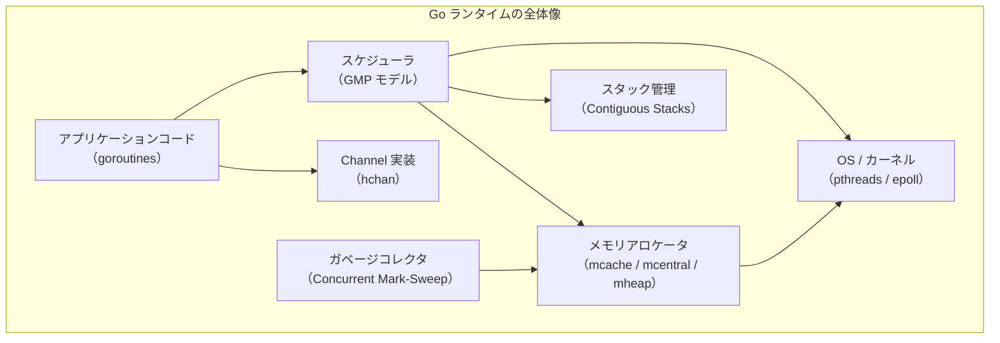

Go ランタイムのソースコードは `src/runtime/` に収められており、ほぼすべてが Go 自身で書かれている（一部のアセンブリを除く）。本記事のコード例は Go 1.22 前後の実装を参照している。

## 2. GMP モデル — goroutine スケジューリングの基盤

### 2.1 なぜ M:N スレッディングが必要か

OS スレッドは重い。Linux の pthread は通常 8MB のスタックを事前確保し、スレッド生成にはシステムコールが必要で、コンテキストスイッチにも数マイクロ秒かかる。1 スレッド = 1 タスクというモデルでは、数万の並行タスクを扱うサーバーを作るのはコスト的に現実的でない。

Go は **M:N スレッディング** を採用した。N 個の goroutine を M 個の OS スレッド上で多重化し、goroutine の切り替えはユーザー空間で完結させる。これによりスレッドプールの形成、コンテキストスイッチのオーバーヘッド削減、goroutine の軽量なライフサイクル管理が実現される。

### 2.2 G・M・P の定義

Go スケジューラの中心的な抽象は **G（Goroutine）**・**M（Machine）**・**P（Processor）** の 3 つである。

**G（Goroutine）** はコルーチンの一種で、スタック、プログラムカウンタ、実行状態などを保持する構造体 `runtime.g` として表現される。goroutine は `go` 文が評価されるたびに生成される。生成コストは非常に小さく、数マイクロ秒・数百バイトのオーダーである。

**M（Machine）** は OS スレッドそのものへの参照であり、`runtime.m` 構造体で表現される。M は実際に CPU 上でコードを実行するエンティティである。M の数はデフォルトで `GOMAXPROCS` と GC・syscall によって変動するが、最大 10000 まで増える可能性がある（`SetMaxThreads` で設定可能）。

**P（Processor）** はスケジューリングの文脈（context）であり、`runtime.p` 構造体で表現される。P はローカルの goroutine キュー、mcache（メモリアロケータのキャッシュ）、その他のリソースを持つ。P の数は `GOMAXPROCS` で決まり、デフォルトでは論理 CPU 数と等しい。

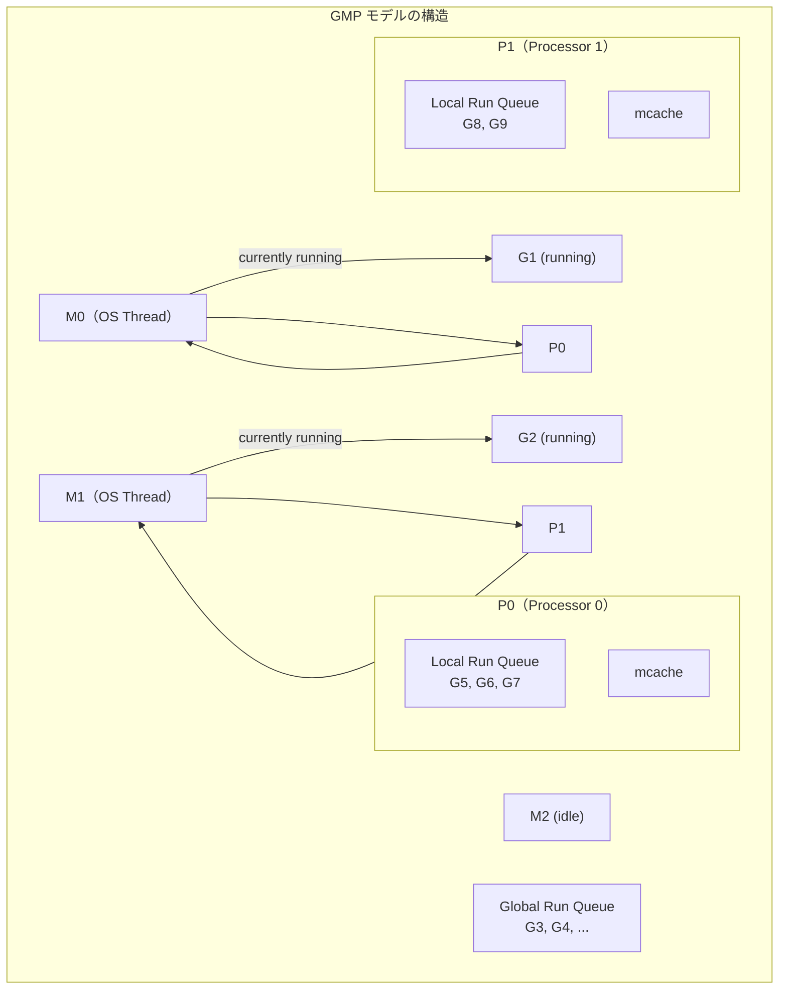

### 2.3 スケジューリングの基本サイクル

M が P を取得し、P のローカルキューから G を取り出して実行する、というのが基本サイクルである。

```go
// Simplified scheduling loop (runtime/proc.go)
func schedule() {
    _g_ := getg()  // get current G (the scheduler goroutine)

    // Try to get a runnable goroutine from the local run queue
    gp, inheritTime, tryWakeP := findRunnable()

    // Execute the goroutine
    execute(gp, inheritTime)
}
```

`findRunnable` の中では以下の順に実行可能な G を探す。

1. ネットポーラー（epoll/kqueue）からの I/O 完了通知
2. ローカルキュー（1/61 の確率でグローバルキューを先に見る）
3. グローバルキュー
4. ワークスティーリング（他の P のキューから盗む）
5. GC ワーカー

1/61 の確率でグローバルキューを先に見る理由は、グローバルキューの goroutine が飢餓状態に陥るのを防ぐためである。ローカルキューのみを優先すると、グローバルキューの goroutine が永久に実行されない可能性がある。

### 2.4 Goroutine の状態遷移

goroutine は複数の状態を持ち、スケジューラはこれらの状態を遷移させながら実行を管理する。

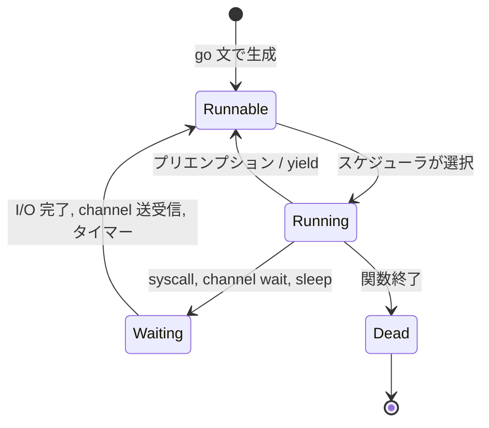

`_Grunnable`（実行可能）、`_Grunning`（実行中）、`_Gwaiting`（待機中）、`_Gdead`（終了）が主要な状態である。`runtime.g` の `atomicstatus` フィールドにアトミックに状態が格納される。

## 3. プリエンプション — 協調的から非協調的へ

### 3.1 協調的プリエンプション（〜Go 1.13）

Go 1.13 以前のスケジューラは**協調的プリエンプション（cooperative preemption）**を採用していた。goroutine は自発的にスケジューラに制御を返さない限り、CPU を手放さない。制御が返されるポイントは以下のような場合に限られていた。

- 関数呼び出し時のスタック成長チェック
- `runtime.Gosched()` の呼び出し
- channel の送受信
- システムコール

この設計のシンプルさには利点があったが、重大な問題をはらんでいた。**タイトなループ（tight loop）** を実行する goroutine は GC のための Stop-the-World を無期限にブロックできてしまうのである。

```go
// This loop would block GC under cooperative preemption
func infiniteLoop() {
    for {
        // no function calls → no preemption point
        x++
    }
}
```

### 3.2 非協調的プリエンプション（Go 1.14〜）

Go 1.14 で**非協調的プリエンプション（asynchronous preemption）**が導入された。OS シグナル（SIGURG）を使って実行中の goroutine を強制的に停止する仕組みである。

仕組みは以下のとおりである。

1. `sysmon` スレッドが一定時間（10ms）以上同じ G が動いていることを検出する
2. `preemptone` 関数が対象 M に `SIGURG` シグナルを送る
3. M のシグナルハンドラがスタックに偽の関数呼び出しフレームを挿入する
4. goroutine が次の命令を実行すると、偽のフレームが `asyncPreempt` 関数を呼び出す
5. `asyncPreempt` はスケジューラを呼び出し、goroutine を `_Grunnable` に戻す

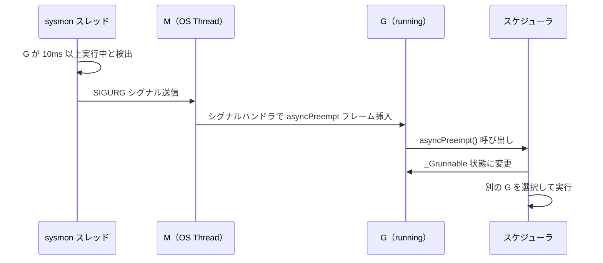

SIGURG を選んだ理由は、多くの既存コードが SIGUSR1/SIGUSR2 を使っているため衝突を避けるためであり、また SIGURG は cgo や外部ライブラリとの干渉が少ないからである。

### 3.3 sysmon — ランタイムの監視スレッド

`sysmon` は P を持たない特殊な OS スレッドで、以下の役割を持つ。

- プリエンプション要求（10ms 以上実行している goroutine を検出）
- ネットポーリング（ブロックしている I/O の定期チェック）
- P の回収（syscall でブロックされた M から P を取り上げる）
- タイマーの確認

`sysmon` 自体はスリープと覚醒を繰り返し、アイドル時は 10ms まで待ち時間を伸ばす。これにより CPU をほとんど消費せずにランタイムの健全性を維持できる。

## 4. ワークスティーリング

### 4.1 問題背景

`GOMAXPROCS=4` の環境で 1 つの P のローカルキューだけに goroutine が詰まっている状況を考えよう。他の 3 つの P は仕事がなくアイドルになってしまう。これを解消するのが**ワークスティーリング（work-stealing）**である。

### 4.2 スティーリングのアルゴリズム

Go のワークスティーリングは Fork-Join モデルに基づく Cilk スタイルのアルゴリズムを参考にしている。

```
Steal from other P:
1. Pick a random victim P
2. Try to steal half of its local run queue
3. If steal fails, try next P
4. After all Ps tried, check global queue
5. If still nothing, park M (put it to sleep)
```

具体的には `runtime.runqsteal` 関数が相手の P のキューからおよそ半分の goroutine を取り出す。半分を盗む理由は、少なすぎると負荷分散の効果が薄く、多すぎるとスティーリングのオーバーヘッドが増えるためのバランスである。

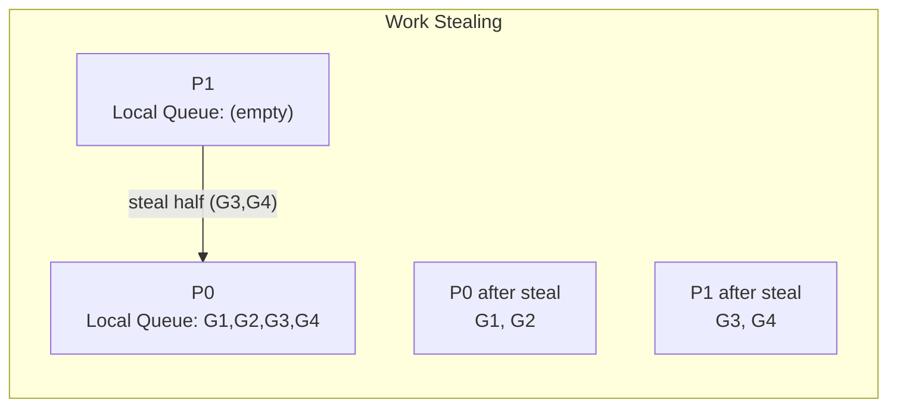

### 4.3 グローバルキューとの関係

ローカルキューには最大 256 個の goroutine しか入らない。ローカルキューが満杯のときは、ローカルキューの半分をグローバルキューに移動させてから新しい G を追加する。グローバルキューは `runtime.schedt` 構造体が持つ mutex で保護されている。ローカルキューへのアクセスにはアトミック操作を使いロックなしで行えるよう設計されており、グローバルキューよりも高速にアクセスできる。

## 5. Channel の内部実装

### 5.1 hchan 構造体

channel の実体は `runtime.hchan` 構造体である。`make(chan T, n)` を呼ぶと、ヒープ上に `hchan` が確保される。

```go
// Simplified hchan structure (runtime/chan.go)
type hchan struct {
    qcount   uint           // number of elements in the queue
    dataqsiz uint           // size of the circular queue
    buf      unsafe.Pointer // pointer to circular buffer (for buffered channels)
    elemsize uint16         // size of each element
    closed   uint32         // non-zero if channel is closed
    elemtype *_type         // element type info (for GC)
    sendx    uint           // send index in circular buffer
    recvx    uint           // receive index in circular buffer
    recvq    waitq          // list of waiting receivers (sudog list)
    sendq    waitq          // list of waiting senders (sudog list)
    lock     mutex          // protects all fields
}
```

バッファ付き channel は `buf` ポインタが指す循環バッファを持つ。`sendx` と `recvx` がそれぞれ次の書き込み位置と読み出し位置を示す。

### 5.2 sudog — 待機中の goroutine の表現

channel の送受信がブロックする場合、goroutine は **sudog（sudo-goroutine）** 構造体にラップされて待機キューに入れられる。

```go
// Simplified sudog structure (runtime/runtime2.go)
type sudog struct {
    g          *g             // the goroutine waiting
    next       *sudog         // next in waitq
    prev       *sudog         // prev in waitq
    elem       unsafe.Pointer // pointer to element being sent/received
    acquiretime int64
    releasetime int64
    ticket      uint32
    isSelect    bool           // true if goroutine is in a select statement
    success     bool           // true if channel operation was successful
    parent      *sudog         // for semaRoot tree
    waitlink    *sudog
    waittail    *sudog
    c           *hchan         // channel this sudog is waiting on
}
```

sudog はオブジェクトプールで管理されており、`acquireSudog` / `releaseSudog` で再利用される。これにより頻繁な channel 操作でも GC 圧力を抑えられる。

### 5.3 送信のフロー

`ch <- v` が実行されると `runtime.chansend` が呼ばれる。

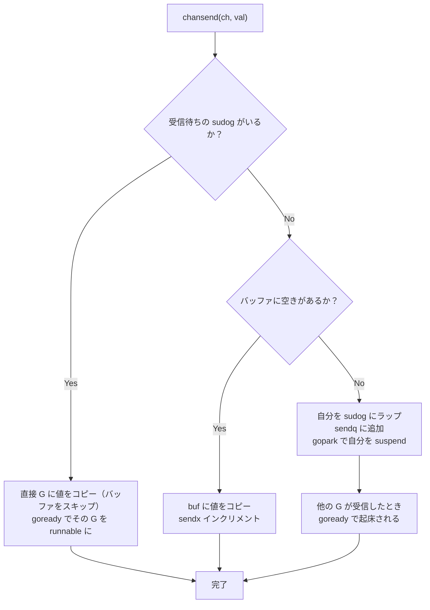

受信待ちの goroutine がいる場合は**バッファを経由せず直接コピー**するのがポイントである。これは "direct send" または "bypass copy" と呼ばれる最適化で、余分なコピーを省いてレイテンシを削減する。

### 5.4 受信のフロー

`v := <-ch` が実行されると `runtime.chanrecv` が呼ばれる。

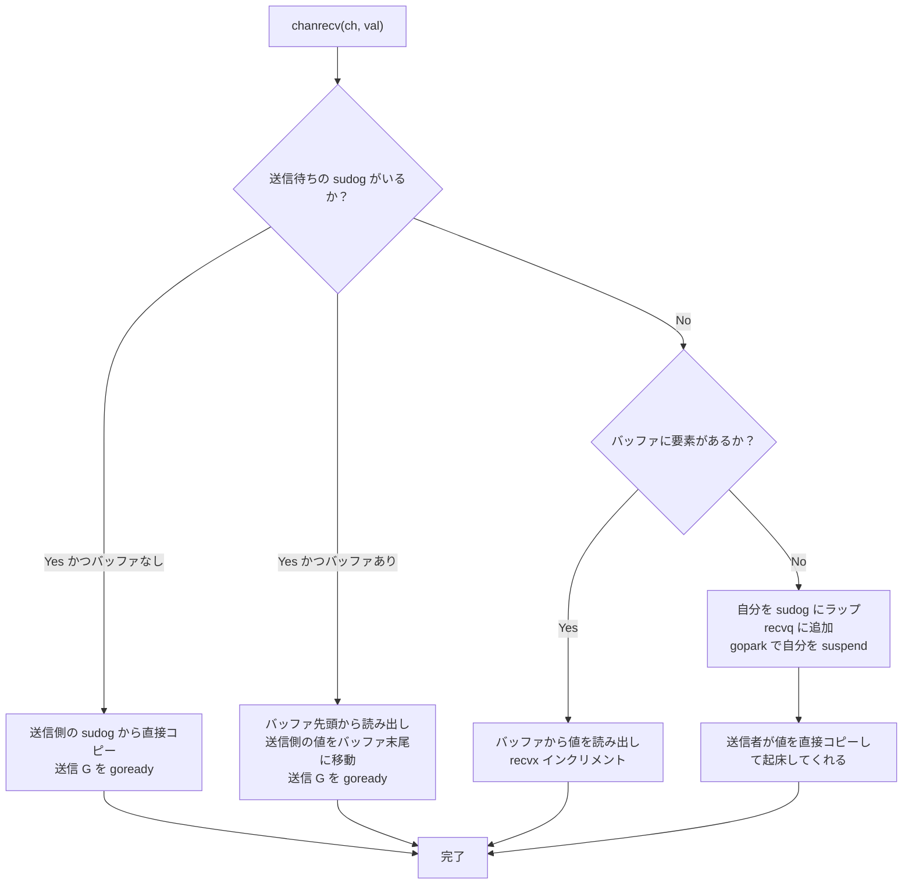

### 5.5 select 文の実装

`select` 文は複数の channel 操作をノンブロッキングに試みる。内部では `runtime.selectgo` が呼ばれ、以下の手順で実行される。

1. すべての case の channel にランダムな順でロックを取得（デッドロック防止のため順序をランダム化）
2. 準備できている case を探す（バッファが空でない受信、バッファに空きがある送信、など）
3. 複数準備できていればランダムに1つを選ぶ（公平性の保証）
4. 何も準備できていなければ、すべての channel の待機キューに sudog を登録し、gopark でスリープ
5. 誰かが起こしてくれたとき、他の channel の sudog をすべてキャンセルする

ランダム化は重要で、`select { case ch1: ... case ch2: ... }` において ch1 を常に優先すると ch2 が飢餓状態に陥る。Go は擬似乱数で case の評価順序をシャッフルすることで公平性を保証している。

## 6. ガベージコレクタの進化

### 6.1 GC の歴史的変遷

Go の GC は言語の進化とともに大きく変化してきた。

| バージョン | GC 方式 | 特徴 |
|---|---|---|
| Go 1.0〜1.3 | Stop-the-World Mark-Sweep | シンプルだが停止時間が長い（100ms〜秒単位） |
| Go 1.4 | 精度向上（precise GC） | ポインタを正確に識別 |
| Go 1.5 | Concurrent Mark-Sweep | 大部分を並行実行、目標 10ms 以下 |
| Go 1.8 | Hybrid Write Barrier | STW の削減（Sub-millisecond） |
| Go 1.14〜 | 継続的改善 | マイクロ秒オーダー |

### 6.2 Tri-color Marking アルゴリズム

Go の GC は **Tri-color Mark-Sweep（三色マーキング）** アルゴリズムに基づく。

- **白（White）**: まだスキャンされていないオブジェクト。GC サイクル終了後も白のままなら回収対象
- **グレー（Gray）**: 到達可能と判明したが、参照先をまだスキャンしていないオブジェクト
- **黒（Black）**: 到達可能で、参照先のスキャンも完了したオブジェクト

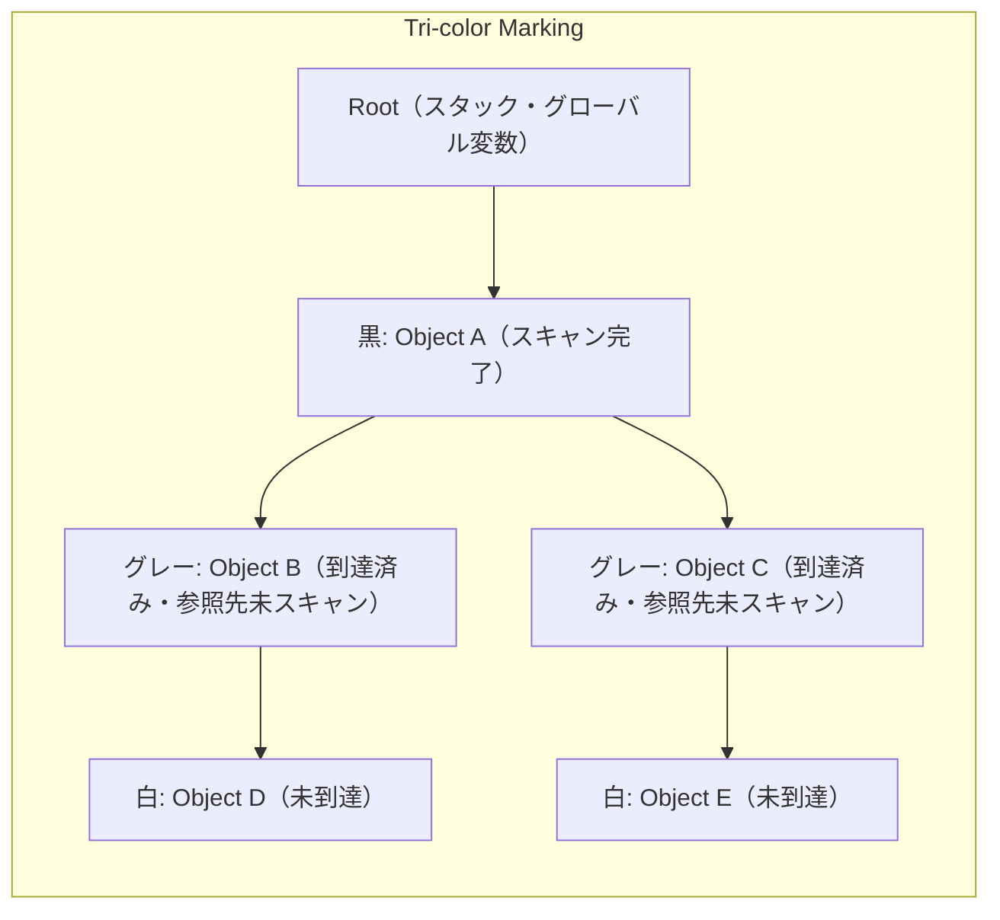

マーキングフェーズでは、グレーオブジェクトを取り出し、その参照先を白から白→グレーに変え、自身を黒にする。これをグレーオブジェクトがなくなるまで繰り返す。残った白オブジェクトがゴミである。

### 6.3 並行実行の課題と Write Barrier

GC と mutator（アプリケーション goroutine）が並行して動くと、以下の問題が生じる。

**黒から白へのポインタ追加**: 黒オブジェクト A が白オブジェクト D への参照を取得したとき、D はグレーキューに入っていないため回収されてしまう（**誤回収**）。

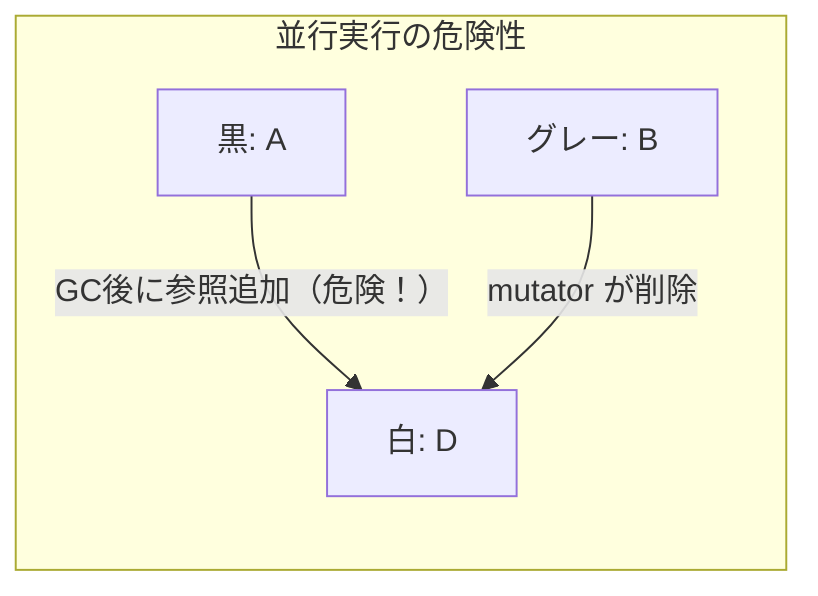

この問題を解決するのが **Write Barrier（書き込みバリア）** である。Write Barrier はポインタへの書き込み時に自動的に挿入されるコードで、GC に変更を通知する。

### 6.4 Hybrid Write Barrier（Go 1.8〜）

Go 1.8 で導入された **Hybrid Write Barrier** は Dijkstra の挿入バリアと Yuasa の削除バリアを組み合わせたものである。

```
// Hybrid Write Barrier (conceptual)
writePointer(slot, ptr):
    shade(*slot)   // shade the old value (deletion barrier)
    shade(ptr)     // shade the new value (insertion barrier)
    *slot = ptr    // perform the actual write
```

`shade(ptr)` はポインタが指すオブジェクトを白からグレーにする操作である（すでにグレーや黒なら何もしない）。

Hybrid Write Barrier の重要な特性は、**スタックへの Write Barrier が不要**になったことである。Go 1.7 以前はスタックスキャンのために STW が必要だったが、Hybrid Write Barrier ではヒープへの書き込みにのみバリアを挿入することで、スタックの再スキャンが不要になり STW をサブミリ秒以下に抑えられるようになった。

### 6.5 GC サイクルの全体フロー

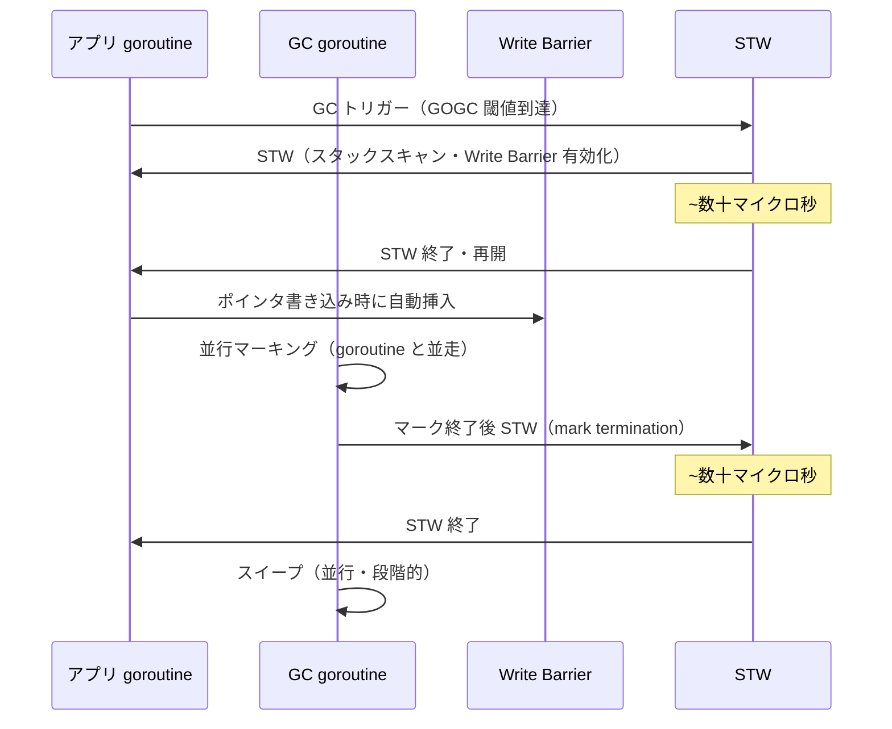

GC のトリガーは `GOGC` 環境変数で制御される（デフォルト 100）。`GOGC=100` は「前回の GC 後のヒープサイズの 100% 増加（= 2倍）になったら GC を起動する」という意味である。`GOGC=off` で GC を完全に無効化することもできる。

Go 1.19 からは `GOMEMLIMIT` でメモリの上限を指定でき、OOM を避けつつ GC 頻度を制御できるようになった。

### 6.6 Non-Generational GC の選択

Java の G1GC や Python の cyclic GC などは**世代別GC（Generational GC）**を採用する。若いオブジェクトは短命という仮説（弱い世代別仮説）に基づき、若い世代を頻繁に小さな停止で回収する。

Go は意図的に世代別 GC を採用していない。主な理由は以下である。

1. **エスケープ解析の効果**: Go コンパイラは静的解析でオブジェクトがスタックに置けるか判断する。スタックのオブジェクトはそもそも GC 対象にならない
2. **Write Barrier のコスト**: 世代別 GC ではカード表（card table）などの remembered set 管理が必要で、Write Barrier のコストが高くなる
3. **goroutine のスタック**: goroutine のスタックは goroutine が終了すると一括解放されるため、短命なオブジェクトはスタックに置かれる傾向がある

::: tip
Go の「若いオブジェクトはスタックに」という設計は、世代別 GC の恩恵を別の形で実現している。`go build -gcflags="-m"` でエスケープ解析の結果を確認できる。
:::

## 7. スタック管理

### 7.1 Segmented Stacks（〜Go 1.3）

初期の Go は **Segmented Stacks** を採用していた。goroutine のスタックは複数のセグメント（固定サイズのチャンク）で構成され、スタックが不足すると新しいセグメントを追加していた。

この仕組みには**ホットスプリット問題（hot split problem）**があった。関数呼び出しがスタック境界のわずか手前で起きると、毎回セグメントの確保・解放が繰り返される。タイトなループ内でのスタック境界またぎは深刻なパフォーマンス劣化を引き起こした。

### 7.2 Contiguous Stacks（Go 1.4〜）

Go 1.4 からは **Contiguous Stacks（連続スタック）**に切り替わった。スタックが不足すると、より大きな連続した新しいスタックを確保し、全内容をコピーする。

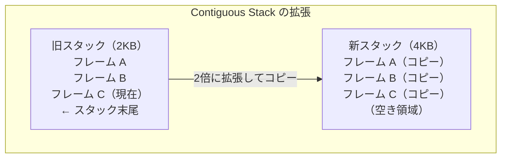

コピーの際にスタックフレーム内のすべてのポインタを新しいアドレスに更新する必要がある。これが可能なのは、Go ランタイムが正確な GC（precise GC）のためにオブジェクト内のポインタ位置を正確に把握しているからである。

初期スタックサイズは `_StackMin = 2048`（2KB）であり、必要に応じて 2 倍ずつ拡張される。最大は `_StackMax = 1 << 20`（1GB、32bit では 256MB）。スタックが使用量の 1/4 以下になると縮小される。

### 7.3 スタックスキャン

GC のマーキングフェーズでは、各 goroutine のスタックをスキャンしてポインタのルートを見つける必要がある。Contiguous Stack になってから、スタックスキャンは STW を短時間で完了できるようになった。並行マーキング中に mutator がスタック上のポインタを変更してもよいよう、goroutine のスタックが GC 中に書き換えられた場合はフラグ（`gcScanDone`）でスキャン済みを管理する。

## 8. メモリアロケータ

### 8.1 設計の概要

Go のメモリアロケータは tcmalloc（Thread-Caching Malloc）にインスパイアされた階層型キャッシュ構造を持つ。

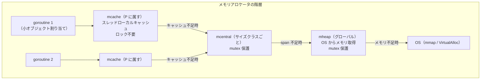

### 8.2 サイズクラスとスパン

Go アロケータはオブジェクトを**サイズクラス（size class）**に分類する。Go 1.22 時点で 67 のサイズクラスがあり（8B, 16B, 24B, 32B, ... 32KB）、32KB を超えるオブジェクトは大オブジェクトとして直接 mheap から割り当てられる。

**mspan** は OS から確保したメモリの連続した範囲（通常 8KB の倍数）であり、同一サイズクラスのオブジェクトを格納する。各スパンはビットマップで各スロットの使用状況を管理する。

### 8.3 mcache — P ごとのキャッシュ

`mcache` は P（Processor）が持つスレッドローカルキャッシュである。各サイズクラスに対して 1 つの mspan を保持し、goroutine がオブジェクトを割り当てるときはここから取得する。P 上で実行される goroutine は 1 つだけなので、**ロック不要でアクセスできる**。これが Go アロケータの高速性の核心である。

### 8.4 mcentral — サイズクラスごとの共有プール

mcache が使い果たされると、対応するサイズクラスの `mcentral` から新しいスパンを受け取る。mcentral は同一サイズクラスのスパンをリスト管理しており、mutex で保護されている。mcentral は「空きスロットのあるスパン」と「空きスロットのないスパン」を別々のリストで管理する。

### 8.5 mheap — グローバルヒープ管理

`mheap` はランタイム全体のヒープを管理するグローバル構造体である。OS からの `mmap` 呼び出しを抽象化し、mcentral に新しいスパンを供給する。アドレス空間を 64MB チャンクの **arena** 単位で管理しており、各 arena に対してメタデータ（span 情報、ヒープビットマップ）を持つ。

### 8.6 TinyAlloc — 微小オブジェクトの最適化

16 バイト未満のポインタを含まない小さなオブジェクト（int, float など）は **TinyAlloc** と呼ばれる特殊パスで割り当てられる。

```go
// TinyAlloc: pack multiple tiny objects into a single 16-byte block
// (runtime/malloc.go)
if size <= maxTinySize && noscan {
    // Try to fit into the current tiny block
    off := c.tinyoffset
    if off+size <= maxTinySize {
        x = unsafe.Pointer(c.tiny + off)
        c.tinyoffset = off + size
        return x
    }
    // Allocate a new tiny block
    ...
}
```

16 バイトのブロックを確保し、その中に複数の微小オブジェクトを詰め込む。これによりメモリ消費と GC 圧力を大きく削減できる。ポインタを含むオブジェクトには適用できない（GC がポインタを正確に追跡できなくなるため）。

::: details TinyAlloc が適用される典型的な例
```go
// These are candidates for TinyAlloc (no pointers, small)
x := int32(42)
y := float64(3.14)
z := struct{ a, b int16 }{}

// These are NOT candidates (contain pointers)
s := "hello"       // contains a pointer to the string data
sl := []int{}      // contains a pointer to the backing array
p := new(int)      // pointer itself
```
:::

### 8.7 スタックアロケーションとエスケープ解析

メモリ割り当ての最速パスは、そもそも GC ヒープに確保しないことである。Go コンパイラは**エスケープ解析（escape analysis）**によって、オブジェクトがその関数のスコープを超えて生き延びるかどうかを静的に解析し、スコープ内で完結するオブジェクトはスタックに置く。

```go
func noEscape() *int {
    // Compiler determines this does NOT escape (in many simple cases)
    x := 42  // allocated on stack
    return &x // actually this DOES escape → heap allocation
}

func doesEscape() {
    x := new(int)  // if stored in a channel or global → escapes to heap
    ch <- x
}
```

`go build -gcflags='-m=2'` を実行するとエスケープ解析の詳細レポートが得られ、どのオブジェクトがヒープに逃げているかを確認できる。

## 9. ランタイムの全体的なインタラクション

### 9.1 goroutine のライフサイクル全体像

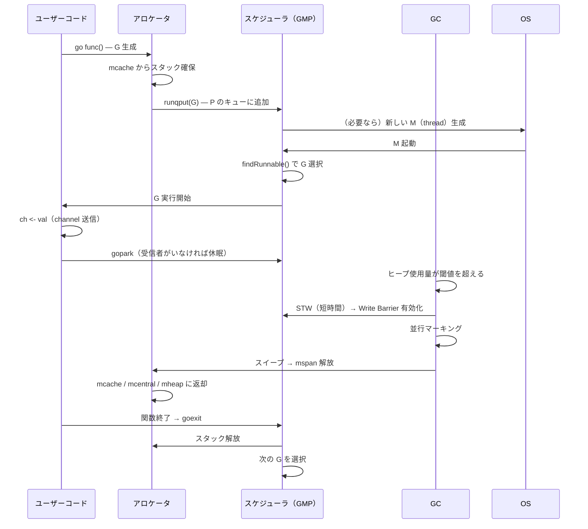

### 9.2 システムコールの扱い

goroutine がブロッキングシステムコール（`read`, `write` など）を呼ぶと、M はカーネルでブロックされる。このとき P をブロックされた M に持たせておくと、P に残っている他の goroutine が実行できなくなってしまう。

Go ランタイムはこれを以下のように回避する。

1. システムコール入口（`entersyscall`）で M から P を切り離す
2. 待機中の M（アイドル M）がいれば、その M に P を渡す
3. アイドル M がなければ新しい M を生成する
4. システムコール完了後（`exitsyscall`）、元の M が P を再取得しようとする
5. P がなければ G をグローバルキューに入れて M はスリープする

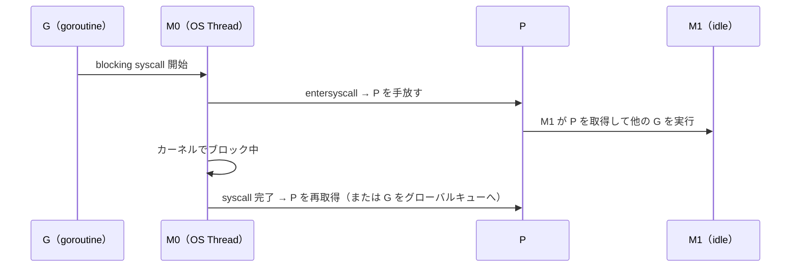

非ブロッキング I/O（ネットワーク）は `netpoller`（epoll/kqueue のラッパー）を使い、goroutine は `gopark` で休眠する。I/O 完了時に netpoller が goroutine を `goready` で起こす。これにより M をブロックせずに非同期 I/O を goroutine として同期的に書ける。

## 10. 実践的な観点からの考察

### 10.1 GOMAXPROCS のチューニング

デフォルトの `GOMAXPROCS` は論理 CPU 数であり、多くの場合これが最適である。ただし以下のような場合は調整が有効である。

- CPU バウンドな計算: GOMAXPROCS = 物理 CPU コア数（SMT 無効化の効果がある場合）
- I/O バウンドなサービス: GOMAXPROCS = デフォルト（goroutine が M を手放すため増やしても意味が薄い）
- コンテナ環境: cgroups の CPU 割当を認識するために `uber-go/automaxprocs` の利用を検討

### 10.2 GC のチューニング

```bash
# Show GC statistics during execution
GODEBUG=gctrace=1 ./myapp

# Output example:
# gc 1 @0.042s 0%: 0.007+0.27+0.025 ms clock, 0.014+0.058/0.34/0.087+0.051 ms cpu, 5->5->2 MB, 6 MB goal, 0 B stacks, 0 B globals, 8 P
```

`gctrace` の出力の読み方: `5->5->2 MB` は「GC 前のヒープ 5MB → GC 後の到達可能 5MB → GC 後の実使用 2MB」を示す。

GC を意識したコーディングのポイント。

- 短命なオブジェクトはスタックに置くよう設計する（エスケープ解析を活用）
- `sync.Pool` で再利用可能なオブジェクトをプールして GC 圧力を下げる
- `[]byte` や `string` の変換は不要なコピーを生む。`unsafe` を使ったゼロコピー変換は慎重に
- プロファイリングには `runtime/pprof` や `net/http/pprof` を活用する

### 10.3 goroutine リークの検出

goroutine が `_Gwaiting` のまま永遠に起きてこない「goroutine リーク」は深刻なメモリリークになる。

```go
// Goroutine leak example: nobody reads from ch, sender is stuck
func leaky() {
    ch := make(chan int)
    go func() {
        ch <- 42  // blocked forever if nobody receives
    }()
    // ch goes out of scope, but goroutine is stuck
}
```

`runtime.NumGoroutine()` で goroutine 数を監視したり、`net/http/pprof` の `/debug/pprof/goroutine` エンドポイントで実行中の goroutine のスタックトレースを確認できる。

::: warning
goroutine リークはメモリリークであると同時に、channel や mutex を握ったまま終了しない goroutine がデッドロックの引き金になることがある。コンテキスト（`context.Context`）を使って goroutine のライフタイムを明示的に管理することが重要である。
:::

## 11. まとめ

Go ランタイムは多くの革新的なアイデアを組み合わせた高度なシステムである。

**GMP スケジューラ**は M:N スレッディングを P（Processor）という中間層を設けることで実用的に解決した。P のローカルキューによってグローバルロックの競合を回避し、ワークスティーリングで負荷分散を実現している。

**非協調的プリエンプション**は Go 1.14 で導入され、タイトなループを含む goroutine も公平にスケジューリングできるようになった。SIGURG シグナルとシグナルハンドラによるスタックフレーム挿入という巧妙な仕組みである。

**Channel**の実装は `hchan` 構造体と `sudog` による待機キューで成り立っており、バッファを介さない direct send 最適化、sudog のオブジェクトプール再利用など、細かなパフォーマンス上の工夫が随所に施されている。

**GC**は Tri-color Mark-Sweep を基盤に、Hybrid Write Barrier によって STW をサブミリ秒に押さえ込んでいる。世代別 GC を採用しない代わりに、エスケープ解析とスタック割り当てで短命オブジェクトの GC コストを根本から削減する設計思想をとる。

**メモリアロケータ**は tcmalloc にインスパイアされた mcache/mcentral/mheap の三層構造で、goroutine の割り当てパスでのロック競合をほぼ排除している。TinyAlloc による微小オブジェクトのパッキングも効果的な最適化である。

これらの仕組みが協調することで、Go は「シンプルで書きやすく、かつサーバーサイドで高性能」という難しいバランスを実現している。ランタイムの挙動を理解することは、パフォーマンスチューニングやデバッグの際に深く役立つ知識である。

## 参考資料

- [Go スケジューラのソースコード（src/runtime/proc.go）](https://cs.opensource.google/go/go/+/main:src/runtime/proc.go)
- [Go channel のソースコード（src/runtime/chan.go）](https://cs.opensource.google/go/go/+/main:src/runtime/chan.go)
- Dmitry Vyukov, "Go scheduler: Implementing language with lightweight concurrency", GopherCon 2018
- Austin Clements, "Getting to Go: The Journey of Go's Garbage Collector", GopherCon 2018
- Rhys Hiltner, "An Introduction to go tool trace", GopherCon 2017
- [The Go Memory Model](https://go.dev/ref/mem)
- [A Guide to the Go Garbage Collector](https://go.dev/doc/gc-guide)
