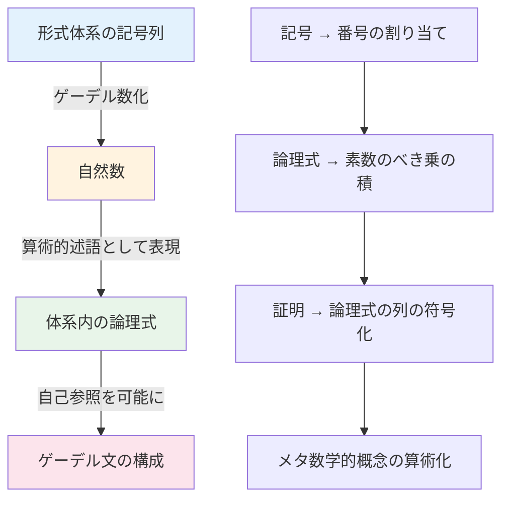
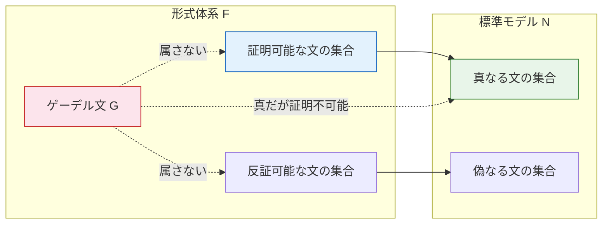
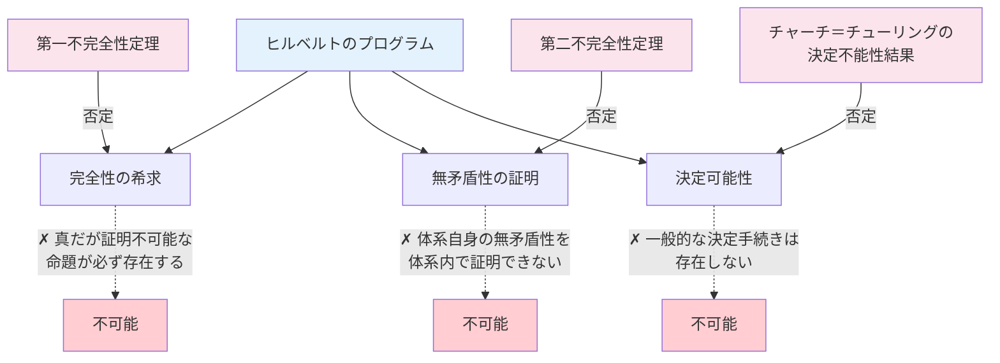
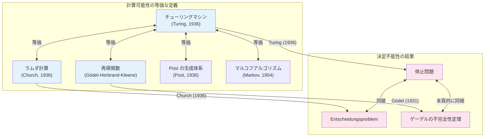
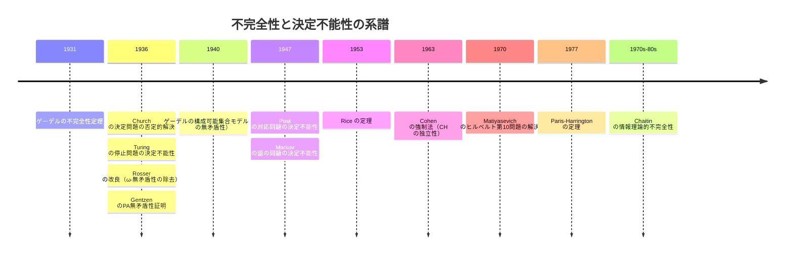

# ゲーデルの不完全性定理 — 形式体系の本質的限界

## 1. 背景と動機：数学の基礎をめぐる危機

1931年、25歳のオーストリアの数学者クルト・ゲーデル（Kurt Gödel）は、数学の世界を根底から揺るがす定理を発表した。「Über formal unentscheidbare Sätze der Principia Mathematica und verwandter Systeme I」（プリンキピア・マテマティカおよび関連体系の形式的に決定不能な命題について）と題されたこの論文は、**いかなる十分に強力な形式体系も、その体系内で真であるが証明できない命題を含む**ことを示した。

この結果を理解するためには、まず19世紀末から20世紀初頭にかけて数学の基礎論で何が起きていたかを振り返る必要がある。

### 1.1 基礎論の危機

19世紀後半、数学は飛躍的な発展を遂げる一方で、その基礎に深刻な問題が潜んでいることが明らかになった。

**カントールの集合論とパラドックス**：Georg Cantor は集合論を創始し、無限の数学的扱いを革新した。しかし、素朴な集合論にはパラドックスが潜んでいた。1901年、Bertrand Russell は有名な**ラッセルのパラドックス**を発見した。「自分自身を要素として含まない集合すべてからなる集合」を $R$ とすると、$R \in R$ ならば $R \notin R$ であり、$R \notin R$ ならば $R \in R$ であるという矛盾が生じる。

**フレーゲの体系の崩壊**：Gottlob Frege は、算術の論理的基礎を厳密に構築する大著『算術の基本法則』（Grundgesetze der Arithmetik）の第2巻の印刷中に、Russell から上記のパラドックスを指摘する手紙を受け取った。Frege の体系の基盤である「基本法則V」が矛盾を含んでいたのである。

このような状況下で、数学の基礎を確固たるものにしようとする複数の立場が登場した。

### 1.2 三大主義

数学の基礎をめぐり、20世紀初頭には主に3つの立場が対立した。

**論理主義（Logicism）**：Russell と Alfred North Whitehead が代表する立場で、数学を論理に還元しようとした。二人は大著『プリンキピア・マテマティカ』（Principia Mathematica, 1910--1913）において、論理から出発して数学の基礎を構築する壮大な試みを行った。

**直観主義（Intuitionism）**：L. E. J. Brouwer が提唱した立場で、数学的対象は人間の心的構成によって存在するとし、排中律の無制限な使用を認めない。直観主義のもとでは、古典論理で証明可能な定理の一部が成り立たなくなる。

**形式主義（Formalism）**：David Hilbert が主導した立場で、数学を記号操作の形式的体系として捉え、その体系の**無矛盾性（consistency）** を有限的な方法で証明しようとした。

### 1.3 ヒルベルトのプログラム

ゲーデルの不完全性定理を理解する上で最も重要な背景は、**ヒルベルトのプログラム（Hilbert's Program）**である。

1920年代、Hilbert は数学の基礎を確立するための壮大な計画を提唱した。その目標は以下の通りである。

1. **形式化（Formalization）**：すべての数学を厳密な形式体系として記述する
2. **完全性（Completeness）**：形式体系内のすべての真な命題が証明可能であること
3. **無矛盾性（Consistency）**：形式体系から矛盾（$P$ と $\neg P$ の同時証明）が導かれないこと
4. **決定可能性（Decidability）**：任意の命題が証明可能か否かを判定するアルゴリズムが存在すること

Hilbert は、数学の無矛盾性を**有限的手法（finitary methods）**——有限個のステップで検証可能な、議論の余地のない方法——によって証明できると楽観的に考えていた。1930年のケーニヒスベルクの会議で、Hilbert は有名な言葉を述べている。

> 「我々は知らねばならない。我々は知るであろう。」（Wir müssen wissen. Wir werden wissen.）

皮肉なことに、この言葉が発せられたまさにその翌日、同じ会議の場で若きゲーデルが不完全性定理の予告を行ったのである。

::: tip ヒルベルトのプログラムの核心
ヒルベルトのプログラムとは、数学のすべてを形式的な記号操作に還元し、その体系が（1）矛盾を含まず、（2）すべての真理を証明でき、（3）任意の命題の証明可能性を機械的に判定できることを示そうとする計画であった。ゲーデルの不完全性定理は、この計画の（2）と（3）を原理的に不可能であることを示し、さらに（1）の自己証明も不可能であることを明らかにした。
:::

## 2. 形式体系の定義と前提条件

ゲーデルの定理を正確に述べるためには、「形式体系」を厳密に定義する必要がある。

### 2.1 形式体系とは

**形式体系（formal system）** は以下の構成要素からなる。

- **言語（Language）**：記号のアルファベットと、そこから構成される**論理式（formula）** の集合。論理式の構成規則は再帰的に定義される
- **公理（Axioms）**：出発点として無条件に受け入れる論理式の集合
- **推論規則（Inference Rules）**：既存の論理式から新たな論理式を導出する規則（例：モーダスポネンス）
- **証明（Proof）**：公理から推論規則を有限回適用して目標の論理式に到達する列

形式体系 $F$ において、論理式 $\varphi$ が証明可能であることを $F \vdash \varphi$ と書く。

### 2.2 ゲーデルの定理が対象とする体系の条件

ゲーデルの不完全性定理は**任意の**形式体系に適用されるわけではない。以下の条件を満たす体系に適用される。

**条件1：十分な表現力**。体系が自然数の基本的な算術（加法と乗法）を表現できること。具体的には、**ペアノ算術（Peano Arithmetic, PA）** またはそれと同等以上の表現力を持つ体系であること。ペアノ算術の公理は以下の通りである。

- $\forall x.\, 0 \neq S(x)$（0はどの自然数の後者でもない）
- $\forall x.\, \forall y.\, S(x) = S(y) \to x = y$（後者関数は単射）
- $\forall x.\, x + 0 = x$（加法の基底）
- $\forall x.\, \forall y.\, x + S(y) = S(x + y)$（加法の帰納ステップ）
- $\forall x.\, x \times 0 = 0$（乗法の基底）
- $\forall x.\, \forall y.\, x \times S(y) = (x \times y) + x$（乗法の帰納ステップ）
- 数学的帰納法のスキーマ

ここで $S(x)$ は後者関数（successor function）で、直感的には $x + 1$ を意味する。

**条件2：再帰的公理化可能性（Recursive Axiomatizability）**。公理の集合と推論規則が**再帰的（recursive）**——つまり、ある文字列が公理であるか否か、ある推論が推論規則の正しい適用であるか否かを、アルゴリズムで判定できること。これは「体系がアルゴリズム的に記述できる」ことを意味する。

**条件3：無矛盾性（Consistency）**。体系が矛盾を含まないこと、すなわちある論理式 $\varphi$ について $F \vdash \varphi$ かつ $F \vdash \neg\varphi$ となることがないこと。（第一不完全性定理に必要な条件。第二不完全性定理では、より強い $\omega$-無矛盾性の代わりに通常の無矛盾性で十分であることが後に Rosser によって示された。）

### 2.3 完全性と健全性

形式体系の重要な性質として、以下の概念がある。

- **健全性（Soundness）**：$F \vdash \varphi$ ならば $\varphi$ は真である。すなわち、体系が証明するものはすべて真である
- **完全性（Completeness）**：$\varphi$ が真ならば $F \vdash \varphi$ である。すなわち、すべての真なる命題が証明可能である

ゲーデルの不完全性定理は、上記の条件を満たす体系が**完全ではありえない**ことを示す。つまり、真であるが証明不可能な命題が必ず存在する。

> [!WARNING]
> ゲーデルの**不完全性**定理（1931年）と、ゲーデルの**完全性**定理（1929年）を混同してはならない。完全性定理は「一階述語論理において、意味論的に妥当な論理式はすべて証明可能である」ことを述べており、これは一階述語論理の**推論規則の十分性**に関する定理である。不完全性定理は、一階述語論理の上に算術の公理を載せた体系に関する定理であり、**算術的真理のすべてを捕捉することの不可能性**を述べている。

## 3. ゲーデル数：形式と数の架橋

ゲーデルの証明の核心的なアイデアは、**形式体系自身を、その体系の中で議論する**ことである。これを可能にするのが**ゲーデル数（Gödel numbering）**という技法である。

### 3.1 基本アイデア

形式体系の記号、論理式、証明はすべて有限個の記号の列である。ゲーデルは、これらの記号列に自然数を一対一に対応させる方法を考案した。この対応づけにより、「論理式についての命題」を「自然数についての命題」として体系内で表現できるようになる。

### 3.2 符号化の仕組み

具体的な符号化の一例を示す（ゲーデル自身の方法とは異なるが、本質は同じである）。

**ステップ1：記号への番号の割り当て**

体系の基本記号それぞれに固有の番号を割り当てる。

| 記号 | ゲーデル番号 |
|------|-------------|
| $0$ | 1 |
| $S$ | 2 |
| $+$ | 3 |
| $\times$ | 4 |
| $=$ | 5 |
| $($ | 6 |
| $)$ | 7 |
| $\neg$ | 8 |
| $\to$ | 9 |
| $\forall$ | 10 |
| $x_i$ | $10 + i$ |

**ステップ2：論理式の符号化**

記号列 $s_1 s_2 \cdots s_n$ に対して、各記号のゲーデル番号を $g_1, g_2, \ldots, g_n$ とすると、この記号列のゲーデル数は次のように定義される。

$$
\ulcorner s_1 s_2 \cdots s_n \urcorner = 2^{g_1} \cdot 3^{g_2} \cdot 5^{g_3} \cdots p_n^{g_n}
$$

ここで $p_i$ は $i$ 番目の素数である。算術の基本定理（素因数分解の一意性）により、この符号化は一対一対応を保証する。任意のゲーデル数から元の記号列を一意に復元できる。

**ステップ3：証明の符号化**

証明は論理式の有限列 $\varphi_1, \varphi_2, \ldots, \varphi_m$ であるから、各 $\varphi_i$ のゲーデル数を $g_i$ として、証明全体のゲーデル数は同様に構成できる。

$$
\ulcorner \varphi_1, \varphi_2, \ldots, \varphi_m \urcorner = 2^{g_1} \cdot 3^{g_2} \cdots p_m^{g_m}
$$

### 3.3 メタ数学の算術化

ゲーデル数化の真の威力は、形式体系に関する**メタ数学的**な概念を算術的な述語として表現できることにある。

- **「$x$ は論理式のゲーデル数である」**：$\text{Formula}(x)$ という算術的述語として表現可能
- **「$x$ は公理のゲーデル数である」**：$\text{Axiom}(x)$ として表現可能
- **「$x$ は $y$ の証明のゲーデル数である」**：$\text{Proof}(x, y)$ として表現可能。すなわち、ゲーデル数 $x$ にエンコードされた論理式の列が、ゲーデル数 $y$ にエンコードされた論理式の正しい証明であること
- **「$y$ は証明可能である」**：$\text{Provable}(y) \equiv \exists x.\, \text{Proof}(x, y)$

重要なのは、$\text{Proof}(x, y)$ が**原始再帰的（primitive recursive）**な関係であること。つまり、2つの自然数 $x$ と $y$ が与えられたとき、$x$ が $y$ の証明を符号化しているかどうかは、アルゴリズムで確実に判定できる（証明のチェックは機械的に行える）。

## 4. 対角化論法と自己参照

### 4.1 対角化の歴史

**対角化論法（diagonalization argument）**は、Cantor が実数の非可算性を証明するために用いた手法に端を発する。自然数全体の集合 $\mathbb{N}$ から実数全体の集合 $\mathbb{R}$ への全射が存在しないことを、仮にそのような全射 $f: \mathbb{N} \to \mathbb{R}$ が存在したとして、$f$ の「対角線」を操作することで $f$ の値域に含まれない実数を構成するという方法で示した。

ゲーデルは、この対角化のアイデアを形式体系の文脈で洗練させて用いた。

### 4.2 自己参照の構成

ゲーデルの証明の核心は、**「この文は証明不可能である」**という主張を形式体系の中で表現することにある。これは**エピメニデスの嘘つきのパラドックス**（「この文は偽である」）を想起させるが、決定的に異なる点がある。嘘つきのパラドックスでは「真偽」を問うのに対し、ゲーデル文は「証明可能性」を問う。

自己参照文を構成するために、ゲーデルは**対角化補題（Diagonal Lemma / Fixed-Point Lemma）**を証明した。

::: details 対角化補題（不動点補題）

ペアノ算術を含む再帰的公理化可能な体系 $F$ において、自由変数を1つ含む任意の論理式 $\psi(x)$ に対して、次を満たす閉じた論理式（文） $\sigma$ が存在する。

$$
F \vdash \sigma \leftrightarrow \psi(\ulcorner \sigma \urcorner)
$$

ここで $\ulcorner \sigma \urcorner$ は $\sigma$ のゲーデル数を表す自然数の項である。

直感的に言えば、$\sigma$ は「自分自身のゲーデル数について $\psi$ が成り立つ」と主張する文である。
:::

### 4.3 不動点補題の構成

不動点補題の構成を直感的に説明する。

1. 論理式 $\psi(x)$ が与えられたとする
2. 自由変数 $y$ を含む論理式 $\theta(y)$ を次のように定義する。「$y$ は、ある論理式 $\varphi(x)$ のゲーデル数であり、$\varphi$ の中の自由変数 $x$ に $y$ 自身を代入して得られる文に対して $\psi$ が成り立つ」
3. $\theta(y)$ のゲーデル数を $t$ とする
4. $\sigma$ を、$\theta$ の自由変数 $y$ に $t$ を代入した文 $\theta(t)$ とする

すると $\sigma$ は次の構造を持つ。

$$
\sigma = \theta(\ulcorner\theta\urcorner) \quad \text{すなわち} \quad \sigma \text{ は「} \theta \text{ の } y \text{ に } \theta \text{ 自身のゲーデル数を入れたものについて } \psi \text{ が成り立つ」}
$$

この構成が $\sigma \leftrightarrow \psi(\ulcorner\sigma\urcorner)$ を満たすことは、ゲーデル数の定義を追えば確認できる。この手法は、プログラミングにおける**クワイン（quine）**——自分自身のソースコードを出力するプログラム——と本質的に同じアイデアに基づいている。

### 4.4 ゲーデル文

不動点補題を $\psi(x) = \neg\text{Provable}(x)$ に対して適用すると、次を満たす文 $G$ が得られる。

$$
F \vdash G \leftrightarrow \neg\text{Provable}(\ulcorner G \urcorner)
$$

この $G$ が**ゲーデル文（Gödel sentence）**である。$G$ は直感的に次のことを主張している。

> 「この文は体系 $F$ において証明不可能である」

## 5. 第一不完全性定理

### 5.1 定理の正確な記述

**定理（ゲーデルの第一不完全性定理）**：$F$ がペアノ算術を含む無矛盾な再帰的公理化可能な形式体系であるとき、$F$ の言語で表現可能な文 $G$ で、次の性質を持つものが存在する。

1. $F \nvdash G$（$G$ は $F$ で証明できない）
2. $F \nvdash \neg G$（$G$ の否定も $F$ で証明できない）

すなわち、$G$ は $F$ において**決定不能（undecidable）**である。

### 5.2 証明のアウトライン

**$G$ が証明不可能であることの証明**（$F \nvdash G$）：

背理法を用いる。$F \vdash G$ と仮定する。不動点の性質より $F \vdash G \leftrightarrow \neg\text{Provable}(\ulcorner G \urcorner)$ であるから、$F \vdash \neg\text{Provable}(\ulcorner G \urcorner)$ が得られる。これは「$G$ の証明は存在しない」ことを意味する。

しかし一方で、仮定により $F \vdash G$ であるから、実際に $G$ の証明が存在する。体系がこの事実を正しく反映する（$\Sigma_1$-完全性）ならば、$F \vdash \text{Provable}(\ulcorner G \urcorner)$ も導ける。これは $F \vdash \neg\text{Provable}(\ulcorner G \urcorner)$ と矛盾し、$F$ の無矛盾性に反する。よって $F \nvdash G$ である。

**$\neg G$ が証明不可能であることの証明**（$F \nvdash \neg G$）：

ゲーデルの元の証明では、ここで**$\omega$-無矛盾性**というより強い条件を必要としたが、1936年に J. Barkley Rosser がより巧妙なゲーデル文を構成することで、通常の無矛盾性だけで十分であることを示した（Rosser のトリック）。

Rosser の改良版では、ゲーデル文を次のように変更する。

$$
R \leftrightarrow \forall x.\, (\text{Proof}(x, \ulcorner R \urcorner) \to \exists y.\, (y \le x \land \text{Proof}(y, \ulcorner \neg R \urcorner)))
$$

直感的には、$R$ は「$R$ の証明が存在するならば、それより小さいゲーデル数を持つ $\neg R$ の証明も存在する」と主張する。この文を用いると、$F$ が（通常の意味で）無矛盾であるだけで、$F \nvdash R$ かつ $F \nvdash \neg R$ を示すことができる。

### 5.3 ゲーデル文の真理値

ゲーデル文 $G$ は「$G$ は証明不可能である」と主張し、実際に $G$ は証明不可能である（第一不完全性定理より）。つまり、**$G$ の主張は真である**。したがって、$G$ は**真だが証明不可能な文**の具体例となっている。

ここで注意すべきは、「真」という概念は形式体系の外側——メタ理論——で語られているということである。$G$ の真偽は自然数の標準モデル $\mathbb{N}$ における解釈で決まる。体系 $F$ の内部からは、$G$ の真偽を決定する手段がないのである。

### 5.4 不完全性の不可避性

「$G$ を公理として追加すれば完全になるのではないか？」と考えるかもしれない。しかし、$F' = F + G$ という新しい体系を作っても、$F'$ 自身に対する新たなゲーデル文 $G'$ が構成でき、$G'$ は $F'$ で証明不可能である。この過程は無限に繰り返すことができ、**不完全性は本質的に解消不可能**である。

どのように公理を追加しても（体系が再帰的公理化可能で無矛盾である限り）、完全性は達成されない。これは単にまだ十分な公理を見つけていないという問題ではなく、**形式体系という枠組みの本質的な限界**なのである。

## 6. 第二不完全性定理

### 6.1 定理の記述

**定理（ゲーデルの第二不完全性定理）**：$F$ がペアノ算術を含む無矛盾な再帰的公理化可能な形式体系であるとき、$F$ の無矛盾性を表現する文 $\text{Con}(F)$ は $F$ 内で証明不可能である。

$$
F \nvdash \text{Con}(F)
$$

ここで $\text{Con}(F)$ は「$F$ は無矛盾である」ことを形式的に表現した文であり、具体的には次のように定義される。

$$
\text{Con}(F) \equiv \neg \text{Provable}(\ulcorner 0 = 1 \urcorner)
$$

すなわち、「$0 = 1$ は $F$ で証明不可能である」（$0 = 1$ は明らかに偽であるから、これが証明不可能であることは体系の無矛盾性と同値である）。

### 6.2 第一定理から第二定理への道筋

第二不完全性定理は、第一不完全性定理の証明を体系 $F$ 自身の中で再現することによって得られる。その核心は次の推論にある。

1. 第一不完全性定理の証明は、本質的に「$F$ が無矛盾ならば $G$ は証明不可能」ことを示している
2. この推論を $F$ 自身の中で形式化すると、$F \vdash \text{Con}(F) \to G$ が得られる
3. もし $F \vdash \text{Con}(F)$ であれば、モーダスポネンスにより $F \vdash G$ となる
4. しかし第一不完全性定理より $F \nvdash G$ であるから、$F \nvdash \text{Con}(F)$ でなければならない

この推論を厳密に遂行するためには、$\text{Provable}$ 述語が**ヒルベルト＝ベルナイスの導出可能性条件（Hilbert-Bernays derivability conditions）**を満たすことを検証する必要がある。

::: details ヒルベルト＝ベルナイスの導出可能性条件

以下の3条件が、証明述語 $\text{Provable}(x)$ に対して成り立つ。

1. $F \vdash \varphi$ ならば $F \vdash \text{Provable}(\ulcorner\varphi\urcorner)$
2. $F \vdash \text{Provable}(\ulcorner\varphi \to \psi\urcorner) \to (\text{Provable}(\ulcorner\varphi\urcorner) \to \text{Provable}(\ulcorner\psi\urcorner))$
3. $F \vdash \text{Provable}(\ulcorner\varphi\urcorner) \to \text{Provable}(\ulcorner\text{Provable}(\ulcorner\varphi\urcorner)\urcorner)$

条件1は「実際に証明可能な文は、証明可能であることが証明できる」ことを述べる。条件2は証明可能性がモーダスポネンスを保存することを述べる。条件3は「証明可能であるならば、証明可能であることが証明可能である」という一種の正の内省を述べる。
:::

### 6.3 ヒルベルトのプログラムへの打撃

第二不完全性定理は、ヒルベルトのプログラムに致命的な打撃を与えた。

Hilbert は、ペアノ算術（あるいはより強い体系）の無矛盾性を、ペアノ算術よりも**弱い**有限的手法で証明しようとした。しかし第二不完全性定理は、ペアノ算術の無矛盾性をペアノ算術自身の中ですら証明できないことを示している。有限的手法がペアノ算術に含まれる（あるいはそれより弱い）ならば、無矛盾性証明は不可能である。

ただし、ゲーデルの定理はペアノ算術の無矛盾性が**証明不可能**であることを主張しているのであって、無矛盾性が**疑わしい**と言っているのではない。実際、Gerhard Gentzen は1936年に超限帰納法（具体的には順序数 $\varepsilon_0$ までの超限帰納法）を用いてペアノ算術の無矛盾性を証明した。しかしこの証明はペアノ算術の外で行われたものであり、Hilbert が求めた「有限的」な証明ではない。

## 7. 計算理論との深い関連

ゲーデルの不完全性定理は、純粋に数学基礎論の結果でありながら、計算理論と深い構造的関連を持つ。

### 7.1 停止問題との対応

1936年、Alan Turing は**停止問題（Halting Problem）**の決定不能性を証明した。停止問題とは、「チューリングマシン $M$ と入力 $w$ が与えられたとき、$M$ は $w$ に対して停止するか？」という問題である。

Turing の証明は対角化論法を用いる。仮に停止問題を決定する万能アルゴリズム $H$ が存在したとして、$H$ を用いて自分自身に対して矛盾を引き起こすマシンを構成する。

$$
D(M) = \begin{cases} \text{停止する} & \text{if } H(M, M) = \text{「停止しない」} \\ \text{停止しない} & \text{if } H(M, M) = \text{「停止する」} \end{cases}
$$

$D$ に $D$ 自身を入力すると、$D(D)$ が停止する $\Leftrightarrow$ $H(D, D)$ が「停止しない」と答える $\Leftrightarrow$ $D(D)$ が停止しない、という矛盾が生じる。

この証明構造は、ゲーデルの不完全性定理の証明と深い類似性を持つ。

| ゲーデルの不完全性定理 | 停止問題の決定不能性 |
|---|---|
| 「この文は証明不可能である」 | 「このマシンは停止しない」 |
| ゲーデル数による自己参照 | 万能チューリングマシンによる自己参照 |
| 対角化によるゲーデル文の構成 | 対角化による矛盾マシンの構成 |
| 完全な証明体系は存在しない | 万能な停止判定器は存在しない |

### 7.2 不完全性から停止問題の決定不能性を導く

実際、不完全性定理と停止問題の決定不能性は密接に関係しており、一方から他方を導くことができる。

停止問題が決定可能であると仮定すると、任意の算術の文 $\varphi$ の真偽を決定する手続きが構成できてしまう。たとえば $\varphi = \forall n.\, P(n)$ の形の文については、$P(0), P(1), P(2), \ldots$ を順に検証するプログラム（反例を探索するプログラム）を構成し、その停止性を判定すればよい。停止するなら反例が存在し $\varphi$ は偽、停止しないなら反例は存在せず $\varphi$ は真である。

これは完全な決定手続きの存在を意味し、不完全性定理と矛盾する。したがって、停止問題は決定不能でなければならない。

### 7.3 チャーチ＝チューリングのテーゼ

**チャーチ＝チューリングのテーゼ（Church-Turing Thesis）**は、「直感的に計算可能な関数は、チューリングマシンで計算可能な関数と一致する」という主張である。これは数学的定理ではなく経験的な仮説であるが、これまで反例は見つかっていない。

ゲーデルの不完全性定理は、Church-Turing のテーゼの歴史的文脈で重要な役割を果たした。Turing のチューリングマシン、Church のラムダ計算、Gödel の再帰関数、Post の生成体系——これらがすべて同じ計算可能関数のクラスを定義することの発見が、このテーゼの信憑性を高めた。ゲーデルの再帰関数の理論は、不完全性定理の証明において原始再帰関数とその拡張を使ったことに端を発している。

### 7.4 Kolmogorov複雑性と不完全性

ゲーデルの不完全性定理は、**Kolmogorov 複雑性（Kolmogorov complexity）** の観点からも自然に理解できる。Gregory Chaitin は1970年代に、不完全性定理の情報理論的な変種を発見した。

文字列 $s$ の Kolmogorov 複雑性 $K(s)$ は、$s$ を出力する最短のプログラムの長さである。Chaitin の不完全性定理は次のように述べる。

**定理（Chaitin の不完全性定理）**：形式体系 $F$ の複雑性を $c$ とするとき（$c$ は $F$ を記述するのに必要な情報量）、$F$ は「$K(s) > c$」という形の文をごくわずかしか証明できない。より正確には、ある定数 $L$（$F$ に依存する）が存在して、$F$ は「$K(s) > L$」という形の真なる命題を一つも証明できない。

直感的に言えば、**形式体系の複雑性を超える複雑性に関する事実は、その体系では証明できない**のである。有限の公理系で無限に多くの「複雑な」事実を証明することはできないという、不完全性定理の本質を情報理論的に捉えた結果である。

## 8. 数学基礎論への影響

### 8.1 集合論における独立命題

ゲーデルの定理が示したのは、不完全性が抽象的な可能性ではなく現実であるということだが、その後の研究は、数学的に自然で重要な命題が実際に標準的な公理系から独立であることを明らかにした。

**連続体仮説（Continuum Hypothesis, CH）**：Cantor が提起した「$\aleph_0$（可算無限）と $\mathfrak{c}$（連続体の濃度）の間の濃度は存在するか？」という問題で、$\mathfrak{c} = \aleph_1$ であるかを問う。

- 1940年、ゲーデル自身が**構成可能集合**のモデル $L$ を用いて、ZFC（Zermelo-Fraenkel 集合論 + 選択公理）のもとで CH が矛盾しないことを示した
- 1963年、Paul Cohen が**強制法（forcing）**を発明し、ZFC のもとで $\neg$CH も矛盾しないことを示した

したがって、CH は ZFC から独立——ZFC では証明も反証もできない。これはまさにゲーデルの第一不完全性定理が予告した状況の具体例である。

### 8.2 その他の独立命題

集合論以外にも、多くの独立命題が発見されている。

- **Souslin の仮説**：ある種の全順序集合に関する命題で、ZFC から独立
- **Kaplansky の予想**（Banach 代数に関する）
- **Whitehead 問題**（群論における可換群に関する命題）：Saharon Shelah が ZFC からの独立性を証明（1974年）
- **Paris-Harrington の定理**（1977年）：ラムゼー理論の自然な強化版で、ペアノ算術では証明できない。これは、不完全性が「人工的な」ゲーデル文だけでなく、**数学的に自然な命題**にも生じうることを示した重要な例

### 8.3 逆数学

逆数学（Reverse Mathematics）は、数学の定理を証明するのに必要な公理の強さを精密に分析するプログラムである。Harvey Friedman によって1970年代に提唱され、Stephen Simpson らによって発展した。

逆数学の基本的な問いは「定理 $T$ を証明するのに、どの程度の強さの公理系が必要か？」である。具体的には、二階算術の部分体系のどのレベルで $T$ が証明可能になるかを調べる。この研究プログラムは、ゲーデルの不完全性定理が示した「公理系の強さ」の概念を精密化し体系化するものと言える。

## 9. 哲学的インパクト

### 9.1 数学的プラトニズムとゲーデル

ゲーデル自身は強い**数学的プラトニスト**であった。彼は、数学的対象は人間の心とは独立に実在すると信じていた。不完全性定理は、ゲーデルにとってプラトニズムを支持する結果であった。

ゲーデルの推論は次のようなものである。
- 形式体系は数学的真理のすべてを捕捉できない（不完全性定理）
- しかし数学的真理は客観的に存在する（プラトニズムの前提）
- したがって、数学的真理は形式体系を超えた実在である

もちろん、この推論の前提（特にプラトニズムの前提）を受け入れるかどうかは哲学的立場に依存する。

### 9.2 機械と心の議論

ゲーデルの定理は、**「人間の心はコンピュータ（チューリングマシン）を超えるか？」**という問いに関連して繰り返し議論されてきた。

1961年、J. R. Lucas は次のような議論を展開した。

1. 人間の心は、任意の形式体系 $F$ に対してゲーデル文 $G_F$ が真であることを「見る」ことができる
2. しかし $F$ 自身は $G_F$ を証明できない
3. したがって、人間の心はいかなる形式体系（コンピュータ）よりも強力である

この議論は Roger Penrose の著書『皇帝の新しい心』（1989年）や『心の影』（1994年）でさらに精緻化された。

しかし、この議論には重大な反論がある。

- **無矛盾性の仮定**：人間が $G_F$ を「真と見る」ためには、$F$ が無矛盾であることを知っている必要がある。しかし第二不完全性定理により、$F$ が十分に強力であれば自身の無矛盾性は証明できない。人間が任意の体系の無矛盾性を確実に判定できるという保証はない
- **理想化された人間**：議論は「間違いを犯さない理想的な人間」を前提としているが、現実の人間は誤りを犯す。人間の数学的能力を形式体系としてモデル化できないと主張するならば、人間の推論の信頼性自体が疑問に付される
- **ゲーデル文の認識の問題**：体系 $F$ が十分に複雑な場合、そのゲーデル文を「真と見る」ことが実際に人間に可能かどうかは自明ではない

### 9.3 形式化の限界と数学の実践

不完全性定理は、数学の実践にとってどのような意味を持つのか。

日常的な数学の営みに対して、不完全性定理の直接的な影響は限定的であるという見方もある。なぜなら、数学者が通常扱う問題の大半は ZFC 内で証明可能であり、不完全性が問題になる場面は比較的まれだからである。

しかし、より深い水準では、不完全性定理は以下の教訓を与える。

- **数学は完成しない**：いかに公理を追加しても、常に新たな未解決問題が残る。数学は本質的に終わりのない営みである
- **真理と証明の乖離**：「真」であることと「証明可能」であることは同じではない。形式的証明は真理に到達するための強力だが不完全な道具である
- **公理の選択の重要性**：どの公理を採用するかは、単なる論理的必然ではなく、数学的直観や有用性、美しさなどの基準に基づく判断を含む

### 9.4 科学哲学との関連

不完全性定理は、科学哲学においても議論される。物理学の法則を形式体系として記述する試みに対して、不完全性定理は「物理学の完全な形式化は原理的に不可能か？」という問いを提起する。

ただし、注意が必要である。ゲーデルの定理は、**自然数の算術を含む形式体系**に適用される。物理学の理論がこの条件を満たすかどうかは、議論の余地がある。実数を基盤とする物理学の方程式系は、必ずしもペアノ算術を直接含まない場合もあるからである。不完全性定理の射程を数学の外に安易に拡張することには慎重でなければならない。

## 10. 不完全性定理の現代的展開

### 10.1 証明論的強さの階層

ゲーデルの定理は、形式体系の「強さ」に自然な階層を生み出す。

$$
\text{PRA} \subset \text{PA} \subset \text{PA} + \text{Con}(\text{PA}) \subset \text{PA} + \text{Con}(\text{PA} + \text{Con}(\text{PA})) \subset \cdots \subset \text{ZFC} \subset \cdots
$$

ここで PRA は原始再帰的算術、PA はペアノ算術である。各体系は、一つ前の体系の無矛盾性を証明できるが、自身の無矛盾性は証明できない。

### 10.2 証明可能性論理

**証明可能性論理（Provability Logic）**は、形式体系における証明可能性の振る舞いを様相論理（modal logic）を用いて研究する分野である。

様相演算子 $\Box$ を「証明可能」と解釈し、$\Box \varphi$ を「$\varphi$ は証明可能である」と読む。このとき、ゲーデルの第二不完全性定理は次のように表現される。

$$
\nvdash \neg\Box\bot
$$

すなわち、「矛盾は証明不可能である」ことは証明不可能である。

Robert Solovay は1976年に、算術の証明可能性に関する様相的性質がちょうど様相論理 **GL**（Gödel-Löb logic）によって捕捉されることを証明した。GL の特徴的な公理は **Löb の公理** である。

$$
\Box(\Box \varphi \to \varphi) \to \Box \varphi
$$

これは「$\varphi$ の証明可能性から $\varphi$ の真理が従うならば、$\varphi$ は証明可能である」と読め、ゲーデルの第二不完全性定理の一般化（Löb の定理）の様相的表現である。

### 10.3 自動定理証明と不完全性

ゲーデルの定理は、**自動定理証明（Automated Theorem Proving）**の本質的な限界も示唆する。

完全な自動定理証明器——すなわち、真なる算術の文すべてを最終的に証明するプログラム——は存在し得ない。これは停止問題の決定不能性と直結する。

ただし、実用的な自動定理証明器（Coq, Lean, Isabelle/HOL, etc.）は、ゲーデルの定理に制約されつつも、膨大な量の有用な数学的定理の形式的検証を可能にしている。ゲーデルの定理は「すべてを証明することはできない」と言っているのであって、「何も証明できない」と言っているのではない。

### 10.4 プログラム検証との関連

ソフトウェアの正しさを完全に検証することの難しさも、不完全性定理と関連する。Henry Rice の定理（1953年）は、プログラムの非自明な意味論的性質はすべて決定不能であることを述べている。これはゲーデルの不完全性定理と停止問題の系譜に連なる結果である。

任意のプログラムが仕様を満たすかどうかを完全に自動判定することは不可能であるが、特定のクラスのプログラムや特定の種類の性質については、実用的な検証が可能である。型システム、静的解析、モデル検査、対話的定理証明器などは、この「限界の中での最善」を追求する技術である。

## 11. 不完全性定理の系譜と関連結果

ゲーデルの不完全性定理を起点として、多くの関連する決定不能性・不完全性の結果が得られている。以下にその系譜を整理する。

### 11.1 ヒルベルトの第10問題

1900年に Hilbert が提起した23の問題のうち第10問題は、「整数係数の多変数多項式方程式（ディオファントス方程式）が整数解を持つかどうかを判定する一般的アルゴリズムが存在するか？」というものである。

1970年、Yuri Matiyasevich は（Martin Davis, Hilary Putnam, Julia Robinson の先行研究を踏まえて）この問題に否定的に回答した。つまり、ディオファントス方程式の可解性は決定不能である。

この結果は不完全性定理と密接に関連する。任意の再帰的可算集合がディオファントス方程式の解集合として表現できること（DPRM定理）が鍵であり、これにより停止問題の決定不能性が直接的にディオファントス方程式の決定不能性に翻訳される。

## 12. まとめ

ゲーデルの不完全性定理は、20世紀の知的営みにおける最も深遠な結果の一つである。その核心的なメッセージを整理する。

**第一不完全性定理**：自然数論を含む無矛盾な再帰的公理化可能な形式体系には、真だが証明不可能な文が必ず存在する。いかに公理を追加しても、完全性は達成できない。

**第二不完全性定理**：そのような体系は自身の無矛盾性を証明できない。

**技術的核心**：ゲーデル数化により形式体系を自己参照可能にし、対角化論法によって「この文は証明不可能である」というゲーデル文を構成する。

**計算理論への影響**：不完全性定理は停止問題の決定不能性と構造的に同根であり、形式体系の限界と計算の限界が同一の数学的現象の異なる側面であることを示す。

**数学基礎論への影響**：ヒルベルトのプログラムは原理的に達成不可能であることが示された。しかし、これは数学の終焉ではなく、数学の本質的な開放性——新たな公理、新たな方法、新たな洞察が常に必要とされること——を示している。

**哲学的含意**：真理と証明可能性の間に本質的なギャップが存在する。形式化は強力だが本質的に不完全な道具である。

ゲーデルの不完全性定理は、数学とコンピュータサイエンスの基礎に横たわる、回避不可能な限界を明らかにした。しかしこの限界の認識は、絶望ではなく知的謙虚さと創造性の源泉である。不完全性の中にこそ、数学の果てしない可能性がある。
