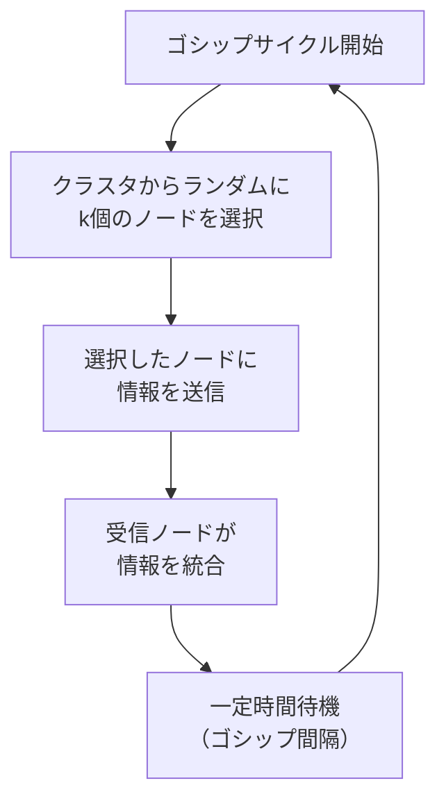
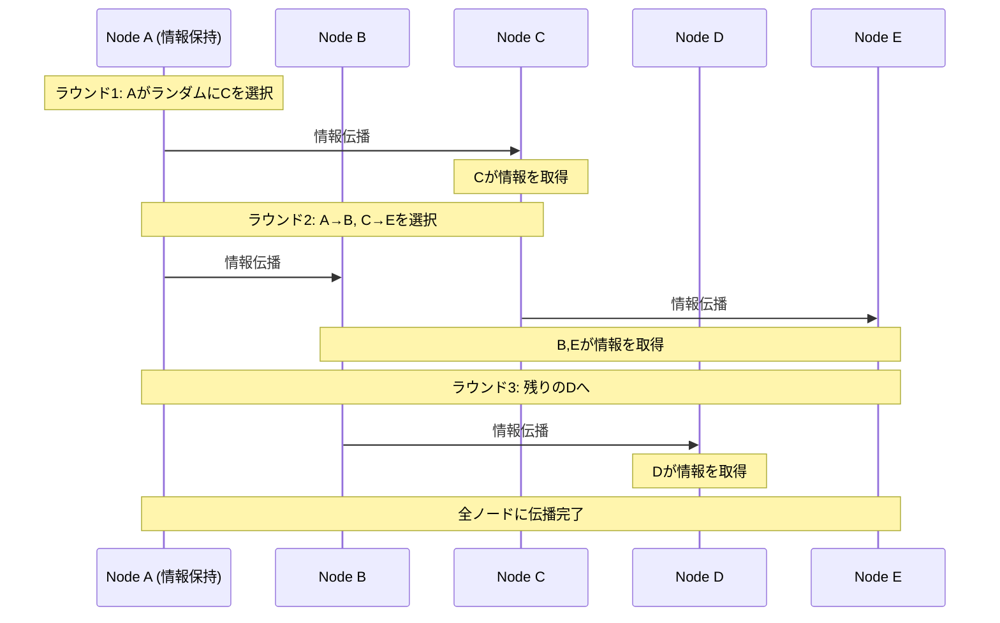
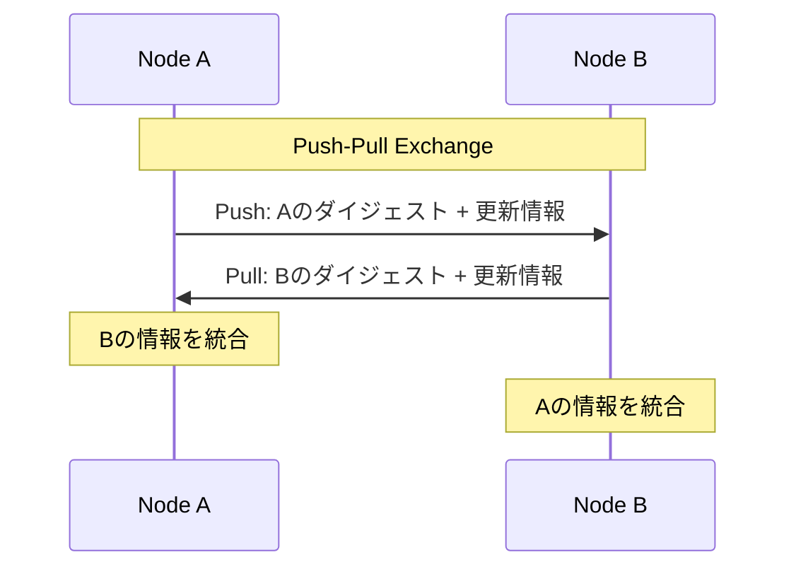
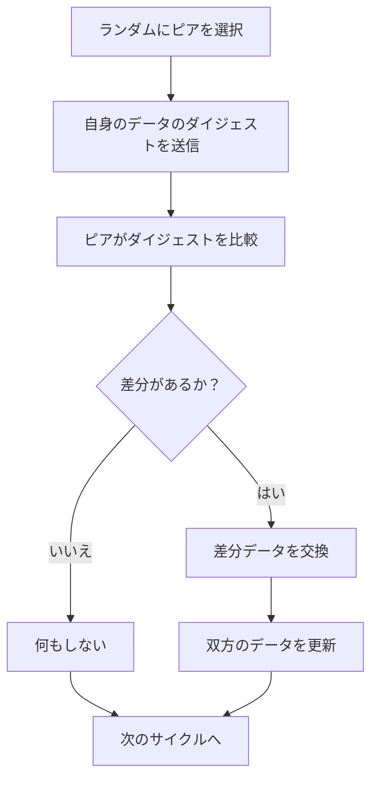
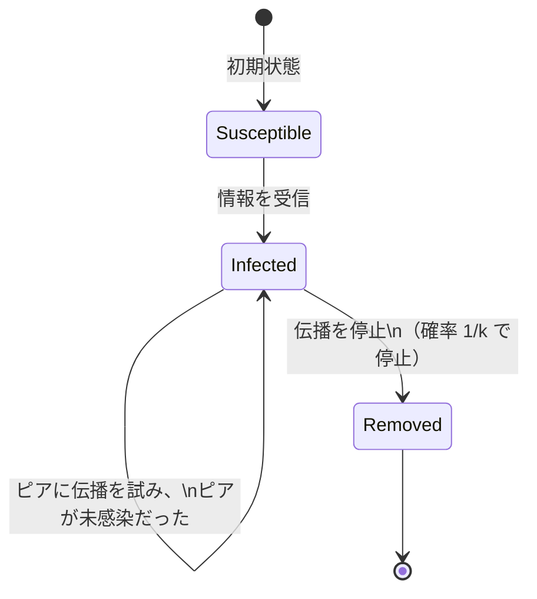
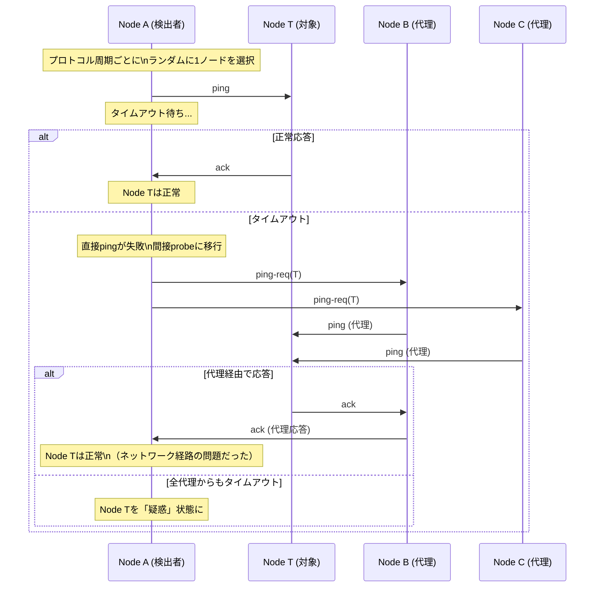
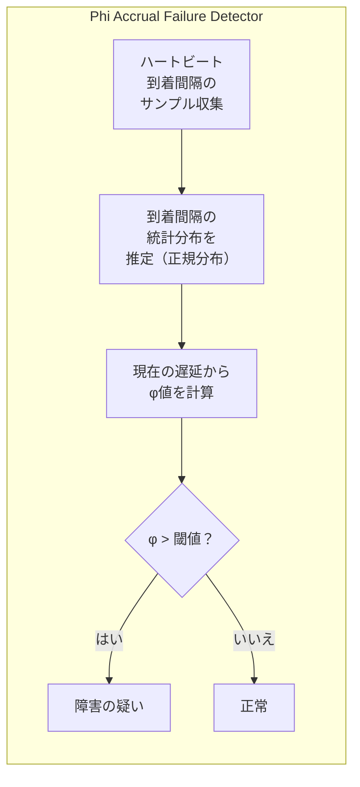
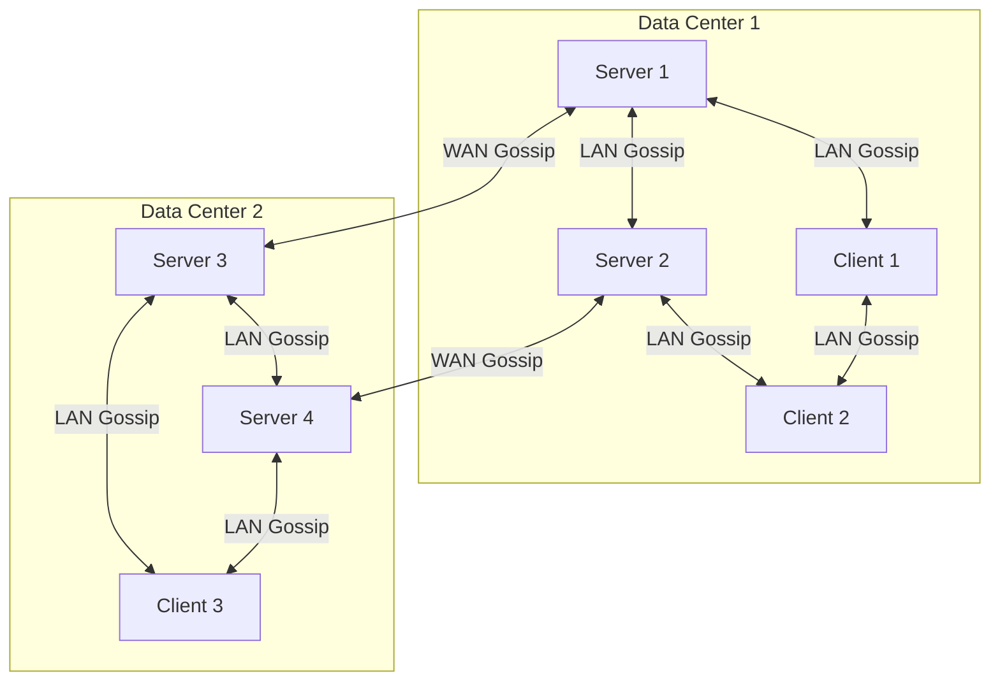

# Gossipプロトコル — 疫学モデルに基づく分散情報伝播

## 1. はじめに：なぜGossipプロトコルが必要なのか

分散システムにおいて、「すべてのノードが同じ情報を持つ」ことは根本的な課題である。クラスタのメンバーシップ情報、設定の変更、障害の検出結果など、あらゆる種類の情報をクラスタ全体に伝播させる必要がある。しかし、ノード数が増加するにつれて、この情報伝播は急速に困難になる。

中央集権的なアプローチ——例えば1台のコーディネーターがすべてのノードに情報を配信する方式——は、コーディネーター自体が単一障害点（Single Point of Failure）となる。また、全ノードへのブロードキャストは、ネットワーク帯域と処理負荷の両面でスケーラビリティに限界がある。一方で、すべてのノード間で情報を直接交換するフルメッシュ通信は、$O(N^2)$ のメッセージ量を必要とし、大規模クラスタでは現実的ではない。

これらの課題に対して、自然界の現象——具体的には**疫病（epidemic）の伝播モデル**——に着想を得た解決策が**Gossipプロトコル**（Epidemic Protocol）である。人から人へと噂が広がるように、各ノードがランダムに選んだ少数のノードに情報を伝え、受け取ったノードがさらに別のノードに伝播する。この一見単純なメカニズムが、驚くほど高速かつ堅牢な情報伝播を実現する。

Gossipプロトコルは、Amazon DynamoDBの設計に大きな影響を与えたAmazon Dynamo論文（2007年）をはじめ、Apache Cassandraの障害検出、HashiCorpのConsulやSerfのクラスタ管理、Akka Clusterのメンバーシップ管理など、現代の分散システムの至るところで採用されている。本記事では、Gossipプロトコルの理論的基盤から実装上の考慮点、そして実世界での採用事例までを包括的に解説する。

## 2. 歴史的背景：疫学モデルとの関連

### 2.1 疫学からコンピュータサイエンスへ

Gossipプロトコルの理論的起源は、1987年にAlan Demers、Dan Greene、Carl Hauser、Wes Irish、John Larson、Scott Shenker、Howard Sturgis、Dan Swinehart、Doug Terryらが発表した論文 *"Epidemic Algorithms for Replicated Database Maintenance"* に遡る。この論文は、Xerox PARCにおける分散データベースの整合性維持の問題に取り組む中で生まれた。

彼らの着想は明快である。感染症が集団の中でどのように広がるかを記述する**SIRモデル**（Susceptible-Infected-Removed）を、情報伝播の問題に適用したのである。

```
SIRモデルとGossipプロトコルの対応関係:

感染症モデル              Gossipプロトコル
-----------------------------------------------------------------
Susceptible（未感染者）   → 情報をまだ受け取っていないノード
Infected（感染者）        → 情報を持ち、積極的に伝播するノード
Removed（免疫獲得者）     → 情報を持っているが、伝播を停止したノード
感染の接触                → ノード間のメッセージ交換
感染率                    → ファンアウト（1回に伝播する相手の数）
```

### 2.2 SIRモデルの数学的基盤

疫学におけるSIRモデルは、以下の微分方程式で記述される。集団の総数を $N$ とし、時刻 $t$ における未感染者数を $S(t)$、感染者数を $I(t)$、免疫獲得者数を $R(t)$ とすると、

$$
\frac{dS}{dt} = -\beta \cdot S \cdot I / N
$$

$$
\frac{dI}{dt} = \beta \cdot S \cdot I / N - \gamma \cdot I
$$

$$
\frac{dR}{dt} = \gamma \cdot I
$$

ここで $\beta$ は感染率、$\gamma$ は回復率である。Gossipプロトコルでは、$\beta$ はファンアウト（1ラウンドで情報を伝える相手の数）とゴシップ間隔に対応し、$\gamma$ は「噂の伝播をやめる」確率に対応する。

### 2.3 Gossipプロトコル以前のアプローチ

Gossipプロトコル以前には、分散システムにおける情報伝播のために以下のような手法が用いられていた。

| 手法 | 仕組み | 課題 |
|------|--------|------|
| 中央集権型ブロードキャスト | 1台が全ノードに送信 | 単一障害点、スケーラビリティ限界 |
| ツリー型マルチキャスト | 木構造に沿って伝播 | 中間ノードの障害で部分木が孤立 |
| フラッディング | 受信したメッセージを全隣接ノードに転送 | メッセージの爆発的増加 |
| リング型伝播 | リング状に順次伝播 | $O(N)$ の遅延、単一ノード障害で分断 |

これらの手法はいずれも、大規模環境での**障害耐性**と**スケーラビリティ**のバランスに課題を抱えていた。Gossipプロトコルは、確率的なアプローチによってこれらの課題を解決した。

## 3. Gossipプロトコルの基本動作

### 3.1 基本的な流れ

Gossipプロトコルの基本動作は極めて単純である。各ノードが定期的に以下のサイクルを繰り返す。



具体的には、以下の手順で進行する。

1. **ピア選択**: クラスタ内のノードリストから、ランダムに $k$ 個（$k$ はファンアウトと呼ばれる）のノードを選択する
2. **情報交換**: 選択したノードに対して、自身が保持する情報（メタデータ、状態変更、障害情報など）を送信する
3. **情報統合**: 受信側ノードは、受け取った情報と自身の情報を比較し、より新しい情報を採用する
4. **待機**: 一定のインターバル（ゴシップ間隔）を空けて、次のサイクルに進む

### 3.2 情報伝播の例

5ノードのクラスタで、Node Aが新しい情報（例えば「Node Xが障害を起こした」）を持っている場合の伝播過程を見てみよう。ファンアウト $k = 1$ とする。



この例では3ラウンドで5ノード全体に情報が行き渡った。ファンアウトが1であっても、情報保持ノードが指数的に増加するため、$O(\log N)$ ラウンドでクラスタ全体に伝播する。

## 4. Gossipプロトコルの3つの型

Gossipプロトコルには、情報交換の方向性によって3つの基本的なバリエーションが存在する。

### 4.1 Push型（プッシュ型）

Push型は、情報を持つノードが能動的に他のノードに情報を「押し出す」方式である。

```
Push型の動作:
1. ノードAが新しい情報を保持している
2. Aがランダムにノードを選択
3. Aが選択したノードに情報を送信
4. 受信ノードは情報を統合
```

**特性**:
- 新しい情報の初期拡散が高速（感染初期の爆発的拡散に類似）
- 情報が十分に広まった後は冗長な通信が増加する（ほとんどの送信先がすでに情報を持っている）
- ネットワーク帯域に余裕がある環境で有効

### 4.2 Pull型（プル型）

Pull型は、各ノードが定期的にランダムなノードから情報を「引き出す」方式である。

```
Pull型の動作:
1. ノードBがランダムにノードAを選択
2. BがAに「最新の情報をください」と要求
3. Aが自身の情報をBに返送
4. Bが受け取った情報を統合
```

**特性**:
- 情報がある程度広まった後の収束が高速（多くのノードが情報を持っているので、引き出しが成功しやすい）
- 初期の拡散はPush型より遅い（情報を持っていないノードが問い合わせても、相手も持っていない可能性が高い）
- 受信側が通信のタイミングを制御できるため、負荷の制御がしやすい

### 4.3 Push-Pull型（プッシュプル型）

Push-Pull型は、両方の利点を組み合わせた方式であり、実用的なGossipプロトコルの多くがこの方式を採用している。

```
Push-Pull型の動作:
1. ノードAがランダムにノードBを選択
2. AがBに自身の情報を送信（Push）
3. BがAに自身の情報を返送（Pull）
4. 両ノードが互いの情報を統合
```



**特性**:
- 初期拡散も後期収束も高速
- 1回の通信で双方向の情報交換ができるため、ラウンド数が半減する
- 通信量はPush型やPull型の約2倍になるが、収束の速さがそれを補う

### 4.4 3つの型の比較

| 特性 | Push型 | Pull型 | Push-Pull型 |
|------|--------|--------|-------------|
| 初期拡散速度 | 高速 | 遅い | 高速 |
| 後期収束速度 | 遅い | 高速 | 高速 |
| 1ラウンドの通信量 | 低い | 中程度 | 高い |
| 収束までのラウンド数 | $O(\log N)$ | $O(\log N)$ | $O(\log \log N)$ |
| 実装の複雑さ | 低い | 低い | 中程度 |

Push-Pull型は、$O(\log \log N)$ ラウンドで全ノードに情報が伝播するという理論的な結果が知られている。これは、1000ノードのクラスタであっても約3~4ラウンドで完了することを意味する。

## 5. 情報伝播の数学的解析

### 5.1 指数的拡散の直感

Gossipプロトコルの最も重要な性質は、**情報が指数的に拡散する**ことである。直感的に理解するために、Push型で $k = 1$（ファンアウト1）の場合を考えてみよう。

- ラウンド0: 1ノードが情報を保持
- ラウンド1: 情報保持ノード(1)がランダムに1ノードに伝播 → 最大2ノード
- ラウンド2: 情報保持ノード(2)がそれぞれ1ノードに伝播 → 最大4ノード
- ラウンド3: 情報保持ノード(4)がそれぞれ1ノードに伝播 → 最大8ノード
- ...

すなわち、情報を持つノードの数は各ラウンドで最大2倍に増える。$N$ ノードに到達するには約 $\log_2 N$ ラウンドで十分である。

### 5.2 厳密な解析

$N$ ノードのクラスタで、時刻 $t$（ラウンド番号）における情報未取得ノードの割合を $s(t)$ とする。Push型でファンアウト $k$ の場合、各ラウンドで情報未取得のノードが感染を免れる確率は、$k$ 回の試行すべてで情報未取得のノードが選ばれない確率に等しい。

$N$ が十分大きい場合、1回の試行で特定の未感染ノードが選ばれない確率は近似的に $1 - 1/N$ であり、感染ノード数が $(1 - s(t)) \cdot N$ 個であるとき、

$$
s(t+1) \approx s(t) \cdot e^{-k \cdot (1 - s(t))}
$$

初期条件 $s(0) = (N-1)/N \approx 1$ から出発して、$s(t)$ は急速に0に近づく。

ファンアウト $k$ の場合、$O(\log N / \log k)$ ラウンドでほぼ全ノードに情報が行き渡る。例えば $k = 3$, $N = 10000$ のとき、

$$
\frac{\log 10000}{\log 3} \approx \frac{9.21}{1.10} \approx 8.4
$$

つまり約9ラウンドで全10,000ノードに到達する。

### 5.3 情報未到達ノードの確率

Gossipプロトコルは確率的なアルゴリズムであるため、すべてのノードに確実に情報が届く保証はない。しかし、情報が届かないノードが存在する確率は、パラメータの調整により任意に小さくできる。

$c \cdot \ln N$ ラウンド（$c$ は定数）後に、特定のノードが情報を受け取っていない確率 $p$ は以下のように評価される。

$$
p \leq e^{-c \cdot k}
$$

例えば $k = 3$, $c = 3$ の場合、

$$
p \leq e^{-9} \approx 0.000123
$$

つまり、10,000ノードのクラスタで情報未到達のノードが1つでも存在する確率は約1.23%に過ぎない。$c$ や $k$ を増やせば、この確率はさらに小さくなる。

### 5.4 収束の速さの比較

各方式の情報伝播速度を比較してみよう。$N = 1000$ のクラスタで全ノードに情報を伝播するのに必要なラウンド数の概算は以下の通りである。

| 方式 | 必要ラウンド数（概算） | 計算根拠 |
|------|----------------------|----------|
| 中央集権（逐次）| 999 | $O(N)$ |
| ツリー型 | 10 | $O(\log N)$、ただし障害に脆弱 |
| Push型 Gossip ($k=3$) | 7~8 | $O(\log N / \log k)$ |
| Push-Pull型 Gossip ($k=3$) | 3~4 | $O(\log \log N)$ |

## 6. Anti-Entropy と Rumor Mongering

Demersらの原論文では、Gossipプロトコルを2つのカテゴリに分類した。**Anti-Entropy**（反エントロピー）と**Rumor Mongering**（噂話）である。これらは異なる特性を持ち、多くのシステムでは両方を組み合わせて使用する。

### 6.1 Anti-Entropy

Anti-Entropyは、全データの整合性を保証することを目的とする方式である。各ノードが定期的にランダムなノードと**全データの比較**を行い、差分を同期する。



**特性**:
- データの完全な整合性を**確率1で**保証する（十分な時間が経過すれば）
- 通信量が大きい（全データのダイジェストを毎回送信する必要がある）
- Merkle Tree（ハッシュツリー）を使うことで差分検出を効率化できる
- バックグラウンドで常時動作し、データの不整合を修復し続ける

実装上は、Merkle Treeを使ってデータのダイジェストを効率的に比較する。Merkle Treeのルートハッシュが一致すれば全データが一致していることが確認でき、不一致の場合は木を辿って差分のある部分だけを同期する。

```
Anti-Entropy with Merkle Tree:

Node A                          Node B
  |                               |
  |--- Root Hash: abc123 -------->|
  |                               |--- Root Hash: abc456
  |                               |    (不一致!)
  |<-- "左サブツリーは一致、      |
  |     右サブツリーが不一致" ----|
  |                               |
  |--- 右サブツリーの             |
  |    差分データ --------------->|
  |                               |--- データ統合
```

### 6.2 Rumor Mongering

Rumor Mongeringは、特定の更新情報（噂）を素早く広めることを目的とする方式である。新しい情報を持つノードが能動的にその情報を伝播するが、ある時点で伝播を停止する。



**伝播停止の条件**:
- **カウンタベース**: 一定回数（例: $\lceil \log N \rceil$ 回）伝播を試みたら停止
- **フィードバックベース**: 伝播先がすでに情報を持っていた場合（冗長な伝播）が一定回数続いたら停止
- **確率ベース**: 各ラウンドで一定確率 $p$ で停止

**特性**:
- 新しい情報の拡散が極めて高速
- 通信量が少ない（全データではなく更新差分のみ）
- 伝播停止により、一部のノードに情報が届かない可能性がある
- Anti-Entropyと組み合わせて使用するのが一般的

### 6.3 Anti-Entropy と Rumor Mongering の組み合わせ

実用的なシステムでは、両方のアプローチを階層的に組み合わせる。

```
実用的なGossip設計:

[Rumor Mongering層]  — 高頻度・低帯域
 ├─ 新しい更新を即座に伝播（数百ミリ秒～数秒間隔）
 ├─ ファンアウト k = 2～3
 └─ 数ラウンドで停止

[Anti-Entropy層]  — 低頻度・高帯域
 ├─ バックグラウンドで定期的にデータ全体を同期（数十秒～数分間隔）
 ├─ Merkle Treeベースの差分検出
 └─ Rumor Mongeringで漏れた情報を補完
```

この二層構造により、「通常時は高速な伝播」と「最終的な完全性保証」を両立できる。Apache Cassandraはまさにこのパターンを採用しており、Gossipプロトコル（Rumor Mongering）でメンバーシップ情報や障害検出を行い、Anti-Entropy（Read Repair, Merkle Tree-based repair）でデータの整合性を維持している。

## 7. メンバーシップ管理とSWIMプロトコル

Gossipプロトコルの最も重要な応用の1つが、クラスタの**メンバーシップ管理**——すなわち「誰がクラスタに参加しているか」「どのノードが生きているか」の管理——である。

### 7.1 メンバーシップ管理の要件

分散システムにおけるメンバーシップ管理には、以下の要件がある。

1. **完全性（Completeness）**: 障害を起こしたノードは、最終的にすべての正常ノードから検出される
2. **正確性（Accuracy）**: 正常なノードが誤って障害として検出されない（誤検出が少ない）
3. **伝播速度**: 障害情報がクラスタ全体に素早く伝わる
4. **スケーラビリティ**: ノード数が増えても性能が劣化しない
5. **対称性**: 特別な役割を持つノードが存在しない（分散的）

### 7.2 従来のハートビート方式の問題

最も単純なメンバーシップ管理は、すべてのノード間でハートビートを交換する方式である。

```
従来のハートビート方式:

各ノードが全ノードにハートビートを送信:
  Node A → Node B, C, D, E  (4メッセージ)
  Node B → Node A, C, D, E  (4メッセージ)
  Node C → Node A, B, D, E  (4メッセージ)
  ...

合計: N × (N-1) = O(N²) メッセージ/インターバル
```

$N$ が大きくなると、ハートビートだけでネットワーク帯域を消費し尽くしてしまう。

### 7.3 SWIMプロトコル

**SWIM（Scalable Weakly-consistent Infection-style Process Group Membership Protocol）** は、2002年にAbhinandan Das、Indranil Gupta、Ashish Motivalaが発表した、Gossipベースのメンバーシップ管理プロトコルである。SWIMは、従来のハートビート方式の $O(N^2)$ のメッセージ量を $O(N)$ に削減しつつ、高い障害検出性能を実現する。

SWIMの核心は、**障害検出**と**情報伝播**を分離し、それぞれに最適な手法を用いることにある。

#### 障害検出フェーズ

SWIMの障害検出は、以下の手順で動作する。



1. **直接Probe**: ノードAが対象ノードTに `ping` を送信し、一定時間内に `ack` を待つ
2. **間接Probe**: 直接 `ping` がタイムアウトした場合、ランダムに $k$ 個の代理ノードを選び、`ping-req(T)` を送信する。代理ノードはTに代わりに `ping` を送信し、応答をAに返す
3. **疑惑状態**: 間接Probeでも応答がない場合、Tを「疑惑（Suspect）」状態にする
4. **障害宣告**: 疑惑状態が一定時間続いた場合、Tを「障害（Faulty）」として宣告する

間接Probeの目的は、**ネットワーク経路の一時的な障害**と**ノードの実際の障害**を区別することにある。AとTの間のネットワークが一時的に不通であっても、B経由やC経由では到達可能かもしれない。

#### 情報伝播フェーズ（Piggyback）

SWIMの情報伝播は、障害検出のための通信メッセージに**便乗（Piggyback）** する形で行われる。

```
Piggybacking:

通常のpingメッセージ:
  [ping]

Piggyback付きpingメッセージ:
  [ping | membership_update_1 | membership_update_2 | ...]

各membership_updateは:
  {node_id, status, incarnation_number, timestamp}
```

つまり、障害検出のための `ping` / `ack` / `ping-req` メッセージに、メンバーシップの更新情報を相乗りさせる。これにより、追加のメッセージを送ることなく、Gossip的な情報伝播が実現される。

#### Incarnation番号

SWIMには**Incarnation番号**という重要な概念がある。これは、ノードが「自分は正常である」と主張するためのカウンタである。

あるノードが誤って「疑惑」状態にされた場合、そのノードは自身のIncarnation番号をインクリメントして、「自分はまだ正常である」というメッセージを発信する。より大きいIncarnation番号を持つメッセージが、古い疑惑情報を上書きする。

```
Incarnation番号による疑惑の解消:

1. Node Bが一時的に応答遅延 → Aが「B is Suspect (inc=5)」を伝播
2. Node Bが回復し、疑惑情報を受信
3. Node Bが「B is Alive (inc=6)」を伝播（Incarnation番号をインクリメント）
4. inc=6 > inc=5 なので、Bの「Alive」メッセージが優先される
5. 全ノードがBを正常と認識
```

### 7.4 SWIMの通信量解析

SWIMの通信量を解析しよう。$T$ をプロトコル周期（ゴシップ間隔）、$N$ をノード数とする。

- 各プロトコル周期で、各ノードは1つの対象ノードにpingを送信する
- ping失敗時は最大 $k$ 個の代理ノードにping-reqを送信する
- 各メッセージにはPiggyback情報が付加される

1ノードあたりの通信量は、1周期あたり $O(1)$ メッセージ（最悪でも $k + 1$ メッセージ）である。クラスタ全体では $O(N)$ メッセージとなり、従来のフルメッシュハートビートの $O(N^2)$ から大幅に改善されている。

| 方式 | 1周期あたりの通信量 | 障害検出の遅延 |
|------|-------------------|---------------|
| フルメッシュハートビート | $O(N^2)$ | $O(1)$ 周期 |
| SWIM | $O(N)$ | $O(\log N)$ 周期（伝播遅延） |

SWIMの障害検出遅延は $O(\log N)$ 周期であるが、これはGossipベースの伝播に由来する。1000ノードのクラスタでプロトコル周期が1秒であれば、約10秒で障害情報がクラスタ全体に伝播する。多くのユースケースではこの遅延は許容範囲内である。

## 8. 障害検出

### 8.1 障害検出器の理論

障害検出はGossipプロトコルの重要な応用領域である。Chandra and Toueg（1996年）の定式化によれば、障害検出器は以下の2つの性質で評価される。

- **完全性（Completeness）**: 実際に障害を起こしたノードは、最終的にすべての正常ノードによって検出される
- **正確性（Accuracy）**: 正常なノードが誤って障害として検出されない

完全な正確性と完全な完全性を同時に保証することは、非同期分散システムでは不可能であることが知られている（FLP不可能性定理の帰結）。実用的なシステムでは、**最終的な完全性**（Eventually Complete）と**高い確率での正確性**を目指す。

### 8.2 Gossipベースの障害検出

Gossipベースの障害検出では、各ノードがメンバーシップリストとともに各ノードの**ハートビートカウンタ**を維持する。

```
メンバーシップリスト（各ノードが保持）:

Node ID | Heartbeat Counter | Last Updated (local time)
--------|-------------------|-------------------------
A       | 142               | 10:00:05
B       | 137               | 10:00:03
C       | 155               | 10:00:04
D       | 98                | 09:59:50  ← 一定時間更新されていない → 疑惑
E       | 201               | 10:00:05
```

1. 各ノードは自身のハートビートカウンタを定期的にインクリメントする
2. Gossip交換の際に、メンバーシップリストを相互に比較する
3. より大きいハートビートカウンタを持つ情報で更新する
4. 一定時間（$T_{\text{fail}}$）ハートビートカウンタが更新されないノードを「疑惑」とみなす
5. さらに一定時間（$T_{\text{cleanup}}$）後にメンバーシップリストから削除する

### 8.3 Phi Accrual Failure Detector

Apache Cassandraが採用している**Phi Accrual Failure Detector**は、二値的な（alive/dead）判定ではなく、ノードが障害を起こしている**疑惑度**を連続値 $\phi$ で出力する、より洗練された障害検出器である。

$$
\phi(t) = -\log_{10}\left(1 - F(t - t_{\text{last}})\right)
$$

ここで、$F$ はハートビート到着間隔の累積分布関数（通常は正規分布でモデル化）、$t_{\text{last}}$ は最後にハートビートを受信した時刻である。

$\phi$ の値の解釈:
- $\phi = 1$: 誤検出確率 10%
- $\phi = 2$: 誤検出確率 1%
- $\phi = 3$: 誤検出確率 0.1%
- $\phi = 8$: 誤検出確率 $10^{-8}$

アプリケーションは $\phi$ の閾値を設定することで、誤検出率と検出遅延のトレードオフを自由に調整できる。低い閾値（例: $\phi > 3$）を設定すれば素早い検出が可能だが誤検出が増え、高い閾値（例: $\phi > 8$）を設定すれば誤検出は減るが検出が遅くなる。



Phi Accrual Failure Detectorの利点は、ネットワークの状況に**適応的**であることだ。到着間隔のばらつきが大きい環境（例: 高負荷時やクラウド環境）では、自動的に判定が緩和される。

## 9. 実装上の考慮点

### 9.1 ファンアウト（Fanout）の設定

ファンアウト $k$ は、1ラウンドで情報を伝える相手の数を決定するパラメータである。

- **$k$ が大きい場合**: 情報伝播が高速化するが、1ラウンドあたりのメッセージ数が増加する
- **$k$ が小さい場合**: ネットワーク負荷は低いが、収束に時間がかかる

一般的な推奨値は $k = 2$ ~ $k = 4$ である。理論的には $k = \lceil \ln N \rceil$ が最適に近いとされるが、実際には小さな固定値でも十分に高速な伝播が得られる。

```
ファンアウトと収束ラウンド数の関係（N = 1000）:

k = 1: 約 10 ラウンド
k = 2: 約  7 ラウンド
k = 3: 約  6 ラウンド
k = 5: 約  5 ラウンド
k = 10: 約 4 ラウンド
```

実用上、$k = 3$ が最も広く採用されているバランスポイントである。HashiCorpのSerfはデフォルトで $k = 3$ を使用している。

### 9.2 ゴシップ間隔（Gossip Interval）

ゴシップ間隔は、各ノードがGossipサイクルを実行する周期を決定する。

- **短い間隔（例: 200ms）**: 情報伝播が高速だが、CPU・ネットワーク負荷が増大
- **長い間隔（例: 10秒）**: 負荷が低いが、障害検出や情報伝播に遅延が生じる

典型的な設定:

| ユースケース | ゴシップ間隔 | 根拠 |
|------------|------------|------|
| 障害検出（SWIM） | 200ms ~ 1秒 | 障害の早期検出が優先 |
| メンバーシップ管理 | 1秒 ~ 5秒 | バランスの取れた設定 |
| データ同期（Anti-Entropy） | 10秒 ~ 数分 | 帯域幅の節約が優先 |

### 9.3 ピア選択戦略

基本的なGossipプロトコルではピアを完全にランダムに選択するが、実装上のいくつかの工夫が知られている。

**ラウンドロビン + シャッフル**: すべてのノードをリストに入れ、シャッフルして順番にGossip対象とする。一巡したら再びシャッフルする。これにより、すべてのノードが均等にGossipの対象となることが保証され、完全ランダムの場合よりも収束が均一になる。

```python
# Round-robin with shuffle approach
import random

class GossipPeerSelector:
    def __init__(self, all_nodes, self_node):
        self.all_nodes = [n for n in all_nodes if n != self_node]
        self.index = 0
        random.shuffle(self.all_nodes)

    def next_peer(self):
        if self.index >= len(self.all_nodes):
            # Reshuffle when all peers have been contacted
            random.shuffle(self.all_nodes)
            self.index = 0
        peer = self.all_nodes[self.index]
        self.index += 1
        return peer
```

**トポロジー考慮**: データセンターのラック構造やネットワークトポロジーを考慮し、近いノードを優先的に選ぶことで、ネットワーク帯域を節約する。ただし、ランダム性を損なうと情報伝播に偏りが生じるため、注意が必要である。

### 9.4 メッセージサイズとペイロード

Gossipメッセージのサイズは、ネットワーク帯域とUDP MTU（Maximum Transmission Unit）の制約を受ける。

- UDP使用時: 典型的なMTUは1,472バイト（Ethernet MTU 1500 - IPヘッダ20 - UDPヘッダ8）
- Piggyback方式の場合、1メッセージに格納できるメンバーシップ更新の数に上限がある
- 更新情報に優先順位を付け、重要度の高い情報（新しい障害情報など）を優先的に載せる

```
UDPメッセージの構造例:

+--------------------------------------------------+
| Message Header (type, sender_id, seq_no)   8 bytes |
+--------------------------------------------------+
| Primary Payload (ping/ack/ping-req)       16 bytes |
+--------------------------------------------------+
| Piggyback Entry 1 (node, status, inc)     20 bytes |
| Piggyback Entry 2                         20 bytes |
| ...                                                |
| Piggyback Entry N                         20 bytes |
+--------------------------------------------------+
| 合計: 24 + 20N ≤ 1472 bytes                       |
| → 最大約72エントリをPiggyback可能                  |
+--------------------------------------------------+
```

### 9.5 パケットロスへの対応

UDPベースのGossipプロトコルでは、パケットロスが発生し得る。これに対する対策として以下がある。

- **冗長な伝播**: ファンアウトを増やすことで、1つのメッセージが失われても他のパスで情報が届く確率が高まる
- **再送**: 重要な情報（障害宣告など）に限り、TCPフォールバックを用いる
- **Piggybackの繰り返し**: 同じ情報を複数ラウンドにわたってPiggybackし続ける。伝播回数がしきい値に達したら削除する

## 10. 実世界での採用事例

### 10.1 Apache Cassandra

Apache Cassandraは、Gossipプロトコルを**メンバーシップ管理**と**障害検出**の基盤として使用している。

**Gossipの使途**:
- クラスタメンバーシップの管理
- トークン（データ範囲の割り当て）情報の伝播
- スキーマバージョンの同期
- 負荷情報の共有
- 障害検出（Phi Accrual Failure Detector）

**パラメータ設定**:
- ゴシップ間隔: 1秒
- ファンアウト: 1～3（ライブノード1つ、シードノード、ダウンノードへの確率的な試行）
- Phi閾値: デフォルト8（設定変更可能）

Cassandraでは、各ノードが **ApplicationState** と呼ばれるキーバリューのマップを保持し、これをGossipで伝播する。ApplicationStateには、トークン情報、データセンター/ラック情報、スキーマバージョン、負荷などが含まれる。

```
Cassandraのゴシップメッセージ構造:

GossipDigestSyn:
  - Cluster名
  - パーティショナー名
  - ダイジェストリスト: [(endpoint, generation, version), ...]

GossipDigestAck:
  - ダイジェストリスト（相手が古い情報を持つノード）
  - ApplicationStateMap（相手に不足している情報）

GossipDigestAck2:
  - ApplicationStateMap（Ack内のダイジェストに対応する情報）
```

この3-wayハンドシェイク（Syn → Ack → Ack2）により、1回のGossipサイクルで効率的な双方向の情報同期が実現される。

### 10.2 HashiCorp Consul / Serf

HashiCorpのSerfとConsulは、**SWIM**プロトコル（およびその改良版である**Lifeguard**）を実装したメンバーシップ管理ライブラリ **memberlist** を基盤としている。

**Serf**はSWIMベースのクラスタメンバーシップ管理ツールであり、以下の機能を提供する。
- メンバーシップの管理（join, leave, failed の検出）
- イベントのブロードキャスト
- カスタムクエリの配信

**Consul**はSerfの上に構築されたサービスディスカバリ/設定管理ツールであり、Gossipを2つのレイヤーで使用する。
- **LANゴシップ**: 同一データセンター内のノード間（低レイテンシ、高頻度）
- **WANゴシップ**: データセンター間のサーバーノード間（高レイテンシ、低頻度）



**Lifeguard拡張**:

memberlistは、SWIMプロトコルをさらに改良した**Lifeguard**と呼ばれる拡張を実装している。Lifeguardの主な改良点は以下の通りである。

1. **Local Health Awareness**: 自ノードの健全性を考慮に入れる。自分自身がGossipメッセージを処理するのに時間がかかっている（高負荷状態の）場合、他ノードの障害検出タイムアウトを延長する
2. **Dynamic Suspect Timer**: 疑惑タイマーを動的に調整し、クラスタサイズやネットワーク状況に応じて適切な値を設定する
3. **Refutation**: 自分が「疑惑」にされた情報を受け取った場合に、即座にIncarnation番号をインクリメントして反論を伝播する

### 10.3 Amazon DynamoDB / Dynamo

Amazon Dynaomの論文（2007年）では、Gossipベースのメンバーシップ管理と障害検出が記述されている。各ノードはGossipプロトコルを使って、一貫性のある（最終的に収束する）メンバーシップビューを維持する。

Dynamoでは、以下の場面でGossipが使われる。
- ノードの参加/離脱の情報伝播
- Consistent Hashingのリング情報の同期
- 一時的な障害と永続的な障害の区別

### 10.4 Redis Cluster

Redis Clusterも、ノード間の通信にGossipプロトコルを使用している。各ノードは定期的にランダムなノードを選択し、`PING` / `PONG` メッセージを交換する。これらのメッセージには、送信ノードが認識しているクラスタの状態情報が含まれている。

Redis ClusterのGossipは以下の情報を伝播する。
- ノードの状態（正常、障害、ハンドシェイク中）
- スロット（ハッシュスロット）の割り当て情報
- マスター/レプリカの関係
- 設定のエポック番号

### 10.5 CockroachDB

CockroachDBは、Gossipプロトコルをクラスタのメタデータ伝播に使用する。具体的には以下の情報が伝播される。
- ノードのアドレスと状態
- ストアの記述子（容量、レンジ数など）
- システム設定の変更

CockroachDBのGossipは、少数のハブノードを通じて情報を伝播するハブアンドスポーク型のトポロジーを採用しており、メッセージ量の削減と伝播の高速化を両立している。

## 11. Gossipプロトコルの限界と課題

Gossipプロトコルは強力な仕組みであるが、万能ではない。その限界と課題を理解しておくことは、適切な設計判断のために重要である。

### 11.1 最終的な整合性しか保証しない

Gossipプロトコルは、情報が**最終的に**すべてのノードに伝播することは保証するが、**即座に**伝播することは保証しない。したがって、ある時点で異なるノードが異なる情報を持っている状態が一時的に発生する。

強い一貫性（Linearizabilityなど）が必要な場面では、PaxosやRaftのようなコンセンサスアルゴリズムを使用すべきである。Gossipプロトコルは、最終的整合性（Eventual Consistency）が許容される場面に適している。

### 11.2 メッセージの冗長性

Gossipプロトコルの本質的な性質として、同じ情報が複数回、複数のパスで伝達される。これは障害耐性の源泉でもあるが、同時にネットワーク帯域の浪費でもある。

情報がクラスタ全体に行き渡った後も、Anti-EntropyやRumor Mongeringが同じ情報を伝達し続ける可能性がある。これを軽減するために以下の対策が取られる。

- Rumor Mongeringにおける伝播停止条件の適切な設定
- バージョン番号やタイムスタンプによる重複検出
- ダイジェスト（要約）を先に交換し、差分がある場合のみ全データを送信

### 11.3 大規模クラスタでの収束遅延

$O(\log N)$ の伝播遅延は多くの場合十分に高速であるが、ノード数が非常に大きい場合（例: 数万～数十万ノード）には、ゴシップ間隔との組み合わせで無視できない遅延が生じることがある。

例えば、$N = 100,000$ ノード、ゴシップ間隔1秒、ファンアウト3の場合、

$$
\text{伝播ラウンド数} \approx \frac{\log 100000}{\log 3} \approx \frac{11.5}{1.1} \approx 10.5
$$

つまり、約11秒で全ノードに到達する。障害検出の文脈では、この11秒の遅延が問題になることがある。

### 11.4 ネットワーク分断（Split Brain）

ネットワークが分断されて2つ以上のパーティションに分かれた場合、各パーティション内ではGossipが正常に動作するが、パーティション間では情報が伝播しない。

これにより、以下の問題が発生する可能性がある。
- 各パーティションが、相手パーティションのノードを「障害」と誤認する
- ネットワークが復旧した際に、矛盾する状態の統合が必要になる

ネットワーク分断の問題はGossipプロトコル固有ではなく、あらゆる分散システムが直面する根本的な課題（CAP定理の帰結）であるが、Gossipプロトコルにはパーティション検出のための特別なメカニズムがないため、外部の仕組み（例: シードノード、コンセンサスアルゴリズム）と組み合わせて対処する必要がある。

### 11.5 セキュリティ上の考慮

基本的なGossipプロトコルには、認証や暗号化のメカニズムが含まれていない。悪意のあるノードがクラスタに参加し、偽の情報（偽の障害報告、不正なメンバーシップ変更など）を伝播する**ポイズニング攻撃**が可能である。

対策として以下が必要になる。
- メッセージの署名（HMAC）による改ざん検出
- 通信の暗号化（TLS, あるいはメッセージレベルの暗号化）
- ノード参加時の認証（共有シークレット、証明書ベース）
- 不正メッセージのレート制限

HashiCorpのSerfやConsulは、共有鍵による暗号化をサポートしている。

### 11.6 監視とデバッグの難しさ

Gossipプロトコルは分散的・確率的に動作するため、問題の診断が難しい。
- 情報がどのパスを通って伝播したかを追跡しにくい
- 特定のノードに情報が届かない原因の特定が困難
- 障害検出の誤検出と実際の障害の区別が困難

このため、実運用では以下のような可観測性の仕組みが重要になる。
- Gossipメッセージのメトリクス（送受信数、遅延、ドロップ数）
- メンバーシップ変更のイベントログ
- 障害検出状態の可視化ダッシュボード

## 12. 設計判断のガイドライン

### 12.1 Gossipプロトコルが適する場面

- **メンバーシップ管理**: クラスタの参加/離脱/障害の検出と伝播
- **メタデータの伝播**: 設定変更、スキーマバージョン、負荷情報などの共有
- **集計（Aggregation）**: 分散カウンタ、平均値計算などの近似的な集計
- **最終的整合性が許容されるデータ同期**: キャッシュの無効化、レプリカの修復

### 12.2 Gossipプロトコルが不適な場面

- **強い一貫性が必要**: コンセンサスアルゴリズム（Raft, Paxos）を使用すべき
- **大容量データの同期**: Gossipはメタデータの伝播に適しており、GBオーダーのデータ転送には不向き
- **即座の伝播が必要**: 数ミリ秒以内に全ノードに到達する必要がある場合、直接通信やブロードキャストが必要
- **厳密な順序保証**: Gossipは順序を保証しないため、全順序が必要な場合はコンセンサスやTotal Order Broadcastが必要

### 12.3 パラメータ選択のチートシート

| パラメータ | 推奨値 | 根拠 |
|-----------|--------|------|
| ファンアウト ($k$) | 3 | $\log N$ ラウンドで高確率収束 |
| ゴシップ間隔 | 1秒 | 障害検出とネットワーク負荷のバランス |
| 疑惑タイムアウト | $5 \times$ ゴシップ間隔 | 一時的なネットワーク障害を許容 |
| 障害宣告タイムアウト | $3 \times$ 疑惑タイムアウト | 誤検出を最小化 |
| 間接Probe数 ($k$) | 3 | ネットワーク経路の冗長性確保 |
| Piggybackのバッファ深度 | $6 \times \log N$ | 確実な情報伝播 |

## 13. まとめ

Gossipプロトコルは、疫学のSIRモデルに着想を得た、確率的な分散情報伝播メカニズムである。その本質は「各ノードがランダムに選んだ少数のノードに情報を伝える」というシンプルなルールが、$O(\log N)$ ラウンドでクラスタ全体への伝播を実現する点にある。

本記事で見たように、Gossipプロトコルは以下の特性を持つ。

- **スケーラビリティ**: ノード数に対して対数的な伝播遅延と線形のメッセージ量
- **障害耐性**: 中央集権的なコンポーネントがなく、ノード障害やメッセージロスに対して頑健
- **単純性**: 各ノードの動作が極めてシンプルで、実装・デバッグが比較的容易
- **確率的保証**: 厳密な保証ではなく、高い確率での保証を提供する

一方で、最終的整合性しか保証しないこと、メッセージの冗長性があること、大規模環境での収束遅延が存在することなどの限界も持つ。

SWIMプロトコルに代表されるメンバーシップ管理、Phi Accrual Failure Detectorに代表される障害検出、Anti-EntropyとRumor Mongeringの組み合わせによるデータ同期——これらの応用パターンは、Apache Cassandra、HashiCorp Consul/Serf、Redis Cluster、CockroachDBなど、現代の分散システムの基盤を形成している。

分散システムの設計において、Gossipプロトコルは「完璧な伝播」を追求するのではなく、「十分に高い確率で十分に速い伝播」を実現するという、実用的な妥協の産物である。この哲学こそが、複雑で障害に満ちた分散環境において、Gossipプロトコルが広く採用され続けている理由である。
