# GPUアーキテクチャ — 並列計算の原理とCUDA計算モデル

## 1. 歴史的背景 — グラフィクスパイプラインからGPGPUへ

### 1.1 GPUの誕生と初期の進化

GPU（Graphics Processing Unit）は、もともと3Dグラフィクスのレンダリングを高速化するために設計された専用プロセッサである。1990年代後半、PCゲームや3D CADの需要が急増し、CPUだけでは膨大なピクセル演算を処理しきれなくなった。この課題に応えるために登場したのが、グラフィクスアクセラレータと呼ばれる専用ハードウェアであった。

1999年、NVIDIAが GeForce 256 を発表し、「GPU」という用語を初めて公式に使用した。GeForce 256 は、頂点変換とライティング計算をハードウェアで処理する Transform & Lighting（T&L）エンジンを搭載しており、これまでCPUが担っていたグラフィクスパイプラインの一部をGPU側にオフロードする画期的な製品であった。

### 1.2 固定機能パイプラインからプログラマブルシェーダへ

初期のGPUは、グラフィクスパイプラインの各ステージが固定されたハードウェアで実装されていた。頂点処理、ラスタライゼーション、ピクセル処理といった各段階は、あらかじめ決められたアルゴリズムをハードウェア的に実行するものであり、開発者がカスタマイズできる余地は限られていた。

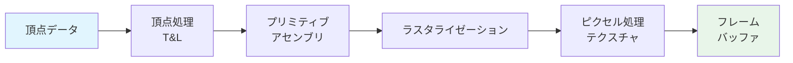

2001年、DirectX 8 と共にプログラマブルシェーダが導入された。開発者は頂点シェーダとピクセルシェーダに独自のプログラムを記述できるようになり、GPUの表現力は飛躍的に向上した。しかし、この時点では頂点シェーダとピクセルシェーダは別々のハードウェアユニットで実行されており、ワークロードの偏りによってどちらか一方がボトルネックになるという問題があった。

### 1.3 統合シェーダアーキテクチャの登場

2006年、NVIDIAの GeForce 8800 GTX（G80アーキテクチャ）は、統合シェーダアーキテクチャ（Unified Shader Architecture）を採用した。これは、頂点シェーダとピクセルシェーダを区別せず、すべてのシェーダプログラムを同一の汎用演算ユニットで実行するアーキテクチャである。この設計により、ワークロードに応じて演算リソースを動的に割り当てることが可能となり、ハードウェアの利用効率が大幅に向上した。

統合シェーダアーキテクチャの導入は、GPUを汎用計算に利用するGPGPU（General-Purpose computing on GPU）の道を切り開いた。すべての演算ユニットが同じ命令セットを実行できるため、グラフィクス以外の汎用的な並列計算にもGPUを活用できるようになったのである。

### 1.4 CUDAの登場とGPGPU革命

2007年、NVIDIAはCUDA（Compute Unified Device Architecture）を発表した。CUDAは、C/C++ライクなプログラミング言語でGPU上の並列計算を記述できるプラットフォームであり、グラフィクスAPIの知識がなくてもGPUの計算能力を活用できるようにした。

CUDAの登場以前は、GPGPUプログラミングにはOpenGLやDirectXのシェーダ言語を「濫用」して汎用計算を行う必要があり、非常に煩雑であった。CUDAはこの障壁を取り除き、科学計算、機械学習、信号処理など多様な分野でGPUの活用が爆発的に広がるきっかけとなった。

同時期にAMDもATI Stream（後のROCm）を、Khronos Groupはベンダー非依存のOpenCLを提唱した。しかし、CUDAはエコシステムの充実度やツールチェーンの完成度において先行し、特にAI/ML分野においてデファクトスタンダードの地位を確立している。

## 2. SIMTアーキテクチャ — GPUの計算モデル

### 2.1 SIMDとSIMTの違い

GPUの計算モデルを理解するには、まずCPUにおけるSIMD（Single Instruction, Multiple Data）との対比が有効である。

**SIMD** は、1つの命令で複数のデータ要素を同時に処理する方式である。例えば、x86のAVX-512命令は、1つの命令で512ビット幅（64ビット浮動小数点数8個分）のデータを並列に処理できる。SIMDでは、プログラマが明示的にベクトル化を意識する必要があり、データのアライメントやベクトル幅に制約がある。

**SIMT（Single Instruction, Multiple Threads）** は、NVIDIAのGPUが採用する計算モデルである。SIMTはSIMDと似ているが、重要な違いがある。SIMTでは、各スレッドが独自のプログラムカウンタとレジスタ状態を持ち、論理的には独立したスレッドとして振る舞う。しかし、ハードウェアレベルでは、一群のスレッド（ワープ）が同一の命令を同時に実行する。

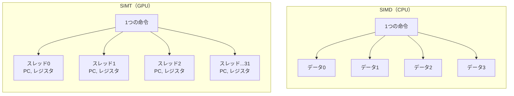

SIMTの利点は、プログラマからはスカラスレッドの集合として自然に記述できることである。分岐の取り扱いにも柔軟性があり（後述のワープダイバージェンス）、SIMDと比較してプログラミングが容易である。

### 2.2 ワープ（Warp）とウェーブフロント（Wavefront）

NVIDIAのGPUでは、32スレッドをひとまとめにした単位を **ワープ（Warp）** と呼ぶ。1つのワープ内の32スレッドは、同一のクロックサイクルで同一の命令を実行する。これがGPUにおける最小の実行単位である。

AMDのGPUでは同等の概念を **ウェーブフロント（Wavefront）** と呼び、RDNA以前のアーキテクチャでは64スレッド、RDNA以降では32スレッドを1単位とする。

ワープ内の各スレッドは同じ命令を実行するが、異なるデータに対して操作を行う。例えば、ベクトル加算の場合、ワープ内の32スレッドがそれぞれ異なる要素のインデックスを担当し、同時に加算を実行する。

```cuda
// Each thread computes one element of the result
__global__ void vectorAdd(float* A, float* B, float* C, int N) {
    int i = blockIdx.x * blockDim.x + threadIdx.x;
    if (i < N) {
        C[i] = A[i] + B[i];  // All 32 threads in a warp execute this simultaneously
    }
}
```

### 2.3 ワープスケジューリング

GPUのストリーミングマルチプロセッサ（SM）には、複数のワープが同時に割り当てられる。SMのワープスケジューラは、クロックサイクルごとに実行可能なワープの中から1つ（または複数）を選択して命令を発行する。

あるワープがメモリアクセスの完了を待っている間、スケジューラは別の準備完了のワープに切り替えて実行する。この **レイテンシ隠蔽（Latency Hiding）** がGPUの高いスループットを実現する鍵である。CPUのコンテキストスイッチとは異なり、ワープの切り替えにはオーバーヘッドがほとんどない。なぜなら、すべてのワープのレジスタ状態がSM上に常駐しているためである。

```mermaid
gantt
    title ワープスケジューリングによるレイテンシ隠蔽
    dateFormat X
    axisFormat %s

    section Warp 0
    演算     :a1, 0, 2
    メモリ待ち :crit, a2, after a1, 6
    演算     :a3, after a2, 2

    section Warp 1
    待機     :done, b0, 0, 2
    演算     :b1, 2, 2
    メモリ待ち :crit, b2, after b1, 6
    演算     :b3, after b2, 2

    section Warp 2
    待機     :done, c0, 0, 4
    演算     :c1, 4, 2
    メモリ待ち :crit, c2, after c1, 6

    section Warp 3
    待機     :done, d0, 0, 6
    演算     :d1, 6, 2
    メモリ待ち :crit, d2, after d1, 6
```

上の図が示すように、1つのワープがメモリアクセスで停止している間も、他のワープが演算を実行し続けることで、演算ユニットの稼働率を高く維持できる。十分な数のワープをSMに割り当てる（**オキュパンシー**を高める）ことが、GPUプログラミングにおける重要な最適化指針の一つである。

## 3. ストリーミングマルチプロセッサ（SM/CU）

### 3.1 SMの内部構造

ストリーミングマルチプロセッサ（SM）は、NVIDIAのGPUにおける基本的な計算ユニットである。AMDでは同等のユニットをCompute Unit（CU）と呼ぶ。GPU全体は、複数のSM（またはCU）を搭載しており、各SMは独立して並列にワークロードを実行する。

NVIDIAのAmpereアーキテクチャ（A100）におけるSMの構成を例として示す。

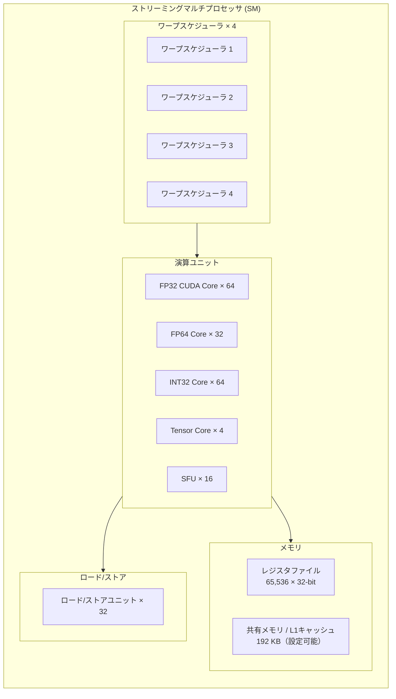

各SMは以下の主要コンポーネントを持つ。

- **ワープスケジューラ**: 毎サイクル、実行可能なワープを選択し命令をディスパッチする。Ampere SMは4つのワープスケジューラを持ち、各スケジューラが1サイクルに1命令を発行できる
- **CUDA Core（FP32/INT32）**: 単精度浮動小数点数および32ビット整数の演算を行うスカラプロセッサ。1つのCUDA Coreがワープ内の1スレッド分の演算を担当する
- **FP64 Core**: 倍精度浮動小数点数の演算を行う。科学計算向けGPU（A100など）では十分な数のFP64コアが搭載されるが、ゲーム用GPUでは大幅に削減される
- **Tensor Core**: 行列積和演算（Matrix Multiply-Accumulate）を高速化する専用ユニット。AI/MLワークロードにおいて極めて重要（後述）
- **SFU（Special Function Unit）**: 三角関数、指数関数、逆数、平方根逆数などの超越関数を計算する
- **ロード/ストアユニット**: メモリアクセス命令を処理する
- **レジスタファイル**: SM上のすべてのスレッドが使用するレジスタの総量。65,536個の32ビットレジスタがSM全体で共有される
- **共有メモリ / L1キャッシュ**: SM内のスレッド間でデータを共有するための高速メモリ。L1データキャッシュと設定可能な比率で共有される

### 3.2 SMの世代別進化

NVIDIAのSMアーキテクチャは世代を重ねるごとに進化してきた。

| アーキテクチャ | 年 | SM名称 | FP32 Core/SM | Tensor Core | 主な特徴 |
|---|---|---|---|---|---|
| Tesla (G80) | 2006 | TPC | 16 | - | 統合シェーダ、CUDA 1.0 |
| Fermi (GF100) | 2010 | SM | 32 | - | L1/L2キャッシュ、ECC |
| Kepler (GK110) | 2012 | SMX | 192 | - | Dynamic Parallelism |
| Maxwell (GM204) | 2014 | SMM | 128 | - | 電力効率の大幅改善 |
| Pascal (GP100) | 2016 | SM | 64 | - | NVLink、HBM2 |
| Volta (GV100) | 2017 | SM | 64 | 8 (1st gen) | Tensor Core初搭載 |
| Turing (TU102) | 2018 | SM | 64 | 8 (2nd gen) | RT Core（レイトレーシング） |
| Ampere (GA100) | 2020 | SM | 64 | 4 (3rd gen) | TF32、構造化スパース性 |
| Hopper (GH100) | 2022 | SM | 128 | 4 (4th gen) | Transformer Engine、FP8 |
| Blackwell (GB100) | 2024 | SM | 128 | 4 (5th gen) | 第2世代Transformer Engine |

### 3.3 AMDのCompute Unit（CU）

AMDのGPUアーキテクチャも同様の階層構造を持つが、用語と設計の詳細が異なる。

- **GCN（Graphics Core Next）アーキテクチャ**: CUは64個のストリームプロセッサを持ち、64スレッドのウェーブフロントを実行する
- **RDNA（Radeon DNA）アーキテクチャ**: ゲーム向けに最適化。CUを2つ束ねたWork Group Processor（WGP）を基本単位とし、32スレッドのウェーブフロントをサポートする
- **CDNA（Compute DNA）アーキテクチャ**: データセンター向け計算に特化。Matrix Core（NVIDIAのTensor Coreに相当）を搭載し、AI/HPC向けに最適化されている

## 4. メモリ階層

GPUのメモリ階層は、CPUとは大きく異なる設計思想に基づいている。GPUは膨大な数のスレッドを同時に実行するため、メモリ帯域幅の最大化とレイテンシ隠蔽に重点が置かれる。

### 4.1 メモリ階層の全体像

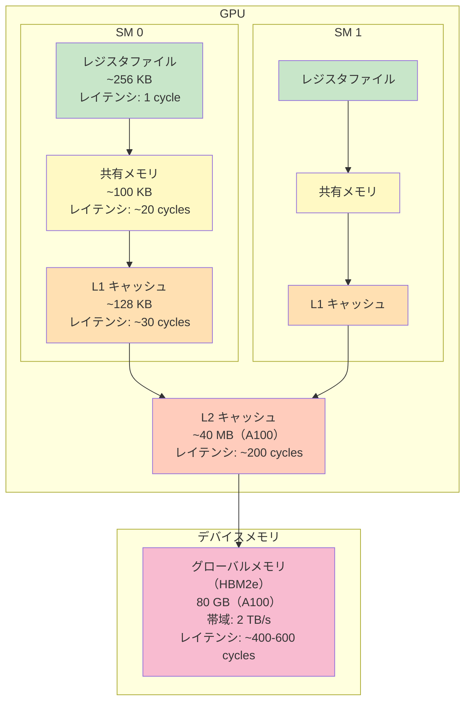

### 4.2 レジスタファイル

レジスタファイルは、GPUのメモリ階層において最も高速なストレージである。各SMは大容量のレジスタファイル（Ampere A100で65,536個の32ビットレジスタ、合計256 KB）を持ち、SM上に割り当てられたすべてのスレッドがこのレジスタを共有する。

重要な点は、GPUのレジスタファイルはCPUのそれよりも桁違いに大きいことである。これは、多数のスレッドのコンテキスト（レジスタ状態）をすべてSM上に保持し、ワープ切り替え時のレジスタの退避・復元を不要にするためである。

1スレッドあたりのレジスタ使用量が増えると、SMに同時に割り当て可能なスレッド数（オキュパンシー）が減少する。このトレードオフは、GPUプログラミングにおける重要な最適化ポイントである。

### 4.3 共有メモリ（Shared Memory）

共有メモリは、同一スレッドブロック内のスレッドがデータを共有するための、SM上のオンチップメモリである。プログラマが明示的に管理する、ソフトウェア制御のスクラッチパッドメモリとして機能する。

```cuda
__global__ void matMulShared(float* A, float* B, float* C, int N) {
    // Allocate shared memory for tile
    __shared__ float tileA[TILE_SIZE][TILE_SIZE];
    __shared__ float tileB[TILE_SIZE][TILE_SIZE];

    int row = blockIdx.y * TILE_SIZE + threadIdx.y;
    int col = blockIdx.x * TILE_SIZE + threadIdx.x;
    float sum = 0.0f;

    // Loop over tiles
    for (int t = 0; t < N / TILE_SIZE; t++) {
        // Collaborative loading into shared memory
        tileA[threadIdx.y][threadIdx.x] = A[row * N + t * TILE_SIZE + threadIdx.x];
        tileB[threadIdx.y][threadIdx.x] = B[(t * TILE_SIZE + threadIdx.y) * N + col];
        __syncthreads();  // Ensure all threads have loaded

        // Compute partial dot product from shared memory
        for (int k = 0; k < TILE_SIZE; k++) {
            sum += tileA[threadIdx.y][k] * tileB[k][threadIdx.x];
        }
        __syncthreads();  // Ensure computation is done before loading next tile
    }

    C[row * N + col] = sum;
}
```

上のコードは、行列積におけるタイリング技法の例である。グローバルメモリからタイル単位でデータを共有メモリにロードし、高速な共有メモリ上でタイル内の計算を行うことで、グローバルメモリへのアクセス回数を大幅に削減する。

共有メモリのアクセスパターンには注意が必要である。共有メモリは複数の **バンク（Bank）** に分割されており（NVIDIAのGPUでは32バンク）、異なるスレッドが同一バンクにアクセスすると **バンクコンフリクト** が発生し、逐次化されてしまう。バンクコンフリクトを回避するためのパディング技法などが知られている。

### 4.4 L1キャッシュとL2キャッシュ

**L1キャッシュ** はSMごとに存在し、共有メモリと物理的なSRAMを共有する場合が多い。Volta以降のアーキテクチャでは、共有メモリとL1キャッシュの比率をプログラマが設定できる。L1キャッシュはグローバルメモリからのロードをキャッシュし、ローカリティのあるアクセスパターンの性能を向上させる。

**L2キャッシュ** はGPU全体で共有される大容量のキャッシュである。A100ではL2キャッシュは40 MBと大容量であり、複数のSMからのメモリアクセスを集約してグローバルメモリへのトラフィックを削減する。Hopper（H100）ではL2キャッシュは50 MBにさらに拡大された。

### 4.5 グローバルメモリ（デバイスメモリ）

グローバルメモリは、GPU上のすべてのスレッドからアクセス可能な主記憶である。容量は最も大きいが（A100で80 GB）、レイテンシも最も高い（400〜600サイクル程度）。

データセンター向けGPUでは **HBM（High Bandwidth Memory）** が採用されている。HBMはGPUチップと同一パッケージ上にワイドバスで接続される3Dスタックメモリであり、従来のGDDRメモリと比較して圧倒的なメモリ帯域幅を提供する。

| メモリ規格 | 帯域幅 | バス幅 | 採用例 |
|---|---|---|---|
| GDDR6X | ~1 TB/s | 384-bit | GeForce RTX 4090 |
| HBM2e | ~2 TB/s | 5120-bit | A100 |
| HBM3 | ~3.35 TB/s | 6144-bit | H100 |
| HBM3e | ~8 TB/s | 8192-bit | B200 |

### 4.6 コンスタントメモリとテクスチャメモリ

**コンスタントメモリ** は、すべてのスレッドからリードオンリーでアクセスされる小容量のメモリ（64 KB）である。専用のキャッシュ（コンスタントキャッシュ）を持ち、同一ワープ内のすべてのスレッドが同じアドレスを読む場合に最高の性能を発揮する（ブロードキャストアクセス）。

**テクスチャメモリ** は、もともとグラフィクスのテクスチャマッピング用に設計されたメモリであり、2D空間的ローカリティに最適化されたキャッシュを持つ。テクスチャメモリは読み取り専用であるが、ハードウェアによるフィルタリング（線形補間など）やアドレスモード（クランプ、ラップ）を無償で提供する。

## 5. CUDAプログラミングモデル

### 5.1 スレッド、ブロック、グリッドの階層

CUDAのプログラミングモデルは、スレッドの3階層の組織化に基づいている。

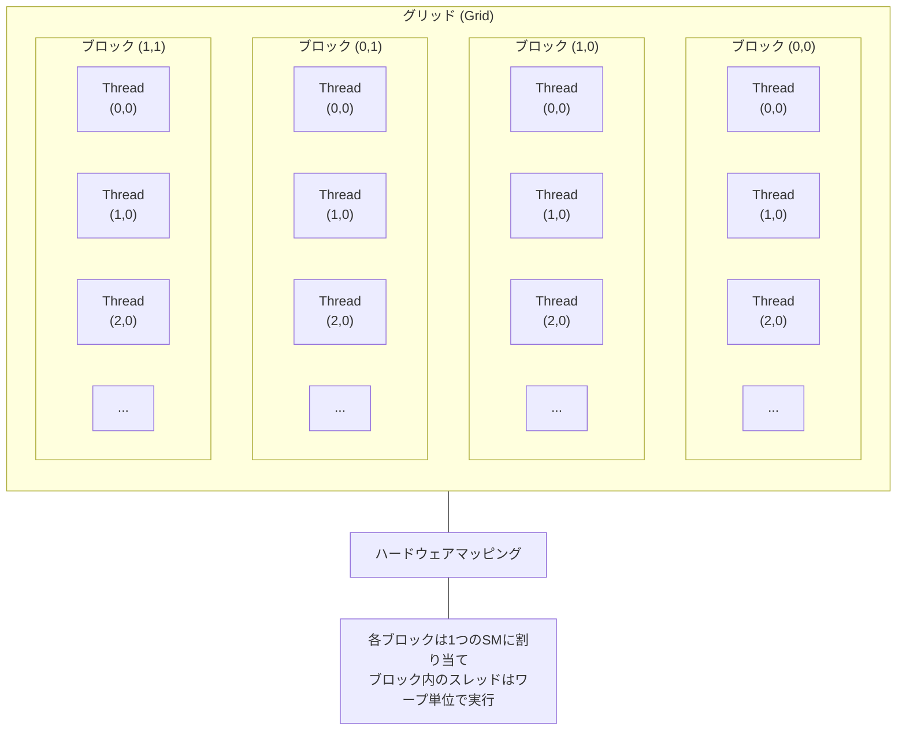

- **スレッド（Thread）**: 最小の実行単位。各スレッドは `threadIdx` によって識別され、独自のレジスタとローカルメモリを持つ
- **ブロック（Block）**: スレッドの集合。`blockIdx` で識別される。1つのブロック内のスレッドは同一SMで実行され、共有メモリを通じてデータを共有できる。ブロック内のスレッド間では `__syncthreads()` によるバリア同期が可能
- **グリッド（Grid）**: ブロックの集合。1つのカーネル呼び出しで起動されるすべてのブロックからなる。異なるブロック間の同期は、原則としてカーネル起動単位でのみ行われる

### 5.2 カーネルの起動

CUDAカーネルは `<<<gridDim, blockDim>>>` という特殊な構文で起動する。

```cuda
// Kernel definition
__global__ void saxpy(int n, float a, float* x, float* y) {
    int i = blockIdx.x * blockDim.x + threadIdx.x;
    if (i < n) {
        y[i] = a * x[i] + y[i];
    }
}

int main() {
    int N = 1 << 20;  // 1M elements
    // ... memory allocation and initialization ...

    // Launch kernel with 256 threads per block
    int blockSize = 256;
    int numBlocks = (N + blockSize - 1) / blockSize;
    saxpy<<<numBlocks, blockSize>>>(N, 2.0f, d_x, d_y);

    // ... synchronize and copy results ...
}
```

ブロックサイズの選択は性能に大きな影響を与える。一般的なガイドラインとして以下の点が考慮される。

- ブロックサイズはワープサイズ（32）の倍数であるべき
- 128, 256, 512あたりが一般的に良い選択肢
- ブロックサイズが小さすぎるとオキュパンシーが低下し、大きすぎるとレジスタ圧力が増加する

### 5.3 メモリ転送とUnified Memory

CUDAプログラムでは、ホスト（CPU）メモリとデバイス（GPU）メモリは物理的に分離されている。データの転送は PCIe（またはNVLink）バスを経由するため、転送コストの最小化が重要な最適化ポイントとなる。

```cuda
// Explicit memory management
float *h_data, *d_data;
h_data = (float*)malloc(size);
cudaMalloc(&d_data, size);

// Host to Device transfer
cudaMemcpy(d_data, h_data, size, cudaMemcpyHostToDevice);

// Launch kernel
kernel<<<grid, block>>>(d_data);

// Device to Host transfer
cudaMemcpy(h_data, d_data, size, cudaMemcpyDeviceToHost);

cudaFree(d_data);
free(h_data);
```

CUDA 6.0で導入された **Unified Memory** は、ホストとデバイスで統一されたアドレス空間を提供する。プログラマは明示的な転送を記述する必要がなく、ランタイムがページ単位でデータの移行を管理する。

```cuda
// Unified Memory - simpler programming model
float *data;
cudaMallocManaged(&data, size);

// Accessible from both CPU and GPU
initializeOnCPU(data, N);    // CPU access
kernel<<<grid, block>>>(data); // GPU access
cudaDeviceSynchronize();
processOnCPU(data, N);        // CPU access again

cudaFree(data);
```

Unified Memoryはプログラミングの簡便性を大幅に向上させるが、暗黙のページマイグレーションによるオーバーヘッドがある。性能が最重要な場面では、明示的なメモリ管理やプリフェッチヒント（`cudaMemPrefetchAsync`）が依然として重要である。

## 6. メモリコアレッシング

### 6.1 コアレスドアクセスとは

メモリコアレッシング（Memory Coalescing）は、GPUプログラミングにおいて最も重要な最適化概念の一つである。グローバルメモリへのアクセスは、ワープ内の32スレッドのメモリリクエストをまとめて少数の **メモリトランザクション** として発行する形で行われる。

理想的なコアレスドアクセスでは、ワープ内の32スレッドが連続する32個のメモリアドレスにアクセスする場合、これが1回のメモリトランザクション（128バイト = 32 x 4バイト）にまとめられる。

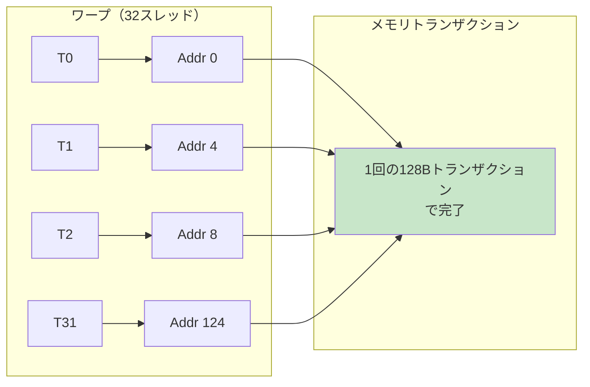

### 6.2 非コアレスドアクセスの問題

ワープ内のスレッドが飛び飛びのアドレスにアクセスする（ストライドアクセス）場合、複数のメモリトランザクションが必要となり、有効帯域幅が大幅に低下する。

```cuda
// Coalesced access - stride 1 (good)
float val = data[threadIdx.x + blockIdx.x * blockDim.x];

// Strided access - stride N (bad)
float val = data[threadIdx.x * N + blockIdx.x];  // N elements apart

// Random access (worst)
float val = data[indices[threadIdx.x]];  // Unpredictable addresses
```

構造体の配列（Array of Structures, AoS）と配列の構造体（Structure of Arrays, SoA）の選択は、コアレッシングに直接影響する。

```cuda
// AoS - poor coalescing
struct Particle {
    float x, y, z;
    float vx, vy, vz;
};
Particle particles[N];
// Thread i accesses particles[i].x -> stride = sizeof(Particle) = 24 bytes

// SoA - good coalescing
struct Particles {
    float x[N], y[N], z[N];
    float vx[N], vy[N], vz[N];
};
Particles p;
// Thread i accesses p.x[i] -> stride = sizeof(float) = 4 bytes (coalesced)
```

SoA形式では、同一フィールドのデータがメモリ上で連続配置されるため、ワープ内のスレッドがそのフィールドにアクセスする際にコアレスドアクセスとなる。GPUプログラミングでは、CPUプログラミングのAoS慣習とは逆に、SoA形式が推奨されることが多い。

## 7. ワープダイバージェンス

### 7.1 ダイバージェンスの発生メカニズム

ワープダイバージェンス（Warp Divergence）は、SIMTアーキテクチャにおける重要な性能上の課題である。ワープ内の32スレッドが条件分岐で異なるパスを取る場合、ハードウェアは両方のパスを逐次的に実行する必要がある。

```cuda
__global__ void divergentKernel(float* data, int N) {
    int i = blockIdx.x * blockDim.x + threadIdx.x;
    if (i < N) {
        if (data[i] > 0) {
            // Path A: positive values
            data[i] = sqrtf(data[i]);
        } else {
            // Path B: non-positive values
            data[i] = 0.0f;
        }
    }
}
```

上のコードでは、`data[i] > 0` の条件によってワープ内のスレッドが2つのパスに分岐する可能性がある。ダイバージェンスが発生すると、まずPath Aを取るスレッドだけが実行され（Path Bのスレッドは非アクティブ化される）、次にPath Bのスレッドだけが実行される。結果として、両方のパスの命令が順次実行されるため、理論上のスループットが半減する。

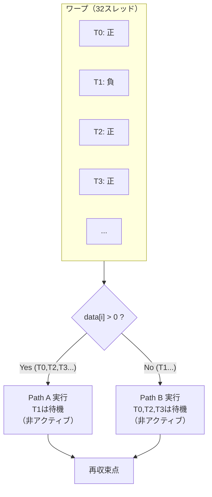

### 7.2 ダイバージェンスの軽減策

ワープダイバージェンスを軽減するための主な手法は以下の通りである。

1. **データの並べ替え**: 同じパスを取るスレッドが同じワープに属するようにデータを事前にソートする
2. **ワープ単位の条件判定**: ワープ内の全スレッドが同じ条件を満たすようにアルゴリズムを設計する
3. **ブランチレス演算**: 条件分岐を算術演算に置き換える

```cuda
// Branchless alternative
__global__ void branchlessKernel(float* data, int N) {
    int i = blockIdx.x * blockDim.x + threadIdx.x;
    if (i < N) {
        float val = data[i];
        // Use predication instead of branch
        data[i] = (val > 0) ? sqrtf(val) : 0.0f;
        // The compiler may handle this with predication rather than branching
    }
}
```

### 7.3 独立スレッドスケジューリング（Volta以降）

Volta アーキテクチャ以降、NVIDIAは **独立スレッドスケジューリング（Independent Thread Scheduling）** を導入した。これにより、ワープ内の各スレッドが独自のプログラムカウンタとコールスタックを持ち、ダイバージェンス後の再収束がより柔軟になった。

従来のアーキテクチャでは、ダイバージェンスが発生するとスレッドは即座のpost-dominator（直後の再収束点）で再収束する必要があった。独立スレッドスケジューリングでは、この制約が緩和され、よりきめ細かなスレッド間の同期が可能になった。ただし、これはワープ内の暗黙の同期に依存していた従来のコード（ワープシャッフル操作前に `__syncwarp()` を省略していたコードなど）に対して互換性の問題を引き起こす可能性がある。

## 8. Tensor Core

### 8.1 Tensor Coreの動機

ディープラーニングのワークロードは、その核心が行列積和演算（Matrix Multiply-Accumulate, MMA）である。全結合層の順伝播 $Y = XW + b$、畳み込み演算（im2col変換後）、Self-Attentionの $QK^T$ や $\text{Attention} \cdot V$ の計算など、すべてが大規模な行列積に帰着する。

通常のCUDA Coreでの行列積は、1つのスレッドが結果行列の1要素を計算するために、内積のドット積をスカラ演算の繰り返しとして実行する。Tensor Coreは、この行列積演算をハードウェアレベルで直接サポートすることで、劇的な高速化を実現する。

### 8.2 Tensor Coreの動作原理

Tensor Coreは、小さな行列のMMA（Matrix Multiply-Accumulate）を1命令で実行する。Volta世代の第1世代Tensor Coreは、$4 \times 4 \times 4$ の行列積和演算 $D = A \times B + C$ を1サイクルで実行できる。

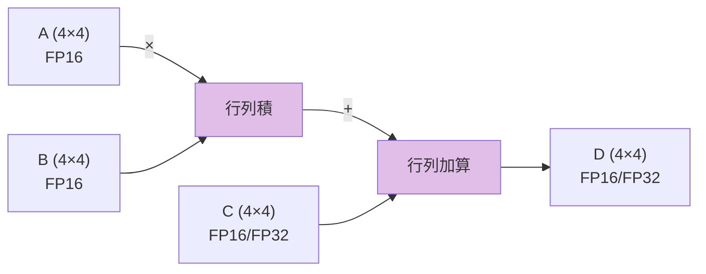

実際のプログラミングでは、ワープレベルの行列演算API（WMMA: Warp Matrix Multiply-Accumulate）を通じてTensor Coreを利用する。

```cuda
#include <mma.h>
using namespace nvcuda;

__global__ void tensorCoreGEMM(half* A, half* B, float* C, int M, int N, int K) {
    // Declare matrix fragments
    wmma::fragment<wmma::matrix_a, 16, 16, 16, half, wmma::row_major> a_frag;
    wmma::fragment<wmma::matrix_b, 16, 16, 16, half, wmma::col_major> b_frag;
    wmma::fragment<wmma::accumulator, 16, 16, 16, float> c_frag;

    // Initialize accumulator to zero
    wmma::fill_fragment(c_frag, 0.0f);

    // Load matrix fragments from global memory
    wmma::load_matrix_sync(a_frag, A + ..., lda);
    wmma::load_matrix_sync(b_frag, B + ..., ldb);

    // Perform matrix multiply-accumulate
    wmma::mma_sync(c_frag, a_frag, b_frag, c_frag);

    // Store result back to global memory
    wmma::store_matrix_sync(C + ..., c_frag, ldc, wmma::mem_row_major);
}
```

### 8.3 サポートされるデータ型の進化

Tensor Coreがサポートするデータ型は世代を追うごとに拡大してきた。

| 世代 | アーキテクチャ | サポートデータ型 |
|---|---|---|
| 1st gen | Volta | FP16 入力 → FP16/FP32 出力 |
| 2nd gen | Turing | FP16, INT8, INT4, INT1 |
| 3rd gen | Ampere | FP16, BF16, TF32, FP64, INT8, INT4 |
| 4th gen | Hopper | FP16, BF16, TF32, FP64, FP8 (E4M3/E5M2), INT8 |
| 5th gen | Blackwell | 上記 + FP4, さらなるスパース性サポート |

特に注目すべきデータ型について補足する。

- **TF32（TensorFloat-32）**: Ampereで導入された19ビット浮動小数点形式。FP32のダイナミックレンジ（指数部8ビット）とFP16に近い仮数部精度（10ビット）を持つ。FP32のコードを変更せずにTensor Coreで高速化でき、多くのDLワークロードで十分な精度を提供する
- **BF16（Brain Floating Point 16）**: Googleが提唱した16ビット浮動小数点形式。FP32と同じ指数部（8ビット）を持ち、ダイナミックレンジが広い。仮数部は7ビットと精度は低いが、DLの学習においてはFP16よりも数値的に安定する場合がある
- **FP8**: Hopperで導入された8ビット浮動小数点形式。E4M3（指数4ビット・仮数3ビット）とE5M2（指数5ビット・仮数2ビット）の2種類があり、推論とファインチューニングにおけるスループットを最大化する

### 8.4 構造化スパース性（Structured Sparsity）

Ampere アーキテクチャでは、Tensor Coreに **2:4 構造化スパース性** のサポートが追加された。これは、4つの連続する重み要素のうち少なくとも2つがゼロであるという制約（50%のスパース性）を利用して、実質的にTensor Coreのスループットを2倍にする技術である。

DNNの重みに対して適切なプルーニング（枝刈り）を適用し、2:4パターンを満たすように構造化することで、精度をほぼ維持しながらスループットを向上させることができる。

## 9. NVLink と NVSwitch

### 9.1 マルチGPU通信の課題

AI/MLのモデルサイズが急速に拡大する中、単一GPUのメモリ容量と計算能力では不十分になるケースが増えている。大規模言語モデル（LLM）の学習には数十から数千のGPUを並列に使用する必要があり、GPU間の通信帯域幅がシステム全体の性能を制約するボトルネックとなる。

従来、GPU間通信はPCIeバスを介して行われていた。しかし、PCIe 4.0 x16の帯域幅は片方向約32 GB/s（双方向64 GB/s）に過ぎず、HBMメモリの帯域幅（A100で2 TB/s）と比較すると著しく低い。

### 9.2 NVLink

NVLinkは、NVIDIAが開発したGPU間高速インターコネクトである。PCIeの帯域幅制約を克服し、GPU間のデータ転送を高速化する。

| NVLink世代 | 年 | 帯域幅（双方向） | 採用GPU |
|---|---|---|---|
| NVLink 1.0 | 2016 | 80 GB/s (4リンク) | P100 |
| NVLink 2.0 | 2017 | 150 GB/s (6リンク) | V100 |
| NVLink 3.0 | 2020 | 600 GB/s (12リンク) | A100 |
| NVLink 4.0 | 2022 | 900 GB/s (18リンク) | H100 |
| NVLink 5.0 | 2024 | 1,800 GB/s | B200 |

NVLinkにより、複数のGPUが高速に通信でき、GPU間でのAllReduceやAll-to-All通信のスループットが大幅に向上する。

### 9.3 NVSwitch

NVSwitchは、NVLink を用いて複数のGPUをフルメッシュ接続するためのスイッチチップである。NVSwitchを用いることで、サーバー内のすべてのGPUが任意の他のGPUと最大帯域幅で直接通信できる。

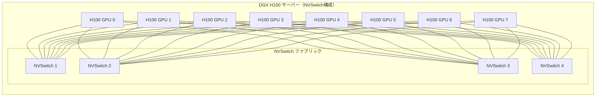

DGX H100サーバーでは、4つのNVSwitchチップを介して8つのH100 GPUがフルメッシュで接続され、GPU間の双方向帯域幅は最大900 GB/sに達する。

Blackwell世代では、NVSwitch 4.0が導入され、さらに **NVLink Switch** によってラック間をNVLinkで接続するNVLink Networkが実現された。これにより、最大576基のGPUをNVLinkドメインとして接続でき、すべてのGPU間で高帯域幅通信が可能になった。

## 10. 最新GPUアーキテクチャ

### 10.1 NVIDIA Hopper（H100）

2022年に発表されたHopperアーキテクチャ（H100）は、以下の革新的な機能を導入した。

**Transformer Engine**: FP8とFP16の精度を動的に切り替えるハードウェアユニットである。Transformerモデルの各層の統計情報をリアルタイムで分析し、数値精度が必要な箇所ではFP16を、スループットが優先される箇所ではFP8を自動的に選択する。これにより、プログラマが手動で精度管理を行うことなく、最大限のスループットと十分な精度を両立できる。

**Thread Block Cluster**: 複数のスレッドブロックをグループ化した新しい階層であるThread Block Clusterが導入された。クラスタ内のスレッドブロックは、分散共有メモリ（Distributed Shared Memory）を通じて、異なるSM上の共有メモリに直接アクセスできる。これにより、SM間のデータ共有がグローバルメモリを経由せずに行えるようになった。

**TMA（Tensor Memory Accelerator）**: 非同期のテンソルデータ移動を専用ハードウェアで高速化する。多次元テンソルのタイリングやアドレス計算をハードウェアがオフロードし、SIMTスレッドを計算に集中させる。

**DPX命令**: 動的計画法（Dynamic Programming）向けの専用命令。Smith-WatermanアルゴリズムやFloyd-Warshallアルゴリズムなどの動的計画法ベースのアルゴリズムを高速化する。

### 10.2 NVIDIA Blackwell（B100/B200/GB200）

2024年に発表されたBlackwellアーキテクチャは、Hopperからさらに進化を遂げた。

**チップレット設計**: Blackwellは、2つのGPUダイを1つのパッケージに統合した「マルチダイ」設計を採用している。10 TB/sのチップ間インターコネクトにより、2つのダイが論理的に1つのGPUとして動作する。この設計により、単一パッケージあたりのトランジスタ数は2080億に達する。

**第2世代Transformer Engine**: FP4精度のサポートが追加され、推論スループットがさらに向上した。FP4は極めて低い精度であるが、量子化・逆量子化のパイプラインが洗練され、LLMの推論品質を維持しながらスループットを最大化する。

**第5世代NVLink**: 双方向1.8 TB/sの帯域幅を実現し、最大576基のGPUをNVLink Networkで接続可能にした。

**信頼性強化**: RAS（Reliability, Availability, Serviceability）機能が大幅に強化され、大規模クラスターでの長時間学習の安定性が向上した。デアクティベーション可能な冗長リソースにより、部分的な障害が発生してもGPU全体の停止を回避できる。

### 10.3 AMD CDNA/CDNAアーキテクチャ

AMDは、データセンター向けのCDNA（Compute DNA）アーキテクチャを展開している。

**CDNA 2（MI250X）**: 2つのGCDを1パッケージに搭載したMCM（Multi-Chip Module）設計を採用。HBM2eメモリを合計128 GB搭載し、FP64性能は47.9 TFLOPSとNVIDIAのA100（19.5 TFLOPS）を大きく上回る。Infinity Fabricによるインターコネクトを備える。

**CDNA 3（MI300X）**: 2024年にリリース。APU（Accelerated Processing Unit）として、CPUダイとGPUダイを同一パッケージに統合するMI300Aと、GPU専用のMI300Xが提供される。MI300Xは最大192 GBのHBM3メモリを搭載し、LLMの推論において大きなメモリ容量の優位性を持つ。

AMDのGPUプログラミングプラットフォームであるROCm（Radeon Open Compute）は、HIP（Heterogeneous-compute Interface for Portability）というCUDAに類似したプログラミングモデルを提供する。HIPのコードはCUDAコードと構文的に非常に似ており、自動変換ツール（hipify）によるCUDAからの移植も容易である。

## 11. AI/ML向けGPU最適化

### 11.1 混合精度学習

混合精度学習（Mixed Precision Training）は、FP16やBF16などの低精度演算とFP32の高精度演算を組み合わせて、学習速度を向上させる技法である。

基本的な考え方は以下の通りである。

1. **マスターウェイトはFP32で保持する**: 勾配更新の蓄積精度を維持するため
2. **順伝播・逆伝播はFP16/BF16で行う**: Tensor Coreを活用してスループットを最大化
3. **損失スケーリング（Loss Scaling）**: FP16のダイナミックレンジの狭さを補い、小さな勾配値がアンダーフローでゼロになることを防ぐ

```python
# PyTorch example of mixed precision training
from torch.cuda.amp import autocast, GradScaler

scaler = GradScaler()

for data, target in dataloader:
    optimizer.zero_grad()

    # Forward pass in FP16
    with autocast():
        output = model(data)
        loss = criterion(output, target)

    # Backward pass with loss scaling
    scaler.scale(loss).backward()
    scaler.step(optimizer)
    scaler.update()
```

### 11.2 分散学習戦略

大規模モデルの学習では、複数のGPUを効率的に活用する分散学習戦略が不可欠である。

**データ並列（Data Parallelism）**: 同一モデルを複数のGPUに複製し、異なるミニバッチを各GPUで処理する。勾配の集約にはAllReduce通信が必要であり、NVLinkの帯域幅が性能を左右する。PyTorchのDistributedDataParallel（DDP）やFSDP（Fully Sharded Data Parallel）が代表的な実装である。

**テンソル並列（Tensor Parallelism）**: 1つの層の行列演算を複数のGPUに分割して並列実行する。例えば、全結合層の重み行列を列方向または行方向に分割し、各GPUが部分行列の計算を担当する。GPU間通信の頻度が高いため、NVLinkの高帯域幅が必須である。

**パイプライン並列（Pipeline Parallelism）**: モデルの層を複数のGPUに分割し、パイプライン的に処理する。マイクロバッチを用いてパイプラインバブル（GPUのアイドル時間）を削減する。GPipe やPipeDreamが代表的な手法である。

```mermaid
flowchart TB
    subgraph DP["データ並列"]
        direction LR
        DP_G0["GPU 0<br/>モデル全体<br/>バッチ 0"]
        DP_G1["GPU 1<br/>モデル全体<br/>バッチ 1"]
        DP_G2["GPU 2<br/>モデル全体<br/>バッチ 2"]
        DP_G3["GPU 3<br/>モデル全体<br/>バッチ 3"]
        DP_G0 <-->|"AllReduce"| DP_G1
        DP_G1 <-->|"AllReduce"| DP_G2
        DP_G2 <-->|"AllReduce"| DP_G3
    end

    subgraph TP["テンソル並列"]
        direction LR
        TP_G0["GPU 0<br/>重み行列の<br/>列 0-N/2"]
        TP_G1["GPU 1<br/>重み行列の<br/>列 N/2-N"]
        TP_G0 <-->|"AllReduce<br/>毎層"| TP_G1
    end

    subgraph PP["パイプライン並列"]
        direction LR
        PP_G0["GPU 0<br/>Layer 1-4"]
        PP_G1["GPU 1<br/>Layer 5-8"]
        PP_G2["GPU 2<br/>Layer 9-12"]
        PP_G0 -->|"Activation"| PP_G1
        PP_G1 -->|"Activation"| PP_G2
    end
```

現代の大規模学習では、これら3つの並列化手法を組み合わせた **3D並列** が採用される。Megatron-LMやDeepSpeedなどのフレームワークが、この複合的な並列化戦略を実装している。

### 11.3 カーネル最適化ライブラリ

GPUの性能を最大限に引き出すには、高度に最適化されたカーネルの利用が重要である。

**cuBLAS / cuDNN**: NVIDIAが提供する行列演算および深層学習プリミティブの最適化ライブラリ。Tensor Coreの活用、最適なタイルサイズの選択、メモリレイアウトの最適化が自動的に行われる。

**FlashAttention**: Transformerの Self-Attention計算を、タイリングとオンラインソフトマックスの手法によって、メモリ使用量を $O(N^2)$ から $O(N)$ に削減するアルゴリズムである。GPUのSRAM（共有メモリ + レジスタ）にデータを保持したまま計算を完了させることで、HBMへのアクセスを最小化し、大幅な高速化を実現する。

**CUTLASS（CUDA Templates for Linear Algebra Subroutines）**: NVIDIAが提供するGEMM（General Matrix Multiply）のテンプレートライブラリ。Tensor Coreを活用した高性能行列積カーネルをC++テンプレートとして構成可能な形で提供し、カスタムカーネルの開発を容易にする。

### 11.4 推論の最適化

学習済みモデルの推論（Inference）においても、GPU固有の最適化が重要である。

**量子化（Quantization）**: FP32やFP16の重みをINT8やINT4に変換することで、メモリ使用量を削減し、演算スループットを向上させる。Post-Training Quantization（PTQ）やQuantization-Aware Training（QAT）などの手法がある。

**カーネルフュージョン**: 複数の小さな演算（例: 行列積 → バイアス加算 → 活性化関数）を1つのカーネルに融合し、中間結果のグローバルメモリへの書き戻しを排除する。TensorRTなどの推論最適化エンジンが自動的にフュージョンを行う。

**KVキャッシュ最適化**: LLMの自己回帰生成では、過去のトークンのKey/Valueテンソルをキャッシュに保持する。vLLMのPagedAttentionなどの技術は、KVキャッシュのメモリ管理を仮想メモリのページングに類似した仕組みで効率化し、GPUメモリの利用効率を大幅に改善する。

**バッチ処理と連続バッチ**: 複数の推論リクエストをバッチ化して処理することで、GPUの演算ユニットの利用効率を向上させる。連続バッチ（Continuous Batching）は、異なる長さのリクエストを動的にバッチに組み込み、GPUの遊休時間を最小化する技術である。

## 12. GPUプログラミングの実践的課題

### 12.1 プロファイリングと性能分析

GPUプログラムの最適化には、プロファイリングツールによる性能ボトルネックの特定が不可欠である。

**NVIDIA Nsight Compute**: 個々のカーネルの詳細な性能メトリクス（演算スループット、メモリ帯域幅利用率、ワープ占有率、レイテンシ内訳など）を提供する。ルーフラインモデルに基づいて、カーネルが計算律速なのかメモリ律速なのかを判定できる。

**NVIDIA Nsight Systems**: アプリケーション全体のタイムラインを可視化し、CPU-GPU間の同期、メモリ転送、カーネル実行のオーバーラップなど、システムレベルの性能分析を行う。

### 12.2 ルーフラインモデル

ルーフラインモデルは、GPUカーネルの性能を理解するための重要な分析フレームワークである。

カーネルの **演算強度（Operational Intensity）** は、メモリから読み出したバイト数あたりの浮動小数点演算数（FLOP/Byte）として定義される。

$$
\text{演算強度} = \frac{\text{FLOP}}{\text{Byte transferred}}
$$

カーネルの到達可能性能（FLOP/s）は以下の式で制限される。

$$
\text{Performance} \leq \min(\text{Peak FLOP/s}, \text{Memory Bandwidth} \times \text{演算強度})
$$

演算強度が低いカーネルは **メモリ律速** であり、メモリアクセスの最適化（コアレッシング、キャッシュ活用）が効果的である。演算強度が高いカーネルは **計算律速** であり、Tensor Coreの活用や演算の効率化が重要となる。

### 12.3 デバッグの課題

GPUプログラムのデバッグは、以下の理由からCPUプログラムよりも困難である。

- 数万〜数百万のスレッドが並列実行されるため、競合状態やデータ競合の再現が困難
- GPUカーネル内でのprintfデバッグは可能だが、出力が膨大になりやすい
- メモリアクセス違反がCPUとは異なる形で顕在化する（無効なメモリアクセスがセグメンテーションフォルトではなく、不定な値の読み出しとして現れることがある）

NVIDIA compute-sanitizer（旧cuda-memcheck）やNsight Debuggerなどのツールが、これらの課題に対処するために提供されている。

## 13. 今後の展望

### 13.1 チップレットとパッケージング技術

GPUのトランジスタ密度の向上が物理的限界に近づく中、チップレット（Chiplet）設計とAdvanced Packaging（先進パッケージング）技術が重要性を増している。Blackwellアーキテクチャのマルチダイ設計はその先駆けであり、今後はさらに多くのダイを統合した設計が予想される。

TSMCのCoWoS（Chip on Wafer on Substrate）やIntelのFoverosなどの3Dパッケージング技術により、GPUダイ、HBMメモリ、インターコネクトチップを高密度に統合することが可能になっている。

### 13.2 光インターコネクトとCXL

GPU間通信のさらなる高速化のために、光インターコネクト（Optical Interconnect）の研究が活発化している。銅配線による電気的なインターコネクトは、信号減衰と消費電力の問題から帯域幅の拡大に限界がある。シリコンフォトニクスを用いた光インターコネクトは、これらの制約を克服する技術として期待されている。

また、CXL（Compute Express Link）の進化により、GPUとメモリプール、GPU間の接続にCXLが活用される可能性がある。CXL 3.0のメモリプーリング機能は、GPU間でのメモリ共有やメモリ容量の動的な割り当てを可能にし、大規模MLワークロードにおけるメモリ管理の柔軟性を向上させる。

### 13.3 ドメイン固有アクセラレータとの共存

GPUは汎用的な並列計算アクセラレータとして進化を続けているが、特定のワークロードに特化したドメイン固有アクセラレータ（Domain-Specific Accelerator, DSA）も台頭している。

- **Google TPU（Tensor Processing Unit）**: Transformerの学習と推論に特化した設計。Systolicアレイベースの行列演算エンジンと、大容量のHBMメモリを備える
- **Intel Gaudi**: Habana Labsが開発したAIアクセラレータ。RDMA over Converged Ethernet（RoCE）による内蔵ネットワーキングが特徴
- **ニューロモーフィックチップ**: IntelのLoihiやIBMのTrueNorthなど、脳の神経回路を模倣したアーキテクチャ。超低消費電力での推論を目指す

GPUの強みは、プログラマビリティと汎用性にある。CUDA/ROCmのエコシステム、豊富なライブラリ、広範なコミュニティサポートにより、新しいアルゴリズムやモデルアーキテクチャへの迅速な対応が可能である。一方で、DSAは特定のワークロードにおいて電力効率やコスト効率で優位に立つ場合がある。今後は、GPUとDSAが適材適所で使い分けられるヘテロジニアスコンピューティングの時代が到来すると考えられる。

### 13.4 ソフトウェアスタックの進化

ハードウェアの進化に伴い、GPUプログラミングのソフトウェアスタックも急速に進化している。

- **コンパイラ技術**: Triton（OpenAI）のようなPythonベースのGPUプログラミング言語により、CUDAの低レベルな最適化知識がなくても、Tensor Coreを活用した高性能カーネルを記述できるようになりつつある
- **自動チューニング**: カーネルのタイルサイズ、ブロックサイズ、メモリレイアウトなどのパラメータを自動的に探索し、ハードウェアに最適な構成を見つける技術
- **グラフコンパイラ**: XLA（Accelerated Linear Algebra）やTorch Compileなど、計算グラフレベルでの最適化（オペレータフュージョン、メモリレイアウトの最適化、自動並列化）を行うコンパイラ

これらの進化により、GPUプログラミングの抽象度は着実に上がっており、より多くの開発者がGPUの計算能力を活用できる時代に向かっている。しかし、最高の性能を引き出すためには、本記事で解説したGPUアーキテクチャの本質的な理解 — SIMTの動作原理、メモリ階層の特性、ワープレベルの最適化 — が今後も不可欠であり続けるだろう。
