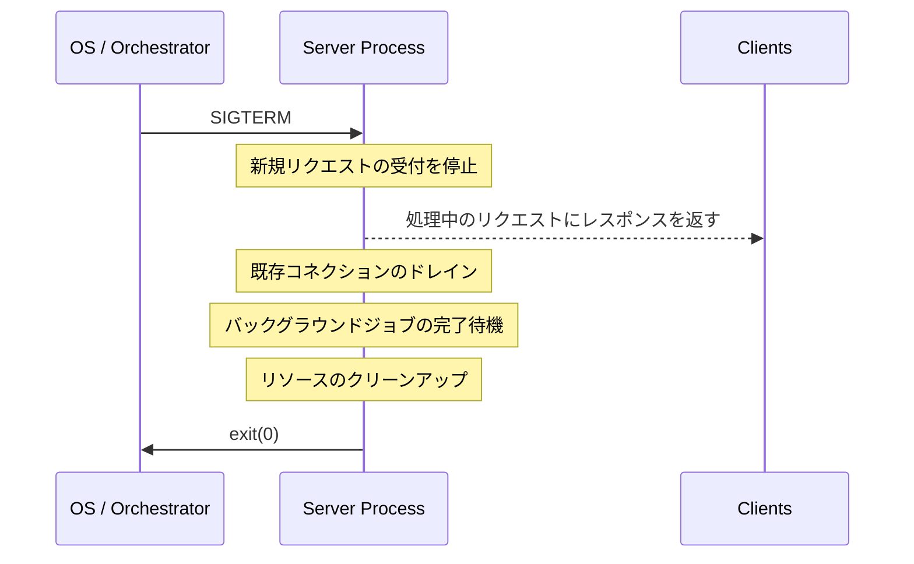
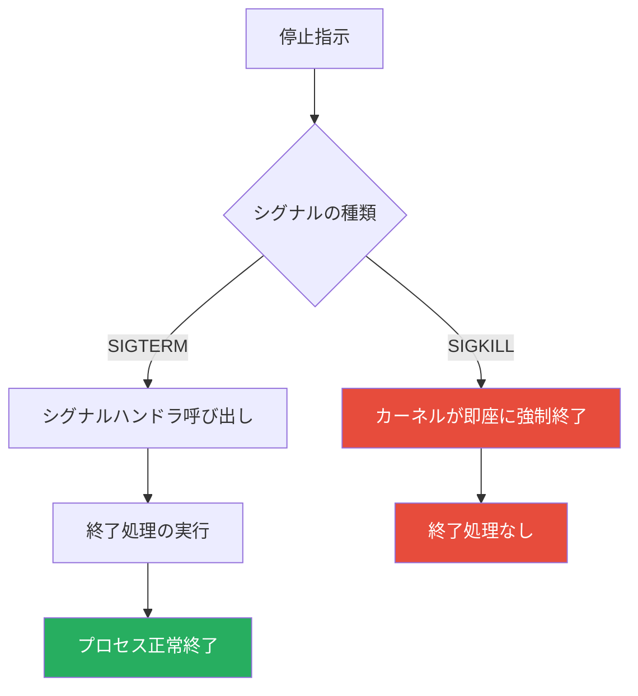
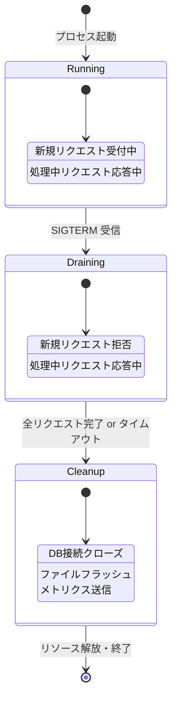
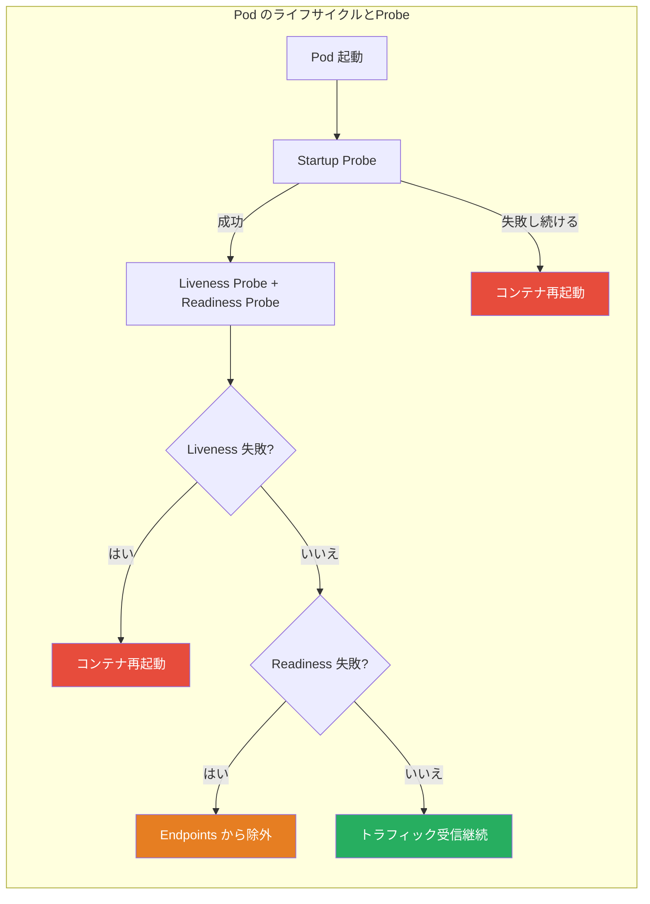
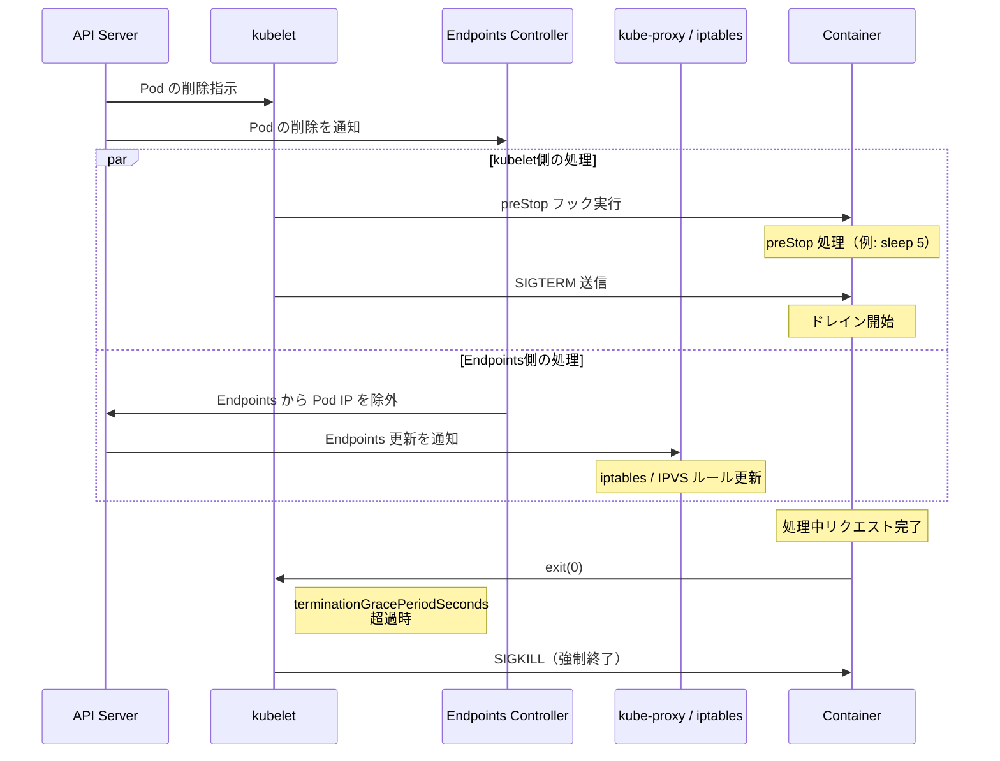
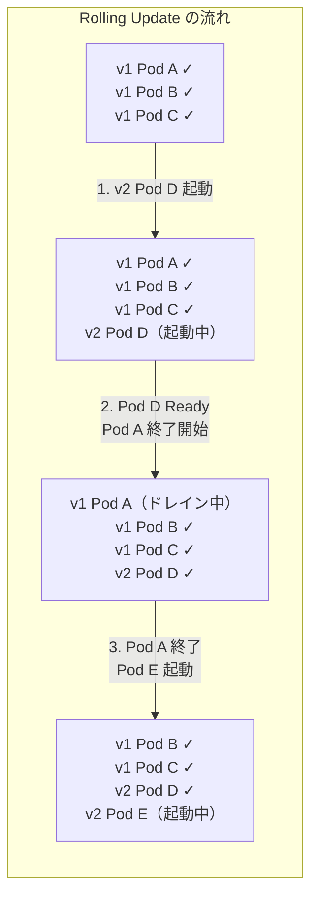
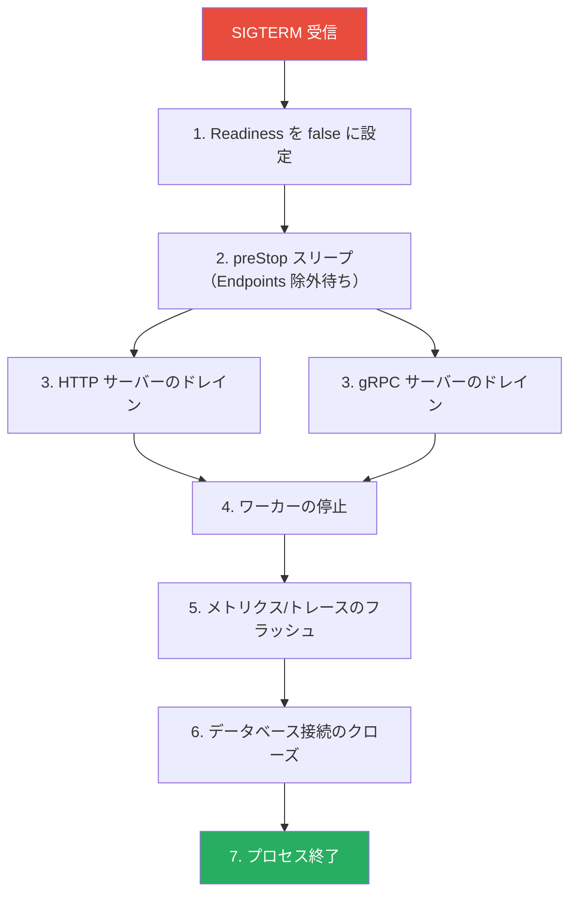

# グレースフルシャットダウンとヘルスチェック

## 1. なぜグレースフルシャットダウンが必要か

### 1.1 プロセス停止の現実

本番環境で稼働しているサーバープロセスは、さまざまな理由で停止を求められる。デプロイによるバイナリの更新、Kubernetes の Pod 再スケジューリング、オートスケーラによるスケールイン、OS のメンテナンスリブートなどが代表例である。重要なのは、プロセスの停止は**例外的な事態ではなく、日常的なオペレーション**であるという点だ。

プロセスが停止を求められた瞬間に即座に終了すると、以下のような問題が発生する。

| 問題 | 影響 |
|---|---|
| **処理中リクエストの切断** | クライアントはコネクションリセット（`ECONNRESET`）を受け取り、エラーとなる |
| **トランザクションの中断** | データベースへの書き込みが中途半端な状態で放棄される |
| **バックグラウンドジョブの喪失** | キューから取り出したがまだ完了していないジョブが失われる |
| **ファイルの破損** | 書き込み途中のファイルが不完全な状態で残る |
| **接続リークの誘発** | 下流サービスやデータベースへのコネクションが適切にクローズされない |

特にマイクロサービスアーキテクチャでは、1つのユーザーリクエストが複数のサービスを横断する。途中のサービスが不意に停止すると、上流サービスでのリトライやタイムアウトが連鎖し、障害が増幅される可能性がある。

### 1.2 グレースフルシャットダウンとは

グレースフルシャットダウン（Graceful Shutdown）とは、プロセスが停止の指示を受けた後、**現在処理中の作業を完了させてからプロセスを終了する**手法である。「優雅な終了」とも訳されるが、その本質は「責任を持って後片付けをしてから退場する」ことにある。



グレースフルシャットダウンの対義語は**ハードシャットダウン**（即座のプロセス強制終了）であり、`kill -9`（SIGKILL）によるプロセス停止がこれに該当する。SIGKILL はプロセスに一切の猶予を与えず、カーネルが直接プロセスを終了させる。

### 1.3 歴史的背景

グレースフルシャットダウンの概念自体は古くから存在する。Apache HTTP Server は 1990 年代から `apachectl graceful` コマンドで、子プロセスに現在のリクエストを完了させてから再起動する仕組みを提供していた。しかし、この概念が特に重要性を増したのは、以下の変化によるものである。

- **コンテナオーケストレーション**: Kubernetes の普及により、Pod の作成・破棄が日常的になった
- **Immutable Infrastructure**: サーバーを修正するのではなく、新しいサーバーに置き換える運用スタイルの浸透
- **CI/CD の高頻度化**: 1日に数十〜数百回のデプロイが行われる環境の一般化
- **マイクロサービス**: サービス数の増加に伴い、個々のサービスの停止がシステム全体に影響するリスクの増大

## 2. グレースフルシャットダウンの仕組み

### 2.1 シグナルの基礎

Unix/Linux においてプロセスの停止は**シグナル**（Signal）というプロセス間通信メカニズムを通じて行われる。プロセスの終了に関連する主要なシグナルは以下の通りである。

| シグナル | 番号 | 送信方法 | 捕捉可能か | 用途 |
|---|---|---|---|---|
| **SIGTERM** | 15 | `kill <pid>` | はい | 丁寧な終了要求 |
| **SIGINT** | 2 | Ctrl+C | はい | 対話的な割り込み |
| **SIGQUIT** | 3 | Ctrl+\ | はい | コアダンプ付き終了 |
| **SIGKILL** | 9 | `kill -9 <pid>` | **いいえ** | 強制終了（最終手段） |
| **SIGHUP** | 1 | ターミナル切断 | はい | 設定の再読み込み |

グレースフルシャットダウンの起点となるのは**SIGTERM**である。SIGTERM はプロセスに対して「終了してほしい」という意図を伝えるが、プロセス側でハンドラを登録して独自の終了処理を実行できる。一方、SIGKILL はカーネルレベルで強制的にプロセスを終了させるため、プロセス側で一切の処理を挟む余地がない。



::: warning SIGKILL は最終手段
SIGKILL（`kill -9`）は、SIGTERM に応答しないプロセスに対する最終手段として使うべきである。運用スクリプトで最初から `kill -9` を使うのは、プロセスにクリーンアップの機会を一切与えないため、データ破損やリソースリークの原因となる。
:::

### 2.2 シグナルハンドリングの実装

プロセスは `signal()` または `sigaction()` システムコールを使ってシグナルハンドラを登録する。シグナルハンドラ内での処理には制約があり、async-signal-safe な関数のみを呼び出すべきとされている。実際のアプリケーションでは、シグナルハンドラ内ではフラグのセットやチャネルへの通知のみを行い、メインの処理ループで終了シーケンスを実行するのが定石である。

```go
package main

import (
	"context"
	"log"
	"net/http"
	"os"
	"os/signal"
	"syscall"
	"time"
)

func main() {
	srv := &http.Server{Addr: ":8080"}

	// Start server in a goroutine
	go func() {
		if err := srv.ListenAndServe(); err != http.ErrServerClosed {
			log.Fatalf("HTTP server error: %v", err)
		}
	}()

	// Wait for termination signal
	sigCh := make(chan os.Signal, 1)
	signal.Notify(sigCh, syscall.SIGTERM, syscall.SIGINT)
	sig := <-sigCh
	log.Printf("Received signal: %v", sig)

	// Graceful shutdown with timeout
	ctx, cancel := context.WithTimeout(context.Background(), 30*time.Second)
	defer cancel()

	if err := srv.Shutdown(ctx); err != nil {
		log.Printf("Graceful shutdown failed: %v", err)
	} else {
		log.Println("Server stopped gracefully")
	}
}
```

### 2.3 ドレインの概念

グレースフルシャットダウンの中核をなすのが**コネクションドレイン（Connection Draining）**である。ドレインとは、新規リクエストの受付を停止した上で、既存のリクエストが完了するのを待つプロセスのことを指す。



ドレインにおいて考慮すべきポイントは次の通りである。

**新規リクエストの拒否方法**

HTTP の場合、ドレイン中にリスナーソケットをクローズすることで新規接続を拒否する。ただし、HTTP/1.1 の Keep-Alive や HTTP/2 の多重化接続では、既存のコネクション上で新たなリクエストが送信されることがある。このため、以下の戦略がとられる。

- HTTP/1.1: `Connection: close` ヘッダーをレスポンスに付与し、クライアントにコネクションの再利用を止めるよう伝える
- HTTP/2: GOAWAY フレームを送信し、新しいストリームの作成を停止する

**タイムアウトの設定**

ドレインには必ずタイムアウトを設定すべきである。処理中のリクエストが無限に待機し続ける可能性を排除するためだ。タイムアウトに到達した場合は、残りのコネクションを強制的にクローズしてプロセスを終了する。

::: tip ドレインタイムアウトの目安
一般的に、ドレインタイムアウトは**処理中リクエストの最大許容レイテンシ**よりもわずかに長く設定する。API サーバーであればリクエストタイムアウト（例: 30秒）に合わせるのが妥当で、バッチ処理を含むサーバーではジョブの最大実行時間を考慮する必要がある。
:::

### 2.4 リソースクリーンアップ

ドレインが完了した後、プロセスは保持しているリソースを適切にクリーンアップする。

| リソース | クリーンアップ処理 |
|---|---|
| データベースコネクションプール | アイドル接続のクローズ、プール全体の破棄 |
| メッセージキュー | 未確認メッセージの Nack（再キューイング） |
| ファイルディスクリプタ | バッファのフラッシュとクローズ |
| 一時ファイル | 削除 |
| メトリクス・トレース | 最終的なバッファのフラッシュと送信 |
| ワーカーゴルーチン/スレッド | 停止シグナルの送信と完了待機 |

### 2.5 シャットダウンシーケンスの全体像

グレースフルシャットダウンの典型的なシーケンスを時系列で整理すると以下のようになる。

```mermaid
gantt
    title グレースフルシャットダウンのタイムライン
    dateFormat X
    axisFormat %s秒

    section シグナル
    SIGTERM受信           :milestone, m1, 0, 0
    SIGKILL（最終手段）     :milestone, m2, 35, 35

    section サーバー
    新規リクエスト受付停止   :a1, 0, 1
    処理中リクエスト完了待機 :a2, 1, 20
    リソースクリーンアップ   :a3, 20, 25
    プロセス終了            :milestone, m3, 25, 25
```



この図では、SIGTERM を受信してから 25 秒でプロセスが正常終了するケースを示している。もし 35 秒（`terminationGracePeriodSeconds` のデフォルト値は Kubernetes では 30 秒）経過しても終了しなければ、SIGKILL によって強制終了される。

## 3. ヘルスチェックの種類と設計

### 3.1 なぜヘルスチェックが必要か

グレースフルシャットダウンがプロセスの「退場」に関する仕組みであるのに対し、ヘルスチェック（Health Check）はプロセスの「状態監視」に関する仕組みである。この2つは密接に関連している。

ロードバランサやオーケストレーターがプロセスの状態を正確に把握できなければ、以下の問題が生じる。

- 起動が完了していないプロセスにリクエストが送られ、エラーが返る
- 異常状態のプロセスにリクエストが送り続けられ、ユーザーに障害が波及する
- シャットダウン中のプロセスに新規リクエストがルーティングされ、接続エラーが発生する

### 3.2 ヘルスチェックの3つのタイプ

Kubernetes は3種類のヘルスチェック（Probe）を提供しているが、この分類はKubernetes 固有のものではなく、ヘルスチェック設計の一般的なフレームワークとして広く参考にされている。



#### Liveness Probe（生存チェック）

Liveness Probe は「プロセスが生きているか」を判定する。この Probe が失敗すると、オーケストレーターはプロセスが回復不能な状態にあると判断し、コンテナを再起動する。

**チェック対象の例:**

- プロセスのデッドロック検知
- メモリリークによるOOM直前の状態
- 無限ループへの陥入

**設計上のポイント:**

- Liveness Probe は**軽量かつ高速**であるべきである
- 外部依存（データベース、外部API）をチェックに含めてはならない。外部サービスの障害で Liveness が失敗すると、本来正常なプロセスまで再起動され、障害が拡大する（再起動の嵐）

::: danger Liveness Probe に外部依存を含めてはいけない
Liveness Probe でデータベースの接続チェックを行うと、データベースが一時的にダウンした際に全 Pod が再起動され、データベースの回復後も Pod の起動ラッシュによってさらなる負荷がかかる。この連鎖は大規模障害の典型的なパターンである。
:::

```go
// Good: lightweight liveness check
func livenessHandler(w http.ResponseWriter, r *http.Request) {
	w.WriteHeader(http.StatusOK)
	w.Write([]byte("ok"))
}

// Bad: liveness check with external dependency
func badLivenessHandler(w http.ResponseWriter, r *http.Request) {
	if err := db.Ping(); err != nil { // DON'T do this in liveness
		w.WriteHeader(http.StatusServiceUnavailable)
		return
	}
	w.WriteHeader(http.StatusOK)
}
```

#### Readiness Probe（準備状態チェック）

Readiness Probe は「プロセスがリクエストを受ける準備ができているか」を判定する。この Probe が失敗すると、オーケストレーターはそのプロセスをロードバランサのルーティング先から除外する。プロセス自体は再起動されない。

**チェック対象の例:**

- データベースへの接続が確立されているか
- キャッシュのウォームアップが完了しているか
- 必要な設定ファイルがロードされているか
- シャットダウン処理が開始されていないか

Readiness Probe は Liveness Probe とは異なり、外部依存をチェック対象に含めることが**適切**である。データベースに接続できないプロセスにリクエストを送っても意味がないからだ。

```go
type Server struct {
	db       *sql.DB
	ready    atomic.Bool
	stopping atomic.Bool
}

func (s *Server) readinessHandler(w http.ResponseWriter, r *http.Request) {
	// Not ready if shutting down
	if s.stopping.Load() {
		w.WriteHeader(http.StatusServiceUnavailable)
		w.Write([]byte("shutting down"))
		return
	}

	// Not ready if dependencies are unavailable
	ctx, cancel := context.WithTimeout(r.Context(), 2*time.Second)
	defer cancel()

	if err := s.db.PingContext(ctx); err != nil {
		w.WriteHeader(http.StatusServiceUnavailable)
		w.Write([]byte("database unavailable"))
		return
	}

	w.WriteHeader(http.StatusOK)
	w.Write([]byte("ready"))
}
```

#### Startup Probe（起動チェック）

Startup Probe は Kubernetes 1.16 で導入された比較的新しい Probe である。起動に長時間かかるアプリケーション（大量のデータをメモリにロードする、ML モデルを初期化するなど）のために設計されている。

Startup Probe が成功するまで、Liveness Probe と Readiness Probe は実行されない。これにより、起動に時間がかかるアプリケーションが、起動完了前に Liveness Probe に失敗して再起動されるという問題を回避できる。

```yaml
# Kubernetes Pod spec example
startupProbe:
  httpGet:
    path: /healthz/startup
    port: 8080
  failureThreshold: 30    # 30 attempts
  periodSeconds: 10        # every 10 seconds = up to 300s for startup
livenessProbe:
  httpGet:
    path: /healthz/live
    port: 8080
  periodSeconds: 10
  failureThreshold: 3
readinessProbe:
  httpGet:
    path: /healthz/ready
    port: 8080
  periodSeconds: 5
  failureThreshold: 3
```

### 3.3 ヘルスチェックの実装方式

ヘルスチェックの実装方式には主に3種類がある。

| 方式 | 説明 | 用途 |
|---|---|---|
| **HTTP GET** | 指定パスに HTTP リクエストを送信し、2xx ステータスを確認 | Web サーバー、API サーバー |
| **TCP Socket** | 指定ポートへの TCP 接続を試行 | データベース、カスタムプロトコルのサーバー |
| **Command（exec）** | コンテナ内でコマンドを実行し、終了コード 0 を確認 | 任意のカスタムチェック |
| **gRPC** | gRPC Health Checking Protocol を使用 | gRPC サーバー |

HTTP によるヘルスチェックが最も一般的であり、レスポンスボディに詳細なステータスを含めることで、診断情報を提供できるという利点がある。

```json
{
  "status": "healthy",
  "checks": {
    "database": { "status": "up", "latency_ms": 3 },
    "cache": { "status": "up", "latency_ms": 1 },
    "disk": { "status": "up", "free_gb": 42.5 }
  },
  "uptime_seconds": 86400
}
```

::: warning ヘルスチェックエンドポイントの公開範囲
ヘルスチェックのレスポンスに内部のアーキテクチャ情報（データベースのホスト名、バージョン番号など）を含める場合、このエンドポイントは外部からアクセスできないようにするべきである。内部ネットワークからのみアクセス可能にするか、認証を要求する設計が望ましい。
:::

### 3.4 gRPC Health Checking Protocol

gRPC では、ヘルスチェックのための標準プロトコルが定義されている（`grpc.health.v1.Health`）。これにより、gRPC サーバーはプロトコルに準拠した方法でヘルスステータスを報告できる。

```protobuf
// grpc.health.v1.Health service definition
service Health {
  rpc Check(HealthCheckRequest) returns (HealthCheckResponse);
  rpc Watch(HealthCheckRequest) returns (stream HealthCheckResponse);
}

message HealthCheckRequest {
  string service = 1;
}

message HealthCheckResponse {
  enum ServingStatus {
    UNKNOWN = 0;
    SERVING = 1;
    NOT_SERVING = 2;
    SERVICE_UNKNOWN = 3;
  }
  ServingStatus status = 1;
}
```

Kubernetes 1.24 以降では、gRPC のネイティブヘルスチェックがビルトインでサポートされており、`grpc` フィールドを Probe 定義に直接指定できる。

## 4. Kubernetes におけるグレースフルシャットダウンとヘルスチェック

### 4.1 Pod 終了のライフサイクル

Kubernetes における Pod の終了プロセスは、グレースフルシャットダウンとヘルスチェックが連携する典型的なシナリオである。以下に、Pod 終了時の詳細なシーケンスを示す。



この図で特に注目すべきは、**kubelet による SIGTERM の送信**と **Endpoints Controller による Pod IP の除外**が**並行して**実行される点である。これは重要な設計上の含意を持つ。

### 4.2 レースコンディション問題

上図の通り、SIGTERM の送信と Endpoints からの除外は並行に進む。したがって、以下のレースコンディションが発生し得る。

1. kubelet が SIGTERM を送信する
2. プロセスが SIGTERM を受け取り、新規リクエストの受付を停止する
3. **しかし**、kube-proxy の iptables ルール更新がまだ完了していない
4. クライアントからのリクエストが**まだこの Pod にルーティングされる**
5. Pod はリスナーをクローズしているため、接続が拒否される

この問題を回避するために、`preStop` フックに短いスリープを入れるパターンが広く使われている。

```yaml
lifecycle:
  preStop:
    exec:
      command: ["sh", "-c", "sleep 5"]
```

この 5 秒のスリープの間に、Endpoints の更新と iptables ルールの反映が完了することを期待する。`preStop` フック完了後に SIGTERM が送信され、アプリケーションのグレースフルシャットダウンが開始される。

::: tip preStop スリープの代替手段
`preStop` にスリープを入れる代わりに、アプリケーション側で SIGTERM 受信後も一定時間リスナーを開いたまま維持し、Readiness Probe を失敗させることで、ルーティングの除外を待つアプローチもある。ただし、実装が複雑になるため、`preStop` + `sleep` の方がシンプルで広く採用されている。
:::

### 4.3 terminationGracePeriodSeconds の設計

`terminationGracePeriodSeconds`（デフォルト: 30秒）は、Pod に与えられるグレースフルシャットダウンの猶予時間である。この時間には `preStop` フックの実行時間も含まれる点に注意が必要である。

```
|<------------- terminationGracePeriodSeconds (30s) ------------->|
|                                                                 |
| preStop (5s) | SIGTERM → ドレイン (最大25s) |   SIGKILL         |
|              |                               |   （強制終了）     |
```

設計上の考慮事項は以下の通りである。

| パラメータ | 考慮事項 |
|---|---|
| **preStop スリープ** | Endpoints 除外の伝播に十分な時間（通常 3〜10 秒） |
| **ドレインタイムアウト** | 最も長いリクエスト処理時間 + マージン |
| **terminationGracePeriodSeconds** | preStop + ドレインタイムアウト + クリーンアップ |

もしアプリケーションが長時間のリクエスト処理（例: ファイルアップロード、レポート生成）を扱うのであれば、`terminationGracePeriodSeconds` を適宜延長する必要がある。

### 4.4 Readiness Probe とグレースフルシャットダウンの連携

グレースフルシャットダウンの開始時に Readiness Probe を失敗させることで、Kubernetes に「このPodはもうリクエストを受けられない」ことを伝達できる。

```go
type Server struct {
	httpServer *http.Server
	db         *sql.DB
	ready      atomic.Bool
}

func (s *Server) startGracefulShutdown(ctx context.Context) error {
	// Mark as not ready immediately
	s.ready.Store(false) // [!code highlight]

	// Wait for Endpoints propagation
	time.Sleep(5 * time.Second) // [!code highlight]

	// Shutdown HTTP server (drain existing connections)
	if err := s.httpServer.Shutdown(ctx); err != nil {
		return fmt.Errorf("HTTP shutdown failed: %w", err)
	}

	// Close database connections
	if err := s.db.Close(); err != nil {
		return fmt.Errorf("DB close failed: %w", err)
	}

	return nil
}
```

ただし、前述の通り `preStop` フックにスリープを入れる方式の方がシンプルであり、多くの場合はそちらで十分である。

### 4.5 Rolling Update とグレースフルシャットダウン

Kubernetes の Deployment は Rolling Update 戦略をサポートしており、新しい Pod を立ち上げながら古い Pod を段階的に終了させる。グレースフルシャットダウンは、この Rolling Update における**ゼロダウンタイムデプロイ**の必須要件である。



Rolling Update の設定で `maxUnavailable: 0` を指定すると、新しい Pod が Ready になるまで古い Pod は終了されない。これにより、利用可能な Pod 数が減らない（＝ゼロダウンタイム）ことが保証される。

```yaml
spec:
  strategy:
    type: RollingUpdate
    rollingUpdate:
      maxSurge: 1
      maxUnavailable: 0
```

## 5. 実装パターン

### 5.1 Go での実装

Go の標準ライブラリ `net/http` パッケージの `Server.Shutdown()` メソッドは、グレースフルシャットダウンを直接サポートしている。このメソッドは、リスナーをクローズし、アイドルなコネクションを閉じ、アクティブなコネクションがアイドルになるのを待機する。

```go
package main

import (
	"context"
	"errors"
	"log"
	"net/http"
	"os"
	"os/signal"
	"sync/atomic"
	"syscall"
	"time"
)

type App struct {
	httpServer *http.Server
	ready      atomic.Bool
}

func NewApp() *App {
	app := &App{}
	mux := http.NewServeMux()

	// Application routes
	mux.HandleFunc("/api/data", app.handleData)

	// Health check routes
	mux.HandleFunc("/healthz/live", app.handleLiveness)
	mux.HandleFunc("/healthz/ready", app.handleReadiness)

	app.httpServer = &http.Server{
		Addr:         ":8080",
		Handler:      mux,
		ReadTimeout:  10 * time.Second,
		WriteTimeout: 30 * time.Second,
		IdleTimeout:  60 * time.Second,
	}

	return app
}

func (a *App) handleData(w http.ResponseWriter, r *http.Request) {
	// Simulate request processing
	time.Sleep(100 * time.Millisecond)
	w.WriteHeader(http.StatusOK)
	w.Write([]byte(`{"status":"ok"}`))
}

func (a *App) handleLiveness(w http.ResponseWriter, r *http.Request) {
	// Simple liveness: if this handler runs, the process is alive
	w.WriteHeader(http.StatusOK)
}

func (a *App) handleReadiness(w http.ResponseWriter, r *http.Request) {
	if !a.ready.Load() {
		w.WriteHeader(http.StatusServiceUnavailable)
		return
	}
	w.WriteHeader(http.StatusOK)
}

func (a *App) Run() error {
	// Start HTTP server
	go func() {
		if err := a.httpServer.ListenAndServe(); !errors.Is(err, http.ErrServerClosed) {
			log.Fatalf("HTTP server error: %v", err)
		}
	}()

	// Mark as ready after initialization
	a.ready.Store(true)
	log.Println("Server is ready")

	// Wait for termination signal
	sigCh := make(chan os.Signal, 1)
	signal.Notify(sigCh, syscall.SIGTERM, syscall.SIGINT)
	sig := <-sigCh
	log.Printf("Received signal: %v, starting graceful shutdown", sig)

	// Mark as not ready
	a.ready.Store(false)

	// Create shutdown context with timeout
	ctx, cancel := context.WithTimeout(context.Background(), 25*time.Second)
	defer cancel()

	// Shutdown HTTP server (drains active connections)
	if err := a.httpServer.Shutdown(ctx); err != nil {
		return err
	}

	log.Println("Graceful shutdown completed")
	return nil
}

func main() {
	app := NewApp()
	if err := app.Run(); err != nil {
		log.Fatalf("Application error: %v", err)
		os.Exit(1)
	}
}
```

::: details Go の http.Server.Shutdown() の内部動作
`Shutdown()` メソッドは以下の順序で処理を行う。

1. リスナーソケットをクローズし、新規接続を拒否する
2. アイドル状態のコネクションを即座にクローズする
3. アクティブなコネクションに対しては、レスポンス送信完了後にクローズする
4. すべてのコネクションがクローズされるか、コンテキストがキャンセルされるまで待機する

特筆すべきは、`Shutdown()` は WebSocket などの**ハイジャックされたコネクション**は追跡しないという点である。WebSocket を使用する場合は、別途アプリケーション側でコネクションの管理とクローズを行う必要がある。
:::

### 5.2 Node.js での実装

Node.js はシングルスレッドのイベントループモデルで動作するため、グレースフルシャットダウンの実装では異なる考慮事項がある。

```javascript
const http = require("http");

class App {
  constructor() {
    this.ready = false;
    this.shuttingDown = false;
    this.connections = new Set();

    this.server = http.createServer((req, res) => {
      this.handleRequest(req, res);
    });

    // Track active connections for proper draining
    this.server.on("connection", (socket) => {
      this.connections.add(socket);
      socket.on("close", () => this.connections.delete(socket));
    });
  }

  handleRequest(req, res) {
    if (req.url === "/healthz/live") {
      res.writeHead(200);
      res.end("ok");
      return;
    }

    if (req.url === "/healthz/ready") {
      if (this.shuttingDown || !this.ready) {
        res.writeHead(503);
        res.end("not ready");
        return;
      }
      res.writeHead(200);
      res.end("ready");
      return;
    }

    // Set Connection: close header during draining
    if (this.shuttingDown) {
      res.setHeader("Connection", "close");
    }

    // Simulate request processing
    setTimeout(() => {
      res.writeHead(200, { "Content-Type": "application/json" });
      res.end(JSON.stringify({ status: "ok" }));
    }, 100);
  }

  start(port = 8080) {
    return new Promise((resolve) => {
      this.server.listen(port, () => {
        this.ready = true;
        console.log(`Server listening on port ${port}`);
        resolve();
      });
    });
  }

  async shutdown(timeoutMs = 25000) {
    console.log("Starting graceful shutdown...");
    this.shuttingDown = true;
    this.ready = false;

    return new Promise((resolve, reject) => {
      // Stop accepting new connections
      this.server.close((err) => {
        if (err) {
          console.error("Error closing server:", err);
          reject(err);
          return;
        }
        console.log("All connections drained");
        resolve();
      });

      // Force-close connections after timeout
      const forceClose = setTimeout(() => {
        console.warn("Timeout reached, forcing close of remaining connections");
        for (const socket of this.connections) {
          socket.destroy();
        }
        resolve();
      }, timeoutMs);

      // Don't let the timer prevent process exit
      forceClose.unref();
    });
  }
}

// Main entry point
const app = new App();

async function main() {
  await app.start();

  const shutdown = async (signal) => {
    console.log(`Received ${signal}`);
    try {
      await app.shutdown();
      console.log("Graceful shutdown completed");
      process.exit(0);
    } catch (err) {
      console.error("Shutdown error:", err);
      process.exit(1);
    }
  };

  process.on("SIGTERM", () => shutdown("SIGTERM"));
  process.on("SIGINT", () => shutdown("SIGINT"));
}

main().catch((err) => {
  console.error("Fatal error:", err);
  process.exit(1);
});
```

::: warning Node.js でのシグナルハンドリングの注意点
Node.js で `process.on('SIGTERM', handler)` を登録すると、デフォルトのシグナルハンドラ（プロセス終了）が上書きされる。ハンドラ内で `process.exit()` を呼ばないと、プロセスが終了しなくなる。必ずシャットダウン処理の最後に `process.exit()` を呼ぶか、イベントループが空になって自然終了するようにすること。

また、npm でプロセスを起動すると、npm が PID 1 になり SIGTERM がアプリケーションに伝播しないという問題がある。Docker コンテナでは `CMD ["node", "app.js"]` のように直接 Node.js を起動し、npm スクリプト経由にしないこと。
:::

### 5.3 コネクションの追跡

Node.js の `server.close()` は、新規接続の受付を停止するが、既存のアイドルなKeep-Alive 接続は自動的にクローズされない。このため、上記の実装では明示的にコネクションを追跡し、タイムアウト時に強制クローズしている。

Go の `http.Server.Shutdown()` はこの問題を標準ライブラリレベルで解決しており、アイドル接続の追跡とクローズが自動的に行われる。言語やフレームワークによるこの差異は、実装時に注意が必要である。

### 5.4 バックグラウンドジョブのグレースフルシャットダウン

HTTP サーバーだけでなく、バックグラウンドワーカー（キューコンシューマー、定期ジョブなど）もグレースフルシャットダウンに対応する必要がある。

```go
type Worker struct {
	stopCh chan struct{}
	doneCh chan struct{}
}

func NewWorker() *Worker {
	return &Worker{
		stopCh: make(chan struct{}),
		doneCh: make(chan struct{}),
	}
}

func (w *Worker) Start() {
	go func() {
		defer close(w.doneCh)
		for {
			select {
			case <-w.stopCh:
				log.Println("Worker: stop signal received, finishing current job")
				return
			default:
				// Fetch and process a job
				job, err := fetchJob()
				if err != nil {
					time.Sleep(1 * time.Second)
					continue
				}
				w.processJob(job)
			}
		}
	}()
}

func (w *Worker) Stop(ctx context.Context) error {
	// Signal the worker to stop
	close(w.stopCh)

	// Wait for the current job to complete or context to expire
	select {
	case <-w.doneCh:
		log.Println("Worker stopped gracefully")
		return nil
	case <-ctx.Done():
		log.Println("Worker shutdown timed out")
		return ctx.Err()
	}
}
```

ここでのポイントは、**現在処理中のジョブを完了させてから停止する**ことである。ジョブを中断してしまうと、メッセージキューからの再配信やべき等性の保証が必要になり、システム全体の複雑性が増す。

### 5.5 複数サブシステムのシャットダウン順序

実際のアプリケーションでは、HTTP サーバー、ワーカー、データベースコネクション、キャッシュなど複数のサブシステムが存在する。これらのシャットダウンには順序がある。



シャットダウンの順序において重要な原則は以下の通りである。

1. **外向きのインターフェースから停止する**: まず新規リクエストの流入を止める
2. **依存するリソースは最後にクローズする**: ワーカーがデータベースを使っている場合、データベース接続はワーカー停止後にクローズする
3. **観測可能性は最後まで維持する**: メトリクスやログの送信は、他のコンポーネントが停止した後に行う

## 6. 運用上の注意点とベストプラクティス

### 6.1 PID 1 問題

コンテナ内で実行されるプロセスは PID 1 として起動される。Linux では PID 1 のプロセスには特殊な取り扱いがあり、デフォルトのシグナルハンドラが登録されていないシグナルは無視される。つまり、明示的に SIGTERM ハンドラを登録していないプロセスを PID 1 として起動すると、`kill` コマンドによる SIGTERM が無視され、`terminationGracePeriodSeconds` のタイムアウト後に SIGKILL で強制終了されるということが起こる。

この問題への対処方法は複数ある。

| 対処法 | 説明 |
|---|---|
| **tini の利用** | 軽量な init プロセスで、シグナルの転送と子プロセスのゾンビ回収を行う |
| **dumb-init** | tini と同様の目的を持つツール |
| **アプリケーション側での対応** | SIGTERM ハンドラを明示的に登録する |
| **Docker の `--init` フラグ** | Docker がコンテナに tini を注入する |

```dockerfile
# Using tini as PID 1
FROM node:20-slim
RUN apt-get update && apt-get install -y tini
ENTRYPOINT ["/usr/bin/tini", "--"]
CMD ["node", "app.js"]
```

::: tip Kubernetes 1.28 以降
Kubernetes 1.28 では、`SidecarContainers` 機能が GA となり、サイドカーコンテナの終了順序をより細かく制御できるようになった。サイドカーコンテナ（ログエージェント、プロキシなど）がメインコンテナより先に終了して問題が生じるケースが軽減される。
:::

### 6.2 ヘルスチェックのパラメータチューニング

ヘルスチェックの各パラメータ（`initialDelaySeconds`, `periodSeconds`, `timeoutSeconds`, `failureThreshold`, `successThreshold`）は、アプリケーションの特性に応じた調整が必要である。

```yaml
livenessProbe:
  httpGet:
    path: /healthz/live
    port: 8080
  initialDelaySeconds: 0     # Startup Probe 使用時は 0 で可
  periodSeconds: 10           # チェック間隔
  timeoutSeconds: 3           # レスポンスタイムアウト
  failureThreshold: 3         # 連続失敗回数（3回失敗で再起動）
  successThreshold: 1         # 成功判定に必要な回数
```

**パラメータ設計の指針:**

| パラメータ | 推奨値 | 根拠 |
|---|---|---|
| `periodSeconds` (Liveness) | 10〜30秒 | 頻繁すぎると kubelet に負荷がかかる |
| `periodSeconds` (Readiness) | 3〜10秒 | 状態変化への応答速度と負荷のバランス |
| `timeoutSeconds` | 1〜5秒 | ヘルスチェック自体が遅延する場合は 5 秒 |
| `failureThreshold` (Liveness) | 3〜5 | 一時的な負荷によるタイムアウトを許容 |
| `failureThreshold` (Readiness) | 1〜3 | 応答性を重視するなら小さくする |

検出までの最大時間は `periodSeconds × failureThreshold` で計算される。Liveness Probe で `periodSeconds: 10`, `failureThreshold: 3` の場合、異常の検出には最大 30 秒かかる。

### 6.3 ゼロダウンタイムデプロイのチェックリスト

グレースフルシャットダウンとヘルスチェックを組み合わせてゼロダウンタイムデプロイを実現するための要件をまとめる。

**アプリケーション側の要件:**

1. SIGTERM ハンドラの実装: シグナルを受信したら新規リクエストの受付を停止し、処理中のリクエストを完了させる
2. Readiness エンドポイントの実装: シャットダウン開始時に not ready を返す
3. Liveness エンドポイントの実装: 外部依存を含まない軽量なチェック
4. ドレインタイムアウトの設定: 無限に待機しない
5. リソースの適切なクリーンアップ: コネクションプール、ファイルハンドル、メトリクスバッファ

**Kubernetes 側の設定:**

1. `terminationGracePeriodSeconds` の適切な設定: preStop + ドレイン + クリーンアップの合計時間
2. `preStop` フックの設定: Endpoints 除外の伝播を待つ
3. Readiness Probe の設定: 適切な間隔と閾値
4. Rolling Update の設定: `maxUnavailable: 0` でキャパシティ低下を防止
5. PodDisruptionBudget の設定: 同時に停止される Pod 数を制限

```yaml
apiVersion: policy/v1
kind: PodDisruptionBudget
metadata:
  name: my-app-pdb
spec:
  minAvailable: 2     # At least 2 pods must remain available
  selector:
    matchLabels:
      app: my-app
```

### 6.4 ロードバランサとの連携

Kubernetes 外のロードバランサ（AWS ALB/NLB, GCP Cloud Load Balancer など）を使用する場合、追加の考慮が必要である。

**AWS Application Load Balancer (ALB)**

ALB のターゲットグループには `deregistration_delay.timeout_seconds`（デフォルト: 300 秒）が設定されている。ターゲットが deregistering 状態になると、既存のリクエストの完了をこの時間だけ待つ。Kubernetes 側の `terminationGracePeriodSeconds` とこの値の整合性をとる必要がある。

```
terminationGracePeriodSeconds >= preStop + deregistration_delay
```

**デュアルドレイン問題**

ロードバランサのドレインと Kubernetes のドレインが二重に発生し、シャットダウンに予想以上の時間がかかることがある。ALB の deregistration delay をアプリケーションのドレインタイムアウトに合わせて短縮するか、全体のタイムラインを考慮した設計が求められる。

### 6.5 長時間リクエストの扱い

レポート生成、ファイルアップロード、データエクスポートなど、数分かかるリクエストがある場合、通常のドレインタイムアウト内に完了しない可能性がある。

**対処パターン:**

| パターン | 説明 |
|---|---|
| **非同期化** | 長時間処理をバックグラウンドジョブに切り出し、HTTP リクエスト自体は即座に返す |
| **チェックポイント** | 処理の途中経過を保存し、再開可能にする |
| **延長タイムアウト** | `terminationGracePeriodSeconds` を十分に長く設定する |
| **クライアントリトライ** | クライアントが切断後にリトライする仕組みを用意する |

多くの場合、非同期化が最も推奨されるアプローチである。長時間のリクエストをポーリングやコールバック方式に変更することで、グレースフルシャットダウンの複雑さを大幅に低減できる。

### 6.6 データベースコネクションプールの扱い

データベースコネクションプールのシャットダウンには特有の考慮がある。

```go
func shutdownDB(ctx context.Context, pool *sql.DB) error {
	// Set max idle connections to 0 to close idle connections
	pool.SetMaxIdleConns(0)

	// Wait for active queries to complete
	ticker := time.NewTicker(500 * time.Millisecond)
	defer ticker.Stop()

	for {
		select {
		case <-ctx.Done():
			return pool.Close() // Force close on timeout
		case <-ticker.C:
			stats := pool.Stats()
			if stats.InUse == 0 {
				return pool.Close() // All queries completed
			}
			log.Printf("Waiting for %d active DB connections", stats.InUse)
		}
	}
}
```

コネクションプールをいきなりクローズすると、実行中のクエリが強制的に切断される。まずアイドル接続を削減し、アクティブなクエリの完了を待ってからプール全体をクローズするのが理想である。

### 6.7 よくあるアンチパターン

| アンチパターン | 問題 | 改善策 |
|---|---|---|
| **SIGTERM を無視する** | `terminationGracePeriodSeconds` 後に SIGKILL で強制終了される | SIGTERM ハンドラを必ず実装する |
| **Liveness に外部依存を含める** | DB障害で全 Pod が再起動される | Liveness は内部状態のみチェックする |
| **ドレインタイムアウトなし** | 永遠に終了しないプロセス | 必ず上限時間を設定する |
| **preStop なしでシャットダウン** | Endpoints 除外前にコネクション拒否 | `preStop` で数秒のスリープを入れる |
| **シャットダウン順序の考慮なし** | DB 先にクローズし、ワーカーがエラー | 依存関係の逆順でシャットダウンする |
| **シェルスクリプト経由の起動** | シグナルが子プロセスに伝播しない | `exec` で子プロセスに置き換えるか init を使う |

### 6.8 テストとデバッグ

グレースフルシャットダウンは、テストが見落とされがちな領域である。以下の方法でシャットダウンの挙動を検証できる。

**手動テスト:**

```bash
# Send SIGTERM to a running process
kill -TERM <pid>

# Observe shutdown behavior with curl
while true; do curl -s -o /dev/null -w "%{http_code}\n" http://localhost:8080/api/data; sleep 0.1; done

# Test with concurrent requests during shutdown
ab -n 10000 -c 100 http://localhost:8080/api/data &
sleep 2
kill -TERM <pid>
```

**インテグレーションテスト:**

```go
func TestGracefulShutdown(t *testing.T) {
	app := NewApp()
	go app.Run()

	// Wait for server to start
	time.Sleep(100 * time.Millisecond)

	// Start a long-running request
	var wg sync.WaitGroup
	wg.Add(1)
	go func() {
		defer wg.Done()
		resp, err := http.Get("http://localhost:8080/api/slow")
		if err != nil {
			t.Errorf("Request failed during shutdown: %v", err)
			return
		}
		defer resp.Body.Close()
		if resp.StatusCode != 200 {
			t.Errorf("Expected 200, got %d", resp.StatusCode)
		}
	}()

	// Trigger shutdown while request is in flight
	time.Sleep(50 * time.Millisecond)
	syscall.Kill(syscall.Getpid(), syscall.SIGTERM)

	// Verify the in-flight request completed successfully
	wg.Wait()
}
```

## 7. フレームワークとインフラストラクチャの対応状況

### 7.1 主要フレームワークの対応

多くの Web フレームワークはグレースフルシャットダウンを直接サポートしている。

| フレームワーク | 言語 | グレースフルシャットダウン対応 | 備考 |
|---|---|---|---|
| **net/http** | Go | `Server.Shutdown()` | 標準ライブラリで対応 |
| **Gin** | Go | `Server.Shutdown()` を利用 | net/http をラップ |
| **Express** | Node.js | `server.close()` + 手動実装 | Keep-Alive の明示的管理が必要 |
| **Fastify** | Node.js | `fastify.close()` | プラグインライフサイクルに統合 |
| **Spring Boot** | Java | `server.shutdown=graceful` | 2.3 以降で設定可能 |
| **ASP.NET Core** | C# | `IHostApplicationLifetime` | ホストのライフサイクルに統合 |
| **Actix Web** | Rust | `Server::stop(graceful)` | システムアクターの停止を含む |
| **Uvicorn** | Python | SIGTERM ハンドリング内蔵 | Gunicorn 経由の場合は設定が必要 |

### 7.2 サービスメッシュとの連携

Envoy ベースのサービスメッシュ（Istio, Linkerd）を使用している場合、サイドカーコンテナ（Envoy プロキシ）のシャットダウンも考慮する必要がある。

**Istio の場合:**

Istio はデフォルトで、メインコンテナの終了を検知するとサイドカーも終了する。しかし、サイドカーがメインコンテナよりも先に終了すると、メインコンテナからの通信（DB 接続、外部 API 呼び出し）が失敗する。

Kubernetes 1.28 のネイティブサイドカーコンテナサポートにより、この問題は大幅に改善された。サイドカーコンテナは `initContainers` に `restartPolicy: Always` を指定して定義でき、メインコンテナよりも後に終了することが保証される。

```yaml
spec:
  initContainers:
    - name: istio-proxy
      restartPolicy: Always  # Native sidecar
      # ...
  containers:
    - name: app
      # ...
```

## 8. まとめ

グレースフルシャットダウンとヘルスチェックは、現代のバックエンドシステムにおける基礎的な要件である。これらは個別の機能ではなく、**プロセスのライフサイクル管理**という統一的な概念の中で設計されるべきものである。

**グレースフルシャットダウンの本質** は、プロセスの終了を「突然の断絶」から「計画的な移行」に変えることにある。SIGTERM をトリガーとして、新規リクエストの受付を停止し、処理中の作業を完了させ、リソースをクリーンアップしてからプロセスを終了する。この一連のシーケンスにより、エンドユーザーへの影響を最小化できる。

**ヘルスチェックの本質** は、プロセスの状態をオーケストレーターに正確に伝達することにある。Liveness は「生きているか」、Readiness は「リクエストを受ける準備ができているか」、Startup は「起動が完了したか」をそれぞれ判定する。これらの Probe を適切に設計することで、異常なプロセスの自動回復と、シャットダウン中のプロセスへのルーティング回避が実現される。

**Kubernetes 環境** では、SIGTERM の送信と Endpoints からの除外が並行して行われるというアーキテクチャ上の特性を理解し、`preStop` フックや `terminationGracePeriodSeconds` の適切な設計が必要である。特に `preStop` + `sleep` パターンは、Endpoints 除外の伝播ラグに起因するレースコンディションを回避するための実践的なテクニックとして広く採用されている。

これらの仕組みを正しく実装することは、高頻度デプロイとマイクロサービスアーキテクチャが当たり前となった現代のインフラにおいて、サービスの信頼性を支える土台となる。
