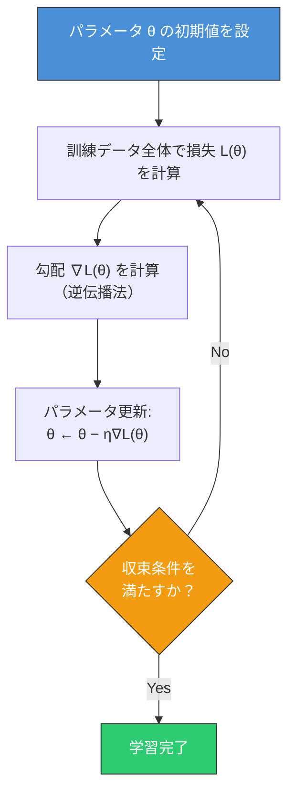
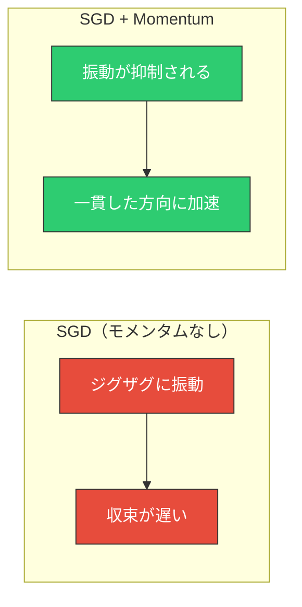
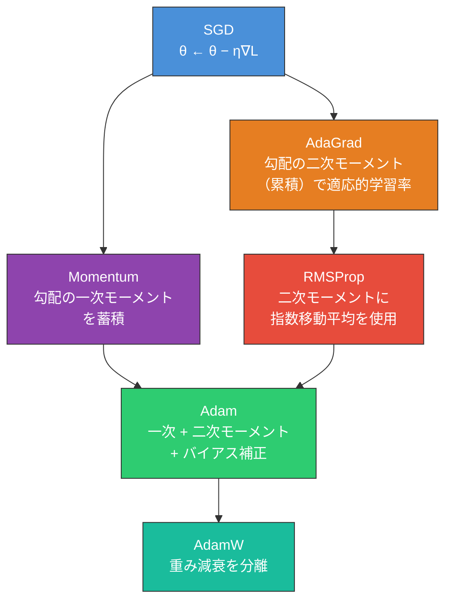
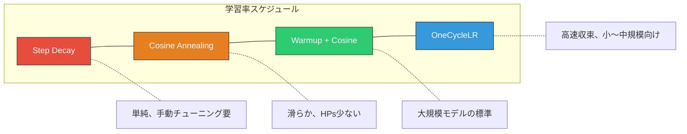
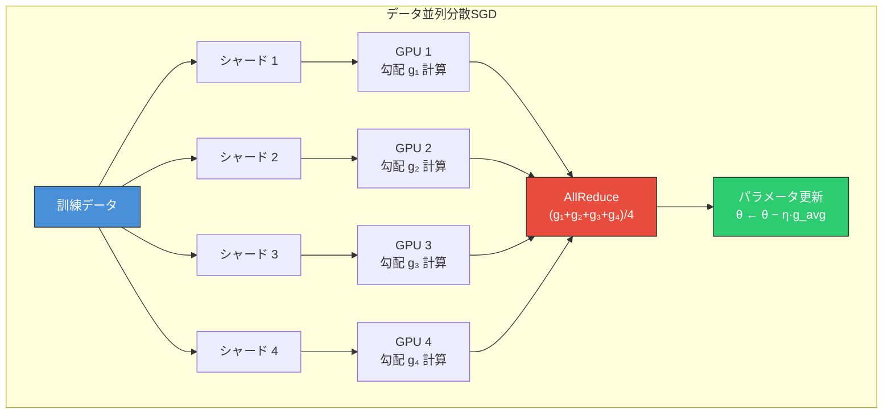
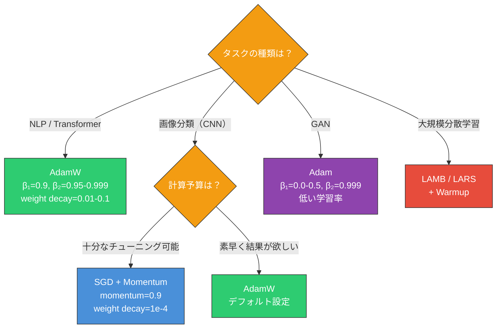

# 勾配降下法と最適化 — SGD, Adam, 学習率スケジューリング

## 1. 背景と動機：損失関数の最小化

機械学習、とりわけ深層学習の本質は、**パラメータの最適化**に帰着する。ニューラルネットワークは数百万から数十億のパラメータ $\boldsymbol{\theta} = (\theta_1, \theta_2, \ldots, \theta_d)$ を持ち、これらのパラメータを訓練データに対して適切に調整することで、未知のデータに対する予測性能を獲得する。

この「適切な調整」を数学的に定式化したものが、**損失関数**（loss function）の最小化である。

$$\boldsymbol{\theta}^{*} = \arg\min_{\boldsymbol{\theta}} \mathcal{L}(\boldsymbol{\theta})$$

ここで $\mathcal{L}(\boldsymbol{\theta})$ は訓練データ全体に対する経験的損失であり、個々のサンプル $(x_i, y_i)$ に対する損失 $\ell(f_{\boldsymbol{\theta}}(x_i), y_i)$ の平均として定義される。

$$\mathcal{L}(\boldsymbol{\theta}) = \frac{1}{N} \sum_{i=1}^{N} \ell(f_{\boldsymbol{\theta}}(x_i), y_i)$$

$f_{\boldsymbol{\theta}}$ はパラメータ $\boldsymbol{\theta}$ によって定まるモデルであり、$\ell$ は交差エントロピーや平均二乗誤差といった損失関数である。

### なぜ最適化が難しいのか

線形回帰のような単純なモデルでは、損失関数は**凸関数**となるため、任意の局所最適解が大域最適解と一致する。正規方程式 $\boldsymbol{\theta}^{*} = (X^T X)^{-1} X^T \boldsymbol{y}$ によって解析的に解を求めることすらできる。

しかし、深層学習の損失関数は**非凸**（non-convex）である。活性化関数の非線形性と多層構造が組み合わさることで、損失関数の landscape は極めて複雑な形状を持つ。

```
Non-convex loss landscape (conceptual 1D cross-section)

Loss
 ^
 |    *
 |   / \         *
 |  /   \       / \       *  <- saddle point
 | /     \     /   \     / \
 |/       \   /     \   /   \
 |         \ /       \ /     \
 |          *         *       \___  <- flat region
 |     local min  local min
 +-----------------------------------------> θ
```

この landscape には以下のような構造が存在する。

- **局所最小値**（local minima）：周囲よりは低いが、大域的最小値ではない谷
- **鞍点**（saddle point）：ある方向では極小、別の方向では極大となる点
- **平坦領域**（plateau）：勾配がほぼゼロの広大な平坦領域

高次元空間（$d \gg 1$）では、局所最小値よりも**鞍点**のほうが圧倒的に多いことが理論的に知られている。$d$ 次元空間においてある臨界点が局所最小値であるためには、Hessian行列のすべての固有値が正でなければならないが、これは $d$ が大きくなるにつれて指数的に稀になる。

こうした複雑な landscape を効率的に探索し、良好な解に到達するための方法論が、本記事で扱う**勾配降下法とその発展形**である。

## 2. 勾配降下法の基本

### バッチ勾配降下法（Batch Gradient Descent）

勾配降下法の最も基本的な形は、**バッチ勾配降下法**（BGD: Batch Gradient Descent）である。アイデアは極めて直感的で、損失関数の勾配（gradient）が指し示す「最も急な上り方向」の**逆方向**にパラメータを更新する。

$$\boldsymbol{\theta}_{t+1} = \boldsymbol{\theta}_t - \eta \nabla_{\boldsymbol{\theta}} \mathcal{L}(\boldsymbol{\theta}_t)$$

ここで $\eta > 0$ は**学習率**（learning rate）であり、1ステップあたりのパラメータ更新量を制御するハイパーパラメータである。$\nabla_{\boldsymbol{\theta}} \mathcal{L}$ は損失関数の勾配ベクトルであり、各パラメータ方向の偏微分を成分に持つ。

$$\nabla_{\boldsymbol{\theta}} \mathcal{L} = \left(\frac{\partial \mathcal{L}}{\partial \theta_1}, \frac{\partial \mathcal{L}}{\partial \theta_2}, \ldots, \frac{\partial \mathcal{L}}{\partial \theta_d}\right)$$

### 幾何学的直感

2次元のパラメータ空間 $(\theta_1, \theta_2)$ を考えると、損失関数は曲面として可視化できる。等高線図で見れば、勾配ベクトルは常に等高線に対して**垂直**であり、損失が最も急に増加する方向を指す。勾配の負の方向に進むことは、等高線を最も効率的に横切って谷底に向かうことに相当する。



### バッチGDの限界

バッチ勾配降下法は理論的には明快だが、実用上の深刻な問題を抱えている。

**1. 計算コスト**

各更新ステップで訓練データ全体（$N$ サンプル）の損失と勾配を計算する必要がある。現代のデータセット（ImageNet の120万枚、Common Crawl の数兆トークンなど）では、1回の更新に膨大な計算を要し、学習に天文学的な時間がかかる。

**2. メモリ制約**

訓練データ全体をメモリに載せ、一括で勾配を計算することは、大規模データセットでは非現実的である。

**3. 冗長な計算**

訓練データには冗長な（似たような）サンプルが多く含まれることが一般的であり、全サンプルの勾配を計算してから更新するのは非効率的である。

### 逆伝播法（Backpropagation）

勾配降下法を実行するためには、損失関数のパラメータに関する勾配 $\nabla_{\boldsymbol{\theta}} \mathcal{L}$ を効率的に計算する手段が必要である。ニューラルネットワークにおいて、この勾配計算を可能にするのが**逆伝播法**（backpropagation）である。

逆伝播法の本質は、合成関数の微分に関する**連鎖律**（chain rule）の体系的な適用である。ニューラルネットワークは入力から出力への多段階の関数合成 $f = f_L \circ f_{L-1} \circ \cdots \circ f_1$ として表現されるため、連鎖律を出力層から入力層に向かって順に適用することで、すべてのパラメータに関する偏微分を $O(|\boldsymbol{\theta}|)$ の計算量で求めることができる。

$$\frac{\partial \mathcal{L}}{\partial \theta^{(l)}} = \frac{\partial \mathcal{L}}{\partial a^{(L)}} \cdot \frac{\partial a^{(L)}}{\partial a^{(L-1)}} \cdots \frac{\partial a^{(l+1)}}{\partial a^{(l)}} \cdot \frac{\partial a^{(l)}}{\partial \theta^{(l)}}$$

ここで $a^{(l)}$ は第 $l$ 層の活性化出力である。現代の深層学習フレームワーク（PyTorch、JAX など）は、この逆伝播を**自動微分**（automatic differentiation）として実装しており、ユーザーが手動で微分を計算する必要はない。

## 3. 確率的勾配降下法（SGD）とミニバッチ

### SGD（Stochastic Gradient Descent）

バッチ勾配降下法の計算コスト問題を解決するために提案されたのが、**確率的勾配降下法**（SGD）である。SGD はデータセット全体の勾配ではなく、ランダムに選択された**1つのサンプル** $(x_i, y_i)$ から勾配を推定する。

$$\boldsymbol{\theta}_{t+1} = \boldsymbol{\theta}_t - \eta \nabla_{\boldsymbol{\theta}} \ell(f_{\boldsymbol{\theta}_t}(x_i), y_i)$$

この単一サンプルの勾配 $\nabla_{\boldsymbol{\theta}} \ell(f_{\boldsymbol{\theta}}(x_i), y_i)$ は、真の勾配 $\nabla_{\boldsymbol{\theta}} \mathcal{L}(\boldsymbol{\theta})$ の**不偏推定量**（unbiased estimator）である。

$$\mathbb{E}_{i \sim \text{Uniform}(1, N)}[\nabla_{\boldsymbol{\theta}} \ell(f_{\boldsymbol{\theta}}(x_i), y_i)] = \nabla_{\boldsymbol{\theta}} \mathcal{L}(\boldsymbol{\theta})$$

つまり、個々の推定は noisy であるが、期待値としては正しい方向を指している。このノイズは一見デメリットに見えるが、実際には以下の利点をもたらす。

- **鞍点からの脱出**：勾配のノイズが鞍点や浅い局所最小値からの脱出を助ける
- **暗黙の正則化**：ノイズにより、損失関数の鋭い（sharp）最小値よりも平坦な（flat）最小値に収束しやすくなることが経験的に知られている。平坦な最小値は汎化性能が良い傾向がある

### ミニバッチSGD

実用上は、1サンプルではなく $B$ 個のサンプルからなる**ミニバッチ**を用いる。

$$\boldsymbol{\theta}_{t+1} = \boldsymbol{\theta}_t - \eta \cdot \frac{1}{B} \sum_{j=1}^{B} \nabla_{\boldsymbol{\theta}} \ell(f_{\boldsymbol{\theta}_t}(x_{i_j}), y_{i_j})$$

ミニバッチサイズ $B$ は、計算効率とノイズレベルのトレードオフを制御する。

| ミニバッチサイズ | 勾配推定のノイズ | GPU利用効率 | 汎化性能 |
|:---:|:---:|:---:|:---:|
| $B = 1$（純粋SGD） | 非常に高い | 低い | 良好な場合が多い |
| $B = 32 \sim 256$（一般的） | 適度 | 高い | 良好 |
| $B = N$（バッチGD） | なし | 最大だが1更新が重い | 過学習しやすい場合あり |

典型的には $B = 32, 64, 128, 256$ 程度が広く使われる。GPU のメモリに収まり、かつ行列演算の並列性を活かせるサイズが選ばれる。

> [!TIP]
> 現代の文脈では「SGD」と呼ばれるものの大半は、実際にはミニバッチ SGD を指している。本記事でも以降、特に断りがない限り SGD はミニバッチ SGD を意味する。

### エポックとイテレーション

- **エポック**（epoch）：訓練データ全体を1回処理すること
- **イテレーション**（iteration）：1回のパラメータ更新

$N$ 個のデータをバッチサイズ $B$ で処理する場合、1エポックは $\lceil N/B \rceil$ イテレーションに相当する。各エポックの開始時にデータをシャッフルすることで、ミニバッチ間の相関を減らし、学習の安定性を向上させる。

## 4. モメンタム

### Vanilla SGD の問題点

純粋な SGD は、損失関数の landscape によっては非効率な振動を起こす。特に、勾配のある成分が他の成分よりもはるかに大きい場合（損失関数の等高線が楕円形に引き伸ばされた場合）、急勾配な方向に沿って振動し、緩やかな谷に沿った進行が遅くなる。

```
SGD without momentum: oscillation in steep direction

       θ₂
        ^
        |     /‾‾‾‾\
        |    /   .---\--> slow progress along valley
        |   / .-'  .  \
        |  /.'  .'  '. \
        | /. .'      '.\
        |/.'            \
        +-----------------> θ₁
          zigzag path
```

この問題は、**条件数**（condition number）が大きい場合に顕著になる。条件数とは、Hessian 行列の最大固有値と最小固有値の比であり、これが大きいほど等高線は細長い楕円形になる。

### Momentum（モメンタム）

物理学の運動量にヒントを得た**モメンタム**は、過去の勾配の移動平均を蓄積し、パラメータ更新に「慣性」を付与する手法である。

$$\boldsymbol{v}_t = \mu \boldsymbol{v}_{t-1} + \eta \nabla_{\boldsymbol{\theta}} \mathcal{L}(\boldsymbol{\theta}_t)$$

$$\boldsymbol{\theta}_{t+1} = \boldsymbol{\theta}_t - \boldsymbol{v}_t$$

ここで $\boldsymbol{v}_t$ は**速度**（velocity）ベクトル、$\mu \in [0, 1)$ はモメンタム係数（典型的には $\mu = 0.9$）である。

モメンタムの効果を直感的に理解するために、ボールが谷を転がる様子を想像するとよい。ボールは坂を下るにつれて加速し、平坦な領域でも慣性で進み続ける。振動する方向の勾配は打ち消し合い、一貫した方向の勾配は蓄積されるため、結果として谷底への到達が大幅に速くなる。



### Nesterov Accelerated Gradient（NAG）

Yurii Nesterov が1983年に提案した **Nesterov モメンタム**は、標準的なモメンタムをさらに改良したものである。基本的なアイデアは、「現在の位置」ではなく「モメンタムによって進んだ先の位置」で勾配を計算するというものである。

$$\boldsymbol{v}_t = \mu \boldsymbol{v}_{t-1} + \eta \nabla_{\boldsymbol{\theta}} \mathcal{L}(\boldsymbol{\theta}_t - \mu \boldsymbol{v}_{t-1})$$

$$\boldsymbol{\theta}_{t+1} = \boldsymbol{\theta}_t - \boldsymbol{v}_t$$

この「先読み」（lookahead）により、目的地を通り過ぎてしまう **overshoot** を軽減できる。標準モメンタムでは、現在位置の勾配を見て速度を更新するため、すでに行き過ぎている場合でもさらに進んでしまう可能性がある。NAG は一歩先の情報を使うことで、この問題を緩和する。

凸最適化の理論では、NAG は $O(1/t^2)$ の収束レートを達成し、これは一次法（勾配情報のみを用いる手法）としては最適であることが証明されている。非凸問題である深層学習においても、実践的に良好な性能を示す。

## 5. 適応的学習率法

モメンタム付き SGD は強力だが、すべてのパラメータに同一の学習率を適用するという制約がある。しかし、実際のニューラルネットワークでは、各パラメータの勾配スケールは大きく異なる。頻繁に更新されるパラメータと、稀にしか更新されないパラメータでは、最適な学習率が異なるのは自然なことである。

**適応的学習率法**は、各パラメータごとに学習率を自動調整する手法群である。

### AdaGrad

**AdaGrad**（Adaptive Gradient、Duchi ら、2011年）は、各パラメータについて過去の勾配の二乗和を蓄積し、それを用いて学習率をスケーリングする。

$$\boldsymbol{G}_t = \boldsymbol{G}_{t-1} + (\nabla_{\boldsymbol{\theta}} \mathcal{L}(\boldsymbol{\theta}_t))^2$$

$$\boldsymbol{\theta}_{t+1} = \boldsymbol{\theta}_t - \frac{\eta}{\sqrt{\boldsymbol{G}_t} + \epsilon} \odot \nabla_{\boldsymbol{\theta}} \mathcal{L}(\boldsymbol{\theta}_t)$$

ここで $(\cdot)^2$ と $\sqrt{\cdot}$ は要素ごとの演算、$\odot$ は要素ごとの積（Hadamard積）、$\epsilon$ はゼロ除算を防ぐ小さな定数（典型的には $10^{-8}$）である。

AdaGrad の重要な特性は以下の通りである。

- **頻繁に大きな勾配を持つパラメータ**：$\boldsymbol{G}_t$ が大きくなり、実効的な学習率が小さくなる
- **稀にしか更新されないパラメータ**：$\boldsymbol{G}_t$ が小さいままであり、実効的な学習率が大きいまま保たれる

この特性は、自然言語処理における単語埋め込みの学習のように、低頻度語に対しても適切な更新を保証したい場合に有効である。

しかし、AdaGrad には致命的な欠点がある。$\boldsymbol{G}_t$ は**単調増加**するため、学習が進むにつれて実効的な学習率が際限なく減少し、やがてパラメータがほとんど更新されなくなる。凸最適化では学習率の減衰は望ましい性質だが、非凸な深層学習ではこれが学習の早期停滞を引き起こす。

### RMSProp

**RMSProp**（Root Mean Square Propagation、Hinton、2012年）は、AdaGrad の学習率の単調減少問題を、**指数移動平均**（exponential moving average）を用いて解決する。

$$\boldsymbol{v}_t = \beta \boldsymbol{v}_{t-1} + (1 - \beta) (\nabla_{\boldsymbol{\theta}} \mathcal{L}(\boldsymbol{\theta}_t))^2$$

$$\boldsymbol{\theta}_{t+1} = \boldsymbol{\theta}_t - \frac{\eta}{\sqrt{\boldsymbol{v}_t} + \epsilon} \odot \nabla_{\boldsymbol{\theta}} \mathcal{L}(\boldsymbol{\theta}_t)$$

$\beta$（典型的には 0.99）は減衰率であり、過去の勾配の二乗の影響を指数的に減衰させる。これにより、$\boldsymbol{v}_t$ は近い過去の勾配の二乗の移動平均となり、AdaGrad のように無限に蓄積することがない。

RMSProp は学術論文として正式に発表されたわけではなく、Geoffrey Hinton が Coursera の講義で提案したものであるが、その実用的な有効性から広く使われるようになった。

### Adam（Adaptive Moment Estimation）

**Adam**（Kingma & Ba、2015年）は、モメンタムと RMSProp を組み合わせた手法であり、現代の深層学習において最も広く使われるオプティマイザの一つである。

Adam は勾配の**一次モーメント**（平均）と**二次モーメント**（分散）の両方を指数移動平均で追跡する。

$$\boldsymbol{m}_t = \beta_1 \boldsymbol{m}_{t-1} + (1 - \beta_1) \nabla_{\boldsymbol{\theta}} \mathcal{L}(\boldsymbol{\theta}_t)$$

$$\boldsymbol{v}_t = \beta_2 \boldsymbol{v}_{t-1} + (1 - \beta_2) (\nabla_{\boldsymbol{\theta}} \mathcal{L}(\boldsymbol{\theta}_t))^2$$

ここで $\boldsymbol{m}_t$ は一次モーメント推定（モメンタムに相当）、$\boldsymbol{v}_t$ は二次モーメント推定（RMSProp に相当）である。

#### バイアス補正

$\boldsymbol{m}_0 = \boldsymbol{0}$、$\boldsymbol{v}_0 = \boldsymbol{0}$ で初期化するため、学習初期では $\boldsymbol{m}_t$ と $\boldsymbol{v}_t$ はゼロに偏ったバイアスを持つ。Adam ではこのバイアスを以下のように補正する。

$$\hat{\boldsymbol{m}}_t = \frac{\boldsymbol{m}_t}{1 - \beta_1^t}, \quad \hat{\boldsymbol{v}}_t = \frac{\boldsymbol{v}_t}{1 - \beta_2^t}$$

$t$ が小さいとき、$\beta_1^t$ や $\beta_2^t$ は1に近いため、補正係数 $1/(1-\beta^t)$ が大きくなり、バイアスを相殺する。$t$ が大きくなると $\beta^t \to 0$ となり、補正の影響はなくなる。

#### パラメータ更新

$$\boldsymbol{\theta}_{t+1} = \boldsymbol{\theta}_t - \frac{\eta}{\sqrt{\hat{\boldsymbol{v}}_t} + \epsilon} \odot \hat{\boldsymbol{m}}_t$$

推奨されるデフォルト値は $\beta_1 = 0.9$、$\beta_2 = 0.999$、$\epsilon = 10^{-8}$、$\eta = 0.001$ である。

```python
# Adam optimizer pseudocode
def adam(params, grads, m, v, t, lr=0.001, beta1=0.9, beta2=0.999, eps=1e-8):
    t += 1
    for i in range(len(params)):
        # Update biased first moment estimate
        m[i] = beta1 * m[i] + (1 - beta1) * grads[i]
        # Update biased second moment estimate
        v[i] = beta2 * v[i] + (1 - beta2) * grads[i] ** 2
        # Bias correction
        m_hat = m[i] / (1 - beta1 ** t)
        v_hat = v[i] / (1 - beta2 ** t)
        # Parameter update
        params[i] -= lr * m_hat / (v_hat ** 0.5 + eps)
    return params, m, v, t
```

Adam の実用的な利点は以下の通りである。

- **ハイパーパラメータのチューニングが比較的容易**：デフォルト値でも多くのタスクで良好に動作する
- **スパースな勾配に対する適応性**：AdaGrad/RMSProp 由来の適応的学習率
- **モメンタムによる安定した更新**：勾配の一次モーメントによるノイズ平滑化

### AdamW（Adam with Decoupled Weight Decay）

Adam には**重み減衰**（weight decay）の扱いに関する微妙だが重要な問題がある。

従来の実装では、L2正則化を損失関数に追加する形で重み減衰を実現していた。

$$\mathcal{L}_{\text{reg}}(\boldsymbol{\theta}) = \mathcal{L}(\boldsymbol{\theta}) + \frac{\lambda}{2} \|\boldsymbol{\theta}\|^2$$

SGD の場合、L2正則化と重み減衰は数学的に等価である。しかし、Adam のような適応的学習率法では、L2正則化項の勾配 $\lambda \boldsymbol{\theta}$ も適応的なスケーリングを受けてしまい、意図した正則化効果が得られない。

Loshchilov & Hutter（2019年）が提案した **AdamW** は、重み減衰を勾配更新から**分離**（decouple）する。

$$\boldsymbol{\theta}_{t+1} = \boldsymbol{\theta}_t - \frac{\eta}{\sqrt{\hat{\boldsymbol{v}}_t} + \epsilon} \odot \hat{\boldsymbol{m}}_t - \eta \lambda \boldsymbol{\theta}_t$$

最後の項 $\eta \lambda \boldsymbol{\theta}_t$ が分離された重み減衰であり、適応的スケーリングの影響を受けない。この小さな修正により、Adam の汎化性能が大幅に改善されることが実証されている。

現代の実践では、**Adam よりも AdamW を使用することが標準**となっている。



### SGD vs Adam：どちらを選ぶか

SGD（モメンタム付き）と Adam の選択は、深層学習の実践においてしばしば議論されるテーマである。

| 観点 | SGD + Momentum | Adam / AdamW |
|:---|:---|:---|
| 収束速度 | 遅い（特に初期） | 速い |
| 汎化性能 | 優れる場合が多い | SGD にやや劣ることがある |
| ハイパーパラメータ感度 | 学習率に敏感 | デフォルトでもある程度動作 |
| メモリ使用量 | 低い（速度ベクトル1つ） | 高い（$\boldsymbol{m}$, $\boldsymbol{v}$ の2つ） |
| 主な適用領域 | 画像認識（CNN） | NLP、Transformer、GAN |

近年の大規模言語モデル（LLM）の学習では、AdamW がほぼ標準的な選択である。一方、画像分類のコンペティションなどでは、十分なチューニングを施した SGD + Momentum が最高精度を達成するケースも見られる。

## 6. 学習率スケジューリング

学習率 $\eta$ は最適化において最も重要なハイパーパラメータである。大きすぎると発散し、小さすぎると収束が遅くなる。さらに、学習の進行に伴って最適な学習率は変化する。初期段階では大きな学習率で大まかな方向に進み、後半では小さな学習率で微調整する、という戦略が一般的に有効である。

**学習率スケジューリング**（learning rate scheduling）は、学習の進行に伴って学習率を動的に変化させる手法である。

### Step Decay

最も単純なスケジューリングで、一定のエポック間隔で学習率を固定比率で減衰させる。

$$\eta_t = \eta_0 \cdot \gamma^{\lfloor t / s \rfloor}$$

$\eta_0$ は初期学習率、$\gamma$（典型的には $0.1$ や $0.5$）は減衰率、$s$ はステップサイズ（エポック数）である。たとえば ResNet の元論文では、エポック 30, 60, 90 でそれぞれ学習率を $1/10$ にしている。

```
Step decay schedule:

η
 ^
 |■■■■■■■■■■■
 |           |
 |           ■■■■■■■■■■■
 |                      |
 |                      ■■■■■■■■■■■
 |                                 |
 |                                 ■■■■■■■■
 +--------------------------------------> epoch
  0          30         60         90
```

Step Decay は実装が簡単で挙動が予測しやすいが、減衰のタイミングとスケールを手動で設定する必要があり、タスクごとのチューニングが求められる。

### Cosine Annealing

**コサインアニーリング**（Loshchilov & Hutter、2017年）は、余弦関数を用いて学習率を滑らかに減衰させる手法である。

$$\eta_t = \eta_{\min} + \frac{1}{2}(\eta_{\max} - \eta_{\min})\left(1 + \cos\left(\frac{t}{T} \pi\right)\right)$$

$\eta_{\max}$ は初期（最大）学習率、$\eta_{\min}$ は最小学習率（通常 $0$ または非常に小さな値）、$T$ は総イテレーション数である。

```
Cosine annealing schedule:

η
 ^
 |*
 | *
 |  *
 |   **
 |     **
 |       ***
 |          ****
 |              *******
 |                     **************
 +--------------------------------------> t/T
  0                                 1.0
```

コサインアニーリングの利点は、Step Decay のような「減衰のタイミング」というハイパーパラメータが不要であり、学習率の変化が滑らかであることである。大規模言語モデルの学習で広く採用されている。

### Warmup

学習の最初期に大きな学習率を適用すると、パラメータがランダムに初期化された不安定な状態で大きな更新が行われ、学習が発散するリスクがある。これは特に、Adam のような適応的手法で $\boldsymbol{m}_t$ と $\boldsymbol{v}_t$ がまだ十分に推定されていない初期段階で顕著である。

**Warmup** は、学習の最初の数イテレーション（または数エポック）で学習率をゼロから漸増させるテクニックである。

$$\eta_t = \eta_{\max} \cdot \frac{t}{T_{\text{warmup}}}, \quad t \leq T_{\text{warmup}}$$

Warmup 期間の後は、コサインアニーリングや Step Decay など、任意のスケジューリングに移行する。

Warmup は Transformer の原論文「Attention Is All You Need」（Vaswani ら、2017年）で採用されて以来、大規模モデルの学習では事実上の標準となっている。

### Warmup + Cosine Annealing（最も一般的な組み合わせ）

現代の大規模学習で最も広く使われるのが、Warmup と Cosine Annealing の組み合わせである。

$$\eta_t = \begin{cases} \eta_{\max} \cdot \dfrac{t}{T_{\text{warmup}}} & t \leq T_{\text{warmup}} \\ \eta_{\min} + \dfrac{1}{2}(\eta_{\max} - \eta_{\min})\left(1 + \cos\left(\dfrac{t - T_{\text{warmup}}}{T - T_{\text{warmup}}} \pi\right)\right) & t > T_{\text{warmup}} \end{cases}$$

```
Warmup + cosine annealing:

η
 ^
 |        ****
 |      **    **
 |     *        **
 |    *           ***
 |   *               ****
 |  *                    *****
 | *                          ********
 |*                                   ***
 +--------------------------------------> step
  warmup      cosine decay
```

GPT-3、LLaMA、Chinchilla など、現代の主要な大規模言語モデルのほぼすべてがこの学習率スケジュールを採用している。

### OneCycleLR

**OneCycleLR**（Smith & Topin、2019年）は、学習率を1サイクルの中で上昇→下降させる手法であり、「Super-Convergence」と呼ばれる現象を引き起こし、通常の学習率スケジュールよりも**数倍速く**収束することが報告されている。

OneCycleLR は以下のフェーズからなる。

1. **上昇フェーズ**（全体の約30-50%）：学習率を $\eta_{\min}$ から $\eta_{\max}$ まで線形に増加
2. **下降フェーズ**（残りの期間）：学習率を $\eta_{\max}$ から $\eta_{\min}$ よりもさらに小さい値まで減衰（コサインまたは線形）

```
OneCycleLR schedule:

η
 ^
 |         ****
 |       **    **
 |     **        **
 |    *            **
 |   *               ***
 |  *                   ****
 | *                        ******
 |*                               ***
 +--------------------------------------> step
  phase 1      phase 2
  (increase)   (decrease)
```

OneCycleLR は比較的小規模なモデル（ResNet など）の学習で特に有効であり、少ないエポック数で高い精度を達成できるため、計算資源の節約に貢献する。

### 学習率スケジューリングの比較



## 7. 勾配の問題：勾配消失と勾配爆発

勾配降下法の有効性は、勾配が有意義な情報を持っていることを前提としている。しかし、深いネットワークでは逆伝播の過程で勾配に深刻な問題が生じることがある。

### 勾配消失（Vanishing Gradient）

連鎖律による勾配の計算では、各層のヤコビアン行列（または活性化関数の微分）が掛け合わされる。

$$\frac{\partial \mathcal{L}}{\partial \boldsymbol{\theta}^{(1)}} = \frac{\partial \mathcal{L}}{\partial a^{(L)}} \prod_{l=1}^{L-1} \frac{\partial a^{(l+1)}}{\partial a^{(l)}} \cdot \frac{\partial a^{(1)}}{\partial \boldsymbol{\theta}^{(1)}}$$

もし各層のヤコビアンのスペクトルノルムが1未満であれば、$L$ 層にわたる積は指数的に小さくなる。

$$\left\|\prod_{l=1}^{L-1} \frac{\partial a^{(l+1)}}{\partial a^{(l)}}\right\| \leq \prod_{l=1}^{L-1} \left\|\frac{\partial a^{(l+1)}}{\partial a^{(l)}}\right\| \to 0 \quad (\text{as } L \to \infty)$$

これが**勾配消失**であり、初期層のパラメータがほとんど更新されなくなる。シグモイド関数 $\sigma(x) = 1/(1+e^{-x})$ は微分の最大値が $0.25$ であるため、勾配消失を特に起こしやすい。

### 勾配爆発（Exploding Gradient）

逆に、各層のヤコビアンのスペクトルノルムが1を超える場合、勾配は指数的に増大する。これが**勾配爆発**であり、パラメータが発散し、学習が崩壊する。RNN における勾配爆発は特に深刻で、BPTT（Backpropagation Through Time）では数百ステップにわたって勾配が伝搬するため、問題が顕在化しやすい。

### 対策

#### (a) 活性化関数の選択

**ReLU**（Rectified Linear Unit）$f(x) = \max(0, x)$ は、正の領域での微分が常に1であるため、勾配消失を大幅に緩和する。ただし、負の領域では勾配が完全にゼロになる「Dead ReLU」の問題があるため、Leaky ReLU や GELU といった変種も使われる。

#### (b) 残差接続（Residual Connection）

ResNet（He ら、2016年）で導入された残差接続は、勾配が層をスキップして直接伝搬できるパスを提供する。

$$a^{(l+1)} = a^{(l)} + f^{(l)}(a^{(l)})$$

この構造により、勾配には少なくとも恒等写像を通じたパス（勾配 = 1）が保証され、深い層への勾配の伝搬が安定する。

#### (c) 正規化（Normalization）

**Batch Normalization**（Ioffe & Szegedy、2015年）や **Layer Normalization**（Ba ら、2016年）は、各層の活性化を正規化することで、勾配のスケールを安定させる。

#### (d) 適切な初期化

**He 初期化**（He ら、2015年）は、ReLU 活性化関数を考慮して重みを $\mathcal{N}(0, 2/n_{\text{in}})$ で初期化する。これにより、順伝播・逆伝播の両方で信号のスケールが層を経ても保たれる。

### 勾配クリッピング（Gradient Clipping）

勾配爆発に対する直接的な対策が**勾配クリッピング**である。2つの主要な方法がある。

**値によるクリッピング**：各要素を閾値で切り詰める。

$$g_i \leftarrow \text{clip}(g_i, -c, c)$$

**ノルムによるクリッピング**：勾配ベクトル全体のノルムが閾値を超えた場合にスケーリングする。

$$\boldsymbol{g} \leftarrow \begin{cases} \boldsymbol{g} & \text{if } \|\boldsymbol{g}\| \leq c \\ c \cdot \dfrac{\boldsymbol{g}}{\|\boldsymbol{g}\|} & \text{if } \|\boldsymbol{g}\| > c \end{cases}$$

ノルムによるクリッピングは勾配の方向を保存するため、一般的にはこちらが推奨される。大規模言語モデルの学習では、勾配ノルムクリッピング（$c = 1.0$）が標準的に適用される。

## 8. 二次最適化法との関係

### 勾配降下法の理論的位置づけ

これまで議論してきた手法はすべて**一次法**（first-order method）であり、損失関数の勾配（一次微分）のみを利用する。一方、損失関数の曲率情報（二次微分、Hessian行列）を利用する**二次法**（second-order method）は、理論的にはより速い収束を実現できる。

### Newton法

ニュートン法は、損失関数を現在の点 $\boldsymbol{\theta}_t$ の周りで二次のテイラー展開で近似し、その近似の最小点にジャンプする手法である。

$$\boldsymbol{\theta}_{t+1} = \boldsymbol{\theta}_t - \boldsymbol{H}_t^{-1} \nabla_{\boldsymbol{\theta}} \mathcal{L}(\boldsymbol{\theta}_t)$$

ここで $\boldsymbol{H}_t = \nabla^2_{\boldsymbol{\theta}} \mathcal{L}(\boldsymbol{\theta}_t)$ は Hessian 行列であり、損失関数の二次偏微分を要素とする $d \times d$ の行列である。

Newton法は二次収束（quadratic convergence）を示すため、最適解の近傍では1ステップの更新で指数的に精度が改善する。しかし、深層学習に直接適用するのは**現実的ではない**。

- **Hessian の計算コスト**：$d$ 個のパラメータに対して $d \times d$ の行列を計算するのは $O(d^2)$ のメモリと $O(d^3)$ の計算を要する。$d$ が数十億のオーダーである現代のモデルでは不可能
- **Hessian の逆行列**：$d \times d$ の行列の逆行列計算は $O(d^3)$
- **非凸性**：Hessian が正定値でない場合、Newton法は下降方向を生成しない可能性がある

### L-BFGS

**L-BFGS**（Limited-memory Broyden-Fletcher-Goldfarb-Shanno）は、Hessian の逆行列を陽に計算・保持する代わりに、過去 $m$ ステップ（典型的には $m = 5 \sim 20$）の勾配情報から暗黙的に近似する準ニュートン法である。

L-BFGS のメモリ使用量は $O(md)$ であり、Newton法の $O(d^2)$ に比べて大幅に少ない。バッチ勾配が正確に計算できる場面、たとえば小規模なモデルの学習やファインチューニングなどでは、SGD よりも速い収束を示すことがある。

しかし、大規模な確率的最適化（ミニバッチ SGD）の文脈では、L-BFGS は勾配のノイズに敏感であり、安定した動作が難しい。このため、大規模深層学習では一次法が主流である。

### 一次法と二次法の接点

興味深いことに、Adam は一次法でありながら、二次的な情報の「近似」を暗黙的に含んでいると解釈できる。$\hat{\boldsymbol{v}}_t$ は Hessian の対角成分の近似と見なすことができ、$\eta / \sqrt{\hat{\boldsymbol{v}}_t}$ による各パラメータの学習率調整は、簡易的な対角 Hessian 前処理に相当する。

この観点から、K-FAC（Kronecker-Factored Approximate Curvature）や Shampoo といった、より精密な曲率近似を用いる手法の研究が進んでおり、一次法と二次法の間を埋めるオプティマイザの設計は活発な研究分野である。

## 9. 大規模学習における最適化

数千の GPU を用いて数十億パラメータのモデルを学習する場合、最適化には単一GPU での学習とは異なるチャレンジが生じる。

### 大バッチ学習の課題

分散学習では、複数のワーカーがそれぞれミニバッチの勾配を計算し、それを集約してパラメータを更新する。$k$ 台の GPU を使い、各 GPU で $B$ サンプルを処理すると、実効的なバッチサイズは $kB$ になる。

大きなバッチサイズには以下の問題がある。

- **汎化性能の劣化**：バッチサイズが大きすぎると、勾配ノイズの正則化効果が失われ、鋭い最小値に収束しやすくなる
- **学習率スケーリングの非自明性**：バッチサイズを $k$ 倍にしたとき、学習率をどう調整すべきかは自明ではない

### 線形スケーリングルール

Goyal ら（2017年）が提案した**線形スケーリングルール**は、バッチサイズを $k$ 倍にしたときに学習率も $k$ 倍にするという経験則である。

$$\eta_{\text{large}} = k \cdot \eta_{\text{base}}$$

直感的には、$k$ 倍のバッチで平均した勾配は分散が $1/k$ に減少するため、1ステップあたりの更新量を $k$ 倍にすることで、同じ距離を進むことができる。

ただし、学習初期にこの大きな学習率を適用すると発散するため、**Warmup**が不可欠である。

### LARS（Layer-wise Adaptive Rate Scaling）

**LARS**（You ら、2017年）は、各層ごとに学習率を適応的にスケーリングする手法である。各層 $l$ について、重みのノルムと勾配のノルムの比を用いて、層固有のスケーリング係数 $\lambda^{(l)}$ を計算する。

$$\lambda^{(l)} = \frac{\|\boldsymbol{\theta}^{(l)}\|}{\|\nabla_{\boldsymbol{\theta}^{(l)}} \mathcal{L}\| + \lambda_{\text{wd}} \|\boldsymbol{\theta}^{(l)}\|}$$

$$\boldsymbol{\theta}^{(l)}_{t+1} = \boldsymbol{\theta}^{(l)}_t - \eta \cdot \lambda^{(l)} \left(\nabla_{\boldsymbol{\theta}^{(l)}} \mathcal{L} + \lambda_{\text{wd}} \boldsymbol{\theta}^{(l)}_t\right)$$

この層ごとの正規化により、異なる層間での勾配スケールの違いが補正され、非常に大きなバッチサイズ（$B = 32{,}768$ など）でも安定した学習が可能になる。

### LAMB（Layer-wise Adaptive Moments optimizer for Batch training）

**LAMB**（You ら、2020年）は、LARS のアイデアを Adam に適用したものである。Adam の更新方向を計算した後、層ごとの trust ratio でスケーリングする。

$$\boldsymbol{r}_t^{(l)} = \frac{\hat{\boldsymbol{m}}_t^{(l)}}{\sqrt{\hat{\boldsymbol{v}}_t^{(l)}} + \epsilon} + \lambda_{\text{wd}} \boldsymbol{\theta}_t^{(l)}$$

$$\phi^{(l)} = \frac{\|\boldsymbol{\theta}_t^{(l)}\|}{\|\boldsymbol{r}_t^{(l)}\|}$$

$$\boldsymbol{\theta}_{t+1}^{(l)} = \boldsymbol{\theta}_t^{(l)} - \eta \cdot \phi^{(l)} \cdot \boldsymbol{r}_t^{(l)}$$

LAMB は BERT の学習を76分に短縮（従来の3日から）することに成功し、大規模 Transformer モデルの分散学習で広く使われるようになった。

### 分散SGDとAllReduce

データ並列の分散学習では、各ワーカーが計算した勾配を集約する**AllReduce** 操作が必要になる。



AllReduce の通信コストは、モデルサイズに比例し、GPU数に対して対数的にスケールする（Ring-AllReduce の場合）。通信と計算のオーバーラップ（勾配の計算が終わった層から通信を開始する）が、分散学習の効率を大きく左右する。

### 勾配圧縮と非同期SGD

通信コストをさらに削減するための研究も活発である。

- **勾配圧縮**：勾配を量子化（1-bit SGD など）したり、Top-K で大きな成分のみを送信したりする
- **非同期SGD**：各ワーカーがグローバルパラメータの最新コピーを待たずに更新を送信する。通信待ちがなくなるが、**stale gradient**（古いパラメータに基づいた勾配）の問題が生じ、収束が不安定になることがある

## 10. 現代の実践的ガイドライン

最後に、実践者のための具体的な指針をまとめる。

### オプティマイザの選択



### 学習率の設定

1. **学習率レンジテスト**（Smith、2017年）を行い、学習が安定する範囲を特定する。具体的には、学習率を非常に小さい値から指数的に増加させ、損失が急激に増加し始める直前の学習率を上限の目安とする
2. 大規模モデルの学習率の一般的な範囲：
   - AdamW：$1 \times 10^{-4}$ 〜 $3 \times 10^{-4}$（LLM の場合）
   - SGD：$0.01$ 〜 $0.1$（画像分類の場合）

### 学習率スケジューリング

- **大規模LLM**：Warmup（総ステップの1-5%）+ Cosine Annealing
- **画像分類**：Warmup + Cosine Annealing、または Step Decay
- **ファインチューニング**：低い初期学習率 + 線形減衰

### バッチサイズの選定

- GPUメモリに収まる範囲で大きいバッチサイズを使うのが基本
- 勾配累積（gradient accumulation）を活用すれば、メモリに載らない大バッチサイズを模擬できる
- バッチサイズを大きくする場合は、学習率の線形スケーリングと Warmup を併用する

### 学習の監視

- **学習損失**と**検証損失**の乖離が広がっていないか（過学習の兆候）
- **勾配ノルム**を監視し、突発的なスパイク（勾配爆発の兆候）を検知する
- **学習率**の推移を記録し、スケジュールが意図通りに機能しているか確認する

### デバッグのチェックリスト

| 症状 | 考えられる原因 | 対策 |
|:---|:---|:---|
| 損失が減少しない | 学習率が大きすぎる/小さすぎる | 学習率レンジテストを実施 |
| 損失が NaN になる | 勾配爆発 | 勾配クリッピング、学習率低下 |
| 訓練損失は下がるが検証損失が上がる | 過学習 | weight decay 増加、Dropout、データ拡張 |
| 損失が途中でプラトーに達する | 学習率が高すぎて微調整できない | 学習率スケジューリングの見直し |
| 学習初期に損失が急増する | Warmup が不十分 | Warmup 期間を延長 |

## まとめ

勾配降下法は、損失関数の勾配に基づいてパラメータを反復的に更新するという単純な原理に基づいている。しかし、この単純な原理を大規模な非凸最適化問題に対して効果的に適用するためには、半世紀以上にわたる研究の蓄積が必要であった。

本記事で見てきたように、最適化手法の発展は以下のような流れを辿ってきた。

1. **バッチ勾配降下法**：理論的に明快だが計算が重い
2. **SGD**：確率的な勾配推定により、大規模データに対応
3. **モメンタム**：過去の勾配を蓄積し、振動を抑制
4. **適応的学習率法（AdaGrad → RMSProp → Adam → AdamW）**：パラメータごとの最適な学習率を自動調整
5. **学習率スケジューリング**：学習の進行に伴う学習率の動的制御
6. **大規模学習の最適化（LARS, LAMB）**：数千GPUでの安定した分散学習

これらの手法はいずれも、理論的な洞察と実践的な経験の両方に支えられている。最適化は深層学習の基盤技術であり、モデルアーキテクチャやデータと同等に、最終的な性能を左右する重要な要素である。

なお、最適化手法の研究は今なお活発に進行中である。Sophia（Hessian の対角推定を用いた二次法的なオプティマイザ）、Lion（進化的探索で発見されたオプティマイザ）、Schedule-Free Adam（学習率スケジューリングを不要にする手法）など、新たなアプローチが次々と提案されている。しかし、これらの新手法がどの程度広く採用されるかは時間が経ってみないとわからず、当面は AdamW + Warmup + Cosine Annealing が実践の中心であり続けるであろう。
