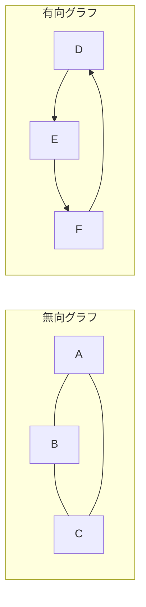
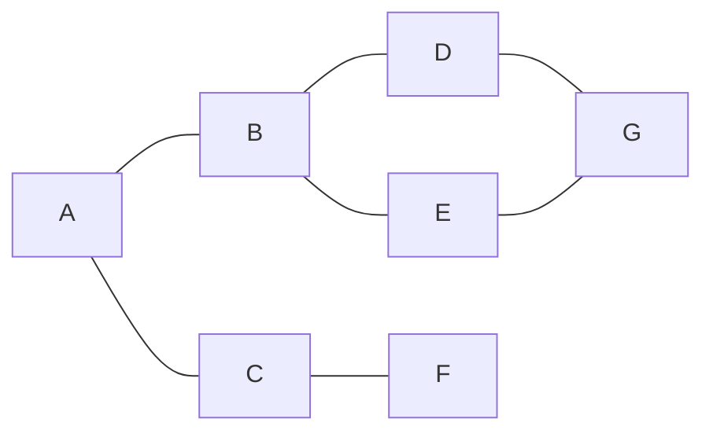
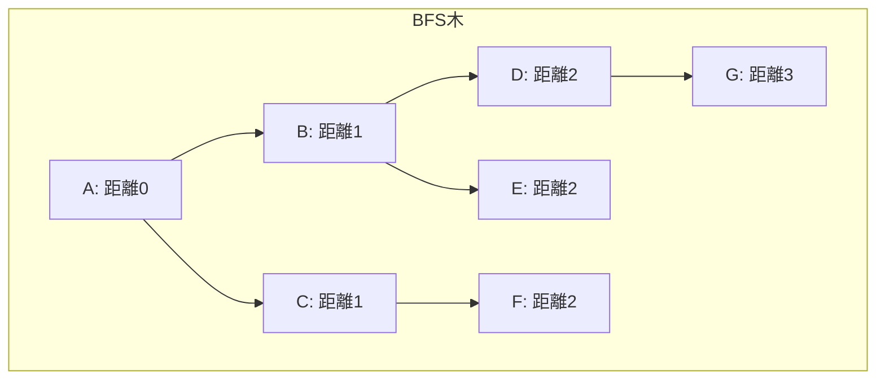
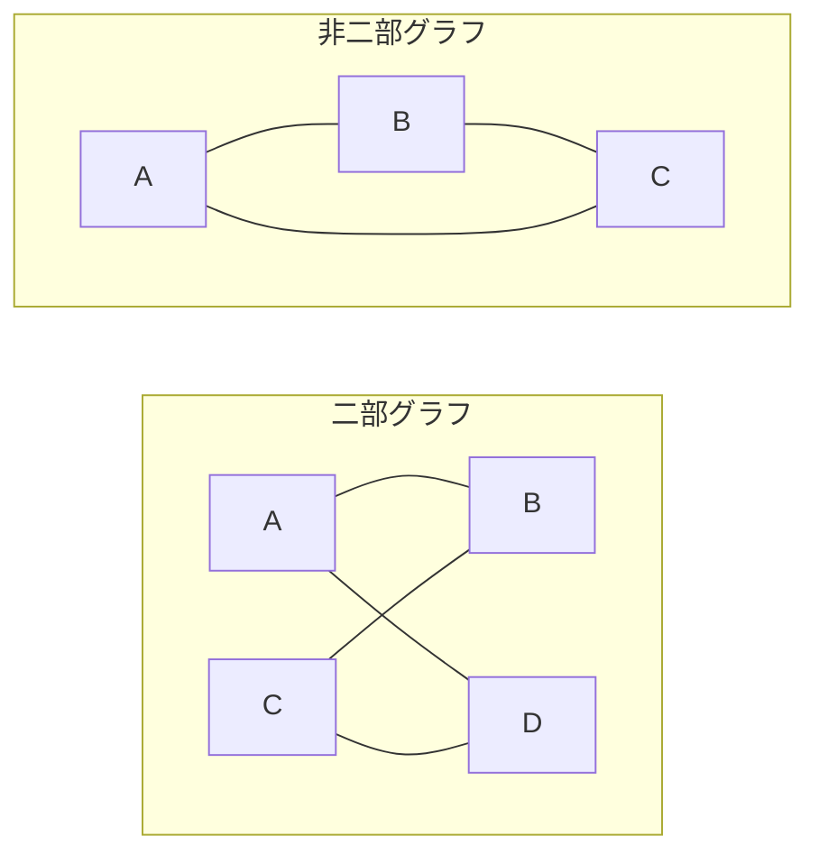
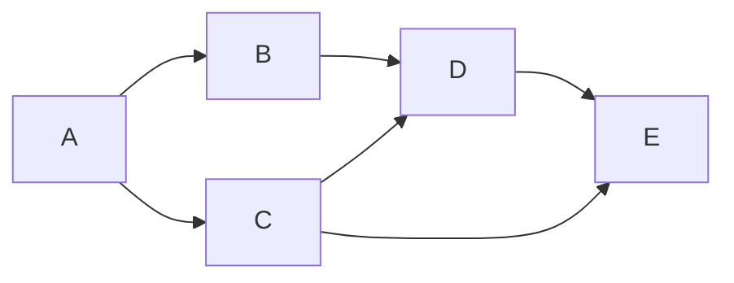
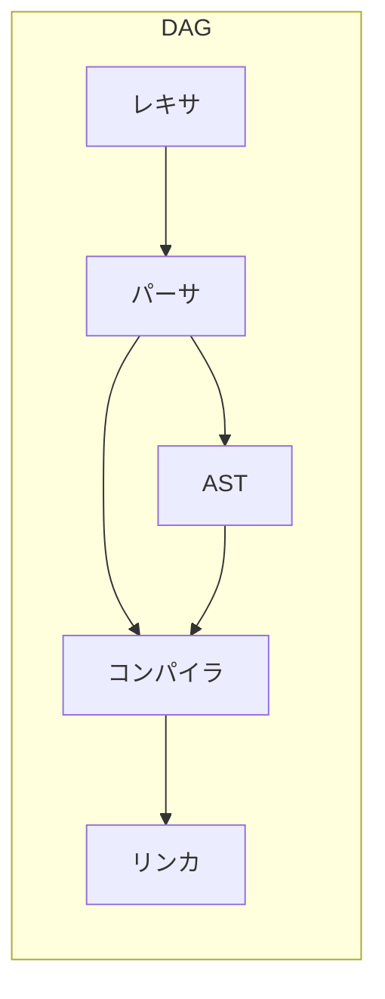
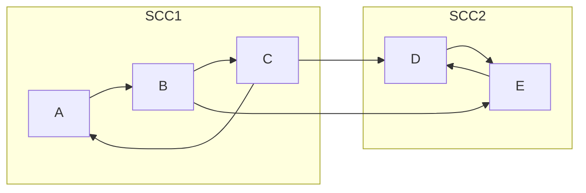
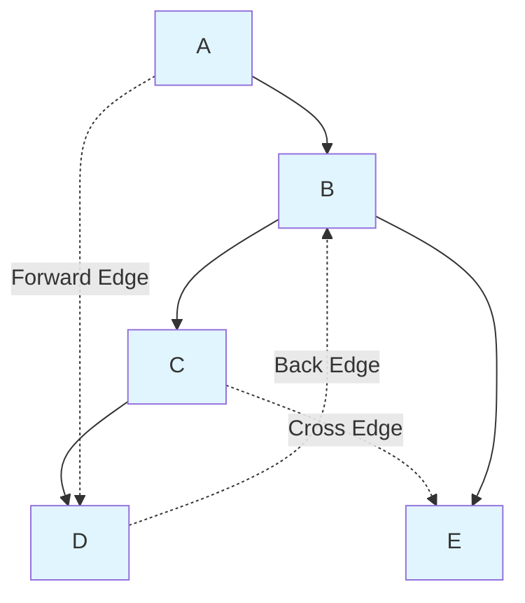
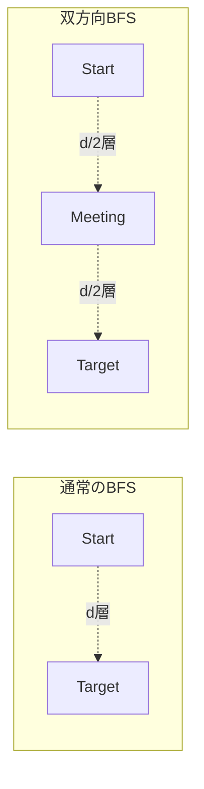
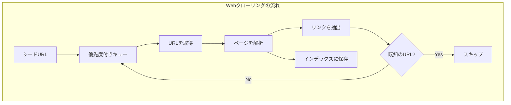

# グラフ探索（BFS, DFS）と応用 — グラフアルゴリズムの基盤

## 1. グラフの基本概念

### 1.1 グラフとは何か

グラフ（graph）は、**頂点（vertex / node）** の集合と、頂点間の関係を表す **辺（edge）** の集合で構成される数学的構造である。形式的には、グラフ $G$ は $G = (V, E)$ と書かれ、$V$ は頂点集合、$E \subseteq V \times V$ は辺集合を表す。

グラフは現実世界のあらゆる関係性をモデル化できる極めて汎用的な抽象構造であり、コンピュータサイエンスの多くの分野で中心的な役割を果たしている。以下はその具体例の一部である。

- **ソーシャルネットワーク**: ユーザーを頂点、友人関係やフォロー関係を辺として表現する
- **Web**: Web ページを頂点、ハイパーリンクを辺として表現する
- **道路ネットワーク**: 交差点を頂点、道路を辺として表現する
- **依存関係グラフ**: ソフトウェアモジュールを頂点、依存関係を辺として表現する
- **状態遷移図**: システムの状態を頂点、遷移を辺として表現する

グラフ探索（graph traversal）とは、グラフの頂点と辺を体系的に訪問する手法であり、グラフに関するほぼすべてのアルゴリズムの基盤となっている。

### 1.2 グラフの分類

グラフにはいくつかの重要な分類がある。

**有向グラフ（directed graph）と無向グラフ（undirected graph）**

辺に方向があるかどうかによる区分である。有向グラフでは辺 $(u, v)$ は $u$ から $v$ への一方向の関係を表し、無向グラフでは辺 $\{u, v\}$ は双方向の関係を表す。



**重み付きグラフ（weighted graph）と重みなしグラフ（unweighted graph）**

各辺に数値（重み / コスト）が付与されているかどうかの区分である。道路ネットワークの距離や、通信ネットワークの帯域幅などは重みとして表現される。

**連結グラフ（connected graph）と非連結グラフ（disconnected graph）**

無向グラフにおいて、任意の2頂点間に経路が存在する場合、そのグラフは連結であるという。有向グラフでは、すべての頂点対 $(u, v)$ について $u$ から $v$ への経路と $v$ から $u$ への経路の両方が存在する場合、**強連結（strongly connected）** であるという。

**閉路（cycle）の有無**

閉路を持たないグラフを **DAG（Directed Acyclic Graph）** と呼ぶ。DAG はタスクの依存関係やコンパイルの順序など、多くの実用的な場面で現れる。

### 1.3 グラフの表現方法

グラフをプログラム上でどのように表現するかは、アルゴリズムの効率に直結する重要な設計判断である。主な表現方法は2つある。

#### 隣接行列（Adjacency Matrix）

$|V| \times |V|$ の二次元配列 $A$ を用いて、$A[i][j] = 1$（辺が存在する場合）または $A[i][j] = 0$（辺が存在しない場合）で表現する。重み付きグラフでは、$A[i][j]$ に重みの値を格納する。

```python
# Adjacency matrix representation
# n = number of vertices
n = 5
adj_matrix = [[0] * n for _ in range(n)]

# Add edge (u, v)
def add_edge(u, v):
    adj_matrix[u][v] = 1
    adj_matrix[v][u] = 1  # for undirected graph
```

**特徴**:
- 空間計算量: $O(|V|^2)$
- 辺の存在判定: $O(1)$ — 任意の2頂点間の辺の有無を即座に確認できる
- ある頂点の隣接頂点列挙: $O(|V|)$ — 行全体を走査する必要がある
- 密グラフ（$|E|$ が $|V|^2$ に近い場合）に適している

#### 隣接リスト（Adjacency List）

各頂点に対して、その頂点と隣接する頂点のリストを保持する。

```python
# Adjacency list representation
from collections import defaultdict

adj_list = defaultdict(list)

# Add edge (u, v)
def add_edge(u, v):
    adj_list[u].append(v)
    adj_list[v].append(u)  # for undirected graph
```

**特徴**:
- 空間計算量: $O(|V| + |E|)$
- 辺の存在判定: $O(\text{deg}(v))$ — 隣接リストを線形探索する必要がある
- ある頂点の隣接頂点列挙: $O(\text{deg}(v))$ — 隣接リストを走査するだけ
- 疎グラフ（$|E|$ が $|V|^2$ よりはるかに小さい場合）に適している

#### 表現方法の比較

| 操作 | 隣接行列 | 隣接リスト |
|------|----------|------------|
| 空間 | $O(\|V\|^2)$ | $O(\|V\| + \|E\|)$ |
| 辺の存在判定 | $O(1)$ | $O(\text{deg}(v))$ |
| 隣接頂点列挙 | $O(\|V\|)$ | $O(\text{deg}(v))$ |
| 辺の追加 | $O(1)$ | $O(1)$ |
| グラフ全探索 | $O(\|V\|^2)$ | $O(\|V\| + \|E\|)$ |

実用上、多くのグラフは疎であるため、**隣接リスト**がデフォルトの選択肢となることが多い。本記事でも以降の議論では主に隣接リスト表現を前提とする。

## 2. 幅優先探索（BFS）

### 2.1 BFS のアイデアと直感

幅優先探索（Breadth-First Search, BFS）は、開始頂点から **近い頂点から順に** 探索していくアルゴリズムである。水面に石を落としたとき、波紋が同心円状に広がっていく様子に例えられることが多い。

BFS の核心的なアイデアは以下の通りである。

1. 開始頂点を訪問する
2. 開始頂点から距離1の頂点をすべて訪問する
3. 次に距離2の頂点をすべて訪問する
4. これを未訪問の頂点がなくなるまで繰り返す

この「距離の層ごとに」探索するという性質が、BFS を最短経路問題に適用できる理由である。

### 2.2 アルゴリズム

BFS はキュー（FIFO: First-In, First-Out）を用いて実装する。

```python
from collections import deque

def bfs(graph, start):
    """
    Perform BFS starting from the given vertex.
    Returns a dictionary mapping each vertex to its distance from start.
    """
    visited = set()
    distance = {}
    parent = {}

    queue = deque([start])
    visited.add(start)
    distance[start] = 0
    parent[start] = None

    while queue:
        u = queue.popleft()
        for v in graph[u]:
            if v not in visited:
                visited.add(v)
                distance[v] = distance[u] + 1
                parent[v] = u
                queue.append(v)

    return distance, parent
```

### 2.3 BFS の動作例

以下のグラフに対して、頂点 A から BFS を実行する例を示す。



BFS の探索順序は以下のようになる。

| ステップ | キューの状態 | 訪問する頂点 | 距離 |
|---------|-------------|-------------|------|
| 0 | [A] | A | 0 |
| 1 | [B, C] | B | 1 |
| 2 | [C, D, E] | C | 1 |
| 3 | [D, E, F] | D | 2 |
| 4 | [E, F, G] | E | 2 |
| 5 | [F, G] | F | 2 |
| 6 | [G] | G | 3 |



### 2.4 計算量

- **時間計算量**: $O(|V| + |E|)$ — 各頂点はキューに最大1回入り、各辺は最大2回（無向グラフの場合）調べられる
- **空間計算量**: $O(|V|)$ — visited 集合、距離配列、キューがそれぞれ $O(|V|)$ を使用する

隣接行列表現を用いる場合、各頂点の隣接頂点列挙に $O(|V|)$ かかるため、時間計算量は $O(|V|^2)$ になる。

### 2.5 BFS の正当性 — 最短経路の保証

BFS が重みなしグラフにおける最短経路を正しく求めることは、以下の不変条件（invariant）から証明できる。

**主張**: BFS が頂点 $v$ を訪問したとき、$\text{distance}[v]$ は開始頂点 $s$ から $v$ への最短経路長に等しい。

**証明のスケッチ**:

キューの単調性に着目する。BFS のキューに格納される頂点の距離は単調非減少であり、かつ最大でも1だけ異なる。すなわち、キューの先頭の頂点の距離が $d$ であるとき、キュー内の頂点の距離は $d$ または $d+1$ のいずれかである。

帰納法により、距離 $d$ 以下のすべての頂点が正しい最短距離で訪問されていると仮定する。距離 $d+1$ の頂点 $v$ は、距離 $d$ のある頂点 $u$ から発見される。$v$ がまだ訪問されていないということは、距離 $d$ 以下のどの頂点からも直接到達できなかった（つまり距離が $d$ 以下ではない）ことを意味する。したがって $\text{distance}[v] = d + 1$ は正しい最短距離である。

## 3. BFS の応用

### 3.1 重みなしグラフの最短経路

BFS の最も直接的な応用は、重みなしグラフにおける単一始点最短経路問題（Single-Source Shortest Path, SSSP）である。前節で示したアルゴリズムそのものがこの問題の解法となる。

始点から任意の頂点への最短経路を復元するには、`parent` 配列を逆順にたどればよい。

```python
def reconstruct_path(parent, start, target):
    """
    Reconstruct the shortest path from start to target
    using the parent dictionary computed by BFS.
    """
    path = []
    current = target
    while current is not None:
        path.append(current)
        current = parent[current]
    path.reverse()
    if path[0] != start:
        return []  # target is unreachable from start
    return path
```

### 3.2 連結成分の列挙

無向グラフの **連結成分（connected component）** を求めるには、未訪問の頂点から BFS を繰り返し実行すればよい。

```python
def find_connected_components(graph, vertices):
    """
    Find all connected components in an undirected graph.
    Returns a list of sets, each containing vertices of one component.
    """
    visited = set()
    components = []

    for v in vertices:
        if v not in visited:
            # Start a new BFS from this unvisited vertex
            component = set()
            queue = deque([v])
            visited.add(v)
            while queue:
                u = queue.popleft()
                component.add(u)
                for w in graph[u]:
                    if w not in visited:
                        visited.add(w)
                        queue.append(w)
            components.append(component)

    return components
```

全体の計算量は $O(|V| + |E|)$ である。各頂点と各辺は、全BFS実行を通じてちょうど1回ずつ処理される。

### 3.3 二部グラフ判定

**二部グラフ（bipartite graph）** とは、頂点集合を2つのグループに分割でき、同じグループ内の頂点間には辺が存在しないグラフである。二部グラフは、スケジューリング問題やマッチング問題において重要な役割を果たす。

BFS を用いて二部グラフかどうかを判定するには、頂点を2色で塗り分けることを試みる。BFS の各層に交互に色を割り当て、隣接する頂点が同じ色になった場合、そのグラフは二部グラフではない。

```python
def is_bipartite(graph, vertices):
    """
    Check if an undirected graph is bipartite using BFS.
    Returns (True, coloring) if bipartite, (False, {}) otherwise.
    """
    color = {}

    for start in vertices:
        if start in color:
            continue
        # BFS coloring
        queue = deque([start])
        color[start] = 0
        while queue:
            u = queue.popleft()
            for v in graph[u]:
                if v not in color:
                    color[v] = 1 - color[u]
                    queue.append(v)
                elif color[v] == color[u]:
                    return False, {}

    return True, color
```

二部グラフの判定は **奇数長の閉路が存在しないこと** と等価である。BFS で同じ色の頂点が隣接するということは、奇数長の閉路が存在することを意味する。



### 3.4 0-1 BFS

辺の重みが0または1のみの場合、通常のBFSを拡張した **0-1 BFS** を用いることで、$O(|V| + |E|)$ の時間計算量で最短経路を求めることができる。これは通常の Dijkstra 法（$O((|V| + |E|) \log |V|)$）よりも高速である。

0-1 BFS では、通常のキューの代わりに **両端キュー（deque）** を用いる。重み0の辺で到達する頂点はキューの先頭に、重み1の辺で到達する頂点はキューの末尾に追加する。

```python
def bfs_01(graph, start, n):
    """
    0-1 BFS for graphs with edge weights 0 or 1.
    graph[u] is a list of (v, weight) tuples.
    Returns shortest distances from start.
    """
    INF = float('inf')
    dist = [INF] * n
    dist[start] = 0
    dq = deque([start])

    while dq:
        u = dq.popleft()
        for v, w in graph[u]:
            if dist[u] + w < dist[v]:
                dist[v] = dist[u] + w
                if w == 0:
                    dq.appendleft(v)  # weight 0: push to front
                else:
                    dq.append(v)      # weight 1: push to back

    return dist
```

0-1 BFS は、迷路の問題で壁を壊すコストが1、通路を移動するコストが0といった場面で特に有用である。

## 4. 深さ優先探索（DFS）

### 4.1 DFS のアイデアと直感

深さ優先探索（Depth-First Search, DFS）は、BFS とは対照的に、**行けるところまで深く進み、行き止まりに達したら戻って別の道を探す** というアルゴリズムである。迷路を解くとき、一つの通路を突き当たりまで進み、行き止まりだったら分岐点まで戻って別の通路を試す――この戦略が DFS そのものである。

DFS は再帰的な構造を持ち、スタック（LIFO: Last-In, First-Out）と密接に関連している。実際、再帰呼び出しはコールスタックを暗黙的に使用しており、DFS の再帰実装はこの性質を直接反映している。

### 4.2 再帰による実装

```python
def dfs_recursive(graph, start, visited=None):
    """
    Perform DFS recursively starting from the given vertex.
    """
    if visited is None:
        visited = set()

    visited.add(start)
    # Process vertex here (e.g., print, record discovery time)

    for neighbor in graph[start]:
        if neighbor not in visited:
            dfs_recursive(graph, neighbor, visited)

    # Post-processing here (e.g., record finish time)
    return visited
```

### 4.3 スタックによる反復的実装

再帰が深くなるとスタックオーバーフローの危険がある（後述の「実装の注意点」で詳しく議論する）。そのため、明示的なスタックを用いた反復的実装も重要である。

```python
def dfs_iterative(graph, start):
    """
    Perform DFS iteratively using an explicit stack.
    """
    visited = set()
    stack = [start]

    while stack:
        u = stack.pop()
        if u in visited:
            continue
        visited.add(u)
        # Process vertex here
        for v in graph[u]:
            if v not in visited:
                stack.append(v)

    return visited
```

::: warning
反復的 DFS と再帰的 DFS は、隣接頂点の訪問順序が異なる場合がある。再帰版では隣接リストの先頭から順に探索するが、反復版ではスタックの LIFO 特性により隣接リストの末尾から先に探索される。同じ順序にしたい場合は、スタックに追加する際に隣接リストを逆順にする必要がある。
:::

### 4.4 タイムスタンプ付き DFS

DFS の多くの応用では、各頂点の **発見時刻（discovery time）** と **終了時刻（finish time）** が重要な役割を果たす。

```python
class DFSWithTimestamp:
    """
    DFS implementation that records discovery and finish times.
    """
    def __init__(self, graph, vertices):
        self.graph = graph
        self.vertices = vertices
        self.visited = set()
        self.discovery = {}
        self.finish = {}
        self.parent = {}
        self.time = 0

    def run(self):
        for v in self.vertices:
            if v not in self.visited:
                self.parent[v] = None
                self._dfs(v)

    def _dfs(self, u):
        self.visited.add(u)
        self.time += 1
        self.discovery[u] = self.time

        for v in self.graph[u]:
            if v not in self.visited:
                self.parent[v] = u
                self._dfs(v)

        self.time += 1
        self.finish[u] = self.time
```

タイムスタンプには重要な性質がある。

**括弧定理（Parenthesis Theorem）**: 任意の2頂点 $u$, $v$ について、以下のいずれか1つだけが成立する。

1. $[\text{discovery}[u], \text{finish}[u]]$ と $[\text{discovery}[v], \text{finish}[v]]$ は完全に分離している
2. $[\text{discovery}[u], \text{finish}[u]]$ が $[\text{discovery}[v], \text{finish}[v]]$ を完全に含む
3. $[\text{discovery}[v], \text{finish}[v]]$ が $[\text{discovery}[u], \text{finish}[u]]$ を完全に含む

つまり、2つの区間は「入れ子」になるか「完全に分離」するかのどちらかであり、部分的に重なることはない。これはまさに括弧の対応関係と同じ構造である。

### 4.5 DFS の動作例

以下の有向グラフに対して DFS を実行する例を示す。



頂点 A から DFS を開始した場合（隣接リストが $B, C$ の順とする）の探索順と各頂点のタイムスタンプは以下のようになる。

| 頂点 | 発見時刻 | 終了時刻 |
|------|---------|---------|
| A | 1 | 10 |
| B | 2 | 7 |
| D | 3 | 6 |
| E | 4 | 5 |
| C | 8 | 9 |

括弧表現: `(A (B (D (E E) D) B) (C C) A)`

ここで、$C$ から $D$ や $E$ への辺は、それらが既に訪問済みであるため探索木には含まれない。

### 4.6 計算量

- **時間計算量**: $O(|V| + |E|)$ — BFS と同じく、各頂点は1回訪問され、各辺は1回（有向グラフ）または2回（無向グラフ）調べられる
- **空間計算量**: $O(|V|)$ — visited 集合と再帰スタック（またはスタック）のために必要

## 5. DFS の応用

### 5.1 トポロジカルソート

**トポロジカルソート（topological sort）** は、DAG（有向非巡回グラフ）の頂点を、すべての辺 $(u, v)$ について $u$ が $v$ より前に来るように線形順序に並べる操作である。

タスクの依存関係、コンパイル順序、コースの履修順序など、「先にやるべきこと」と「後にやるべきこと」の関係がある場面で広く使われる。

DFS を用いたトポロジカルソートは、**終了時刻の降順** に頂点を並べるだけで実現できる。

```python
def topological_sort(graph, vertices):
    """
    Perform topological sort on a DAG using DFS.
    Returns vertices in topological order.
    """
    visited = set()
    order = []

    def dfs(u):
        visited.add(u)
        for v in graph[u]:
            if v not in visited:
                dfs(v)
        order.append(u)  # append when finishing

    for v in vertices:
        if v not in visited:
            dfs(v)

    order.reverse()
    return order
```



上の例では、トポロジカルソートの結果は例えば「レキサ → パーサ → AST → コンパイラ → リンカ」となる（一意とは限らない）。

**正当性の直感**: DFS において、頂点 $u$ が頂点 $v$ に依存する（辺 $u \to v$ がある）場合、$v$ の終了時刻は $u$ の終了時刻より早い。したがって、終了時刻の降順に並べると、すべての依存関係が正しく順序付けられる。

::: tip
Kahn のアルゴリズム（BFS ベース）を用いてもトポロジカルソートは実現できる。入次数が0の頂点をキューに入れ、順に処理しながら辺を除去していく方法である。こちらは閉路の検出も同時に行える利点がある。
:::

### 5.2 閉路検出

**有向グラフの閉路検出** は、DFS における後退辺（Back Edge, 次節で詳述）の存在と等価である。DFS 中に、現在の探索パス上にある祖先頂点への辺が見つかった場合、閉路が存在する。

実装上は、各頂点の状態を3つ（未訪問 / 訪問中 / 完了）で管理する。

```python
def has_cycle_directed(graph, vertices):
    """
    Detect cycle in a directed graph using DFS.
    Returns True if cycle exists.
    """
    WHITE, GRAY, BLACK = 0, 1, 2
    color = {v: WHITE for v in vertices}

    def dfs(u):
        color[u] = GRAY  # currently being explored
        for v in graph[u]:
            if color[v] == GRAY:
                return True   # back edge found -> cycle
            if color[v] == WHITE and dfs(v):
                return True
        color[u] = BLACK  # fully explored
        return False

    for v in vertices:
        if color[v] == WHITE:
            if dfs(v):
                return True
    return False
```

GRAY は「現在の DFS パス上にいる（探索中）」状態を表す。GRAY の頂点への辺が見つかるということは、その頂点からの探索がまだ完了していない、つまりその頂点に戻る経路が存在する＝閉路があるということを意味する。

**無向グラフの閉路検出** は、親以外の訪問済み頂点への辺を見つけるだけでよい。

```python
def has_cycle_undirected(graph, vertices):
    """
    Detect cycle in an undirected graph using DFS.
    Returns True if cycle exists.
    """
    visited = set()

    def dfs(u, parent):
        visited.add(u)
        for v in graph[u]:
            if v not in visited:
                if dfs(v, u):
                    return True
            elif v != parent:
                return True  # visited neighbor that is not parent -> cycle
        return False

    for v in vertices:
        if v not in visited:
            if dfs(v, None):
                return True
    return False
```

### 5.3 強連結成分（SCC）

有向グラフの **強連結成分（Strongly Connected Component, SCC）** とは、頂点の極大な部分集合であり、その中の任意の2頂点 $u$, $v$ 間に $u$ から $v$ への経路と $v$ から $u$ への経路の両方が存在するものである。

SCC の分解は以下のような場面で利用される。

- グラフの構造を理解するための縮約（SCC を1つの頂点にまとめると DAG になる）
- 2-SAT 問題の解法
- ソーシャルネットワークにおけるコミュニティ検出

#### Kosaraju のアルゴリズム

Kosaraju のアルゴリズムは、DFS を2回実行するだけで SCC を求める手法である。

1. **第1回 DFS**: 元のグラフで DFS を実行し、終了時刻の降順に頂点をスタックに積む
2. **グラフの転置**: すべての辺の向きを逆にしたグラフ $G^T$ を構築する
3. **第2回 DFS**: スタックから順に頂点を取り出し、$G^T$ 上で DFS を実行する。各 DFS で到達できる頂点の集合が1つの SCC を構成する

```python
def kosaraju_scc(graph, vertices):
    """
    Find all strongly connected components using Kosaraju's algorithm.
    Returns a list of sets, each containing vertices of one SCC.
    """
    # Step 1: DFS on original graph, record finish order
    visited = set()
    finish_order = []

    def dfs1(u):
        visited.add(u)
        for v in graph[u]:
            if v not in visited:
                dfs1(v)
        finish_order.append(u)

    for v in vertices:
        if v not in visited:
            dfs1(v)

    # Step 2: Build transposed graph
    transposed = defaultdict(list)
    for u in graph:
        for v in graph[u]:
            transposed[v].append(u)

    # Step 3: DFS on transposed graph in reverse finish order
    visited.clear()
    sccs = []

    def dfs2(u, component):
        visited.add(u)
        component.add(u)
        for v in transposed[u]:
            if v not in visited:
                dfs2(v, component)

    for v in reversed(finish_order):
        if v not in visited:
            component = set()
            dfs2(v, component)
            sccs.append(component)

    return sccs
```



上の例では、SCC は $\{A, B, C\}$ と $\{D, E\}$ の2つである。

**計算量**: DFS を2回実行し、グラフの転置に $O(|V| + |E|)$ かかるため、全体の計算量は $O(|V| + |E|)$ である。

#### Tarjan のアルゴリズム

Tarjan のアルゴリズムは DFS を1回だけ実行して SCC を求める手法であり、Kosaraju のアルゴリズムよりも実用上効率的であることが多い。

各頂点に **low-link 値** を割り当て、DFS 木の中で到達可能な最も早い発見時刻を追跡する。

```python
def tarjan_scc(graph, vertices):
    """
    Find all strongly connected components using Tarjan's algorithm.
    Returns a list of lists, each containing vertices of one SCC.
    """
    index_counter = [0]
    stack = []
    on_stack = set()
    index = {}
    lowlink = {}
    sccs = []

    def strongconnect(v):
        index[v] = index_counter[0]
        lowlink[v] = index_counter[0]
        index_counter[0] += 1
        stack.append(v)
        on_stack.add(v)

        for w in graph[v]:
            if w not in index:
                strongconnect(w)
                lowlink[v] = min(lowlink[v], lowlink[w])
            elif w in on_stack:
                lowlink[v] = min(lowlink[v], index[w])

        # If v is a root node of an SCC
        if lowlink[v] == index[v]:
            component = []
            while True:
                w = stack.pop()
                on_stack.remove(w)
                component.append(w)
                if w == v:
                    break
            sccs.append(component)

    for v in vertices:
        if v not in index:
            strongconnect(v)

    return sccs
```

## 6. 辺の分類

DFS によって生成される探索木に基づき、グラフの辺を4種類に分類できる。この分類は閉路検出やグラフの構造理解に本質的な役割を果たす。

### 6.1 辺の4分類

有向グラフに対して DFS を実行したとき、各辺 $(u, v)$ は以下のいずれかに分類される。



| 辺の種類 | 英語名 | 説明 | タイムスタンプの関係 |
|---------|--------|------|---------------------|
| 木辺 | Tree Edge | DFS 木の辺。$v$ が未訪問のときに辿る辺 | $\text{disc}[u] < \text{disc}[v]$ |
| 後退辺 | Back Edge | DFS 木における $u$ の祖先 $v$ への辺 | $\text{disc}[v] < \text{disc}[u]$ かつ $\text{fin}[v] > \text{fin}[u]$ |
| 前進辺 | Forward Edge | DFS 木における $u$ の子孫 $v$ への辺（木辺以外） | $\text{disc}[u] < \text{disc}[v]$ かつ $\text{fin}[u] > \text{fin}[v]$ |
| 横断辺 | Cross Edge | 上記以外。祖先でも子孫でもない頂点への辺 | $\text{fin}[v] < \text{disc}[u]$ |

### 6.2 辺の分類の意味

各辺の種類は、グラフの構造的な性質を明らかにする。

- **後退辺（Back Edge）の存在 ⇔ 閉路の存在**: 有向グラフに閉路が存在するための必要十分条件は、DFS において後退辺が存在することである。後退辺は祖先への辺であるため、祖先から現在の頂点までの DFS 木上のパスと合わせて閉路を構成する。

- **無向グラフでは、前進辺と横断辺は存在しない**: 無向グラフの DFS では、木辺と後退辺のみが現れる。なぜなら、もし $(u, v)$ が前進辺や横断辺であれば、$v$ を先に訪問した時点で辺 $(v, u)$ が処理され、木辺か後退辺として分類されるからである。

### 6.3 辺の分類の実装

タイムスタンプと頂点の色（WHITE / GRAY / BLACK）を用いて辺を分類する。

```python
def classify_edges(graph, vertices):
    """
    Classify all edges in a directed graph.
    Returns a dictionary mapping each edge (u,v) to its type.
    """
    WHITE, GRAY, BLACK = 0, 1, 2
    color = {v: WHITE for v in vertices}
    discovery = {}
    finish = {}
    edge_type = {}
    time = [0]

    def dfs(u):
        color[u] = GRAY
        time[0] += 1
        discovery[u] = time[0]

        for v in graph[u]:
            if color[v] == WHITE:
                edge_type[(u, v)] = "tree"
                dfs(v)
            elif color[v] == GRAY:
                edge_type[(u, v)] = "back"
            elif discovery[u] < discovery[v]:
                edge_type[(u, v)] = "forward"
            else:
                edge_type[(u, v)] = "cross"

        color[u] = BLACK
        time[0] += 1
        finish[u] = time[0]

    for v in vertices:
        if color[v] == WHITE:
            dfs(v)

    return edge_type
```

## 7. 反復深化深さ優先探索（IDDFS）

### 7.1 BFS と DFS の弱点

BFS と DFS にはそれぞれ弱点がある。

- **BFS**: 最短経路を保証するが、探索が広がるにつれて $O(b^d)$ のメモリを使用する（$b$: 分岐因子、$d$: 最短経路の深さ）。分岐因子が大きい場合、メモリ消費が深刻な問題になる。
- **DFS**: メモリ使用量は $O(bm)$（$m$: 最大深さ）と控えめだが、最短経路を保証せず、無限の深さに陥る可能性がある。

### 7.2 IDDFS のアルゴリズム

**反復深化深さ優先探索（Iterative Deepening Depth-First Search, IDDFS）** は、BFS の最適性と DFS のメモリ効率を組み合わせた手法である。深さ制限付き DFS を、深さ制限を0, 1, 2, ... と段階的に増やしながら繰り返し実行する。

```python
def iddfs(graph, start, target):
    """
    Iterative Deepening DFS.
    Returns the depth at which target is found, or -1 if not reachable.
    """
    def depth_limited_dfs(node, target, limit):
        """
        DFS with depth limit.
        Returns True if target is found within the limit.
        """
        if node == target:
            return True
        if limit <= 0:
            return False
        for neighbor in graph[node]:
            if depth_limited_dfs(neighbor, target, limit - 1):
                return True
        return False

    depth = 0
    while True:
        if depth_limited_dfs(start, target, depth):
            return depth
        depth += 1
```

### 7.3 IDDFS の計算量と効率性

IDDFS は一見すると無駄な繰り返しをしているように見えるが、実際にはBFSとほぼ同等の効率性を持つ。

分岐因子 $b$、解の深さ $d$ のとき、各深さレベルで生成される頂点数は以下の通りである。

- 深さ0: $1$
- 深さ1: $b$
- 深さ2: $b^2$
- ...
- 深さ$d$: $b^d$

IDDFS では、深さ $d$ の探索は1回、深さ $d-1$ の探索は2回、深さ $d-2$ の探索は3回... と繰り返される。したがって、生成される頂点の総数は以下のようになる。

$$
N_{\text{IDDFS}} = (d+1) \cdot 1 + d \cdot b + (d-1) \cdot b^2 + \cdots + 1 \cdot b^d
$$

これを BFS の生成頂点数と比較する。

$$
N_{\text{BFS}} = 1 + b + b^2 + \cdots + b^d = \frac{b^{d+1} - 1}{b - 1}
$$

$b \ge 2$ の場合、$N_{\text{IDDFS}} / N_{\text{BFS}}$ は $b / (b - 1)$ 以下に収まる。たとえば $b = 10$ の場合、IDDFS は BFS より高々 $10/9 \approx 1.11$ 倍の頂点しか生成しない。つまり、指数関数の支配的な項 $b^d$ が大きいため、浅い深さでの繰り返しは全体のコストにほとんど影響しない。

| 特性 | BFS | DFS | IDDFS |
|------|-----|-----|-------|
| 最短経路保証 | あり | なし | あり |
| 時間計算量 | $O(b^d)$ | $O(b^m)$ | $O(b^d)$ |
| 空間計算量 | $O(b^d)$ | $O(bm)$ | $O(bd)$ |
| 完全性 | あり | なし | あり |

IDDFS は **AI の探索問題**（特に状態空間が大きく、解の深さが不明な場合）において、推奨されるデフォルトの探索手法とされている。

## 8. 双方向探索

### 8.1 双方向探索のアイデア

**双方向探索（Bidirectional Search）** は、開始頂点と目標頂点の両方から同時に BFS を実行し、2つの探索フロンティアが出会った時点で最短経路を報告するアルゴリズムである。

通常の BFS が開始頂点から同心円状に探索を広げるのに対し、双方向探索は開始と目標の両端から探索するため、探索空間を大幅に削減できる。

### 8.2 計算量の改善

分岐因子 $b$、開始頂点と目標頂点間の距離が $d$ のとき、

- **通常の BFS**: $O(b^d)$ の頂点を探索する
- **双方向 BFS**: 各側で深さ $d/2$ まで探索するため、$O(2 \cdot b^{d/2}) = O(b^{d/2})$ の頂点を探索する

たとえば $b = 10$, $d = 6$ の場合、通常の BFS は $10^6 = 1{,}000{,}000$ 頂点を探索するのに対し、双方向 BFS は $2 \times 10^3 = 2{,}000$ 頂点程度で済む。指数的な改善である。



### 8.3 実装

```python
def bidirectional_bfs(graph, start, target):
    """
    Bidirectional BFS for finding shortest path.
    Assumes undirected graph.
    Returns the shortest distance, or -1 if unreachable.
    """
    if start == target:
        return 0

    # Forward BFS state
    visited_f = {start}
    queue_f = deque([start])
    dist_f = {start: 0}

    # Backward BFS state
    visited_b = {target}
    queue_b = deque([target])
    dist_b = {target: 0}

    while queue_f and queue_b:
        # Expand the smaller frontier
        if len(queue_f) <= len(queue_b):
            result = _expand_level(graph, queue_f, visited_f, dist_f, visited_b, dist_b)
        else:
            result = _expand_level(graph, queue_b, visited_b, dist_b, visited_f, dist_f)

        if result is not None:
            return result

    return -1

def _expand_level(graph, queue, visited, dist, other_visited, other_dist):
    """
    Expand one level of BFS.
    Returns shortest distance if frontiers meet, None otherwise.
    """
    next_queue = deque()
    while queue:
        u = queue.popleft()
        for v in graph[u]:
            if v not in visited:
                visited.add(v)
                dist[v] = dist[u] + 1
                next_queue.append(v)
                if v in other_visited:
                    return dist[v] + other_dist[v]
    queue.extend(next_queue)
    return None
```

::: warning
双方向探索は目標頂点が既知である場合にのみ適用可能であり、「最も近い出口を見つける」といった単一始点・複数目標の問題には直接適用できない。また、有向グラフの場合は逆方向の辺が必要となるため、逆グラフの構築が必要になる。
:::

## 9. 実装の注意点

### 9.1 再帰 vs 明示的スタック

DFS を再帰で実装するか、明示的なスタックで実装するかは、状況に応じて選択すべきである。

**再帰実装の利点と問題点**:
- 利点: コードが簡潔で読みやすい。前処理と後処理（発見時刻・終了時刻の記録など）が自然に書ける
- 問題点: **スタックオーバーフロー** のリスクがある。多くの言語では、デフォルトのコールスタックサイズは数千から数万フレーム程度（Python ではデフォルト1000）に制限されている

Python での再帰上限の変更は可能だが、推奨されない。

```python
import sys
sys.setrecursionlimit(200000)  # dangerous for large graphs
```

**明示的スタック実装の利点と問題点**:
- 利点: スタックオーバーフローのリスクがない。ヒープ上のメモリを使用するため、大きなグラフにも対応できる
- 問題点: 後処理（終了時刻の記録など）の実装がやや複雑になる

後処理を伴う DFS を明示的スタックで実装するには、スタックにフラグを持たせるテクニックが有用である。

```python
def dfs_iterative_with_timestamps(graph, vertices):
    """
    Iterative DFS with discovery and finish time recording.
    Uses a sentinel flag to distinguish discovery vs finish.
    """
    visited = set()
    discovery = {}
    finish = {}
    time = [0]

    for start in vertices:
        if start in visited:
            continue
        # Stack elements: (vertex, is_entering)
        stack = [(start, True)]
        while stack:
            u, entering = stack.pop()
            if entering:
                if u in visited:
                    continue
                visited.add(u)
                time[0] += 1
                discovery[u] = time[0]
                # Push finish marker
                stack.append((u, False))
                # Push neighbors (reverse order for consistent traversal)
                for v in reversed(graph[u]):
                    if v not in visited:
                        stack.append((v, True))
            else:
                time[0] += 1
                finish[u] = time[0]

    return discovery, finish
```

### 9.2 visited 管理

頂点の訪問管理は探索アルゴリズムの正確性に直結する重要な要素である。

**ハッシュセット vs ブール配列**:

頂点が整数（0〜$n-1$）でインデックス可能な場合は、ブール配列を用いるのが最も効率的である。

```python
# Boolean array - O(1) per operation, cache-friendly
visited = [False] * n

# Hash set - O(1) amortized, but higher constant factor
visited = set()
```

ブール配列はメモリアクセスが連続的であり、CPU キャッシュの恩恵を受けやすい。一方、ハッシュセットは頂点がラベル（文字列など）である場合や、頂点番号が疎な場合に適している。

**BFS と DFS での visited 追加タイミングの違い**:

BFS では、頂点をキューに **追加する時点** で visited にマークすべきである。キューから **取り出す時点** でマークすると、同じ頂点が複数回キューに追加され、メモリ消費と計算時間が無駄に増大する。

```python
# Correct: mark when enqueuing
def bfs_correct(graph, start):
    visited = {start}
    queue = deque([start])
    while queue:
        u = queue.popleft()
        for v in graph[u]:
            if v not in visited:
                visited.add(v)   # mark BEFORE enqueuing
                queue.append(v)

# Incorrect (wasteful): mark when dequeuing
def bfs_wasteful(graph, start):
    visited = set()
    queue = deque([start])
    while queue:
        u = queue.popleft()
        if u in visited:
            continue
        visited.add(u)           # too late - duplicates already in queue
        for v in graph[u]:
            queue.append(v)
```

### 9.3 グラフの入力処理

競技プログラミングやコーディング面接では、グラフが辺のリストとして与えられることが多い。以下は一般的な入力パターンと変換コードである。

```python
# Input: n vertices, m edges
# Each edge: u v (0-indexed)
def read_undirected_graph():
    n, m = map(int, input().split())
    graph = [[] for _ in range(n)]
    for _ in range(m):
        u, v = map(int, input().split())
        graph[u].append(v)
        graph[v].append(u)
    return n, graph
```

### 9.4 暗黙的グラフの探索

グラフが明示的に与えられるのではなく、状態遷移として定義される場合がある。これを **暗黙的グラフ（implicit graph）** と呼ぶ。グリッド上の探索は典型例である。

```python
def bfs_grid(grid, start_row, start_col):
    """
    BFS on a 2D grid.
    grid[r][c] == 0 means passable, 1 means wall.
    """
    rows, cols = len(grid), len(grid[0])
    # Four directions: up, down, left, right
    directions = [(-1, 0), (1, 0), (0, -1), (0, 1)]
    visited = [[False] * cols for _ in range(rows)]
    dist = [[-1] * cols for _ in range(rows)]

    queue = deque([(start_row, start_col)])
    visited[start_row][start_col] = True
    dist[start_row][start_col] = 0

    while queue:
        r, c = queue.popleft()
        for dr, dc in directions:
            nr, nc = r + dr, c + dc
            if 0 <= nr < rows and 0 <= nc < cols and not visited[nr][nc] and grid[nr][nc] == 0:
                visited[nr][nc] = True
                dist[nr][nc] = dist[r][c] + 1
                queue.append((nr, nc))

    return dist
```

## 10. BFS と DFS の比較

ここまでの議論を踏まえ、BFS と DFS を体系的に比較する。

| 観点 | BFS | DFS |
|------|-----|-----|
| データ構造 | キュー（FIFO） | スタック（LIFO）/ 再帰 |
| 探索順序 | 幅優先（近い頂点から） | 深さ優先（深い頂点から） |
| 最短経路（重みなし） | 保証する | 保証しない |
| 空間計算量 | $O(\|V\|)$（最悪で幅に比例） | $O(\|V\|)$（最悪で深さに比例） |
| 時間計算量 | $O(\|V\| + \|E\|)$ | $O(\|V\| + \|E\|)$ |
| 閉路検出 | 可能だが不自然 | 自然に実装できる |
| トポロジカルソート | Kahn のアルゴリズム | 終了時刻の降順 |
| 連結成分 | 自然に実装できる | 自然に実装できる |
| SCC | 直接は不向き | Kosaraju / Tarjan |
| 二部グラフ判定 | 自然に実装できる | 可能 |

**使い分けの指針**:

- **最短経路が必要** → BFS
- **全探索・バックトラッキング** → DFS
- **トポロジカルソート・SCC・閉路検出** → DFS
- **メモリが制約** → DFS（ただし IDDFS も検討）
- **探索の完全性が必要** → BFS または IDDFS

## 11. 実世界での応用

### 11.1 ソーシャルネットワーク

ソーシャルネットワークにおけるグラフ探索の典型的な応用は以下の通りである。

**友達の友達（Friend-of-a-Friend, FoF）**: BFS で距離2の頂点を列挙すれば、「あなたの知り合いかも？」という推薦機能を実装できる。Facebook（Meta）はこの手法の変種を実際に使用していた。

**6次の隔たり**: Stanley Milgram の実験に端を発する「世界中の人はせいぜい6人の仲介者で繋がっている」という仮説は、BFS による最短経路計算で検証できる。2011年の Facebook の研究では、ユーザー間の平均距離は4.74であった。

**コミュニティ検出**: SCC の分解や、BFS / DFS に基づくクラスタリング手法は、ソーシャルネットワーク内のコミュニティ構造を明らかにする。

### 11.2 Web クローリング

検索エンジンの Web クローラーは、Web ページのリンク構造をグラフとして捉え、BFS に近い戦略でページを収集する。

- **BFS 的アプローチ**: 重要なページ（高い PageRank を持つページ）から近いページを優先的にクローリングする
- **DFS 的アプローチ**: 一つのドメインを深く掘り下げてからメインに戻る

実際のクローラーは、BFS と DFS のハイブリッド戦略を採用し、ページの重要度や鮮度などの要因を考慮した優先度付きキューを使用することが多い。



### 11.3 ガベージコレクション

プログラミング言語のガベージコレクタ（GC）は、オブジェクト間の参照関係をグラフとして扱い、ルートオブジェクトから到達可能なオブジェクトを特定するためにグラフ探索を使用する。

**Mark-and-Sweep GC** は DFS（または BFS）で到達可能なオブジェクトをマークし、マークされていないオブジェクトをメモリから解放する。

### 11.4 ネットワークルーティング

OSPF（Open Shortest Path First）プロトコルは、ネットワークのトポロジーをグラフとして構築し、Dijkstra のアルゴリズム（BFS の一般化）を用いて最短経路を計算する。

### 11.5 コンパイラの最適化

コンパイラはプログラムの制御フローグラフ（CFG）に対して DFS を実行し、以下のような最適化を行う。

- **支配木（Dominator Tree）の構築**: DFS 木に基づくアルゴリズムで構築する
- **ループの検出**: 後退辺の存在によりループを検出する
- **到達可能性解析**: DFS / BFS で到達不能なコードを検出し、除去する

### 11.6 依存関係の解決

パッケージマネージャ（npm, pip, cargo など）は、パッケージ間の依存関係を有向グラフとして表現し、トポロジカルソートでインストール順序を決定する。また、閉路検出で循環依存を検出し、ユーザーに警告する。

### 11.7 ゲームとパズル

- **迷路の解法**: BFS で最短経路、DFS でとりあえずの経路を見つける
- **15パズル**: IDDFS で最適解を探索する
- **数独のソルバー**: DFS + バックトラッキングで解を探索する
- **チェス・囲碁の探索**: ゲーム木の探索は DFS の変種である Alpha-Beta 枝刈りやMonte Carlo Tree Search（MCTS）で行う

## 12. 発展的トピック

### 12.1 A* アルゴリズムとの関係

BFS は重みなしグラフの最短経路を求めるアルゴリズムだが、重み付きグラフや、ヒューリスティック関数を用いた探索に拡張することで、Dijkstra のアルゴリズムや A* アルゴリズムに発展する。

- **Dijkstra**: BFS のキューを優先度付きキュー（距離順）に置き換えたもの
- **A***: Dijkstra にヒューリスティック関数 $h(v)$（目標までの推定コスト）を加えたもの。$f(v) = g(v) + h(v)$ を優先度とする

### 12.2 並列 BFS

大規模グラフ（数十億頂点規模）の BFS は、単一マシンでは処理しきれないため、並列・分散処理が必要になる。Graph500 ベンチマークは BFS の並列性能を競うものであり、スーパーコンピュータの性能指標の一つとなっている。

並列 BFS の主な課題は以下の通りである。

- **負荷の不均衡**: ソーシャルネットワークのようなスケールフリーグラフでは、少数のハブ頂点が大量の隣接頂点を持ち、負荷が偏る
- **通信のオーバーヘッド**: 分散環境では、辺が異なるマシンにまたがる場合、頂点の訪問状態をマシン間で同期する必要がある
- **メモリアクセスの不規則性**: グラフの構造に由来するランダムアクセスパターンにより、キャッシュミスが多発する

### 12.3 外部メモリグラフ探索

グラフがメインメモリに載りきらない場合、ディスク上のデータに対してグラフ探索を行う必要がある。外部メモリ BFS のアルゴリズムは、ディスク I/O の回数を最小化するように設計されている。

## 13. まとめ

グラフ探索は、コンピュータサイエンスにおいて最も基本的かつ広範に応用されるアルゴリズムの一つである。BFS と DFS という2つの基本戦略は、それぞれ異なる特性を持ち、異なる問題に適している。

本記事の要点を振り返る。

1. **グラフの表現**: 隣接リストは疎グラフに、隣接行列は密グラフに適している。実用上は隣接リストがデフォルトの選択肢である。

2. **BFS**: キューを用いた層ごとの探索。重みなしグラフの最短経路を保証する。連結成分の列挙、二部グラフ判定、0-1 BFS に応用される。

3. **DFS**: スタック/再帰を用いた深さ優先の探索。タイムスタンプの概念と辺の分類が理論的に重要。トポロジカルソート、閉路検出、SCC の分解に応用される。

4. **辺の分類**: DFS に基づく木辺・後退辺・前進辺・横断辺の分類は、グラフの構造理解の基盤である。

5. **IDDFS**: BFS の最適性と DFS のメモリ効率を兼ね備えた手法。AI の探索問題で推奨される。

6. **双方向探索**: 探索空間を指数的に削減できる手法。始点と終点の両方が既知の場合に有効。

7. **実装の注意点**: 再帰のスタックオーバーフロー、visited のタイミング、効率的なデータ構造の選択が重要。

グラフ探索を深く理解することは、より高度なグラフアルゴリズム（最短経路、最小全域木、ネットワークフロー）への橋渡しとなる。また、グラフの抽象化は木構造、状態空間、依存関係など、コンピュータサイエンスのあらゆる分野に浸透しているため、グラフ探索の習熟は幅広い問題解決能力の基盤となる。
