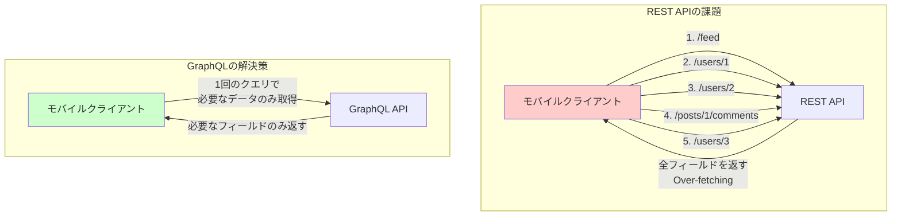
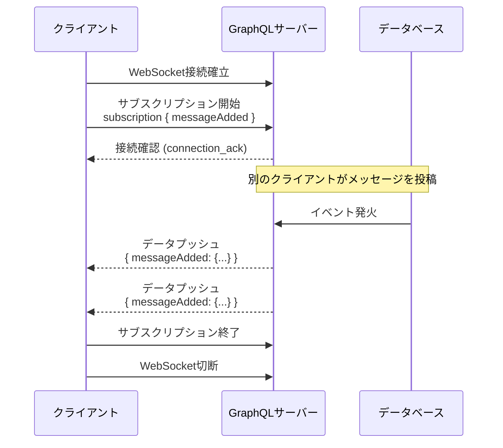
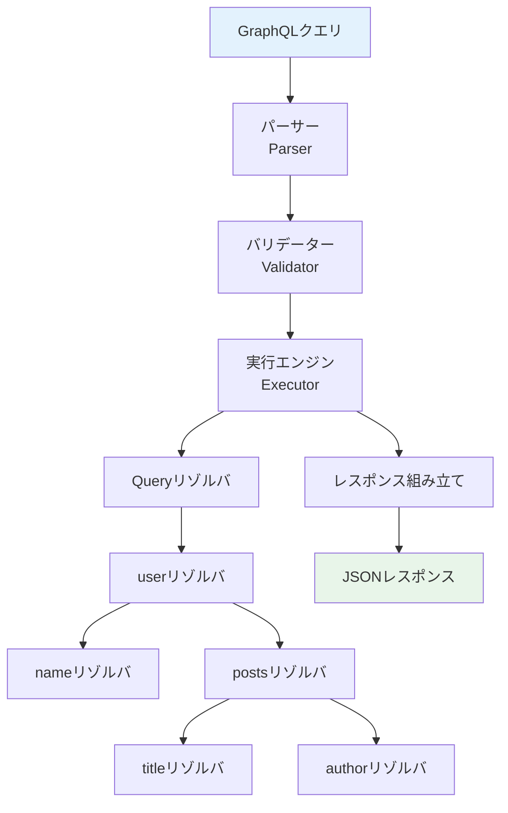
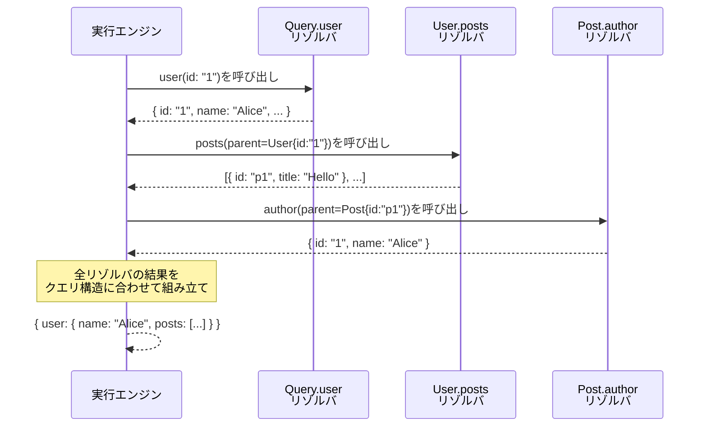
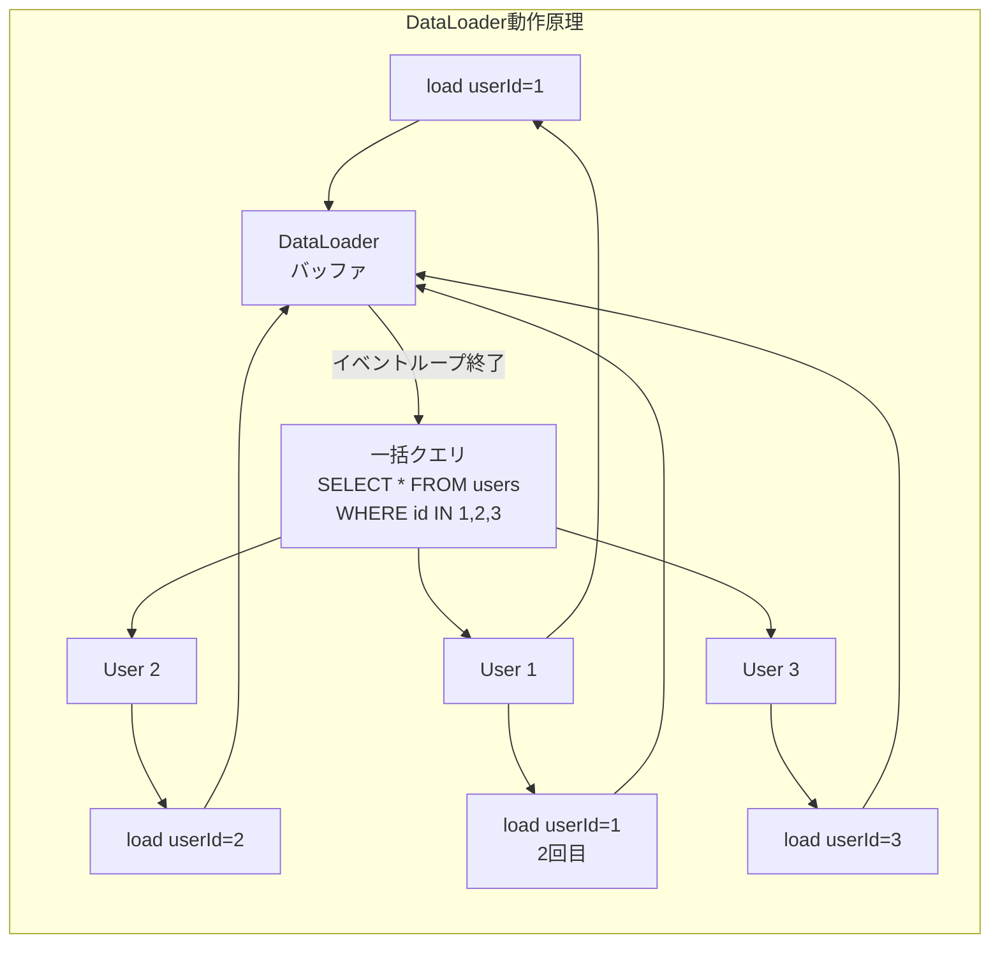
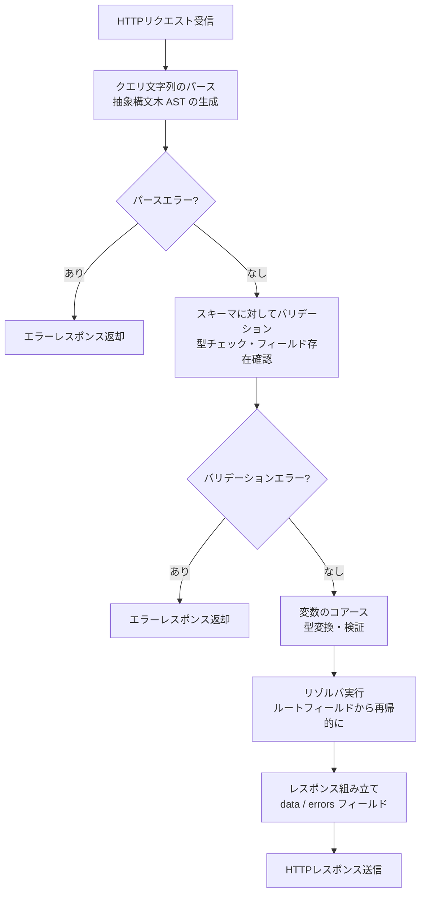
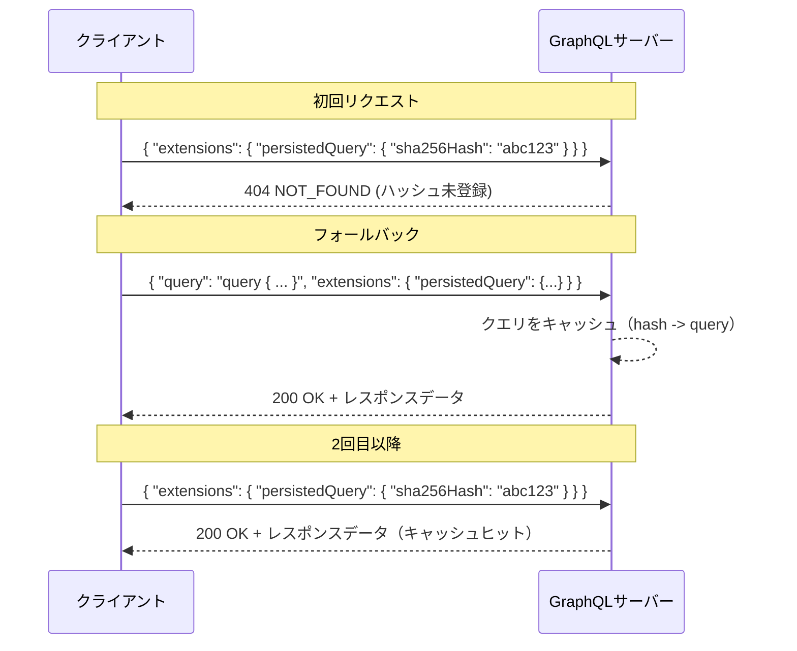
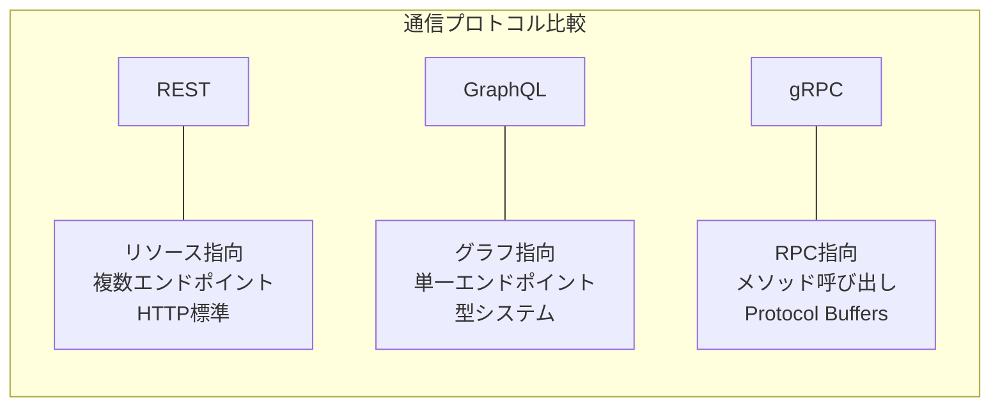
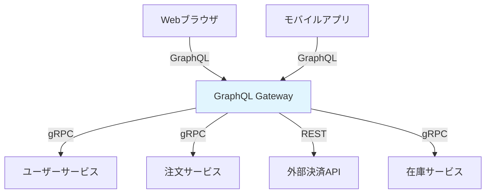
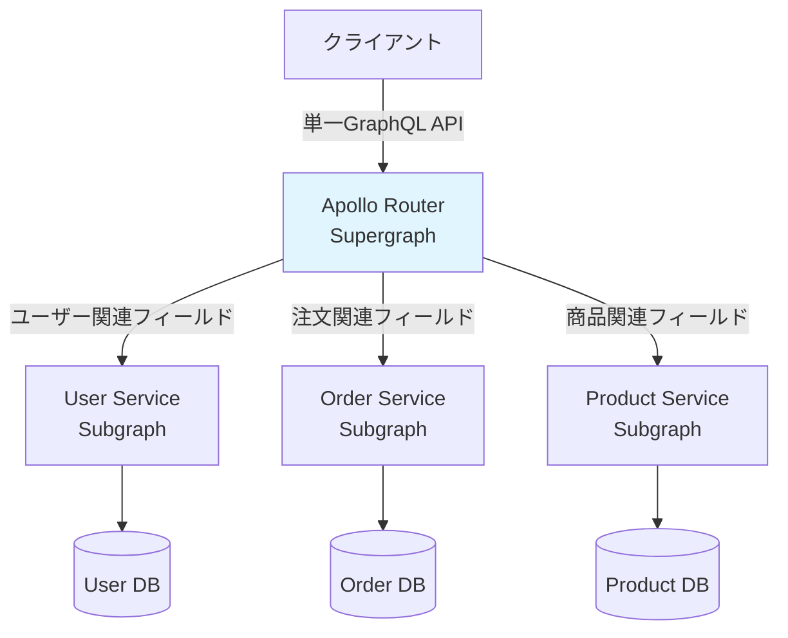

# GraphQL

## 1. 歴史的背景

### 1.1 Facebookが直面した課題

GraphQLの誕生は2012年、Facebookのモバイルアプリ開発チームが抱えた深刻な課題から始まる。当時FacebookはiOSアプリを大規模にリニューアルしようとしていたが、既存のRESTful APIがモバイルクライアントの要求に応えられないという壁にぶつかった。

具体的には、Facebookのニュースフィード画面を例に取ると問題の深刻さがわかる。ニュースフィードには投稿、投稿者のプロフィール情報、「いいね」の数、コメント、コメントした人のプロフィール、シェア情報など、複数のリソースが複雑に絡み合っている。当時のREST APIでは、これらの情報を取得するために次のような複数のリクエストが必要だった。

- `/feed` でニュースフィードの投稿リストを取得
- 各投稿に対して `/users/{id}` で投稿者情報を取得
- 各投稿に対して `/posts/{id}/comments` でコメントを取得
- 各コメントに対して `/users/{id}` でコメント投稿者情報を取得

このアプローチには根本的な問題がある。モバイルネットワーク環境ではリクエスト数の増加が直接レイテンシに響く。3G回線時代、複数のHTTPリクエストを連鎖させることは体験を著しく損なった。

Lee Byron、Nick Schrock、Dan Schaferの3名を中心とするFacebookのエンジニアチームは、この問題を解決するための新しいクエリ言語とランタイムの設計に着手した。2015年、ReactのオープンソースリリースとともにGraphQLが公開され、翌2016年に安定版仕様がリリースされた。現在はGraphQL Foundationがlinux Foundationの傘下でプロジェクトを維持している。

### 1.2 RESTアーキテクチャの構造的課題

GraphQLが解決しようとした問題は、REST APIの設計上の本質的な制約に起因する。

**Over-fetching（過剰取得）の問題**

RESTのエンドポイントは固定されたレスポンス構造を返す。例えば `/users/{id}` エンドポイントはユーザーの全フィールド（名前、メールアドレス、生年月日、住所、プロフィール画像URL、フォロワー数など）を返す。しかし、ユーザー一覧画面では名前とプロフィール画像URLだけが必要なケースがほとんどだ。不要なデータを大量に転送することになり、帯域幅の無駄遣いとなる。

**Under-fetching（過少取得）の問題**

逆に、1回のリクエストで必要なデータが揃わないケースもある。前述のニュースフィードの例がこれにあたる。「n+1リクエスト問題」とも呼ばれ、リストの取得後にリストの各要素の詳細を取得するために追加リクエストが必要になる状況である。

**クライアントの多様化への対応困難**

Webブラウザ、モバイルアプリ（iOS/Android）、スマートウォッチ、テレビなど、クライアントが多様化する中で、それぞれのクライアントが必要とするデータ量や構造は異なる。RESTではクライアントごとに専用エンドポイントを用意するか（BFF: Backend for Frontend パターン）、汎用的なエンドポイントに甘んじるかという選択を迫られた。



**APIバージョニングの複雑さ**

REST APIでは機能追加や変更の際に `/v1/`, `/v2/` といったバージョン管理が必要になることが多い。異なるクライアントが異なるバージョンを使うことで、APIの維持コストが指数関数的に増大する。GraphQLはスキーマの進化（Evolution）という概念でこの問題に対処する。新フィールドを追加しても既存のクエリは壊れないため、バージョニングが不要になる。

### 1.3 GraphQL以前の試みとの比較

REST以外にも、この問題に取り組もうとした先人たちの試みがあった。OData（Open Data Protocol）はMicrosoftが提唱したクエリ可能なRESTエンドポイントの規格だが、URLベースのクエリ構文が複雑で普及しなかった。Falcor（Netflixが開発）はGraphQLとほぼ同時期に同様の問題を解決しようとしたが、JSON Graphという独自のデータモデルが理解しにくく、GraphQLほど広まらなかった。

GraphQLが成功した理由の一つは、その設計の明快さにある。「クライアントが必要なデータを宣言的に指定し、サーバーはその宣言通りのデータを返す」というシンプルなメンタルモデルが、開発者に受け入れられた。

## 2. GraphQLの基本概念

### 2.1 スキーマ定義言語（SDL）

GraphQLはスキーマを中心に設計されている。スキーマはAPIが提供するデータの「契約書」であり、クライアントとサーバーの間の合意を定義する。スキーマはGraphQL SDL（Schema Definition Language）を使って記述される。

```graphql
# Define the User type
type User {
  id: ID!
  name: String!
  email: String!
  age: Int
  posts: [Post!]!
  createdAt: String!
}

# Define the Post type
type Post {
  id: ID!
  title: String!
  body: String!
  author: User!
  tags: [String!]!
  publishedAt: String
  comments: [Comment!]!
}

# Define the Comment type
type Comment {
  id: ID!
  body: String!
  author: User!
  post: Post!
  createdAt: String!
}
```

### 2.2 型システム

GraphQLの強力さの核心は静的型システムにある。スキーマで定義されたすべてのフィールドには型があり、この型情報をベースに強力なツールサポートが実現される。

**スカラー型（Scalar Types）**

GraphQLには5つの組み込みスカラー型がある。

| 型 | 説明 |
|----|------|
| `Int` | 符号付き32ビット整数 |
| `Float` | 符号付き倍精度浮動小数点数 |
| `String` | UTF-8文字列 |
| `Boolean` | true/false |
| `ID` | 一意な識別子（文字列として表現） |

カスタムスカラー型を定義することも可能だ。

```graphql
# Custom scalar types for Date and URL
scalar DateTime
scalar URL
scalar JSON
```

**Non-null修飾子（!）**

型の後ろに `!` を付けることで、そのフィールドが `null` を返さないことを宣言できる。

- `String` → null許可の文字列
- `String!` → 必ず文字列を返す（null不可）
- `[String]` → null許可の文字列のリスト（リスト自体もnull許可）
- `[String!]!` → 必ずnullでない文字列のリスト（リスト自体もnull不可）

**インターフェース（Interface）**

```graphql
# Common interface for content items
interface Node {
  id: ID!
}

# Interface for all content types
interface Searchable {
  title: String!
  description: String
}

type Article implements Node & Searchable {
  id: ID!
  title: String!
  description: String
  content: String!
}

type Product implements Node & Searchable {
  id: ID!
  title: String!
  description: String
  price: Float!
}
```

**ユニオン型（Union）**

ユニオン型は、複数の型のいずれかを返すフィールドを定義するために使用する。インターフェースと異なり、共通フィールドを持つ必要がない。

```graphql
# Union type for search results
union SearchResult = Article | Product | User

type Query {
  search(query: String!): [SearchResult!]!
}
```

**列挙型（Enum）**

```graphql
# Enum for order status
enum OrderStatus {
  PENDING
  PROCESSING
  SHIPPED
  DELIVERED
  CANCELLED
}

# Enum for sort order
enum SortOrder {
  ASC
  DESC
}
```

**入力型（Input）**

ミューテーション引数などに使用する専用の型である。通常の型と異なり、クエリに使用できない。

```graphql
# Input type for creating a user
input CreateUserInput {
  name: String!
  email: String!
  password: String!
  age: Int
}

# Input type for pagination
input PaginationInput {
  first: Int
  after: String
  last: Int
  before: String
}
```

### 2.3 クエリ（Query）

クエリはGraphQLにおける読み取り操作を定義する。RESTのGETメソッドに相当する。

```graphql
# Root query type definition
type Query {
  user(id: ID!): User
  users(pagination: PaginationInput): UserConnection!
  post(id: ID!): Post
  posts(authorId: ID, pagination: PaginationInput): PostConnection!
  search(query: String!): [SearchResult!]!
}
```

クライアントはこのクエリ型を通じてデータを要求する。

```graphql
# Client query - requesting only needed fields
query GetUserProfile($userId: ID!) {
  user(id: $userId) {
    id
    name
    email
    posts {
      id
      title
      publishedAt
    }
  }
}
```

**フラグメント（Fragment）**

フラグメントは再利用可能なフィールドセットを定義する仕組みである。

```graphql
# Reusable fragment for user data
fragment UserFields on User {
  id
  name
  email
}

# Query using fragments
query GetFeed {
  posts {
    id
    title
    author {
      ...UserFields
    }
    comments {
      id
      body
      author {
        ...UserFields
      }
    }
  }
}
```

**インラインフラグメントとユニオン型**

ユニオン型やインターフェース型のフィールドを展開するために、インラインフラグメントを使用する。

```graphql
query Search($query: String!) {
  search(query: $query) {
    ... on Article {
      title
      content
    }
    ... on Product {
      title
      price
    }
    ... on User {
      name
      email
    }
  }
}
```

### 2.4 ミューテーション（Mutation）

ミューテーションはデータの変更操作を定義する。RESTのPOST/PUT/PATCH/DELETEに相当する。

```graphql
# Root mutation type definition
type Mutation {
  createUser(input: CreateUserInput!): CreateUserPayload!
  updateUser(id: ID!, input: UpdateUserInput!): UpdateUserPayload!
  deleteUser(id: ID!): DeleteUserPayload!
  createPost(input: CreatePostInput!): CreatePostPayload!
}

# Payload types for mutations
type CreateUserPayload {
  user: User
  errors: [UserError!]!
}

type UserError {
  field: String
  message: String!
}
```

ミューテーション呼び出しの例を示す。

```graphql
# Creating a new user
mutation CreateUser($input: CreateUserInput!) {
  createUser(input: $input) {
    user {
      id
      name
      email
    }
    errors {
      field
      message
    }
  }
}
```

ミューテーションはクエリと異なり、**逐次実行**が保証される。複数のミューテーションを1つのリクエストに含めた場合、宣言された順序で実行される（クエリは並列実行される可能性がある）。

### 2.5 サブスクリプション（Subscription）

サブスクリプションはリアルタイムイベントのために設計された操作型である。WebSocketなどの双方向通信チャネルを通じて、サーバーからクライアントにデータをプッシュする。

```graphql
# Root subscription type
type Subscription {
  messageAdded(channelId: ID!): Message!
  userStatusChanged(userId: ID!): UserStatus!
  orderUpdated(orderId: ID!): Order!
}

# Client subscription
subscription WatchMessages($channelId: ID!) {
  messageAdded(channelId: $channelId) {
    id
    body
    author {
      id
      name
    }
    createdAt
  }
}
```



## 3. 実行エンジン

### 3.1 リゾルバ（Resolver）

GraphQLの実行エンジンの核心はリゾルバ関数にある。リゾルバとは、スキーマの各フィールドがどのようにデータを取得するかを定義する関数である。



リゾルバは以下の4つの引数を受け取る。

```typescript
type Resolver<TParent, TArgs, TContext, TReturn> = (
  parent: TParent,   // Parent object (result from parent resolver)
  args: TArgs,       // Arguments passed to the field
  context: TContext, // Shared context (e.g., database connection, user session)
  info: GraphQLResolveInfo // Query information (field name, return type, etc.)
) => TReturn | Promise<TReturn>;
```

実際のリゾルバ実装の例を見てみよう。

```typescript
const resolvers = {
  Query: {
    // Resolver for the user field
    user: async (parent, { id }, context) => {
      return context.db.users.findById(id);
    },

    // Resolver for the posts field
    posts: async (parent, { pagination }, context) => {
      return context.db.posts.findAll({ pagination });
    },
  },

  User: {
    // Resolver for the posts field of User type
    // This runs for each user object
    posts: async (user, args, context) => {
      return context.db.posts.findByAuthorId(user.id);
    },
  },

  Post: {
    // Resolver for the author field of Post type
    author: async (post, args, context) => {
      return context.db.users.findById(post.authorId);
    },
  },

  Mutation: {
    // Resolver for createUser mutation
    createUser: async (parent, { input }, context) => {
      try {
        const user = await context.db.users.create(input);
        return { user, errors: [] };
      } catch (error) {
        return { user: null, errors: [{ message: error.message }] };
      }
    },
  },
};
```

**デフォルトリゾルバ**

フィールドに対してリゾルバが明示的に定義されていない場合、GraphQLは「デフォルトリゾルバ」を使用する。デフォルトリゾルバは、親オブジェクトの同名プロパティを返すだけの動作をする。

```typescript
// Default resolver behavior (implicit)
const defaultResolver = (parent, args, context, info) => {
  return parent[info.fieldName];
};
```

このため、データベースから取得したオブジェクトのフィールド名とスキーマのフィールド名が一致している場合は、リゾルバを省略できる。

### 3.2 リゾルバチェーンと実行フロー

GraphQLの実行エンジンは、クエリを解析してリゾルバを階層的に呼び出す。以下のクエリを例に実行フローを追ってみよう。

```graphql
query {
  user(id: "1") {
    name
    posts {
      title
      author {
        name
      }
    }
  }
}
```



### 3.3 N+1問題とDataLoader

リゾルバの素朴な実装には、N+1クエリ問題という落とし穴がある。

投稿リストとその各投稿の著者を取得するクエリを考えてみよう。

```graphql
query {
  posts {
    title
    author {
      name
    }
  }
}
```

投稿が100件ある場合、素朴な実装では以下のクエリが発行される。

1. `SELECT * FROM posts` （1件）
2. `SELECT * FROM users WHERE id = 1` （著者1を取得）
3. `SELECT * FROM users WHERE id = 2` （著者2を取得）
4. ... （100回繰り返し）

合計101回のデータベースクエリが発行される。これが「N+1問題」である。

**DataLoaderによる解決**

FacebookがオープンソースとしてリリースしたDataLoaderライブラリは、この問題をバッチ処理と遅延評価で解決する。

```typescript
import DataLoader from "dataloader";

// Create a DataLoader for users
const userLoader = new DataLoader(async (userIds: readonly string[]) => {
  // Batch load users in one query
  const users = await db.users.findByIds([...userIds]);

  // Return users in the same order as the requested IDs
  return userIds.map(id => users.find(user => user.id === id) || null);
});

const resolvers = {
  Post: {
    // Using DataLoader instead of direct DB call
    author: async (post, args, context) => {
      return context.loaders.user.load(post.authorId);
    },
  },
};
```

DataLoaderは以下の2つの仕組みで動作する。

**バッチング（Batching）**: 同一イベントループのティック内で呼ばれたすべての `load()` 呼び出しをまとめ、1回のバッチ関数呼び出しに変換する。100個の `userLoader.load(id)` 呼び出しは、1回の `batchFunction([id1, id2, ..., id100])` 呼び出しになる。

**キャッシング（Caching）**: 同じリクエスト内で同じキーが複数回要求された場合、最初の結果をキャッシュして再利用する。リクエストをまたぐキャッシュは行わないため、データの一貫性が保たれる。



### 3.4 クエリの実行ライフサイクル

GraphQLサーバーがリクエストを処理する際の完全なライフサイクルを理解することは重要だ。



## 4. スキーマ設計のベストプラクティス

### 4.1 Relay仕様

RelayはFacebookが開発したGraphQLクライアントライブラリであり、スキーマ設計に関するいくつかの規約を定義している。これらの規約は、Relayを使用しないプロジェクトでも広く採用されており、GraphQLスキーマ設計のベストプラクティスとして定着している。

**グローバルオブジェクト識別（Node Interface）**

すべてのオブジェクトはグローバルで一意なIDを持ち、`Node` インターフェースを実装することが推奨される。

```graphql
# Global interface for all identifiable objects
interface Node {
  id: ID!
}

type User implements Node {
  id: ID!
  name: String!
}

type Post implements Node {
  id: ID!
  title: String!
}

type Query {
  # Enables fetching any object by its global ID
  node(id: ID!): Node
}
```

このIDはしばしばBase64エンコードされた `"typename:databaseId"` の形式で表現される。例えばUserのID 123は `"VXNlcjoxMjM="` （`User:123` のBase64エンコード）となる。

**Connectionパターンによるページネーション**

Relay仕様はカーソルベースのページネーションのためのConnectionパターンを定義している。

```graphql
# Connection pattern for paginated lists
type UserConnection {
  edges: [UserEdge]
  pageInfo: PageInfo!
  totalCount: Int!
}

type UserEdge {
  node: User!
  cursor: String!
}

type PageInfo {
  hasNextPage: Boolean!
  hasPreviousPage: Boolean!
  startCursor: String
  endCursor: String
}

type Query {
  users(
    first: Int
    after: String
    last: Int
    before: String
  ): UserConnection!
}
```

クライアントはこのように使用する。

```graphql
# Forward pagination example
query GetUsers($after: String) {
  users(first: 10, after: $after) {
    edges {
      node {
        id
        name
      }
      cursor
    }
    pageInfo {
      hasNextPage
      endCursor
    }
  }
}
```

カーソルベースページネーションはオフセットベース（`page=2&limit=10`）と比べて、データが追加・削除されても重複や欠損が生じないという利点がある。

### 4.2 入力型の設計

ミューテーション引数のまとめ方にもベストプラクティスがある。

```graphql
# Recommended: Use input types with explicit payload types
type Mutation {
  createPost(input: CreatePostInput!): CreatePostPayload!
}

input CreatePostInput {
  title: String!
  body: String!
  tags: [String!]!
  publishedAt: String
}

type CreatePostPayload {
  post: Post
  errors: [UserError!]!
}

type UserError {
  field: [String!]
  message: String!
}
```

フィールドレベルのエラーを構造化した `UserError` 型として返すパターンは、クライアントがフォームバリデーションエラーを表示しやすくするという利点がある。HTTPレベルのエラー（400/500系ステータスコード）ではなく、GraphQLのデータとしてエラーを返す点が特徴的だ。

### 4.3 命名規約

GraphQLスキーマの命名規約には広く受け入れられたものがある。

- **型名**: PascalCase（例: `UserProfile`, `BlogPost`）
- **フィールド名・引数名**: camelCase（例: `firstName`, `createdAt`）
- **列挙値**: SCREAMING_SNAKE_CASE（例: `ORDER_STATUS_PENDING`）
- **入力型**: 動詞+名詞+Input（例: `CreateUserInput`, `UpdatePostInput`）
- **ペイロード型**: 動詞+名詞+Payload（例: `CreateUserPayload`）

### 4.4 スキーマのバージョニングと進化

GraphQLの大きな利点の一つが、後方互換性を保ちながらスキーマを進化させられることだ。

```graphql
# Deprecation example - keeping old field while adding new one
type User {
  # @deprecated(reason: "Use 'displayName' instead")
  name: String! @deprecated(reason: "Use 'displayName' instead")
  displayName: String!
  email: String!
}
```

フィールドを削除する場合は、まず`@deprecated`ディレクティブでマークし、クライアントが新フィールドに移行した後に削除するという段階的なアプローチが推奨される。

## 5. 実装と運用

### 5.1 主要な実装ライブラリ

**サーバーサイド**

| ライブラリ | 言語/フレームワーク | 特徴 |
|-----------|-----------------|------|
| Apollo Server | Node.js | 最も広く使われているGraphQLサーバー |
| graphql-yoga | Node.js | 軽量で設定が少ない |
| Strawberry | Python | デコレータベースのPython向け |
| graphql-ruby | Ruby | Rails向けのフル機能ライブラリ |
| graphene | Python | Django/Flaskとの統合が容易 |
| Hot Chocolate | .NET | C#向けの高機能ライブラリ |
| gqlgen | Go | コード生成ベースのGoライブラリ |

**クライアントサイド**

| ライブラリ | 特徴 |
|-----------|------|
| Apollo Client | React/Vueなど向け。キャッシュ機能が強力 |
| Relay | React向け。Connectionパターンを前提とした設計 |
| urql | 軽量でシンプルなReact向けクライアント |
| SWR/TanStack Query | GraphQL専用ではないが組み合わせて使える |

### 5.2 Apollo Serverの実装例

```typescript
import { ApolloServer } from "@apollo/server";
import { startStandaloneServer } from "@apollo/server/standalone";
import { typeDefs } from "./schema";
import { resolvers } from "./resolvers";
import { createContext } from "./context";

// Initialize Apollo Server
const server = new ApolloServer({
  typeDefs,
  resolvers,
  // Enable introspection in development only
  introspection: process.env.NODE_ENV !== "production",
  plugins: [
    // Logging plugin for production
    ApolloServerPluginUsageReporting({
      sendVariableValues: { none: true },
    }),
  ],
});

const { url } = await startStandaloneServer(server, {
  context: async ({ req }) => createContext(req),
  listen: { port: 4000 },
});

console.log(`Server ready at: ${url}`);
```

### 5.3 パフォーマンス最適化

**クエリの自動永続化（Automatic Persisted Queries）**

大きなGraphQLクエリ文字列は毎回リクエストボディに含める必要がなく、ハッシュ値で参照する仕組みを利用できる。



**レスポンスキャッシング**

GraphQLはRESTと異なり、URLベースのキャッシングが難しい（すべてのリクエストが同じエンドポイントに来るため）。対策として以下の方法がある。

1. **フィールドレベルのキャッシュディレクティブ**: Apollo Serverでは `@cacheControl` ディレクティブでキャッシュのヒントを指定できる。

```graphql
# Cache control directives
type Query {
  # Cache for 60 seconds, shared cache (CDN-cacheable)
  publicData: PublicData @cacheControl(maxAge: 60, scope: PUBLIC)
  # No caching for user-specific data
  userData: UserData @cacheControl(maxAge: 0, scope: PRIVATE)
}
```

2. **Redis等を使ったデータソースキャッシュ**: リゾルバ内でキャッシュレイヤーを挟む。

```typescript
class UserDataSource {
  async findById(id: string) {
    // Check Redis cache first
    const cached = await redis.get(`user:${id}`);
    if (cached) return JSON.parse(cached);

    // Fetch from database
    const user = await db.users.findById(id);

    // Store in cache for 5 minutes
    await redis.setex(`user:${id}`, 300, JSON.stringify(user));
    return user;
  }
}
```

3. **CDNキャッシング**: クエリを`GET`リクエストで送信することでCDNのキャッシングを活用できる（Automatic Persisted Queriesと組み合わせることが多い）。

**クエリの複雑さ分析**

クライアントが意図せず（または意図的に）高コストなクエリを発行するのを防ぐため、クエリの複雑さを事前に分析して上限を設けることができる。

```typescript
import { createComplexityLimitRule } from "graphql-query-complexity";

const server = new ApolloServer({
  typeDefs,
  resolvers,
  validationRules: [
    // Reject queries with complexity score over 100
    createComplexityLimitRule(100, {
      scalarCost: 1,         // Scalar fields cost 1
      objectCost: 2,         // Object fields cost 2
      listFactor: 10,        // List fields multiply cost by 10
    }),
  ],
});
```

## 6. セキュリティ考慮事項

### 6.1 クエリ深度制限

GraphQLのスキーマが循環参照を含む場合（User → Post → User のような関係）、悪意あるクライアントが無限にネストしたクエリを送信できてしまう。

```graphql
# Potentially malicious deeply nested query
query {
  user(id: "1") {
    posts {
      author {
        posts {
          author {
            posts {
              # ... infinitely nested
            }
          }
        }
      }
    }
  }
}
```

これを防ぐには、クエリの最大深度を制限する。

```typescript
import { depthLimit } from "graphql-depth-limit";

const server = new ApolloServer({
  typeDefs,
  resolvers,
  validationRules: [
    depthLimit(10), // Maximum query depth: 10 levels
  ],
});
```

### 6.2 クエリコスト分析

深度制限だけでは不十分な場合がある。深度が浅くても幅が広いクエリは高コストになりうる。

```graphql
# Wide but shallow malicious query
query {
  users(first: 1000) {
    id
    name
    email
    posts(first: 100) {
      id
      title
      comments(first: 100) {
        id
        body
      }
    }
  }
}
```

このクエリは1000ユーザー × 100投稿 × 100コメント = 最大10,000,000件のデータを要求する。コスト分析（Query Cost Analysis）によりクエリのコストを計算し、上限を超えたリクエストを拒否する。

### 6.3 イントロスペクションの制御

GraphQLには`__schema`や`__type`というイントロスペクションクエリがあり、スキーマ全体を知ることができる。開発時には便利だが、本番環境では攻撃者にAPI構造を開示することになるため、無効化を検討すべきだ。

```typescript
const server = new ApolloServer({
  typeDefs,
  resolvers,
  // Disable introspection in production
  introspection: process.env.NODE_ENV !== "production",
});
```

ただし、公開APIとしてGraphQLを提供している場合（例: GitHub API）は、イントロスペクションを有効にしていることも多い。

### 6.4 認証と認可

GraphQLではHTTPレベルの認証（JWTやセッションなど）はミドルウェアで行い、フィールドレベルの認可はリゾルバで行うのが一般的だ。

```typescript
// Authentication middleware (HTTP level)
const context = async ({ req }: { req: Request }) => {
  const token = req.headers.authorization?.split("Bearer ")[1];
  const user = token ? await verifyJWT(token) : null;

  return {
    db,
    loaders: createLoaders(db),
    currentUser: user, // Available in all resolvers
  };
};

// Authorization in resolver (field level)
const resolvers = {
  Query: {
    adminData: (parent, args, context) => {
      // Check if user has admin role
      if (!context.currentUser || context.currentUser.role !== "ADMIN") {
        throw new GraphQLError("Unauthorized", {
          extensions: { code: "UNAUTHORIZED" },
        });
      }
      return fetchAdminData();
    },
  },
};
```

**ディレクティブベースの認可**

スキーマ全体で一貫した認可を実装するために、カスタムディレクティブを使う方法もある。

```graphql
# Custom authorization directive
directive @auth(requires: Role!) on FIELD_DEFINITION

enum Role {
  USER
  ADMIN
  SUPER_ADMIN
}

type Query {
  publicData: PublicData
  userData: UserData @auth(requires: USER)
  adminData: AdminData @auth(requires: ADMIN)
}
```

### 6.5 レート制限

GraphQLは単一エンドポイントなのでIPベースのレート制限だけでは不十分な場合がある。クエリの複雑さに基づくレート制限（例: 1分間のコスト上限を1000に設定）と組み合わせることが有効だ。

### 6.6 エラーハンドリングとセキュリティ

本番環境ではエラーメッセージにスタックトレースや内部情報を含めないよう注意が必要だ。

```typescript
const server = new ApolloServer({
  typeDefs,
  resolvers,
  formatError: (formattedError, error) => {
    // Log the full error internally
    logger.error(error);

    // Return sanitized error to client in production
    if (process.env.NODE_ENV === "production") {
      return {
        message: "Internal server error",
        extensions: { code: formattedError.extensions?.code },
      };
    }

    return formattedError;
  },
});
```

## 7. REST・gRPCとの比較と使い分け

### 7.1 三者の特性比較



| 比較項目 | REST | GraphQL | gRPC |
|---------|------|---------|------|
| プロトコル | HTTP/1.1, HTTP/2 | HTTP/1.1, HTTP/2 | HTTP/2 |
| データ形式 | JSON, XML等 | JSON | Protocol Buffers（バイナリ） |
| スキーマ定義 | OpenAPI (任意) | SDL (必須) | Protocol Buffers (必須) |
| クライアント主導のデータ選択 | 困難 | ネイティブサポート | 困難 |
| リアルタイム通信 | Long polling, SSE | Subscription (WebSocket) | Streaming RPC |
| ブラウザサポート | 優秀 | 優秀 | 要ライブラリ (grpc-web) |
| パフォーマンス | 普通 | 普通〜良好 | 高い |
| ツールサポート | 成熟 | 成熟 | 成熟 |
| 学習コスト | 低い | 中程度 | 中程度 |
| キャッシング | 容易（URL基点） | 工夫が必要 | 困難 |

### 7.2 各アーキテクチャが適しているケース

**RESTが適しているケース**

- シンプルなCRUDアプリケーション
- パブリックAPIとして公開する場合（ブラウザの標準機能だけで利用可能）
- HTTPキャッシュを積極的に活用したい場合
- チームがRESTに慣れており学習コストを最小化したい場合
- ファイルアップロードが主要なユースケースの場合

**GraphQLが適しているケース**

- 多様なクライアント（Web/モバイル/TV等）が同一APIを使う場合
- データ要件がクライアントによって大きく異なる場合
- ネストした関連データを効率的に取得したい場合
- フロントエンド主導の開発チームで、APIの詳細をフロントエンドチームが決めたい場合
- リアルタイム機能（チャット、通知等）も提供する場合
- マイクロサービス群をGraphQL Federationで統合する場合

**gRPCが適しているケース**

- マイクロサービス間の内部通信
- 高スループット・低レイテンシが要求される場合
- Protocol Buffersの厳格な型定義が有益な場合
- ストリーミングAPI（大量データの転送）
- 多言語環境でのコード生成によるクライアント生成

### 7.3 GraphQL + REST + gRPCの共存

現実のシステムでは、これらを組み合わせて使うケースが多い。例えばGraphQL APIをフロントエンド向けのゲートウェイとして使い、バックエンドのマイクロサービス間はgRPCで通信し、レガシーシステムや外部APIとはRESTで統合するというアーキテクチャが一般的だ。



## 8. 将来の展望

### 8.1 GraphQL Federation

マイクロサービスアーキテクチャの普及とともに、GraphQLにも「サービスをまたいだスキーマの統合」という課題が生まれた。Apolloが提唱したGraphQL Federationは、この課題へのアンサーである。

Federationでは、各マイクロサービスが自身の担当するスキーマを定義し、**Supergraph**と呼ばれる統合されたGraphQL APIを形成する。クライアントからはひとつのGraphQL APIとして見え、内部的にはリクエストが適切なサービスにルーティングされる。



```graphql
# User Service defines User type (subgraph 1)
type User @key(fields: "id") {
  id: ID!
  name: String!
  email: String!
}

# Order Service extends User type (subgraph 2)
type User @key(fields: "id") @extends {
  id: ID! @external
  orders: [Order!]!
}

type Order {
  id: ID!
  totalAmount: Float!
  status: OrderStatus!
}
```

Federation v2（2022年リリース）ではオープンな仕様「OpenFederation」として策定が進んでおり、Apollo以外の実装（例: WunderGraph）も互換性を持ちはじめている。

### 8.2 Subscriptionの進化

WebSocketベースのサブスクリプションには、接続管理の複雑さやスケーリングの困難さという問題がある。Server-Sent Events（SSE）をトランスポートとして使う実装や、`graphql-over-http`仕様によるIncrementalDelivery（`@defer`と`@stream`ディレクティブ）の標準化が進んでいる。

```graphql
# @defer directive - receive initial data fast, defer expensive fields
query GetPostWithComments($postId: ID!) {
  post(id: $postId) {
    title
    body
    ... @defer {
      # Defer loading comments (sent after initial response)
      comments {
        id
        body
        author {
          name
        }
      }
    }
  }
}

# @stream directive - stream list items as they become available
query GetPosts {
  posts @stream(initialCount: 3) {
    title
    body
  }
}
```

`@defer`と`@stream`により、GraphQLクライアントは初期ページのレスポンスを素早く受け取り、重いデータは後から受け取るプログレッシブなデータ取得が可能になる。これはHTTP/2のマルチプレキシングと組み合わせることで特に効果的だ。

### 8.3 GraphQLとAI/LLMの統合

近年、LLM（大規模言語モデル）とGraphQLを組み合わせるユースケースが増えている。GraphQLスキーマは明確な型情報を持つため、LLMがAPIを理解してクエリを自動生成するのに適している。

また、GraphQLの宣言的なデータ取得モデルは、RAG（Retrieval-Augmented Generation）システムでのデータソースとしても使いやすい特性を持っている。MCP（Model Context Protocol）などとGraphQLを組み合わせたAIエージェント向けAPIの構築も注目されている。

### 8.4 エコシステムの成熟

GraphQL Foundationは仕様のオープンガバナンスを進めており、`graphql-over-http`仕様の標準化、スキーマレジストリのエコシステム整備、ツールチェーンの充実が続いている。

Persisted Queryの標準化（APQ: Automatic Persisted Queries）、スキーマコンポジションの標準化（OpenFederation/Composite Schema仕様）など、ベンダーロックインを防ぐ取り組みも活発だ。

## まとめ

GraphQLはFacebookが実際の開発現場の課題から生み出したAPIクエリ言語であり、REST APIのOver-fetching/Under-fetching問題を根本から解決する設計思想を持つ。スキーマを中心にした型安全なAPIの定義、クライアントが必要なデータを宣言的に指定できる柔軟性、そしてGraphQL Subscriptionによるリアルタイム通信サポートは、現代のWebアプリケーション開発において大きな価値をもたらす。

一方でGraphQLは、キャッシング戦略の複雑さ、N+1問題への対処（DataLoader）、セキュリティ設定（深度・コスト制限）など、適切に設計・運用するために習得すべきことが多い。RESTやgRPCと比べて「どれが優れているか」という問いに唯一の答えはなく、システムの要件、チームの習熟度、クライアントの多様性を考慮した上で適切な技術を選択することが重要である。

GraphQL Federationによるマイクロサービス統合や、`@defer`/`@stream`によるプログレッシブデータ取得など、GraphQLエコシステムは引き続き進化を続けており、今後もWebAPIの重要な選択肢であり続けるだろう。
