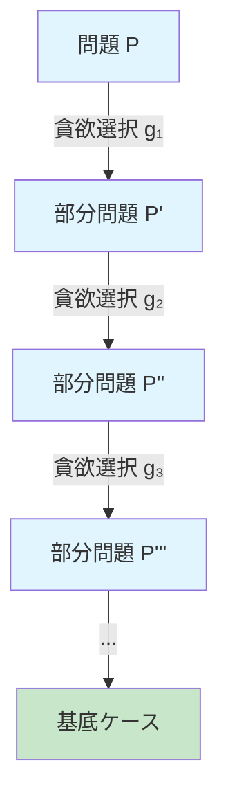
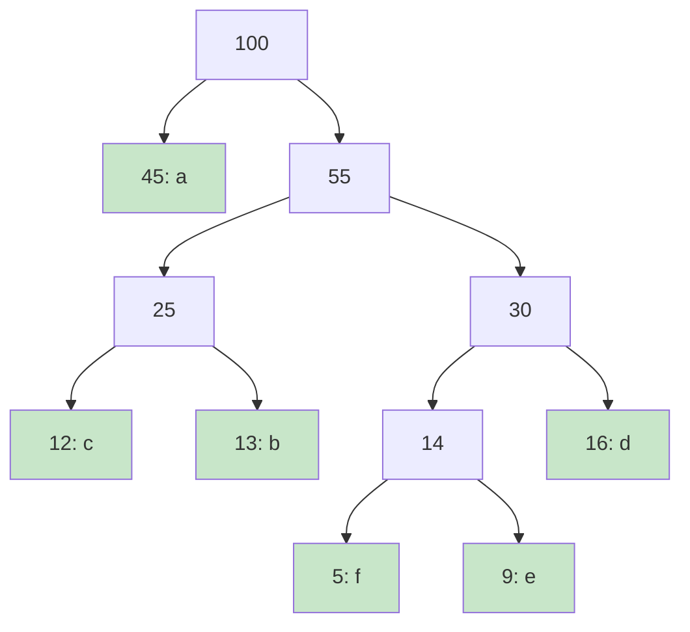
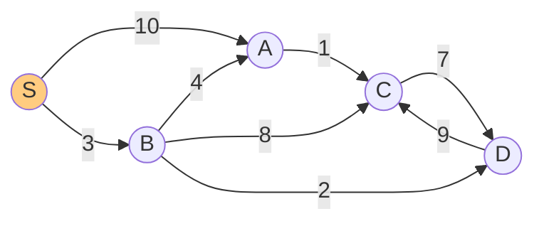
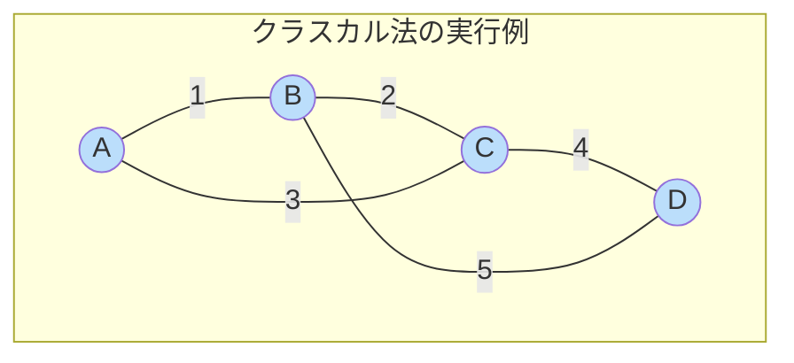
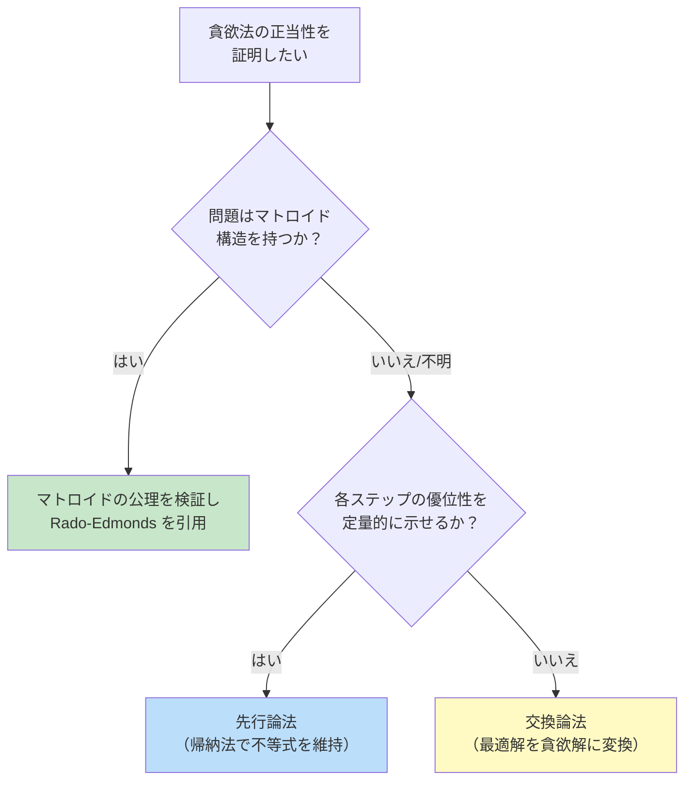

# 貪欲法 — 局所最適の積み重ねで大域最適を掴む

## 1. 貪欲法とは

### 1.1 直観的な理解

**貪欲法**（Greedy Algorithm）とは、問題を解くための各ステップにおいて、その時点で最も良いと思われる選択（局所最適解）を行い、一度行った選択を決して撤回しない方式のアルゴリズム設計パラダイムである。

日常的な比喩で言えば、「目の前にある最も大きい果実を常に選び続ける」戦略である。この戦略が直観的に単純であることは明らかだが、驚くべきことに、ある種の問題に対しては、この「目先の欲張り」が最終的に問題全体の最適解を与える。これが貪欲法の本質的な魅力であり、同時にその適用範囲を限定する性質でもある。

貪欲法の基本的な枠組みを擬似コードで示す。

```
function GreedyAlgorithm(problem):
    solution = empty
    candidates = problem.allCandidates()

    while candidates is not empty and not isSolution(solution):
        // Select the locally best candidate
        best = selectBest(candidates)
        candidates.remove(best)

        // Check if adding this candidate is feasible
        if isFeasible(solution + best):
            solution = solution + best

    return solution
```

この枠組みにおいて、`selectBest` が「貪欲な選択」を行う関数であり、`isFeasible` がその選択が制約を満たすかどうかを判定する関数である。問題ごとに、この2つの関数の定義が異なる。

### 1.2 貪欲法の特徴

貪欲法には、他のアルゴリズム設計パラダイムと比較して、いくつかの際立った特徴がある。

1. **決定の不可逆性**: 一度選択したものは決して取り消さない。動的計画法のように「まだ決定を保留して、後から最適なものを選ぶ」ということをしない。
2. **前方参照の不在**: 将来の選択肢がどうなるかを考慮しない。現在の情報だけで判断する。
3. **計算効率の高さ**: 後戻りや全探索を行わないため、一般に非常に高速である。多くの場合、$O(n \log n)$ や $O(n)$ の時間計算量で済む。
4. **設計の単純さ**: アルゴリズムの設計自体は比較的容易である。ただし、それが正しいことの証明は別問題である。

### 1.3 貪欲法が適用できる条件

貪欲法が最適解を保証するためには、問題が以下の2つの性質を満たす必要がある。

- **最適部分構造**（Optimal Substructure）: 問題の最適解が部分問題の最適解から構成できる
- **貪欲選択性**（Greedy Choice Property）: 局所最適な選択が大域最適な解に含まれる

次節では、この2つの性質について詳しく掘り下げる。

## 2. 最適部分構造と貪欲選択性

### 2.1 最適部分構造（Optimal Substructure）

**最適部分構造**とは、問題全体の最適解が、部分問題の最適解を組み合わせることで得られるという性質である。

形式的に述べると、問題 $P$ の最適解 $S^*$ が部分問題 $P_1, P_2, \ldots, P_k$ の最適解 $S_1^*, S_2^*, \ldots, S_k^*$ を含むとき、$P$ は最適部分構造を持つという。

$$
S^*(P) = f(S^*(P_1), S^*(P_2), \ldots, S^*(P_k))
$$

ここで $f$ は部分問題の解を組み合わせる関数である。

最適部分構造は、動的計画法と貪欲法の両方が共有する性質である。両者を分ける鍵は、次に述べる貪欲選択性の有無にある。

### 2.2 貪欲選択性（Greedy Choice Property）

**貪欲選択性**とは、問題全体の最適解に、局所的に最適な選択（貪欲選択）が必ず含まれるという性質である。

これをもう少し厳密に述べよう。問題 $P$ に対する貪欲選択を $g$ とする。このとき、$P$ の少なくとも1つの最適解が $g$ を含むならば、$P$ は貪欲選択性を持つ。

$$
\exists S^* \in \text{OPT}(P) : g \in S^*
$$

ここで $\text{OPT}(P)$ は $P$ のすべての最適解の集合である。

この性質が成り立つとき、最初の貪欲選択 $g$ を行った後、残りの部分問題 $P'$ を再び貪欲に解けばよい。つまり、問題を前から順に確定していくことができる。



### 2.3 動的計画法との本質的な違い

最適部分構造を持つ問題に対して、動的計画法は**すべての部分問題を解いてから**最適解を組み立てる。一方、貪欲法は**最初に1つの選択を確定し**、残りの部分問題だけを解く。

この違いは、問題が「重複する部分問題」を持つかどうかにも関連する。

| 性質 | 動的計画法 | 貪欲法 |
|:---|:---|:---|
| 最適部分構造 | 必要 | 必要 |
| 貪欲選択性 | 不要 | **必要** |
| 重複部分問題 | 通常あり（だからメモ化が有効） | 通常なし（1つの部分問題に還元） |
| 解法の方向 | ボトムアップまたはトップダウン | トップダウン（前から確定） |
| 計算量 | 部分問題数 $\times$ 各問題の計算量 | 通常は候補のソート + 線形走査 |

### 2.4 貪欲選択性が成り立たない例：0-1 ナップサック問題

0-1 ナップサック問題では、容量 $W$ のナップサックに、重さ $w_i$ と価値 $v_i$ を持つ $n$ 個の品物から選んで詰める。目標は価値の合計を最大化することである。

貪欲に「単位重さあたりの価値 $v_i / w_i$ が最大のものから選ぶ」戦略を考えよう。

> [!WARNING]
> この貪欲戦略は0-1 ナップサック問題では最適解を保証しない。

**反例**: 容量 $W = 50$ で以下の品物があるとする。

| 品物 | 重さ | 価値 | 単位重さあたり価値 |
|:---:|:---:|:---:|:---:|
| A | 10 | 60 | 6.0 |
| B | 20 | 100 | 5.0 |
| C | 30 | 120 | 4.0 |

貪欲法は A（価値60, 重さ10）を選び、次に B（価値100, 重さ20）を選ぶ。残り容量は20なので C（重さ30）は入らない。合計価値は **160**。

しかし、B と C を選べば合計価値は **220** であり、これが最適解である。

このように、0-1 ナップサック問題は最適部分構造を持つが貪欲選択性を持たない。したがって動的計画法を用いる必要がある。

> [!TIP]
> 一方、**分数ナップサック問題**（品物を分割して一部だけ入れてよい場合）では、単位重さあたり価値の降順に品物を選ぶ貪欲法が最適解を与える。品物を分割できるという自由度が貪欲選択性を成立させるのである。

## 3. 活動選択問題（Activity Selection Problem）

### 3.1 問題定義

活動選択問題は、貪欲法の教科書的な例題であり、その構造を理解するのに最適な題材である。

$n$ 個の活動 $a_1, a_2, \ldots, a_n$ が与えられ、各活動 $a_i$ は開始時刻 $s_i$ と終了時刻 $f_i$（$s_i < f_i$）を持つ。2つの活動 $a_i$ と $a_j$ は、$f_i \leq s_j$ または $f_j \leq s_i$ のとき**両立可能**（compatible）であるという。つまり、時間的に重ならないということである。

**目標**: 互いに両立可能な活動の最大集合を見つけること。

### 3.2 貪欲戦略の選択

この問題に対して、いくつかの貪欲戦略が考えられる。

1. **開始時刻が最も早い活動を選ぶ**: 長い活動が先に選ばれて、多くの短い活動を排除してしまう可能性がある。
2. **所要時間が最も短い活動を選ぶ**: 短い活動でも、他の多くの活動と重なっている場合がある。
3. **重なっている活動数が最も少ない活動を選ぶ**: 正しいが計算コストが高い。
4. **終了時刻が最も早い活動を選ぶ**: これが正しい貪欲戦略である。

なぜ終了時刻が最も早い活動を選ぶのが正しいのか。直観的には、最も早く終わる活動を選ぶことで、残りの時間をできるだけ多く確保し、後続の活動を選ぶ余地を最大化するからである。

```mermaid
gantt
    title 活動選択の例
    dateFormat HH:mm
    axisFormat %H:%M

    section 活動群
    活動1 (選択) :done, a1, 00:00, 02:00
    活動2         :a2, 01:00, 04:00
    活動3         :a3, 02:00, 05:00
    活動4 (選択) :done, a4, 03:00, 05:00
    活動5         :a5, 04:00, 07:00
    活動6 (選択) :done, a6, 05:00, 07:00
    活動7         :a7, 06:00, 09:00
    活動8 (選択) :done, a8, 08:00, 10:00
```



### 3.3 アルゴリズム

活動を終了時刻の昇順にソートした後、以下の手順で選択する。

```python
def activity_selection(activities):
    # Sort by finish time
    activities.sort(key=lambda a: a[1])

    selected = [activities[0]]
    last_finish = activities[0][1]

    for i in range(1, len(activities)):
        start, finish = activities[i]
        # Select if compatible with the last selected activity
        if start >= last_finish:
            selected.append(activities[i])
            last_finish = finish

    return selected
```

時間計算量はソートに $O(n \log n)$、選択に $O(n)$ であり、全体で $O(n \log n)$ である。

### 3.4 正当性の証明

活動選択問題における貪欲法の正当性を証明する。

**定理**: 終了時刻が最も早い活動を含む最適解が必ず存在する。

**証明**: 最適解 $S^*$ を1つ取り、$S^*$ に含まれる活動のうち終了時刻が最も早いものを $a_k$ とする。また、全活動の中で終了時刻が最も早いものを $a_1$ とする。

$a_k = a_1$ ならば証明は完了である。

$a_k \neq a_1$ の場合を考える。$f_1 \leq f_k$ であるから、$S^*$ において $a_k$ を $a_1$ に置き換えた集合 $S' = (S^* \setminus \{a_k\}) \cup \{a_1\}$ を考える。$a_1$ は $a_k$ より早く終了するので、$S^*$ において $a_k$ と両立可能であった他のすべての活動は $a_1$ とも両立可能である。よって $S'$ も実行可能な解であり、$|S'| = |S^*|$ であるから $S'$ もまた最適解である。

したがって、終了時刻が最も早い活動 $a_1$ を含む最適解が存在する。$a_1$ を選択した後の残りの部分問題に対しても同様の議論が成り立つので、帰納法により貪欲法全体の正当性が示される。$\blacksquare$

## 4. ハフマン符号（Huffman Coding）

### 4.1 問題の背景

データ圧縮は情報理論の中心的なテーマの一つであり、テキストデータの可逆圧縮において最も基本的な手法が**ハフマン符号**（Huffman Coding）である。1952年に David A. Huffman が MIT の大学院生時代に考案したこの手法は、文字の出現頻度に基づいて可変長の符号を割り当てることで、固定長符号よりも効率的なデータ表現を実現する。

### 4.2 接頭辞符号と最適性

**接頭辞符号**（prefix-free code）とは、いかなる文字の符号語も、他の文字の符号語の接頭辞（先頭部分）にならない符号のことである。この性質により、符号化された列を左から順に読むだけで一意にデコードできる。

文字集合 $C = \{c_1, c_2, \ldots, c_n\}$ があり、各文字 $c_i$ の出現頻度が $f(c_i)$ であるとする。符号語の長さを $l(c_i)$ とすると、符号化されたデータの平均ビット長は次のようになる。

$$
B(T) = \sum_{i=1}^{n} f(c_i) \cdot l(c_i)
$$

この $B(T)$ を最小化する接頭辞符号が**最適接頭辞符号**であり、ハフマン符号はこれを構成する。

### 4.3 ハフマン符号の構成アルゴリズム

ハフマン符号は、ボトムアップに二分木を構築する貪欲アルゴリズムである。

1. 各文字をその頻度をキーとするノードとし、最小ヒープ（優先度付きキュー）に挿入する。
2. ヒープから最小頻度の2つのノードを取り出す。
3. これら2つを子ノードとする新しい内部ノードを作成し、その頻度を2つの子の頻度の和とする。
4. 新しいノードをヒープに挿入する。
5. ヒープに1つのノードだけが残るまで手順2-4を繰り返す。
6. 残った1つのノードが根であり、構築された二分木がハフマン木である。

```python
import heapq

class HuffmanNode:
    def __init__(self, char, freq, left=None, right=None):
        self.char = char
        self.freq = freq
        self.left = left
        self.right = right

    def __lt__(self, other):
        return self.freq < other.freq

def build_huffman_tree(frequencies):
    # Initialize the min-heap with leaf nodes
    heap = [HuffmanNode(char, freq) for char, freq in frequencies.items()]
    heapq.heapify(heap)

    while len(heap) > 1:
        # Extract the two nodes with minimum frequency
        left = heapq.heappop(heap)
        right = heapq.heappop(heap)

        # Merge them into a new internal node
        merged = HuffmanNode(None, left.freq + right.freq, left, right)
        heapq.heappush(heap, merged)

    return heap[0]  # Root of the Huffman tree
```

### 4.4 具体例

以下の文字頻度でハフマン木を構築する。

| 文字 | 頻度 |
|:---:|:---:|
| a | 45 |
| b | 13 |
| c | 12 |
| d | 16 |
| e | 9 |
| f | 5 |

構築過程を視覚化する。



得られるハフマン符号は次のとおりである。

| 文字 | 頻度 | 符号 | ビット長 |
|:---:|:---:|:---:|:---:|
| a | 45 | `0` | 1 |
| b | 13 | `101` | 3 |
| c | 12 | `100` | 3 |
| d | 16 | `111` | 3 |
| e | 9 | `1101` | 4 |
| f | 5 | `1100` | 4 |

平均ビット長は次のようになる。

$$
B = \frac{45 \times 1 + 13 \times 3 + 12 \times 3 + 16 \times 3 + 9 \times 4 + 5 \times 4}{100} = \frac{45 + 39 + 36 + 48 + 36 + 20}{100} = 2.24 \text{ bits}
$$

固定長符号（6文字なので3ビット必要）と比較して、約25%の圧縮が達成されている。

### 4.5 貪欲選択性の直観

ハフマン符号における貪欲選択は「頻度が最小の2つの文字を最も深い位置（最も長い符号語）に配置する」ことである。頻度が低い文字に長い符号語を割り当てることで、平均ビット長への寄与を最小限に抑える。

**補題**: 最適な接頭辞符号に対応する二分木において、頻度が最小の2つの文字は、最も深い階層に兄弟として存在するような最適解が必ず存在する。

この補題は交換論法（exchange argument）によって証明できる。最適な木において最深のノード対が頻度最小の対でないと仮定し、それらを交換することで、平均ビット長が増加しない（むしろ減少するか等しい）ことを示す。

### 4.6 情報理論との接点

シャノンの情報理論によれば、情報源のエントロピー $H$ は次のように定義される。

$$
H = -\sum_{i=1}^{n} p_i \log_2 p_i
$$

ここで $p_i = f(c_i) / \sum_j f(c_j)$ は各文字の出現確率である。ハフマン符号の平均ビット長 $B$ は次の不等式を満たすことが知られている。

$$
H \leq B < H + 1
$$

すなわち、ハフマン符号は文字単位の符号化としてはエントロピーに非常に近い圧縮率を達成する。ただし、文字間の相関を利用するブロック符号化や算術符号を使えば、エントロピーにさらに近づけることが可能である。

## 5. ダイクストラ法（Dijkstra's Algorithm）

### 5.1 問題定義

**単一始点最短経路問題**（Single-Source Shortest Paths, SSSP）: 重み付き有向グラフ $G = (V, E)$ と始点 $s \in V$ が与えられたとき、$s$ から全ての頂点への最短経路の重みを求める。ただし、辺の重みはすべて非負（$w(u, v) \geq 0$ for all $(u, v) \in E$）とする。

### 5.2 アルゴリズムの設計

1959年に Edsger W. Dijkstra が提案したこのアルゴリズムは、貪欲法の傑出した応用例である。

アルゴリズムの核心は次の貪欲選択にある。

> **まだ最短距離が確定していない頂点の中から、暫定距離が最小の頂点を選び、その距離を確定させる。**

この選択が正しいことは、辺の重みが非負であるという条件のもとで保証される。

### 5.3 アルゴリズムの詳細

```python
import heapq

def dijkstra(graph, source):
    # graph: adjacency list {node: [(neighbor, weight), ...]}
    dist = {node: float('inf') for node in graph}
    dist[source] = 0
    # Min-heap: (distance, node)
    pq = [(0, source)]
    visited = set()

    while pq:
        d, u = heapq.heappop(pq)

        # Skip if already finalized
        if u in visited:
            continue
        visited.add(u)

        # Relax edges from u
        for v, w in graph[u]:
            if dist[u] + w < dist[v]:
                dist[v] = dist[u] + w
                heapq.heappush(pq, (dist[v], v))

    return dist
```

### 5.4 実行の流れ

以下のグラフでダイクストラ法の実行を追跡する。



始点を $S$ とする。

| ステップ | 確定頂点 | dist[S] | dist[A] | dist[B] | dist[C] | dist[D] |
|:---:|:---|:---:|:---:|:---:|:---:|:---:|
| 初期 | - | 0 | $\infty$ | $\infty$ | $\infty$ | $\infty$ |
| 1 | S | **0** | 10 | 3 | $\infty$ | $\infty$ |
| 2 | B | 0 | 7 | **3** | 11 | 5 |
| 3 | D | 0 | 7 | 3 | 14 | **5** |
| 4 | A | 0 | **7** | 3 | 8 | 5 |
| 5 | C | 0 | 7 | 3 | **8** | 5 |

各ステップで、暫定距離が最小の頂点を確定させている。これが貪欲選択である。

### 5.5 計算量

データ構造の選択によって計算量が異なる。

| 優先度付きキューの実装 | 計算量 |
|:---|:---|
| 配列（線形探索） | $O(V^2)$ |
| 二分ヒープ | $O((V + E) \log V)$ |
| フィボナッチヒープ | $O(V \log V + E)$ |

密グラフ（$E = \Theta(V^2)$）では配列実装が、疎グラフ（$E = O(V)$）ではヒープ実装が有利である。

### 5.6 正当性の証明

**定理**: ダイクストラ法は、辺の重みがすべて非負のグラフにおいて、正しい最短距離を計算する。

**証明の骨格**: 確定済み頂点の集合を $S$ とし、次の不変条件を帰納法で示す。

> **不変条件**: $S$ に含まれるすべての頂点 $u$ に対して、$\text{dist}[u]$ は $s$ から $u$ への真の最短距離に等しい。

**帰納段階**: 新たに確定させる頂点 $v$ について、$\text{dist}[v]$ が最短距離でないと仮定して矛盾を導く。$s$ から $v$ への真の最短経路 $p$ が存在し、$\delta(s, v) < \text{dist}[v]$ であるとする。経路 $p$ 上で $S$ を最初に離れる辺 $(x, y)$（$x \in S$, $y \notin S$）を考えると、

$$
\delta(s, v) \geq \delta(s, y) = \text{dist}[y]
$$

（最後の等号は $x \in S$ であるため。不等号は辺の重みが非負であることと $y$ が $p$ 上で $v$ より先にあることから。）

ところが、$v$ は $S$ に含まれない頂点の中で $\text{dist}$ が最小のものとして選ばれたので、$\text{dist}[v] \leq \text{dist}[y]$ である。したがって、

$$
\text{dist}[v] \leq \text{dist}[y] = \delta(s, y) \leq \delta(s, v)
$$

一方、$\text{dist}[v] \geq \delta(s, v)$（暫定距離は真の最短距離以上）も明らかであるから、$\text{dist}[v] = \delta(s, v)$ となり矛盾が生じる。$\blacksquare$

> [!CAUTION]
> ダイクストラ法は**負の重みを持つ辺がある場合には正しく動作しない**。負の辺がある場合は、Bellman-Ford 法を用いる必要がある。辺の重みの非負性は、貪欲選択の正当性を支える本質的な条件である。

## 6. マトロイドと貪欲法

### 6.1 マトロイドの定義

貪欲法がなぜ一部の問題で最適解を与えるのかという疑問に対して、最も一般的で美しい回答を与えるのが**マトロイド理論**（matroid theory）である。

**マトロイド**とは、有限集合 $E$ とその部分集合族 $\mathcal{I} \subseteq 2^E$ の対 $M = (E, \mathcal{I})$ で、以下の3つの公理を満たすものである。

1. **空集合条件**: $\emptyset \in \mathcal{I}$
2. **遺伝性**（hereditary property）: $A \in \mathcal{I}$ かつ $B \subseteq A$ ならば $B \in \mathcal{I}$
3. **交換公理**（exchange axiom）: $A, B \in \mathcal{I}$ かつ $|A| < |B|$ ならば、$B \setminus A$ のある元 $x$ が存在して $A \cup \{x\} \in \mathcal{I}$

$\mathcal{I}$ の元を**独立集合**（independent set）と呼ぶ。極大な独立集合を**基**（basis）と呼ぶ。交換公理から、すべての基は同じ濃度を持つことが示される。

### 6.2 マトロイドの例

**グラフィックマトロイド**: 無向グラフ $G = (V, E)$ に対して、$E$ を台集合、辺の部分集合が閉路を含まないとき（すなわち森であるとき）に独立であると定めたマトロイド。この場合、基は全域木に対応する。

**一様マトロイド** $U_{k,n}$: $n$ 元集合 $E$ に対して、高々 $k$ 個の元を含む部分集合を独立集合としたマトロイド。

**線形マトロイド**: ベクトルの集合に対して、一次独立な部分集合を独立集合としたマトロイド。

### 6.3 重み付きマトロイドと貪欲法の最適性

マトロイド $M = (E, \mathcal{I})$ の各元 $e \in E$ に非負の重み $w(e)$ が与えられているとき、最大重みの基を見つける問題を**重み付きマトロイド最適化問題**と呼ぶ。

**定理（Rado-Edmonds の定理）**: マトロイド上の重み付き最適化問題に対して、以下の貪欲アルゴリズムは常に最適解を返す。

```
function MatroidGreedy(M, w):
    // Sort elements by weight in decreasing order
    sort E by w in decreasing order
    A = empty set

    for each e in E (in sorted order):
        if A ∪ {e} ∈ I:
            A = A ∪ {e}

    return A
```

さらに、この逆も成り立つ。

**定理（マトロイドの特徴づけ）**: 遺伝的集合系 $(E, \mathcal{I})$ において、任意の非負重み関数に対して上記の貪欲アルゴリズムが最大重みの独立集合を返すならば、$(E, \mathcal{I})$ はマトロイドである。

つまり、**マトロイドであることと、貪欲法が（任意の重みに対して）最適であることは同値**なのである。これは、貪欲法の適用可能性に対する非常に深い数学的洞察を与える。

### 6.4 最小全域木問題への適用

**クラスカル法**は、グラフィックマトロイド上の重み付き最適化問題の特殊ケースとして理解できる。

1. すべての辺を重みの昇順にソートする。
2. 各辺について、それを追加しても閉路ができないならば（すなわち、独立集合に留まるならば）追加する。



辺を重みの昇順に処理すると、$\{A,B\}$（重み1）、$\{B,C\}$（重み2）、$\{A,C\}$（重み3、閉路ができるので却下）、$\{C,D\}$（重み4）が選択され、重み7の最小全域木が得られる。

この正当性は、グラフィックマトロイドにおける Rado-Edmonds の定理から直ちに従う。

## 7. 貪欲法と動的計画法の比較

### 7.1 設計思想の違い

貪欲法と動的計画法（DP）は、いずれも最適化問題を解くための手法であるが、その設計思想は根本的に異なる。


### 7.2 具体例による比較：コイン問題

**問題**: 金額 $N$ をできるだけ少ない枚数のコインで支払う。使えるコインの額面は $d_1 > d_2 > \cdots > d_k$ の $k$ 種類で、各種類のコインは無限にある。

**貪欲法**: 最大額面のコインからできるだけ多く使う。

日本円やUSドルの標準的な硬貨体系（1, 5, 10, 50, 100, 500）では、この貪欲法が最適解を与える。

しかし、額面が $\{1, 3, 4\}$ で金額が6の場合を考えてみよう。

- **貪欲法**: $4 + 1 + 1 = 6$（3枚）
- **最適解**: $3 + 3 = 6$（2枚）

貪欲法は最適でない。ここで動的計画法が必要になる。

```python
def min_coins_dp(coins, amount):
    # dp[i] = minimum coins needed for amount i
    dp = [float('inf')] * (amount + 1)
    dp[0] = 0

    for i in range(1, amount + 1):
        for coin in coins:
            if coin <= i and dp[i - coin] + 1 < dp[i]:
                dp[i] = dp[i - coin] + 1

    return dp[amount]
```

> [!NOTE]
> コインの額面が $\{1, c, c^2, c^3, \ldots\}$（$c > 1$ の整数のべき乗の体系）である場合、貪欲法は常に最適解を与える。日本の硬貨体系がこの条件に近い構造を持っていることが、日常的に「大きい硬貨から使う」戦略が有効である理由である。

### 7.3 判断の指針

どちらのアプローチを使うべきかの判断指針を以下にまとめる。

| 判断基準 | 貪欲法を検討 | 動的計画法を検討 |
|:---|:---|:---|
| 貪欲選択性 | 証明可能 | 反例が見つかる |
| 重複部分問題 | なし（1つに還元される） | あり |
| 求める計算量 | $O(n \log n)$ 以下 | 多項式時間で十分 |
| 問題構造 | マトロイド的 | DAG上の最適化 |
| 解の探索空間 | 1本の道筋 | 部分問題のテーブル全体 |

### 7.4 共通点と補完関係

両者には重要な共通点もある。

1. **最適部分構造の必要性**: 両者とも問題が最適部分構造を持つことを前提とする。
2. **問題分析の重要性**: いずれの手法でも、問題の構造を深く分析して適用可能性を判断する必要がある。
3. **補完的な関係**: 貪欲法が使えるならそちらが高速だが、使えないなら動的計画法が次の選択肢になる。さらに動的計画法でも困難なら、近似アルゴリズムや分枝限定法を検討する。

## 8. 貪欲法の正当性の証明テクニック

貪欲法を設計すること自体は容易であることが多いが、それが最適解を与えることを証明するのは一般に困難である。以下に、代表的な証明テクニックを紹介する。

### 8.1 交換論法（Exchange Argument）

最も広く使われるテクニックである。証明の骨子は次のとおり。

1. 任意の最適解 $O^*$ を取る。
2. $O^*$ が貪欲解 $G$ と異なると仮定する。
3. $O^*$ の要素を $G$ の要素と1つずつ交換していくことで、解の質が悪化しないことを示す。
4. 最終的に $O^*$ を $G$ に変換でき、$G$ もまた最適であることを結論する。

**テンプレート**:

$O^*$ を最適解、$G$ を貪欲解とする。$O^* \neq G$ なら、$O^*$ に含まれるが $G$ に含まれない要素 $o$ と、$G$ に含まれるが $O^*$ に含まれない要素 $g$ を見つけ、$O^*$ において $o$ を $g$ に置き換えた $O' = (O^* \setminus \{o\}) \cup \{g\}$ が、

- 実行可能解であり、
- $O^*$ と同等以上の価値を持つ

ことを示す。

前述の活動選択問題の証明はこのテクニックの典型例である。

### 8.2 先行論法（Greedy Stays Ahead / Greedy-ahead argument）

貪欲法の各ステップにおいて、貪欲解が任意の最適解よりも「先行している」ことを帰納法で示す手法である。

**テンプレート**:

貪欲解を $G = \{g_1, g_2, \ldots, g_k\}$、任意の最適解を $O^* = \{o_1, o_2, \ldots, o_m\}$ とする。適切な尺度 $\mu$ を定義し、すべての $i$ に対して $\mu(g_i) \leq \mu(o_i)$（あるいは $\geq$）であることを帰納法で示す。これにより $k \geq m$（または解の質に関する不等式）が導かれる。

**活動選択問題への適用**: 貪欲解の $i$ 番目の活動の終了時刻 $f(g_i)$ が、最適解の $i$ 番目の活動の終了時刻 $f(o_i)$ 以下であることを帰納法で示す。

$$
f(g_i) \leq f(o_i) \quad \text{for all } i = 1, 2, \ldots, \min(k, m)
$$

これが成り立てば、最適解が $m$ 個の活動を含むとき、$m$ 番目の活動の終了後にまだ選択可能な活動があるなら、貪欲法はそれも選ぶはずであり、$k \geq m$ が結論される。

### 8.3 構造的帰納法

問題が再帰的な構造を持つ場合、帰納法を直接適用する手法である。

1. **基底ケース**: 最小サイズの問題に対して貪欲法が正しいことを確認する。
2. **帰納段階**: サイズ $n-1$ 以下の問題に対して貪欲法が正しいと仮定する。貪欲選択を行った後の残りの部分問題のサイズは $n-1$ 以下であるから、帰納仮定より部分問題は正しく解かれる。貪欲選択性により、最初の選択を含む最適解が存在するので、全体の解も最適である。

### 8.4 マトロイドによる証明

問題の構造がマトロイドであることを示せれば、Rado-Edmonds の定理から貪欲法の最適性が直ちに従う。この方法は、問題がマトロイド構造を持つことを認識できれば、最も簡潔で強力な証明を与える。

必要な手順:

1. 台集合 $E$ と独立集合族 $\mathcal{I}$ を定義する。
2. 空集合条件、遺伝性、交換公理の3公理を検証する。
3. Rado-Edmonds の定理を引用する。

### 8.5 証明テクニックの使い分け



## 9. 実践的な応用例

### 9.1 区間スケジューリング問題のバリエーション

活動選択問題の発展として、実務でよく現れるバリエーションを紹介する。

#### 9.1.1 重み付き区間スケジューリング

各活動に重み（利益）$v_i$ が付いている場合、互いに両立可能な活動集合の重みの合計を最大化する問題は、一般には貪欲法では解けない。動的計画法が必要になる。

ただし、すべての活動の重みが等しい場合は、通常の活動選択問題に帰着され、貪欲法が適用可能である。

#### 9.1.2 区間彩色問題（Interval Coloring / Interval Partitioning）

$n$ 個の区間（講義やイベント）を、できるだけ少ない数の教室に割り当てる問題。同じ教室に重なる時間帯のイベントは割り当てられない。

**貪欲戦略**: 区間を開始時刻の昇順にソートし、各区間に対して使用可能な教室があればそれを再利用し、なければ新しい教室を開く。

必要な教室数は、任意の時点における同時進行イベントの最大数（**深さ**と呼ぶ）に等しくなり、これは下界でもあるため、貪欲法が最適である。

### 9.2 ジョブスケジューリング（期限付き利益最大化）

$n$ 個のジョブがあり、各ジョブ $j_i$ は期限 $d_i$ と利益 $p_i$ を持つ。各ジョブの実行には単位時間がかかり、期限内に完了したジョブのみ利益を得る。利益の合計を最大化するスケジュールを求める。

**貪欲戦略**: ジョブを利益の降順にソートし、各ジョブに対して期限以前の最も遅い空きスロットに割り当てる。

```python
def job_scheduling(jobs):
    # jobs: list of (profit, deadline)
    # Sort by profit in decreasing order
    jobs.sort(key=lambda j: -j[0])

    max_deadline = max(d for _, d in jobs)
    # slots[t] = assigned job at time t (1-indexed)
    slots = [None] * (max_deadline + 1)

    total_profit = 0
    scheduled = []

    for profit, deadline in jobs:
        # Find the latest available slot before the deadline
        for t in range(min(deadline, max_deadline), 0, -1):
            if slots[t] is None:
                slots[t] = (profit, deadline)
                total_profit += profit
                scheduled.append((profit, deadline, t))
                break

    return total_profit, scheduled
```

この問題はマトロイド構造を持つことが知られており（スケジュール可能なジョブ集合がマトロイドの独立集合をなす）、貪欲法の最適性はマトロイド理論から保証される。

> [!TIP]
> Union-Find（素集合データ構造）を用いると、空きスロットの探索を高速化でき、全体の計算量を $O(n \log n)$（ソート部分が支配的）に抑えることができる。

### 9.3 分数ナップサック問題

前述のとおり、品物を分割して一部だけ入れてよいナップサック問題では、貪欲法が最適解を与える。

```python
def fractional_knapsack(items, capacity):
    # items: list of (value, weight)
    # Sort by value-to-weight ratio in decreasing order
    items.sort(key=lambda x: x[0] / x[1], reverse=True)

    total_value = 0.0
    remaining = capacity

    for value, weight in items:
        if remaining <= 0:
            break
        # Take as much as possible
        take = min(weight, remaining)
        total_value += (take / weight) * value
        remaining -= take

    return total_value
```

### 9.4 データ圧縮における貪欲法

ハフマン符号以外にも、貪欲法はデータ圧縮の様々な場面で使われている。

- **LZ77 / LZ78**: 辞書ベースの圧縮方式で、最長一致文字列を貪欲に探索する。
- **最小冗長符号**: Shannon-Fano 符号もまた、文字をトップダウンに分割する貪欲的な手法である（ただしハフマン符号の方が最適）。

### 9.5 グラフアルゴリズムにおける貪欲法

グラフ理論には、貪欲法が有効な問題が数多く存在する。

#### 9.5.1 プリム法（最小全域木）

クラスカル法に加えて、**プリム法**もまた最小全域木を求める貪欲アルゴリズムである。

1. 任意の頂点を出発点として木 $T$ に加える。
2. $T$ に隣接する辺のうち、$T$ の外の頂点に接続する最小重みの辺を選び、$T$ に加える。
3. すべての頂点が $T$ に含まれるまで繰り返す。

この手法は「カットプロパティ」（cut property）に基づいている。任意のカット（頂点集合の分割）において、カットを横断する最小重みの辺は、何らかの最小全域木に含まれる。

#### 9.5.2 グラフ彩色の貪欲近似

頂点彩色問題（隣接する頂点に異なる色を割り当てる問題）の最小色数を求めることは NP 困難であるが、貪欲法は妥当な近似解を与える。

```python
def greedy_coloring(graph, vertices):
    # Assign colors greedily
    color = {}

    for v in vertices:
        # Find colors used by neighbors
        neighbor_colors = {color[u] for u in graph[v] if u in color}

        # Assign the smallest available color
        c = 0
        while c in neighbor_colors:
            c += 1
        color[v] = c

    return color
```

頂点の処理順序によって結果が大きく変わる。最大次数 $\Delta$ のグラフに対して、貪欲法は高々 $\Delta + 1$ 色で彩色する（Brooks の定理との関連で、これは概ね良い近似である）。

### 9.6 近似アルゴリズムとしての貪欲法

貪欲法が最適解を保証しない場合でも、近似アルゴリズムとして優れた保証を持つことがある。

#### 9.6.1 集合被覆問題（Set Cover Problem）

全体集合 $U$ とその部分集合族 $\mathcal{S} = \{S_1, S_2, \ldots, S_m\}$ が与えられ、$\bigcup_{i=1}^{m} S_i = U$ であるとき、$U$ を被覆する最小個数の部分集合を選ぶ問題。

この問題は NP 困難であるが、「まだ被覆されていない元を最も多くカバーする集合を貪欲に選ぶ」戦略は、$\ln |U| + 1$ 近似比を持つ。

$$
|G| \leq H(|U|) \cdot |O^*| \leq (\ln |U| + 1) \cdot |O^*|
$$

ここで $H(n) = \sum_{i=1}^{n} \frac{1}{i}$ は調和級数（第 $n$ 調和数）であり、$|G|$ は貪欲解のサイズ、$|O^*|$ は最適解のサイズである。

この近似比は、$P \neq NP$ を仮定すると本質的に最善であることが知られている（Dinur-Steurer, 2014）。すなわち、$(1 - \epsilon) \ln |U|$ より良い近似比を達成する多項式時間アルゴリズムは存在しない。

#### 9.6.2 巡回セールスマン問題（TSP）の最近傍法

TSP に対する最も単純な貪欲ヒューリスティックは**最近傍法**（Nearest Neighbor）である。

1. 任意の都市から出発する。
2. まだ訪問していない最も近い都市に移動する。
3. すべての都市を訪問するまで繰り返す。
4. 出発都市に戻る。

最近傍法は最悪ケースで $O(\log n)$ 近似比を持つが、実用的にはしばしば良い解を与える。ただし、三角不等式を満たす場合は、クリストフィデスのアルゴリズム（$3/2$ 近似）のような、より良い保証を持つ手法が存在する。

### 9.7 実務における貪欲法の位置づけ

実務において貪欲法が好まれる場面を整理する。

1. **リアルタイムシステム**: 応答時間の制約が厳しく、動的計画法のような重い計算が許されない場合。ネットワークルーティングにおけるダイクストラ法はこの代表例である。
2. **オンラインアルゴリズム**: 入力が逐次的に到着し、後戻りできない場合。将来の入力が不明な状態で意思決定を行う必要があるため、本質的に貪欲的な手法が求められる。
3. **ヒューリスティックの初期解**: メタヒューリスティクス（遺伝的アルゴリズム、焼きなまし法など）の初期解を貪欲法で生成し、それを改善するアプローチ。
4. **解の質より速度が重要な場面**: 大規模データの処理など、厳密な最適解は不要だが、そこそこ良い解を高速に得たい場合。

## 10. まとめ

貪欲法は、アルゴリズム設計の最も基本的なパラダイムの一つであり、その本質は「局所最適の選択を繰り返すことで大域最適を達成する」というシンプルな原理に集約される。

本記事で見てきた内容を総括する。

- **基本原理**: 各ステップで最善の選択を行い、それを決して覆さない。この単純さゆえに計算効率が高い。
- **適用条件**: 最適部分構造と貪欲選択性の2つの性質が必要。前者は動的計画法と共通だが、後者は貪欲法に固有の要件である。
- **代表的応用**: 活動選択問題、ハフマン符号、ダイクストラ法、最小全域木（クラスカル法、プリム法）など、計算機科学の至るところに現れる。
- **マトロイド理論**: 貪欲法が最適である問題の数学的特徴づけを与える。マトロイド上の重み付き最適化問題に対しては、貪欲法の最適性が保証される。
- **証明テクニック**: 交換論法、先行論法、構造的帰納法、マトロイドによる証明の4つが代表的な手法である。
- **動的計画法との関係**: 貪欲法が適用可能な問題は動的計画法でも解けるが、逆は成り立たない。貪欲法は動的計画法の「特殊ケース」とも言える。
- **近似アルゴリズムとしての価値**: 最適解を保証しない場合でも、集合被覆問題における $O(\log n)$ 近似のように、理論的に良い近似比を持つことがある。

貪欲法の正しい適用には、問題の構造を深く理解し、貪欲選択の正当性を厳密に検証する能力が求められる。「貪欲に選んで正しいか？」という問いに答えるためには、反例を探す直観と、正当性を証明する技術の両方が必要である。この二面性こそが、貪欲法を学ぶことの本質的な価値であり、アルゴリズム設計における思考力を鍛える最良の題材の一つである。
