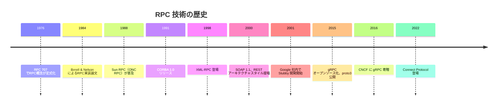
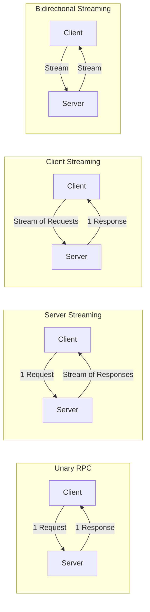
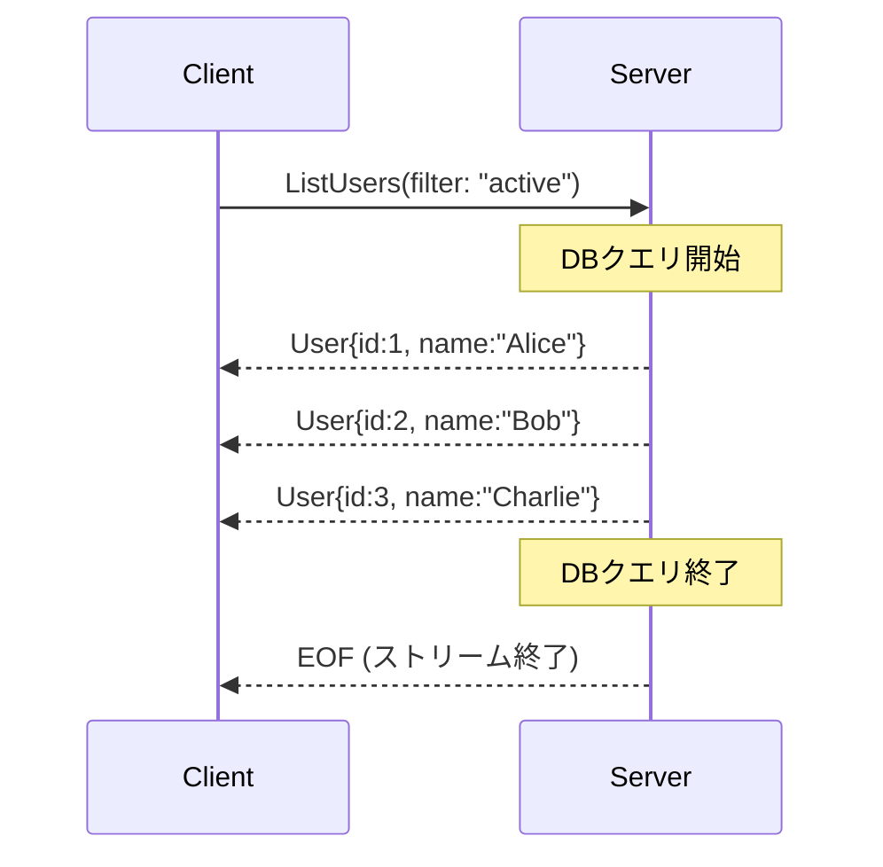
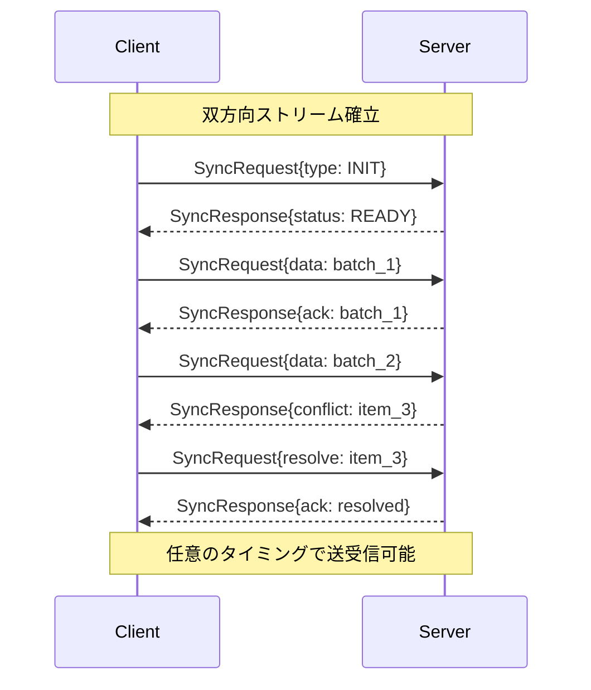
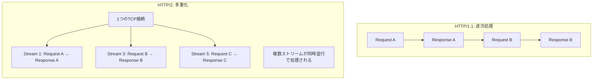
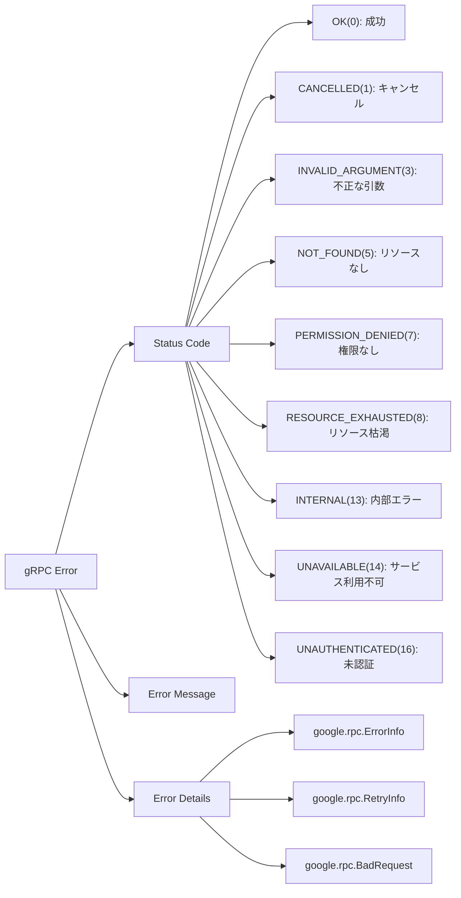
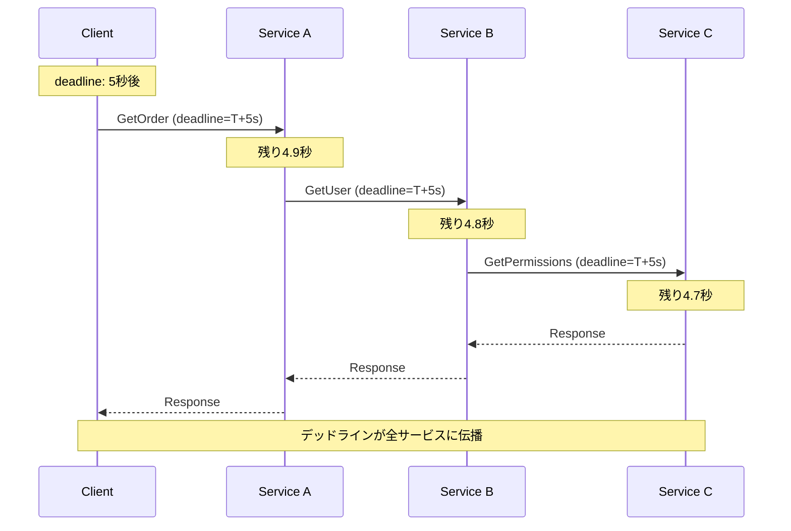
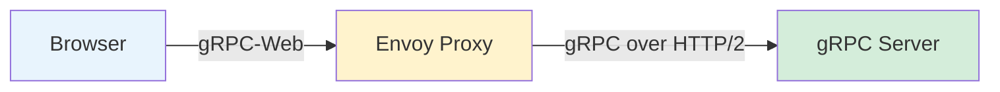
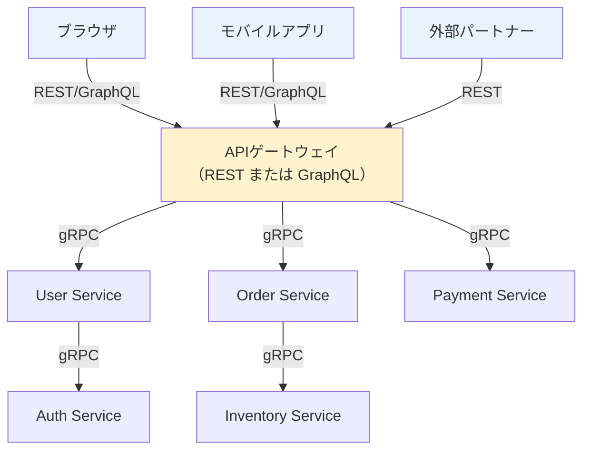

# gRPC と Protocol Buffers

## 1. 歴史的背景

### 1.1 RPC の誕生と進化

分散システムにおいて、別のマシン上で動作するプログラムの関数を呼び出したいという欲求は、コンピュータネットワークの黎明期から存在した。この概念を「Remote Procedure Call（RPC）」と呼ぶ。

RPCの思想を最初に明確に定式化したのは、1976年のRFC 707「A High-Level Framework for Network-Based Resource Sharing」である。その後1984年にNelson と Birrell の論文「Implementing Remote Procedure Calls」がRPCの実装に関する基礎的な枠組みを確立し、以降多くの実装が生まれた。

初期のRPC実装には以下のようなものがある。

**Sun RPC（ONC RPC）**: 1980年代にSun Microsystemsが開発。NFSの基盤として使われ、XDR（External Data Representation）というシリアライゼーション形式を採用した。後にRFC 1831として標準化されている。

**DCE RPC**: Open Software Foundation（OSF）が1990年代に策定した分散コンピューティング環境（DCE）の一部。Microsoftの DCOM や COM+ の基盤となった。

**CORBA（Common Object Request Broker Architecture）**: 1991年にOMG（Object Management Group）が策定したオブジェクト指向のRPCフレームワーク。IDL（Interface Definition Language）によるインターフェース定義、ORB（Object Request Broker）による透明なオブジェクト呼び出しを実現した。

**XML-RPC / SOAP**: インターネットの普及とともに、HTTP上でXMLを使ったRPCが台頭した。XML-RPCは1998年に登場し、その後発展してSOAP（Simple Object Access Protocol）となった。WSDLによるサービス記述、UDDIによるサービス発見と組み合わせた「Webサービス」アーキテクチャが2000年代に主流となった。

しかしSOAPは複雑性が高く、XMLの冗長さによるパフォーマンスの問題も抱えていた。

### 1.2 REST の台頭と限界

2000年にRoy Fieldingがその博士論文でREST（Representational State Transfer）アーキテクチャスタイルを提唱した。HTTPとURIを活用したシンプルなアーキテクチャは、SOAPの複雑さへのアンチテーゼとして歓迎され、2010年代を通じてWebサービスの主流となった。

しかしRESTはあくまでアーキテクチャスタイルであり、厳密な仕様ではない。以下の問題が顕在化してくる。

- **型安全性の欠如**: REST/JSONにはスキーマの強制力がなく、APIの変更による互換性の破壊が検出しにくい
- **双方向通信の困難**: HTTP/1.1のリクエスト/レスポンスモデルはサーバープッシュに向いていない
- **パフォーマンス**: JSONはテキスト形式であり、大量のデータやレイテンシが重要な場面では非効率
- **API仕様の散逸**: OpenAPIなどのツールが後付けで整備されたが、コード生成との連携は不完全

### 1.3 Google の Stubby と gRPC の誕生

Googleは2000年代初頭から、社内の大規模マイクロサービスアーキテクチャのためにStubbyという独自のRPCフレームワークを開発・利用してきた。Stubbyは以下の特性を持っていた。

- Protocol Buffersを使った効率的なシリアライゼーション
- 1週間に数十億件のリクエストを処理する実績
- 多言語対応のコード生成
- 双方向ストリーミングのサポート

2015年、Googleはこの技術をオープンソースとして公開することを決定した。Stubbyをゼロから再設計し、HTTP/2を基盤として採用したのがgRPC（gRPC Remote Procedure Calls）である。同年、Protocol Buffers（proto3）も合わせてオープンソース化された。

gRPCは2016年にCloud Native Computing Foundation（CNCF）に寄贈され、以降KubernetesやEnvoyなどのCNCFプロジェクトのデファクトスタンダードな通信プロトコルとなっている。



## 2. Protocol Buffers

### 2.1 IDL（インターフェース定義言語）としての proto3

Protocol Buffers（protobuf）は、Googleが開発したデータシリアライゼーション形式であり、gRPCにおけるIDL（Interface Definition Language）として機能する。`.proto`ファイルにメッセージとサービスを定義し、そこからコードを自動生成する。

以下に典型的な`.proto`ファイルを示す。

```protobuf
// Define the syntax version (proto3)
syntax = "proto3";

// Package declaration for namespace management
package user.v1;

// Import for well-known types
import "google/protobuf/timestamp.proto";

// Message definition for User
message User {
  uint64 id = 1;
  string name = 2;
  string email = 3;
  UserRole role = 4;
  google.protobuf.Timestamp created_at = 5;
}

// Enum definition for user roles
enum UserRole {
  USER_ROLE_UNSPECIFIED = 0;
  USER_ROLE_ADMIN = 1;
  USER_ROLE_MEMBER = 2;
  USER_ROLE_VIEWER = 3;
}

// Request message for GetUser RPC
message GetUserRequest {
  uint64 user_id = 1;
}

// Service definition with RPC methods
service UserService {
  // Unary RPC
  rpc GetUser(GetUserRequest) returns (User);
  // Server streaming RPC
  rpc ListUsers(ListUsersRequest) returns (stream User);
  // Client streaming RPC
  rpc CreateUsers(stream CreateUserRequest) returns (CreateUsersResponse);
  // Bidirectional streaming RPC
  rpc SyncUsers(stream SyncRequest) returns (stream SyncResponse);
}
```

proto3のフィールドにはフィールド番号（`= 1`、`= 2`など）が割り当てられる。この番号はシリアライゼーション時にフィールドを識別するために使われ、スキーマ進化において非常に重要な役割を果たす。

### 2.2 バイナリエンコーディングの仕組み

Protocol Buffersのシリアライゼーションは、TLV（Type-Length-Value）に似た可変長エンコーディングを採用している。ただし実際にはフィールド番号とワイヤータイプを組み合わせた「タグ」をキーとして使う。

各フィールドはタグ（tag）とペイロード（payload）から構成される。

```
タグ = (フィールド番号 << 3) | ワイヤータイプ
```

ワイヤータイプには以下の種類がある。

| ワイヤータイプ | 値 | 用途 |
|---|---|---|
| Varint | 0 | int32, int64, uint32, uint64, sint32, sint64, bool, enum |
| 64-bit | 1 | fixed64, sfixed64, double |
| Length-delimited | 2 | string, bytes, embedded messages, packed repeated fields |
| 32-bit | 5 | fixed32, sfixed32, float |

**Varint エンコーディング**

数値は可変長整数（Varint）でエンコードされる。各バイトの最上位ビット（MSB）を継続フラグとして使用し、残り7ビットにデータを格納する。これにより小さな数値は少ないバイトで表現できる。

```
300 のエンコード:
300 = 0b100101100

Step 1: 7ビットずつ分割
  下位7ビット: 0101100 (44)
  上位7ビット: 0000010 (2)

Step 2: 継続フラグを付加
  最初のバイト: 1_0101100 = 0xAC (まだ続くのでMSB=1)
  最後のバイト: 0_0000010 = 0x02 (終わりなのでMSB=0)

Result: [0xAC, 0x02]
```

この設計により、0〜127の範囲の整数は1バイトで表現できる。ログIDやステータスコードなど、小さな値が多い実際のデータに対して非常に効率的である。

**具体的なエンコード例**

```
message User {
  uint64 id = 1;    // field number 1, wire type 0 (Varint)
  string name = 2;  // field number 2, wire type 2 (Length-delimited)
}

User{ id: 1, name: "Alice" } のエンコード:

フィールド id=1:
  タグ = (1 << 3) | 0 = 0x08
  値   = 0x01
  → [0x08, 0x01]

フィールド name="Alice":
  タグ   = (2 << 3) | 2 = 0x12
  長さ   = 5 (Aliceは5バイト)
  データ = [0x41, 0x6c, 0x69, 0x63, 0x65]
  → [0x12, 0x05, 0x41, 0x6c, 0x69, 0x63, 0x65]

全体: [0x08, 0x01, 0x12, 0x05, 0x41, 0x6c, 0x69, 0x63, 0x65]
合計9バイト
```

```mermaid
graph TD
    A["User{id:1, name:'Alice'}"] --> B[Protocol Buffers エンコード]
    B --> C["[0x08, 0x01, 0x12, 0x05, 0x41, 0x6c, 0x69, 0x63, 0x65]<br/>9 bytes"]

    D["User{id:1, name:'Alice'}"] --> E[JSON エンコード]
    E --> F["{\"id\":1,\"name\":\"Alice\"}<br/>23 bytes"]

    style C fill:#d4edda
    style F fill:#fff3cd
```

### 2.3 スキーマ進化と互換性

Protocol Buffersの最大の強みの一つが、**後方互換性と前方互換性を同時に保ちながらスキーマを進化させられる**ことである。

**後方互換性（Backward Compatibility）**: 新しいコードが古いデータを読める
**前方互換性（Forward Compatibility）**: 古いコードが新しいデータを読める（不明なフィールドを無視する）

この互換性を保つためのルールは以下の通りである。

::: tip スキーマ進化の安全なパターン
- **新しいフィールドを追加**: 既存のフィールド番号を使わなければ安全
- **フィールドを削除**: フィールド番号を `reserved` として予約し、将来再利用しないようにする
- **フィールド名を変更**: フィールド番号が変わらない限りシリアライゼーションへの影響なし（ただしコード生成に影響）
:::

::: danger スキーマ進化の危険なパターン
- **フィールド番号を変更**: 互換性が失われる
- **フィールドの型を変更**: ワイヤータイプが変わると互換性が失われる（例: int32 → string）
- **削除したフィールド番号を再利用**: 古いデータとの混乱を引き起こす
:::

`reserved` キーワードを使った安全な削除の例：

```protobuf
message User {
  // Fields 3 and 4 were removed; reserve their numbers and names
  reserved 3, 4;
  reserved "phone", "address";

  uint64 id = 1;
  string name = 2;
  string email = 5;  // New field added with a new number
}
```

### 2.4 JSON との比較

Protocol BuffersとJSONの比較を整理する。

| 比較項目 | Protocol Buffers | JSON |
|---|---|---|
| 形式 | バイナリ | テキスト |
| 人間による可読性 | 不可（ツールが必要） | 可能 |
| スキーマ | 必須（`.proto`ファイル） | オプション（JSONSchema等） |
| 型安全性 | 強（コンパイル時検査） | 弱（実行時エラー） |
| シリアライズサイズ | 小（3〜10倍コンパクト） | 大 |
| シリアライズ速度 | 高速（5〜10倍） | 低速 |
| 後方互換性 | 設計に組み込まれている | 慣習に依存 |
| ブラウザサポート | 要変換（gRPC-Web等） | ネイティブ |
| デバッグ | ツール必須 | 容易 |
| コード生成 | ネイティブサポート | 外部ツール（OpenAPI等） |

Protocol Buffersはデバッグの難しさをトレードオフとして受け入れる代わりに、パフォーマンス、型安全性、スキーマ進化という大きなメリットを得る。

なお、Protocol BuffersはJSON変換も公式でサポートしており、デバッグ時には`protojson`ライブラリでJSON形式に変換して確認することができる。

## 3. gRPC の通信モデル

gRPCは4種類の通信パターンをサポートしている。これはHTTP/2のストリーミング機能を活用したものである。



### 3.1 Unary RPC

最も基本的なパターンで、クライアントが1つのリクエストを送り、サーバーが1つのレスポンスを返す。通常のHTTP REST APIと同様のセマンティクスである。

```protobuf
// Simple unary RPC definition
rpc GetUser(GetUserRequest) returns (User);
```

```go
// Server implementation in Go
func (s *UserServer) GetUser(ctx context.Context, req *pb.GetUserRequest) (*pb.User, error) {
    // Fetch user from database
    user, err := s.db.GetUser(ctx, req.UserId)
    if err != nil {
        return nil, status.Errorf(codes.NotFound, "user not found: %v", err)
    }
    return user, nil
}

// Client call in Go
user, err := client.GetUser(ctx, &pb.GetUserRequest{UserId: 42})
```

Unary RPCは、ほとんどのCRUD操作に適している。シンプルで理解しやすく、デバッグも容易なため、特別な理由がない限りまずこのパターンを選ぶのが望ましい。

### 3.2 Server Streaming RPC

クライアントが1つのリクエストを送り、サーバーが一連のレスポンスをストリームで返すパターン。大量データの配信、リアルタイムイベント通知、ログストリーミングなどに適している。

```protobuf
// Server streaming: server sends multiple responses
rpc ListUsers(ListUsersRequest) returns (stream User);
rpc WatchEvents(WatchRequest) returns (stream Event);
```

```go
// Server implementation for streaming
func (s *UserServer) ListUsers(req *pb.ListUsersRequest, stream pb.UserService_ListUsersServer) error {
    // Stream users one by one from database
    rows, err := s.db.QueryUsers(stream.Context(), req.Filter)
    if err != nil {
        return status.Errorf(codes.Internal, "query failed: %v", err)
    }
    defer rows.Close()

    for rows.Next() {
        user := rows.Scan()
        if err := stream.Send(user); err != nil {
            return err // Client disconnected
        }
    }
    return nil
}

// Client receiving the stream
stream, err := client.ListUsers(ctx, &pb.ListUsersRequest{})
for {
    user, err := stream.Recv()
    if err == io.EOF {
        break // Stream ended normally
    }
    if err != nil {
        log.Fatalf("stream error: %v", err)
    }
    process(user)
}
```



### 3.3 Client Streaming RPC

クライアントが一連のリクエストをストリームで送り、サーバーがすべてを受信してから1つのレスポンスを返すパターン。大きなファイルのアップロード、バッチ処理、集計などに適している。

```protobuf
// Client streaming: client sends multiple requests
rpc CreateUsers(stream CreateUserRequest) returns (CreateUsersResponse);
rpc UploadFile(stream FileChunk) returns (UploadResult);
```

```go
// Server implementation for client streaming
func (s *UserServer) CreateUsers(stream pb.UserService_CreateUsersServer) error {
    var createdCount int32

    for {
        req, err := stream.Recv()
        if err == io.EOF {
            // All requests received; send single response
            return stream.SendAndClose(&pb.CreateUsersResponse{
                CreatedCount: createdCount,
            })
        }
        if err != nil {
            return err
        }
        // Process each user creation
        if err := s.db.CreateUser(stream.Context(), req.User); err != nil {
            return status.Errorf(codes.Internal, "create failed: %v", err)
        }
        createdCount++
    }
}
```

### 3.4 Bidirectional Streaming RPC

クライアントとサーバーの両方が独立してストリームを持ち、任意のタイミングでメッセージを送受信できるパターン。チャットアプリケーション、リアルタイム協調編集、双方向データ同期などに適している。

```protobuf
// Bidirectional streaming
rpc Chat(stream ChatMessage) returns (stream ChatMessage);
rpc SyncData(stream SyncRequest) returns (stream SyncResponse);
```

```go
// Server implementation for bidirectional streaming
func (s *ChatServer) Chat(stream pb.ChatService_ChatServer) error {
    for {
        msg, err := stream.Recv()
        if err == io.EOF {
            return nil
        }
        if err != nil {
            return err
        }

        // Broadcast to other participants and send responses
        response := s.broadcastAndRespond(msg)
        if err := stream.Send(response); err != nil {
            return err
        }
    }
}
```



4つのパターンの使い分けは以下の通りである。

| パターン | クライアント送信 | サーバー送信 | 主なユースケース |
|---|---|---|---|
| Unary | 1メッセージ | 1メッセージ | CRUD操作、認証 |
| Server Streaming | 1メッセージ | 複数メッセージ | データ配信、イベント通知 |
| Client Streaming | 複数メッセージ | 1メッセージ | ファイルアップロード、バッチ処理 |
| Bidirectional | 複数メッセージ | 複数メッセージ | チャット、リアルタイム同期 |

## 4. HTTP/2 との関係

### 4.1 なぜ HTTP/2 が選ばれたか

gRPCがHTTP/2を基盤として採用した理由は、HTTP/2が持つ以下の特性がRPCフレームワークの要件に完全に合致していたからである。

- **ストリーム多重化**: 1つのTCP接続上で複数のリクエスト/レスポンスを並行して処理できる
- **ヘッダ圧縮**: HPACK圧縮により、繰り返し送信されるヘッダのオーバーヘッドを削減できる
- **フロー制御**: 接続レベルとストリームレベルの両方でフロー制御が組み込まれている
- **サーバープッシュ**: サーバーからクライアントへの能動的なデータ送信が可能（gRPCは主にServer Streamingで活用）
- **バイナリフレーミング**: テキストではなくバイナリで通信するため、効率的なパース処理が可能

### 4.2 多重化（Multiplexing）

HTTP/1.1の最大の問題の一つが「ヘッドオブラインブロッキング（Head-of-Line Blocking）」である。1つのTCP接続では同時に1つのリクエストしか処理できないため、前のリクエストの応答を待つ間、後続のリクエストがブロックされてしまう。

HTTP/1.1では「パイプライニング」という機能で複数リクエストの送信は可能だが、レスポンスは送信順に返さなければならないため、実際にはほとんど活用されなかった。

HTTP/2はストリームという概念を導入し、1つのTCP接続上で複数のリクエスト/レスポンスを同時並行で処理できる。



gRPCにおいて、この多重化は非常に重要である。マイクロサービス間で多数のRPCが同時に発生する環境でも、1つのTCP接続（と1つのTLSハンドシェイク）を共有できるため、接続確立のオーバーヘッドが大幅に削減される。

### 4.3 ヘッダ圧縮（HPACK）

HTTP/2はHPACK（RFC 7541）という圧縮アルゴリズムを採用している。HPACKの特徴は以下の通りである。

1. **静的テーブル**: よく使われるヘッダ名と値のペアをあらかじめ定義したテーブル（61エントリ）
2. **動的テーブル**: 通信中に送受信したヘッダを記録し、以降の通信で索引として参照できる
3. **ハフマン符号化**: ヘッダ値の文字列をハフマン符号化で圧縮

gRPCのヘッダには、`content-type: application/grpc`、`grpc-encoding`、`grpc-timeout`などの独自ヘッダが含まれる。これらも動的テーブルに記録され、繰り返し使用する際のオーバーヘッドが削減される。

### 4.4 フロー制御

HTTP/2には2レベルのフロー制御が組み込まれている。

**接続レベルのフロー制御**: 1つのTCP接続全体に対するウィンドウサイズを制御する。デフォルトは65,535バイト。

**ストリームレベルのフロー制御**: 各ストリーム（各RPC呼び出し）に対するウィンドウサイズを制御する。

受信側は`WINDOW_UPDATE`フレームを送ることでウィンドウサイズを増加させ、送信側はウィンドウサイズを超えてデータを送ることができない。これにより、処理能力を超えたデータが流れ込むことを防ぐ。

gRPCはこのフロー制御の上に独自のフロー制御レイヤーを持たない。HTTP/2の標準フロー制御に従うことで、バックプレッシャー（背圧）のメカニズムが自然に実現される。例えばServer Streaming RPCでサーバーがクライアントより速くデータを生成する場合、ウィンドウサイズが0になるとサーバーは自動的に送信を止め、クライアントがデータを処理してウィンドウを広げるまで待機する。

### 4.5 gRPC のフレーム構造

gRPCはHTTP/2のDATAフレームの上に独自の5バイトヘッダを追加する。

```
+---------------------------------------------------------------+
| Compressed-Flag (1 byte, 0 = no compression, 1 = compressed)  |
+---------------------------------------------------------------+
| Message-Length (4 bytes, big-endian uint32)                   |
+---------------------------------------------------------------+
| Message (Message-Length bytes, Protocol Buffers encoded)      |
+---------------------------------------------------------------+
```

このシンプルな構造により、1つのHTTP/2 DATAフレームに複数のgRPCメッセージが含まれる場合も、単一のgRPCメッセージが複数のDATAフレームに分割される場合も正確に処理できる。

## 5. 実装と運用

### 5.1 コード生成

gRPCの開発フローの中心は`.proto`ファイルからのコード生成である。`protoc`コンパイラと各言語のプラグインを使用する。

```bash
# Install protoc compiler and Go plugins
go install google.golang.org/protobuf/cmd/protoc-gen-go@latest
go install google.golang.org/grpc/cmd/protoc-gen-go-grpc@latest

# Generate Go code from .proto file
protoc \
  --go_out=. \
  --go_opt=paths=source_relative \
  --go-grpc_out=. \
  --go-grpc_opt=paths=source_relative \
  user/v1/user.proto
```

生成されたコードには以下が含まれる。

- **メッセージ型**: Protocol Buffersのメッセージに対応した構造体と、シリアライゼーション/デシリアライゼーションのコード
- **サーバーインターフェース**: 実装すべきメソッドを定義したインターフェース
- **クライアントスタブ**: サーバーへの呼び出しをラップしたクライアントコード

主要な言語でのサポート状況：

| 言語 | サポート状況 | 主要ライブラリ |
|---|---|---|
| Go | 公式サポート | google.golang.org/grpc |
| Java / Kotlin | 公式サポート | grpc-java |
| Python | 公式サポート | grpcio |
| C++ | 公式サポート（コアライブラリ） | grpc++ |
| C# / .NET | 公式サポート | Grpc.AspNetCore |
| Node.js | 公式サポート | @grpc/grpc-js |
| Ruby | 公式サポート | grpc gem |
| Rust | コミュニティ | tonic |
| Swift | コミュニティ | grpc-swift |

### 5.2 インターセプタ（Interceptor）

gRPCのインターセプタは、RPCの前後に処理を挿入する仕組みである。ミドルウェアと同様の役割を果たし、認証、ロギング、メトリクス収集、レート制限などの横断的関心事（Cross-Cutting Concerns）を実装するために使われる。

**Unary インターセプタ**

```go
// Logging interceptor for unary RPCs
func loggingUnaryInterceptor(
    ctx context.Context,
    req interface{},
    info *grpc.UnaryServerInfo,
    handler grpc.UnaryHandler,
) (interface{}, error) {
    start := time.Now()

    // Call the actual handler
    resp, err := handler(ctx, req)

    // Log the RPC call details
    log.Printf("method=%s duration=%s error=%v",
        info.FullMethod,
        time.Since(start),
        err,
    )
    return resp, err
}

// Register interceptor when creating server
server := grpc.NewServer(
    grpc.UnaryInterceptor(loggingUnaryInterceptor),
)
```

**複数インターセプタのチェーン**

```go
// Chain multiple interceptors (using grpc-middleware)
import grpcmiddleware "github.com/grpc-ecosystem/go-grpc-middleware"

server := grpc.NewServer(
    grpc.ChainUnaryInterceptor(
        authInterceptor,      // Authentication first
        rateLimitInterceptor, // Then rate limiting
        loggingInterceptor,   // Then logging
        tracingInterceptor,   // Then distributed tracing
    ),
)
```

インターセプタは実行順に積み重なり、オニオン構造を形成する。リクエスト時は最初に登録したインターセプタから順に実行され、レスポンス時は逆順に実行される。

### 5.3 エラーハンドリング

gRPCには標準化されたエラーコード体系がある。HTTPのステータスコードと対応付けて理解できる。



エラーの実装例：

```go
import (
    "google.golang.org/grpc/codes"
    "google.golang.org/grpc/status"
    errdetails "google.golang.org/genproto/googleapis/rpc/errdetails"
)

func (s *UserServer) GetUser(ctx context.Context, req *pb.GetUserRequest) (*pb.User, error) {
    if req.UserId == 0 {
        // Return structured error with details
        st := status.New(codes.InvalidArgument, "user_id must be positive")
        st, _ = st.WithDetails(&errdetails.BadRequest{
            FieldViolations: []*errdetails.BadRequest_FieldViolation{
                {
                    Field:       "user_id",
                    Description: "user_id must be a positive integer",
                },
            },
        })
        return nil, st.Err()
    }

    user, err := s.db.GetUser(ctx, req.UserId)
    if errors.Is(err, ErrNotFound) {
        return nil, status.Errorf(codes.NotFound, "user %d not found", req.UserId)
    }
    if err != nil {
        return nil, status.Errorf(codes.Internal, "internal error: %v", err)
    }

    return user, nil
}
```

gRPCのエラーコードとHTTPステータスコードのマッピング（gRPC-Web等での変換で使われる）：

| gRPC Code | HTTP Status | 意味 |
|---|---|---|
| OK | 200 | 成功 |
| INVALID_ARGUMENT | 400 | クライアントエラー |
| UNAUTHENTICATED | 401 | 認証エラー |
| PERMISSION_DENIED | 403 | 認可エラー |
| NOT_FOUND | 404 | リソース不在 |
| RESOURCE_EXHAUSTED | 429 | レート制限 |
| INTERNAL | 500 | サーバーエラー |
| UNAVAILABLE | 503 | サービス不可 |

### 5.4 デッドライン（Deadline）とキャンセル

gRPCでは、すべてのRPC呼び出しにデッドライン（タイムアウト）を設定することが推奨される。デッドラインは「このRPCはいつまでに完了すべきか」という絶対時刻で表現される。

```go
// Set deadline for the RPC call
ctx, cancel := context.WithTimeout(context.Background(), 5*time.Second)
defer cancel()

user, err := client.GetUser(ctx, &pb.GetUserRequest{UserId: 42})
if err != nil {
    st := status.FromContextError(err) // Check if deadline exceeded
    if st.Code() == codes.DeadlineExceeded {
        log.Printf("RPC timed out")
    }
}
```

デッドラインはgRPCによって自動的に後続のRPCに伝播される。サービスAがサービスBを呼び出し、サービスBがサービスCを呼び出す場合、最初のデッドラインがすべてのRPCに引き継がれる。残り時間が不十分な場合、途中のサービスがRPCを試みる前に`DEADLINE_EXCEEDED`を返すことで、無駄な処理を防ぐことができる。



### 5.5 認証とメタデータ

gRPCの認証はHTTP/2のメタデータ（ヘッダ）を通じて実装される。

```go
// Client: attach authentication token via metadata
md := metadata.New(map[string]string{
    "authorization": "Bearer " + token,
})
ctx := metadata.NewOutgoingContext(context.Background(), md)

user, err := client.GetUser(ctx, req)
```

```go
// Server interceptor: validate token from metadata
func authInterceptor(ctx context.Context, req interface{}, info *grpc.UnaryServerInfo, handler grpc.UnaryHandler) (interface{}, error) {
    md, ok := metadata.FromIncomingContext(ctx)
    if !ok {
        return nil, status.Error(codes.Unauthenticated, "missing metadata")
    }

    authHeader := md.Get("authorization")
    if len(authHeader) == 0 {
        return nil, status.Error(codes.Unauthenticated, "missing authorization header")
    }

    // Validate token
    claims, err := validateToken(authHeader[0])
    if err != nil {
        return nil, status.Errorf(codes.Unauthenticated, "invalid token: %v", err)
    }

    // Attach claims to context for downstream handlers
    ctx = context.WithValue(ctx, userClaimsKey, claims)
    return handler(ctx, req)
}
```

また、gRPCはTLS（トランスポートレイヤーセキュリティ）のネイティブサポートも持つ。本番環境では常にTLSを有効にすることが推奨される。

### 5.6 サービスリフレクションとヘルスチェック

gRPCにはサービスの自己記述機能として「サーバーリフレクション」が標準仕様として定義されている。これを有効にすると、`grpcurl`などのツールがスキーマ情報なしにgRPCサービスを探索・呼び出しできる。

```go
// Enable server reflection for debugging
import "google.golang.org/grpc/reflection"

server := grpc.NewServer()
pb.RegisterUserServiceServer(server, &userServer{})
reflection.Register(server) // Enable reflection
```

```bash
# List available services using grpcurl
grpcurl -plaintext localhost:50051 list

# Describe a service
grpcurl -plaintext localhost:50051 describe user.v1.UserService

# Call an RPC
grpcurl -plaintext -d '{"user_id": 42}' localhost:50051 user.v1.UserService/GetUser
```

ヘルスチェックについては、gRPCのヘルスチェックプロトコル（`grpc.health.v1`）が標準化されており、KubernetesのLiveness/Readiness Probeとの連携が容易である。

## 6. gRPC-Web と Connect Protocol

### 6.1 ブラウザでの gRPC の課題

gRPCはHTTP/2を直接使用するが、ブラウザのJavaScript環境には制限がある。

- **fetch APIとXHRの制限**: ブラウザのfetch APIとXMLHttpRequestは、HTTP/2のストリームを直接制御する能力を持たない
- **Trailer Headersの未サポート**: gRPCはHTTP/2のTrailer Headersにステータスコードとメタデータをエンコードするがあ、ブラウザはTrailerを読み取れない
- **バイナリデータの扱い**: ブラウザ環境でのバイナリプロトコルの扱いには追加の実装が必要

### 6.2 gRPC-Web

gRPC-Webは、これらの制限を克服するためにGoogleが策定したプロトコルである。主な変更点は以下の通り。

- **Trailerのエンコード**: HTTP/2のTrailerをHTTPボディの末尾に「Trailerフレーム」としてエンコードする
- **プロキシの使用**: ブラウザからgRPC-Webのリクエストを受け取り、バックエンドのgRPCサービスに変換するプロキシ（EnvoyまたはGrpc-Web-Proxy）が必要
- **ストリーミングの制限**: Client StreamingとBidirectional Streamingはサポートされない（Unary RPCとServer Streamingのみ）



### 6.3 Connect Protocol

Connect ProtocolはBuf社が2022年に発表した、gRPCの問題点を解消しようとした新しいRPCプロトコルである。

**Connect Protocolの特徴**:

- **3つのプロトコルモード**: Connect Protocol（デフォルト）、gRPC、gRPC-Webの3種類を1つのサーバーが同時にサポート
- **ブラウザファーストの設計**: プロキシなしでブラウザから直接利用可能
- **HTTP/1.1との互換性**: Unary RPCはHTTP/1.1でも動作
- **JSONファーストのデバッグ**: curl等の一般的なHTTPツールで直接利用可能

```bash
# Connect Protocol では curl で直接 gRPC サービスを呼び出せる
curl \
  --header "Content-Type: application/json" \
  --data '{"user_id": 42}' \
  https://api.example.com/user.v1.UserService/GetUser
```

ConnectはBuf CLI（`buf`）と組み合わせることで、`.proto`ファイルからConnect対応のクライアント/サーバーコードを生成できる。TypeScript/JavaScript向けの`connect-web`ライブラリはブラウザでのgRPC利用の難しさを大幅に解消した。

```typescript
// TypeScript client using Connect
import { createConnectTransport } from "@connectrpc/connect-web";
import { createClient } from "@connectrpc/connect";
import { UserService } from "./gen/user/v1/user_connect";

const transport = createConnectTransport({
  baseUrl: "https://api.example.com",
});

const client = createClient(UserService, transport);

// Call a unary RPC
const user = await client.getUser({ userId: 42n });

// Server streaming
for await (const user of client.listUsers({ filter: "active" })) {
  console.log(user.name);
}
```

## 7. REST / GraphQL との比較と使い分け

### 7.1 gRPC vs REST

gRPCとRESTは根本的に異なる設計哲学を持つ。RESTはリソース指向であり、gRPCはアクション指向（手続き呼び出し）である。

| 比較項目 | gRPC | REST |
|---|---|---|
| 設計パラダイム | アクション指向（RPC） | リソース指向 |
| プロトコル | HTTP/2 | HTTP/1.1, HTTP/2 |
| データ形式 | Protocol Buffers（バイナリ） | JSON（テキスト）が主流 |
| スキーマ | 必須（.proto） | オプション（OpenAPI等） |
| コード生成 | ネイティブ | ツールが必要（OpenAPI Generator等） |
| ブラウザサポート | 制限あり（gRPC-Webが必要） | ネイティブ |
| 人間による可読性 | 低（ツール必要） | 高 |
| ストリーミング | 4パターンのネイティブサポート | WebSocketが別途必要 |
| パフォーマンス | 高（バイナリ、HTTP/2） | 中（テキスト、HTTP/1.1が多い） |
| エコシステム | 成長中 | 成熟している |
| 学習コスト | 高め | 低め |

**gRPC が向いているシナリオ**:
- マイクロサービス間の内部通信
- レイテンシとスループットが重要な場面
- 多言語環境での型安全なAPI
- リアルタイムストリーミングが必要な場合
- 大量のAPI呼び出しが発生する場合（接続の多重化で効率化）

**REST が向いているシナリオ**:
- ブラウザからの直接アクセスが必要なパブリックAPI
- シンプルなCRUDアプリケーション
- キャッシュ機能を活用したい場合（HTTPキャッシュヘッダ）
- APIを手動で探索・テストしたい場合
- クライアント側の言語やフレームワークが多様で未知の場合

### 7.2 gRPC vs GraphQL

GraphQLはFacebookが2015年に公開したAPIクエリ言語で、クライアントが必要なデータを正確に指定できる柔軟性が特徴である。

| 比較項目 | gRPC | GraphQL |
|---|---|---|
| データ取得の柔軟性 | 固定（サーバーが決定） | 高い（クライアントが指定） |
| Over-fetching | 発生しうる | 解消（必要なフィールドのみ） |
| Under-fetching | N+1問題は発生しうる | 1リクエストで複数リソース取得可能 |
| スキーマ | Protocol Buffers | GraphQL SDL |
| ストリーミング | ネイティブサポート | GraphQL Subscriptionsが必要 |
| ブラウザサポート | 制限あり | ネイティブ（HTTP POST） |
| パフォーマンス | 高い | 中程度（クエリの解析コスト）|
| 主なユースケース | サービス間通信 | フロントエンドAPI（BFF等） |

**GraphQL が向いているシナリオ**:
- フロントエンドがさまざまなデータ組み合わせを動的に必要とする場合
- BFF（Backend For Frontend）パターン
- クライアントのデータ要件が多様で変化しやすい場合
- モバイルアプリで帯域幅を最小化したい場合

**実際のアーキテクチャでの組み合わせ**:

多くの大規模システムでは、gRPCとREST（またはGraphQL）を組み合わせて使う。



このパターンでは、外部向け（パブリック）APIはRESTやGraphQLで提供し、内部のマイクロサービス間通信にはgRPCを使うことで、両者の利点を組み合わせる。

## 8. 将来の展望

### 8.1 HTTP/3（QUIC）上の gRPC

HTTP/2はTCP上で動作するため、TCPのヘッドオブラインブロッキングが残る問題がある。HTTP/2は複数のHTTPストリームを多重化するが、これらは単一のTCPコネクション上に乗っているため、パケットロスが発生すると全ストリームがブロックされる。

HTTP/3はUDP上に構築されたQUICトランスポートプロトコルを使用し、この問題を解消する。gRPCのHTTP/3サポートも検討・開発が進んでいる。

- **ストリームごとのヘッドオブラインブロッキング解消**: QUICではストリームが独立しており、1つのストリームのパケットロスが他のストリームに影響しない
- **0-RTTハンドシェイク**: QUICは0-RTTまたは1-RTTのハンドシェイクをサポートし、接続確立の遅延をさらに削減
- **コネクションマイグレーション**: IPアドレスが変わってもコネクションIDで接続を維持できる（モバイル環境で有効）

### 8.2 Buf エコシステムの発展

Buf社はProtocol BuffersのツールチェーンとConnect Protocolの普及に取り組んでいる。Buf CLIはすでに多くの開発チームで標準的なツールとなっており、以下の機能を提供する。

- **`buf lint`**: `.proto`ファイルのスタイルと互換性のルールチェック
- **`buf breaking`**: バージョン間のbreaking changeを自動検出
- **`buf generate`**: 設定ファイルベースのコード生成
- **Buf Schema Registry（BSR）**: `.proto`ファイルのプライベート/パブリックレジストリ

### 8.3 gRPC の普及と標準化

gRPCは当初はGoogleとCNCFエコシステムの中心だったが、現在ではより広く採用されている。

- **クラウドプロバイダーのサポート**: AWS、GCP、AzureはすべてgRPCのネイティブサポートを提供（ロードバランサ、API Gateway等）
- **サービスメッシュとの統合**: Istio、Linkerd、EnvoyなどのサービスメッシュはgRPCを一級市民として扱い、自動的なTLS、サーキットブレーカー、メトリクス収集を提供
- **モバイルとIoT**: gRPCのバイナリ効率と双方向ストリーミングは、帯域制限のある環境でも有利

### 8.4 スキーマファーストの再評価

REST APIの世界でOpenAPI（Swagger）が後付けで整備されたように、gRPCは最初からスキーマファーストのアプローチを強制する。この設計の正しさは、APIファーストという考え方が広く認識されるにつれて再評価されている。

Protocol Buffersのスキーマは単なるデータ定義を超え、APIコントラクトとして機能する。チームが増え、サービスが増えるほど、明確なコントラクトの価値は増大する。

gRPCとProtocol Buffersは、マイクロサービスアーキテクチャが一般化した現代のソフトウェア開発において、特にサービス間通信の標準として確固たる地位を確立している。HTTPとJSONが完全に置き換わることはないが、型安全性、パフォーマンス、スキーマ進化という点でgRPCが解決した問題の本質的な価値は、今後も色あせることはないだろう。

## まとめ

gRPCとProtocol Buffersは、分散システムにおける通信の効率性と型安全性を大幅に向上させる技術的基盤を提供する。

**Protocol Buffersが解決した問題**:
- JSONの冗長さによるネットワーク帯域の無駄
- スキーマなしAPIの型安全性の欠如
- スキーマ変更時の互換性管理の困難

**gRPCが解決した問題**:
- HTTP/1.1の逐次処理によるパフォーマンスの限界
- 双方向ストリーミングの困難
- 多言語マイクロサービス間の型安全な通信
- コード生成によるAPI仕様と実装の乖離

ただし、gRPCは万能ではない。ブラウザサポートの制限、デバッグの難しさ、学習コストなどのトレードオフが存在する。REST、GraphQL、gRPCをシステムの要件に応じて適切に選択し、場合によっては組み合わせることが現実的な設計判断となる。

gRPCの本質的な価値は「プロトコルの選択」ではなく、「スキーマファーストで型安全なサービス間通信の設計原則」にある。この原則を理解した上でgRPCを活用することが、大規模な分散システムの信頼性と保守性の向上につながる。
